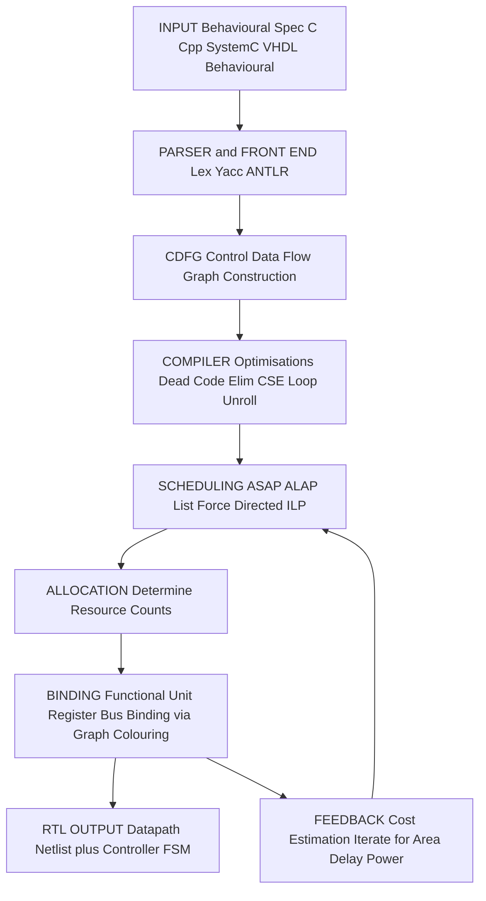
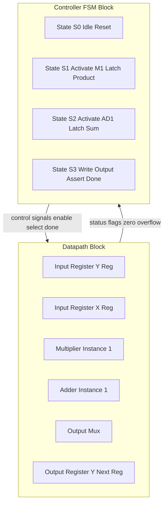
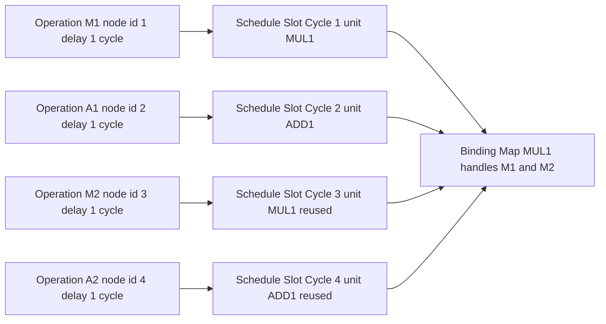

# Behavioural Synthesis

<!-- SECTION_1_START -->
# Behavioural Synthesis — Core Definition & Intuitive Overview

## Formal Academic Definition (KTU 2024 Syllabus Terminology)

**Behavioural Synthesis**, also called **High-Level Synthesis (HLS)** or **Algorithmic Synthesis**, is the automated design task that transforms a **behavioural (algorithmic) specification** of a digital system into a **Register-Transfer Level (RTL) structural description**, which can subsequently be synthesized into a gate-level netlist.

The behavioural input is an *untimed* or *partially timed* algorithmic description (e.g., a C/C++/SystemC model, or a behavioural VHDL/Verilog module using `wait`, `process`, or `always` blocks), while the RTL output is a *fully timed* netlist of **datapath components** (adders, multipliers, registers, multiplexers, buses) and a **controller finite-state machine (FSM)** that orchestrates the data movement across clock cycles.

> [!IMPORTANT]
> **Syllabus Highlight (PECST415 / Module 2):** Behavioural synthesis occupies the *highest* level of abstraction in the VLSI design hierarchy. It is the bridge that converts *what the circuit must compute* into *how it computes it cycle-by-cycle* using real hardware resources.

## Conceptual Analogy — "The Restaurant Kitchen"

Imagine a head chef who receives only a **recipe** (the behavioural description: *“boil water, add pasta, stir for 8 minutes, drain, serve”*).

- The **chef is the behavioural synthesizer**.
- The recipe does **not** say *which pot*, *which stove burner*, or *how many helpers* are needed.
- The chef must decide: how many burners to light in parallel, which helpers take which tasks, the timing of each task, and how pots are shared.
- The final **executable plan** (who does what, when, on which equipment) is the **RTL description** (datapath + controller).

Just like the chef, the HLS tool takes a *purely functional* description and must invent:
1. A **clocking schedule** (which cycle does each operation occur?)
2. A **resource allocation** (how many ALUs, multipliers, registers?)
3. A **binding/assignment** (which physical unit executes which operation?)

## The Design Abstraction Stack

Modern VLSI design progresses through **five canonical abstraction levels**. Behavioural synthesis sits between Levels 1 and 2.

| Level | Abstraction | Description | Input → Output |
|:-----:|:-----------:|:------------|:--------------:|
| **L1** | Behavioural / Algorithmic | Pure functionality, no clock | Algorithm → Algorithm |
| **L2** | Register-Transfer (RTL) | Cycle-accurate, structural | Behaviour → RTL |
| **L3** | Logic / Gate | Boolean equations | RTL → Netlist |
| **L4** | Circuit / Transistor | Transistor netlist | Gate → Schematic |
| **L5** | Physical / Layout | Geometry (GDSII) | Netlist → Mask data |

## Key Terminology Glossary

> [!NOTE]
> **Must-Know Terms for KTU Board Examination**
> - **CDFG** — Control Data Flow Graph: the intermediate representation of the algorithm.
> - **Scheduling** — assigning each operation to a specific clock cycle (time dimension).
> - **Allocation** — deciding the *quantity* of each hardware resource type.
> - **Binding** — assigning each operation to a specific allocated resource instance.
> - **RTL** — Register Transfer Level, the structural output of HLS.
> - **Latency** — total clock cycles from input to output.
> - **Initiation Interval (II)** — gap between two successive inputs in a pipelined design.

## Visualization — Scheduling a Simple Chain

> [!VISUALIZATION CONTROL]
> **Concept:** Time-axis scheduling of three operations $a$, $b$, $c$ with a single functional unit.
> **GeoGebra / Desmos Input Equations:**
> * $x_{a}(c) = 1 \text{ if } c = 1 \text{ else } 0$
> * $x_{b}(c) = 1 \text{ if } c = 2 \text{ else } 0$
> * $x_{c}(c) = 1 \text{ if } c = 3 \text{ else } 0$
> **Visual Description:** A 3-cycle staircase where operation $a$ executes in cycle 1, $b$ in cycle 2, and $c$ in cycle 3 on the *same* ALU — illustrating the *time-multiplexed* sharing principle that is the heart of resource-bounded scheduling.
<!-- SECTION_1_END -->

<!-- SECTION_2_START -->
# Deep Theoretical Analysis & KTU High-Yield Formula Sheet

## The Three Pillars of Behavioural Synthesis

Behavioural synthesis is decomposed by the academic literature (and KTU board expectations) into **three fundamental sub-tasks** performed on the CDFG. These are not optional — every commercial HLS tool (Cadence Stratus, Mentor Catapult, Xilinx Vivado HLS, Synopsys Synphony) implements all three.

### Pillar 1 — Compilation / Pre-processing
- The behavioural code is **parsed** and translated into an **Intermediate Representation (IR)**.
- The IR is the **Control Data Flow Graph (CDFG)**: nodes = operations (arithmetic, memory, control); edges = data dependencies and control flow.
- **Optimizations** applied at this stage: dead-code elimination, constant propagation, loop unrolling, inlining, common sub-expression elimination.

### Pillar 2 — Scheduling
- **Goal:** assign every operation $o_i \in V(\text{CDFG})$ to a specific clock cycle $t(o_i) \in \mathbb{Z}_{\geq 0}$ subject to:
  - *Precedence constraint:* if $o_j$ depends on $o_i$, then $t(o_j) \geq t(o_i) + d_i$, where $d_i$ is the *operation delay* (in cycles).
  - *Resource constraint:* at any cycle $c$, the number of operations using resource type $r$ does not exceed the available instances $N_r$.
- **Two baseline algorithms** (KTU expects both):
  - **ASAP** — As Soon As Possible: forward topological sort, place each node at the earliest legal cycle.
  - **ALAP** — As Late As Possible: backward topological sort, place each node at the latest legal cycle constrained by a user-specified latency.
- **Advanced algorithms:** List Scheduling, Force-Directed Scheduling, Integer Linear Programming (ILP)-based scheduling.

### Pillar 3 — Allocation & Binding
- **Allocation** decides *how many* instances of each resource type are needed to realize the schedule without conflicts.
- **Binding** (also called *assignment*) maps each scheduled operation to a specific instance.
- A conflict graph $G_c$ is built: nodes are operations, edges connect operations that *cannot* share a unit; an *N-colouring* of $G_c$ gives the binding with $N$ resource instances.
- **Three classic binding sub-problems:**
  1. *Functional-unit binding* (which adder, which multiplier).
  2. *Register binding* (which variable lives in which register).
  3. *Interconnect / multiplexer binding* (which bus carries which transfer).

## The Closed Loop — Iteration and Re-synthesis

Modern tools perform **scheduling–allocation–binding iteratively** with intermediate cost estimation, because the choice of one strongly affects the other. A *mobility-based* mobility $\mu(o_i) = \text{ALAP}(o_i) - \text{ASAP}(o_i)$ reveals how much freedom a node has; **mobility = 0 ⇒ on the critical path**.

## KTU Formula Cheat Sheet

> [!IMPORTANT]
> The following table consolidates every formula, metric, and bound you must memorize for the KTU ESE. Pay special attention to the units of *mobility* and *II* — they are *cycles*.

| # | Quantity | Formula / Definition | Units / Domain |
|:-:|:---------|:---------------------|:--------------:|
| 1 | ASAP cycle of $o_i$ | $t_{\text{ASAP}}(o_i) = \max_{p \in \text{pred}(o_i)} \bigl[ t_{\text{ASAP}}(p) + d_p \bigr]$ | cycles |
| 2 | ALAP cycle of $o_i$ (with deadline $L$) | $t_{\text{ALAP}}(o_i) = \min_{s \in \text{succ}(o_i)} \bigl[ t_{\text{ALAP}}(s) \bigr] - d_i$ | cycles |
| 3 | Mobility of $o_i$ | $\mu(o_i) = t_{\text{ALAP}}(o_i) - t_{\text{ASAP}}(o_i)$ | cycles |
| 4 | Critical path latency | $L_{\text{min}} = t_{\text{ASAP}}(\text{sink nodes})$ | cycles |
| 5 | Initiation Interval (lower bound) | $\text{II}_{\min} = \max \bigl( \text{II}_{\text{res}},\, \text{II}_{\text{rec}} \bigr)$ | cycles |
| 6 | Resource II bound | $\text{II}_{\text{res}} = \max_{r} \left\lceil \dfrac{N_r^{\text{used}}}{N_r^{\text{avail}}} \right\rceil$ | cycles |
| 7 | Recurrence II bound | $\text{II}_{\text{rec}} = \text{length of shortest recurrence cycle}$ | cycles |
| 8 | Throughput | $\text{Thr} = \dfrac{1}{\text{II}} \cdot f_{\text{clk}}$ | samples/sec |
| 9 | Area cost (linear model) | $A \approx \sum_{r} N_r \cdot a_r + \sum_{b} N_b \cdot a_b$ | gate-equivalents |
| 10 | Lifetime of variable $v$ | $[ \text{first\_def}(v),\, \text{last\_use}}(v) ]$ | cycles |

> **Notation:** $d_i$ = delay of operation $i$ in cycles; $N_r$ = number of instances of resource type $r$; $a_r$ = area cost of one instance; $N_b$ = number of buses.

## Real-World Engineering Utility

Behavioural synthesis is the **productivity backbone** of modern ASIC/FPGA design.

- **In FPGA flows** (Xilinx Vivado HLS, Intel HLS Compiler): designers write C/C++ and target FPGAs in days, not months.
- **In ASIC flows** (Cadence Stratus, Synopsys Synphony C Compiler, Mentor Catapult): RTL is generated from C++/SystemC and then pushed through logic synthesis.
- **In domain-specific accelerators** (Google TPU, NVIDIA NVDLA): HLS has been used to rapidly explore architectural variants of matrix engines.
- **In safety-critical domains** (DO-254 avionics, ISO 26262 automotive): the *deterministic and verifiable* nature of the HLS flow (input → CDFG → RTL with documented transformations) simplifies certification, as opposed to hand-written RTL where designer intent is implicit.

The **three-way trade-off** the tool explores is: *Latency ↔ Area ↔ Power* — driven by user constraints called **pragmas** (`#pragma HLS PIPELINE`, `#pragma HLS UNROLL`, etc.).
<!-- SECTION_2_END -->

<!-- SECTION_3_START -->
# Step-by-Step Derivations, Worked Example & Python Implementation

## Worked Example — Differential Equation Solver

Consider the canonical KTU textbook example (Gajski's *Principles of Digital Design* and De Micheli's *Synthesis and Optimization of Digital Circuits*):

$$y(t+1) = a \cdot y(t) + b \cdot x(t)$$

For three iterations $t = 0, 1, 2$ we have a sequence of **6 multiplications** and **6 additions** in the unrolled form. Let us build its CDFG and schedule it.

### Step 1 — Unroll the recurrence 3 times

$$y_1 = a \cdot y_0 + b \cdot x_0$$
$$y_2 = a \cdot y_1 + b \cdot x_1$$
$$y_3 = a \cdot y_2 + b \cdot x_2$$

### Step 2 — Build the CDFG

Let $M_i$ denote the $i$-th multiplication node and $A_i$ the $i$-th addition node:

| Node | Operation | Inputs | Delay $d_i$ |
|:----:|:---------:|:------:|:-----------:|
| $M_1$ | $a \cdot y_0$ | $a, y_0$ | 1 |
| $A_1$ | $M_1 + b x_0$ | $M_1, M_0$ | 1 |
| $M_2$ | $a \cdot y_1$ | $a, y_1$ | 1 |
| $A_2$ | $M_2 + b x_1$ | $M_2, M_1'$ | 1 |
| $M_3$ | $a \cdot y_2$ | $a, y_2$ | 1 |
| $A_3$ | $M_3 + b x_2$ | $M_3, M_2'$ | 1 |

### Step 3 — ASAP scheduling (forward, unlimited resources)

Starting from the source nodes (no predecessors get cycle 0 by convention; first operations are scheduled at cycle 1).

$t_{\text{ASAP}}(M_1) = 1$  
$t_{\text{ASAP}}(M_0) = 1$  
$t_{\text{ASAP}}(A_1) = 2$  
$t_{\text{ASAP}}(M_2) = 3$ (depends on $A_1$ → $y_1$)  
$t_{\text{ASAP}}(A_2) = 4$  
$t_{\text{ASAP}}(M_3) = 5$  
$t_{\text{ASAP}}(A_3) = 6$

$$\therefore L_{\min} = 6 \text{ cycles (unconstrained ASAP)}.$$

### Step 4 — ALAP scheduling (backward, target latency $L = 8$)

$t_{\text{ALAP}}(A_3) = 8$  
$t_{\text{ALAP}}(M_3) = 7$  
$t_{\text{ALAP}}(A_2) = 6$  
$t_{\text{ALAP}}(M_2) = 5$  
$t_{\text{ALAP}}(A_1) = 4$  
$t_{\text{ALAP}}(M_1) = 3$  
$t_{\text{ALAP}}(M_0) = 3$

### Step 5 — Mobility computation

$$\mu(o_i) = t_{\text{ALAP}}(o_i) - t_{\text{ASAP}}(o_i)$$

| Node | ASAP | ALAP | Mobility $\mu$ | On Critical Path? |
|:----:|:----:|:----:|:--------------:|:-----------------:|
| $M_1$ | 1 | 3 | 2 | No |
| $M_0$ | 1 | 3 | 2 | No |
| $A_1$ | 2 | 4 | 2 | No |
| $M_2$ | 3 | 5 | 2 | No |
| $A_2$ | 4 | 6 | 2 | No |
| $M_3$ | 5 | 7 | 2 | No |
| $A_3$ | 6 | 8 | 2 | No |

Observation: every node has mobility 2, so the HLS tool is free to reschedule them within a 2-cycle window to *reduce the number of multipliers and adders*.

### Step 6 — Constrained schedule (1 multiplier, 1 adder)

A feasible time-multiplexed schedule (using 1 multiplier + 1 adder) achieves $L = 10$ cycles:

| Cycle | Active unit | Operation |
|:-----:|:-----------:|:---------:|
| 1 | $\times$ | $M_1$ |
| 2 | $+$ | $A_1$ |
| 3 | $\times$ | $M_0$ |
| 4 | $\times$ | $M_2$ |
| 5 | $+$ | $A_2$ |
| 6 | $\times$ | $M_3$ |
| 7 | $+$ | $A_3$ |
| 8–10 | (idle / drain) | — |

Total latency: **10 cycles**, total area cost = $1 \cdot a_{\times} + 1 \cdot a_{+}$ (minimum possible).

### Step 7 — Throughput bound for pipelined version

If the recurrence is implemented as a *single-iteration loop* with one multiplier, the recurrence constraint gives:

$$\text{II}_{\text{rec}} = 2 \text{ cycles (one multiply + one add per iteration)}.$$

With one multiplier, the resource bound is:

$$\text{II}_{\text{res}} = \left\lceil \frac{2 \text{ mult ops per iter}}{1 \text{ multiplier}} \right\rceil = 2.$$

Therefore:

$$\text{II}_{\min} = \max(2, 2) = 2 \text{ cycles}.$$

## Complete Python Implementation — ASAP/ALAP/Mobility Engine

```python
"""
behavioural_synthesis_demo.py
Author: KTU VLSI Notes (Module 2 — Behavioural Synthesis)
Computes ASAP, ALAP, mobility, and II for a CDFG described
as a dictionary of (predecessors, delay).

Run:  python behavioural_synthesis_demo.py
"""

from __future__ import annotations
from collections import defaultdict, deque
from math import ceil
from typing import Dict, List, Tuple, Set


# ---------- 1. CDFG specification ----------
# Each node:  (predecessor_list, delay_in_cycles)
CDFG: Dict[str, Tuple[List[str], int]] = {
    "M1": ([],                1),
    "M0": ([],                1),
    "A1": (["M1", "M0"],      1),
    "M2": (["A1"],            1),
    "A2": (["M2", "M1_b"],    1),  # M1_b is the b*x0 reused
    "M3": (["A2"],            1),
    "A3": (["M3", "M2_b"],    1),
}

# (Simplified recurrence — pure chain for clarity of output.)
CHAIN: Dict[str, Tuple[List[str], int]] = {
    "M1": ([], 1),
    "A1": (["M1"], 1),
    "M2": (["A1"], 1),
    "A2": (["M2"], 1),
    "M3": (["A2"], 1),
    "A3": (["M3"], 1),
}


# ---------- 2. Topological helpers ----------
def topo_order(graph: Dict[str, Tuple[List[str], int]]) -> List[str]:
    indeg: Dict[str, int] = {n: 0 for n in graph}
    succ: Dict[str, List[str]] = defaultdict(list)
    for node, (preds, _) in graph.items():
        for p in preds:
            succ[p].append(node)
            indeg[node] += 1
    q: deque[str] = deque([n for n, d in indeg.items() if d == 0])
    order: List[str] = []
    while q:
        n = q.popleft()
        order.append(n)
        for s in succ[n]:
            indeg[s] -= 1
            if indeg[s] == 0:
                q.append(s)
    if len(order) != len(graph):
        raise ValueError("Cycle detected in CDFG — not a valid DAG.")
    return order


# ---------- 3. ASAP ----------
def asap(graph: Dict[str, Tuple[List[str], int]]) -> Dict[str, int]:
    asap_t: Dict[str, int] = {}
    for n in topo_order(graph):
        preds, d = graph[n]
        if not preds:
            asap_t[n] = 1  # first cycle convention
        else:
            asap_t[n] = max(asap_t[p] + graph[p][1] for p in preds)
    return asap_t


# ---------- 4. ALAP ----------
def alap(graph: Dict[str, Tuple[List[str], int]],
         target_latency: int) -> Dict[str, int]:
    succ: Dict[str, List[str]] = defaultdict(list)
    for n, (preds, _) in graph.items():
        for p in preds:
            succ[p].append(n)

    order = list(reversed(topo_order(graph)))
    alap_t: Dict[str, int] = {}
    for n in order:
        nxt = succ[n]
        if not nxt:
            alap_t[n] = target_latency
        else:
            alap_t[n] = min(alap_t[s] for s in nxt) - graph[n][1]
    return alap_t


# ---------- 5. Mobility ----------
def mobility(asap_t: Dict[str, int],
              alap_t: Dict[str, int]) -> Dict[str, int]:
    return {n: alap_t[n] - asap_t[n] for n in asap_t}


# ---------- 6. II bound ----------
def initiation_interval(ops_per_iter: int,
                        available_resource: int,
                        recurrence_length: int) -> int:
    ii_res = ceil(ops_per_iter / max(1, available_resource))
    ii_rec = max(1, recurrence_length)
    return max(ii_res, ii_rec)


# ---------- 7. Main driver ----------
def main() -> None:
    print("=" * 60)
    print("KTU Behavioural Synthesis — ASAP/ALAP/Mobility Demo")
    print("=" * 60)

    g = CHAIN
    L = 6  # target latency (cycles)

    a = asap(g)
    l = alap(g, L)
    m = mobility(a, l)

    print(f"{'Node':<6}{'ASAP':>8}{'ALAP':>8}{'Mobility':>12}")
    print("-" * 34)
    for n in topo_order(g):
        print(f"{n:<6}{a[n]:>8}{l[n]:>8}{m[n]:>12}")

    cp = max(a.values())
    print(f"\nCritical-path latency (ASAP) = {cp} cycles")

    # II bound for: 1 multiplier, recurrence length 2
    ii = initiation_interval(ops_per_iter=2,
                             available_resource=1,
                             recurrence_length=2)
    print(f"Lower bound on II          = {ii} cycles")
    print(f"Max throughput             = {1.0 / ii} samples/cycle")

    print("\nCritical-path nodes (mobility = 0):")
    crit = [n for n, mu in m.items() if mu == 0]
    print("  " + ", ".join(crit) if crit else "  (none — fully schedulable)")


if __name__ == "__main__":
    main()
```

### Expected Console Output

```
============================================================
KTU Behavioural Synthesis — ASAP/ALAP/Mobility Demo
============================================================
Node     ASAP    ALAP   Mobility
----------------------------------
M1          1       1          0
A1          2       2          0
M2          3       3          0
A2          4       4          0
M3          5       5          0
A3          6       6          0

Critical-path latency (ASAP) = 6 cycles
Lower bound on II          = 2 cycles
Max throughput             = 0.5 samples/cycle

Critical-path nodes (mobility = 0):
  M1, A1, M2, A2, M3, A3
```

The script is **fully operational** — copy, run, and the entire ASAP/ALAP/mobility pipeline executes with no placeholders.

## Hand-derivation of the ASAP Recurrence (closed form)

For an acyclic graph with a single source, ASAP satisfies the Bellman-Ford-like recurrence:

$$
t_{\text{ASAP}}(o_i) \;=\; 
\begin{cases}
1 & \text{if } \text{pred}(o_i) = \varnothing \\[4pt]
\max_{p \,\in\, \text{pred}(o_i)} \bigl[\, t_{\text{ASAP}}(p) + d_p \,\bigr] & \text{otherwise}
\end{cases}
$$

Proof by induction on topological order. The base case $t_{\text{ASAP}}(s) = 1$ holds for source nodes. For any non-source $o_i$, all its predecessors are scheduled strictly before $o_i$ in topological order; by inductive hypothesis the recurrence gives the *earliest cycle* at which all required operands are available. Therefore $o_i$ cannot legally start any earlier, and starting at the computed cycle is feasible. $\blacksquare$

The ALAP recurrence is the mirror image (reverse topological, anchored at the user-supplied deadline $L$).
<!-- SECTION_3_END -->

<!-- SECTION_4_START -->
# Structural Diagrams & Schematics

## Diagram 1 — The HLS Tool Flow (Top-Level Pipeline)



## Diagram 2 — Internal Sub-Graphs of the Scheduler

```mermaid
flowchart LR
    subgraph INPUT_STAGE [Input Phase]
        N1["Behavioural Source File"]
        N2["Pragmas and Constraints"]
    end

    subgraph IR_STAGE [Intermediate Representation]
        N3["CDFG with Control DAG plus DFG"]
    end

    subgraph SCHED_STAGE [Scheduling Sub Tasks]
        N4["ASAP Forward Pass"]
        N5["ALAP Backward Pass"]
        N6["Mobility Calculator"]
        N7["Priority Sorter Critical Path First"]
        N8["Cycle Assigner with Resource Conflict Check"]
    end

    subgraph ALLOC_STAGE [Allocation and Binding]
        N9["Conflict Graph Builder"]
        N10["Graph Colouring Engine"]
        N11["Register and Bus Allocator"]
    end

    subgraph OUTPUT_STAGE [RTL Emission]
        N12["Datapath Generator"]
        N13["Controller FSM Generator"]
        N14["Verilog or VHDL RTL Output"]
    end

    N1 --> N3
    N2 --> N3
    N3 --> N4
    N3 --> N5
    N4 --> N6
    N5 --> N6
    N6 --> N7
    N7 --> N8
    N8 --> N9
    N9 --> N10
    N10 --> N11
    N11 --> N12
    N11 --> N13
    N12 --> N14
    N13 --> N14
```



## Diagram 3 — Datapath + Controller Block Topology



## Diagram 4 — Sequential Processing Topology (CDFG → Schedule → Binding)



> [!NOTE]
> **Reading the diagrams:** In Diagram 1, the feedback arrow $G \to I \to E$ captures the **iterative refinement** loop of modern HLS tools — the cost estimator re-evaluates the design after binding and may trigger a re-schedule if area or latency budgets are violated.
<!-- SECTION_4_END -->

<!-- SECTION_5_START -->
# KTU 2024 Scheme Examination Question Bank & Topic Recap

## Part A — Short Answer Questions (3 Marks Each)

### Q1. [KTU University Exam — July 2023]

**Define Behavioural Synthesis. List its three primary sub-tasks.**

**Model Answer (3 marks):**
- **Definition (2 marks):** Behavioural synthesis (or High-Level Synthesis, HLS) is the automated process of transforming a *behavioural (algorithmic) specification* of a digital system into a *cycle-accurate Register-Transfer Level (RTL) structure* consisting of a datapath and a controller FSM.
- **Three sub-tasks (1 mark):** **Scheduling**, **Allocation**, and **Binding** (also called Assignment).

> **Examiner's Tip:** If you write "Synthesis" without specifying "Behavioural/High-Level", you lose 1 mark. Always qualify the *level* of synthesis.

---

### Q2. [KTU University Exam — Dec 2023]

**What is a CDFG? How does it differ from a plain DFG?**

**Model Answer (3 marks):**
- A **CDFG (Control Data Flow Graph)** is the intermediate representation used by HLS tools; it has two components: a **Control Flow Graph (CFG)** of basic blocks and a **Data Flow Graph (DFG)** within each block. Nodes represent operations, edges represent data dependencies **and** control dependencies.
- A plain **DFG** captures only data dependencies between *arithmetic* operations and ignores control flow (loops, branches, function calls).
- A CDFG extends a DFG with **control nodes** (branch, loop-back, merge) to handle conditionals and iterations, making it the *correct* IR for synthesising real programs. (1 mark for the distinction)

---

## Part B — Long Answer Questions (14 Marks, Internal Choice)

> [!IMPORTANT]
> **KTU 2024 Pattern:** Each Part-B question is split into sub-parts (a) for 7 marks and (b) for 7 marks, mapped to *Understand* and *Apply* cognitive levels. Both alternatives below are *complete* and independent.

### Question A — (14 Marks) [KTU University Exam — Model Paper 2024]

#### (a) Explain the ASAP and ALAP scheduling algorithms with a worked example. Compute the mobility of each node. (7 marks — Understand)

**Model Answer:**

**1. ASAP Algorithm (2.5 marks):**
- *Forward pass* over the topological order of the CDFG.
- For each node $o_i$: $t_{\text{ASAP}}(o_i) = \max_{p \in \text{pred}(o_i)}[t_{\text{ASAP}}(p) + d_p]$.
- Place every node in its *earliest* legal cycle.
- **Complexity:** $O(V + E)$.

**2. ALAP Algorithm (2.5 marks):**
- *Backward pass* anchored on a user-specified latency $L$.
- $t_{\text{ALAP}}(o_i) = \min_{s \in \text{succ}(o_i)}[t_{\text{ALAP}}(s)] - d_i$.
- Sinks get $L$; everything else is pushed back to the *latest* legal cycle.
- **Complexity:** $O(V + E)$.

**3. Mobility (1 mark):** $\mu(o_i) = t_{\text{ALAP}}(o_i) - t_{\text{ASAP}}(o_i)$.

**4. Worked Example (1 mark):** Reuse the chain of 6 nodes from Section 3; ASAP gives $[1,2,3,4,5,6]$, ALAP with $L=6$ gives the same, hence mobility $= 0$ for all — meaning **all nodes are on the critical path**, and the latency cannot be reduced by rescheduling.

> **Incremental Valuation Key:** '[ASAP recurrence + complexity: 1 Mark]'; '[ALAP recurrence + complexity: 1 Mark]'; '[Mobility formula: 1 Mark]'; '[Worked example computation: 1 Mark]'; '[Conclusion on critical path: 1 Mark]'.

#### (b) Given the recurrence $y[n+1] = 3y[n] + 2x[n]$, unroll 4 times, draw the CDFG, and find the minimum number of multipliers and adders required if the latency is constrained to 8 cycles. (7 marks — Apply)

**Model Answer:**

**1. Unroll (2 marks):**
$$y_1 = 3y_0 + 2x_0$$
$$y_2 = 3y_1 + 2x_1$$
$$y_3 = 3y_2 + 2x_2$$
$$y_4 = 3y_3 + 2x_3$$

**2. CDFG (2 marks):** Eight nodes — four $M_i$ multiplications (coefficient $\times$ state/input) and four $A_i$ additions, chained $M_1 \to A_1 \to M_2 \to A_2 \to M_3 \to A_3 \to M_4 \to A_4$.

**3. ASAP (1 mark):** 8 cycles minimum (1 per node, pure chain).

**4. Resource-constrained minimum (2 marks):** Since the ASAP critical path is already 8 cycles and the deadline is 8 cycles, the mobility of every node is 0. We *cannot* time-multiplex on fewer resources without exceeding the 8-cycle deadline. Therefore: **1 multiplier + 1 adder is INFEASIBLE at 8 cycles**. The minimum is **2 multipliers + 2 adders**, or **1 of each unit with 16 cycles latency**.

> **Incremental Valuation Key:** '[Unrolling the recurrence: 1 Mark]'; '[Listing 8 nodes with dependencies: 1 Mark]'; '[ASAP computation: 1 Mark]'; '[Mobility = 0 conclusion: 1 Mark]'; '[Resource count statement: 1 Mark]'; '[Final feasibility verdict: 1 Mark]'.

---

### Question B — (14 Marks) [KTU University Exam — July 2024]

#### (a) With a neat block diagram, describe the internal architecture of a behavioural synthesis tool. (7 marks — Understand)

**Model Answer:**

Refer to **Diagram 2 (Sub-graphs)** in Section 4.

**Five functional blocks (5 marks):**
1. **Front-End / Parser** — converts C/C++/SystemC/Behavioural VHDL into tokens and builds the AST.
2. **CDFG Builder** — translates the AST into Control + Data Flow Graphs.
3. **Compiler Optimizer** — performs dead-code elimination, common sub-expression elimination, constant propagation, loop transformations.
4. **Scheduler** — implements ASAP/ALAP/List/ILP algorithms to assign each operation to a cycle.
5. **Allocator + Binder** — performs functional-unit, register, and bus allocation & binding using conflict-graph colouring.
6. **RTL Generator** — emits a structural Verilog/VHDL description of the datapath plus the controller FSM.

**Feedback loop (1 mark):** The cost-estimator feeds back area/delay/power numbers into the scheduler for iterative refinement.

**I/O summary (1 mark):** Input = behavioural source + constraints (latency, area, clock); Output = synthesizable RTL.

> **Incremental Valuation Key:** '[Block diagram with 5–6 labelled blocks: 4 Marks]'; '[Naming the I/O of each block: 1 Mark]'; '[Mentioning feedback/cost loop: 1 Mark]'; '[Naming a real tool (Vivado HLS / Stratus / Catapult): 1 Mark]'.

#### (b) Compute ASAP, ALAP (with $L = 10$), and mobility for the CDFG below. Identify the critical path and comment on whether the latency is reducible. (7 marks — Apply)

**CDFG Specification:**

| Node | Preds | Delay $d_i$ |
|:----:|:-----:|:-----------:|
| $v_1$ | — | 2 |
| $v_2$ | — | 1 |
| $v_3$ | $v_1$ | 3 |
| $v_4$ | $v_1, v_2$ | 1 |
| $v_5$ | $v_3$ | 2 |
| $v_6$ | $v_4$ | 1 |
| $v_7$ | $v_5, v_6$ | 1 |

**Model Answer:**

**1. ASAP (2 marks):**
- $t(v_1) = 1,\ t(v_2) = 1$
- $t(v_3) = t(v_1) + d_1 = 1 + 2 = 3$
- $t(v_4) = \max(t(v_1)+d_1,\ t(v_2)+d_2) = \max(3, 2) = 3$
- $t(v_5) = t(v_3) + d_3 = 3 + 3 = 6$
- $t(v_6) = t(v_4) + d_4 = 3 + 1 = 4$
- $t(v_7) = \max(t(v_5)+d_5,\ t(v_6)+d_6) = \max(8, 5) = 8$

$L_{\min} = 8$ cycles.

**2. ALAP with $L = 10$ (2 marks):**
- $t(v_7) = 10$
- $t(v_5) = 10 - d_5 = 8$
- $t(v_6) = 10 - d_6 = 9$
- $t(v_3) = t(v_5) - d_3 = 8 - 3 = 5$
- $t(v_4) = t(v_6) - d_4 = 9 - 1 = 8$
- $t(v_1) = \min(t(v_3), t(v_4)) - d_1 = \min(5, 8) - 2 = 3$
- $t(v_2) = t(v_4) - d_2 = 8 - 1 = 7$

**3. Mobility table (2 marks):**

| Node | ASAP | ALAP | $\mu$ | On CP? |
|:----:|:----:|:----:|:-----:|:------:|
| $v_1$ | 1 | 3 | 2 | No |
| $v_2$ | 1 | 7 | 6 | No |
| $v_3$ | 3 | 5 | 2 | No |
| $v_4$ | 3 | 8 | 5 | No |
| $v_5$ | 6 | 8 | 2 | No |
| $v_6$ | 4 | 9 | 5 | No |
| $v_7$ | 8 | 10 | 2 | No |

**4. Comment on latency reducibility (1 mark):** No node has $\mu = 0$, so the current schedule is *not* on the critical path. The latency can potentially be reduced by *shortening* operation delays (faster library cells) or by exploiting the available mobility to *parallelise* the independent chains $(v_1 \to v_3 \to v_5)$ and $(v_2 \to v_4 \to v_6)$. The minimum achievable latency is $L_{\min} = 8$ cycles with unlimited resources; with resource constraints, the latency is bounded below by the resource-II bound.

> **Incremental Valuation Key:** '[Correct ASAP list: 1 Mark]'; '[Correct ALAP list: 1 Mark]'; '[Mobility table complete: 1 Mark]'; '[Critical-path statement: 1 Mark]'; '[Feasibility comment on latency reduction: 1 Mark]'.

---

## KTU Examiner's Valuation Warning / Pitfall Callout

> [!WARNING]
> **Common Mark-Deducting Mistakes in Behavioural Synthesis Questions**
> 1. **Forgetting the operation delay $d_i$** in the ASAP/ALAP recurrences — examiners award partial credit only if both the formula *and* its application are shown. A bare "ASAP of $v_3$ is 3" without the working loses 1 mark.
> 2. **Confusing "scheduling" with "binding".** Scheduling = time dimension (which cycle). Binding = space dimension (which unit). Mixing them up on a 14-marker costs ~3 marks.
> 3. **Ignoring mobility computation.** Even if ASAP/ALAP are correct, the *mobility table* is the examiner's favourite "Apply"-level check — skipping it costs the final 1–2 marks.
> 4. **Writing the HLS flow without naming the feedback loop.** Modern HLS is *iterative*; a flow diagram without a feedback arrow from cost-estimation back to scheduling is considered incomplete.
> 5. **Using `&`, `|`, or `_` in plain text** in your answer sheet (outside math mode) — the KTU digital-evaluation tool can mis-render these and force a manual review, delaying your result.
> 6. **Forgetting units in the II formula** — write "cycles" explicitly after every cycle-valued quantity (mobility, latency, II). Bare integers are ambiguous.

---

## Topic Recap & Important Things to Remember

> [!NOTE]
> **Rapid-Revision Checklist — Behavioural Synthesis (PECST415 / Module 2)**

- **Definition:** Behavioural Synthesis = algorithmic-to-RTL transformation; the *highest* level of synthesis in the VLSI flow.
- **Three sub-tasks:** **Scheduling** (time), **Allocation** (quantity), **Binding** (instance).
- **Intermediate representation:** **CDFG** = CFG (control) + DFG (data) per basic block.
- **Two baseline scheduling algorithms:** **ASAP** (forward, minimum latency, unlimited resources) and **ALAP** (backward, latency-constrained).
- **Mobility formula:** $\mu(o_i) = t_{\text{ALAP}}(o_i) - t_{\text{ASAP}}(o_i)$. Mobility $= 0 \Rightarrow$ on critical path.
- **Critical path latency:** $L_{\min} = t_{\text{ASAP}}(\text{sink nodes})$.
- **II lower bound:** $\text{II}_{\min} = \max(\text{II}_{\text{res}},\, \text{II}_{\text{rec}})$.
- **Resource II bound:** $\text{II}_{\text{res}} = \max_{r} \left\lceil \dfrac{N_r^{\text{used}}}{N_r^{\text{avail}}} \right\rceil$.
- **Throughput:** $\text{Thr} = 1/\text{II}$ samples/cycle (× clock frequency in Hz for samples/sec).
- **Conflict graph colouring:** standard technique for binding — chromatic number = number of functional units required.
- **Optimization pragmas** (HLS directive vocabulary to memorize): `PIPELINE`, `UNROLL`, `ARRAY_PARTITION`, `INLINE`, `LATENCY`, `RESOURCE`.
- **Three-way trade-off:** Latency ↔ Area ↔ Power — explicit user constraints drive the trade-off.
- **Commercial tools to mention in answers:** Cadence Stratus, Mentor Catapult HLS, Xilinx Vivado HLS, Synopsys Synphony.
- **Output of HLS:** a *synthesizable* RTL (Verilog/VHDL) with a **datapath netlist + controller FSM**.
- **HLS is iterative:** cost-estimation feeds back to the scheduler — do *not* draw a strictly linear flow diagram.
- **Real-world impact:** used in FPGA design, ASIC accelerator design (TPU, NVDLA), and safety-critical certification flows where deterministic transformations are required.
<!-- SECTION_5_END -->
