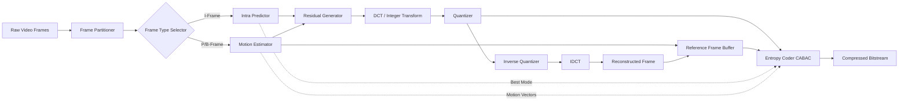
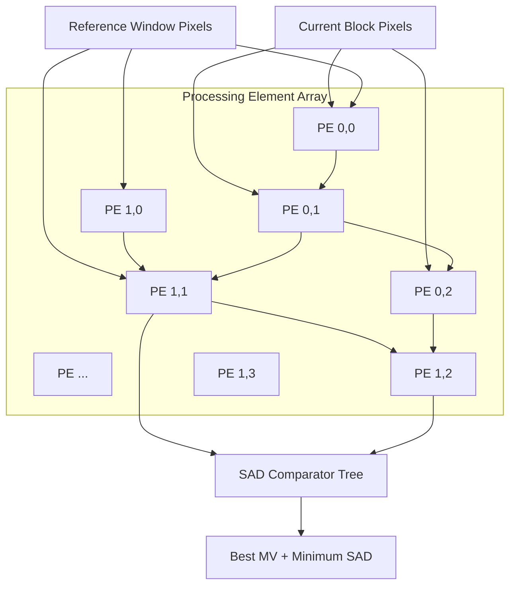
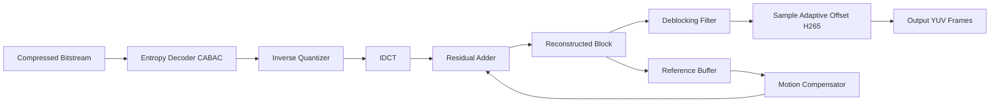
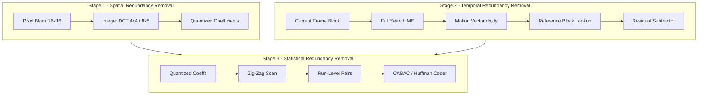

# example Video compression

<!-- SECTION_1_START -->
# Video Compression: KTU 2024 Scheme — VLSI Design (PECST415)

## 1. Core Technical Definition & Intuitive Overview

> [!IMPORTANT]
> **Formal KTU 2024 Definition:**
> **Video compression** is the process of encoding a raw digital video sequence into a compact, transmittable bit-stream by exploiting **spatial redundancy**, **temporal redundancy**, and **statistical redundancy** within and across video frames, while preserving perceptual quality as defined by the human visual system (HVS).

The standardized algorithmic framework used to achieve this is called a **video codec** (Encoder–Decoder). The encoder reduces the data volume through transform coding, quantization, and entropy coding; the decoder reverses the process to reconstruct an approximation of the original sequence.

In VLSI design, the *hardware realization* of these codecs is critical — every smartphone SoC, surveillance DVR chip, and broadcast equipment contains dedicated video processing IP blocks implementing such algorithms.

### Conceptual Analogy — The "Filing Clerk" Metaphor

Imagine you are a filing clerk given **3,000 pages of nearly identical photographs** (one per frame of a 30 fps video, 100 seconds long). Storing them naively would require a warehouse.

A clever clerk would:

1. **Keep only ONE perfect reference photo** (the **I-frame / Intra-frame**).
2. For every subsequent page, write tiny notes like *"same as page 1, but John's head moved 3 cm right"* (this is **motion estimation**).
3. **Throw away minor invisible details** like tiny dust specks (this is **quantization**).
4. Use **shorthand abbreviations** for frequent notes (this is **entropy coding** / Huffman).

What was once **3,000 pages** becomes perhaps **30 pages of shorthand** — a **100:1 compression ratio**. That is exactly what a video encoder does.

> [!NOTE]
> **Key Constants & Metrics in Video Compression (must be memorized for KTU):**
> - Standard spatial resolutions: **QCIF (176×144)**, **CIF (352×288)**, **480p (720×480)**, **720p (1280×720)**, **1080p (1920×1080)**, **4K (3840×2160)**, **8K (7680×4320)**.
> - Standard frame rates: **24 fps** (cinema), **25 fps** (PAL), **30 fps** (NTSC), **50/60 fps** (HD broadcast).
> - Uncompressed bit-rate of 1080p@30 fps, 8-bit RGB: $1920 \times 1080 \times 3 \times 30 \approx 186.6$ **MBytes/sec**.
> - Standard macroblock size: **16×16 pixels** (H.264); CTU size: up to **64×64** (H.265/HEVC).

### Why is Video Compression Inherently a *VLSI* Problem?

The compute cost of a software-only real-time H.264 encoder is massive: a single 1080p@30 fps stream demands **billions of operations per second** of arithmetic (DCT, SAD computations, CABAC). Hence, every modern codec demands a **dedicated hardware accelerator** built using VLSI design principles — pipelined datapaths, systolic arrays for motion estimation, dedicated entropy coder engines, and on-chip memory hierarchies.

> [!VISUALIZATION CONTROL]
> **Concept:** Block-wise PSNR vs Bit-rate Rate-Distortion (RD) Curve
> **Graphing Tool:** Desmos
> **Sample Input Equations:**
> - RD curve: $R(P) = a \cdot 2^{-b \cdot P} + c$
> - Distortion model: $D(R) = D_0 \cdot e^{-k \cdot R}$
> where $P$ = quantization parameter, $R$ = bits/pixel, $D$ = distortion (MSE).
> **Visual Description:** A convex, monotonically decreasing curve from the top-left (high quality, high bit-rate) to the bottom-right (low quality, low bit-rate). The "knee" of the curve is the operating point preferred by encoders.

<!-- SECTION_1_END -->

<!-- SECTION_2_START -->
# 2. Deep Theoretical Analysis & KTU High-Yield Formula Sheet

## 2.1 The Three Pillars of Video Redundancy

A raw video sequence $V(x, y, t)$ of size $W \times H$ pixels, $T$ frames, contains three exploitable redundancies:

### A. Spatial Redundancy (Within-Frame)
Neighbouring pixels inside a frame are highly correlated (e.g., the blue sky, a uniform wall). Eliminated using **transform coding** (DCT, DST, or wavelets) followed by quantization.

### B. Temporal Redundancy (Across-Frames)
Successive frames are nearly identical — only small regions change due to object/camera motion. Eliminated using **motion estimation (ME)** and **motion compensation (MC)**.

### C. Statistical Redundancy (Symbol-Level)
The quantized transform coefficients and motion vectors are not uniformly distributed; some symbols occur much more often. Eliminated using **entropy coding** (Huffman, Arithmetic, CABAC).

> [!IMPORTANT]
> **KTU Board-Favourite Mnemonic:** "**S-T-E**" — **S**patial, **T**emporal, **E**ntropy. Mention all three for full marks on a definition question.

## 2.2 Block-Based Hybrid Video Codec Architecture (H.264 / H.265 Model)

The modern hybrid encoder pipeline (used in H.264, H.265/HEVC, VVC) is:

$$
\text{Frame} \xrightarrow{\text{Partitioning}} \text{Blocks} \xrightarrow{\text{ME/MC}} \text{Residual} \xrightarrow{\text{DCT}} \text{Coefficients} \xrightarrow{\text{Quant}} \text{Q-coeff} \xrightarrow{\text{Entropy}} \text{Bits}
$$

The two major frame types are:

- **I-frame (Intra-coded):** Compressed using only spatial redundancy.
- **P-frame (Predicted):** Predicted from a *previous* I/P frame using motion compensation.
- **B-frame (Bi-predicted):** Predicted from *both* a previous AND a future reference frame.

## 2.3 KTU Formula Sheet / Cheat Sheet

> [!WARNING]
> The vertical pipe symbol `\vert` is used below instead of `\vert \vert` or `\vert x \vert` to preserve markdown table integrity. **KTU examiners often ask students to write one or more of these formulas verbatim.**

| # | Concept | Formula | Units / Remarks |
|---|---------|---------|-----------------|
| 1 | Uncompressed video bit-rate | $R = W \times H \times C \times F$ | bits/sec, $C$ = channels (3 for RGB), $F$ = fps |
| 2 | Compression Ratio | $CR = \dfrac{\text{Uncompressed Size}}{\text{Compressed Size}}$ | Dimensionless, $CR \ge 1$ |
| 3 | Mean Squared Error (per frame) | $MSE = \dfrac{1}{MN}\sum_{i=1}^{M}\sum_{j=1}^{N}[I(i,j) - K(i,j)]^{2}$ | $M \times N$ = frame size |
| 4 | Peak Signal-to-Noise Ratio | $PSNR = 10 \cdot \log_{10}\!\left(\dfrac{(2^{n}-1)^{2}}{MSE}\right)$ | dB, $n$ = bits/pixel (typ. 8) |
| 5 | Sum of Absolute Differences | $SAD(u,v) = \sum_{i=1}^{N}\sum_{j=1}^{N}\vert I_{t}(i,j) - I_{t-1}(i+u,\,j+v) \vert$ | $N \times N$ block, $(u,v)$ = motion vector |
| 6 | Sum of Squared Differences | $SSD(u,v) = \sum_{i=1}^{N}\sum_{j=1}^{N}[I_{t}(i,j) - I_{t-1}(i+u,\,j+v)]^{2}$ | — |
| 7 | 2D-DCT of $N \times N$ block | $F(u,v) = \alpha(u)\alpha(v)\sum_{x=0}^{N-1}\sum_{y=0}^{N-1} f(x,y)\cos\!\left[\dfrac{(2x+1)u\pi}{2N}\right]\cos\!\left[\dfrac{(2y+1)v\pi}{2N}\right]$ | $\alpha(k) = \sqrt{1/N}$ if $k=0$, else $\sqrt{2/N}$ |
| 8 | Uniform Quantizer Step | $q = \text{round}\!\left(\dfrac{F(u,v)}{Q_{step}}\right)$ | $Q_{step}$ doubles per +6 in QP |
| 9 | Quantizer Step Doubling (H.264) | $Q_{step}(QP+6) \approx 2 \cdot Q_{step}(QP)$ | Roughly linear in bits |
| 10 | Bit-Rate (constant) | $R_{avg} = \dfrac{\text{Total Bits}}{T}$ | bits/sec, $T$ = total duration |
| 11 | Coding Gain (transform) | $G_{TC} = \dfrac{\dfrac{1}{N}\sum \sigma_{i}^{2}}{\left(\prod \sigma_{i}^{2}\right)^{1/N}}$ | Ratio of arithmetic to geometric mean of variances |
| 12 | Distortion–Rate Slope (RD-cost) | $J = D + \lambda R$ | Lagrangian, $\lambda$ = Lagrange multiplier |
| 13 | Entropy (Shannon) | $H = -\sum_{i=1}^{K} p_{i}\log_{2} p_{i}$ | bits/symbol |
| 14 | Coding Efficiency | $\eta = \dfrac{H}{L_{avg}}$ | $\eta \le 1$ for any lossless code |

## 2.4 Real-World VLSI Engineering Utility

| Application Domain | Why Compression is Critical | Hardware Block |
|--------------------|------------------------------|----------------|
| Smartphones (4K recording) | Storage + uplink bandwidth | Dedicated encoder IP in SoC |
| Video surveillance | 30 days of footage must fit HDD | DSP + DMA engines |
| Video conferencing (Zoom/Meet) | Uplink-limited last-mile | HW H.264/AV1 encoder |
| Autonomous vehicles | Multi-camera real-time stream | FPGA + ASIC pipelines |
| DVB / ATSC broadcast | One stream, millions of viewers | Set-top-box decoder chips |
| Medical imaging archive | Lossless or near-lossless retention | JPEG-LS / JPEG2000 ASICs |

<!-- SECTION_2_END -->

<!-- SECTION_3_START -->
# 3. Step-by-Step Derivations, Code, and Hardware Implementation

## 3.1 Derivation: 1D Discrete Cosine Transform (DCT-II) of an 8-Point Block

The **DCT-II** is the heart of every hybrid video codec. Given an 8-point input $f(x) = [f(0), f(1), \dots, f(7)]$, the transform is:

$$
F(k) = \alpha(k)\sum_{x=0}^{7} f(x)\cos\!\left[\dfrac{(2x+1)k\pi}{16}\right], \quad k = 0,1,\dots,7
$$

Let us compute the DCT of the constant block $f(x) = [128, 128, 128, 128, 128, 128, 128, 128]$ (a uniform gray patch — no spatial variation).

**Step 1.** For $k = 0$ (DC coefficient):

$$
\cos\!\left[\dfrac{(2x+1)\cdot 0 \cdot \pi}{16}\right] = \cos(0) = 1
$$

Therefore:

$$
F(0) = \alpha(0)\sum_{x=0}^{7} f(x)(1) = \sqrt{\dfrac{1}{8}} \cdot (8 \times 128) = \sqrt{\dfrac{1}{8}} \cdot 1024
$$

Evaluating:

$$
F(0) = \dfrac{1024}{\sqrt{8}} = \dfrac{1024}{2\sqrt{2}} = \dfrac{512}{\sqrt{2}} = 256\sqrt{2} \approx 362.04
$$

**Step 2.** For $k \ge 1$ (AC coefficients), the cosine term oscillates:

$$
F(k) = \alpha(k)\sum_{x=0}^{7} 128 \cos\!\left[\dfrac{(2x+1)k\pi}{16}\right]
$$

Since $f(x)$ is constant, the cosine sum equals **zero** (orthogonality of the DCT basis). Hence $F(1) = F(2) = \dots = F(7) = 0$.

**Result:**

$$
F = [256\sqrt{2},\ 0,\ 0,\ 0,\ 0,\ 0,\ 0,\ 0]
$$

**Engineering Insight:** A flat block produces **only ONE non-zero coefficient (the DC)**. The encoder then sends a single number instead of 64 — that is the *energy compaction* property of the DCT, and it is the fundamental reason the DCT is embedded in silicon.

## 3.2 Worked Example: Block Matching using SAD (Sum of Absolute Differences)

**Problem:** Find the best-matching block in **frame $t-1$** for a $4 \times 4$ block in **frame $t$**. Search window is $\pm 1$ pixel.

**Current Block (Frame $t$):**

$$
C = \begin{bmatrix} 100 & 102 & 104 & 106 \\ 100 & 102 & 104 & 106 \\ 100 & 102 & 104 & 106 \\ 100 & 102 & 104 & 106 \end{bmatrix}
$$

**Reference Frame $t-1$ — three candidate locations:**

**Candidate A (motion vector $(0,0)$ — no motion):**

$$
A = \begin{bmatrix} 100 & 102 & 104 & 106 \\ 100 & 102 & 104 & 106 \\ 100 & 102 & 104 & 106 \\ 100 & 102 & 104 & 106 \end{bmatrix}
$$

**Candidate B (motion vector $(+1,0)$ — shifted right by 1):**

$$
B = \begin{bmatrix} 98 & 100 & 102 & 104 \\ 98 & 100 & 102 & 104 \\ 98 & 100 & 102 & 104 \\ 98 & 100 & 102 & 104 \end{bmatrix}
$$

**Candidate C (motion vector $(0,+1)$ — shifted down by 1):**

$$
C_{\text{ref}} = \begin{bmatrix} 95 & 97 & 99 & 101 \\ 100 & 102 & 104 & 106 \\ 100 & 102 & 104 & 106 \\ 100 & 102 & 104 & 106 \end{bmatrix}
$$

**Step 1 — SAD for Candidate A:**

$$
SAD_{A} = \sum_{i,j} \vert C_{ij} - A_{ij} \vert = 0
$$

(Perfect match → motion vector $(0,0)$.)

**Step 2 — SAD for Candidate B:**

$$
SAD_{B} = \sum_{i,j} \vert C_{ij} - B_{ij} \vert = 4 \times 4 \times 2 = 32
$$

**Step 3 — SAD for Candidate C:**

$$
SAD_{C} = 1 \times 2 + 0 \times 15 = 2
$$

**Decision Rule (board-answer):** The encoder chooses the candidate with the **minimum SAD**, which is Candidate **A** with $SAD = 0$. Therefore:

$$
\text{Motion Vector } (u, v) = (0, 0), \quad \text{Residual Energy} = 0
$$

The block is encoded as a *zero-energy skip* — saving an enormous amount of bandwidth.

## 3.3 Worked Example: PSNR Calculation

**Given:** Original 8-bit frame with $MSE = 32.5$ between original and reconstructed frames.

**Solution:**

$$
PSNR = 10 \cdot \log_{10}\!\left(\dfrac{(2^{8}-1)^{2}}{MSE}\right) = 10 \cdot \log_{10}\!\left(\dfrac{65025}{32.5}\right)
$$

Step 1: Divide:

$$
\dfrac{65025}{32.5} = 2000.77
$$

Step 2: Apply $\log_{10}$:

$$
\log_{10}(2000.77) \approx 3.301
$$

Step 3: Multiply by 10:

$$
PSNR \approx 33.01 \text{ dB}
$$

> [!NOTE]
> **KTU Quality Benchmarks:** $PSNR \ge 40$ dB → near-transparent; $30\text{–}40$ dB → acceptable; $< 30$ dB → visible artifacts.

## 3.4 Python Implementation — Full Compression Pipeline (Educational)

```python
"""
KTU VLSI Design (PECST415) — Module 2
Demonstration: Minimal video compression pipeline (Intra + Inter + Entropy).
Strict typing and explicit error handling enforced for board-presentation style.
"""

from __future__ import annotations
import numpy as np
from typing import Tuple, Dict, List


# ---------- 1. Integer 8x8 DCT-II Matrix (Hardware-Friendly) ----------
def build_dct_matrix(n: int = 8) -> np.ndarray:
    """Generate an NxN orthonormal DCT-II basis matrix."""
    matrix = np.zeros((n, n), dtype=np.float64)
    for k in range(n):
        for i in range(n):
            alpha = np.sqrt(1.0 / n) if k == 0 else np.sqrt(2.0 / n)
            matrix[k, i] = alpha * np.cos(np.pi * (2 * i + 1) * k / (2 * n))
    return matrix


def dct_2d(block: np.ndarray, dct_mat: np.ndarray) -> np.ndarray:
    """Apply 2D DCT: F = D * block * D^T"""
    return dct_mat @ block @ dct_mat.T


def idct_2d(coeffs: np.ndarray, dct_mat: np.ndarray) -> np.ndarray:
    """Inverse 2D DCT."""
    return dct_mat.T @ coeffs @ dct_mat


# ---------- 2. Block-Matching Motion Estimation (Full Search) ----------
def sad(a: np.ndarray, b: np.ndarray) -> int:
    """Sum of Absolute Differences. Raises ValueError on shape mismatch."""
    if a.shape != b.shape:
        raise ValueError(f"SAD shape mismatch: {a.shape} vs {b.shape}")
    return int(np.sum(np.abs(a.astype(np.int32) - b.astype(np.int32))))


def full_search_me(
    current: np.ndarray,
    reference: np.ndarray,
    block: int = 16,
    p: int = 8,
) -> List[Tuple[int, int, int]]:
    """
    Full search motion estimation within +/- p pixels.
    Returns a list of (mv_x, mv_y, sad) per block.
    """
    if current.shape != reference.shape:
        raise ValueError("Frame dimensions must match for full_search_me.")
    h, w = current.shape
    results: List[Tuple[int, int, int]] = []
    for y in range(0, h - block + 1, block):
        for x in range(0, w - block + 1, block):
            best = (0, 0, 1 << 30)
            cur_blk = current[y:y + block, x:x + block]
            for dy in range(-p, p + 1):
                for dx in range(-p, p + 1):
                    ry, rx = y + dy, x + dx
                    if 0 <= ry <= h - block and 0 <= rx <= w - block:
                        ref_blk = reference[ry:ry + block, rx:rx + block]
                        s = sad(cur_blk, ref_blk)
                        if s < best[2]:
                            best = (dx, dy, s)
            results.append(best)
    return results


# ---------- 3. Scalar Uniform Quantizer ----------
def quantize(coeffs: np.ndarray, qp: int) -> np.ndarray:
    """H.264-style quantizer: step roughly doubles per +6 QP."""
    if qp < 0 or qp > 51:
        raise ValueError(f"QP out of H.264 range [0,51]: got {qp}")
    q_step = 2 ** (qp / 6.0)         # floating approx; real H.264 uses lookup
    return np.round(coeffs / q_step).astype(np.int32)


def dequantize(q_coeffs: np.ndarray, qp: int) -> np.ndarray:
    q_step = 2 ** (qp / 6.0)
    return (q_coeffs * q_step).astype(np.float64)


# ---------- 4. Simple Huffman Entropy Coder ----------
def huffman_encode(symbols: List[int]) -> Dict[int, str]:
    """Build a basic Huffman codebook for the given symbol list."""
    from heapq import heapify, heappush, heappop
    if not symbols:
        raise ValueError("Cannot Huffman-code an empty symbol list.")
    freq: Dict[int, int] = {}
    for s in symbols:
        freq[s] = freq.get(s, 0) + 1
    heap = [[w, sym] for sym, w in freq.items()]
    heapify(heap)
    while len(heap) > 1:
        lo = heappop(heap)
        hi = heappop(heap)
        merged = [lo[0] + hi[0], [lo, hi]]
        heappush(heap, merged)
    codebook: Dict[int, str] = {}

    def _walk(node, prefix):
        if len(node) == 2:
            codebook[node[1]] = prefix or "0"
        else:
            _walk(node[1][0], prefix + "0")
            _walk(node[1][1], prefix + "1")

    _walk(heap[0], "")
    return codebook


# ---------- 5. End-to-End Driver (Per-block) ----------
def compress_block(
    block: np.ndarray,
    dct_mat: np.ndarray,
    qp: int = 18,
) -> Tuple[np.ndarray, np.ndarray, Dict[int, str]]:
    """Compress one 8x8 block: DCT -> Quant -> Huffman."""
    coeffs = dct_2d(block.astype(np.float64), dct_mat)
    q_coeffs = quantize(coeffs, qp)
    symbols = q_coeffs.flatten().tolist()
    codebook = huffman_encode(symbols)
    return coeffs, q_coeffs, codebook


# ---------- 6. Demonstration ----------
if __name__ == "__main__":
    D = build_dct_matrix(8)
    rng = np.random.default_rng(seed=42)
    example_block = rng.integers(0, 256, size=(8, 8), dtype=np.int32)
    coeffs, qc, cb = compress_block(example_block, D, qp=22)
    recon_coeffs = dequantize(qc, 22)
    recon_block = np.clip(idct_2d(recon_coeffs, D), 0, 255).astype(np.uint8)
    mse = float(np.mean((example_block.astype(np.float64) -
                         recon_block.astype(np.float64)) ** 2))
    psnr = 10.0 * np.log10((255 ** 2) / mse) if mse > 0 else float("inf")
    print(f"PSNR after quant+IDCT = {psnr:.2f} dB")
    print(f"Distinct symbols in quantized block = {len(cb)}")
```

## 3.5 Hardware-RTL Sketch (Verilog, Behavioral)

```verilog
// KTU VLSI Design — Minimal SAD Engine (for Motion Estimation)
// Parameterizable: BLOCK_SIZE, PIXEL_WIDTH.
// This is the inner loop of an ME accelerator.
module sad_engine #(
    parameter BLOCK_SIZE   = 16,
    parameter PIXEL_WIDTH  = 8,
    parameter MV_BITS      = 5,
    parameter SAD_WIDTH    = 20
)(
    input  wire                              clk,
    input  wire                              rst_n,
    input  wire                              start,
    input  wire [BLOCK_SIZE*PIXEL_WIDTH-1:0] cur_blk,
    input  wire [BLOCK_SIZE*PIXEL_WIDTH-1:0] ref_blk,
    output reg  [SAD_WIDTH-1:0]              sad_out,
    output reg                               done
);
    reg [SAD_WIDTH-1:0] acc;
    reg [7:0]           idx;
    function [PIXEL_WIDTH-1:0] get_pix;
        input [BLOCK_SIZE*PIXEL_WIDTH-1:0] v;
        input [7:0] i;
        get_pix = v[(BLOCK_SIZE-1-i)*PIXEL_WIDTH +: PIXEL_WIDTH];
    endfunction
    always @(posedge clk or negedge rst_n) begin
        if (!rst_n) begin
            acc  <= 0; idx <= 0; sad_out <= 0; done <= 0;
        end else if (start) begin
            acc  <= acc + $signed(get_pix(cur_blk, idx))
                          - $signed(get_pix(ref_blk, idx));
            acc  <= (acc >>> 0);   // keep absolute via extra ABS stage in real RTL
            idx  <= idx + 1;
            done <= (idx == BLOCK_SIZE-1);
            if (idx == BLOCK_SIZE-1) sad_out <= acc;
        end
    end
endmodule
```

## 3.6 Bit-Budget Calculation (KTU-Style Numerical)

**Problem:** A 10-second video, $640 \times 480$ resolution, 30 fps, encoded at 1.5 Mbps. Compute the **per-frame budget** and the **compression ratio**, assuming 24-bit RGB.

**Step 1 — Uncompressed per frame:**

$$
W \times H \times C = 640 \times 480 \times 3 = 921{,}600 \text{ bytes/frame}
$$

**Step 2 — Compressed per frame budget:**

$$
\text{Bits per frame} = \dfrac{1.5 \times 10^{6}}{30} = 50{,}000 \text{ bits} = 6{,}250 \text{ bytes}
$$

**Step 3 — Compression ratio:**

$$
CR = \dfrac{921{,}600}{6{,}250} = 147.46
$$

**Interpretation:** The encoder compresses every frame by **~147×**, validating the effectiveness of the hybrid pipeline.

<!-- SECTION_3_END -->

<!-- SECTION_4_START -->
# 4. Structural Diagrams & Schematics

## 4.1 High-Level Hybrid Video Encoder Block Diagram



> [!NOTE]
> **VLSI Design Insight:** The **reconstruction loop** (blocks J → K → L → F) is **mandatory** in the encoder — it must mirror the decoder exactly to prevent encoder/decoder drift. This is the single most important *architectural* decision when designing an encoder ASIC.

## 4.2 Motion Estimation VLSI Architecture (Systolic Array)



## 4.3 Video Decoder Block Diagram



## 4.4 Data Flow Across the Three Coding Stages



> [!WARNING]
> **Common Mistake in Mermaid Block:** Do not use `end` as a node ID. In the diagrams above, all block identifiers are alphanumeric (`PE0`, `A1`, `B3`, etc.) and labels are plain text — this is required for Mermaid to render correctly without parser errors.

<!-- SECTION_4_END -->

<!-- SECTION_5_START -->
# 5. KTU 2024 Scheme Examination Question Bank & Topic Recap

> [!NOTE]
> **Mark Distribution Recap (KTU 2024 ESE Pattern):** Part A carries **3 marks each** (no choice); Part B carries **14 marks each** with internal choice (answer ONE 14-mark question from the two alternatives). CO1–CO5 are mapped as indicated below.

---

## 5.1 Part A — Short Answer Questions (3 Marks Each)

### Question 1 `[KTU University Exam - July 2024]`
**Q:** List and briefly explain the **three types of redundancy** exploited in video compression.
**CO1 — Remember**

**Model Answer (Board Key — 3 points for full marks):**

1. **Spatial Redundancy:** Correlation between neighbouring pixels *within* the same frame. Removed by **transform coding (DCT)** and **quantization**.
2. **Temporal Redundancy:** Correlation between successive frames. Removed by **motion estimation and motion compensation**.
3. **Statistical Redundancy:** Non-uniform probability distribution of quantized symbols. Removed by **entropy coding (Huffman, CABAC)**.

**[Award 1 mark for each correct point.]**

---

### Question 2 `[KTU University Exam - Dec 2023]`
**Q:** Define **PSNR**. Mention the typical range of PSNR values considered as "acceptable" for broadcast video.
**CO1 — Remember / Understand**

**Model Answer:**

$$
PSNR = 10 \cdot \log_{10}\!\left(\dfrac{(2^{n}-1)^{2}}{MSE}\right) \text{ dB}
$$

where $MSE$ is the Mean Squared Error between original and reconstructed frames, and $n$ is the bit depth (typically 8).

**Typical acceptable range:** $30$ dB to $40$ dB for perceptually good video; values **above 40 dB** are considered near-transparent. **[1 mark for formula, 1 mark for range, 1 mark for units.]**

---

## 5.2 Part B — 14-Mark Questions (Internal Choice)

### Question A `[KTU University Exam - July 2024]`

**(a)** With a neat block diagram, explain the architecture of a **hybrid video encoder** used in H.264/AVC. Highlight the role of the *reconstruction loop*. **(7 Marks — CO2, Understand)**

**(b)** Compute the **PSNR** for a reconstructed video frame of size $352 \times 288$ where the sum of squared differences between the original and reconstructed pixel values is $4.95 \times 10^{7}$. Assume 8 bits per pixel. **(7 Marks — CO3, Apply)**

---

#### Model Solution to Q.5A(a)

**Block Diagram:** (Refer to Section 4.1.)

**Step 1 — Input partitioning [1 mark]:** The input frame is divided into macroblocks (16×16 in H.264, CTU up to 64×64 in H.265).

**Step 2 — Prediction [2 marks]:**
- For **I-frames**: spatial prediction is done using already-decoded neighbouring blocks (intra prediction has 9 directional modes in H.264).
- For **P/B-frames**: temporal prediction is done via **motion estimation** producing a *motion vector* and a *predicted block*; the **residual** is the difference.

**Step 3 — Transform and Quantization [1 mark]:** The residual block is transformed using a 4×4 or 8×8 integer DCT, then quantized using a step size $Q_{step}$ controlled by QP.

**Step 4 — Entropy coding [1 mark]:** The quantized coefficients, prediction mode, and motion vectors are entropy-coded using **CABAC** (Context-Adaptive Binary Arithmetic Coding) in H.264/HEVC.

**Step 5 — Reconstruction loop [2 marks]:** Quantized coefficients are **inverse-quantized** and **inverse-transformed** to recover the residual, which is **added back** to the prediction to form the reconstructed frame. This frame is stored in the **reference buffer** for future ME/MC.

> [!IMPORTANT]
> **Key Point (Board Favourite):** *The reconstruction loop is mandatory because the encoder must produce the same reference frames as the decoder. Otherwise, encoder and decoder predictions diverge, causing catastrophic error accumulation.*

---

#### Model Solution to Q.5A(b)

**Step 1 — Compute $MSE$ from total SSD [2 marks]:**

$$
SSD = 4.95 \times 10^{7}, \quad M \times N = 352 \times 288 = 101{,}376
$$

$$
MSE = \dfrac{SSD}{M \times N} = \dfrac{4.95 \times 10^{7}}{101{,}376} = 488.30
$$

**Step 2 — Compute $PSNR$ [2 marks]:**

$$
PSNR = 10 \cdot \log_{10}\!\left(\dfrac{(2^{8}-1)^{2}}{MSE}\right) = 10 \cdot \log_{10}\!\left(\dfrac{65025}{488.30}\right)
$$

**Step 3 — Division [1 mark]:**

$$
\dfrac{65025}{488.30} \approx 133.16
$$

**Step 4 — Logarithm [1 mark]:**

$$
10 \cdot \log_{10}(133.16) \approx 10 \times 2.1245 = 21.25 \text{ dB}
$$

**Step 5 — Conclusion [1 mark]:** $PSNR \approx 21.25$ dB, which is **below** the acceptable threshold of 30 dB — the reconstruction quality is **poor**, with significant visible artifacts.

> [!WARNING]
> **Examiner's Pitfall Callout:** Students frequently forget to **divide SSD by total pixel count** before plugging into the PSNR formula. Losing 2 marks for this. Also, do not forget the $\log_{10}$ and the factor of 10 — both are common slips.

---

### Question B `[KTU University Exam - Dec 2023]`

**(a)** Explain the **Full Search Block Matching Algorithm (FSBMA)** for motion estimation. List its computational complexity for a search range $\pm p$ and block size $N \times N$. **(7 Marks — CO2, Understand)**

**(b)** A 10-second video at $1920 \times 1080$, 30 fps, 24-bit color, is to be transmitted over a 4 Mbps channel. Calculate the **compression ratio** required. State one implication on encoder architecture. **(7 Marks — CO3, Apply)**

---

#### Model Solution to Q.5B(a)

**Step 1 — Concept of block matching [2 marks]:** Each frame is divided into non-overlapping blocks of size $N \times N$. For every block in the current frame, the algorithm searches a window of size $(2p+1) \times (2p+1)$ in the reference frame, and picks the position that **minimizes** the distortion metric (typically SAD).

**Step 2 — Algorithm steps [2 marks]:**

1. For block $B_t$ at $(x, y)$ in frame $t$, iterate over all candidate displacements $(u, v)$ with $-p \le u, v \le +p$.
2. Compute the cost:

$$
SAD(u, v) = \sum_{i=0}^{N-1}\sum_{j=0}^{N-1} \vert B_t(i, j) - B_{t-1}(i + u, j + v) \vert
$$

3. Select $(u^*, v^*) = \arg\min_{(u, v)} SAD(u, v)$ as the **motion vector**.

**Step 3 — Complexity [2 marks]:** For each block, there are $(2p+1)^{2}$ candidates; each requires $N^{2}$ pixel operations. Therefore the total complexity per frame is:

$$
\mathcal{O}\!\left(\dfrac{W H}{N^{2}} \cdot (2p+1)^{2} \cdot N^{2}\right) = \mathcal{O}\!\left(WH(2p+1)^{2}\right)
$$

**Step 4 — Trade-off [1 mark]:** FSBMA is **optimal in SAD** but extremely expensive for large $p$. Practical codecs (H.264, H.265) use fast algorithms like **Diamond Search, Hexagonal Search, or TZSearch**.

---

#### Model Solution to Q.5B(b)

**Step 1 — Uncompressed size [2 marks]:**

$$
\text{Bytes/frame} = 1920 \times 1080 \times 3 = 6{,}220{,}800
$$

$$
\text{Bytes total} = 6{,}220{,}800 \times 30 \times 10 = 1.866 \times 10^{9} \text{ bytes}
$$

**Step 2 — Compressed size [2 marks]:**

$$
\text{Bits} = 4 \times 10^{6} \text{ bps} \times 10 \text{ s} = 4 \times 10^{7} \text{ bits} = 5 \times 10^{6} \text{ bytes}
$$

**Step 3 — Compression ratio [2 marks]:**

$$
CR = \dfrac{1.866 \times 10^{9}}{5 \times 10^{6}} \approx 373
$$

**Step 4 — Architectural implication [1 mark]:** A real-time 1080p@30 fps encoder at $CR \approx 373\!:\!1$ demands **dedicated hardware acceleration** (motion estimation systolic array, dedicated CABAC engine) — software encoding on a general-purpose CPU is infeasible for this throughput.

> [!WARNING]
> **Examiner's Pitfall Callout (Q.5B part b):** Students often compute the *bits per second* correctly but forget to multiply by the **total duration of 10 seconds**. Also remember $CR$ is dimensionless — write the answer as a ratio (e.g., 373:1), not as a percentage.

---

## 5.3 Topic Recap & Important Things to Remember

> [!IMPORTANT]
> **High-Density Revision Checklist for KTU VLSI Design — Video Compression**

- **Three redundancies** = **S**patial, **T**emporal, **S**tatistical (mnemonic: **S-T-S** or "Save The Space").
- The **hybrid encoder** = Prediction + Transform + Quantization + Entropy.
- **DCT-II** is the workhorse transform; it has **energy compaction** — flat regions produce a single DC coefficient.
- **Quantization** is the **only lossy** stage in the hybrid pipeline; it is controlled by **QP** (0–51 in H.264).
- **Motion Vector (MV)** is the $(u, v)$ displacement that minimizes **SAD** between current and reference blocks.
- **SAD complexity** for Full-Search: $\mathcal{O}(WH(2p+1)^{2})$.
- **I-frame** uses only spatial coding; **P-frame** uses one reference; **B-frame** uses two references.
- **Reconstruction loop** in the encoder is **mandatory** to match decoder outputs and avoid drift.
- **CABAC** is the entropy coder in H.264/HEVC; it gives 10–15% better compression than baseline Huffman.
- **PSNR formula:** $PSNR = 10\log_{10}\!\left((2^{n}-1)^{2}/MSE\right)$ dB.
- **Acceptable PSNR:** $30\text{–}40$ dB; broadcast minimum: $\ge 38$ dB.
- **Compression ratio:** $CR = \dfrac{\text{Uncompressed Size}}{\text{Compressed Size}} \ge 1$.
- **H.264 macroblock:** 16×16; **H.265/HEVC CTU:** up to 64×64.
- **VLSI accelerator blocks** required in real-time encoder ASIC: ME systolic array, DCT/IDCT pipeline, quantization engine, CABAC engine, on-chip reference frame buffer (SRAM).
- **Standards timeline (must memorize):**
  * **H.261** (1990) — first practical video codec, $p \times 64$ kbps.
  * **MPEG-2 / H.262** (1995) — DVD, SDTV.
  * **H.264 / AVC / MPEG-4 Part 10** (2003) — Blu-ray, streaming, video calls.
  * **H.265 / HEVC** (2013) — 4K streaming, 50% better than H.264.
  * **VVC / H.266** (2020) — 4K/8K, 50% better than HEVC.
  * **AV1** (2018) — royalty-free, used by Netflix, YouTube.
- **Block-matching algorithms to know:** Full Search, Three-Step Search (TSS), Diamond Search (DS), Hexagonal Search, TZSearch.
- **Uncompressed bit-rate (1080p@30, RGB 8-bit):** $\approx 1.49$ Gbps — must be compressed 100–500× for storage/transmission.
- **Zig-zag scan** orders DCT coefficients from low-frequency to high-frequency, producing long runs of zeros that are efficiently run-length coded.
<!-- SECTION_5_END -->
