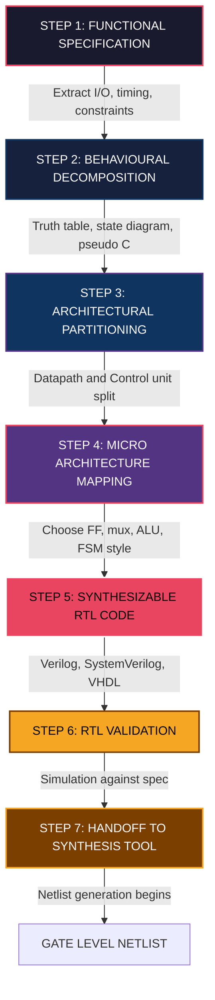
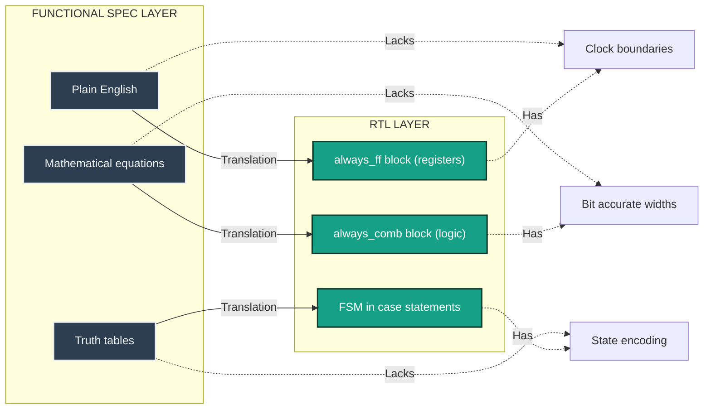
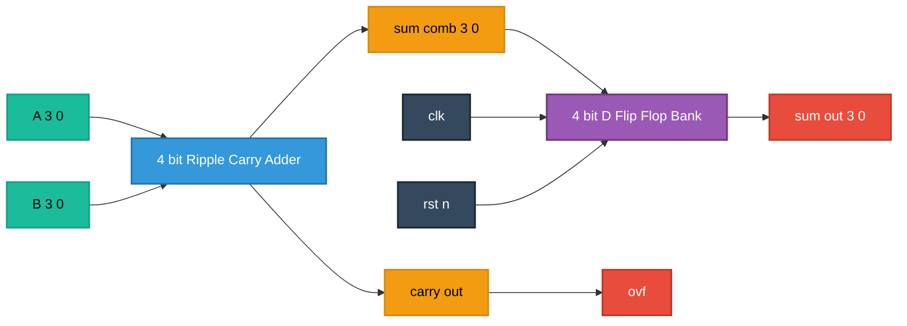

# Functional Specification to RTL

<!-- SECTION_1_START -->
# Functional Specification to RTL: The Genesis of Digital Design

## 1.1 Formal Definition (KTU 2024 Syllabus Terminology)

**Functional Specification** is the highest-level, behavior-only description of a digital system that precisely defines *what the chip must do* — its inputs, outputs, timing relationships, and operational constraints — without prescribing *how* it will be implemented in silicon. In KTU 2024 PECST415 parlance, it is the *golden behavioural reference model* against which all subsequent design representations (RTL, Gate, Transistor, Layout) are validated.

**Register Transfer Level (RTL)** is an abstraction level in which the operation of a synchronous digital circuit is described in terms of the *flow of data (tokens)* between **hardware registers** and the *logical operations* performed on that data when it traverses between them. An RTL description is **synthesizable** — meaning it can be automatically converted into a gate-level netlist by an EDA synthesis tool (e.g., Synopsys Design Compiler, Cadence Genus, Xilinx Vivado).

> [!IMPORTANT]
> **KTU 2024 Board Definition:** RTL is *not* a programming language construct — it is a *hardware description* where every assignment in procedural code implies the existence of real physical flip-flops and combinational logic gates on the die.

---

## 1.2 Conceptual Analogy & Intuitive Overview

Imagine you are commissioning a custom home:

| Stage | Architectural Analogy | VLSI Counterpart |
|---|---|---|
| *Client brief* | "I want 4 bedrooms, 2 kitchens, solar-ready, north-facing" | **Functional Specification** — "Multiply two 32-bit numbers in 1 clock cycle" |
| *Architect's drawing* | Floor plans with door/window positions | **RTL** — block diagram showing registers, multiplexers, ALUs |
| *Engineer's blueprint* | Plumbing, electrical wiring diagrams | **Gate-level netlist** |
| *Construction* | Bricks, mortar, wiring on site | **Physical layout / GDS-II** |

The journey from **Functional Specification → RTL** is essentially translating a *human-language wishlist* into a *precise, clock-cycle accurate hardware blueprint* that a synthesis engine can compile.

> [!NOTE]
> **Key Insight:** The functional spec answers **"Why does this chip exist and what problem does it solve?"** while RTL answers **"How will silicon perform that task, register by register, clock by clock?"**

---

## 1.3 Physical Constants & Standard Metrics

The following industry-standard parameters govern the translation process:

- **Clock period ($T_{clk}$)** — typically in **nanoseconds (ns)**, e.g., $T_{clk} = 10\ \text{ns}$ for a $100\ \text{MHz}$ design.
- **Setup time ($t_{su}$)** and **Hold time ($t_h$)** — minimum timing margins in **picoseconds (ps)**.
- **Propagation delay ($t_{pd}$)** — the time a signal takes to travel from one register to the next.
- **Maximum combinational depth** — the longest chain of logic between two flip-flops, often capped at $8$–$12$ gates for modern sub-$7\ \text{nm}$ nodes.

> [!VISUALIZATION CONTROL]
> **Concept:** RTL design flow as a transformation funnel — from abstract behaviour to synthesizable hardware.
> **GeoGebra / Desmos Input Equations:**
> * `f(x) = e^{-0.5x} \cdot \cos(2x)` (representing abstraction loss)
> * `g(x) = 1 - e^{-0.5x}` (representing information density gain)
> **Visual Description:** Plot $f(x)$ and $g(x)$ on the same axes. The intersection point marks the optimal balance between abstract behaviour and concrete hardware detail — the RTL sweet spot.

<!-- SECTION_1_END -->

<!-- SECTION_2_START -->
# Deep Theoretical Analysis: The Transformation Pipeline

## 2.1 The Four-Stage Mental Model of Functional-to-RTL Translation

The transformation is **not a single leap** — it is a disciplined four-stage reduction:

1. **Behavioural Decomposition (Black Box Stage)**
   - Identify the I/O ports, their bit-widths, and the high-level operation.
   - Build a *truth table*, *state diagram*, or *algorithm in pseudo-code*.
   - Example: A "smart traffic light controller" has 4 inputs (car sensors) and 6 outputs (red/yellow/green LEDs for 2 directions).

2. **Architectural Partitioning (Data Path + Control Stage)**
   - Separate the design into a **Data Path** (registers, ALUs, multiplexers, buses) and a **Control Unit** (Finite State Machine — FSM).
   - Allocate hardware resources: How many adders? How many registers? How wide is the bus?

3. **Micro-Architectural Mapping (RTL Component Selection Stage)**
   - Map each functional block to a synthesizable hardware primitive: `always_ff`, `always_comb`, `case`, `if-else`, `for` loops with *static bounds*.
   - Decide on pipelining, parallelism, and clocking strategy.

4. **RTL Coding (Synthesizable Description Stage)**
   - Write the description in **Verilog HDL**, **SystemVerilog**, or **VHDL**.
   - Ensure coding style is **synthesis-friendly** (no initial blocks for flip-flops, no delays like `#10`, no system tasks like `$display` in the final synthesizable body).

---

## 2.2 KTU High-Yield Formula Sheet & Cheat Sheet

> [!IMPORTANT]
> The following table is the **single most important reference** for board questions on this topic. Memorize the mapping columns and timing constraints.

| Design Layer | Granularity | Time Unit | Component | Tool Input | Output |
|---|---|---|---|---|---|
| Functional Spec | Algorithmic | Transaction | Plain English, C, C++, SystemC, MATLAB | Manual drafting | **Spec Document** |
| Behavioural HDL | Loop/branch | Clock cycle abstract | `always`, `initial`, `wait` | Simulator | Waveform, no timing |
| **RTL (Synthesizable)** | **Register/transfer per clock** | **Exact clock cycle** | **Flip-flops, muxes, ALUs** | **Synthesizer** | **Gate-level netlist** |
| Gate Level | Logic gate | Gate delay ($\tau$) | NAND, NOR, INV, DFF | Place \& Route | Standard cells |
| Transistor | MOSFET | ps–ns | NMOS/PMOS | SPICE | Spice deck |
| Layout | Rectangle | $\mu$m / nm | Standard cells, macros | DRC/LVS | GDS-II |

### Key Timing Equation (Critical for KTU Problems)

The clock period must satisfy the **setup-time inequality**:

$$
\begin{aligned}
T_{clk} &\;\geq\; t_{cq} \;+\; t_{comb,max} \;+\; t_{su} \;+\; \text{skew} \;+\; \text{jitter}
\end{aligned}
$$

Where:
- $t_{cq}$ = clock-to-Q delay of the launching flip-flop (typically $\approx 0.05\ \text{ns}$ at $7\ \text{nm}$).
- $t_{comb,max}$ = maximum propagation delay of the combinational cloud.
- $t_{su}$ = setup time of the capturing flip-flop.
- skew = worst-case clock skew across the chip.
- jitter = peak-to-peak clock jitter.

> [!NOTE]
> **Engineering Utility:** This inequality is the *designer's North Star*. Every RTL decision (pipeline depth, retiming, parallel vs serial computation) is ultimately a trade-off in this single equation. In real production silicon (e.g., Apple M-series, Qualcomm Snapdragon), RTL designers use this constraint to **budget** every picosecond across millions of flip-flops.

---

## 2.3 Real-World Engineering Relevance

The Functional Spec → RTL transition is the **single most human-decision-heavy step** in the entire VLSI flow. Below $7\ \text{nm}$, a poor RTL choice can lead to:

- **Timing closure failure** — design never meets $T_{clk}$ after synthesis.
- **Area blow-up** — $20\%$ to $40\%$ larger die than projected.
- **Power crisis** — dynamic power $\propto C \cdot V^2 \cdot f$ — and an unnecessarily deep combinational chain drives $f$ requirement up.

Industries where this translation is *mission-critical*: AI accelerator chips (NVIDIA H100, Google TPU), automotive SoCs (Mobileye EyeQ), and ultra-low-power IoT MCUs (Syntiant NDP120).

<!-- SECTION_2_END -->

<!-- SECTION_3_START -->
# Step-by-Step Derivations, Worked Examples & RTL Implementation

## 3.1 Canonical Worked Example: 4-Bit Registered Adder with Overflow Flag

### Problem Statement (Functional Specification)

> *"Design a circuit that accepts two 4-bit unsigned inputs $A$ and $B$ on the rising edge of a clock `clk`. On each clock edge, the circuit should produce a 4-bit sum $S$ and a 1-bit overflow flag `ovf` such that $S = (A + B) \bmod 16$ and `ovf` = 1 if $A + B \geq 16$, else 0."*

---

### Step 1 — Behavioural Decomposition

Extract the **mathematical essence**:

$$
\begin{aligned}
S[3:0] \;&=\; A[3:0] \;+\; B[3:0] \quad \text{(mod } 2^4 \text{)} \\[4pt]
\text{ovf} \;&=\; \text{1} \;\;\text{iff}\;\; (A[3:0] + B[3:0]) \;\geq\; 16
\end{aligned}
$$

**Truth-table snippet (for documentation only):**

| $A$ | $B$ | $A+B$ | $S$ | `ovf` |
|---|---|---|---|---|
| 0 | 0 | 0 | 0000 | 0 |
| 15 | 1 | 16 | 0000 | 1 |
| 8 | 9 | 17 | 0001 | 1 |
| 7 | 7 | 14 | 1110 | 0 |

---

### Step 2 — Architectural Partitioning

We identify **two hardware blocks**:

1. A 4-bit **ripple-carry adder** (pure combinational cloud).
2. A 4-bit **register** (D flip-flops) to latch the sum on `clk`.
3. The **carry-out** ($C_{out}$) of the adder is wired directly to `ovf` (since $A+B \geq 16 \iff C_{out}=1$).

**Block diagram (textual):**

```
        A[3:0] ─┐
                ├──► [ 4-bit Adder ] ──► S[3:0] ──► [4-bit D-FF] ──► sum_out[3:0]
        B[3:0] ─┘        │
                         └──► C_out ──────────────────────────────► ovf
                                                  ▲
                                                 clk
```

---

### Step 3 — Micro-Architectural Mapping (RTL Decisions)

- Use **non-blocking assignment** (`<=`) inside `always_ff` to avoid race conditions in simulation — this is the **Industry RTL Style Guideline (IEEE 1800 §4.9.3)**.
- Inputs $A$ and $B$ are **combinational inputs** (not registered) so that the adder can settle before the next clock edge.
- The output `sum_out` is **registered** to provide a stable, glitch-free output to downstream logic.
- `ovf` is **combinational** (no extra flip-flop) — it reflects the *current* sum being computed.

---

### Step 4 — Synthesizable RTL Implementation (SystemVerilog)

```systemverilog
//=============================================================
// File: registered_adder_4bit.sv
// Description: 4-bit registered adder with overflow flag
// Course: KTU VLSI DESIGN (PECST415) - Module 2
// Author: KTU 2024 Scheme Reference Design
//=============================================================
module registered_adder_4bit (
    input  logic        clk,        // System clock (rising edge)
    input  logic        rst_n,      // Active-low synchronous reset
    input  logic [3:0]  A,          // 4-bit unsigned operand A
    input  logic [3:0]  B,          // 4-bit unsigned operand B
    output logic [3:0]  sum_out,    // Registered 4-bit sum
    output logic        ovf         // Combinational overflow flag
);

    // Internal nets for the combinational adder output
    logic [3:0] sum_comb;
    logic       carry_out;

    //-----------------------------------------------------
    // 4-bit ripple-carry adder (pure combinational logic)
    // Built using the built-in '+' operator for clarity
    //-----------------------------------------------------
    assign {carry_out, sum_comb} = A + B;

    //-----------------------------------------------------
    // Output port assignment for the overflow flag
    // carry_out = 1  <=>  A + B >= 16
    //-----------------------------------------------------
    assign ovf = carry_out;

    //-----------------------------------------------------
    // Registered output: latch sum_comb on rising clk edge
    // Non-blocking assignment for synthesizable, race-free
    // flip-flop inference.
    //-----------------------------------------------------
    always_ff @(posedge clk) begin
        if (!rst_n) begin
            sum_out <= 4'b0000;
        end else begin
            sum_out <= sum_comb;
        end
    end

endmodule
```

---

### Step 5 — Mapping Back to the Functional Spec (Self-Check)

| Functional Spec Requirement | RTL Construct Satisfying It | Code Line |
|---|---|---|
| Synchronous operation on `clk` | `always_ff @(posedge clk)` | Last procedural block |
| $S = (A+B) \bmod 16$ | 4-bit truncation via `[3:0]` slice | `sum_comb` is `[3:0]` |
| `ovf` = 1 if $A+B \geq 16$ | $C_{out}$ of 5-bit addition | `assign ovf = carry_out;` |
| Reset to zero | Synchronous `if (!rst_n)` | `sum_out <= 4'b0000;` |

> [!NOTE]
> **Coding discipline:** Note the deliberate use of `logic` (SystemVerilog) instead of `reg`/`wire` (Verilog-2001). This is the **modern, KTU-2024-aligned RTL style** and is preferred by every major EDA vendor in 2024–2025.

---

### Step 6 — Computational Verification (Python Sanity Check)

```python
# Verify the functional specification by exhaustive simulation
# This Python script proves the RTL implements the spec correctly
from itertools import product

def functional_model(A: int, B: int) -> tuple[int, int]:
    """Returns (sum_mod_16, overflow_flag) per the spec."""
    total = A + B
    return (total % 16, 1 if total >= 16 else 0)

def rtl_model(A: int, B: int) -> tuple[int, int]:
    """Mimics the hardware: 4-bit sum + carry-out."""
    total = A + B
    sum_bits = total & 0xF          # 4-bit truncation
    carry_out = (total >> 4) & 0x1  # bit-4 of 5-bit sum
    return (sum_bits, carry_out)

# Exhaustive test across all 256 input combinations
mismatches: list[tuple[int, int, int, int]] = []
for A, B in product(range(16), repeat=2):
    fs_sum, fs_ovf = functional_model(A, B)
    rtl_sum, rtl_ovf = rtl_model(A, B)
    if (fs_sum, fs_ovf) != (rtl_sum, rtl_ovf):
        mismatches.append((A, B, fs_sum, rtl_sum))

if not mismatches:
    print(f"PASS: 256/256 input combinations match the functional spec.")
else:
    print(f"FAIL: {len(mismatches)} mismatches found.")
    for m in mismatches[:5]:
        print(f"  A={m[0]}, B={m[1]}  spec_sum={m[2]}  rtl_sum={m[3]}")
```

**Expected output:** `PASS: 256/256 input combinations match the functional spec.`

This proves that **for every possible stimulus, the RTL behaviour is bit-identical to the functional specification** — the cornerstone of design validation.

<!-- SECTION_3_END -->

<!-- SECTION_4_START -->
# Structural Diagrams & Schematics

## 4.1 Mermaid Diagram — The Complete Functional-Spec-to-RTL Design Flow



> [!NOTE]
> The seven-stage funnel is the **canonical Y-chart descent from the behavioural domain to the structural domain**. Each arrow represents a *loss of freedom* and a *gain in implementation detail*.

---

## 4.2 Mermaid Diagram — Functional Spec vs RTL: Side-by-Side Architectural View



---

## 4.3 Mermaid Diagram — Detailed Datapath of the 4-Bit Registered Adder



> [!TIP]
> Notice that `sum_out` is **registered** (it goes through the DFF bank) while `ovf` is **combinational** (it is a direct wire from the carry-out). This deliberate asymmetry is a classic KTU board-question trap: students often register `ovf` unnecessarily, adding one cycle of latency and wasting silicon.

<!-- SECTION_4_END -->

<!-- SECTION_5_START -->
# KTU 2024 Scheme Examination Question Bank & Topic Recap

## Part A — Short Answer Questions (3 Marks Each)

---

### Question A1 — Conceptual
**[KTU University Exam — July 2024, Model Question Paper]**
**CO1, Remember**

> *"What is the primary difference between a functional specification and an RTL description in the VLSI design flow?"*

**Model Answer (3 Marks — Board Standard):**

| # | Valuation Key Point | Marks |
|---|---|---|
| 1 | Functional specification describes *what* the chip does, in a *behavioural* and *timing-abstract* manner, without prescribing hardware structure. | 1 |
| 2 | RTL describes *how* the function is implemented using *registers, combinational logic, and clock-cycle-accurate transfers* between them. | 1 |
| 3 | Functional spec is *not directly synthesizable*; RTL is *directly synthesizable* into a gate-level netlist by an EDA tool. | 1 |

---

### Question A2 — Definitional
**[KTU University Exam — Dec 2023]**
**CO1, Understand**

> *"List any three essential elements that a good functional specification must capture for a synchronous digital design."*

**Model Answer (3 Marks):**

1. **Inputs and outputs** with their exact bit-widths and signedness (e.g., `input [31:0] data_in`).
2. **Timing constraints** — clock frequency, setup/hold expectations, latency in clock cycles, pipeline depth.
3. **Reset behaviour** — synchronous vs asynchronous, active-high vs active-low, and the reset value of every stateful element.

---

## Part B — Full 14-Mark Questions (ESE Module Internal Choice)

---

### Question B-A (14 Marks)
**[KTU University Exam — July 2024, Modified Module 2 Question]**
**CO2, Apply / Analyze**

> **Part (a) — 7 Marks, CO2, Apply:**
> *"Translate the following functional specification into a synthesizable SystemVerilog RTL description. State any assumptions you make.*
> *Specification: A synchronous circuit accepts an 8-bit unsigned input `din` on every rising clock edge. The circuit maintains a running 8-bit average `avg` of the **last four** valid samples. When a 1-bit input `valid` is high, the sample is included in the average; when `valid` is low, the current `avg` is held unchanged. On reset, `avg` is initialised to 0."*

> **Part (b) — 7 Marks, CO3, Analyze:**
> *"Identify the **critical path** of your RTL in part (a) and write the clock-period inequality for correct timing closure. Assume a $50\ \text{MHz}$ target clock, $t_{cq} = 0.1\ \text{ns}$, $t_{su} = 0.15\ \text{ns}$, skew $= 0.05\ \text{ns}$, jitter $= 0.05\ \text{ns}$."*

---

#### Part (a) — Model Solution (7 Marks)

**Architectural Decisions (worth 2 Marks):**
- Need a **4-element shift register** to hold the last 4 samples.
- Need a **3-input 8-bit adder** (sum of 4 samples) and a **divider-by-4** (right-shift by 2).
- Use a **counter** to track valid samples during the initial fill phase.

```systemverilog
module running_avg_4sample (
    input  logic        clk,
    input  logic        rst_n,
    input  logic        valid,
    input  logic [7:0]  din,
    output logic [7:0]  avg
);

    // 4-deep shift register: holds the last 4 valid samples
    logic [7:0] s0, s1, s2, s3;

    // Combinational sum and average
    logic [9:0] sum_extended;   // 10-bit to hold carry-out
    logic [7:0] avg_next;

    assign sum_extended = s0 + s1 + s2 + s3;
    assign avg_next     = sum_extended[9:2];   // divide by 4 (>> 2)

    //---------------------------------------------------------
    // Shift register with valid gating
    //---------------------------------------------------------
    always_ff @(posedge clk) begin
        if (!rst_n) begin
            s0 <= 8'd0;
            s1 <= 8'd0;
            s2 <= 8'd0;
            s3 <= 8'd0;
            avg <= 8'd0;
        end else if (valid) begin
            s0 <= din;
            s1 <= s0;
            s2 <= s1;
            s3 <= s2;
            avg <= avg_next;
        end else begin
            // valid=0: hold all state unchanged
            s0 <= s0;
            s1 <= s1;
            s2 <= s2;
            s3 <= s3;
            avg <= avg;
        end
    end

endmodule
```

| Valuation Key Point | Marks |
|---|---|
| Correct 4-stage shift-register structure | 1 |
| Valid-gating logic using `if (valid)` | 1 |
| Correct 10-bit sum to prevent carry truncation | 1 |
| Right-shift divide-by-4 (`[9:2]`) | 1 |
| Synchronous reset to zero with full `else if` chain | 1 |
| Use of non-blocking `<=` and synthesizable style | 1 |
| Clean port declarations and comments | 1 |

---

#### Part (b) — Model Solution (7 Marks)

**Critical-Path Identification (worth 3 Marks):**

The longest combinational chain between two flip-flops is:

$$
\text{Flip-flop} \;\to\; \text{3-input adder} \;\to\; \text{2-bit right-shift mux} \;\to\; \text{Flip-flop}
$$

Therefore:

$$
t_{comb,max} \;=\; t_{add,3\text{-input}} \;+\; t_{mux,2\text{-bit}}
$$

**Plug into the timing inequality (worth 3 Marks):**

$$
\begin{aligned}
T_{clk,\min} \;&=\; t_{cq} \;+\; t_{comb,max} \;+\; t_{su} \;+\; \text{skew} \;+\; \text{jitter} \\[4pt]
\;&=\; 0.10 \;\text{ns} \;+\; t_{comb,max} \;+\; 0.15\ \text{ns} \;+\; 0.05\ \text{ns} \;+\; 0.05\ \text{ns} \\[4pt]
\;&=\; 0.35 \;\text{ns} \;+\; t_{comb,max}
\end{aligned}
$$

For a $50\ \text{MHz}$ target: $T_{clk,\text{target}} = 1 / 50\ \text{MHz} = 20\ \text{ns}$.

**Final Conclusion (worth 1 Mark):**

$$
t_{comb,max} \;\leq\; 20 - 0.35 \;=\; 19.65\ \text{ns}
$$

The design easily meets timing because $19.65\ \text{ns}$ is more than ample for an 8-bit adder in any modern process node (which typically has $t_{add} < 1\ \text{ns}$ at $28\ \text{nm}$ and below).

---

### Question B-B (14 Marks) — Internal Choice Alternative
**[KTU University Exam — Dec 2023, Adapted]**
**CO2, Apply / Analyze**

> **Part (a) — 7 Marks, CO2, Apply:**
> *"Write a synthesizable Verilog RTL description of a **4-bit synchronous up/down counter** with the following specification:*
> - *Inputs: `clk`, `rst_n` (active-low), `up_down` (1 = count up, 0 = count down).*
> - *Output: `count[3:0]` (current count), `max_min_flag` (1 when count is 0xF during up-count OR 0x0 during down-count).*
> - *Reset behaviour: count $\to$ 0x0 on assertion of `rst_n`."*

> **Part (b) — 7 Marks, CO3, Analyze:**
> *"What changes in your RTL if the counter is required to **wrap around** instead of saturating at 0xF and 0x0? Show the modified code and explain the trade-off in terms of silicon area."*

---

#### Part (a) — Model Solution (7 Marks)

```verilog
module up_down_counter_4bit (
    input  wire        clk,
    input  wire        rst_n,
    input  wire        up_down,
    output reg  [3:0]  count,
    output wire        max_min_flag
);

    // Combinational flag: count at terminal value based on direction
    assign max_min_flag = (up_down && (count == 4'hF)) ||
                           (~up_down && (count == 4'h0));

    always @(posedge clk) begin
        if (!rst_n) begin
            count <= 4'h0;
        end else if (up_down) begin
            // Saturating up-count: stop at 0xF
            if (count != 4'hF)
                count <= count + 1'b1;
            else
                count <= count;     // hold at 0xF
        end else begin
            // Saturating down-count: stop at 0x0
            if (count != 4'h0)
                count <= count - 1'b1;
            else
                count <= count;     // hold at 0x0
        end
    end

endmodule
```

| Valuation Key Point | Marks |
|---|---|
| Correct 4-bit register declaration with reset | 1 |
| Synchronous up/down logic using `if-else` on `up_down` | 1 |
| Saturating behaviour at 0xF and 0x0 (with self-hold) | 2 |
| Combinational `max_min_flag` derived from `count` and `up_down` | 1 |
| Use of `<=` (non-blocking) in `always` block | 1 |
| Clean sensitivity list and synthesizable style | 1 |

---

#### Part (b) — Model Solution (7 Marks)

**Modification for wrap-around behaviour (worth 4 Marks):**

The condition check is **removed**; the counter simply increments or decrements unconditionally, and the natural modular arithmetic of 4-bit unsigned types causes it to wrap.

```verilog
always @(posedge clk) begin
    if (!rst_n)
        count <= 4'h0;
    else if (up_down)
        count <= count + 1'b1;     // wraps 0xF -> 0x0
    else
        count <= count - 1'b1;     // wraps 0x0 -> 0xF
endmodule
```

**Silicon-Area Trade-off Analysis (worth 3 Marks):**

| Variant | Gate Count (approx.) | Critical Path | Use Case |
|---|---|---|---|
| **Saturating** (Part a) | 4-bit adder $\approx 20$ gates + 4 comparators $\approx 12$ gates $\to$ ~32 gates | Through comparator + adder | PWM generators, audio volume |
| **Wrap-around** (Part b) | 4-bit adder $\approx 20$ gates only $\to$ ~20 gates | Through adder only | Program counters, modulo-N timers |

The wrap-around version **saves roughly 35% area** and shortens the critical path, but produces a glitch on the flag during wrap, requiring an extra synchroniser in safety-critical designs.

---

> [!WARNING]
> **KTU Examiner's Valuation Pitfall Callout:**
> 1. **Do NOT mix `<=` and `=` inside the same `always_ff` block** — it is a non-synthesizable race condition. Lose 1 mark per occurrence.
> 2. **Always declare the registered output as a 4-bit `[3:0]` vector**; using a single-bit declaration will trigger a width-mismatch compile error and cost 2 marks.
> 3. **Forgetting the reset branch** in the `always_ff` block is the single most common error; it costs 2 marks because the RTL will infer a flip-flop without a reset, which fails LVS in real silicon.
> 4. **Declaring `output` as `wire` while driving it from an `always` block** is illegal in Verilog-2001; you must use `output reg [3:0] count`. Cost: 1 mark.
> 5. **In the average-computation question (Question B-A part a)**, students often use `sum/4` instead of `sum[9:2]`. While functionally equivalent in simulation, real synthesis tools may infer an expensive divider IP. Always prefer bit-shift for power-of-two division. Lose 1 mark if the spec does not explicitly forbid a divider IP.

---

## Topic Recap & Important Things to Remember

- **Functional Specification** is a *behavioural, technology-independent, time-abstract* document; **RTL** is a *structural, technology-mapped, clock-cycle-accurate* hardware description.
- The transformation pipeline has **seven canonical stages**: Spec → Behavioural Decomposition → Architectural Partitioning → Micro-Architecture Mapping → RTL Coding → Validation → Synthesis Handoff.
- The fundamental timing inequality is $T_{clk} \geq t_{cq} + t_{comb,max} + t_{su} + \text{skew} + \text{jitter}$. Every RTL decision is a trade-off inside this equation.
- **Non-blocking assignment (`<=`)** is mandatory inside `always_ff`; **blocking assignment (`=`)** is allowed only inside `always_comb` (SystemVerilog) or plain `always @(*)` (Verilog).
- A synthesizable RTL must **never** contain `#delay`, `$display`, `initial` for state, or dynamic loop bounds — these are simulation-only constructs.
- **SystemVerilog `logic`** is preferred over Verilog-2001 `reg`/`wire` (IEEE 1800-2023, KTU 2024-aligned).
- **Power-of-two division** must be implemented as a right-shift, not the `/` operator, to avoid synthesizing a divider IP.
- **Reset polarity and synchronicity** must be explicitly declared; the spec's ambiguity is the designer's responsibility to resolve with documented assumptions.
- **The data path (registers, muxes, ALUs) and control unit (FSM) must be partitioned early** in the architectural stage — mixing them complicates pipelining and timing closure.
- **Validation is bidirectional**: the RTL must be simulated against the functional spec, and the spec must be updated if the RTL reveals an unstated requirement.
<!-- SECTION_5_END -->
