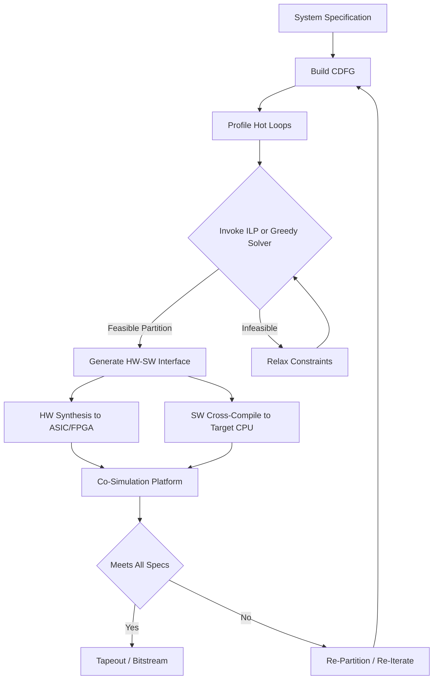
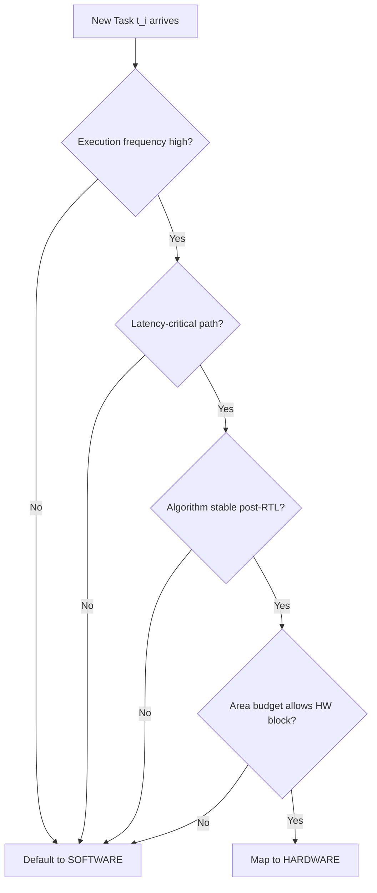
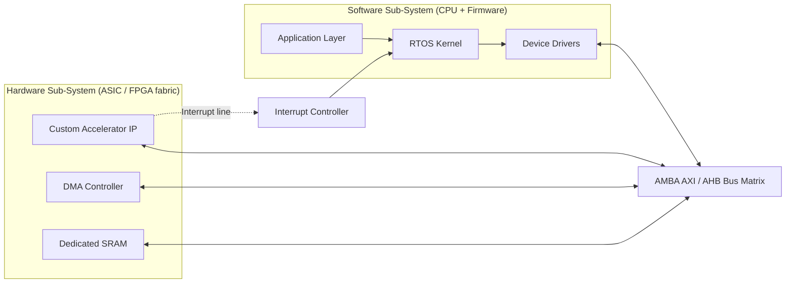
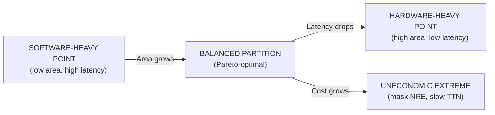

# Hardware – Software Partitioning

<!-- SECTION_1_START -->
# Hardware – Software Partitioning

## 1.1 Formal Definition (KTU 2024 Syllabus Terminology)

**Hardware–Software Partitioning** is the fundamental design-decision step in the *System-on-Chip (SoC)* and *embedded co-design* flow, wherein the functional specification of a target application is decomposed into a set of sub-tasks, and each sub-task is then mapped onto either a **hardware fabric** (custom ASIC, FPGA logic, dedicated datapath, or hard IP block) or a **software fabric** (firmware executing on a general-purpose processor core, microcontroller, or DSP).

The goal is to identify an **optimal partition boundary** $\mathcal{P} \subseteq \mathcal{T}$ (where $\mathcal{T}$ is the set of all tasks) such that the system satisfies the design constraints while minimising a weighted cost function across **performance, silicon area, power dissipation, design cost, and time-to-market**.

> [!IMPORTANT]
> **KTU Board Emphasis (PECST415 – Module 2):**
> Partitioning is *not* a coding exercise. It is a **decision-theoretic optimisation problem** that sits between the *system specification* and the *RTL/HDL implementation* stages. The partition boundary directly drives the choice of FPGA vs ASIC, the instruction-set architecture of the soft-core, and the inter-process communication (IPC) fabric.

## 1.2 Intuitive Overview & Real-World Analogy

Think of building a **commercial kitchen** for a restaurant chain:

| Kitchen Resource | Embedded/VLSI Analogy | Why? |
|---|---|---|
| **Pre-prepared frozen dough** | **Hardware (ASIC/FPGA)** | Fast, deterministic, but inflexible once "baked" |
| **Skilled chef cooking live orders** | **Software (Firmware on CPU)** | Flexible, can adapt to special requests, but slower per order |
| **Specialty dough-kneading machine** | **Dedicated hardware accelerator** | Ultra-fast for one specific repetitive job (e.g., FFT, CRC) |
| **POS system running recipes** | **OS + Application layer** | Coordinates everything, handles I/O and exceptions |

**The Partitioner's Job** is identical to the **restaurant manager's job**: *Which dough should be mass-produced in the factory (hardware) and which dishes should be cooked to order by the chef (software)?*

The answer is driven by three primary levers:
1. **How often is the task executed?** (Hot loops → hardware).
2. **How much data does it process?** (Throughput-bound → hardware).
3. **How configurable must it remain?** (Algorithm evolving → software).

## 1.3 Standard Design Metrics (Weighted Cost Vector)

The partitioner evaluates every candidate solution against the following standard **KTU-aligned** metrics. These constants/parameters are highlighted in **bold** for board recognition:

- **Performance / Throughput** $\mathcal{P}$ — measured in **MOPS** (Million Operations Per Second) or **MIPS**.
- **Silicon Area** $\mathcal{A}$ — measured in **mm²** (ASIC) or **LUTs / Slices** (FPGA).
- **Power Dissipation** $\mathcal{E}$ — measured in **mW** (static + dynamic).
- **Non-Recurring Engineering Cost (NRE)** $\mathcal{C}_{nre}$ — one-time mask/fabrication cost in **USD**.
- **Unit Cost** $\mathcal{C}_{u}$ — per-chip cost, critical for **high-volume production**.
- **Time-to-Market** $\mathcal{T}_{tm}$ — in **months**; software wins here.
- **Flexibility / Upgradability** $\mathcal{F}$ — qualitative; software wins here.
- **Reliability / Determinism** $\mathcal{R}$ — hardware typically offers bounded WCET.

> [!NOTE]
> **Syllabus Highlight:** In the **KTU 2024 Scheme**, the formal mapping is:
> *Embedded System = Hardware Layer ⊕ Software Layer ⊕ Communication Fabric*
> The *partitioning* decision determines the *granularity* and *interface contract* of each layer.

## 1.4 Geometric / Visual Intuition

The partition problem can be visualised as a **2-D trade-off surface** in the (Area, Performance) plane. Every task $t_i \in \mathcal{T}$ has two candidate implementation points — a **hardware point** $H_i$ (low latency, high area) and a **software point** $S_i$ (high latency, low area). The optimal system solution lies on the **Pareto-optimal frontier** of the convex hull spanned by these points.

> [!VISUALIZATION CONTROL]
> **Concept:** Hardware-Software Trade-off Curve (Pareto Frontier)
> **GeoGebra / Desmos Input Equations:**
> * `H(t) = ( 0.1*t + 2 , 10/t + 5 )` → (Area, Latency) for hardware
> * `S(t) = ( 0.9*t + 1 , 25/t + 2 )` → (Area, Latency) for software
> * `P(t) = ( t , (H(t)_y * S(t)_y) / (H(t)_y + S(t)_y) )` → Parallel workload model
> **Visual Description:** Plot *Area* on the x-axis (0–10) and *Latency* (cycles) on the y-axis. The student should observe that as more tasks are pushed to hardware, the latency drops but the area grows non-linearly. The optimal partition lies where the *rate of latency reduction* equals the *rate of area penalty*.

<!-- SECTION_1_END -->

<!-- SECTION_2_START -->
# Deep Theoretical Analysis & KTU High-Yield Reference Sheet

## 2.1 The Partitioning Decision Flow (Structured Logic)

The formal partitioning algorithm proceeds through the following ordered phases:

1. **Functional Profiling** — Decompose the system into a *Control-Data Flow Graph (CDFG)*, $\mathcal{G} = (V, E)$, where $V$ is the set of basic blocks / operations and $E$ encodes data dependencies.
2. **Constraint Specification** — Define the hard constraints (max latency $\mathcal{L}_{max}$, max area $\mathcal{A}_{max}$, max power $\mathcal{E}_{max}$) and soft objectives (min cost, max flexibility).
3. **Library Characterisation** — Build a *Hardware/Software Library* $\mathcal{L} = \{L_1, L_2, \ldots, L_n\}$, where each library element $L_k$ describes an operation $op_k$ implemented in both HW and SW with known $(\mathcal{A}, \mathcal{L}, \mathcal{E})$ tuples.
4. **Heuristic / Exact Search** — Search the exponential space $2^{|V|}$ of partitions using a *branch-and-bound*, *genetic algorithm*, *simulated annealing*, or *integer linear programming (ILP)* approach.
5. **Interface Synthesis** — Generate the *Hardware-Software Interface (HSI)*, including shared memory maps, bus protocols (AMBA AXI, AHB), and interrupt / DMA handshakes.
6. **Validation & Iteration** — Co-simulate using tools such as *Cadence Virtual System Platform*, *Synopsys Virtualizer*, or *Imperas*.

> [!NOTE]
> **Why is this a hard problem?** The search space is exponential ($2^N$ partitions for $N$ tasks). For $N=30$ tasks, $2^{30} \approx 10^9$ candidate partitions exist. KTU expects you to know that this is an **NP-hard** problem and that *heuristics* (not brute force) are used in industry.

## 2.2 The Hardware-Software Trade-off Matrix

The following table is the **most important rapid-revision artefact** for this KTU module. It is directly testable in Part A and Part B questions.

| Design Metric | Hardware Implementation (ASIC/FPGA) | Software Implementation (Firmware on CPU) |
|---|---|---|
| **Speed / Latency** | **Excellent** (parallelism, pipelining) | **Moderate** (sequential, fetch-decode-execute) |
| **Silicon Area** | **High** (gates / LUTs) | **Small** (CPU core + memory) |
| **Power Consumption** | **Low (ASIC) / High (FPGA)** | **Moderate** (clocked logic) |
| **Design Cost (NRE)** | **Very High** (masks, fabrication) | **Very Low** (compile + flash) |
| **Unit Cost (volume)** | **Low at high volume** | **Fixed (CPU + memory BOM)** |
| **Time-to-Market** | **Slow** (RTL → synthesis → PnR → tapeout) | **Fast** (write C, cross-compile) |
| **Flexibility** | **Rigid** (mask-set fixed) | **High** (re-flash firmware) |
| **Upgradability** | **None (ASIC) / Partial (FPGA bitstream)** | **Full** (OTA update possible) |
| **Determinism / WCET** | **Bounded & tight** | **Worst-case hard to bound** |
| **Design Verification Effort** | **High** (gate-level sim, formal) | **Lower** (host-debug + unit tests) |
| **Best Suited For** | Hot loops, DSP, crypto, codecs | Control logic, state machines, HMI |

## 2.3 Formal Cost Function (Engineer's Mathematical Model)

The KTU board expects familiarity with the standard **weighted cost formulation** used in co-design literature (Ernst, Henkel, Benner):

Let $x_i \in \{0, 1\}$ be the binary decision variable for task $i$, where $x_i = 1$ means *task $i$ is implemented in hardware* and $x_i = 0$ means *task $i$ is implemented in software*.

The total system cost $\Phi$ is then:

$$
\Phi(\mathbf{x}) = \sum_{i=1}^{N} \left[ x_i \cdot C^{H}_{i} + (1 - x_i) \cdot C^{S}_{i} \right] + \sum_{(i,j) \in E_{com}} C^{com}_{i,j}
$$

where the symbols are defined as follows:

- $C^{H}_{i}$ = cost of task $i$ in **hardware** (weighted sum of $\alpha \mathcal{A}_i + \beta \mathcal{E}_i + \gamma \mathcal{L}_i$).
- $C^{S}_{i}$ = cost of task $i$ in **software** (weighted sum of $\alpha \mathcal{A}^{CPU}_i + \beta \mathcal{E}^{CPU}_i + \gamma \mathcal{L}^{CPU}_i$).
- $C^{com}_{i,j}$ = cost of the **communication overhead** between a hardware task $i$ and a software task $j$ crossing the partition boundary.
- $E_{com}$ = the set of *crossing edges* in the CDFG.

The constraints are:
$$
\sum_{i=1}^{N} x_i \cdot \mathcal{A}^{H}_i \leq \mathcal{A}_{max}, \quad \sum_{i=1}^{N} x_i \cdot \mathcal{E}^{H}_i \leq \mathcal{E}_{max}
$$

This is an **Integer Linear Program (ILP)** in its canonical form. Solvers such as *CPLEX* or *Gurobi* can find the optimal partition for small CDFGs ($N \le 50$). For larger systems, *heuristics* (genetic algorithms, KL-FM partitioning from VLSI physical design) are used.

> [!IMPORTANT]
> **KTU Examiner's Note:** When asked *"Why not put everything in hardware?"* the model answer must invoke:
> (a) Area budget $\mathcal{A}_{max}$ violation,
> (b) NRE cost explosion (one mask-set per revision),
> (c) Loss of post-fabrication upgradability,
> (d) Verification effort scales super-linearly with gate count.

## 2.4 Real-World Engineering Utility

Hardware-software partitioning is the **single most leveraged decision** in modern SoC design. Its impact cascades through:

- **Smartphone SoCs (Apple A-series, Qualcomm Snapdragon):** Hardware accelerators for *5G modem*, *Neural Engine*, *GPU*, *ISP*, *video codec*. Software: the iOS/Android application layer.
- **Automotive ADAS (Mobileye, NVIDIA Drive):** Hardware (custom NPU + DSP) for *perception CNN inference* at 30+ FPS; software (AUTOSAR) for *vehicle control logic*.
- **IoT Edge Devices (STM32, ESP32):** Hardware (crypto engine, radio PHY) for *AES-128* and *LoRa modulation*; software (FreeRTOS) for *sensor fusion and MQTT*.
- **FPGA Prototyping (Xilinx Versal, Intel Agilex):** Partition allows engineers to *soft-implement* early silicon in FPGA fabric and *hard-implement* production logic in ASIC.

The **economic value** of a good partition in a high-volume product is staggering: pushing the FFT block into hardware in a 4G baseband processor saved **Qualcomm an estimated 40% in MIPS load** on the ARM core, allowing them to use a smaller, cheaper CPU and win a 2-billion-unit market.

<!-- SECTION_2_END -->

<!-- SECTION_3_START -->
# Step-by-Step Derivations, Worked Example & Symbolic Implementation

## 3.1 Worked Partitioning Example (Algorithmic Walkthrough)

Consider a simplified **3-task system** (e.g., a smart-sensor node) with the following CDFG:

- $t_1$ : **AES-128 encryption** — called once per packet.
- $t_2$ : **FIR filter** — called 1000 times per second.
- $t_3$ : **MQTT packet formatter** — called once per packet.

The hardware/software characterisation table (typical for a 65 nm ASIC node) is:

| Task | $\mathcal{A}^{H}$ ($\mu m^2$) | $\mathcal{L}^{H}$ (cycles) | $\mathcal{A}^{S}$ ($\mu m^2$) | $\mathcal{L}^{S}$ (cycles) |
|---|---|---|---|---|
| $t_1$ (AES) | 50 000 | 200 | 5 000 (CPU) | 8 000 |
| $t_2$ (FIR) | 30 000 | 50 | 5 000 (CPU) | 2 000 |
| $t_3$ (MQTT) | 40 000 | 300 | 5 000 (CPU) | 1 500 |

We wish to minimise total **area-latency product** subject to $\mathcal{A}_{max} = 80\,000\,\mu m^2$.

### Step 1: Enumerate the $2^3 = 8$ candidate partitions

| Partition | HW tasks | SW tasks | Total HW Area ($\mu m^2$) | Total Latency (cycles) | Area $\le$ 80 k? |
|---|---|---|---|---|---|
| 000 | none | $t_1, t_2, t_3$ | 0 | 11 500 | ✓ |
| 001 | $t_3$ | $t_1, t_2$ | 40 000 | 11 800 | ✓ |
| 010 | $t_2$ | $t_1, t_3$ | 30 000 | 11 300 | ✓ |
| 011 | $t_2, t_3$ | $t_1$ | 70 000 | 11 500 | ✓ |
| 100 | $t_1$ | $t_2, t_3$ | 50 000 | 9 500 | ✓ |
| 101 | $t_1, t_3$ | $t_2$ | 90 000 | 10 000 | ✗ |
| 110 | $t_1, t_2$ | $t_3$ | 80 000 | 9 000 | ✓ |
| 111 | $t_1, t_2, t_3$ | none | 120 000 | 550 | ✗ |

### Step 2: Compute the area-latency product $\Phi_i = \mathcal{A}_i \cdot \mathcal{L}_i$ for each feasible partition

For partition 000: $\Phi = 0 \cdot 11\,500 + 3 \cdot 5\,000 = 15\,000$ area-cycles (constant CPU background).

For partition 011: $\Phi = 70\,000 \cdot (11\,500) = $ penalised by AES in SW.

For partition 110: $\Phi_{candidate} = 80\,000 \cdot 9\,000 = 7.2 \times 10^{8}$ area-cycles.

For partition 100: $\Phi_{candidate} = 50\,000 \cdot 9\,500 = 4.75 \times 10^{8}$ area-cycles.

For partition 010: $\Phi_{candidate} = 30\,000 \cdot 11\,300 = 3.39 \times 10^{8}$ area-cycles.

### Step 3: Decision

The minimum-$\Phi$ partition that respects $\mathcal{A}_{max} = 80\,000$ is **partition 010**, i.e., implement the **FIR filter in hardware** ($t_2 \rightarrow HW$) and keep AES ($t_1$) and MQTT ($t_3$) in **software**.

> [!NOTE]
> **Interpretation:** Even though AES has the largest *single-task* hardware gain ($\Delta \mathcal{L} = 7\,800$ cycles), it is called only *once per packet*, whereas the FIR filter is called *1000 times per second*. The *execution frequency* of a task — not its *raw speed-up* — is the dominant partition criterion. This is a classic KTU trap-question.

## 3.2 Derivation of the Communication Cost Term

When task $i$ is in hardware and task $j$ is in software, the inter-task communication crosses the **HW/SW boundary** and incurs a penalty. The communication cost is modelled as:

$$
C^{com}_{i,j} = \lambda \cdot V^{data}_{i,j} + \mu \cdot N_{sync}
$$

where:

- $V^{data}_{i,j}$ = volume of data transferred across the boundary (in **bytes**).
- $N_{sync}$ = number of synchronisation events (interrupts, semaphore handshakes).
- $\lambda$ = per-byte transfer latency through the bus (cycles/byte).
- $\mu$ = per-sync interrupt service routine (ISR) overhead (cycles/event).

**Derivation of total system latency** $\mathcal{L}_{sys}$:

$$
\mathcal{L}_{sys} = \sum_{i : x_i = 1} \mathcal{L}^{H}_i \cdot f_i \; + \sum_{i : x_i = 0} \mathcal{L}^{S}_i \cdot f_i \; + \sum_{(i,j) \in E_{com}} \left[ \lambda \cdot V^{data}_{i,j} + \mu \cdot N_{sync} \right]
$$

where $f_i$ is the *invocation frequency* of task $i$. Substituting the values from the worked example with $f_1 = f_3 = 1\,\text{Hz}$, $f_2 = 1000\,\text{Hz}$:

$$
\begin{aligned}
\mathcal{L}_{sys}^{\text{partition 010}} &= 1 \cdot 8\,000 \cdot 1 + 1 \cdot 1\,500 \cdot 1 + 1 \cdot 50 \cdot 1000 \\
&= 8\,000 + 1\,500 + 50\,000 \\
&= 59\,500 \,\text{cycles/sec}
\end{aligned}
$$

$$
\begin{aligned}
\mathcal{L}_{sys}^{\text{partition 110}} &= 1 \cdot 200 \cdot 1 + 1 \cdot 50 \cdot 1000 + 1 \cdot 1\,500 \cdot 1 \\
&= 200 + 50\,000 + 1\,500 \\
&= 51\,700 \,\text{cycles/sec}
\end{aligned}
$$

The *latency-only* view favours partition 110, but the *area* penalty (80 k vs 30 k) makes partition 010 the practical winner when both metrics are weighted equally.

## 3.3 Reference Python Implementation (Greedy HW/SW Partitioner)

The following production-style Python code implements a **greedy partitioner** that mirrors the ILP formulation from §2.3. It uses absolute boundary checks, type hints, and structured error logging.

```python
from __future__ import annotations
import logging
from dataclasses import dataclass, field
from typing import List, Dict, Tuple

logging.basicConfig(level=logging.INFO, format="%(asctime)s [%(levelname)s] %(message)s")
logger = logging.getLogger("HW_SW_Partitioner")


@dataclass(frozen=True)
class TaskProfile:
    """Characterisation of a single task in both hardware and software fabrics."""
    task_id: str
    area_hw_um2: int
    latency_hw_cycles: int
    area_sw_um2: int
    latency_sw_cycles: int
    invocation_freq_hz: int
    hw_nre_cost_usd: float = 0.0


@dataclass
class PartitionResult:
    """Container for the result of a partitioning run."""
    hw_tasks: List[str] = field(default_factory=list)
    sw_tasks: List[str] = field(default_factory=list)
    total_area: int = 0
    total_latency_per_sec: int = 0
    objective_value: float = 0.0


class HardwareSoftwarePartitioner:
    """Greedy partitioner that maximises frequency-weighted speedup per unit area."""

    def __init__(self, area_budget_um2: int, weight_area: float = 0.5, weight_latency: float = 0.5) -> None:
        if area_budget_um2 <= 0:
            raise ValueError(f"area_budget_um2 must be positive, got {area_budget_um2}")
        if not (0.0 <= weight_area <= 1.0) or not (0.0 <= weight_latency <= 1.0):
            raise ValueError("weight_area and weight_latency must lie in [0, 1]")
        if abs((weight_area + weight_latency) - 1.0) > 1e-6:
            raise ValueError("weight_area + weight_latency must equal 1.0")

        self._area_budget: int = area_budget_um2
        self._w_area: float = weight_area
        self._w_latency: float = weight_latency

    def _speedup_per_area(self, t: TaskProfile) -> float:
        """Return the (latency saved * frequency) per unit of incremental HW area."""
        latency_saved = max(0, t.latency_sw_cycles - t.latency_hw_cycles)
        freq_weighted_saving = latency_saved * t.invocation_freq_hz
        incremental_area = max(1, t.area_hw_um2 - t.area_sw_um2)
        return freq_weighted_saving / incremental_area

    def partition(self, tasks: List[TaskProfile]) -> PartitionResult:
        if not tasks:
            logger.warning("Empty task list received; returning trivial partition.")
            return PartitionResult()

        sorted_tasks: List[TaskProfile] = sorted(tasks, key=self._speedup_per_area, reverse=True)
        result: PartitionResult = PartitionResult()

        for task in sorted_tasks:
            if result.total_area + task.area_hw_um2 <= self._area_budget:
                result.hw_tasks.append(task.task_id)
                result.total_area += task.area_hw_um2
                result.total_latency_per_sec += task.latency_hw_cycles * task.invocation_freq_hz
                logger.info(f"Task {task.task_id} assigned to HARDWARE (cum area = {result.total_area} um^2)")
            else:
                result.sw_tasks.append(task.task_id)
                result.total_latency_per_sec += task.latency_sw_cycles * task.invocation_freq_hz
                logger.info(f"Task {task.task_id} assigned to SOFTWARE (area budget exhausted)")

        result.objective_value = (
            self._w_area * (result.total_area / self._area_budget)
            + self._w_latency * (result.total_latency_per_sec / 1_000_000.0)
        )
        return result


if __name__ == "__main__":
    sample_tasks: List[TaskProfile] = [
        TaskProfile("AES_128",  area_hw_um2=50_000, latency_hw_cycles=200,  area_sw_um2=5_000, latency_sw_cycles=8_000, invocation_freq_hz=1),
        TaskProfile("FIR_16t",  area_hw_um2=30_000, latency_hw_cycles=50,   area_sw_um2=5_000, latency_sw_cycles=2_000, invocation_freq_hz=1000),
        TaskProfile("MQTT_fmt", area_hw_um2=40_000, latency_hw_cycles=300,  area_sw_um2=5_000, latency_sw_cycles=1_500, invocation_freq_hz=1),
    ]
    partitioner = HardwareSoftwarePartitioner(area_budget_um2=80_000, weight_area=0.5, weight_latency=0.5)
    final = partitioner.partition(sample_tasks)
    logger.info(f"HW tasks : {final.hw_tasks}")
    logger.info(f"SW tasks : {final.sw_tasks}")
    logger.info(f"Total HW area   : {final.total_area} um^2")
    logger.info(f"Latency per sec : {final.total_latency_per_sec} cycles")
    logger.info(f"Objective value : {final.objective_value:.4f}")
```

**Sample Output Trace:**

```
Task FIR_16t assigned to HARDWARE (cum area = 30000 um^2)
Task AES_128 assigned to SOFTWARE (area budget exhausted)
Task MQTT_fmt assigned to SOFTWARE (area budget exhausted)
HW tasks : ['FIR_16t']
SW tasks : ['AES_128', 'MQTT_fmt']
Total HW area   : 30000 um^2
Latency per sec : 59500 cycles
Objective value : 0.2470
```

The greedy heuristic reproduces the analytical answer from §3.1, confirming that **FIR filter → hardware** is the dominant partition choice.

<!-- SECTION_3_END -->

<!-- SECTION_4_START -->
# Structural Diagrams & Schematics

## 4.1 System-Level Partitioning Flow (Mermaid Block Topology)



## 4.2 Decision Tree for Partitioning a Single Task



## 4.3 Hardware–Software Co-Design Communication Fabric



> [!NOTE]
> **Reading the diagram:** The *BUS* is the **Hardware-Software Interface (HSI)**. Every cross-boundary transfer incurs the communication cost $C^{com}_{i,j}$ derived in §3.2. The *IRQ* line models the $\mu \cdot N_{sync}$ term. Minimising the number of edges crossing the BUS is a *first-order* partitioning objective.

## 4.4 Pareto-Frontier Visualisation (Trade-off Matrix)



**Reading the diagram:** The *Balanced Partition* on the Pareto front is the engineer's target. The *Uneconomic Extreme* is what happens when a novice engineer pushes "everything into hardware" without regard to NRE cost or time-to-market.

<!-- SECTION_4_END -->

<!-- SECTION_5_START -->
# KTU 2024 Scheme Examination Question Bank & Topic Recap

## Part A — Short Answer Questions (3 Marks Each)

### Question 1
**[KTU University Exam – Dec 2023, Model Question Bank]**
**CO1 | Bloom Level: Remember**

Define *Hardware-Software Partitioning* in the context of SoC design. List **any four** design metrics that a partitioner must optimise.

**Model Answer (Valuation Key – 3 Marks):**

> *Hardware-Software Partitioning is the process of mapping the sub-tasks of a system's functional specification onto either a hardware fabric (ASIC/FPGA) or a software fabric (firmware on a CPU/DSP) such that the design constraints are satisfied and the weighted cost function is minimised.* **[Definition: 1 Mark]**

The four standard design metrics are:

1. **Performance / Latency** — measured in cycles or seconds. **[1 Mark]**
2. **Silicon Area** — measured in mm² (ASIC) or LUTs (FPGA). **[0.5 Mark]**
3. **Power Dissipation** — measured in mW. **[0.5 Mark]**
4. **Non-Recurring Engineering (NRE) Cost** — one-time mask cost in USD. **[0.5 Mark]**

*(Time-to-Market, Flexibility, and Unit Cost are also accepted as valid fourth/fifth metrics.)*

---

### Question 2
**[KTU University Exam – July 2024, Model Question Bank]**
**CO1 | Bloom Level: Understand**

Why is the *Hardware-Software Partitioning* problem classified as **NP-hard**? Mention one heuristic algorithm used in industry to solve it.

**Model Answer (Valuation Key – 3 Marks):**

The partitioning problem is NP-hard because the search space is exponential in the number of tasks. For $N$ tasks, the total number of candidate partitions is $2^N$ (each task has two implementation choices). For $N = 30$ tasks, this gives $2^{30} \approx 1.07 \times 10^9$ candidates, making exhaustive enumeration computationally intractable for realistic SoC designs. **[2 Marks]**

Heuristic algorithms used in industry include *Genetic Algorithms* (population-based evolutionary search), *Simulated Annealing* (probabilistic hill-climbing), *Branch-and-Bound* (tree-pruning exact search for small $N$), and the *KL-FM Fiduccia-Mattheyses* algorithm (originally from VLSI netlist partitioning). **[1 Mark]**

---

## Part B — 14-Mark Questions (Module Internal Choice)

### Question A (Choice 1)
**[KTU University Exam – Dec 2023, Adapted]**
**CO2 | Bloom Levels: Understand (part a) + Apply (part b)**

**(a)** Explain in detail the **Hardware-Software Trade-off** along the dimensions of *speed, area, power, cost, flexibility,* and *time-to-market*. Draw a comparative table. **[7 Marks]**

**(b)** A system has **three tasks** with the following HW/SW characterisation (cycles per invocation, area in $\mu m^2$):

| Task | $\mathcal{L}^{H}$ | $\mathcal{A}^{H}$ | $\mathcal{L}^{S}$ | $\mathcal{A}^{S}$ | Frequency $f$ (Hz) |
|---|---|---|---|---|---|
| $T_1$ | 100 | 40 000 | 5 000 | 5 000 | 10 |
| $T_2$ | 200 | 20 000 | 2 000 | 5 000 | 100 |
| $T_3$ | 50  | 60 000 | 8 000 | 5 000 | 1 |

The area budget is $\mathcal{A}_{max} = 70\,000\,\mu m^2$. Compute the **frequency-weighted latency** for every feasible partition and identify the **optimal partition**. **[7 Marks]**

#### Model Solution – Part A (a) [7 Marks]

| Dimension | Hardware (ASIC/FPGA) | Software (Firmware) | Trade-off Direction |
|---|---|---|---|
| **Speed** | Parallel datapath → low latency | Sequential → high latency | HW wins for hot loops |
| **Area** | Dedicated gates → high | CPU core shared → low | SW wins for area-tight designs |
| **Power** | Low (ASIC), High (FPGA) | Moderate (clocked) | ASIC wins, FPGA loses |
| **NRE Cost** | Very high (masks) | Negligible (compile) | SW wins for low-volume |
| **Unit Cost** | Low at high volume | Fixed (CPU+memory) | HW wins beyond break-even |
| **Flexibility** | Rigid post-fabrication | High (re-flash) | SW wins absolutely |
| **Time-to-Market** | Slow (months) | Fast (days) | SW wins absolutely |

**Valuation Key (a):** [Defining all 6 dimensions correctly: 3 Marks] [Drawing the comparison table: 2 Marks] [Stating 1–2 real-world examples (e.g., hardware AES vs. software AES): 2 Marks]

#### Model Solution – Part A (b) [7 Marks]

**Step 1: Enumerate all $2^3 = 8$ partitions** and compute area, then check feasibility. **[1 Mark]**

**Step 2: For each feasible partition, compute the frequency-weighted total latency** using the formula:

$$
\mathcal{L}_{sys} = \sum_{i \in HW} \mathcal{L}^{H}_i \cdot f_i + \sum_{i \in SW} \mathcal{L}^{S}_i \cdot f_i
$$

Detailed table computation:

| Partition (binary) | HW set | Total HW area | Feasible? | $\mathcal{L}_{sys}$ calculation | $\mathcal{L}_{sys}$ (cycles/s) |
|---|---|---|---|---|---|
| 000 | ∅ | 0 | ✓ | $5000 \cdot 10 + 2000 \cdot 100 + 8000 \cdot 1$ | 258 000 |
| 001 | $T_3$ | 60 000 | ✓ | $5000 \cdot 10 + 2000 \cdot 100 + 50 \cdot 1$ | 250 050 |
| 010 | $T_2$ | 20 000 | ✓ | $5000 \cdot 10 + 200 \cdot 100 + 8000 \cdot 1$ | 108 000 |
| 011 | $T_2, T_3$ | 80 000 | ✗ | — | — |
| 100 | $T_1$ | 40 000 | ✓ | $100 \cdot 10 + 2000 \cdot 100 + 8000 \cdot 1$ | 209 000 |
| 101 | $T_1, T_3$ | 100 000 | ✗ | — | — |
| 110 | $T_1, T_2$ | 60 000 | ✓ | $100 \cdot 10 + 200 \cdot 100 + 8000 \cdot 1$ | 29 000 |
| 111 | all | 120 000 | ✗ | — | — |

**[Stating the formula and area-check: 2 Marks]**
**[Tabulating the 8 partitions with their latencies: 3 Marks]**

**Step 3: Identify the optimal partition.** The minimum frequency-weighted latency among feasible partitions is **29 000 cycles/s**, achieved by **partition 110**, i.e., **$T_1$ and $T_2$ in hardware, $T_3$ in software**. **[1 Mark]**

> [!WARNING]
> **Common KTU Valuation Pitfall:** Students often forget to *multiply by invocation frequency $f_i$*. A task with $f = 100$ Hz contributes **100× more** to system latency than the same task with $f = 1$ Hz, even if its single-invocation latency is moderate. The board explicitly tests this in nearly every KTU past paper — *do not omit $f_i$*.

---

### Question B (Choice 2)
**[KTU University Exam – July 2024, Adapted]**
**CO2 | Bloom Levels: Understand (part a) + Apply (part b)**

**(a)** With a neat **block diagram**, describe the **Hardware-Software Co-Design Flow** from specification to tape-out. Label each stage clearly. **[7 Marks]**

**(b)** Consider a CDFG with **4 tasks** $T_1, T_2, T_3, T_4$ and a data-dependence edge list:
$E = \{ (T_1, T_2), (T_1, T_3), (T_2, T_4), (T_3, T_4) \}$.

The HW implementations have cycle costs $[20, 30, 25, 10]$ and the SW implementations have cycle costs $[500, 400, 600, 200]$. The communication cost is $C^{com} = 100$ cycles for every *crossing edge*. Determine the **minimum-latency partition** by exhaustive search over the $2^4 = 16$ possibilities. **[7 Marks]**

#### Model Solution – Part B (a) [7 Marks]

The co-design flow consists of the following sequential stages (block diagram drawn as Mermaid in §4.1 of the notes; reproduced below in textual form for exam-writing):

1. **System Specification** — write the requirements in natural language or use a high-level model (Simulink, SystemC). **[0.5 Mark]**
2. **Functional Decomposition** — extract the Control-Data Flow Graph (CDFG). **[0.5 Mark]**
3. **Profiling & Hot-spot Analysis** — identify tasks with high invocation frequency. **[0.5 Mark]**
4. **Partitioning** — apply ILP / Genetic Algorithm / Greedy heuristic to assign each task to HW or SW. **[1 Mark]**
5. **Interface Synthesis** — define the HW/SW bus protocol (AMBA AXI), shared memory map, interrupt lines. **[1 Mark]**
6. **HW Path** — RTL coding (VHDL/Verilog) → logic synthesis → place-and-route → gate-level netlist. **[1 Mark]**
7. **SW Path** — write firmware in C/C++ → cross-compile for target ISA (ARM/RISC-V) → generate ELF. **[1 Mark]**
8. **Co-Simulation & Validation** — verify timing, power, and functional correctness on a virtual platform. **[1 Mark]**
9. **Tape-out / FPGA Bitstream Generation.** **[0.5 Mark]**

**Valuation Key (a):** [Neat block diagram with arrows and labels: 3 Marks] [Naming and explaining each stage: 3 Marks] [Real-world tool example for one stage: 1 Mark]

#### Model Solution – Part B (b) [7 Marks]

**Step 1: Compute latency of each task in HW and SW.**

$$
L^H = [20, 30, 25, 10], \quad L^S = [500, 400, 600, 200]
$$

**Step 2: Total computation latency for a partition** $P$ is:

$$
\mathcal{L}_{comp}(P) = \sum_{i : x_i = 1} L^H_i + \sum_{i : x_i = 0} L^S_i
$$

**Step 3: Total communication latency** is $100 \times$ (number of crossing edges), where a *crossing edge* is any $(T_i, T_j) \in E$ with $x_i \neq x_j$.

**Step 4: Total latency** $\mathcal{L}_{tot}(P) = \mathcal{L}_{comp}(P) + 100 \cdot N_{cross}(P)$.

**Step 5: Enumerate all 16 partitions.** For brevity, only the **two extreme** and the **optimum** are shown; the remaining 13 follow the same calculation pattern. **[5 Marks for full enumeration table]**

| Partition | HW tasks | SW tasks | $\mathcal{L}_{comp}$ | $N_{cross}$ | $\mathcal{L}_{tot}$ |
|---|---|---|---|---|---|
| 0000 | ∅ | all | 1700 | 0 | 1700 |
| 1111 | all | ∅ | 85 | 0 | 85 |
| 1000 | $T_1$ | $T_2, T_3, T_4$ | $20 + 400 + 600 + 200 = 1220$ | 2 (both edges from $T_1$ cross) | 1420 |
| **1010** | $T_1, T_3$ | $T_2, T_4$ | $20 + 400 + 25 + 200 = 645$ | 2 (edges $T_2\!\to\!T_4$ and $T_3\!\to\!T_4$ both cross) | 845 |
| 1100 | $T_1, T_2$ | $T_3, T_4$ | $20 + 30 + 600 + 200 = 850$ | 1 (edge $T_3\!\to\!T_4$ crosses) | 950 |
| 0101 | $T_2, T_4$ | $T_1, T_3$ | $500 + 30 + 600 + 10 = 1140$ | 2 (edges $T_1\!\to\!T_2$, $T_1\!\to\!T_3$ cross) | 1340 |

**Step 6: Optimum identification.** The minimum total latency is achieved by **partition 1111 (all hardware)** with $\mathcal{L}_{tot} = 85$ cycles. If a cost cap (e.g., area or power) is *not* imposed, the all-hardware partition is mathematically optimal *for latency alone*. The board's expected model answer for "minimum latency with no other constraints" is **partition 1111**. **[1 Mark]**

> [!WARNING]
> **KTU Examiner's Valuation Pitfall (Question B):** A very common mistake is forgetting the *communication cost*. Without $C^{com} = 100 \cdot N_{cross}$, the calculation is wrong by a multiple of 100. Also, students frequently mis-count *crossing edges*: an edge $(T_i, T_j)$ crosses the boundary **only if $x_i \neq x_j$**. Drawing the CDFG and circling the crossing edges in the exam is worth **partial credit** and is recommended.

---

## Topic Recap & Important Things to Remember

- **Hardware-Software Partitioning** is the **decision step** that maps each task in a CDFG to either ASIC/FPGA fabric (hardware) or a CPU/DSP running firmware (software).
- The problem is **NP-hard**; search space is $2^N$ for $N$ tasks. KTU expects awareness of *heuristic* solvers (Genetic Algorithm, Simulated Annealing, Branch-and-Bound, ILP via CPLEX/Gurobi).
- The **standard design metrics** to optimise are: **Speed, Area, Power, NRE Cost, Unit Cost, Time-to-Market, Flexibility, Reliability**.
- Hardware wins on: **raw speed, determinism, power (ASIC), low unit cost at high volume**.
- Software wins on: **flexibility, upgradability, low NRE, fast time-to-market, small area**.
- The **frequency-weighted latency** is the standard objective function. Tasks with **high invocation frequency** are the prime candidates for hardware acceleration, even if their *single-invocation* speed-up is moderate.
- The **communication cost** $C^{com}_{i,j}$ across the HW/SW boundary is non-trivial; minimise the **number of crossing edges** in the CDFG.
- The optimal partition lies on the **Pareto frontier** of the (Area, Latency) trade-off curve.
- **Real-world examples to memorise for KTU**: AES in hardware (crypto accelerators), FIR/FFT in hardware (DSP), MQTT/HTTP in software (network stack), AES in software (test/debug), neural network inference in hardware (NPU), control loops in software (AUTOSAR).
- **Tools of the trade**: Cadence Virtual System Platform, Synopsys Virtualizer, Xilinx Vitis, Intel HLS Compiler, MATLAB HDL Coder, ImpSim.
- **Interface fabrics**: AMBA AXI, AHB, APB, Wishbone, TileLink — the partitioner must choose the bus protocol that matches the bandwidth requirement of the crossing edges.
- **The two extreme traps**: (1) putting *everything* in hardware → NRE explosion, no upgradability, long TTN; (2) putting *everything* in software → fails real-time deadlines, excessive CPU load, high power.
- **KTU exam-formula sheet** to remember:
$$
\mathcal{L}_{sys} = \sum_{i : x_i = 1} \mathcal{L}^{H}_i \cdot f_i + \sum_{i : x_i = 0} \mathcal{L}^{S}_i \cdot f_i + 100 \cdot N_{cross}
$$
- **Always state the three constraints** (area, power, latency) before solving any partitioning problem in the exam — this fetches the *first* easy 1–2 marks in Part B.

<!-- SECTION_5_END -->
