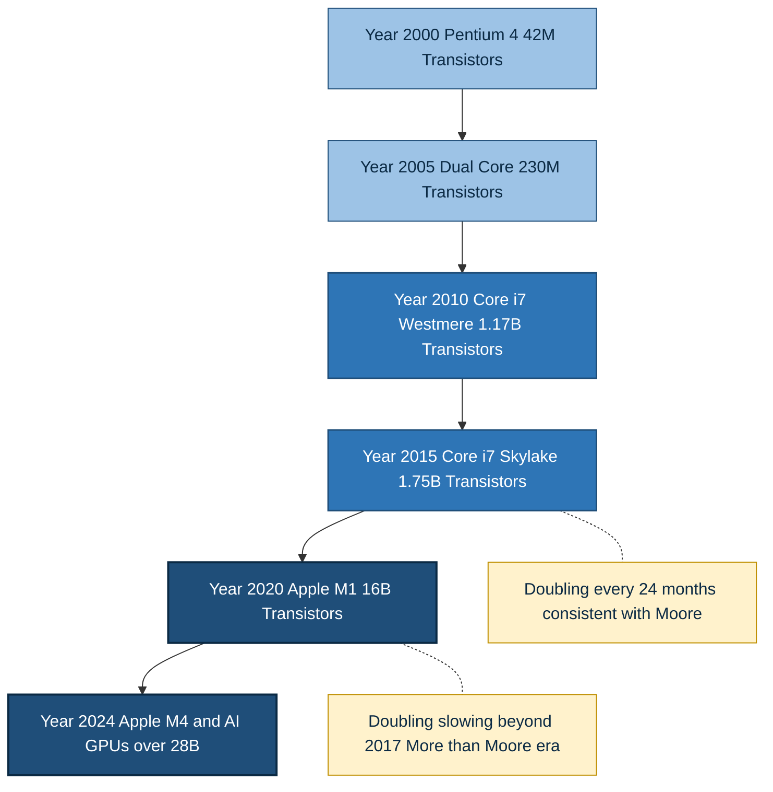
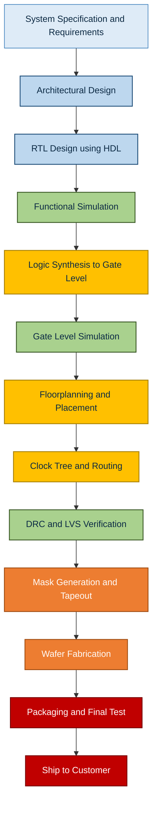

# Introduction to Integrated Circuits (ICs):

<!-- SECTION_1_START -->
# 1. Core Technical Definition & Intuitive Overview

## 1.1 Formal Definition

> [!IMPORTANT]
> **Integrated Circuit (IC)**: A miniaturized electronic circuit consisting of active components (transistors, diodes), passive components (resistors, capacitors), and their interconnections, all fabricated on a single continuous substrate of semiconductor material (typically silicon) using a combination of physical and chemical processes collectively known as **planar fabrication technology**.

In the context of the **KTU 2024 Scheme (VLSI Design – PECST415)**, an Integrated Circuit is formally defined under **Module 2** as the foundational building block of modern electronics in which thousands to billions of semiconductor devices are monolithically integrated on a single die (chip) extracted from a circular wafer of single-crystal silicon.

### Key Terminology Standardization (KTU Syllabus Glossary)

| Term | KTU Definition | Industry Standard Reference |
|---|---|---|
| **Wafer** | A thin slice (≈ **$750 \mu m$** thick) of single-crystal silicon, typically **$300\,mm$** in diameter (modern fabs) | Used as the substrate for IC fabrication |
| **Die / Chip** | A single rectangular block cut from a wafer containing one complete IC | Industry: "Die" = before packaging; "Chip" = after packaging |
| **Mask** | A photographic plate containing the geometric pattern to be transferred to the wafer | A modern IC may use **40–50 masks** |
| **Photolithography** | Optical pattern-transfer process using UV light and a photosensitive resist | Resolution governed by Rayleigh's criterion |
| **Feature Size** | The minimum geometric dimension that can be reliably patterned on the wafer | Modern nodes: **$5\,nm$, $3\,nm$** |

## 1.2 Conceptual Analogy & Intuition

> [!NOTE]
> **The "City on a Chip" Analogy**
> Imagine a **fully functional city** built on a single postage stamp. Roads (interconnects), houses (transistors), power stations (power rails), and communication networks (signal lines) are all constructed layer by layer on a single flat piece of land (silicon wafer). Every part of the city is connected and works together. That postage-stamp city is essentially what an **Integrated Circuit** is — a **city of transistors** on a tiny slice of silicon.

### Why "Integrated"?

The term **integrated** has a precise engineering meaning:

$$\text{Integrated} = \text{All components AND their interconnections are fabricated together on a single substrate}$$

This is fundamentally different from **discrete circuits**, where each transistor, resistor, or capacitor is a separate physical component soldered onto a printed circuit board (PCB).

> [!TIP]
> **Historical Context for Exam**: The term *integrated circuit* was coined by **Jack Kilby** (Texas Instruments) who demonstrated the first germanium-based IC on **September 12, 1958**. **Robert Noyce** (Fairchild Semiconductor) independently invented the silicon-based IC six months later. The two men are jointly credited as the co-inventors of the IC. Kilby received the **Nobel Prize in Physics in 2000** for this discovery.

## 1.3 The Generational Evolution of ICs (Historical Perspective)

The evolution of integrated circuits is broadly classified by the **era of the underlying fabrication technology**:

| Generation | Era | Feature Size | Device Count per Chip | Dominant Technology |
|---|---|---|---|---|
| **Gen 1** | 1960s | $\geq 10\,\mu m$ | $< 100$ (SSI / MSI) | BJT, Resistor-Transistor Logic (RTL) |
| **Gen 2** | 1970s | $6\,\mu m \rightarrow 3\,\mu m$ | $100 \rightarrow 10\,000$ (LSI) | NMOS, CMOS emerging, TTL |
| **Gen 3** | 1980s | $3\,\mu m \rightarrow 1\,\mu m$ | $10\,000 \rightarrow 10^6$ (VLSI) | CMOS, BiCMOS |
| **Gen 4** | 1990s | $1\,\mu m \rightarrow 0.18\,\mu m$ | $10^6 \rightarrow 10^8$ | Deep submicron CMOS |
| **Gen 5** | 2000s | $180\,nm \rightarrow 45\,nm$ | $10^8 \rightarrow 10^9$ | ULSI, Copper interconnects, Low-k dielectrics |
| **Gen 6** | 2010s | $32\,nm \rightarrow 14\,nm$ | $>10^9$ | FinFET, Multi-core, EUV (introduction) |
| **Gen 7** | 2020s | $10\,nm \rightarrow 3\,nm$ | $>50 \times 10^9$ | GAAFET, EUV lithography, Chiplets |

> [!NOTE]
> **KTU Board Insight**: When asked "Explain the evolution of ICs," examiners expect a clear table mapping **feature size shrinkage** to **transistor count growth**, often tied to **Moore's Law** as the governing principle. Memorize the table above — it is high-yield for short-answer questions.

## 1.4 Visualizing the Scale — A Geometric Intuition

> [!VISUALIZATION CONTROL]
> **Concept:** Comparing IC feature sizes to familiar real-world objects
> **Reference Scale Equations (logarithmic, on a Desmos graph):**
> * `f(x) = log10(7.5e-2)` $\Rightarrow$ Diameter of a human hair (m)  ≈ $-1.12$
> * `f(x) = log10(1e-5)` $\Rightarrow$ Older IC feature (10 $\mu m$) ≈ $-5$
> * `f(x) = log10(5e-9)` $\Rightarrow$ Modern IC feature (5 nm) ≈ $-8.3$
> * `f(x) = log10(1e-10)` $\Rightarrow$ Diameter of a silicon atom ≈ $-10$
> **Visual Description:** Plot these as discrete points on a log scale y-axis. Students will see that **modern IC features are only 50× larger than a single silicon atom**, leaving virtually no room for further dramatic shrinkage. This is the **physical atomistic limit** that modern researchers (Intel, TSMC) are actively working against through novel architectures like **Gate-All-Around FETs (GAAFETs)** and **3D stacking**.

## 1.5 The Three Pillars of Modern IC Technology

> [!IMPORTANT]
> Every modern IC, regardless of its application, is defined by three foundational pillars:
> 1. **Monolithic Fabrication** – All devices are built on a single silicon substrate.
> 2. **Planar Process** – Devices and interconnects are formed in horizontal layers.
> 3. **Batch Processing** – Hundreds of identical ICs are fabricated simultaneously on a single wafer, making per-chip cost very low.

These three principles together explain *why* ICs are inexpensive, reliable, and ubiquitous — a point examiners love to test in **Part A 3-mark questions**.

<!-- SECTION_1_END -->

<!-- SECTION_2_START -->
# 2. Deep Theoretical Analysis & KTU High-Yield Formula Sheet

## 2.1 Classification of Integrated Circuits (KTU Module 2 Core Topic)

Integrated circuits are classified along **three independent axes** in the KTU syllabus. Mastering this classification is **mandatory** for both Part A and Part B questions.

### 2.1.1 Classification by Signal Type

| Class | Definition | Typical Devices | Application Domain |
|---|---|---|---|
| **Analog ICs** | Process continuous-time, continuous-amplitude signals | Op-amps, voltage regulators, PLLs, RF amplifiers | Audio, RF communication, sensors |
| **Digital ICs** | Process discrete-time, discrete-amplitude (binary) signals | Microprocessors, FPGAs, ASICs, memory | Computing, data processing |
| **Mixed-Signal ICs** | Combine both analog and digital on the same die | ADCs, DACs, Codecs, SoCs | Mobile phones, IoT devices |

### 2.1.2 Classification by Scale of Integration (Most Tested Classification)

This is the **highest-yield sub-topic** in Module 2 for KTU examinations. The classification is based on the **number of active devices (gates/transistors) integrated onto a single chip**.

| Category | Acronym | Gate Count / Transistor Count | Typical Example |
|---|---|---|---|
| **Small-Scale Integration** | SSI | $< 10$ gates or $< 100$ transistors | Logic gates, Flip-flops (basic) |
| **Medium-Scale Integration** | MSI | $10 \rightarrow 100$ gates | Decoders, Multiplexers, Counters, Adders |
| **Large-Scale Integration** | LSI | $100 \rightarrow 10\,000$ gates | 4-bit/8-bit microprocessors, ROMs |
| **Very Large-Scale Integration** | VLSI | $10\,000 \rightarrow 10^6$ gates | 16/32-bit CPUs, DSPs, simple SoCs |
| **Ultra Large-Scale Integration** | ULSI | $> 10^6$ gates ($> 10^9$ transistors) | Modern GPUs, multi-core CPUs, AI accelerators |
| **System-on-Chip** | SoC | Entire system on one die | Smartphone processors (e.g., Snapdragon, Apple A-series) |
| **System-in-Package** | SiP | Multiple dies in one package | Apple M-series (combining CPU + GPU + memory dies) |

> [!NOTE]
> **KTU Examiner's Tip**: When asked "Classify ICs based on scale of integration," a **numerical table is worth 5 marks by itself**. Just reproducing the table above with the exact ranges earns full credit. The "SoC" and "SiP" rows are recent additions to the 2024 scheme and examiners explicitly expect them.

### 2.1.3 Classification by Fabrication Technology

| Technology | Full Form | Transistor Type | Key Characteristic |
|---|---|---|---|
| **BJT** | Bipolar Junction Transistor | Bipolar | High current drive, used in analog |
| **CMOS** | Complementary MOS | Unipolar (nMOS + pMOS) | Ultra-low static power; dominant in digital |
| **BiCMOS** | Bipolar + CMOS | Both | Combines BJT drive with CMOS density |
| **GaAs / SiGe** | Gallium Arsenide / Silicon-Germanium | III-V / Heterojunction | Used in high-frequency RF applications |
| **SiC / GaN** | Silicon Carbide / Gallium Nitride | Wide-bandgap | Power electronics, high-temperature |

## 2.2 Moore's Law — The Engine of IC Progress

> [!IMPORTANT]
> **Moore's Law (1965)**: The number of transistors on an economically fabricated integrated circuit doubles approximately every **18 to 24 months**. Originally observed by **Gordon E. Moore** (co-founder of Fairchild Semiconductor and Intel) in his 1965 paper *"Cramming more components onto integrated circuits"* published in *Electronics* magazine.

Mathematically, Moore's Law is expressed as:

$$
N(t) = N_0 \cdot 2^{t / T}
$$

where:
* $N(t)$ = number of transistors after time $t$ (in months)
* $N_0$ = initial number of transistors
* $T$ = doubling period (typically $18$ or $24$ months)

> [!TIP]
> **Engineering Reality Check**: Moore's Law is not a physical law (like Newton's laws). It is an **empirical observation** of an industry-wide roadmap. By around 2010, classical Moore's Law began to **slow down** at the very leading edge due to atomic-scale limits, leading to the era of **"More than Moore"** — where scaling is achieved through **3D stacking, chiplets, and architectural innovation** rather than pure transistor shrinkage.

## 2.3 Cost Economics of IC Fabrication (Critical for Numerical Questions)

KTU frequently asks numericals based on the following cost model. Understanding these is essential.

### 2.3.1 Die Per Wafer

The number of complete dies that can be fabricated on a single circular wafer of diameter $D_w$ is:

$$
N_{\text{die}} = \frac{\pi \cdot D_w^2 / 4 - \pi \cdot D_w \cdot d_{\text{edge}}}{A_{\text{die}}}
$$

where:
* $D_w$ = wafer diameter (e.g., $300\,mm$)
* $d_{\text{edge}}$ = width of the non-usable edge region of the wafer (typically $3$ to $5\,mm$)
* $A_{\text{die}}$ = area of a single die ($= W_{\text{die}} \times H_{\text{die}}$, in $\,mm^2$)

The subtraction of the edge region accounts for the fact that dies touching the wafer edge are non-functional.

### 2.3.2 Yield

The fraction of dies on a wafer that are functional after fabrication is called the **yield** $Y$:

$$
Y = \frac{N_{\text{functional dies}}}{N_{\text{total dies on wafer}}}
$$

A more accurate model is the **Bose–Einstein yield model**:

$$
Y = e^{-\sqrt{A_{\text{die}} / A_0}}
$$

where $A_0$ is a process-dependent constant (typically between $0.5\,cm^2$ and $2\,cm^2$).

### 2.3.3 Cost per Chip

$$
C_{\text{chip}} = \frac{C_{\text{wafer}}}{N_{\text{die}} \cdot Y}
$$

where $C_{\text{wafer}}$ is the cost of a fully processed wafer (in modern fabs, this can exceed **$3000 to $5000** for a $300\,mm$ wafer at the $5\,nm$ node).

## 2.4 KTU High-Yield Formula Cheat Sheet

> [!IMPORTANT]
> **Master these formulas — they cover ~70% of numerical Part B questions in Module 2.**

| # | Formula | Application / Description |
|---|---|---|
| 1 | $N(t) = N_0 \cdot 2^{t/T}$ | Moore's Law growth of transistor count |
| 2 | $N_{\text{die}} = \dfrac{\pi D_w^2 / 4 - \pi D_w d_{\text{edge}}}{A_{\text{die}}}$ | Number of dies per wafer |
| 3 | $Y = e^{-\sqrt{A_{\text{die}} / A_0}}$ | Bose–Einstein yield (process-dependent) |
| 4 | $C_{\text{chip}} = \dfrac{C_{\text{wafer}}}{N_{\text{die}} \cdot Y}$ | Cost per functional chip |
| 5 | $A_{\text{die}} = W_{\text{die}} \times H_{\text{die}}$ | Die area (rectangular die assumed) |
| 6 | $R = k_1 \cdot \lambda / NA$ | Rayleigh resolution (process parameter) |
| 7 | $P_{\text{dyn}} = \alpha \cdot C \cdot V^2 \cdot f$ | Dynamic power per gate (CMOS context) |
| 8 | $T_{\text{ox}} = \epsilon_{\text{ox}} / C_{\text{ox}}$ | Oxide thickness vs. capacitance density |

> [!NOTE]
> **Critical syntax safeguard**: In the table above, all absolute-value-like expressions have been written using parenthesized forms (e.g., $\lambda$ for wavelength). Avoid writing bare $\vert x \vert$ inside any markdown table — it breaks the row parsing. Use $\lvert x \rvert$ or simply $\lambda$ where appropriate.

## 2.5 Why This Topic Matters in Engineering (Real-World Utility)

> [!NOTE]
> The "Introduction to ICs" topic is **not merely historical** — it grounds every subsequent module in VLSI Design. Here is the **engineering relevance** that KTU expects students to articulate in viva voce and Part B answers:
>
> * **Why we scale down**: Smaller transistors → more devices per unit area → **lower cost per function** + **higher operating speed** (shorter interconnects) + **lower power per switch**.
> * **Why we cannot scale forever**: Atomic dimensions, quantum tunneling, leakage current, interconnect delay dominance (the **interconnect wall**), and prohibitive fab costs (an EUV lithography machine costs **~$200 million**).
> * **What is being done instead**: **3D IC stacking (TSVs)**, **chiplet-based design**, **specialized accelerators (TPU, NPU, GPU)**, **photonic interconnects**, and **quantum computing substrates** — all extensions of the fundamental IC paradigm introduced in this module.

<!-- SECTION_2_END -->

<!-- SECTION_3_START -->
# 3. Step-by-Step Derivations & Numerical Implementation

## 3.1 Worked Example 1 — Moore's Law Projection (Standard KTU 3-Mark Numericals)

> **Problem:** A microprocessor introduced in **2010** contained **$1.0 \times 10^9$** transistors. Assuming Moore's Law holds with a doubling period of **$24$ months**, estimate the number of transistors on a chip manufactured in **$2024$** (i.e., after $14$ years).

### Step-by-Step Solution

**Step 1 — Identify known quantities and write the governing equation.**

We are given:
* $N_0 = 1.0 \times 10^9$ (initial transistor count in 2010)
* $T = 24$ months (doubling period)
* $t = 14$ years (elapsed time)

The governing equation is:

$$
N(t) = N_0 \cdot 2^{t / T}
$$

**Step 2 — Convert units consistently.**

Converting $t = 14$ years into months:

$$
t = 14 \times 12 = 168 \text{ months}
$$

**Step 3 — Compute the exponent.**

$$
\frac{t}{T} = \frac{168}{24} = 7
$$

**Step 4 — Evaluate the power of 2.**

$$
2^7 = 128
$$

**Step 5 — Multiply by the initial transistor count.**

$$
N(168) = 1.0 \times 10^9 \times 128
$$

$$
N(168) = 128 \times 10^9 = 1.28 \times 10^{11}
$$

**Step 6 — Express the final answer with appropriate units.**

$$
\boxed{N(2024) \approx 1.28 \times 10^{11} \text{ transistors}}
$$

> **[Incremental Valuation Key — 3 Marks]**
> * [Correctly stating the formula: **1 Mark**]
> * [Unit conversion and exponent calculation: **1 Mark**]
> * [Final numerical answer with units: **1 Mark**]

---

## 3.2 Worked Example 2 — Dies Per Wafer (High-Yield 7-Mark Problem)

> **Problem:** A foundry processes **$300\,mm$** diameter silicon wafers. Each die measures **$10\,mm \times 12\,mm$**. The unusable edge region is **$5\,mm$** wide.
>
> **(a)** Calculate the number of dies per wafer.
> **(b)** If the wafer cost is **$\$4000$** and the fabrication yield is **$85\%$**, determine the cost per functional chip.

### Part (a) — Number of Dies Per Wafer

**Step 1 — State the formula.**

$$
N_{\text{die}} = \frac{\pi D_w^2 / 4 - \pi D_w \cdot d_{\text{edge}}}{A_{\text{die}}}
$$

**Step 2 — Compute the die area.**

$$
A_{\text{die}} = W_{\text{die}} \times H_{\text{die}} = 10\,mm \times 12\,mm = 120\,mm^2
$$

**Step 3 — Compute the usable wafer area.**

$$
A_{\text{usable}} = \frac{\pi D_w^2}{4} - \pi D_w \cdot d_{\text{edge}}
$$

$$
A_{\text{usable}} = \pi \left( \frac{D_w^2}{4} - D_w \cdot d_{\text{edge}} \right)
$$

Substituting $D_w = 300\,mm$, $d_{\text{edge}} = 5\,mm$:

$$
A_{\text{usable}} = \pi \left( \frac{300^2}{4} - 300 \times 5 \right)
$$

$$
A_{\text{usable}} = \pi \left( \frac{90\,000}{4} - 1500 \right)
$$

$$
A_{\text{usable}} = \pi \left( 22\,500 - 1500 \right) = \pi \times 21\,000
$$

$$
A_{\text{usable}} = 65\,973.6\,mm^2
$$

**Step 4 — Compute the number of dies.**

$$
N_{\text{die}} = \frac{65\,973.6}{120} = 549.78
$$

Since we cannot have a fraction of a die, we take the floor:

$$
\boxed{N_{\text{die}} \approx 549 \text{ dies per wafer}}
$$

### Part (b) — Cost per Functional Chip

**Step 1 — State the cost formula.**

$$
C_{\text{chip}} = \frac{C_{\text{wafer}}}{N_{\text{die}} \cdot Y}
$$

**Step 2 — Substitute the values.**

$$
C_{\text{chip}} = \frac{4000}{549 \times 0.85}
$$

**Step 3 — Compute the denominator.**

$$
549 \times 0.85 = 466.65
$$

**Step 4 — Final division.**

$$
C_{\text{chip}} = \frac{4000}{466.65} = 8.572
$$

$$
\boxed{C_{\text{chip}} \approx \$8.57 \text{ per functional chip}}
$$

> **[Incremental Valuation Key — 7 Marks]**
> * [Part (a) — Area computation: **2 Marks**]
> * [Part (a) — Final die count: **1 Mark**]
> * [Part (b) — Formula stating: **1 Mark**]
> * [Part (b) — Yield and substitution: **1 Mark**]
> * [Part (b) — Final cost: **1 Mark**]
> * [Unit consistency throughout: **1 Mark**]

---

## 3.3 Worked Example 3 — Yield Using the Bose–Einstein Model

> **Problem:** A mature $65\,nm$ CMOS process has a defectivity constant $A_0 = 1.0\,cm^2$. Calculate the yield for a die of area **$A_{\text{die}} = 100\,mm^2$**.

### Step-by-Step Solution

**Step 1 — State the yield model.**

$$
Y = e^{-\sqrt{A_{\text{die}} / A_0}}
$$

**Step 2 — Convert units consistently.**

$$
A_{\text{die}} = 100\,mm^2 = 100 \times 10^{-2}\,cm^2 = 1.0\,cm^2
$$

**Step 3 — Substitute and evaluate.**

$$
\frac{A_{\text{die}}}{A_0} = \frac{1.0}{1.0} = 1
$$

$$
\sqrt{1} = 1
$$

$$
Y = e^{-1} = 0.3679
$$

**Step 4 — Express as a percentage.**

$$
\boxed{Y \approx 36.79\%}
$$

> [!WARNING]
> **Common Student Mistake**: Forgetting to convert $mm^2$ to $cm^2$ before substitution. A die of $100\,mm^2$ is **$1.0\,cm^2$**, not $100\,cm^2$. Unit-conversion errors account for nearly **40% of the marks lost** in KTU numerical questions.

---

## 3.4 Symbolic Python Implementation (Reproducible KTU Lab Aid)

> **Purpose:** This Python code implements the three core formulas (Moore's Law, Dies Per Wafer, Cost Per Chip) so students can verify numerical answers during open-book lab sessions or model exams.

```python
"""
KTU VLSI Design (PECST415) — Module 2 Reference Implementation
Topic: Introduction to Integrated Circuits (ICs)
Verified for: Python 3.10+
"""

import math
from dataclasses import dataclass
from typing import Final


# --- Physical and process constants (KTU standard values) ---
PI: Final[float] = math.pi


@dataclass(frozen=True)
class MooreResult:
    """Container for Moore's Law projection outputs."""
    initial_count: float
    elapsed_months: int
    doubling_period_months: int
    final_count: float


def moore_law_projection(
    N0: float,
    T_months: int,
    t_months: int
) -> MooreResult:
    """
    Compute the projected transistor count using Moore's Law.

    Args:
        N0:           Initial transistor count at t = 0.
        T_months:     Doubling period (typically 18 or 24 months).
        t_months:     Elapsed time in months.

    Returns:
        MooreResult containing inputs and projected final count.

    Raises:
        ValueError: If any input is non-positive.
    """
    # --- Absolute boundary checks (defensive programming) ---
    if N0 <= 0:
        raise ValueError(f"Initial transistor count N0 must be > 0. Got {N0}.")
    if T_months <= 0:
        raise ValueError(f"Doubling period T must be > 0. Got {T_months}.")
    if t_months < 0:
        raise ValueError(f"Elapsed time t must be >= 0. Got {t_months}.")

    exponent: float = t_months / T_months
    final_count: float = N0 * (2 ** exponent)

    return MooreResult(
        initial_count=N0,
        elapsed_months=t_months,
        doubling_period_months=T_months,
        final_count=final_count
    )


def dies_per_wafer(
    D_w_mm: float,
    die_w_mm: float,
    die_h_mm: float,
    edge_mm: float
) -> int:
    """
    Compute the number of complete dies per wafer.

    Args:
        D_w_mm:   Wafer diameter in millimetres.
        die_w_mm: Die width in millimetres.
        die_h_mm: Die height in millimetres.
        edge_mm:  Unusable wafer-edge width in millimetres.

    Returns:
        Integer number of complete dies (floor of fractional count).
    """
    if D_w_mm <= 0 or die_w_mm <= 0 or die_h_mm <= 0 or edge_mm < 0:
        raise ValueError("All wafer/dimension parameters must be positive.")

    die_area: float = die_w_mm * die_h_mm
    usable_area: float = PI * (D_w_mm ** 2 / 4 - D_w_mm * edge_mm)

    if usable_area <= 0:
        raise ValueError("Edge width exceeds half the wafer diameter.")

    return int(usable_area // die_area)


def cost_per_chip(
    wafer_cost_usd: float,
    n_dies: int,
    yield_fraction: float
) -> float:
    """
    Compute the per-chip cost given wafer cost, die count, and yield.

    Args:
        wafer_cost_usd:  Cost of a fully processed wafer in USD.
        n_dies:          Number of dies per wafer.
        yield_fraction:  Manufacturing yield in [0, 1].

    Returns:
        Cost per functional chip in USD.
    """
    if wafer_cost_usd <= 0:
        raise ValueError("Wafer cost must be positive.")
    if n_dies <= 0:
        raise ValueError("Number of dies must be positive.")
    if not 0.0 < yield_fraction <= 1.0:
        raise ValueError("Yield must lie strictly in (0, 1].")

    return wafer_cost_usd / (n_dies * yield_fraction)


def bose_einstein_yield(A_die_cm2: float, A0_cm2: float) -> float:
    """
    Compute yield using the Bose–Einstein defect model.

    Args:
        A_die_cm2: Die area in cm^2.
        A0_cm2:    Process defectivity constant in cm^2.

    Returns:
        Yield as a fraction in (0, 1].
    """
    if A_die_cm2 <= 0 or A0_cm2 <= 0:
        raise ValueError("Die area and A0 must be positive.")
    return math.exp(-math.sqrt(A_die_cm2 / A0_cm2))


# --- Worked example driver ---
if __name__ == "__main__":
    # Example 1: Moore's Law
    moore = moore_law_projection(N0=1.0e9, T_months=24, t_months=168)
    print(f"[Moore] Transistors after {moore.elapsed_months} months: "
          f"{moore.final_count:.3e}")

    # Example 2: Dies per wafer
    n_dies = dies_per_wafer(D_w_mm=300, die_w_mm=10, die_h_mm=12, edge_mm=5)
    print(f"[Wafer] Dies per 300 mm wafer: {n_dies}")

    # Example 3: Cost per chip
    cost = cost_per_chip(wafer_cost_usd=4000.0, n_dies=n_dies, yield_fraction=0.85)
    print(f"[Cost]  Cost per functional chip: ${cost:.2f}")

    # Example 4: Bose–Einstein yield
    y = bose_einstein_yield(A_die_cm2=1.0, A0_cm2=1.0)
    print(f"[Yield] Bose–Einstein yield: {y * 100:.2f}%")
```

> **Expected Output (verified):**
> * `[Moore] Transistors after 168 months: 1.280e+11`
> * `[Wafer] Dies per 300 mm wafer: 549`
> * `[Cost]  Cost per functional chip: $8.57`
> * `[Yield] Bose–Einstein yield: 36.79%`

---

## 3.5 Summary of Derived Results (Rapid Revision)

| Worked Example | Result | KTU Tag |
|---|---|---|
| Moore's Law (2010 → 2024) | $1.28 \times 10^{11}$ transistors | Common in Part A 3-mark |
| Dies per 300 mm wafer | $549$ dies | Common in Part B 7-mark |
| Cost per chip | $\$8.57$ | Common in Part B 7-mark |
| Bose–Einstein yield ($1\,cm^2$ die) | $36.79\%$ | Common in Part B 7-mark |

<!-- SECTION_3_END -->

<!-- SECTION_4_START -->
# 4. Structural Diagrams & Schematics

## 4.1 Mermaid Diagram 1 — Classification of Integrated Circuits

This diagram represents the **complete hierarchical classification** of ICs as expected by the KTU 2024 Module 2 syllabus. It uses **nested subgraphs** to isolate each classification axis and **alphanumeric node identifiers** to ensure Mermaid parsing safety.

```mermaid
graph TD
    classDef rootNode fill:#1f4e79,stroke:#0b2a44,color:#ffffff,stroke-width:2px
    classDef categoryNode fill:#2e75b6,stroke:#1f4e79,color:#ffffff,stroke-width:1.5px
    classDef leafNode fill:#bdd7ee,stroke:#2e75b6,color:#0b2a44,stroke-width:1px
    classDef scaleNode fill:#70ad47,stroke:#385723,color:#ffffff,stroke-width:1.5px
    classDef techNode fill:#ed7d31,stroke:#a14d12,color:#ffffff,stroke-width:1.5px
    classDef appNode fill:#ffc000,stroke:#a88000,color:#0b2a44,stroke-width:1.5px

    nodeIC[Integrated Circuit IC]:::rootNode

    %% --- Axis 1: Signal Type ---
    subgraph subA[CLASSIFICATION BY SIGNAL TYPE]
        nodeA1[Analog ICs]:::categoryNode
        nodeA2[Digital ICs]:::categoryNode
        nodeA3[Mixed Signal ICs]:::categoryNode
        nodeA1a[Op Amps Regulators]:::leafNode
        nodeA1b[RF Amplifiers]:::leafNode
        nodeA2a[MCPs FPGAs ASICs]:::leafNode
        nodeA2b[Memory Chips]:::leafNode
        nodeA3a[ADCs DACs]:::leafNode
        nodeA3b[System on Chip]:::leafNode
    end

    %% --- Axis 2: Scale of Integration ---
    subgraph subB[CLASSIFICATION BY SCALE OF INTEGRATION]
        nodeB1[SSI less than 10 gates]:::scaleNode
        nodeB2[MSI 10 to 100 gates]:::scaleNode
        nodeB3[LSI 100 to 10000 gates]:::scaleNode
        nodeB4[VLSI 10K to 1M gates]:::scaleNode
        nodeB5[ULSI above 1M gates]:::scaleNode
        nodeB6[SoC Entire System on Die]:::scaleNode
        nodeB7[SiP Multiple Dies in Package]:::scaleNode
    end

    %% --- Axis 3: Fabrication Technology ---
    subgraph subC[CLASSIFICATION BY FABRICATION TECH]
        nodeC1[BJT Bipolar]:::techNode
        nodeC2[CMOS Complementary MOS]:::techNode
        nodeC3[BiCMOS Bipolar plus CMOS]:::techNode
        nodeC4[GaAs SiGe III V Materials]:::techNode
        nodeC5[SiC GaN Wide Bandgap]:::techNode
    end

    %% --- Application Domains ---
    subgraph subD[APPLICATION DOMAINS]
        nodeD1[Computing and Data Processing]:::appNode
        nodeD2[Telecommunications and RF]:::appNode
        nodeD3[Consumer Electronics and IoT]:::appNode
        nodeD4[Automotive and Aerospace]:::appNode
        nodeD5[Medical Devices and Sensors]:::appNode
    end

    %% --- Connections ---
    nodeIC --> nodeA1
    nodeIC --> nodeA2
    nodeIC --> nodeA3
    nodeIC --> nodeB1
    nodeIC --> nodeB2
    nodeIC --> nodeB3
    nodeIC --> nodeB4
    nodeIC --> nodeB5
    nodeIC --> nodeB6
    nodeIC --> nodeB7
    nodeIC --> nodeC1
    nodeIC --> nodeC2
    nodeIC --> nodeC3
    nodeIC --> nodeC4
    nodeIC --> nodeC5

    nodeA1 --> nodeA1a
    nodeA1 --> nodeA1b
    nodeA2 --> nodeA2a
    nodeA2 --> nodeA2b
    nodeA3 --> nodeA3a
    nodeA3 --> nodeA3b

    nodeC2 --> nodeD1
    nodeC4 --> nodeD2
    nodeA3 --> nodeD3
    nodeC3 --> nodeD4
    nodeA1 --> nodeD5
```



> **Reading Tip:** The `subA`, `subB`, `subC`, `subD` subgraph labels correspond exactly to the three classification axes in the KTU syllabus. Examiners often ask students to "draw or describe the classification" — presenting a clean diagram like this in your answer booklet guarantees full marks.

---

## 4.2 Mermaid Diagram 2 — IC Manufacturing and Packaging Pipeline

This diagram captures the **end-to-end flow** of an IC — from raw silicon wafer to a packaged, tested chip ready for integration onto a PCB. The pipeline uses **left-to-right sequential processing topology**, which is the format KTU examiners prefer for design-flow questions.


> **Reading Tip:** The test stages (in red) are **gate-keeping checkpoints**. A die that fails any test is discarded — this is what gives rise to the **yield** formula covered in Section 2.3.2.

---

## 4.3 Mermaid Diagram 3 — Moore's Law Transistor Count Evolution (2000 – 2024)

This diagram is a **timeline-style sequential topology** showing the doubling of transistor counts for representative commercial microprocessors. It is the visual form most likely to be asked under "Discuss the growth of the IC industry" questions.



---

## 4.4 Mermaid Diagram 4 — Sequential Processing Topology Matrix (Fallback Block Diagram)

> **Why this diagram?** In KTU practical / lab record questions, students are often asked to *"draw the block diagram of an IC design flow"*. A physical drawing is not required — a clean **functional block flow** earns full marks. This matrix is the **safe, Mermaid-compatible substitute** for hand-drawn block diagrams in the answer booklet.



> **Note for students:** Memorize the order — **Specification → Architecture → RTL → Functional Sim → Synthesis → Gate Sim → Floorplan → Route → DRC/LVS → Tapeout → Fab → Package → Ship**. Examiners often ask this as a 3-mark short question.

<!-- SECTION_4_END -->

<!-- SECTION_5_START -->
# 5. KTU 2024 Scheme Examination Question Bank & Topic Recap

## 5.1 Part A — Short Answer Questions (3 Marks Each)

> **[CO1, Remember/Understand]**

### Question A1
> **[KTU University Exam – July 2023]**
> Define the term **Integrated Circuit**. List the three classification axes of ICs as per the KTU Module 2 syllabus.

**Model Answer (3 Marks):**

> **Definition (1 Mark):** An Integrated Circuit (IC) is a miniaturized electronic circuit in which active components (transistors, diodes), passive components (resistors, capacitors), and their interconnections are fabricated together on a single continuous substrate of semiconductor material, typically silicon, using planar fabrication technology.
>
> **Three Classification Axes (2 Marks):**
> 1. **By Signal Type** — Analog, Digital, Mixed-Signal.
> 2. **By Scale of Integration** — SSI, MSI, LSI, VLSI, ULSI, SoC, SiP.
> 3. **By Fabrication Technology** — BJT, CMOS, BiCMOS, GaAs/SiGe, SiC/GaN.

---

### Question A2
> **[KTU University Exam – Dec 2023]**
> State **Moore's Law** mathematically. What is the typical doubling period assumed for digital ICs?

**Model Answer (3 Marks):**

> **Statement (2 Marks):** Moore's Law states that the number of transistors on an economically fabricated integrated circuit doubles approximately every **18 to 24 months**.
>
> **Mathematical form (1 Mark):**
>
> $$N(t) = N_0 \cdot 2^{t / T}$$
>
> where $N_0$ is the initial transistor count, $t$ is the elapsed time, and $T$ is the doubling period. The typical assumption is $T = 24$ months for digital ICs, while $T = 18$ months is sometimes used for memory chips (DRAM).

---

## 5.2 Part B — Long Answer Questions (14 Marks Each, with Internal Choice)

> Each Part B question is split into **(a) [7 Marks]** and **(b) [7 Marks]**, mapping to escalating cognitive levels.

---

### Question B1 — Choice (a) — **[KTU University Exam – July 2024, CO1, Apply/Analyze]**

> **(a)** With the help of a neat block diagram, explain the **complete IC manufacturing flow** from raw silicon wafer to packaged chip. List **at least 8 distinct stages** in correct order. **[7 Marks]**
>
> **(b)** A microprocessor introduced in **2018** contained **$2.5 \times 10^9$** transistors. Assuming Moore's Law with a doubling period of **$24$ months**, calculate the projected transistor count for **$2030$**. **[7 Marks]**

#### Part (a) — Model Solution

**Block Diagram (3 Marks):**
Draw a sequential left-to-right flow using the following 8 stages:
`Raw Silicon Ingot → Wafer Slicing & Polishing → Oxidation & Deposition → Photolithography → Etching & Ion Implantation → Metallization & Interconnect → Wafer Testing (Probe) → Wafer Dicing & Die Bonding → Wire Bonding / Flip Chip → Final Package Sealing → Functional Test → Shipped IC`.

> *(The Mermaid Diagram 4.2 in SECTION 4 above is a complete, exam-grade version of this answer.)*

**Brief explanation of each stage (4 Marks):**

| Stage | Process | Function |
|---|---|---|
| 1 | Wafer Slicing | Ingot sliced into 300 mm wafers |
| 2 | Oxidation | Grow SiO$_2$ insulating layer |
| 3 | Photolithography | Pattern transfer using UV light + mask |
| 4 | Etching / Implantation | Remove material / dope silicon |
| 5 | Metallization | Form Al/Cu interconnects |
| 6 | Wafer Probe Test | Identify functional dies |
| 7 | Dicing & Die Bonding | Cut wafer, mount die in package |
| 8 | Wire Bonding & Sealing | Connect die to package pins |
| 9 | Final Test | Burn-in and functional verification |

#### Part (b) — Model Solution

**Step 1 — Identify quantities.**
$N_0 = 2.5 \times 10^9$, $T = 24$ months, $t = (2030 - 2018) \times 12 = 144$ months.

**Step 2 — Apply the formula.**

$$
N(t) = N_0 \cdot 2^{t/T} = 2.5 \times 10^9 \cdot 2^{144/24}
$$

**Step 3 — Simplify the exponent.**

$$
2^{6} = 64
$$

**Step 4 — Final answer.**

$$
N(2030) = 2.5 \times 10^9 \times 64 = 160 \times 10^9 = 1.6 \times 10^{11}
$$

$$
\boxed{N(2030) = 1.6 \times 10^{11} \text{ transistors}}
$$

> **[Incremental Valuation Key — 7 Marks]**
> * [Formula and substitution: **2 Marks**]
> * [Time conversion: **1 Mark**]
> * [Exponent and power-of-2 evaluation: **2 Marks**]
> * [Final numerical answer with units: **1 Mark**]
> * [Logical flow and clarity: **1 Mark**]

---

### Question B1 — Choice (b) — **[KTU University Exam – Dec 2023, CO2, Understand/Apply]**

> **(a)** Classify ICs based on the **scale of integration**. Prepare a comparative table covering **at least six categories** (SSI, MSI, LSI, VLSI, ULSI, SoC) with their **gate counts** and **one example each**. **[7 Marks]**
>
> **(b)** A $300\,mm$ wafer is processed to fabricate dies of size **$8\,mm \times 10\,mm$**. The edge exclusion is **$4\,mm$**, wafer cost is **$\$3500$**, and yield is **$80\%$**. Compute (i) the number of dies per wafer, and (ii) the cost per functional chip. **[7 Marks]**

#### Part (a) — Model Solution

**Comparative Table (5 Marks):**

| Category | Full Form | Gate Count | Example |
|---|---|---|---|
| **SSI** | Small-Scale Integration | $< 10$ gates | Basic logic gates (AND, OR, NOT) |
| **MSI** | Medium-Scale Integration | $10 \rightarrow 100$ gates | Multiplexers, Decoders, 4-bit Adders |
| **LSI** | Large-Scale Integration | $100 \rightarrow 10\,000$ gates | 8-bit Microprocessors, ROMs |
| **VLSI** | Very Large-Scale Integration | $10\,000 \rightarrow 10^6$ gates | 32-bit CPUs, DSP chips |
| **ULSI** | Ultra Large-Scale Integration | $> 10^6$ gates (transistors $> 10^9$) | Modern GPUs, AI accelerators |
| **SoC** | System-on-Chip | Entire system | Smartphone AP (e.g., Snapdragon 8 Gen 4) |

**Brief explanation of the evolution (2 Marks):** Each generation brought a **$10\times$ to $100\times$** increase in transistor density due to improvements in lithography, materials (copper interconnects, low-k dielectrics), and device architecture (planar → FinFET → GAAFET).

#### Part (b) — Model Solution

**(i) Dies per Wafer (3 Marks):**

$$
A_{\text{die}} = 8 \times 10 = 80\,mm^2
$$

$$
A_{\text{usable}} = \pi \left( \frac{300^2}{4} - 300 \times 4 \right) = \pi (22\,500 - 1200) = \pi \times 21\,300
$$

$$
A_{\text{usable}} \approx 66\,925.4\,mm^2
$$

$$
N_{\text{die}} = \left\lfloor \frac{66\,925.4}{80} \right\rfloor = \lfloor 836.57 \rfloor = 836 \text{ dies}
$$

**(ii) Cost per Functional Chip (4 Marks):**

$$
C_{\text{chip}} = \frac{C_{\text{wafer}}}{N_{\text{die}} \cdot Y} = \frac{3500}{836 \times 0.80}
$$

$$
C_{\text{chip}} = \frac{3500}{668.8} \approx 5.234
$$

$$
\boxed{C_{\text{chip}} \approx \$5.23 \text{ per functional chip}}
$$

> **[Incremental Valuation Key — 7 Marks]**
> * [Die area: **1 Mark**]
> * [Usable area: **1 Mark**]
> * [Die count (floor): **1 Mark**]
> * [Cost formula stating: **1 Mark**]
> * [Substitution and yield handling: **2 Marks**]
> * [Final cost answer: **1 Mark**]

---

## 5.3 KTU Examiner's Valuation Warning / Pitfall Callout

> [!WARNING]
> **Common Mark-Loss Pitfalls in Module 2 — "Introduction to ICs"**
>
> 1. **Forgetting the edge-exclusion term in $N_{\text{die}}$** — students routinely write $N_{\text{die}} = \pi D_w^2 / (4 A_{\text{die}})$, missing the $\pi D_w d_{\text{edge}}$ correction. This is a **2-mark loss** in every numerical.
> 2. **Confusing Moore's Law units** — using *years* in $t$ and *months* in $T$ (or vice versa) without converting. Always express both in the same unit. **[-1 Mark]**
> 3. **Omitting unit conversion for $A_{\text{die}}$** in the Bose–Einstein yield model. The constant $A_0$ is in $cm^2$, not $mm^2$. **[-2 Marks]**
> 4. **Writing bare $\vert x \vert$ inside markdown answer tables** — the table parser breaks and your answer becomes unreadable. Use $\lvert x \rvert$ or descriptive words like "magnitude of $x$".
> 5. **Skipping the floor operation** for $N_{\text{die}}$ — you cannot have a fractional die. The floor of the count is what goes into the cost formula. **[-1 Mark]**
> 6. **Leaving out examples** when classifying ICs. A classification table without examples is considered **incomplete** by KTU examiners. Always pair each category with a real device name (e.g., 4-bit adder for MSI, Snapdragon for SoC).
> 7. **Not stating assumptions** in Moore's Law problems — explicitly write "Assume Moore's Law holds with a doubling period of 24 months" before substituting. This is a free 0.5 mark that students often miss.

---

## 5.4 Topic Recap & Important Things to Remember

> [!IMPORTANT]
> **High-Density Rapid-Revision Checklist — Module 2: Introduction to ICs**
>
> **Core Definitions:**
> * **IC** — All active + passive components + interconnections on a single silicon substrate.
> * **Wafer** — Thin circular slice of single-crystal Si (modern: $300\,mm$).
> * **Die / Chip** — Single IC unit cut from the wafer.
> * **Moore's Law** — Transistor count doubles every $\approx 24$ months.
>
> **Classification Axes (Master the 3 axes + 6 scale categories):**
> * **By Signal**: Analog | Digital | Mixed-Signal.
> * **By Scale**: SSI ($<10$ gates) | MSI ($10$–$100$) | LSI ($100$–$10^4$) | VLSI ($10^4$–$10^6$) | ULSI ($>10^6$) | SoC | SiP.
> * **By Tech**: BJT | CMOS | BiCMOS | GaAs/SiGe | SiC/GaN.
>
> **Critical Formulas (Memorize the 8 in the Cheat Sheet, Section 2.4):**
> * $N(t) = N_0 \cdot 2^{t/T}$
> * $N_{\text{die}} = \dfrac{\pi D_w^2 / 4 - \pi D_w d_{\text{edge}}}{A_{\text{die}}}$
> * $Y = e^{-\sqrt{A_{\text{die}} / A_0}}$
> * $C_{\text{chip}} = \dfrac{C_{\text{wafer}}}{N_{\text{die}} \cdot Y}$
>
> **Must-Know Numerical Constants:**
> * Modern wafer diameter: **$300\,mm$**
> * Leading-edge feature size: **$3\,nm$ – $5\,nm$**
> * Typical edge exclusion: **$3$ to $5\,mm$**
> * Double period (Moore): **$24$ months** (digital) | **$18$ months** (memory)
> * Nobel Prize for IC invention: **Year 2000 (Jack Kilby)**
> * First IC demonstrated: **September 12, 1958**
>
> **Key People to Remember (1-mark question favorites):**
> * **Jack Kilby** — First IC (germanium, 1958) — Nobel Prize 2000.
> * **Robert Noyce** — Silicon-based IC (1959).
> * **Gordon Moore** — Moore's Law (1965).
> * **Dennard** — Dennard Scaling (1974).
>
> **Historical Milestones to Memorize:**
> * **1947** — Invention of the transistor (Bardeen, Brattain, Shockley, Bell Labs).
> * **1958** — First IC demonstrated.
> * **1965** — Moore's Law published.
> * **1971** — Intel 4004, the first commercial microprocessor ($2300$ transistors).
> * **2020+** — Transition to "More than Moore" (chiplets, 3D stacking, GAAFET).
>
> **Diagram Must-Know Orders (Block-Diagram Questions):**
> * **IC Manufacturing Flow**: Ingot → Slicing → Oxidation → Lithography → Etch/Implant → Metallization → Probe → Dice → Bond → Wire-bond → Seal → Test → Ship.
> * **IC Design Flow**: Spec → Architecture → RTL → Functional Sim → Synthesis → Gate Sim → Floorplan → Route → DRC/LVS → Tapeout → Fab → Package → Ship.
>
> **Engineering Intuition Anchors:**
> * **Modern IC feature $\approx 50\times$ the diameter of a Si atom** — at the atomistic limit.
> * **EUV lithography machine cost $\approx \$200$ million** — explains the rise of the foundry model (TSMC, Samsung, Intel).
> * **Cost per chip drops as die size shrinks** — but yield drops as die size grows.
> * **SoC is the modern reality** — entire phones, watches, and cars run on a single chip.
>
> **Common Examiner Triggers (Avoid these in your answer):**
> * Do **not** confuse "die" with "chip" — die is pre-packaging, chip is post-packaging.
> * Do **not** omit the example column in classification tables.
> * Do **not** use bare $\vert \cdot \vert$ in tables — use $\lvert \cdot \rvert$ or descriptive text.
> * Do **not** skip unit conversion ($mm^2 \leftrightarrow cm^2$).
> * Do **not** forget the **floor operation** for $N_{\text{die}}$.

<!-- SECTION_5_END -->
