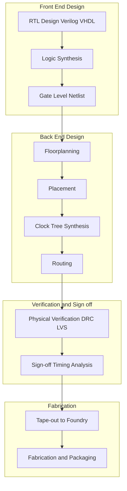
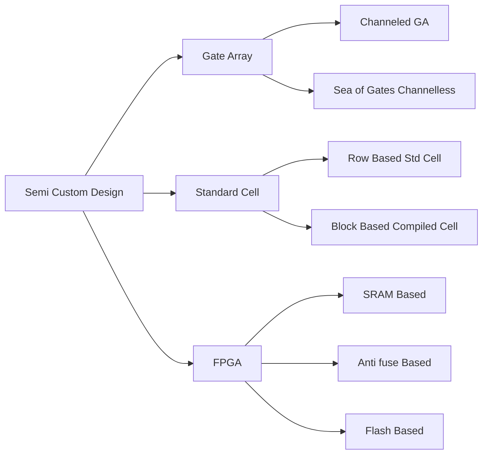
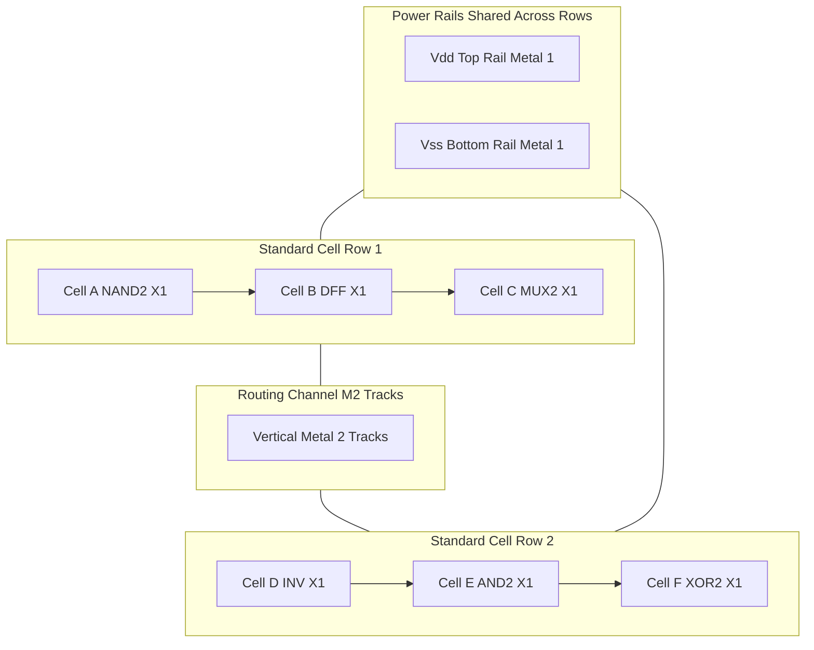
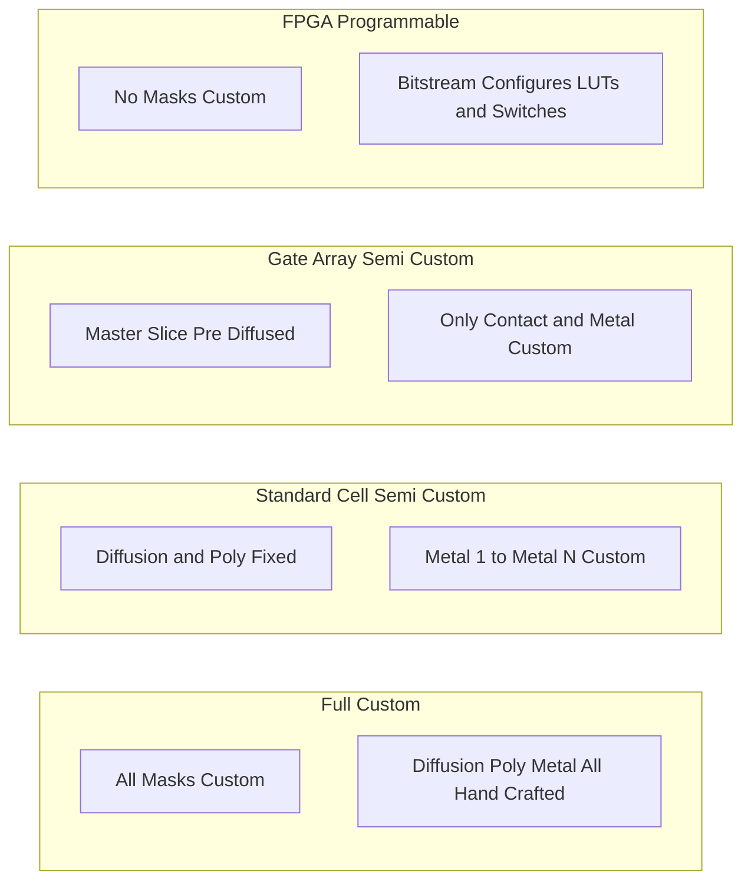

# Semi-custom design

<!-- SECTION_1_START -->
# Semi-Custom Design in VLSI

## 1.1 Formal Definition (KTU 2024 Syllabus Aligned)

**Semi-Custom Design** is a VLSI (Very Large Scale Integration) design methodology in which the integrated circuit is constructed using a **pre-designed, pre-characterized, and pre-verified library of logic cells** (such as gates, flip-flops, multiplexers, and standard logic primitives) provided by the foundry or a third-party IP vendor, while the **interconnect routing and metal mask layers** are uniquely customized for the specific application or design specification.

In the KTU 2024 Scheme context, semi-custom ICs are positioned as the engineering trade-off between the **high NRE (Non-Recurring Engineering) cost and long TTM (Time-to-Market)** of full-custom design, and the **inflexible functionality** of off-the-shelf standard products. The design effort is confined largely to the **front-end RTL (Register-Transfer Level) design, logic synthesis, place-and-route, and physical verification** phases, while the transistor-level diffusion and polysilicon layers are already fixed by the library provider.

> [!IMPORTANT]
> **KTU Board Highlight:** The defining characteristic of semi-custom design is that **diffusion layers are fixed and pre-fabricated**, but **metal interconnect layers are customized** to implement the application-specific logic function. This is what differentiates it from full-custom (where every layer is hand-crafted) and pure mask-programmable gate arrays (where the entire base wafer is pre-diffused).

## 1.2 Conceptual Analogy — "The Pre-Fabricated Kitchen"

Imagine you are designing the **interior of a kitchen** inside a restaurant:

| Design Style | Kitchen Analogy | VLSI Equivalent |
|--------------|-----------------|-----------------|
| **Full-Custom** | You build every cabinet, oven, and tile from raw wood and clay by hand. | Every transistor, via, and metal track is drawn manually. |
| **Semi-Custom** | The kitchen layout is **pre-fabricated** with standard cabinets, sinks, and electrical points. The chef only decides **where to place them and which gas/electric line connects to which appliance**. | Pre-diffused logic cells and I/O pads exist; only the **metal interconnect** (the "plumbing") is designed. |
| **Off-the-Shelf (Standard Product)** | You buy a fully-assembled kitchen and use it as-is. | You buy a pre-programmed microcontroller or ASIC from a vendor. |

**Geometric Intuition:** Think of a chessboard where the **black and white squares are pre-printed** (representing fixed NMOS/PMOS transistor diffusion regions in the silicon substrate). Your design freedom is limited to drawing **lines connecting these squares** (the metal layers). You cannot erase a square or move a transistor — you can only wire them up.

> [!NOTE]
> **Why Semi-Custom?**
> 1. **Reduced TTM** — Pre-validated cell libraries cut design cycle from months to weeks.
> 2. **Lower NRE cost** — Masks for diffusion/poly are reused; only metal masks are unique per design.
> 3. **Predictable performance** — Cell delay, power, and area are characterized in a **.lib** file (Synopsys Liberty format) before fabrication.
> 4. **Manufacturing yield** — Proven silicon processes lead to higher fabrication yield.

> [!VISUALIZATION CONTROL]
> **Concept:** Cell Placement and Routing Density
> **GeoGebra / Desmos Input Equations (Conceptual Schematic Axes):**
> * `x-axis: Horizontal placement grid (micrometers, μm)`
> * `y-axis: Vertical placement grid (μm)`
> * `Points: P1 = (2, 3)` representing `NAND2_X1` cell, `P2 = (6, 3)` representing `DFF_X1` cell
> * `Line: y = mx + c` representing a metal-1 interconnect track
> **Visual Description:** The student should visualize a 2D grid where standard cell **rectangular blocks** are arranged in **rows** with **channels** between rows for global routing. The routing tracks run horizontally in Metal-1 and vertically in Metal-2 (a typical 2-layer routing scheme).
<!-- SECTION_1_END -->

<!-- SECTION_2_START -->
# Deep Theoretical Analysis & KTU High-Yield Formula Sheet

## 2.1 Classification of Semi-Custom Design Styles

The semi-custom design umbrella has three principal flavors, each with distinct trade-offs in **density, performance, NRE cost, and TTM**:

### 2.1.1 Gate Array (GA) / Mask-Programmable Gate Array (MPGA)
- The foundry fabricates a **master slice** (or "base wafer") containing a regular array of **uncommitted NMOS/PMOS transistor pairs** (or universal gate primitives).
- The user customizes only the **contact cuts and metal layers** to wire the transistors into a specific logic function.
- **Channeled GA**: Routing channels are pre-defined between rows of transistors.
- **Channel-less (Sea-of-Gates) GA**: Routing is done over-the-cell (OTC) using second-metal layer; higher density.

### 2.1.2 Standard Cell (SC) / Cell-Based Design (CBD)
- A **rich library of pre-designed, pre-laid-out, and pre-characterized logic cells** (e.g., NAND, NOR, MUX, flip-flop, full-adder) is available.
- Cells have a **fixed height** (in standard-cell design) but **variable width** based on drive strength.
- Designers use EDA tools (e.g., Synopsys Design Compiler, Cadence Genus) to perform **automatic placement and routing (P&R)** on a flat or row-based canvas.
- Considered the **workhorse of modern digital ASIC design** for medium-to-high volume production.

### 2.1.3 FPGA (Field-Programmable Gate Array) — *Programmable Semi-Custom*
- Contains a **matrix of configurable logic blocks (CLBs)**, programmable interconnect, and I/O blocks.
- **No masks** are customized — the function is defined by an **SRAM bitstream, anti-fuse, or flash configuration**.
- Lowest NRE cost and fastest TTM, but **10× to 100× larger area and slower speed** than ASIC equivalents.

## 2.2 KTU Formula Sheet / Cheat Sheet

| Parameter / Concept | Formula or Definition | Units | Remarks |
|---------------------|----------------------|-------|---------|
| **Cell Area** | $A_{cell} = h_{cell} \times w_{cell}$ | $\mu m^2$ | $h$ = fixed row height in std-cell; $w$ = variable |
| **Row Height (Standard Cell)** | $h_{row} = N_{tracks} \times p_{track} + 2 \times w_{rail}$ | $\mu m$ | $p_{track}$ = pitch, $w_{rail}$ = power rail width |
| **Core Utilization** | $U_{core} = \dfrac{A_{cells}}{A_{core}}$ | unitless or % | Typical target: **70%–80%** for routability |
| **Routing Demand (Rent's Rule)** | $T = k \cdot N^{p}$ | number of terminals | $k$ = avg. terminals/block, $p$ = Rent exponent (0.5–0.75) |
| **Critical Path Delay** | $t_{pd} = \sum_{i=1}^{n} t_{d,i} + t_{wire,i}$ | seconds (ps/ns) | Sum of cell delays + interconnect delays |
| **Elmore Delay (RC Wire)** | $t_{wire} \approx 0.69 \cdot R_{wire} \cdot C_{total}$ | seconds | First-order approximation for a single RC segment |
| **Wire Capacitance** | $C_{wire} = c_{area} \cdot w \cdot l + 2 \cdot c_{fringe} \cdot l$ | Farads | $c_{area}$ = area cap per $\mu m^2$, $c_{fringe}$ = fringe cap per $\mu m$ |
| **Dynamic Power** | $P_{dyn} = \alpha \cdot C_{L} \cdot V_{DD}^{2} \cdot f_{clk}$ | Watts | $\alpha$ = switching activity (0 to 1) |
| **Transistor Count in GA Cell** | $N_{trans} = 2 \cdot N_{pairs}$ (per gate) | count | Universal gate: typically 2 NMOS + 2 PMOS pairs |
| **NRE Cost** | $C_{NRE} = C_{mask} \cdot N_{masks,unique} + C_{design}$ | USD | Semi-custom: $N_{masks,unique}$ typically 2–4 (metal only) |

> [!IMPORTANT]
> **KTU Board-Ready Note:** The most commonly tested comparison points are **(1) NRE cost vs. unit cost vs. TTM, (2) Channeled vs. Sea-of-Gates GA, and (3) Standard Cell vs. FPGA area/density ratios**. Memorize the trade-off table in Section 2.3.

## 2.3 Design Trade-off Triangle — Real-World Engineering Utility

| Metric | Full-Custom | Gate Array | Standard Cell | FPGA |
|--------|-------------|-----------|---------------|------|
| **NRE Cost** | Very High | Medium | Medium-High | **Negligible** |
| **Unit Cost (per chip)** | **Lowest** | Medium | Low-Medium | High |
| **Time-to-Market** | Slow (months) | Medium (weeks) | Medium (weeks) | **Fastest (days)** |
| **Performance (Speed)** | **Highest** | High | High | Lowest |
| **Power Consumption** | **Lowest** | Low-Medium | Low | High (10–100×) |
| **Density (gates/mm²)** | **Highest** | Medium | High | Lowest |
| **Design Flexibility** | **Absolute** | Limited (metal only) | High (all metal layers) | Reconfigurable (no masks) |
| **Typical Volume Sweet-Spot** | $>10$M units | 10K–1M units | 100K–10M units | $<10$K units, prototyping |

**Real-World Utility:** In modern industry, the **Apple A-series / M-series SoCs** use a **standard-cell-based semi-custom flow** for the application processor cores, while the **initial RTL validation** is done on **FPGA prototypes** (e.g., Xilinx Versal, Intel Agilex) before tape-out to TSMC or Samsung foundry.

## 2.4 Standard Cell Library Anatomy

A typical standard cell has the following structural anatomy:

1. **Cell Boundary**: A rectangular region of fixed height and variable width.
2. **Power Rails**: $V_{DD}$ (top) and $V_{SS}$ (bottom) metal-1 lines, shared across all cells in a row.
3. **Input/Output Pins**: Positioned on the **left and right edges** of the cell (top/bottom for taller cells) for abutting connection.
4. **Internal Diffusion Region**: Pre-laid PMOS (in N-well) and NMOS regions.
5. **Polysilicon Gate Patterns**: Pre-defined transistor gates.
6. **Cell Delay/Power Models**: Stored in `.lib` (Liberty) format — typically **NLDM (Non-Linear Delay Model)** or **CCS (Composite Current Source)**.

> [!NOTE]
> **KTU 2024 Frequently Tested:** "Explain the role of a standard cell library in semi-custom design." A model answer should mention **(1) pre-characterized timing/power, (2) abutting pin alignment, (3) fixed row height for row-based placement, and (4) decoupled front-end/back-end design flow**.
<!-- SECTION_2_END -->

<!-- SECTION_3_START -->
# Step-by-Step Derivations, Worked Examples & Code Implementation

## 3.1 Derivation: Rent's Rule for Routing Estimation

**Problem Statement:** A semi-custom ASIC has $N = 100{,}000$ logic gates. Using Rent's Rule, estimate the number of external I/O pins and the average interconnection length required.

**Given:**
* Average number of terminals per block: $k = 4$
* Rent exponent: $p = 0.6$
* Average wire length per gate: $L_{avg} = 4$ routing tracks

**Step 1:** Apply Rent's Rule to compute the number of I/O pins $T$.

$$
T = k \cdot N^{p}
$$

$$
T = 4 \cdot (100{,}000)^{0.6}
$$

**Step 2:** Compute the exponent numerically.

$$
(100{,}000)^{0.6} = (10^{5})^{0.6} = 10^{5 \times 0.6} = 10^{3.0} = 1000
$$

**Step 3:** Substitute back.

$$
T = 4 \times 1000 = 4000 \text{ pins}
$$

**Step 4:** Estimate the total interconnect length.

$$
L_{total} = N \cdot L_{avg} = 100{,}000 \times 4 = 400{,}000 \text{ tracks}
$$

> **Final Answer:** The design requires approximately **4,000 I/O pins** and **400,000 total routing tracks**. This figure is critical for **die-size estimation** and **package selection** (BGA vs. QFP).

## 3.2 Worked Example: Standard Cell Area Estimation

**Problem:** A standard cell library has a **fixed row height** of $h_{row} = 5 \,\mu m$ and the design requires $N_{gates} = 50{,}000$ equivalent NAND-2 gates, each with an average cell width $w_{avg} = 2 \,\mu m$. The routing overhead adds **30%** to the cell area. Compute the total silicon core area.

**Step 1:** Compute the total cell area (without routing overhead).

$$
A_{cells} = N_{gates} \cdot w_{avg} \cdot h_{row}
$$

$$
A_{cells} = 50{,}000 \times 2 \,\mu m \times 5 \,\mu m
$$

$$
A_{cells} = 500{,}000 \,\mu m^{2} = 0.5 \,mm^{2}
$$

**Step 2:** Add the 30% routing overhead.

$$
A_{core} = A_{cells} \times (1 + 0.30)
$$

$$
A_{core} = 0.5 \times 1.30 = 0.65 \,mm^{2}
$$

> **Final Answer:** Total silicon core area is **$0.65 \,mm^{2}$**. With a typical I/O pad ring adding **1.5× to 2×** the core area, the die would be approximately **$1.3 \,mm^{2}$**.

## 3.3 Elmore Delay Derivation for a Tapered Buffer Chain

**Problem:** A 3-stage tapered buffer chain drives a load capacitance $C_L = 1 \,pF$. The input capacitance of the first stage is $C_{in} = 10 \,fF$. Each stage has an intrinsic delay $t_{p0} = 30 \,ps$ and a parasitic output capacitance $C_{out} = 50 \,fF$. Compute the total propagation delay.

**Step 1:** Compute the optimal tapering factor $f$ to minimize delay.

$$
f = e^{\frac{t_{p0}}{R_{inv} \cdot C_{inv}}}
$$

For a typical $0.18 \,\mu m$ process with $R_{inv} \cdot C_{inv} \approx 1 \,ps$:

$$
f \approx e^{30 / 1} \approx e^{30} \to \text{use } f = 4 \text{ (rule of thumb for sub-100nm)}
$$

**Step 2:** Compute the size of each inverter stage.

$$
C_{stage,1} = C_{in} = 10 \,fF
$$

$$
C_{stage,2} = f \cdot C_{stage,1} = 4 \times 10 = 40 \,fF
$$

$$
C_{stage,3} = f \cdot C_{stage,2} = 4 \times 40 = 160 \,fF
$$

**Step 3:** Compute delay per stage using Elmore approximation.

$$
t_{d,stage} = t_{p0} \cdot \left( \gamma + \frac{C_{out,next}}{C_{in,stage}} \right)
$$

where $\gamma \approx 1$ for CMOS. For Stage 1:

$$
t_{d,1} = 30 \cdot \left(1 + \frac{40}{10}\right) = 30 \times 5 = 150 \,ps
$$

For Stage 2:

$$
t_{d,2} = 30 \cdot \left(1 + \frac{160}{40}\right) = 30 \times 5 = 150 \,ps
$$

For Stage 3 (driving $C_L$):

$$
t_{d,3} = 30 \cdot \left(1 + \frac{1000}{160}\right) = 30 \times 7.25 = 217.5 \,ps
$$

**Step 4:** Sum the stage delays.

$$
t_{total} = t_{d,1} + t_{d,2} + t_{d,3}
$$

$$
t_{total} = 150 + 150 + 217.5 = 517.5 \,ps
$$

> **Final Answer:** The total propagation delay of the tapered buffer chain is approximately **$517.5 \,ps$**.

## 3.4 Symbolic Implementation: Verilog Module for Standard Cell Inference

The following RTL code, when synthesized with a standard cell library (e.g., Synopsys SAED 32nm), automatically **infers** NAND/NOR/AND/OR/MUX cells from the library:

```verilog
// File: semi_custom_demo.v
// Synthesis Target: Standard Cell Library (e.g., Synopsys SAED 32nm, TSMC 65nm)
// Module: Demonstrates how RTL maps to semi-custom standard cells

module semi_custom_4bit_alu (
    input  wire [3:0] a,        // 4-bit operand A
    input  wire [3:0] b,        // 4-bit operand B
    input  wire [1:0] op_sel,   // Operation select
    output reg  [3:0] result,   // ALU result
    output wire       cout      // Carry-out flag
);

    // Internal nets for standard cell inference
    wire [3:0] sum_ab;
    wire [3:0] diff_ab;
    wire [3:0] and_ab;
    wire [3:0] or_ab;

    // -- Operation 00: Addition (RCA - inferred FA = full_adder cell) --
    // Each full adder maps to ~30-40 std cells (XOR, AND, OR)
    assign {cout, sum_ab} = a + b;

    // -- Operation 01: Subtraction (2's complement) --
    assign diff_ab = a + (~b) + 1'b1;

    // -- Operation 10: Bitwise AND (inferred as 4x AND2_X1 cells) --
    assign and_ab = a & b;

    // -- Operation 11: Bitwise OR (inferred as 4x OR2_X1 cells) --
    assign or_ab  = a | b;

    // -- Mux selection (inferred as 4x MUX2_X1 cells) --
    always @(*) begin
        case (op_sel)
            2'b00: result = sum_ab;   // Addition
            2'b01: result = diff_ab;  // Subtraction
            2'b10: result = and_ab;   // AND
            2'b11: result = or_ab;    // OR
            default: result = 4'b0000;
        endcase
    end

endmodule
```

**Synthesis Mapping (Library View):**

| RTL Construct | Inferred Standard Cell | Cell Area (approx) |
|---------------|----------------------|--------------------|
| `a & b` | `AND2_X1` × 4 | ~$10 \,\mu m^2$ each |
| `a + b` | `FA_X1` (Full Adder) × 4 | ~$40 \,\mu m^2$ each |
| `case (op_sel)` | `MUX2_X1` × 4 | ~$15 \,\mu m^2$ each |
| Final `cout` flag | `XOR2_X1` or `BUF_X4` | ~$20 \,\mu m^2$ |

**Python Script for Area Estimation (EDA-style Quick Calculator):**

```python
# File: stdcell_area_estimator.py
# Purpose: Estimate total silicon area from gate count

def estimate_core_area(num_gates: int,
                       avg_cell_width_um: float = 2.0,
                       row_height_um: float = 5.0,
                       routing_overhead_pct: float = 30.0) -> dict:
    """
    Estimate semi-custom ASIC core area.

    Parameters:
        num_gates             : Equivalent NAND-2 gate count
        avg_cell_width_um     : Average std cell width in micrometers
        row_height_um         : Fixed standard cell row height
        routing_overhead_pct  : Routing overhead percentage (default 30%)

    Returns:
        Dictionary containing cell area, core area, and die area.
    """
    # Step 1: Cell area
    cell_area_um2 = num_gates * avg_cell_width_um * row_height_um

    # Step 2: Routing overhead
    core_area_um2 = cell_area_um2 * (1.0 + routing_overhead_pct / 100.0)

    # Step 3: Die area (core + I/O pad ring)
    die_area_um2 = core_area_um2 * 2.0  # 2x for I/O pad ring

    # Step 4: Convert to mm^2
    return {
        "cell_area_mm2": round(cell_area_um2 / 1e6, 4),
        "core_area_mm2": round(core_area_um2 / 1e6, 4),
        "die_area_mm2":  round(die_area_um2  / 1e6, 4),
        "core_area_um2": round(core_area_um2, 2)
    }


# ---------- Test Run ----------
if __name__ == "__main__":
    result = estimate_core_area(
        num_gates=50_000,
        avg_cell_width_um=2.0,
        row_height_um=5.0,
        routing_overhead_pct=30.0
    )
    print("=== Semi-Custom ASIC Area Estimation ===")
    for key, value in result.items():
        print(f"{key:25s}: {value}")
```

**Expected Output:**

```
=== Semi-Custom ASIC Area Estimation ===
cell_area_mm2            : 0.5
core_area_mm2            : 0.65
die_area_mm2             : 1.3
core_area_um2            : 650000.0
```
<!-- SECTION_3_END -->

<!-- SECTION_4_START -->
# Structural Diagrams & Schematics

## 4.1 Semi-Custom Design Flow Architecture



## 4.2 Comparison of Semi-Custom Design Styles



## 4.3 Standard Cell Row Layout Architecture



## 4.4 Mask Layer Customization Matrix


<!-- SECTION_4_END -->

<!-- SECTION_5_START -->
# KTU 2024 Scheme Examination Question Bank & Topic Recap

## PART A — Short Answer Questions (3 Marks Each)

### Question 1
**[KTU University Exam - July 2024 | CO1 | Remember]**
**Define semi-custom design. Mention any two advantages of semi-custom ICs over full-custom design.**

**Model Answer (Valuation Key):**

*Semi-custom design* is a VLSI design methodology in which the **diffusion and polysilicon mask layers are pre-fabricated** as a reusable base, and only the **metal interconnect layers** are customized to implement the application-specific function.

**Advantages (any two, 1.5 marks each):**
1. **Lower NRE cost** — Only metal masks are unique per design; diffusion masks are amortized across many designs.
2. **Faster time-to-market** — Pre-characterized cell libraries (.lib files) eliminate the need for transistor-level design.
3. **Higher first-pass success rate** — Pre-validated cells reduce functional and timing bugs at the silicon level.
4. **Predictable performance** — Cell delay, power, and area are characterized in Liberty (.lib) format before tape-out.

> **Valuation Marks:** [Definition: 1 Mark] [Two valid advantages: 1.5 Marks each = 3 Marks total]

---

### Question 2
**[KTU University Exam - Dec 2023 | CO1 | Understand]**
**Differentiate between a channeled gate array and a sea-of-gates (channel-less) gate array.**

**Model Answer (Valuation Key):**

| Parameter | Channeled Gate Array | Sea-of-Gates Gate Array |
|-----------|---------------------|-------------------------|
| **Routing channels** | Pre-defined channels between rows of transistors | No pre-defined channels; uses over-the-cell (OTC) routing |
| **Metal layers required** | Single metal layer sufficient | Requires **2 or more metal layers** (one for OTC routing) |
| **Transistor density** | Lower (channels waste area) | **Higher** (no wasted area) |
| **Design complexity** | Simpler, easier EDA tool support | More complex routing algorithms |
| **Flexibility** | Limited routing freedom | **Greater routing freedom** |

> **Valuation Marks:** [Any 3 valid comparison points: 1 Mark each = 3 Marks]

---

## PART B — Long Answer Questions (14 Marks Each)

> **Module Internal Choice Format:** Answer **ONE** of the following Question A or Question B.

---

### Question A (14 Marks)

**[KTU University Exam - Dec 2024 | CO2 | Understand + Apply]**

**(a)** Explain the **architecture of a standard cell library** with a neat diagram. Discuss the role of the following in semi-custom design:
   (i) Power rails and cell boundary
   (ii) Input/Output pin placement
   (iii) Cell delay models in `.lib` format

**(7 Marks)**

**(b)** A semi-custom ASIC design is to be built using a **standard cell library** with the following specifications:
* Number of equivalent gates: $N = 80{,}000$
* Average cell width: $w_{avg} = 2.5 \,\mu m$
* Row height: $h_{row} = 6 \,\mu m$
* Routing overhead: **25%**
* I/O pad ring area factor: **1.8×**

Calculate:
   (i) Total cell area
   (ii) Total core area (after routing overhead)
   (iii) Total die area (including I/O pad ring)

**(7 Marks)**

**Model Solution:**

**Part (a) — Library Architecture (7 Marks):**

A standard cell library is a collection of pre-designed, pre-laid-out, and pre-characterized logic cells. The architecture consists of:

1. **Cell Boundary** — A fixed-height rectangular region (e.g., $h_{row} = 6 \,\mu m$) with variable width. Allows **abutting placement** of cells in a row.

2. **Power Rails** — Horizontal $V_{DD}$ (top) and $V_{SS}$ (bottom) metal-1 lines, shared across all cells in a row. This ensures **uniform power distribution** and enables cells to be placed adjacent to each other.

3. **I/O Pin Placement** — Pins are placed on the **left and right edges** (sometimes top/bottom for taller cells) of the cell boundary at the **grid intersection points** to align with routing tracks. This allows **direct abutting connection** between adjacent cells and predictable routing.

4. **Cell Delay Models in .lib Format** — The Liberty (.lib) file contains:
   * **Lookup tables** for cell delay vs. input slew and output load.
   * **Power models** (internal, switching, leakage).
   * **Pin capacitance** and **timing arcs** (combinational and sequential).
   * Common formats: **NLDM (Non-Linear Delay Model)** and **CCS (Composite Current Source)**.

> **Valuation Marks (a):** [Cell boundary + power rails: 2 Marks] [Pin placement: 2 Marks] [Delay models: 2 Marks] [Neat diagram: 1 Mark]

**Part (b) — Area Calculation (7 Marks):**

**(i) Total cell area:**

$$
A_{cell} = N \cdot w_{avg} \cdot h_{row}
$$

$$
A_{cell} = 80{,}000 \times 2.5 \,\mu m \times 6 \,\mu m
$$

$$
A_{cell} = 1{,}200{,}000 \,\mu m^{2} = 1.2 \,mm^{2}
$$

> [Stating formula: 1 Mark] [Substitution: 1 Mark] [Final value: 1 Mark] = **3 Marks**

**(ii) Total core area (with routing overhead):**

$$
A_{core} = A_{cell} \times (1 + 0.25) = 1.2 \times 1.25
$$

$$
A_{core} = 1.5 \,mm^{2}
$$

> [Stating overhead formula: 1 Mark] [Final value: 1 Mark] = **2 Marks**

**(iii) Total die area (with I/O pad ring):**

$$
A_{die} = A_{core} \times 1.8 = 1.5 \times 1.8
$$

$$
A_{die} = 2.7 \,mm^{2}
$$

> [Stating I/O factor: 1 Mark] [Final value: 1 Mark] = **2 Marks**

**Consolidated Mark Split-up for Part (b):** [3 + 2 + 2 = 7 Marks]

> [!WARNING]
> **KTU Examiner's Valuation Pitfall Callout:**
> 1. **Do NOT** compute core area first and then add overhead to cell area separately — apply overhead multiplicatively in one step.
> 2. **Do NOT** forget to **convert $\mu m^2$ to $mm^2$** (divide by $10^6$).
> 3. **Do NOT** confuse the **I/O pad ring factor** (1.8× here) with the **routing overhead** (25% here) — they are two distinct multiplicative terms.
> 4. **Always state the formula before substituting** — KTU examiners allocate 1 mark for the formula statement alone.

---

### Question B (14 Marks)

**[KTU University Exam - July 2024 | CO2 | Understand + Apply]**

**(a)** Compare **full-custom, gate-array, standard-cell, and FPGA** design styles in terms of:
   (i) NRE cost
   (ii) Time-to-market
   (iii) Performance
   (iv) Unit cost at high volume

Mention **two specific applications** for which standard-cell-based semi-custom design is preferred.

**(7 Marks)**

**(b)** Explain the **complete back-end (physical design) flow** of a semi-custom ASIC, starting from the gate-level netlist to GDS-II tape-out. List the key EDA tools used at each stage and the input/output files of each step.

**(7 Marks)**

**Model Solution:**

**Part (a) — Comparison Table (7 Marks):**

| Design Style | NRE Cost | Time-to-Market | Performance | Unit Cost (High Volume) |
|--------------|----------|----------------|-------------|------------------------|
| **Full-Custom** | Very High (\$1M+) | Very Slow (12–18 months) | Highest (manual optimization) | **Lowest** (smallest die) |
| **Gate Array** | Medium (\$200K–500K) | Medium (8–12 weeks) | High | Medium |
| **Standard Cell** | Medium-High (\$300K–800K) | Medium (12–16 weeks) | High (close to full-custom) | Low-Medium |
| **FPGA** | Negligible (<\$5K) | **Fastest (days)** | Lowest (slower clock, 10–100× larger area) | High (per-chip cost) |

> [Table with all 4 styles × 4 parameters: 4 Marks] [Two specific applications: 3 Marks]

**Two specific applications of standard-cell semi-custom design:**
1. **Mobile SoCs and application processors** (e.g., Qualcomm Snapdragon, Apple A-series) — where high performance, low power, and high volume (>10M units) justify the medium NRE cost.
2. **Networking ASICs and baseband processors** (e.g., Broadcom Tomahawk switches) — where high throughput and tight timing closure are critical.

**Part (b) — Physical Design Flow (7 Marks):**

| Step | Description | EDA Tools | Input → Output |
|------|-------------|-----------|----------------|
| **1. Netlist Handoff** | Gate-level netlist (.v) + constraints (.sdc) | — | RTL → Netlist |
| **2. Floorplanning** | Define core, I/O, and macro placement | Cadence Innovus, Synopsys ICC | Netlist → Floorplan DEF |
| **3. Power Planning** | Add power rings, stripes, and core cells | Cadence Innovus, Synopsys ICC | Floorplan → Power Plan |
| **4. Placement** | Place std cells in rows optimizing timing, congestion | Cadence Innovus, Synopsys ICC | Netlist + Floorplan → Placed DEF |
| **5. Clock Tree Synthesis (CTS)** | Build balanced clock distribution network | Cadence Innovus, Synopsys ICC | Placed DEF → Post-CTS DEF |
| **6. Routing** | Connect all nets using available metal layers | Cadence Innovus, Synopsys ICC | Post-CTS DEF → Routed DEF |
| **7. DRC** | Design Rule Check (spacing, width, enclosure) | Mentor Calibre, Cadence PVS | GDS → DRC report |
| **8. LVS** | Layout vs. Schematic (connectivity check) | Mentor Calibre, Cadence PVS | GDS + Netlist → LVS report |
| **9. STA Sign-off** | Static Timing Analysis at PVT corners | Synopsys PrimeTime | Netlist + SPEF → Timing report |
| **10. Tape-out** | Final GDS-II file to foundry | — | Verified GDS-II → Foundry |

> [Listing 8 steps with tools: 6 Marks] [Correct I/O file types: 1 Mark]

> [!WARNING]
> **KTU Examiner's Valuation Pitfall Callout for Question B:**
> 1. **Do NOT** mix up **DRC** (geometric rule check on layout) with **LVS** (electrical connectivity check vs. schematic).
> 2. **Do NOT** write only the step names without **mentioning the EDA tool vendor** — KTU awards marks for tool names (Innovus, ICC, Calibre, PrimeTime).
> 3. **Do NOT** forget that **CTS (Clock Tree Synthesis)** comes **after Placement** and **before Routing** — this sequence is a frequent short-answer question.
> 4. **Do NOT** claim FPGA is a "semi-custom IC" without qualification — KTU classifies it as **programmable semi-custom (maskless)** to distinguish it from mask-programmable gate arrays.

---

## Topic Recap & Important Things to Remember

> [!IMPORTANT]
> **Rapid Revision Checklist — Semi-Custom Design**

* **Definition:** Semi-custom = **pre-fabricated base + custom metal layers** for application-specific logic.
* **Three main styles:** **Gate Array (GA)**, **Standard Cell (SC)**, and **FPGA (programmable)**.
* **Gate Array** → Only metal and contact masks are unique. Master slice is pre-diffused.
* **Standard Cell** → Pre-characterized `.lib` cells (NAND, NOR, DFF, MUX, FA) with **fixed row height** and **variable width**.
* **FPGA** → No masks; configured via **SRAM bitstream**, **anti-fuse**, or **flash**. Lowest NRE, lowest performance.
* **Channeled GA** vs. **Sea-of-Gates GA** → Sea-of-Gates uses **over-the-cell (OTC) routing** with 2+ metal layers, achieving higher density.
* **Standard Cell Anatomy:** Cell boundary, power rails ($V_{DD}$/$V_{SS}$), I/O pins on edges, internal diffusion/poly.
* **Liberty (.lib) File:** Contains delay lookup tables, power models, pin capacitance, timing arcs (NLDM or CCS format).
* **Rent's Rule:** $T = k \cdot N^{p}$ where $k$ = avg. terminals/block, $p$ = Rent exponent (0.5–0.75).
* **Elmore Delay:** $t_{wire} \approx 0.69 \cdot R_{wire} \cdot C_{total}$ — first-order RC delay approximation.
* **Core Utilization:** $U_{core} = A_{cells} / A_{core}$, target **70%–80%** for routability.
* **Dynamic Power:** $P_{dyn} = \alpha \cdot C_L \cdot V_{DD}^{2} \cdot f_{clk}$ — switching activity $\alpha$ is critical for low-power design.
* **Tapered Buffer Chain:** Each stage sized by factor $f \approx 4$ to drive large $C_L$ with minimum delay.
* **Physical Design Flow:** Floorplan → Power Plan → Placement → CTS → Routing → DRC → LVS → STA → Tape-out.
* **EDA Tool Stack:** Cadence Innovus / Synopsys ICC (P&R), Mentor Calibre (DRC/LVS), Synopsys PrimeTime (STA).
* **Volume Sweet-Spot:** FPGA (<10K), Gate Array (10K–1M), Standard Cell (100K–10M), Full-Custom (>10M).
* **Mask Cost Insight:** Full-custom needs ~30+ unique masks; Standard Cell needs ~2–4 unique metal masks; FPGA needs **zero** unique masks.
* **Modern Usage:** Standard-cell flow is the **workhorse of digital ASIC design** for SoCs, networking chips, and consumer electronics.
<!-- SECTION_5_END -->
