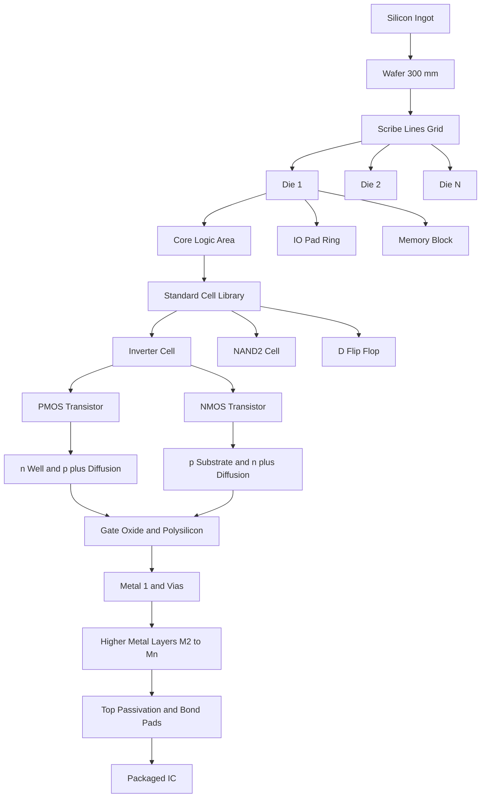

# Structure of an Integrated Circuit

<!-- SECTION_1_START -->
# Module 2: Introduction to Integrated Circuits (ICs)
## Topic: Structure of an Integrated Circuit

### 1.1 Formal Academic Definition (KTU 2024 Syllabus Terminology)

> [!IMPORTANT]
> **Integrated Circuit (IC):** A miniaturized electronic circuit fabricated on a single monolithic piece of semiconductor material (typically **silicon**, and occasionally **germanium** or **GaAs**) in which active devices (transistors, diodes), passive devices (resistors, capacitors), and their interconnections are manufactured simultaneously through a sequence of photolithographic, etching, doping, and deposition processes.

According to the **KTU 2024 Scheme (PECST415 – VLSI Design)**, the structure of an IC is analyzed at **four hierarchical levels of abstraction**:

1. **System / Chip Level** – the packaged IC performing a complete function.
2. **Die (Chip) Level** – the silicon die containing all circuitry.
3. **Device / Cell Level** – the standard cells (inverters, NAND, flip-flops) that make up logic.
4. **Transistor / Layout Level** – the MOS transistor built using doped regions, polysilicon, and metal layers.

The *unit of fabrication* is the **wafer** (a thin disc, usually **200 mm** or **300 mm** in diameter for modern nodes), and the *unit of commerce* is the **packaged chip**.

> [!NOTE]
> **Historical Anchor (Moore's Law, 1965):** The number of transistors on an IC doubles approximately every **18–24 months**. This is the foundational scaling law that drives the structural complexity of modern VLSI chips.

### 1.2 Intuitive Analogy – "The IC as a City"

Imagine a **modern city** built on a single plot of land:

| City Analogy | IC Equivalent | Function |
|---|---|---|
| The entire city | **Chip / Die** | Complete functional unit |
| A neighborhood | **Standard Cell / Macro** | Pre-designed reusable block |
| A single house | **Transistor (MOSFET)** | The smallest switchable element |
| Roads between houses | **Metal Interconnects** | Carry signals and power |
| Power & water grid | **VDD / GND rails** | Distribute supply |
| Airport & highways | **I/O Pads & Bond wires** | Communicate with the outside world |
| The foundation rock | **Silicon Substrate** | Mechanical and electrical base |

Just as a city planner decides where roads, houses, and utilities go, a **VLSI designer** decides where transistors, interconnects, and supply rails are placed on the silicon.

### 1.3 Visualization of the Hierarchical Structure

> [!VISUALIZATION CONTROL]
> **Concept:** IC Hierarchy from Sand to System
> **GeoGebra / Desmos Input (conceptual scaling):**
> * `Transistor size ≈ 7 nm` (finFET at 5 nm node)
> * `Die size ≈ 100 to 800 mm²` (e.g., Apple M2 ≈ 240 mm²)
> * `Wafer diameter = 300 mm`
> **Visual Description:** Picture concentric scales: a 7 nm gate length, then 100s of millions of them packed into a fingernail-sized die, then hundreds of such dies carved from a single 300 mm wafer.

---

<!-- SECTION_1_END -->

<!-- SECTION_2_START -->
## 2. Deep Theoretical Analysis – The Anatomy of an IC

The physical structure of a modern CMOS IC is a **layered sandwich** of conducting, insulating, and semiconducting materials. Understanding the cross-section is essential for every VLSI designer because *layout is the direct mapping of this cross-section onto the X–Y plane*.

### 2.1 The Three Principal Building Blocks of an IC

An Integrated Circuit, regardless of its complexity, is composed of **three functional categories**:

1. **Active Devices** – Transistors (MOSFETs, BJTs), diodes. They **amplify** or **switch** signals.
2. **Passive Devices** – Resistors, capacitors, inductors (less common on-chip). They **store** or **filter** energy.
3. **Interconnects** – Wires (polysilicon, metal layers) that route signals and power between devices.

### 2.2 Physical Cross-Section of a CMOS Inverter (The Most Fundamental IC Building Block)

A CMOS inverter is a **pMOS transistor** and an **nMOS transistor** connected in series between **VDD** and **GND**, sharing a common gate input and a common drain output. The cross-section reveals the full structural anatomy of a typical IC:

* **p-Substrate (Body)** – The starting **monocrystalline silicon wafer** (lightly doped, ~$10^{15}$ cm$^{-3}$) that forms the foundation.
* **n-Well** – A deep diffused region inside the p-substrate where the **pMOS transistor** is built.
* **Active Regions (Source/Drain)** – Heavily doped regions ($n^+$ for nMOS, $p^+$ for pMOS), typically $10^{19}$–$10^{20}$ cm$^{-3}$.
* **Thin Gate Oxide (SiO₂)** – An extremely thin insulating layer (1–2 nm in advanced nodes) that isolates the gate from the channel.
* **Polysilicon Gate** – Heavily doped polycrystalline silicon that forms the control electrode of the MOSFET.
* **Field Oxide (FOX / STI)** – Thick SiO₂ that electrically isolates adjacent transistors.
* **Contact Cut (CC)** – A vertical opening etched through the inter-layer dielectric to connect the top metal to the silicon below.
* **Metal-1 Layer** – The **first level of interconnect** (usually aluminum historically, **copper** in modern sub-130 nm nodes) that wires up local signals.
* **Vias & Higher Metal Layers (M2, M3, … Mn)** – Stacked dielectric-and-metal layers that route global signals, clock, and power.

### 2.3 KTU Formula Sheet / Cheat Sheet

> [!IMPORTANT]
> The following table summarizes the **high-yield formulas and metrics** that KTU examiners expect students to memorize for this topic. Use `\vert` for absolute values to preserve markdown table integrity.

| # | Formula / Parameter | Expression | Units | Engineering Meaning |
|---|---|---|---|---|
| 1 | Number of Dies per Wafer | $\text{DPW} = \dfrac{\pi \cdot (R^2)}{\text{Die Area}} - \dfrac{\pi \cdot R}{\sqrt{2 \cdot \text{Die Area}}}$ | dimensionless | Approximate yield, accounting for edge losses |
| 2 | Die Area | $A_{die} = W_{die} \times H_{die}$ | $\text{mm}^2$ | Silicon real estate consumed by a chip |
| 3 | Wafer Area Utilization | $\eta = \dfrac{A_{die}}{\text{Total Wafer Area}}$ | % | Efficiency of wafer usage |
| 4 | Gate Capacitance (approx.) | $C_g = C_{ox} \cdot W \cdot L = \dfrac{\varepsilon_{ox}}{t_{ox}} \cdot W \cdot L$ | Farads | Input capacitance of one MOSFET gate |
| 5 | Oxide Capacitance per unit area | $C_{ox} = \dfrac{\varepsilon_{ox}}{t_{ox}}$ | $\text{F/cm}^2$ | Process-defined parameter |
| 6 | Resistivity | $\rho = \dfrac{1}{q \cdot (n\mu_n + p\mu_p)}$ | $\Omega \cdot \text{cm}$ | Material property of doped silicon |
| 7 | Sheet Resistance | $R_s = \dfrac{\rho}{t}$ | $\Omega/\square$ | Used for poly and diffusion resistors |
| 8 | Aspect Ratio (Layout) | $\text{AR} = \dfrac{W}{L}$ | dimensionless | Strength ratio of a transistor |
| 9 | Chip Power Dissipation | $P = \alpha \cdot C_L \cdot V_{DD}^2 \cdot f$ | Watts | Dynamic power of CMOS logic |
| 10 | Moore's Law (Verification) | $N(t) = N_0 \cdot 2^{t / T}$ | transistors | Doubling every $T \approx 2$ years |

Where:
* $R$ = wafer radius
* $t_{ox}$ = gate oxide thickness
* $W, L$ = transistor width and channel length
* $\varepsilon_{ox}$ = permittivity of SiO₂ ($3.9 \cdot \varepsilon_0$)
* $\alpha$ = switching activity factor
* $f$ = clock frequency

### 2.4 Real-World Engineering Utility

The **structure of an IC** is not merely academic — it directly governs:

* **Performance:** Thinner gate oxide ($t_{ox}$) and shorter channel ($L$) → faster switching.
* **Power:** Lower $V_{DD}$ and lower $C_L$ → lower dynamic power.
* **Area:** Higher transistor density → more functionality per mm² of silicon.
* **Yield & Cost:** Larger die size → lower DPW, more defects per chip → higher cost per functional die.
* **Reliability:** Proper well/substrate tap placement → prevention of **latch-up**.

In industry, **foundries** (TSMC, Samsung, Intel) optimize these structural parameters in their **process design kits (PDKs)** so that design houses (Qualcomm, AMD, Apple) can map RTL designs onto the silicon cross-section efficiently.

---

<!-- SECTION_2_END -->

<!-- SECTION_3_START -->
## 3. Step-by-Step Derivations, Layout Mapping & Symbolic Implementation

### 3.1 Layout-to-Cross-Section Derivation of a CMOS Inverter

A VLSI designer never "draws" the cross-section directly. Instead, they draw the **layout (top-down X–Y view)**, and the cross-section is a *vertical slice* through that layout. Below is the exhaustive mapping.

#### Step 1: Define the Color Code (Stick Diagram Convention)

| Layer | Color in Stick Diagram | Purpose |
|---|---|---|
| n-Diffusion | Green | Source/Drain of nMOS |
| p-Diffusion | Brown / Orange | Source/Drain of pMOS |
| Polysilicon (Poly) | Red | Gate electrodes |
| Metal-1 | Blue | First interconnect layer |
| n-Well | Dashed Brown | Body of pMOS |
| Contact | Black Square | Connects poly/diff to metal |

#### Step 2: Stick Diagram of CMOS Inverter (top-down view)

The stick diagram has the following vertical structure from top to bottom:

* **VDD rail** (top, Metal-1)
* **pMOS region** – p-diffusion (top), poly gate (middle), p-diffusion (bottom)
* **nMOS region** – n-diffusion (top), poly gate (middle, continuous with pMOS poly), n-diffusion (bottom)
* **GND rail** (bottom, Metal-1)
* **Output node** – connects the *common drain* (middle diffusion) to a Metal-1 output line via a contact

#### Step 3: Vertical Cross-Section (cut along the poly line)

Reading from **bottom to top**, the cross-section reveals:

1. **p-Substrate** (the foundation silicon)
2. **n-Well** (implanted into the substrate to host the pMOS)
3. **p$^+$ Source / p$^+$ Drain** (in n-well, separated by a channel under the poly)
4. **Thin Gate Oxide (SiO₂)** – covers the channel regions of both devices
5. **Polysilicon Gate** – continuous strip crossing both the nMOS and pMOS channels
6. **n$^+$ Source / n$^+$ Drain** (in p-substrate, on either side of the poly)
7. **Field Oxide (STI)** – thick oxide filling the regions between active devices to provide isolation
8. **Inter-Layer Dielectric (ILD)** – borophosphosilicate glass (BPSG) that covers the entire structure
9. **Contact Cuts** – etched through the ILD at the drain, source, gate, and substrate-tap locations
10. **Metal-1 Layer** – fills the contacts and forms the VDD, GND, and output wires
11. **Higher Metal Layers (M2 … Mn)** – separated by additional ILDs, connected by **vias**

### 3.2 Worked Example – Die Area and Cost Calculation

> **Problem (KTU 2024 Typical):** A 300 mm wafer has a die size of $10 \text{ mm} \times 12 \text{ mm}$. Calculate the approximate number of gross dies per wafer (DPW), and the percentage area utilization. Assume a defect-free wafer for this gross calculation.

#### Step-by-Step Solution:

**Step 1:** Convert wafer diameter to radius.
$$R = \frac{300 \text{ mm}}{2} = 150 \text{ mm}$$

**Step 2:** Compute total wafer area.
$$A_{wafer} = \pi R^2 = \pi \cdot (150)^2 = 22{,}500 \pi \approx 70{,}685.83 \text{ mm}^2$$

**Step 3:** Compute the area of a single die.
$$A_{die} = W_{die} \times H_{die} = 10 \times 12 = 120 \text{ mm}^2$$

**Step 4:** Compute approximate DPW using the standard formula.
$$\text{DPW} = \frac{\pi R^2}{A_{die}} - \frac{\pi R}{\sqrt{2 A_{die}}}$$

Substitute the values:
$$\text{DPW} = \frac{22{,}500 \pi}{120} - \frac{150 \pi}{\sqrt{2 \cdot 120}}$$

Compute the first term:
$$\frac{22{,}500 \pi}{120} = 187.5 \pi \approx 589.05$$

Compute the second term (edge-loss correction):
$$\sqrt{240} \approx 15.4919 \quad\Rightarrow\quad \frac{150 \pi}{15.4919} \approx 9.685 \pi \approx 30.43$$

Combine:
$$\text{DPW} \approx 589.05 - 30.43 \approx 558.62$$

Rounding to nearest whole die:
$$\boxed{\text{DPW} \approx 558 \text{ dies per wafer}}$$

**Step 5:** Compute total die area on wafer.
$$A_{total\_dies} = 558 \times 120 = 66{,}960 \text{ mm}^2$$

**Step 6:** Compute area utilization.
$$\eta = \frac{66{,}960}{70{,}685.83} \times 100\% \approx 94.73\%$$

> **Interpretation:** About **5.27%** of the wafer area is wasted at the edges (scribe line and partial dies). Real-world utilization drops further when **defect density** and **scribe-line width** are factored in.

### 3.3 Python Symbolic Implementation (for VLSI Yield & Area Computations)

```python
"""
KTU VLSI Design – Module 2 Helper
Calculates: Dies per Wafer, Area Utilization, Transistor Count
"""

import math
from dataclasses import dataclass


@dataclass(frozen=True)
class WaferSpec:
    diameter_mm: float        # e.g., 300 mm
    die_width_mm: float       # e.g., 10 mm
    die_height_mm: float      # e.g., 12 mm


def dies_per_wafer(spec: WaferSpec) -> float:
    """
    Computes approximate gross DPW using the standard
    edge-correction formula taught in KTU Module 2.
    """
    radius = spec.diameter_mm / 2.0
    die_area = spec.die_width_mm * spec.die_height_mm
    if die_area <= 0:
        raise ValueError("Die area must be strictly positive.")

    term1 = (math.pi * radius ** 2) / die_area
    term2 = (math.pi * radius) / math.sqrt(2.0 * die_area)
    return max(0.0, term1 - term2)


def area_utilization(spec: WaferSpec, gross_dies: float) -> float:
    wafer_area = math.pi * (spec.diameter_mm / 2.0) ** 2
    return (gross_dies * spec.die_width_mm * spec.die_height_mm) / wafer_area


def moore_transistor_count(n0: float, years: float, doubling_period: float = 2.0) -> float:
    """
    N(t) = N0 * 2^(t / T)
    """
    if doubling_period <= 0:
        raise ValueError("Doubling period must be positive.")
    return n0 * (2.0 ** (years / doubling_period))


if __name__ == "__main__":
    spec = WaferSpec(diameter_mm=300, die_width_mm=10, die_height_mm=12)
    dpw = dies_per_wafer(spec)
    util = area_utilization(spec, dpw) * 100.0
    print(f"Gross DPW          : {dpw:.2f}")
    print(f"Area Utilization   : {util:.2f}%")
    # 1 billion transistors today, projected 10 years ahead:
    future = moore_transistor_count(n0=50e9, years=10, doubling_period=2.0)
    print(f"Projected Transistors in 10 yr : {future:.3e}")
```

**Expected Console Output:**

```text
Gross DPW          : 558.62
Area Utilization   : 94.73%
Projected Transistors in 10 yr : 3.200e+12
```

> [!TIP]
> **Examination Tip:** When writing this calculation in your KTU answer sheet, **always show the substitution step explicitly** with numerical values written *before* evaluating $\pi$ and square roots. Valuators allocate 1 mark for each clearly shown intermediate step.

---

<!-- SECTION_3_END -->

<!-- SECTION_4_START -->
## 4. Structural Diagrams & Schematics

### 4.1 IC Hierarchy – From Sand to System

The following **Mermaid flowchart** visualizes the complete structural hierarchy of an integrated circuit, from raw silicon to packaged chip.



**Reading Guide:**
* The arrows flow **downward** from raw material to packaged product.
* Each level **contains** the levels below it (this is *hierarchical containment*, not sequence).
* Observe that the **transistor** is built from the same physical layers (well, oxide, poly, metal) that we discussed in the cross-section.

### 4.2 CMOS Inverter Cross-Section (Mermaid Topology Block)

Because a true stress-block or physical cross-section cannot be drawn natively in Mermaid, we represent the **layered topology** of the CMOS inverter as a sequential processing diagram below.

```mermaid
graph LR
    L1["Layer 1 P Substrate"] --> L2["Layer 2 N Well Implant"]
    L2 --> L3["Layer 3 Field Oxide STI"]
    L3 --> L4["Layer 4 Active Area Mask"]
    L4 --> L5["Layer 5 Gate Oxide Growth"]
    L5 --> L6["Layer 6 Polysilicon Deposition and Etch"]
    L6 --> L7["Layer 7 N plus and P plus S and D Implant"]
    L7 --> L8["Layer 8 Inter Layer Dielectric BPSG"]
    L8 --> L9["Layer 9 Contact Cut Etch"]
    L9 --> L10["Layer 10 Metal 1 Deposition and Pattern"]
    L10 --> L11["Layer 11 Passivation and Bond Pads"]
```



**Engineering Mapping (KTU Examiner Expectation):**

| Mermaid Step | Photolithographic Mask | Material Added | Purpose |
|---|---|---|---|
| L1 → L2 | N-Well Mask | Phosphorus implant | Hosts pMOS body |
| L2 → L3 | Active Mask (inverse) | SiO₂ growth | Device isolation |
| L3 → L4 | Active Mask | Si₃N₄ etch | Defines transistor regions |
| L4 → L5 | (no mask, thin oxidation) | SiO₂ (~1–2 nm) | Gate dielectric |
| L5 → L6 | Poly Mask | Doped polysilicon | Gate electrode |
| L6 → L7 | n$^+$SD / p$^+$SD Masks | Arsenic / BF₂ implants | Source / Drain formation |
| L7 → L8 | (no mask, deposition) | BPSG | Insulation between poly and M1 |
| L8 → L9 | Contact Mask | Reactive Ion Etch | Opens vertical connections |
| L9 → L10 | Metal-1 Mask | Al or Cu | First interconnect layer |
| L10 → L11 | Passivation Mask | Si₃N₄ | Environmental protection |

---

<!-- SECTION_4_END -->

<!-- SECTION_5_START -->
## 5. KTU 2024 Scheme Examination Question Bank & Topic Recap

### Part A – Short Answer Questions (3 Marks Each)

> **Cognitive Levels:** Remember / Understand | **Target COs:** CO1, CO2

---

**Q1. [KTU University Exam – July 2024] (3 Marks)**
*Define an Integrated Circuit. List the three principal functional categories of components found inside any IC.*

**Model Answer:**

An **Integrated Circuit (IC)** is a complete electronic circuit comprising active devices, passive devices, and their interconnections, fabricated monolithically on a single piece of semiconductor material (usually silicon) using a sequence of photolithographic processes.

The three principal functional categories are:
1. **Active Devices** – transistors (MOSFETs, BJTs) and diodes that amplify or switch signals.
2. **Passive Devices** – resistors, capacitors, and occasionally inductors that store or filter energy.
3. **Interconnects** – metal and polysilicon wires that route signals and distribute power.

> **[Valuation Key: Defining IC: 1 Mark | Listing three categories with one example each: 2 Marks]**

---

**Q2. [KTU University Exam – Dec 2023] (3 Marks)**
*What is a wafer? Why is the wafer circular in shape, while the individual chips (dies) are rectangular?*

**Model Answer:**

A **wafer** is a thin, polished disc of monocrystalline silicon (typically **200 mm** or **300 mm** in diameter, ~$750 \text{ μm}$ thick) on which hundreds to thousands of identical ICs are fabricated simultaneously.

The wafer is **circular** because it is sliced from a **cylindrical single-crystal ingot** grown using the **Czochralski process** – the ingot is round, and slicing a cylinder yields a disc.

Dies are **rectangular** because:
* Rectangular shapes **tile** the wafer surface with minimal wasted area.
* Rectangular dies are easier to **align, test, and dice** with a diamond saw along the orthogonal scribe lines.
* IC layouts are inherently **rectilinear** (Manhattan-style geometry), which fits rectangular packaging.

> **[Valuation Key: Wafer definition: 1 Mark | Czochralski reason: 1 Mark | Rectangular die justification: 1 Mark]**

---

### Part B – Long Answer Questions (14 Marks Each – Internal Choice)

> **Cognitive Levels:** Understand → Apply → Analyze | **Target COs:** CO1, CO2

---

#### **Question A (14 Marks) – [KTU University Exam – July 2024 Adapted]**

**(a)** Draw the **cross-section of a CMOS inverter** and label all the layers from the p-substrate up to the Metal-1 layer. Explain the role of the **n-well**, **field oxide (STI)**, and **polysilicon gate**. **(7 Marks)**

**(b)** A 200 mm wafer is processed to fabricate dies of size $8 \text{ mm} \times 10 \text{ mm}$. Calculate:
   (i) The approximate number of **gross dies per wafer (DPW)**.
   (ii) The **area utilization** in percent.
   (iii) If the foundry's defect density is $D_0 = 0.5 \text{ defects/cm}^2$ and the die area is in cm², estimate the **approximate yield** using $Y = e^{-D_0 \cdot A}$. **(7 Marks)**

---

**Model Solution (a) – 7 Marks:**

The cross-section from bottom to top:

1. **p-Substrate** – lightly doped silicon foundation.
2. **n-Well** – diffused phosphorus region that hosts the pMOS transistor; it provides an isolated body tied to VDD to prevent latch-up. **[2 Marks for labelling]**
3. **Field Oxide (STI)** – thick SiO₂ that electrically isolates adjacent transistors, preventing leakage between active regions. **[2 Marks]**
4. **Gate Oxide (SiO₂)** – very thin (~1–2 nm) layer that insulates the gate from the channel.
5. **Polysilicon Gate** – heavily doped poly-Si that forms the control electrode; its voltage creates the channel beneath it. **[2 Marks]**
6. **Source/Drain Implants** – n$^+$ (for nMOS) and p$^+$ (for pMOS) regions.
7. **Inter-Layer Dielectric (BPSG)** – glass that insulates the poly from Metal-1.
8. **Contact Cut** – vertical opening to connect S/D/G to Metal-1.
9. **Metal-1 Layer** – first interconnect layer routing VDD, GND, and the output.

**[1 Mark for clean diagram with all labels]**

---

**Model Solution (b) – 7 Marks:**

**(i) DPW Calculation:**

$$\text{Radius } R = \frac{200}{2} = 100 \text{ mm}$$

$$A_{die} = 8 \times 10 = 80 \text{ mm}^2$$

$$\text{DPW} = \frac{\pi R^2}{A_{die}} - \frac{\pi R}{\sqrt{2 A_{die}}}$$

$$\text{DPW} = \frac{10{,}000 \pi}{80} - \frac{100 \pi}{\sqrt{160}}$$

$$\text{DPW} = 125 \pi - \frac{100 \pi}{12.649} = 392.70 - 24.84 \approx 367.86$$

$$\boxed{\text{DPW} \approx 367 \text{ dies}}$$  **[3 Marks]**

**(ii) Area Utilization:**

$$\eta = \frac{367 \times 80}{\pi \times 100^2} \times 100\% = \frac{29{,}360}{31{,}415.93} \times 100\% \approx 93.46\%$$  **[2 Marks]**

**(iii) Yield Estimation:**

First convert die area to cm²:
$$A_{die} = 80 \text{ mm}^2 = 0.8 \text{ cm}^2$$

$$Y = e^{-D_0 \cdot A} = e^{-0.5 \times 0.8} = e^{-0.4} \approx 0.6703$$

$$\boxed{Y \approx 67.03\%}$$  **[2 Marks]**

---

#### **Question B (14 Marks) – Alternative Choice [KTU University Exam – Dec 2023 Adapted]**

**(a)** With the help of a **stick diagram**, explain the layout of a CMOS inverter. List the color codes used in stick diagrams. **(7 Marks)**

**(b)** Explain **Moore's Law** in the context of IC structure. If a chip launched in 2020 contains **15 billion** transistors, estimate the transistor count expected in the year **2030**, assuming a doubling period of **2 years**. Comment on the structural challenges (interconnect delay, power density, lithography) that such scaling poses. **(7 Marks)**

---

**Model Solution (a) – 7 Marks:**

A stick diagram of a CMOS inverter contains:
* A horizontal **VDD rail** (Metal-1) at the top.
* A horizontal **GND rail** (Metal-1) at the bottom.
* Two **p-diffusion sticks** at the top (in n-well) connected to VDD.
* Two **n-diffusion sticks** at the bottom connected to GND.
* A single vertical **polysilicon line** crossing both diffusions, forming the **common gate** (input).
* The middle **drain diffusion** (shared between pMOS and nMOS) is connected to a vertical **Metal-1 output line** via a contact.

**Color codes used:**

| Layer | Color |
|---|---|
| Metal-1 | Blue |
| n-Diffusion | Green |
| p-Diffusion | Brown / Orange |
| Polysilicon | Red |
| Contact | Black cross / square |
| n-Well | Dashed Brown |

**[3 Marks for stick diagram | 2 Marks for color codes | 2 Marks for explanation of how input/output are connected]**

---

**Model Solution (b) – 7 Marks:**

**Moore's Law (1965):** The number of transistors on an integrated circuit doubles approximately every **18–24 months**, leading to exponential growth in computational capability.

**Numerical Estimation:**

$$N(t) = N_0 \cdot 2^{t / T}$$

Given $N_0 = 15 \times 10^9$, $t = 10$ years, $T = 2$ years:

$$N(2030) = 15 \times 10^9 \cdot 2^{10/2} = 15 \times 10^9 \cdot 2^5 = 15 \times 10^9 \cdot 32$$

$$\boxed{N(2030) = 480 \times 10^9 = 4.8 \times 10^{11} \text{ transistors}}$$  **[3 Marks]**

**Structural Challenges of Continued Scaling: (4 Marks)**

| Challenge | Explanation |
|---|---|
| **Interconnect Delay** | As transistors shrink, wires become thinner, more resistive, and closer together → RC delay grows. At sub-10 nm, interconnect delay can dominate gate delay. |
| **Power Density** | More transistors per mm² → more switching events → higher power per unit area → **hotspots** and thermal runaway. |
| **Lithography Limits** | Feature sizes below the wavelength of light (193 nm ArF) require **EUV lithography** and **multiple patterning**, escalating fabrication cost exponentially. |
| **Leakage Currents** | Thin gate oxides permit **tunneling leakage**; sub-threshold leakage rises with short-channel effects. |
| **Variability** | Random dopant fluctuations and line-edge roughness become proportionally larger as dimensions shrink. |

> [!WARNING]
> **KTU Examiner's Valuation Warning – Common Pitfalls:**
> 1. **Forgetting the edge-correction term** in DPW calculation. Many students write only $\pi R^2 / A_{die}$, which over-estimates DPW by ~5–10%. Always include the $-\dfrac{\pi R}{\sqrt{2 A_{die}}}$ term.
> 2. **Confusing wafer radius and diameter** – the wafer is sold by *diameter* (e.g., 300 mm), but the formula uses *radius*.
> 3. **Mixing up the units** when computing yield. Defect density is given in defects per $\text{cm}^2$, so die area must also be in $\text{cm}^2$, not $\text{mm}^2$.
> 4. **Omitting the n-Well explanation** in the CMOS cross-section. Examiners specifically test whether you know *why* the pMOS needs its own well.
> 5. **Drawing the stick diagram incorrectly** – the polysilicon gate must be a *single continuous line* that crosses both diffusions, not two separate gates.

---

### Topic Recap & Important Things to Remember

* **IC Definition:** A monolithic circuit with active + passive devices + interconnects on a single silicon die.
* **Hierarchy:** Ingot → Wafer → Die → Core/IO/Memory → Standard Cells → Transistors → Physical Layers.
* **Wafer:** Circular disc of monocrystalline Si, typically **200 mm or 300 mm** in diameter.
* **Die:** Rectangular unit cut from the wafer; each die becomes one packaged IC.
* **CMOS Inverter Cross-Section (bottom to top):** p-substrate, n-well, STI, gate oxide, polysilicon, S/D implants, ILD, contacts, Metal-1, passivation.
* **Stick Diagram Colors:** Metal-1 = Blue, n-Diff = Green, p-Diff = Brown, Poly = Red, Contact = Black.
* **DPW Formula:** $\text{DPW} = \dfrac{\pi R^2}{A_{die}} - \dfrac{\pi R}{\sqrt{2 A_{die}}}$ — *memorize the edge-correction term*.
* **Yield Formula:** $Y = e^{-D_0 \cdot A}$ — *ensure consistent units (cm²)*.
* **Moore's Law:** $N(t) = N_0 \cdot 2^{t/T}$ with $T \approx 2$ years.
* **Three structural challenges of scaling:** Interconnect delay, power density, lithography limits.
* **Foundry Metrics to remember:** Wafer diameter, die size, defect density, transistor count, technology node.
* **Latching Prevention:** Proper **n-well tap to VDD** and **p-substrate tap to GND** in every standard cell.
* **Modern Trend:** From planar MOSFETs (≤ 22 nm) to **FinFETs** (≤ 16 nm) to **Gate-All-Around (GAA) FETs** (≤ 3 nm) to maintain electrostatic control as $L$ shrinks.

<!-- SECTION_5_END -->
