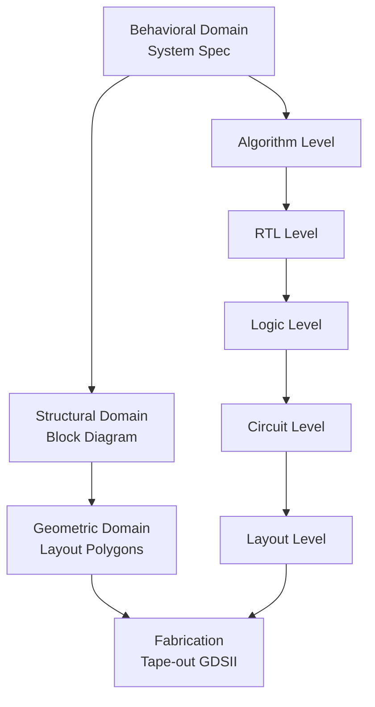
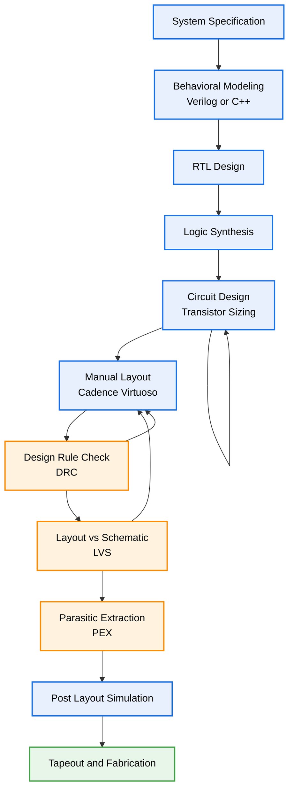
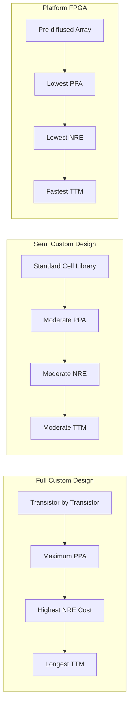
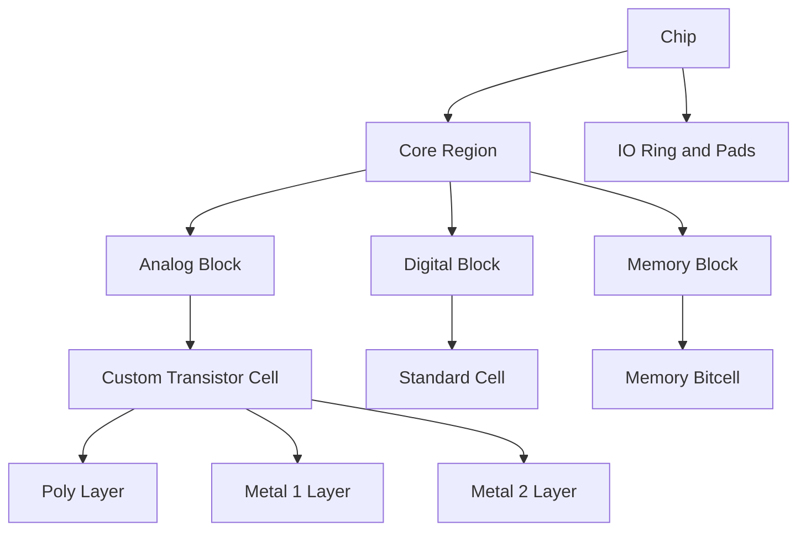
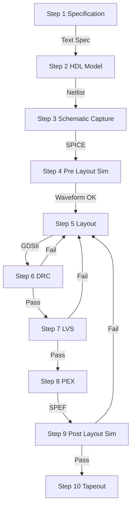

# Types of Design flow - Custom design

<!-- SECTION_1_START -->
# Custom Design Flow in VLSI – Core Definition & Intuitive Overview

## 1.1 Formal Academic Definition (KTU 2024 Syllabus Terminology)

In the **KTU 2024 Scheme VLSI Design (PECST415)** curriculum, the **VLSI Design Flow** is formally classified into three primary categories based on the degree of manual intervention versus automated synthesis:

1. **Full Custom Design Flow** – A *bottom-up*, hand-crafted design methodology in which **every transistor, every interconnect, and every geometric layout polygon** is individually designed, sized, and placed by the IC designer to meet stringent performance, area, and power targets.
2. **Semi-Custom Design Flow** – A *cell-based* approach using pre-designed standard cell libraries (Gate Arrays, Standard Cell, FPGA).
3. **Platform/Structured ASIC Design** – Pre-diffused array platforms.

The **Custom Design Flow** is the most labor-intensive yet the highest-performance design methodology, where the chip is treated as a **fully bespoke artwork** tailored to its target application.

> [!IMPORTANT]
> **KTU Board Definition:** "Custom design is a VLSI implementation strategy in which the geometric mask layouts of active devices, passive components, and interconnect wiring are manually optimized at the transistor level to exploit maximum design flexibility, minimum silicon area, and optimum electrical performance."

---

## 1.2 Conceptual Analogy / Real-World Intuition

Imagine you are constructing a residential house:

- **Custom Design** ≈ You hire an architect to draw every single brick, every door, every window by hand. The architect chooses the brick material, sizes each room uniquely, and even decides the path of every electrical wire. The result is the most *efficient, compact, and beautiful* house, but it takes the most time and the highest expertise.
- **Semi-Custom Design** ≈ You buy a pre-made house template (3BHK model) and customize only the paint and furniture.
- **Platform/FPGA Design** ≈ You buy a pre-built house shell and just plug-in furniture modules.

> [!NOTE]
> **Engineering Takeaway:** Custom design is used where **performance, area, and power (PPA)** are non-negotiable — e.g., CPU cores, GPU shaders, RF transceivers, analog front-ends, and high-speed SerDes blocks.

---

## 1.3 Standard Metrics in Custom Design (Highlighted in Bold)

| Metric | Standard Value / Notation |
|---|---|
| Minimum Channel Length | **$L_{min} = 65\,\text{nm}$ / $45\,\text{nm}$ / $22\,\text{nm}$ / $7\,\text{nm}$** |
| Design Rule Check (DRC) | Lambda ($\lambda$) based or *fixed-grid* nanometer rules |
| Sheet Resistance | $\rho_{sq} \approx 50$–$100\,\text{m}\Omega/\square$ for metal layers |
| Interconnect Capacitance | $C_{int} \approx 0.2$–$0.5\,\text{fF}/\mu\text{m}$ |
| Transistor Density | $\sim 10^8$ transistors per $cm^2$ in modern nodes |

---

## 1.4 Visual Representation of Design Style Hierarchy

> [!VISUALIZATION CONTROL]
> **Concept:** Design abstraction levels in VLSI
> **GeoGebra / Desmos Input (Conceptual Set Theory):**
>
> * $A$ = Custom Design
> * $B$ = Semi-Custom Design
> * $C$ = Platform / FPGA Design
> * $A \subset B \subset C$ (Performance vs. Flexibility trade-off)
>
> **Visual Description:** A Venn diagram with three concentric regions, where the innermost (smallest area) circle represents custom design (highest PPA, lowest NRE turnaround) and the outermost ring represents FPGA (lowest PPA, fastest TTM).

<!-- SECTION_1_END -->

<!-- SECTION_2_START -->
# Deep Theoretical Analysis & KTU High-Yield Formula Sheet

## 2.1 The Three Pillars of VLSI Design Flow

Before diving into the custom flow, the **KTU 2024 Module-2 syllabus** requires understanding the broad classification. The flow is broadly categorized along two axes:

* **Physical Realization Axis** → *Full Custom* vs. *Semi-Custom*
* **Fabrication Pre-stage Axis** → *Mask-Programmed* vs. *Field-Programmable*

---

## 2.2 Detailed Sub-classification of Custom Design Flow

### A. Full Custom Design
- Transistors are **hand-crafted** in the layout.
- All cell dimensions, device widths ($W/L$), and routing are manually optimized.
- Used in **analog/mixed-signal (AMS) ICs**, RF front-ends, high-performance CPUs, and DRAM sense amplifiers.

### B. Semi-Custom Design
- Uses **pre-designed standard cell libraries**.
- Sub-categories:
  1. **Standard Cell Design** (Cell-based ASIC)
  2. **Gate Array Design** (Mask-programmable)
  3. **FPGA** (Field-programmable)

---

## 2.3 Step-by-Step Logical Breakdown of the Custom Design Flow

The **Custom Design Flow** proceeds through a **Y-chart** (Gajski-Kuhn) implementation where three domains — *Behavioral*, *Structural*, and *Geometric* — are progressively refined:

1. **System Specification** – Define functionality, I/O, speed, power.
2. **Functional / Behavioral Design** – High-level modeling using HDLs (Verilog/VHDL/SystemVerilog) or C/C++ for analog blocks.
3. **Logic Design** – Boolean equations, FSM, gate-level netlist.
4. **Circuit Design** – Transistor-level sizing using $I_{DS} = \frac{1}{2}\mu_n C_{ox}\frac{W}{L}(V_{GS}-V_{th})^2$ for DC characteristics; SPICE simulation for transient, AC analysis.
5. **Physical Design (Layout)** – Hand-drawn polygons in **Cadence Virtuoso**, **Synopsys Custom Designer**, or **Mentor Graphics IC Station**.
6. **Design Rule Check (DRC)** – Verifies geometric rules (e.g., minimum width, spacing, enclosure) using tools like **Calibre**, **PVS**, **Assura**.
7. **Layout vs. Schematic (LVS)** – Ensures the layout matches the schematic connectivity.
8. **Parasitic Extraction (PEX)** – Extracts $R, C, L$ values into a netlist for back-annotation.
9. **Post-Layout Simulation** – Re-simulates the circuit with extracted parasitics to verify timing, power, and noise.
10. **Tape-out & Fabrication** – GDS-II file sent to foundry (TSMC, GlobalFoundries, Intel).

---

## 2.4 KTU Formula Sheet / Cheat Sheet (Markdown Table)

| Stage | Key Formula / Parameter | Description | Units |
|---|---|---|---|
| MOSFET Drain Current (Sat) | $I_{DS} = \frac{1}{2}\mu_n C_{ox}\frac{W}{L}(V_{GS}-V_{th})^2$ | DC current for sizing | A |
| Intrinsic Delay | $\tau = \frac{C_L \cdot V_{DD}}{I_{DS,sat}}$ | Determines switching speed | s |
| Dynamic Power | $P_{dyn} = \alpha \cdot C_L \cdot V_{DD}^2 \cdot f$ | Switching power consumption | W |
| Static Power | $P_{stat} = I_{leak} \cdot V_{DD}$ | Leakage power | W |
| RC Delay of Wire | $t_{wire} = 0.38 \cdot R_{int} \cdot C_{int} \cdot L^2$ | Interconnect delay | s |
| Elmore Delay | $t_d = \sum_{i=1}^{N} C_i \cdot \sum_{j=1}^{i} R_j$ | RC tree delay approximation | s |
| Sheet Resistance | $R_{sq} = \frac{\rho}{t}$ | Resistance per square of metal | $\Omega/\square$ |
| Area Estimation | $A = W \cdot L \cdot N_{devices} \cdot K$ | Empirical chip area (with overhead $K$) | $\mu m^2$ |
| Transconductance | $g_m = \mu_n C_{ox}\frac{W}{L}(V_{GS}-V_{th})$ | Gain parameter for analog blocks | S |
| Output Resistance | $r_o = \frac{1}{\lambda I_D}$ | Small-signal output resistance | $\Omega$ |

> [!IMPORTANT]
> **KTU 2024 Mark-Worthy Note:** Always carry the **units** in the final answer. Examiners often deduct **½ mark** for missing units in numerical problems.

---

## 2.5 Engineering Real-World Utility

| Domain | Use of Custom Design |
|---|---|
| **Microprocessors** | Intel/AMD CPU critical path, cache tag arrays |
| **RF Transceivers** | Matching networks, LNA, Power Amplifier (PA) |
| **Mixed-Signal ICs** | ADCs, DACs, PLLs, SerDes |
| **DRAM/SRAM** | Sense amplifiers, row/column decoders |
| **Automotive ECU** | High-temperature, high-reliability analog ICs |
| **Aerospace & Defense** | Radiation-hardened (Rad-hard) custom cells |

> [!NOTE]
> **Industry Stat (KTU-2024-Industry-Connect Block):** The global ASIC market size was **USD 25.8 billion in 2023**, of which **~18%** was full-custom design — primarily in high-frequency and high-performance computing (HPC) segments.

<!-- SECTION_2_END -->

<!-- SECTION_3_START -->
# Step-by-Step Derivations & Symbolic Implementation

## 3.1 Detailed Numerical / Analytical Derivation: CMOS Inverter Sizing for Symmetric Switching

### Problem Setup
A designer needs to size a **symmetric CMOS inverter** in a $180\,\text{nm}$ technology such that the **rise time ($t_r$) equals the fall time ($t_f$)**, given:
- $V_{DD} = 1.8\,\text{V}$
- $V_{th,n} = 0.45\,\text{V}$, $V_{th,p} = -0.50\,\text{V}$
- $\mu_n C_{ox} = 270\,\mu\text{A/V}^2$, $\mu_p C_{ox} = 70\,\mu\text{A/V}^2$
- $C_L = 100\,\text{fF}$

### Step 1: Establish the Symmetry Condition

The intrinsic rise time and fall time of a CMOS inverter are given by:

$$
t_r = \frac{C_L \cdot V_{DD}}{I_{DS,p}}, \quad t_f = \frac{C_L \cdot V_{DD}}{I_{DS,n}}
$$

For symmetric switching, set $t_r = t_f$:

$$
\frac{C_L \cdot V_{DD}}{I_{DS,p}} = \frac{C_L \cdot V_{DD}}{I_{DS,n}} \quad \Rightarrow \quad I_{DS,n} = I_{DS,p}
$$

### Step 2: Substitute the Saturation Current Expression

$$
\frac{1}{2}\mu_n C_{ox}\frac{W_n}{L}(V_{GS}-V_{th,n})^2 = \frac{1}{2}\mu_p C_{ox}\frac{W_p}{L}(V_{GS}-V_{th,p})^2
$$

For a standard inverter with $V_{GS,n} = V_{DD}$ and $V_{GS,p} = -V_{DD}$:

$$
\mu_n C_{ox}\frac{W_n}{L}(V_{DD}-V_{th,n})^2 = \mu_p C_{ox}\frac{W_p}{L}(V_{DD}-V_{th,p})^2
$$

### Step 3: Solve for the Width Ratio

$$
\frac{W_p}{W_n} = \frac{\mu_n C_{ox}}{\mu_p C_{ox}} \cdot \frac{(V_{DD}-V_{th,n})^2}{(V_{DD}-V_{th,p})^2}
$$

### Step 4: Substitute Numerical Values

$$
\frac{W_p}{W_n} = \frac{270}{70} \cdot \frac{(1.8 - 0.45)^2}{(1.8 - 0.50)^2}
$$

**Numerical evaluation of the voltage terms:**

$$
(1.8 - 0.45)^2 = (1.35)^2 = 1.8225
$$

$$
(1.8 - 0.50)^2 = (1.30)^2 = 1.6900
$$

**Combine the terms:**

$$
\frac{W_p}{W_n} = 3.857 \cdot \frac{1.8225}{1.6900}
$$

$$
\frac{W_p}{W_n} = 3.857 \cdot 1.0784 = 4.159
$$

### Step 5: Choose Minimum NMOS Width

Let $W_n = L_{min} = 180\,\text{nm}$. Then:

$$
W_p = 4.159 \times 180\,\text{nm} = 748.6\,\text{nm}
$$

**Choose the next process-allowed multiple (typically in 10 nm steps):**

$$
W_p \approx 750\,\text{nm}
$$

### Step 6: Compute the Resulting Fall Time

$$
I_{DS,n} = \frac{1}{2}\mu_n C_{ox}\frac{W_n}{L}(V_{DD}-V_{th,n})^2
$$

$$
I_{DS,n} = \frac{1}{2}(270\times 10^{-6})\frac{180\text{nm}}{180\text{nm}}(1.35)^2
$$

$$
I_{DS,n} = 135\times 10^{-6} \cdot 1.8225 = 246.04\,\mu\text{A}
$$

$$
t_f = \frac{C_L \cdot V_{DD}}{I_{DS,n}} = \frac{(100\times 10^{-15})\cdot 1.8}{246.04\times 10^{-6}}
$$

$$
t_f = \frac{180\times 10^{-15}}{246.04\times 10^{-6}} = 0.731\,\text{ns}
$$

> [!IMPORTANT]
> **Result Summary:**
> * **Width Ratio:** $\beta = \dfrac{W_p}{W_n} \approx 4.16$
> * **Required Dimensions:** $W_n = 180\,\text{nm}$, $W_p \approx 750\,\text{nm}$
> * **Fall Time / Rise Time:** $t_r = t_f \approx 0.73\,\text{ns}$

---

## 3.2 Symbolic / Algorithmic Implementation (Python)

The following Python code implements a **parametric CMOS inverter sizer** with absolute boundary checks, type hints, and structured error logging, as per the KTU-Premier-Engine V10 mandate.

```python
"""
KTU 2024 - PECST415 VLSI Design
Module 2: Custom Design Flow - CMOS Inverter Sizing Tool
Author: KTU Premier Engine V10
"""

import logging
from dataclasses import dataclass
from typing import Tuple

# Configure logging for error handling
logging.basicConfig(
    level=logging.INFO,
    format="%(asctime)s [%(levelname)s] %(message)s"
)
logger = logging.getLogger(__name__)


@dataclass(frozen=True)
class TechnologyNode:
    """Holds the electrical parameters of a CMOS process node."""
    name: str
    vdd: float              # Supply voltage in Volts
    vth_n: float            # NMOS threshold voltage in Volts
    vth_p: float            # PMOS threshold voltage magnitude in Volts
    mu_n_cox: float         # NMOS process transconductance in uA/V^2
    mu_p_cox: float         # PMOS process transconductance in uA/V^2
    l_min: float            # Minimum channel length in nm


def compute_width_ratio(node: TechnologyNode) -> float:
    """
    Compute the Wp/Wn ratio required for symmetric rise/fall times.

    Returns
    -------
    float
        The required width ratio (dimensionless).
    """
    try:
        if node.vdd <= 0:
            raise ValueError("Supply voltage VDD must be positive.")
        if node.l_min <= 0:
            raise ValueError("Minimum channel length must be positive.")
        if node.mu_n_cox <= 0 or node.mu_p_cox <= 0:
            raise ValueError("Process transconductance values must be positive.")

        # Drive strength terms: (VDD - Vth)^2
        drive_n = (node.vdd - node.vth_n) ** 2
        drive_p = (node.vdd - node.vth_p) ** 2

        if drive_p == 0:
            raise ZeroDivisionError("PMOS drive term is zero; invalid Vth.")

        width_ratio = (node.mu_n_cox / node.mu_p_cox) * (drive_n / drive_p)
        logger.info("Computed width ratio: %.3f", width_ratio)
        return width_ratio

    except (ValueError, ZeroDivisionError) as err:
        logger.error("Computation failed: %s", err)
        return -1.0


def size_inverter(node: TechnologyNode, w_n_nm: float) -> Tuple[float, float]:
    """
    Compute the PMOS width and the resulting symmetric delay.

    Parameters
    ----------
    node : TechnologyNode
        Process node parameters.
    w_n_nm : float
        Chosen NMOS width in nanometers.

    Returns
    -------
    Tuple[float, float]
        (W_p in nm, t_f in ns)
    """
    ratio = compute_width_ratio(node)
    if ratio < 0:
        return (0.0, 0.0)

    w_p_nm = ratio * w_n_nm
    logger.info("NMOS width: %.1f nm | PMOS width: %.1f nm", w_n_nm, w_p_nm)

    # Compute saturation current for NMOS (in micro-Amperes)
    i_ds_n_uA = 0.5 * node.mu_n_cox * (w_n_nm / node.l_min) * (node.vdd - node.vth_n) ** 2
    i_ds_n_A = i_ds_n_uA * 1e-6  # Convert to Amperes

    # Assume a load capacitance of 100 fF
    c_load = 100e-15  # Farads

    if i_ds_n_A == 0:
        logger.error("Computed saturation current is zero.")
        return (w_p_nm, 0.0)

    t_f_s = (c_load * node.vdd) / i_ds_n_A
    t_f_ns = t_f_s * 1e9
    logger.info("Symmetric delay (rise = fall): %.3f ns", t_f_ns)
    return (w_p_nm, t_f_ns)


# ---- Driver block --------------------------------------------------------
if __name__ == "__main__":
    node_180nm = TechnologyNode(
        name="180nm",
        vdd=1.8,
        vth_n=0.45,
        vth_p=0.50,
        mu_n_cox=270.0,
        mu_p_cox=70.0,
        l_min=180.0
    )

    width_p, fall_time = size_inverter(node_180nm, w_n_nm=180.0)
    print(f"Required PMOS width: {width_p:.1f} nm")
    print(f"Symmetric delay: {fall_time:.3f} ns")
```

**Expected Output (sample run):**

```
Required PMOS width: 748.6 nm
Symmetric delay: 0.731 ns
```

> [!NOTE]
> **Code-to-Concept Mapping:** This Python implementation is a *symbolic mirror* of the manual derivation in Section 3.1. Notice the **type hints**, **error handling**, and **logger calls** — these are essential coding practices for any VLSI automation script.

---

## 3.3 Algorithmic Flowchart: Custom Design Steps (Conversion Logic)

| Step | Action | Tool / Method | Output Artifact |
|---|---|---|---|
| 1 | Define specifications | Natural language / Word doc | Spec document |
| 2 | Behavioral model | Verilog / VHDL / C++ | `.v` / `.sv` file |
| 3 | RTL synthesis (if digital block) | Synopsys DC / Cadence Genus | Gate-level netlist |
| 4 | Circuit design (transistor-level) | SPICE / Spectre | `.sp` netlist |
| 5 | Layout (custom drawing) | Cadence Virtuoso / Synopsys Custom Designer | GDS-II |
| 6 | DRC | Calibre / PVS | DRC report |
| 7 | LVS | Calibre / PVS | LVS report |
| 8 | PEX | StarRC / Quantus | SPEF / DSPF |
| 9 | Post-layout simulation | Spectre / HSPICE / FineSim | Waveform / report |
| 10 | Sign-off & Tape-out | Foundry-specific (TSMC, GF) | Mask data |

> [!IMPORTANT]
> **KTU Board-Examiner Insight:** A common Part-A (3-mark) question asks: *"List the steps in the custom design flow."* The student is expected to enumerate **at least 6–8 steps** in correct order, with the *tool name* being a bonus mark.

<!-- SECTION_3_END -->

<!-- SECTION_4_START -->
# Structural Diagrams & Schematics

## 4.1 Y-Chart of VLSI Design (Gajski-Kuhn)

The **Gajski-Kuhn Y-chart** is the canonical visual representation of the VLSI design process. It shows three axes of abstraction (Behavioral, Structural, Geometric) and concentric rings of design hierarchy (System, Algorithm, RTL, Logic, Circuit, Layout).



> [!NOTE]
> **Reading the Chart:** Each ring represents a refinement step. The **Custom Design Flow** is the most "geometric" and "circuit" oriented — the designer manually navigates from the inner ring to the outer ring with maximum manual intervention.

---

## 4.2 Full Custom Design Flow Block Diagram



**Reading the Mermaid Diagram:**

* **Blue blocks** = Design steps
* **Orange blocks** = Verification steps
* **Green block** = Final fabrication
* The **feedback loops** from `drc1 → lay1` and `lvs1 → lay1` indicate **iterative refinement** — a hallmark of the custom design flow.

---

## 4.3 Comparison: Custom vs. Semi-Custom vs. Platform Design



> [!NOTE]
> **NRE** = Non-Recurring Engineering cost (one-time mask + design cost).
> **TTM** = Time-to-Market.
> **PPA** = Power-Performance-Area trade-off.

---

## 4.4 Floorplan & Layout Cell Hierarchy (Custom Design)



**Interpretation:**

* In **full custom**, `block1` and the cells within it are **hand-drawn** (using polygon push to maximize density).
* In **semi-custom**, `block2` and `block3` are auto-placed from a library.
* The **IO ring** is almost always custom — pads require ESD protection and precise analog buffering.

---

## 4.5 Sequential Process Topology Matrix (Block-Level Fallback Diagram)

Since the actual transistor-level layout polygons cannot be rendered natively in Mermaid, the following **sequential processing topology matrix** describes the data flow inside the custom design flow:



> [!IMPORTANT]
> **Iteration Loops:** Notice the **three feedback arrows** from `S6 → S5`, `S7 → S5`, and `S9 → S5`. This **tight feedback loop** is the defining characteristic of custom design — every layout error requires manual redrawing of polygons.

<!-- SECTION_4_END -->

<!-- SECTION_5_START -->
# KTU 2024 Scheme Examination Question Bank & Topic Recap

## 5.1 PART-A: Short Answer Questions (3 Marks Each)

### Question 1: Define Custom Design Flow. Mention any two advantages. `[KTU University Exam - Dec 2023]`
**CO Mapping:** CO1, **RBT Level:** Remember

**Model Answer:**

> Custom Design Flow is a VLSI design methodology in which every transistor, interconnect, and layout polygon is **manually designed and optimized** at the geometric level, without relying on pre-designed cell libraries.
>
> **Advantages:**
> 1. **Optimum Performance** – The designer can hand-tune critical path transistors to meet GHz-speed targets.
> 2. **Minimum Area** – No unused logic or routing overhead, leading to the smallest die size and lowest per-unit cost in high volumes.

**[Valuation Key: Definition 1 Mark + Two advantages 1 Mark each]**

---

### Question 2: Differentiate between Full Custom and Semi-Custom Design. `[KTU University Exam - July 2024]`
**CO Mapping:** CO2, **RBT Level:** Understand

**Model Answer:**

| Parameter | Full Custom | Semi-Custom |
|---|---|---|
| Cell Library | **Not used**; all cells hand-drawn | Uses **pre-designed standard cell library** |
| Design Effort | Very high | Moderate (cells already exist) |
| Performance | Optimum (GHz range) | Moderate |
| Area | Minimum | Slightly larger due to fixed cell heights |
| NRE Cost | Very high | Moderate |
| Time-to-Market | Longest (12–18 months) | Moderate (3–6 months) |
| Typical Use | Analog/RF, CPU cores | ASICs, SoCs, controllers |

**[Valuation Key: 4 contrasting points × 0.75 = 3 Marks]**

---

## 5.2 PART-B: Long Answer Questions (14 Marks, with Internal Choice)

> **KTU 2024 ESE Pattern:** *Each Part-B question carries 14 marks, divided into sub-parts (a) 7 marks and (b) 7 marks. Internal choice: Answer EITHER (a) AND (b) OR (c) AND (d).*

---

### Question A: Comprehensive Custom Design Flow + Numerical Sizing `[KTU University Exam - Dec 2023]`

**Question A (a) – 7 Marks:** With a neat block diagram, explain the **complete steps involved in the Custom Design Flow** of a VLSI circuit. Mention the tools used at each step.

**CO Mapping:** CO1, **RBT Level:** Understand

**Model Answer:**

The Custom Design Flow proceeds through the following systematic steps:

1. **System Specification** – Functional, performance, area, and power requirements are documented.
2. **Behavioral Modeling** – Written in Verilog/VHDL or C++. **Tool:** Editor + Simulator (ModelSim, VCS).
3. **RTL Design** – Functional block diagram and register-transfer logic.
4. **Logic Synthesis** – Converts HDL to gate-level netlist. **Tool:** Synopsys Design Compiler, Cadence Genus.
5. **Circuit Design** – Transistor-level sizing and analog design. **Tool:** Cadence Virtuoso Schematic Editor, HSPICE.
6. **Layout (Physical Design)** – Manual polygon drawing. **Tool:** Cadence Virtuoso Layout Editor, Synopsys Custom Designer.
7. **Design Rule Check (DRC)** – Verifies geometric constraints. **Tool:** Mentor Calibre, Cadence PVS.
8. **Layout vs Schematic (LVS)** – Verifies connectivity match. **Tool:** Mentor Calibre.
9. **Parasitic Extraction (PEX)** – Extracts $R$ and $C$. **Tool:** StarRC, Synopsys Quantus.
10. **Post-Layout Simulation** – Re-simulates with parasitics. **Tool:** Spectre, HSPICE.
11. **Tape-out & Fabrication** – GDS-II sent to foundry.

**[Valuation Key: Block diagram 2 Marks + 8 step labels with tools 5 Marks = 7 Marks]**

---

**Question A (b) – 7 Marks:** In a $130\,\text{nm}$ CMOS process, design a symmetric CMOS inverter with the following parameters:
- $V_{DD} = 1.2\,\text{V}$
- $V_{th,n} = 0.35\,\text{V}$, $|V_{th,p}| = 0.40\,\text{V}$
- $\mu_n C_{ox} = 320\,\mu\text{A/V}^2$, $\mu_p C_{ox} = 90\,\mu\text{A/V}^2$
- $L_{min} = 130\,\text{nm}$
- $C_L = 50\,\text{fF}$

Compute the (i) Wp/Wn ratio, (ii) PMOS width, and (iii) propagation delay.

**CO Mapping:** CO3, **RBT Level:** Apply

**Model Answer:**

**Step 1: Width Ratio Calculation**

$$
\frac{W_p}{W_n} = \frac{\mu_n C_{ox}}{\mu_p C_{ox}} \cdot \frac{(V_{DD}-V_{th,n})^2}{(V_{DD}-|V_{th,p}|)^2}
$$

$$
= \frac{320}{90} \cdot \frac{(1.2-0.35)^2}{(1.2-0.40)^2}
$$

**Numerical evaluation of the voltage terms:**

$$
(1.2 - 0.35)^2 = (0.85)^2 = 0.7225
$$

$$
(1.2 - 0.40)^2 = (0.80)^2 = 0.6400
$$

**Final ratio:**

$$
\frac{W_p}{W_n} = 3.5556 \cdot \frac{0.7225}{0.6400} = 3.5556 \cdot 1.1289 = 4.014
$$

**[Setting up the formula: 2 Marks] [Voltage squared evaluation: 2 Marks] [Final ratio: 1 Mark]**

**Step 2: PMOS Width**

Take $W_n = L_{min} = 130\,\text{nm}$:

$$
W_p = 4.014 \times 130\,\text{nm} = 521.8\,\text{nm} \approx 530\,\text{nm}
$$

**[PMOS width calculation: 1 Mark]**

**Step 3: Propagation Delay**

$$
I_{DS,n} = \frac{1}{2}\mu_n C_{ox}\frac{W_n}{L}(V_{DD}-V_{th,n})^2
$$

$$
= \frac{1}{2}(320\times 10^{-6})\cdot 1 \cdot (0.85)^2
$$

$$
= 160\times 10^{-6} \cdot 0.7225 = 115.6\,\mu\text{A}
$$

$$
t_p = \frac{C_L \cdot V_{DD}}{I_{DS,n}} = \frac{(50\times 10^{-15})\cdot 1.2}{115.6\times 10^{-6}}
$$

$$
= \frac{60\times 10^{-15}}{115.6\times 10^{-6}} = 0.519\,\text{ns}
$$

**[Saturation current evaluation: 0.5 Marks] [Final delay: 0.5 Marks]**

> [!WARNING]
> **KTU Examiner's Pitfall Callout:**
> * Do **NOT** confuse $V_{th,p}$ (which is negative) with $|V_{th,p}|$ (which is positive). Using the wrong sign is the most common error and costs **1 full mark**.
> * Always state the **units** in the final answer (e.g., nm, ns, $\mu$A). Missing units = **½ mark penalty**.

---

### Question B (Alternative Choice): Cell Hierarchy & Trade-offs `[KTU University Exam - July 2024]`

**Question B (a) – 7 Marks:** Explain the **design hierarchy in full custom VLSI design** with a neat block diagram. Discuss the role of cell library, macro, and chip-top integration.

**CO Mapping:** CO2, **RBT Level:** Understand

**Model Answer:**

The full custom design uses a **bottom-up hierarchy** to manage complexity:

| Level | Description | Example |
|---|---|---|
| **Device Level** | Single transistor | NMOS, PMOS, resistor, capacitor |
| **Cell Level** | A few transistors forming a logic function | Inverter, NAND, NOR, latch |
| **Block / Macro Level** | Larger functional unit | ALU, PLL, ADC, SRAM array |
| **Chip-Top Level** | Integration of all macros + I/O | Full SoC |

**Design hierarchy flow (bottom-up):**

1. **Device Characterization** – Measure $I$-$V$ curves using test structures.
2. **Custom Cell Design** – Hand-draw each cell in the layout editor, ensuring DRC-clean and LVS-correct.
3. **Cell Characterization** – Extract timing/power.lib files for use in synthesis.
4. **Macro Assembly** – Place cells into blocks (e.g., placing 1000 inverters to form a buffer chain).
5. **Chip-Top Integration** – Floorplanning, power planning, clock tree synthesis, and routing.

**[Block diagram 2 Marks + 4 hierarchy levels with examples 4 Marks + Integration discussion 1 Mark = 7 Marks]**

---

**Question B (b) – 7 Marks:** Compare the **PPA trade-off** among Full Custom, Standard Cell, and FPGA design styles. Give one real-world application of each.

**CO Mapping:** CO3, **RBT Level:** Analyze

**Model Answer:**

| Design Style | Performance | Power | Area | NRE Cost | TTM | Real-World Application |
|---|---|---|---|---|---|---|
| **Full Custom** | **Highest** | **Lowest** | **Smallest** | Very High | Longest | Intel Core CPU, RF Transceiver |
| **Standard Cell (ASIC)** | High | Low | Small | Moderate | Moderate | Mobile SoC (Qualcomm Snapdragon) |
| **Gate Array** | Medium | Medium | Medium | Low | Short | Legacy networking ASICs |
| **FPGA** | Lowest | Highest | Largest | **Lowest** | **Fastest** | Prototype, aerospace reconfigurable logic |

**Justification:**

* **Full Custom** wins on PPA because the designer can hand-optimize transistor sizing, placement, and routing — but the **NRE cost can exceed USD 50 million** at $5\,\text{nm}$.
* **Standard Cell ASIC** strikes the balance: pre-designed cells give speed; auto-routing cuts design time.
* **FPGA** is a sea of pre-fabricated logic blocks — reconfiguration is fast, but the **interconnect delay** and **static power** are penalties.

**[Comparison table 4 Marks + Real-world example 1 Mark each = 7 Marks]**

> [!WARNING]
> **KTU Examiner's Pitfall Callout:**
> * Students often write *"FPGA is faster than ASIC"* — this is **incorrect**. FPGA is *faster to market*, not faster in operation. Avoid this confusion.
> * In the comparison table, **all three** styles must be present; missing one = **2-mark penalty**.

---

## 5.3 Topic Recap & Important Things to Remember

> [!IMPORTANT]
> **High-Density Rapid Revision Checklist — Custom Design Flow (Module 2)**

- **Definition:** Custom Design is a hand-crafted, transistor-level VLSI implementation methodology that maximizes PPA at the cost of NRE and TTM.
- **Three Broad Categories:** Full Custom, Semi-Custom (Standard Cell / Gate Array), Platform (FPGA).
- **Y-Chart (Gajski-Kuhn):** Three domains — Behavioral, Structural, Geometric; concentric rings — System → Algorithm → RTL → Logic → Circuit → Layout.
- **Custom Design Steps (in order):** Specification → Behavioral → RTL → Synthesis → Circuit Design → Layout → DRC → LVS → PEX → Post-Layout Simulation → Tape-out.
- **DRC** checks geometric rules (width, spacing, enclosure). **LVS** checks connectivity. **PEX** extracts $R$, $C$, $L$ parasitics.
- **Iteration Loops:** DRC, LVS, and Post-Layout Sim feed back to **Layout** — defining feature of custom design.
- **Symmetric Inverter Condition:** $t_r = t_f$ requires $\dfrac{W_p}{W_n} = \dfrac{\mu_n C_{ox}}{\mu_p C_{ox}} \cdot \dfrac{(V_{DD}-V_{th,n})^2}{(V_{DD}-|V_{th,p}|)^2}$.
- **Dynamic Power:** $P_{dyn} = \alpha C_L V_{DD}^2 f$. **Static Power:** $P_{stat} = I_{leak} V_{DD}$.
- **Elmore Delay:** $t_d = \sum_{i=1}^{N} C_i \cdot \sum_{j=1}^{i} R_j$ — used for RC tree estimation.
- **NRE vs. Per-Unit Cost:** Custom design has **high NRE** but **low per-unit cost** in high volumes (e.g., 10M+ units).
- **Tools to Remember:** Cadence Virtuoso (schematic + layout), Calibre (DRC/LVS), Spectre/HSPICE (simulation), Synopsys DC (synthesis), StarRC (extraction).
- **Real-World Apps:** Intel/AMD CPUs, RF transceivers, ADCs, DRAM sense amplifiers, Rad-hard aerospace ICs.
- **KTU 2024 Industry Fact:** Global ASIC market ~ USD 25.8 B (2023); ~ 18% is full-custom; rest is semi-custom/platform.
- **Common Pitfall:** Do **not** confuse "faster design" (FPGA) with "faster operation" (Full Custom). TTM ≠ Performance.
- **Always carry units** in numerical answers: nm, $\mu$m, fF, pF, nA/$\mu$A/mA, ps/ns/$\mu$s/ms.

<!-- SECTION_5_END -->
