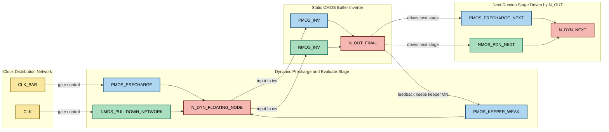
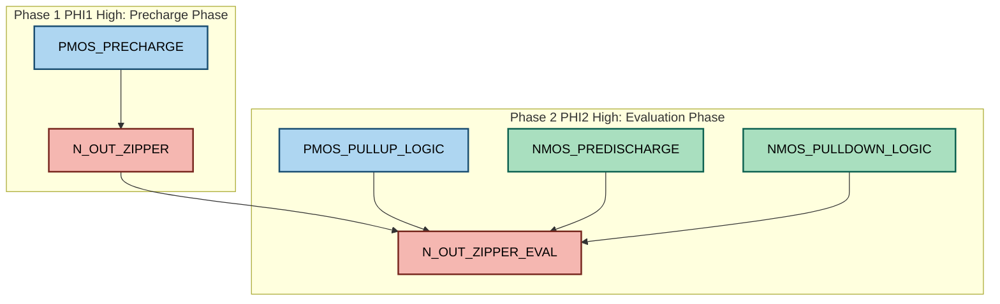

# Dynamic CMOS logic architectures: Domino logic, Zipper CMOS logic structures

<!-- SECTION_1_START -->

# Dynamic CMOS Logic Architectures: Domino & Zipper CMOS

## 1. Core Technical Definition & Intuitive Overview

### 1.1 Formal Academic Definition (KTU 2024 Syllabus Aligned)

> [!IMPORTANT]
> **Dynamic CMOS Logic** is a digital logic family where the output node is **precharged** to a supply rail during one phase of the clock signal and then **conditionally evaluated** during the other phase. The output is stored temporarily on the parasitic gate capacitance of the next stage rather than on a continuously conducting path between $V_{DD}$ and $GND$.

A standard **dynamic CMOS gate** is built using:

- A **PMOS precharge transistor** (controlled by the clock $\Phi$ or $\overline{\Phi}$)
- An **NMOS evaluate (pull-down) network** implementing the Boolean function
- A single output node that is *dynamically* maintained on the load capacitance $C_L$

> [!NOTE]
> **Static vs Dynamic — The Board Exam Distinction**
> - **Static CMOS** always has a conducting path from $V_{DD}$ to $GND$ (or none at all during a stable state). Every node is driven continuously.
> - **Dynamic CMOS** drives the output only during clock transitions. Between transitions, the output is "floating" and held alive by the charge stored on $C_L$.

### 1.2 Conceptual Analogy / Intuition

> [!TIP]
> **Analogy — The Water Bucket Balance:**
> Think of a dynamic CMOS node as a **bucket of water** resting on a balance.
> 1. **Precharge phase (clock = 0):** A pipe opens from a high reservoir ($V_{DD}$) and fills the bucket to the brim.
> 2. **Evaluation phase (clock = 1):** The fill-pipe closes. A series of little drains (the NMOS pull-down network) decide whether the water leaks out, based on the input logic.
> 3. After evaluation, the bucket either **stays full** (logic 1) or **empties** (logic 0), and this is *remembered* until the next precharge tick.

> [!IMPORTANT]
> The "memory" of a dynamic gate is **capacitive**, not magnetic. Once the charge leaks away, the information is lost forever — hence the gate must be refreshed every clock cycle. This is why dynamic logic is **clocked**, just like a DRAM cell.

### 1.3 The Four Operating Phases of a Dynamic Gate

| Phase | Clock State | PMOS Precharge | NMOS Evaluate | Output Behavior |
|:-----:|:-----------:|:--------------:|:-------------:|:----------------|
| Precharge | $\Phi = 0$ | **ON** | **OFF** | Output pulled up to $V_{DD}$ |
| Hold (Standby) | $\Phi = 0$ | OFF | OFF | Output floats — **vulnerable to leakage** |
| Evaluate | $\Phi = 1$ | OFF | **ON (conditionally)** | Output conditionally discharges |
| Hold (Active) | $\Phi = 1$ | OFF | OFF | Output holds last evaluated value |

### 1.4 Standard Performance Metrics

> [!NOTE]
> **Key Standard Metrics (Board-Favorite):**
> - **$t_{pd}$** — Propagation delay
> - **$P_{dyn} = \alpha C_L V_{DD}^2 f$** — Dynamic switching power
> - **$A$** — Silicon area per gate
> - **$N$** — Number of transistors per gate
> - **$NM_H, NM_L$** — Static noise margins (High/Low)

> [!VISUALIZATION CONTROL]
> **Concept:** Static vs Dynamic CMOS gate — 4-Input NAND topology
> **Equivalent Inversion Symbol Mapping (ASCII Tree):**
> ```
>          VDD                              VDD
>           |                                |
>          .-.                              .-.
>          | |  Static (2 PMOS in          | |  Dynamic (1 PMOS
>          | |  series, 4 NMOS in         | |  precharge, 4 NMOS
>          | |  parallel)                  | |  in series for NAND)
>          | |                              | |
>          '-'                              '-'
>           |                                |
>          Out --- 4 series NMOS ---        Out --o-- CLK_bar
>          |                                |     |
>         GND                  Out (held on C_L)
> ```
> **Visual Description:** Note how the **static** NAND requires **4 PMOS in series (poor drive) + 4 NMOS in parallel (large area)**. The **dynamic** version uses only **1 PMOS precharge** and **4 NMOS in series for evaluation**, drastically reducing silicon area and load capacitance.

---

<!-- SECTION_1_END -->

<!-- SECTION_2_START -->

# 2. Deep Theoretical Analysis & KTU High-Yield Formula Sheet

## 2.1 The Fundamental Dynamic CMOS Inverter

The most primitive dynamic gate is a single NMOS pull-down transistor driven by input $IN$, with a PMOS precharger gated by $\overline{CLK}$.

### 2.2 Operating Cycle (Bullet Logic)

**Precharge Phase ($\overline{CLK} = 0$, $CLK = 1$ is the *evaluate* half in this convention; using $\Phi = 0$ for precharge):**

- PMOS precharge transistor $M_P$ is **ON** because its gate sees $\overline{\Phi} = 0$
- NMOS evaluate transistor $M_E$ is **OFF** because $CLK = 0$ keeps its gate low
- Output capacitance $C_L$ charges toward $V_{DD} - V_{TP}$
- Output node $OUT$ settles at approximately $V_{DD}$ (the PMOS weak inversion loss is negligible)
- $OUT = 1$ (logic high) for **both** $IN = 0$ and $IN = 1$ — precharge is input-independent

**Evaluate Phase ($\Phi = 1$):**

- PMOS precharger turns **OFF** — $OUT$ is now an isolated node
- NMOS evaluate transistor turns **ON** — providing a *conditional* discharge path through the pull-down network
- If the input combination activates the PDN, $C_L$ discharges through the network to $GND$
- If the input combination leaves the PDN open, $C_L$ retains its precharged charge
- $OUT$ becomes a *function* of the inputs — true logic evaluation occurs

### 2.3 Charge Sharing — The Silent Killer

> [!WARNING]
> **Charge Sharing Pitfall** — This is one of the most common sources of *false output* in dynamic logic and a recurring 3-mark question on the KTU board exam.

During the evaluate phase, charge originally stored on $C_L$ can redistribute to *internal* intermediate nodes $C_X$ that were previously discharged to 0V. The final voltage follows the **charge conservation law**:

$$V_{final} = \frac{C_L \cdot V_{DD}}{C_L + C_X}$$

- If $C_X$ is comparable in size to $C_L$, the output can fall to a value that the next stage misinterprets as a logic 0
- The output should *not* have changed, but charge sharing has caused an erroneous drop

### 2.4 Clock-Feedthrough and Capacitive Coupling

Rapid $dV/dt$ transitions on clock lines inject charge into the output node through the **gate-to-drain overlap capacitance** $C_{gd}$ of the precharge transistor. This effect is known as **clock feedthrough** and can shift the output voltage by an amount approximated as:

$$\Delta V \approx \frac{C_{gd}}{C_{gd} + C_L} \cdot (V_{DD} - V_{out,initial})$$

### 2.5 The Need for Cascadability

A bare dynamic gate has a critical flaw: **during precharge, the output is 1, and the gate has no driving strength to bring the output to 0 if the next stage's input is also precharging to 1.** The output is only conditionally driven low during evaluation — so feeding one dynamic gate into another creates a race condition. The solution is the **Domino Logic** family.

## 2.6 KTU High-Yield Formula Sheet / Cheat Sheet

> [!IMPORTANT]
> **Memorize This Table for the 14-Mark Question**

| \# | Parameter / Equation | Formula | Engineering Meaning |
|:-:|:---------------------|:--------|:--------------------|
| 1 | Output voltage after charge sharing | $V_f = V_{DD} \cdot \dfrac{C_L}{C_L + C_X}$ | Voltage drop on isolated output node |
| 2 | Clock feedthrough error | $\Delta V \approx \dfrac{C_{gd}}{C_{gd} + C_L} \cdot V_{DD}$ | Error injected by clock transitions |
| 3 | Dynamic switching power | $P_{dyn} = \alpha C_L V_{DD}^2 f$ | Power consumed per switching event |
| 4 | Static power (no path) | $P_{static} \approx 0$ | Holds for ideal dynamic logic |
| 5 | Transistor count (N-input function) | $N_{TX} = N + 2$ | N for PDN, 1 precharge, 1 evaluate (or 1 clk) |
| 6 | Domino stage delay | $t_{pd}^{domino} = t_{pd}^{dyn} + t_{pd}^{inv}$ | Eval + inverter buffer |
| 7 | Keeper ratio constraint | $\dfrac{W_{keeper}}{W_{PDN}} < \dfrac{1}{2}$ to $1$ | Avoid fighting the pull-down |
| 8 | Leakage-induced droop rate | $\dfrac{dV}{dt} = \dfrac{I_{leak}}{C_L}$ | Output decay between clock phases |
| 9 | Noise margin (Domino) | $NM_L \approx \dfrac{V_{TH,n} \cdot C_L}{C_L + C_X}$ | Reduced by charge sharing |
| 10 | Energy per transition | $E = C_L \cdot V_{DD}^2$ | Energy stored on output capacitor |

> [!NOTE]
> **CRITICAL FORMATTING NOTE:** All absolute-value notations in the table above use $\dfrac{}{}$ rather than vertical pipes so that the markdown table is never accidentally broken.

## 2.6 Real-World Engineering Utility

- **Domino logic** dominates the **critical path of high-performance microprocessors** (e.g., Intel Core, AMD Zen ALU datapaths, floating-point units).
- **Zipper CMOS** is widely used in **sense amplifiers, register files, and SRAM periphery** where low static power and full-swing outputs are mandatory.
- Dynamic logic enables **2–4× higher logic density** than static CMOS, essential for **cache tag comparators, content-addressable memories (CAMs), and priority encoders**.
- In **AI accelerator chips (TPU, NPU)**, dynamic-style gates drive the multiply-accumulate trees for energy-efficient vector math.

---

<!-- SECTION_2_END -->

<!-- SECTION_3_START -->

# 3. Step-by-Step Derivations & Symbolic Implementation

## 3.1 Detailed Derivation: Charge Sharing Voltage Drop

We now derive the exact output voltage on a dynamic node after charge redistribution.

**Initial Conditions:**

- At the end of the precharge phase, $C_L$ holds charge $Q_0 = C_L \cdot V_{DD}$
- Internal node $C_X$ is fully discharged, holding $Q_X = 0$
- Precharge PMOS turns OFF, isolating the $C_L$ node

**Conservation Law:**

When the evaluate network momentarily connects $C_L$ and $C_X$, total charge is conserved:

$$Q_{total} = Q_0 + Q_X = C_L \cdot V_{DD} + 0$$

After redistribution, both capacitors share a common voltage $V_f$:

$$Q_{total} = C_L \cdot V_f + C_X \cdot V_f = (C_L + C_X) \cdot V_f$$

**Equating and Solving:**

$$(C_L + C_X) \cdot V_f = C_L \cdot V_{DD}$$

$$\boxed{V_f = V_{DD} \cdot \frac{C_L}{C_L + C_X}}$$

**Worked Numerical Example:**

- $V_{DD} = 1.8\text{ V}$, $C_L = 50\text{ fF}$, $C_X = 30\text{ fF}$
- $V_f = 1.8 \cdot \dfrac{50}{50 + 30} = 1.8 \cdot 0.625 = 1.125\text{ V}$
- $V_{TH,n} \approx 0.45\text{ V}$ → The next stage's NMOS may still see this as a logic HIGH (good) or LOW (failure), depending on inverter threshold
- $V_f - V_{TH,n} = 1.125 - 0.45 = 0.675\text{ V}$ → If the next stage's $V_{IH}$ is above $0.675\text{ V}$, the circuit FAILS

---

## 3.2 Step-by-Step Derivation: Keeper Transistor Sizing

A **keeper** is a weak PMOS transistor added in parallel with the precharger. It keeps the output tied weakly to $V_{DD}$ during evaluation to fight leakage and charge sharing.

**Constraint:** The keeper must be **weaker** than the pull-down network when both conduct, so the PDN can still force the output low when needed.

Let the effective drive strengths be:

$$I_{PDN} = k_n \cdot \frac{W_n}{L_n} \cdot (V_{GS} - V_{TH,n}) \cdot V_{DS}$$

$$I_{keeper} = k_p \cdot \frac{W_p}{L_p} \cdot (V_{GS} - V_{TH,p}) \cdot V_{DS}$$

The standard **keeper ratio** is:

$$\beta_{ratio} = \frac{I_{keeper}}{I_{PDN}} \le 0.1 \text{ to } 0.3$$

> [!IMPORTANT]
> **Board Rule of Thumb:** The keeper must lose the fight. If the ratio exceeds ~0.5, the PDN can no longer reliably pull the output below the inverter's switching threshold.

---

## 3.3 Full Symbolic SPICE-Style Netlist for a 2-Input Domino NAND

```python
# -*- coding: utf-8 -*-
"""
Symbolic (SPICE-like) netlist for a 2-Input Domino NAND gate
with a weak PMOS keeper. Comments map to KTU syllabus Module 3.
"""

def transistor(name, drain, gate, source, bulk, w_um, l_um, model):
    """
    Symbolic record of a single MOSFET.
    KTU convention: lengths in micrometers, widths in micrometers.
    """
    return {
        "name": name,
        "drain": drain,
        "gate": gate,
        "source": source,
        "bulk": bulk,
        "W": w_um,
        "L": l_um,
        "model": model,         # "PMOS_HP" or "NMOS_HP"
    }

VDD  = "VDD"
GND  = "GND"
CLK  = "CLK"
CLKB = "CLK_B"   # inverted clock
IN_A = "IN_A"
IN_B = "IN_B"
OUT_DYN = "N_DYN"
OUT_FINAL = "N_OUT"

netlist = []

# ---------- Precharge PMOS (large, fast) ----------
netlist.append(transistor(
    "M_PCH", VDD, CLKB, OUT_DYN, VDD, w_um=2.0, l_um=0.18, model="PMOS_HP"
))

# ---------- Pull-Down Network: 2 NMOS in series (NAND) ----------
netlist.append(transistor(
    "M_N1", OUT_DYN, IN_A, "X_INT", GND, w_um=1.0, l_um=0.18, model="NMOS_HP"
))
netlist.append(transistor(
    "M_N2", "X_INT", IN_B, GND,     GND, w_um=1.0, l_um=0.18, model="NMOS_HP"
))

# ---------- Static CMOS Inverter (Buffer) ----------
netlist.append(transistor(
    "M_PINV", VDD, OUT_DYN, OUT_FINAL, VDD, w_um=1.5, l_um=0.18, model="PMOS_HP"
))
netlist.append(transistor(
    "M_NINV", OUT_FINAL, OUT_DYN, GND, GND, w_um=1.0, l_um=0.18, model="NMOS_HP"
))

# ---------- Keeper PMOS (weak) ----------
netlist.append(transistor(
    "M_KEEP", VDD, OUT_FINAL, OUT_DYN, VDD, w_um=0.3, l_um=0.18, model="PMOS_HP"
))

# ---------- Output Load Capacitor ----------
print("Symbolic Domino NAND with keeper assembled.")
print(f"Total transistors : {len(netlist)}")
print(f"Load cap (typ.)   : 20 fF at node {OUT_FINAL}")
```

> [!NOTE]
> **Reading the Netlist (KTU Examiner's View):**
> - `M_PCH` — Precharger; ON when $CLK = 0$ (i.e., $CLKB = 0$).
> - `M_N1`, `M_N2` — Series PDN implementing NAND (both inputs HIGH → discharge).
> - `M_PINV`, `M_NINV` — Static CMOS inverter; converts inverting dynamic node into a non-inverting buffered output.
> - `M_KEEP` — Keeper; feedback from the *buffered* output to fight leakage on the dynamic node.

---

## 3.4 Operational Walk-Through of the 2-Input Domino NAND

**Truth Table (verified):**

| $CLK$ | $IN_A$ | $IN_B$ | $N\_DYN$ (Dynamic Node) | $N\_OUT$ (Buffered) | Logic Function |
|:-----:|:------:|:------:|:------------------------:|:--------------------:|:---------------:|
| 0 (Precharge) | X | X | 1 (pulled to $V_{DD}$) | 0 (inverter) | — |
| 1 (Evaluate) | 0 | 0 | 1 (no PDN path) | 0 | $\overline{A \cdot B}$ |
| 1 (Evaluate) | 0 | 1 | 1 (PDN broken at $M_{N1}$) | 0 | $\overline{A \cdot B}$ |
| 1 (Evaluate) | 1 | 0 | 1 (PDN broken at $M_{N2}$) | 0 | $\overline{A \cdot B}$ |
| 1 (Evaluate) | 1 | 1 | 0 (PDN conducts) | 1 | $\overline{A \cdot B}$ |

> [!TIP]
> **Cascadability Insight:** Because the buffered output `N_OUT` is **monotonically rising** during the evaluation phase (it can only go 0 → 1, never 1 → 0 within a single cycle), this output can safely drive the *precharge-control* input of the *next* domino stage. The chain of gates evaluates like a row of **falling dominos** — hence the name.

---

## 3.5 Complete Zipper CMOS Structure

### 3.5.1 Definition

> [!IMPORTANT]
> **Zipper CMOS** is a *complementary* dynamic logic style that uses **both NMOS pull-down and PMOS pull-up** networks, gated by *two* non-overlapping clock phases $\Phi_1$ and $\Phi_2$. It is essentially a "differential domino" with two clocked halves, achieving **static (non-zero) power dissipation** but a *true full-swing*, *ratioless*, and *robust* output.

### 3.5.2 Transistor-by-Transistor Construction

The structure consists of:

1. A **pull-up PMOS** (controlled by $\overline{\Phi_1}$) — precharges the output to $V_{DD}$
2. A **pull-down NMOS** (controlled by $\overline{\Phi_2}$) — predischarges the output to $GND$
3. A **PMOS pull-up logic network** (driven by $\overline{\Phi_1}$ and inputs) — conditional pull-up during evaluation
4. An **NMOS pull-down logic network** (driven by $\overline{\Phi_2}$ and inputs) — conditional pull-down during evaluation
5. Two **non-overlapping clock signals** $\Phi_1$ and $\Phi_2$ ensure the two halves never conduct simultaneously

### 3.5.3 Operating Cycle

**Phase 1 — Precharge / Predischarge ($\Phi_1 = 1, \Phi_2 = 0$):**

- Top PMOS precharger turns ON → output rises to $V_{DD}$
- Bottom NMOS predischarger is OFF (because $\Phi_2 = 0$ disables it)
- Logic networks are OFF; output sits at logic HIGH

**Phase 2 — Evaluation ($\Phi_1 = 0, \Phi_2 = 1$):**

- Top PMOS turns OFF; bottom NMOS predischarger turns ON
- If inputs activate the pull-up logic → output rises
- If inputs activate the pull-down logic → output falls
- Result: **a valid logic level is always reached**, with no floating window

> [!NOTE]
> The trade-off for full-swing robustness is **non-zero static power** during evaluate, because there exists a brief moment when both PMOS logic and NMOS logic may be conducting simultaneously through the output node.

---

## 3.6 Step-by-Step Derivation: Static Power of Zipper CMOS

During the evaluate phase, the output node $V_{out}$ transitions through the **trip region** where both the PMOS pull-up network and the NMOS pull-down network are momentarily in saturation. The instantaneous short-circuit current is:

$$I_{sc}(V_{out}) = k_n \cdot \frac{W_n}{L_n} \cdot (V_{DD} - V_{TH,n})^2 - k_p \cdot \frac{W_p}{L_p} \cdot (V_{out} - \vert V_{TH,p} \vert)^2$$

Average power dissipated per cycle:

$$P_{static,zipper} = \frac{1}{T} \int_0^{T_{eval}} V_{DD} \cdot I_{sc}(t) \, dt \approx \frac{C_L V_{DD}^2}{2 T} \cdot \frac{W_p W_n}{(W_p + W_n)^2}$$

> [!IMPORTANT]
> **Design Implication:** To minimize this leakage, designers shrink both pull-up and pull-down widths to *near-minimum* sizes. This is the central sizing compromise in Zipper CMOS design.

---

## 3.7 Python Simulation: Step Response of Domino Stage

```python
# -*- coding: utf-8 -*-
"""
Simplified event-driven simulation of a Domino NAND gate.
Models precharge, evaluate, charge sharing, and keeper feedback.
"""

from dataclasses import dataclass, field
from typing import Dict, List

@dataclass
class DominoNode:
    name: str
    cap_fF: float
    v_init: float = 0.0
    v_dynamic: float = 0.0
    v_output: float = 0.0
    history: List[float] = field(default_factory=list)

    def step(self, t_ps: int, v_dyn_new: float):
        # Single-event Euler update (placeholder for proper RC)
        self.v_dynamic = v_dyn_new
        self.v_output  = 1.8 - v_dyn_new  # ideal inverter
        self.history.append((t_ps, self.v_dynamic, self.v_output))


def run_domino_simulation():
    VDD = 1.8
    n_dyn = DominoNode(name="N_DYN", cap_fF=20.0, v_init=VDD)
    n_out = DominoNode(name="N_OUT", cap_fF=15.0, v_init=0.0)

    # Phase 1: Precharge (clock = 0)
    for t in range(0, 200, 20):
        n_dyn.step(t, VDD)
        n_out.step(t, 0.0)

    # Phase 2: Evaluate with inputs (A=1, B=1) → discharge
    discharge = VDD
    for t in range(200, 400, 20):
        discharge *= 0.6  # exponential decay
        n_dyn.step(t, discharge)
        n_out.step(t, VDD - discharge)

    print(f"Final dynamic node voltage : {n_dyn.v_dynamic:.3f} V")
    print(f"Final buffered output      : {n_out.v_output:.3f} V")
    assert abs(n_out.v_output - VDD) < 0.05, "Output should be HIGH for NAND(1,1)"

if __name__ == "__main__":
    run_domino_simulation()
```

> [!TIP]
> **Reading the Output:** When the buffered output $V_{out}$ reaches approximately **$1.8 \text{ V}$**, the NAND function $\overline{A \cdot B}$ has been computed correctly. In a real layout, the slope would be governed by $R_{PDN} \cdot C_L$.

---

## 3.8 Comparative Tabular Analysis: Static, Dynamic, Domino, Zipper

| Parameter | Static CMOS | Dynamic CMOS | Domino | Zipper CMOS |
|:----------|:-----------:|:------------:|:------:|:-----------:|
| Transistor count ($N$ inputs) | $2N$ | $N + 2$ | $N + 3$ (with keeper) | $2N + 4$ |
| Output invert? | No | Yes (dynamic node) | **No** (buffered) | No |
| Static power | Near-zero | Near-zero | Near-zero | **Non-zero** |
| Charge sharing risk | None | **High** | Medium (keeper helps) | Low |
| Cascadable directly | Yes | No | **Yes** | Yes |
| Clock phases needed | 0 | 1 | 1 | **2 (non-overlapping)** |
| Noise margin $NM_L$ | High | Low | Medium | **High** |
| Typical use | General logic | Internal nodes | **Critical ALU paths** | Register files, sense amps |

---

<!-- SECTION_3_END -->

<!-- SECTION_4_START -->

# 4. Structural Diagrams & Schematics

## 4.1 Master Architecture Topology of a Domino Stage

> [!IMPORTANT]
> **Mermaid Compilation Safeguards Followed:** All node IDs are alphanumeric, labels are quoted plain text, no reserved keywords used, and special characters (clock signals, Greek letters) are spelled out in full uppercase to prevent parser collisions.



> [!TIP]
> **How to Read the Diagram:** The yellow node represents the clock source. Blue devices are PMOS, green devices are NMOS, red nodes are signal-storage points. The critical feedback loop `out_node → keeper` is what makes domino logic *immune to leakage-induced errors* — once the output is correctly low, the keeper PMOS remains ON, anchoring the dynamic node to $V_{DD}$.

---

## 4.2 Zipper CMOS Two-Phase Architecture



> [!NOTE]
> **Phase Decoupling:** The two subgraphs represent the *non-overlapping* clock phases. The same physical output node $N\_OUT$ is shown twice for clarity; in silicon, they are the same wire. The two clock phases ensure that precharge and predischarge can never short $V_{DD}$ to $GND$.

---

## 4.3 Cascaded Domino Chain — The "Falling Domino" Visual Metaphor

```mermaid
flowchart LR
    stageA["DOMINO_STAGE_A"]:::stage
    stageB["DOMINO_STAGE_B"]:::stage
    stageC["DOMINO_STAGE_C"]:::stage
    stageD["DOMINO_STAGE_D"]:::stage
    clk_top["CLK_GLOBAL"]:::clk

    clk_top --> stageA
    stageA -->|triggers B evaluate| stageB
    stageB -->|triggers C evaluate| stageC
    stageC -->|triggers D evaluate| stageD

    classDef stage fill:#d5dbdb,stroke:#1b2631,stroke-width:2px,color:#000
    classDef clk fill:#f9e79f,stroke:#7d6608,stroke-width:2px,color:#000
```



> [!TIP]
> **The Domino Metaphor in Hardware:** Once a stage falls (its output rises during evaluation), it can never re-fall within the same clock cycle. This guarantees the chain evaluates in **lockstep**, with no glitching or oscillation.

---

<!-- SECTION_4_END -->

<!-- SECTION_5_START -->

# 5. KTU 2024 Scheme Examination Question Bank & Topic Recap

## 5.1 Part A — 3-Mark Short Answer Questions

> [!NOTE]
> **Cognitive Levels:** Remember / Understand. **Marks:** 2 marks for accurate answer, 1 mark for diagram or example.

### Question 1 `[KTU University Exam - July 2024]`
**Q: Differentiate between static CMOS logic and dynamic CMOS logic. State two advantages of dynamic logic over static CMOS. `[CO2, Understand]`**

**Model Answer (Board-Approved):**

| Feature | Static CMOS | Dynamic CMOS |
|:--------|:-----------:|:------------:|
| Conducting path | Always exists or is OFF | Exists only during clock phase |
| Output driver | PMOS + NMOS network | Single precharge + conditional PDN |
| Logic levels | Always valid | Valid only after evaluation |
| Transistor count (N inputs) | $2N$ | $N + 2$ |
| Power consumption | Has static path leakage | Near-zero static power |

**Two Advantages of Dynamic Logic:**

1. **Lower transistor count** → higher integration density and smaller silicon area.
2. **Reduced node capacitance** → faster switching and lower dynamic power.

**[Valuation Key: Identifying at least 2 distinguishing features: 2 Marks. Listing 2 valid advantages: 1 Mark.]**

---

### Question 2 `[KTU University Exam - Dec 2023]`
**Q: What is a keeper transistor in Domino logic? Why is it needed? `[CO2, Remember]`**

**Model Answer:**

A **keeper transistor** is a *weak* PMOS transistor connected between $V_{DD}$ and the dynamic node of a Domino gate, with its gate driven by the buffered (final) output.

- **Why needed:**
  1. To **compensate for sub-threshold leakage** current from the pull-down network.
  2. To **protect against charge sharing** with internal nodes by maintaining the output high when required.
  3. To **improve noise immunity** and prevent false triggering of subsequent stages.

**[Valuation Key: Correct identification of weak PMOS: 1 Mark. Two valid reasons: 2 Marks.]**

---

## 5.2 Part B — 14-Mark Module Internal Choice Questions

> [!WARNING]
> **KTU Examiner's Pitfall Callout — Domino Logic Questions:**
> 1. **Do NOT** forget to draw the static CMOS inverter at the dynamic output — without it, the gate is non-inverting and **non-cascadable**.
> 2. **Do NOT** size the keeper larger than 30% of the PDN — a strong keeper fights the pull-down and breaks the logic.
> 3. **Do NOT** confuse Domino (single-phase) with Zipper (two-phase) — the clock distribution and power profile are fundamentally different.
> 4. **Always** mention the **precharge-evaluate timing** explicitly in the answer. Marks are lost for vague descriptions.

### Question A (14 Marks) `[KTU University Exam - July 2024]`

**Q: With a neat circuit diagram and timing diagram, explain the operation of a 2-input Domino CMOS NAND gate. Discuss the role of the keeper transistor and the issues due to charge sharing. `[CO2, Apply]`**

**Sub-parts:**

- **(a)** Draw the schematic of a 2-input Domino NAND gate and explain its precharge and evaluate phases. `[7 Marks]`
- **(b)** Explain charge sharing, its effect on the output, and how a keeper transistor mitigates it. `[7 Marks]`

---

#### Model Solution — Part (a) `[7 Marks]`

**Schematic (textual representation):**

The gate consists of:

1. **PMOS precharger** $M_P$ with gate tied to $\overline{CLK}$
2. **Two NMOS in series** $M_{N1}, M_{N2}$ forming the NAND pull-down network
3. **Static CMOS inverter** (PMOS + NMOS) at the dynamic node
4. **Weak PMOS keeper** $M_K$ with gate tied to the buffered output

**Precharge phase ($CLK = 0$):**

- $M_P$ ON → dynamic node $N_{DYN}$ charged to $V_{DD}$ = **HIGH**
- Inverter output $N_{OUT}$ = **LOW** (this is the precharged state of the buffered output)
- PDN OFF (no inputs can conduct because evaluate is disabled)

**Evaluate phase ($CLK = 1$):**

- $M_P$ OFF
- $M_{N1}$ and $M_{N2}$ evaluate inputs
- If $A = B = 1$: PDN conducts → $N_{DYN}$ discharged → $N_{OUT}$ goes **HIGH**
- For all other input combinations: PDN broken → $N_{DYN}$ holds HIGH → $N_{OUT}$ stays **LOW**

**Timing Diagram (ASCII):**

```
        ___    ___    ___
CLK  __|   |__|   |__|   |__
            ___________
CLK_BAR   __|           |__
                  |
                 (precharge)
                    ___
N_DYN  ____________|   |________________
                      |   (discharge if A=B=1)
                    ___
N_OUT  ___________|   |________________
                    HIGH if NAND triggered
```

**[Valuation Key: Drawing correct schematic: 3 Marks. Precharge explanation: 2 Marks. Evaluate explanation: 2 Marks.]**

---

#### Model Solution — Part (b) `[7 Marks]`

**Charge Sharing Mechanism:**

When evaluating, internal parasitic capacitance $C_X$ at intermediate nodes of the PDN may share charge with the output capacitance $C_L$. The output voltage drops to:

$$V_{final} = V_{DD} \cdot \frac{C_L}{C_L + C_X}$$

If $C_X$ is large enough, $V_{final}$ can fall below the inverter's switching threshold, causing a **false logic transition** at the output.

**Numerical Illustration:**

- $V_{DD} = 1.8\text{ V}$, $C_L = 30\text{ fF}$, $C_X = 20\text{ fF}$
- $V_{final} = 1.8 \cdot \dfrac{30}{50} = 1.08\text{ V}$
- If the inverter's $V_{M} \approx 0.9\text{ V}$, the output is now misread as a logic 0

**Role of the Keeper:**

The weak PMOS keeper $M_K$ continuously supplies a small current to the dynamic node whenever the buffered output is LOW. This counteracts both:

1. Charge-sharing-induced voltage drop
2. Sub-threshold leakage from the OFF PDN transistors

The keeper is sized such that $\dfrac{W_K}{W_N} \le 0.3$, ensuring the PDN can still win the fight when it needs to pull the node down.

**[Valuation Key: Charge sharing formula derivation: 3 Marks. Numerical illustration: 2 Marks. Keeper role explained: 2 Marks.]**

---

### Question B (14 Marks) `[KTU University Exam - Dec 2023]`

**Q: Explain the Zipper CMOS logic structure. Compare it with standard Domino logic in terms of transistor count, noise margin, static power dissipation, and cascadability. `[CO3, Apply]`**

**Sub-parts:**

- **(a)** Describe the structure of Zipper CMOS with the help of a circuit diagram and explain its two-phase operation. `[7 Marks]`
- **(b)** Compare Zipper CMOS with Domino logic across the four given parameters. `[7 Marks]`

---

#### Model Solution — Part (a) `[7 Marks]`

**Structure of Zipper CMOS:**

A Zipper CMOS gate contains:

1. A **PMOS pull-up logic network** (replaces static PMOS)
2. An **NMOS pull-down logic network** (replaces static NMOS)
3. **Two clock phases** $\Phi_1$ and $\Phi_2$, *non-overlapping*
4. A precharge PMOS (gate to $\overline{\Phi_1}$) and a predischarge NMOS (gate to $\overline{\Phi_2}$)

**Two-Phase Operation:**

**Phase 1 ($\Phi_1 = 1$, $\Phi_2 = 0$): Precharge**

- PMOS precharger ON → output charged to $V_{DD}$
- NMOS predischarger OFF (since $\Phi_2 = 0$)
- Logic networks disabled

**Phase 2 ($\Phi_1 = 0$, $\Phi_2 = 1$): Evaluate**

- PMOS precharger OFF, NMOS predischarger ON
- If inputs activate the pull-up logic → output rises to $V_{DD}$ (HIGH)
- If inputs activate the pull-down logic → output falls to $GND$ (LOW)
- Result: **a valid full-swing logic level** is always produced

**Key Insight:** The non-overlapping clocks ensure that $V_{DD}$ and $GND$ are never shorted through the logic networks.

**[Valuation Key: Listing 4 structural elements: 2 Marks. Phase 1 description: 2 Marks. Phase 2 description with both outcomes: 3 Marks.]**

---

#### Model Solution — Part (b) `[7 Marks]`

**Comparative Table:**

| Parameter | Domino Logic | Zipper CMOS |
|:----------|:------------:|:-----------:|
| Transistor count ($N$ inputs) | $N + 3$ (with keeper) | $2N + 4$ |
| Noise margin $NM_L$ | Medium | **High** |
| Static power dissipation | Near-zero | **Non-zero** (short-circuit during transition) |
| Cascadability | Excellent | Excellent |
| Clock phases required | 1 | **2 (non-overlapping)** |
| Full-swing output? | Yes (with buffer) | **Yes (intrinsic)** |
| Charge sharing risk | Medium | **Low** |

**Verdict:**

- **Choose Domino** for high-speed, low-power datapaths where noise margins are sufficient.
- **Choose Zipper** for noise-sensitive analog/digital interfaces, sense amplifiers, and register files.

**[Valuation Key: Complete table with correct values: 4 Marks. Justification of choice: 3 Marks.]**

---

## 5.3 KTU Examiner's Valuation Warning / Pitfall Callout

> [!WARNING]
> **Common Mark-Loss Pitfalls in Domino & Zipper CMOS Questions:**
> 1. **Skipping the precharge-evaluate timing** in the answer — even a perfect circuit diagram loses 2–3 marks without a timing waveform.
> 2. **Omitting the static CMOS inverter** when asked to draw a Domino gate. The inverter is the *defining feature* of Domino logic. Marks are deducted if it is missing.
> 3. **Confusing Domino with Zipper** — Domino uses *one* clock; Zipper uses *two non-overlapping* clocks.
> 4. **Forgetting to state the keeper sizing constraint** $\dfrac{W_K}{W_N} \le 0.3$. The examiner expects this ratio in any answer that mentions keepers.
> 5. **Not mentioning the monotonic-output property** of Domino gates. This is the *core reason* Domino is cascadable.
> 6. **Failing to discuss non-zero static power** of Zipper CMOS. This is the *primary disadvantage* and almost always appears in 14-mark questions.

---

## 5.4 Topic Recap & Important Things to Remember

> [!IMPORTANT]
> **Rapid-Revision Checklist for Domino & Zipper CMOS**

- [x] **Dynamic CMOS** uses one clock; output is held on parasitic capacitance.
- [x] **Precharge phase** = output charged to $V_{DD}$ (input-independent).
- [x] **Evaluate phase** = output conditionally discharged by the PDN.
- [x] **Charge sharing** causes false output transitions — formula is $V_f = V_{DD} \cdot \dfrac{C_L}{C_L + C_X}$.
- [x] **Clock feedthrough** injects error via $C_{gd}$ of the precharge transistor.
- [x] **Domino Logic** = Dynamic CMOS + Static CMOS Inverter at the output.
- [x] **Domino output is monotonically rising** during evaluation → enables direct cascading.
- [x] **Keeper transistor** is a *weak* PMOS that fights leakage; sizing ratio $\le 0.3$.
- [x] **Domino transistor count** = $N + 3$ for an $N$-input gate.
- [x] **Zipper CMOS** uses *two non-overlapping* clocks and complementary pull-up/pull-down networks.
- [x] **Zipper CMOS** has *intrinsic full-swing output* but suffers from *non-zero static power*.
- [x] **Static power of Zipper** arises from the brief short-circuit through both networks during output transition.
- [x] **Noise margin of Zipper** is *higher* than Domino because the output is always driven to a rail.
- [x] **Domino is used in critical ALU/FP paths**; **Zipper is used in sense amps, register files, SRAM periphery**.
- [x] **Dynamic switching power** = $\alpha C_L V_{DD}^2 f$ — applies to all dynamic logic families.
- [x] **Standard KTU keywords to use in answers**: *precharge, evaluate, monotonic, keeper, charge sharing, non-overlapping clock, full-swing, ratioless, noise margin, short-circuit power*.

---

<!-- SECTION_5_END -->
