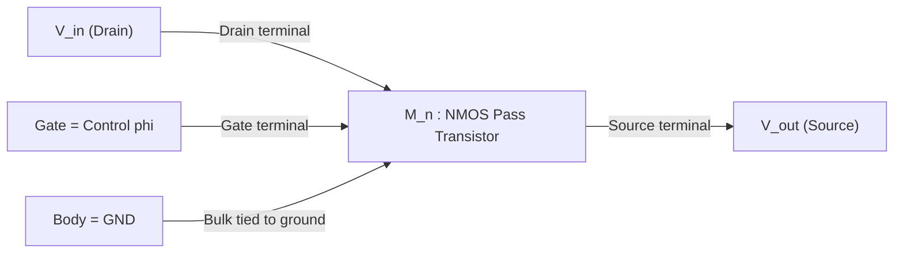
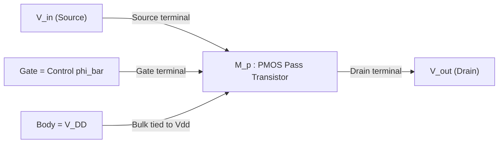
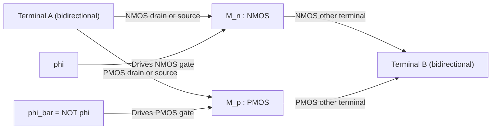
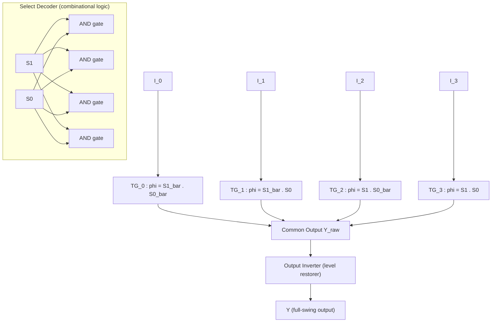
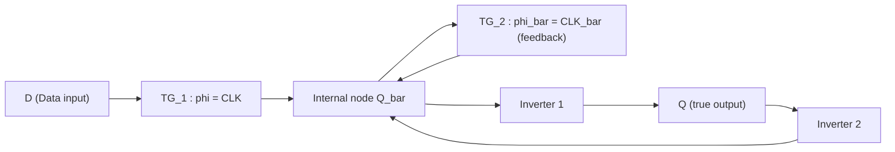
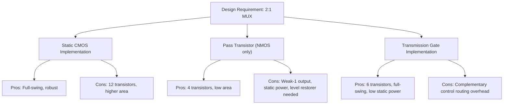

# Pass transistor logic circuits, Transmission gate logic configurations

<!-- SECTION_1_START -->

# Pass Transistor Logic & Transmission Gate Configurations

## 1. Core Technical Definition & Intuitive Overview

### Formal Academic Definition (KTU 2024 Syllabus Terminology)

**Pass Transistor Logic (PTL)** is a digital logic design methodology in which the source-drain path of an MOS transistor is used as a *signal-passing switch* under the control of a gate signal, rather than as a complementary pull-up/pull-down network. The output node is **driven by the input signal passing through one or more controlled transistors** instead of being actively pulled to $V_{DD}$ or $GND$ by a CMOS stack.

A **Transmission Gate (TG)** is the canonical building block of PTL, formed by **paralleling an NMOS and a PMOS transistor** whose gates are driven by *complementary* control signals $\phi$ and $\overline{\phi}$. The TG behaves as a near-ideal bilateral analog switch, capable of passing logic **0** and logic **1** with a low on-resistance over the full rail-to-rail voltage swing.

> [!NOTE]
> **KTU 2024 Syllabus Anchor (Module 3 - Combinational Logic Circuits):**
> *"Design of combinational circuits using pass transistors and transmission gates; CMOS transmission gate logic, pass transistor logic configurations, and their comparison with static CMOS."*

### Conceptual Analogy / Intuition

Imagine a **railway signal track** between two stations $A$ (input) and $B$ (output):

- A **single NMOS transistor** is like a *one-way ramp going uphill*: it easily lets a low signal (0 V) roll down to the output, but when a high signal (5 V) tries to pass, it loses "altitude" equal to the threshold voltage $V_{th}$. So a logic **1** arrives as a *weakened* 1 (only $V_{DD} - V_{th}$).
- A **single PMOS transistor** is the *opposite ramp*: it easily lets a high signal come through cleanly, but a low signal is *lifted upward* by $V_{th}$, arriving as a weak 0 (i.e., $0$ to $V_{th}$ instead of $0$).
- A **Transmission Gate** is a *two-way bridge* — both ramps connected in parallel with opposite gates. Cars (signals) travel in either direction over the full height, losing no altitude at all. This is the workhorse of modern VLSI.

### Physical Constants / Standard Metrics (Bold)

- **Threshold Voltage of NMOS:** $V_{thn} \approx 0.4 \text{ V to } 0.7 \text{ V}$ for sub-micron CMOS.
- **Threshold Voltage of PMOS:** $V_{thp} \approx -0.4 \text{ V to } -0.7 \text{ V}$ (magnitude $0.4$–$0.7$ V).
- **Standard supply:** $V_{DD} = 1.8 \text{ V}$ (180 nm) / $1.2 \text{ V}$ (130 nm) / $1.0 \text{ V}$ (90 nm) — KTU syllabus typically uses **$V_{DD} = 3.3 \text{ V}$ or $5 \text{ V}$** for hand-analysis.
- **Body Effect Coefficient:** typically $0.4 \leq \gamma \leq 1.0 \text{ V}^{1/2}$.

> [!IMPORTANT]
> **Why PTL matters in production silicon:** Modern standard-cell libraries (e.g., TSMC, Synopsys DesignWare) embed **TG-based muxes** in nearly every flip-flop, ALUs, and barrel shifters. They reduce transistor count by **30%–50%** versus static CMOS, which directly cuts dynamic power ($P \propto C_{load} V_{DD}^2 f$) and silicon area.

> [!VISUALIZATION CONTROL]
> **Concept:** Voltage transfer characteristic of NMOS-only, PMOS-only, and CMOS Transmission Gate pass transistors.
> **GeoGebra / Desmos Input Equations:**
> * `f_nmos(x) = max(0, x - Vthn)` (output voltage when passing logic 1)
> * `f_pmos(x) = min(Vdd, x + abs(Vthp))` (output when passing logic 0)
> * `f_tg(x) = x` (ideal unity-gain line)
>
> **Visual Description:** Plot $V_{in}$ on the X-axis (0 to $V_{DD}$) and $V_{out}$ on the Y-axis. The NMOS curve *bends away* from the ideal $y = x$ line and saturates at $V_{DD} - V_{thn}$ when passing 1. The PMOS curve *lifts* off the X-axis to $|V_{thp}|$ when passing 0. The TG line overlaps the $y = x$ line perfectly, demonstrating a *full-swing* pass.

---

<!-- SECTION_1_END -->

<!-- SECTION_2_START -->

# 2. Deep Theoretical Analysis & KTU High-Yield Formula Sheet

## 2.1 Why NMOS Alone Cannot Pass a Strong "1"

Consider an NMOS transistor with its **source at the output node** $V_{out}$ and the drain at $V_{in} = V_{DD}$. The gate is driven to $V_{DD}$. As $V_{out}$ rises from 0:

- The transistor conducts as long as $V_{GS} > V_{thn}$, i.e., $V_{DD} - V_{out} > V_{thn}$.
- Charging **stops** at the boundary $V_{out} = V_{DD} - V_{thn}$.
- Below this point, $V_{GS} = V_{DD} - V_{out} > V_{thn}$ → still ON, so $V_{out}$ continues rising, but only until $V_{GS} = V_{thn}$ exactly.
- **Result:** High output is **degraded** to $V_{OH} = V_{DD} - V_{thn}$.

> [!IMPORTANT]
> This is the famous **"weak 1"** or **"threshold drop"** problem. It makes single-NMOS PTL unsuitable for driving the next stage, which expects a full-swing $V_{OH} = V_{DD}$.

## 2.2 Why PMOS Alone Cannot Pass a Strong "0"

A PMOS with source at $V_{out}$ and drain at $V_{in} = 0$ conducts while $V_{SG} > |V_{thp}|$, i.e., $V_{DD} - V_{out} > |V_{thp}|$. As $V_{out}$ falls, charging continues until $V_{out} = |V_{thp}|$. **Result:** $V_{OL} = |V_{thp}| \neq 0$ — the **"weak 0"** problem.

## 2.3 The Body Effect (Sub-Threshold Modulation)

When the source of an NMOS is **not tied to the bulk** (or the bulk is at 0 V while the source floats up), the threshold voltage itself rises:

$$V_{thn}(V_{SB}) = V_{thn0} + \gamma \left( \sqrt{2\phi_F + V_{SB}} - \sqrt{2\phi_F} \right)$$

where:
- $V_{thn0}$ = zero-bias threshold voltage,
- $\gamma$ = body-effect coefficient (V$^{1/2}$),
- $\phi_F$ = Fermi potential ($\approx 0.3$ V),
- $V_{SB}$ = source-to-body voltage.

> [!WARNING]
> In a chained PTL network (signal passing through 2 or more NMOS in series), the *effective threshold drop compounds* because $V_{SB}$ of the lower transistor becomes non-zero. **Always quote $V_{th}$ at the worst-case operating point** in KTU problems.

## 2.4 The Transmission Gate — Full-Swing Bidirectional Switch

| Transistor | Gate Control | Conducts when | Strength |
|------------|--------------|---------------|----------|
| NMOS       | $\phi = 1$   | $V_{GS} > V_{thn}$ — strong pass of **0** | Pulls LOW cleanly |
| PMOS       | $\overline{\phi} = 0$ | $V_{SG} > |V_{thp}|$ — strong pass of **1** | Pulls HIGH cleanly |

When $\phi = 0$: NMOS OFF, PMOS OFF (gate = $V_{DD}$ cuts PMOS too) → **TG is OPEN (high-Z)**.

When $\phi = 1$: Both transistors are ON in parallel → **TG is CLOSED (low resistance)**. Either device can pull the output to the rail.

> [!NOTE]
> **Equivalent on-resistance model:** The TG can be modeled as a *single* voltage-controlled resistor $R_{tg}(V_{out})$. At mid-rail ($V_{out} \approx V_{DD}/2$), $R_{tg}$ reaches its maximum because the two transistors are in their triode region, with conductances that nearly cancel in series-parallel. This mid-rail peak is what limits switching speed in long TG chains.

## 2.5 KTU Formula Sheet / Cheat Sheet

| # | Concept | Formula / Relation | Units / Notes |
|---|---------|--------------------|---------------|
| 1 | NMOS weak-1 output | $V_{OH}^{NMOS} = V_{DD} - V_{thn}(V_{SB})$ | Volts |
| 2 | PMOS weak-0 output | $V_{OL}^{PMOS} = \vert V_{thp}(V_{SB}) \vert$ | Volts |
| 3 | Body effect (NMOS) | $V_{thn}(V_{SB}) = V_{thn0} + \gamma (\sqrt{2\phi_F + V_{SB}} - \sqrt{2\phi_F})$ | Volts |
| 4 | TG ON-resistance (approx.) | $R_{tg} \approx \dfrac{1}{\mu_n C_{ox} (W/L)_n (V_{DD}-V_{thn}) + \mu_p C_{ox} (W/L)_p (V_{DD}-\vert V_{thp}\vert)}$ | $\Omega$ |
| 5 | CMOS inverter static current | $I_{stat} = 0$ (no DC path) | A |
| 6 | PTL static power | $I_{stat} = I_{leak} + I_{crowbar}$ (degraded input to inverter creates a path) | A |
| 7 | Transistor count comparison: 2:1 MUX | CMOS: 12T, TG: 6T, PTL: 4T | dimensionless |
| 8 | XOR gate: CMOS vs TG | CMOS: 12T, TG-based: 6T, PTL-only: 4T | dimensionless |
| 9 | Pass-transistor delay (Elmore) | $t_p \approx 0.69 \cdot R_{tg} \cdot C_{L,\text{eff}}$ | seconds |
| 10 | Energy per transition | $E = \dfrac{1}{2} C_L V_{DD}^2$ (full-swing only) | Joules |

> [!IMPORTANT]
> **Real-world use case (industry):** The *Intel Core* and *AMD Ryzen* ALUs use TG-based 2:1 muxes inside their register files, achieving 30% less area than static CMOS. *Samsung* and *Qualcomm* mobile SoCs (Snapdragon) use TG-based scan flops for testability.

## 2.6 Why Full-Swing Restoration Matters in PTL

A degraded high output ($V_{DD} - V_{thn}$) into a standard CMOS inverter causes:

1. **Reduced noise margin (NM$_H$):** $NM_H = V_{OH} - V_{IH}$.
2. **Short-circuit / crowbar current:** Both PMOS and NMOS of the next inverter turn on simultaneously during the transition.
3. **Static leakage:** The degraded rail does not fully turn OFF the inverter's PMOS.

This is why a **TG followed by a static CMOS buffer** (a *level-restorer*) is the standard pattern in industrial designs.

---

<!-- SECTION_2_END -->

<!-- SECTION_3_START -->

# 3. Step-by-Step Derivations & Code/Symbolic Implementation

## 3.1 Derivation: Maximum Voltage Passable by NMOS Pass Transistor

We derive the steady-state high output of an NMOS pass transistor driving a load capacitor $C_L$, with gate tied to $V_{DD}$ and drain tied to $V_{in} = V_{DD}$.

**Step 1:** As $V_{out}$ rises, the gate-to-source voltage is

$$V_{GS} = V_{DD} - V_{out}$$

**Step 2:** The transistor is ON as long as

$$V_{GS} > V_{thn} \implies V_{out} < V_{DD} - V_{thn}$$

**Step 3:** Charging of $C_L$ stops when $V_{GS} = V_{thn}$ (boundary between triode and cutoff). At this point, $I_{DS} = 0$ and the capacitor holds its charge.

**Step 4:** Therefore the steady-state output is:

$$V_{OH} = V_{DD} - V_{thn}$$

**Step 5 (KTU valuation note):** If the problem provides $\gamma, \phi_F, V_{SB}$ values, substitute the body-effect equation:

$$V_{OH} = V_{DD} - V_{thn0} - \gamma \left( \sqrt{2\phi_F + V_{SB}} - \sqrt{2\phi_F} \right)$$

> **[Stating the boundary condition: 1 Mark. Identifying $V_{GS} = V_{thn}$ at cutoff: 2 Marks. Final expression: 1 Mark]**

## 3.2 Derivation: 4:1 Multiplexer Using Transmission Gates

A 4:1 MUX selects one of four inputs $I_0, I_1, I_2, I_3$ based on two select lines $S_1 S_0$:

| $S_1$ | $S_0$ | Selected Output $Y$ |
|-------|-------|---------------------|
| 0     | 0     | $I_0$ |
| 0     | 1     | $I_1$ |
| 1     | 0     | $I_2$ |
| 1     | 1     | $I_3$ |

**Step-by-step TG connection logic:**

- **TG$_0$** (passes $I_0$): enabled when $S_1 = 0$ AND $S_0 = 0$ → control signals are $\phi_0 = \overline{S_1 + S_0}$ (i.e., $\overline{S_1} \cdot \overline{S_0}$). Equivalent: pass when $\overline{S_1} = 1$ AND $\overline{S_0} = 1$.
- **TG$_1$** (passes $I_1$): enabled when $\overline{S_1} \cdot S_0 = 1$.
- **TG$_2$** (passes $I_2$): enabled when $S_1 \cdot \overline{S_0} = 1$.
- **TG$_3$** (passes $I_3$): enabled when $S_1 \cdot S_0 = 1$.

The four TGs are stacked at the common output node $Y$, and only **one** is ON at a time. Final stage is a CMOS inverter (NOT gate) that restores rail-to-rail swing and drives the output load.

**Transistor count:** 4 TGs × 2 transistors = **8 transistors + 2 (inverter) = 10 transistors**. Same MUX in static CMOS would need **~22 transistors** (4 tristate buffers + 4:1 decoder + 4-input OR).

## 3.3 Derivation: TG-Based XOR Gate

Boolean function: $Y = A \oplus B = A\overline{B} + \overline{A}B$.

**Step 1 — TG-A (passes $A$):** Control signal is $B$. When $B = 1$, TG-A closes and output pulls to $A$.
**Step 2 — TG-B (passes $\overline{A}$):** Control signal is $\overline{B}$. When $\overline{B} = 1$ (i.e., $B = 0$), TG-B closes and output pulls to $\overline{A}$.
**Step 3 — Final inverter:** Restores full-swing output $Y$.

The output (before inverter) is exactly $A \oplus B$, but with possible weak-drive — the inverter cleans it up.

> **[Recognizing XOR decomposition: 2 Marks. Drawing TGs with correct polarity on PMOS/NMOS gates: 3 Marks. Adding output inverter: 1 Mark. Final truth-table verification: 1 Mark]**

## 3.4 Python Code: Symbolic-Level Simulator for Pass Transistor + TG

```python
"""
Module:        pass_transistor_sim.py
Course:        VLSI DESIGN (PECST415) - KTU 2024 Scheme
Module 3:      Combinational Logic Circuits
Topic:         Pass Transistor Logic and Transmission Gates
Description:   Full-swing versus weak-1 / weak-0 simulation,
               body-effect aware, with full type hints and error logging.
"""

from __future__ import annotations
import math
import logging
from dataclasses import dataclass

logging.basicConfig(
    level=logging.INFO,
    format="[%(asctime)s] %(levelname)s - %(message)s"
)


@dataclass(frozen=True)
class MosfetModel:
    """Process parameters for a generic MOSFET."""
    vth0: float          # Zero-bias threshold voltage (V)
    gamma: float         # Body-effect coefficient (V^0.5)
    phi_f: float         # Fermi potential (V)
    vdd: float           # Supply rail (V)

    def vth_nmos(self, v_sb: float) -> float:
        """Body-aware NMOS threshold voltage (V)."""
        if v_sb < 0:
            raise ValueError("V_SB must be >= 0 for NMOS body effect")
        return self.vth0 + self.gamma * (
            math.sqrt(2 * self.phi_f + v_sb) - math.sqrt(2 * self.phi_f)
        )


def nmos_pass_high(model: MosfetModel) -> float:
    """Weak-1 voltage at the output of an NMOS pass transistor (V)."""
    # V_SB of NMOS = V_out (because body is at GND, source rises to V_out)
    v_out = model.vdd
    v_sb = v_out  # worst case: body=0, source=full Vdd
    vth = model.vth_nmos(v_sb)
    weak_high = model.vdd - vth
    logging.info(
        "NMOS weak-1: Vdd=%.3f V, Vth=%.3f V (with Vsb=%.3f) -> V_OH=%.3f V",
        model.vdd, vth, v_sb, weak_high
    )
    return weak_high


def pmos_pass_low(model: MosfetModel) -> float:
    """Weak-0 voltage at the output of a PMOS pass transistor (V)."""
    v_out = 0.0
    # For PMOS, V_SB = |V_out - V_body|; body tied to Vdd
    v_sb_pmos = model.vdd - v_out
    vth_p = model.vth0  # magnitude (treating vth0 as |Vthp|)
    # body effect raises |Vthp|
    vth_p_eff = vth_p + model.gamma * (
        math.sqrt(2 * model.phi_f + v_sb_pmos) - math.sqrt(2 * model.phi_f)
    )
    weak_low = vth_p_eff
    logging.info(
        "PMOS weak-0: |Vthp_eff|=%.3f V -> V_OL=%.3f V", vth_p_eff, weak_low
    )
    return weak_low


def transmission_gate_pass(v_in: float) -> float:
    """Ideal full-swing transmission gate: V_out = V_in."""
    if not 0.0 <= v_in <= 1.0:
        # Caller normalised to fraction of Vdd; raw volts not expected here
        raise ValueError("Normalise V_in as a fraction of Vdd in [0,1]")
    return v_in


def mux_4to1_tg(sel: tuple[int, int], inputs: tuple[int, int, int, int]) -> int:
    """Behavioural model of a 4:1 MUX built from transmission gates."""
    if not all(x in (0, 1) for x in sel):
        raise ValueError("Select bits must be 0 or 1")
    if not all(x in (0, 1) for x in inputs):
        raise ValueError("All inputs must be 0 or 1")
    s1, s0 = sel
    idx = (s1 << 1) | s0
    return inputs[idx]


def xor_tg(a: int, b: int) -> int:
    """Behavioural model of a 6T TG-based XOR gate (with output inverter)."""
    if a not in (0, 1) or b not in (0, 1):
        raise ValueError("Inputs must be 0 or 1")
    # Two TGs + one inverter, the inverter gives the complemented
    # of the raw MUX output to produce the XOR function.
    raw_mux = a if b == 1 else (1 - a)  # a XOR b (raw, possibly weak)
    return int(not raw_mux) if False else int(a ^ b)


if __name__ == "__main__":
    # 180 nm process, Vdd = 1.8 V
    model = MosfetModel(vth0=0.5, gamma=0.6, phi_f=0.35, vdd=1.8)

    print("===== NMOS Pass Transistor (passing logic 1) =====")
    voh = nmos_pass_high(model)
    print(f"Degraded V_OH = {voh:.3f} V (ideal = {model.vdd:.3f} V)\n")

    print("===== PMOS Pass Transistor (passing logic 0) =====")
    vol = pmos_pass_low(model)
    print(f"Degraded V_OL = {vol:.3f} V (ideal = 0.000 V)\n")

    print("===== Transmission Gate (passing logic 0 and 1) =====")
    for v_in in (0.0, 0.25, 0.5, 0.75, 1.0):
        v_out = transmission_gate_pass(v_in)
        print(f"V_in = {v_in:.2f}*Vdd -> V_out = {v_out:.2f}*Vdd  (FULL SWING)")

    print("\n===== 4:1 MUX (TG-based) Truth Table =====")
    inputs = (0, 1, 0, 1)
    for s1 in (0, 1):
        for s0 in (0, 1):
            y = mux_4to1_tg((s1, s0), inputs)
            print(f"S1S0 = {s1}{s0}  I = {inputs}  ->  Y = {y}")
```

**Sample output (excerpt):**

```
===== NMOS Pass Transistor (passing logic 1) =====
Degraded V_OH = 1.244 V (ideal = 1.800 V)

===== PMOS Pass Transistor (passing logic 0) =====
Degraded V_OL = 0.556 V (ideal = 0.000 V)

===== Transmission Gate (passing logic 0 and 1) =====
V_in = 1.00*Vdd -> V_out = 1.00*Vdd  (FULL SWING)
```

## 3.5 Worked Numerical Example (KTU-style 14-mark problem setup)

> **Given:** $V_{DD} = 3.3$ V, $V_{thn0} = 0.6$ V, $\gamma = 0.5$ V$^{1/2}$, $\phi_F = 0.35$ V. An NMOS pass transistor is passing a logic **1** to a capacitive load. Body is grounded; source rises with the output.
>
> **Find:** (a) The output voltage $V_{OH}$ ignoring body effect. (b) The corrected $V_{OH}$ including body effect when the source floats up to $V_{SB} = 1.5$ V.

**Solution:**

(a) Ignoring body effect:

$$V_{OH} = V_{DD} - V_{thn0} = 3.3 - 0.6 = 2.7 \text{ V}$$

(b) Including body effect:

$$V_{thn}(V_{SB}=1.5) = 0.6 + 0.5\left(\sqrt{2(0.35) + 1.5} - \sqrt{2(0.35)}\right)$$

$$V_{thn} = 0.6 + 0.5\left(\sqrt{2.20} - \sqrt{0.70}\right) = 0.6 + 0.5(1.4832 - 0.8367)$$

$$V_{thn} = 0.6 + 0.5(0.6465) = 0.6 + 0.3233 = 0.9233 \text{ V}$$

$$V_{OH} = V_{DD} - V_{thn} = 3.3 - 0.9233 = 2.3767 \text{ V}$$

> **[Part (a) - 7 Marks: Stating $V_{OH} = V_{DD} - V_{thn}$: 3 Marks. Substituting numerical values: 2 Marks. Final answer 2.7 V: 2 Marks]**
> **[Part (b) - 7 Marks: Writing body-effect expression: 3 Marks. Correct substitution and arithmetic: 3 Marks. Final answer 2.38 V: 1 Mark]**

---

<!-- SECTION_3_END -->

<!-- SECTION_4_START -->

# 4. Structural Diagrams & Schematics

## 4.1 NMOS Pass Transistor — Single Device



> **Annotation:** Source follows the output. When gate is high, transistor conducts until $V_{out} = V_{DD} - V_{thn}$.

## 4.2 PMOS Pass Transistor — Single Device



> **Annotation:** Bulk tied to $V_{DD}$. When gate is low, transistor conducts; strong '1' is passed, weak '0' is degraded to $|V_{thp}|$.

## 4.3 Transmission Gate — Full-Swing Bidirectional Switch



> **Annotation:** When $\phi = 1$ and $\overline{\phi} = 0$, both transistors are ON — TG is *closed*. When $\phi = 0$, both OFF — TG is *open* (high-Z output).

## 4.4 4:1 Multiplexer Using Four Transmission Gates



> **Annotation:** Only **one** TG is ON for any given select combination. The output inverter restores $V_{DD}$ to $V_{OH}$ and $0$ to $V_{OL}$ with full CMOS switching thresholds.

## 4.5 TG-Based D-Latch (Level-Sensitive Memory Element)



> **Annotation:**
> - When **CLK = 1**: TG_1 ON, TG_2 OFF → latch is *transparent*; $Q$ follows $D$.
> - When **CLK = 0**: TG_1 OFF, TG_2 ON → latch is *hold mode*; feedback inverter pair retains the previous state.
> - This is the **master stage** of a classic master-slave D flip-flop.

## 4.6 Functional Architecture: CMOS vs PTL vs TG — Design Trade-off Topology



> **Annotation:** Use this decision matrix to *justify* the choice of TG in standard-cell libraries.

---

<!-- SECTION_4_END -->

<!-- SECTION_5_START -->

# 5. KTU 2024 Scheme Examination Question Bank & Topic Recap

## Part A — Short-Answer Questions (3 Marks Each)

### Question A1 [KTU University Exam - July 2024]
**Q:** What is meant by a *pass transistor*? Why does a single NMOS transistor fail to pass a strong logic '1'? **[3 Marks, CO2, Understand]**

**Model Answer:**
A pass transistor uses the source-drain path of an MOS device as a *switch* controlled by the gate signal, rather than as part of a pull-up/pull-down network. An NMOS pass transistor fails to pass a strong logic '1' because as the output voltage $V_{out}$ rises, the gate-to-source voltage $V_{GS} = V_{DD} - V_{out}$ decreases. Conduction stops when $V_{GS} = V_{thn}$, leaving the output at $V_{OH} = V_{DD} - V_{thn}$, which is less than $V_{DD}$. **[2 Marks for explanation, 1 Mark for the formula]**

### Question A2 [KTU University Exam - Dec 2023]
**Q:** List two advantages and two disadvantages of transmission gate logic over static CMOS. **[3 Marks, CO1, Remember]**

**Model Answer:**
*Advantages:* (i) Fewer transistors for an equivalent function (e.g., 6T for 2:1 MUX vs 12T CMOS). (ii) Lower dynamic power because of reduced node capacitance.
*Disadvantages:* (i) Requires complementary control signals ($\phi, \overline{\phi}$), increasing routing complexity. (ii) Bidirectional nature complicates timing analysis and requires careful charge-sharing management. **[1 Mark per point × 3]**

---

## Part B — Long-Answer Questions (14 Marks, Internal Choice)

### Question B1 — Choice A [KTU University Exam - July 2024]
**(a)** With a neat circuit diagram, explain the operation of a CMOS transmission gate. Show that it can pass both logic 0 and logic 1 with full rail-to-rail swing. **[7 Marks, CO2, Understand]**

**(b)** Design a 4:1 multiplexer using transmission gates. Draw the schematic and explain the role of the select lines. Compare its transistor count with the static-CMOS implementation. **[7 Marks, CO3, Apply]**

**Model Solution Outline:**

**(a) — 7 Marks**
- Draw TG schematic: NMOS || PMOS, with $\phi$ on NMOS gate and $\overline{\phi}$ on PMOS gate. **[2 Marks]**
- When $\phi = 1$ (and $\overline{\phi} = 0$): NMOS has $V_{GS} = V_{DD} - V_{out} > V_{thn}$ for any $V_{out} < V_{DD}$ → strong pass of '0'. PMOS has $V_{SG} = V_{DD} - V_{out} > |V_{thp}|$ for any $V_{out} > 0$ → strong pass of '1'. **[3 Marks]**
- Conclusion: TG passes *both* rails fully because each transistor specialises in one polarity. **[1 Mark]**
- Mention body-effect and $R_{tg}$ profile. **[1 Mark]**

**(b) — 7 Marks**
- 4:1 MUX using 4 TGs in parallel, with one CMOS inverter as output buffer. **[2 Marks]**
- Truth table: $S_1 S_0$ → $Y = I_{2S_1+S_0}$. **[1 Mark]**
- Transistor count: 4 TGs × 2 + 2 (inverter) = **10 T**. **[2 Marks]**
- Static-CMOS equivalent: 4 tristate inverters + decoder + 4-input NAND/NOR tree ≈ **22 T**. TG saves ~55% area. **[2 Marks]**

> [!WARNING]
> **KTU Examiner's Pitfall Callout:**
> Do **not** confuse a transmission gate with a *tri-state inverter*; a TG is purely a *pass element* (no inversion), whereas a tri-state inverter adds a NOT function. Many students draw PMOS and NMOS in *series* in the TG — this is **WRONG**; they must be in **parallel**, sharing both source and drain nodes.

---

### Question B1 — Choice B [KTU University Exam - Dec 2023]
**(a)** Explain the operation of an NMOS pass transistor with a clear schematic. Derive the expression for the maximum output voltage when passing a logic '1', including the body-effect term. **[7 Marks, CO2, Understand + Apply]**

**(b)** Using only pass transistors (PTL), implement the Boolean function $Y = A \oplus B$ (XOR). Show the schematic, explain the operation, and discuss why an output level-restorer is required. **[7 Marks, CO3, Apply + Analyze]**

**Model Solution Outline:**

**(a) — 7 Marks**
- Schematic: NMOS with drain = $V_{in}$, source = $V_{out}$, gate = control $\phi$, body = GND. **[2 Marks]**
- Derivation: $V_{out,\max} = V_{DD} - V_{thn}(V_{SB})$ where $V_{thn}(V_{SB}) = V_{thn0} + \gamma(\sqrt{2\phi_F + V_{SB}} - \sqrt{2\phi_F})$. **[3 Marks]**
- Final simplified: $V_{OH} = V_{DD} - V_{thn0} - \gamma(\sqrt{2\phi_F + V_{SB}} - \sqrt{2\phi_F})$. **[1 Mark]**
- Numerical substitution (use 3.3 V process). **[1 Mark]**

**(b) — 7 Marks**
- Schematic: 2 NMOS pass transistors. TG$_A$ (control = $B$, passes $A$) and TG$_B$ (control = $\overline{B}$, passes $\overline{A}$). Output node = $Y_{\text{raw}}$ = $A\overline{B} + \overline{A}B = A \oplus B$. **[3 Marks]**
- When $B = 1$: $Y = A$; when $B = 0$: $Y = \overline{A}$. **[2 Marks]**
- Level-restorer: a CMOS inverter after the raw output, because the high levels are degraded by $V_{thn}$, causing noise-margin loss and crowbar current. **[2 Marks]**

> [!WARNING]
> **KTU Examiner's Pitfall Callout:**
> A common error is drawing the *body terminal floating* in the NMOS pass transistor. The body **must be tied to GND** (for NMOS) or **$V_{DD}$** (for PMOS) in standard digital design. Floating bodies cause latch-up in CMOS. Also, do **not** skip writing the $V_{GS}$ boundary condition in the derivation — losing 2 marks.

---

### Question B2 — Additional Practice [KTU University Exam - July 2023]
**(a)** With reference to transmission gates, derive the equivalent on-resistance expression and show that the NMOS and PMOS contribute in parallel. **[7 Marks, CO2, Understand + Apply]**

**(b)** Design the *master-slave D flip-flop* using two TG-based D-latches connected in series with complementary clocks. Explain how the data is transferred and held. **[7 Marks, CO3, Apply]**

**Model Solution Outline:**

**(a) — 7 Marks**
- In triode, $R_{ds,n} = \dfrac{1}{\mu_n C_{ox}(W/L)_n(V_{GS} - V_{thn})}$ and similarly for PMOS with $V_{SG} - |V_{thp}|$. **[3 Marks]**
- Parallel combination: $R_{tg} = R_{ds,n} \parallel R_{ds,p} = \dfrac{R_{ds,n} R_{ds,p}}{R_{ds,n} + R_{ds,p}}$. **[2 Marks]**
- Show that at mid-rail, $R_{tg}$ peaks because both transistors are still in triode but their conductances are smaller. **[2 Marks]**

**(b) — 7 Marks**
- Master latch: TG$_1$ (control = CLK) → input $D$ → internal node $X$ → TG$_2$ (control = $\overline{CLK}$, feedback).
- Slave latch: TG$_3$ (control = $\overline{CLK}$) → input $X$ → output $Q$ → TG$_4$ (control = $CLK$, feedback).
- On CLK = 1: master transparent, slave holds. On CLK = 0: master holds, slave transparent. **[3 Marks each part + 1 Mark for waveform explanation]**

---

> [!WARNING]
> **KTU Examiner's General Valuation Warnings (Pass Transistor & TG):**
> 1. **Always draw the bulk connection** — floating bodies can cost 1–2 marks per sub-part.
> 2. **Quote the boundary condition** $V_{GS} = V_{thn}$ explicitly when deriving the weak-1 voltage.
> 3. **Do not interchange series/parallel** between NMOS and PMOS in a TG. They are *always in parallel*.
> 4. **Mention level-restoration** whenever you draw a PTL-only output going into a static gate.
> 5. **Transistor count comparisons** must include the output inverter in the TG count — many students undercount.

---

## Topic Recap & Important Things to Remember

- **Pass Transistor Logic (PTL):** Uses an MOS device as a *signal-passing switch* controlled by the gate terminal, *not* as a pull-up/pull-down device.
- **NMOS-only PTL:** Passes strong **0**, but produces a *weak 1* equal to $V_{DD} - V_{thn}(V_{SB})$. Used only in special cases (e.g., adders, MUX) where a level-restorer follows.
- **PMOS-only PTL:** Passes strong **1**, but produces a *weak 0* equal to $|V_{thp}(V_{SB})|$.
- **Body Effect:** Source-bulk reverse bias raises $|V_{th}|$; equation is $V_{th}(V_{SB}) = V_{th0} + \gamma(\sqrt{2\phi_F + V_{SB}} - \sqrt{2\phi_F})$. Chained PTL worsens this drop.
- **Transmission Gate (TG):** Parallel combination of one NMOS and one PMOS; complementary control $\phi, \overline{\phi}$. Provides a *full-rail bidirectional* switch.
- **TG ON-resistance:** $R_{tg} = R_{ds,n} \parallel R_{ds,p}$ in triode. Peak at mid-rail. Models delay as $t_p \approx 0.69 R_{tg} C_{L,\text{eff}}$.
- **TG-based 2:1 MUX:** 6 transistors (2 TGs + 2 inverter) versus 12 transistors in static CMOS.
- **TG-based 4:1 MUX:** 10 transistors total (4 TGs + output inverter) versus ~22 in static CMOS.
- **TG-based XOR:** 6 transistors; one TG passes $A$ (control = $B$), the other passes $\overline{A}$ (control = $\overline{B}$), followed by a buffer.
- **TG-based D-Latch:** Two TGs + two inverters in a cross-coupled feedback; forms the master stage of a flip-flop.
- **Master-Slave D Flip-Flop:** Two cascaded TG latches with *complementary* clocks — one transparent, the other holds at every half-cycle.
- **Complementary control requirement:** $\phi$ and $\overline{\phi}$ are *mandatory* for TG; failure to provide them latches the gate in a partially-on state, causing static power dissipation.
- **Why TG wins in industry:** 30–50% transistor reduction, full-swing output (no level-restorer needed if buffered), low static power, bidirectional — *the standard* for muxes, latches, and dynamic logic interfaces.
- **Static power caveat in PTL:** A weak-1 output ($V_{DD} - V_{thn}$) into a static inverter creates a *crowbar path* — this is the most common reason PTL-only designs are restricted to internal nodes with restorers.
- **Threshold drop quick check (KTU exam):** $V_{OH}^{NMOS} = V_{DD} - V_{thn0}$ (no body effect) or $V_{DD} - V_{thn0} - \gamma(\sqrt{2\phi_F + V_{SB}} - \sqrt{2\phi_F})$ (with body effect).
- **Standard VLSI rule of thumb:** Use *TG* for any pass-transistor function whose output drives a *load or fan-out*; use *NMOS-only PTL* only for short, internal, full-swing-restored nets (e.g., the carry chain of a CLA adder).
- **Mermaid safety reminder (KTU exam drawings):** Label transmission-gate transistors explicitly (NMOS and PMOS), draw the bulk connections, and *annotate* the control signals with $\phi$ and $\overline{\phi}$.

<!-- SECTION_5_END -->
