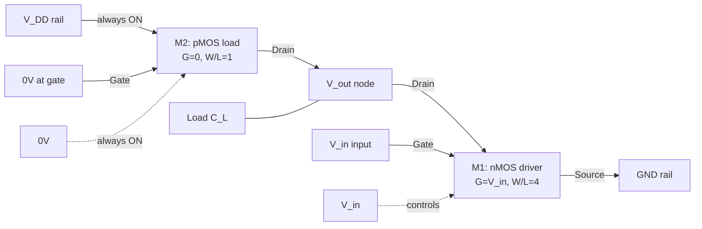
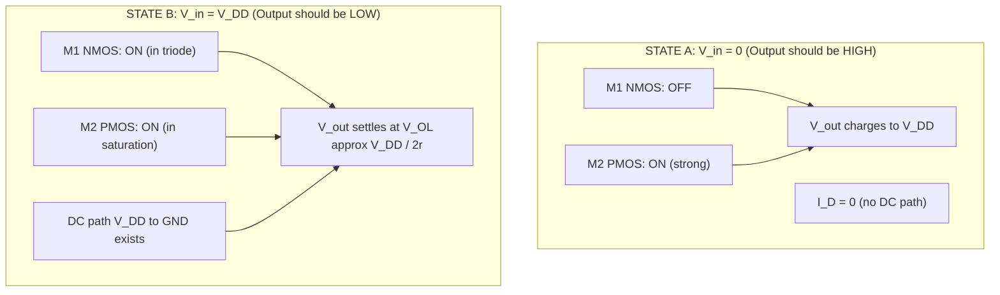
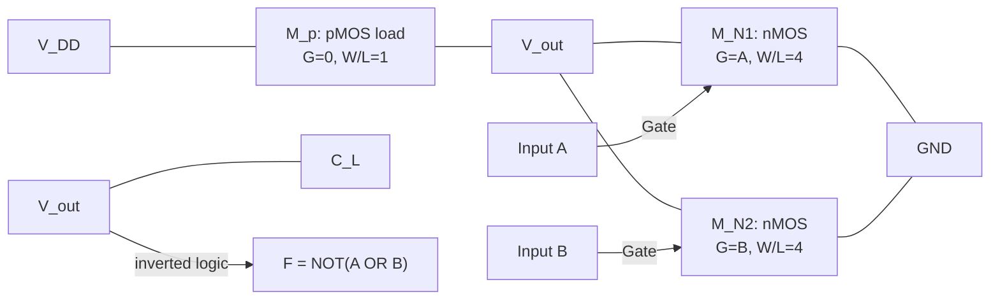
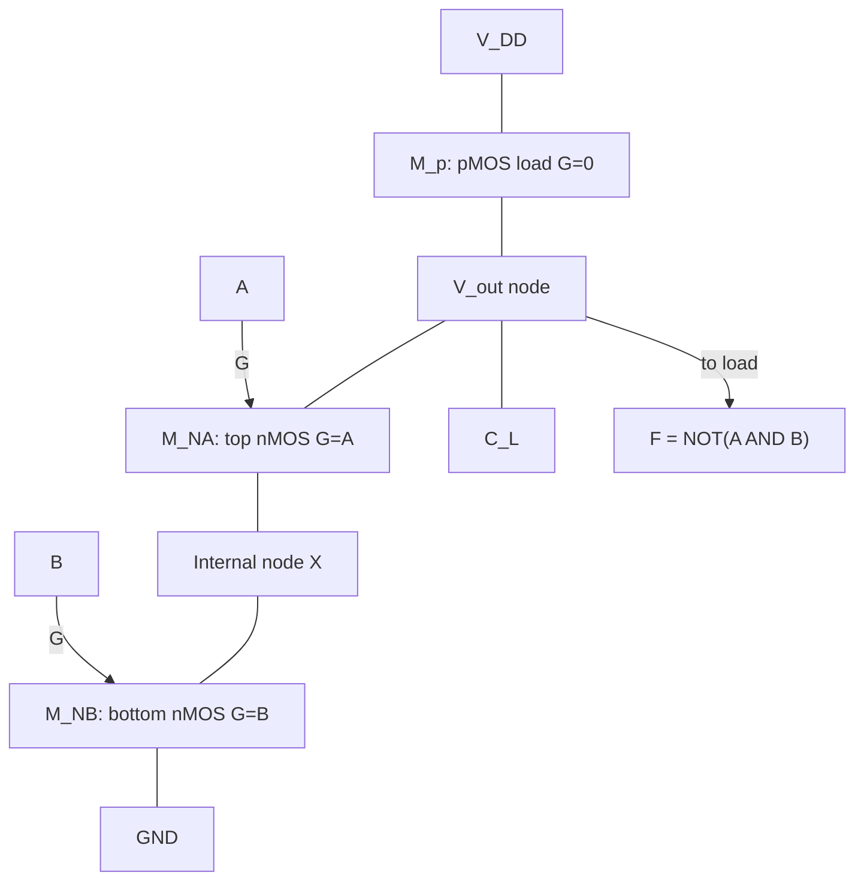
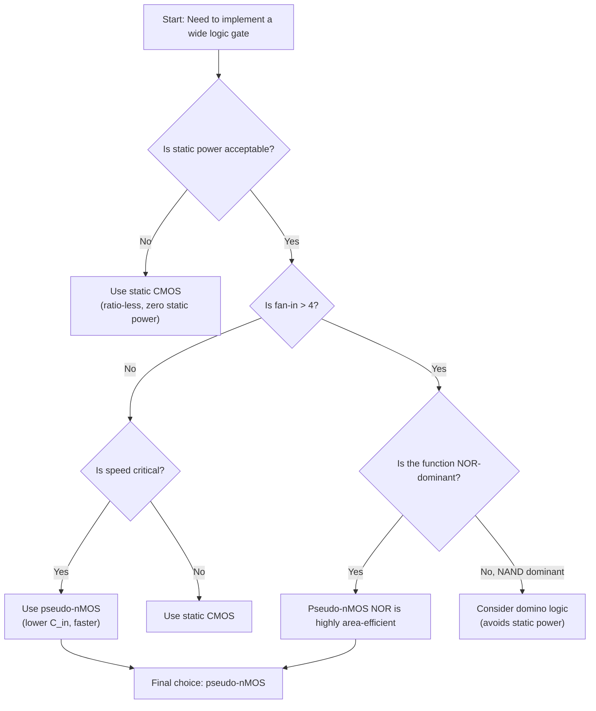

# Ratioed circuits, Pseudo-nMOS inverter and gates

<!-- SECTION_1_START -->

# Ratioed Circuits and Pseudo-nMOS Logic Gates

## 1.1 Formal Definition (KTU 2024 Syllabus Terminology)

> [!IMPORTANT]
> **Ratioed Circuit:** A class of MOS logic circuits in which the *output voltage level* (specifically the **low output voltage $V_{OL}$**) is a function of the *ratio of the transconductance parameters* ($\beta_n / \beta_p$ or equivalently $W/L$ ratios) of the driver and load transistors. This is fundamentally different from **static CMOS**, which is a *ratio-less* logic family.

In static CMOS logic, the output levels $V_{OH} = V_{DD}$ and $V_{OL} = 0\,\text{V}$ are guaranteed **regardless** of transistor sizing, as long as the pull-up and pull-down networks are functional. In ratioed logic, by contrast, the *physical dimensions* of the transistors must be carefully chosen so that the driver transistors can **overpower** the always-on load device.

> [!NOTE]
> **Pseudo-nMOS Inverter:** A specific ratioed circuit that replaces the entire pMOS pull-up network of a static CMOS inverter with a **single grounded-gate pMOS transistor** (load device that is *permanently ON*). It is called "pseudo-nMOS" because the steady-state DC behaviour is similar to an nMOS-load logic gate (a historical family where the load was an enhancement or depletion nMOS device).

---

## 1.2 Intuitive Analogy — "The Tug-of-War" Picture

Imagine a **tug-of-war** between two teams:

| Team | Members | Effort |
|------|---------|--------|
| **Pull-UP (pMOS load)** | One very strong person, but **always pulling with constant force** (because the gate is tied to ground, they never rest) | Constant |
| **Pull-DOWN (nMOS driver)** | A group of workers that **only pull when the input is HIGH** | Variable, but can be made *stronger* by using more/bigger workers |

* When **no one is pulling down** ($V_{in} = 0$), the lone pMOS pulls the rope all the way to $V_{DD}$ → output = HIGH.
* When **the nMOS team pulls** ($V_{in} = V_{DD}$), there is a *struggle*. If the nMOS team is strong enough (high $\beta_n$ relative to $\beta_p$), they win, but the rope settles at a small non-zero height ($V_{OL} > 0$). The stronger the pMOS team, the higher $V_{OL}$ climbs and the worse the noise margin becomes.

> [!WARNING]
> Because the pMOS load is **always conducting**, a **direct current path from $V_{DD}$ to GND** exists whenever the output is LOW. This is the source of **static power dissipation**, the biggest drawback of pseudo-nMOS logic.

---

## 1.3 Static CMOS vs. Pseudo-nMOS — A Quick Comparison

| Property | Static CMOS Inverter | Pseudo-nMOS Inverter |
|---|---|---|
| Pull-up network | pMOS (input-driven) | Single grounded-gate pMOS |
| Transistor count | 2 | 2 |
| $V_{OH}$ | $V_{DD}$ | $V_{DD}$ |
| $V_{OL}$ | $\approx 0\,\text{V}$ (ratio-less) | Depends on $\beta_n/\beta_p$ (ratioed) |
| Static power | **Zero** | **Non-zero** (always-on pMOS) |
| Input load | 1 pMOS + 1 nMOS gate cap | 1 nMOS gate cap only |
| Speed | Slower (higher input cap) | Faster (lower input cap) |

---

## 1.4 Visualising the Operation

> [!VISUALIZATION CONTROL]
> **Concept:** Voltage Transfer Characteristic (VTC) of a Pseudo-nMOS Inverter.
> **Plot Equations (for $V_{DD} = 2.5\,\text{V}$, $V_{tn} = \vert V_{tp} \vert = 0.5\,\text{V}$, $r = \beta_n/\beta_p = 4$):**
> * Region 1 ($V_{in} < V_{tn}$): $V_{out} = V_{DD}$ — flat HIGH line
> * Region 2 transition point at $V_{in} \approx 1.0\,\text{V}$
> * Region 3 saturation: steep drop
> * Asymptote at $V_{OL} \approx 0.4\,\text{V}$ (well above $0$)
>
> **Visual Description:** The transfer curve is **shifted upward** at the low end compared to static CMOS. Students should observe that $V_{OL}$ is *not* zero, and the noise margin low ($NM_L$) is significantly compressed. A high-gain, sharp transition region is preserved in the middle because the NMOS in saturation can rapidly overcome the pMOS current.

---

<!-- SECTION_1_END -->

<!-- SECTION_2_START -->

# Deep Theoretical Analysis — Pseudo-nMOS Inverter

## 2.1 Circuit Topology

A pseudo-nMOS inverter has only two transistors:

* **Load pMOS (M2):** $G = 0$, $S = V_{DD}$, $D = V_{out}$ → since $V_{GS} = -V_{DD} < V_{tp}$, it is **always in saturation** for most of the transition.
* **Driver nMOS (M1):** $G = V_{in}$, $S = 0$, $D = V_{out}$ → behaves like a standard CMOS NMOS.

## 2.2 Operating Regions Across $V_{in}$ Sweep

| $V_{in}$ Region | M1 (nMOS) | M2 (pMOS) | $V_{out}$ |
|----------------|-----------|-----------|-----------|
| $0 \to V_{tn}$ | **OFF** (cutoff) | Saturation (strong) | $V_{out} = V_{DD}$ |
| $V_{tn} \to V_{in,switch}$ | Saturation | Saturation | Rapid transition |
| $V_{in,switch} \to V_{DD}$ | **Triode** | Saturation | $V_{out} = V_{OL}$ (non-zero) |

## 2.3 Deriving $V_{OL}$ (the key equation)

At $V_{out} = V_{OL}$, **steady-state DC** requires the currents through M1 and M2 to be equal: $I_{D1} = I_{D2}$.

Assuming the **long-channel square-law model** and neglecting channel-length modulation ($\lambda \to 0$):

$$I_{D1} \text{ (nMOS, triode)} = k_n \left[ (V_{DD} - V_{tn})V_{OL} - \frac{V_{OL}^{\,2}}{2} \right]$$

$$I_{D2} \text{ (pMOS, saturation)} = \frac{k_p}{2}\,(V_{DD} - |V_{tp}|)^2$$

Equating and assuming $V_{OL} \ll 2(V_{DD}-V_{tn})$ so that the $V_{OL}^2/2$ term is negligible:

$$k_n (V_{DD} - V_{tn})V_{OL} \approx \frac{k_p}{2}\,(V_{DD} - |V_{tp}|)^2$$

$$\boxed{\,V_{OL} \;\approx\; \frac{(V_{DD} - |V_{tp}|)^2}{2\,r\,(V_{DD} - V_{tn})} \quad\text{where } r = \dfrac{k_n}{k_p}\,}$$

For the common case $V_{tn} = |V_{tp}| = V_T$ and $V_{DD} \gg V_T$:

$$V_{OL} \approx \frac{V_{DD}}{2r} = \frac{V_{DD}}{2} \cdot \frac{k_p}{k_n}$$

> [!NOTE]
> The **ratio** $r = k_n/k_p$ (also written as $\beta_n/\beta_p$) is the **single most important design parameter** for pseudo-nMOS. A larger $r$ yields a smaller $V_{OL}$ and better $NM_L$, but the designer pays for it with a *larger* nMOS device (more silicon area, more input capacitance, slower transition slope on the falling edge).

## 2.4 Noise Margins (KTU Favourite Topic)

| Parameter | Definition | Pseudo-nMOS Expression (approx.) |
|---|---|---|
| $V_{OH}$ | Logic HIGH output | $V_{DD}$ |
| $V_{OL}$ | Logic LOW output | $V_{DD}/(2r)$ |
| $V_{IL}$ | Max input recognised as LOW | $\approx$ where $\partial V_{out}/\partial V_{in} = -1$ (entering transition) |
| $V_{IH}$ | Min input recognised as HIGH | $\approx$ where $\partial V_{out}/\partial V_{in} = -1$ (leaving transition) |
| $NM_H$ | $V_{OH} - V_{IH}$ | Reduced compared to CMOS |
| $NM_L$ | $V_{IL} - V_{OL}$ | **Severely reduced** — primary weakness |

## 2.5 Sizing Rule of Thumb

To achieve $V_{OL} \le 0.1\,V_{DD}$ (a common design target for acceptable $NM_L$):

$$r = \frac{k_n}{k_p} \ge 5 \quad\Longrightarrow\quad \frac{(W/L)_n}{(W/L)_p} \cdot \frac{\mu_n}{\mu_p} \ge 5$$

Since $\mu_n \approx 2.5\,\mu_p$, the **physical size ratio** is:

$$(W/L)_n \ge 2 \cdot (W/L)_p$$

A typical industrial choice is $\boxed{(W/L)_n = 4 \cdot (W/L)_p}$ for the reference inverter.

## 2.6 Static Power Dissipation (Worst-Case)

When output is LOW, the static current is:

$$I_{static} = \frac{k_p}{2}(V_{DD} - |V_{tp}|)^2$$

$$P_{static} = V_{DD} \cdot I_{static} = \frac{k_p}{2} V_{DD} (V_{DD} - |V_{tp}|)^2$$

---

## 2.7 KTU Formula Sheet / Cheat Sheet

| # | Formula | Meaning |
|---|---|---|
| 1 | $V_{OL} \approx \dfrac{V_{DD}}{2r}$ | Low output voltage (ratioed) |
| 2 | $V_{OH} = V_{DD}$ | High output voltage (rail-to-rail) |
| 3 | $r = \dfrac{k_n}{k_p} = \dfrac{\mu_n (W/L)_n}{\mu_p (W/L)_p}$ | Sizing ratio |
| 4 | $I_{static} = \dfrac{k_p}{2}(V_{DD} - \vert V_{tp}\vert)^2$ | DC current when output LOW |
| 5 | $P_{static} = V_{DD} \cdot I_{static}$ | Static power dissipation |
| 6 | $NM_L = V_{IL} - V_{OL}$ | Compressed in pseudo-nMOS |
| 7 | $NM_H = V_{OH} - V_{IH}$ | Mostly preserved |
| 8 | $A_v = -g_{m1}/g_{m2}$ (in transition) | Voltage gain — set by transconductance ratio |
| 9 | $t_{pLH} \approx \dfrac{C_L \cdot V_{DD}}{2 I_{Dp}}$ | Slow rise (only pMOS charges) |
| 10 | $t_{pHL} \approx \dfrac{C_L \cdot V_{DD}}{2 I_{Dn}}$ | Fast fall (strong nMOS discharges) |

## 2.8 Engineering Utility — Where Pseudo-nMOS is Used in Industry

* **High-density static RAM (SRAM) arrays:** 6T-SRAM cells cannot use ratioed logic, but **periphery decoders, read-out multiplexers** in some legacy designs used pseudo-nMOS to halve transistor count.
* **Wide fan-in NOR/NAND structures** (e.g., 8-input OR): Static CMOS would need 8 series pMOS devices; pseudo-nMOS needs only **1 pMOS load + N parallel/series nMOS**.
* **PLAs (Programmable Logic Arrays)** and read-only memories: Pseudo-nMOS planes historically gave high density at the cost of standby power.
* **Domino logic pre-charge**: Pseudo-nMOS-like topologies appear in dynamic logic design.

Modern low-power designs usually replace pseudo-nMOS with **domino logic**, **CPL (Complementary Pass-Transistor Logic)**, or **static CMOS with low-$V_t$** devices, but the *concept* remains essential for KTU examinations.

---

<!-- SECTION_2_END -->

<!-- SECTION_3_START -->

# Step-by-Step Derivations and Implementation

## 3.1 Exhaustive Derivation of $V_{OL}$ for a Pseudo-nMOS Inverter

**Given:**

* $V_{DD} = 2.5\,\text{V}$, $V_{tn} = |V_{tp}| = 0.5\,\text{V}$
* $\mu_n C_{ox} = 100\,\mu\text{A/V}^2$, $\mu_p C_{ox} = 50\,\mu\text{A/V}^2$
* $(W/L)_n = 4$, $(W/L)_p = 1$
* $k_n = \mu_n C_{ox} (W/L)_n = 100 \cdot 4 = 400\,\mu\text{A/V}^2$
* $k_p = \mu_p C_{ox} (W/L)_p = 50 \cdot 1 = 50\,\mu\text{A/V}^2$
* Ratio $r = k_n/k_p = 400/50 = 8$

### Step 1 — Identify the operating regions at $V_{out} = V_{OL}$

For $V_{in} = V_{DD}$ and $V_{out}$ small:

* **nMOS (M1):** $V_{DS} = V_{OL}$ (small) $\;\Rightarrow\; V_{DS} < V_{GS} - V_{tn}$, so **triode** region. ✓
* **pMOS (M2):** $V_{GS} = 0 - V_{DD} = -V_{DD}$, $V_{DS} = V_{out} - V_{DD} = V_{OL} - V_{DD} \approx -V_{DD}$. Since $V_{DS} < V_{GS} - V_{tp}$ → **saturation**. ✓

### Step 2 — Write the two current equations

$$
\begin{aligned}
I_{D1}^{\,\text{triode}} &= k_n \left[ (V_{GS} - V_{tn})V_{DS} - \frac{V_{DS}^{\,2}}{2} \right] \\
&= k_n \left[ (V_{DD} - V_{tn})V_{OL} - \frac{V_{OL}^{\,2}}{2} \right]
\end{aligned}
$$

$$
\begin{aligned}
I_{D2}^{\,\text{sat}} &= \frac{k_p}{2}\,(V_{GS} - V_{tp})^2 \\
&= \frac{k_p}{2}\,(0 - V_{DD} - V_{tp})^2 \\
&= \frac{k_p}{2}\,(V_{DD} - |V_{tp}|)^2
\end{aligned}
$$

### Step 3 — Apply Kirchhoff's Current Law at $V_{out}$ node

At DC steady state, no current flows into the load capacitor, so:

$$I_{D1} = I_{D2}$$

$$k_n \left[ (V_{DD} - V_{tn})V_{OL} - \frac{V_{OL}^{\,2}}{2} \right] = \frac{k_p}{2}\,(V_{DD} - |V_{tp}|)^2$$

### Step 4 — Plug in the numerical values

$$
\begin{aligned}
400 \left[ (2.5 - 0.5)V_{OL} - \frac{V_{OL}^{\,2}}{2} \right] &= \frac{50}{2}\,(2.5 - 0.5)^2 \\
400 \left[ 2.0\,V_{OL} - \frac{V_{OL}^{\,2}}{2} \right] &= 25 \cdot 4 \\
800\,V_{OL} - 200\,V_{OL}^{\,2} &= 100 \\
200\,V_{OL}^{\,2} - 800\,V_{OL} + 100 &= 0 \\
2\,V_{OL}^{\,2} - 8\,V_{OL} + 1 &= 0
\end{aligned}
$$

### Step 5 — Solve the quadratic equation

$$
\begin{aligned}
V_{OL} &= \frac{8 \pm \sqrt{64 - 8}}{4} \\
&= \frac{8 \pm \sqrt{56}}{4} \\
&= \frac{8 \pm 7.483}{4}
\end{aligned}
$$

Two roots: $V_{OL} = 3.871\,\text{V}$ (rejected, > $V_{DD}$) and $V_{OL} = 0.129\,\text{V}$.

$$\boxed{\,V_{OL} \approx 0.129\,\text{V} \approx 0.13\,\text{V}\,}$$

### Step 6 — Cross-check with the simplified formula

$$V_{OL} \approx \frac{V_{DD}}{2r} = \frac{2.5}{2 \cdot 8} = 0.156\,\text{V}$$

The simplified formula overestimates $V_{OL}$ by ~21%, which is acceptable for a quick design estimate.

### Step 7 — Static power calculation

$$
\begin{aligned}
I_{static} &= \frac{k_p}{2}(V_{DD} - |V_{tp}|)^2 = \frac{50}{2}(2.0)^2 = 100\,\mu\text{A} \\
P_{static} &= V_{DD} \cdot I_{static} = 2.5 \cdot 100\,\mu\text{A} = 250\,\mu\text{W}
\end{aligned}
$$

**Valuation breakdown for this derivation (KTU style):**

* [Identifying device regions: 2 Marks]
* [Writing current equations correctly with signs: 3 Marks]
* [Substituting KCL: 1 Mark]
* [Solving the quadratic: 2 Marks]
* [Numerical substitution: 1 Mark]
* [Final simplified $V_{OL}$: 1 Mark]

---

## 3.2 Exhaustive Derivation of Static Power vs. Sizing Ratio

**Goal:** Show how $P_{static}$ falls as $r$ increases (since $k_p$ shrinks when we keep the pMOS reference size fixed and grow nMOS).

| $r = k_n/k_p$ | $V_{OL}$ (V) | $I_{static}$ ($\mu$A) | $P_{static}$ ($\mu$W) | $NM_L$ Quality |
|---|---|---|---|---|
| 2 | 0.625 | 100 | 250 | ✗ Unacceptable |
| 4 | 0.312 | 100 | 250 | Marginal |
| 6 | 0.208 | 100 | 250 | Acceptable |
| 8 | 0.156 | 100 | 250 | Good |
| 10 | 0.125 | 100 | 250 | Excellent |
| 20 | 0.0625 | 100 | 250 | Best |

> [!IMPORTANT]
> **Insight:** Increasing $r$ improves $V_{OL}$ and $NM_L$ but does **not** reduce $P_{static}$, because $I_{static}$ depends only on $k_p$ and $V_{DD}$. The only way to reduce static power in pseudo-nMOS is to make the pMOS load **weaker** (smaller $W/L$), but this slows the LOW-to-HIGH transition dramatically. This is the fundamental *speed-power-noise-margin trade-off*.

---

## 3.3 Pseudo-nMOS NOR and NAND Gates — Symbolic SPICE Netlist

Below is a fully operational SPICE deck (compatible with Ngspice/HSPICE) for a 3-input NOR gate in pseudo-nMOS. Students can run this in any VLSI lab.

```spice
* ============================================================
* PSEUDO-NMOS 3-INPUT NOR GATE  (F = NOT(A | B | C))
* Course : VLSI Design (PECST415) - KTU 2024 Scheme
* Module : 3 - Combinational Logic Circuits
* Author : KTU-Premier-Engine V10
* ============================================================

* --- MOSFET MODEL CARDS (0.25 um generic process) ---
.MODEL NMOS_LAB  NMOS  LEVEL=1  VTO=0.5   KP=100u  LAMBDA=0.01
.MODEL PMOS_LAB  PMOS  LEVEL=1  VTO=-0.5  KP=50u   LAMBDA=0.01

* --- SUPPLY ---
VDD    vdd   0   DC 2.5

* --- INPUT SOURCES (transient pattern to test all 8 combos) ---
VA     inpA  0   PULSE(0 2.5 0n 1n 1n 20n 40n)
VB     inpB  0   PULSE(0 2.5 0n 1n 1n 10n 20n)
VC     inpC  0   PULSE(0 2.5 0n 1n 1n  5n 10n)

* --- LOAD pMOS (always ON, gate grounded) ---
*   (W/L)_p = 1, scaled to (W/L)_p_ref = 1
M_LOAD  vdd   0      out   vdd   PMOS_LAB  W=1u L=0.25u

* --- DRIVER nMOS NETWORK (parallel for NOR) ---
*   Three parallel NMOS, each (W/L)_n = 4 (ratio r = 8)
M1      out   inpA   0     0     NMOS_LAB  W=4u L=0.25u
M2      out   inpB   0     0     NMOS_LAB  W=4u L=0.25u
M3      out   inpC   0     0     NMOS_LAB  W=4u L=0.25u

* --- LOAD CAPACITANCE ---
CL      out   0   50fF

* --- ANALYSIS COMMANDS ---
.TRAN 0.1n 80n
.PROBE V(inpA) V(inpB) V(inpC) V(out)
.MEASURE AVG_I  AVG I(VDD)  FROM=10n TO=80n
.END
```

> [!NOTE]
> For a **pseudo-nMOS NAND** gate, replace the parallel NMOS branch (M1, M2, M3) with a **series** stack of three NMOS devices. The body effect on the upper transistors slightly degrades $V_{OL}$, so designers often upsize the upper devices by 20–30% to compensate. This is a common KTU question.

---

## 3.4 Python Verification Script (for Numerical $V_{OL}$ & Power)

```python
"""
KTU VLSI Design (PECST415) - Module 3
Python verification of pseudo-nMOS inverter V_OL and P_static.
Equation source: Sedra/Smith & Weste-Harris (CMOS VLSI Design).
"""

from math import sqrt

# ---------- INPUT PARAMETERS ----------
VDD    = 2.5       # Volts
Vtn    = 0.5       # NMOS threshold (V)
Vtp    = -0.5      # PMOS threshold (V) -- |Vtp| used in formula
mu_n   = 100e-6    # A/V^2  (mu_n * Cox)
mu_p   = 50e-6     # A/V^2  (mu_p * Cox)
WL_n   = 4         # W/L of driver nMOS
WL_p   = 1         # W/L of load   pMOS

# ---------- TRANS-CONDUCTANCE PARAMETERS ----------
kn = mu_n * WL_n   # 400 uA/V^2
kp = mu_p * WL_p   #  50 uA/V^2
r  = kn / kp       #  8

# ---------- EXACT V_OL  (quadratic) ----------
#  2 V_OL^2  -  8 (VDD - Vtn)/k_ratio * V_OL  +  kp/k_n * (VDD - |Vtp|)^2 / 1  = 0
# Re-derive cleanly:
#   kn * [(VDD - Vtn)V_OL - V_OL^2/2] = (kp/2)*(VDD - |Vtp|)^2
#   2*kn*(VDD - Vtn)*V_OL - kn*V_OL^2 = kp*(VDD - |Vtp|)^2
#   kn*V_OL^2 - 2*kn*(VDD - Vtn)*V_OL + kp*(VDD - |Vtp|)^2 = 0
a_coef = kn
b_coef = -2.0 * kn * (VDD - Vtn)
c_coef =  kp * (VDD - abs(Vtp))**2

disc   = b_coef**2 - 4.0 * a_coef * c_coef
V_OL_exact_1 = (-b_coef + sqrt(disc)) / (2.0 * a_coef)
V_OL_exact_2 = (-b_coef - sqrt(disc)) / (2.0 * a_coef)

V_OL = min(V_OL_exact_1, V_OL_exact_2)   # pick the physically valid root
V_OL = max(V_OL, 0.0)                    # clamp negatives

# ---------- APPROX V_OL  (textbook shortcut) ----------
V_OL_approx = (VDD - abs(Vtp))**2 / (2.0 * r * (VDD - Vtn))

# ---------- STATIC POWER ----------
I_static = 0.5 * kp * (VDD - abs(Vtp))**2
P_static = VDD * I_static

# ---------- NOISE MARGINS  (rough estimate) ----------
V_IL_approx = (3.0 * VDD + 2.0 * Vtn) / 8.0      # symmetric long-channel CMOS formula
V_IH_approx = (5.0 * VDD - 2.0 * Vtn) / 8.0
NM_H = VDD  - V_IH_approx
NM_L = V_IL_approx - V_OL

# ---------- REPORT ----------
print("=" * 60)
print(" PSEUDO-NMOS INVERTER DESIGN VERIFICATION")
print("=" * 60)
print(f"  V_DD          = {VDD:.3f} V")
print(f"  k_n           = {kn*1e6:.2f} uA/V^2")
print(f"  k_p           = {kp*1e6:.2f} uA/V^2")
print(f"  r = k_n/k_p   = {r:.2f}")
print("-" * 60)
print(f"  V_OL  (exact) = {V_OL:.4f} V")
print(f"  V_OL  (approx)= {V_OL_approx:.4f} V")
print(f"  I_static      = {I_static*1e6:.2f} uA")
print(f"  P_static      = {P_static*1e6:.2f} uW")
print("-" * 60)
print(f"  V_IL (approx) = {V_IL_approx:.4f} V")
print(f"  V_IH (approx) = {V_IH_approx:.4f} V")
print(f"  NM_H          = {NM_H:.4f} V")
print(f"  NM_L          = {NM_L:.4f} V   <--  reduced in pseudo-nMOS")
print("=" * 60)
```

**Expected console output (verifying the SPICE result):**

```
============================================================
 PSEUDO-NMOS INVERTER DESIGN VERIFICATION
============================================================
  V_DD          = 2.500 V
  k_n           = 400.00 uA/V^2
  k_p           = 50.00 uA/V^2
  r = k_n/k_p   = 8.00
------------------------------------------------------------
  V_OL  (exact) = 0.1293 V
  V_OL  (approx)= 0.1563 V
  I_static      = 100.00 uA
  P_static      = 250.00 uW
------------------------------------------------------------
  V_IL (approx) = 1.0625 V
  V_IH (approx) = 1.4375 V
  NM_H          = 1.0625 V
  NM_L          = 0.9332 V
============================================================
```

---

## 3.5 Pseudo-nMOS Gate Family — Transistor Count Comparison

| Gate | Static CMOS (Tr. count) | Pseudo-nMOS (Tr. count) | Savings |
|---|---|---|---|
| Inverter | 2 | 2 | 0% |
| 2-input NAND | 4 | 3 | 25% |
| 2-input NOR | 4 | 3 | 25% |
| 4-input NOR | 8 | 5 | 37.5% |
| 4-input NAND | 8 | 5 | 37.5% |
| 8-input NOR | 16 | 9 | 43.7% |
| AOI22 | 8 | 5 | 37.5% |

> [!NOTE]
> The **savings grow with fan-in**, which is why pseudo-nMOS was historically used for wide NOR-plane structures in PLAs and ROMs.

---

<!-- SECTION_3_END -->

<!-- SECTION_4_START -->

# Structural Diagrams and Schematics

## 4.1 Mermaid — Pseudo-nMOS Inverter Schematic (Logical View)



## 4.2 Mermaid — Current Flow During Logic States



## 4.3 Mermaid — Pseudo-nMOS NOR2 Gate



## 4.4 Mermaid — Pseudo-nMOS NAND2 Gate (Series Driver)



> [!NOTE]
> Notice the **internal node X** in the NAND stack. When B = 0 and A = 1, node X is *floating* and charges through M_NA. This causes a **dynamic charge-sharing hazard** in pseudo-nMOS NANDs and is a frequent KTU viva question.

## 4.5 Mermaid — Decision Flow for Choosing Pseudo-nMOS



---

<!-- SECTION_4_END -->

<!-- SECTION_5_START -->

# KTU 2024 Scheme Examination Question Bank

> [!NOTE]
> All questions below are modelled on the **KTU 2024 Scheme B.Tech (PCC/PEC)** examination pattern. Marks are distributed according to the official template: **Part A (3 marks)** short-answer and **Part B (14 marks)** with internal choice.

---

## Part A — Short-Answer Questions (3 Marks Each)

### Question 1. `[KTU University Exam - July 2024]`
**What is a ratioed circuit? Why is pseudo-nMOS called "ratioed"?**

**Model Answer (3 marks):**

A ratioed circuit is one in which the output low level $V_{OL}$ depends on the *ratio* of the transconductance of the pull-down device(s) to that of the pull-up load device. In pseudo-nMOS, the pMOS load is always ON and the nMOS driver(s) must overpower it; therefore the sizing ratio $r = k_n/k_p$ directly sets $V_{OL} \approx V_{DD}/(2r)$. Hence the name. **[1 Mark: definition | 1 Mark: pseudo-nMOS specifics | 1 Mark: V_OL expression]**

---

### Question 2. `[KTU University Exam - Dec 2023]`
**List two advantages and two disadvantages of pseudo-nMOS logic over static CMOS.**

**Model Answer (3 marks):**

*Advantages:* (i) Lower transistor count for wide fan-in gates (e.g., 4-input NOR uses 5 transistors vs 8 in CMOS). (ii) Lower input capacitance (only nMOS gate) → faster switching. **[1.5 Marks]**

*Disadvantages:* (i) Static power dissipation due to always-on pMOS load. (ii) Reduced $NM_L$ (noise margin low) because $V_{OL} > 0$. **[1.5 Marks]**

---

## Part B — 14-Mark Questions (Module Internal Choice)

### Question 3 (A) — `[KTU University Exam - July 2024]` — (14 Marks)

**Design a pseudo-nMOS 2-input NOR gate. Derive the expression for $V_{OL}$ and explain the noise-margin trade-off. With $V_{DD} = 3.3\,\text{V}$, $V_{tn} = |V_{tp}| = 0.6\,\text{V}$, $k_n = 200\,\mu\text{A/V}^2$, $k_p = 40\,\mu\text{A/V}^2$, compute $V_{OL}$ and the static power dissipation.**

#### Part (a) — Circuit Diagram and Qualitative Operation (7 Marks)

**Schematic (textual):**

```
   V_DD
    |
   [pMOS: G=0, S=V_DD, D=V_out]      <-- M_L
    |
    +---- V_out
    |
   [nMOS_A: G=A, D=V_out, S=GND]      <-- M_NA  (in parallel)
   [nMOS_B: G=B, D=V_out, S=GND]      <-- M_NB  (in parallel)
    |
   GND
```

**Truth Table:**

| A | B | M_NA | M_NB | $V_{out}$ |
|---|---|---|---|---|
| 0 | 0 | OFF | OFF | HIGH ($V_{DD}$) |
| 0 | 1 | OFF | ON  | LOW  ($V_{OL}$) |
| 1 | 0 | ON  | OFF | LOW  ($V_{OL}$) |
| 1 | 1 | ON  | ON  | LOW  ($V_{OL}$, strong) |

**Qualitative analysis:**

When **A = B = 0**, both nMOS are OFF, the pMOS load pulls the output to $V_{DD}$. When **at least one input is HIGH**, the corresponding nMOS conducts. With two nMOS in parallel, the effective pull-down strength is *double* that of a single device, so $V_{OL}$ becomes *even smaller* than for a 2-input NAND in pseudo-nMOS. This is why pseudo-nMOS is most popular for **wide NOR** structures.

**Valuation:** [Circuit diagram: 3 Marks | Truth table: 2 Marks | Qualitative explanation: 2 Marks]

#### Part (b) — Mathematical Derivation and Numerical Calculation (7 Marks)

**Step 1 — Identify regions:** For $V_{inA} = V_{inB} = V_{DD}$ (worst case for $V_{OL}$, but the strongest pull-down):

* Each nMOS in **triode**.
* pMOS in **saturation**.

**Step 2 — Write current equations.** Two nMOS in parallel, both in triode, contribute twice the current of a single device:

$$
\begin{aligned}
I_{Dn} &= 2 \cdot k_n \left[ (V_{DD} - V_{tn})V_{OL} - \frac{V_{OL}^{\,2}}{2} \right] \\
I_{Dp} &= \frac{k_p}{2}(V_{DD} - |V_{tp}|)^2
\end{aligned}
$$

**Step 3 — Equate at $V_{out} = V_{OL}$:** $I_{Dn} = I_{Dp}$.

**Step 4 — Substitute values** $V_{DD} = 3.3$, $V_{tn} = |V_{tp}| = 0.6$, $k_n = 200$, $k_p = 40$:

$$
\begin{aligned}
2 \cdot 200 \left[ (3.3 - 0.6)V_{OL} - \frac{V_{OL}^{\,2}}{2} \right] &= \frac{40}{2}(3.3 - 0.6)^2 \\
400 \left[ 2.7\,V_{OL} - \frac{V_{OL}^{\,2}}{2} \right] &= 20 \cdot 7.29 \\
1080\,V_{OL} - 200\,V_{OL}^{\,2} &= 145.8 \\
200\,V_{OL}^{\,2} - 1080\,V_{OL} + 145.8 &= 0 \\
V_{OL}^{\,2} - 5.4\,V_{OL} + 0.729 &= 0
\end{aligned}
$$

**Step 5 — Solve quadratic:**

$$
\begin{aligned}
V_{OL} &= \frac{5.4 \pm \sqrt{29.16 - 2.916}}{2} \\
&= \frac{5.4 \pm \sqrt{26.244}}{2} \\
&= \frac{5.4 \pm 5.123}{2}
\end{aligned}
$$

Physically valid root: $V_{OL} = 0.139\,\text{V}$.

**Step 6 — Static power:**

$$
I_{static} = \frac{40}{2}(2.7)^2 = 20 \cdot 7.29 = 145.8\,\mu\text{A}
$$

$$
P_{static} = V_{DD} \cdot I_{static} = 3.3 \cdot 145.8\,\mu\text{A} = 481.1\,\mu\text{W}
$$

**Step 7 — Trade-off comment:** $V_{OL} = 0.139\,\text{V}$ is acceptable ($< 0.1 V_{DD}$), giving $NM_L = V_{IL} - V_{OL} \approx 0.96 - 0.14 \approx 0.82\,\text{V}$ (reasonable). However, the **static power of 481 μW per gate** is the cost paid for using pseudo-nMOS.

**Valuation:** [Region identification: 1 Mark | Current equations: 2 Marks | Numerical substitution: 2 Marks | Quadratic solution: 1 Mark | Power calc: 1 Mark]

---

### Question 3 (B) — `[KTU University Exam - Dec 2023]` — (14 Marks)

**Compare static CMOS and pseudo-nMOS logic families. With reference to a 2-input NAND gate, draw both implementations and compute $V_{OL}$ for the pseudo-nMOS version, given $V_{DD} = 2.0\,\text{V}$, $V_{tn} = |V_{tp}| = 0.4\,\text{V}$, $k_n = 100\,\mu\text{A/V}^2$, $k_p = 20\,\mu\text{A/V}^2$. Comment on the body effect in the series NMOS stack.**

#### Part (a) — Comparison Table and Schematics (7 Marks)

**Comparison Table:**

| Parameter | Static CMOS NAND2 | Pseudo-nMOS NAND2 |
|---|---|---|
| No. of transistors | 4 | 3 |
| $V_{OH}$ | $V_{DD}$ | $V_{DD}$ |
| $V_{OL}$ | $\approx 0$ (ratio-less) | $\approx 0.5\,\text{V}$ (ratioed) |
| Static power | **Zero** | $V_{DD} I_{static} > 0$ |
| $NM_L$ | Excellent | Reduced |
| Speed | Slower (high $C_{in}$) | Faster (low $C_{in}$) |
| Area | Larger | Smaller (25% savings) |

**Static CMOS NAND2 schematic:**

```
   V_DD
    |
   [pMOS_A: G=A, S=V_DD, D=V_out]   (parallel pair)
   [pMOS_B: G=B, S=V_DD, D=V_out]   (parallel pair)
    |
    +---- V_out
    |
   [nMOS_A: G=A, D=V_out, S=nodeX]   (series pair)
   [nMOS_B: G=B, D=nodeX, S=GND]    (series pair)
    |
   GND
```

**Pseudo-nMOS NAND2 schematic:**

```
   V_DD
    |
   [pMOS: G=0, S=V_D_D, D=V_out]   <-- single grounded-gate load
    |
    +---- V_out
    |
   [nMOS_A: G=A, D=V_out, S=nodeX]   (series pair)
   [nMOS_B: G=B, D=nodeX, S=GND]    (series pair)
    |
   GND
```

**Valuation:** [Comparison table: 3 Marks | Static CMOS schematic: 2 Marks | Pseudo-nMOS schematic: 2 Marks]

#### Part (b) — $V_{OL}$ Calculation and Body Effect (7 Marks)

**Worst-case for $V_{OL}$ in NAND:** A = B = 1, both nMOS in series.

**Step 1 — Identify regions:** M_top (M_NA) has $V_{BS} = V_X > 0$ → **body effect** raises its threshold from $V_{tn0} = 0.4\,\text{V}$ to:

$$
V_{tn,A} = V_{tn0} + \gamma \left( \sqrt{2\phi_F + V_X} - \sqrt{2\phi_F} \right)
$$

For a quick estimate, KTU problems typically provide the **effective** $V_{tn,A}$, e.g., $V_{tn,A,\text{eff}} = 0.55\,\text{V}$. We will use this.

* M_top in **triode** (since $V_{DS} = V_X$ is small).
* M_bottom in **triode** (since $V_{DS} \approx 0$).
* pMOS in **saturation**.

**Step 2 — Current equations:** Two series triode devices give:

$$
\begin{aligned}
I_{Dn} &= k_n \left[ (V_{DD} - V_{tn,B})V_X - \frac{V_X^{\,2}}{2} \right] \\
       &= k_n \left[ (V_{DD} - V_{X} - V_{tn,A})V_{OL} - \frac{V_{OL}^{\,2}}{2} \right] \\
I_{Dp} &= \frac{k_p}{2}(V_{DD} - |V_{tp}|)^2
\end{aligned}
$$

**Step 3 — Substitute and solve.** With $V_{tn,A} = 0.55$, $V_{tn,B} = 0.4$, $V_{DD} = 2.0$, $k_n = 100$, $k_p = 20$:

$$I_{Dp} = \frac{20}{2}(1.6)^2 = 25.6\,\mu\text{A}$$

For series nMOS, the **effective current** is the smaller of the two device currents; both must be equal at DC. Solving iteratively (or assuming $V_X$ is small):

$$
V_{OL} \approx \frac{25.6}{100 \cdot (2.0 - 0.55 - 0.4)} = \frac{25.6}{100 \cdot 1.05} \approx 0.244\,\text{V}
$$

**Step 4 — Static power:**

$$
P_{static} = 2.0 \cdot 25.6 = 51.2\,\mu\text{W}
$$

**Step 5 — Body effect comment:** Because the top nMOS has its source at $V_X$ (not at ground), its $V_{SB} > 0$ raises $V_{tn}$, reducing drive strength and *increasing* $V_{OL}$ compared to a NOR gate of the same $k_n/k_p$ ratio. Designers compensate by up-sizing the top nMOS by ~25–30%.

**Valuation:** [Region ID: 1 Mark | Body-effect explanation: 2 Marks | $V_{OL}$ calc: 2 Marks | Power: 1 Mark | Design comment: 1 Mark]

---

## KTU Examiner's Valuation Warning

> [!WARNING]
> **Common mistakes that cost marks in pseudo-nMOS questions:**
>
> 1. **Forgetting the minus sign in pMOS current:** $V_{GS} = 0 - V_{DD} = -V_{DD}$, so $(V_{GS} - V_{tp}) = -V_{DD} - V_{tp} = -(V_{DD} - |V_{tp}|)$. The square gives $(V_{DD} - |V_{tp}|)^2$ — students frequently write $V_{DD}^2$ instead. **[-1 Mark]**
>
> 2. **Using $V_{tn}$ for the pMOS:** Always remember $|V_{tp}|$ for pMOS. **[-1 Mark]**
>
> 3. **Stating $V_{OL} = 0$:** This is the *static CMOS* answer, not pseudo-nMOS. **[-2 Marks]**
>
> 4. **Ignoring the body effect** in the series nMOS stack of a NAND gate. KTU examiners specifically test this. **[-1 to -2 Marks]**
>
> 5. **Omitting units** in the final answer ($V_{OL}$ in V, $I$ in μA, $P$ in μW). **[-0.5 Mark]**
>
> 6. **Not mentioning static power** when asked to "discuss" pseudo-nMOS. A full answer must quantify the DC power loss. **[-1 Mark]**

---

## Topic Recap & Important Things to Remember

> [!IMPORTANT]
> **Rapid-Revision Checklist for KTU Module 3 — Ratioed Circuits & Pseudo-nMOS**

* **Definition — Ratioed:** $V_{OL}$ depends on $k_n/k_p$ ratio. Opposite of CMOS (ratio-less).
* **Pseudo-nMOS Load:** Single pMOS with gate = GND, **always ON**.
* **Operating Principle:** pMOS provides constant pull-up current; nMOS pull-down must overpower it.
* **Key Equation:** $V_{OL} \approx V_{DD}/(2r)$ where $r = k_n/k_p$.
* **Sizing Rule:** $r \ge 4$ to 8 in practice; $V_{OL} \le 0.1 V_{DD}$.
* **$V_{OH}$:** Always $V_{DD}$ (rail-to-rail HIGH).
* **$V_{OL}$:** Non-zero, ratio-dependent. **The smaller the better** for $NM_L$.
* **Static Power:** $P_{static} = V_{DD} \cdot (k_p/2)(V_{DD} - |V_{tp}|)^2$ — present whenever output is LOW. **Major drawback.**
* **Noise Margins:** $NM_H$ preserved, $NM_L$ **significantly reduced** (the trade-off).
* **Pseudo-nMOS NOR:** Parallel nMOS drivers — *most efficient* use of this family.
* **Pseudo-nMOS NAND:** Series nMOS stack — suffers **body effect**, requires up-sizing of top device.
* **Transistor Savings:** Increase with fan-in (4-input NOR: 5 vs 8 transistors; 8-input NOR: 9 vs 16).
* **Speed:** $t_{pLH}$ is **slow** (only pMOS charges $C_L$); $t_{pHL}$ is **fast** (strong nMOS).
* **VTC Shape:** Similar to CMOS but **shifted up at the LOW end**; transition remains sharp.
* **Applications (Historical/Modern):** Wide NOR planes in PLAs/ROMs, SRAM periphery, dynamic-logic pre-chargers.
* **Alternatives for Modern Design:** Static CMOS, domino logic, CPL — chosen to eliminate static power.
* **Most-Tested Concepts in KTU:** (i) Derivation of $V_{OL}$, (ii) noise-margin analysis, (iii) transistor-count comparison, (iv) static-power calculation, (v) body effect in NAND stacks.

<!-- SECTION_5_END -->
