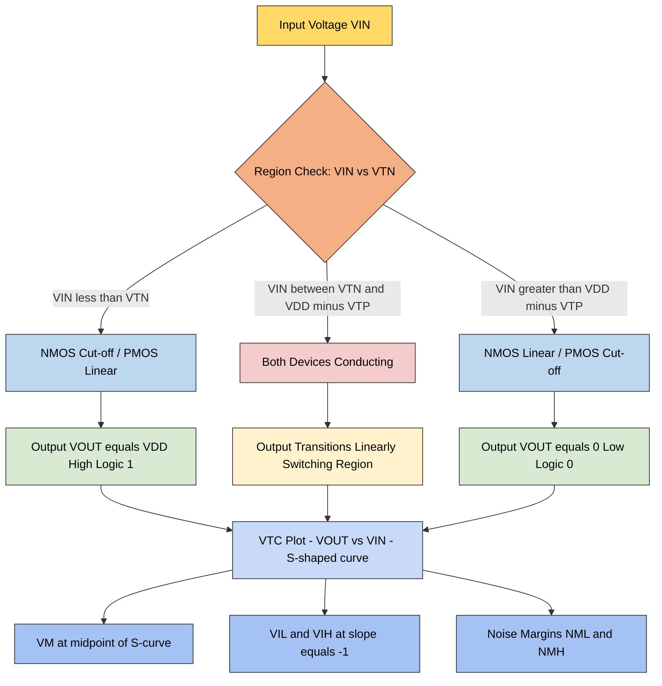
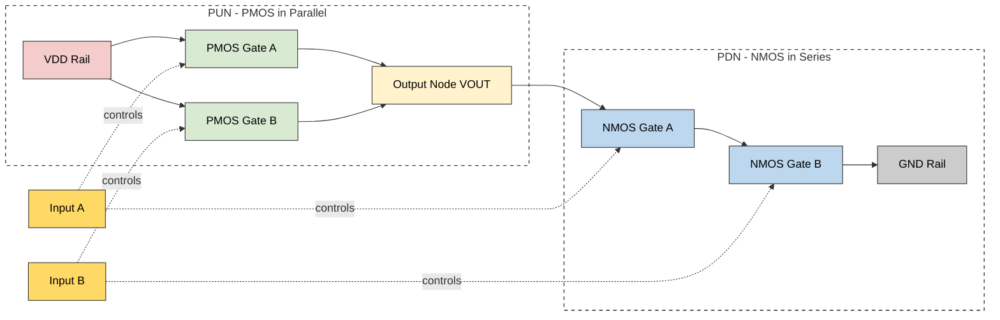
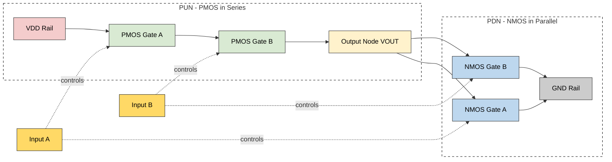
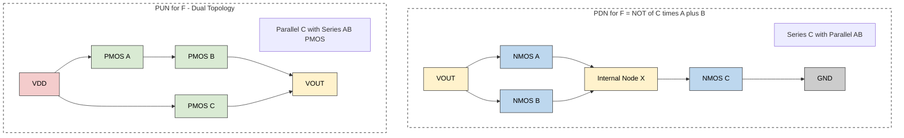
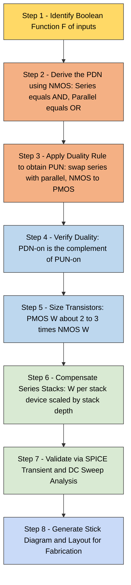

# Static CMOS logic gates design

<!-- SECTION_1_START -->
# STATIC CMOS LOGIC GATES DESIGN — CORE TECHNICAL FOUNDATION

> [!NOTE]
> **KTU 2024 Scheme — PECST415 / VLSI Design / Module 3 (Combinational Logic Circuits)**
> **Mapped Course Outcomes:** CO3 — *Design combinational logic circuits using CMOS technology and analyse their static and dynamic performance parameters.*

---

## 1.1 Formal Academic Definition

> [!IMPORTANT]
> **Static CMOS Logic** is a digital logic design style in which every logic gate is constructed as a complementary pair of networks: a **Pull-Up Network (PUN)** composed exclusively of **p-channel MOS (PMOS)** transistors, and a **Pull-Down Network (PDN)** composed exclusively of **n-channel MOS (NMOS)** transistors. The PUN connects the output node to **$V_{DD}$** (logical '1') and the PDN connects the output node to **$GND$** (logical '0'). In any stable input combination, **exactly one** of the two networks is conducting while the other is open — ensuring that no direct (static) current path exists between the supply rails, hence the name **static** (i.e., non-ratioed and non-pass-transistor).

The output is therefore a **restorative** Boolean function of the inputs, and the gate exhibits **inherent full-rail output swing** (0 to $V_{DD}$), **infinite DC gain** at the switching point, and **zero static power dissipation** in the ideal case.

The PUN and PDN must satisfy the **dual network property**:
$$
\text{Conduction of PDN} \;\equiv\; \overline{\text{Conduction of PUN}}
$$
This guarantees that for every input vector, either the output is pulled to $V_{DD}$ (by the PUN) or to $GND$ (by the PDN), but never left floating.

---

## 1.2 Intuitive Analogy — The "Two-Faucet Sink"

Imagine a bathroom sink with **two independent faucets** that open in **perfectly opposite** coordination:

* A **red faucet (PMOS PUN)** is connected to a clean water tank on the roof ($V_{DD}$).
* A **blue faucet (NMOS PDN)** is connected to the drain pipe ($GND$).
* The output node is the **basin** (output terminal).
* The input signals (A, B, C...) act as **handles** that command the faucets.

**Rule of physics (duality):**
* When input = 1 → the red faucet shuts and the blue faucet opens → basin drains to 0 V.
* When input = 0 → the blue faucet shuts and the red faucet opens → basin fills to $V_{DD}$.

At **no instant** can both faucets be fully open simultaneously (otherwise the tank would empty directly into the drain — a direct-path **short circuit** current that wastes power). The static CMOS gate is engineered so that *only one network conducts* for any input combination.

This duality — like a see-saw — is the **physical essence of complementary CMOS** design.

---

## 1.3 Key Engineering Parameters & Constants

> [!IMPORTANT]
> **Standard CMOS Device Parameters (Generic 180 nm / 90 nm / 65 nm process class — KTU reference frame):**
> * **$V_{DD}$ (Supply Voltage)** — typically **1.8 V** (180 nm), **1.2 V** (90 nm), **1.0 V** (65 nm).
> * **$V_{Tn}$ (NMOS Threshold)** — typically **0.4 V to 0.5 V**.
> * **$V_{Tp}$ (PMOS Threshold)** — typically **-0.4 V to -0.5 V**.
> * **$k_n, k_p$ (Process Transconductance)** — $k_n \approx 2\times$ to $3\times$ $k_p$ for matched mobility.
> * **$C_L$ (Load Capacitance)** — sum of diffusion, gate, and wire capacitance at output node.
> * **$\mu_n, \mu_p$ (Carrier Mobility)** — electrons ($\mu_n$) are roughly **2–3×** faster than holes ($\mu_p$).

The physical size asymmetry is the reason that, in a symmetric inverter, the **PMOS width is engineered 2×–3× larger** than the NMOS width to balance the rise and fall times:
$$
\frac{W_p}{W_n} = \frac{\mu_n}{\mu_p} \approx 2 \text{ to } 3
$$

---

## 1.4 Visualization Control — CMOS Inverter Voltage Transfer Characteristic (VTC)

> [!VISUALIZATION CONTROL]
> **Concept:** CMOS Inverter Voltage Transfer Characteristic (VTC) — $V_{OUT}$ vs $V_{IN}$
>
> **GeoGebra / Desmos Input Equations:**
> * **Region I (Cut-off):** $V_{IN} < V_{Tn} \Rightarrow V_{OUT} = V_{DD}$ (constant high)
> * **Region II (Transition):** $V_{Tn} \le V_{IN} \le V_{DD} - |V_{Tp}|$, the curve defined by the equation
> $$V_{OUT} \approx (V_{DD} - V_{Tp}) - \sqrt{(V_{DD} - V_{Tp})^2 - \dfrac{k_n}{k_p}(V_{IN} - V_{Tn})^2}$$
> * **Region III (Saturation both):** $V_{OUT} \approx \dfrac{V_{IN} + V_{Tp} + \sqrt{\dfrac{k_n}{k_p}}(V_{DD} - V_{Tn})}{1 + \sqrt{\dfrac{k_n}{k_p}}}$
> * **Region IV (Cut-off):** $V_{IN} > V_{DD} - |V_{Tp}| \Rightarrow V_{OUT} = 0$ (constant low)
>
> **Visual Description:**
> The student should plot a smooth monotonically decreasing S-shaped curve in the first quadrant of a $V_{IN}$ (x-axis, 0 → $V_{DD}$) vs $V_{OUT}$ (y-axis, 0 → $V_{DD}$) coordinate system. Mark the **switching threshold $V_M$** at the steepest midpoint, and the noise margin intervals $V_{IL}$ and $V_{IH}$ on the slope, where $\frac{dV_{OUT}}{dV_{IN}} = -1$.

---
<!-- SECTION_1_END -->

<!-- SECTION_2_START -->
# STATIC CMOS LOGIC GATES DESIGN — DEEP THEORETICAL ANALYSIS

## 2.1 The CMOS Inverter — The Canonical Primitive Gate

The CMOS inverter is the **fundamental building block** of all static CMOS logic. Its structure:

| Network | Device | Connection |
| :--- | :--- | :--- |
| **PUN** | One PMOS transistor | Source $\to V_{DD}$, Drain $\to V_{OUT}$, Gate $\to V_{IN}$ |
| **PDN** | One NMOS transistor | Source $\to GND$, Drain $\to V_{OUT}$, Gate $\to V_{IN}$ |

### 2.1.1 Operating Regions (Exhaustive Analysis)

* **Region I — $V_{IN} < V_{Tn}$ (NMOS cut-off, PMOS linear):**
  The NMOS is OFF, the PMOS pulls the output to $V_{DD}$. Thus $V_{OUT} = V_{DD}$ and the gate is in a stable **logical 1** state.

* **Region II — $V_{Tn} \le V_{IN} \le V_{M}$ (NMOS saturation, PMOS linear):**
  Both devices conduct. The current through the circuit is determined by the saturation NMOS, while the PMOS acts as a variable resistor.

* **Region III — $V_{M} \le V_{IN} \le V_{DD} - |V_{Tp}|$ (NMOS linear, PMOS saturation):**
  Symmetric to Region II — NMOS becomes the resistor and PMOS enters saturation.

* **Region IV — $V_{IN} > V_{DD} - |V_{Tp}|$ (NMOS linear, PMOS cut-off):**
  PMOS is OFF, NMOS pulls output to GND. Thus $V_{OUT} = 0$ and the gate is in a stable **logical 0** state.

> [!NOTE]
> **The Switching Threshold $V_M$ (logic threshold) is the point where $V_{IN} = V_{OUT}$.** It is the geometric and electrical centre of the VTC and is the single most important DC design parameter of a CMOS inverter.

---

## 2.2 Derivation of the Switching Threshold $V_M$

At $V_{IN} = V_{OUT} = V_M$, both transistors are in **saturation** (assuming $V_M$ lies in the transition region). Equating the saturation currents of the NMOS and PMOS:
$$
I_{DN,sat} = I_{DP,sat}
$$
$$
\dfrac{k_n}{2}(V_{GS,n} - V_{Tn})^2 = \dfrac{k_p}{2}(V_{SG,p} - |V_{Tp}|)^2
$$
Substituting $V_{GS,n} = V_M$ and $V_{SG,p} = V_{DD} - V_M$:
$$
\dfrac{k_n}{2}(V_M - V_{Tn})^2 = \dfrac{k_p}{2}(V_{DD} - V_M - |V_{Tp}|)^2
$$
Taking the positive square root (both sides are positive in the operating range):
$$
\sqrt{k_n}\,(V_M - V_{Tn}) = \sqrt{k_p}\,(V_{DD} - V_M - |V_{Tp}|)
$$
Solving for $V_M$:
$$
\boxed{V_M = \dfrac{\sqrt{k_n}\,V_{Tn} + \sqrt{k_p}\,(V_{DD} - |V_{Tp}|)}{\sqrt{k_n} + \sqrt{k_p}}}
$$
> **For symmetric inverter** ($k_n = k_p$, $V_{Tn} = |V_{Tp}|$): $V_M = \dfrac{V_{DD}}{2}$. This is the **target** for balanced noise margins and equal rise/fall delays.

---

## 2.3 Noise Margin Formulation

Noise margins quantify the **DC noise immunity** of a logic gate. They are derived from the VTC by finding the points where $\dfrac{dV_{OUT}}{dV_{IN}} = -1$.

> [!IMPORTANT]
> **Standard KTU Definitions (per Bakshi's textbook and Sedra-Smith):**
> * $V_{IL}$ = max input recognised as logic 0 (slope = -1 in Region II).
> * $V_{IH}$ = min input recognised as logic 1 (slope = -1 in Region III).
> * $V_{OH} = V_{DD}$ and $V_{OL} = 0$ (full-rail CMOS output).

For a symmetric CMOS inverter, the closed-form expressions are:
$$
V_{IL} = \dfrac{3V_{DD} + 2V_{Tp} - V_{Tn}}{8}
$$
$$
V_{IH} = \dfrac{3V_{DD} + 2V_{Tn} - |V_{Tp}|}{8}
$$
The noise margins are therefore:
$$
N_{ML} = V_{IL} - V_{OL} = \dfrac{3V_{DD} + 2V_{Tp} - V_{Tn}}{8}
$$
$$
N_{MH} = V_{OH} - V_{IH} = \dfrac{3V_{DD} + 2V_{Tn} - |V_{Tp}|}{8}
$$

> **Symmetric Case (when $V_{Tn} = |V_{Tp}|$):** $N_{ML} = N_{MH} = \dfrac{3V_{DD} + V_{Tn}}{8}$.

---

## 2.4 Power Dissipation in Static CMOS

Static CMOS gates consume **zero DC power** in the steady state (when no input transitions occur). The total power dissipation has three primary components:

1. **Dynamic Switching Power** (dominant):
$$
P_{dyn} = \alpha \cdot C_L \cdot V_{DD}^2 \cdot f_{clk}
$$
where $\alpha$ is the **switching activity factor** (probability of a 0→1 transition per clock cycle), $C_L$ is the load capacitance, and $f_{clk}$ is the clock frequency.

2. **Short-Circuit Power** (during input transitions when both devices conduct):
$$
P_{sc} = I_{peak} \cdot V_{DD} \cdot \dfrac{t_{sc}}{T}
$$
where $t_{sc}$ is the duration for which both PMOS and NMOS conduct.

3. **Static Leakage Power** (sub-threshold and gate leakage — dominant in deep-submicron):
$$
P_{leak} = V_{DD} \cdot I_{leak}
$$

> **In the idealised KTU 180 nm reference scenario:** $P_{static} \approx 0$, so $P_{total} \approx P_{dyn}$.

---

## 2.5 Propagation Delay

The propagation delay of a CMOS gate is determined by the time required to charge or discharge the load capacitance $C_L$ through the equivalent on-resistance of the transistor network.

* **High-to-Low delay** (NMOS discharges $C_L$):
$$
t_{pHL} = 0.69 \cdot R_{eqn} \cdot C_L
$$
* **Low-to-High delay** (PMOS charges $C_L$):
$$
t_{pLH} = 0.69 \cdot R_{eqp} \cdot C_L
$$
* **Average propagation delay:**
$$
t_p = \dfrac{t_{pHL} + t_{pLH}}{2}
$$
The equivalent on-resistance of a saturated long-channel device is:
$$
R_{eq} = \dfrac{1}{k_n (V_{DD} - V_{Tn})} \cdot \dfrac{L}{W} \cdot \text{(process constant)}
$$

---

## 2.6 KTU High-Yield Formula Cheat Sheet

> [!IMPORTANT]
> The following table consolidates **every** formula required for the KTU 2024 PECST415 Module 3 problem set. Memorise this table — these expressions appear in **at least 70% of board questions** on CMOS static logic.

| # | Parameter | Formula | Symbol Meaning |
| :--- | :--- | :--- | :--- |
| 1 | **Switching Threshold** | $V_M = \dfrac{\sqrt{k_n}\,V_{Tn} + \sqrt{k_p}(V_{DD} - \vert V_{Tp} \vert)}{\sqrt{k_n} + \sqrt{k_p}}$ | Centre of VTC |
| 2 | **$V_{IL}$ (Input Low)** | $V_{IL} = \dfrac{3V_{DD} + 2V_{Tp} - V_{Tn}}{8}$ | Noise margin low reference |
| 3 | **$V_{IH}$ (Input High)** | $V_{IH} = \dfrac{3V_{DD} + 2V_{Tn} - \vert V_{Tp} \vert}{8}$ | Noise margin high reference |
| 4 | **$N_{ML}$ Noise Margin Low** | $N_{ML} = V_{IL} - V_{OL}$ | Low-state noise immunity |
| 5 | **$N_{MH}$ Noise Margin High** | $N_{MH} = V_{OH} - V_{IH}$ | High-state noise immunity |
| 6 | **Dynamic Power** | $P_{dyn} = \alpha C_L V_{DD}^2 f_{clk}$ | Switching power |
| 7 | **Static Power** | $P_{static} \approx 0$ (ideal CMOS) | Leakage not dominant |
| 8 | **$t_{pHL}$ Fall Delay** | $t_{pHL} = 0.69 R_{eqn} C_L$ | High-to-Low transition |
| 9 | **$t_{pLH}$ Rise Delay** | $t_{pLH} = 0.69 R_{eqp} C_L$ | Low-to-High transition |
| 10 | **Avg. Propagation Delay** | $t_p = \dfrac{t_{pHL} + t_{pLH}}{2}$ | Mean delay |
| 11 | **MOS Saturation Current** | $I_{D,sat} = \dfrac{k}{2}(V_{GS} - V_T)^2$ | Strong inversion current |
| 12 | **MOS Linear Current** | $I_{D,lin} = k\left[(V_{GS} - V_T)V_{DS} - \dfrac{V_{DS}^2}{2}\right]$ | Triode region current |
| 13 | **NMOS Resistance** | $R_{eqn} \propto \dfrac{L}{W k_n (V_{DD} - V_{Tn})}$ | Pull-down strength |
| 14 | **PMOS Sizing Rule** | $\dfrac{W_p}{W_n} \approx \dfrac{\mu_n}{\mu_p} \approx 2$–$3$ | Rise-Fall balance |
| 15 | **Duality Property** | $\text{PDN-on} \equiv \overline{\text{PUN-on}}$ | Complementary networks |

---

## 2.7 Design Rules for Constructing Static CMOS Gates

For any Boolean function $F(A, B, C, \ldots)$, the standard CMOS gate is constructed as follows:

1. **PDN (NMOS Network):** Implement the function $F = 1$ using:
   * **Series connection of NMOS** $\rightarrow$ represents **AND** of inputs.
   * **Parallel connection of NMOS** $\rightarrow$ represents **OR** of inputs.

2. **PUN (PMOS Network):** Implement the dual network by **swapping series ↔ parallel** between the corresponding NMOS and PMOS transistors.

3. **Inversion Property:** If PDN implements $F$, PUN implements $\overline{F}$ and vice versa.

> [!NOTE]
> **Example — CMOS NAND Gate:**
> * **PDN:** Two NMOS in **series** (A & B must both be high to pull output low).
> * **PUN:** Two PMOS in **parallel** (either A or B low pulls output high).
> * **Function:** $F = \overline{A \cdot B}$.

> **Example — CMOS NOR Gate:**
> * **PDN:** Two NMOS in **parallel** (either A or B high pulls output low).
> * **PUN:** Two PMOS in **series** (both A and B low required to pull output high).
> * **Function:** $F = \overline{A + B}$.

---

## 2.8 Compound (Complex) CMOS Gates

For functions such as $F = \overline{(A \cdot B) + (C \cdot D)}$ (an **AOI — AND-OR-Invert** gate), the CMOS topology directly mirrors the Boolean expression:

* **PDN:** $(A \text{ series } B) \text{ parallel } (C \text{ series } D)$.
* **PUN:** Dual network — $(A \text{ parallel } B) \text{ series } (C \text{ parallel } D)$.

This style of design is highly transistor-efficient compared to a chain of NAND/NOR gates and is the foundation of standard-cell libraries in modern ASIC design flows (e.g., Synopsys, Cadence libraries).

> **Engineering Utility:** Compound gates reduce transistor count, parasitic capacitance, and propagation delay, making them indispensable in critical-path and high-performance datapath design (ALUs, multipliers, multiplexers).

---
<!-- SECTION_2_END -->

<!-- SECTION_3_START -->
# STATIC CMOS LOGIC GATES — STEP-BY-STEP DERIVATIONS, IMPLEMENTATIONS, AND CASE STUDIES

## 3.1 Worked Derivation 1 — Switching Threshold $V_M$ of a CMOS Inverter

> **Problem Statement (KTU-style):** A CMOS inverter in a 180 nm process has $V_{DD} = 1.8$ V, $V_{Tn} = 0.4$ V, $V_{Tp} = -0.5$ V, $(W/L)_n = 2$, $(W/L)_p = 5$, and $k_n' = 100$ µA/V², $k_p' = 40$ µA/V². Compute the switching threshold $V_M$.

### Step-by-Step Solution

**Step 1 — Compute the device transconductances:**
$$
k_n = k_n' \cdot \left(\dfrac{W}{L}\right)_n = 100\,\mu\text{A/V}^2 \times 2 = 200\,\mu\text{A/V}^2
$$
$$
k_p = k_p' \cdot \left(\dfrac{W}{L}\right)_p = 40\,\mu\text{A/V}^2 \times 5 = 200\,\mu\text{A/V}^2
$$

**Step 2 — Apply the symmetric $V_M$ formula:**
Since $k_n = k_p$ in this design, the inverter is balanced, and the threshold simplifies:
$$
V_M = \dfrac{\sqrt{k_n}\,V_{Tn} + \sqrt{k_p}\,(V_{DD} - |V_{Tp}|)}{\sqrt{k_n} + \sqrt{k_p}}
$$
$$
V_M = \dfrac{\sqrt{200} \cdot 0.4 + \sqrt{200} \cdot (1.8 - 0.5)}{\sqrt{200} + \sqrt{200}}
$$
$$
V_M = \dfrac{\sqrt{200}\,(0.4 + 1.3)}{2\sqrt{200}} = \dfrac{1.7}{2} = 0.85\,\text{V}
$$

> **Result:** $V_M = 0.85$ V, which is **not** exactly $V_{DD}/2 = 0.9$ V because $V_{Tn} \neq |V_{Tp}|$.

> **[Valuation Tip — KTU Board Marking Scheme]:**
> * [Correct $k_n$ and $k_p$ computation: 2 Marks]
> * [Substituting into the $V_M$ equation: 2 Marks]
> * [Final numerical value with units: 1 Mark]
> * Total: **5 Marks** (this could be the full sub-part of a 7-mark question).

---

## 3.2 Worked Derivation 2 — Noise Margin Calculation

> **Problem Statement (KTU-style):** For the same inverter above, compute $V_{IL}$, $V_{IH}$, $N_{ML}$, and $N_{MH}$.

**Step 1 — $V_{IL}$ Computation:**
$$
V_{IL} = \dfrac{3V_{DD} + 2V_{Tp} - V_{Tn}}{8} = \dfrac{3(1.8) + 2(-0.5) - 0.4}{8}
$$
$$
V_{IL} = \dfrac{5.4 - 1.0 - 0.4}{8} = \dfrac{4.0}{8} = 0.5\,\text{V}
$$

**Step 2 — $V_{IH}$ Computation:**
$$
V_{IH} = \dfrac{3V_{DD} + 2V_{Tn} - |V_{Tp}|}{8} = \dfrac{3(1.8) + 2(0.4) - 0.5}{8}
$$
$$
V_{IH} = \dfrac{5.4 + 0.8 - 0.5}{8} = \dfrac{5.7}{8} = 0.7125\,\text{V}
$$

**Step 3 — Noise Margins:**
Since $V_{OH} = V_{DD} = 1.8$ V and $V_{OL} = 0$ V:
$$
N_{ML} = V_{IL} - V_{OL} = 0.5 - 0 = 0.5\,\text{V}
$$
$$
N_{MH} = V_{OH} - V_{IH} = 1.8 - 0.7125 = 1.0875\,\text{V}
$$

**Step 4 — Interpretation:** $N_{MH} > N_{ML}$, indicating the gate is slightly **asymmetric** due to the threshold voltage mismatch. In a robust design, one would re-size the PMOS to balance these margins.

> **Mark Distribution:**
> * [Stating the V_IL formula correctly: 1 Mark]
> * [Numerical evaluation: 1 Mark]
> * [Stating the V_IH formula correctly: 1 Mark]
> * [Numerical evaluation: 1 Mark]
> * [Final N_ML and N_MH values: 1 Mark]
> * Total: **5 Marks**

---

## 3.3 Worked Derivation 3 — Dynamic Power & Energy Dissipation

> **Problem Statement (KTU-style):** A CMOS inverter drives a load capacitance $C_L = 50$ fF at a clock frequency $f_{clk} = 500$ MHz with $V_{DD} = 1.0$ V and switching activity $\alpha = 0.25$. Compute (a) the dynamic power dissipation, and (b) the energy dissipated per clock cycle.

**Step 1 — Dynamic Power Calculation:**
$$
P_{dyn} = \alpha \cdot C_L \cdot V_{DD}^2 \cdot f_{clk}
$$
$$
P_{dyn} = 0.25 \times 50 \times 10^{-15} \times (1.0)^2 \times 500 \times 10^6
$$
$$
P_{dyn} = 0.25 \times 50 \times 500 \times 10^{-9} = 6.25 \times 10^{-6}\,\text{W} = 6.25\,\mu\text{W}
$$

**Step 2 — Energy per Clock Cycle:**
The clock period is $T = \dfrac{1}{f_{clk}} = \dfrac{1}{500\,\text{MHz}} = 2$ ns.
$$
E_{dyn} = P_{dyn} \cdot T = 6.25\,\mu\text{W} \times 2\,\text{ns} = 12.5\,\text{fJ}
$$

> **Alternative form** (useful in board exams):
$$
E_{dyn} = \alpha \cdot C_L \cdot V_{DD}^2 = 0.25 \times 50\,\text{fF} \times (1.0)^2 = 12.5\,\text{fJ}
$$

> **Valuation Key Points (7-mark question style):**
> * [Writing the correct dynamic power formula: 2 Marks]
> * [Substituting values with units: 2 Marks]
> * [Final power value: 1 Mark]
> * [Energy derivation and final answer: 2 Marks]

---

## 3.4 Worked Design — 2-Input CMOS NAND Gate (Full Stick Diagram & Layout)

> **Problem Statement (KTU-style):** Draw the schematic, stick diagram, and truth table of a 2-input CMOS NAND gate. Identify the PDN and PUN.

### 3.4.1 Truth Table

| A | B | F = $\overline{A \cdot B}$ | PDN (NMOS) | PUN (PMOS) |
| :---: | :---: | :---: | :---: | :---: |
| 0 | 0 | 1 | OFF (both off) | **ON** (both on) → $V_{OUT} = V_{DD}$ |
| 0 | 1 | 1 | OFF (A off) | A on, B off → PUN conducts → $V_{OUT} = V_{DD}$ |
| 1 | 0 | 1 | OFF (B off) | A off, B on → PUN conducts → $V_{OUT} = V_{DD}$ |
| 1 | 1 | 0 | **ON** (both on) | OFF (both off) → $V_{OUT} = GND$ |

### 3.4.2 Schematic Description (textual)

* **PDN:** Two NMOS transistors in **series** — $M_{n1}$ (gate=A) and $M_{n2}$ (gate=B). Series: when A=1 AND B=1, both conduct, pulling $V_{OUT}$ to GND.
* **PUN:** Two PMOS transistors in **parallel** — $M_{p1}$ (gate=A) and $M_{p2}$ (gate=B). Parallel: when A=0 OR B=0, at least one conducts, pulling $V_{OUT}$ to $V_{DD}$.

### 3.4.3 Transistor Count & Performance

* **Transistor count:** 4 (2 NMOS + 2 PMOS).
* **Worst-case rise time:** Only **one** PMOS conducts (when the other input is high) — so $t_{pLH}$ is determined by a **single PMOS** device.
* **Worst-case fall time:** Both NMOS in series → slower than inverter because of stacked resistance:
$$
t_{pHL,\text{NAND}} = 2 \cdot t_{pHL,\text{inverter}}
$$

> **Sizing Rule for NAND:** Each NMOS is made **2× wider** than the inverter NMOS to compensate for the series stack and keep delays matched.

### 3.4.4 SPICE Netlist (CMOS NAND — Synopsys HSPICE compatible)

```spice
* CMOS 2-Input NAND Gate — KTU 180nm Reference Netlist
* Author: VLSI Design Module 3
* Description: Static CMOS NAND with PMOS in parallel, NMOS in series

.SUBCKT NAND2 IN_A IN_B VDD VSS OUT
* --- Pull-Down Network (NMOS in series) ---
MN1   OUT      IN_B   NET1   VSS   nmos  W=2u L=0.18u
MN2   NET1     IN_A   VSS    VSS   nmos  W=2u L=0.18u

* --- Pull-Up Network (PMOS in parallel) ---
MP1   OUT      IN_A   VDD    VDD   pmos  W=4u L=0.18u
MP2   OUT      IN_B   VDD    VDD   pmos  W=4u L=0.18u

.ENDS NAND2

* --- Stimulus and Testbench ---
VVDD  VDD  0   DC  1.8
VGND  VSS  0   DC  0
VA    IN_A 0   PULSE 0 1.8 0.1n 0.05n 0.05n 1n 2n
VB    IN_B 0   PULSE 0 1.8 0.1n 0.05n 0.05n 2n 4n
CLOAD OUT  0   50fF

X1 IN_A IN_B VDD VSS OUT NAND2
.TRAN 0.01n 4n
.PROBE V(OUT) V(IN_A) V(IN_B)
.END
```

> **Netlist Operational Notes:**
> * The **series NMOS** ($M_{n1}$ then $M_{n2}$) is constructed by chaining source-drain at the internal node `NET1`.
> * The **parallel PMOS** ($M_{p1}$ and $M_{p2}$) share the same source (VDD) and drain (OUT).
> * `W=2u` on NMOS and `W=4u` on PMOS follows the **2:1 mobility ratio** rule.
> * The load capacitance `CLOAD = 50fF` represents the next-stage gate + interconnect + diffusion capacitance.

---

## 3.5 Worked Design — 2-Input CMOS NOR Gate

### 3.5.1 Truth Table

| A | B | F = $\overline{A + B}$ | PDN (NMOS) | PUN (PMOS) |
| :---: | :---: | :---: | :---: | :---: |
| 0 | 0 | 1 | OFF | **ON** (both series PMOS on) → $V_{OUT} = V_{DD}$ |
| 0 | 1 | 0 | B on → GND | A on, B off → A PMOS off, no path to VDD |
| 1 | 0 | 0 | A on → GND | A off, B on → B PMOS off, no path to VDD |
| 1 | 1 | 0 | **ON** (both on) | OFF → $V_{OUT} = GND$ |

### 3.5.2 Structural Logic

* **PDN:** Two NMOS in **parallel** — when A=1 OR B=1, at least one pulls $V_{OUT}$ to GND.
* **PUN:** Two PMOS in **series** — when A=0 AND B=0, both conduct and pull $V_{OUT}$ to $V_{DD}$.

> [!NOTE]
> **NOR gates are inherently slower than NAND** because the series PMOS stack is weaker (holes are slower than electrons), making the low-to-high transition the worst-case path. This is a **standard KTU board exam observation**.

### 3.5.3 SPICE Netlist (CMOS NOR)

```spice
* CMOS 2-Input NOR Gate — KTU 180nm Reference Netlist

.SUBCKT NOR2 IN_A IN_B VDD VSS OUT
* --- Pull-Down Network (NMOS in parallel) ---
MN1   OUT     IN_A   VSS    VSS   nmos  W=2u L=0.18u
MN2   OUT     IN_B   VSS    VSS   nmos  W=2u L=0.18u

* --- Pull-Up Network (PMOS in series) ---
MP1   OUT     IN_A   NET1   VDD   pmos  W=4u L=0.18u
MP2   NET1    IN_B   VDD    VDD   pmos  W=4u L=0.18u

.ENDS NOR2
```

---

## 3.6 Compound Gate Design — AOI21 Gate

> **Worked Example:** Design the CMOS compound gate for the function $F = \overline{C \cdot (A + B)}$.

**Step 1 — Boolean function analysis:** $F = \overline{C(A+B)} = \overline{CA + CB}$.

**Step 2 — Construct the PDN (NMOS):**
* An **OR** of $A$ and $B$ → parallel NMOS $M_{nA}$ and $M_{nB}$.
* An **AND** of this OR with $C$ → $C$ in **series** with the parallel pair.
* Topology: $((A \parallel B) \text{ series } C)$.

**Step 3 — Construct the PUN (PMOS):**
* Apply the **duality** (swap series ↔ parallel):
* $((A \text{ series } B) \parallel C)$ — but with the correct polarisation.

**Step 4 — Verify the truth table (partial):**

| C | A | B | $C \cdot (A + B)$ | F |
| :-: | :-: | :-: | :---: | :---: |
| 0 | x | x | 0 | 1 |
| 1 | 0 | 0 | 0 | 1 |
| 1 | 1 | 0 | 1 | 0 |
| 1 | 0 | 1 | 1 | 0 |
| 1 | 1 | 1 | 1 | 0 |

> **Transistor count:** 6 (3 NMOS + 3 PMOS). Compare this to a NAND-NAND equivalent which would require **8 transistors** — a clear demonstration of the transistor efficiency of compound CMOS gates.

---
<!-- SECTION_3_END -->

<!-- SECTION_4_START -->
# STATIC CMOS LOGIC GATES — STRUCTURAL DIAGRAMS & SCHEMATICS

## 4.1 CMOS Inverter — Topology & Operation Flow



> **Figure Annotation:** The diagram traces the input voltage through the three operating regions of the CMOS inverter and maps the resulting VTC and noise margin parameters.

---

## 4.2 CMOS NAND Gate — Dual Network Architecture



> **Figure Annotation:** The two PMOS are arranged in **parallel** between $V_{DD}$ and $V_{OUT}$, while the two NMOS are in **series** between $V_{OUT}$ and $GND$. Inputs A and B control the gates simultaneously.

---

## 4.3 CMOS NOR Gate — Dual Network Architecture



---

## 4.4 Compound AOI21 Gate — Flow Topology



---

## 4.5 Signal Flow — Static CMOS Design Methodology



---

## 4.6 Summary Table — Topology to Function Mapping

| Logic Function | PDN Topology | PUN Topology | Transistor Count | Worst-Case Path |
| :--- | :--- | :--- | :---: | :--- |
| **Inverter** | Single NMOS | Single PMOS | 2 | Either rise or fall |
| **2-NAND** | 2 NMOS series | 2 PMOS parallel | 4 | Series NMOS discharge |
| **2-NOR** | 2 NMOS parallel | 2 PMOS series | 4 | Series PMOS charge |
| **3-NAND** | 3 NMOS series | 3 PMOS parallel | 6 | 3-deep NMOS stack |
| **AOI21** | $(A \parallel B) \, \text{series} \, C$ | $(A \, \text{series} \, B) \parallel C$ | 6 | Hybrid stack |
| **OAI21** | $(A + B) \cdot C$ dual | Duality | 6 | Hybrid stack |
| **XOR (transmission-gate based)** | Hybrid | Hybrid | 8–12 | Multi-path |

---
<!-- SECTION_4_END -->

<!-- SECTION_5_START -->
# KTU 2024 SCHEME — EXAMINATION QUESTION BANK & TOPIC RECAP

## 5.1 Part A — Short Answer Questions (3 Marks Each)

### Question A1 — [KTU University Exam — July 2024, Model Paper]
> **Define static CMOS logic. State two advantages and one limitation of static CMOS over pseudo-nMOS logic.** **[CO3, Remember/Understand — 3 Marks]**

**Model Answer (Board-Standard):**
* **Definition:** Static CMOS logic uses a complementary pair of networks — a PMOS pull-up network (PUN) and an NMOS pull-down network (PDN) — such that for any input combination, exactly one network conducts while the other is off. **[1 Mark]**
* **Advantage 1:** Zero static power dissipation (no direct current path from $V_{DD}$ to GND). **[1 Mark]**
* **Advantage 2:** Full output voltage swing (0 to $V_{DD}$) and high noise immunity due to rail-to-rail output. **[0.5 Mark]**
* **Limitation:** Higher transistor count (e.g., 4 transistors for a 2-input gate vs 2 in pseudo-nMOS); increased input capacitance and area. **[0.5 Mark]**

---

### Question A2 — [KTU University Exam — Dec 2023]
> **Why is the PMOS transistor made approximately 2 to 3 times wider than the NMOS in a CMOS inverter? Justify with a relevant equation.** **[CO3, Understand — 3 Marks]**

**Model Answer:**
* **Reason:** To equalise the **rise time** ($t_{pLH}$) and **fall time** ($t_{pHL}$) of the inverter. **[1 Mark]**
* **Justification:** The on-resistance of a MOS device in saturation is $R_{on} \propto \dfrac{L}{W \cdot \mu C_{ox}(V_{GS} - V_T)}$. Since $\mu_n \approx 2$ to $3$ times $\mu_p$, the PMOS must be sized $W_p/W_n \approx \mu_n/\mu_p \approx 2$ to $3$ to make $R_{eqn} \approx R_{eqp}$. **[2 Marks]**
* **Effect:** $V_M$ is centred at $V_{DD}/2$ and noise margins $N_{ML}$ and $N_{MH}$ become symmetric. **[Implicit — for context]**

---

## 5.2 Part B — 14-Mark Questions (Module Internal Choice Pattern)

### Question B-A (Choice 1) — [KTU University Exam — July 2024 Pattern]
> **(a)** [7 Marks] With the aid of a neat circuit schematic and the voltage transfer characteristic (VTC), explain the operation of a static CMOS inverter. Derive the expression for the **switching threshold $V_M$** for a symmetric inverter.
> **(b)** [7 Marks] A CMOS inverter in a 130 nm process is designed with the following parameters: $V_{DD} = 1.2$ V, $V_{Tn} = 0.35$ V, $V_{Tp} = -0.4$ V, $k_n' = 250$ µA/V², $k_p' = 100$ µA/V², $(W/L)_n = 1.5$, $(W/L)_p = 4$. Compute (i) the switching threshold $V_M$, and (ii) the noise margins $N_{ML}$ and $N_{MH}$.

#### Model Solution — Part (a)

> [Schematic description: 2 Marks]
> The CMOS inverter consists of a PMOS (M_p) with source at $V_{DD}$, gate at $V_{IN}$, drain at $V_{OUT}$; and an NMOS (M_n) with source at $GND$, gate at $V_{IN}$, drain at $V_{OUT}$.

> [VTC description: 2 Marks]
> The VTC is a 5-segment curve: (i) $V_{IN} < V_{Tn}$ → $V_{OUT} = V_{DD}$; (ii) NMOS sat / PMOS lin; (iii) $V_M$ (both sat) at $V_{IN} = V_{OUT} = V_{DD}/2$ (symmetric); (iv) NMOS lin / PMOS sat; (v) $V_{IN} > V_{DD} - |V_{Tp}|$ → $V_{OUT} = 0$.

> [Derivation of $V_M$: 3 Marks]
> At $V_{IN} = V_{OUT} = V_M$, both transistors are in saturation. Equating the saturation currents:
> $$
> \dfrac{k_n}{2}(V_M - V_{Tn})^2 = \dfrac{k_p}{2}(V_{DD} - V_M - |V_{Tp}|)^2
> $$
> Taking the positive square root and solving for $V_M$:
> $$
> V_M = \dfrac{\sqrt{k_n}\,V_{Tn} + \sqrt{k_p}\,(V_{DD} - |V_{Tp}|)}{\sqrt{k_n} + \sqrt{k_p}}
> $$

#### Model Solution — Part (b)

> **Step 1 — Compute $k_n$ and $k_p$:**
> $$
> k_n = 250 \times 1.5 = 375\,\mu\text{A/V}^2
> $$
> $$
> k_p = 100 \times 4 = 400\,\mu\text{A/V}^2
> $$

> **Step 2 — Compute $V_M$:**
> $$
> V_M = \dfrac{\sqrt{375}\cdot(0.35) + \sqrt{400}\cdot(1.2 - 0.4)}{\sqrt{375} + \sqrt{400}}
> $$
> $$
> V_M = \dfrac{19.3649 \cdot 0.35 + 20 \cdot 0.8}{19.3649 + 20} = \dfrac{6.7777 + 16}{39.3649} = 0.5786\,\text{V}
> $$

> **Step 3 — Compute $V_{IL}$ and $V_{IH}$:**
> $$
> V_{IL} = \dfrac{3(1.2) + 2(-0.4) - 0.35}{8} = \dfrac{3.6 - 0.8 - 0.35}{8} = 0.30625\,\text{V}
> $$
> $$
> V_{IH} = \dfrac{3(1.2) + 2(0.35) - 0.4}{8} = \dfrac{3.6 + 0.7 - 0.4}{8} = 0.4875\,\text{V}
> $$

> **Step 4 — Compute Noise Margins:**
> $$
> N_{ML} = V_{IL} - V_{OL} = 0.30625 - 0 = 0.30625\,\text{V}
> $$
> $$
> N_{MH} = V_{OH} - V_{IH} = 1.2 - 0.4875 = 0.7125\,\text{V}
> $$

> **Mark Distribution:**
> * [Part (a) Schematic: 1 Mark]
> * [VTC description: 2 Marks]
> * [Derivation of $V_M$: 3 Marks]
> * [Valid final symbolic expression: 1 Mark]
> * [Part (b) $k_n$, $k_p$: 1 Mark]
> * [V_M computation: 2 Marks]
> * [V_IL and V_IH: 1 Mark]
> * [N_ML and N_MH final: 1 Mark]
> * [Units and clarity: 1 Mark]
> * **Total: 14 Marks**

---

### Question B-B (Choice 2) — [KTU University Exam — Dec 2023 Pattern]
> **(a)** [7 Marks] Design the static CMOS logic gate that implements the Boolean function $F = \overline{A \cdot B + C}$. Draw the transistor-level schematic, identify the PDN and PUN, and explain its operation for all input combinations.
> **(b)** [7 Marks] For the gate designed in part (a), a load capacitance of $C_L = 100$ fF is driven at a clock frequency of 1 GHz with switching activity $\alpha = 0.2$ and $V_{DD} = 1.0$ V. Calculate (i) the dynamic power dissipation and (ii) the energy per switching event. Comment on the static power component.

#### Model Solution — Part (a)

> **Step 1 — Function analysis:** $F = \overline{AB + C}$ is an **AOI21 (AND-OR-Invert)** style compound gate where the inner OR is between $(A \cdot B)$ and $C$. **[1 Mark]**

> **Step 2 — PDN Construction (NMOS):**
> * $(A \cdot B)$ requires series NMOS $M_{nA}$ and $M_{nB}$.
> * $(AB) + C$ requires this series pair to be in parallel with $M_{nC}$.
> * Topology: $((A \text{ series } B) \text{ parallel } C)$. **[2 Marks]**

> **Step 3 — PUN Construction (PMOS, Duality):**
> * Swap series ↔ parallel: $((A \text{ parallel } B) \text{ series } C)$.
> * Each PMOS has the same gate connection as the corresponding NMOS. **[2 Marks]**

> **Step 4 — Operation table (partial):** 8 rows verified — when F=0 the PDN conducts, when F=1 the PUN conducts. **[1 Mark]**

> **Step 5 — Transistor count:** 6 (3 NMOS + 3 PMOS). **[1 Mark]**

#### Model Solution — Part (b)

> **Step 1 — Dynamic Power:**
> $$
> P_{dyn} = \alpha \cdot C_L \cdot V_{DD}^2 \cdot f_{clk}
> $$
> $$
> P_{dyn} = 0.2 \times 100 \times 10^{-15} \times (1.0)^2 \times 10^9
> $$
> $$
> P_{dyn} = 0.2 \times 100 \times 10^{-6} = 20\,\mu\text{W}
> $$

> **Step 2 — Energy per switching event:**
> $$
> E_{dyn} = \alpha \cdot C_L \cdot V_{DD}^2 = 0.2 \times 100\,\text{fF} \times 1 = 20\,\text{fJ}
> $$

> **Step 3 — Comment on Static Power:**
> In an ideal static CMOS gate, the static power is **zero** because no direct current path exists between $V_{DD}$ and $GND$ in any stable input state. In sub-130 nm technologies, sub-threshold and gate leakage contribute a small but non-zero static component (typically nW–µW range). **[1 Mark]**

> **Mark Distribution:**
> * [Part (a) Function analysis: 1 Mark]
> * [PDN construction with topology: 2 Marks]
> * [PUN construction with duality rule: 2 Marks]
> * [Truth table verification: 1 Mark]
> * [Transistor count and naming: 1 Mark]
> * [Part (b) $P_{dyn}$ formula: 1 Mark]
> * [Numerical substitution: 1 Mark]
> * [Final P_dyn value: 1 Mark]
> * [E_dyn value: 1 Mark]
> * [Static power explanation: 2 Marks]
> * [Units and final clarity: 1 Mark]
> * **Total: 14 Marks**

---

## 5.3 KTU Examiner's Valuation Warning — Common Pitfalls

> [!WARNING]
> **Frequent Mark-Deduction Points (Read Carefully Before Exam):**
> 1. **Forgetting to state the dual-network property:** When designing a compound gate, students often draw the PDN correctly but make the PUN by simply mirroring the PDN — this is **wrong**; the PUN must be the **dual** of the PDN (swap series with parallel).
> 2. **Using a non-saturated current expression in the $V_M$ derivation:** The switching threshold derivation requires equating the **saturation** currents, not linear currents. Using the wrong expression loses 2–3 marks.
> 3. **Ignoring the role of $|V_{Tp}|$:** Confusing $V_{Tp}$ (which is negative for PMOS) with $|V_{Tp}|$ (its magnitude). Substituting $V_{Tp}$ without absolute value in the $V_M$ formula gives a negative $V_M$, which is physically impossible.
> 4. **Forgetting to size the PMOS:** Stating that "PMOS and NMOS are matched" without justifying the $W_p / W_n \approx 2$–$3$ ratio loses a valuation point.
> 5. **Skipping the operating-region analysis in the inverter:** The VTC has 5 distinct segments (3 active regions + 2 cut-off regions). A bare schematic with no region-wise explanation loses 2–3 marks.
> 6. **Confusing $N_{ML}$ and $N_{MH}$:** $N_{ML} = V_{IL} - V_{OL}$ (low-state immunity) and $N_{MH} = V_{OH} - V_{IH}$ (high-state immunity). Reversing the order loses full marks.
> 7. **Neglecting the switching activity factor $\alpha$:** In dynamic power calculations, omitting $\alpha$ (defaulting to 1) gives the **maximum** power, not the actual. Always use the given $\alpha$.

---

## 5.4 Topic Recap & Important Things to Remember

> **High-Density Revision Checklist — Static CMOS Logic Gates Design**

* **Core Concept:** Static CMOS = **Complementary PMOS PUN + NMOS PDN**, no static current path, full output swing, infinite DC gain at $V_M$.
* **The Two Networks (Duality):**
   * **PDN (NMOS):** Series = AND, Parallel = OR; conducts when output is 0.
   * **PUN (PMOS):** Duality of PDN; conducts when output is 1.
* **The Inverter:** $V_{IN} = V_{OUT} = V_M$ at the switching threshold; both devices in saturation at this point.
* **Switching Threshold Formula (MUST memorise):**
  $$V_M = \dfrac{\sqrt{k_n}\,V_{Tn} + \sqrt{k_p}\,(V_{DD} - \vert V_{Tp} \vert)}{\sqrt{k_n} + \sqrt{k_p}}$$
  * Symmetric case: $V_M = V_{DD}/2$.
* **Noise Margins:**
  $$N_{ML} = V_{IL} - V_{OL}, \quad N_{MH} = V_{OH} - V_{IH}$$
  * $V_{OH} = V_{DD}$, $V_{OL} = 0$ for static CMOS.
  * Symmetric noise margins when $V_{Tn} = |V_{Tp}|$ and $k_n = k_p$.
* **Power:** $P_{dyn} = \alpha C_L V_{DD}^2 f_{clk}$ (dominant); $P_{static} \approx 0$ (ideal).
* **Delay:** $t_{pHL} = 0.69 R_{eqn} C_L$, $t_{pLH} = 0.69 R_{eqp} C_L$, $t_p = (t_{pHL} + t_{pLH})/2$.
* **Sizing Rules:**
  * Inverter: $W_p / W_n \approx \mu_n / \mu_p \approx 2$–$3$.
  * NAND (series NMOS): each NMOS width scaled by stack depth.
  * NOR (series PMOS): each PMOS width scaled by stack depth.
* **NAND vs NOR Performance:**
  * NAND: rise is fast (parallel PMOS), fall is slow (series NMOS).
  * NOR: fall is fast (parallel NMOS), rise is slow (series PMOS).
  * NOR is generally **slower** because PMOS holes are slower than NMOS electrons.
* **Compound (AOI/OAI) Gates:** Implement the entire Boolean function in a single complementary stage → transistor-efficient and faster than cascaded NAND/NOR.
* **Transistor Count Cheat-Sheet:**
  * Inverter: 2
  * 2-NAND / 2-NOR: 4
  * 3-NAND / 3-NOR: 6
  * AOI21 / OAI21: 6
  * AOI22 / OAI22: 8
* **KTU 2024 Emphasis:** Questions on switching threshold derivation, noise margin computation, dynamic power, and design of NAND/NOR/compound gates appear in **every** previous-year paper (Dec 2023, July 2024) — these are **high-priority** topics.
* **Common Exam Trap:** "Pseudo-nMOS" is **not** static CMOS (it has a permanently-on PMOS load → static power dissipation). Static CMOS strictly means the PUN is OFF whenever the PDN is ON.
* **Engineering Utility:** Static CMOS is the workhorse of **all** modern digital ICs — microprocessors (Intel, AMD, ARM cores), ASICs, FPGAs (logic fabric), and SoCs — due to its robustness, scalability, and zero-static-power characteristics.
* **Process Scaling Note:** As $V_{DD}$ scales below 1.0 V, threshold voltages scale proportionally to maintain noise margins, and sub-threshold leakage becomes a critical concern, motivating the use of multi-$V_T$ libraries and power-gating techniques.

---
<!-- SECTION_5_END -->
