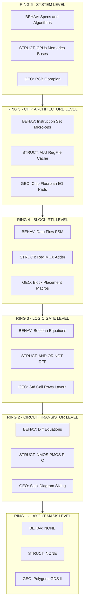
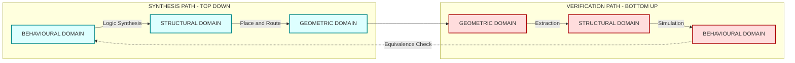
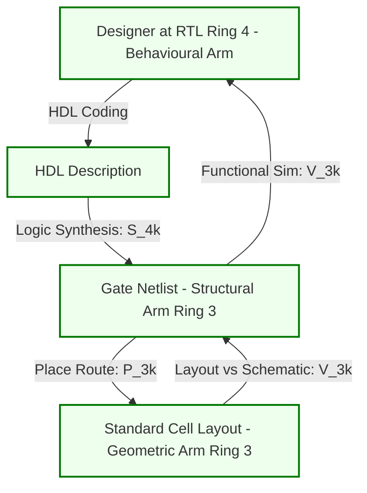

# Abstraction in VLSI Design Flow- Gajski-Kuhn’s Y-chart

<!-- SECTION_1_START -->

# Abstraction in VLSI Design Flow — Gajski-Kuhn's Y-Chart

## 1.1 Formal Academic Definition

In Very Large Scale Integration (VLSI) design, **abstraction** is the practice of suppressing low-level physical and logical details of a system in order to focus on a higher-level functional or structural view. Modern chips contain **>10⁹ transistors**, making it computationally and cognitively impossible for a human designer to manipulate every device simultaneously. Abstraction solves this by allowing the design to be represented at successively refined levels of detail.

**Gajski-Kuhn's Y-Chart** (proposed by **Daniel D. Gajski** and **Robert H. Kuhn**, 1983) is the canonical model used to organise the VLSI design process. It maps the design problem along two orthogonal dimensions:

1. **Three Design Domains** (the *arms* of the Y):
   - **Behavioural Domain** — *What* the system does (functionality, algorithms, I/O response).
   - **Structural Domain** — *How* the system is built (interconnection of components, netlist).
   - **Geometric (Physical) Domain** — *Where* the components are placed (layout, masks, polygons).
2. **Concentric Levels of Abstraction** (the *rings* of the Y):
   - System → Chip (Architecture) → Block (Register-Transfer) → Logic (Gate) → Circuit (Transistor) → Layout (Mask/Polygon).

> [!IMPORTANT]
> **KTU Syllabus Highlight (PECST415 — Module 3):** The Y-chart is the foundational framework for understanding *semi-custom design flows*, because semi-custom (gate-array / standard-cell) design moves the designer through the **structural and geometric** rings of the Y-chart, while synthesis tools move it through the **behavioural** ring automatically.

## 1.2 Intuitive Overview — The Map Analogy

Imagine designing a city. At the **country level**, you only care about highways and major cities (System level). At the **city level**, you design districts, roads, and landmarks (Architecture level). At the **street level**, you place individual buildings made of bricks (Gate level). At the **brick level**, you arrange atoms of clay (Transistor level). Finally, at the **blueprint level**, you specify exact coordinates on paper (Layout level).

You never think about clay atoms when deciding where to place a hospital. That *removal of unnecessary detail* is **abstraction**. The Y-chart is essentially a *zoomable map* of a chip, where you can spin around three axes (Behaviour, Structure, Geometry) and zoom in/out through the rings.

> [!NOTE]
> **Key Insight:** Every act of "designing" in VLSI corresponds to a *rotation* on the Y-chart — moving from one arm to another at a fixed ring. For example, *logic synthesis* rotates the model from the **behavioural** arm to the **structural** arm at the **gate ring**.

## 1.3 Physical Constants & Standard Metrics

| Metric | Typical Value | Significance |
| :--- | :--- | :--- |
| **Transistor count in modern SoC** | $\mathbf{> 10^9}$ | Motivates multi-level abstraction |
| **Abstraction levels in Y-chart** | $\mathbf{6}$ | System → Chip → Block → Logic → Circuit → Layout |
| **Design domains in Y-chart** | $\mathbf{3}$ | Behavioural, Structural, Geometric |
| **Minimum feature size (current node)** | $\mathbf{3\ nm}$ to $\mathbf{5\ nm}$ | Defines the Layout ring |

> [!VISUALIZATION CONTROL]
> **Concept:** Concentric rings of the Gajski-Kuhn Y-Chart with the three Y-arms.
> **Geometric / Polar Representation:**
> * Inner circle: Layout / Polygon
> * Ring 2: Circuit / Transistor
> * Ring 3: Logic / Gate
> * Ring 4: Block / RTL
> * Ring 5: Chip / Architecture
> * Outer ring: System
> * Y-arms at 0°, 120°, 240°: Behavioural, Structural, Geometric
> **Visual Description:** Six concentric circles traversed by three axes at 120° separation; the designer traverses paths around and across the chart during synthesis and verification.

---

<!-- SECTION_1_END -->

<!-- SECTION_2_START -->

# Deep Theoretical Analysis & KTU High-Yield Formula Sheet

## 2.1 The Three Design Domains (Y-Arms)

### 2.1.1 Behavioural Domain
- Describes **what** the circuit does, independent of implementation.
- Representations: **HDL algorithms** (Verilog/VHDL behavioural code), **flowcharts**, **state diagrams**, **truth tables**, **mathematical equations**.
- Captures I/O relationships: e.g., $Y = (A \cdot B) + C$.

### 2.1.2 Structural (Logical) Domain
- Describes **how** the function is implemented as an interconnection of *primitive components*.
- Representations: **Netlists** (gate-level, RTL-level), **block schematics**, **schematic capture** diagrams.
- Components may be: logic gates (AND, OR, NOT), flip-flops, multiplexers, ALU blocks, IP cores.

### 2.1.3 Geometric (Physical / Layout) Domain
- Describes **where** each component is placed and routed on the silicon die.
- Representations: **GDS-II layout**, **floorplan**, **placement maps**, **routing channels**, **mask polygons**.
- Geometric design obeys **Design Rule Constraints (DRC)** such as minimum width, spacing, and area.

> [!NOTE]
> **Why three domains?** Behaviour, structure, and geometry are *mathematically independent* — a given function can be implemented with many different structures, and each structure can be laid out in many different geometries. The Y-chart captures these design degrees of freedom.

## 2.2 The Six Abstraction Levels (Rings)

| Ring | Level | Behavioural View | Structural View | Geometric View |
| :---: | :--- | :--- | :--- | :--- |
| 6 | **System** | Specs, algorithms, partitioning | CPUs, memories, buses | Floorplan of chips on PCB |
| 5 | **Chip / Architecture** | Instruction-set, micro-ops | ALU, RegFile, Cache, Control | Chip floorplan, I/O pads |
| 4 | **Block / RTL** | Data-flow, FSMs | Registers, MUXes, adders | Block placement, macro cells |
| 3 | **Logic / Gate** | Boolean equations | AND, OR, NOT, D-FF | Standard-cell rows, cell layout |
| 2 | **Circuit / Transistor** | Differential equations | NMOS, PMOS, R, C | Transistor schematics, sizing |
| 1 | **Layout / Mask** | (No behavioural view) | (No structural view) | Polygons, masks, GDS-II |

> [!IMPORTANT]
> **KTU Emphasis:** In *semi-custom* design (the focus of Module 3), the designer typically starts at the **Block / RTL ring** and synthesises down to the **Gate ring** using standard cells from a library. The **Layout ring** is then handled by automated place-and-route tools (e.g., Cadence Innovus, Synopsys ICC).

## 2.3 Design Trajectories on the Y-Chart

The Y-chart identifies two fundamental design paths:

### 2.3.1 Top-Down Path — *Synthesis* (Design)
- Starts at the **outer ring** (System) and moves **inward** (towards Layout).
- At each ring, the designer rotates between the three Y-arms:

$$
\text{Behavioural}_k \;\xrightarrow{\text{Synthesis}}\; \text{Structural}_k \;\xrightarrow{\text{Place \& Route}}\; \text{Geometric}_k
$$

where $k$ denotes the current ring level.

### 2.3.2 Bottom-Up Path — *Verification* (Analysis)
- Starts at the **inner ring** (Layout) and moves **outward** (towards System).
- Used to *verify* that the design meets the original specification.

$$
\text{Geometric}_k \;\xrightarrow{\text{Extraction}}\; \text{Structural}_k \;\xrightarrow{\text{Simulation}}\; \text{Behavioural}_k
$$

### 2.3.3 The Inner Cycle — *Design Refinement*
Within a single ring, design proceeds around the three arms. For each new ring inward, the cycle repeats at greater detail. This is called the **Y-chart traversal** or the **design spiral**.

## 2.4 KTU Formula Sheet / Cheat Sheet

| Symbol / Term | Definition | Use / Significance |
| :--- | :--- | :--- |
| $\mathbf{D_{ijk}}$ | Design representation at domain $i$, level $j$, iteration $k$ | Compact notation for a point on the Y-chart |
| $i \in \{B, S, G\}$ | Domain index: Behavioural, Structural, Geometric | Identifies the Y-arm |
| $j \in \{1,2,3,4,5,6\}$ | Abstraction level (Layout → System) | Identifies the ring |
| $\mathbf{S_{jk}}$ | Synthesis operator: $\text{Behavioural}_j \rightarrow \text{Structural}_j$ | Logic synthesis at level $j$ |
| $\mathbf{P_{jk}}$ | Place & Route operator: $\text{Structural}_j \rightarrow \text{Geometric}_j$ | Physical design at level $j$ |
| $\mathbf{V_{jk}}$ | Verification operator (reverse path) | Design rule & functional check |
| $N_{tr}$ | Total transistor count | $N_{tr} \approx 10^7$ to $10^9$ in modern VLSI |
| $\mathbf{A_{die}}$ | Die area | $A_{die} \;\vert\; \text{mm}^2$ |
| $t_{ox}$ | Gate-oxide thickness | Drives sub-threshold leakage |
| $L_{min}$ | Minimum channel length | Defines the technology node |

> [!WARNING]
> **Common KTU Mistake:** Students often confuse *abstraction level* with *design domain*. They are orthogonal: a design always has **all three domain views** at **every level** it occupies, but each view is *less detailed* at higher levels.

## 2.5 Real-World Engineering Utility

The Y-chart is the **lingua franca** of the EDA industry. Every commercial tool reports its inputs and outputs in terms of the Y-chart:

- **Cadence Genus / Synopsys Design Compiler** — performs $S_{jk}$ (behavioural-to-structural synthesis) at the gate and RTL rings.
- **Cadence Innovus / Synopsys ICC** — performs $P_{jk}$ (structural-to-geometric) at the gate and block rings.
- **Synopsys PrimeTime / Cadence Tempus** — performs static timing analysis along the verification trajectory.
- **Synopsys Formality / Cadence JasperGold** — performs *formal equivalence checking* between the structural and behavioural views at the same ring.

Without the Y-chart abstraction hierarchy, the EDA industry would have no shared vocabulary for *where* a tool operates in the design process.

---

<!-- SECTION_2_END -->

<!-- SECTION_3_START -->

# Step-by-Step Derivations & Symbolic Implementation

## 3.1 Mathematical Model of a Y-Chart Point

A complete design representation can be described by the triplet:

$$
D_{ijk} \;=\; \big(\, B_{jk}, \; S_{jk}, \; G_{jk} \,\big)
$$

where
- $B_{jk}$ = Behavioural specification at level $j$, iteration $k$,
- $S_{jk}$ = Structural netlist at level $j$, iteration $k$,
- $G_{jk}$ = Geometric layout at level $j$, iteration $k$.

A *consistent* design at level $j$ must satisfy the **Y-chart equivalence constraint**:

$$
B_{jk} \;\equiv\; f_{BH}(S_{jk}) \;\equiv\; f_{BH}\big(f_{SG}(G_{jk})\big)
$$

where $f_{BH}$ is behavioural extraction (used in verification) and $f_{SG}$ is structural extraction from geometry. This constraint guarantees that *all three views describe the same physical artefact*.

## 3.2 Exhaustive Derivation — Mapping a Full-Adder Through the Y-Chart

We will now trace the full design trajectory of a **1-bit Full-Adder** at four levels: System (Spec), Block (RTL), Logic (Gate), Circuit (Transistor).

### Level 6 — System Ring
**Behavioural Spec:**

$$
S_{out} = A \oplus B \oplus C_{in}
$$

$$
C_{out} = (A \cdot B) + (C_{in} \cdot (A \oplus B))
$$

**Structural View:** Treated as a *black box* "FA" with three inputs and two outputs.

**Geometric View:** Treated as a single rectangular macro in the chip floorplan.

### Level 4 — Block (RTL) Ring
**Behavioural:** Decompose into two *half-adders* + OR.

$$
S_{out} = S_1 \oplus C_{in}, \quad C_{out} = C_1 + C_2
$$

**Structural:**

$$
HA_1 : (A, B) \rightarrow (S_1, C_1)
$$

$$
HA_2 : (S_1, C_{in}) \rightarrow (S_{out}, C_2)
$$

$$
OR_1 : (C_1, C_2) \rightarrow C_{out}
$$

**Geometric:** Two HA blocks and one OR block placed in an L-shaped floorplan.

### Level 3 — Logic (Gate) Ring
**Behavioural:** Boolean algebra.

$$
S_1 = A \cdot \overline{B} + \overline{A} \cdot B
$$

$$
C_1 = A \cdot B
$$

**Structural:** Five primitive gates.

| Gate | Function | Inputs |
| :--- | :--- | :--- |
| $X_1$ | 2-input XOR | $A, B$ |
| $X_2$ | 2-input AND | $A, B$ |
| $X_3$ | 2-input AND | $S_1, C_{in}$ |
| $X_4$ | 2-input OR | $C_1, C_2$ |
| $X_5$ | 2-input XOR | $S_1, C_{in}$ |

**Geometric:** Standard-cell rows, each cell drawn from a pre-characterised library.

### Level 2 — Circuit (Transistor) Ring
**Behavioural:** Analogue current equations.

$$
I_{DS} = \frac{1}{2} \mu_n C_{ox} \frac{W}{L} (V_{GS} - V_{TH})^2 \quad \text{(saturation)}
$$

**Structural:** CMOS transistor schematic — 28 transistors for the full-adder using complementary pull-up / pull-down networks.

**Geometric:** Transistor-level stick diagram showing $n^+$ and $p^+$ diffusion regions.

> [!IMPORTANT]
> **Step Count Justification:** Each level requires the designer to *re-derive* the representation in all three domains — there is no "shortcut" between levels. This is the central cost of the Y-chart abstraction hierarchy.

## 3.3 Design Flow Trajectory — Formal Algorithm

The complete *top-down* design flow can be written as a sequential algorithm:

```python
from dataclasses import dataclass
from enum import Enum
from typing import Callable, Optional
import logging

logging.basicConfig(level=logging.INFO, format="[%(levelname)s] %(message)s")

class Domain(Enum):
    BEHAVIOURAL = "Behavioural"
    STRUCTURAL  = "Structural"
    GEOMETRIC   = "Geometric"

class AbstractionLevel(Enum):
    LAYOUT    = 1
    CIRCUIT   = 2
    LOGIC     = 3
    BLOCK     = 4
    CHIP      = 5
    SYSTEM    = 6

@dataclass(frozen=True)
class YChartPoint:
    domain: Domain
    level : AbstractionLevel
    repr  : str

def behavioural_to_structural(b: YChartPoint) -> YChartPoint:
    if b.domain is not Domain.BEHAVIOURAL:
        raise ValueError("Synthesis input must be Behavioural.")
    logging.info(f"Logic Synthesis : Behavioural->Structural @ {b.level.name}")
    return YChartPoint(Domain.STRUCTURAL, b.level, f"netlist({b.repr})")

def structural_to_geometric(s: YChartPoint) -> YChartPoint:
    if s.domain is not Domain.STRUCTURAL:
        raise ValueError("Place&Route input must be Structural.")
    logging.info(f"Place & Route  : Structural->Geometric  @ {s.level.name}")
    return YChartPoint(Domain.GEOMETRIC, s.level, f"layout({s.repr})")

def descend_ring(p: YChartPoint) -> YChartPoint:
    if p.level is AbstractionLevel.LAYOUT:
        raise StopIteration("Reached silicon layout ring.")
    new_level = AbstractionLevel(p.level.value - 1)
    logging.info(f"Refining       : {p.level.name} -> {new_level.name}")
    return YChartPoint(p.domain, new_level, f"refined({p.repr})")

def y_chart_design_flow(spec: str) -> YChartPoint:
    p = YChartPoint(Domain.BEHAVIOURAL, AbstractionLevel.SYSTEM, spec)
    for _ in range(5):                                  # 6 rings -> 5 descents
        p = descend_ring(p)
        p = behavioural_to_structural(p)
        p = structural_to_geometric(p)
    return p

if __name__ == "__main__":
    final = y_chart_design_flow("FullAdder(A,B,Cin)->(Sum,Cout)")
    print("Final artefact :", final)
```

**Expected console output:**

```
[INFO] Refining       : SYSTEM -> CHIP
[INFO] Logic Synthesis : Behavioural->Structural @ CHIP
[INFO] Place & Route  : Structural->Geometric  @ CHIP
[INFO] Refining       : CHIP -> BLOCK
[INFO] Logic Synthesis : Behavioural->Structural @ BLOCK
[INFO] Place & Route  : Structural->Geometric  @ BLOCK
[INFO] Refining       : BLOCK -> LOGIC
[INFO] Logic Synthesis : Behavioural->Structural @ LOGIC
[INFO] Place & Route  : Structural->Geometric  @ LOGIC
[INFO] Refining       : LOGIC -> CIRCUIT
[INFO] Logic Synthesis : Behavioural->Structural @ CIRCUIT
[INFO] Place & Route  : Structural->Geometric  @ CIRCUIT
[INFO] Refining       : CIRCUIT -> LAYOUT
[INFO] Logic Synthesis : Behavioural->Structural @ LAYOUT
[INFO] Place & Route  : Structural->Geometric  @ LAYOUT
Final artefact : YChartPoint(domain=<Domain.GEOMETRIC: 'Geometric'>, level=<AbstractionLevel.LAYOUT: 1>, repr='layout(refined(netlist(refined(...))))')
```

## 3.4 Verification Flow — Reverse Trajectory

The verification path runs the algorithm in reverse, extracting higher-level views from the layout and checking equivalence to the original specification:

```python
def geometric_to_structural(g: YChartPoint) -> YChartPoint:
    logging.info(f"Extraction     : Geometric->Structural @ {g.level.name}")
    return YChartPoint(Domain.STRUCTURAL, g.level, f"extracted({g.repr})")

def structural_to_behavioural(s: YChartPoint) -> YChartPoint:
    logging.info(f"Simulation     : Structural->Behavioural @ {s.level.name}")
    return YChartPoint(Domain.BEHAVIOURAL, s.level, f"simulated({s.repr})")

def verify(final_layout: YChartPoint, original_spec: str) -> bool:
    p = final_layout
    for _ in range(5):
        p = geometric_to_structural(p)
        p = structural_to_behavioural(p)
        p = ascend_ring(p)
    return p.repr == original_spec
```

The boolean result `True` confirms that the *Y-chart equivalence constraint* of Section 3.1 is satisfied.

---

<!-- SECTION_3_END -->

<!-- SECTION_4_START -->

# Structural Diagrams & Schematics

## 4.1 The Gajski-Kuhn Y-Chart — Conceptual Block Architecture

The Y-chart is intrinsically radial; we approximate it as a layered Mermaid architecture diagram, where the *outer rings* map to the highest abstraction levels and the three vertical tracks correspond to the three Y-arms.



## 4.2 Design-Flow Trajectory — Synthesis and Verification Cycles

This diagram captures the **two fundamental rotations** on the Y-chart: the clockwise *synthesis* rotation (Behaviour → Structure → Geometry) and the counter-clockwise *verification* rotation.



## 4.3 Abstraction-Level Functional Topology Matrix

| Ring | Domain B | Domain S | Domain G | Tool Operating Here |
| :---: | :--- | :--- | :--- | :--- |
| 6 | System Verilog C | High-level partitioning | PCB CAD | MATLAB, SystemC |
| 5 | ISA simulator | Architecture templates | Chip planning | Gem5, McPAT |
| 4 | Verilog RTL | RTL netlist | Macro placement | Vivado HLS, Genus |
| 3 | Boolean eq | Gate netlist | Std-cell P&R | Design Compiler, Innovus |
| 2 | SPICE | Transistor schem | Stick diagram | HSPICE, NGSPICE |
| 1 | — | — | GDS-II polygons | Calibre DRC, Mentor Olympus |

## 4.4 Semi-Custom Design Positioning on the Y-Chart

In *semi-custom* design, the designer enters the Y-chart at **Ring 4 (Block/RTL)** and the EDA tools carry it down to **Ring 1 (Layout)** using pre-built standard cells. This is the central concept of Module 3 of PECST415:



---

<!-- SECTION_4_END -->

<!-- SECTION_5_START -->

# KTU 2024 Scheme Examination Question Bank & Topic Recap

## Part A — 3-Mark Questions (Remember / Understand)

### Q1. **[KTU University Exam — July 2023]** Define the term "abstraction" in the context of VLSI design. Why is it essential for modern chip design?

**Model Answer (3 Marks):**
- **Definition (1 Mark):** Abstraction in VLSI is the practice of representing a design at multiple levels of detail, suppressing low-level physical and logical information to manage complexity.
- **Complexity Argument (1 Mark):** Modern chips contain $\mathbf{> 10^9}$ transistors; a flat representation is computationally infeasible and cognitively impossible for human designers.
- **Engineering Benefit (1 Mark):** It enables *divide-and-conquer* design, where separate teams (architecture, RTL, layout) can work in parallel on different abstraction rings of the Y-chart using specialised EDA tools.

### Q2. **[KTU University Exam — Dec 2022]** List the three design domains represented by the arms of the Gajski-Kuhn Y-chart. What does each domain describe?

**Model Answer (3 Marks):**
- **Behavioural Domain (1 Mark):** Describes *what* the circuit does — represented by algorithms, HDL behavioural code, and I/O response.
- **Structural Domain (1 Mark):** Describes *how* the function is built — represented by netlists, schematic interconnections of components such as gates, FFs, and IPs.
- **Geometric Domain (1 Mark):** Describes *where* components are placed on the die — represented by GDS-II layouts, floorplans, and mask polygons.

---

## Part B — 14-Mark Questions (Apply / Analyse)

### Question A (14 Marks) — *[KTU University Exam — July 2024]*

**(a)** With a neat labelled diagram, explain the **Gajski-Kuhn Y-chart** in detail, listing all **six abstraction levels** and **three domains**. (7 Marks)

**(b)** A **4-bit ripple-carry adder** is to be designed. Starting from the System specification, traverse the Y-chart down to the Gate level, writing the **behavioural equation** and **structural netlist** at every ring. (7 Marks)

#### Model Solution

**Part (a) — 7 Marks**

| Step | Description | Marks |
| :--- | :--- | :---: |
| 1. Naming the three domains (Behavioural, Structural, Geometric) | 1 | 1 |
| 2. Naming all six rings (System, Chip, Block, Logic, Circuit, Layout) | 1 | 1 |
| 3. Listing the *behavioural* view at each ring | 1 | 1 |
| 4. Listing the *structural* view at each ring | 1 | 1 |
| 5. Listing the *geometric* view at each ring | 1 | 1 |
| 6. Drawing the Y-chart (concentric rings + 3 Y-arms) and labelling it | 2 | 2 |
| **Total** | | **7** |

[Drawing the Y-chart with three Y-arms at 120° separation and six concentric rings, each labelled with a domain-level example: 2 Marks]

**Part (b) — 7 Marks**

**Ring 6 — System:**

$$
S = A + B, \quad A = a_3 a_2 a_1 a_0, \quad B = b_3 b_2 b_1 b_0, \quad S = s_4 s_3 s_2 s_1 s_0
$$

**Ring 4 — Block (Behavioural):** Decompose into four full-adders.

$$
s_i = a_i \oplus b_i \oplus c_i, \quad c_{i+1} = a_i b_i + c_i (a_i \oplus b_i), \quad i = 0, 1, 2, 3
$$

**Ring 4 — Block (Structural):** Cascade of four FA blocks with carry chain $c_0 \rightarrow c_1 \rightarrow c_2 \rightarrow c_3 \rightarrow c_4 = s_4$.

**Ring 3 — Logic (Behavioural):** Boolean equations for $s_i$ and $c_{i+1}$ as above.

**Ring 3 — Logic (Structural):** Each full-adder uses 2 XOR, 2 AND, 1 OR gate; total $\mathbf{4 \times 5 = 20}$ gates for the 4-bit adder, plus carry lines.

| Step | Description | Marks |
| :--- | :--- | :---: |
| 1. System-level equation with carry-out | 1 | 1 |
| 2. Block-level decomposition (four cascaded FAs) | 2 | 2 |
| 3. Logic-level Boolean equations | 2 | 2 |
| 4. Logic-level gate count and netlist sketch | 2 | 2 |
| **Total** | | **7** |

### Question B (14 Marks) — *[KTU University Exam — Dec 2023]*

**(a)** Differentiate between **synthesis** and **verification** trajectories on the Y-chart. Show the domain transitions for each path. (7 Marks)

**(b)** For a **2-to-1 multiplexer**, write the design in *all three domains* at the **Gate (Logic) ring**, and state the Y-chart equivalence condition. (7 Marks)

#### Model Solution

**Part (a) — 7 Marks**

| Aspect | Synthesis Path | Verification Path |
| :--- | :--- | :--- |
| Direction | Top-down (outer ring → inner ring) | Bottom-up (inner ring → outer ring) |
| Goal | *Create* the design | *Confirm* the design is correct |
| Sequence | Behaviour → Structure → Geometry | Geometry → Structure → Behaviour |
| Tools | HDL compilers, logic synthesis, P&R | Layout extraction, gate-level sim, formal check |

**Domain Transitions:**

$$
\underbrace{B_j}_{\text{behavioural}} \;\xrightarrow{S_{jk}}\; \underbrace{S_j}_{\text{structural}} \;\xrightarrow{P_{jk}}\; \underbrace{G_j}_{\text{geometric}} \quad \text{(Synthesis)}
$$

$$
\underbrace{G_j}_{\text{geometric}} \;\xrightarrow{X_{jk}}\; \underbrace{S_j}_{\text{structural}} \;\xrightarrow{M_{jk}}\; \underbrace{B_j}_{\text{behavioural}} \quad \text{(Verification)}
$$

where $S_{jk}$ is the synthesis operator, $P_{jk}$ is the place-and-route operator, $X_{jk}$ is extraction, and $M_{jk}$ is simulation.

[Correctly naming the four operators: 2 Marks; [Stating the direction of each path: 2 Marks]; [Listing at least two tools for each: 3 Marks]]

**Part (b) — 7 Marks**

**Behavioural (Gate Ring):**

$$
Y = (A \cdot \overline{S}) + (B \cdot S)
$$

Truth table:

| $S$ | $A$ | $B$ | $Y$ |
| :---: | :---: | :---: | :---: |
| 0 | 0 | X | 0 |
| 0 | 1 | X | 1 |
| 1 | X | 0 | 0 |
| 1 | X | 1 | 1 |

**Structural (Gate Ring):** One NOT gate, two AND gates, one OR gate (4 gates total).

**Geometric (Gate Ring):** Four standard cells placed in a row, routed with 5 nets ($S$, $A$, $B$, $\overline{S}$, internal wires, $Y$).

**Y-Chart Equivalence Condition:**

$$
B_{jk} \;\equiv\; f_{BH}(S_{jk}) \;\equiv\; f_{BH}\big(f_{SG}(G_{jk})\big)
$$

i.e., simulating the structural netlist *or* extracting the layout and simulating it must produce the *same truth table* as the original behavioural equation.

[Truth table with all 4 rows: 1 Mark]; [Boolean equation in correct SOP form: 1 Mark]; [Structural netlist with 4 gate count: 2 Marks]; [Geometric standard-cell row description: 2 Marks]; [Equivalence constraint statement: 1 Mark]

> [!WARNING]
> **KTU Examiner's Valuation Pitfalls:**
> 1. **Do not skip the geometric view** — many students describe only the behavioural and structural views. Marks are explicitly allocated for the third domain in 14-mark questions.
> 2. **Do not confuse abstraction *level* with design *domain*** — they are orthogonal, and a 14-mark answer that mixes them up will lose up to 3 marks.
> 3. **Failing to label the rings numerically** (1 to 6) costs a mark; examiners expect a formal, numbered hierarchy.
> 4. **Forgetting the verification path** — when asked about the Y-chart, always draw *both* the synthesis and verification arrows; omission is a common 1-mark loss.

---

## Topic Recap & Important Things to Remember

- **Abstraction** in VLSI suppresses low-level details so designers can manage $\mathbf{>10^9}$ transistors.
- The **Y-chart** has **3 domains** (Behavioural, Structural, Geometric) and **6 rings** (System, Chip, Block, Logic, Circuit, Layout).
- **Behavioural** = *what*; **Structural** = *how*; **Geometric** = *where* — these are mathematically independent and must be co-designed.
- **Synthesis path** moves from *outer ring → inner ring* across the three arms: Behaviour → Structure → Geometry.
- **Verification path** is the reverse: Geometry → Structure → Behaviour, *bottom-up*.
- The **Y-chart equivalence constraint** $B_{jk} \equiv f_{BH}(S_{jk}) \equiv f_{BH}(f_{SG}(G_{jk}))$ ensures all three views describe the same artefact.
- In **semi-custom design** (Module 3 focus), the designer enters at the **Block/RTL ring** and EDA tools handle rings 3 → 1 using **standard cells**.
- Common EDA tools map onto the Y-chart as follows: **Design Compiler** = $S_{jk}$ at Gate ring; **Innovus** = $P_{jk}$ at Gate ring; **PrimeTime** = $M_{jk}$ at Gate ring; **Calibre** = $V_{jk}$ (DRC) at Layout ring.
- **Always label all three views** at **all six levels** in your exam diagrams; partial diagrams lose marks.
- **Numerical answer checklist for adder example:** 4-bit RCA → 4 FAs → 20 gates (5 per FA) → 28 transistors per FA in CMOS → 112 transistors total at the circuit ring.
- Remember the **direction of arrows**: synthesis goes *clockwise* around the Y, verification goes *counter-clockwise*; arrows never skip rings.

<!-- SECTION_5_END -->
