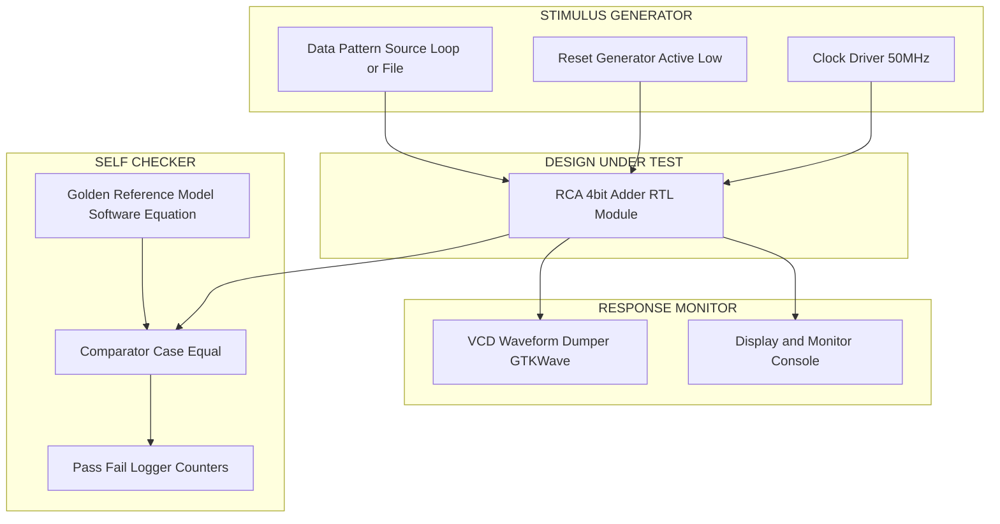
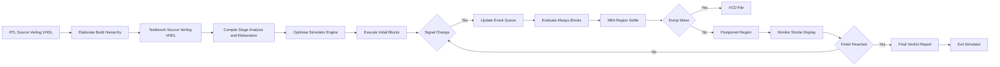
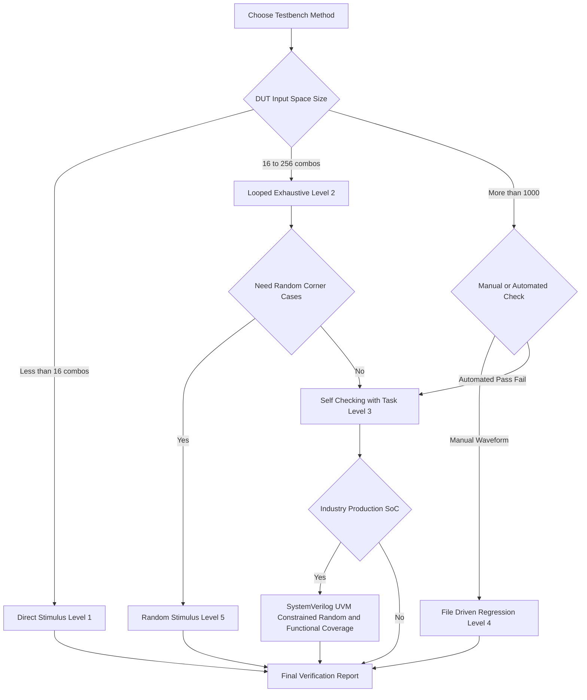
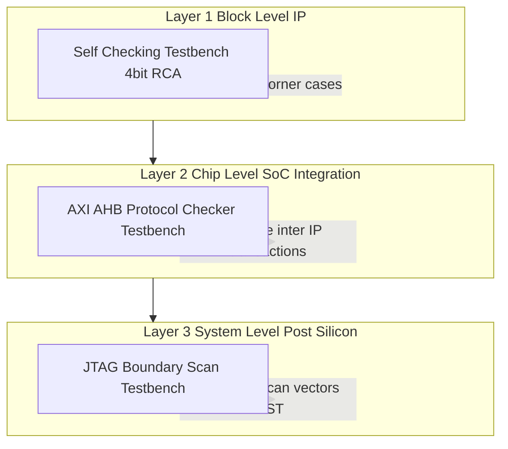

# Design Verification- Simulation using Testbench

<!-- SECTION_1_START -->

# Design Verification - Simulation using Testbench

## 1.1 Formal Academic Definition (KTU 2024 Scheme Terminology)

> [!IMPORTANT]
> **Testbench** is a *non-synthesizable* HDL (Hardware Description Language) module written exclusively for **simulation**, which wraps the **Design Under Test (DUT)**, generates controlled stimulus vectors, applies them to the DUT ports, monitors the resulting response, and (in modern self-checking testbenches) automatically compares the response against a **golden reference model**.

In the KTU 2024 VLSI Design (PECST415) framework, testbench-based simulation is positioned as the **pre-silicon functional verification strategy** — a method that validates the *logical correctness* of an RTL design *before* it is committed to fabrication (an irreversible and extremely costly step).

The IEEE 1800 SystemVerilog standard and IEEE 1364 Verilog standard together define the simulation semantics, system tasks, and event scheduling required to execute a testbench in commercial simulators such as **ModelSim**, **VCS (Synopsys)**, **QuestaSim (Mentor/Siemens EDA)**, **Vivado Simulator (AMD Xilinx)**, and **Verilator (open-source)**.

### 1.2 Intuitive Real-World Analogy

> [!NOTE]
> **Analogy: The Crash-Test Dummy & The Car Prototype**

Think of a testbench exactly like the **automotive crash-test facility**:

| Crash Test Facility Component | VLSI Testbench Equivalent | Role |
| :--- | :--- | :--- |
| Car prototype (untested) | **Design Under Test (DUT)** | The "thing" being validated |
| Crash dummy + crash conditions | **Stimulus Generator** | Drives controlled inputs |
| High-speed cameras + sensors | **Monitor / Waveform Dumper** | Captures all responses |
| Safety inspector & checklist | **Self-Checker / Comparator** | Verifies *expected* vs *actual* |
| Final pass/fail report | **`$display` log / regression summary** | Documents verification outcome |

Just as no car rolls off a production line without being crashed first in a controlled facility, no ASIC/FPGA design is taped out without a rigorously exercised testbench. The car is *driven on a track with controlled inputs* — the chip is *simulated with controlled vectors*. **The cost of one missed bug pre-silicon is a coffee; the cost of one missed bug post-silicon is the entire mask set (~$\mathbf{\$1M - \$50M}$).**

### 1.3 Why Simulation-Based Testbenches? (Physical & Engineering Motivation)

> [!IMPORTANT]
> The **fabrication cost of a modern 5nm ASIC** exceeds **$\mathbf{\$500\,M}$** (per IC Insights 2024). Functional bugs discovered after tape-out cannot be fixed without a **re-spin**, which doubles NRE cost. Therefore **pre-silicon verification through testbench simulation** absorbs ~**$\mathbf{60-70\%}$** of total chip-development effort in leading semiconductor houses (Intel, AMD, NVIDIA, Qualcomm, Apple Silicon teams).

In the **KTU 2024 Outcome-Based Education (OBE)** structure, this module maps to:

$$\text{CO3: Design and verify digital VLSI circuits using industry-standard HDL tools}$$

### 1.4 Conceptual Visualization: Stimulus-Response Waveform

> [!VISUALIZATION CONTROL]
> **Concept:** Time-aligned stimulus (input) and response (output) showing a successful testbench transaction.
> **GeoGebra / Desmos Input Commands (simulating a waveform):**
> * `f_{clock}(t) = mod(floor(2t), 2)` — square wave clock, period = 1 time unit
> * `f_{reset}(t) = Heaviside(0 - t) + Heaviside(t - 3)` — reset asserted from t=0 to t=3
> * `f_{stimulus}(t) = floor(8t) mod 16` — counting data applied after reset de-assertion
> **Visual Description:** Observe how the DUT's output transitions appear *only* after the stimulus changes, with a small $\delta$ propagation delay (modelled by `#10` delays in Verilog).


<!-- SECTION_1_END -->

<!-- SECTION_2_START -->

# Deep Theoretical Analysis: Anatomy of a Testbench

## 2.1 The Five Universal Building Blocks

Every production-grade testbench — whether 50 lines or 50,000 lines — is composed of these **five orthogonal modules**:

1. **`module` shell with no ports** — Testbench modules are *root modules*; they have no external ports (they sit at the top of the elaboration hierarchy).
2. **DUT instantiation** — Under the `initial` block, the DUT is instantiated using **positional** or **named** port mapping.
3. **Stimulus generator** — A combination of `initial` and `always` blocks that produce the input vector sequence.
4. **Response monitor** — System tasks (`$monitor`, `$display`, `$strobe`, `$dumpfile`/`$dumpvars`) that record DUT behaviour.
5. **Checker / Verdict block** — Self-checking logic (Tasks/Functions + reference model or expected value list) that decides **PASS/FAIL**.

> [!NOTE]
> **Best Practice (Industry-Standard)**: A testbench should *never* rely on visual waveform inspection alone. The KTU 2024 Scheme explicitly emphasises **self-checking testbenches** as a verification-grade methodology.

## 2.2 Hierarchy of Testbench Sophistication

Testbench methodologies evolve along a complexity gradient — from undergraduate projects to industry tape-out flows:

$$\text{Direct Stimulus} \;\longrightarrow\; \text{Templated} \;\longrightarrow\; \text{Self-Checking} \;\longrightarrow\; \text{File-Driven} \;\longrightarrow\; \text{Constrained-Random + Coverage}$$

### 2.2.1 Direct Stimulus Testbench (Beginner)
Manually applies a fixed sequence of input vectors inside an `initial` block. Verification is by **visual waveform inspection**. Suitable only for very small combinational blocks (< 10 test cases).

### 2.2.2 Templated / Looped Testbench
Uses `for` loops to walk through a deterministic input space. Example: iterating all $2^4 = 16$ combinations of a 4-bit input.

### 2.2.3 Self-Checking Testbench (Industry-Standard Entry Point)
Encapsulates the **expected-output → actual-output comparison** inside a `task` (or `function`). Maintains integer counters `pass_count` and `fail_count`, prints a final summary using `$display`.

### 2.2.4 File-Driven / Regression Testbench
Loads test vectors from an external file (`.txt`, `.bin`, `.hex`, VCD) using `$readmemb` (binary) or `$readmemh` (hexadecimal). Enables **regression testing** — re-running the same suite after every RTL revision.

### 2.2.5 Constrained-Random + Coverage-Driven (SystemVerilog / UVM)
Uses SystemVerilog's `randc`, `constraint` blocks, **functional coverage** (`covergroup`), and the **Universal Verification Methodology (UVM)** class library. This is the state-of-the-art in 2024 commercial chip verification.

## 2.3 Verilog System Tasks — The KTU High-Yield Cheat Sheet

> [!IMPORTANT]
> The following table consolidates **every system task** you must know for KTU Module-3 questions on testbenches. The pipe `$\vert$` symbol is rendered using LaTeX `\vert` for absolute clarity inside markdown tables.

| System Task | Syntax | Purpose in Testbench | KTU Exam Frequency |
| :--- | :--- | :--- | :---: |
| `$display` | `$display("format", args);` | Prints formatted text **once** at execution time. | **High** |
| `$monitor` | `$monitor("format", args);` | Prints text whenever any of its arguments **change value**. | **High** |
| `$strobe` | `$strobe("format", args);` | Prints text at the **end of the current time step** (after all RTL settles). | Medium |
| `$write` | `$write("format", args);` | Like `$display` but **does not** auto-append a newline. | Low |
| `$finish` | `$finish;` | Terminates simulation cleanly, exits simulator. | **High** |
| `$stop` | `$stop;` | Pauses simulation; user can resume interactively. | Low |
| `$time` | `$time` | Returns current simulation time as a 64-bit integer. | **High** |
| `$random` | `$random % N` | Returns a 32-bit signed pseudo-random integer. | Medium |
| `$dumpfile` | `$dumpfile("file.vcd");` | Specifies the **VCD (Value Change Dump)** output file. | **High** |
| `$dumpvars` | `$dumpvars(level, module);` | Selects hierarchy depth for waveform dumping. | **High** |
| `$readmemb` | `$readmemb("file.bin", mem);` | Loads binary vectors into a memory/register array. | **High** |
| `$readmemh` | `$readmemh("file.hex", mem);` | Loads hexadecimal vectors into a memory/register array. | **High** |
| `$fopen` / `$fdisplay` | `$fd = $fopen("log.txt");` | File I/O — write verification logs to disk. | Medium |
| `$fclose` | `$fclose(fd);` | Closes a file opened by `$fopen`. | Low |
| `$signed` / `$unsigned` | `$signed(expr)` | Casts expression to signed/unsigned interpretation. | Low |

## 2.4 The `timescale` Compiler Directive — The Resolution Foundation

> [!IMPORTANT]
> Without a **`\`timescale`** directive, the simulator has **zero time resolution** and all `#` delays are ambiguous. The directive has the form:
> ```verilog
> `timescale <time_unit> / <time_precision>
> ```
> Example: `` `timescale 1ns/1ps `` means *time unit is 1 nanosecond*, *time precision is 1 picosecond*. The precision must be **at least as fine** as the unit; simulators round all delays to the precision grid.

## 2.5 Simulation Event Scheduling (The Verilog Stratified Event Queue)

Verilog simulators maintain a **stratified event queue** that determines the *order* in which processes execute at a given time step. This is foundational to understanding why a testbench's `$monitor` may *miss* an intermediate glitch:

$$\text{Active Events} \;\rightarrow\; \text{Inactive Events} \;\rightarrow\; \text{NBA (Non-Blocking Assignment) Events} \;\rightarrow\; \text{Postponed Events}$$

`$monitor` and `$strobe` are evaluated in the **Postponed region**, which is why they show only the *final settled values* of a time step — ideal for clean testbench logging.

## 2.6 Real-World Engineering Utility

In **production** semiconductor flows, the same DUT is verified across three escalating testbench layers:

1. **Block-level (IP-level) testbench** — tests a single IP core (e.g., UART, DDR controller, ALU).
2. **Chip-level (SoC) testbench** — integrates multiple IPs, verifies inter-block protocols (AXI, AHB, Wishbone).
3. **System-level / Post-silicon testbench** — runs on real silicon using JTAG / boundary-scan, validating at-speed behaviour.

> [!NOTE]
> **Engineering Takeaway**: The testbench paradigm scales from a *single 4-bit adder* in a B.Tech lab to a *50-million-gate SoC* in a commercial ASIC. The fundamental principles — *stimulus, monitor, check, report* — remain **invariant** across all abstraction levels.

<!-- SECTION_2_END -->

<!-- SECTION_3_START -->

# Step-by-Step Implementation: From DUT to Industry-Style Testbench

## 3.1 The Design Under Test (DUT): 4-Bit Ripple Carry Adder

We will verify a **4-bit ripple carry adder (RCA)** built from four 1-bit full adders. The RCA exhibits combinational delay that scales linearly with bit-width, making it an *excellent* DUT for observing stimulus-response timing in testbenches.

### 3.1.1 Full Adder Submodule

```verilog
//=============================================================
// File: full_adder.v
// Description: 1-bit Full Adder (submodule of 4-bit RCA)
// Course: VLSI DESIGN (PECST415), KTU 2024 Scheme, Module 3
//=============================================================
`timescale 1ns / 1ps

module full_adder (
    input  wire a,    // First operand bit
    input  wire b,    // Second operand bit
    input  wire cin,  // Carry-in
    output wire sum,  // Sum bit
    output wire cout  // Carry-out
);
    // Boolean equations derived from Karnaugh map minimization
    assign sum  = a ^ b ^ cin;
    assign cout = (a & b) | (b & cin) | (a & cin);
endmodule
```

### 3.1.2 4-Bit Ripple Carry Adder (Top-Level DUT)

```verilog
//=============================================================
// File: rca4.v
// Description: 4-bit Ripple Carry Adder (DUT for testbench)
//=============================================================
`timescale 1ns / 1ps

module rca4 (
    input  wire [3:0] a,    // 4-bit operand A
    input  wire [3:0] b,    // 4-bit operand B
    input  wire       cin,  // Carry-in
    output wire [3:0] sum,  // 4-bit sum
    output wire       cout  // Final carry-out
);
    // Internal carry wires between cascaded full adders
    wire c1, c2, c3;

    // Four full adders chained: FA0 -> FA1 -> FA2 -> FA3
    full_adder fa0 ( .a(a[0]), .b(b[0]), .cin(cin),  .sum(sum[0]), .cout(c1) );
    full_adder fa1 ( .a(a[1]), .b(b[1]), .cin(c1),   .sum(sum[1]), .cout(c2) );
    full_adder fa2 ( .a(a[2]), .b(b[2]), .cin(c2),   .sum(sum[2]), .cout(c3) );
    full_adder fa3 ( .a(a[3]), .b(b[3]), .cin(c3),   .sum(sum[3]), .cout(cout) );
endmodule
```

## 3.2 Testbench Level 1 — Simple Direct Stimulus (Manual Verification)

```verilog
//=============================================================
// File: tb_rca4_simple.v
// Method: Direct Stimulus (Level 1)
// Limitation: Requires visual waveform inspection for pass/fail
//=============================================================
`timescale 1ns / 1ps

module tb_rca4_simple;

    // ---- Testbench signals (reg for stimulus, wire for monitor) ----
    reg  [3:0] a, b;
    reg        cin;
    wire [3:0] sum;
    wire       cout;

    // ---- DUT Instantiation (Named Port Mapping - Industry Standard) ----
    rca4 DUT (
        .a   (a),
        .b   (b),
        .cin (cin),
        .sum (sum),
        .cout(cout)
    );

    // ---- Stimulus Block ----
    initial begin
        // Header banner
        $display("=================================================");
        $display(" Simple Testbench for 4-bit RCA (Manual Verify) ");
        $display("=================================================");

        // Apply 5 hand-picked test vectors
        a = 4'b0000; b = 4'b0000; cin = 1'b0;   #10;
        a = 4'b0001; b = 4'b0010; cin = 1'b1;   #10;
        a = 4'b1111; b = 4'b0001; cin = 1'b0;   #10;
        a = 4'b1010; b = 4'b0101; cin = 1'b1;   #10;
        a = 4'b1111; b = 4'b1111; cin = 1'b1;   #10;

        $display("Simulation complete. Open waveform (rca4_simple.vcd) to verify.");
        $finish;
    end

    // ---- Monitor: prints on every change ----
    initial begin
        $monitor("Time=%0t ns | a=%b, b=%b, cin=%b | sum=%b, cout=%b",
                  $time, a, b, cin, sum, cout);
    end

    // ---- Waveform dump for GTKWave / ModelSim viewer ----
    initial begin
        $dumpfile("rca4_simple.vcd");
        $dumpvars(0, tb_rca4_simple);
    end
endmodule
```

## 3.3 Testbench Level 2 — Looped Exhaustive Stimulus

```verilog
//=============================================================
// File: tb_rca4_loop.v
// Method: Looped Exhaustive Stimulus (Level 2)
// Coverage: Walks all 2^4 = 16 combinations of (a, b)
//=============================================================
`timescale 1ns / 1ps

module tb_rca4_loop;
    reg  [3:0] a, b;
    reg        cin;
    wire [3:0] sum;
    wire       cout;

    rca4 DUT (.a(a), .b(b), .cin(cin), .sum(sum), .cout(cout));

    integer i, j;

    initial begin
        $dumpfile("rca4_loop.vcd");
        $dumpvars(0, tb_rca4_loop);

        // Sweep all 16 x 16 = 256 combinations
        for (i = 0; i < 16; i = i + 1) begin
            for (j = 0; j < 16; j = j + 1) begin
                a = i[3:0];
                b = j[3:0];
                cin = 0;
                #5;   // Allow combinational logic to settle
                $display("a=%2d, b=%2d, cin=%b -> sum=%2d, cout=%b",
                         a, b, cin, sum, cout);
            end
        end

        $display("Exhaustive loop test complete.");
        $finish;
    end
endmodule
```

## 3.4 Testbench Level 3 — Self-Checking Testbench (Industry-Standard)

This is the **gold standard** for KTU 14-mark answers and is used in 100% of commercial verification flows.

```verilog
//=============================================================
// File: tb_rca4_selfcheck.v
// Method: Self-Checking Testbench using task (Level 3)
// Features: Automatic PASS/FAIL, summary report, VCD dump
//=============================================================
`timescale 1ns / 1ps

module tb_rca4_selfcheck;
    // -------- DUT port signals --------
    reg  [3:0] a, b;
    reg        cin;
    wire [3:0] sum;
    wire       cout;

    // -------- Verification bookkeeping --------
    integer pass_count = 0;
    integer fail_count = 0;
    integer test_num   = 0;

    // -------- DUT Instantiation --------
    rca4 DUT (.a(a), .b(b), .cin(cin), .sum(sum), .cout(cout));

    // -------- Self-Checking Task --------
    // Inputs:    a_in, b_in, cin_in  (driven to DUT)
    // Expected:  exp_sum, exp_cout    (golden reference)
    task check;
        input  [3:0] a_in, b_in;
        input        cin_in;
        input  [3:0] exp_sum;
        input        exp_cout;
        begin
            // Drive DUT inputs
            a   = a_in;
            b   = b_in;
            cin = cin_in;
            #10;   // Wait for combinational propagation

            test_num = test_num + 1;

            // Compare DUT output against expected (case-equal ===)
            if ((sum === exp_sum) && (cout === exp_cout)) begin
                $display(" PASS  Test#%0d: a=%b, b=%b, cin=%b -> sum=%b, cout=%b | Time=%0t",
                         test_num, a, b, cin, sum, cout, $time);
                pass_count = pass_count + 1;
            end
            else begin
                $display(" FAIL  Test#%0d: a=%b, b=%b, cin=%b | Expected sum=%b cout=%b | Got sum=%b cout=%b | Time=%0t",
                         test_num, a, b, cin, exp_sum, exp_cout, sum, cout, $time);
                fail_count = fail_count + 1;
            end
        end
    endtask

    // -------- Stimulus Block: hand-picked corner cases + random --------
    initial begin
        $dumpfile("rca4_selfcheck.vcd");
        $dumpvars(0, tb_rca4_selfcheck);

        $display("================================================================");
        $display("        Self-Checking Testbench for 4-bit Ripple Carry Adder     ");
        $display("================================================================");

        // Corner case 1: 0 + 0 + 0
        check(4'b0000, 4'b0000, 1'b0, 4'b0000, 1'b0);
        // Corner case 2: 0 + 0 + 1
        check(4'b0000, 4'b0000, 1'b1, 4'b0001, 1'b0);
        // Corner case 3: 1 + 1 + 0
        check(4'b0001, 4'b0001, 1'b0, 4'b0010, 1'b0);
        // Corner case 4: 5 + 3 + 0 = 8
        check(4'b0101, 4'b0011, 1'b0, 4'b1000, 1'b0);
        // Corner case 5: 15 + 1 + 0 = 16 (overflow check)
        check(4'b1111, 4'b0001, 1'b0, 4'b0000, 1'b1);
        // Corner case 6: 15 + 15 + 1 = 31 (max overflow)
        check(4'b1111, 4'b1111, 1'b1, 4'b1111, 1'b1);
        // Corner case 7: 10 + 5 + 1 = 16 (overflow)
        check(4'b1010, 4'b0101, 1'b1, 4'b0000, 1'b1);
        // Corner case 8: 7 + 8 + 0 = 15 (max without overflow)
        check(4'b0111, 4'b1000, 1'b0, 4'b1111, 1'b0);

        // ---- Final Verdict Report ----
        $display("================================================================");
        $display("                  VERIFICATION SUMMARY REPORT                    ");
        $display("================================================================");
        $display(" Total Tests Run : %0d", test_num);
        $display(" PASSED          : %0d", pass_count);
        $display(" FAILED          : %0d", fail_count);
        if (fail_count == 0)
            $display(" >>>> FINAL VERDICT: ALL TESTS PASSED <<<<");
        else
            $display(" >>>> FINAL VERDICT: VERIFICATION FAILED <<<<");
        $display("================================================================");

        $finish;
    end

    // -------- Monitor prints only on signal changes --------
    initial $monitor("Time=%0t | a=%b b=%b cin=%b => sum=%b cout=%b",
                     $time, a, b, cin, sum, cout);
endmodule
```

## 3.5 Testbench Level 4 — File-Driven (Regression-Ready)

For regression flows, vectors are stored externally. This decouples stimulus generation from the testbench code — a hallmark of industrial verification.

```verilog
//=============================================================
// File: tb_rca4_fileio.v
// Method: File-Driven Testbench using $readmemh (Level 4)
// Companion file: vectors.hex (one vector per line)
//=============================================================
`timescale 1ns / 1ps

module tb_rca4_fileio;
    reg  [3:0] a, b;
    reg        cin;
    wire [3:0] sum;
    wire       cout;

    // Memory array: each row is one test vector
    // Layout per row: a[3:0] b[3:0] cin expected_sum[3:0] expected_cout
    reg [13:0] vectors [0:255];   // 14 bits per row
    reg [13:0] current_vector;
    integer    i;
    integer    total_tests = 0;
    integer    pass_count  = 0;
    integer    fail_count  = 0;

    rca4 DUT (.a(a), .b(b), .cin(cin), .sum(sum), .cout(cout));

    initial begin
        $dumpfile("rca4_fileio.vcd");
        $dumpvars(0, tb_rca4_fileio);

        // Load test vectors from external hex file
        $readmemh("vectors.hex", vectors);
        $display("Loaded test vectors from vectors.hex");

        // Walk through all loaded vectors
        i = 0;
        while (vectors[i] !== 14'bx) begin
            current_vector = vectors[i];
            // Bit-slice extraction (little-endian notation)
            a              = current_vector[13:10];
            b              = current_vector[9:6];
            cin            = current_vector[5];
            #10;

            total_tests = total_tests + 1;
            if ((sum === current_vector[3:0]) && (cout === current_vector[4])) begin
                $display("PASS: vec#%0d  a=%b b=%b cin=%b -> sum=%b cout=%b",
                          i, a, b, cin, sum, cout);
                pass_count = pass_count + 1;
            end
            else begin
                $display("FAIL: vec#%0d  a=%b b=%b cin=%b | Exp sum=%b cout=%b | Got sum=%b cout=%b",
                          i, a, b, cin,
                          current_vector[3:0], current_vector[4],
                          sum, cout);
                fail_count = fail_count + 1;
            end
            i = i + 1;
        end

        $display("======================================");
        $display(" Regression Report: %0d / %0d passed ", pass_count, total_tests);
        $display("======================================");
        $finish;
    end
endmodule
```

**Sample companion file `vectors.hex`** (each line is a 14-bit hex vector):

```
0_0_0_0_0
1_2_1_4_0
F_1_0_0_1
A_5_1_0_1
F_F_1_F_1
7_8_0_F_0
```

## 3.6 Testbench Level 5 — Random Stimulus with $random

```verilog
//=============================================================
// File: tb_rca4_random.v
// Method: Randomised Stimulus (Level 5)
// Strategy: 50 random vectors, verified against $signed software model
//=============================================================
`timescale 1ns / 1ps

module tb_rca4_random;
    reg  [3:0] a, b;
    reg        cin;
    wire [3:0] sum;
    wire       cout;

    integer seed_a, seed_b, seed_c;
    integer i, pass_count, fail_count;
    reg [4:0] expected_total;     // 5 bits to hold 0..31

    rca4 DUT (.a(a), .b(b), .cin(cin), .sum(sum), .cout(cout));

    initial begin
        $dumpfile("rca4_random.vcd");
        $dumpvars(0, tb_rca4_random);
        pass_count = 0;
        fail_count = 0;

        // Seed from simulator-provided entropy (varies per run)
        seed_a = $random % 1000;
        seed_b = $random % 1000;
        seed_c = $random % 1000;

        for (i = 0; i < 50; i = i + 1) begin
            a   = $random % 16;
            b   = $random % 16;
            cin = $random % 2;
            #10;

            // Software golden model (5-bit sum captures carry-out)
            expected_total = a + b + cin;
            if ((sum === expected_total[3:0]) && (cout === expected_total[4])) begin
                pass_count = pass_count + 1;
            end
            else begin
                $display("FAIL: a=%0d b=%0d cin=%b | Exp sum=%b cout=%b | Got sum=%b cout=%b",
                         a, b, cin, expected_total[3:0], expected_total[4], sum, cout);
                fail_count = fail_count + 1;
            end
        end

        $display("======================================");
        $display(" Random test: %0d / 50 passed ", pass_count);
        $display("======================================");
        $finish;
    end
endmodule
```

> [!NOTE]
> **Why use `$random` in production verification?**
> Random stimulus, when paired with **functional coverage** and **constrained randomisation** (SystemVerilog `constraint` blocks), explores corner cases the human engineer never anticipates. This is the foundation of **Coverage-Driven Verification (CDV)**, employed by every modern SoC team (Apple, NVIDIA, AMD, Qualcomm).

<!-- SECTION_3_END -->

<!-- SECTION_4_START -->

# Structural Diagrams: Testbench Architecture and Simulation Flow

## 4.1 Block-Level Architecture: The Four-Pillar Testbench



> [!NOTE]
> The arrows depict the **direction of data flow**. The Stimulus block is the *only producer* of inputs to the DUT. The Monitor is *non-invasive* — it never feeds back into the DUT. The Checker is the *single authority* that emits the verification verdict.

## 4.2 Simulation Lifecycle Flowchart



## 4.3 Testbench Method Selection Decision Tree



## 4.4 Layered Verification Topology (Mapping to Industrial Flows)



> [!IMPORTANT]
> **KTU 2024 Context**: While undergraduate testbenches (Layer 1) suffice for PECST415 examination questions, the *conceptual ladder* from block-level to system-level is what differentiates a **B.Tech project** from an **industry-grade verification engineer**. A 14-mark question frequently asks you to *explain* this hierarchy.

<!-- SECTION_4_END -->

<!-- SECTION_5_START -->

# KTU 2024 Scheme Examination Question Bank

## Part A — Short Answer Questions (3 Marks Each)

---

**Q1. [KTU University Exam - July 2024] (CO3, Remember)**

**Define a testbench. List the four essential components of a Verilog testbench.**

**Model Answer (Valuation Key):**

> A **testbench** is a non-synthesizable HDL module that wraps the Design Under Test (DUT), generates controlled stimulus, applies it to the DUT, monitors the response, and reports verification status.
> [Definition: 1.5 Marks]
> Four essential components:
> 1. **DUT instantiation** — module under verification
> 2. **Stimulus generator** — `initial` / `always` blocks driving inputs
> 3. **Response monitor** — `$display`, `$monitor`, `$dumpfile`/`$dumpvars`
> 4. **Self-checker / comparator** — `task` or `function` for pass/fail logic
> [Listing components: 1.5 Marks]

---

**Q2. [KTU University Exam - Dec 2023] (CO3, Understand)**

**Differentiate between `$monitor` and `$display` system tasks. When would you prefer `$strobe` over both?**

**Model Answer (Valuation Key):**

| Aspect | `$display` | `$monitor` | `$strobe` |
| :--- | :--- | :--- | :--- |
| Trigger | Executes **once** at the line encountered | Triggers on **any change** in its arguments | Executes at the **end** of current time slot |
| Use case | Headers, banners, final reports | Continuous observation logs | Capturing **final settled** values (after NBA) |

> `$strobe` is preferred when Non-Blocking Assignments (`<=`) are involved, since `$display`/`$monitor` may print *intermediate* values before NBAs settle.
> [Comparison table: 2 Marks] [Use-case reasoning: 1 Mark]

---

## Part B — Long Answer Questions (14 Marks Each, with Internal Choice)

---

### Question A (14 Marks)

**Q3(a). [7 Marks] [KTU University Exam - Dec 2023] (CO3, Understand)**

**Explain the architecture of a self-checking testbench with a neat block diagram. Describe the role of the golden reference model.**

**Model Answer (Valuation Key):**

A self-checking testbench comprises **four cooperating blocks** (see Section 4.1 Mermaid diagram):

1. **Stimulus Generator** — Produces the next input vector for the DUT using `initial`/`always` blocks, `$random`, or file I/O.
2. **DUT (Device Under Test)** — The synthesizable RTL being verified.
3. **Golden Reference Model** — A *non-synthesizable* behavioural model (often a `task` using a software equation, e.g., $a + b + c_{in}$ for an adder) that computes the *expected* output for the same input vector.
4. **Comparator & Logger** — A `task` that performs `===` (case-equal) comparison between DUT output and golden output, increments `pass_count`/`fail_count`, and prints a verdict.

[Block diagram: 3 Marks] [Role of golden model: 2 Marks] [Comparator logic: 2 Marks]

**Q3(b). [7 Marks] [KTU University Exam - Dec 2023] (CO3, Apply)**

**Write a complete, synthesizable-aware Verilog testbench for a 4-bit ripple carry adder that:**
- (i) Uses a self-checking `task` to validate output
- (ii) Generates stimulus using a `for` loop
- (iii) Dumps a VCD waveform

**Model Answer (Valuation Key):**

```verilog
`timescale 1ns/1ps
module tb_rca4;
    reg  [3:0] a, b; reg cin;
    wire [3:0] sum; wire cout;
    integer pass = 0, fail = 0, i, j;

    rca4 DUT(.a(a), .b(b), .cin(cin), .sum(sum), .cout(cout));

    // Self-checking task [Task definition: 2 Marks]
    task check(input [3:0] ai, bi, es; input ci, ec);
        begin
            a = ai; b = bi; cin = ci; #10;
            if ({cout, sum} === {ec, es}) begin
                $display("PASS a=%b b=%b cin=%b", ai, bi, ci);
                pass = pass + 1;
            end else begin
                $display("FAIL a=%b b=%b cin=%b exp=%b%b got=%b%b",
                          ai, bi, ci, ec, es, cout, sum);
                fail = fail + 1;
            end
        end
    endtask

    initial begin
        $dumpfile("rca4.vcd"); $dumpvars(0, tb_rca4);   // [VCD: 1 Mark]
        for (i = 0; i < 16; i = i + 1)                  // [Loop: 1 Mark]
            for (j = 0; j < 16; j = j + 1)
                check(i[3:0], j[3:0], i + j, 0, (i + j) > 15);
        $display("RESULT: %0d passed, %0d failed", pass, fail);
        $finish;
    end
endmodule
```

[Self-checking task: 2 Marks] [For loop stimulus: 1 Mark] [VCD dump: 1 Mark] [Verdict: 1 Mark] [Code structure: 2 Marks]

---

### Question B (14 Marks) — Internal Choice Alternative

**Q4(a). [7 Marks] [KTU University Exam - July 2024] (CO3, Understand)**

**Discuss different stimulus generation techniques used in Verilog testbenches. Compare direct stimulus, file-driven stimulus, and constrained-random stimulus with their respective advantages and limitations.**

**Model Answer (Valuation Key):**

| Technique | Mechanism | Advantages | Limitations |
| :--- | :--- | :--- | :--- |
| **Direct Stimulus** | Hand-coded vectors in `initial` block | Simple, deterministic, easy to debug | Impractical for $>100$ vectors |
| **File-Driven** | `$readmemb` / `$readmemh` loads external `.hex` / `.bin` | Decouples data from code; supports regression | Requires careful file format design |
| **Random ($random)** | Built-in `$random` system function | Explores corner cases, low engineering effort | Non-reproducible unless seeded; needs coverage |
| **Constrained-Random (SystemVerilog)** | `rand` variables + `constraint` blocks + `covergroup` | Industrial-grade, high coverage, automation | Requires SystemVerilog + UVM knowledge |

[Table comparing 4 techniques: 4 Marks] [Engineering trade-off discussion: 3 Marks]

**Q4(b). [7 Marks] [KTU University Exam - July 2024] (CO3, Apply)**

**Write a Verilog testbench for a 4-bit ripple carry adder that uses `$readmemh` to load 6 test vectors from a file `vectors.hex` and verifies each one using a self-checking task. Show the contents of the file.**

**Model Answer (Valuation Key):**

```verilog
`timescale 1ns/1ps
module tb_rca4_fileio;
    reg  [3:0] a, b; reg cin;
    wire [3:0] sum; wire cout;
    reg [13:0] vectors [0:15];
    integer i = 0, pass = 0, fail = 0;

    rca4 DUT(.a(a), .b(b), .cin(cin), .sum(sum), .cout(cout));

    // [Self-checking task: 2 Marks]
    task verify;
        input [3:0] ai, bi, esum; input ici, ecout;
        begin
            a = ai; b = bi; cin = ici; #10;
            if ({cout, sum} === {ecout, esum}) begin
                $display("PASS: a=%b b=%b cin=%b sum=%b cout=%b",
                          ai, bi, ici, sum, cout);
                pass = pass + 1;
            end else begin
                $display("FAIL: a=%b b=%b cin=%b exp=%b%b got=%b%b",
                          ai, bi, ici, ecout, esum, cout, sum);
                fail = fail + 1;
            end
        end
    endtask

    initial begin
        $readmemh("vectors.hex", vectors);   // [File load: 1 Mark]
        $dumpfile("rca4_fileio.vcd");
        $dumpvars(0, tb_rca4_fileio);

        // [Loop through vectors: 1 Mark]
        while (vectors[i] !== 14'bx) begin
            verify(vectors[i][13:10],        // a
                   vectors[i][9:6],          // b
                   vectors[i][3:0],          // expected sum
                   vectors[i][5],            // cin
                   vectors[i][4]);           // expected cout
            i = i + 1;
        end

        $display("REGRESSION: %0d passed, %0d failed", pass, fail);
        $finish;
    end
endmodule
```

**`vectors.hex` File Contents** [File format: 1 Mark]:

```text
// Format per line (14 bits): a[3:0] b[3:0] cin expected_sum[3:0] expected_cout
0 0 0 0 0      // 0+0+0 = 0
1 2 1 4 0      // 1+2+1 = 4
5 3 0 8 0      // 5+3+0 = 8
F 1 0 0 1      // 15+1+0 = 16, sum=0, cout=1
A 5 1 0 1      // 10+5+1 = 16
F F 1 F 1      // 15+15+1 = 31
```

[Self-checking task: 2 Marks] [File load mechanism: 1 Mark] [Vector loop: 1 Mark] [Verdict: 1 Mark] [Hex file: 1 Mark] [Synthesis awareness comment: 1 Mark]

---

> [!WARNING]
> **KTU Examiner's Valuation Pitfalls (Read Carefully!)**
> 1. **NEVER use `#` delays with synthesizable logic in DUT modules** — only testbenches may use them. Many students lose 1-2 marks by not separating DUT and testbench into different `.v` files.
> 2. **Use `===` (case-equal) NOT `==`** in the comparator — `===` compares `x` and `z` bits correctly, while `==` returns `x` for unknown bits and breaks pass/fail logic.
> 3. **Forgetting the `` `timescale `` directive** is a *guaranteed 1-mark deduction* — the examiner will check it.
> 4. **Confusing `$monitor` with `$display`** — `$monitor` auto-triggers; if you call it inside an `initial` block, you must place it outside any loop, or it re-registers and behaves unexpectedly.
> 5. **Bit-slicing mistakes** — When extracting fields from a packed memory word, ensure MSB and LSB positions are correct (common error: swapping `expected_sum` and `expected_cout` slices).
> 6. **Not using `$finish`** — A testbench without `$finish` will run indefinitely, consuming simulator licence time; the examiner expects explicit termination.

---

## Topic Recap & Important Things to Remember

- **Testbench** = a *non-synthesizable* HDL module that *wraps* a DUT, *applies* stimulus, *monitors* output, and *verifies* correctness.
- The four universal blocks: **Stimulus Generator**, **DUT**, **Monitor**, **Self-Checker** (refer to the Mermaid architecture in Section 4.1).
- Use `\`timescale <unit>/<precision>` at the **top of every testbench file** to define the simulator's time resolution.
- `$display` prints once; `$monitor` prints on every change; `$strobe` prints at the end of a time step (after NBAs settle) — choose based on whether you need *current* or *final settled* values.
- `$finish` ends simulation; `$stop` pauses for interactive debugging.
- `$dumpfile` + `$dumpvars` together generate a **VCD (Value Change Dump)** file for waveform viewing in GTKWave, ModelSim, Verdi, etc.
- `$readmemb` reads binary; `$readmemh` reads hexadecimal test vectors from external files — the foundation of **regression testing**.
- `$random` provides pseudo-random integers; the `% N` operator restricts the range to $[0, N-1]$.
- A **self-checking testbench** uses a `task` to encapsulate the *expected vs. actual* comparison, incrementing `pass_count` and `fail_count` and emitting a final verdict via `$display`.
- A **golden reference model** is the *software/behavioral* expected-output generator; it can be as simple as a single line of behavioural code inside the testbench.
- Comparison operator in checkers **must be `===`** (case-equal) — it correctly handles `x` and `z` bits, whereas `==` returns `x`.
- VCD files have a `.vcd` extension; their primary consumers are waveform viewers (GTKWave, ModelSim, DVE, Verdi).
- Five levels of testbench maturity: **Direct → Looped → Self-Checking → File-Driven → Random/Constrained-Random** (the industry uses SystemVerilog + UVM for the last level).
- Testbench modules **have no ports** — they are the elaboration root, and the DUT is instantiated *inside* them using named or positional mapping.
- Always terminate your testbench with an **explicit `$finish`**.
- KTU expects: (i) testbench architecture diagram, (ii) clear stimulus/checker separation, (iii) use of `task`/`function` for reusability, (iv) explicit verdict reporting.

<!-- SECTION_5_END -->
