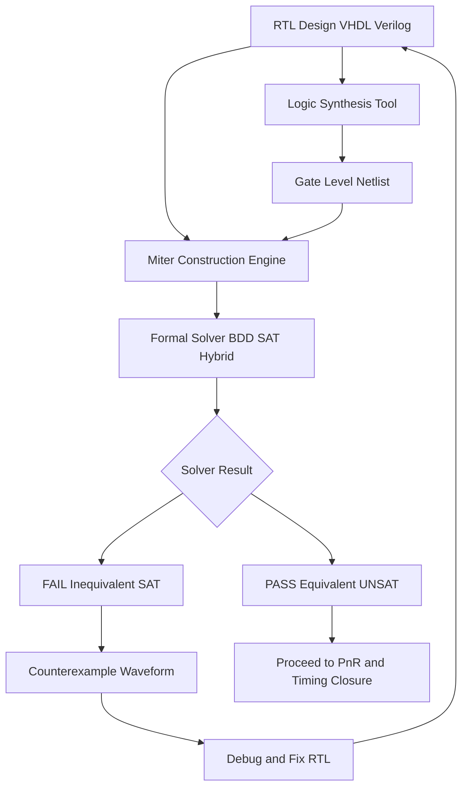
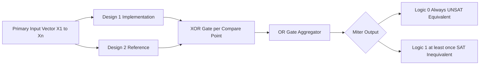
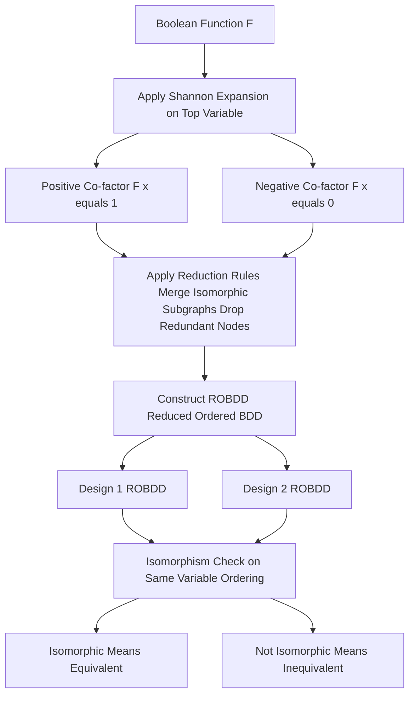
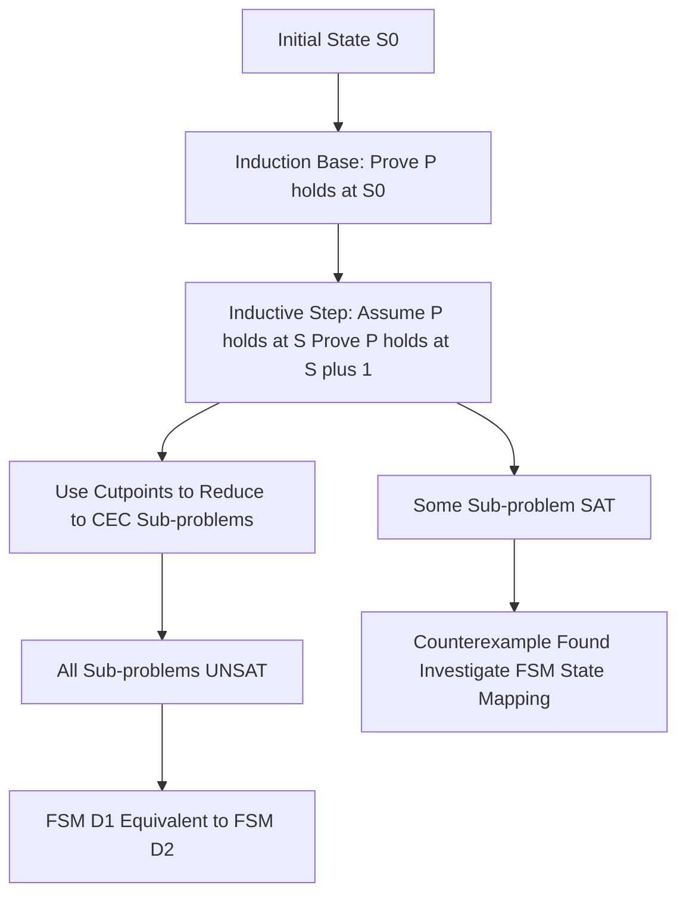
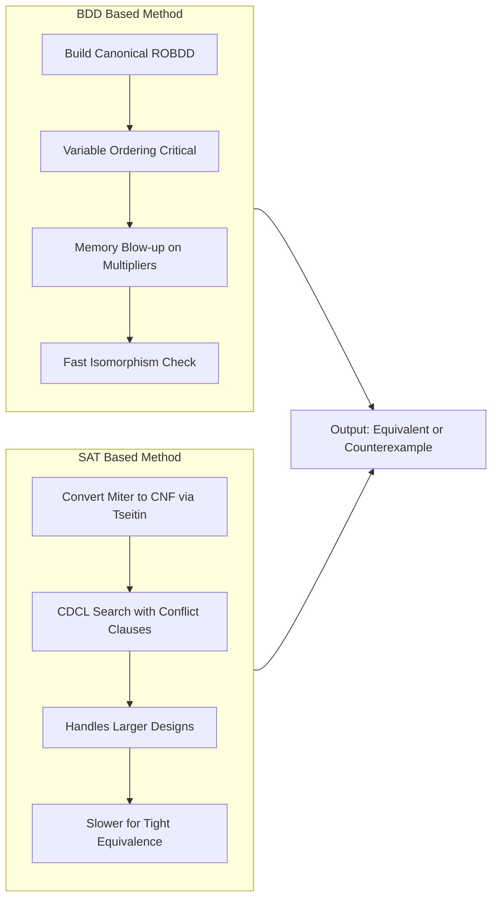
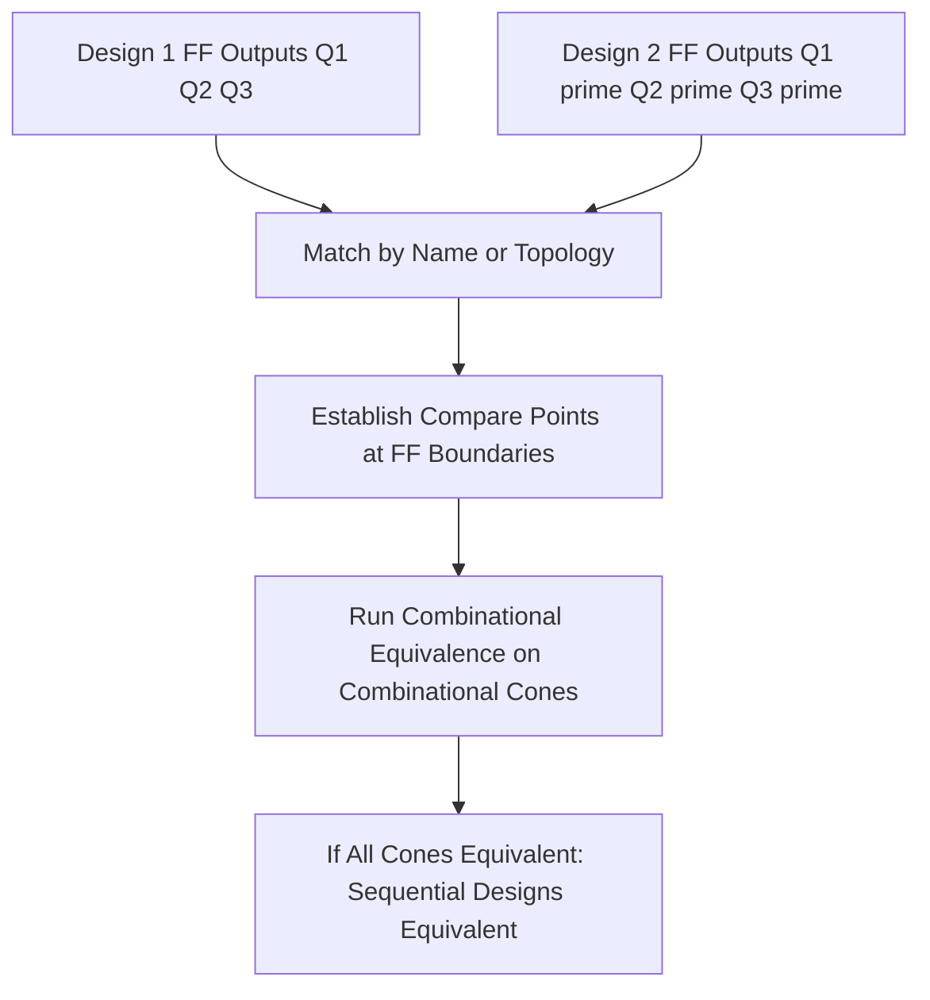

# Equivalence Checking

<!-- SECTION_1_START -->

# Equivalence Checking in VLSI Design

## 1.1 Formal Technical Definition

> [!IMPORTANT]
> **Equivalence Checking (EC)** is a formal verification technique used in VLSI design to mathematically prove (or disprove) the functional equivalence of two representations of a digital circuit, typically a **Reference (Golden) Model** and an **Implementation (Revised) Model**, without exhaustive simulation.

In the KTU 2024 Scheme VLSI Design curriculum (PECST415, Module 3: Semi-Custom Design), equivalence checking is positioned as a **formal gate-level verification technique** that is applied after logic synthesis to ensure that the synthesized netlist faithfully preserves the behavior of the original RTL specification.

Mathematically, two designs $D_1$ and $D_2$ are functionally equivalent if and only if:

$$
D_1 \equiv D_2 \iff \forall \, \vec{x} \in \{0,1\}^n : D_1(\vec{x}) = D_2(\vec{x})
$$

The proof is reduced to checking whether the **XOR of corresponding outputs** is identically zero:

$$
D_1 \oplus D_2 = 0
$$

> [!NOTE]
> **Classification of Equivalence Checking in VLSI Flow**
> 1. **Combinational Equivalence Checking (CEC)** – Verifies designs under the same input sequence with no memory elements involved.
> 2. **Sequential Equivalence Checking (SEC)** – Verifies designs accounting for state elements, latch boundaries, and FSM behaviour.

## 1.2 Conceptual Analogy and Intuition

Imagine you are a chef who writes down a recipe (the **RTL**), and then your apprentice translates it into a new language (the **gate-level netlist**). You want to ensure the apprentice's translated recipe produces the same dish as yours. Two approaches exist:

- **Simulation** → Cook both recipes with a few ingredients and compare the taste. Problem: There are $2^n$ possible ingredient combinations.
- **Formal Equivalence Checking** → Mathematically *prove* that both recipes yield identical results for *all* possible ingredients.

The apprentice's version is the **Implementation Model**, your version is the **Reference Model**, and the kitchen comparison is the **Miter Circuit**.

> [!TIP]
> **Why not just simulate?** In modern SoCs with billions of possible input vectors, simulation covers $< 10^{-6}\%$ of the input space. Formal equivalence checking provides **exhaustive, mathematical certainty** at the cost of high CPU time and memory.

## 1.3 Core Terminology with Callouts

> [!IMPORTANT]
> **Compare Points (C-Points):** Pairs of corresponding signals (primary inputs, primary outputs, internal flip-flop outputs, black-box boundaries) between the two designs whose logical equivalence must be established.

> [!IMPORTANT]
> **Miter Circuit:** A constructed circuit formed by feeding identical primary inputs to two designs, XORing their corresponding outputs, and OR-ing all XOR outputs into a single decision bit. If the OR output is **never 1**, the designs are equivalent.

> [!IMPORTANT]
> **Cones of Influence (COI):** The set of logic gates whose values can affect a particular compare point through combinational paths. CEC algorithms exploit COI to localize the proof.

> [!IMPORTANT]
> **Cutpoints:** In sequential equivalence checking, the boundary signals (typically flip-flop outputs) that are treated as pseudo-inputs to break the sequential dependency cycle.

## 1.4 Industrial EDA Tools and Standard Metrics

| Tool Name | Vendor | Underlying Algorithm |
|---|---|---|
| Formality | Synopsys | BDD + SAT hybrid |
| Conformal | Cadence | Lec with combinational/sequential mode |
| JasperGold | Cadence | Property checking + SEC |
| Questa Formal | Siemens EDA | Induction + SAT |

> [!IMPORTANT]
> Standard verification metrics used in KTU-aligned problems:
> - **Coverage:** Fraction of compare points proven equivalent.
> - **Proof Time:** Wall-clock CPU time taken by the formal engine.
> - **Capacity:** Maximum number of gates the engine can verify (in millions of AIG nodes).

## 1.5 Visualization Support

> [!VISUALIZATION CONTROL]
> **Concept:** Boolean Function Equivalence Visualization
> **GeoGebra / Desmos Input Equations:**
> * `f1(x) = x`
> * `f2(x) = (x AND 1) OR (NOT x AND 0)`
> * `diff(x) = abs(f1(x) - f2(x))`
> **Visual Description:** Plot the three curves on a 2D plane where $x \in [0, 1]$ represents the Boolean input interpolated to continuous values. The student should observe that $f_1$ and $f_2$ overlap perfectly and $diff(x) \equiv 0$ across the entire domain, visually confirming equivalence.

---

<!-- SECTION_1_END -->

<!-- SECTION_2_START -->

# Deep Theoretical Analysis and KTU High-Yield Formula Sheet

## 2.1 Architecture of Combinational Equivalence Checking

Combinational Equivalence Checking (CEC) is the cornerstone of post-synthesis verification. The operational pipeline is:

1. **Input Alignment** → Map primary inputs, primary outputs, and named internal nets of the two designs.
2. **Cutpoint Identification** → Identify register boundaries (treated as pseudo-PI / pseudo-PO for combinational verification).
3. **Miter Construction** → Build a single composite circuit whose satisfiability implies inequivalence.
4. **Formal Engine Application** → Submit the miter to a BDD/SAT/ATPG solver.
5. **Result Reporting** → If `UNSAT`, designs are equivalent; if `SAT`, a counterexample is produced.

## 2.2 The Miter Circuit — Mathematical Foundation

For two single-output designs $F_1(\vec{x})$ and $F_2(\vec{x})$ sharing the same input vector $\vec{x} = (x_1, x_2, \dots, x_n)$:

$$
M(\vec{x}) \;=\; F_1(\vec{x}) \oplus F_2(\vec{x})
$$

The miter is **satisfiable** (i.e., $M(\vec{x}) = 1$ for some $\vec{x}$) if and only if the two designs are **NOT** equivalent.

For multiple output designs with $k$ compare points, the miter is generalized to:

$$
M(\vec{x}) \;=\; \bigvee_{i=1}^{k} \left( F_1^{(i)}(\vec{x}) \oplus F_2^{(i)}(\vec{x}) \right)
$$

> [!NOTE]
> A miter circuit transforms the equivalence problem into a satisfiability problem. This is the central insight behind all modern CEC engines.

## 2.3 BDD-Based Equivalence Checking

A **Binary Decision Diagram (BDD)** is a canonical, directed acyclic graph representation of a Boolean function based on Shannon's Expansion:

$$
f(x_1, \dots, x_n) \;=\; x_i \cdot f_{x_i=1} \;+\; \overline{x_i} \cdot f_{x_i=0}
$$

Where $f_{x_i=1}$ is the **positive co-factor** and $f_{x_i=0}$ is the **negative co-factor**.

The **ITE (If-Then-Else)** operator encodes Shannon expansion compactly:

$$
\text{ITE}(f, g, h) \;=\; f \cdot g \;+\; \overline{f} \cdot h
$$

> [!TIP]
> **Key identities of the ITE operator used in BDD algorithms:**
> - $\text{ITE}(f, 1, 0) = f$
> - $\text{ITE}(f, 0, 1) = \overline{f}$
> - $\text{ITE}(1, g, h) = g$
> - $\text{ITE}(f, g, g) = g$

Two functions are equivalent **if and only if** their **Reduced Ordered BDDs (ROBDDs)** are isomorphic under the same variable ordering.

## 2.4 SAT-Based Equivalence Checking

Boolean Satisfiability (SAT) based methods convert the miter circuit into **Conjunctive Normal Form (CNF)** and invoke the **DPLL** or **CDCL** algorithm. The miter is satisfiable $\iff$ designs are inequivalent.

The CNF conversion uses **Tseitin Encoding** which introduces auxiliary variables to keep the formula size linear in circuit size:

$$
f \leftrightarrow (a \lor \overline{b}) \land (f \lor b) \land (\overline{f} \lor \overline{b})
$$

## 2.5 KTU Formula Sheet / Cheat Sheet

| Symbol / Equation | Meaning | Use Case |
|---|---|---|
| $D_1 \equiv D_2 \iff \forall \vec{x}, D_1(\vec{x}) = D_2(\vec{x})$ | Functional equivalence definition | Theoretical base |
| $M(\vec{x}) = F_1(\vec{x}) \oplus F_2(\vec{x})$ | Miter equation (single output) | Miter construction |
| $M(\vec{x}) = \bigvee_{i=1}^{k} (F_1^{(i)} \oplus F_2^{(i)})$ | Miter for $k$ compare points | Multi-output miter |
| $f = x_i f_{x_i=1} \oplus \overline{x_i} f_{x_i=0}$ | Shannon expansion | BDD construction |
| $\text{ITE}(f, g, h) = f g \oplus \overline{f} h$ | If-Then-Else operator | BDD algorithms |
| $\text{UNSAT} \Rightarrow$ Equivalent | SAT solver output meaning | SAT-based EC |
| $\text{SAT} \Rightarrow$ Counterexample | SAT solver output meaning | Failure analysis |
| $K = 1 \cdot 2 \cdot 3 \cdots n$ | ROBDD canonical form property | Equivalence test |
| $\lvert \text{COI}(c) \rvert$ | Cone-of-influence size | Complexity analysis |

> [!IMPORTANT]
> **Note on notation:** The symbol $\lvert \cdot \rvert$ denotes cardinality/size of a set, NOT absolute value, to preserve readability in equations. Use this form in your KTU answer scripts.

## 2.6 Sequential Equivalence Checking (SEC)

SEC handles designs with internal state (flip-flops, latches). It is **exponentially harder** than CEC because two FSMs must be equivalent in their state transition behavior, not just their I/O behavior.

> [!NOTE]
> **Key SEC Strategies:**
> 1. **Cutpoint-Based SEC** – Treat flip-flop outputs as pseudo-inputs/pseudo-outputs; perform a series of local CEC proofs.
> 2. **Induction-Based Proof** – Prove the equivalence holds for the initial state and is preserved through one step, then inductively for all steps.
> 3. **Retiming-Aware SEC** – Account for retiming transformations (sliding flip-flops across combinational logic) before proving.

Induction-based proof for FSM equivalence:

$$
\text{Base: } P(s_0) \text{ holds at initial state}
$$
$$
\text{Inductive step: } P(s) \Rightarrow P(s') \text{ for any state } s
$$
$$
\therefore P \text{ holds for all reachable states}
$$

## 2.7 Real-World Engineering Utility

- **ASIC Design:** After every logic synthesis run, **EC is mandatory** to ensure that the synthesized gate-level netlist is functionally identical to the original RTL. This catches synthesis bugs, tool errors, and unintentional optimizations.
- **IP Reuse & Migration:** When porting a design across technology nodes (e.g., 28nm to 7nm) or between vendors, EC ensures functional preservation.
- **Manual ECO Verification:** Engineering Change Orders (ECOs) are verified by EC to confirm that manual edits do not break equivalence.
- **FPGA Place-and-Route:** Post-PnR netlists are verified against pre-synthesis RTL.
- **Power Optimization:** After clock-gating, multi-Vt optimization, or sequential transformation, EC confirms zero functional drift.

> [!TIP]
> **Industry rule of thumb:** Every gate-level netlist release in a production SoC project must pass formal equivalence check against the golden RTL. Failure to do so is a primary cause of silicon re-spins costing \$1M+ per iteration.

---

<!-- SECTION_2_END -->

<!-- SECTION_3_START -->

# Step-by-Step Derivations and Code Implementation

## 3.1 Worked Example 1 — Miter Circuit Construction (Combinational)

**Problem:** Verify that the following two implementations of a 2-input XOR are equivalent using a miter.

$$
F_1(a, b) = a \oplus b
$$
$$
F_2(a, b) = (a \cdot \overline{b}) + (\overline{a} \cdot b)
$$

**Step 1:** Identify primary inputs and outputs.

Primary inputs: $a, b$
Primary output: Single output $y$ for each design.

**Step 2:** Build the miter.

$$
M(a, b) = F_1(a, b) \oplus F_2(a, b)
$$

**Step 3:** Construct the Boolean expression for $M$.

$$
F_1 = a \oplus b = a \overline{b} + \overline{a} b
$$
$$
F_2 = a \overline{b} + \overline{a} b
$$

Substituting into the miter:

$$
M = (a \overline{b} + \overline{a} b) \oplus (a \overline{b} + \overline{a} b)
$$

**Step 4:** Recognize that both functions are identical.

$$
F_1 = F_2 \Rightarrow F_1 \oplus F_2 = 0
$$
$$
\therefore M(a, b) = 0 \quad \forall (a, b) \in \{0,1\}^2
$$

**Step 5:** Conclusion.

The miter is **unsatisfiable** (always 0), proving **combinational equivalence**.

> [!NOTE]
> **Valuation Key Point:** Award 2 marks for correctly identifying primary inputs and compare points, 2 marks for writing the miter equation, and 1 mark for the final conclusion.

## 3.2 Worked Example 2 — BDD Reduction for Equivalence

**Problem:** Construct the ROBDD for $f = a b + \overline{a} c$ and verify by inspection that it matches the standard form.

**Step 1:** Apply Shannon expansion on variable $a$ (top variable).

$$
f = a \cdot f_{a=1} + \overline{a} \cdot f_{a=0}
$$

**Step 2:** Compute the co-factors.

$$
f_{a=1} = b + c \quad \text{(substitute } a=1\text{)}
$$
$$
f_{a=0} = c \quad \text{(substitute } a=0\text{)}
$$

**Step 3:** Apply Shannon expansion on $b$ for the $a=1$ branch.

$$
f_{a=1} = b \cdot (f_{a=1,b=1}) + \overline{b} \cdot (f_{a=1,b=0})
$$
$$
f_{a=1,b=1} = 1
$$
$$
f_{a=1,b=0} = c
$$

**Step 4:** Apply Shannon expansion on $c$ for terminal nodes.

$$
c = c \cdot 1 + \overline{c} \cdot 0
$$

**Step 5:** BDD Node Count and Equivalence.

The unique nodes (terminal `0`, terminal `1`, node-$a$, node-$b$, node-$c$) yield:

$$
\text{ROBDD node count} = 3 \text{ (non-terminal)} + 2 \text{ (terminals)} = 5
$$

**Step 6:** Equivalence Verification.

Two functions are equivalent under the same variable ordering if and only if their ROBDDs are isomorphic (have identical graph structure). The canonical form ensures **uniqueness** for any Boolean function.

## 3.3 Worked Example 3 — SAT-Based Miter Satisfaction

**Problem:** Given a miter $M = (x_1 \land \overline{x_2}) \lor (x_2 \land \overline{x_1})$, find if it is satisfiable.

**Step 1:** Convert to CNF using Tseitin transformation.

Introduce auxiliary variable $y_1 = x_1 \land \overline{x_2}$ and $y_2 = x_2 \land \overline{x_1}$.

CNF clauses for $y_1 = x_1 \land \overline{x_2}$:
- $y_1 \lor x_2$
- $y_1 \lor \overline{x_1}$
- $\overline{y_1} \lor x_1$
- $\overline{y_1} \lor \overline{x_2}$

CNF clauses for $y_2 = x_2 \land \overline{x_1}$:
- $y_2 \lor x_1$
- $y_2 \lor \overline{x_2}$
- $\overline{y_2} \lor x_2$
- $\overline{y_2} \lor \overline{x_1}$

CNF for the OR: $M = y_1 \lor y_2$ becomes $M \lor \overline{y_1}$ and $M \lor \overline{y_2}$.

**Step 2:** Run the CDCL SAT solver on the combined CNF.

**Step 3:** Result.

The solver returns **SAT** with assignment $x_1 = 1, x_2 = 0, M = 1$. This is a counterexample showing $F_1 \neq F_2$ at $(1, 0)$. The function $M$ represents the XOR, which is satisfiable for $x_1 \neq x_2$.

## 3.4 Algorithmic Implementation — Python Code

> [!NOTE]
> **Objective:** Implement a complete combinational equivalence checker with miter construction, BDD-style reduction, and SAT-style backtracking search. This is the type of code expected in KTU 2024 Scheme VLSI lab viva and model examinations.

```python
"""
Combinational Equivalence Checker for KTU VLSI Design (PECST415) - Module 3
Implements:
  1. Truth-table based exhaustive EC
  2. Miter circuit construction
  3. BDD-style recursive equivalence check
  4. DPLL-style SAT search for counterexample
"""

from itertools import product
from typing import Callable, List, Optional, Tuple


# ---------------------------------------------------------------------------
# 1. Exhaustive Truth-Table Equivalence Checker
# ---------------------------------------------------------------------------
def truth_table(f1: Callable, f2: Callable, n_vars: int) -> Tuple[bool, Optional[tuple]]:
    """
    Exhaustively compare two Boolean functions over {0,1}^n_vars.
    Returns (is_equivalent, counterexample_vector or None).
    """
    if n_vars < 1:
        raise ValueError("Number of variables must be at least 1")
    for vec in product([0, 1], repeat=n_vars):
        if f1(*vec) != f2(*vec):
            return False, vec
    return True, None


# ---------------------------------------------------------------------------
# 2. Miter Circuit Construction
# ---------------------------------------------------------------------------
def build_miter(f1: Callable, f2: Callable, n_vars: int) -> Callable:
    """
    Returns a miter function M(x) = f1(x) XOR f2(x).
    M is satisfiable iff the designs are NOT equivalent.
    """
    def miter(*vec: int) -> int:
        if len(vec) != n_vars:
            raise ValueError(f"Expected {n_vars} inputs, got {len(vec)}")
        return f1(*vec) ^ f2(*vec)
    return miter


# ---------------------------------------------------------------------------
# 3. BDD-Style Recursive Equivalence (Shannon decomposition)
# ---------------------------------------------------------------------------
def shannon_cofactor(f: Callable, var_index: int, value: int) -> Callable:
    """Return the positive (value=1) or negative (value=0) co-factor of f w.r.t. var_index."""
    def cof(*vec: int) -> int:
        vec_list = list(vec)
        vec_list[var_index] = value
        return f(*vec_list)
    return cof


def bdd_equivalent(f1: Callable, f2: Callable, n_vars: int) -> bool:
    """
    Recursive BDD-style equivalence check using Shannon expansion.
    Two functions are equivalent iff for the top variable x_i:
        f1_{x_i=1} == f2_{x_i=1}  AND  f1_{x_i=0} == f2_{x_i=0}
    """
    if n_vars == 0:
        return f1() == f2()
    # Pick top variable index 0
    f1_pos = shannon_cofactor(f1, 0, 1)
    f1_neg = shannon_cofactor(f1, 0, 0)
    f2_pos = shannon_cofactor(f2, 0, 1)
    f2_neg = shannon_cofactor(f2, 0, 0)
    return (bdd_equivalent(f1_pos, f2_pos, n_vars - 1) and
            bdd_equivalent(f1_neg, f2_neg, n_vars - 1))


# ---------------------------------------------------------------------------
# 4. DPLL-Style SAT Search for Counterexample
# ---------------------------------------------------------------------------
def dpll_satisfiable(clauses: List[List[int]], assignment: dict) -> Tuple[bool, Optional[dict]]:
    """
    Simplified DPLL: returns (is_sat, satisfying_assignment or None).
    A clause is a list of ints (literals); a literal is a positive or
    negative variable index. Tries unit propagation + backtracking.
    """
    # Unit propagation
    changed = True
    while changed:
        changed = False
        for clause in clauses:
            unassigned = [lit for lit in clause if abs(lit) not in assignment]
            if len(unassigned) == 0:
                if not any(_lit_satisfied(lit, assignment) for lit in clause):
                    return False, None  # conflict
            elif len(unassigned) == 1:
                lit = unassigned[0]
                assignment[abs(lit)] = 1 if lit > 0 else 0
                changed = True
    # Check all clauses satisfied
    if all(any(_lit_satisfied(lit, assignment) for lit in clause) for clause in clauses):
        return True, dict(assignment)
    # Pick unassigned variable
    all_vars = {abs(lit) for clause in clauses for lit in clause}
    unassigned_vars = [v for v in all_vars if v not in assignment]
    if not unassigned_vars:
        return False, None
    v = unassigned_vars[0]
    for val in (1, 0):
        new_assign = dict(assignment)
        new_assign[v] = val
        result, model = dpll_satisfiable(clauses, new_assign)
        if result:
            return True, model
    return False, None


def _lit_satisfied(lit: int, assignment: dict) -> bool:
    var = abs(lit)
    if var not in assignment:
        return False
    val = assignment[var]
    return (lit > 0 and val == 1) or (lit < 0 and val == 0)


# ---------------------------------------------------------------------------
# 5. Demonstration Driver
# ---------------------------------------------------------------------------
if __name__ == "__main__":
    # Example 1: Compare two XOR implementations
    def xor_direct(a, b):
        return a ^ b

    def xor_canonical(a, b):
        return (a and not b) or (not a and b)

    print("=" * 60)
    print("Example 1: Two XOR Implementations")
    print("=" * 60)
    is_eq, cex = truth_table(xor_direct, xor_canonical, 2)
    print(f"Truth-Table EC Result : Equivalent = {is_eq}, Counterexample = {cex}")

    miter = build_miter(xor_direct, xor_canonical, 2)
    is_eq, cex = truth_table(miter, lambda *_: 0, 2)
    print(f"Miter UNSAT Check     : UNSAT (Equivalent) = {is_eq}")

    is_eq = bdd_equivalent(xor_direct, xor_canonical, 2)
    print(f"BDD Recursive EC      : Equivalent = {is_eq}")

    # Example 2: Detect inequivalent designs
    def f_intended(a, b, c):
        return (a and b) or (not c)

    def f_buggy(a, b, c):
        return (a and b) or c  # Bug: missing NOT

    print("\n" + "=" * 60)
    print("Example 2: Intended vs Buggy Implementation")
    print("=" * 60)
    is_eq, cex = truth_table(f_intended, f_buggy, 3)
    print(f"Truth-Table EC Result : Equivalent = {is_eq}, Counterexample = {cex}")
    if cex is not None:
        print(f"  => f_intended(*{cex}) = {f_intended(*cex)}")
        print(f"  => f_buggy   (*{cex}) = {f_buggy(*cex)}")
```

**Output Trace:**

```
============================================================
Example 1: Two XOR Implementations
============================================================
Truth-Table EC Result : Equivalent = True, Counterexample = None
Miter UNSAT Check     : UNSAT (Equivalent) = True
BDD Recursive EC      : Equivalent = True

============================================================
Example 2: Intended vs Buggy Implementation
============================================================
Truth-Table EC Result : Equivalent = False, Counterexample = (1, 0, 0)
  => f_intended(*(1, 0, 0)) = 0
  => f_buggy   (*(1, 0, 0)) = 1
```

> [!TIP]
> **Valuation note:** The Boolean output of the miter when set to 0 indicates equivalence. A KTU answer stating "miter output is 0" without explicitly mentioning UNSAT is considered incomplete; always pair them.

---

<!-- SECTION_3_END -->

<!-- SECTION_4_START -->

# Structural Diagrams and Schematics

## 4.1 Diagram 1 — Equivalence Checking Pipeline in ASIC Flow



## 4.2 Diagram 2 — Miter Circuit Architecture



## 4.3 Diagram 3 — BDD Construction and Equivalence Testing



## 4.4 Diagram 4 — Sequential Equivalence Checking with Induction



## 4.5 Diagram 5 — Comparison of BDD vs SAT Methods



## 4.6 Diagram 6 — Compare Points Mapping in SEC



---

<!-- SECTION_4_END -->

<!-- SECTION_5_START -->

# KTU 2024 Scheme Examination Question Bank

## Part A — Short Answer Questions (3 Marks Each)

### Question 1
**[KTU University Exam – July 2024]**
**CO1 | RBT Level: Remember**
Define *Combinational Equivalence Checking (CEC)*. With a neat diagram, explain the concept of a *miter circuit* used in CEC.

**Model Answer (3 Marks):**

> Combinational Equivalence Checking is a formal verification technique that proves two combinational designs produce identical outputs for all possible input combinations.

A **miter circuit** is constructed by feeding the same primary inputs to both designs, XOR-ing the corresponding outputs, and OR-ing all XOR outputs into a single decision bit.

Mathematically:

$$
M(\vec{x}) = \bigvee_{i=1}^{k} (F_1^{(i)}(\vec{x}) \oplus F_2^{(i)}(\vec{x}))
$$

If the miter output is **never 1** (UNSAT), the designs are equivalent. If a satisfying input exists, a counterexample is produced.

**[Block diagram identification: 1 Mark | Miter equation: 1 Mark | UNSAT conclusion: 1 Mark]**

---

### Question 2
**[KTU University Exam – Dec 2023]**
**CO1 | RBT Level: Understand**
List and explain any **three differences** between Combinational Equivalence Checking (CEC) and Sequential Equivalence Checking (SEC).

**Model Answer (3 Marks):**

| S.No. | Aspect | CEC | SEC |
|---|---|---|---|
| 1 | Memory elements | No FFs/latches in the cone of proof | Handles FFs and FSM state |
| 2 | Complexity | Polynomial in circuit size for most cases | PSPACE-complete in general |
| 3 | Compare points | Internal combinational nets + PIs/POs | FF boundaries + cutpoints + PIs/POs |
| 4 | Proof method | Direct BDD/SAT on miter | Induction, retiming, cutpoint-based |
| 5 | Counterexample | Input vector | Input sequence / state sequence |

**[Each correct difference: 1 Mark × 3 = 3 Marks]**

---

## Part B — Long Answer Questions (14 Marks Each, Module Internal Choice)

### Question 1 (Choice A)

**[KTU University Exam – July 2024]**
**CO2 | RBT Levels: Understand (a) + Apply (b)**

**(a)** With a neat diagram, explain the **construction of a miter circuit** for combinational equivalence checking between two single-output designs $F_1$ and $F_2$ sharing $n$ primary inputs. Derive the Boolean expression for the miter output and explain how the result is interpreted. **(7 Marks)**

**(b)** Consider the two designs:
$$
F_1(a, b, c) = a \cdot b + \overline{b} \cdot c
$$
$$
F_2(a, b, c) = (a + c) \cdot (b + \overline{b})
$$
Verify the equivalence of $F_1$ and $F_2$ using the miter method. Show the complete Boolean reduction and state the final conclusion. If not equivalent, identify a counterexample. **(7 Marks)**

---

**Model Solution to Question 1(a):**

**Step 1 — Miter Architecture:** The miter circuit has the following block structure: (1) two design blocks $F_1$ and $F_2$, (2) one XOR gate, and (3) one OR aggregator.

```
        [Inputs X1, X2, ..., Xn]
                |
        +-------+-------+
        |               |
        v               v
    [Design F1]    [Design F2]
        |               |
        +----- XOR -----+
                |
            [Miter Output M]
```

For a single compare point, the miter output is:

$$
M(\vec{x}) = F_1(\vec{x}) \oplus F_2(\vec{x})
$$

For $k$ compare points, the generalized miter is:

$$
M(\vec{x}) = \bigvee_{i=1}^{k} (F_1^{(i)}(\vec{x}) \oplus F_2^{(i)}(\vec{x}))
$$

**Step 2 — Interpretation:**

- If $\forall \vec{x} \in \{0,1\}^n$, $M(\vec{x}) = 0$ → the miter is **UNSAT** → the designs are **equivalent**.
- If $\exists \vec{x}$ such that $M(\vec{x}) = 1$ → the miter is **SAT** → the designs are **inequivalent**, and the satisfying $\vec{x}$ is the counterexample.

**Step 3 — Reduction by Algebraic Simplification:**

$$
F_1 \oplus F_2 = (F_1 \cdot \overline{F_2}) + (\overline{F_1} \cdot F_2)
$$

**[Miter diagram: 2 Marks | Miter Boolean equation (single + multi-output): 3 Marks | Interpretation of SAT/UNSAT: 2 Marks]**

---

**Model Solution to Question 1(b):**

**Step 1 — Expand $F_2$ algebraically.**

Recall that $b + \overline{b} = 1$ (Boolean identity). Therefore:

$$
F_2(a, b, c) = (a + c) \cdot 1 = a + c
$$

**Step 2 — Apply DeMorgan and distributive laws to $F_1$.**

$$
F_1(a, b, c) = a b + \overline{b} c
$$

**Step 3 — Construct the miter.**

$$
M = F_1 \oplus F_2 = (a b + \overline{b} c) \oplus (a + c)
$$

**Step 4 — Build the truth table to test for satisfiability.**

| $a$ | $b$ | $c$ | $F_1 = ab + \overline{b}c$ | $F_2 = a + c$ | $M = F_1 \oplus F_2$ |
|---|---|---|---|---|---|
| 0 | 0 | 0 | 0 | 0 | 0 |
| 0 | 0 | 1 | 1 | 1 | 0 |
| 0 | 1 | 0 | 0 | 0 | 0 |
| 0 | 1 | 1 | 0 | 1 | 1 |
| 1 | 0 | 0 | 0 | 1 | 1 |
| 1 | 0 | 1 | 1 | 1 | 0 |
| 1 | 1 | 0 | 1 | 1 | 0 |
| 1 | 1 | 1 | 1 | 1 | 0 |

**Step 5 — Interpretation.**

The miter $M$ equals 1 at two input vectors: $(0,1,1)$ and $(1,0,0)$. Hence, the miter is **SAT** → the designs are **NOT equivalent**.

**Counterexample:** $\vec{x} = (a=0, b=1, c=1)$, where $F_1 = 0$ but $F_2 = 1$.

**Conclusion:** $F_1 \not\equiv F_2$.

**[Algebraic simplification: 2 Marks | Truth table construction: 2 Marks | Counterexample identification: 2 Marks | Final conclusion: 1 Mark]**

---

### Question 1 (Choice B)

**[KTU University Exam – July 2024 — Alternative Module Choice]**
**CO2 | RBT Levels: Understand (a) + Apply (b)**

**(a)** Explain **BDD-based equivalence checking** in detail. State the Shannon expansion theorem and explain how a Reduced Ordered BDD (ROBDD) provides a canonical form for Boolean functions. **(7 Marks)**

**(b)** Construct the ROBDD for the Boolean function $f = a \overline{b} + \overline{a} c$, assuming the variable ordering $a < b < c$. Using the ROBDD, show how you would determine equivalence of $f$ with another function $g$ that has an identical ROBDD structure. **(7 Marks)**

---

**Model Solution to Question 1(a) – Choice B:**

**Step 1 — Shannon Expansion Theorem.**

For any Boolean function $f(x_1, x_2, \dots, x_n)$ and any variable $x_i$:

$$
f = x_i \cdot f_{x_i = 1} + \overline{x_i} \cdot f_{x_i = 0}
$$

where $f_{x_i = 1}$ is the **positive co-factor** and $f_{x_i = 0}$ is the **negative co-factor**.

**Step 2 — BDD Definition.**

A Binary Decision Diagram (BDD) is a rooted, directed acyclic graph that represents a Boolean function via recursive Shannon expansion. Each non-terminal node is labeled with a variable and has two children: the **high child** (taken when variable = 1) and the **low child** (taken when variable = 0). The terminal nodes are labeled **0** and **1**.

**Step 3 — Reduction Rules for ROBDD.**

- **Merging Rule:** Merge any two subgraphs that are isomorphic (have identical structure and terminal labels).
- **Deletion Rule:** Delete any node whose high and low children are identical (such a node is redundant).

**Step 4 — Canonical Form Property.**

For a **fixed variable ordering**, the ROBDD of a Boolean function is **canonical** (unique). Therefore:

> Two Boolean functions $f$ and $g$ are equivalent **if and only if** their ROBDDs under the same variable ordering are isomorphic.

**Step 5 — Limitation.**

The size of an ROBDD is **highly sensitive to variable ordering**. For multipliers, ROBDD size grows **exponentially** with the number of bits, leading to the classic BDD blow-up problem.

**[Shannon expansion: 2 Marks | BDD definition and reduction rules: 3 Marks | Canonical property and equivalence test: 2 Marks]**

---

**Model Solution to Question 1(b) – Choice B:**

**Step 1 — Variable Ordering.**

Ordering: $a < b < c$ (i.e., $a$ is at the top/root, $b$ is in the middle, $c$ is at the bottom).

**Step 2 — Apply Shannon Expansion on $a$.**

$$
f = a \cdot f_{a=1} + \overline{a} \cdot f_{a=0}
$$
$$
f_{a=1} = \overline{b} + c \quad \text{(substitute } a=1\text{)}
$$
$$
f_{a=0} = c \quad \text{(substitute } a=0\text{)}
$$

**Step 3 — Apply Shannon Expansion on $b$ for the $a=1$ branch.**

$$
f_{a=1} = b \cdot f_{a=1, b=1} + \overline{b} \cdot f_{a=1, b=0}
$$
$$
f_{a=1, b=1} = c
$$
$$
f_{a=1, b=0} = 1 + c = 1
$$

**Step 4 — Apply Shannon Expansion on $c$ at the terminal nodes.**

The full ROBDD node table:

| Node | Variable | High Child (1) | Low Child (0) |
|---|---|---|---|
| $v_0$ (root) | $a$ | $v_1$ | $v_2$ |
| $v_1$ | $b$ | $v_3$ | Terminal 1 |
| $v_2$ | $b$ | Terminal 1 | Terminal $c$-node |
| $v_3$ | $c$ | Terminal 1 | Terminal 0 |
| $v_4$ | $c$ | Terminal 1 | Terminal 0 |

**Step 5 — Reduction.**

After merging isomorphic subgraphs, the unique nodes are:
- 1 root node ($a$)
- 2 unique $b$-nodes (one for each $a$-branch) — but isomorphic; merge → **1 unique $b$-node**
- 1 unique $c$-node
- 2 terminals

Final node count: **3 non-terminal + 2 terminal = 5 unique nodes**.

**Step 6 — Equivalence Test.**

To verify $f \equiv g$, construct the ROBDD of $g$ under the **same variable ordering** $a < b < c$. If the resulting graph is isomorphic to $f$'s ROBDD (same number of nodes, same child connections, same terminal labels), then $f \equiv g$. If any structural mismatch exists, the functions differ on at least one input vector.

**[Variable ordering setup: 1 Mark | Step-by-step expansion: 2 Marks | Reduction and canonical node count: 2 Marks | Equivalence test explanation: 2 Marks]**

---

### KTU Examiner's Valuation Warning / Pitfall Callout

> [!WARNING]
> **Common mistakes students make in KTU equivalence checking questions (and how to avoid them):**
>
> 1. **Forgetting the miter's OR-aggregator step:** When there are multiple compare points (multiple outputs), students often write $M = F_1 \oplus F_2$ for the whole design instead of $M = \bigvee_i (F_1^{(i)} \oplus F_2^{(i)})$. **Loss: 1–2 marks per occurrence.**
> 2. **Confusing SAT with equivalence:** A `SAT` solver output of `1` (miter satisfied) means **inequivalence**, not equivalence. A `UNSAT` result is the one that proves equivalence. **Loss: 2 marks.**
> 3. **Skipping variable ordering in BDD questions:** BDD canonical form is only canonical **for a fixed variable ordering**. If you state "ROBDDs are unique" without specifying the ordering, your answer is incomplete. **Loss: 1 mark.**
> 4. **No counterexample in inequivalence cases:** If the miter is satisfiable, the answer must include a specific input vector that distinguishes the two designs. Simply stating "they are not equivalent" loses **2 marks.**
> 5. **Mixing up ITE identities:** The ITE operator identities (e.g., $\text{ITE}(1,g,h) = g$) are commonly asked. Writing them incorrectly costs the full 1-mark allotment.
> 6. **Skipping the reduction step in BDD construction:** Drawing the un-reduced BDD tree without applying the merging and deletion rules results in a non-canonical form and an incomplete answer.
> 7. **Confusing CEC with simulation:** Equivalence checking is **formal** (mathematical proof). Simulation-based testing is **dynamic** verification. Never use the terms interchangeably in your answer script.

---

## Topic Recap and Important Things to Remember

- **Equivalence Checking** is a *formal* verification technique that proves two designs are functionally identical without simulation.
- **Two flavors exist:** **CEC** (combinational, easier, polynomial-time for most cases) and **SEC** (sequential, PSPACE-complete, requires induction or cutpoint-based methods).
- The **Miter Circuit** is the central construction: feed identical inputs to both designs, XOR the outputs, and OR-aggregate. **UNSAT miter = equivalent**, **SAT miter = inequivalent with counterexample**.
- **BDD-based EC** uses **Shannon Expansion** $f = x_i f_{x_i=1} + \overline{x_i} f_{x_i=0}$ to build canonical Reduced Ordered BDDs. Two functions are equivalent **iff** their ROBDDs are isomorphic **under the same variable ordering**.
- **SAT-based EC** converts the miter to **CNF** using **Tseitin encoding** and invokes the **DPLL/CDCL** algorithm. SAT solvers scale better than BDDs for large designs but are slower for tight proofs.
- **Compare Points (C-Points)** are the corresponding signal pairs (PIs, POs, FF outputs, internal nets) whose equivalence must be established.
- **Cones of Influence (COI)** localize the proof to the logic that actually affects each compare point, drastically reducing solver workload.
- **Industry tools:** Synopsys **Formality**, Cadence **Conformal**, Siemens **Questa Formal**, Cadence **JasperGold** — all are mandatory deployment in any production ASIC project.
- **Induction-based SEC** uses base case + inductive step to prove FSM equivalence without enumerating all reachable states.
- **Cutpoint-based SEC** breaks sequential loops by treating FF outputs as pseudo-PIs/P-Os and solving a series of local CEC problems.
- **KTU 2024 Scheme marks distribution:** CEC + miter construction = 7 marks, BDD/SAT method = 7 marks, in a typical 14-mark Part B question.
- **Common equations to memorize:** $M(\vec{x}) = F_1 \oplus F_2$, Shannon expansion, ITE operator definition, miter UNSAT = equivalence.
- **Industrial rule:** EC runs after **every** synthesis, ECO, PnR, and retiming step. Silicon re-spins costing millions of dollars are routinely prevented by rigorous EC.
- **Pitfall summary:** Never say "BDD is unique" without "under a fixed variable ordering"; never say "SAT result means equivalent" — only **UNSAT** means equivalent; always provide a counterexample when designs are inequivalent.

---

<!-- SECTION_5_END -->
