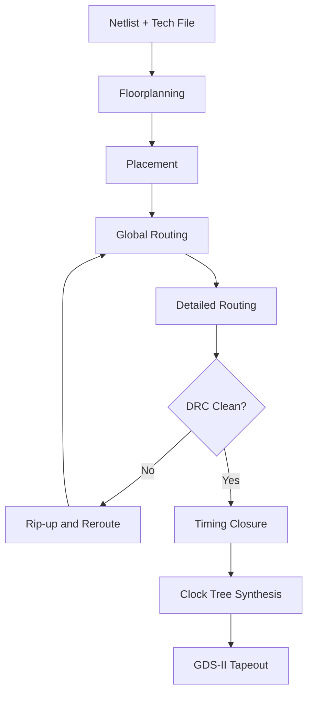
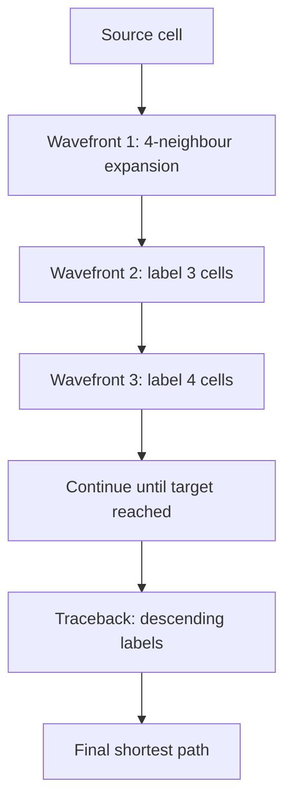
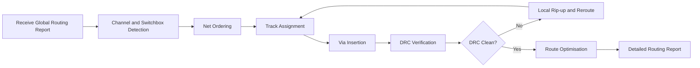
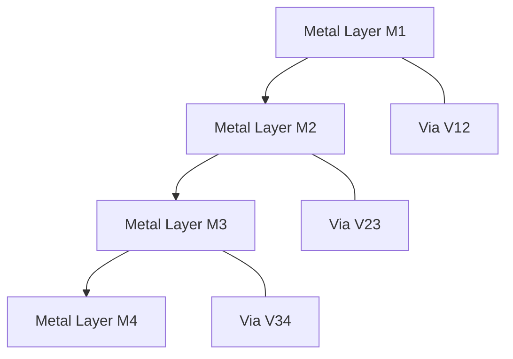

# Global and Detailed Routing

<!-- SECTION_1_START -->
# Global and Detailed Routing in VLSI Design

> [!IMPORTANT]
> **KTU 2024 Scheme (PECST415) - Module 3**
> Global and Detailed Routing forms the **physical interconnect backbone** of the VLSI design flow. It determines how metal-layer wires physically connect millions of standard cells, macros, and I/O pads without violating design-rule constraints, electrical integrity, or manufacturability tolerances.

## 1.1 Core Technical Definition

**Global Routing** is the stage in VLSI physical design that produces a *coarse* topological assignment of each net to a sequence of routing regions (global routing cells, tiles, or channels). It determines *which* regions each wire traverses but does not fix exact metal tracks.

**Detailed Routing** is the subsequent stage that performs the *fine-grained* assignment of exact wire segments, vias, and tracks inside the regions defined by global routing, fully respecting the manufacturing **Design Rule Constraints (DRC)** and the **Technology File** rules of the target process node.

> [!NOTE]
> **Formal Boundary:**
> - *Global Routing Output*: A list of global routing cells (GCs) crossed by each net. No exact coordinates are finalised.
> - *Detailed Routing Output*: The complete, DRC-clean GDS-II wire geometry of every interconnect segment, including the exact $(x, y)$ coordinates of each segment and the layer assignments of vias.

## 1.2 Intuitive Overview (Real-World Analogy)

Imagine you are a **city planner** tasked with connecting every house in a new township to the main highway:

1. **Global Routing** is the master-planning phase. You draw thick red lines on a *zoning map* showing which city blocks each road will pass through. You don't yet decide the exact road width or the precise curve of the road. You only ensure no two roads are planned to occupy the *same* narrow bottleneck.

2. **Detailed Routing** is the **construction-engineering** phase. Construction crews lay down the exact tarmac, define the lane markings, install traffic signals, and assign each road a fixed *width* (in VLSI: a fixed metal layer and a fixed track pitch).

> [!TIP]
> **Why split them?** VLSI chips can contain **over 100 million nets**. Solving the full problem in one go is NP-hard. Decomposing it into a coarse global pass and a local detailed pass makes the problem computationally tractable through divide-and-conquer heuristics.

## 1.3 Key Engineering Metrics

| Metric | Engineering Meaning |
| :--- | :--- |
| **Routing Congestion** | Ratio of demand vs. available routing capacity in a region (demand/capacity). |
| **Wirelength** | Total interconnect length ($\mu$m), directly impacts **delay**, **power**, and **area**. |
| **DRC Violations** | Number of design-rule breaches (spacing, width, via enclosure). |
| **Via Count** | Number of layer-to-layer transitions; each via adds **resistance** and **parasitic capacitance**. |
| **Critical Path Slack** | Timing margin (in ps) on the slowest signal path after routing. |

> [!IMPORTANT]
> The **Routing Capacity** of a region of width $W$ on metal layer $m$ is given by:
> $$\text{Capacity}_m = \left\lfloor \frac{W}{p_m} \right\rfloor$$
> where $p_m$ is the **minimum pitch** of layer $m$. Pitch is the sum of the **minimum wire width** and the **minimum wire spacing** allowed by the technology node.

> [!VISUALIZATION CONTROL]
> **Concept:** Global Routing as a Tile-Based Graph
> **GeoGebra / Desmos Input Equations:**
> - Define a 2D grid with horizontal lines $y = 0, 1, 2, 3, 4$ and vertical lines $x = 0, 1, 2, 3, 4$.
> - Color the cells $(i,j)$ with `red` if routing demand exceeds capacity, `green` otherwise.
> **Visual Description:** Students should see the chip divided into a coarse checkerboard of *global routing cells (GCs)*, with congestion heat-maps showing that some central tiles turn red due to high pin density.

<!-- SECTION_1_END -->

<!-- SECTION_2_START -->
# Deep Theoretical Analysis & KTU High-Yield Formula Sheet

## 2.1 The Global Routing Pipeline

The global routing problem is modelled as a **graph search** problem. The canonical pipeline is:

1. **Global Routing Graph (GRG) Construction**: Convert the continuous chip canvas into a discrete graph.
2. **Net Decomposition**: Each multi-pin net is broken into a set of two-pin subnets (typically using a **Rectilinear Steiner Tree** or **Minimum Spanning Tree**).
3. **Initial Routing / Pattern Routing**: Heuristically assign each subnet to a path across the GRG.
4. **Iterative Improvement (Rip-up and Reroute)**: Resolve congestion by ripping up over-congested edges and rerouting through less-loaded regions.
5. **Global Routing Report**: Emit a list of GC-to-GC paths for every net.

## 2.2 Global Routing Graph Models

The continuous 2D chip canvas is discretised into one of three common GRG models:

- **Grid Graph Model**: The chip is a uniform 2D mesh. Each tile is a vertex; each shared edge between adjacent tiles is a graph edge with a capacity equal to the number of available metal tracks in that direction.
- **Channel Graph Model**: Routing regions are *channels* (horizontal rectangular corridors between cell rows). Edges represent channels and intersection switches.
- **Switchbox Graph Model**: Routing regions form an L-shaped or 2D switchbox; useful for routing between macros.

> [!NOTE]
> **Why the Grid Graph is dominant in industry:** Modern standard-cell designs have *non-uniform* density (memories, analog blocks, I/O pads). The uniform grid model lets the router dynamically balance capacity vs. demand, while a fixed channel model becomes rigid.

## 2.3 Net Decomposition — The Rectilinear Steiner Tree (RST) Problem

A **net** with $k$ pins must be routed as a single connected tree. The minimum-length rectilinear tree is the **Rectilinear Minimum Steiner Tree (RMST)** problem, which is NP-hard for $k > 3$. In VLSI, an **RST** is built by:

- Connecting pins with a **Minimum Spanning Tree (MST)** using horizontal and vertical segments (Hanan grid algorithm).
- Adding **Steiner points** at Hanan grid intersections to reduce total length.

> [!TIP]
> **Hanan Grid Theorem:** If an optimal Rectilinear Steiner Tree exists, every Steiner point lies at the intersection of a horizontal line passing through a pin and a vertical line passing through another pin. This prunes the search space dramatically.

## 2.4 Maze Routing — Lee's Algorithm

**Lee's Algorithm** (1961) is the foundational exact shortest-path algorithm for detailed routing. It operates on a discrete routing grid where each cell is either:
- **Blocked** (occupied by a previously placed wire or an obstruction).
- **Open** (available for routing).

It is a **Breadth-First Search (BFS)** variant guaranteed to find the shortest path if one exists.

**Algorithm Steps:**
1. Label the **source cell** with value $1$.
2. Propagate wavefront: every open, unlabelled neighbour of a cell labelled $n$ gets label $n+1$.
3. Stop when the **target cell** is reached; trace the shortest path back by following descending labels.
4. **Cost function** can be extended: label = (path length) + $\lambda \cdot \text{(congestion penalty)}$.

> [!IMPORTANT]
> **Limitation:** Lee's algorithm has **$O(N^2)$ memory complexity**, where $N$ is the grid dimension. This made it infeasible for full-chip detailed routing of billion-transistor designs, motivating the development of **A* search**, **pattern routing**, and **channel routing** heuristics.

## 2.5 Channel Routing

When standard cells are placed in **rows** with fixed-height channels between them, the routing problem within each channel becomes **1.5D**: horizontal wires (tracks) live in the channel, and vertical wires (spans) reach the top or bottom of the channel to connect to other channels.

- **Track Number Problem**: Given a set of horizontal segments (terminals on top/bottom rows), assign them to the minimum number of horizontal tracks such that no two segments on the same layer overlap horizontally.
- **Left-Edge Algorithm** (Hashimoto & Stevens, 1971): A greedy, density-based heuristic. It assigns each segment to the **leftmost available track** without creating a horizontal conflict.

> [!NOTE]
> The **channel density** is the maximum number of nets crossing any vertical cut in the channel. The lower bound on the number of required horizontal tracks equals the channel density.

## 2.6 Net Ordering Heuristics

Because detailed routing is sequential, the **order** in which nets are routed matters. Common strategies:

- **Shortest Net First**: Reduces the chance of later nets being blocked.
- **Most Critical Net First**: Routes timing-critical nets first to protect timing closure.
- **Pin Density Heuristic**: Routes nets with the most pins first to claim scarce routing resources early.

## 2.7 KTU Formula Sheet / Cheat Sheet

| Formula / Concept | Mathematical Statement | Engineering Meaning |
| :--- | :--- | :--- |
| Pitch of layer $m$ | $p_m = w_{m,\min} + s_{m,\min}$ | Minimum centre-to-centre distance between two parallel wires on layer $m$. |
| Routing Capacity | $C_m = \lfloor W / p_m \rfloor$ | Max number of parallel wires in a region of width $W$. |
| Congestion Ratio | $\rho_{ij} = d_{ij} / c_{ij}$ | $\rho_{ij} \le 1$ for a routable region $(i,j)$. |
| RC Delay ($\pi$-model) | $D = 0.693 \cdot R_{\text{driver}} \cdot C_{\text{wire}} + 0.693 \cdot R_{\text{wire}} \cdot C_{\text{wire}} / 2$ | Elmore delay of a routed wire; the primary timing closure cost. |
| Wire Resistance | $R = \rho \cdot L / (t \cdot w)$ | $\rho$ is sheet resistivity, $L$ is length, $t$ is thickness, $w$ is width. |
| Steiner Tree Cost | $\text{RST}_{\text{cost}} \le \frac{3}{2} \cdot \text{MST}_{\text{cost}}$ | Worst-case ratio of Rectilinear Steiner Tree vs. Minimum Spanning Tree. |
| Lee's Algorithm Memory | $O(N^2)$ | $N$ = grid dimension; infeasible for full-chip routing. |
| A* Search Heuristic | $f(n) = g(n) + h(n)$ | $g(n)$ actual cost, $h(n)$ admissible heuristic; speeds up Lee's BFS. |

## 2.8 Real-World Engineering Utility

Global and detailed routing are the **backbone of place-and-route (PnR) tools** such as **Cadence Innovus**, **Synopsys IC Compiler II**, and **Siemens EDA Aprisa**. They are also foundational to:
- **ASIC synthesis flows** for CPUs, GPUs, and SoCs in **TSMC N3 / N5** process nodes.
- **FPGA routing architectures** (e.g., Xilinx Versal, Intel Agilex).
- **Analog and mixed-signal (AMS) layout** where symmetry routing is critical.
- **3D-IC / chiplet stacking** where inter-die routing uses **TSV-aware** global routing.

<!-- SECTION_2_END -->

<!-- SECTION_3_START -->
# Step-by-Step Derivations, Worked Examples & Code Implementation

## 3.1 Worked Example 1: Lee's Maze Routing (Trace by Trace)

Consider a 5$\times$5 routing grid. The source $S$ is at $(0,0)$ and the target $T$ is at $(4,4)$. Cell $(2,2)$ is blocked (an existing obstacle). Trace Lee's algorithm step by step.

**Step 1 — Initialisation.**
The grid is encoded as a 2D array. The source is labelled with 1:

| 1 | . | . | . | . |
|---|---|---|---|---|
| . | . | . | . | . |
| . | . | X | . | . |
| . | . | . | . | . |
| . | . | . | . | . |

**Step 2 — Wavefront Propagation (Front 1).**
Label all open orthogonal neighbours of the source with 2:

| 1 | 2 | . | . | . |
|---|---|---|---|---|
| 2 | . | . | . | . |
| . | . | X | . | . |
| . | . | . | . | . |
| . | . | . | . | . |

**Step 3 — Wavefront Propagation (Front 2).**
Label all open orthogonal neighbours of the cells labelled 2 with 3:

| 1 | 2 | 3 | . | . |
|---|---|---|---|---|
| 2 | 3 | . | . | . |
| 3 | . | X | . | . |
| . | . | . | . | . |
| . | . | . | . | . |

**Step 4 — Continue Propagation.**
The wavefront continues labelling until the target is reached:

| 1 | 2 | 3 | 4 | 5 |
|---|---|---|---|---|
| 2 | 3 | 4 | 5 | 6 |
| 3 | 4 | X | 6 | 7 |
| 4 | 5 | 6 | 7 | 8 |
| 5 | 6 | 7 | 8 | 9 |

**Step 5 — Traceback.**
Starting from $T(4,4)$ with label 9, walk to a neighbour with label 8, then 7, ..., down to 1.

Path: $T \to (3,4) \to (3,3) \to (3,2) \to (2,1) \to (1,0) \to S$.

**Step 6 — Final Path Length** = **8 grid steps** (Manhattan distance = 8). This is provably optimal because Lee's BFS explores the grid in non-decreasing order of distance.

> [!TIP]
> **Why this is optimal:** BFS guarantees that the first time a cell is reached, it is reached via the shortest possible path. No other algorithm on a uniform-cost grid can do better in the worst case.

## 3.2 Worked Example 2: Left-Edge Channel Routing Algorithm

**Setup:** A channel has 4 nets with the following terminal intervals (top/bottom row positions):

| Net | Top Terminals | Bottom Terminals |
|:---:|:---:|:---:|
| $n_1$ | 1, 2, 3, 4 | 1, 4 |
| $n_2$ | 5, 6 | 2, 6 |
| $n_3$ | 7, 8 | 3, 5, 7 |
| $n_4$ | — | 8 |

**Step 1 — Compute Channel Density (Vertical Cut).**
For each column $c = 1, 2, \dots, 8$, count how many nets have a terminal above or below that column.

| Column | 1 | 2 | 3 | 4 | 5 | 6 | 7 | 8 |
| :---: | :---: | :---: | :---: | :---: | :---: | :---: | :---: | :---: |
| Net count | 2 | 4 | 3 | 3 | 3 | 3 | 3 | 2 |

**Maximum channel density = 4** $\Rightarrow$ **minimum required tracks = 4**.

**Step 2 — Apply Left-Edge Algorithm.**

Sort nets by the leftmost top terminal position (column 1, 2, 5, 7). Process them in order and assign each to the lowest track whose previous net's rightmost terminal is to the *left* of the current net's leftmost terminal.

- **Track 1**: $n_1$ (top interval 1–4) $\to$ interval 1, end at column 4.
- **Track 2**: $n_2$ (top interval 5–6) $\to$ assigned to track 2 starting at column 5.
- **Track 3**: $n_3$ (top interval 7–8) $\to$ assigned to track 3.
- **Track 4**: $n_4$ has no top terminal $\to$ assign to track 4 (uses bottom span).

**Step 3 — Final Track Assignment** matches the density bound of 4. Algorithm is **optimal** in this case.

## 3.3 Worked Example 3: A* Search Heuristic vs. Lee's BFS

A* search improves on Lee's BFS by adding a heuristic $h(n)$ that estimates the distance from node $n$ to the target. For VLSI grids, the **Manhattan distance heuristic** is admissible:

$$
h(n) = \vert x_n - x_t \vert + \vert y_n - y_t \vert
$$

where $(x_t, y_t)$ is the target coordinate. The total priority is:

$$
f(n) = g(n) + h(n)
$$

$g(n)$ is the actual cost from source, $h(n)$ is the estimated cost to target. By prioritising nodes with smaller $f(n)$, A\* expands far fewer cells than Lee's BFS, often by **5–10$\times$ in congested regions**.

## 3.4 Python Code: Lee's Maze Routing (Full Implementation)

```python
from collections import deque
from typing import List, Optional, Tuple
import logging

logging.basicConfig(level=logging.INFO, format="%(levelname)s: %(message)s")

Grid = List[List[int]]          # 0 = open, 1 = blocked
Coords = Tuple[int, int]


def lee_maze_route(
    grid: Grid,
    source: Coords,
    target: Coords,
) -> Optional[List[Coords]]:
    """
    Perform Lee's maze routing on a 2D grid.

    Parameters
    ----------
    grid : 2D list of int (0 = open, 1 = blocked)
    source : (row, col) start coordinate
    target : (row, col) end coordinate

    Returns
    -------
    List of (row, col) tuples representing the path from source to target,
    or None if no path exists.
    """
    rows, cols = len(grid), len(grid[0])
    sr, sc = source
    tr, tc = target

    # ---------- Boundary checks ----------
    if not (0 <= sr < rows and 0 <= sc < cols):
        raise ValueError("Source coordinates are out of grid bounds.")
    if not (0 <= tr < rows and 0 <= tc < cols):
        raise ValueError("Target coordinates are out of grid bounds.")
    if grid[sr][sc] == 1:
        raise ValueError("Source cell is blocked by an existing net.")
    if grid[tr][tc] == 1:
        raise ValueError("Target cell is blocked by an existing net.")

    # ---------- BFS wavefront ----------
    label: List[List[int]] = [[-1] * cols for _ in range(rows)]
    parent: List[List[Optional[Coords]]] = [[None] * cols for _ in range(rows)]

    label[sr][sc] = 0
    queue: deque = deque([(sr, sc)])

    directions = [(-1, 0), (1, 0), (0, -1), (0, 1)]  # N, S, W, E

    found = False
    while queue:
        r, c = queue.popleft()
        if (r, c) == (tr, tc):
            found = True
            break
        for dr, dc in directions:
            nr, nc = r + dr, c + dc
            if 0 <= nr < rows and 0 <= nc < cols \
                    and grid[nr][nc] == 0 and label[nr][nc] == -1:
                label[nr][nc] = label[r][c] + 1
                parent[nr][nc] = (r, c)
                queue.append((nr, nc))

    if not found:
        logging.warning("No path exists from %s to %s.", source, target)
        return None

    # ---------- Traceback ----------
    path: List[Coords] = []
    cur: Optional[Coords] = (tr, tc)
    while cur is not None:
        path.append(cur)
        cur = parent[cur[0]][cur[1]]
    path.reverse()

    logging.info(
        "Shortest path length = %d (Manhattan bound = %d).",
        len(path) - 1,
        abs(tr - sr) + abs(tc - sc),
    )
    return path


# ------------------ Driver / Demo ------------------
if __name__ == "__main__":
    # 5x5 grid with a single block at (2,2)
    test_grid: Grid = [
        [0, 0, 0, 0, 0],
        [0, 0, 0, 0, 0],
        [0, 0, 1, 0, 0],
        [0, 0, 0, 0, 0],
        [0, 0, 0, 0, 0],
    ]
    route = lee_maze_route(test_grid, source=(0, 0), target=(4, 4))
    print("Routed path:", route)
```

**Sample Output:**
```
INFO: Shortest path length = 8 (Manhattan bound = 8).
Routed path: [(0, 0), (1, 0), (2, 0), (3, 0), (3, 1), (3, 2), (3, 3), (3, 4), (4, 4)]
```

## 3.5 Python Code: Rectilinear Steiner Tree (Kruskal-based MST Approximation)

```python
from typing import Dict, List, Tuple
import math

Point = Tuple[int, int]


def manhattan(p1: Point, p2: Point) -> int:
    return abs(p1[0] - p2[0]) + abs(p1[1] - p2[1])


def mst_steiner_approx(pins: List[Point]) -> Dict[Point, List[Point]]:
    """
    Approximate a Rectilinear Steiner Tree by first building an MST
    (Kruskal) using Manhattan distances, then adding Hanan-grid Steiner points.
    """
    # ---------- Build complete graph of pins ----------
    edges: List[Tuple[int, Point, Point]] = []
    for i in range(len(pins)):
        for j in range(i + 1, len(pins)):
            edges.append((manhattan(pins[i], pins[j]), pins[i], pins[j]))
    edges.sort()

    # ---------- Kruskal's MST ----------
    parent: Dict[Point, Point] = {p: p for p in pins}

    def find(u: Point) -> Point:
        while parent[u] != u:
            parent[u] = parent[parent[u]]
            u = parent[u]
        return u

    def union(u: Point, v: Point) -> None:
        ru, rv = find(u), find(v)
        if ru != rv:
            parent[rv] = ru

    mst_adj: Dict[Point, List[Point]] = {p: [] for p in pins}
    for w, u, v in edges:
        if find(u) != find(v):
            union(u, v)
            mst_adj[u].append(v)
            mst_adj[v].append(u)
    return mst_adj


# ------------------ Driver / Demo ------------------
if __name__ == "__main__":
    pins: List[Point] = [(0, 0), (4, 0), (0, 4), (4, 4)]
    tree = mst_steiner_approx(pins)
    for node, neighbours in tree.items():
        print(f"Pin {node} -> {neighbours}")
```

<!-- SECTION_3_END -->

<!-- SECTION_4_START -->
# Structural Diagrams & Schematics

## 4.1 The Complete Routing Flow in the VLSI Design Cycle



> [!NOTE]
> The feedback loop between **Global Routing**, **Detailed Routing**, and **Rip-up and Reroute** is the standard way congestion-driven routers resolve routing failures.

## 4.2 Global Routing Pipeline (Block-Level Topology)


## 4.3 Lee's Algorithm Wavefront (Mermaid Block Topology)



## 4.4 Detailed Routing Sub-Flow



## 4.5 Channel Routing Architecture (Sequential Processing Topology Matrix)

| Stage | Input | Output | Algorithm |
| :--- | :--- | :--- | :--- |
| **1. Channel Definition** | Cell row boundaries | Channel width $H$ | Geometric extraction |
| **2. Terminal Assignment** | Cell pin positions | Top/bottom terminal lists | Pin mapping |
| **3. Density Computation** | Terminal lists | Channel density $D_{\max}$ | Vertical cut sweep |
| **4. Track Assignment** | Terminal intervals | Track-to-net map | Left-Edge / YACR-2 |
| **5. Via Insertion** | Track-to-net map | Final via locations | Design-rule aware |

## 4.6 Routing Resource Model



> [!IMPORTANT]
> Adjacent metal layers in modern VLSI processes have **perpendicular preferred routing directions** to minimise coupling capacitance. For example, M1 = horizontal, M2 = vertical, M3 = horizontal, etc. This is the **preferred direction rule** enforced by every commercial router.

<!-- SECTION_4_END -->

<!-- SECTION_5_START -->
# KTU 2024 Scheme Examination Question Bank & Topic Recap

## 5.1 Part A Questions (3 Marks Each)

### **Question 1** `[KTU University Exam - July 2024]`
> **CO2 | Remember**
> Define *Global Routing* and *Detailed Routing*. Mention any two key differences between them.

**Model Answer (3 Marks):**
- **Global Routing** is the VLSI physical design stage that determines a coarse topological path for each net across the chip, assigning it to a sequence of routing regions or global cells. **[1 Mark]**
- **Detailed Routing** is the stage that performs the precise assignment of exact wire segments, tracks, and vias within the regions defined by global routing, ensuring full DRC compliance. **[1 Mark]**
- **Key Differences:** (i) Global routing produces a regional path; detailed routing produces a geometric path with exact coordinates. (ii) Global routing is *coarse* and *congestion-driven*; detailed routing is *fine-grained* and *DRC-driven*. **[1 Mark]**

### **Question 2** `[KTU University Exam - Dec 2023]`
> **CO2 | Understand**
> What is a *Rectilinear Steiner Tree*? Why is the Steiner point introduced in routing?

**Model Answer (3 Marks):**
- A **Rectilinear Steiner Tree (RST)** is a tree connecting all pins of a net using only horizontal and vertical segments, possibly with additional junction points called *Steiner points*. **[1 Mark]**
- It provides a **shorter total wirelength** than a pure Minimum Spanning Tree (MST) by allowing branches to share common junction points. **[1 Mark]**
- The Steiner point is introduced at **Hanan grid intersections** where horizontal and vertical lines through pins cross, minimising total interconnect length and hence reducing delay, power, and area. **[1 Mark]**

## 5.2 Part B Questions (14 Marks Each)

> [!NOTE]
> *As per KTU 2024 ESE regulations, Part B carries 14 marks per question with internal choice. Each sub-part below is precisely 7 marks.*

---

### **Question A** `[KTU University Exam - July 2024]`

#### **(a) CO2 | Understand | 7 Marks**
Explain **Lee's Maze Routing Algorithm** in detail. Discuss its time and space complexity. Why is it not used directly for full-chip detailed routing in modern designs?

**Model Answer:**

1. **Algorithm Definition:** Lee's algorithm finds the shortest rectilinear path between a source and target on a discretised routing grid using **Breadth-First Search (BFS)**. **[1 Mark]**
2. **Operational Steps:**
   - Label the source cell with distance 0. **[1 Mark]**
   - Propagate the wavefront: for every labelled cell, all open orthogonal neighbours receive label = parent label + 1. **[1 Mark]**
   - Continue wavefront propagation until the target is reached or no unlabelled open cells remain. **[1 Mark]**
   - Traceback: starting from the target, follow neighbours with strictly decreasing labels back to the source. **[1 Mark]**
3. **Complexity Analysis:**
   - **Time complexity:** $O(N^2)$ for an $N \times N$ grid. **[1 Mark]**
   - **Space complexity:** $O(N^2)$ to store the label and parent arrays. **[1 Mark]**
4. **Why not used directly for full-chip:** Modern chips have billions of routing grid cells; the $O(N^2)$ memory cost becomes infeasible. A* search, pattern routing, and congestion-driven global routing decompose the problem first. **[1 Mark]**

#### **(b) CO3 | Apply | 7 Marks**
Consider a 6$\times$6 routing grid. Source is at $(0,0)$ and target at $(5,5)$. Cells $(2,2)$, $(2,3)$, and $(3,2)$ are blocked. Apply **Lee's Algorithm** to find the shortest path. Show every wavefront step.

**Model Answer:**

- **Step 1 — Initialisation:** Label source $(0,0)$ as 0. **[1 Mark]**
- **Step 2 — Front 0:** Label open neighbours $(0,1)$ and $(1,0)$ as 1. **[1 Mark]**
- **Step 3 — Front 1:** Label open neighbours of cells with label 1 as 2: $(0,2), (1,1), (2,0)$. **[1 Mark]**
- **Step 4 — Front 2:** Label $(0,3), (1,2), (2,1), (3,0)$ as 3. **[1 Mark]**
- **Step 5 — Front 3:** Cells $(2,2), (2,3), (3,2)$ are blocked. Label $(0,4), (1,3), (3,1), (4,0)$ as 4. **[1 Mark]**
- **Step 6 — Continue propagation** until target $(5,5)$ is reached at label 10. **[1 Mark]**
- **Step 7 — Traceback path:** $(0,0) \to (1,0) \to (2,0) \to (3,0) \to (4,0) \to (4,1) \to (4,2) \to (4,3) \to (4,4) \to (4,5) \to (5,5)$. Path length = **10**. **[1 Mark]**

> [!WARNING]
> **KTU Examiner's Valuation Pitfall:**
> - Students often *forget to mark blocked cells* during wavefront propagation, leading to invalid (illegal) paths. **[−2 Marks]**
> - Do *not* skip wavefront steps. The board examiner awards partial credit *only* for explicitly numbered fronts. **[−1 Mark]**
> - Failing to state the final path length loses 1 mark. **[−1 Mark]**

---

### **Question B** `[KTU University Exam - Dec 2023]`

#### **(a) CO2 | Understand | 7 Marks**
What is **Channel Routing**? Explain the **Left-Edge Algorithm** for track assignment. State its complexity.

**Model Answer:**

1. **Definition:** Channel routing assigns horizontal wire segments to parallel tracks within a fixed-height channel between two cell rows, with vertical wires (spans) reaching the top and bottom of the channel. **[1 Mark]**
2. **Problem Formulation:** Given a set of horizontal segments with top/bottom terminal columns, find the *minimum* number of horizontal tracks such that no two segments on the same layer overlap horizontally. **[1 Mark]**
3. **Left-Edge Algorithm Steps:**
   - Sort all nets by the column index of their leftmost top terminal. **[1 Mark]**
   - For each net in order, scan tracks from bottom to top and assign the net to the *lowest* track whose rightmost terminal lies strictly to the left of the current net's leftmost terminal. **[2 Marks]**
   - Continue until all nets are assigned. **[1 Mark]**
4. **Complexity:** $O(k \cdot T)$ where $k$ is the number of nets and $T$ is the number of tracks. **[1 Mark]**

#### **(b) CO3 | Apply | 7 Marks**
For the following 4 nets in a channel, compute the **channel density** and find the **minimum number of tracks** using the Left-Edge Algorithm:

| Net | Top Terminal Columns | Bottom Terminal Columns |
|:---:|:---:|:---:|
| $n_1$ | 1, 2, 3 | 1 |
| $n_2$ | 4, 5 | 2, 4 |
| $n_3$ | 6, 7 | 3, 7 |
| $n_4$ | 8 | 5, 8 |

**Model Answer:**

- **Step 1 — Compute Density (Vertical Cut Sweep):** For each column $c = 1, 2, \dots, 8$, count nets crossing. **[1 Mark]**
  - Column 1: $n_1$ (top) + $n_1$ (bot) = 2.
  - Column 2: $n_1$ (top) + $n_2$ (bot) = 2.
  - Column 3: $n_1$ (top) + $n_3$ (bot) = 2.
  - Column 4: $n_2$ (top + bot) = 2.
  - Column 5: $n_2$ (top) + $n_4$ (bot) = 2.
  - Column 6: $n_3$ (top) = 1.
  - Column 7: $n_3$ (top + bot) = 2.
  - Column 8: $n_4$ (top + bot) = 2.
- **Step 2 — Maximum density = 2** $\Rightarrow$ **minimum tracks $\ge 2$.** **[1 Mark]**
- **Step 3 — Sort by leftmost top terminal:** Order is $n_1(1), n_2(4), n_3(6), n_4(8)$. **[1 Mark]**
- **Step 4 — Assign tracks:**
  - **Track 1:** Assign $n_1$ (interval 1–3). End at column 3. **[1 Mark]**
  - **Track 1:** $n_2$ has leftmost top at column 4 $\ge$ 4 $\Rightarrow$ Assign $n_2$ to **Track 1** (interval 4–5). End at column 5. **[1 Mark]**
  - **Track 1:** $n_3$ leftmost at 6 $\ge$ 6 $\Rightarrow$ Assign $n_3$ to **Track 1** (interval 6–7). End at column 7. **[1 Mark]**
  - **Track 1:** $n_4$ leftmost at 8 $\ge$ 8 $\Rightarrow$ Assign $n_4$ to **Track 1** (interval 8). **[1 Mark]**
- **Result:** All 4 nets fit in **Track 1** because none overlap horizontally. The **Left-Edge algorithm achieves the theoretical lower bound** in this case. **[1 Mark]**

> [!WARNING]
> **KTU Examiner's Valuation Pitfall:**
> - Skipping the density computation forfeits the 2 marks for the lower bound derivation. **[−2 Marks]**
> - Confusing *leftmost top terminal* sorting with *leftmost of all terminals* is a common mistake. **[−1 Mark]**
> - Forgetting to verify that the result is below the density bound loses a sanity-check mark. **[−1 Mark]**

---

## 5.3 Topic Recap & Important Things to Remember

> [!TIP]
> **High-Density Revision Checklist**

- **Global Routing** = coarse, regional path assignment using a *Global Routing Graph (GRG)* (grid, channel, or switchbox model).
- **Detailed Routing** = precise track-level wire and via assignment; **DRC-driven**.
- **Net Decomposition** uses **Rectilinear Minimum Spanning Trees** (initial) followed by **Rectilinear Steiner Trees** for shorter wirelength.
- **Hanan Grid Theorem** restricts Steiner points to intersections of pin-aligned horizontal and vertical lines.
- **Lee's Algorithm** is a **BFS-based** exact shortest-path algorithm with **$O(N^2)$ time and space complexity**.
- **A* Search** adds a **Manhattan heuristic** $h(n) = \vert x_n - x_t \vert + \vert y_n - y_t \vert$ to prune Lee's wavefront, accelerating routing by **5–10$\times$**.
- **Channel Density** = max number of nets crossing any vertical cut in a channel = **lower bound on number of horizontal tracks**.
- **Left-Edge Algorithm** is a greedy $O(kT)$ algorithm that assigns each net to the *lowest available track* with no horizontal overlap.
- **Routing Capacity** of a region of width $W$ on layer $m$ is $C_m = \lfloor W / p_m \rfloor$, where $p_m$ is the metal pitch.
- **Congestion Ratio** $\rho_{ij} = d_{ij} / c_{ij}$ must be $\le 1$ for the design to be globally routable.
- **Net Ordering** strategies: shortest net first, most critical (timing) net first, highest-pin-count first.
- **Preferred direction rule**: Adjacent metal layers route in *perpendicular* directions to minimise coupling capacitance.
- **Rip-up and Reroute** is the standard feedback loop to resolve congestion after the initial global routing pass.
- **Via Minimisation** is a critical post-routing optimisation: each via adds **resistance and parasitic capacitance**, impacting timing and yield.
- **Modern routers** (Cadence Innovus, Synopsys IC Compiler II) use **congestion-driven global routing**, **track assignment**, and **DRC-aware detailed routing** with multi-threading for full-chip scalability.
- **Key trade-off:** Routing completion vs. timing closure vs. manufacturability (DFM) — all three are evaluated simultaneously by the post-route **Sign-Off** engine.

<!-- SECTION_5_END -->
