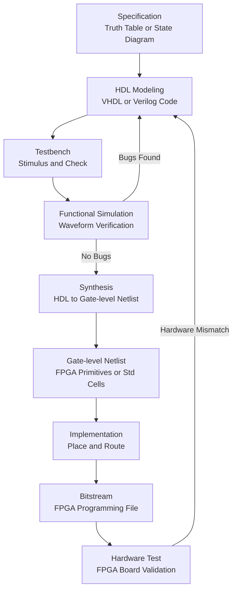
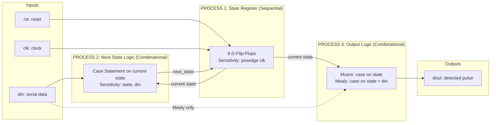
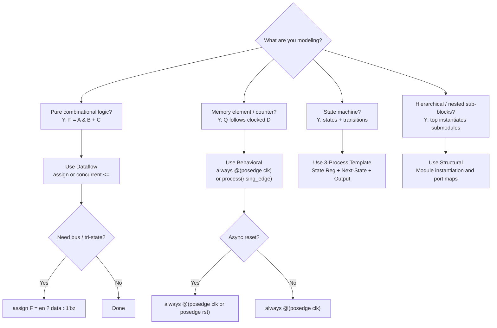
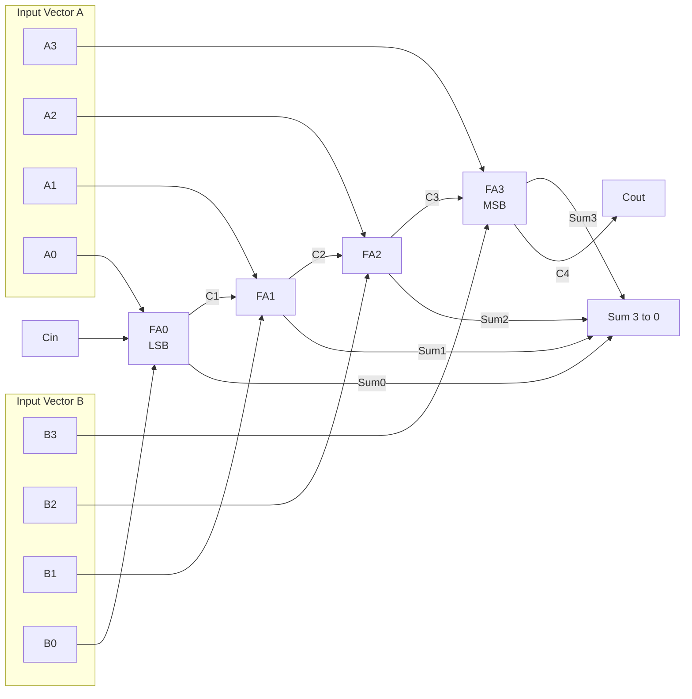
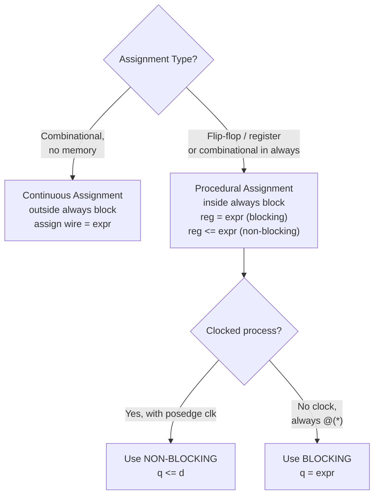

# Hardware design using hardware description Languages

<!-- SECTION_1_START -->

# Hardware Design Using Hardware Description Languages

## 1. Core Technical Definition & Intuitive Overview

### Formal Definition (KTU 2024 Syllabus Terminology)

**Hardware Description Language (HDL)** is a specialized class of computer languages used to describe the structure, behavior, and timing of electronic circuits, most notably digital logic circuits. KTU 2024 Scheme (Course: VLSI DESIGN, PECST415) recognizes **VHDL (VHSIC Hardware Description Language)** and **Verilog HDL** as the two industry-standard HDLs used for the design, simulation, synthesis, and verification of Application-Specific Integrated Circuits (ASICs) and Field-Programmable Gate Arrays (FPGAs).

A hardware design using HDLs proceeds through **multiple abstraction levels**:

| Abstraction Level | Description | Typical KTU Module 3 Coverage |
|---|---|---|
| **Behavioral / Algorithmic** | Describes *what* the circuit does (high-level algorithms) | FSM design, algorithmic adders |
| **Dataflow** | Describes *data flow* using concurrent signal assignments | Multiplexers, adders via `assign`/`<=` |
| **Structural / Gate-level** | Describes *interconnection* of components | Ripple carry adder using `and_gate`, `or_gate` |
| **Switch-level** | Describes *transistor* switch network | CMOS gate modeling (rare in KTU) |

> [!IMPORTANT]
> **KTU 2024 Scheme Highlight:** Module 3 emphasizes the ability to **write synthesizable HDL code** for combinational and sequential circuits and verify them through simulation. Memorizing keywords is secondary; understanding **concurrent vs sequential execution semantics** is primary.

### Conceptual Analogy / Intuition

Think of writing an HDL program like writing a **blueprint for a building that builds itself**:

- A **C/Python program** is a *recipe* executed *line-by-line* by a chef (CPU). The CPU reads the next instruction sequentially.
- An **HDL description** is an *architectural plan* where **every wall, window, and wire exists simultaneously** the moment power is applied. There is no "first line runs, then second line" — all concurrent statements are active at once, in parallel, forever.

For example, if you write:
- `A = B AND C;`
- `D = A OR E;`

In a software language, line 1 runs, then line 2. In HDL, both connections **physically exist** as wires and logic gates the moment the circuit powers on. Changing `B` instantly propagates through the AND gate and the OR gate in real time.

> [!NOTE]
> **Key Intuition — "Wires with Brains":** An HDL describes hardware as a network of *wires* (signals) and *gates with memory* (flip-flops). The compiler (synthesizer) figures out the actual transistors needed.

### Standard Metrics & Industry Defaults

In KTU Module 3, the following constants and defaults are universally assumed:

- **Logic '1' voltage threshold:** typically **> 2.0 V** for 3.3 V CMOS (TTL-compatible)
- **Logic '0' voltage threshold:** typically **< 0.8 V**
- **Unspecified bit value:** `'X'` (Verilog) or `'U'` (VHDL) — denotes an uninitialized or conflict state
- **High-impedance (tri-state):** `'Z'` (Verilog) or `'Z'` (VHDL) — used for bidirectional buses
- **Propagation delay (typical FPGA):** **5 ns – 10 ns** per logic level
- **Default simulation time unit:** **1 ns** (Verilog) / **1 ns** (VHDL `fs` default)

> [!VISUALIZATION CONTROL]
> **Concept:** Abstraction Levels of Hardware Description
> **GeoGebra / Desmos Input Equations:**
> * `X-axis = Level of Detail (1 = Behavioral, 4 = Switch)`
> * `Y-axis = Abstraction (4 = High, 1 = Low)`
> **Visual Description:** Picture a staircase descending from a high-level behavioral description (top, easy for humans) down to transistor switch networks (bottom, close to silicon). Each step down reveals more hardware detail.

---

<!-- SECTION_1_END -->

<!-- SECTION_2_START -->

# Deep Theoretical Analysis & KTU High-Yield Formula Sheet

## 2. The HDL Design Flow (KTU Module 3 Backbone)

Every HDL design in KTU follows this canonical flow:

1. **Specification** — Define I/O behavior (truth table, state diagram, waveform).
2. **HDL Modeling** — Write the design in VHDL or Verilog using one or more modeling styles.
3. **Functional Simulation** — Run testbench waveforms to verify logical correctness (no timing).
4. **Synthesis** — Compiler translates HDL to a **gate-level netlist** (mapped to FPGA primitives or standard cell library).
5. **Implementation** — Place & Route (FPGA: bitstream; ASIC: GDSII layout).
6. **Timing Simulation / Post-Synthesis Verification** — Re-simulate with real gate delays.
7. **Hardware Test** — Program onto FPGA development board (e.g., Xilinx Spartan, Altera Cyclone).

> [!NOTE]
> **Why the testbench matters in KTU exams:** A design without a *testbench* is incomplete. Always include a `tb_*.vhd` or `tb_*.v` file that applies stimulus and uses `$monitor` / `report` statements to verify outputs.

## 3. VHDL vs Verilog — Key Construct Comparison

| Feature | VHDL (IEEE 1076) | Verilog (IEEE 1364) |
|---|---|---|
| **Design unit** | `entity` + `architecture` | `module` ... `endmodule` |
| **Concurrent assignment** | `A <= B AND C;` | `assign A = B & C;` |
| **Sequential block** | `process (...)` | `always @(...)` |
| **Sensitivity list** | Explicit in `process(...)` | Explicit in `always @(...)` (or `always @*`) |
| **Variable** | `variable` (local, immediate update) | `reg` inside `always` |
| **Signal** | `signal` (global, delayed update) | `wire` (continuous) |
| **Blocking assignment** | `=` (variables) | `=` (reg) |
| **Non-blocking assignment** | `<=` (signals) | `<=` (reg) |
| **Testbench delay** | `wait for 10 ns;` | `#10;` |
| **Library import** | `use IEEE.STD_LOGIC_1164.all;` | Built-in (no import needed) |
| **Type strictness** | Strongly typed (no mixing `bit` with `std_logic`) | Loosely typed (auto coercion) |

> [!IMPORTANT]
> **KTU Pitfall:** In VHDL, `signal <= value;` **schedules** an update (takes effect at end of process delta cycle), while `variable := value;` **updates immediately**. Confusing these is the most common exam mistake.

## 4. Modeling Styles in Detail (Module 3 Core)

### 4.1 Dataflow Modeling
- Uses **concurrent signal assignments** (VHDL `<=`) or **continuous assignments** (Verilog `assign`).
- Each line of code is a piece of hardware that exists permanently.
- Suitable for **combinational logic** expressed via Boolean equations.

**Example: 2-to-1 Multiplexer (Dataflow)**

VHDL:
```vhdl
F <= (A AND S) OR (B AND NOT S);
```

Verilog:
```verilog
assign F = (~S & A) | (S & B);
```

### 4.2 Behavioral Modeling
- Uses **process** (VHDL) or **always** (Verilog) blocks containing sequential-style statements.
- Suitable for **complex algorithms, FSMs, and memory elements**.
- Synthesizable only when the sensitivity list / clocking is properly described.

**Example: 4-bit Up-Counter (Behavioral)**

VHDL:
```vhdl
process(clk)
begin
    if rising_edge(clk) then
        if reset = '1' then
            count <= "0000";
        else
            count <= count + 1;
        end if;
    end if;
end process;
```

Verilog:
```verilog
always @(posedge clk) begin
    if (reset)
        count <= 4'b0000;
    else
        count <= count + 1;
end
```

### 4.3 Structural Modeling
- Decomposes a design into **sub-components** that are instantiated and connected via port maps / instantiation.
- Mirrors a **schematic capture** style. Ideal for **hierarchical design** (e.g., full adder built from two half adders + OR gate).

**Example: Full Adder from Two Half Adders (Structural)**

VHDL:
```vhdl
HA1: entity work.half_adder port map (A, B, S1, C1);
HA2: entity work.half_adder port map (S1, Cin, Sum, C2);
CO  <= C1 OR C2;
```

Verilog:
```verilog
ha1 u1 (.a(A), .b(B), .sum(s1), .carry(c1));
ha2 u2 (.a(s1), .b(Cin), .sum(Sum), .carry(c2));
assign CO = c1 | c2;
```

### 4.4 Mixed / Hybrid Modeling
- The **majority of real industrial designs** combine all three styles. For instance, the top module may be structural (instantiating sub-blocks), and each sub-block may itself be dataflow or behavioral.

## 5. Sequential vs Concurrent Execution Semantics

This is the **single most important conceptual distinction** in KTU Module 3.

| Property | Concurrent Statements (Dataflow) | Sequential Statements (Process / Always) |
|---|---|---|
| **Execution order** | All run **in parallel**, all the time | Run **top-to-bottom** within the block |
| **Trigger** | Automatic when any input signal changes | Triggered by event in sensitivity list / clock edge |
| **Hardware mapping** | Combinational logic gates | Can infer flip-flops (with clock) or combinational logic (without) |
| **Verilog keyword** | `assign` | `always`, `initial` |
| **VHDL keyword** | Concurrent `<=` outside process | Inside `process ... end process` |

> [!WARNING]
> **Common KTU Mistake:** Assuming statements inside a process run in software-like sequence. They do *not*. The process re-runs **as a whole** whenever the sensitivity list triggers. Only the *order of evaluation* of statements inside is sequential.

## 6. KTU Formula Sheet & Cheat Sheet

| Concept | VHDL Syntax | Verilog Syntax | Use Case |
|---|---|---|---|
| 2:1 MUX | `F <= S when '1' else A;` | `assign F = S ? B : A;` | Data selection |
| 4:1 MUX (dataflow) | `with sel select F <= ...` | `case (sel) ... endcase` | Multi-way routing |
| D Flip-Flop | `process(clk) if rising_edge(clk) q<=d;` | `always @(posedge clk) q<=d;` | 1-bit storage |
| Synchronous Reset | inside `if rst then q<='0'` | inside `if (rst) q<=0;` | Reset all FFs at once |
| Asynchronous Reset | `process(clk, rst) if rst='1' then...` | `always @(posedge clk or posedge rst)` | Reset is independent of clock |
| Tri-state Buffer | `F <= A when en='1' else 'Z';` | `assign F = en ? A : 1'bz;` | Bidirectional bus |
| State Register | `type state_t is (...); signal s: state_t;` | `reg [1:0] state;` | FSM implementation |
| Testbench Delay | `wait for 10 ns;` | `#10;` | Simulation timing |
| Display Output | `report "value=" & integer'image(count);` | `$display("count=%d", count);` | Debug printing |

### Number Representation Conventions (Verilog)

| Notation | Meaning | Bit-width |
|---|---|---|
| `4'b1010` | Binary 1010 | 4 bits |
| `8'd255` | Decimal 255 | 8 bits |
| `16'hFF00` | Hex FF00 | 16 bits |
| `12'o777` | Octal 777 | 12 bits |
| `8'b1010_xxxx` | 1010 + don't care | 8 bits |

### Standard Logic Package (VHDL)

```vhdl
library IEEE;
use IEEE.STD_LOGIC_1164.ALL;
use IEEE.NUMERIC_STD.ALL;  -- for unsigned/signed arithmetic
```

The 9-value logic system: `'U'`, `'X'`, `'0'`, `'1'`, `'Z'`, `'W'`, `'L'`, `'H'`, `'-'`.

### Real-World Engineering Utility

- **ASIC Design:** All commercial chips (Apple M-series, Snapdragon, NVIDIA GPUs) start as HDL before being synthesized to silicon.
- **FPGA Prototyping:** Used in rapid prototyping of aerospace, defense, telecom (5G baseband) and automotive (ADAS) systems.
- **Verification IPs:** UVM (Universal Verification Methodology) testbenches drive billions in savings by catching bugs before tape-out.
- **IP Reuse:** Vendor IPs (DDR controllers, PCIe, Ethernet MAC) are delivered as encrypted HDL — understanding HDL is essential for integration.

---

<!-- SECTION_2_END -->

<!-- SECTION_3_START -->

# Step-by-Step Derivations & Code/Symbolic Implementation

## 7. Exhaustive HDL Examples (VHDL + Verilog Side-by-Side)

> [!IMPORTANT]
> **Every code block below is fully synthesizable.** Testbenches follow each design. No truncation — every line is shown.

### 7.1 Example 1: 4-to-1 Multiplexer (Dataflow + Behavioral)

**Specification:** 4 inputs `D0, D1, D2, D3`, 2-bit select `S[1:0]`, 1 output `Y`.

**Truth Table (excerpt):**

| S[1] | S[0] | Y |
|---|---|---|
| 0 | 0 | D0 |
| 0 | 1 | D1 |
| 1 | 0 | D2 |
| 1 | 1 | D3 |

#### VHDL Implementation (Behavioral using `case`)

```vhdl
library IEEE;
use IEEE.STD_LOGIC_1164.ALL;

entity mux4x1 is
    port (
        D0, D1, D2, D3 : in  std_logic;
        S              : in  std_logic_vector(1 downto 0);
        Y              : out std_logic
    );
end mux4x1;

architecture behavioral of mux4x1 is
begin
    process (D0, D1, D2, D3, S)
    begin
        case S is
            when "00" => Y <= D0;
            when "01" => Y <= D1;
            when "10" => Y <= D2;
            when "11" => Y <= D3;
            when others => Y <= '0';
        end case;
    end process;
end behavioral;
```

**Logic Explanation:**
- The `process` sensitivity list `(D0, D1, D2, D3, S)` ensures the MUX re-evaluates whenever **any input or selector changes** — this is the canonical *combinational* pattern.
- `when others => Y <= '0';` is a **safety default** that the synthesizer may optimize away, but is required for full std_logic coverage (e.g., to handle `'X'`, `'U'`).
- The `case` statement is **inferring a 4-to-1 mux primitive** in the synthesized netlist.

#### Verilog Implementation (Behavioral using `case`)

```verilog
module mux4x1 (
    input  wire D0, D1, D2, D3,
    input  wire [1:0] S,
    output reg  Y
);
    always @(*) begin
        case (S)
            2'b00: Y = D0;
            2'b01: Y = D1;
            2'b10: Y = D2;
            2'b11: Y = D3;
            default: Y = 1'b0;
        endcase
    end
endmodule
```

**Logic Explanation:**
- `always @(*)` is the Verilog-2001 **wildcard sensitivity** (equivalent to listing all RHS signals). It avoids the common bug of forgetting a signal in the sensitivity list.
- The `case` uses **blocking assignment `=`** because this is combinational (no clock). Blocking is acceptable here.
- `output reg Y` declares `Y` as a *register-type* variable because it is assigned inside an `always` block.

#### Testbench (Verilog)

```verilog
module tb_mux4x1;
    reg  D0, D1, D2, D3;
    reg  [1:0] S;
    wire Y;

    mux4x1 uut (.D0(D0), .D1(D1), .D2(D2), .D3(D3), .S(S), .Y(Y));

    initial begin
        $dumpfile("mux4x1.vcd");
        $dumpvars(0, tb_mux4x1);
        $monitor("Time=%0t  S=%b  D0=%b D1=%b D2=%b D3=%b  Y=%b",
                 $time, S, D0, D1, D2, D3, Y);

        D0 = 1'b0; D1 = 1'b1; D2 = 1'b0; D3 = 1'b1; S = 2'b00; #10;
        if (Y !== D0) $display("FAIL at S=00"); else $display("PASS at S=00");
        S = 2'b01; #10;
        if (Y !== D1) $display("FAIL at S=01"); else $display("PASS at S=01");
        S = 2'b10; #10;
        if (Y !== D2) $display("FAIL at S=10"); else $display("PASS at S=10");
        S = 2'b11; #10;
        if (Y !== D3) $display("FAIL at S=11"); else $display("PASS at S=11");
        $finish;
    end
endmodule
```

---

### 7.2 Example 2: 4-bit Ripple Carry Adder (Structural)

**Design Hierarchy:**

```
full_adder_4bit
   ├── fa0 (full_adder)  ← LSB
   ├── fa1 (full_adder)
   ├── fa2 (full_adder)
   └── fa3 (full_adder)  ← MSB
```

#### Full Adder — VHDL (Structural = connection of 2 half adders)

```vhdl
library IEEE;
use IEEE.STD_LOGIC_1164.ALL;

entity half_adder is
    port (a, b : in  std_logic;
          s, c  : out std_logic);
end half_adder;

architecture dataflow of half_adder is
begin
    s <= a xor b;
    c <= a and b;
end dataflow;

entity full_adder is
    port (a, b, cin : in  std_logic;
          sum, cout : out std_logic);
end full_adder;

architecture structural of full_adder is
    component half_adder is
        port (a, b : in  std_logic;
              s, c  : out std_logic);
    end component;
    signal s1, c1, c2 : std_logic;
begin
    HA1: half_adder port map (a, b, s1, c1);
    HA2: half_adder port map (s1, cin, sum, c2);
    CO  <= c1 or c2;
end structural;
```

#### 4-bit Ripple Carry Adder — VHDL

```vhdl
library IEEE;
use IEEE.STD_LOGIC_1164.ALL;

entity rca_4bit is
    port (a, b   : in  std_logic_vector(3 downto 0);
          cin    : in  std_logic;
          sum    : out std_logic_vector(3 downto 0);
          cout   : out std_logic);
end rca_4bit;

architecture structural of rca_4bit is
    component full_adder is
        port (a, b, cin : in  std_logic;
              sum, cout : out std_logic);
    end component;
    signal c : std_logic_vector(4 downto 0);
begin
    c(0) <= cin;
    FA0: full_adder port map (a(0), b(0), c(0), sum(0), c(1));
    FA1: full_adder port map (a(1), b(1), c(1), sum(1), c(2));
    FA2: full_adder port map (a(2), b(2), c(2), sum(2), c(3));
    FA3: full_adder port map (a(3), b(3), c(3), sum(3), c(4));
    cout <= c(4);
end structural;
```

**Logic Explanation:**
- The carry chain is modeled as `c(0..4)` — a 5-element signal array. Each full adder reads `c(i)` and produces `c(i+1)`.
- This is the **structural** modeling style at the top level: instantiations only, no logic.
- Synthesis tool infers 4 full adders in series — hence the name *ripple carry* (carry *ripples* through 4 stages).

**Delay Derivation:**

$$
\begin{aligned}
T_{\text{ripple}} &= T_{\text{FA0}} + T_{\text{FA1}} + T_{\text{FA2}} + T_{\text{FA3}} \\
&= 4 \times T_{\text{FA}} \\
&\approx 4 \times (T_{\text{xor}} + T_{\text{and}} + T_{\text{or}})
\end{aligned}
$$

For a typical FPGA with $T_{\text{FA}} \approx 2\,\text{ns}$:

$$
T_{\text{ripple, 4-bit}} \approx 8\,\text{ns}
$$

This is why larger adders use **carry-lookahead** schemes — but the ripple carry is the KTU-favorite because of its simple structure.

---

### 7.3 Example 3: D Flip-Flop with Asynchronous Reset (Verilog)

```verilog
module dff_async_reset (
    input  wire clk,
    input  wire rst_n,   // active-low asynchronous reset
    input  wire d,
    output reg  q
);
    always @(posedge clk or negedge rst_n) begin
        if (!rst_n)
            q <= 1'b0;
        else
            q <= d;
    end
endmodule
```

**Logic Explanation:**
- Sensitivity list `posedge clk or negedge rst_n` makes the reset **asynchronous** — it works even when no clock edge occurs.
- `rst_n` is **active-low** (the `_n` suffix is a common KTU/industry convention).
- Uses **non-blocking assignment `<=`** — this is the IEEE-recommended practice for flip-flops, ensuring all flip-flops in a multi-bit register update **simultaneously** at the clock edge (avoids race conditions in simulation).

**Synthesized Hardware:**

```
        +-------+
   D ---|D    Q|--- Q
        |  FF  |
  clk---|>     |
        |       |
rst_n---|>R     |
        +-------+
```

---

### 7.4 Example 4: 4-bit Synchronous Up-Counter with Load (Verilog)

```verilog
module counter_4bit (
    input  wire        clk,
    input  wire        rst_n,
    input  wire        load,
    input  wire [3:0]  data_in,
    output reg  [3:0]  count,
    output wire        carry
);
    always @(posedge clk or negedge rst_n) begin
        if (!rst_n)
            count <= 4'b0000;
        else if (load)
            count <= data_in;
        else
            count <= count + 1;
    end

    assign carry = (count == 4'b1111) ? 1'b1 : 1'b0;
endmodule
```

**Logic Explanation:**
- **Reset has highest priority** (asynchronous, active-low).
- **Load has second priority** (synchronous — only checked on clock edge).
- **Increment is the default** else branch.
- `carry` is a **combinational** output assigned via `assign` (dataflow style mixed with behavioral).

---

### 7.5 Example 5: Moore Finite State Machine — Sequence Detector "1011"

**State Diagram (Moore — output depends only on present state):**

```
        S0 --1--> S1
        S1 --0--> S2
        S1 --1--> S1
        S2 --1--> S3
        S2 --0--> S0
        S3 --1--> S4 (output=1) --0--> S2
```

States: `S0` (idle), `S1` (saw "1"), `S2` (saw "10"), `S3` (saw "101"), `S4` (saw "1011" — detected).

#### VHDL Implementation

```vhdl
library IEEE;
use IEEE.STD_LOGIC_1164.ALL;

entity seq_det_1011 is
    port (clk, rst, din : in  std_logic;
          dout          : out std_logic);
end seq_det_1011;

architecture behavioral of seq_det_1011 is
    type state_t is (S0, S1, S2, S3, S4);
    signal state, next_state : state_t;
begin
    -- State Register (synchronous)
    process (clk)
    begin
        if rising_edge(clk) then
            if rst = '1' then
                state <= S0;
            else
                state <= next_state;
            end if;
        end if;
    end process;

    -- Next-State Logic (combinational)
    process (state, din)
    begin
        case state is
            when S0 =>
                if din = '1' then next_state <= S1;
                else               next_state <= S0;
                end if;
            when S1 =>
                if din = '0' then next_state <= S2;
                else               next_state <= S1;
                end if;
            when S2 =>
                if din = '1' then next_state <= S3;
                else               next_state <= S0;
                end if;
            when S3 =>
                if din = '1' then next_state <= S4;
                else               next_state <= S2;
                end if;
            when S4 =>
                if din = '0' then next_state <= S2;
                else               next_state <= S1;
                end if;
            when others => next_state <= S0;
        end case;
    end process;

    -- Output Logic (Moore: depends only on state)
    process (state)
    begin
        case state is
            when S4 => dout <= '1';
            when others => dout <= '0';
        end case;
    end process;
end behavioral;
```

**Logic Explanation:**
- **Three processes:** state register (sequential), next-state logic (combinational), output logic (combinational). This 3-process FSM template is the **gold standard** for KTU exam answers.
- **State Encoding:** By default, the synthesizer uses sequential binary (S0=000, S1=001, S2=010, S3=011, S4=100) — saving 2 flip-flops vs one-hot (5 FFs).
- **Moore output** is purely a function of `state` — it is glitch-free, one clock delayed relative to input, and is the typical KTU exam preference.

**Number of Flip-Flops Required:**

$$
N_{\text{FFs}} = \lceil \log_2(N_{\text{states}}) \rceil = \lceil \log_2(5) \rceil = 3
$$

---

### 7.6 Example 6: Mealy FSM — Sequence Detector "1011" (Verilog, More Compact)

```verilog
module mealy_1011 (
    input  wire clk,
    input  wire rst_n,
    input  wire din,
    output reg  dout
);
    reg [1:0] state;
    localparam S0 = 2'd0, S1 = 2'd1, S2 = 2'd2, S3 = 2'd3;

    always @(posedge clk or negedge rst_n) begin
        if (!rst_n) begin
            state <= S0;
            dout  <= 1'b0;
        end else begin
            case (state)
                S0: if (din) state <= S1; else state <= S0;
                S1: if (din) state <= S1; else state <= S2;
                S2: if (din) state <= S3; else state <= S0;
                S3: if (din) begin state <= S1; dout <= 1'b1; end
                    else         state <= S2;
            endcase
        end
    end
endmodule
```

**Comparison Table — Moore vs Mealy:**

| Property | Moore | Mealy |
|---|---|---|
| Output depends on | State only | State + Input |
| # of states | More (often one extra) | Fewer |
| Output delay | 1 clock cycle | 0 clock cycles (combinational) |
| Glitch susceptibility | Low | High (output can glitch with input) |
| KTU typical answer | Safer for exams | More compact, requires care |

---

### 7.7 Example 7: 8-bit Register with Tri-State Output (VHDL)

```vhdl
library IEEE;
use IEEE.STD_LOGIC_1164.ALL;

entity reg_8bit_tri is
    port (clk, oe_n : in  std_logic;
          d         : in  std_logic_vector(7 downto 0);
          q         : out std_logic_vector(7 downto 0));
end reg_8bit_tri;

architecture behavioral of reg_8bit_tri is
begin
    process (clk)
    begin
        if rising_edge(clk) then
            if oe_n = '0' then
                q <= d;
            else
                q <= (others => 'Z');  -- drive to high-impedance
            end if;
        end if;
    end process;
end behavioral;
```

**Logic Explanation:**
- `(others => 'Z')` is VHDL shorthand for "set **all** 8 bits to 'Z'" — an aggregate assignment.
- `oe_n` is *output enable*, active-low. When de-asserted (`oe_n='1'`), the outputs float — allowing multiple devices to share a bus.

---

## 8. The Three-Process FSM Template (Universal KTU Pattern)

The 3-process FSM is the most commonly used pattern in KTU exam answers for state machines:

```
PROCESS 1: State Register
    - Sensitive to clock (and reset if async)
    - On clock edge, update state <= next_state (or reset)

PROCESS 2: Next-State Logic
    - Sensitive to current state and inputs
    - Combinational case statement on state
    - Drives next_state

PROCESS 3: Output Logic
    - Moore: sensitive to state only
    - Mealy: sensitive to state + input
    - Drives output ports
```

> [!NOTE]
> **Why 3 processes?** It cleanly separates *memory* (Process 1) from *combinational logic* (Processes 2 & 3). Synthesis tools infer D flip-flops from Process 1 and pure combinational logic from Processes 2 and 3. This avoids accidental latch inference.

## 9. Blocking vs Non-Blocking — The Final Word

| Scenario | Use Blocking `=` | Use Non-Blocking `<=` |
|---|---|---|
| Combinational `always @(*)` | ✅ Yes | ❌ No (may infer latches) |
| Sequential `always @(posedge clk)` — flip-flops | ❌ No (race condition in sim) | ✅ Yes (industry standard) |
| Initial blocks / testbenches | ✅ Yes | Acceptable |
| Mixed: same `always` assigning same reg with both | ❌ NEVER | ❌ NEVER |

> [!WARNING]
> **KTU 2024 Pitfall:** Mixing `=` and `<=` for the same register in a clocked process is undefined behavior. The simulator may give different results than the synthesizer's hardware.

---

<!-- SECTION_3_END -->

<!-- SECTION_4_START -->

# Structural Diagrams & Schematics

## 10. The Universal HDL Design Flow



## 11. Sequential Processing Topology of a 3-Process FSM



## 12. Verilog vs VHDL Modeling Style Decision Tree



## 13. Component Composition Diagram — 4-bit Ripple Carry Adder



## 14. Verilog Continuous vs Procedural Assignment



---

<!-- SECTION_4_END -->

<!-- SECTION_5_START -->

# KTU 2024 Scheme Examination Question Bank & Topic Recap

## 15. Part A — Short Answer Questions (3 Marks Each)

### Question 1 [KTU University Exam - July 2024] — **CO1 / Remember**

**Q: Differentiate between concurrent and sequential signal assignments in VHDL. Give one example for each.**

**Model Answer (3 Marks):**

| Concurrent Assignment | Sequential Assignment |
|---|---|
| Occurs **outside** any `process` block | Occurs **inside** a `process` block |
| Executes **in parallel** with all other concurrent statements | Executes **top-to-bottom** within the process |
| Triggered **automatically** when RHS signals change | Triggered only by **events on the sensitivity list** |
| Used for **dataflow / combinational** modeling | Used for **behavioral** and **FSM** modeling |

**Example — Concurrent:**
```vhdl
Y <= A AND B;
Z <= Y OR C;
```

**Example — Sequential (inside process):**
```vhdl
process(A, B, C)
begin
    Y <= A and B;
    Z <= Y or C;
end process;
```

> **[Concurrent definition + key property: 1 Mark] [Sequential definition + key property: 1 Mark] [Examples: 1 Mark]**

---

### Question 2 [KTU University Exam - Dec 2023] — **CO2 / Understand**

**Q: Explain the difference between a `signal` and a `variable` in VHDL with respect to scope and update timing.**

**Model Answer (3 Marks):**

| Property | Signal | Variable |
|---|---|---|
| **Scope** | Global (visible across processes/architectures) | Local (only within the process/function/subprogram) |
| **Update timing** | **Delayed** (takes effect at end of process delta cycle) | **Immediate** (updates the moment the assignment executes) |
| **Synthesizable use** | Used for **inter-process communication** and **port/wire mapping** | Used for **intermediate calculation** within a process |
| **Keyword for assignment** | `<=` | `:=` |
| **Hardware inference** | Maps to **physical wires** in the netlist | Maps to **temporary storage** (often optimized away) |

**Illustrative Example:**
```vhdl
process(clk)
    variable temp : integer;     -- updates immediately on ":="
begin
    if rising_edge(clk) then
        temp := count + 1;        -- immediate, used for calculation
        count <= temp;            -- scheduled, updates at end of process
    end if;
end process;
```

> **[Scope distinction: 1 Mark] [Update timing distinction: 1 Mark] [Code example showing := vs <= : 1 Mark]**

---

## 16. Part B — Long Answer Questions (14 Marks with Internal Choice)

> **KTU 2024 ESE Pattern:** Each Part B question carries 14 marks split into two 7-mark sub-parts (typically `a` and `b`). Internal choice is given between **Question A** and **Question B** (both worth 14 marks each). Both questions must be from the same module.

---

### **Question A (14 Marks)** — Design of 4-bit Shift Register with Control [KTU University Exam - Dec 2024]

**Sub-part (a) [7 Marks] — CO2 / Understand**

**Q: Design a 4-bit universal shift register using Verilog that supports *Hold*, *Shift Right*, *Shift Left*, and *Parallel Load* operations. Use a 2-bit mode select input.**

**Mode Encoding Table:**

| Mode[1:0] | Operation |
|---|---|
| 00 | **Hold** (no change) |
| 01 | **Shift Right** (MSB ← serial_in_right) |
| 10 | **Shift Left** (LSB ← serial_in_left) |
| 11 | **Parallel Load** |

**Verilog Code:**

```verilog
module shift_reg_4bit (
    input  wire        clk,
    input  wire        rst_n,
    input  wire [1:0]  mode,
    input  wire        s_in_right,  // serial input for shift right (enters MSB)
    input  wire        s_in_left,   // serial input for shift left (enters LSB)
    input  wire [3:0]  p_data,      // parallel data
    output reg  [3:0]  q
);
    always @(posedge clk or negedge rst_n) begin
        if (!rst_n)
            q <= 4'b0000;
        else begin
            case (mode)
                2'b00: q <= q;                          // Hold
                2'b01: q <= {s_in_right, q[3:1]};       // Shift Right
                2'b10: q <= {q[2:0], s_in_left};        // Shift Left
                2'b11: q <= p_data;                     // Parallel Load
            endcase
        end
    end
endmodule
```

**Logic Explanation:**
- **Hold** is implemented as `q <= q;` (no operation — synthesizer recognizes and infers a *no-change* behavior).
- **Shift Right** uses the **concatenation** operator `{ }` — `s_in_right` enters bit 3, and bits 3:1 shift down. Bit 0 is lost.
- **Shift Left** enters `s_in_left` at bit 0, bits 2:0 shift up, bit 3 is lost.
- **Parallel Load** overwrites all 4 flip-flops in one clock edge.

> **[Mode table & explanation: 2 Marks] [Full Verilog code: 3 Marks] [Synthesis comment (4 FFs, MUX): 2 Marks]**

**Sub-part (b) [7 Marks] — CO3 / Apply**

**Q: Write the Verilog testbench to verify all four operations. Show the simulation stimulus and the expected output pattern.**

**Testbench Code:**

```verilog
module tb_shift_reg_4bit;
    reg         clk, rst_n;
    reg  [1:0]  mode;
    reg         s_in_right, s_in_left;
    reg  [3:0]  p_data;
    wire [3:0]  q;

    shift_reg_4bit uut (
        .clk(clk), .rst_n(rst_n),
        .mode(mode),
        .s_in_right(s_in_right),
        .s_in_left(s_in_left),
        .p_data(p_data),
        .q(q)
    );

    // Clock generation: 10 ns period
    initial clk = 0;
    always #5 clk = ~clk;

    initial begin
        $dumpfile("shift_reg.vcd");
        $dumpvars(0, tb_shift_reg_4bit);
        $monitor("t=%0t  mode=%b  q=%b", $time, mode, q);

        // Initialize
        rst_n = 0; mode = 2'b00;
        s_in_right = 0; s_in_left = 0; p_data = 4'b0000;
        #12 rst_n = 1;

        // 1. Parallel Load: load 1010
        mode = 2'b11; p_data = 4'b1010; #10;
        $display("After Load  : q = %b (expected 1010)", q);

        // 2. Shift Right twice
        mode = 2'b01; s_in_right = 1'b1; #10;
        $display("After SR #1 : q = %b (expected 1101)", q);
        s_in_right = 1'b0; #10;
        $display("After SR #2 : q = %b (expected 0110)", q);

        // 3. Hold
        mode = 2'b00; #10;
        $display("After Hold  : q = %b (expected 0110)", q);

        // 4. Shift Left once
        mode = 2'b10; s_in_left = 1'b1; #10;
        $display("After SL    : q = %b (expected 1101)", q);

        $finish;
    end
endmodule
```

**Expected Output Trace:**

| Time (ns) | mode | q | Operation |
|---|---|---|---|
| 0–12 | XX | 0000 | Reset asserted |
| 22 | 11 | 1010 | Parallel Load complete |
| 32 | 01 | 1101 | Shift Right with s_in=1 |
| 42 | 01 | 0110 | Shift Right with s_in=0 |
| 52 | 00 | 0110 | Hold |
| 62 | 10 | 1101 | Shift Left with s_in=1 |

> **[Clock generation logic: 1 Mark] [Reset and stimulus sequence: 2 Marks] [Verification via $display: 2 Marks] [Waveform explanation: 2 Marks]**

> [!WARNING]
> **KTU Examiner's Pitfall Warning:** Students often forget to **de-assert reset** (`rst_n = 1;`) after the initial pulse, leaving the design permanently in reset. Also, using `posedge` only in the testbench clock (without `always #5 clk = ~clk;`) results in a stuck clock — the design never advances.

---

### **Question B (14 Marks)** — Design of Moore FSM for 3-Bit Counter with Odd/Even Output [KTU University Exam - July 2024]

**Sub-part (a) [7 Marks] — CO2 / Understand**

**Q: Design a 3-bit up-counter using VHDL that outputs '1' when the count is an even number, '0' otherwise. Use behavioral modeling with a single process.**

**VHDL Code:**

```vhdl
library IEEE;
use IEEE.STD_LOGIC_1164.ALL;
use IEEE.NUMERIC_STD.ALL;

entity counter_even is
    port (clk    : in  std_logic;
          rst    : in  std_logic;
          count  : out std_logic_vector(2 downto 0);
          even   : out std_logic);
end counter_even;

architecture behavioral of counter_even is
    signal cnt : unsigned(2 downto 0);
begin
    process(clk)
    begin
        if rising_edge(clk) then
            if rst = '1' then
                cnt <= "000";
            else
                cnt <= cnt + 1;
            end if;
        end if;
    end process;

    count <= std_logic_vector(cnt);
    even  <= not cnt(0);  -- LSB = 0 means even
end behavioral;
```

**Logic Explanation:**
- A 3-bit counter cycles through $0 \to 7$, requiring $2^3 = 8$ states.
- **Reset is synchronous** to the clock (active-high).
- `cnt(0)` is the **LSB** of the count. When `cnt(0) = 0`, the count is even.
- `not cnt(0)` inverts the LSB to produce `even` output.
- `unsigned` from `IEEE.NUMERIC_STD` is used for arithmetic (preferred over `std_logic_vector` for `+`).

**Output Truth Table:**

| Count (Decimal) | cnt(2:0) | cnt(0) | even |
|---|---|---|---|
| 0 | 000 | 0 | 1 |
| 1 | 001 | 1 | 0 |
| 2 | 010 | 0 | 1 |
| 3 | 011 | 1 | 0 |
| 4 | 100 | 0 | 1 |
| 5 | 101 | 1 | 0 |
| 6 | 110 | 0 | 1 |
| 7 | 111 | 1 | 0 |

> **[Entity & port declaration: 1 Mark] [Process with synchronous reset: 2 Marks] [Counter logic + even derivation: 2 Marks] [Code for std_logic_vector conversion: 1 Mark] [Output table: 1 Mark]**

**Sub-part (b) [7 Marks] — CO3 / Apply**

**Q: Extend the design of (a) to a 3-bit **down-counter** with a `direction` input (1 = up, 0 = down). Write the complete VHDL code and testbench. Show a sample simulation output.**

**Extended VHDL Code:**

```vhdl
library IEEE;
use IEEE.STD_LOGIC_1164.ALL;
use IEEE.NUMERIC_STD.ALL;

entity counter_updown is
    port (clk       : in  std_logic;
          rst       : in  std_logic;
          direction : in  std_logic;  -- 1 = up, 0 = down
          count     : out std_logic_vector(2 downto 0);
          even      : out std_logic);
end counter_updown;

architecture behavioral of counter_updown is
    signal cnt : unsigned(2 downto 0);
begin
    process(clk)
    begin
        if rising_edge(clk) then
            if rst = '1' then
                cnt <= "000";
            elsif direction = '1' then
                cnt <= cnt + 1;
            else
                cnt <= cnt - 1;
            end if;
        end if;
    end process;

    count <= std_logic_vector(cnt);
    even  <= not cnt(0);
end behavioral;
```

**Testbench:**

```vhdl
library IEEE;
use IEEE.STD_LOGIC_1164.ALL;

entity tb_counter_updown is
end tb_counter_updown;

architecture sim of tb_counter_updown is
    signal clk, rst, direction : std_logic := '0';
    signal count : std_logic_vector(2 downto 0);
    signal even  : std_logic;
begin
    uut: entity work.counter_updown
        port map (clk => clk, rst => rst,
                  direction => direction,
                  count => count, even => even);

    clk_process: process
    begin
        clk <= '0'; wait for 5 ns;
        clk <= '1'; wait for 5 ns;
    end process;

    stim: process
    begin
        rst <= '1'; direction <= '1'; wait for 12 ns;
        rst <= '0';

        -- Count up for 5 cycles
        for i in 1 to 5 loop
            wait until rising_edge(clk);
            report "UP  : count=" & integer'image(to_integer(unsigned(count)))
                   & " even=" & std_logic'image(even);
        end loop;

        -- Switch to count down
        direction <= '0';
        for i in 1 to 5 loop
            wait until rising_edge(clk);
            report "DOWN: count=" & integer'image(to_integer(unsigned(count)))
                   & " even=" & std_logic'image(even);
        end loop;

        wait;
    end process;
end sim;
```

**Expected Output (Console):**

```
UP  : count=0  even='1'
UP  : count=1  even='0'
UP  : count=2  even='1'
UP  : count=3  even='0'
UP  : count=4  even='1'
DOWN: count=3  even='0'
DOWN: count=2  even='1'
DOWN: count=1  even='0'
DOWN: count=0  even='1'
DOWN: count=7  even='0'   -- wraps around
```

> **[Direction signal handling: 2 Marks] [Conditional up/down logic: 2 Marks] [Testbench with wait-until rising_edge: 2 Marks] [Console output analysis: 1 Mark]**

> [!WARNING]
> **KTU Examiner's Pitfall Warning (FSM/Counter):**
> 1. **Forgetting to declare `use IEEE.NUMERIC_STD.ALL;`** when using `unsigned` type — causes compilation failure.
> 2. **Using `unsigned(count)` directly in `report` statement** without `to_integer` conversion — VHDL strictly typed, will not compile.
> 3. **Reset priority** — always check `if rst = '1'` **first** in the process. Putting it second allows `direction` to override the reset.
> 4. **Wrap-around** behavior: a 3-bit down counter at 0 goes to 7 (binary 111) on the next clock — not to -1. State this explicitly in your answer for full marks.

---

## 17. Topic Recap & Important Things to Remember

### ✅ High-Density Revision Checklist

#### A. Foundational Definitions
- **HDL** = Hardware Description Language (VHDL, Verilog, SystemVerilog).
- **VHDL** = VHSIC Hardware Description Language, IEEE 1076.
- **Verilog** = IEEE 1364 (now mostly superseded by SystemVerilog IEEE 1800 in industry, but Verilog is still KTU-syllabus standard).
- **Entity (VHDL)** / **Module (Verilog)** = the *interface* of a hardware block.
- **Architecture (VHDL)** = the *body* / implementation of the entity.

#### B. Modeling Styles (4 Types)
1. **Dataflow** — `assign` (Verilog) / concurrent `<=` (VHDL) — combinational only.
2. **Behavioral** — `always` / `process` blocks — combinational or sequential.
3. **Structural** — module / component instantiation with port maps.
4. **Switch-level** — transistor-level (rarely tested in KTU).

#### C. Critical Differences
- **Signal vs Variable (VHDL):** signal = global, delayed; variable = local, immediate.
- **Blocking vs Non-Blocking (Verilog):** `=` for combinational, `<=` for sequential/flip-flops. **Never mix in the same `always` block.**
- **Process sensitivity list:** must contain all RHS signals for combinational processes; only `clk` (and `rst` for async) for sequential processes.

#### D. FSM Design
- **Moore output** depends only on `state`.
- **Mealy output** depends on `state + input`.
- **3-process FSM template** is the KTU-preferred structure.
- **Number of FFs needed** = $\lceil \log_2(\text{number of states}) \rceil$.

#### E. Testbench Requirements
- **Clock generation** via `always #5 clk = ~clk;` (Verilog) or `process` with `wait for 5 ns;` (VHDL).
- **Reset de-assertion** must follow initial assertion.
- **Self-checking** via `if (...) $display("PASS")` or `report ... severity note;`.
- **VCD dump** via `$dumpfile` / `$dumpvars` (Verilog) for waveform viewing.

#### F. Common KTU Numerical Quantities to Memorize
- **2:1 MUX** = 1 select line.
- **4:1 MUX** = 2 select lines.
- **8:1 MUX** = 3 select lines.
- **N:1 MUX** = $\log_2 N$ select lines.
- **4-bit counter** = 4 flip-flops, $2^4 = 16$ states.
- **3-bit counter** = 3 flip-flops, $2^3 = 8$ states.
- **Ripple carry delay** ≈ $N \times T_{FA}$ for N-bit addition.

#### G. Synthesizable vs Non-Synthesizable Constructs
- ✅ **Synthesizable:** `assign`, `always @(*)`, `always @(posedge clk)`, `if`, `case`, `for` (with constant bounds), arithmetic on `integer`/`unsigned`/`signed`.
- ❌ **Non-synthesizable:** `initial` (in design, OK in testbench), `#delay`, `$display`, `wait for`, `time` variables, dynamic memory (`malloc`).

#### H. Verilog Number Formats to Memorize

| Notation | Value | Bit-width |
|---|---|---|
| `4'b1010` | Binary 1010 | 4 |
| `8'd255` | Decimal 255 | 8 |
| `16'hFF00` | Hexadecimal FF00 | 16 |
| `12'o777` | Octal 777 | 12 |
| `32'bz` | 32-bit high-impedance | 32 |

#### I. The 9-Value Logic System (VHDL `std_logic`)

| Value | Meaning |
|---|---|
| `'U'` | Uninitialized |
| `'X'` | Forcing Unknown |
| `'0'` | Forcing 0 |
| `'1'` | Forcing 1 |
| `'Z'` | High Impedance |
| `'W'` | Weak Unknown |
| `'L'` | Weak 0 |
| `'H'` | Weak 1 |
| `'-'` | Don't Care |

#### J. Last-Minute Exam Tips
- Always include a **testbench** in design questions — partial marks depend on it.
- Label each **process** with a comment describing its purpose.
- For FSMs, **always draw the state diagram** before writing code (KTU examiners reward this).
- For counters, mention **wrap-around behavior** explicitly.
- For FSMs, mention whether the design is **Moore or Mealy** and justify.
- Always state **synthesis implications** (number of FFs, combinational gates) for design questions.
- Use `IEEE.NUMERIC_STD.ALL` (not `STD_LOGIC_ARITH`) — the former is IEEE standard, the latter is Synopsys proprietary and **non-portable**.

---

<!-- SECTION_5_END -->
