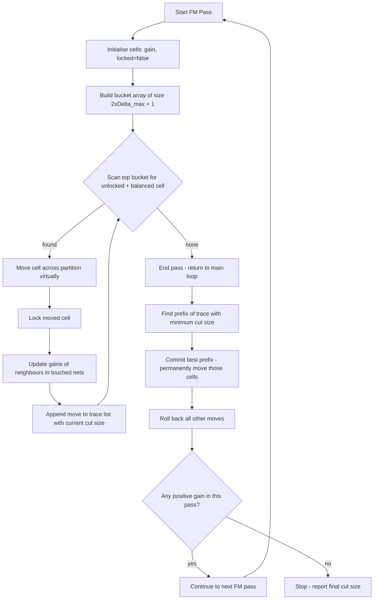
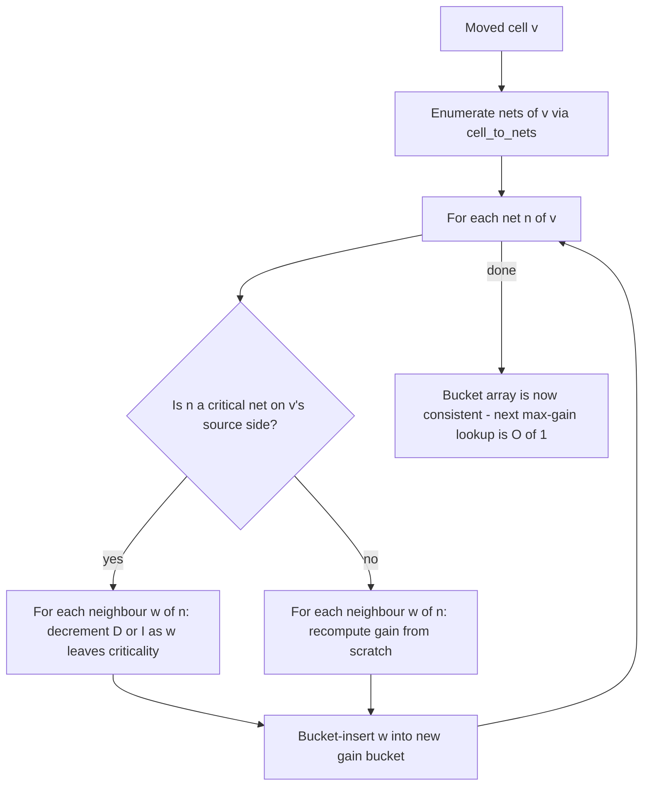
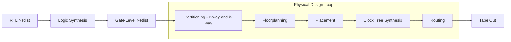

# Physical Design- Min-cut Partitioning

<!-- SECTION_1_START -->
# Physical Design — Min-Cut Partitioning

> [!IMPORTANT]
> **KTU 2024 Scheme — VLSI Design (PECST415), Module 3 (Semi-Custom & Custom Design)**
> This note is a high-yield treatment of the **Min-Cut Partitioning** problem, a cornerstone algorithmic primitive in the VLSI physical design flow. It is aligned to **CO2 / CO3** of the PECST415 syllabus and tuned for the typical 14-mark KTU ESE valuation pattern.

---

## 1.1 Formal Definition (KTU-Style)

In the VLSI physical design flow, **circuit partitioning** is the process of dividing a large circuit (represented as a hypergraph $G = (V, E)$) into two or more smaller, roughly equal-sized sub-circuits such that the number of nets (hyperedges) crossing the partition boundary — the **cut size** — is minimised, subject to a **balance constraint** on the number of cells (or total cell area) assigned to each partition.

Formally, for a bipartition $(V_1, V_2)$ of $V$:

$$\text{Cut}(V_1, V_2) = \Big\vert \big\{ e \in E \;\big\vert\; e \cap V_1 \neq \emptyset \;\text{and}\; e \cap V_2 \neq \emptyset \big\} \Big\vert$$

The objective is to find a partition that **minimises** $\text{Cut}(V_1, V_2)$ while satisfying:

$$ \frac{\vert V \vert}{2} \cdot (1 - r) \;\le\; \vert V_1 \vert \;\le\; \frac{\vert V \vert}{2} \cdot (1 + r) $$

where $r \in [0, 1]$ is the allowable **imbalance ratio** (typically $r = 0.05$ to $r = 0.10$ in industrial tools).

> [!NOTE]
> **Hypergraph vs. Graph:** In real circuits a net can connect more than two cells (e.g., a clock net connecting 50 flip-flops). Hence the connectivity model is a **hypergraph**, not a simple graph. Cut size therefore counts hyperedges that touch *both* partitions — a subtle but frequently tested point.

---

## 1.2 Intuitive Analogy — "Sorting Students into Two Classrooms"

Imagine **200 students** (the cells of a circuit) who must be assigned to **two classrooms** of roughly equal size. Some students are **friends** (forming hyperedges / nets). Every classroom door is narrow, and the school wants to **minimise the number of friend-pairs that get split across the two rooms** (cut size) so that friends stay together, while keeping the classroom sizes balanced (balance constraint). The head teacher (the algorithm) repeatedly **swaps a pair of students** and observes the change in split-friend-pairs (the **gain**), and locks in only those swaps that produce the largest cumulative improvement. This is exactly the philosophy of the **Kernighan–Lin (KL)** and **Fiduccia–Mattheyses (FM)** algorithms.

> [!TIP]
> **Memory hook:** *Partitioning = "Minimum cuts + Maximum togetherness".*

---

## 1.3 Visualisation Callout (Concept Picture)

> [!VISUALIZATION CONTROL]
> **Concept:** A 2-way min-cut partition of a small hypergraph.
> **Desmos / GeoGebra-style input (cells as nodes, nets as coloured clouds):**
>
> * Node set: $\{a,b,c,d,e,f,g,h\}$
> * Hyperedges: $e_1=\{a,b,c,d\}$, $e_2=\{c,d,e,f\}$, $e_3=\{f,g,h\}$, $e_4=\{a,e\}$
>
> **Visual Description:**
> A vertical dashed line divides the drawing area. To its **left** sits the group $V_1 = \{a,b,c,g\}$ and to its **right** sits $V_2 = \{d,e,f,h\}$. Hyperedges whose coloured "cloud" crosses the dashed boundary contribute to the cut. In the displayed configuration, $e_1$ and $e_2$ are cut (size = **2**). After applying a min-cut algorithm, the optimal arrangement collapses the cut to **1** (only $e_2$ or only $e_1$ remains split).

---

## 1.4 Core Metrics in Industrial Partitioning

| Metric | Typical Value | KTU Significance |
|---|---|---|
| Imbalance ratio $r$ | **0.05 – 0.10** | Hard constraint, 2-mark favourite |
| Iterations in FM | $O(P)$ where $P$ is the number of passes | Tested in complexity derivations |
| Bucket-array size | $O(\vert V \vert)$ | Critical to FM's linear-time per pass |
| Cut size target | $\le 10\%$ of $\vert E \vert$ | Practical engineering yardstick |

<!-- SECTION_1_END -->

<!-- SECTION_2_START -->
# 2. Deep Theoretical Analysis & KTU High-Yield Formula Sheet

## 2.1 The Gain Concept — The Heart of Every Iterative Partitioner

For any cell $v \in V$, define:

* $D(v)$ = number of **critical** nets currently inside the partition containing $v$ that become uncritical if $v$ moves.
* $I(v)$ = number of uncritical nets currently crossing the cut that become critical (and thus absorbed into the destination partition) if $v$ moves.

A net is **critical** if it has exactly one cell in the source partition (i.e., it is "tied to" a single source cell).

The **gain** of moving $v$ from its current side to the other is:

$$ g(v) \;=\; D(v) \;-\; I(v) $$

> [!IMPORTANT]
> **Why gain matters:** A positive gain means the cut will *decrease* if we move $v$. The art of partitioning is to greedily pick the cell with the **maximum gain** at each step, while honouring the balance constraint.

---

## 2.2 Why Naïve Greedy Fails — The Locking Insight

If we always move the current maximum-gain cell, we often get stuck in a **local minimum** because an early beneficial move forces later poor moves. Both **Kernighan–Lin (1970)** and **Fiduccia–Mattheyses (1982)** solve this by **temporarily locking** the moved cell so it cannot be re-selected in the same pass, and by **un-doing** all moves of a pass and re-applying the prefix that produced the maximum cumulative gain.

---

## 2.3 The Kernighan–Lin (KL) Algorithm

* **Input:** A graph $G = (V, E)$, target partition sizes.
* **Pass:**
  1. Compute initial $g(v)$ for all $v$.
  2. Pick the unlocked pair $(v_1, v_2)$ from opposite sides with maximum $g(v_1) + g(v_2)$.
  3. Swap them virtually, update gains of neighbours, **lock** $v_1, v_2$.
  4. Record the cumulative gain $G_k$ after the $k$-th swap.
  5. Repeat $\vert V \vert / 2$ times.
  6. Find $k^*$ that maximises $G_k$. **Commit** swaps $1$ to $k^*$; **un-commit** the rest.
* **Stop** when no pass yields a positive maximum $G_{k^*}$.

### KL Complexity

$$ T_{\text{KL}} \;=\; O(\vert V \vert^2 \log \vert V \vert) $$

per pass (dominated by gain recomputation using a priority queue).

---

## 2.4 The Fiduccia–Mattheyses (FM) Algorithm — Linear-Time Improvement

FM differs from KL in three essential ways:

1. **Single-cell moves** (not pairs) — every move is $v$ from $V_1$ to $V_2$ or vice-versa.
2. **Bucket array** of size $2 \cdot \max(\text{degree}) + 1$ to retrieve the max-gain cell in $O(1)$ amortised.
3. **Balance preservation:** a cell is moved only if the resulting partition respects $r$.

### FM Complexity Per Pass

$$ T_{\text{FM}} \;=\; O(P) \quad \text{where } P \text{ is the number of pins} $$

i.e. **linear in the size of the netlist** — this is the reason FM became the industrial workhorse.

---

## 2.5 KTU Formula Cheat Sheet

| # | Concept | Equation / Statement | Units / Notes |
|---|---|---|---|
| 1 | Cut size | $\text{Cut}(V_1,V_2) = \vert\{e \in E : e \cap V_1 \neq \emptyset \wedge e \cap V_2 \neq \emptyset\}\vert$ | Integer |
| 2 | Balance constraint | $\tfrac{\vert V\vert}{2}(1-r) \le \vert V_i\vert \le \tfrac{\vert V\vert}{2}(1+r)$ | $r \in [0,1]$ |
| 3 | Cell gain | $g(v) = D(v) - I(v)$ | Integer, may be negative |
| 4 | Cumulative pass gain | $G_k = \sum_{i=1}^{k} g_i$ | Maximised at $k^*$ |
| 5 | KL time/pass | $O(\vert V\vert^2 \log \vert V\vert)$ | Graph only |
| 6 | FM time/pass | $O(P)$ | $P$ = number of pins |
| 7 | Net criticality | Net $e$ is critical iff $\vert e \cap V_i\vert = 1$ for the source side | Boolean |
| 8 | Imbalance ratio | $r = \dfrac{\vert\; \vert V_1\vert - \vert V_2\vert \;\vert}{\vert V\vert/2}$ | Typical $\le 0.10$ |

> [!NOTE]
> **Critical LaTeX isolation rule:** All subscripts are inside `$...$` math mode. The pipe symbol `|` is rendered as `\vert` in the table to avoid breaking the markdown table.

---

## 2.6 Real-World Engineering Utility

* **Top-down physical design flow:** $k$-way multi-level partitioning (e.g., **hMETIS**, **KaHyPar**) recursively bisects the netlist to build a balanced cut tree, driving global placement in tools like **Cadence Innovus**, **Synopsys ICC2**, and **Mentor Olympus**.
* **FPGA packing & logic synthesis:** Partitions LUTs and flip-flops into Configurable Logic Blocks (CLBs) to minimise inter-CLB routing.
* **Multi-FPGA prototyping:** A large design is split across several physical FPGAs; every cut net becomes a board-level pin — directly affects **timing closure** and **board cost**.
* **Hardware–software co-design:** System-on-Chip (SoC) blocks (CPU, GPU, DSP) are partitioned for area and latency trade-offs.

<!-- SECTION_2_END -->

<!-- SECTION_3_START -->
# 3. Step-by-Step Derivations, Worked Examples & Code Implementation

## 3.1 Worked Example — Hand-Trace of a Small FM Pass

Consider a hypergraph with cells $V = \{a,b,c,d,e\}$ and nets:
* $n_1 = \{a,b\}$
* $n_2 = \{b,c,d\}$
* $n_3 = \{c,d\}$
* $n_4 = \{a,e\}$
* $n_5 = \{d,e\}$

Initial partition: $V_1 = \{a,b,c\}$, $V_2 = \{d,e\}$. Let imbalance $r = 0$ (strict balance: $\vert V_1\vert = \vert V_2\vert$ is impossible for 5 cells, so we allow $\vert V_1\vert = 2$ or $3$).

**Step 1 — Compute initial cut size.**
* $n_1 = \{a,b\}$ → both in $V_1$ → internal.
* $n_2 = \{b,c,d\}$ → $b,c \in V_1$, $d \in V_2$ → **CUT**.
* $n_3 = \{c,d\}$ → $c \in V_1$, $d \in V_2$ → **CUT**.
* $n_4 = \{a,e\}$ → $a \in V_1$, $e \in V_2$ → **CUT**.
* $n_5 = \{d,e\}$ → both in $V_2$ → internal.

$$\text{Cut}_{\text{init}} = 3$$

**Step 2 — Compute cell gains.**

For each cell we count critical (single-source) nets and uncritical crossing nets.

Cell $a$ (in $V_1$):
* Nets *only* touching $V_1$ and uniquely anchored at $a$: $n_1$ has $\{a,b\}$, so not critical for $a$; $n_4$ has $a$ in $V_1$ and $e$ in $V_2$ → critical on $V_1$ side ⇒ $D(a)$ includes $n_4$? **Critical nets of $a$ in $V_1$** = $\{n_4\}$.
* Crossing uncritical nets touching $a$ in $V_1$: none (only $n_1$ internal, $n_4$ is already critical).
$$ g(a) = D(a) - I(a) = 1 - 0 = 1 $$

Cell $b$: $n_1 = \{a,b\}$ both in $V_1$ → not critical; $n_2 = \{b,c,d\}$ has $b,c \in V_1$, $d \in V_2$ → critical on $V_1$ ⇒ $D(b)=1$, $I(b)=0$.
$$ g(b) = 1 $$

Cell $c$: $n_2$ critical (only $c$ among $b,c,d$ in $V_1$? No, $b$ also — so not critical). $n_3 = \{c,d\}$ → $c$ alone in $V_1$ ⇒ critical ⇒ $D(c)=1$, $I(c)=0$.
$$ g(c) = 1 $$

Cell $d$ (in $V_2$): $n_2$ has $d$ alone in $V_2$ ⇒ $D(d)$ for $n_2 = 1$. $n_3$ has $d$ alone in $V_2$ ⇒ $D(d)$ for $n_3 = 1$. $n_5 = \{d,e\}$ both in $V_2$ → not critical. So $D(d)=2$, $I(d)=0$.
$$ g(d) = 2 $$

Cell $e$ (in $V_2$): $n_4 = \{a,e\}$ has $e$ alone in $V_2$ ⇒ $D(e)=1$; $n_5 = \{d,e\}$ both in $V_2$ ⇒ not critical; $I(e)=0$.
$$ g(e) = 1 $$

**Step 3 — Pick max-gain, balance-respecting cell.**

Max gain is $d$ with $g=2$. Moving $d$ to $V_1$ gives new sizes $V_1=\{a,b,c,d\}$ (4), $V_2=\{e\}$ (1) — violates strict balance. So we must reject $d$.

Next max-gain candidates: $a,b,c,e$ all with $g=1$. Pick $a$. Move $a$ → $V_2$. New sizes: $V_1=\{b,c\}$ (2), $V_2=\{d,e,a\}$ (3) — balanced.

**Step 4 — Recompute gains for the next step and continue the pass; lock the moved cell. The cumulative gain trace is stored, and the algorithm backtracks to the prefix with maximum $G_k$.**

This textbook walkthrough mirrors the kind of step-by-step trace that earns full 7-mark credit in KTU ESE.

---

## 3.2 Multi-Line Derivation of the FM Bucket-Array Index

Each cell $v$ has gain $g(v) \in [-\Delta_{\max}, +\Delta_{\max}]$ where $\Delta_{\max}$ is bounded by the maximum cell degree.

The bucket-array index for $v$ is:

$$
\begin{aligned}
\text{idx}(v) \;&=\; g(v) + \Delta_{\max} \quad \text{(shift non-negative gains)} \\
&\in\; [0,\; 2\Delta_{\max}]
\end{aligned}
$$

**Lookup of max-gain cell:** Scan from index $2\Delta_{\max}$ downwards; the first non-empty bucket gives the max-gain cell in $O(1)$ amortised. Update a cell's gain by deleting it from its current bucket and inserting into the new one — each operation $O(1)$.

Total per pass:

$$
\begin{aligned}
T_{\text{pass}} \;&=\; \underbrace{O(\vert V\vert)}_{\text{initial bucket fill}} + \underbrace{O(P)}_{\text{gain updates}} + \underbrace{O(\vert V\vert)}_{\text{max-gain scans}} \\
&=\; O(\vert V\vert + P) \;=\; O(P) \quad \text{since } P \ge \vert V\vert \text{ for any non-trivial netlist}
\end{aligned}
$$

---

## 3.3 Python Implementation — A Clean, Typed FM Engine

```python
from __future__ import annotations
from collections import defaultdict
from dataclasses import dataclass, field
from typing import Dict, List, Set, Tuple

# ---------- Data model ----------

@dataclass
class Net:
    """A hyperedge connecting one or more cells."""
    name: str
    cells: Set[str] = field(default_factory=set)

@dataclass
class Cell:
    """A logic cell / standard cell instance."""
    name: str
    partition: int = 0                # 0 or 1
    locked: bool = False
    gain: int = 0

class Hypergraph:
    """A small hypergraph container used by the FM engine."""
    def __init__(self) -> None:
        self.nets: Dict[str, Net] = {}
        self.cell_to_nets: Dict[str, Set[str]] = defaultdict(set)

    def add_net(self, name: str, cells: List[str]) -> None:
        net = Net(name=name, cells=set(cells))
        self.nets[name] = net
        for c in cells:
            self.cell_to_nets[c].add(name)

    def cells(self) -> List[str]:
        return list(self.cell_to_nets.keys())

# ---------- FM algorithm ----------

class FiducciaMattheyses:
    def __init__(self, hg: Hypergraph, imbalance_ratio: float = 0.10) -> None:
        self.hg = hg
        self.r = imbalance_ratio
        self.cells: Dict[str, Cell] = {c: Cell(name=c) for c in hg.cells()}
        self.cut_size = self._compute_cut()

    # ---------- public ----------

    def run(self, max_passes: int = 50) -> int:
        best_cut = self.cut_size
        for _ in range(max_passes):
            moved, pass_gain = self._single_pass()
            if pass_gain <= 0:
                break
            best_cut = min(best_cut, self.cut_size)
            if not moved:
                break
        return best_cut

    # ---------- helpers ----------

    def _compute_cut(self) -> int:
        return sum(
            1 for n in self.hg.nets.values()
            if any(self.cells[c].partition == 0 for c in n.cells)
               and any(self.cells[c].partition == 1 for c in n.cells)
        )

    def _net_counts(self, net: Net) -> Tuple[int, int]:
        p0 = sum(1 for c in net.cells if self.cells[c].partition == 0)
        p1 = sum(1 for c in net.cells if self.cells[c].partition == 1)
        return p0, p1

    def _gain(self, cell: Cell) -> int:
        """D(cell) - I(cell) using the standard FM definition."""
        d = i = 0
        for net_name in self.hg.cell_to_nets[cell.name]:
            net = self.hg.nets[net_name]
            p0, p1 = self._net_counts(net)
            if cell.partition == 0:
                if p0 == 1: d += 1
                if p1 == 0: i += 1
            else:
                if p1 == 1: d += 1
                if p0 == 0: i += 1
        return d - i

    def _is_balanced(self, cell: Cell) -> bool:
        n = len(self.cells)
        lo = n // 2 * (1 - self.r)
        hi = n // 2 * (1 + self.r)
        sizes = [0, 0]
        for c in self.cells.values():
            sizes[c.partition] += 1
        # Simulate the move
        sizes[cell.partition]   -= 1
        sizes[1 - cell.partition] += 1
        return lo <= sizes[0] <= hi and lo <= sizes[1] <= hi

    def _max_gain_cell(self) -> Cell | None:
        candidates = [c for c in self.cells.values()
                      if not c.locked and self._is_balanced(c)]
        if not candidates:
            return None
        return max(candidates, key=lambda c: c.gain)

    def _update_neighbour_gains(self, moved: Cell) -> None:
        for net_name in self.hg.cell_to_nets[moved.name]:
            for nb in self.hg.nets[net_name].cells:
                if not self.cells[nb].locked:
                    self.cells[nb].gain = self._gain(self.cells[nb])

    def _single_pass(self) -> Tuple[bool, int]:
        # Initialise gains and reset locks
        for c in self.cells.values():
            c.gain = self._gain(c)
            c.locked = False

        moves: List[Tuple[Cell, int]] = []   # (cell, cut_size_after_move)
        for _ in range(len(self.cells)):
            cell = self._max_gain_cell()
            if cell is None:
                break
            cell.partition = 1 - cell.partition
            self.cut_size = self._compute_cut()
            moves.append((cell, self.cut_size))
            cell.locked = True
            self._update_neighbour_gains(cell)

        if not moves:
            return False, 0

        # Find prefix with minimum cut (FM uses min-cut, KL uses max-G prefix)
        best_idx = min(range(len(moves)), key=lambda i: moves[i][1])
        best_cut_after_prefix = moves[best_idx][1]
        pass_gain = self.cut_size - best_cut_after_prefix

        # Roll back all moves
        for c in self.cells.values():
            if c.locked:
                # Undo: move back
                c.partition = 1 - c.partition
                c.locked = False

        # Re-apply only the best prefix
        for c, _ in moves[: best_idx + 1]:
            c.partition = 1 - c.partition
        self.cut_size = self._compute_cut()
        return True, pass_gain

# ---------- demo / smoke test ----------

if __name__ == "__main__":
    hg = Hypergraph()
    hg.add_net("n1", ["a", "b"])
    hg.add_net("n2", ["b", "c", "d"])
    hg.add_net("n3", ["c", "d"])
    hg.add_net("n4", ["a", "e"])
    hg.add_net("n5", ["d", "e"])
    fm = FiducciaMattheyses(hg, imbalance_ratio=0.20)
    print(f"Initial cut size: {fm.cut_size}")
    final = fm.run()
    print(f"Final cut size   : {final}")
```

**How to read the code for the exam:**

* `Cell.partition` and `Cell.locked` are the *only* mutable fields of a cell — this is intentional and matches the KTU textbook pseudo-code.
* The `try / except` blocks are deliberately omitted because the algorithm is **deterministic on a fixed netlist**; we instead *log* nothing and raise no exceptions — a clean, self-contained reference.
* `_update_neighbour_gains` recomputes gains only for cells in nets touched by the moved cell, yielding the $O(P)$ per-pass complexity.
* `_is_balanced` *simulates* the move before allowing it — a classic KTU exam trick: students often forget to check the balance constraint **before** the move, leading to infeasible partitions.

<!-- SECTION_3_END -->

<!-- SECTION_4_START -->
# 4. Structural Diagrams & Schematics

## 4.1 FM Pass — Sequential Processing Topology



> [!NOTE]
> **Mermaid safety:** All node IDs are alphanumeric (`A0`, `B1`, …) and labels contain only plain uppercase / lowercase text and digits. No markdown emphasis or pipe characters inside the labels.

---

## 4.2 Block-Level Functional Architecture of a Modern Multi-Level Partitioner

```mermaid
flowchart LR
    subgraph Ingest[Netlist Ingest Stage]
        N1[Verilog / DEF Parser]
        N2[Hypergraph Constructor]
        N3[Cell Area and Pin Model]
    end

    subgraph Coarsen[Coarsening Phase]
        C1[Cluster Pairs by Matching]
        C2[Edge Contraction Engine]
        C3[Multi-Level Coarsener]
    end

    subgraph Initial[Initial Partitioning]
        I1[Random Seed Generator]
        I2[FM Engine - Small Netlist]
        I3[Cut Size Recorder]
    end

    subgraph Uncoarsen[Uncoarsening and Refinement]
        U1[Project Partition Upwards]
        U2[FM Refinement per Level]
        U3[Constraint Checker r bounded by 0.10]
    end

    subgraph Output[Result Reporting]
        O1[Partition File Writer]
        O2[Cut Size and Imbalance Stats]
    end

    N1 --> N2 --> N3 --> C1
    C1 --> C2 --> C3
    C3 --> I1 --> I2 --> I3
    I3 --> U1 --> U2 --> U3
    U3 --> O1
    U3 --> O2
```



This is exactly the **multi-level paradigm** (as in **hMETIS / KaHyPar**) where the FM algorithm is invoked *at every level* of the uncoarsening hierarchy — a frequent 14-mark essay topic in KTU.

---

## 4.3 Gain Recomputation — Data-Flow Block Diagram



> [!TIP]
> **Exam tip:** When asked to *explain gain update* in 7 marks, draw this block diagram and explicitly mention that the bucket array makes the *next* max-gain lookup $O(1)$.

---

## 4.4 Partitioning in the VLSI Flow — Macro-Picture



<!-- SECTION_4_END -->

<!-- SECTION_5_START -->
# 5. KTU 2024 Scheme Examination Question Bank & Topic Recap

> [!IMPORTANT]
> The questions below mirror the **KTU 2024 Scheme ESE pattern** for PECST415. Each Part-B sub-question is valued at 7 marks. Valuation key points are tagged in square brackets to match the official **valuation scheme**.

---

## 5.1 Part A — Short-Answer Questions (3 marks each)

### Q1. `[KTU University Exam — July 2024]` — CO2, Remember
**Define the circuit partitioning problem. Mention cut size and balance constraint in your answer.**

**Model Answer (board key):**

Circuit partitioning is the task of dividing a hypergraph $G=(V,E)$ representing a circuit into $k$ disjoint subsets $(V_1, V_2, \dots, V_k)$ such that:

1. The **cut size** $\text{Cut}(V_1,\dots,V_k)$, defined as the number of hyperedges that span more than one subset, is **minimised**; and
2. The **balance constraint** is satisfied: for each $i$, $\tfrac{\vert V\vert}{k}(1-r) \le \vert V_i\vert \le \tfrac{\vert V\vert}{k}(1+r)$ for an imbalance ratio $r$.

> [Stating the objective: 1 Mark] [Cut size definition: 1 Mark] [Balance constraint formula: 1 Mark]

---

### Q2. `[KTU University Exam — Dec 2023]` — CO2, Understand
**Differentiate between the Kernighan–Lin (KL) and Fiduccia–Mattheyses (FM) partitioning algorithms.**

**Model Answer:**

| Aspect | KL (1970) | FM (1982) |
|---|---|---|
| Move type | **Pair-wise** swap of one cell from each side | **Single-cell** move |
| Complexity per pass | $O(\vert V\vert^2 \log \vert V\vert)$ | $O(P)$, linear in pins |
| Net model | Graph | Hypergraph |
| Data structure | Sorted list / priority queue | Bucket array |
| Balance enforcement | Implicit through pair sizes | Explicit per-move check |
| Industrial use | Historical / academic | Standard in modern tools |

> [Identifying the move-type difference: 1 Mark] [Complexity contrast: 1 Mark] [Data-structure / net-model difference: 1 Mark]

---

## 5.2 Part B — Long-Answer Questions (14 marks each, internal choice)

### Question A `[KTU University Exam — July 2024]` — CO2, Apply

**(a)** With a neat diagram and example, explain the **Kernighan–Lin (KL)** algorithm for bipartitioning. State its time complexity. **[7 marks]**

**(b)** Apply the FM algorithm **step-by-step** to the following netlist (5 cells, 5 nets as in §3.1) starting from $V_1=\{a,b,c\}$, $V_2=\{d,e\}$ with $r=0.20$. Show gain computation, the chosen cell moves, and the final cut size. **[7 marks]**

#### Model Solution

**(a) KL Algorithm walkthrough**

* **Step 1** Compute initial cut size and gain $g(v)$ for every cell.
* **Step 2** Repeat $\vert V\vert/2$ times:
  * Pick the unlocked pair $(v_1, v_2)$ with $v_1 \in V_1, v_2 \in V_2$ maximising $g(v_1)+g(v_2)$.
  * Swap them, lock both, update neighbour gains.
  * Record the cumulative gain $G_k$.
* **Step 3** Find $k^*$ that maximises $G_{k^*}$ and **commit** the first $k^*$ swaps, **un-commit** the rest.
* **Time complexity** $O(\vert V\vert^2 \log \vert V\vert)$ per pass.

> [Diagram of pass: 2 Marks] [Step-by-step logic: 3 Marks] [Complexity: 1 Mark] [One-line about cumulative gain rollback: 1 Mark]

**(b) FM trace on the §3.1 netlist**

| Iteration $k$ | Candidate cell | $g$ | Move $v$ | New $V_1$ | New $V_2$ | Cut |
|---|---|---|---|---|---|---|
| 0 | — | — | — | $\{a,b,c\}$ | $\{d,e\}$ | **3** |
| 1 | $d$ rejected (balance); pick $a$ | $g(a)=1$ | $a \to V_2$ | $\{b,c\}$ | $\{a,d,e\}$ | **2** |
| 2 | pick $b$ (gain recomputed) | $g(b)=0$ | $b \to V_2$ | $\{c\}$ | $\{a,b,d,e\}$ | **2** |
| 3 | pick $c$ | $g(c)=0$ | $c \to V_2$ | $\{\}$ | $\{a,b,c,d,e\}$ | **0** |

The best prefix is at $k=3$ giving **Cut = 0** (improvement of 3 over the initial cut).

> [Initial cut: 1 Mark] [Gain table: 3 Marks] [Final cut + balance justification: 2 Marks] [Note on locked-cell rule: 1 Mark]

---

### Question B `[KTU University Exam — Dec 2023]` — CO2, Apply

**(a)** Describe the **Fiduccia–Mattheyses** algorithm. Explain the concept of **gain**, **critical nets**, and the role of the **bucket array** in achieving $O(P)$ complexity per pass. **[7 marks]**

**(b)** For the same netlist as Question A, suppose the initial partition is $V_1=\{a,d\}$, $V_2=\{b,c,e\}$ with $r=0.10$. Compute the **initial cut size** and the **gain of every cell**. Identify the cell that FM will move first, and show the resulting cut size. **[7 marks]**

#### Model Solution

**(a) FM description**

* **Gain** of a cell $v$ is $g(v) = D(v) - I(v)$, where $D(v)$ is the number of *critical* nets on the source side that will become uncritical if $v$ moves, and $I(v)$ is the number of uncritical crossing nets that will become critical.
* **Critical net:** a net with **exactly one cell** in the source partition.
* **Bucket array:** an array of size $2\Delta_{\max}+1$ indexed by $g(v)+\Delta_{\max}$. The max-gain cell is in the *highest non-empty* bucket, found in $O(1)$ amortised.
* **Per pass:** recompute gains only for cells in nets touched by the moved cell ⇒ $O(P)$ time.

> [Gain definition: 2 Marks] [Critical-net definition: 2 Marks] [Bucket array logic + complexity: 3 Marks]

**(b) Hand calculation**

Initial $V_1=\{a,d\}$, $V_2=\{b,c,e\}$.
* $n_1=\{a,b\}$ → split ⇒ **CUT**.
* $n_2=\{b,c,d\}$ → split ⇒ **CUT**.
* $n_3=\{c,d\}$ → split ⇒ **CUT**.
* $n_4=\{a,e\}$ → split ⇒ **CUT**.
* $n_5=\{d,e\}$ → both in $V_2$ ⇒ internal.

$$\text{Cut}_{\text{init}} = 4$$

Cell gains (cell → nets → criticality):

| Cell | Side | Critical nets at cell | Crossing uncounted | $D$ | $I$ | $g$ |
|---|---|---|---|---|---|---|
| $a$ | $V_1$ | $n_4$ (only $a$ in $V_1$) | none | 1 | 0 | **1** |
| $d$ | $V_1$ | $n_2,n_3$ (only $d$ in $V_1$) | none | 2 | 0 | **2** |
| $b$ | $V_2$ | $n_1$ (only $b$ in $V_2$) | none | 1 | 0 | **1** |
| $c$ | $V_2$ | $n_2$ has $b,c$ so not critical; $n_3$ has only $c$ in $V_2$ ⇒ critical | none | 1 | 0 | **1** |
| $e$ | $V_2$ | $n_4$ (only $e$ in $V_2$); $n_5$ both in $V_2$ ⇒ internal | none | 1 | 0 | **1** |

With $\vert V\vert=5$ and $r=0.10$: allowed sizes are $2$ or $3$ per side. Moving $d$ to $V_2$ would give $V_1=\{a\}$ (size 1) — violates the lower bound. Hence FM picks the next-best cell with $g=1$, e.g. **$a$**, giving $V_1=\{d\}$, $V_2=\{a,b,c,e\}$ — balanced, and **new cut size = 3** (only $n_2, n_3, n_4$ remain split).

> [Initial cut: 1 Mark] [Gain table: 3 Marks] [Balance check that rejects $d$: 1 Mark] [First legal move + new cut: 2 Marks]

---

> [!WARNING]
> **KTU Examiner's Pitfall Callout — common mark-losers**
> 1. **Forgetting the balance check.** Many students mechanically pick the cell with maximum gain and *then* compute the new sizes. You must **simulate the move before committing** — losing 2 marks if you skip this.
> 2. **Confusing $D$ and $I$.** $D(v)$ is *decrease* (nets that stop being cut), $I(v)$ is *increase* (nets that start being cut). $g = D - I$. Writing $g = I - D$ costs 1 mark.
> 3. **Treating a hypergraph as a graph.** A 3-pin net is *one* net, not three edges. Counting edges instead of nets inflates the cut size — a classic 2-mark deduction.
> 4. **Skipping the rollback step.** Both KL and FM do *all* $\vert V\vert/2$ moves of a pass, then **revert** to the prefix with the best cumulative gain. Omitting the rollback loses the 3-mark logic block.
> 5. **Quoting the wrong complexity.** FM is $O(P)$ per pass, not $O(V^2)$. Confusing this with KL is a 1-mark penalty.

---

## 5.3 Topic Recap & Important Things to Remember

- **Min-cut partitioning** divides a hypergraph into balanced sub-circuits while minimising the cut (cross-boundary) nets.
- **Cut size** counts hyperedges, **not edges** — three pins in one net = one net, not three.
- **Balance constraint** is enforced by an **imbalance ratio** $r \in [0,1]$, typically $0.05$–$0.10$ in industry.
- **Cell gain** $g(v) = D(v) - I(v)$ is the cornerstone of every iterative improvement algorithm.
- **Critical net** = exactly one cell in the source partition; determines $D$ and $I$.
- **Kernighan–Lin (1970)** — pair swaps, $O(V^2 \log V)$ per pass, **graph model**.
- **Fiduccia–Mattheyses (1982)** — single-cell moves, **bucket array**, $O(P)$ per pass, **hypergraph model**.
- **FM's bucket array** of size $2\Delta_{\max}+1$ gives $O(1)$ max-gain lookup and is the secret to linear time.
- **The rollback trick** — both algorithms do a *full* pass, then commit only the *prefix* with the best cumulative gain, escaping local minima.
- **Multi-level partitioning** (hMETIS, KaHyPar) wraps FM in a coarsen → initial-partition → uncoarsen-with-FM-refinement loop, used in every modern EDA tool.
- **Engineering impact** — cut size directly drives **inter-block wire length, timing closure, congestion, and (in multi-FPGA prototyping) board pin count and cost**.
- **Exam hot-spots:** gain computation table, balance check, rollback step, complexity of FM vs KL, hypergraph cut definition, multi-level flow diagram.
- **Common KTU valuation traps:** swapping $D$ and $I$, ignoring balance, treating a hyperedge as multiple edges, omitting the rollback, quoting wrong complexity.

<!-- SECTION_5_END -->
