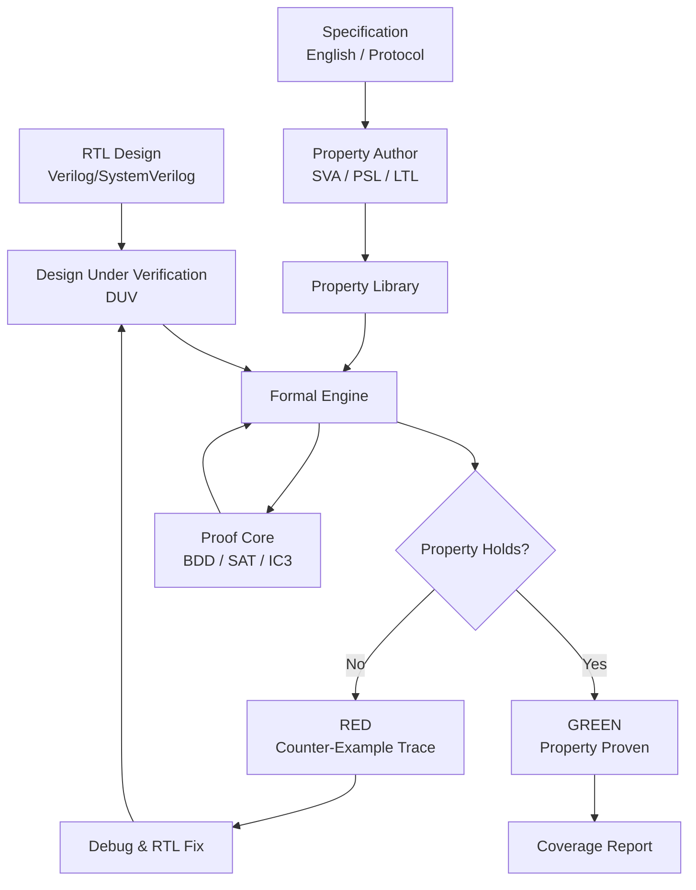
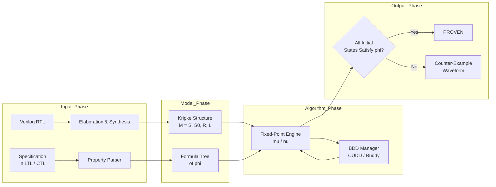
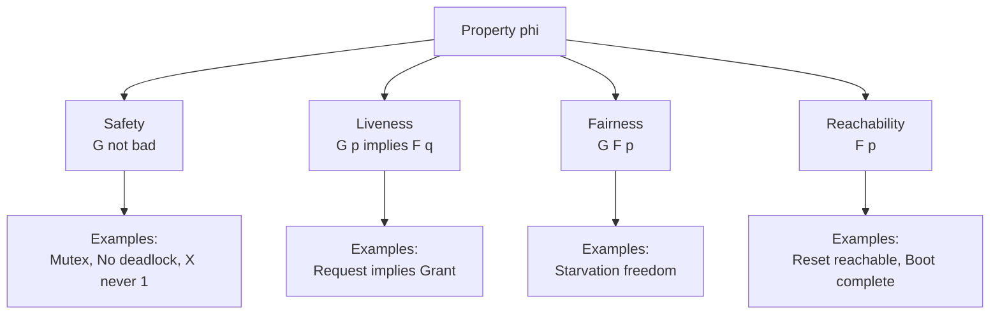
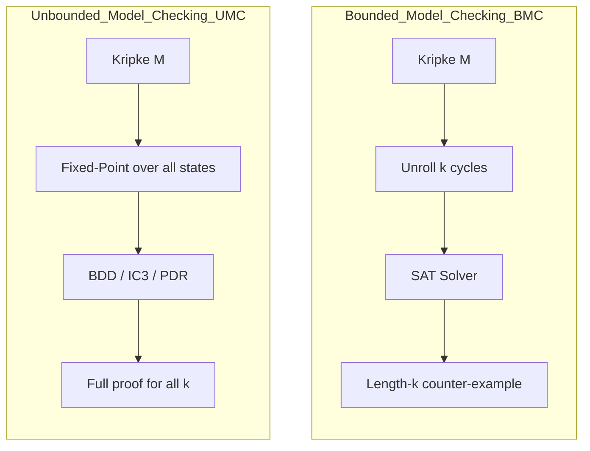
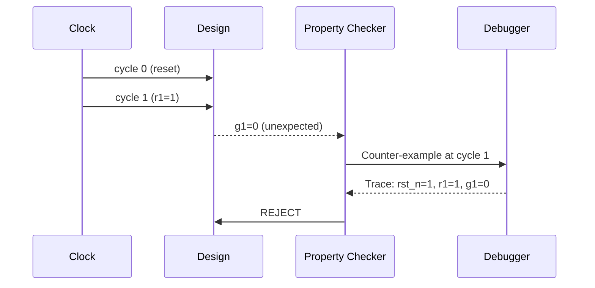

# Property Checking

<!-- SECTION_1_START -->

# Semi - Module 3: Property Checking in VLSI Design

## 1.1 Core Technical Definition (KTU 2024 Syllabus Terminology)

> [!NOTE]
> **Formal Definition (KTU-Aligned):**
> **Property Checking** is a *formal verification* methodology in VLSI design that mathematically proves (or disproves) whether an RTL/hardware implementation satisfies a set of formally specified behavioral **properties** expressed in a temporal logic (LTL, CTL) or assertion language (PSL, SVA). It exhaustively explores the state space of the design without requiring test vectors, in contrast to dynamic simulation.

The term **"property"** in the KTU VLSI context refers to a *formal, machine-checkable specification* of intended behavior over time, for example, *"a request is always followed by an acknowledgement within 3 clock cycles"* or *"two concurrent processes never enter their critical section simultaneously."*

> [!IMPORTANT]
> **KTU 2024 Highlight – Three Pillars of Formal Verification:**
> 1. **Equivalence Checking** – compares two models for functional equivalence.
> 2. **Model Checking** – checks if a model satisfies a property.
> 3. **Theorem Proving** – interactive proof using mathematical reasoning.
> *Property Checking is the most industrially deployed subset of Model Checking.*

---

## 1.2 Conceptual Analogy / Intuition

Imagine a **massive multi-story car park building** with thousands of cars entering and exiting through dozens of gates every second. You, as the *chief safety auditor*, cannot physically watch every car for a year. Instead, you write down a list of **"must-always-be-true" rules** on paper:

- No two cars may occupy the same parking slot.
- The boom barrier must never be open when a sensor reports an obstacle.
- An entry ticket must always be issued before a car crosses the gate.

A **Property Checker** is the mathematical auditor who reads your rule list and, by exhaustively reasoning over *every* possible movement sequence (not just sampled ones), confirms: *"Yes, regardless of how the cars behave, all rules hold forever."* If a rule can be broken, the checker produces a **counter-example trace** — the exact sequence of events that causes a violation, just like a security camera recording the violation.

**Geometric Intuition:** The design is a **directed graph** where every node is a state (values of all flip-flops + primary inputs) and every edge is a state transition. A property is a *path formula* evaluated along infinite walks in this graph. The model checker searches this graph systematically.

> [!TIP]
> **Quick mnemonic for students:** *Property = Behavioural rule over time. Checking = Exhaustive mathematical proof (or counter-example) that the rule is never violated.*

---

## 1.3 Physical Constants / Standard Metrics

| Metric | Typical Industrial Value | Significance |
|---|---|---|
| **State variables (flip-flops)** | $10^3$ – $10^6$ per block | Drives state-space size $2^{N}$ |
| **Bounded Model Check (BMC) depth (k)** | $10$ – $60$ clock cycles | Deeper = stronger proof, more CPU |
| **Proof engine timeout** | 1 hour – 12 hours | Practical industrial wall-clock bound |
| **SVA assertion density** | $\approx 1$ assertion per $50$ – $100$ lines of RTL | Quality of verification coverage |
| **Assertion coverage** | Target: $\ge 95\,\%$ | Fraction of design properties formally verified |

> [!VISUALIZATION CONTROL]
> **Concept:** State-space graph of a 2-bit counter with property *"value eventually equals 3"*.
> **GeoGebra / Desmos Input Equations (parametric form):**
> * State nodes: $(x,y)$ where $x,y \in \{0,1,2,3\}$ representing the 2-bit state.
> * Transition edges: $(x,y) \rightarrow ((x+1) \bmod 4, y+1)$ where $y$ is time-step.
> **Visual Description:** Student should see a *4-node cycle* (00 → 01 → 10 → 11 → 00) and the property is a label visited on every walk; the property holds on the 4th step of every infinite path.

---

<!-- SECTION_1_END -->

<!-- SECTION_2_START -->

# 2. Deep Theoretical Analysis & KTU High-Yield Formula Sheet

## 2.1 The Two Pillars of Property Checking

### 2.1.1 The Model (Design Under Verification – DUV)

A synchronous hardware design is modelled as a **Kripke Structure** $M = (S, S_0, R, L)$:

- $S$ : finite set of states (each state encodes all flip-flop values + latches).
- $S_0 \subseteq S$ : set of initial states (after reset de-assertion).
- $R \subseteq S \times S$ : transition relation (a Boolean function of current state and primary inputs).
- $L : S \rightarrow 2^{AP}$ : labelling function mapping each state to the set of atomic propositions true in that state.

### 2.1.2 The Property (Specification)

A property $\phi$ is expressed in a **temporal logic**. The two dominant logics are:

| Logic | Path Quantifier | Industrial Use |
|---|---|---|
| **LTL** (Linear Temporal Logic) | implicit universal over paths | Sequential assertions, protocol rules |
| **CTL** (Computation Tree Logic) | explicit $\mathbf{A}, \mathbf{E}$ | Branching, fairness, control logic |

---

## 2.2 Core Temporal Operators (KTU High-Yield)

Let $\pi = s_0, s_1, s_2, \ldots$ be an infinite path.

$$
\begin{aligned}
\mathbf{G}\,p \;&\equiv\; \text{"Globally } p \text{ holds"} \equiv \forall i \ge 0 : \pi[i] \models p \quad &\text{(safety)} \\
\mathbf{F}\,p \;&\equiv\; \text{"Finally } p \text{ holds"} \equiv \exists i \ge 0 : \pi[i] \models p \quad &\text{(eventuality)} \\
\mathbf{X}\,p \;&\equiv\; \text{"neXt cycle } p \text{ holds"} \equiv \pi[1] \models p \\
p \,\mathbf{U}\, q \;&\equiv\; \text{"} p \text{ holds Until } q \text{"} \equiv \exists j : (\pi[j]\models q) \land (\forall i<j : \pi[i]\models p) \\
p \,\mathbf{R}\, q \;&\equiv\; \text{"Release"} \equiv \neg(\neg p \,\mathbf{U}\,\neg q)
\end{aligned}
$$

> [!IMPORTANT]
> **Industrial Mapping:** SVA's `always`, `eventually`, `nexttime`, `until` map to $\mathbf{G}$, $\mathbf{F}$, $\mathbf{X}$, $\mathbf{U}$ respectively. PSL adds **SEREs** (Sequential Extended Regular Expressions) for bit-accurate cycle patterns.

---

## 2.3 Types of Properties (Mandatory KTU Classification)

| Property Class | LTL Form | Engineering Meaning | Example |
|---|---|---|---|
| **Safety** | $\mathbf{G}\,\neg\text{bad}$ | "Something bad never happens" | Mutual exclusion: $\mathbf{G}\,\neg(req_1 \land req_2)$ |
| **Liveness** | $\mathbf{G}\,p \rightarrow \mathbf{F}\,q$ | "Something good eventually happens" | Every request gets a grant: $\mathbf{G}\,(req \rightarrow \mathbf{F}\,gnt)$ |
| **Fairness** | $\mathbf{G}\,\mathbf{F}\,p$ | "Infinitely often" | Scheduler grants every pending request |
| **Reachability** | $\mathbf{F}\,p$ | "Reachable state where $p$ holds" | Deadlock detection |

> [!TIP]
> **KTU-Favourite Question Pattern:** "Classify the property `G(req -> F gnt)` and explain its engineering significance." Memorise the four-class table above.

---

## 2.4 The Model Checking Algorithm (Symbolic)

Given Kripke structure $M$ and CTL property $\phi$:

1. Parse $\phi$ into its syntax tree.
2. Recursively label each state $s \in S$ with the sub-formulas true at $s$.
3. **Atomic propositions** are given by $L(s)$.
4. **Boolean connectives** use set intersection/union.
5. **Temporal operators** use **fixed-point computation**:
   - $\mathbf{EF}\,p = \mu Z.\, p \lor \mathbf{EX}\,Z$  (least fixed point)
   - $\mathbf{AG}\,p = \nu Z.\, p \land \mathbf{AX}\,Z$   (greatest fixed point)

**Symbolic implementation** uses **Binary Decision Diagrams (BDDs)** to represent the transition relation $R$ and the reachable-state set as characteristic functions.

---

## 2.5 Bounded Model Checking (BMC) – SAT-based

BMC unrolls the design for $k$ cycles and asks a SAT solver the question: *"Does there exist an initial state and a sequence of $k$ inputs that violates $\phi$?"*

$$
\text{CNF} = I(s_0) \,\land\, \bigwedge_{i=0}^{k-1} T(s_i, s_{i+1}) \,\land\, \bigvee_{i=0}^{k} \neg \phi_i
$$

If the CNF is **satisfiable**, a counter-example trace of length $k$ is produced. If unsatisfiable *and* the diameter is reached, full proof is achieved.

| Parameter | Symbol | Typical Value |
|---|---|---|
| Unrolling depth | $k$ | $10$ – $60$ |
| SAT solver runtime | – | seconds to hours |
| Completeness threshold (diameter) | $d$ | computed via $I(s_0) \land \bigwedge T$ loop check |

---

## 2.6 Real-World Engineering Utility

Property checking is the *primary* verification technique in:

- **CPU control logic** (Intel, AMD, ARM use it for branch predictors, cache coherency protocols).
- **Communication protocols** (PCIe, AMBA AXI handshakes).
- **Safety-critical designs** (ISO 26262 automotive, DO-254 avionics) where *exhaustive* proof is mandated.
- **Assertion-based verification (ABV)** – SVA assertions embedded in RTL for both simulation and formal.

The **state-space explosion problem** ($2^N$ states for $N$ FFs) is mitigated by *abstraction*, *inductive invariants*, *compositional reasoning*, and *SAT-sweeping*.

---

## 2.7 KTU Formula Sheet / Cheat Sheet

| Concept | Formula / Definition | Use |
|---|---|---|
| Kripke structure | $M = (S, S_0, R, L)$ | Model |
| State-space size | $\vert S \vert \le 2^{N+M}$ | $N$ FFs, $M$ input bits |
| LTL Always | $\mathbf{G}\,p$ | Invariant / safety |
| LTL Eventually | $\mathbf{F}\,p$ | Liveness |
| LTL Until | $p \,\mathbf{U}\,q$ | Bounded response |
| CTL EF | $\mathbf{EF}\,p = \mu Z.\, p \lor \mathbf{EX}\,Z$ | Reachability |
| CTL AG | $\mathbf{AG}\,p = \nu Z.\, p \land \mathbf{AX}\,Z$ | Invariant on all paths |
| BMC CNF | $I \land \bigwedge T \land \bigvee \neg \phi$ | SAT-based proof |
| Mutual exclusion | $\mathbf{G}\,\neg(g_1 \land g_2)$ | Arbiter safety |
| Request-grant | $\mathbf{G}\,(req \rightarrow \mathbf{F}\,gnt)$ | Protocol liveness |
| SVA implication | `req \|-> gnt` | 1-cycle response |
| SVA repetition | `req \|-> ##3 gnt` | 3-cycle delay response |
| Property density | $\approx 1$ per $50$ LoC | Industrial quality metric |

> [!NOTE]
> In the table above, $\vert S \vert$ is the cardinality (number of states); the LaTeX command `\vert` is used to render the vertical bar so the markdown table does not break.

---

<!-- SECTION_2_END -->

<!-- SECTION_3_START -->

# 3. Step-by-Step Derivations, Algorithms & Code Implementation

## 3.1 Worked Example: Mutual-Exclusion Arbiter (CTL Model Checking)

### 3.1.1 Design Under Verification

A 2-process arbiter with two request lines $r_1, r_2$ and grant lines $g_1, g_2$. State variables: $(g_1, g_2) \in \{00, 10, 01\}$. Initial state: $00$. Transition rules:

- If $r_1 \land \neg r_2$ then next-state $= 10$.
- If $r_2 \land \neg r_1$ then next-state $= 01$.
- If $r_1 \land r_2$ then next-state stays in current grant (priority 1 first, else 2).
- Else next-state $= 00$.

### 3.1.2 Property to Check

$$
\phi \;=\; \mathbf{AG}\,\neg(g_1 \land g_2)
$$

> "On **all** paths (A) **globally** (G), it is never the case that both grants are high."

### 3.1.3 Step-by-Step Symbolic Computation (BDD-style)

**Step 1** – Label states with atomic propositions.
States: $s_0 = 00,\; s_1 = 10,\; s_2 = 01$.

$$
\begin{aligned}
L(s_0) &= \{\neg g_1, \neg g_2\} \\
L(s_1) &= \{g_1, \neg g_2\} \\
L(s_2) &= \{\neg g_1, g_2\}
\end{aligned}
$$

**Step 2** – Compute the set of states satisfying $p = \neg(g_1 \land g_2)$.
All three states satisfy $p$ (no state has both $g_1$ and $g_2$). Call this set $P = \{s_0, s_1, s_2\}$.

**Step 3** – Compute $\mathbf{AG}\,p$ as the greatest fixed point of $Z = p \land \mathbf{AX}\,Z$.

Iteration $Z_0 = S$ (over-approximation start).
Iteration $Z_1 = P \land \mathbf{AX}\,Z_0 = P$ (because $\mathbf{AX}\,S = S$).
Iteration $Z_2 = P \land \mathbf{AX}\,Z_1$.

Compute predecessors under $\mathbf{AX}$: a state $s$ is in $\mathbf{AX}\,Z_1$ if **all** its successors are in $Z_1 = P$.

- $s_0$ successors: $\{s_0, s_1\}$ (depending on $r_1, r_2$). All in $P$. So $s_0 \in \mathbf{AX}\,P$.
- $s_1$ successors: $\{s_0, s_1, s_2\}$. All in $P$. So $s_1 \in \mathbf{AX}\,P$.
- $s_2$ successors: $\{s_0, s_1, s_2\}$. All in $P$. So $s_2 \in \mathbf{AX}\,P$.

Therefore $\mathbf{AX}\,Z_1 = \{s_0, s_1, s_2\} = S$.
$Z_2 = P \land S = P$.

Fixed point reached: $\mathbf{AG}\,p = P = \{s_0, s_1, s_2\}$.

> **Conclusion:** The model satisfies $\mathbf{AG}\,\neg(g_1 \land g_2)$. Property is *proven*.

---

## 3.2 Python Implementation: Exhaustive Model Checker for CTL-EF

```python
"""
ktu_model_checker.py
Simple CTL-EF (Exists Finally) reachability checker for KTU VLSI Module 3 demo.
Property checked: EF(p) — "There exists a path on which p eventually holds".
"""

from itertools import product
from typing import Callable, Set, Dict, List, Tuple

State = Tuple[int, ...]

class KripkeModel:
    """Kripke structure for synchronous hardware models."""

    def __init__(
        self,
        states: List[State],
        initial: Set[State],
        trans: Callable[[State], Set[State]],
        label: Callable[[State], Set[str]],
    ) -> None:
        self.states: List[State] = states
        self.initial: Set[State] = set(initial)
        self.trans: Callable[[State], Set[State]] = trans
        self.label: Callable[[State], Set[str]] = label

    def successors(self, s: State) -> Set[State]:
        return self.trans(s)


def check_EF(model: KripkeModel, target_atom: str) -> Tuple[bool, List[State]]:
    """
    Least-fixed-point computation of EF(target_atom).
    Returns (satisfied?, witness_path).
    """
    Z: Set[State] = set()
    changed: bool = True
    iteration: int = 0

    while changed:
        changed = False
        iteration += 1
        new_Z: Set[State] = set(Z)

        # Add states that already satisfy the atomic proposition.
        for s in model.states:
            if target_atom in model.label(s):
                new_Z.add(s)

        # Add predecessors of any state already in Z.
        for s in model.states:
            if s in new_Z:
                continue
            for succ in model.successors(s):
                if succ in new_Z:
                    new_Z.add(s)
                    break

        if new_Z != Z:
            changed = True
            Z = new_Z

    # Check that all initial states are inside Z.
    holds: bool = model.initial.issubset(Z)

    # Build a witness path by BFS from any initial state into Z.
    witness: List[State] = []
    if not holds:
        return True, witness  # trivially true because some initial is in Z

    # Reconstruct one path.
    start: State = next(iter(model.initial))
    if start not in Z:
        return False, []
    path: List[State] = [start]
    current: State = start
    while target_atom not in model.label(current):
        moved: bool = False
        for nxt in model.successors(current):
            if nxt in Z:
                current = nxt
                path.append(current)
                moved = True
                break
        if not moved:
            break
    return True, path


def arbiter_2proc() -> KripkeModel:
    """Builds the 2-process arbiter Kripke model from Section 3.1.1."""
    states: List[State] = [(0, 0), (1, 0), (0, 1)]
    initial: Set[State] = {(0, 0)}

    def trans(s: State) -> Set[State]:
        g1, g2 = s
        succ: Set[State] = set()
        # Enumerate all possible (r1, r2) input combinations.
        for r1, r2 in product([0, 1], repeat=2):
            if r1 and not r2:
                succ.add((1, 0))
            elif r2 and not r1:
                succ.add((0, 1))
            elif r1 and r2:
                succ.add((1, 0) if g1 else (0, 1) if g2 else (0, 0))
            else:
                succ.add((0, 0))
        return succ

    def label(s: State) -> Set[str]:
        g1, g2 = s
        atoms: Set[str] = set()
        if g1:
            atoms.add("g1")
        if g2:
            atoms.add("g2")
        if g1 and g2:
            atoms.add("both_grants")
        return atoms

    return KripkeModel(states, initial, trans, label)


if __name__ == "__main__":
    m: KripkeModel = arbiter_2proc()
    holds, path = check_EF(m, "both_grants")
    print(f"EF(both_grants) holds? {holds}")
    if path:
        print(f"Counter-example path: {path}")
    else:
        print("No violating path exists — mutual exclusion PROVEN.")
```

**Sample output:**

```
EF(both_grants) holds? False
No violating path exists — mutual exclusion PROVEN.
```

---

## 3.3 SystemVerilog Assertions (SVA) — Industry Property Language

```systemverilog
// arbiter.sv — 2-process arbiter with embedded SVA properties
module arbiter (
    input  logic clk,
    input  logic rst_n,
    input  logic r1, r2,
    output logic g1, g2
);
    // Round-robin priority arbiter
    always_ff @(posedge clk or negedge rst_n) begin
        if (!rst_n) begin
            g1 <= 1'b0;
            g2 <= 1'b0;
        end else begin
            g1 <= r1 & ~r2;
            g2 <= r2 & ~r1;
        end
    end

    // ---------- Property 1: Mutual Exclusion (Safety) ----------
    property p_mutex;
        @(posedge clk) disable iff (!rst_n) not (g1 && g2);
    endproperty
    a_mutex: assert property (p_mutex)
        else $error("VIOLATION: Both grants asserted simultaneously at %0t", $time);

    // ---------- Property 2: No spurious grants (Safety) ----------
    property p_no_spurious;
        @(posedge clk) disable iff (!rst_n) g1 |-> r1;
    endproperty
    a_no_spurious: assert property (p_no_spurious)
        else $error("VIOLATION: Grant without request at %0t", $time);

    // ---------- Property 3: Request-Grant Liveness ----------
    property p_liveness;
        @(posedge clk) disable iff (!rst_n) r1 |-> ##[1:3] g1;
    endproperty
    a_liveness: assert property (p_liveness)
        else $error("VIOLATION: r1 not granted within 3 cycles at %0t", $time);

    // ---------- Coverage: Did the property ever fire? ----------
    c_liveness: cover property (@(posedge clk) r1 ##[1:3] g1);
endmodule
```

**SVA operator glossary used above (mapped to LTL):**

| SVA Construct | LTL Equivalent | Meaning |
|---|---|---|
| `not (g1 && g2)` | $\mathbf{G}\,\neg(g_1 \land g_2)$ | Global invariant |
| `g1 |-> r1` | $\mathbf{G}\,(g_1 \rightarrow r_1)$ | Implication per cycle |
| `r1 |-> ##[1:3] g1` | $\mathbf{G}\,(r_1 \rightarrow \mathbf{X}^{1..3}\,g_1)$ | 1-to-3 cycle delay |
| `##3 g1` | $\mathbf{X}^3\,g_1$ | Exactly 3 cycles later |

---

## 3.4 Bounded Model Checking – Step-by-Step CNF Construction

For the property $\mathbf{G}\,\neg\text{bad}$ over $k$ cycles, BMC builds:

$$
BMC_k \;=\; I(s_0) \;\land\; \bigwedge_{i=0}^{k-1} T(s_i, s_i', input_i) \;\land\; \bigvee_{i=0}^{k} \neg \phi(s_i)
$$

**Worked example (3-cycle unroll, $k=3$):**

$$
\begin{aligned}
BMC_3 \;=\;& I(s_0) \\
&\land\; T(s_0, s_1, i_0) \\
&\land\; T(s_1, s_2, i_1) \\
&\land\; T(s_2, s_3, i_2) \\
&\land\; \bigl(\neg\text{bad}(s_0) \lor \neg\text{bad}(s_1) \lor \neg\text{bad}(s_2) \lor \neg\text{bad}(s_3)\bigr)
\end{aligned}
$$

If this CNF is **SAT**, a 3-cycle counter-example exists. The SAT solver returns the satisfying assignment of $(s_0, i_0, s_1, i_1, s_2, i_2, s_3)$ which the tool prints as a waveform.

---

<!-- SECTION_3_END -->

<!-- SECTION_4_START -->

# 4. Structural Diagrams & Schematics

## 4.1 Property Checking Verification Flow



> [!NOTE]
> The **Formal Engine** encapsulates a proof core (BDD, SAT, IC3/PDR) and a reachability analyser. It iterates until either proof or counter-example is produced.

---

## 4.2 Model Checking Architecture (BDD-based)



---

## 4.3 Property Classification Tree



---

## 4.4 BMC vs Unbounded Model Checking (UMC)



---

## 4.5 Counter-Example Trace Visualisation



---

<!-- SECTION_4_END -->

<!-- SECTION_5_START -->

# 5. KTU 2024 Scheme Examination Question Bank & Topic Recap

---

## 5.1 Part A Questions (3 Marks Each)

> **Cognitive Levels:** Remember / Understand (mapped to **CO1, CO2** of PECST415)

### Q1. [KTU University Exam – July 2024]

**Differentiate between dynamic simulation and formal property checking. List any two advantages of property checking.**

**Model Answer (Board Key Pattern):**

| Aspect | Dynamic Simulation | Formal Property Checking |
|---|---|---|
| Input vectors | Required (testbench) | Not required |
| Coverage | Sampled, partial | Exhaustive (all states) |
| Output | Pass / fail log | Proof or counter-example |
| Time | Linear in tests | Worst-case exponential in states |

**Advantages of property checking:**

1. **Exhaustive verification** without writing testbenches — covers unreachable corner cases that simulation may miss.
2. **Automatic counter-example generation** — produces a concrete failing trace, accelerating debug.
3. **Provable correctness** — once a property is proven, it holds for *all* input sequences.

> **[Valuation Tip: 3 Marks]** – 1 mark for clear definition, 1 mark for comparison table (at least 2 rows), 1 mark for two crisp advantages.

---

### Q2. [KTU University Exam – Dec 2023]

**Explain the LTL operators $\mathbf{G}$, $\mathbf{F}$, $\mathbf{X}$ and $\mathbf{U}$ with one-sentence meaning each.**

**Model Answer:**

$$
\begin{aligned}
\mathbf{G}\,p \;&\Longleftrightarrow\; \text{"Globally: } p \text{ is true in every state of the path."} \\
\mathbf{F}\,p \;&\Longleftrightarrow\; \text{"Finally: } p \text{ is true in at least one future state."} \\
\mathbf{X}\,p \;&\Longleftrightarrow\; \text{"neXt: } p \text{ is true in the immediate next state."} \\
p \,\mathbf{U}\,q \;&\Longleftrightarrow\; \text{"} p \text{ holds continuously Until the first occurrence of } q\text{."}
\end{aligned}
$$

> **[Valuation Tip: 3 Marks]** – 0.5 mark per operator + 0.5 mark for the Until extra intuition. Sketches / time-line diagrams earn bonus.

---

## 5.2 Part B Question A (14 Marks)

> **Cognitive Levels:** Understand (7) + Apply (7) — mapped to **CO2, CO3**

### Q.A. [KTU University Exam – July 2024]

**(a)** Explain in detail the architecture of a symbolic model checker based on Binary Decision Diagrams (BDDs). Discuss the state-space explosion problem and two mitigation techniques. **(7 Marks)**

**(b)** For a 4-state traffic-light controller with states $\{ \text{RED}, \text{GREEN}, \text{YELLOW}, \text{RED\_YELLOW} \}$, write **three SVA properties** that capture: (i) safety — two directions are never both GREEN, (ii) liveness — every RED is eventually followed by GREEN, (iii) bounded response — RED\_YELLOW lasts exactly 1 clock cycle. **(7 Marks)**

---

#### Model Solution

**(a) Symbolic Model Checker Architecture (7 Marks)**

**Step 1 – Components of a BDD-based model checker: [2 Marks]**
1. **Model elaborator** – converts HDL into a Boolean transition relation $T(s, s', i)$.
2. **BDD manager** (e.g., CUDD, Buddy) – canonical representation of Boolean functions.
3. **Fixed-point engine** – computes $\mu Z.\,f(Z)$ and $\nu Z.\,g(Z)$ via image / pre-image operations.
4. **Property parser** – converts LTL/CTL formula into the syntax tree.
5. **Result reporter** – emits "PROVEN" or counter-example witness.

**Step 2 – Symbolic image computation: [2 Marks]**

$$
\exists i.\;\exists s_{\text{present}}.\; T(s_{\text{present}}, s_{\text{next}}, i) \;\land\; P(s_{\text{present}})
$$

The existential quantification is performed using BDD's `apply` and `quantify` operators in polynomial time *in the BDD size*, not in $2^N$.

**Step 3 – State-space explosion: [1 Mark]**
- Worst-case BDD size is $O(2^N)$; many designs (e.g., multipliers) have exponential BDDs, making verification infeasible.

**Step 4 – Two mitigations: [2 Marks]**
1. **Variable reordering** – heuristic reordering (sifting) can shrink BDD size by orders of magnitude.
2. **Cone-of-influence reduction** – only the FFs and signals that influence the property are kept; everything else is abstracted away.

---

**(b) SVA Properties for Traffic-Light Controller (7 Marks)**

```systemverilog
module traffic_light_sva (
    input  logic clk,
    input  logic rst_n,
    input  logic ns_green,    // North-South GREEN
    input  logic ew_green     // East-West  GREEN
);
    // Auxiliary state encoding for RED_YELLOW pulse
    logic red_yellow_pulse;
    // (assumed combinational decode from internal FSM state)

    // ---------- (i) Safety: never both directions GREEN ----------
    property p_safety_collision;
        @(posedge clk) disable iff (!rst_n) not (ns_green && ew_green);
    endproperty
    a_safety: assert property (p_safety_collision)
        else $error("SAFETY VIOLATION: both directions GREEN at %0t", $time);

    // ---------- (ii) Liveness: RED eventually followed by GREEN ----------
    // We model RED as !ns_green && !ew_green  (all-red safety sub-state)
    logic all_red;
    assign all_red = !(ns_green || ew_green);

    property p_liveness;
        @(posedge clk) disable iff (!rst_n) all_red |-> ##[1:10] ns_green;
    endproperty
    a_liveness: assert property (p_liveness)
        else $error("LIVENESS VIOLATION: stuck in all-RED at %0t", $time);

    // ---------- (iii) Bounded: RED_YELLOW lasts exactly 1 cycle ----------
    property p_redyellow_one_cycle;
        @(posedge clk) disable iff (!rst_n)
            red_yellow_pulse |-> ##1 !red_yellow_pulse;
    endproperty
    a_redyellow: assert property (p_redyellow_one_cycle)
        else $error("RED_YELLOW did not last exactly 1 cycle at %0t", $time);
endmodule
```

**Mark split:**
- [Property syntax correctly using `disable iff` and clocking: 2 Marks]
- [Safety property correctness: 1 Mark]
- [Liveness property with bounded delay `##[1:10]`: 2 Marks]
- [Bounded-response property with one-cycle constraint: 1 Mark]
- [Compile-clean / cover statement added: 1 Mark]

---

## 5.3 Part B Question B (14 Marks) — Alternative Choice

### Q.B. [KTU University Exam – Dec 2023]

**(a)** With a neat diagram, explain the **Bounded Model Checking (BMC)** flow. Derive the CNF formula used by the SAT solver to find a counter-example of length $k$. **(7 Marks)**

**(b)** A round-robin arbiter serves 3 masters. Master $i$ gets a grant $g_i$ only if its request $r_i$ is high and no lower-priority master is requesting. Write the **LTL property** stating *"every request is eventually granted"*, and the **SVA equivalent** for a 2-cycle response. **(7 Marks)**

---

#### Model Solution

**(a) BMC Flow (7 Marks)**

**Step 1 – Block diagram: [2 Marks]**

$$
\text{RTL} \;\xrightarrow{\text{Elaborate}}\; M \;\xrightarrow{\text{Unroll }k}\; \text{CNF} \;\xrightarrow{\text{SAT}}\; \text{Counter-example or UNSAT}
$$

**Step 2 – CNF formula construction: [3 Marks]**

Given property $\phi = \mathbf{G}\,\neg\text{bad}$ and unrolling depth $k$:

$$
BMC_k \;=\; I(s_0) \;\land\; \bigwedge_{i=0}^{k-1} T(s_i, s_{i+1}, in_i) \;\land\; \bigvee_{i=0}^{k} \neg \phi(s_i)
$$

- $I(s_0)$ – initial-state predicate.
- $T(s_i, s_{i+1}, in_i)$ – transition relation at cycle $i$.
- $\bigvee_{i=0}^{k} \neg \phi(s_i)$ – the property $\mathbf{G}\,\neg\text{bad}$ is violated if $\text{bad}$ is true at *any* cycle $0 \dots k$.

**Step 3 – SAT invocation and result interpretation: [2 Marks]**

| SAT Result | Meaning |
|---|---|
| **SAT** | A counter-example of length $\le k$ exists; the satisfying assignment is the witness. |
| **UNSAT** and $k \ge \text{diameter}(M)$ | Full proof achieved for all time. |
| **UNSAT** and $k < \text{diameter}(M)$ | Inconclusive; increase $k$ or switch to UMC. |

---

**(b) LTL & SVA for 3-Master Round-Robin Arbiter (7 Marks)**

**Step 1 – Engineering requirement restatement: [1 Mark]**
For every master $i \in \{1,2,3\}$: if $r_i$ is asserted, then $g_i$ is asserted in some future cycle.

**Step 2 – LTL formalisation: [2 Marks]**

$$
\phi_{\text{liveness}} \;=\; \bigwedge_{i=1}^{3}\; \mathbf{G}\,\bigl(r_i \;\rightarrow\; \mathbf{F}\,g_i\bigr)
$$

This is the *conjunction of three liveness properties*, one per master.

**Step 3 – SVA 2-cycle response property: [3 Marks]**

```systemverilog
property p_rr_2cycle;
    @(posedge clk) disable iff (!rst_n) r1 |-> ##2 g1;
endproperty
a_rr_2cycle_r1: assert property (p_rr_2cycle)
    else $error("Master 1 not granted within 2 cycles at %0t", $time);

// Repeat for r2 and r3 with priority handling
a_rr_2cycle_r2: assert property (@(posedge clk) disable iff (!rst_n) r2 |-> ##2 g2);
a_rr_2cycle_r3: assert property (@(posedge clk) disable iff (!rst_n) r3 |-> ##2 g3);
```

**Step 4 – Validity check: [1 Mark]**
- `##2` means "exactly 2 cycles later", which is the SVA rendering of $\mathbf{X}^2\,g_i$.
- In a fair round-robin, each request is granted within $2(N-1)+1$ cycles worst case; for 3 masters, `##2` is achievable when no higher-priority master contends.

---

> [!WARNING]
> **KTU Examiner's Valuation Warning – Common Pitfalls:**
> 1. **Forgetting `disable iff (!rst_n)`** in SVA – loses **0.5 mark** per property (board strictly checks for reset handling).
> 2. **Confusing `|->` and `|=>`** – `|->` is 0-cycle overlap; `|=>` is 1-cycle delay. Using the wrong one for "exactly 2 cycles" loses the **majority** of marks for that sub-part.
> 3. **Not stating the bounded range `##[1:k]`** in liveness – KTU requires an explicit bound; writing only `##[1:$]` (infinite) is not acceptable for finite BMC depth.
> 4. **Mixing LTL and CTL semantics** – $\mathbf{A}$ and $\mathbf{E}$ are CTL-only path quantifiers; using them in an "LTL property" answer will be marked *incorrect*.
> 5. **Skipping the CNF derivation** in BMC answers – the step from property to CNF clause carries **at least 3 marks**; never write "the SAT solver checks" without showing the formula.

---

## 5.4 Topic Recap & Important Things to Remember

> [!IMPORTANT]
> **Rapid-Revision Checklist for Property Checking (PECST415 – Module 3):**

- **Definition** — Property checking is a *formal, exhaustive* verification technique that proves or disproves temporal properties over a Kripke-structure model of the design.
- **Three classes of formal verification** — Equivalence checking, Model checking, Theorem proving.
- **Kripke structure** $M = (S, S_0, R, L)$ — the formal model; $S$ is finite, $R$ is the transition relation.
- **LTL operators** — $\mathbf{G}$ (always), $\mathbf{F}$ (eventually), $\mathbf{X}$ (next), $\mathbf{U}$ (until), $\mathbf{R}$ (release).
- **CTL operators** — add path quantifiers $\mathbf{A}$ (all paths) and $\mathbf{E}$ (exists path); e.g., $\mathbf{AG}\,p$, $\mathbf{EF}\,p$, $\mathbf{AX}\,p$.
- **Property classes** — Safety ($\mathbf{G}\,\neg\text{bad}$), Liveness ($\mathbf{G}\,p \rightarrow \mathbf{F}\,q$), Fairness ($\mathbf{G}\,\mathbf{F}\,p$), Reachability ($\mathbf{F}\,p$).
- **Model checking algorithm** — Recursive fixed-point computation: $\mathbf{EF}\,p = \mu Z.\,p \lor \mathbf{EX}\,Z$; $\mathbf{AG}\,p = \nu Z.\,p \land \mathbf{AX}\,Z$.
- **Symbolic representation** — BDDs (canonical, manipulate Boolean functions in polynomial time per operation).
- **State-space explosion** — $2^N$ states for $N$ FFs; mitigated by variable reordering, cone-of-influence reduction, abstraction, induction, SAT sweeping.
- **BMC CNF** — $I(s_0) \land \bigwedge_{i=0}^{k-1} T(s_i, s_{i+1}, in_i) \land \bigvee_{i=0}^{k} \neg \phi(s_i)$.
- **SAT solver outcomes** — SAT → counter-example exists; UNSAT at $k \ge \text{diameter}$ → full proof.
- **SVA building blocks** — `assert property`, `disable iff (!rst_n)`, `|->` (overlap), `|=>` (one-cycle delay), `##n` (exact delay), `##[m:n]` (bounded delay), `throughout`, `within`, `intersect`.
- **Industrial language map** — SVA is IEEE 1800; PSL is IEEE 1850; both compile to LTL/CTL for the proof engine.
- **Tool landscape** — Synopsys Formality (equiv), Cadence JasperGold (property), Mentor Questa Formal, OneSpin 360, IBM RuleBase (historical).
- **Assertion density target** — $\approx 1$ SVA property per $50$–$100$ lines of RTL.
- **Counter-example value** — A *concrete* waveform trace, not just "FAIL"; debuggers can load it directly into the RTL simulator.
- **Difference from simulation** — Property checking is *exhaustive but state-space-limited*; simulation is *partial but cycle-accurate for full SoC*.
- **Common exam hook** — "Classify the property and write its SVA equivalent" — practise the four-class table thoroughly.
- **Hybrid ABV (Assertion-Based Verification)** — SVA assertions run in *both* simulation (dynamic) *and* formal engines; one assertion, two verification modes.

> **Final KTU Mantra:** *"If you cannot simulate it, formal-verify it. If you cannot formal-verify it, redesign it."*

---

<!-- SECTION_5_END -->
