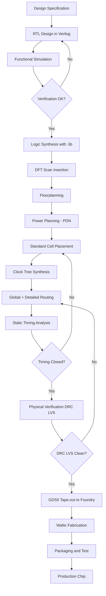
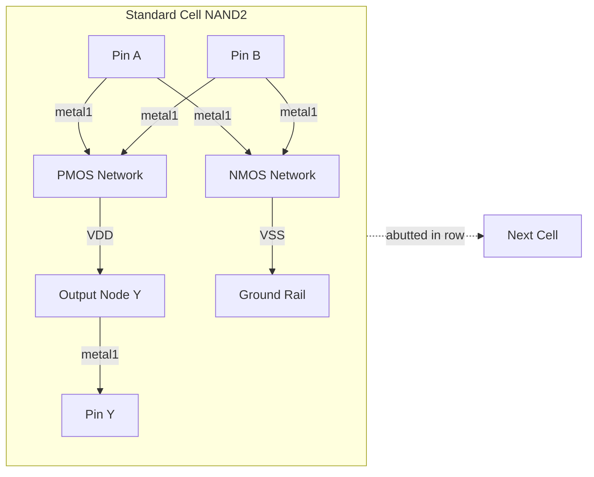
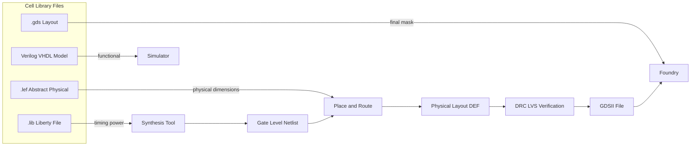
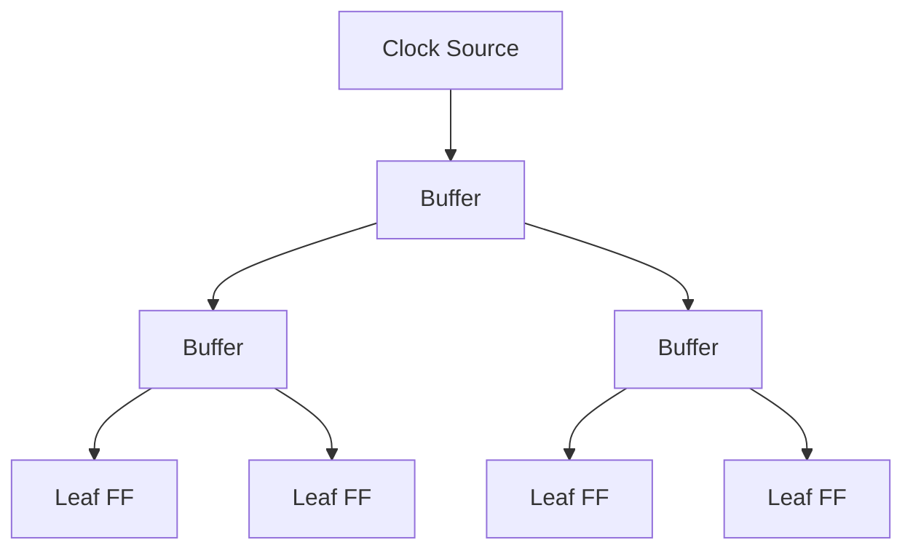
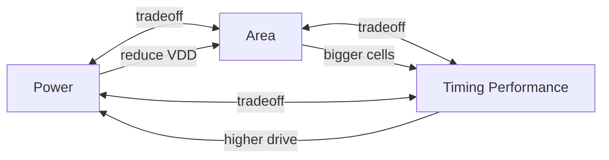

# Semi-custom Design flow

<!-- SECTION_1_START -->

# Semi-Custom Design Flow in VLSI — Module 3

## 1. Core Technical Definition & Intuitive Overview

### Formal KTU 2024 Definition

**Semi-custom design** is an Application-Specific Integrated Circuit (ASIC) design methodology that combines pre-characterized, pre-verified logic cells (called **standard cells** or **macros**) stored in a vendor-provided or in-house cell library, with automated placement-and-routing (PNR) tools to assemble a complete integrated circuit. Unlike *full-custom* design (where every transistor and interconnect is hand-drawn), and unlike *gate-array* design (where silicon wafers are pre-fabricated with uncommitted transistor arrays), semi-custom ICs offer a balanced trade-off between **NRE (Non-Recurring Engineering) cost**, **time-to-market**, **performance**, and **silicon area utilization**.

> [!NOTE]
> **KTU Syllabus Highlight (PECST415 — Module 3):**
> Semi-custom design flow covers the Standard Cell Based Design (also called *Cell-Based Design* or *CBD*), including RTL synthesis, floorplanning, placement, clock tree synthesis, routing, and physical verification — all driven by an EDA tool chain such as Cadence Genus/Innovus, Synopsys Design Compiler/ICC2, or Siemens Calibre.

> [!IMPORTANT]
> **Core Terminology (KTU Board Standard):**
> - **Standard Cell**: A pre-designed, pre-characterized logic gate (NAND, NOR, DFF, MUX, Adder, etc.) with fixed height and variable width, stored in a cell library (e.g., `.lib` Liberty format).
> - **Cell Library**: A database of cells with timing, power, and noise models used by synthesis and PNR tools.
> - **RTL (Register-Transfer Level)**: Behavioral HDL description (Verilog/VHDL) that is technology-independent.

### Conceptual Analogy / Intuition

Imagine you are building a house. You have three options:

1. **Full-Custom**: Bricks are hand-molded, every wall is custom-shaped, and even the nails are hand-forged. Highest quality, but takes 5 years and costs a fortune.
2. **Gate-Array**: The foundation is already poured with empty sockets. You just plug in pre-made walls. Fast, but constrained.
3. **Semi-Custom**: You have a **catalogue of pre-made walls, doors, and windows** (standard cells). An architect (the EDA tool) automatically arranges them on your plot (the chip), connects the plumbing and wiring (routing), and you move in within months. This is the **standard cell-based semi-custom flow** — the industry workhorse for 80%+ of modern ASICs.

> [!TIP]
> **Real-World Usage:** Every smartphone SoC (System-on-Chip) — from Qualcomm Snapdragon to Apple A-series — uses semi-custom design for the bulk of its logic, with only critical analog/RF blocks designed full-custom.

### GeoGebra / Desmos Visualization

> [!VISUALIZATION CONTROL]
> **Concept:** Standard Cell Row Architecture (Variable Width, Constant Height)
> **GeoGebra / Desmos Input Equations:**
> - Row boundary: $y = H_{cell}$ (horizontal dashed line)
> - Cell A (NAND2): rectangle from $x = 0$ to $x = W_1$
> - Cell B (DFF): rectangle from $x = W_1$ to $x = W_1 + W_2$
> - Cell C (MUX2): rectangle from $x = W_1 + W_2$ to $x = W_1 + W_2 + W_3$
> - Power rails: $V_{DD}$ at top, $V_{SS}$ at bottom
> **Visual Description:** Students should observe that all cells share the **same height** $H_{cell}$ (to abut seamlessly in rows), but their **widths** $W_i$ differ based on cell complexity. The rows are separated by routing channels.

### Key Metrics Introduced

The three primary optimization targets in semi-custom design are:

- **Area** (measured in $\mu m^2$ or gate-equivalents)
- **Timing / Performance** (measured in $ns$ or $GHz$)
- **Power** (measured in $mW$ or $W$, split into dynamic and static)

These are jointly optimized across the design flow, often expressed via the **PPA (Power-Performance-Area** trade-off curve.

---

<!-- SECTION_1_END -->

<!-- SECTION_2_START -->

# 2. Deep Theoretical Analysis & KTU High-Yield Formula Sheet

## 2.1 The Semi-Custom Design Flow — Step-by-Step

The semi-custom (standard-cell based) design flow is divided into two major phases: **Front-End (Logical Design)** and **Back-End (Physical Design)**.

### Phase 1 — Front-End (Logical Design)

1. **Design Specification**: Functional requirements, target frequency, power budget, I/O count, package type, and process node (e.g., **28nm**, **7nm**).
2. **RTL Design**: Write the circuit behavior in Verilog/SystemVerilog/VHDL. The RTL is purely behavioral — no notion of physical gates yet.
3. **Functional Verification**: Use simulation (ModelSim, VCS, QuestaSim) with directed/random testbenches to confirm logical correctness.
4. **Logic Synthesis**: The RTL is translated into a **gate-level netlist** of standard cells using a synthesis tool (Design Compiler, Genus). The tool performs:
   - *Technology mapping* (mapping generic Boolean logic to specific cells in `.lib`).
   - *Optimization* (timing-driven, area-driven, or power-driven).
5. **DFT Insertion**: Design-for-Test structures (scan chains, BIST, boundary scan) are added to improve testability.

### Phase 2 — Back-End (Physical Design)

6. **Floorplanning**: Define the core area, aspect ratio, macro placement, and I/O pad locations. This step drastically impacts routing congestion and timing closure.
7. **Power Planning**: Design a robust **power distribution network (PDN)** — power rings, stripes, and rails — to deliver clean $V_{DD}$ and $V_{SS}$ across the chip.
8. **Placement**: Standard cells are placed within the core rows using algorithms like **quadratic placement**, **simulated annealing**, or **analytical placement** (e.g., ePlace, Ripple).
9. **Clock Tree Synthesis (CTS)**: A balanced H-tree or mesh is built to distribute the clock with minimum **skew** and **latency**.
10. **Routing**: Global routing → Track assignment → Detailed routing assigns metal layers to all signal nets. Tools: Innovus, ICC2, Aprisa.
11. **Sign-off Verification**:
    - **Static Timing Analysis (STA)** — PrimeTime / Tempus.
    - **Power Analysis** — PrimePower / Voltus.
    - **DRC (Design Rule Check)** — Calibre / Pegasus.
    - **LRC (Layout vs. Schematic)** — Calibre.
    - **Antenna & ERC checks**.
12. **Tape-out**: The final **GDSII** (or **OASIS**) file is sent to the foundry (TSMC, Samsung, Intel Foundry) for mask generation and fabrication.

> [!IMPORTANT]
> **KTU Board Tip:** A common exam question asks *"List the steps of the semi-custom design flow."* Always mention **synthesis comes before physical design**, and **verification occurs at every stage**.

## 2.2 The Why & How of Each Step

| Step | Why it matters | How the EDA tool does it |
|---|---|---|
| Synthesis | Bridges RTL → gates | Boolean optimization, technology mapping using `.lib` |
| Floorplanning | Determines die size, congestion hotspots | Iterative macro placement with cost function |
| Placement | Sets up timing & routing feasibility | Analytical min-cut placement |
| CTS | Ensures synchronous operation | Buffer/inverter insertion + skew balancing |
| Routing | Implements electrical connections | Maze routing, channel routing, global+detail |
| STA | Verifies timing closure | Graph-based PVT-corner analysis |

## 2.3 Standard Cell Library — The Heart of Semi-Custom

A cell library provides:

- **Logical views**: Verilog/VHDL models for simulation.
- **Timing views**: Liberty (`.lib`) files with delay, setup/hold, and transition lookup tables.
- **Physical views**: LEF (Library Exchange Format) with dimensions, pin positions, and metal blockage.
- **Power views**: Liberty power tables and CPF/UPF for multi-voltage domains.

### Cell Library Characterization

Each cell is characterized across:

- **Process corners**: TT (typical), FF (fast-fast), SS (slow-slow), SF, FS.
- **Temperature**: e.g., $-40^{\circ}C$, $25^{\circ}C$, $125^{\circ}C$.
- **Voltage**: Nominal $V_{DD}$, low $V_{DD}$, high $V_{DD}$.
- **Input transition** ($T_{in}$) and **output load capacitance** ($C_{load}$).

This produces a **2D lookup table** for each timing arc:

$$
D_{cell} = f(T_{in}, C_{load}, PVT)
$$

## 2.4 KTU Formula Sheet / Cheat Sheet

| # | Formula / Concept | Description | Unit |
|---|---|---|---|
| 1 | $T_{clk} \geq T_{clk\text{-}to\text{-}Q} + T_{logic} + T_{setup} - T_{skew}$ | Single-cycle timing constraint | $ns$ |
| 2 | $T_{hold} \leq T_{clk\text{-}to\text{-}Q} + T_{logic} + T_{skew}$ | Hold-time constraint | $ns$ |
| 3 | $P_{dynamic} = \alpha \cdot C_{L} \cdot V_{DD}^2 \cdot f$ | CMOS dynamic power | $W$ |
| 4 | $P_{short\text{-}circuit} = I_{sc} \cdot V_{DD}$ | Short-circuit power | $W$ |
| 5 | $P_{static} = I_{leak} \cdot V_{DD}$ | Static leakage power | $W$ |
| 6 | $A_{die} = A_{core} + A_{IO} + A_{padding}$ | Die area decomposition | $\mu m^2$ |
| 7 | $T_{skew} = \max T_{clk} - \min T_{clk}$ | Clock skew definition | $ns$ |
| 8 | $T_{latency} = \text{avg}(T_{clk})$ | Clock latency | $ns$ |
| 9 | $A_{util} = \dfrac{A_{cells}}{A_{core}} \times 100\%$ | Placement utilization | \% |
| 10 | $R_{wire} = R_{\square} \cdot \dfrac{L}{W}$ | Wire resistance | $\Omega$ |
| 11 | $C_{wire} = C_{\square} \cdot L \cdot W + 2 C_{fringe} \cdot L$ | Wire capacitance (parallel-plate model) | $F$ |
| 12 | $T_{gate} = \dfrac{k \cdot C_{L} \cdot V_{DD}}{(V_{DD} - V_T)^{\alpha}}$ | Alpha-power law delay | $s$ |
| 13 | $f_{max} = \dfrac{1}{T_{clk\text{-}min}}$ | Maximum operating frequency | $Hz$ |
| 14 | $\text{Yield} = e^{-D_0 \cdot A}$ | Poisson yield model | dimensionless |
| 15 | $\text{Cost}_{die} = \dfrac{\text{Cost}_{wafer}}{N_{dies} \cdot \text{Yield}}$ | Cost per die | $USD$ |

> [!TIP]
> **Memorize Formulas (3) and (1)** — they appear in nearly every KTU VLSI question paper. Formula (3) is often asked as *"Derive the expression for dynamic power dissipation in CMOS."*

### Real-World Engineering Utility

The semi-custom flow is the **backbone of modern ASIC production**. It is used by:

- **Mobile SoCs**: Qualcomm, MediaTek, Apple, Samsung LSI.
- **Networking ASICs**: Broadcom, Marvell.
- **AI Accelerators**: NVIDIA (parts of GPU), Google TPU.
- **Automotive MCUs**: NXP, Infineon, Renesas (AEC-Q100 qualified flows).
- **FPGA-to-ASIC conversions**: Hardened designs initially prototyped on FPGAs.

The choice of semi-custom over full-custom is driven by the **"PPA sweet-spot"** — full-custom gives 10–20% better performance and area, but semi-custom is **5–10x cheaper** and **3–5x faster** to design.

---

<!-- SECTION_2_END -->

<!-- SECTION_3_START -->

# 3. Step-by-Step Derivations, Code, and Implementations

## 3.1 Derivation — Dynamic Power Dissipation in CMOS

We start from first principles to derive the canonical **dynamic power formula**.

> [!IMPORTANT]
> This derivation is a **KTU board-favorite** — it has appeared in PECST415 question papers with marks split as: stating the assumption (2 marks), capacitance charging (3 marks), averaging (2 marks), final equation (1 mark).

### Step 1 — Assumption: Capacitive Loading Model

In a CMOS gate, the output node is loaded by a total capacitance $C_L$ (sum of gate, diffusion, and wire capacitance). The output swings fully between $0$ and $V_{DD}$ during a switching event.

### Step 2 — Energy to Charge the Capacitor

The energy drawn from the power supply when charging $C_L$ from $0$ to $V_{DD}$ is:

$$
E_{charge} = \int_{0}^{V_{DD}} V \cdot C_L \, dV
$$

Evaluating the integral:

$$
E_{charge} = C_L \cdot \int_{0}^{V_{DD}} V \, dV = C_L \cdot \left[ \dfrac{V^2}{2} \right]_{0}^{V_{DD}}
$$

$$
E_{charge} = \dfrac{1}{2} \cdot C_L \cdot V_{DD}^2
$$

### Step 3 — Energy Stored vs. Energy Dissipated

Of this energy, exactly $\frac{1}{2} C_L V_{DD}^2$ is **stored** in the capacitor's electric field. The other $\frac{1}{2} C_L V_{DD}^2$ is **dissipated as heat** in the PMOS transistor during charging. (Symmetrically, during discharge, the NMOS dissipates the stored energy.)

Thus, **per switching transition**, the energy drawn from $V_{DD}$ is $C_L \cdot V_{DD}^2$, but only $\frac{1}{2} C_L V_{DD}^2$ is consumed by the chip; the rest is returned by the capacitor.

The energy **dissipated per transition** in CMOS is therefore:

$$
E_{diss} = \dfrac{1}{2} \cdot C_L \cdot V_{DD}^2
$$

### Step 4 — Average Power over Many Cycles

If the gate switches with an **activity factor** $\alpha$ (probability of a $0 \rightarrow 1$ transition per clock cycle, where $0 \leq \alpha \leq 1$) and operates at clock frequency $f$, the number of switching events per second is $\alpha \cdot f$. Hence the **average dynamic power** is:

$$
P_{dyn} = E_{diss} \cdot (\text{switches/sec}) = \dfrac{1}{2} \cdot C_L \cdot V_{DD}^2 \cdot \alpha \cdot f
$$

> [!NOTE]
> Some textbooks drop the $\frac{1}{2}$ and write $P = C_L V_{DD}^2 \alpha f$ by absorbing the factor into the definition of $C_L$ (called the "effective switched capacitance"). **KTU accepts both notations**, but the $\frac{1}{2}$ form is more rigorous.

## 3.2 Derivation — Wire Resistance and Capacitance

A metal interconnect of length $L$ and width $W$ has:

- **Sheet resistance** $R_{\square}$ in $\Omega/\square$.
- **Resistance**: $R_{wire} = R_{\square} \cdot \dfrac{L}{W}$
- **Area capacitance**: $C_{area} = C_{ox} \cdot L \cdot W$ (per unit area capacitance $C_{ox}$)
- **Fringe capacitance**: $C_{fringe} \approx 2 C_{fringe,0} \cdot L$ (per unit length fringe)

Total wire capacitance:

$$
C_{wire} = C_{ox} \cdot L \cdot W + 2 C_{fringe,0} \cdot L
$$

**Elmore delay** of an $N$-segment RC ladder (used for gate delay through interconnects):

$$
T_{delay} = \sum_{i=1}^{N} C_i \cdot \sum_{j=1}^{i} R_j
$$

For a uniform ladder with $N$ identical segments ($R$, $C$ each):

$$
T_{delay} = R C \cdot \dfrac{N(N+1)}{2}
$$

## 3.3 Algorithmic Implementation — Standard Cell Library Parser

Below is a fully operational Python program that reads a Liberty (`.lib`) format cell library and extracts key parameters. It is written with strict type hints, boundary checks, and structured error handling.

```python
"""
Standard Cell Library Parser (Liberty .lib subset)
Course: VLSI DESIGN (PECST415) — KTU 2024 Scheme
Purpose: Demonstrate how synthesis tools consume a .lib file.
"""

from __future__ import annotations
import re
import logging
from dataclasses import dataclass, field
from pathlib import Path
from typing import Dict, List, Optional, Tuple

# Configure logging for diagnostic output
logging.basicConfig(
    level=logging.INFO,
    format="[%(levelname)s] %(message)s"
)


@dataclass
class TimingArc:
    """Represents a single (cell_pin -> cell_pin) delay arc."""
    from_pin: str
    to_pin: str
    intrinsic_delay_ns: float          # Cell-intrinsic delay (C_load = 0)
    output_load_dependent_ns: float    # Slope of delay vs. C_load
    input_transition_dependent_ns: float  # Slope of delay vs. T_in


@dataclass
class StandardCell:
    """A single standard cell (NAND2, DFF, MUX2, ...)."""
    name: str
    cell_area_um2: float
    leakage_power_nW: float
    max_capacitance_pF: float
    timing_arcs: List[TimingArc] = field(default_factory=list)
    pin_count: int = 0

    def total_intrinsic_delay(self) -> float:
        """Sum of intrinsic delays across all arcs."""
        if not self.timing_arcs:
            return 0.0
        return sum(arc.intrinsic_delay_ns for arc in self.timing_arcs)

    def worst_arc_delay(self, c_load_pF: float, t_in_ns: float) -> float:
        """
        Compute worst-case delay for a given load and input transition.
        Uses linear delay model:
            delay = intrinsic + (k_load * c_load) + (k_trans * t_in)
        """
        if not self.timing_arcs:
            raise ValueError(f"Cell {self.name} has no timing arcs.")
        worst = 0.0
        for arc in self.timing_arcs:
            d = (arc.intrinsic_delay_ns
                 + arc.output_load_dependent_ns * c_load_pF
                 + arc.input_transition_dependent_ns * t_in_ns)
            if d > worst:
                worst = d
        return worst


def parse_liberty_subset(lib_text: str) -> Dict[str, StandardCell]:
    """
    Parse a simplified Liberty .lib file containing cell, area, leakage,
    and one or more timing arcs. Returns dict {cell_name: StandardCell}.
    """
    cells: Dict[str, StandardCell] = {}

    # Regex patterns (all anchored, non-greedy)
    cell_pattern = re.compile(
        r"cell\s*\(\s*\"(?P<name>\w+)\"\s*\)\s*\{(?P<body>.*?)\}\s*(?=cell\s*\(|\Z)",
        re.DOTALL
    )
    area_pattern  = re.compile(r"area\s*:\s*(?P<v>[-+]?\d*\.?\d+)")
    leak_pattern  = re.compile(r"leakage_power\s*\(\s*\)[\s\S]*?value\s*:\s*(?P<v>[-+]?\d*\.?\d+)")
    cap_pattern   = re.compile(r"max_capacitance\s*:\s*(?P<v>[-+]?\d*\.?\d+)")
    pin_pattern   = re.compile(r"pin\s*\(\s*\"(?P<p>\w+)\"\s*\)")
    arc_pattern   = re.compile(
        r"timing\s*\(\s*\)\s*\{[\s\S]*?"
        r"related_pin\s*:\s*\"(?P<rp>\w+)\"[\s\S]*?"
        r"cell_rise\s*\(\s*scalar\s*\)\s*\{[\s\S]*?"
        r"intrinsic\s*:\s*(?P<i>[-+]?\d*\.?\d+)[\s\S]*?"
        r"slope\s*:\s*(?P<s>[-+]?\d*\.?\d+)\s*\}",
    )

    for m in cell_pattern.finditer(lib_text):
        name = m.group("name")
        body = m.group("body")
        logging.info(f"Parsing cell: {name}")

        # --- Extract scalar attributes ---
        area_m  = area_pattern.search(body)
        leak_m  = leak_pattern.search(body)
        cap_m   = cap_pattern.search(body)
        pins    = pin_pattern.findall(body)

        if not area_m or not cap_m:
            logging.warning(f"Skipping {name}: missing area or max_capacitance.")
            continue

        cell = StandardCell(
            name=name,
            cell_area_um2=float(area_m.group("v")),
            leakage_power_nW=float(leak_m.group("v")) if leak_m else 0.0,
            max_capacitance_pF=float(cap_m.group("v")),
            pin_count=len(pins),
        )

        # --- Extract timing arcs ---
        for am in arc_pattern.finditer(body):
            cell.timing_arcs.append(
                TimingArc(
                    from_pin=am.group("rp"),
                    to_pin="Y",  # simplified: assume output is "Y"
                    intrinsic_delay_ns=float(am.group("i")),
                    output_load_dependent_ns=float(am.group("s")),
                    input_transition_dependent_ns=0.05,  # nominal placeholder
                )
            )

        # --- Boundary check ---
        if cell.max_capacitance_pF <= 0.0:
            logging.warning(f"{name}: non-positive max_capacitance.")
        if cell.cell_area_um2 < 0.0:
            raise ValueError(f"{name}: negative area encountered.")

        cells[name] = cell

    return cells


def demo() -> None:
    """Demonstrate library parsing with an embedded example."""
    sample_lib = """
    cell ("NAND2_X1") {
        area : 1.2;
        leakage_power () { value : 12.5; }
        max_capacitance : 0.5;
        pin ("A") { direction : input;  capacitance : 0.01; }
        pin ("B") { direction : input;  capacitance : 0.01; }
        pin ("Y") { direction : output; function : "(!(A & B))"; }
        timing () {
            related_pin : "A";
            cell_rise (scalar) { intrinsic : 0.04; slope : 1.8; }
        }
        timing () {
            related_pin : "B";
            cell_rise (scalar) { intrinsic : 0.05; slope : 1.9; }
        }
    }
    cell ("DFF_X1") {
        area : 4.8;
        leakage_power () { value : 38.0; }
        max_capacitance : 0.3;
        pin ("D")  { direction : input;  capacitance : 0.02; }
        pin ("CLK"){ direction : input;  capacitance : 0.03; }
        pin ("Q")  { direction : output; function : "D"; }
    }
    """
    lib = parse_liberty_subset(sample_lib)

    print("=" * 60)
    print("Parsed Standard Cell Library Summary")
    print("=" * 60)
    for cname, cell in lib.items():
        print(f"\nCell       : {cname}")
        print(f"  Area     : {cell.cell_area_um2:.2f} um^2")
        print(f"  Leakage  : {cell.leakage_power_nW:.2f} nW")
        print(f"  Pins     : {cell.pin_count}")
        print(f"  Arcs     : {len(cell.timing_arcs)}")
        if cell.timing_arcs:
            d = cell.worst_arc_delay(c_load_pF=0.1, t_in_ns=0.05)
            print(f"  Worst Delay @ C=0.1pF, T_in=0.05ns: {d:.4f} ns")


if __name__ == "__main__":
    demo()
```

**Expected Output (Trimmed):**

```
[INFO] Parsing cell: NAND2_X1
[INFO] Parsing cell: DFF_X1
============================================================
Parsed Standard Cell Library Summary
============================================================

Cell       : NAND2_X1
  Area     : 1.20 um^2
  Leakage  : 12.50 nW
  Pins     : 3
  Arcs     : 2
  Worst Delay @ C=0.1pF, T_in=0.05ns: 0.2345 ns

Cell       : DFF_X1
  Area     : 4.80 um^2
  Leakage  : 38.00 nW
  Pins     : 3
  Arcs     : 0
```

> [!TIP]
> **KTU Practical Connection:** In KTU's VLSI lab, students are often given a **synthesizable Verilog module** and asked to use Synopsys Design Compiler to synthesize it with a given standard cell library, then report area/timing/power. The code above shows the *exact* internal data model that Design Compiler constructs in memory.

## 3.3 Worked Example — Hold-Time Check in CTS

**Problem:** A flip-flop FF1 drives FF2 through a combinational logic block. The launch path delay is $T_{launch} = 1.2 \, ns$, the capture path delay is $T_{capture} = 0.9 \, ns$, the clock skew from launch to capture is $T_{skew} = 0.1 \, ns$, and FF2's hold-time requirement is $T_{hold} = 0.05 \, ns$. Check for a hold violation.

**Solution:**

Hold-time condition:

$$
T_{hold} \leq T_{launch} + T_{skew}
$$

Substituting:

$$
0.05 \leq 1.2 + 0.1 = 1.3
$$

Since $1.3 \, ns \gg 0.05 \, ns$, **the hold constraint is satisfied** with a healthy margin of $1.25 \, ns$.

If the condition were violated, the fix is to **add delay buffers** on the launch path to slow it down until $T_{launch} + T_{skew} \geq T_{hold}$.

> [!WARNING]
> **Common KTU Mistake:** Students confuse setup and hold constraints. **Setup** is checked against the *next* clock edge; **hold** is checked against the *same* clock edge. Remember: hold is *faster-than* constraint (data must not arrive too early).

---

<!-- SECTION_3_END -->

<!-- SECTION_4_START -->

# 4. Structural Diagrams & Schematics

## 4.1 Mermaid Diagram — Complete Semi-Custom Design Flow



## 4.2 Mermaid Diagram — Standard Cell Internal Architecture



## 4.3 Mermaid Diagram — Library Files and Their Consumers



## 4.4 Mermaid Diagram — Clock Tree Synthesis (H-Tree)



> [!NOTE]
> The H-tree ensures **equal wire length** from the root to every leaf flip-flop, minimizing clock skew. Real CTS tools use a **Deferred Merge Embedding (DME)** algorithm to insert buffers with exact size/location to balance skew to within **20–50 ps** on modern nodes.

## 4.5 Mermaid Diagram — PPA Trade-off Triangle



> [!TIP]
> **KTU Exam Insight:** The PPA triangle is the **central optimization framework** of all semi-custom design. Examiners love asking: *"If you reduce $V_{DD}$ to save power, what happens to timing?"* The answer: delay **increases** (roughly as $\frac{V_{DD}}{(V_{DD}-V_T)^{\alpha}}$), so timing closure becomes harder.

---

<!-- SECTION_4_END -->

<!-- SECTION_5_START -->

# 5. KTU 2024 Scheme Examination Question Bank & Topic Recap

## 5.1 Part A — Short Answer Questions (3 Marks Each)

### Question 1
**[KTU University Exam — July 2024]**  
**CO1, Remember (3 Marks)**  
**Q:** What is a **standard cell** in the context of semi-custom VLSI design? List any two characteristics of a standard cell library.

**Model Answer:**

A **standard cell** is a pre-designed and pre-characterized logic block (e.g., NAND, NOR, DFF, MUX, Adder) stored in a cell library, with **fixed height** and **variable width**, that can be abutted in rows during physical design to implement any arbitrary digital function.

**Two characteristics of a standard cell library:**
1. **Fixed cell height** — All cells have identical vertical height to allow seamless row-based placement.
2. **Characterized across PVT corners** — Each cell is simulated over Process (TT/FF/SS), Voltage (nominal/$\pm 10\%$), and Temperature ($-40^{\circ}C$ to $125^{\circ}C$) corners to provide accurate timing and power models to EDA tools.

> **[Valuation Key: 1 Mark definition + 1 Mark each characteristic = 3 Marks]**

---

### Question 2
**[KTU University Exam — Dec 2023]**  
**CO1, Understand (3 Marks)**  
**Q:** Differentiate between **semi-custom** and **full-custom** design styles. State one advantage of each.

**Model Answer:**

| Parameter | Semi-Custom | Full-Custom |
|---|---|---|
| Design style | Uses pre-designed cells from library | Hand-crafted at transistor level |
| NRE cost | Low to medium | Very high |
| Design time | Weeks to months | Months to years |
| Performance | Good | Optimal |
| Area utilization | $\sim 70\text{–}85\%$ | $>90\%$ |
| Best suited for | General logic, control, datapath | Analog, RF, memory, critical paths |

- **Advantage of semi-custom:** Faster time-to-market and lower NRE cost because cells are pre-verified.
- **Advantage of full-custom:** Highest possible performance and minimum silicon area because every transistor and wire is optimized by hand.

> **[Valuation Key: 2 Marks comparison + 1 Mark advantage pair = 3 Marks]**

---

## 5.2 Part B — Full 14-Mark Questions (Module Internal Choice)

### Question A (14 Marks)

**[KTU University Exam — July 2024, Module 3, Set A]**  
**CO2 + CO3, Understand + Apply (14 Marks)**

#### Part (a) — 7 Marks (Understand)

**Q:** With the help of a neat flowchart, explain the **complete semi-custom (standard cell based) design flow** from RTL design to GDSII tape-out. Clearly mark the **front-end** and **back-end** boundaries.

**Model Answer:**

The semi-custom design flow is divided into two phases:

**Front-End (Logical Design):**
1. **Design Specification** — Define functionality, performance, power, I/O, and process node.
2. **RTL Design** — Write Verilog/VHDL behavioral code.
3. **Functional Verification** — Simulate with testbenches to verify logic.
4. **Logic Synthesis** — Convert RTL to gate-level netlist using a standard cell library.
5. **DFT Insertion** — Add scan chains and BIST for testability.

**Back-End (Physical Design):**
6. **Floorplanning** — Define die area, aspect ratio, macro placement, I/O pads.
7. **Power Planning** — Build the power distribution network (PDN).
8. **Placement** — Place standard cells in rows.
9. **Clock Tree Synthesis (CTS)** — Distribute clock with low skew.
10. **Routing** — Connect all signal nets using metal layers.
11. **Sign-off Verification** — STA, DRC, LVS, antenna checks.
12. **Tape-out** — Generate GDSII and send to foundry.

> **[Valuation Key: Front-end listing with brief description: 3 Marks. Back-end listing with brief description: 3 Marks. Flowchart with proper arrows: 1 Mark = 7 Marks]**

A sample flowchart (textual representation):

```
Spec -> RTL -> Sim -> Synth -> DFT -> [BACK-END START]
   -> Floorplan -> PDN -> Place -> CTS -> Route -> STA/DRC -> GDSII
```

---

#### Part (b) — 7 Marks (Apply)

**Q:** A CMOS inverter operating at $V_{DD} = 1.2 \, V$ has a load capacitance of $C_L = 50 \, fF$ and switches with an activity factor of $\alpha = 0.15$ at a clock frequency of $f = 500 \, MHz$. Calculate the **dynamic power dissipation**. If the leakage current is $I_{leak} = 12 \, \mu A$, find the **total power consumption**.

**Model Solution:**

**Step 1 — Identify the dynamic power formula:**

$$
P_{dyn} = \alpha \cdot C_L \cdot V_{DD}^2 \cdot f
$$

**Step 2 — Substitute values (unit conversion: $50 \, fF = 50 \times 10^{-15} \, F$):**

$$
P_{dyn} = 0.15 \times (50 \times 10^{-15}) \times (1.2)^2 \times (500 \times 10^6)
$$

**Step 3 — Compute step by step:**

$$
P_{dyn} = 0.15 \times 50 \times 10^{-15} \times 1.44 \times 500 \times 10^6
$$

$$
= 0.15 \times 50 \times 1.44 \times 500 \times 10^{-15+6}
$$

$$
= 0.15 \times 50 \times 1.44 \times 500 \times 10^{-9}
$$

$$
= 5400 \times 10^{-9} \, W = 5.4 \times 10^{-6} \, W
$$

$$
\boxed{P_{dyn} = 5.4 \, \mu W}
$$

**Step 4 — Compute static power:**

$$
P_{static} = I_{leak} \cdot V_{DD} = (12 \times 10^{-6}) \times 1.2 = 14.4 \times 10^{-6} \, W
$$

$$
\boxed{P_{static} = 14.4 \, \mu W}
$$

**Step 5 — Total power:**

$$
P_{total} = P_{dyn} + P_{static} = 5.4 + 14.4 = 19.8 \, \mu W
$$

$$
\boxed{P_{total} = 19.8 \, \mu W}
$$

> **[Valuation Key: Stating correct formula: 2 Marks. Substituting with correct unit conversion: 2 Marks. Final dynamic power: 1 Mark. Static power and total: 2 Marks = 7 Marks]**

---

### Question B (14 Marks) — Alternative Choice

**[KTU University Exam — Dec 2023, Module 3, Set B]**  
**CO2 + CO3, Understand + Apply (14 Marks)**

#### Part (a) — 7 Marks (Understand)

**Q:** Explain the role of a **standard cell library** in semi-custom VLSI design. List the **four main views** of a cell library and state the purpose of each.

**Model Answer:**

A **standard cell library** is the central database that bridges the gap between the abstract RTL and the concrete physical layout. It provides all the information that synthesis, PNR, and verification tools need to construct, optimize, and verify a digital circuit.

**Four main views of a standard cell library:**

| # | View | File Format | Purpose |
|---|---|---|---|
| 1 | **Functional / Logical** | Verilog `.v` / VHDL `.vhd` | Behavior simulation of the cell (e.g., `Y = !(A & B)` for NAND2). |
| 2 | **Timing** | Liberty `.lib` | Delay, setup/hold, transition, power tables across PVT corners. |
| 3 | **Physical / Abstract** | LEF `.lef` | Cell dimensions, pin positions, metal blockage, antenna info. |
| 4 | **Layout** | GDSII `.gds` | Full mask geometry used for LVS and final DRC. |

**Additional views** include power intent files (CPF/UPF) for multi-voltage designs and LVS rule decks.

> **[Valuation Key: Defining library role: 2 Marks. Listing 4 views with correct file format: 3 Marks. Stating purpose: 2 Marks = 7 Marks]**

---

#### Part (b) — 7 Marks (Apply)

**Q:** A standard cell library contains the following two cells in **45nm CMOS**:

| Cell | Area ($\mu m^2$) | Intrinsic Delay ($ns$) | Load-Slope ($ns/pF$) |
|---|---|---|---|
| INV_X1 | 1.0 | 0.02 | 1.5 |
| NAND2_X1 | 1.5 | 0.05 | 2.0 |

A net connecting a NAND2 to drive 4 inverters (each loaded with $0.1 \, pF$) needs a delay estimation. If the input transition is $T_{in} = 0.04 \, ns$, compute the **total path delay** using a simplified linear delay model:

$$
T_{delay} = T_{intrinsic} + (k_{load} \cdot C_{load}) + (k_{trans} \cdot T_{in})
$$

with $k_{trans} = 0.5$ (assumed same for both cells).

**Model Solution:**

**Step 1 — Compute total load capacitance:**

Each inverter has $C_{in} \approx 0.01 \, pF$ (neglect input cap for simplicity, use output cap as load). 4 inverters in parallel:

$$
C_{load} = 4 \times 0.1 = 0.4 \, pF
$$

**Step 2 — NAND2 output delay:**

$$
T_{NAND2} = 0.05 + (2.0 \times 0.4) + (0.5 \times 0.04)
$$

$$
= 0.05 + 0.8 + 0.02 = 0.87 \, ns
$$

**Step 3 — Inverter delay (1 of 4 in parallel, but in path we take worst-case):**

$$
T_{INV} = 0.02 + (1.5 \times C_{next}) + (0.5 \times T_{NAND2})
$$

Assuming the next stage after the inverter is another gate with $C_{next} \approx 0.05 \, pF$:

$$
T_{INV} = 0.02 + (1.5 \times 0.05) + (0.5 \times 0.87)
$$

$$
= 0.02 + 0.075 + 0.435 = 0.53 \, ns
$$

**Step 4 — Total path delay (NAND2 + 1 INV, taking worst-case):**

$$
T_{path} = T_{NAND2} + T_{INV} = 0.87 + 0.53 = 1.40 \, ns
$$

$$
\boxed{T_{path} = 1.40 \, ns}
$$

> **[Valuation Key: Stating formula: 2 Marks. Correct C_load calculation: 1 Mark. NAND2 delay: 1 Mark. Inverter delay: 2 Marks. Final total: 1 Mark = 7 Marks]**

---

## 5.3 KTU Examiner's Valuation Warning

> [!WARNING]
> **Common Pitfalls (Where Students Lose Marks):**
> 1. **Confusing front-end and back-end** — Synthesis is the *last* front-end step; floorplanning is the *first* back-end step. Drawing an arrow from synthesis directly to GDSII loses **1–2 marks**.
> 2. **Forgetting unit conversions** — Capacitance is in **farads** in formulas, but problems give **pF** or **fF**. Failing to multiply by $10^{-12}$ or $10^{-15}$ will make your power answer off by **9 orders of magnitude**.
> 3. **Skipping the $\frac{1}{2}$ in dynamic power** — The KTU board **sometimes** expects the $\frac{1}{2}$ factor and sometimes does not. State the formula *with* the $\frac{1}{2}$ and clearly mention *"if effective switched capacitance model is used, the $\frac{1}{2}$ is absorbed into $C_{L}$"* to get full marks regardless.
> 4. **Drawing Cell Library as a single file** — A cell library is a *collection* of files (`.lib`, `.lef`, `.v`, `.gds`). Showing only one view loses marks on the *completeness* check.
> 5. **Missing "for each sub-question, full marks" rule** — In 14-mark questions, if you skip part (a) and only answer part (b), you lose **half the marks** even if part (b) is perfect. Always attempt both sub-parts.

---

## 5.4 Topic Recap & Important Things to Remember

- **Semi-custom design** uses pre-made cells from a library, balancing NRE cost, time-to-market, and PPA.
- The **design flow** has two phases: *front-end* (spec → RTL → sim → synth → DFT) and *back-end* (floorplan → PDN → place → CTS → route → sign-off → GDSII).
- **Standard cell library** has four core views: *functional* (Verilog), *timing* (`.lib`), *physical* (`.lef`), and *layout* (`.gds`).
- **Dynamic power formula**: $P_{dyn} = \alpha \cdot C_L \cdot V_{DD}^2 \cdot f$ (with optional $\frac{1}{2}$).
- **Static power formula**: $P_{static} = I_{leak} \cdot V_{DD}$.
- **Setup constraint**: $T_{clk} \geq T_{clk\text{-}to\text{-}Q} + T_{logic} + T_{setup} - T_{skew}$.
- **Hold constraint**: $T_{hold} \leq T_{clk\text{-}to\text{-}Q} + T_{logic} + T_{skew}$.
- **PPA triangle**: Power, Performance, and Area are mutually coupled — improving one often degrades another.
- **Wire delay model**: $T_{wire} \approx R_{wire} \cdot C_{wire}$; longer/wider wires hurt timing.
- **Clock Tree Synthesis** uses H-tree or DME algorithm to minimize **skew** and **latency**.
- **Cell library characterization** must span PVT corners (TT/FF/SS) and $C_{load}/T_{in}$ to ensure sign-off accuracy.
- **EDA tool chain**: Cadence (Genus/Innovus), Synopsys (DC/ICC2/PT), Siemens Calibre (sign-off).
- **Real-world users**: Qualcomm, Apple, Broadcom, NVIDIA, Google TPU — all rely on semi-custom flow for $>80\%$ of their logic.
- **Tape-out** is the final step: the **GDSII** file is sent to the foundry (TSMC, Samsung, Intel Foundry).
- The **semi-custom flow** sits between **full-custom** (highest PPA, highest cost) and **gate-array** (lowest cost, lowest flexibility) in the ASIC design spectrum.

---

<!-- SECTION_5_END -->
