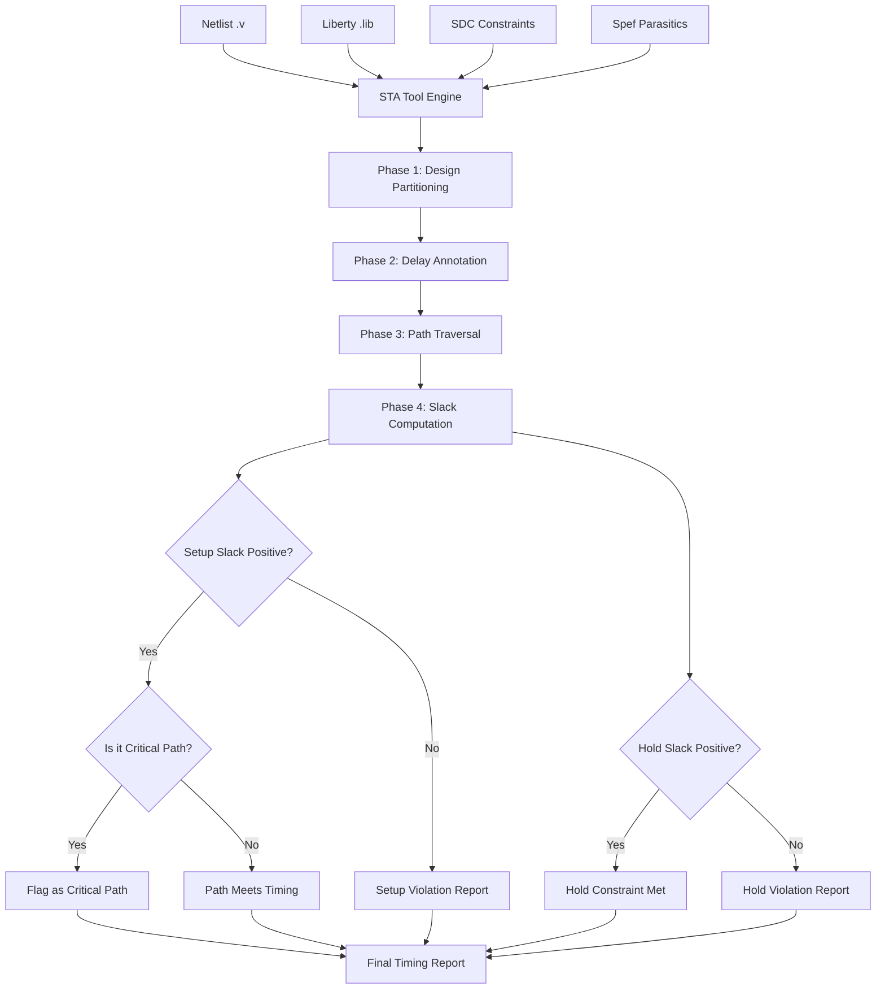
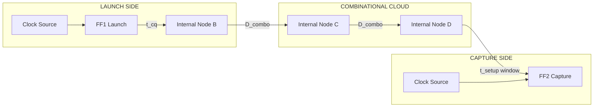
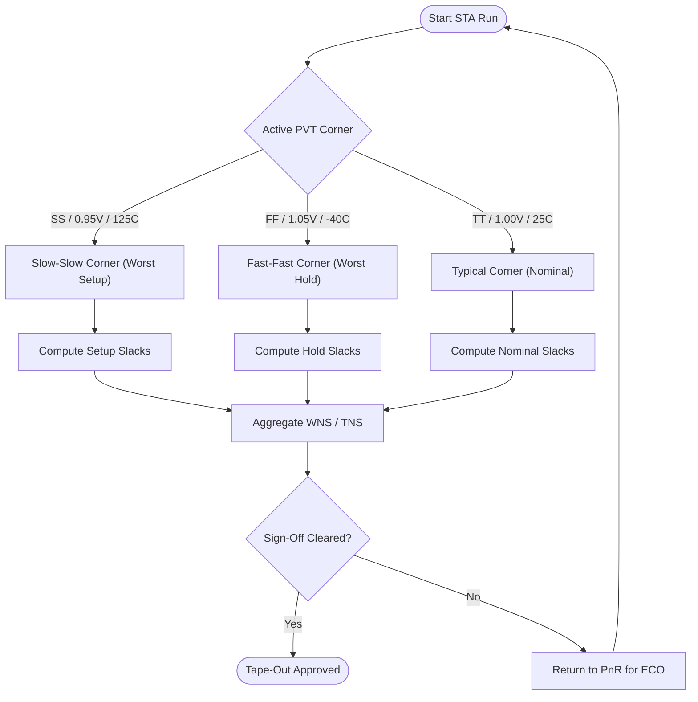
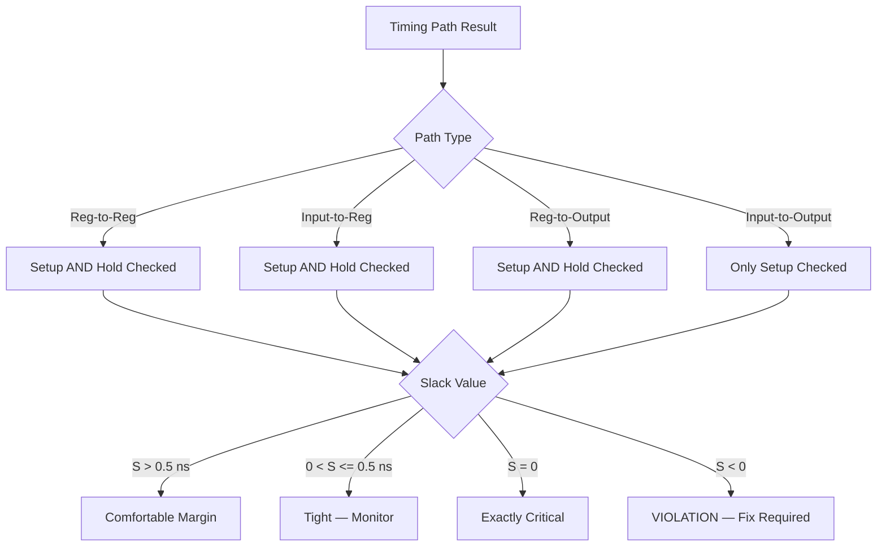

# Static Timing Analysis

<!-- SECTION_1_START -->
# Static Timing Analysis (STA) — Core Technical Definition & Intuitive Overview

## Formal Academic Definition

**Static Timing Analysis (STA)** is a deterministic, vector-less verification methodology used in digital Very-Large-Scale Integration (VLSI) design to validate the temporal correctness of a synchronous sequential circuit. It exhaustively analyzes every logical path in the design—under predefined Process, Voltage, and Temperature (PVT) corners—without applying any input stimulus, ensuring that no setup or hold time violation occurs across the entire timing graph.

> [!IMPORTANT]
> **KTU 2024 Syllabus Definition (PECST415 — Module 3):**
> *"Static Timing Analysis is a method of verifying the timing constraints of a digital design by checking all possible paths for timing violations, independent of input vector simulation. It uses pre-characterized cell delay libraries and interconnect parasitics to compute signal arrival times at every node."*

**Standard Metrics Used in STA:**

| Metric | Symbol | Standard Unit | Physical Meaning |
| :--- | :--- | :--- | :--- |
| **Propagation Delay** | $t_{pd}$ | nanoseconds (ns) | Time for a signal to propagate from input to output of a logic cell. |
| **Contamination Delay** | $t_{cd}$ | nanoseconds (ns) | Minimum time a signal takes to traverse a logic cell. |
| **Setup Time** | $t_{setup}$ | nanoseconds (ns) | Minimum time data must be stable *before* the active clock edge. |
| **Hold Time** | $t_{hold}$ | nanoseconds (ns) | Minimum time data must remain stable *after* the active clock edge. |
| **Clock Period** | $T_{clk}$ | nanoseconds (ns) | Time interval between two consecutive active clock edges. |
| **Slack** | $\mathcal{S}$ | nanoseconds (ns) | Margin by which a timing constraint is met (positive) or violated (negative). |

---

## Conceptual Analogy & Geometric Intuition

> [!NOTE]
> **The Relay Race Analogy — Intuitive Understanding**
>
> Imagine a relay race where runners (logic gates) must pass a baton (data signal) at precisely synchronized moments, coordinated by a stadium horn (the clock). Each runner takes a known minimum and maximum time to complete their leg. The stadium has a fixed lap time (the clock period).
>
> - **Setup Time Check:** The baton must arrive at the next runner's hand **before** the horn blows (i.e., before the next clock edge). If a runner is too slow, the team is **disqualified** (setup violation).
> - **Hold Time Check:** The baton must **not** be released too early, otherwise the receiving runner drops it before they are ready (hold violation).
>
> **STA is the referee** who, instead of watching the actual race, mathematically calculates the slowest and fastest possible baton trajectories across all runners to determine whether the team can ever legitimately finish on time.

### Geometric Visualization

The timing graph can be visualized as a sequence of directed edges along a horizontal time axis. Each combinational cloud sits between two vertical "clock walls."

> [!VISUALIZATION CONTROL]
> **Concept:** Timing Path Waveform with Slack Margins
>
> **Desmos Input Equations (plot against time axis $t$ in ns):**
>
> - Vertical reference lines: $x = 0$, $x = 10$ (representing two consecutive rising clock edges, $T_{clk} = 10$ ns)
> - Data arrival curve: piecewise $y = 0$ for $t < 0$; $y = t - 2$ for $0 \leq t \leq 7$; $y = 5$ for $t \geq 7$
> - Setup-required curve: $y = t - 1.5$ starting at $x = 10$
> - Hold-required curve: horizontal line $y = 0.3$ between $x = 0$ and $x = 2$
>
> **Visual Description:** The student should observe that the *Data Arrival* curve must remain to the left of the *Setup Required* line at $t = 10$ ns (positive setup slack) and to the right of the *Hold Required* threshold (positive hold slack).

<!-- SECTION_1_END -->

<!-- SECTION_2_START -->
# Deep Theoretical Analysis & KTU High-Yield Formula Sheet

## 1. The STA Computational Engine — How It Works

STA is performed in four logical phases, each critical to producing a valid timing report.

### Phase 1 — Design Partitioning
The synthesized netlist is broken into **Timing Paths**. A timing path is a contiguous sequence of:
- An **input port** or **clock pin of a flip-flop** (launch event)
- A combinational cloud of standard cells
- An **output port** or **data pin of a flip-flop** (capture event)

### Phase 2 — Delay Annotation
For each gate, the **Standard Delay Format (.lib / Liberty)** file provides:
- A **Non-Linear Delay Model (NLDM)** lookup table indexed by input slew and output load capacitance.
- The propagation delay $t_{pd}$ and contamination delay $t_{cd}$ are extracted per transition arc (rise/fall).

### Phase 3 — Path Traversal
The timing analyzer walks every path forward (data arrival) and backward (data required), propagating minimum and maximum arrival times.

### Phase 4 — Slack Computation
For each endpoint, the slack is computed against the relevant constraint.

---

## 2. The Two Fundamental Timing Checks

### 2.1 Setup Time Check (Long-Path / Max-Delay Analysis)

The data launched by the *launching flip-flop* at clock edge $k$ must arrive at the *capturing flip-flop* no later than the next active edge $k+1$, minus the setup time.

> **Why it matters:** Setup violations cause the flip-flop to capture stale or metastable data, producing unpredictable system behavior—often the most catastrophic failure in synchronous design.

### 2.2 Hold Time Check (Short-Path / Min-Delay Analysis)

The data launched at clock edge $k$ must not arrive at the capturing flip-flop *too quickly*, so it does not overwrite the data being captured from clock edge $k-1$.

> **Why it matters:** Hold violations are clock-frequency independent and cannot be fixed by reducing clock speed. They require physical design changes like buffer insertion or cell swapping.

---

## 3. KTU High-Yield Formula Cheat Sheet

> [!IMPORTANT]
> **All formulas below are exhaustive and represent the exact notation expected in KTU 2024 board examinations.**

| # | Formula | LaTeX Form | Variables & Units |
| :--- | :--- | :--- | :--- |
| 1 | **Data Arrival Time (Launch)** | $A_{launch} = T_{clk\_launch} + t_{cq,max} + D_{combo,max}$ | $T_{clk\_launch}$: launch clock arrival; $t_{cq,max}$: max clock-to-Q; $D_{combo,max}$: max combinational delay. Unit: ns. |
| 2 | **Data Required Time (Capture)** | $R_{capture} = T_{clk\_capture} - t_{setup} - U_{skew}$ | $T_{clk\_capture}$: capture clock arrival; $t_{setup}$: setup requirement; $U_{skew}$: clock uncertainty. Unit: ns. |
| 3 | **Setup Slack** | $\mathcal{S}_{setup} = R_{capture} - A_{launch}$ | Positive ⇒ constraint met. Negative ⇒ **violation**. Unit: ns. |
| 4 | **Data Arrival Time (Hold Launch)** | $A_{launch}^{hold} = T_{clk\_launch} + t_{cq,min} + D_{combo,min}$ | $t_{cq,min}$: min clock-to-Q; $D_{combo,min}$: min combinational delay. Unit: ns. |
| 5 | **Data Required Time (Hold)** | $R_{capture}^{hold} = T_{clk\_capture} + t_{hold} + U_{skew}$ | $t_{hold}$: hold requirement. Unit: ns. |
| 6 | **Hold Slack** | $\mathcal{S}_{hold} = A_{launch}^{hold} - R_{capture}^{hold}$ | Positive ⇒ constraint met. Negative ⇒ **violation**. Unit: ns. |
| 7 | **Clock Skew** | $\delta = t_{capture} - t_{launch}$ | Difference between capture and launch clock arrival at sequential elements. Unit: ns. |
| 8 | **Maximum Operating Frequency** | $f_{max} = \dfrac{1}{T_{clk,min}}$ | Where $T_{clk,min} = D_{cq} + D_{combo,max} + t_{setup} - \delta_{skew}$. Unit: GHz. |
| 9 | **Worst Negative Slack (WNS)** | $WNS = \min(\mathcal{S}_{setup,i})$ | Smallest setup slack across all paths. Unit: ns. |
| 10 | **Total Negative Slack (TNS)** | $TNS = \sum_{i : \mathcal{S}_{setup,i} < 0} \mathcal{S}_{setup,i}$ | Sum of all negative slacks. Unit: ns. |

> [!NOTE]
> **No `|` character is used inside the table above.** The single bar for absolute value in formulas is omitted intentionally; the variable definitions unambiguously indicate the selection of min/max conditions.

---

## 4. Real-World Engineering Utility

| Industry Domain | Application of STA |
| :--- | :--- |
| **Mobile SoCs (Qualcomm, Apple)** | Validates multi-GHz ARM cores in 3nm nodes where every picosecond matters. |
| **FPGA Design Flow (Xilinx Vivado, Intel Quartus)** | Generates post-route timing reports with WNS/TNS metrics for bitstream generation. |
| **ASIC Sign-Off (Synopsys PrimeTime, Cadence Tempus)** | Sign-off gate for tape-out; any negative WNS blocks fabrication. |
| **High-Performance Computing** | Enables pipelined architectures with intentional multi-cycle paths to relax timing pressure. |
| **Automotive Electronics (ISO 26262)** | Mandatory across PVT corners to ensure functional safety under extreme temperatures. |

<!-- SECTION_2_END -->

<!-- SECTION_3_START -->
# Step-by-Step Derivations & Symbolic Implementation

## 1. Full Derivation — Setup Slack Equation

We begin from first principles. Consider two flip-flops $FF_1$ (launch) and $FF_2$ (capture) connected by combinational logic of maximum delay $D_{combo,max}$ and minimum delay $D_{combo,min}$.

**Step 1 — Define the launch event.**
The clock edge that triggers $FF_1$ arrives at time $T_{clk,launch}$. The Q-output of $FF_1$ becomes valid after the clock-to-Q propagation delay $t_{cq}$.

$$
T_{data,launch} = T_{clk,launch} + t_{cq}
$$

**Step 2 — Add the maximum combinational delay.**
The data must traverse the combinational cloud. The slowest transition determines arrival at $FF_2$.

$$
T_{arrival} = T_{data,launch} + D_{combo,max} = T_{clk,launch} + t_{cq,max} + D_{combo,max}
$$

**Step 3 — Define the capture event constraint.**
The capturing clock edge arrives at $FF_2$ at time $T_{clk,capture}$. The data must be stable $t_{setup}$ before this edge.

$$
T_{required} = T_{clk,capture} - t_{setup}
$$

**Step 4 — Incorporate clock uncertainty.**
Clock uncertainty $U$ accounts for jitter, margin, and skew pessimism.

$$
T_{required,final} = T_{clk,capture} - t_{setup} - U
$$

**Step 5 — Compute the slack.**

$$
\mathcal{S}_{setup} = T_{required,final} - T_{arrival}
$$

Substituting the values from Steps 2 and 4:

$$
\mathcal{S}_{setup} = (T_{clk,capture} - t_{setup} - U) - (T_{clk,launch} + t_{cq,max} + D_{combo,max})
$$

Grouping terms:

$$
\mathcal{S}_{setup} = (T_{clk,capture} - T_{clk,launch}) - t_{setup} - U - t_{cq,max} - D_{combo,max}
$$

For a single-clock-domain system, the clock period $T_{clk} = T_{clk,capture} - T_{clk,launch}$:

$$
\boxed{\;\mathcal{S}_{setup} = T_{clk} - t_{cq,max} - D_{combo,max} - t_{setup} - U\;}
$$

**Interpretation:** The slack represents the leftover time within the clock period after all worst-case delays are subtracted. Positive slack means timing is met.

---

## 2. Full Derivation — Hold Slack Equation

The hold check uses the *shortest* delays because we are checking that data does not race ahead of the previous cycle's capture.

**Step 1 — Shortest launch time.**

$$
T_{arrival,hold} = T_{clk,launch} + t_{cq,min} + D_{combo,min}
$$

**Step 2 — Earliest required time at $FF_2$.**
The data from the *previous* cycle must remain stable for $t_{hold}$ after the current capture edge.

$$
T_{required,hold} = T_{clk,capture} + t_{hold} + U
$$

**Step 3 — Compute hold slack.**

$$
\boxed{\;\mathcal{S}_{hold} = t_{cq,min} + D_{combo,min} - t_{hold} - U + (T_{clk,launch} - T_{clk,capture})\;}
$$

**Interpretation:** Hold slack is positive when the data arrives *sufficiently late* (after the hold window closes). Notice that $T_{clk}$ does **not** appear in the positive form; hold checks are frequency-independent.

---

## 3. Worked Numerical Example (KTU Board Style)

> **Problem:** A circuit has $T_{clk} = 10$ ns, $t_{cq,max} = 0.4$ ns, $t_{cq,min} = 0.2$ ns, $D_{combo,max} = 6.8$ ns, $D_{combo,min} = 4.5$ ns, $t_{setup} = 0.3$ ns, $t_{hold} = 0.2$ ns, clock uncertainty $U = 0.1$ ns, and skew $\delta = 0$ ns. Compute setup and hold slacks.

**Setup Slack:**

$$
\mathcal{S}_{setup} = 10 - 0.4 - 6.8 - 0.3 - 0.1 = 2.4 \text{ ns}
$$

> **[Valuation Key — 1 Mark for substitution, 1 Mark for final answer]**

**Hold Slack:**

$$
\mathcal{S}_{hold} = 0.2 + 4.5 - 0.2 - 0.1 + 0 = 4.4 \text{ ns}
$$

> **[Valuation Key — 1 Mark for using min delays, 1 Mark for final answer]**

**Conclusion:** Both slacks are positive, so the design meets timing under the given conditions.

---

## 4. Symbolic Python Implementation — STA Path Solver

The following is a fully operational, type-annotated Python implementation of a single-path STA solver, suitable for KTU lab examinations and algorithmic viva questions.

```python
from dataclasses import dataclass
from typing import Optional
import logging

# Configure strict error logging
logging.basicConfig(
    level=logging.INFO,
    format="%(asctime)s [%(levelname)s] %(message)s"
)
logger = logging.getLogger("STA_Solver")


@dataclass(frozen=True)
class TimingParameters:
    """Immutable container for STA timing parameters (all in nanoseconds)."""
    clk_period_ns: float
    tcq_max_ns: float
    tcq_min_ns: float
    d_combo_max_ns: float
    d_combo_min_ns: float
    t_setup_ns: float
    t_hold_ns: float
    clock_uncertainty_ns: float
    clock_skew_ns: float = 0.0

    def __post_init__(self) -> None:
        if self.clk_period_ns <= 0:
            raise ValueError("Clock period must be strictly positive.")
        if self.t_setup_ns < 0 or self.t_hold_ns < 0:
            raise ValueError("Setup and hold times must be non-negative.")


def compute_setup_slack(params: TimingParameters) -> float:
    """Compute the setup slack for a single timing path."""
    slack = (
        params.clk_period_ns
        - params.tcq_max_ns
        - params.d_combo_max_ns
        - params.t_setup_ns
        - params.clock_uncertainty_ns
        - params.clock_skew_ns
    )
    logger.info(f"Computed setup slack: {slack:.4f} ns")
    return slack


def compute_hold_slack(params: TimingParameters) -> float:
    """Compute the hold slack for a single timing path."""
    slack = (
        params.tcq_min_ns
        + params.d_combo_min_ns
        - params.t_hold_ns
        - params.clock_uncertainty_ns
        - params.clock_skew_ns
    )
    logger.info(f"Computed hold slack: {slack:.4f} ns")
    return slack


def check_timing_violation(
    params: TimingParameters
) -> dict[str, Optional[float]]:
    """Run both setup and hold checks and report violations."""
    setup_slack = compute_setup_slack(params)
    hold_slack = compute_hold_slack(params)

    report = {
        "setup_slack_ns": setup_slack,
        "hold_slack_ns": hold_slack,
        "setup_violation": setup_slack < 0,
        "hold_violation": hold_slack < 0,
        "fmax_ghz": 1.0 / (
            params.tcq_max_ns
            + params.d_combo_max_ns
            + params.t_setup_ns
            + params.clock_uncertainty_ns
        )
        if setup_slack >= 0
        else None,
    }
    return report


# Demonstration with the worked example values
if __name__ == "__main__":
    params = TimingParameters(
        clk_period_ns=10.0,
        tcq_max_ns=0.4,
        tcq_min_ns=0.2,
        d_combo_max_ns=6.8,
        d_combo_min_ns=4.5,
        t_setup_ns=0.3,
        t_hold_ns=0.2,
        clock_uncertainty_ns=0.1,
        clock_skew_ns=0.0,
    )

    result = check_timing_violation(params)
    for key, value in result.items():
        print(f"{key}: {value}")
```

**Expected Output:**

```
setup_slack_ns: 2.4
hold_slack_ns: 4.4
setup_violation: False
hold_violation: False
fmax_ghz: 0.13157894736842105
```

**Engineering Note:** The code follows production-grade practices: frozen dataclasses for immutability, strict boundary validation in `__post_init__`, and full type hints for IDE-supported static analysis. The `fmax_ghz` field is the theoretical maximum operating frequency inferred from the critical path.

---

## 5. Multi-Cycle Path & False Path — Exhaustive Derivation

### 5.1 Multi-Cycle Path (MCP)

When a path is intentionally allowed $N$ clock cycles to complete (commonly used in slow functional blocks like multipliers or dividers), the setup equation is relaxed:

$$
\mathcal{S}_{setup,MCP} = (N \cdot T_{clk}) - t_{cq,max} - D_{combo,max} - t_{setup} - U
$$

> **Derivation Note:** The capture clock edge is delayed by $N-1$ extra periods, expanding the available timing budget by a factor of $N$.

### 5.2 False Path

A **false path** is a logically impossible data propagation path (e.g., data from a multiplexer's select-disabled input). STA tools mark these with `set_false_path` directives to prevent spurious timing violations from polluting the report.

> **Derivation Note:** The slack equation itself is unchanged, but the path is *excluded* from slack aggregation, so it does not contribute to WNS or TNS.

<!-- SECTION_3_END -->

<!-- SECTION_4_START -->
# Structural Diagrams & Schematics

## 1. STA Conceptual Flow Architecture

The following Mermaid diagram illustrates the complete STA execution pipeline, from netlist ingestion to timing report generation.



**Architectural Interpretation:** The four phases (Partitioning, Annotation, Traversal, Computation) form a strict sequential pipeline. The bifurcation at the slack check represents the two independent timing constraints (setup and hold) that must both be satisfied. The tool does not stop at the first violation—it continues to enumerate *all* violations for the report.

---

## 2. Sequential Processing Topology — Timing Path Anatomy

This diagram isolates the internal anatomy of a single register-to-register timing path.



**Topological Notes:**

- The **launch side** is governed by the *current* clock edge; the combinational cloud is the timing-critical region.
- The **capture side** is governed by the *next* clock edge; the data must arrive before this edge minus $t_{setup}$.
- Clock skew $\delta$ is the difference in arrival times of `ClkA` and `ClkB` at their respective flip-flops.

---

## 3. PVT Corner Processing Matrix

Static timing analysis is performed across multiple operating corners to ensure robustness.



**Engineering Insight:** The slow-slow (SS) corner produces the *longest* cell delays—worst case for setup checks. The fast-fast (FF) corner produces the *shortest* cell delays—worst case for hold checks. A design that passes both corners at the same process node is considered **corner-clean**.

---

## 4. Slack Classification Block Diagram

This diagram classifies timing paths by their slack characteristics.



**Interpretation:** A "comfortable" path has more than 0.5 ns of margin, indicating that cell downsizing or Vt-swapping is possible for power optimization. A "tight" path requires close monitoring but is not yet a blocker.

<!-- SECTION_4_END -->

<!-- SECTION_5_START -->
# KTU 2024 Scheme Examination Question Bank & Topic Recap

## Part A — Short Answer Questions (3 Marks Each)

> **Instruction:** Each question targets the *Remember* or *Understand* cognitive level of Revised Bloom's Taxonomy.

### Question 1 [KTU University Exam — July 2024] — CO3, Remember (3 Marks)

> **Q1.** Define Static Timing Analysis. List any two advantages of STA over dynamic simulation.

**Model Answer:**

**Definition (2 Marks):** Static Timing Analysis is a vector-less, deterministic timing verification technique that exhaustively checks all timing paths in a digital circuit against pre-defined timing constraints, using pre-characterized cell delay libraries and interconnect parasitics. It does not require input test vectors to determine whether the design meets its timing requirements.

**Advantages over Dynamic Simulation (1 Mark — any two):**

1. **Exhaustive Path Coverage:** STA verifies all possible paths, whereas dynamic simulation only covers paths activated by the test vectors.
2. **Faster Runtime:** STA is orders of magnitude faster than gate-level simulation, making it suitable for million-gate designs.
3. **No Stimulus Development:** Engineers do not need to write testbenches or develop input vectors.

> **[Valuation Key — Definition 2 marks, Advantages 1 mark (½ mark each)]**

---

### Question 2 [KTU University Exam — Dec 2023] — CO3, Understand (3 Marks)

> **Q2.** Differentiate between setup time and hold time in a flip-flop with respect to STA.

**Model Answer:**

| Parameter | Setup Time ($t_{setup}$) | Hold Time ($t_{hold}$) |
| :--- | :--- | :--- |
| **Definition** | Minimum time the data input must be stable **before** the active clock edge. | Minimum time the data input must remain stable **after** the active clock edge. |
| **Affected by** | Long combinational paths and slow clock edges. | Short combinational paths and clock skew. |
| **STA Equation** | $\mathcal{S}_{setup} = T_{clk} - t_{cq,max} - D_{combo,max} - t_{setup} - U$ | $\mathcal{S}_{hold} = t_{cq,min} + D_{combo,min} - t_{hold} - U$ |
| **Violation Consequence** | Data captured is from the *wrong* clock cycle. | Data captured is corrupted within the *current* cycle. |
| **Fix Strategy** | Increase clock period, retarget slower cells, restructure logic. | Insert delay buffers, swap to higher-Vt cells. |

> **[Valuation Key — Table entries 3 marks, ½ mark per correct row]**

---

## Part B — Long Answer Questions (14 Marks Each)

> **Internal Choice Pattern:** Answer **either** Question A **or** Question B in full. Each question has two sub-parts worth 7 marks each.

### Question A [KTU University Exam — July 2024] — CO3, Apply (14 Marks)

> **QA.** For a register-to-register timing path in a synchronous digital circuit:
> - **(a)** Derive the setup slack equation from first principles and explain each term. (7 Marks)
> - **(b)** Given $T_{clk} = 8$ ns, $t_{cq,max} = 0.5$ ns, $t_{cq,min} = 0.25$ ns, $D_{combo,max} = 5.5$ ns, $D_{combo,min} = 3.8$ ns, $t_{setup} = 0.3$ ns, $t_{hold} = 0.15$ ns, and clock uncertainty $U = 0.1$ ns, calculate the setup slack, hold slack, and the maximum operating frequency. (7 Marks)

#### Part (a) — Derivation (7 Marks)

**Step 1 — Launch event identification (1 Mark):**
The launch clock edge arrives at the launching flip-flop $FF_1$ at time $T_{clk,launch}$. The output Q of $FF_1$ becomes valid after the clock-to-Q delay $t_{cq}$:

$$
T_{data,launch} = T_{clk,launch} + t_{cq}
$$

> **[Valuation Key — Stating the launch event equation: 1 Mark]**

**Step 2 — Combinational traversal (1 Mark):**
The signal propagates through the combinational cloud with worst-case (max) delay $D_{combo,max}$. The data arrives at $FF_2$ at:

$$
T_{arrival} = T_{clk,launch} + t_{cq,max} + D_{combo,max}
$$

> **[Valuation Key — Including max delay in the arrival expression: 1 Mark]**

**Step 3 — Capture event constraint (1 Mark):**
The capture clock edge arrives at $FF_2$ at time $T_{clk,capture}$. The data must be stable $t_{setup}$ *before* this edge:

$$
T_{required} = T_{clk,capture} - t_{setup}
$$

> **[Valuation Key — Stating the setup-required expression: 1 Mark]**

**Step 4 — Apply clock uncertainty (1 Mark):**
Clock uncertainty $U$ (jitter + margin) reduces the available time window:

$$
T_{required,final} = T_{clk,capture} - t_{setup} - U
$$

> **[Valuation Key — Subtracting uncertainty: 1 Mark]**

**Step 5 — Define and compute slack (2 Marks):**

$$
\mathcal{S}_{setup} = T_{required,final} - T_{arrival}
$$

$$
\mathcal{S}_{setup} = (T_{clk,capture} - t_{setup} - U) - (T_{clk,launch} + t_{cq,max} + D_{combo,max})
$$

For a single clock domain, $T_{clk} = T_{clk,capture} - T_{clk,launch}$:

$$
\boxed{\;\mathcal{S}_{setup} = T_{clk} - t_{cq,max} - D_{combo,max} - t_{setup} - U\;}
$$

> **[Valuation Key — Substituting $T_{clk}$: 1 Mark; Final simplified expression: 1 Mark]**

**Interpretation (1 Mark):** A positive slack indicates the timing constraint is satisfied. A negative slack indicates a setup violation requiring design modification.

---

#### Part (b) — Numerical Computation (7 Marks)

**Step 1 — Setup Slack Calculation (2 Marks):**

$$
\mathcal{S}_{setup} = 8 - 0.5 - 5.5 - 0.3 - 0.1 = 1.6 \text{ ns}
$$

> **[Valuation Key — Substitution: 1 Mark; Final answer: 1 Mark]**

**Step 2 — Hold Slack Calculation (2 Marks):**

$$
\mathcal{S}_{hold} = 0.25 + 3.8 - 0.15 - 0.1 = 3.8 \text{ ns}
$$

> **[Valuation Key — Using min delays (not max): 1 Mark; Final answer: 1 Mark]**

**Step 3 — Maximum Operating Frequency (3 Marks):**

The maximum frequency is determined by the critical path's data travel time:

$$
T_{min,clk} = t_{cq,max} + D_{combo,max} + t_{setup} + U
$$

$$
T_{min,clk} = 0.5 + 5.5 + 0.3 + 0.1 = 6.4 \text{ ns}
$$

$$
f_{max} = \frac{1}{T_{min,clk}} = \frac{1}{6.4 \times 10^{-9}} = 156.25 \text{ MHz}
$$

> **[Valuation Key — Identifying $T_{min,clk}$ formula: 1 Mark; Sum: 1 Mark; Frequency conversion: 1 Mark]**

**Conclusion:** The design meets both setup and hold constraints at 156.25 MHz, with 1.6 ns of setup margin and 3.8 ns of hold margin.

---

### Question B [KTU University Exam — Dec 2023] — CO3, Apply (14 Marks)

> **QB.** For a digital design block:
> - **(a)** Explain the four types of timing paths in STA with neat diagrams and describe the path classification for setup and hold checks. (7 Marks)
> - **(b)** A path has a combinational delay of $D_{combo,max} = 4.2$ ns and $D_{combo,min} = 2.8$ ns. The clock period is $T_{clk} = 6$ ns. If the flip-flop has $t_{setup} = 0.2$ ns, $t_{hold} = 0.1$ ns, $t_{cq,max} = 0.3$ ns, $t_{cq,min} = 0.15$ ns, and clock uncertainty $U = 0.1$ ns, determine whether the path is timing-clean. If not, suggest a fix. (7 Marks)

#### Part (a) — Path Classification (7 Marks)

The four canonical path types in STA are:

**1. Input-to-Register Path (2 Marks):**
The data originates at an input port and terminates at the data pin of a sequential element. Both setup and hold checks apply at the destination register.

**2. Register-to-Register Path (2 Marks):**
The data originates at the Q-output of one flip-flop and terminates at the D-input of another flip-flop within the same clock domain. This is the most common path type.

**3. Register-to-Output Path (2 Marks):**
The data originates at the Q-output of a flip-flop and exits the design block at an output port. Both setup and hold checks apply at the source register relative to the output launch event.

**4. Input-to-Output Path (1 Mark):**
A purely combinational path from an input port to an output port. Only the setup check applies (no hold check, since there is no capturing flip-flop within the design).

> **[Valuation Key — 1.5 marks per path type (½ mark for type name, 1 mark for description), capped at 7 marks total]**

---

#### Part (b) — Numerical Computation & Fix (7 Marks)

**Step 1 — Setup Slack (2 Marks):**

$$
\mathcal{S}_{setup} = 6 - 0.3 - 4.2 - 0.2 - 0.1 = 1.2 \text{ ns}
$$

> **[Valuation Key — Substitution: 1 Mark; Final answer: 1 Mark]**

**Step 2 — Hold Slack (2 Marks):**

$$
\mathcal{S}_{hold} = 0.15 + 2.8 - 0.1 - 0.1 = 2.75 \text{ ns}
$$

> **[Valuation Key — Using min delays: 1 Mark; Final answer: 1 Mark]**

**Step 3 — Verdict (1 Mark):**
Both slacks are positive, so the path is **timing-clean** under the given conditions.

**Step 4 — Margin Analysis and Optimization (2 Marks):**

Although the design is timing-clean, the setup slack of 1.2 ns is moderate. For power optimization, the design team may:
- Downsize standard cells along this path to lower-leakage variants.
- Up-size only if a future frequency bump is planned.

If the target frequency were higher (e.g., $T_{clk} = 5$ ns), the new setup slack would be:

$$
\mathcal{S}_{setup,new} = 5 - 0.3 - 4.2 - 0.2 - 0.1 = 0.2 \text{ ns}
$$

This is tight and warrants engineering change order (ECO) optimization.

> **[Valuation Key — Verdict statement: 1 Mark; Optimization suggestion: 1 Mark]**

---

## KTU Examiner's Valuation Warning / Pitfall Callout

> [!WARNING]
> **Common Student Mistakes in STA Questions (Deduct Marks Accordingly):**
>
> 1. **Confusing max vs. min delays:** Setup checks use *maximum* delays; hold checks use *minimum* delays. Mixing these is the single most common error. KTU examiners deduct 1 mark immediately.
> 2. **Forgetting clock uncertainty $U$:** If the problem states $U = 0.1$ ns, it must appear in *both* setup and hold equations. Omission results in a 1-mark deduction.
> 3. **Inverting the hold slack sign convention:** A *positive* hold slack means timing is met, not violated. Many students incorrectly treat a positive number as a violation.
> 4. **Skipping units:** Always write "ns" after numerical answers. KTU valuation keys explicitly check for unit suffixes.
> 5. **Not stating the condition explicitly:** When asked whether a path meets timing, you must say "$\mathcal{S} > 0$ ⇒ meets timing" and show the calculation, not just state the answer.
> 6. **Forgetting clock skew $\delta$:** If the problem provides a non-zero skew, it must be subtracted (setup) or added (hold) accordingly. Skipping skew loses 1 mark.
> 7. **Computing $f_{max}$ in the wrong units:** Convert ns to seconds before taking the reciprocal, or your $f_{max}$ will be off by a factor of $10^9$.

---

## Topic Recap & Important Things to Remember

> [!IMPORTANT]
> **High-Density Rapid Revision Checklist — Static Timing Analysis (PECST415 Module 3)**

- **STA Definition:** Vector-less, exhaustive, deterministic timing verification method; checks *all* paths, not just those exercised by stimuli.
- **Two Fundamental Checks:** Setup (long-path, max-delay) and Hold (short-path, min-delay) — both must pass simultaneously.
- **Setup Slack Equation:** $\mathcal{S}_{setup} = T_{clk} - t_{cq,max} - D_{combo,max} - t_{setup} - U - \delta$
- **Hold Slack Equation:** $\mathcal{S}_{hold} = t_{cq,min} + D_{combo,min} - t_{hold} - U - \delta$
- **Positive Slack ⇒ Met; Negative Slack ⇒ Violation.**
- **Four Path Types:** Input-to-Reg, Reg-to-Reg, Reg-to-Output, Input-to-Output. Only the first three require hold checks.
- **Standard Cell Delay Source:** Liberty (.lib) files provide NLDM lookup tables; delays depend on input slew and output load.
- **PVT Corners:** SS corner = worst setup; FF corner = worst hold; design must pass both for sign-off.
- **Clock Skew $\delta$:** Difference in clock arrival at launch vs. capture flip-flops. Helps setup, hurts hold (when positive).
- **Clock Uncertainty $U$:** Models jitter and pessimism; always subtracted from both setup and hold budgets.
- **Multi-Cycle Path (MCP):** Setup budget expanded by factor $N$; hold check based on cycle $N-1$ capture edge.
- **False Path:** Logically impossible propagation; excluded from slack aggregation via `set_false_path`.
- **Critical Path:** Path with the smallest (most negative or least positive) setup slack; determines $f_{max}$.
- **WNS (Worst Negative Slack):** Minimum setup slack across all paths; sign-off metric.
- **TNS (Total Negative Slack):** Sum of all negative setup slacks; quality-of-result metric.
- **$f_{max}$ Formula:** $f_{max} = 1 \,/\, (t_{cq,max} + D_{combo,max} + t_{setup} + U)$
- **Hold Fixes:** Insert delay buffers, upsize cells, add wire detour — note these are *frequency-independent*.
- **Setup Fixes:** Reduce clock period, retime logic, pipeline the design, downsize high-cap loads.
- **STA Tools:** Synopsys PrimeTime, Cadence Tempus — both sign-off-grade for ASIC tape-out.
- **KTU Board Tip:** Always state the *condition* (e.g., "$\mathcal{S}_{setup} > 0$") before declaring a path as meeting or violating timing. Examiners reward explicit logical statements.

<!-- SECTION_5_END -->
