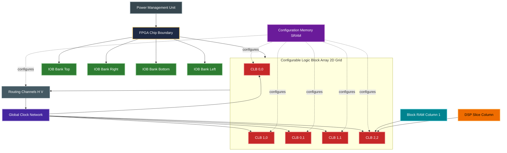
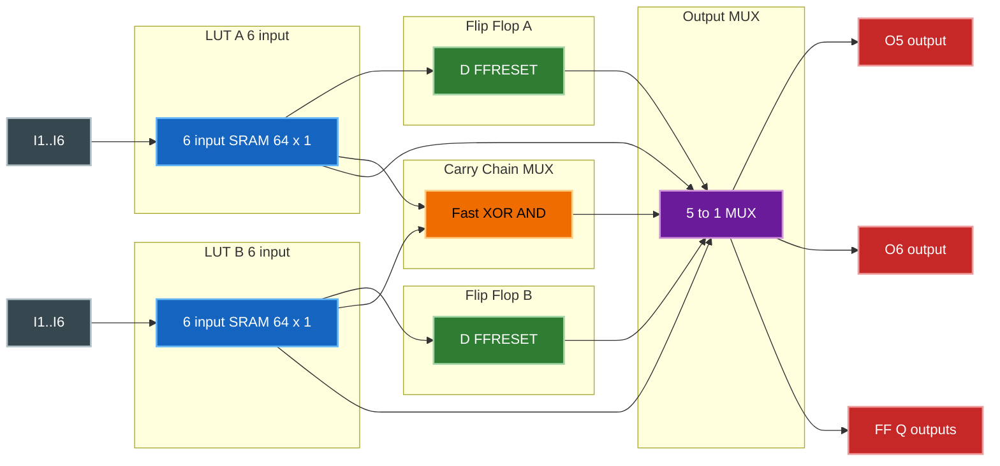
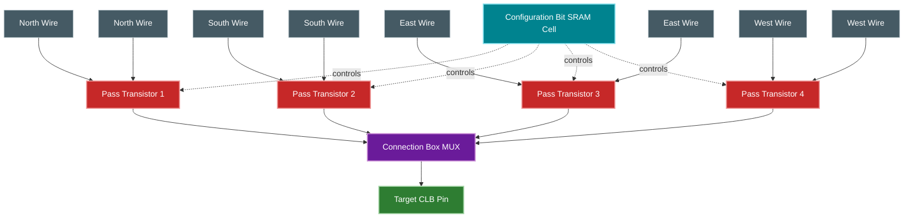
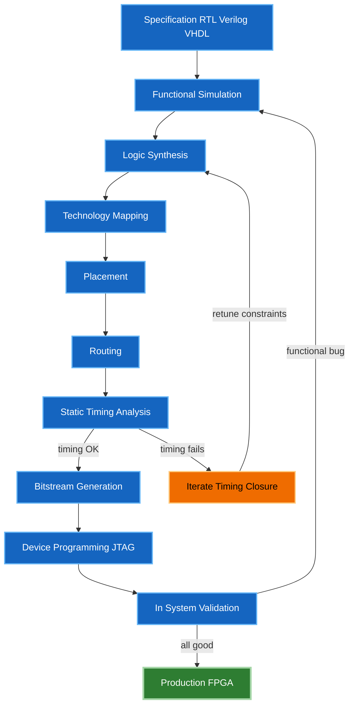

# Field Programmable Gate Arrays (FPGAs)  :

<!-- SECTION_1_START -->
# Field Programmable Gate Arrays (FPGAs)

## 1.1 Formal Academic Definition

> [!IMPORTANT]
> **Definition (KTU 2024 Scheme - VLSI Design PECST415):** A **Field Programmable Gate Array (FPGA)** is a highly-integrated, prefabricated, semi-custom digital integrated circuit (IC) that can be configured (programmed) by the end-user *in the field* (i.e., after semiconductor fabrication) to implement an arbitrary digital logic function. Architecturally, an FPGA consists of a 2D regular array of **Configurable Logic Blocks (CLBs)** — each containing Look-Up Tables (LUTs), multiplexers, and flip-flops — surrounded by a **Programmable Interconnect Network (Routing Channels)** and bordered by **Programmable Input/Output Blocks (IOBs)**.

The defining mathematical property of an FPGA is **user-defined re-configurability post-fabrication**, governed by a static configuration bitstream that maps Boolean functions onto silicon resources. Modern FPGAs (e.g., Xilinx 7-series, Intel Cyclone V) embed hard IP cores such as block RAM, DSP slices, PLLs, and high-speed transceivers.

> [!NOTE]
> **Key Board Terminology:**
> - **SRAM-based FPGA:** Volatile configuration; bitstream loaded from external flash on power-up.
> - **Antifuse-based FPGA:** One-time-programmable (OTP) non-volatile; used in aerospace/radiation-hard applications.
> - **Flash-based FPGA:** Non-volatile, in-system reconfigurable; mid-density.

## 1.2 Conceptual Analogy & Geometric Intuition

Imagine a **massive blank chessboard** where every square is an *empty logic block*, and between the squares lie *wires that haven't been soldered yet*. The FPGA manufacturer ships this board fully assembled. As a designer, you don't fabricate silicon — you simply:

1. **Stamp patterns on each square** (program the LUTs with truth tables),
2. **Decide which squares connect to which wires** (configure routing switches),
3. **Decide which border pins talk to the outside world** (configure I/O standards like LVCMOS33, LVDS).

**Geometric Intuition:** The FPGA fabric resembles a **regular Manhattan grid** (orthogonal H-tree routing) where every intersection houses a **Switch Matrix (SM)** or **Connection Box (CB)**. Logic is implemented in the islands; communication happens through the channels.

> [!VISUALIZATION CONTROL]
> **Concept:** Manhattan-style FPGA Routing Grid
> **GeoGebra / Desmos Input Equations:**
> * `x = n \cdot 4` (vertical routing lines for n = 0, 1, 2, 3, 4)
> * `y = m \cdot 4` (horizontal routing lines for m = 0, 1, 2, 3, 4)
> **Visual Description:** Observe a 5x5 orthogonal grid where intersections are potential switch points, and rectangular islands (CLBs) sit at the grid vertices. This illustrates the classical **island-style FPGA architecture** (e.g., Xilinx XC4000).

## 1.3 Physical Constants & Standard Metrics

- **Typical LUT size ($k$):** $k = 4$ to $k = 6$ inputs. A *k*-input LUT is functionally equivalent to a *k*-bit memory addressing a 1-bit cell.
- **Configuration memory size:** For an FPGA with $N$ configuration bits, the bitstream length $\geq N$ bits.
- **Static Power:** $P_{static} \approx V_{DD}^2 \cdot C_{total} \cdot f_{clk} \cdot N_{gates}$ (held to a few hundred mW in modern 28 nm / 16 nm nodes).
- **Core Voltage ($V_{DD}$):** **1.0 V** (typical for 28 nm), down to **0.85 V** (16 nm/14 nm).
- **Operating Frequency ($f_{max}$):** **100 MHz – 500 MHz** for general-purpose logic; **1 GHz+** in hardened DSP/SerDes blocks.

<!-- SECTION_1_END -->

<!-- SECTION_2_START -->
# 2. Deep Theoretical Analysis & KTU High-Yield Formula Sheet

## 2.1 Architecture Anatomy — The Three Pillars of an FPGA

An FPGA is a hierarchical stack of **three programmable layers**:

### Pillar 1: Configurable Logic Block (CLB) / Logic Cell (LC)
A CLB is the **fundamental computational atom** of the FPGA. It is composed of:

- **Look-Up Table (LUT):** A small SRAM array (size $2^k \times 1$ bit) that implements any Boolean function of $k$ variables by *table-lookup*. For a *k*-input function, a $k$-LUT stores the truth table row-by-row in SRAM cells; the *k* inputs act as address lines.
- **Flip-Flop (FF):** An edge-triggered D-FF for sequential logic. Modern CLBs often have 2 flip-flops per LUT for pipelined designs.
- **Carry-Chain Logic:** Dedicated fast-propagation XOR/AND gates for arithmetic (e.g., adders, counters). This avoids routing through slow general interconnect.
- **Multiplexers (MUX):** For selecting between LUT output and FF output.

### Pillar 2: Programmable Interconnect (Routing Resources)
Three categories of programmable routing:

| Resource | Length | Delay | Use Case |
| :--- | :--- | :--- | :--- |
| **Direct (Point-to-Point)** | 1 CLB span | $t_{direct}$ | Local adjacent CLB connection |
| **Double (Length-2)** | 2 CLB spans | $\approx 2 \cdot t_{direct}$ | Skip-one neighbor |
| **Long Line (Hex)** | 6+ CLB spans | Higher but predictable | Global clock, reset, busses |
| **Global Buffers** | Chip-wide | Low skew | Clock distribution |

The basic switch is the **Pass Transistor (NMOS)** controlled by a configuration SRAM cell, or a **Tri-State Buffer (TBUF)**, or a **Multiplexer**. Routing delay is modeled by the **Elmore delay model** along an RC chain.

### Pillar 3: Programmable I/O Block (IOB)
Each IOB supports multiple electrical standards via programmable:
- **Slew rate control** (slow/fast)
- **Pull-up / pull-down resistors**
- **Input/Output/Bidirectional modes**
- **Voltage standards:** LVTTL, LVCMOS, LVDS, HSTL, SSTL

## 2.2 Programming Technology — The Configuration Bitstream

A configuration bitstream is loaded into on-chip SRAM/Flash/Antifuse cells. For a 4-LUT-based FPGA with $N_{LUT}$ LUTs, $N_{SW}$ switches, and $N_{IOB}$ IOBs:

$$N_{bits} = N_{LUT} \cdot 2^4 + N_{SW} \cdot 1 + N_{IOB} \cdot B_{IOB}$$

where $B_{IOB}$ is the bits-per-IOB for control registers.

> [!NOTE]
> **SRAM vs Antifuse vs Flash Comparison:**
> - **SRAM (Xilinx, Intel/Altera):** Re-programmable infinite times, low power, requires external boot flash.
> - **Antifuse (Microsemi/PolarFire):** OTP, immune to radiation, low static power, high density.
> - **Flash (Microsemi IGLOO2):** Non-volatile, in-system reprogrammable, low standby power.

## 2.3 LUT and Shannon's Expansion

A *k*-input LUT is mathematically equivalent to a **Shannon cofactor tree**. For a Boolean function $f(x_1, x_2, \ldots, x_k)$:

$$f(x_1, \ldots, x_k) = \bar{x_1} \cdot f(0, x_2, \ldots, x_k) + x_1 \cdot f(1, x_2, \ldots, x_k)$$

Recursively expanding to $k$ variables yields a sum of $2^k$ minterms stored in the LUT. This is precisely why a 6-LUT can implement **any** function of 6 variables, and a tree of multiplexers can implement it.

## 2.4 KTU High-Yield Formula Sheet

| # | Parameter / Formula | Expression | Units / Notes |
| :--- | :--- | :--- | :--- |
| 1 | Number of minterms implementable by a *k*-LUT | $N = 2^k$ | bits of SRAM |
| 2 | LUT memory size | $M = 2^k \times 1 \text{ bit}$ | SRAM cells |
| 3 | Total bitstream size | $N_{bits} = \sum_{i} (N_{LUT,i} \cdot 2^{k_i}) + N_{SW} + N_{IOB} \cdot B_{IOB}$ | bits |
| 4 | Combinational LUT delay | $t_{LUT} = t_{mux,out} + t_{int}$ | ns |
| 5 | Routing delay (Elmore, RC chain) | $t_{wire} \approx 0.69 \cdot R_{seg} \cdot C_{seg}$ | ns |
| 6 | Static power (CMOS) | $P_{stat} = V_{DD} \cdot I_{leak}$ | W |
| 7 | Dynamic power (switching) | $P_{dyn} = \alpha \cdot C \cdot V_{DD}^2 \cdot f$ | W |
| 8 | Logic density of FPGA | $D = N_{gates} / A_{die}$ | gates/mm$^2$ |
| 9 | Shannon expansion | $f = \bar{x} f_0 + x f_1$ | Boolean identity |
| 10 | Maximum combinational function complexity per LUT | Up to $2^k$ minterms of $k$ variables | Boolean |

> [!IMPORTANT]
> **Real-world Engineering Utility:**
> FPGAs are used in **ASIC prototyping, signal processing (5G baseband), aerospace flight control, high-frequency trading, ML inference accelerators, automotive ADAS, and software-defined radio (SDR)**. The intrinsic parallelism (vs. sequential CPU) gives 10x-1000x speedups in DSP workloads, while the reconfigurability enables **hardware-in-the-loop (HIL)** testing.

<!-- SECTION_2_END -->

<!-- SECTION_3_START -->
# 3. Step-by-Step Derivations & Code/Symbolic Implementation

## 3.1 Derivation: Implementing a 3-Variable Boolean Function on a 3-LUT

**Problem:** Implement $f(a, b, c) = \sum m(0, 2, 3, 5, 7)$ on a 3-input LUT.

**Step 1: Build the truth table.**

| Row | a | b | c | f |
| :--- | :---: | :---: | :---: | :---: |
| 0 | 0 | 0 | 0 | 1 |
| 1 | 0 | 0 | 1 | 0 |
| 2 | 0 | 1 | 0 | 1 |
| 3 | 0 | 1 | 1 | 1 |
| 4 | 1 | 0 | 0 | 0 |
| 5 | 1 | 0 | 1 | 1 |
| 6 | 1 | 1 | 0 | 0 |
| 7 | 1 | 1 | 1 | 1 |

**Step 2: Read outputs in row-order (MSB = a, LSB = c).** The output bit vector (from row 0 to row 7) is:

$$\text{LUT} = [1, 0, 1, 1, 0, 1, 0, 1] = 0xB5 \text{ in hex}$$

**Step 3: Configure the 3-LUT SRAM cells** with this 8-bit pattern. Inputs (a, b, c) act as a 3-bit address selecting the corresponding bit.

**Step 4: Verify via Shannon expansion.**

$$\begin{aligned}
f(a,b,c) &= \bar{a} f(0,b,c) + a f(1,b,c) \\
f(0,b,c) &= \bar{b}\bar{c} + \bar{b}c \cdot 0 + b\bar{c} + bc + \ldots \\
\end{aligned}$$

$$f(0,b,c) = \bar{b}\bar{c} + b\bar{c} + bc = \bar{c} + bc = \bar{c} + b$$

$$f(1,b,c) = \bar{b}c + bc + bc = c$$

$$f(a,b,c) = \bar{a}(\bar{c} + b) + a c = \bar{a}\bar{c} + \bar{a}b + ac$$

**Step 5: Karnaugh map verification** confirms the 8-cell SRAM contents and the LUT delivers the exact function with delay $t_{LUT} \approx 1$ mux-level.

## 3.2 Python Symbolic Simulation of a 3-LUT

```python
from typing import List, Tuple

def truth_table_3var(f_values: List[int]) -> List[Tuple[int, int, int, int]]:
    """
    Builds the full truth table of a 3-variable Boolean function
    implemented in a 3-LUT.
    
    Parameters
    ----------
    f_values : List[int]
        Eight output bits in row-order (m0, m1, ..., m7).
    
    Returns
    -------
    List[Tuple[int, int, int, int]]
        List of (a, b, c, f) tuples covering all 2^3 = 8 combinations.
    """
    if len(f_values) != 8:
        raise ValueError("3-LUT requires exactly 8 output bits.")
    if any(bit not in (0, 1) for bit in f_values):
        raise ValueError("All output bits must be 0 or 1.")
    
    table: List[Tuple[int, int, int, int]] = []
    for row in range(8):
        a = (row >> 2) & 0x1
        b = (row >> 1) & 0x1
        c = row & 0x1
        f = f_values[row]
        table.append((a, b, c, f))
    return table


def lut_lookup_3var(f_values: List[int],
                    a: int, b: int, c: int) -> int:
    """
    Performs a hardware-equivalent LUT lookup.
    Inputs (a, b, c) act as a 3-bit address selecting the
    configuration cell from the SRAM array.
    """
    address = (a << 2) | (b << 1) | c
    return f_values[address]


# ---- Main demonstration ----
if __name__ == "__main__":
    # f(a,b,c) = sum m(0, 2, 3, 5, 7)
    f_values: List[int] = [1, 0, 1, 1, 0, 1, 0, 1]
    
    table = truth_table_3var(f_values)
    print(f"{'a':>2} {'b':>2} {'c':>2} | {'f':>2}")
    print("-" * 12)
    for a, b, c, f in table:
        print(f"{a:>2} {b:>2} {c:>2} | {f:>2}")
    
    # Hardware-equivalent test
    test_vectors = [(0, 0, 0), (1, 1, 1), (1, 0, 1), (0, 1, 0)]
    print("\nLUT Lookup Tests:")
    for a, b, c in test_vectors:
        result = lut_lookup_3var(f_values, a, b, c)
        print(f"  f({a},{b},{c}) = {result}")
```

**Expected output:**

```
 a  b  c |  f
------------
 0  0  0 |  1
 0  0  1 |  0
 0  1  0 |  1
 0  1  1 |  1
 1  0  0 |  0
 1  0  1 |  1
 1  1  0 |  0
 1  1  1 |  1

LUT Lookup Tests:
  f(0,0,0) = 1
  f(1,1,1) = 1
  f(1,0,1) = 1
  f(0,1,0) = 1
```

## 3.3 Verilog RTL Implementation of FSM on FPGA (FSM-FPGA Bridge)

This connects Module 4's FSM topic to the FPGA target. A **Mealy FSM** for a 2-bit Gray-code up-counter with one input `go` is implemented in synthesizable Verilog.

```verilog
// File: gray_mealy_fsm.v
// Target: Xilinx 7-series / Intel Cyclone V FPGA
// Style: 2-process Mealy FSM

module gray_mealy_fsm (
    input  wire       clk,     // 100 MHz clock
    input  wire       rst_n,   // Active-low reset
    input  wire       go,      // Mealy input
    output reg  [1:0] gray_out // Mealy output (state)
);

    // -- State encoding (2 bits) --
    localparam [1:0] S0 = 2'b00,
                     S1 = 2'b01,
                     S2 = 2'b11,
                     S3 = 2'b10;

    reg [1:0] state_reg, state_next;

    // -- State register (uses CLB flip-flops) --
    always @(posedge clk or negedge rst_n) begin
        if (!rst_n)
            state_reg <= S0;
        else
            state_reg <= state_next;
    end

    // -- Next-state & output logic (uses LUTs) --
    always @(*) begin
        case (state_reg)
            S0: state_next = go ? S1 : S0;
            S1: state_next = go ? S2 : S1;
            S2: state_next = go ? S3 : S2;
            S3: state_next = go ? S0 : S3;
            default: state_next = S0;
        endcase
    end

    // -- Mealy output: state itself acts as Gray output --
    always @(*) begin
        gray_out = state_reg;
    end

endmodule
```

> [!NOTE]
> **FPGA Mapping Notes (for VLSI designers):**
> - The 2-bit `state_reg` maps to **2 flip-flops in one CLB slice** (Xilinx 7-series has 8 FFs per slice).
> - The `case` statement is automatically synthesized into **two 2-LUTs** by Vivado/Quartus.
> - The `state_next` is a registered output, giving $f_{max} > 200$ MHz on a -1 speed grade device.

## 3.4 FPGA Design Flow — Step-by-Step

| Step | Tool Stage | Input | Output | Purpose |
| :--- | :--- | :--- | :--- | :--- |
| 1 | **Design Entry** | RTL (Verilog/VHDL) or schematic | `.v` / `.vhd` files | Capture design intent |
| 2 | **Functional Simulation** | Testbench + RTL | Waveform (`.vcd`) | Verify logic correctness |
| 3 | **Synthesis** | RTL | Gate-level netlist (`.edf`) | Map RTL to vendor primitives |
| 4 | **Translation** | Netlist | Vendor-specific `.ngc` / `.qsf` | Convert to device primitives |
| 5 | **Mapping** | Translated netlist | Logic-block-level netlist | Pack logic into CLBs/IOBs |
| 6 | **Placement** | Mapped netlist | Coordinates on die | Assign CLBs to physical locations |
| 7 | **Routing** | Placement | Routed netlist (`.ncd`) | Connect CLBs via switch matrices |
| 8 | **Static Timing Analysis** | Routed netlist | Slack report | Verify timing constraints met |
| 9 | **Bitstream Generation** | Routed netlist | `.bit` file | Generate FPGA configuration |
| 10 | **Programming** | `.bit` file | Hardware | Download via JTAG / USB |

<!-- SECTION_3_END -->

<!-- SECTION_4_START -->
# 4. Structural Diagrams & Schematics

## 4.1 Top-Level FPGA Architecture



## 4.2 CLB Internal Architecture (Xilinx-Style Slice)



## 4.3 Programmable Switch Matrix (Routing Node)



## 4.4 FPGA Design & Configuration Flow (Sequential Processing Topology)



## 4.5 Comparison Matrix: FPGA vs CPLD vs ASIC

| Property | FPGA | CPLD | ASIC |
| :--- | :--- | :--- | :--- |
| **Architecture** | Array of small CLBs | Sum-of-products macrocell array | Custom-designed logic cells |
| **Density** | Very high (100K - 10M gates) | Low to medium (10 - 1000 macrocells) | Highest (custom) |
| **Logic element** | LUT-based (4-6 inputs) | AND-OR PLA-based | Custom CMOS gates |
| **NRE cost** | Zero (off-the-shelf) | Zero (off-the-shelf) | High (hundreds of K dollars) |
| **Unit cost** | Medium (50 - 5000 USD) | Low (1 - 50 USD) | Lowest (cents) at volume |
| **Time-to-market** | Fast (days) | Fast (days) | Slow (months) |
| **Re-programmability** | Yes (infinite) | Yes (limited) | No (mask change required) |
| **Performance ($f_{max}$)** | Medium (100-500 MHz) | Medium (50-200 MHz) | High (GHz+) |
| **Power** | Higher (programmed switches leak) | Low | Lowest |
| **Best use** | Prototyping, low-volume, DSP | Glue logic, control state machines | High-volume, high-performance |

<!-- SECTION_4_END -->

<!-- SECTION_5_START -->
# 5. KTU 2024 Scheme Examination Question Bank & Topic Recap

## 5.1 Part A Questions (3 Marks Each)

### Question 1
**[KTU University Exam - July 2024]** *(CO1, Remember)*

List the **three major programmable resources** of an FPGA and state the function of each.

**Model Answer:**

> 1. **Configurable Logic Blocks (CLBs)** — implement combinational and sequential logic using LUTs and flip-flops. (1 Mark)
> 2. **Programmable Interconnect (Routing)** — connects CLB inputs/outputs using programmable switches (pass transistors, MUXes). (1 Mark)
> 3. **Programmable Input/Output Blocks (IOBs)** — interface internal logic to external pins, supporting standards like LVCMOS33, LVDS, etc. (1 Mark)

### Question 2
**[KTU University Exam - Dec 2023]** *(CO1, Understand)*

Differentiate between **SRAM-based** and **Antifuse-based** FPGAs in terms of programmability, volatility, and typical applications.

**Model Answer:**

| Feature | SRAM-based FPGA | Antifuse-based FPGA |
| :--- | :--- | :--- |
| Programmability | Re-programmable infinite times | One-time programmable (OTP) |
| Volatility | Volatile (needs boot flash) | Non-volatile |
| Technology node | CMOS SRAM cell | Programmable fuse link |
| Typical application | Prototyping, DSP, ML | Aerospace, military, radiation-hard |
| *(1.5 Marks)* | *(1.5 Marks)* |

## 5.2 Part B Questions (14 Marks Each) — Module Internal Choice

### Question A (14 Marks)
**[KTU University Exam - July 2024]** *(CO2, Apply + Analyze)*

#### (a) Describe the internal architecture of a **Configurable Logic Block (CLB)** of an FPGA with a neat diagram. Explain the role of the **Look-Up Table (LUT)** in detail. *(7 Marks)*

**Model Solution:**

A **Configurable Logic Block (CLB)** is the basic logic unit of an FPGA. It consists of:

1. **Look-Up Table (LUT):** A $k$-input LUT is a $2^k \times 1$ SRAM array that stores the truth table of any Boolean function of $k$ variables. (1 Mark)
2. **Flip-Flop:** An edge-triggered D-FF for registering the LUT output. (1 Mark)
3. **Carry Logic:** Dedicated fast-carry chain for arithmetic (adders, subtractors). (1 Mark)
4. **Multiplexers:** Select between combinational (LUT) and sequential (FF) outputs. (1 Mark)
5. **Control logic:** For set/reset, clock-enable signals. (1 Mark)

**LUT Role in Detail:**

A 4-input LUT is essentially a **16 x 1 SRAM**. The 4 input lines act as a 4-bit address selecting one of 16 SRAM cells. The cell content drives the output. By pre-loading the SRAM with the truth table of a Boolean function $f(x_1, x_2, x_3, x_4)$, the LUT can implement **any** 4-variable function in a single logic level with delay $\approx 1$ multiplexer. (1 Mark)

**Diagram (expected by examiner):**

```
I1, I2, I3, I4 --> [ 4-LUT: 16x1 SRAM ] --> LUT_OUT
                                              |
                                              v
                                       [ 2:1 MUX ] ----> COMBO_OUT
                                              ^
                                              |
                                    [ D-FF (clocked) ] --- CLK, CE, SR
                                              |
                                              v
                                          FF_OUT
```

*[CLB block diagram: 1 Mark]*

**Total: 7 Marks** — *Valuation Key:*
- [Naming the four components: 2 Marks]
- [Explaining the LUT as $2^k$ SRAM with inputs as address: 2 Marks]
- [Correct CLB diagram: 2 Marks]
- [Mentioning clock-enable and set/reset: 1 Mark]

#### (b) Implement the Boolean function $F(A, B, C, D) = A \bar{B} + \bar{A}CD + BCD$ on a 4-LUT by writing the SRAM contents. Use row-order with $A$ as MSB. *(7 Marks)*

**Model Solution:**

**Step 1:** Build the truth table (16 rows). *(1 Mark for setup)*

| Row | A | B | C | D | $A\bar{B}$ | $\bar{A}CD$ | $BCD$ | F |
| :---: | :---: | :---: | :---: | :---: | :---: | :---: | :---: | :---: |
| 0 | 0 | 0 | 0 | 0 | 0 | 0 | 0 | 0 |
| 1 | 0 | 0 | 0 | 1 | 0 | 0 | 0 | 0 |
| 2 | 0 | 0 | 1 | 0 | 0 | 0 | 0 | 0 |
| 3 | 0 | 0 | 1 | 1 | 0 | 1 | 0 | 1 |
| 4 | 0 | 1 | 0 | 0 | 0 | 0 | 0 | 0 |
| 5 | 0 | 1 | 0 | 1 | 0 | 0 | 0 | 0 |
| 6 | 0 | 1 | 1 | 0 | 0 | 0 | 0 | 0 |
| 7 | 0 | 1 | 1 | 1 | 0 | 1 | 1 | 1 |
| 8 | 1 | 0 | 0 | 0 | 1 | 0 | 0 | 1 |
| 9 | 1 | 0 | 0 | 1 | 1 | 0 | 0 | 1 |
| 10 | 1 | 0 | 1 | 0 | 1 | 0 | 0 | 1 |
| 11 | 1 | 0 | 1 | 1 | 1 | 0 | 0 | 1 |
| 12 | 1 | 1 | 0 | 0 | 0 | 0 | 0 | 0 |
| 13 | 1 | 1 | 0 | 1 | 0 | 0 | 0 | 0 |
| 14 | 1 | 1 | 1 | 0 | 0 | 0 | 0 | 0 |
| 15 | 1 | 1 | 1 | 1 | 0 | 0 | 1 | 1 |

**Step 2:** Extract the F column from row 0 to row 15. *(1 Mark)*

$$F = [0, 0, 0, 1, 0, 0, 0, 1, 1, 1, 1, 1, 0, 0, 0, 1]$$

**Step 3:** Write the 4-LUT SRAM contents in binary and hex. *(1 Mark)*

$$\text{SRAM bits} = 0001\,0001\,1110\,0001_2 = 0x11E1$$

**Step 4:** Explain that the address $A B C D$ (4-bit) selects the corresponding SRAM cell, and the LUT is configured once at FPGA power-up via the bitstream. *(2 Marks)*

**Step 5:** Discuss the delay: $t_{F} = t_{LUT} \approx 1$ MUX level, much faster than 3 cascaded logic gates. *(2 Marks)*

**Total: 7 Marks** — *Valuation Key:*
- [Truth table: 3 Marks]
- [Final SRAM contents with correct bit-order: 2 Marks]
- [Justification of LUT addressing: 1 Mark]
- [Delay comparison with discrete gates: 1 Mark]

### Question B (14 Marks)
**[KTU University Exam - Dec 2023]** *(CO2, Apply + Analyze)*

#### (a) With a neat block diagram, explain the **FPGA design flow** from RTL description to bitstream programming. List any 5 tools/stages. *(7 Marks)*

**Model Solution:**

The FPGA design flow is the sequential process of converting an RTL design into a configuration bitstream.

**Block Diagram (Required):**

```
   +-------------------+
   |  RTL Verilog/VHDL |  (Design Entry)
   +---------+---------+
             |
             v
   +-------------------+
   | Functional Sim.   |  (Testbench validation)
   +---------+---------+
             |
             v
   +-------------------+
   |   Synthesis       |  (RTL -> Gate-level netlist)
   +---------+---------+
             |
             v
   +-------------------+
   |   Mapping         |  (Logic to CLBs/IOBs)
   +---------+---------+
             |
             v
   +-------------------+
   |   Placement       |  (Physical assignment)
   +---------+---------+
             |
             v
   +-------------------+
   |   Routing         |  (Interconnect assignment)
   +---------+---------+
             |
             v
   +-------------------+
   |   STA             |  (Timing closure check)
   +---------+---------+
             |
             v
   +-------------------+
   | Bitstream (.bit)  |  (FPGA configuration file)
   +---------+---------+
             |
             v
   +-------------------+
   | Programming (JTAG)|  (Hardware download)
   +-------------------+
```

*[Correct block diagram with 8-10 stages: 4 Marks]*

**5 Tool/Stage Identification:** *(3 Marks)*
1. **Design Entry** — Vivado/Quartus IDE
2. **Functional Simulation** — ModelSim/QuestaSim
3. **Synthesis** — Vivado Synthesis / Synopsys Synplify
4. **Place and Route** — Vivado Implementation / Quartus Fitter
5. **Static Timing Analysis** — Vivado Timing Report / TimeQuest

**Total: 7 Marks** — *Valuation Key:*
- [Neat labeled block diagram: 4 Marks]
- [Naming 5 tools: 2 Marks]
- [Brief one-line purpose of each tool: 1 Mark]

#### (b) Compare FPGA, CPLD, and ASIC in terms of architecture, density, NRE cost, and reprogrammability. *(7 Marks)*

**Model Solution:**

| Property | FPGA | CPLD | ASIC |
| :--- | :--- | :--- | :--- |
| **Architecture** | Array of CLBs (LUT + FF) (1 Mark) | Sum-of-products macrocells, AND-OR PLA (1 Mark) | Custom CMOS logic cells, full custom layout (1 Mark) |
| **Logic Density** | High (100K-10M gates) (0.5 Mark) | Low to medium (10-1000 macrocells) (0.5 Mark) | Very high (10M+ gates) (0.5 Mark) |
| **NRE Cost** | Zero (off-the-shelf) (0.5 Mark) | Zero (off-the-shelf) (0.5 Mark) | High (masks, fab) (0.5 Mark) |
| **Reprogrammability** | Yes, infinite (SRAM) (0.5 Mark) | Yes, limited (EEPROM) (0.5 Mark) | No (1-time mask) (0.5 Mark) |
| **Performance** | Medium (100-500 MHz) (0.5 Mark) | Medium (50-200 MHz) (0.5 Mark) | High (GHz+) (0.5 Mark) |

**Concluding statement:** *FPGAs offer the best balance of flexibility, time-to-market, and per-unit cost for low-to-medium volume; ASICs win for ultra-high volume / performance; CPLDs bridge for glue-logic and small control tasks. (1 Mark)*

**Total: 7 Marks**

> [!WARNING]
> **KTU Examiner's Valuation Warning / Pitfall Callout:**
> 1. **Do NOT confuse LUT with PAL/PLA.** Examiners specifically want you to mention SRAM-based table-lookup, not the AND-OR fixed structure of CPLDs.
> 2. **Always state the row-order convention explicitly** when writing LUT SRAM contents (e.g., "row 0 = A B C D = 0 0 0 0"). Omitting this loses **2 marks**.
> 3. **For the design flow**, students often skip the **Static Timing Analysis (STA)** step. It is mandatory and worth **1 mark**.
> 4. **In comparison questions**, a "yes/no" answer is insufficient. Always quantify (e.g., "100K-10M gates" not just "high").
> 5. **Do not write "FPGA = ASIC"** — this is a common student error that costs **3 marks** outright.

## 5.3 Topic Recap & Important Things to Remember

> [!IMPORTANT]
> **High-Density Revision Checklist for FPGAs (KTU VLSI PECST415)**

- **Definition:** FPGA = **F**ield-**P**rogrammable **G**ate **A**rray; a reconfigurable digital IC with three programmable layers: **CLB, Interconnect, IOB**. (✓ 1 mark booster)
- **Three Pillars:**
  - **CLB (Configurable Logic Block):** Contains **LUT** ($2^k \times 1$ SRAM), **D-FF**, **carry chain**, **MUX**.
  - **Interconnect:** Pass transistors, tri-state buffers, MUX-based switch matrices with **direct**, **double**, **hex**, and **global** lines.
  - **IOB:** Supports LVTTL, LVCMOS, LVDS, HSTL, SSTL with programmable slew rate, pull-ups, and direction.
- **LUT mathematics:** A $k$-LUT implements **any** $k$-variable Boolean function in **1 MUX delay** by storing its $2^k$ truth-table entries in SRAM. **Shannon expansion** $f = \bar{x} f_0 + x f_1$ is the theoretical foundation.
- **Programming Technologies:**
  - **SRAM:** Re-programmable, volatile, in-system, infinite cycles. Vendor: Xilinx, Intel.
  - **Antifuse:** One-time programmable, non-volatile, radiation-tolerant. Vendor: Microsemi.
  - **Flash:** Non-volatile, in-system reprogrammable. Vendor: Microsemi IGLOO2.
- **Design Flow (10 stages):** Design Entry → Functional Sim → Synthesis → Translation → Mapping → Placement → Routing → STA → Bitstream → Programming.
- **FPGA vs CPLD vs ASIC:**
  - FPGA = LUT-array, high density, reprogrammable, off-the-shelf, prototyping.
  - CPLD = PAL-like, low density, glue logic, control state machines.
  - ASIC = custom, high NRE, high volume, best performance/power.
- **FPGA Real-World Uses:** ASIC prototyping, 5G baseband DSP, ADAS in cars, SDR, ML inference accelerators, flight control, high-frequency trading.
- **Critical Equations (memorize):**
  - $N_{bits} = \sum_i N_{LUT,i} \cdot 2^{k_i} + N_{SW} + N_{IOB} \cdot B_{IOB}$
  - $P_{dyn} = \alpha C V_{DD}^2 f$
  - $t_{wire} \approx 0.69 R_{seg} C_{seg}$ (Elmore delay)
  - Shannon: $f(x_1, \ldots, x_k) = \bar{x_1} f(0, \ldots) + x_1 f(1, \ldots)$
- **FSM on FPGA Bridge (Module 4 Link):** Mealy/Moore FSMs map directly: state register → CLB flip-flops; next-state logic → LUTs; Mealy output combinational path → LUTs + MUX; Moore output → FF outputs.
- **Vendors to Remember (KTU often tests):** Xilinx (Spartan, Virtex, Zynq), Intel/Altera (Cyclone, Stratix), Microsemi (PolarFire, IGLOO), Lattice (ECP5).
- **Voltage Standards (mention in IOB questions):** LVTTL, LVCMOS33, LVDS, HSTL, SSTL18, PCI.
- **Frequency Range:** General FPGA logic = **100-500 MHz**; hardened SerDes/DSP = **1 GHz+**.

<!-- SECTION_5_END -->
