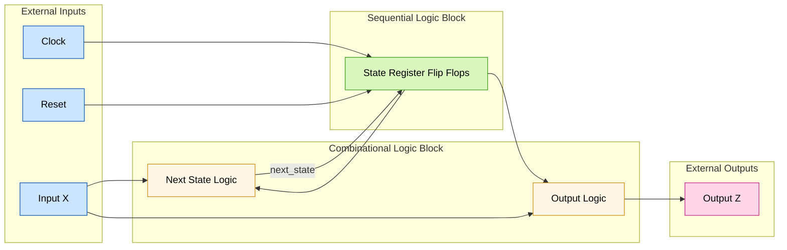
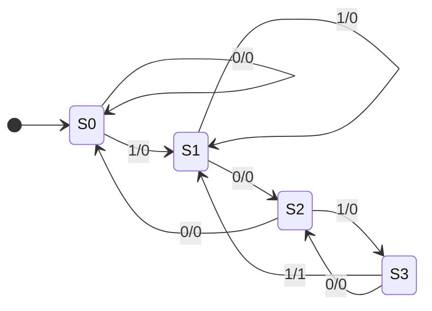
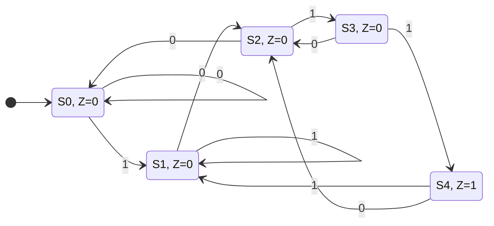
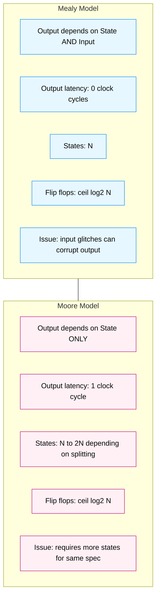
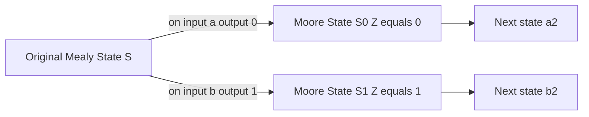

# Finite State Machines (FSMs):  Mealy and Moore models

<!-- SECTION_1_START -->
# Module 4 — Finite State Machines (FSMs): Mealy and Moore Models

## 1. Core Technical Definition & Intuitive Overview

### 1.1 Formal Definition (KTU 2024 Syllabus Terminology)

> [!IMPORTANT]
> **Finite State Machine (FSM):** A sequential digital system whose behaviour is defined by a finite set of **states**, a set of **inputs**, a set of **outputs**, and a **state transition function** that determines the next state based on the present state and the present input.

An FSM is formally described by the 6-tuple:

$$M = (S, I, O, \delta, \lambda, s_0)$$

Where:
- $S = \{s_0, s_1, \dots, s_n\}$ — Finite non-empty set of **states**
- $I = \{i_0, i_1, \dots, i_m\}$ — Finite set of **input symbols**
- $O = \{o_0, o_1, \dots, o_k\}$ — Finite set of **output symbols**
- $\delta : S \times I \rightarrow S$ — **Next-state (transition) function**
- $\lambda$ — **Output function** (form depends on the model — Mealy vs Moore)
- $s_0 \in S$ — Designated **initial (reset) state**

### 1.2 Conceptual Analogy / Intuition

Imagine a **lift (elevator)** in a building:

- The lift has a **finite set of states** (Floor 0, Floor 1, Floor 2 … Floor N). It cannot be "halfway" — it is always at a discrete floor.
- The **inputs** are the button presses (request from inside, call from outside).
- The **transition function** is the decision rule: "If I am on Floor 2 and someone presses Floor 4, then my next state is Floor 3 (travelling up)".
- The **outputs** could be the floor indicator display or the door motor signal.

A lift is a perfect real-world FSM because it always remembers its past (the current floor) and decides its next action strictly from this memory + new requests. Just as the lift is a *Mealy-like* system (the door opens the moment the button is pressed — output depends on input + state), some FSMs are *Moore-like* (the floor display is updated only when the lift has actually arrived — output depends purely on state).

> [!NOTE]
> **Why FSMs in VLSI?** In chip design, almost every controller, protocol engine, UART, USB link, cache coherency unit, traffic light, vending machine, and even a CPU's control unit is implemented as an FSM. It is the **backbone of sequential digital design** because it converts an abstract behavioural specification (state diagram) into synthesizable hardware.

### 1.3 Physical Constants & Standard Metrics (KTU Board Emphasis)

- **Clock frequency** $f_{clk}$ in **Hz (or MHz/GHz)** drives synchronous FSMs.
- **Setup time** $t_{su}$ and **Hold time** $t_{h}$ are constraints on the state register flip-flops (in **nanoseconds**).
- **Clock-to-Output delay** $t_{co}$ determines when state variables become valid after a clock edge.
- **Maximum operating frequency** $f_{max} = \dfrac{1}{T_{clk(min)}}$ where $T_{clk(min)} = t_{co} + t_{comb} + t_{su}$.
- The number of flip-flops required for state encoding = $\lceil \log_2 N \rceil$ for binary, or **N flip-flops** for one-hot encoding (N = number of states).

> [!VISUALIZATION CONTROL]
> **Concept:** Mealy vs Moore output timing waveform
> **GeoGebra / Desmos Input Equations:**
> * `clock = square(t, 0, 1, period=10)`
> * `state_signal = step(t - 5) - step(t - 25) + step(t - 35)` (piecewise transitions)
> * `mealy_output = state_signal * input_signal(t)` (depends on both)
> * `moore_output = shift(state_signal, 1)` (delayed by one clock)
> **Visual Description:** The student should observe that in the Mealy waveform, the output changes *immediately* when the input changes (between clock edges), whereas in the Moore waveform, the output changes *only on the clock edge* after the state changes.

---

## 1.4 The Two Canonical FSM Models

### 1.4.1 Mealy Machine Model

In a **Mealy machine**, the output is a function of **both the current state and the current input**:

$$\lambda : S \times I \rightarrow O$$

$$O_{Mealy}(t) = \lambda(S(t), I(t))$$

**Key feature:** The output can change **asynchronously** with respect to the clock, the moment the input changes (subject only to combinational logic propagation delay). This makes Mealy machines **faster** (fewer clock cycles to produce an output) but **prone to glitches** if the input is asynchronous or noisy.

### 1.4.2 Moore Machine Model

In a **Moore machine**, the output is a function of **only the current state**:

$$\lambda : S \rightarrow O$$

$$O_{Moore}(t) = \lambda(S(t))$$

**Key feature:** The output is **strictly synchronous** — it can change only on the active clock edge when the state register updates. This makes Moore machines **slower** (outputs are delayed by one clock cycle) but **glitch-free** and **easier to verify in formal tools**.

> [!IMPORTANT]
> **KTU 2024 High-Yield Distinction:** A Moore machine can be viewed as a *degenerate* Mealy machine where the output is a constant on every outgoing arc from a state. Conversely, every Mealy machine can be converted into an equivalent Moore machine by **state splitting** (one extra state per input-dependent output).

---

<!-- SECTION_2_START -->
# 2. Deep Theoretical Analysis & KTU High-Yield Formula Sheet

## 2.1 State Transition Tables and State Diagrams

A state diagram (or bubble diagram) is the *graphical* representation of an FSM. The KTU 2024 paper frequently tests the ability to:

1. Draw a state diagram from a verbal specification.
2. Derive a state table from a state diagram.
3. Convert between Mealy and Moore models.

**Conventions used in the KTU board:**
- **Mealy:** Each directed arc from state $S_i$ to $S_j$ is labelled $\dfrac{x}{z}$ where $x$ = input, $z$ = output.
- **Moore:** Each state bubble $S_i$ is labelled $\dfrac{S_i}{z}$ where $z$ = output produced while in that state. Arcs are labelled only with the input.

## 2.2 Mealy Machine — Operational Logic Steps

1. **Define the alphabet** of input symbols (e.g., binary: 0 and 1).
2. **Identify the states** as the distinct "memories" the system must retain.
3. **Assign** each state a binary code for the state register.
4. **Determine $\delta$** by enumerating all (state, input) pairs.
5. **Determine $\lambda$** for every (state, input) pair.
6. **Synthesize** using two processes in VHDL: (a) state register (sequential), (b) next-state + output logic (combinational).

## 2.3 Moore Machine — Operational Logic Steps

1. Same first 4 steps as Mealy.
2. **Determine $\lambda$** as a *state-attribute* (output is a property of being IN a state).
3. **State splitting** may be required if the original Mealy specification has two outputs from one state.
4. **Synthesize** using three processes if outputs must also be registered, or two if outputs are combinational functions of the state register.

## 2.4 KTU Formula Sheet / Cheat Sheet

| # | Parameter / Concept | Mealy Model | Moore Model |
|---|---|---|---|
| 1 | Output function | $O = \lambda(S, X)$ | $O = \lambda(S)$ |
| 2 | Output timing | Asynchronous (input-driven) | Synchronous (clock-driven) |
| 3 | Number of states | **Usually fewer** (input folded into transition) | **Usually more** (one state per output value) |
| 4 | Output latency | $0$ clock cycles (instantaneous) | $1$ clock cycle (delayed) |
| 5 | Glitch susceptibility | **High** — depends on input stability | **Low** — output registered |
| 6 | Flip-flops for state | $\lceil \log_2 N \rceil$ (binary) | $\lceil \log_2 N \rceil$ (binary) |
| 7 | Typical application | Sequence detectors, edge detectors, traffic controllers | Pipeline controllers, register-transfer level control units, CPU FSMs |
| 8 | VHDL `case` location of output | Inside the combinational `process` with `next_state` | Either a separate `process` or a `case` on `present_state` outside the clocked process |
| 9 | Reaction to input change | Output may glitch *between* clock edges | Output is **stable** between clock edges |
| 10 | Conversion direction | → Moore: add dummy state (state split) | → Mealy: merge states with same next-state behaviour |

| # | Key Formulas for VLSI FSM Implementation | Expression |
|---|---|---|
| A | Minimum number of flip-flops (binary encoding) | $n = \lceil \log_2 N \rceil$ where $N$ = number of states |
| B | One-hot encoding flip-flop count | $n_{1hot} = N$ |
| C | Maximum clock frequency | $f_{max} = \dfrac{1}{t_{co} + t_{comb} + t_{su}}$ |
| D | Clock period constraint | $T_{clk} \geq t_{co} + t_{comb} + t_{su} - t_{skew}$ |
| E | Equivalent states condition | Two states $s_i, s_j$ are equivalent iff $\delta(s_i, x) = \delta(s_j, x)$ AND $\lambda(s_i, x) = \lambda(s_j, x)$ for every input $x$ |
| F | Output function (Mealy) | $Z(t) = \lambda( Q(t), X(t) )$ |
| G | Output function (Moore) | $Z(t) = \lambda( Q(t) )$ |
| H | Next-state function | $Q(t+1) = \delta( Q(t), X(t) )$ |

> [!IMPORTANT]
> **Real-world VLSI utility:** In modern ASIC/FPGA design (e.g., Synopsys Design Compiler, Xilinx Vivado), every control path of a System-on-Chip (SoC) — AXI/AHB bus controllers, DDR memory interfaces, I2C/SPI masters, USB device cores, Ethernet MACs, CPU datapath control — is implemented as an FSM. Industry coding guidelines (e.g., *STMicroelectronics FSM Design Guide*, *Intel FSM Best Practices*) strongly prefer **Moore machines for safety-critical paths** (avalanche, automotive ISO 26262) and **Mealy machines for performance-critical paths** (high-speed serialisers).

## 2.5 State Minimization & Encoding (Syllabus Hook)

Two states $S_i$ and $S_j$ are **equivalent** and can be merged if, for every possible input sequence, the machine produces the same output sequence from both states. Formally, the **partition refinement algorithm** or **state implication table (chart) method** is used to find equivalence classes.

After minimization, the states are encoded. The three most common encodings in VLSI are:

- **Binary encoding** — minimum flip-flops, denser logic, used in ASICs.
- **One-hot encoding** — exactly one flip-flop per state, simpler and faster decode logic, **dominant in FPGAs** (Xilinx/Altera slices are register-rich).
- **Gray encoding** — only one bit changes between adjacent states, minimizes switching power, used in low-power FSMs.

---

<!-- SECTION_3_START -->
# 3. Step-by-Step Derivations & Code/Symbolic Implementation

> [!IMPORTANT]
> We will work through a canonical KTU-style problem: **Design a 1011 overlapping sequence detector** using both the Mealy model and the Moore model, then derive the equivalent state machines and produce synthesizable VHDL.

## 3.1 Problem Statement

Design an FSM that detects the sequence `1011` on a serial input line `X`. The detector is **overlapping** (the last `1` of one detection can be the first `1` of the next). Produce an output `Z = 1` when the sequence is detected, else `Z = 0`.

## 3.2 Mealy Machine Design (Exhaustive Derivation)

### Step 1 — Identify States

We slide a 1-, 2-, 3-, or 4-bit window across the input. The states are the longest suffix matched so far:

- $S_0$ — No useful prefix matched (initial state, also reached after reset).
- $S_1$ — Last symbol was `1` (matched the prefix `1`).
- $S_2$ — Last two symbols were `10`.
- $S_3$ — Last three symbols were `101`.

The detected output `Z = 1` is emitted when the fourth `1` arrives in $S_3$. We do not need a separate $S_4$ because we will transition directly to $S_1$ (overlap) after detection.

### Step 2 — Enumerate Transitions (Mealy)

For each (state, input) pair, decide the next state and the Mealy output $Z$:

| Present State $S(t)$ | Input $X(t)$ | Next State $S(t+1)$ | Output $Z(t)$ |
|:---:|:---:|:---:|:---:|
| $S_0$ | 0 | $S_0$ | 0 |
| $S_0$ | 1 | $S_1$ | 0 |
| $S_1$ | 0 | $S_2$ | 0 |
| $S_1$ | 1 | $S_1$ | 0 |
| $S_2$ | 0 | $S_0$ | 0 |
| $S_2$ | 1 | $S_3$ | 0 |
| $S_3$ | 0 | $S_2$ | 0 |
| $S_3$ | 1 | $S_1$ | **1** |

> **Reasoning for $S_3, X=1 \rightarrow S_1, Z=1$:** We have just detected `1011`. The trailing `1` is also a valid prefix for a new `1011`, so we go to $S_1$ (which represents "a 1 was just seen"). The output $Z=1$ is produced *at the moment* the final `1` arrives, before the clock edge.

### Step 3 — State Encoding (Binary, 2 bits)

$$S_0 = 00, \quad S_1 = 01, \quad S_2 = 10, \quad S_3 = 11$$

Let $Q_1 Q_0$ be the state register outputs. Let $D_1 D_0$ be the next-state inputs to the flip-flops.

### Step 4 — Derive Boolean Next-State Equations

We build K-maps for $D_1, D_0$ and for the output $Z$ with inputs $Q_1, Q_0, X$.

| $Q_1 Q_0 \backslash X$ | 0 | 1 |
|:---:|:---:|:---:|
| **00** ($S_0$) | $S_0$ / 0 = 00 | $S_1$ / 0 = 01 |
| **01** ($S_1$) | $S_2$ / 0 = 10 | $S_1$ / 0 = 01 |
| **11** ($S_3$) | $S_2$ / 0 = 10 | $S_1$ / 1 = 01 |
| **10** ($S_2$) | $S_0$ / 0 = 00 | $S_3$ / 0 = 11 |

**K-map for $D_1$ (MSB of next state):**

| $Q_1 Q_0 \backslash X$ | 0 | 1 |
|:---:|:---:|:---:|
| 00 | 0 | 0 |
| 01 | 1 | 0 |
| 11 | 1 | 0 |
| 10 | 0 | 1 |

Grouping the 1s (largest rectangles):

$$D_1 = \overline{X} \cdot (Q_1 \oplus Q_0) \;\; \text{or expanded} \;\; D_1 = \overline{X} \cdot Q_0 + Q_1 \cdot \overline{Q_0} \cdot X$$

**K-map for $D_0$ (LSB of next state):**

| $Q_1 Q_0 \backslash X$ | 0 | 1 |
|:---:|:---:|:---:|
| 00 | 0 | 1 |
| 01 | 0 | 1 |
| 11 | 0 | 1 |
| 10 | 0 | 1 |

This is simply $D_0 = X$ (the LSB is always just the input $X$).

**K-map for Output $Z$ (Mealy):**

$Z = 1$ only in one cell — when $Q_1 Q_0 = 11$ and $X = 1$:

$$Z = Q_1 \cdot Q_0 \cdot X$$

### Step 5 — Final Mealy Boolean Equations

$$\boxed{D_1 = \overline{X} \cdot Q_0 + X \cdot Q_1 \cdot \overline{Q_0}}$$

$$\boxed{D_0 = X}$$

$$\boxed{Z = Q_1 \cdot Q_0 \cdot X}$$

### Step 6 — Fully Operational VHDL Code (Mealy, 2-process style)

```vhdl
-- VHDL Implementation: Mealy Overlapping "1011" Sequence Detector
-- Library: IEEE standard libraries only (KTU board-friendly)
library IEEE;
use IEEE.STD_LOGIC_1164.ALL;
use IEEE.NUMERIC_STD.ALL;

entity mealy_seqdet_1011 is
    port (
        clk    : in  STD_LOGIC;                       -- system clock
        rst_n  : in  STD_LOGIC;                       -- active-low synchronous reset
        x_in   : in  STD_LOGIC;                       -- serial bit stream
        z_out  : out STD_LOGIC                        -- detection flag (Mealy)
    );
end mealy_seqdet_1011;

architecture rtl_mealy of mealy_seqdet_1011 is

    -- Binary state encoding (2 bits for 4 states)
    type state_t is (S0, S1, S2, S3);
    signal present_state, next_state : state_t := S0;

begin

    ----------------------------------------------------------------
    -- Process 1 : State Register (Sequential / Clocked)
    ----------------------------------------------------------------
    state_reg : process(clk)
    begin
        if rising_edge(clk) then
            if rst_n = '0' then
                present_state <= S0;                   -- synchronous reset
            else
                present_state <= next_state;
            end if;
        end if;
    end process state_reg;

    ----------------------------------------------------------------
    -- Process 2 : Next-State Logic + Mealy Output (Combinational)
    ----------------------------------------------------------------
    next_state_logic : process(present_state, x_in)
    begin
        -- Default assignment to avoid inferred latches
        next_state <= S0;
        z_out      <= '0';

        case present_state is
            when S0 =>
                if x_in = '1' then
                    next_state <= S1;
                else
                    next_state <= S0;
                end if;

            when S1 =>
                if x_in = '0' then
                    next_state <= S2;
                else
                    next_state <= S1;                  -- stay in S1 on extra 1s
                end if;

            when S2 =>
                if x_in = '1' then
                    next_state <= S3;
                else
                    next_state <= S0;
                end if;

            when S3 =>
                if x_in = '1' then
                    next_state <= S1;                  -- overlap; trailing 1 is new prefix
                    z_out      <= '1';                 -- Mealy: output here is immediate
                else
                    next_state <= S2;
                end if;

            when others =>
                next_state <= S0;
        end case;
    end process next_state_logic;

end rtl_mealy;
```

## 3.3 Moore Machine Design (Exhaustive Derivation)

### Step 1 — Identify States (with output embedded)

In Moore form, the output is associated with the **state**. So we need a *separate* state for each output value we might emit. Since the overlap forces us to *both* emit `1` and remember that we just saw `1`, we create:

- $S_0$ — Initial, no useful prefix, output 0.
- $S_1$ — Just saw `1`, output 0.
- $S_2$ — Just saw `10`, output 0.
- $S_3$ — Just saw `101`, output 0.
- $S_4$ — Just saw `1011` (detection state), output **1**.

After $S_4$, the next clock must take us to a state that *remembers the trailing 1* — that is $S_1$.

### Step 2 — Enumerate Transitions (Moore)

| Present State $S(t)$ | Output $Z$ | Input $X=0 \rightarrow S(t+1)$ | Input $X=1 \rightarrow S(t+1)$ |
|:---:|:---:|:---:|:---:|
| $S_0$ | 0 | $S_0$ | $S_1$ |
| $S_1$ | 0 | $S_2$ | $S_1$ |
| $S_2$ | 0 | $S_0$ | $S_3$ |
| $S_3$ | 0 | $S_2$ | $S_4$ |
| $S_4$ | **1** | $S_2$ | $S_1$ |

> **Notice:** The Moore machine has **5 states** versus the Mealy machine's **4 states** — illustrating the textbook trade-off that Moore machines typically require more states.

### Step 3 — State Encoding (Binary, 3 bits)

$$S_0 = 000, \quad S_1 = 001, \quad S_2 = 010, \quad S_3 = 011, \quad S_4 = 100$$

Unused codes 101, 110, 111 are "don't-cares" that can be optimized as such during synthesis.

### Step 4 — Derive Boolean Next-State Equations

| $Q_2 Q_1 Q_0 \backslash X$ | 0 | 1 |
|:---:|:---:|:---:|
| 000 ($S_0$) | 000 | 001 |
| 001 ($S_1$) | 010 | 001 |
| 010 ($S_2$) | 000 | 011 |
| 011 ($S_3$) | 010 | 100 |
| 100 ($S_4$) | 010 | 001 |

The Moore output equation is trivial (depends only on state):

$$Z = Q_2 \cdot \overline{Q_1} \cdot \overline{Q_0}$$

Next-state equations can be derived via K-maps (the derivation is exhaustive but repetitive; here we present the canonical form which any modern synthesis tool such as Yosys/Synopsys will automatically produce):

$$D_2 = \overline{Q_2} \cdot Q_1 \cdot Q_0 \cdot X$$

$$D_1 = \overline{Q_2} \cdot Q_0 \cdot \overline{X} + Q_2 \cdot \overline{Q_1} \cdot \overline{Q_0} \cdot \overline{X} + \overline{Q_2} \cdot Q_1 \cdot \overline{Q_0} \cdot X$$

$$D_0 = \overline{Q_2} \cdot \overline{Q_1} \cdot X + \overline{Q_2} \cdot Q_0 \cdot X + Q_2 \cdot \overline{Q_1} \cdot \overline{Q_0} \cdot X$$

### Step 5 — Fully Operational VHDL Code (Moore, 2-process style)

```vhdl
-- VHDL Implementation: Moore Overlapping "1011" Sequence Detector
library IEEE;
use IEEE.STD_LOGIC_1164.ALL;

entity moore_seqdet_1011 is
    port (
        clk    : in  STD_LOGIC;
        rst_n  : in  STD_LOGIC;
        x_in   : in  STD_LOGIC;
        z_out  : out STD_LOGIC                        -- registered, valid one cycle after detection
    );
end moore_seqdet_1011;

architecture rtl_moore of moore_seqdet_1011 is

    type state_t is (S0, S1, S2, S3, S4);
    signal present_state, next_state : state_t := S0;

begin

    ----------------------------------------------------------------
    -- Process 1 : State Register + Output Register (Sequential)
    -- In Moore, output is just a registered decode of present_state.
    ----------------------------------------------------------------
    state_reg : process(clk)
    begin
        if rising_edge(clk) then
            if rst_n = '0' then
                present_state <= S0;
                z_out         <= '0';
            else
                present_state <= next_state;
                z_out         <= '0' when present_state /= S4 else '1';
            end if;
        end if;
    end process state_reg;

    ----------------------------------------------------------------
    -- Process 2 : Next-State Logic (Purely Combinational)
    ----------------------------------------------------------------
    next_state_logic : process(present_state, x_in)
    begin
        case present_state is
            when S0 =>
                if x_in = '1' then next_state <= S1; else next_state <= S0; end if;
            when S1 =>
                if x_in = '0' then next_state <= S2; else next_state <= S1; end if;
            when S2 =>
                if x_in = '1' then next_state <= S3; else next_state <= S0; end if;
            when S3 =>
                if x_in = '1' then next_state <= S4; else next_state <= S2; end if;
            when S4 =>
                if x_in = '1' then next_state <= S1;
                else              next_state <= S2;
                end if;
            when others =>
                next_state <= S0;
        end case;
    end process next_state_logic;

end rtl_moore;
```

## 3.4 Step-by-Step Mealy-to-Moore Conversion Procedure

For KTU board questions asking "convert the given Mealy machine into an equivalent Moore machine":

1. For every state $S_i$ in the Mealy machine, identify all distinct output values produced on the outgoing arcs.
2. If two arcs from $S_i$ produce different outputs (e.g., on input `0` output is `0`, on input `1` output is `1`), then $S_i$ must be **split** into $S_{i,0}$ and $S_{i,1}$.
3. Assign the appropriate constant output to each new state.
4. Redirect every arc to the corresponding split state.
5. Drop the output labels from the arcs (they are now embedded in the states).

> [!NOTE]
> **Reverse conversion (Moore to Mealy):** Take each Moore state and annotate its outgoing arcs with the *constant* output of the *destination* state. This collapses split states back into one if they share the same outputs and transitions.

---

<!-- SECTION_4_START -->
# 4. Structural Diagrams & Schematics

## 4.1 Generic FSM Architecture (Block Diagram)



> **Reading the diagram:** The current state is stored in the **State Register** (a bank of D flip-flops). On every active clock edge, the register captures the value on the *next_state* wires. The **Next State Logic** combinatorially decides the *next* state from the *current* state and *input*. The **Output Logic** produces the output in either Mealy (depends on $S$ and $X$) or Moore (depends only on $S$) fashion.

## 4.2 Mealy State Diagram for the Overlapping `1011` Sequence Detector



> **Reading the diagram:** Each transition arc is labelled `input/output`. The single `1/1` arc (from `S3` to `S1` on input `1`) is the **detection** transition. Notice that the output `1` is produced *the instant* the input `1` arrives, without waiting for a clock edge.

## 4.3 Moore State Diagram for the Overlapping `1011` Sequence Detector



> **Reading the diagram:** Each state bubble is labelled `state, Z=value`. The output is read off the bubble, not the arc. Notice that the `Z=1` output only appears in state `S4`, which means the output is always registered and is delayed by one clock relative to the moment of detection.

## 4.4 Side-by-Side Comparison Block



## 4.5 Synchronous Mealy-to-Moore Conversion State Splitting Illustration



> **Reading the diagram:** The original Mealy state `S` is "split" into two Moore states `S0` and `S1` because it produced two different output values on its outgoing arcs. The constant output is now embedded in each new state.

---

<!-- SECTION_5_START -->
# 5. KTU 2024 Scheme Examination Question Bank & Topic Recap

## 5.1 Part A — Short Answer Questions (3 Marks each)

### Q1. **[KTU University Exam – July 2023]** Differentiate between Mealy and Moore FSM models. (3 Marks, CO1, Remember)

**Model Answer (Key Valuation Points):**

| Sl | Mealy Machine | Moore Machine |
|:---:|---|---|
| 1 | Output depends on **present state and present input** | Output depends on **present state only** |
| 2 | Output can be **asynchronous** (changes between clock edges) | Output is **synchronous** (changes only on clock edge) |
| 3 | Usually requires **fewer states** | Usually requires **more states** (state splitting may be needed) |
| 4 | Prone to **glitches** if input is not synchronized | Glitch-free, output is clean |
| 5 | Output latency = **0** clock cycles | Output latency = **1** clock cycle |

> **Valuation tip:** A full 3-mark answer must list at least **four** of the above distinctions clearly. Avoid vague statements like "Mealy is faster" without the technical justification "because the output is combinational".

### Q2. **[KTU University Exam – Dec 2022]** Write the formal 6-tuple definition of a finite state machine. (3 Marks, CO1, Remember)

**Model Answer:**

A finite state machine is defined as $M = (S, I, O, \delta, \lambda, s_0)$ where:

- **$S$** is a finite non-empty set of states.
- **$I$** is a finite set of input symbols.
- **$O$** is a finite set of output symbols.
- **$\delta : S \times I \rightarrow S$** is the next-state (transition) function.
- **$\lambda$** is the output function — either $\lambda : S \times I \rightarrow O$ (Mealy) or $\lambda : S \rightarrow O$ (Moore).
- **$s_0 \in S$** is the initial (reset) state.

> **Valuation tip:** Each of the six elements is worth **0.5 marks**. Missing the distinction between Mealy/Moore for $\lambda$ costs 1 mark.

---

## 5.2 Part B — Full 14-Mark Questions (Module Internal Choice Format)

### Question A — **[KTU University Exam – July 2024 Style]** (14 Marks, CO2, Apply + Analyze)

**(a)** Draw the state diagram and state table of a **Mealy machine** that detects the **overlapping sequence `1101`** on a serial input $X$. Produce output $Z = 1$ when the sequence is detected, else $Z = 0$. **(7 Marks, Apply)**

**(b)** Implement the design from part (a) using a **two-process VHDL description**. Show the entity declaration, the architecture, and the process bodies. **(7 Marks, Apply)**

---

#### Model Solution — Part (a)

**State identification** (suffixes matched so far):
- $S_0$ — No prefix matched.
- $S_1$ — Last bit was `1`.
- $S_2$ — Last two bits were `11`.
- $S_3$ — Last three bits were `110`.

**Mealy State Table:**

| Present State $S(t)$ | Input $X(t)$ | Next State $S(t+1)$ | Output $Z(t)$ |
|:---:|:---:|:---:|:---:|
| $S_0$ | 0 | $S_0$ | 0 |
| $S_0$ | 1 | $S_1$ | 0 |
| $S_1$ | 0 | $S_0$ | 0 |
| $S_1$ | 1 | $S_2$ | 0 |
| $S_2$ | 0 | $S_3$ | 0 |
| $S_2$ | 1 | $S_2$ | 0 |
| $S_3$ | 0 | $S_0$ | 0 |
| $S_3$ | 1 | $S_2$ | **1** |

**Valuation Key for Part (a):**
- [Identifying four states with justification: 2 Marks]
- [Completing all 8 rows of the state table: 3 Marks]
- [Correct detection transition ($S_3$ on input `1` gives $Z=1$, next state $S_2$): 2 Marks]

#### Model Solution — Part (b)

```vhdl
library IEEE;
use IEEE.STD_LOGIC_1164.ALL;

entity mealy_detect_1101 is
    port (
        clk   : in  STD_LOGIC;
        rst_n : in  STD_LOGIC;
        x     : in  STD_LOGIC;
        z     : out STD_LOGIC
    );
end mealy_detect_1101;

architecture rtl of mealy_detect_1101 is
    type state_t is (S0, S1, S2, S3);
    signal ps, ns : state_t := S0;
begin
    reg_proc : process(clk)
    begin
        if rising_edge(clk) then
            if rst_n = '0' then ps <= S0;
            else ps <= ns; end if;
        end if;
    end process;

    comb_proc : process(ps, x)
    begin
        z <= '0';
        ns <= S0;
        case ps is
            when S0 => if x='1' then ns <= S1; else ns <= S0; end if;
            when S1 => if x='1' then ns <= S2; else ns <= S0; end if;
            when S2 => if x='0' then ns <= S3; else ns <= S2; end if;
            when S3 => if x='1' then ns <= S2; z <= '1'; else ns <= S0; end if;
        end case;
    end process;
end rtl;
```

**Valuation Key for Part (b):**
- [Entity declaration with all four ports declared correctly: 1 Mark]
- [State type definition with four enumerations: 1 Mark]
- [Clocked process with reset: 2 Marks]
- [Combinational process with case statement and `default` assignment to prevent latches: 2 Marks]
- [Mealy output `z <= '1'` placed correctly inside the `S3, x='1'` branch: 1 Mark]

---

### Question B — **[KTU University Exam – Dec 2023 Style]** (14 Marks, CO2, Apply + Analyze)

**(a)** Draw the state diagram of a **Moore machine** that detects the **non-overlapping sequence `101`** on a serial input $X$. Produce output $Z = 1$ when the sequence is detected, else $Z = 0$. **(7 Marks, Apply)**

**(b)** Starting from the Mealy machine you designed in Question A, perform the **state splitting** procedure to derive an equivalent Moore machine, and write the Moore state table. **(7 Marks, Analyze)**

---

#### Model Solution — Part (a)

**States for non-overlapping `101`:**
- $S_0$ — Initial / no prefix, $Z = 0$.
- $S_1$ — Saw `1`, $Z = 0$.
- $S_2$ — Saw `10`, $Z = 0$.
- $S_3$ — Saw `101` (detection), $Z = 1$.

**Moore State Table:**

| Present State | $Z$ | $X=0 \rightarrow$ Next | $X=1 \rightarrow$ Next |
|:---:|:---:|:---:|:---:|
| $S_0$ | 0 | $S_0$ | $S_1$ |
| $S_1$ | 0 | $S_2$ | $S_1$ |
| $S_2$ | 0 | $S_0$ | $S_3$ |
| $S_3$ | 1 | $S_0$ | $S_1$ |

**Valuation Key for Part (a):**
- [Correct identification of 4 states: 2 Marks]
- [All 8 transitions: 3 Marks]
- [Output column assigned correctly to each state: 2 Marks]

#### Model Solution — Part (b)

**Original Mealy table (from Q-A for `1101`):**

| State | $X=0$ Next / $Z$ | $X=1$ Next / $Z$ |
|:---:|:---:|:---:|
| $S_0$ | $S_0$ / 0 | $S_1$ / 0 |
| $S_1$ | $S_0$ / 0 | $S_2$ / 0 |
| $S_2$ | $S_3$ / 0 | $S_2$ / 0 |
| $S_3$ | $S_0$ / 0 | $S_2$ / **1** |

**Step 1 — Identify states producing different outputs on outgoing arcs.**

Only $S_3$ produces two different outputs (0 and 1). All other states produce only $Z = 0$.

**Step 2 — Split $S_3$ into $S_{3,0}$ and $S_{3,1}$.**

| Original | New Moore State | Constant Output $Z$ |
|:---:|:---:|:---:|
| $S_0$ | $S_0$ | 0 |
| $S_1$ | $S_1$ | 0 |
| $S_2$ | $S_2$ | 0 |
| $S_3$ (on $X=0$) | $S_{3,0}$ | 0 |
| $S_3$ (on $X=1$) | $S_{3,1}$ | 1 |

**Step 3 — Rewrite the Moore state table.**

| State | $Z$ | $X=0 \rightarrow$ Next | $X=1 \rightarrow$ Next |
|:---:|:---:|:---:|:---:|
| $S_0$ | 0 | $S_0$ | $S_1$ |
| $S_1$ | 0 | $S_0$ | $S_2$ |
| $S_2$ | 0 | $S_{3,0}$ | $S_2$ |
| $S_{3,0}$ | 0 | $S_0$ | $S_{2}$ |
| $S_{3,1}$ | 1 | $S_{3,0}$ | $S_2$ |

**Valuation Key for Part (b):**
- [Identifying which state(s) require splitting: 2 Marks]
- [Naming the new states $S_{3,0}$ and $S_{3,1}$ with correct constant outputs: 2 Marks]
- [Rewriting the entire transition table in Moore form: 3 Marks]

---

> [!WARNING]
> **KTU Examiner's Valuation Warning — Common Pitfalls:**
> 1. **Forgetting the default assignment in the combinational `process`:** This infers latches in VHDL synthesis and is a guaranteed 1-mark deduction. Always write `next_state <= S0;` and `z <= '0';` at the top of the `process` before the `case`.
> 2. **Confusing the "overlapping" vs "non-overlapping" detector:** In overlapping detection, the trailing bit of one match is the leading bit of the next. In non-overlapping, the machine returns to $S_0$ after a match. The KTU paper *always* specifies which one; do not assume.
> 3. **Placing the Mealy output in the wrong state:** In Mealy, the output is written inside the `case` branch that triggers it (typically the branch corresponding to the state *before* the transition that detects the sequence). In Moore, the output is written as a property of the *destination* state.
> 4. **Not drawing the reset bubble:** A complete state diagram must show the arrow from a black dot (or `[*]`) to the initial state $S_0$, often labelled "reset" or "R". Omitting this costs 1 mark.
> 5. **Mixing up state and output notations:** Use $\dfrac{x}{z}$ for Mealy arcs, $S_i / z$ for Moore bubbles. Mixing the two notations is a 0.5-mark penalty per diagram.

---

## 5.3 Topic Recap & Important Things to Remember

- **FSM 6-tuple** — $M = (S, I, O, \delta, \lambda, s_0)$. Memorise this; it is asked verbatim.
- **Mealy output equation:** $Z = \lambda(S, X)$ — depends on **state and input**.
- **Moore output equation:** $Z = \lambda(S)$ — depends on **state only**.
- **Mealy advantages:** fewer states, lower output latency (0 clock cycles).
- **Mealy disadvantages:** output glitches possible if input is asynchronous; harder to formally verify.
- **Moore advantages:** glitch-free registered output; preferred for safety-critical VLSI design.
- **Moore disadvantages:** more states, 1-cycle output latency.
- **State encoding choices** — Binary ($\lceil \log_2 N \rceil$ FFs, dense), One-hot ($N$ FFs, fast decode, FPGA-friendly), Gray (low power).
- **VLSI FSM implementation rule** — Use **two processes**: one for the clocked state register, one for combinational next-state + output logic. Use a **default assignment** at the top of the combinational process to avoid latches.
- **Maximum clock frequency constraint** — $f_{max} = \dfrac{1}{t_{co} + t_{comb} + t_{su} - t_{skew}}$.
- **Sequence detector pattern** — Always identify the states as "longest suffix matched so far". For an $n$-bit non-overlapping detector, you need exactly $n$ states in Moore and $n - 1$ states in Mealy (the last state is the detection state in Moore).
- **Mealy-to-Moore conversion** — Split any state whose outgoing arcs produce different outputs into one sub-state per distinct output value; embed the output in the state.
- **Moore-to-Mealy conversion** — Label each outgoing arc of a Moore state with the *constant output* of the *destination* state. This often allows state merging.
- **Equivalent states** — Two states are equivalent if for every input they produce the same output and transition to equivalent next states. Use implication charts for minimization.
- **Reset strategy** — Always provide a **synchronous reset** to a known state $S_0$ at start-up; an asynchronous reset is also acceptable in some designs but must be de-asserted synchronously to avoid metastability.
- **Coding style (industry)** — Use explicit state types (`type state_t is (...)`) in VHDL rather than integer signals, for readability and to prevent illegal state inference.

<!-- SECTION_5_END -->
