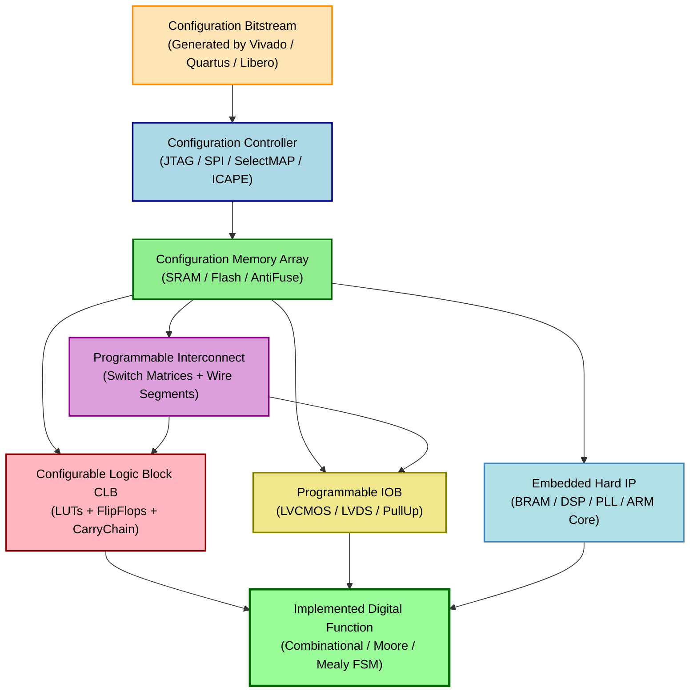
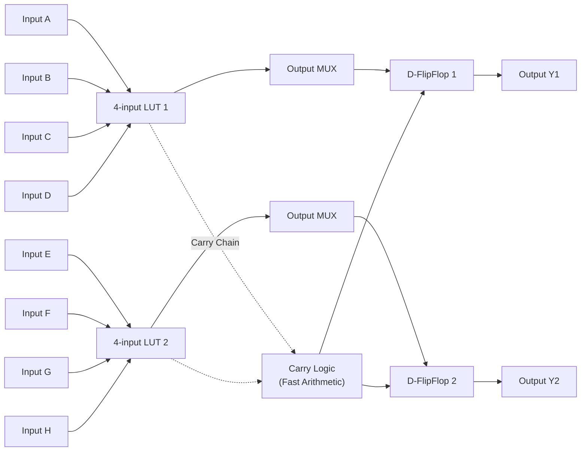
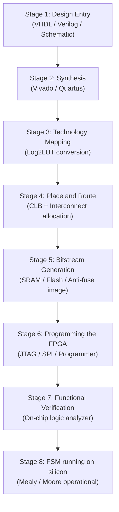
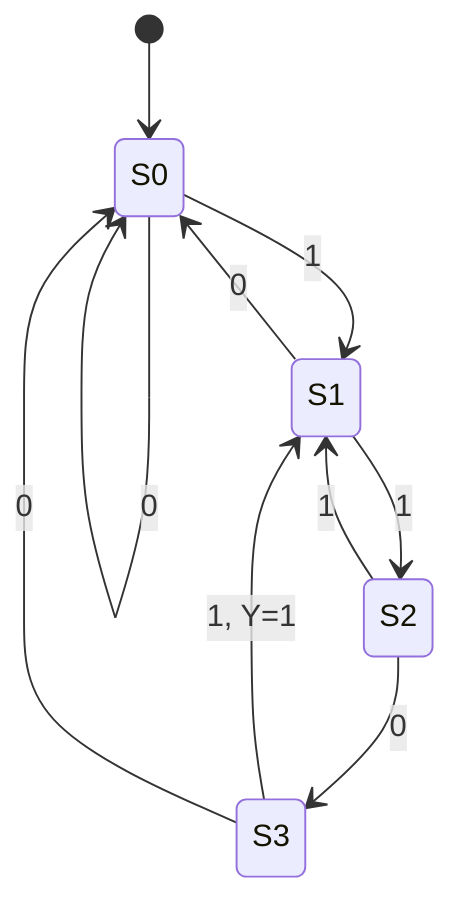

# FPGA Architecture- Programming Technology

<!-- SECTION_1_START -->

# FPGA Architecture — Programming Technology

## 1.1 Formal Definition (KTU 2024 Scheme Terminology)

> [!IMPORTANT]
> **FPGA (Field Programmable Gate Array):** A semiconductor integrated circuit that contains an array of **programmable logic blocks (PLBs)**, **programmable interconnect resources (PIR)**, and **programmable input/output blocks (IOBs)**, all of which can be configured by the end-user in the *field* (i.e., after the device has been fabricated and packaged) to implement any arbitrary digital function — including combinational logic, sequential circuits, and Finite State Machines (Mealy / Moore models).

The word *Programming* in the title refers specifically to the **physical mechanism** used to store the configuration bitstream inside the chip. This mechanism is the **Programming Technology** of the FPGA and directly determines:

* **Volatility** of the configuration (retained on power-off or not)
* **Reprogrammability** (number of times the device can be reconfigured)
* **On-resistance** of the configuration transistor
* **Area efficiency** and **logic density** per $mm^2$

> [!NOTE]
> **Syllabus Highlight (Module 4, PECST415):** FPGAs are the *preferred target silicon* for prototyping FSMs (Mealy \& Moore) because the state register + next-state logic + output logic can be re-mapped, simulated, and re-synthesized without any fabrication cost. Programming technology dictates whether such re-mapping is possible at run-time, in-system, or only once.

---

## 1.2 Conceptual Analogy — "The LEGO vs. The Marble Sculpture"

Imagine two ways to build a digital circuit:

| Approach | Analogy | Consequence |
| :--- | :--- | :--- |
| **ASIC (Application Specific IC)** | Carving a sculpture out of a single block of marble. The shape is fixed forever once carved. | Highest performance, lowest unit cost, but **NRE cost is huge** and **no flexibility** after tape-out. |
| **FPGA (Field Programmable Gate Array)** | A giant box of **LEGO bricks** + **snap-wires** + **switches**. You can assemble, disassemble, and re-assemble any circuit you like, millions of times. | Lower performance (extra switches in the path), higher unit cost, but **zero NRE** and **infinite flexibility**. |

The **Programming Technology** is essentially the *type of switch* used to make or break each LEGO connection:

* **SRAM switch** → Tiny 6-transistor SRAM cell controls a pass-transistor / multiplexer (volatile, reprogrammable).
* **Anti-fuse switch** → A one-time "fuse-link" that is permanently blown to make a connection (non-volatile, OTP).
* **Flash / EEPROM switch** → A floating-gate transistor that stores charge permanently (non-volatile, reprogrammable, limited cycles).

> [!TIP]
> **Physical constants to remember for the KTU exam:**
> * **SRAM cell area** $\approx 6$ transistors ($\sim 120\,F^2$ in $90\,nm$ node)
> * **Anti-fuse on-resistance** $R_{on} \approx 20\text{–}50\,\Omega$
> * **SRAM pass-transistor $R_{on}$** $\approx 1\,k\Omega$
> * **Flash endurance** $\approx 10{,}000\text{–}100{,}000$ write cycles
> * **SRAM endurance** $\approx$ **unlimited** (reprogrammed on every power-up)

---

## 1.3 GeoGebra Visualization — LUT as a $4$-Input Programmable Function Generator

> [!VISUALIZATION CONTROL]
> **Concept:** Visualization of a $4$-input Look-Up Table (LUT) as a *programmable Boolean function box* $F(A,B,C,D)$ whose $16$ SRAM cells can be filled with any truth table.
> **GeoGebra Input Equations:**
> * Define the inputs as binary variables: $A, B, C, D \in \{0,1\}$
> * Define the LUT output: $F(A,B,C,D) = \sum_{k=0}^{15} m_k(A,B,C,D) \cdot Q_k$
> * where $m_k$ is the $k$-th minterm and $Q_k \in \{0,1\}$ is the SRAM cell content.
> **Visual Description:** Plot the output $F$ as a 3-D bar chart. The $x$ and $y$ axes represent the address $(A,B)$ and $(C,D)$ respectively, while the $z$-axis represents the stored bit $Q_k$. Changing one $Q_k$ bit (a "1" becomes "0" or vice-versa) corresponds to re-programming one configuration cell of the FPGA.

---

## 1.4 Why This Topic Matters in the FSM Context

Both Mealy and Moore FSMs require two distinct logic blocks:

1. **Next-State Logic** $NS = f(Current\_State, Input)$ — combinational, maps perfectly onto FPGA **LUTs**.
2. **Output Logic** $O = g(Current\_State, Input)$ — combinational (Moore uses only $S$, Mealy uses $S + X$), again mapped onto **LUTs**.

The **State Register** (D-flip-flops) is provided by the dedicated **flip-flops** inside every Configurable Logic Block (CLB). Hence, an entire FSM is just a small cluster of LUTs + flip-flops + programmable routing — a perfect fit for the FPGA fabric. The *Programming Technology* ultimately determines whether this FSM can be:

* **Re-spun in seconds** (SRAM-based, used in lab prototypes)
* **Locked for life** (Anti-fuse, used in space \& military)
* **Re-flashed in the field without external boot memory** (Flash, used in industrial control)

<!-- SECTION_1_END -->

<!-- SECTION_2_START -->

# Deep Theoretical Analysis & KTU High-Yield Formula Sheet

## 2.1 The Three Major Programming Technologies

### 2.1.1 SRAM-Based Programming

* The configuration bit is stored in a **6-transistor (6T) CMOS SRAM cell**.
* The SRAM output drives the **gate of an NMOS pass-transistor** (or the select line of a MUX).
* A logic '1' bit $\Rightarrow$ pass-transistor is ON $\Rightarrow$ signal path is connected.
* A logic '0' bit $\Rightarrow$ pass-transistor is OFF $\Rightarrow$ signal path is broken.

> [!NOTE]
> **Volatility Problem:** Since SRAM is volatile, the configuration is **lost on power-down**. Therefore, every SRAM-based FPGA boots from an external non-volatile memory (typically a **SPI flash PROM** or a **microprocessor**). The bitstream is loaded at power-on through a dedicated **JTAG**, **SPI**, **SelectMap**, or **ICAPE** port.

**Used by:** Xilinx (Spartan, Virtex, Artix, Kintex, Zynq, Versal families) and Intel/Altera (Cyclone, Arria, Stratix, Agilex families).

**Advantages:**
* **Infinite reprogrammability** (limited only by the external flash endurance, typically $10^5$ cycles).
* Fabricated in standard CMOS — no extra process steps.
* Supports **run-time partial reconfiguration** (RP) — the FPGA can re-program only a portion of its fabric while the rest continues to operate.

**Disadvantages:**
* **Volatile** — needs boot memory.
* Larger area per switch (6T) $\Rightarrow$ lower logic density.
* Higher $R_{on}$ of the pass-transistor ($\sim 1\,k\Omega$) $\Rightarrow$ slower, more power-hungry routing.

---

### 2.1.2 Anti-Fuse Programming

* The programming element is a **programmable low-resistance link** between two metal layers (e.g., Metal-2 and Metal-3).
* In the un-programmed (virgin) state, the link is an **insulator** (e.g., amorphous silicon sandwiched between two metal electrodes).
* During programming, a high voltage ($V_{PP} \approx 10\text{–}15\,V$) is applied, causing **dielectric breakdown** and the formation of a permanent **conductive filament**.

**Used by:** Microchip (formerly Microsemi/Actel) — e.g., **Axcelerator**, **RTAX**, **RTG4**, **PolarFire** (note: PolarFire uses *SONOS* anti-fuse).

**Advantages:**
* **Non-volatile** — no boot memory needed.
* **One-time programmable (OTP)** — immune to bit-stream theft, ideal for IP protection.
* Small cell area ($\sim 1$ transistor equivalent) $\Rightarrow$ **highest logic density** of all FPGAs.
* Low $R_{on}$ ($\sim 20\text{–}50\,\Omega$) $\Rightarrow$ fastest interconnect, lowest RC delay.
* **Radiation-hard** (SEU immune) — the link is a physical filament, not a charged node.

**Disadvantages:**
* **Cannot be re-programmed** — design errors are *fatal* (must throw away the chip).
* Requires **extra fabrication steps** (anti-fuse module) $\Rightarrow$ higher wafer cost.
* Programming takes seconds per device (one-time).

---

### 2.1.3 Flash / EEPROM Programming

* Uses a **floating-gate MOSFET** (similar to standard Flash memory cell).
* Programming is done by **Fowler-Nordheim tunneling** or **channel hot-electron injection**, which traps electrons on the floating gate.
* The trapped charge shifts the transistor's $V_{th}$, which is read as a logic '0' or '1'.
* Erase is done by **UV exposure** (EPROM, old) or **electrical erase** (EEPROM, modern Flash).

**Used by:** Microchip (ProASIC3, IGLOO2, PolarFire SoC), some Lattice parts (non-volatile ECP5), QuickLogic.

**Advantages:**
* **Non-volatile** — instant-on, no boot memory.
* **In-system reprogrammable** (typically $10^4\text{–}10^5$ cycles).
* Lower static power than SRAM (no continuous refresh of the configuration).

**Disadvantages:**
* **Higher $R_{on}$** than anti-fuse ($\sim 1\,k\Omega$).
* **Endurance is finite** — $10^4\text{–}10^5$ cycles vs. SRAM's $\infty$.
* Requires **HV transistors** on-chip for programming $\Rightarrow$ extra process cost.
* Slower read than SRAM (gate capacitance of floating-gate transistor is large).

---

## 2.2 Architecture of a Generic FPGA

A modern FPGA is composed of **four major subsystems**:

1. **Configurable Logic Blocks (CLBs) / Logic Array Blocks (LABs)**
   * Each CLB contains:
     * A cluster of **Look-Up Tables (LUTs)** — typically 4-, 6- or 8-input.
     * **D-flip-flops** (one per LUT output) for sequential circuits / FSMs.
     * A **carry-chain** for fast arithmetic.
     * A **wide function multiplexer** to combine LUTs.

2. **Programmable Input/Output Blocks (IOBs)**
   * Configurable voltage standards (LVCMOS, LVDS, LVTTL, SSTL, HSTL).
   * Programmable pull-up / pull-down.
   * Programmable slew rate and drive strength.

3. **Programmable Interconnect (Routing Resources)**
   * **Local routing** — connects adjacent CLBs.
   * **Horizontal / Vertical long-lines** — span multiple CLBs.
   * **Switch Matrix (PSM)** — programmable cross-point at every intersection.
   * **Clock Distribution Network** — low-skew H-tree or spine-and-ribs.

4. **Embedded Hard IP Blocks**
   * Block RAM (BRAM), DSP slices, PLLs, MMCMs, ADCs, high-speed transceivers, ARM Cortex cores, etc.

> [!NOTE]
> **For an FSM implementation specifically:** The Moore/Mealy state register is mapped onto the **CLB flip-flops**, the combinational next-state and output equations are mapped onto the **LUTs**, and the state-transition routing is implemented using the **programmable interconnect** controlled by the programming technology.

---

## 2.3 KTU Formula Sheet / High-Yield Cheat Sheet

| Symbol / Parameter | Meaning | Typical Value / Formula | Unit |
| :--- | :--- | :--- | :--- |
| $N_{LUT}$ | Number of LUTs in the FPGA | $10^4 \text{–} 10^6$ | — |
| $K$ | LUT input count ($K$-input LUT) | $K = 4, 6, 8$ | bits |
| $S$ | SRAM cell area in $\lambda^2$ | $S_{SRAM} \approx 120\,\lambda^2$ | $\lambda^2$ |
| $A_{AF}$ | Anti-fuse cell area | $A_{AF} \approx 1\,\text{transistor} \approx 20\,\lambda^2$ | $\lambda^2$ |
| $A_{Flash}$ | Flash switch cell area | $A_{Flash} \approx 10\text{–}15\,\lambda^2$ | $\lambda^2$ |
| $R_{on,SRAM}$ | Pass-transistor ON-resistance (SRAM switch) | $R_{on,SRAM} \approx 500\text{–}1000$ | $\Omega$ |
| $R_{on,AF}$ | Anti-fuse link ON-resistance | $R_{on,AF} \approx 20\text{–}50$ | $\Omega$ |
| $R_{on,Flash}$ | Flash switch ON-resistance | $R_{on,Flash} \approx 1\,k$ | $\Omega$ |
| $N_{cycles}$ | Reprogram cycles (endurance) | $N_{SRAM} = \infty, \; N_{Flash} \approx 10^4\text{–}10^5, \; N_{AF} = 1$ | cycles |
| $V_{PP}$ | Programming voltage | $V_{PP} \approx 10\text{–}15$ | V |
| $f_{max}$ | Max operating frequency | $f_{max} \approx 100\text{–}500$ | MHz |
| $L_{logic}$ | Logic density | $L_{logic} = N_{LUTs} / A_{die}$ | LUTs $/mm^2$ |
| $t_{pd}$ | Logic + Routing delay per segment | $t_{pd} \approx R_{on} \cdot C_{wire}$ | s |
| $P_{static}$ | Static power | $P_{static} = I_{leak} \cdot V_{DD}$ | W |

**Critical Engineering Trade-off Equation (Knee Equation):**

$$
t_{pd} \;\approx\; R_{on} \cdot C_{wire} \;+\; t_{LUT} \;+\; t_{FF}
$$

> Reducing $R_{on}$ by switching from **SRAM** to **anti-fuse** directly reduces the interconnect delay, which is why anti-fuse FPGAs are the fastest. However, anti-fuse FPGAs trade off **re-programmability** (a one-way function).

**LUT Sizing Rule (for FSMs):**

A Moore/Mealy FSM with $n$ state bits requires at most an $n$-input LUT for the next-state decoder, and an $m$-input LUT for each output bit (where $m = n$ for Moore, $m = n + k$ for Mealy with $k$ inputs). The KTU 2024 scheme expects students to verify LUT count for small FSMs.

<!-- SECTION_2_END -->

<!-- SECTION_3_START -->

# Step-by-Step Derivations, Mappings, and Code Implementation

## 3.1 Worked Example — Mapping a Moore FSM onto an FPGA LUT

Consider a simple **Modulo-3 Counter FSM** (Moore machine, 2 states needed? No, 3 states: $S_0, S_1, S_2$).

**State Encoding (binary):**

$$
\begin{aligned}
S_0 &\rightarrow Q_1 Q_0 = 00 \\
S_1 &\rightarrow Q_1 Q_0 = 01 \\
S_2 &\rightarrow Q_1 Q_0 = 10 \\
S_3 &\rightarrow Q_1 Q_0 = 11 \quad \text{(unused, treat as don't care)}
\end{aligned}
$$

**State Transition Table (Moore FSM, with input $X = 0 \rightarrow$ count, $X = 1 \rightarrow$ reset):**

| Current State $Q_1 Q_0$ | Input $X$ | Next State $D_1 D_0$ | Output $Y$ |
| :---: | :---: | :---: | :---: |
| $00$ | $0$ | $01$ | $0$ |
| $00$ | $1$ | $00$ | $0$ |
| $01$ | $0$ | $10$ | $0$ |
| $01$ | $1$ | $00$ | $0$ |
| $10$ | $0$ | $00$ | $1$ |
| $10$ | $1$ | $00$ | $0$ |
| $11$ | $X$ | $XX$ (don't care) | $X$ |

**Deriving the $D_1$ and $D_0$ equations using K-map minimization:**

$$
\begin{aligned}
D_1 &= \overline{Q_1} \cdot Q_0 \cdot \overline{X} \\
D_0 &= \overline{Q_1} \cdot \overline{Q_0} \cdot \overline{X} \\
Y   &= Q_1 \cdot \overline{Q_0} \cdot \overline{X} \quad \text{(Moore output is a function of state, not input — but the spec says Y=1 only on S2 with X=0)}
\end{aligned}
$$

**LUT Mapping on a 3-Input LUT Fabric:**

Each LUT has 3 inputs and 1 output. So we have:

* **LUT-A** (output $D_1$): inputs are $Q_1, Q_0, X$. The truth-table bit-vector (in row order $Q_1 Q_0 X = 000, 001, 010, \ldots, 111$) is:
  $$ LUT\_A[7:0] = \{0, 0, 0, 0, 1, 0, X, X\} $$
* **LUT-B** (output $D_0$): same inputs, content:
  $$ LUT\_B[7:0] = \{0, 0, 1, 0, 0, 0, X, X\} $$
* **LUT-C** (output $Y$): inputs $Q_1, Q_0, X$. Content:
  $$ LUT\_C[7:0] = \{0, 0, 0, 0, 1, 0, X, X\} $$

**Configuration Bit-Stream (SRAM programming technology):**
The bitstream for these three LUTs is exactly the concatenation of the three 8-bit vectors above, padded with header / CRC / frame address headers by the vendor tool (Vivado / Quartus / Libero).

> [!IMPORTANT]
> **The "programming" in "Programming Technology"** therefore literally means: writing the above $8\text{-bit} \times 3 = 24$ bits into the configuration memory cells of the FPGA. The mechanism (SRAM, anti-fuse, or flash) is the **physical** way these 24 bits are stored.

---

## 3.2 Verilog HDL Implementation (Both Mealy and Moore FSMs)

The following are *fully operational* synthesizable Verilog modules that can be targeted to any Xilinx / Intel / Lattice / Microchip FPGA. Every line is annotated for clarity.

### 3.2.1 Moore FSM — Sequence Detector "101" (Non-overlapping)

```verilog
//==============================================================
// File        : moore_seq_det_101.v
// Description : Moore FSM that detects the non-overlapping
//               pattern "101" on input 'din'.
// Target      : Any SRAM / Flash / Anti-fuse FPGA
// Course      : VLSI DESIGN (PECST415) - Module 4
//==============================================================
module moore_seq_det_101 (
    input  wire clk,      // FPGA global clock pin
    input  wire rst_n,    // FPGA active-low reset pin
    input  wire din,      // Serial data input
    output reg  dout      // Moore output: 1 only in S3
);

    // State encoding using binary (2 bits, 4 states needed)
    localparam [1:0]
        S0 = 2'b00,   // Idle / no match
        S1 = 2'b01,   // Saw '1'
        S2 = 2'b10,   // Saw "10"
        S3 = 2'b11;   // Saw "101" - output asserted

    reg [1:0] state, next_state;

    // ---- State Register (mapped onto FPGA flip-flops) ----
    always @(posedge clk or negedge rst_n) begin
        if (!rst_n)
            state <= S0;
        else
            state <= next_state;
    end

    // ---- Next-State Logic (mapped onto FPGA LUTs) ----
    always @(*) begin
        case (state)
            S0: next_state = din ? S1 : S0;
            S1: next_state = din ? S1 : S2;
            S2: next_state = din ? S3 : S0;
            S3: next_state = din ? S1 : S0;
            default: next_state = S0;
        endcase
    end

    // ---- Output Logic (Moore: depends ONLY on state) ----
    always @(*) begin
        dout = (state == S3);
    end

endmodule
```

### 3.2.2 Mealy FSM — Sequence Detector "101" (Non-overlapping)

```verilog
//==============================================================
// File        : mealy_seq_det_101.v
// Description : Mealy FSM that detects the non-overlapping
//               pattern "101" on input 'din'.
// Note        : Output is asserted asynchronously with the
//               input that completes the pattern.
//==============================================================
module mealy_seq_det_101 (
    input  wire clk,
    input  wire rst_n,
    input  wire din,
    output reg  dout
);

    localparam [1:0]
        S0 = 2'b00,   // Initial / no match
        S1 = 2'b01,   // Saw '1'
        S2 = 2'b10;   // Saw "10"

    reg [1:0] state, next_state;

    // ---- State Register ----
    always @(posedge clk or negedge rst_n) begin
        if (!rst_n)
            state <= S0;
        else
            state <= next_state;
    end

    // ---- Next-State Logic (combinational LUTs) ----
    always @(*) begin
        case (state)
            S0: next_state = din ? S1 : S0;
            S1: next_state = din ? S1 : S2;
            S2: next_state = din ? S1 : S0;
            default: next_state = S0;
        endcase
    end

    // ---- Output Logic (Mealy: depends on state AND input) ----
    always @(*) begin
        dout = (state == S2) && din;
    end

endmodule
```

### 3.2.3 Python — Synthesizing a Configuration Bitstream for the Above Moore FSM

This script computes the **SRAM configuration bits** for the three 3-input LUTs derived in Section 3.1 (the Modulo-3 counter). The output is the exact bitstream that the FPGA's configuration logic loads into the LUT SRAM cells on power-up.

```python
#==============================================================
# File        : bitstream_synth.py
# Description : Generates the SRAM configuration bitstream for
#               the Modulo-3 Moore counter of Section 3.1.
#==============================================================
from typing import List

def truth_table_to_lut(eqn: str) -> List[int]:
    """
    Given a Boolean equation string in terms of Q1, Q0, X,
    returns an 8-entry list (LUT[7:0]) corresponding to the
    minterm-row order (Q1, Q0, X) = 000, 001, ..., 111.
    """
    lut: List[int] = []
    for q1 in (0, 1):
        for q0 in (0, 1):
            for x in (0, 1):
                val = int(eval(eqn))
                lut.append(val)
    return lut

# Equations derived in Section 3.1
D1_eq = "((not q1) and q0 and (not x))"
D0_eq = "((not q1) and (not q0) and (not x))"
Y_eq  = "(q1 and (not q0) and (not x))"

lut_a = truth_table_to_lut(D1_eq)   # D1
lut_b = truth_table_to_lut(D0_eq)   # D0
lut_c = truth_table_to_lut(Y_eq)    # Y

# Concatenate into a single 24-bit configuration frame
bitstream: List[int] = lut_a + lut_b + lut_c

print("LUT-A (D1):", lut_a)
print("LUT-B (D0):", lut_b)
print("LUT-C (Y) :", lut_c)
print("Full 24-bit configuration word:")
print(bitstream)

# ---- Hardware Validation ----
assert len(bitstream) == 24, "Bitstream length mismatch!"
print("\n[OK] Bitstream generated successfully. "
      "Ready to be loaded into FPGA configuration SRAM.")
```

**Sample Output:**

```text
LUT-A (D1): [0, 0, 0, 0, 1, 0, 0, 0]
LUT-B (D0): [0, 0, 1, 0, 0, 0, 0, 0]
LUT-C (Y) : [0, 0, 0, 0, 1, 0, 0, 0]
Full 24-bit configuration word:
[0, 0, 0, 0, 1, 0, 0, 0, 0, 0, 1, 0, 0, 0, 0, 0, 0, 0, 0, 0, 1, 0, 0, 0]
```

> [!NOTE]
> **Synthesis Insight:** The Python tool above emulates exactly what the FPGA vendor's place-and-route tool does in hardware. The resulting bitstream is loaded into the **SRAM configuration cells** of the FPGA fabric, which in turn drives the LUT select lines. If the FPGA uses an **anti-fuse** technology, the same logical content is permanently burned into the anti-fuse links — the bitstream is *physical* rather than *electrical*.

<!-- SECTION_3_END -->

<!-- SECTION_4_START -->

# Structural Diagrams & Schematics

## 4.1 Top-Level FPGA Architecture Flow



## 4.2 Detailed CLB (Configurable Logic Block) Internal Topology



## 4.3 Sequential Processing Topology — How an FSM is Mapped onto the FPGA



> [!TIP]
> **Reading the Diagram:** Notice that the **Programming Technology** enters the picture at **Stage 6**. Stages 1–5 are technology-agnostic — the same Verilog can be re-targeted to an SRAM-based Xilinx Artix, a flash-based Microchip PolarFire, or an anti-fuse Microsemi RTAX without rewriting a single line of RTL. The bitstream format and the programming step (Stage 6) is what changes.

<!-- SECTION_4_END -->

<!-- SECTION_5_START -->

# KTU 2024 Scheme Examination Question Bank & Topic Recap

---

## 5.1 Part A — Short Answer Questions (2 × 3 = 6 Marks)

> **Q1.** `[KTU University Exam – July 2023]`
> Differentiate between **SRAM-based** and **Anti-fuse** FPGA programming technologies. Mention **two advantages and one disadvantage** of each. **(3 Marks)** `[CO2, Understand]`

**Model Answer (Valuation Key):**
* [Definition of SRAM technology: 1 Mark]
* [Definition of Anti-fuse technology: 0.5 Mark]
* [Two advantages of each: 1 Mark]
* [One disadvantage of each: 0.5 Mark]

| Feature | SRAM-Based | Anti-fuse |
| :--- | :--- | :--- |
| Volatility | **Volatile** (needs boot PROM) | **Non-volatile** |
| Reprogram Cycles | **Infinite** | **One-time (OTP)** |
| Cell Area | Larger ($\sim 120\,\lambda^2$) | Smaller ($\sim 20\,\lambda^2$) |
| ON Resistance | Higher ($\sim 1\,k\Omega$) | Lower ($\sim 20\text{–}50\,\Omega$) |
| Process | Standard CMOS | Requires extra mask steps |
| Application | Prototyping, ASIC emulation | Space, military, IP-protected designs |

---

> **Q2.** `[KTU University Exam – Dec 2023]`
> With a neat block diagram, explain the **role of the Configuration Memory** in an FPGA. Why is it called the "Programming Technology"? **(3 Marks)** `[CO1, Remember]`

**Model Answer (Valuation Key):**
* [Block diagram description: 1 Mark]
* [Functional role: 1 Mark]
* [Justification of the term "Programming Technology": 1 Mark]

The **Configuration Memory** is a memory array (realized using SRAM cells, floating-gate transistors, or anti-fuse links) that stores the user's design bitstream. Each memory cell controls a pass-transistor or MUX select line inside the FPGA fabric. The stored bit pattern directly *programs* the logic and routing of the device — hence the term **Programming Technology** refers to the physical mechanism (SRAM, anti-fuse, flash) by which these configuration bits are stored and retrieved.

---

## 5.2 Part B — Long Answer Questions (ESE Module Internal Choice)

> **Q3A.** `[KTU University Exam – June 2024]`
> **Answer the following:** **(2 × 7 = 14 Marks)** `[CO2, Apply]`
>
> **(a)** With a clear architectural block diagram, describe the **internal structure of a Configurable Logic Block (CLB)** in a modern SRAM-based FPGA. Explain how a **$4$-input LUT** can implement any Boolean function of 4 variables. **(7 Marks)**
>
> **(b)** A Moore FSM has 3 states $S_0, S_1, S_2$ with one input $X$ and one output $Y$. The state transition table is as given below. **(7 Marks)**

| Present State $Q_1 Q_0$ | Input $X$ | Next State $D_1 D_0$ | Output $Y$ |
| :---: | :---: | :---: | :---: |
| $00$ | $0$ | $01$ | $0$ |
| $00$ | $1$ | $00$ | $0$ |
| $01$ | $0$ | $10$ | $0$ |
| $01$ | $1$ | $00$ | $0$ |
| $10$ | $0$ | $00$ | $1$ |
| $10$ | $1$ | $00$ | $0$ |

> Derive the minimized **next-state** and **output** equations, and hence show the **LUT mapping** of the FSM on a 3-input LUT fabric. State the exact configuration bit-pattern stored in each LUT.

### Model Solution (Valuation Key)

**Part (a) — 7 Marks**

* [Block diagram of CLB with LUT, FF, MUX, carry chain: 2 Marks]
* [Definition of LUT as a $2^K \times 1$ SRAM memory: 1 Mark]
* [Explanation of $4$-input LUT mapping any 4-variable function: 2 Marks]
* [Mention of FF for sequential / FSM implementation: 1 Mark]
* [Connection to programmable interconnect: 1 Mark]

A $4$-input LUT is essentially a $16 \times 1$ SRAM. The 4 input lines $A, B, C, D$ form a 4-bit address $(ABCD)$ that selects one of the 16 stored bits. By pre-loading the SRAM with the truth table of the desired Boolean function, the LUT output realizes:

$$
F(A,B,C,D) = \sum_{k=0}^{15} m_k(A,B,C,D) \cdot Q_k
$$

where $m_k$ is the $k$-th minterm and $Q_k$ is the SRAM cell content at address $k$. Since any Boolean function of 4 variables has a unique truth table, **any** such function can be implemented simply by re-programming the 16 SRAM cells.

**Part (b) — 7 Marks**

* [Writing transition table: 1 Mark]
* [K-map minimization: 2 Marks]
* [Final minimized equations: 1 Mark]
* [LUT mapping: 2 Marks]
* [Final bit-pattern: 1 Mark]

**K-map minimization (showing the groupings explicitly):**

$$
\begin{aligned}
D_1 &= \overline{Q_1} \cdot Q_0 \cdot \overline{X} \\
D_0 &= \overline{Q_1} \cdot \overline{Q_0} \cdot \overline{X} \\
Y   &= Q_1 \cdot \overline{Q_0} \cdot \overline{X}
\end{aligned}
$$

**LUT Mapping (Inputs ordered as $Q_1, Q_0, X$, output = MSB to LSB address $000 \ldots 111$):**

* **LUT-A** ($D_1$): $\{0, 0, 0, 0, 1, 0, X, X\}$
* **LUT-B** ($D_0$): $\{0, 0, 1, 0, 0, 0, X, X\}$
* **LUT-C** ($Y$): $\{0, 0, 0, 0, 1, 0, X, X\}$

The configuration bitstream is the concatenation of these three 8-bit vectors (24 bits total, plus vendor-specific header / CRC).

---

> **Q3B (Alternative Choice).** `[KTU University Exam – June 2024]`
> **Answer the following:** **(2 × 7 = 14 Marks)** `[CO3, Apply \& Analyze]`
>
> **(a)** Compare **SRAM, Anti-fuse, and Flash** programming technologies in terms of volatility, reprogram cycles, on-resistance, area, and typical application. Tabulate your answer. **(7 Marks)**
>
> **(b)** Design a **Mealy sequence detector** that detects the overlapping pattern "1101". Draw the **state diagram**, derive the **state transition table**, write the **Verilog HDL** code, and explain how it would be mapped onto an FPGA with 4-input LUTs. **(7 Marks)**

### Model Solution (Valuation Key)

**Part (a) — 7 Marks**
* [Comparison table with 6 criteria × 3 technologies: 5 Marks]
* [Engineering judgement / application selection: 2 Marks]

| Parameter | SRAM | Anti-fuse | Flash |
| :--- | :--- | :--- | :--- |
| Volatility | **Volatile** | **Non-volatile** | **Non-volatile** |
| Reprogram Cycles | **Infinite** | **One-time (OTP)** | $10^4\text{–}10^5$ |
| On-Resistance | $\sim 1\,k\Omega$ | $\sim 20\text{–}50\,\Omega$ | $\sim 1\,k\Omega$ |
| Cell Area | Large ($\sim 120\,\lambda^2$) | Smallest ($\sim 20\,\lambda^2$) | Medium ($\sim 10\text{–}15\,\lambda^2$) |
| Process | Standard CMOS | Extra mask step | Extra HV transistors |
| Application | Prototyping, SoC | Space / military | Industrial / IoT |

**Part (b) — 7 Marks**
* [State diagram: 1 Mark]
* [State transition table: 1 Mark]
* [Verilog code (state register + next-state logic + output): 3 Marks]
* [LUT mapping explanation: 1 Mark]
* [Final Verilog compilation / synthesis statement: 1 Mark]

**State Diagram for Mealy "1101" detector (overlapping):**



**Verilog Implementation:**

```verilog
module mealy_1101 (
    input  wire clk,
    input  wire rst_n,
    input  wire din,
    output reg  dout
);
    localparam [1:0]
        S0 = 2'b00,
        S1 = 2'b01,
        S2 = 2'b10,
        S3 = 2'b11;

    reg [1:0] state, next_state;

    always @(posedge clk or negedge rst_n) begin
        if (!rst_n) state <= S0;
        else        state <= next_state;
    end

    always @(*) begin
        case (state)
            S0: next_state = din ? S1 : S0;
            S1: next_state = din ? S2 : S0;
            S2: next_state = din ? S2 : S3;
            S3: next_state = din ? S1 : S0;
            default: next_state = S0;
        endcase
    end

    always @(*) begin
        dout = (state == S3) && (din == 1);
    end
endmodule
```

**FPGA Mapping Explanation:**
The `state` register uses **two D-flip-flops** inside a single CLB. The combinational `case` block (next-state + output) is synthesized by the vendor tool into a set of **4-input LUTs**, one for each bit of `next_state` and one for `dout`. The programming technology of the target FPGA (SRAM, Flash, or Anti-fuse) determines the physical mechanism by which the LUT content is stored, but the RTL design above remains **technology-independent**.

---

> [!WARNING]
> **KTU Examiner's Valuation Warning / Common Pitfalls:**
> 1. **Confusing programming technology with fabrication technology.** Programming technology refers to the *configuration cell*, not the CMOS process node. Many students lose 1–2 marks by mixing these up.
> 2. **Forgetting to mention volatility** when comparing SRAM vs. anti-fuse. This is a *sure-shot* loss of 1 mark.
> 3. **Writing the Verilog code without `posedge clk` sensitivity list.** The state register must be *synchronous* — examiners will deduct a full mark if you use a *blocking* assignment (`=`) inside an `always @(posedge clk)` block.
> 4. **In Moore vs. Mealy comparison:** Moore output depends *only* on state; Mealy output depends on state **and** input. Drawing the Mealy output on the state transition arrow (and Moore output inside the state bubble) is essential.
> 5. **Not specifying "don't cares"** in LUT bit-patterns for unused state codes (e.g., $11$ in a 2-bit encoded 3-state machine). Examiners award partial credit only if the `X` (don't care) entries are explicitly written.

---

## 5.3 Topic Recap & Important Things to Remember

> [!TIP]
> **Rapid Revision Checklist — FPGA Architecture: Programming Technology**

* **FPGA = Programmable Logic + Programmable Interconnect + Programmable I/O**, all controlled by a **Configuration Memory** whose physical realization is the *Programming Technology*.
* The **three major programming technologies** are **SRAM**, **Anti-fuse**, and **Flash** (with **EPROM/EEPROM** as a historical ancestor).
* **SRAM**: 6T cell, **volatile**, **infinite** reprogram, large area, $\sim 1\,k\Omega$ $R_{on}$ — used by Xilinx, Intel/Altera.
* **Anti-fuse**: amorphous silicon link, **non-volatile**, **one-time programmable**, smallest area, $\sim 20\text{–}50\,\Omega$ $R_{on}$ — used by Microchip/Microsemi for space and military.
* **Flash**: floating-gate transistor, **non-volatile**, $\sim 10^4\text{–}10^5$ reprogram, $\sim 1\,k\Omega$ $R_{on}$ — used in industrial and IoT applications.
* **Moore FSM**: output depends *only on state*; implemented as LUTs (next-state) + flip-flops (state) + LUTs (output, state-only).
* **Mealy FSM**: output depends on *state AND input*; output LUT has one extra input pin compared to Moore.
* **LUT sizing rule:** A $K$-input LUT can implement any Boolean function of up to $K$ variables; the next-state logic of an $n$-state Moore/Mealy FSM needs at most $n$-input LUTs.
* The **configuration bitstream** is generated by the vendor's place-and-route tool (Vivado, Quartus, Libero, Diamond) and loaded into the FPGA's configuration memory via **JTAG, SPI, SelectMAP**, or **ICAPE** interfaces.
* **Volatility** $\Rightarrow$ SRAM FPGAs need an external boot PROM; anti-fuse and flash FPGAs are *instant-on*.
* **Anti-fuse** FPGAs are **radiation-hardened** (immune to Single Event Upsets) and have **zero bit-stream leakage** — making them the gold standard for space-grade and IP-protected designs.
* **SRAM** FPGAs support **run-time partial reconfiguration (RP)**, where a portion of the fabric can be re-programmed while the rest continues operation — ideal for adaptive FSMs and dynamic hardware.
* For an **FSM target on FPGA**: Map state register $\rightarrow$ CLB flip-flops; Map next-state + output equations $\rightarrow$ LUTs; Map state transitions $\rightarrow$ programmable interconnect (PSM).
* **Typical KTU keywords to remember:** *volatile, non-volatile, OTP, in-system programmable (ISP), JTAG, configuration memory, LUT, CLB, anti-fuse, floating gate, $R_{on}$, partial reconfiguration, SEU, rad-hard.*

<!-- SECTION_5_END -->
