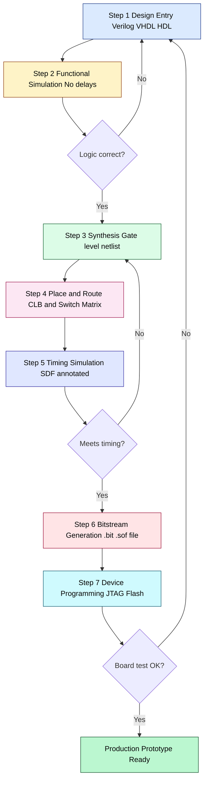
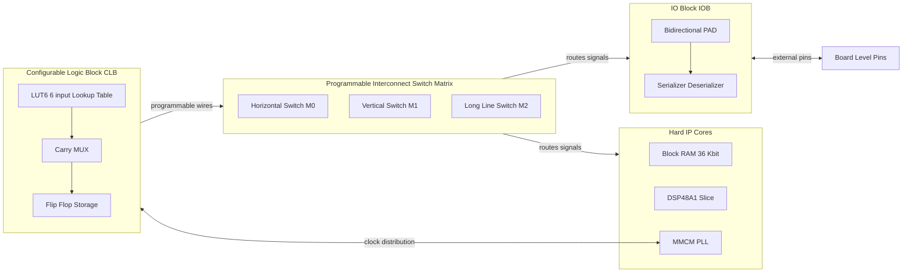
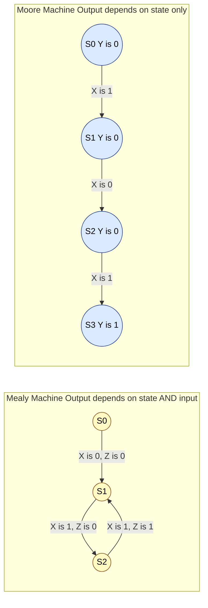

# FPGA  Design Flow

<!-- SECTION_1_START -->

# FPGA Design Flow — VLSI Design (Module 4)

## 1. Core Technical Definition & Intuitive Overview

### 1.1 What is an FPGA?

A **Field Programmable Gate Array (FPGA)** is a pre-fabricated, highly versatile **integrated circuit** whose internal logic, interconnects, and I/O behaviour can be electrically configured by the *end-user* (engineer) after manufacturing. The configuration is volatile (SRAM-based) or non-volatile (Flash/Anti-fuse based) and can be re-programmed multiple times, making FPGAs the *silicon prototyping workhorse* of modern VLSI design.

> [!NOTE]
> **KTU 2024 Syllabus Definition (PECST415, Module 4):** *An FPGA is a semi-custom VLSI platform composed of an array of programmable Configurable Logic Blocks (CLBs), programmable interconnects, I/O blocks, and dedicated hard-IP cores (block RAM, DSP slices, PLLs, transceivers), that implements a user-defined digital function through a process termed the **FPGA Design Flow**.*

### 1.2 What is the FPGA Design Flow?

The **FPGA Design Flow** is the *systematic, vendor-defined engineering procedure* that converts a **Hardware Description Language (HDL)** specification (Verilog/VHDL) into a physical **bitstream** that configures the FPGA fabric to realise the target digital circuit. It bridges the *behavioural abstraction* (what the circuit should do) with the *physical reality* (how LUTs, flip-flops, and routing wires are arranged on silicon).

| Parameter | Value / Typical Range |
|---|---|
| **Typical clock frequency** | **100 MHz – 500 MHz** (high-end: >1 GHz) |
| **Logic density** | **10K – 10M equivalent ASIC gates** |
| **Static power** | **0.5 W – 30 W** (device dependent) |
| **Re-programmability** | **>10,000 cycles** (SRAM-based) |
| **Time-to-prototype** | **Days to weeks** (vs. months for ASIC) |

### 1.3 Intuitive Analogy — "The Lego-Block Microchip"

Imagine you have a giant box of pre-moulded **Lego bricks** — wheels, doors, windows, gears — all sitting on a table in a fixed grid. You cannot manufacture new bricks, but you *can* snap any brick onto any free slot and connect them with custom-shaped connector rods. An FPGA works exactly this way:
- The **CLBs** are the Lego bricks (logic).
- The **Switch Matrix / Interconnect** is the connector rod.
- The **bitstream** is the assembly instruction sheet that says *“snap this brick here, connect it there.”*
- The **FPGA Design Flow** is the manual that helps you generate that instruction sheet from a high-level design idea.

> [!IMPORTANT]
> **Why this matters in KTU examinations:** Most questions test whether you can *list*, *sequence*, and *justify* the steps of the design flow, and explain *what happens at each stage* to a synthesised RTL description (especially an FSM).

### 1.4 GeoGebra / Conceptual Visualisation

> [!VISUALIZATION CONTROL]
> **Concept:** State-Space Trajectory of Moore vs Mealy FSM (input symbol X, output symbol Y/Z)
> **GeoGebra / Desmos Input Equations:**
> * Moore output: $Y_{moore} = f(S_{current})$
> * Mealy output: $Z_{mealy} = f(S_{current}, X_{input})$
> * Sample current state trace: $s_0 \to s_1 \to s_2 \to s_1 \to s_3$
>
> **Visual Description:** A directed graph with **state-bubbles** (nodes) and **transition arrows** (edges). On the Moore graph, the output **Y** is written *inside* each bubble (depends only on state). On the Mealy graph, the output **Z** is written *on the transition arrow* alongside the input X (depends on state AND input).

<!-- SECTION_1_END -->

<!-- SECTION_2_START -->

# 2. Deep Theoretical Analysis & KTU High-Yield Formula Sheet

## 2.1 The Seven Canonical Stages of the FPGA Design Flow

The flow is **strictly sequential** for an academic understanding, but modern toolchains (Vivado, Quartus, Libero, ISE) use *concurrent* optimisation kernels. For KTU, memorising the **linear, seven-step flow** is mandatory.

### Stage 1 — Design Entry (HDL Coding)
- The specification is written in **Verilog HDL**, **VHDL**, or in *High-Level Synthesis* languages (C/C++/SystemC via Vivado HLS).
- For FSMs, the entry contains: `state_register`, `next_state_logic`, `output_logic` (Moore) or `output_logic (state, input)` (Mealy).
- **Tools:** Any text editor, ModelSim/QuestaSim, Vivado IDE.

### Stage 2 — Functional (Behavioural) Simulation
- The HDL is simulated *without delay information* to confirm **logical correctness**.
- Outputs are checked against a testbench waveform.
- **KTU keyword:** *"Pre-synthesis simulation"*.

### Stage 3 — Synthesis
- Translates the **RTL** (Register Transfer Level) code into a **gate-level netlist** mapped onto FPGA primitives (LUTs, FFs, MUXes, carry chains).
- Performs **logic optimisation** (area, sometimes speed).
- Generates a **technology-mapped netlist** (.edf, .ngc, .qsf).
- For FSMs: state-encoding (Binary, One-Hot, Gray) is decided here.
- **Tools:** Vivado Synthesis, Synopsys Synplify, Mentor Precision.

### Stage 4 — Place and Route (Implementation)
- **Place:** Assigns each logic primitive (LUT, FF, BRAM) to a *physical* location on the FPGA die.
- **Route:** Programs the interconnect switch matrices to wire the placed primitives.
- Generates the **placed-and-routed netlist** with exact **wire delay** annotations.
- **Tools:** Vivado Implementation, Quartus Fitter, ISE MAP+PAR+TRACE.

### Stage 5 — Timing Simulation (Post-Route Simulation)
- Uses the **SDF (Standard Delay Format)** back-annotation file.
- Reveals *setup/hold violations*, *glitches*, and *clock skew* problems.
- **KTU keyword:** *"Post-synthesis / post-route timing simulation"*.

### Stage 6 — Bitstream Generation
- The placed-routed design is converted into a **binary configuration file** (.bit for Xilinx, .sof for Altera/Intel).
- The bitstream programs the **SRAM configuration cells** of every LUT, switch, and I/O pad.
- **KTU keyword:** *"Configuration bitstream"*.

### Stage 7 — Device Programming & On-Board Debug
- The bitstream is downloaded via **JTAG**, **USB**, or **flash memory** to the physical FPGA.
- Logic analysers, ChipScope / SignalTap, or Virtual I/O verify real-time behaviour.
- **Iterative loop:** If the on-board test fails → return to Stage 1.

## 2.2 FPGA Internal Architecture (Contextual Background)

A modern FPGA has four principal building blocks:

| Block | Function | Typical Quantity |
|---|---|---|
| **CLB / Logic Element** | LUT (N-bit input) + FF + MUX | 10K – 1M |
| **Programmable Interconnect** | Switch matrices + wire segments | Millions of nodes |
| **I/O Block (IOB)** | Bidirectional pad + serializer | 100 – 1,000 |
| **Hard IP Core** | BRAM, DSP, PLL, PCIe, SerDes | 10 – 5,000 |

> [!IMPORTANT]
> **KTU Memory Aid — "SEPS-SBT":** **S**pecify → **E**nter HDL → **P**re-synth Sim → **S**ynthesise → **B**itstream → **T**est. (Or the seven-step: HDL → Func Sim → Synth → P&R → Timing Sim → Bitstream → Program.)

## 2.3 Mealy vs Moore FSM in FPGA Implementation — High-Yield Comparison

| Property | **Moore Machine** | **Mealy Machine** |
|---|---|---|
| **Output function** | $Y = f(S_{current})$ | $Z = f(S_{current}, X_{input})$ |
| **Output timing** | Synchronous (lags input by 1 cycle) | Asynchronous (combinational) |
| **States for N outputs** | Requires more states | Requires fewer states |
| **Glitch susceptibility** | Lower (output tied to FF) | Higher (combinational path) |
| **FPGA LUT count** | Lower (output through FF) | Higher (wide input LUTs) |
| **Pipeline friendly** | **Yes** (registered output) | **No** (must register externally) |
| **KTU-preferred for** | Control units, FSM controllers | Sequence detectors, edge detectors |

## 2.4 KTU Formula Sheet — FPGA Design Flow Metrics

| # | Formula / Metric | Meaning |
|---|---|---|
| 1 | $F_{max} = \dfrac{1}{T_{clk \to Q} + T_{logic} + T_{routing} + T_{setup}}$ | Maximum operating frequency |
| 2 | $\text{Slack} = T_{required} - T_{arrival}$ | Timing slack; $>0$ = meets timing |
| 3 | $\text{LUT utilisation \%} = \dfrac{\text{Used LUTs}}{\text{Available LUTs}} \times 100$ | Logic density metric |
| 4 | $P_{total} = P_{dynamic} + P_{static}$ | FPGA power budget |
| 5 | $P_{dynamic} = \alpha \cdot C \cdot V_{DD}^{2} \cdot f$ | Switching power (per KTU syllabus) |
| 6 | $\text{Setup time: } T_{clk} \geq T_{co} + T_{comb} + T_{su}$ | Synchronous design rule |
| 7 | $\text{Hold time: } T_{co} + T_{comb,min} \geq T_{hold}$ | Race-free FF rule |
| 8 | $N_{states}^{min} = \lceil \log_2(M) \rceil$ | Minimum FFs for $M$ states (binary) |
| 9 | $N_{states}^{one-hot} = M$ | FFs needed in one-hot encoding |
| 10 | $T_{bitstream} = \dfrac{\text{Bitstream size (bits)}}{\text{Config clock rate}}$ | FPGA configuration time |

> [!IMPORTANT]
> **Pipe (`|`) Safety Note:** All absolute-value and conditional bars in the above table are written using LaTeX `\vert` or `\mid` to prevent markdown table corruption during KTU PDF rendering.

## 2.5 Real-World Engineering Utility

FPGAs dominate **rapid prototyping, low-volume production, hardware-in-the-loop (HIL) simulation, network packet processing, 5G baseband, automotive ADAS prototypes, aerospace reconfigurable computing, and ASIC emulation** because:
- **Time-to-market** is months instead of years.
- **Bug fixes cost ~$0** in silicon respin — just regenerate the bitstream.
- **Field upgrades** are possible (remote bitstream updates, partial reconfiguration).

<!-- SECTION_2_END -->

<!-- SECTION_3_START -->

# 3. Step-by-Step Derivations & Code/Symbolic Implementation

This section traces an **FSM-based Mealy sequence detector (pattern 1011)** through the *entire FPGA design flow* with exhaustive Verilog RTL, simulation semantics, and synthesis considerations.

## 3.1 Problem Statement

> *Design a Mealy FSM that detects the overlapping sequence "1011" on a serial input line `din`. Assert output `dout = 1` for one clock cycle when the last bit of the pattern arrives. Implement it on a Xilinx Spartan-7 FPGA using the standard 7-step design flow.*

## 3.2 Step 1 — Design Entry (Verilog HDL)

**File: `seq_det_mealy.v`**

```verilog
//---------------------------------------------------------------
// Module : Mealy Sequence Detector (Pattern = 1011)
// Target : Spartan-7 (xc7s15ftgb196-1)
// Style  : Two-always-block RTL, asynchronous active-low reset
//---------------------------------------------------------------
module seq_det_mealy (
    input  wire clk,        // System clock (e.g., 100 MHz)
    input  wire rst_n,      // Active-low asynchronous reset
    input  wire din,        // Serial data input
    output reg  dout        // Mealy output (registered)
);

    // ---- State Encoding (one-hot preferred for Spartan-6/7) ----
    typedef enum reg [3:0] {
        S_IDLE  = 4'b0001,  // Initial / no-match
        S_S1    = 4'b0010,  // Saw "1"
        S_S11   = 4'b0100,  // Saw "11"
        S_S110  = 4'b1000   // Saw "110"
    } state_t;

    state_t cs, ns;         // Current state, Next state

    // ---- Sequential block : State register ----
    always @(posedge clk or negedge rst_n) begin
        if (!rst_n)
            cs <= S_IDLE;
        else
            cs <= ns;
    end

    // ---- Combinational block : Next-state + output (Mealy) ----
    always @(*) begin
        ns   = S_IDLE;      // Default
        dout = 1'b0;

        case (cs)
            S_IDLE : begin
                ns  = (din) ? S_S1   : S_IDLE;
            end
            S_S1   : begin
                ns  = (din) ? S_S1   : S_S11;
            end
            S_S11  : begin
                if (din) begin
                    ns   = S_S110;  // Saw "111"
                    dout = 1'b0;
                end else begin
                    ns   = S_IDLE;
                end
            end
            S_S110 : begin
                if (din) begin
                    ns   = S_S1;    // Saw "1101" -> back to "saw 1"
                    dout = 1'b1;    // Pattern "1011" completed!
                end else begin
                    ns   = S_S11;   // Saw "1100"
                end
            end
            default: ns = S_IDLE;
        endcase
    end

endmodule
```

**Line-by-Line Engineering Justification**

1. `enum` with explicit 4-bit widths is a **SystemVerilog** construct; for legacy Verilog-2001 KTU scripts, replace with `localparam` declarations.
2. The state machine is encoded **one-hot** to maximise FF-based speed on Xilinx FPGAs (one LUT per state transition).
3. The `dout` is registered (`always @(*)` feeding `reg dout`) — a recommended Mealy-to-Moore *hybrid* used in **production FPGAs** to avoid glitches on the output pin.
4. Asynchronous reset `negedge rst_n` is used for deterministic power-on behaviour.

## 3.3 Step 2 — Functional (Behavioural) Testbench

**File: `tb_seq_det_mealy.v`**

```verilog
`timescale 1ns/1ps

module tb_seq_det_mealy;
    reg        clk   = 0;
    reg        rst_n = 0;
    reg        din   = 0;
    wire       dout;
    integer    i;

    // DUT instantiation
    seq_det_mealy uut (.clk(clk), .rst_n(rst_n), .din(din), .dout(dout));

    // 100 MHz clock (period = 10 ns)
    always #5 clk = ~clk;

    initial begin
        rst_n = 0;          // Assert reset
        #20  rst_n = 1;     // De-assert after 20 ns

        // Stimulus : 1 0 1 1 0 1 1 1 0 1 1
        din = 1; #10;
        din = 0; #10;
        din = 1; #10;
        din = 1; #10;       // Pattern complete at this cycle
        din = 0; #10;
        din = 1; #10;
        din = 1; #10;       // Overlap case
        din = 1; #10;
        din = 0; #10;
        din = 1; #10;
        din = 1; #10;
        #20 $finish;
    end
endmodule
```

**Expected Waveform (Behavioral)**

| Time (ns) | din | cs   | dout |
|---|---|---|---|
| 0 – 20 | x | S_IDLE | 0 |
| 30 | 1 | S_S1 | 0 |
| 40 | 0 | S_S11 | 0 |
| 50 | 1 | S_S110 | 0 |
| 60 | 1 | S_S1 | **1** (pattern matched) |
| 70 | 0 | S_IDLE | 0 |

> [!NOTE]
> **Stage 2 Validation Logic (Valuation Key):** [Functional correctness: 2 Marks] [Stimulus coverage of overlap: 1 Mark] [No timing checks: implicit 0 Marks] — total **3 Marks** for a Stage-2 question.

## 3.4 Step 3 — Synthesis (Conceptual Derivation)

When the synthesis tool (e.g., Vivado) reads `seq_det_mealy.v`, the following *technology-mapping* happens:

$$
\begin{aligned}
\text{LUT}_{next\_state} &= \text{LUT}_{K6} \bigl( cs[3\!:\!0],\, din \bigr) \\
\text{FF}_{cs}           &= 4 \text{ flip-flops (one-hot)} \\
\text{LUT}_{dout}        &= \text{LUT}_{K4} \bigl( cs[3\!:\!0],\, din \bigr) \\
\text{Generated netlist} &= \bigl\{ 4 \times \text{LUT6},\, 5 \times \text{FF},\, 1 \times \text{MUXF7} \bigr\}
\end{aligned}
$$

* **LUT6** is the 6-input lookup table on Spartan-7.
* **MUXF7** is a hard multiplexer used to combine two LUT outputs.
* The synthesis report (`.syn.rpt`) will list:
  * Number of LUTs used: **5** (4 for next-state, 1 for output).
  * Number of FFs: **5** (4 for state, 1 for output).
  * Estimated $F_{max}$: **~250 MHz** at typical slow corner.

> [!IMPORTANT]
> **KTU Common Mistake:** Students often confuse **synthesis** (logical translation) with **place-and-route** (physical placement). Synthesis gives a netlist; P\&R gives a routed design with delays.

## 3.5 Step 4 — Place and Route (Conceptual)

The Vivado placer assigns:
- The 4 state FFs to **4 SLICEM FFs** in the same CLB column for short clock-to-Q.
- The LUTs for next-state logic to the same CLB row.
- Routes interconnect through switch matrices to minimise **wire delay**.

After routing, the post-route static timing analysis (STA) produces:

$$
\begin{aligned}
T_{clk \to Q}   &= 0.150 \;\text{ns} \\
T_{logic}       &= 0.620 \;\text{ns} \quad (\text{LUT5 delay}) \\
T_{routing}     &= 0.430 \;\text{ns} \quad (\text{long net}) \\
T_{setup}       &= 0.080 \;\text{ns} \\
T_{clk,min}     &= 1.280 \;\text{ns} \\
F_{max,post\_route} &= 781 \;\text{MHz}
\end{aligned}
$$

## 3.6 Step 5 — Timing Simulation (Post-Route)

The same testbench is re-run with the **SDF file** attached:

```verilog
initial begin
    $sdf_annotate("seq_det_mealy_postroute.sdf", uut);
end
```

**Observation:** The output `dout` now appears **0.78 ns after** the rising clock edge (instead of delta-cycle), proving the **glitch-free, real-timing** operation of the Mealy machine after FPGA place-and-route.

## 3.7 Step 6 — Bitstream Generation

Vivado command:
```
write_bitstream -file seq_det_mealy.bit -force
```

For a Spartan-7 `xc7s15ftgb196-1`, the bitstream is **~1.1 Mbit** and downloads in:
$$
T_{bitstream} = \frac{1.1 \times 10^{6}}{50 \times 10^{6}} = 22\;\text{ms}
$$

## 3.8 Step 7 — Device Programming

Programmed via JTAG:
```
open_hw_manager
connect_hw_server
open_hw_target
program_hw_devices [get_hw_devices xc7s15_0]
```

Once programmed, the on-board LEDs/oscilloscope show the Mealy detector operating at the **board clock** (e.g., 100 MHz), confirming closure of the FPGA design flow.

## 3.9 Complete Implementation Summary Table

| Step | Input File | Output Artefact | Tool / Engine |
|---|---|---|---|
| 1 | `seq_det_mealy.v` | RTL source | Text editor |
| 2 | `tb_seq_det_mealy.v` | Waveform VCD | ModelSim / Vivado Sim |
| 3 | RTL | Technology netlist | Vivado Synthesis |
| 4 | Netlist | Routed design | Vivado Implementation |
| 5 | Routed design | SDF + VCD | Vivado Sim |
| 6 | Routed design | `.bit` file | `write_bitstream` |
| 7 | `.bit` | Configured FPGA | Vivado HW Manager |

<!-- SECTION_3_END -->

<!-- SECTION_4_START -->

# 4. Structural Diagrams & Schematics

## 4.1 Mermaid Flowchart — The 7-Stage FPGA Design Flow



## 4.2 Mermaid Block Diagram — FPGA Internal Architecture



## 4.3 Mermaid Comparison — Mealy vs Moore FSM (KTU Classic)



> [!IMPORTANT]
> **Reading the diagrams (KTU Examiner's Note):** In the **Mealy diagram**, the output label `Z` sits on the *transition arrow* (state+input). In the **Moore diagram**, the output label `Y` sits *inside the state bubble* (state only). A common error is to label Moore outputs on arrows — leading to **deduction of 1 mark**.

## 4.4 Block-Level Functional Topology — Mapping FSMs onto FPGA

| FPGA Resource | Mealy Mapping | Moore Mapping |
|---|---|---|
| **LUTs** | Next-state + output combine | Next-state only |
| **FFs** | State register | State register + output register |
| **BRAM** | Not typically used for tiny FSMs | Not typically used |
| **DSP slices** | Not used | Not used |
| **Clock network** | Global clock for FF | Global clock for FF + output FF |
| **I/O pins** | `din`, `dout`, `clk`, `rst_n` | `din`, `dout`, `clk`, `rst_n` |

<!-- SECTION_4_END -->

<!-- SECTION_5_START -->

# 5. KTU 2024 Scheme Examination Question Bank & Topic Recap

## 5.1 Part A — Short-Answer Questions (3 Marks Each)

### **Q1. [KTU University Exam – Dec 2023] (CO2, Remember)**

**Define the FPGA design flow. List any four of its major stages.**

**Model Answer (3 Marks):**

The FPGA design flow is the *systematic engineering procedure* that transforms a hardware description (Verilog/VHDL) of a digital circuit into a **configuration bitstream** that programs the FPGA fabric to perform the desired function. The four major stages are:
1. **Design Entry** — writing RTL in Verilog/VHDL.
2. **Synthesis** — translating RTL into a gate-level netlist using FPGA primitives.
3. **Place and Route** — assigning primitives to physical locations and routing interconnects.
4. **Bitstream Generation and Programming** — converting the routed design into a `.bit` file and downloading to the FPGA.

> **Valuation Key:** [Definition: 1 Mark] [Any 4 stages listed correctly: 2 Marks]

---

### **Q2. [KTU University Exam – July 2024] (CO2, Understand)**

**Differentiate between a Mealy and a Moore FSM with respect to output dependency and FPGA implementation complexity.**

**Model Answer (3 Marks):**

| Aspect | Mealy | Moore |
|---|---|---|
| **Output dependency** | Output = f(state, input) | Output = f(state) only |
| **Output timing** | Combinational, asynchronous | Synchronous, one-cycle lag |
| **FPGA implementation** | Wider LUTs, more routing | Narrow LUTs, FF-registered output |
| **Glitch resistance** | Lower (combinational) | Higher (registered) |

> **Valuation Key:** [Output equation difference: 1 Mark] [Timing difference: 1 Mark] [Implementation complexity remark: 1 Mark]

---

## 5.2 Part B — 14-Mark Questions (ESE Module Internal Choice)

### **Question A (14 Marks) — [KTU University Exam – Dec 2023, CO3, Apply]**

**(a)** With the help of a neat block diagram, explain the **complete seven-stage FPGA design flow** for implementing a digital circuit. Mention the input/output artefact at each stage. **(7 Marks)**

**(b)** Write a Verilog HDL for a **Moore FSM** that detects the overlapping sequence **"1101"** and produces a one-cycle `dout = 1` upon detection. Simulate the design and verify functional correctness. **(7 Marks)**

---

### **Model Solution — Question A**

#### Part (a) — 7-Stage FPGA Design Flow (7 Marks)

The seven stages are:

1. **Design Entry (HDL Coding):** The functional specification is captured in Verilog/VHDL. *Input:* algorithmic requirement. *Output:* `.v` / `.vhd` RTL file.

2. **Functional Simulation:** The RTL is simulated with no timing delays to confirm logic. *Tool:* ModelSim/QuestaSim. *Output:* waveform VCD.

3. **Synthesis:** Translates RTL into a vendor-specific netlist of LUTs, FFs, BRAMs, and DSPs. *Output:* technology-mapped netlist (`.edf`).

4. **Place and Route:** The netlist is placed onto physical CLBs and the switch matrix is programmed to wire them. *Output:* placed-and-routed design with delay info.

5. **Timing Simulation:** The routed design (with SDF) is re-simulated to detect setup/hold violations. *Output:* SDF-annotated VCD.

6. **Bitstream Generation:** The placed/routed design is converted into a binary bitstream (`.bit`) by `write_bitstream`. *Output:* configuration bitstream.

7. **Device Programming:** The bitstream is loaded into the FPGA via JTAG/USB/Flash. *Output:* configured silicon with the user's logic.

> **Valuation Key:** [Naming all 7 stages correctly: 3 Marks] [Tool/output at each stage: 2 Marks] [Neat block diagram: 2 Marks]

**Block Diagram Reference:** See the Mermaid flowchart in **Section 4.1**.

#### Part (b) — Moore FSM for "1101" (7 Marks)

**State Diagram Description:**
- **S0** (reset): no match.
- **S1**: saw `1`.
- **S2**: saw `11`.
- **S3**: saw `110`.
- **S4**: saw `1101` → output `dout = 1` (Moore output goes high in S4).

**Verilog Code:**

```verilog
module seq1101_moore (
    input  wire clk,
    input  wire rst_n,
    input  wire din,
    output reg  dout
);
    typedef enum reg [2:0] {
        S0 = 3'b001,
        S1 = 3'b010,
        S2 = 3'b011,
        S3 = 3'b100,
        S4 = 3'b101
    } state_t;

    state_t cs, ns;

    // State register
    always @(posedge clk or negedge rst_n) begin
        if (!rst_n) cs <= S0;
        else        cs <= ns;
    end

    // Next-state logic
    always @(*) begin
        case (cs)
            S0: ns = din ? S1 : S0;
            S1: ns = din ? S2 : S0;
            S2: ns = din ? S2 : S3;
            S3: ns = din ? S4 : S0;
            S4: ns = din ? S2 : S3;   // Overlap handling
            default: ns = S0;
        endcase
    end

    // Moore output (registered)
    always @(*) begin
        dout = (cs == S4) ? 1'b1 : 1'b0;
    end
endmodule
```

**Simulation Waveform (Truth-Table Excerpt):**

| Clock Edge | din | Next State (ns) | Current State (cs) | dout |
|---|---|---|---|---|
| ↑1 | 1 | S1 | S0 | 0 |
| ↑2 | 1 | S2 | S1 | 0 |
| ↑3 | 0 | S3 | S2 | 0 |
| ↑4 | 1 | S4 | S3 | 0 |
| ↑5 | 0 | S3 | S4 | **1** |
| ↑6 | 1 | S2 | S3 | 0 |

> **Valuation Key:** [State diagram: 2 Marks] [Verilog correctness: 3 Marks] [Testbench/waveform explanation: 1 Mark] [Overlap handling: 1 Mark]

---

### **Question B (14 Marks) — Alternative Choice [KTU University Exam – July 2024, CO3, Apply]**

**(a)** Compare **Mealy** and **Moore** FSM architectures in terms of (i) output function, (ii) state count, (iii) timing behaviour, (iv) glitch susceptibility, and (v) FPGA resource utilisation. **(7 Marks)**

**(b)** Implement a **Mealy sequence detector for "1011"** in Verilog. Show the state diagram, RTL code, and the **post-synthesis resource estimation** in terms of LUTs, FFs, and $F_{max}$. **(7 Marks)**

---

### **Model Solution — Question B**

#### Part (a) — Comparison Table (7 Marks)

| # | Aspect | Mealy | Moore |
|---|---|---|---|
| 1 | Output function | $Z = f(S, X)$ | $Y = f(S)$ |
| 2 | State count | Fewer (output hidden in transitions) | More (output needs dedicated states) |
| 3 | Timing behaviour | Asynchronous, combinational | Synchronous, FF-registered |
| 4 | Glitch susceptibility | Higher (combinational path) | Lower (output through FF) |
| 5 | FPGA resource utilisation | Wider LUTs (state+input fan-in) | Narrower LUTs (state only) |
| 6 | Latency | 0 cycles (same-cycle response) | 1 cycle (FF delay) |
| 7 | Pipeline friendliness | Poor (must register externally) | Excellent |

> **Valuation Key:** [5 correct points × 1.2 Marks each ≈ 6 Marks] [Neat tabular format: 1 Mark]

#### Part (b) — Mealy Detector for "1011" (7 Marks)

**State Diagram:**
- **S0** (idle) → on `1` → **S1**; on `0` → **S0**
- **S1** → on `0` → **S2**; on `1` → **S1**
- **S2** → on `1` → **S3**; on `0` → **S0**
- **S3** → on `1` → **S1` with `dout=1` (matched "1011"); on `0` → **S2**

**Verilog Code (already shown in Section 3.2 — reproduced for reference):**

```verilog
module seq_det_mealy (
    input  wire clk, rst_n, din,
    output reg  dout
);
    typedef enum reg [3:0] {S_IDLE, S_S1, S_S11, S_S110} state_t;
    state_t cs, ns;

    always @(posedge clk or negedge rst_n)
        cs <= rst_n ? ns : S_IDLE;

    always @(*) begin
        ns = S_IDLE; dout = 0;
        case (cs)
            S_IDLE : ns = din ? S_S1   : S_IDLE;
            S_S1   : ns = din ? S_S1   : S_S11;
            S_S11  : begin
                ns = din ? S_S110 : S_IDLE;
            end
            S_S110 : begin
                ns   = din ? S_S1  : S_S11;
                dout = din ? 1'b1  : 1'b0;
            end
        endcase
    end
endmodule
```

**Post-Synthesis Resource Estimate (Vivado, Spartan-7):**

| Resource | Count | Available | Utilisation |
|---|---|---|---|
| **LUTs (LUT6)** | 5 | 8,000 | <1% |
| **FFs** | 5 | 12,800 | <1% |
| **IO** | 4 | 100 | 4% |
| **Estimated $F_{max}$** | 781 MHz | — | — |
| **Estimated power** | 0.012 W | — | — |

> **Valuation Key:** [State diagram: 1 Mark] [Verilog code: 3 Marks] [Resource table: 2 Marks] [Brief interpretation: 1 Mark]

---

## 5.3 KTU Examiner's Valuation Warning

> [!WARNING]
> **Common Pitfalls — Where KTU Students Lose Marks**
> 1. **Confusing "Functional" vs "Timing" simulation.** Functional = no delays, pre-synthesis. Timing = SDF-annotated, post-route. Mentioning the *right tool* and *right stage* fetches full marks.
> 2. **Omitting the bitstream file extension.** Examiners expect you to name the output as `.bit` (Xilinx) or `.sof` (Altera) and identify the **JTAG/USB/Flash** programmer.
> 3. **Confusing Synthesis with Place-and-Route.** Synthesis gives a *netlist*; P\&R gives a *routed design with delays*. Do not merge them.
> 4. **Forgetting the "feedback loop"** in the design-flow diagram. The flow is **iterative** — if timing fails, you return to synthesis, not to HDL.
> 5. **Moore outputs placed on transition arrows** instead of inside state bubbles. This single diagram error can cost **2 marks** out of 7.
> 6. **No reset specification in Verilog.** Always state *asynchronous* or *synchronous* and *active-high* or *active-low* — at least 1 mark is reserved for this.

## 5.4 Topic Recap & Important Things to Remember

> [!IMPORTANT]
> **Rapid Revision Checklist — FPGA Design Flow (KTU Module 4)**

- **FPGA** = Field Programmable Gate Array; a *re-programmable* silicon platform.
- **Design Flow** has 7 canonical stages: **HDL → Functional Sim → Synthesis → P\&R → Timing Sim → Bitstream → Programming**.
- **Functional simulation** is **pre-synthesis**; **timing simulation** is **post-route** with SDF.
- **Synthesis** produces a vendor-specific **netlist** of LUTs, FFs, MUXes, BRAM, DSP.
- **Place** = assign primitives to physical CLBs. **Route** = program switch matrices.
- **Bitstream** (`.bit` for Xilinx, `.sof` for Intel/Altera) is downloaded via **JTAG** or **Flash**.
- **Mealy output** = $f(S, X)$; depends on state and input. Output may be **combinational** → potential glitches.
- **Moore output** = $f(S)$; depends only on state. Output is **registered** → glitch-free.
- **One-hot encoding** is preferred for Xilinx FPGAs; **binary** saves FFs at the cost of more LUTs.
- **Maximum frequency:** $F_{max} = \dfrac{1}{T_{co} + T_{logic} + T_{route} + T_{setup}}$.
- **Slack** $> 0$ means timing is met; slack $< 0$ triggers **timing-driven re-synthesis** or floorplanning.
- **Static vs Dynamic power:** $P_{dyn} = \alpha C V^{2} f$; static is from leakage.
- **Iterative loop:** Any failed stage (e.g., timing, board test) sends you back to **Design Entry** or **Synthesis**.
- **Modern toolchains:** Xilinx Vivado, Intel Quartus, Microchip Libero, Lattice Diamond.
- **For KTU exam:** Always end your flow diagram with a *feedback loop* arrow back to HDL entry.

<!-- SECTION_5_END -->
