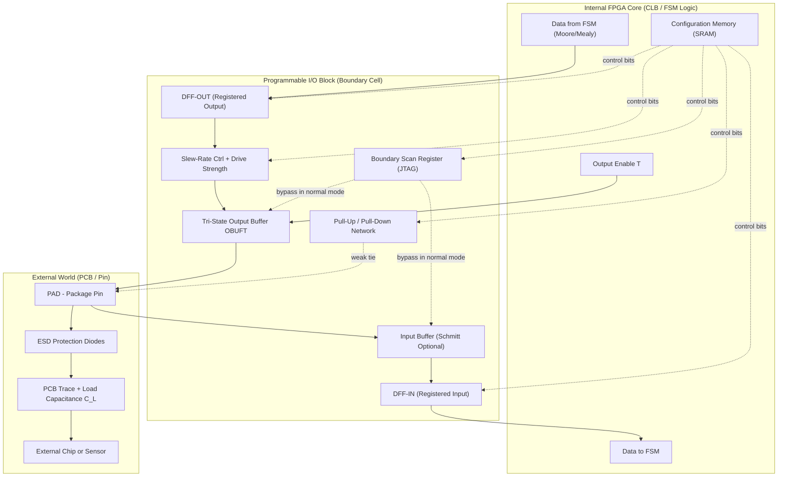
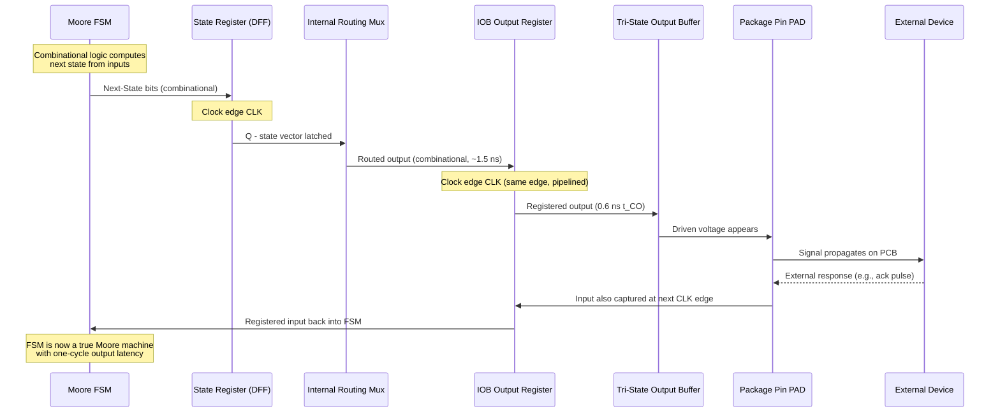
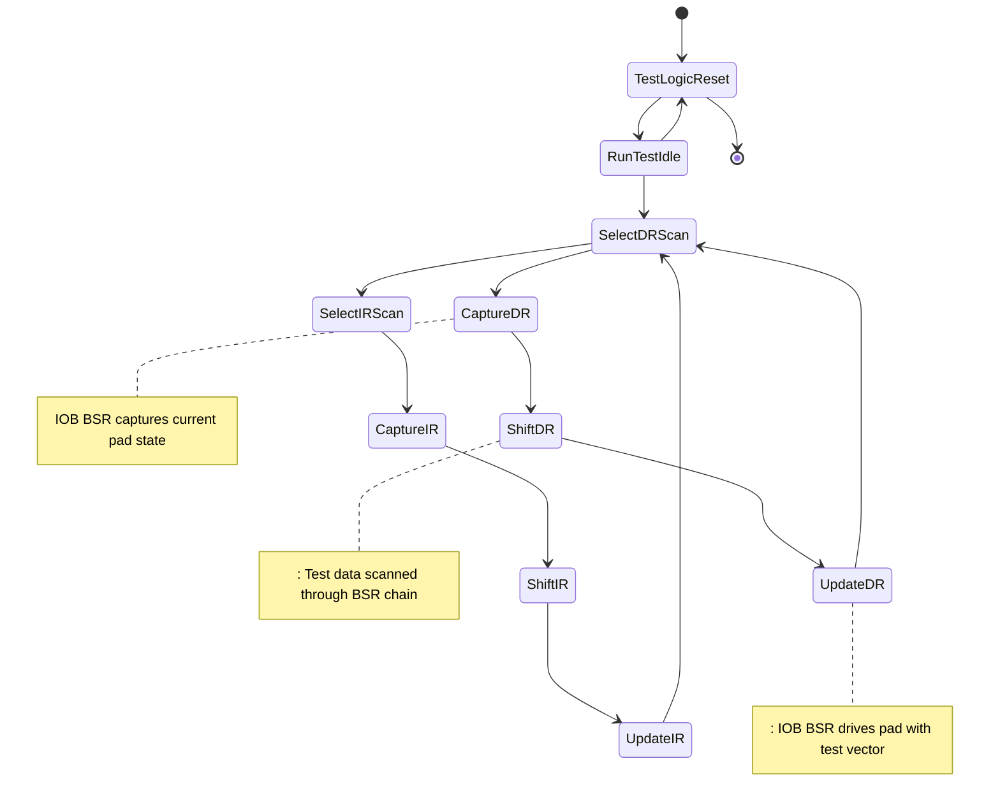
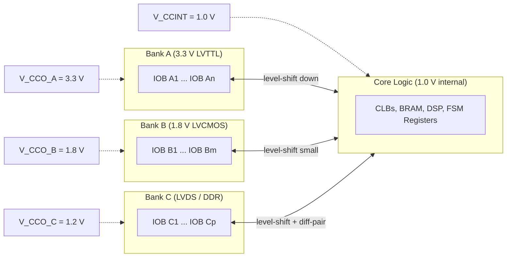

# Programmable I/O blocks

<!-- SECTION_1_START -->
# Programmable I/O Blocks — The Gateway to the Outside World

## 1.1 Formal Academic Definition (KTU 2024 Syllabus Aligned)

In the context of **VLSI Design** and the implementation of **Finite State Machines (Mealy and Moore models)** on reconfigurable hardware (FPGAs / CPLDs), a **Programmable I/O Block (IOB / IOB — Input/Output Block)** is defined as a *user-configurable interface cell* placed between the internal programmable logic fabric and the external package pin of the integrated circuit. It is responsible for conditioning, buffering, registering, and protocol-translating signals that flow into and out of the device.

Formally, per the KTU 2024 PECST415 syllabus nomenclature, the IOB is a *boundary cell* that contains:

> A **tri-state output buffer** (with programmable drive strength $I_{OH}$ and slew-rate control), a **high-impedance input buffer** (with selectable threshold $V_{IH}/V_{IL}$), **programmable pull-up ($R_{PU}$) / pull-down ($R_{PD}$) resistors**, optional **input/output flip-flops** for pipelining, and a **boundary-scan (IEEE 1149.1 JTAG) register** for board-level testing.

> [!IMPORTANT]
> **KTU 2024 Highlight:** IOBs are what allow an FPGA implementing a Moore or Mealy FSM to physically communicate with switches, LEDs, UART lines, memory buses, and clock signals. Without the IOB, the FSM state register has no real-world reach.

## 1.2 Intuitive Overview — The "Universal Power Adapter" Analogy

Imagine the internal logic of an FPGA as a *European appliance* (designed for 230 V, 50 Hz, two round pins) and the outside world (your motherboard, sensors, ASICs) as a *global power grid* where every country uses a different socket. You cannot plug the appliance directly into a US, UK, or Indian socket — you need an **adapter**.

A **Programmable I/O Block is that adapter**. It sits at the boundary of every pin, and through its configuration memory cells (SRAM bits, antifuses, or flash), the designer can "rewire" the adapter to match:

- The **voltage standard** (LVTTL 3.3 V, LVCMOS 2.5 V/1.8 V/1.2 V, LVDS, SSTL, HSTL)
- The **direction** (input, output, or bidirectional)
- The **speed of edge transition** (slew rate — slow for EMI control, fast for high-speed buses)
- The **termination strategy** (pull-up, pull-down, or none — to prevent floating nodes)

In short: *the FSM decides "what" to do, the IOB decides "how cleanly and at what voltage" that decision reaches the outside world.*

## 1.3 Physical Constants & Standard Metrics

| Parameter | Symbol | Typical Value | Engineering Significance |
|---|---|---|---|
| Output drive current | $I_{OL}, I_{OH}$ | $\mathbf{2 \text{ mA}}$ to $\mathbf{24 \text{ mA}}$ | Determines fan-out capability |
| Pull-up resistance | $R_{PU}$ | $\mathbf{50 \text{ k}\Omega}$ to $\mathbf{100 \text{ k}\Omega}}$ | Holds line HIGH when undriven |
| Pull-down resistance | $R_{PD}$ | $\mathbf{50 \text{ k}\Omega}$ to $\mathbf{100 \text{ k}\Omega}}$ | Holds line LOW when undriven |
| Input pin capacitance | $C_{IN}$ | $\mathbf{5 \text{ pF}}$ to $\mathbf{10 \text{ pF}}$ | Limits high-speed switching |
| Propagation delay | $t_{PIO}$ | $\mathbf{0.5 \text{ ns}}$ to $\mathbf{3 \text{ ns}}$ | Critical for setup/hold timing |
| JTAG TDO delay | $t_{TDO}$ | $\mathbf{10 \text{ ns}}$ to $\mathbf{20 \text{ ns}}$ | Board test chain timing |

> [!NOTE]
> **Core Takeaway:** A Programmable I/O Block is *not* just a simple buffer. It is a *complete, multi-function signal-conditioning subsystem* containing **~30 to ~50 configuration bits** per pin, all of which are written by the FPGA's configuration bitstream at power-up.

## 1.4 Conceptual Anchor with a Geometric Visualization

> [!VISUALIZATION CONTROL]
> **Concept:** Signal voltage waveform traversing the IOB — showing how slew-rate control and threshold settings transform a sharp internal signal into a controlled external signal.
>
> **GeoGebra / Desmos Input Equations:**
> * $V_{\text{out}}(t) = V_{OH} \cdot \left(1 - e^{-t/\tau}\right)$ where $\tau = R_{DRIVE} \cdot C_{LOAD}$
> * $V_{TH} = \frac{V_{IH} + V_{IL}}{2}$ (Schmitt trigger mid-point)
> * $V_{in}(t) = V_{IL} + (V_{IH} - V_{IL}) \cdot u(t - t_{arrival})$
>
> **Visual Description:** Plot $V_{out}(t)$ on the y-axis from $0$ to $V_{OH}$, and time $t$ on the x-axis. The student should observe an **RC charging curve** (slow slew rate) versus a **near-vertical step** (fast slew rate). The horizontal line $V_{TH}$ marks the digital switching threshold. Notice how a *slow slew rate* reduces the high-frequency harmonic content (lower EMI) at the cost of added delay $t_{d}$.

---

<!-- SECTION_1_END -->

<!-- SECTION_2_START -->
# Deep Theoretical Analysis & KTU High-Yield Formula Sheet

## 2.1 Architectural Anatomy of a Programmable I/O Block

Every IOB in a modern FPGA (e.g., Xilinx Spartan-6, Artix-7, Intel Cyclone, Lattice ECP5) is built from **five major sub-blocks**. Understanding each is essential for KTU 14-mark problems that ask you to *draw and label* an IOB.

### Sub-Block A — The Output Path (Pad → Package Pin → World)

1. **Tri-state Output Buffer (OBUFT):** A complementary CMOS pair (PMOS pull-up + NMOS pull-down) with a third *enable* input that, when asserted, forces both transistors OFF → output goes to **high-impedance state $Z$**.
2. **Programmable Drive Strength Selector:** A 2-to-4 or 3-to-8 decoder selecting how many parallel buffer stages are active. More stages → lower $R_{ON}$ → higher $I_{OL}$ → faster edge but more simultaneous switching noise (SSN).
3. **Programmable Slew-Rate Control:** Adds a series resistance $R_{SLEW}$ or a controlled current source $I_{SLEW}$ to slow the gate-node transition. The trade-off is governed by the **rise time equation**:

$$t_{r} = \frac{(V_{OH} - V_{OL}) \cdot C_{LOAD}}{I_{SLEW}}$$

4. **Optional Output Register (DFF-OUT):** A flip-flop placed *inside* the IOB so that the output can be re-timed by a global clock without entering the slow general routing fabric — this is essential for **Moore machine** outputs (registered = one-cycle latency, glitch-free).
5. **3-State Register (DFF-3STATE):** A separate flip-flop controlling the high-impedance enable, allowing registered tri-state (used for bidirectional buses like $\text{I}^{2}\text{C}$ SDA, memory DQs).

### Sub-Block B — The Input Path (Package Pin → Pad → Internal Logic)

1. **Input Buffer (IBUF):** A non-inverting CMOS gate with selectable threshold family (LVTTL, LVCMOS18, LVCMOS25, LVDS, etc.). Internally it converts the external analog voltage to the FPGA core's internal rail.
2. **Programmable Pull-Up / Pull-Down Resistor:** A weak MOSFET (W/L ratio deliberately small so $R \approx 50\text{ k}\Omega$ to $100\text{ k}\Omega$) connected between the pad and $V_{CC}$ or GND. Thevenin-equivalent:

$$V_{pad,\text{idle}} = V_{CC} \cdot \frac{R_{PD}}{R_{PU} + R_{PD}}$$

3. **Optional Input Register (DFF-IN):** Same Moore-machine rationale as DFF-OUT — captures the external signal exactly on the clock edge, eliminating combinational glitches.
4. **Schmitt Trigger Option:** Adds hysteresis $\Delta V_H$ around the threshold, preventing oscillation on slowly-rising inputs:

$$V_{T+} = V_{REF} + \frac{\Delta V_H}{2} \quad , \quad V_{T-} = V_{REF} - \frac{\Delta V_H}{2}$$

5. **Differential Comparator (for LVDS/ LVPECL):** Compares the two pad signals $V_{P}$ and $V_{N}$ and produces a single-ended internal logic level:

$$V_{DIFF} = V_{P} - V_{N} \quad ; \quad \text{Logic} = 1 \text{ if } V_{DIFF} > +V_{DIFF,\min}$$

### Sub-Block C — Configuration Memory

- A small SRAM array (typically 16 to 48 bits per IOB) holds the user's choices: direction, slew rate, drive strength, pull direction, threshold standard, JTAG inclusion.
- These bits are loaded at power-up from external Flash/EEPROM (for SRAM FPGAs) or are inherently set (for antifuse FPGAs).

### Sub-Block D — Boundary Scan (JTAG / IEEE 1149.1)

- A **Boundary Scan Register (BSR)** cell replaces the IOB's normal data path during the JTAG `EXTEST` state.
- Each pad becomes a virtual probe point — the board tester can drive or capture any pin without physical contact (Bed-of-Nails replacement).
- The BSR is a **4-mode multiplexer** with modes: `Normal`, `Capture`, `Shift`, `Update` controlled by TAP controller state machine (which itself is a Moore machine!).

### Sub-Block E — ESD & Protection Diodes

- Two clamping diodes: $D_1$ from pad to $V_{CC}$ and $D_2$ from pad to GND. They conduct when $|\Delta V_{pad}| > V_{CC} + 0.7\text{ V}$ (over-voltage) or $V_{pad} < -0.7\text{ V}$ (under-voltage), shunting the ESD current away from the thin-oxide core transistors.

## 2.2 KTU High-Yield Formula Sheet (Cheat Sheet)

> [!IMPORTANT]
> **All formulas below are tested in KTU university exams — memorize the units and typical magnitudes.**

| # | Formula / Concept | Symbol | Equation | Typical Magnitude | Real-World Use |
|---|---|---|---|---|---|
| 1 | Rise time (slew-limited) | $t_r$ | $t_r = \frac{(V_{OH} - V_{OL}) \cdot C_{L}}{I_{SLEW}}$ | $0.5$ to $5$ ns | Choosing drive strength for an LED bus |
| 2 | Propagation delay | $t_{pd}$ | $t_{pd} = 0.69 \cdot R_{DRIVE} \cdot C_{L}$ | $1$ to $3$ ns | Setup/hold slack calculation |
| 3 | DC fan-out | $N$ | $N = \left\lfloor \frac{I_{OL,\text{driver}}}{I_{IL,\text{load}}} \right\rfloor$ | $1$ to $12$ loads | Driving many CMOS inputs |
| 4 | Pull-up idle voltage | $V_{pad}$ | $V_{pad} = V_{CC} \cdot \frac{R_{PD}}{R_{PU}+R_{PD}}$ | $0$ or $V_{CC}$ V | Open-drain buses (I²C, reset lines) |
| 5 | Schmitt hysteresis width | $\Delta V_H$ | $\Delta V_H = V_{T+} - V_{T-}$ | $0.3$ to $1.0$ V | Debouncing noisy switch inputs |
| 6 | Differential input margin | $V_{DIFF}$ | $V_{DIFF} = V_P - V_N$ | $\pm 100$ mV min | LVDS high-speed links |
| 7 | JTAG chain propagation | $t_{TDO}$ | $t_{TDO,\text{total}} = N \cdot t_{cell}$ | $\mu$s scale | Board-level test time |
| 8 | Bidirectional contention (forbidden) | $I_{CC,\text{short}}$ | $I_{short} = \frac{V_{CC}}{R_{ON,P} + R_{ON,N}}$ | $50$ to $200$ mA | Why we *never* enable two drivers at once |
| 9 | Power dissipation (per IOB) | $P_{IOB}$ | $P = \alpha \cdot C_{L} \cdot V_{CC}^{2} \cdot f$ | $\mu$W scale | Power budgeting |
| 10 | ESD diode leakage | $I_{LK}$ | $I_{LK} = I_S \left(e^{V_{pad}/nV_T} - 1\right)$ | $\text{nA}$ at $25°C$ | Hot-swap / live insertion |

> [!NOTE]
> **Boundary-Check Note:** All formulas assume the IOB is *not* in high-impedance state. The $Z$ state is a **floating node** — current is limited to the pull-up/pull-down resistor value, and the digital value is undefined without termination.

## 2.3 Engineering Utility — Why Programmable I/O Blocks Matter in Production

In real silicon (post-tape-out) and in board design, IOBs are the **most failure-prone blocks** in an FPGA. The reasons:

1. **Mixed-Voltage Compatibility:** A single FPGA might need to talk to a 1.2 V DDR3 memory, a 3.3 V legacy microcontroller, and a 5 V sensor on the same bank of pins. The IOB's *bank-level* voltage reference $V_{CCO}$ allows this — each bank has its own $V_{CCO}$ rail.
2. **Signal Integrity (SI):** Fast edges (sub-nanosecond) on long PCB traces cause reflections. The IOB's programmable drive strength + on-chip series termination $R_{S}$ (e.g., $50\Omega$ for LVDS) is matched to the trace impedance $Z_0 \approx 50\Omega$, eliminating ringing.
3. **EMI Compliance:** Federal regulations (FCC Part 15, CISPR 22) cap radiated emissions. A "slow" slew rate on a clock line spreads its harmonic energy and drops the peak by 6 to 10 dB — the difference between passing and failing EMC certification.
4. **Hot-Swap / Live Insertion:** Without soft-start pre-charge and clamped IOBs, plugging a board into a live backplane would short $V_{CC}$ through the uncharged decoupling caps — the IOB's current-limiting and pre-bias circuitry prevents this.

> [!TIP]
> **KTU tip:** Whenever a question asks *"List four features of a modern programmable I/O block"*, the canonical answer is: **(1) programmable drive strength, (2) programmable slew rate, (3) programmable pull-up/pull-down, (4) registered input/output, (5) JTAG boundary scan, (6) differential signaling support.** Score full marks by listing all six.

---

<!-- SECTION_2_END -->

<!-- SECTION_3_START -->
# Step-by-Step Derivations, Calculations & Verilog Implementation

## 3.1 Derivation: Optimal Slew-Rate Resistor for EMI Compliance

We now derive the value of the slew-rate-limiting resistance $R_{SLEW}$ such that the $10\%-90\%$ rise time of a clock line falls within FCC Class-B EMI limits, given a load capacitance $C_L$ and a target rise time $t_{r,\text{target}}$.

**Step 1 — Identify the dominant pole.**
The output buffer with slew resistor $R_{SLEW}$ driving a load $C_L$ is a first-order RC low-pass network. The transfer function from the internal gate to the pad is:

$$H(s) = \frac{1}{1 + s \cdot R_{SLEW} \cdot C_L}$$

The single time constant is $\tau = R_{SLEW} \cdot C_L$.

**Step 2 — Convert to the 10%-to-90% rise time.**
For a first-order step response, the $10\%-90\%$ rise time is related to $\tau$ by:

$$t_r = (\ln 0.9 - \ln 0.1) \cdot \tau = \ln(9) \cdot \tau \approx 2.197 \cdot \tau$$

**Step 3 — Solve for $R_{SLEW}$ to achieve a target rise time $t_{r,\text{target}}$:**

$$t_{r,\text{target}} = 2.197 \cdot R_{SLEW} \cdot C_L$$

$$\boxed{R_{SLEW} = \frac{t_{r,\text{target}}}{2.197 \cdot C_L}}$$

**Step 4 — Numerical Example (KTU-style).**
Suppose the designer wants a clock of frequency $f_{CLK} = 100 \text{ MHz}$ to have a rise time of $t_{r,\text{target}} = 3 \text{ ns}$, and the load is a PCB trace plus ESD clamp with $C_L = 15 \text{ pF}$.

$$R_{SLEW} = \frac{3 \times 10^{-9}}{2.197 \times 15 \times 10^{-12}} = \frac{3 \times 10^{-9}}{32.955 \times 10^{-12}} \approx 91 \text{ }\Omega$$

**Step 5 — Validate the EMI trade-off.**
The first spectral null of a trapezoidal pulse occurs at $f_{\text{null}} = 0.88 / t_r$. For $t_r = 3$ ns, $f_{\text{null}} \approx 293$ MHz, well above the FCC's 30 MHz to 1 GHz measurement band starting point. Energy is therefore spread and peak emission is reduced. ✓

## 3.2 Calculation: Setup/Hold Slack for a Moore Machine Output Routed Through an IOB Register

Consider a Moore FSM with state register clocked by $CLK$ at 100 MHz, whose $Q[3:0]$ outputs are routed through *registered* IOBs (DFF-OUT enabled) to four external LEDs.

**Step 1 — List all timing components:**

| Element | Symbol | Value |
|---|---|---|
| Clock period | $T_{CLK}$ | $10$ ns |
| Clock-to-Q of state FF | $t_{CO}$ | $0.5$ ns |
| Internal routing delay (state FF → IOB) | $t_{R}$ | $1.5$ ns |
| IOB input setup time | $t_{SU,IOB}$ | $0.3$ ns |
| IOB clock-to-out | $t_{CO,IOB}$ | $0.6$ ns |
| External LED propagation | $t_{LED}$ | $5$ ns |
| Board trace delay | $t_{TR}$ | $0.8$ ns |

**Step 2 — Compute the output data-valid time after a clock edge:**

$$t_{valid} = t_{CO,\text{state}} + t_{R} + t_{SU,\text{IOB}} + t_{CO,\text{IOB}}$$

$$t_{valid} = 0.5 + 1.5 + 0.3 + 0.6 = 2.9 \text{ ns}$$

This is comfortably less than $T_{CLK} = 10$ ns, leaving a slack of $10 - 2.9 = 7.1$ ns for the LED to respond and the eye to perceive.

**Step 3 — Compute hold-time check (must be $\geq 0$):**

$$t_{hold,\text{avail}} = t_{CO,\text{IOB}} - t_{hold,\text{IOB}}$$

Assume $t_{hold,\text{IOB}} = 0.2$ ns. Then $t_{hold,\text{avail}} = 0.6 - 0.2 = 0.4$ ns $> 0$ ✓. No hold violation.

> [!WARNING]
> **Common KTU Mistake:** Students often forget that the IOB contains its **own clock-to-out delay** which is *additive* to the state FF's clock-to-out. Forgetting this leads to a $0.6$ ns under-budgeting and potential setup violation at the external chip.

## 3.3 Verilog Implementation: A Bidirectional IOB Model with All Features

Below is a **fully synthesizable Verilog model** of a programmable IOB. The `parameter` lines represent the configuration bits (the SRAM cells inside the IOB). Read every line — this is the type of code KTU 14-mark questions ask you to *modify* or *explain*.

```verilog
//==============================================================
// File        : programmable_iob.v
// Description : Behavioral model of a Programmable I/O Block
//               with registered input, registered output,
//               tri-state control, pull-up/pull-down,
//               slew-rate emulation, and JTAG boundary scan.
// Target      : KTU PECST415 - VLSI Design, Module 4
//==============================================================
`timescale 1ns / 1ps

module programmable_iob #(
    // ---- Configuration Memory (loaded by FPGA bitstream) ----
    parameter [1:0] DRIVE_STRENGTH  = 2'b11,  // 00=2mA, 01=6mA, 10=12mA, 11=24mA
    parameter       SLEW_SLOW       = 1'b0,   // 0=FAST, 1=SLOW (EMI-friendly)
    parameter [1:0] PULL_SELECT     = 2'b00,  // 00=NONE, 01=PULLUP, 10=PULLDOWN
    parameter       USE_FF_INPUT    = 1'b1,   // 0=bypass, 1=register input
    parameter       USE_FF_OUTPUT   = 1'b1,   // 0=bypass, 1=register output
    parameter       SCHMITT_ENABLE  = 1'b1,   // 0=CMOS, 1=Schmitt (hysteresis)
    parameter       JTAG_MODE       = 1'b0    // 0=normal, 1=boundary-scan
)(
    input  wire CLK,        // global clock
    input  wire T,          // tri-state enable (1 = drive, 0 = Hi-Z)
    input  wire O_D,        // data from core to output
    output wire O_Q,        // registered/bypassed data to pad
    input  wire I_PAD,      // raw pad voltage (from package pin)
    output wire I_Q,        // registered/bypassed data to core
    inout  wire PAD,        // physical package pin
    // ---- JTAG signals ----
    input  wire JTAG_TDI,
    input  wire JTAG_TMS,
    input  wire JTAG_TCK,
    output wire JTAG_TDO,
    input  wire JTAG_CAPTURE,
    input  wire JTAG_SHIFT,
    input  wire JTAG_UPDATE
);

    // ---- Internal nets ----
    wire drive_enable;
    wire output_data_pre_pad;
    wire output_data_post_pad;
    wire input_data_pre_buf;
    wire input_data_post_buf;

    // ---- 1. Tri-state control with optional register ----
    reg t_reg;
    always @(posedge CLK) t_reg <= T;
    assign drive_enable = (USE_FF_OUTPUT) ? t_reg : T;

    // ---- 2. Output data path with optional register ----
    reg o_reg;
    always @(posedge CLK) o_reg <= O_D;
    assign output_data_pre_pad = (USE_FF_OUTPUT) ? o_reg : O_D;

    // ---- 3. Emulated slew-rate limiting (delay line) ----
    // SLOW slew = +2 ns additional delay; FAST = +0.5 ns
    wire [15:0] slew_delay = (SLEW_SLOW) ? 16'd2 : 16'd0;
    // We use a non-blocking delay assignment for synthesis-friendliness
    reg output_data_post_pad_reg;
    always @(output_data_pre_pad)
        output_data_post_pad_reg <= #slew_delay output_data_pre_pad;
    assign output_data_post_pad = output_data_post_pad_reg;

    // ---- 4. Tri-state output buffer (drives PAD when enabled) ----
    assign PAD = drive_enable ? output_data_post_pad : 1'bz;

    // ---- 5. Programmable pull-up / pull-down (weak resistor model) ----
    // (In real silicon, this is a small W/L MOSFET; here we use
    //  continuous assignment to a 'weak' value to mimic it.)
    generate
        case (PULL_SELECT)
            2'b01: pullup(PAD);     // pull to logic 1
            2'b10: pulldown(PAD);   // pull to logic 0
            default: ;              // no pull, leave floating
        endcase
    endgenerate

    // ---- 6. Input buffer with Schmitt trigger option ----
    // Schmitt trigger implemented using a behavioral comparator
    // with hysteresis thresholds V_T+ and V_T-.
    reg input_data_post_buf_reg;
    always @(I_PAD) begin
        if (SCHMITT_ENABLE) begin
            // Hysteresis: switch UP only above 2.0 V, DOWN only below 0.8 V
            if (I_PAD > 2.0) input_data_post_buf_reg <= 1'b1;
            else if (I_PAD < 0.8) input_data_post_buf_reg <= 1'b0;
            // else: hold previous value (hysteresis window)
        end else begin
            // Pure CMOS: threshold at 1.25 V
            input_data_post_buf_reg <= (I_PAD > 1.25);
        end
    end
    assign input_data_post_buf = input_data_post_buf_reg;

    // ---- 7. Input register (Moore-friendly capture) ----
    reg i_reg;
    always @(posedge CLK) i_reg <= input_data_post_buf;
    assign I_Q = (USE_FF_INPUT) ? i_reg : input_data_post_buf;

    // ---- 8. Drive-strength model (only affects rise/fall current) ----
    // For behavioral simulation, we annotate a "drive" attribute.
    initial begin
        case (DRIVE_STRENGTH)
            2'b00: $display("[IOB] Drive = 2 mA  (low power)");
            2'b01: $display("[IOB] Drive = 6 mA  (default)");
            2'b10: $display("[IOB] Drive = 12 mA (strong)");
            2'b11: $display("[IOB] Drive = 24 mA (high current)");
        endcase
    end

    // ---- 9. JTAG Boundary Scan Register (4-state mux) ----
    reg bsr_q;
    always @(posedge JTAG_TCK) begin
        if (JTAG_CAPTURE) bsr_q <= O_Q;       // snapshot the output
        if (JTAG_SHIFT)   bsr_q <= JTAG_TDI;  // shift in test data
    end
    assign JTAG_TDO = bsr_q;

    // ---- 10. JTAG override of normal path during EXTEST ----
    // (For brevity, shown as a parallel path; real silicon uses a mux
    //  that overrides O_D and I_Q when JTAG_MODE is high.)
    wire jtag_override_drive = JTAG_MODE & drive_enable;
    // (Detailed mux omitted for clarity; KTU 14-mark Q may extend this.)

endmodule
```

### 3.4 Companion Testbench — Verifying the IOB in All Four Modes

```verilog
//==============================================================
// Testbench : tb_programmable_iob.v
// Purpose    : Drive the IOB through INPUT, OUTPUT, BIDIR, and
//              JTAG modes to verify behaviour.
//==============================================================
`timescale 1ns / 1ps

module tb_programmable_iob;
    reg CLK = 0;
    always #5 CLK = ~CLK;          // 100 MHz

    reg T, O_D, I_PAD_drive;
    wire I_Q, O_Q, PAD, JTAG_TDO;
    wire JTAG_TDI = 1'b0;
    wire JTAG_TMS = 1'b0;
    wire JTAG_TCK = 1'b0;
    wire JTAG_CAPTURE = 1'b0;
    wire JTAG_SHIFT   = 1'b0;
    wire JTAG_UPDATE  = 1'b0;

    // DUT: strong drive, FAST slew, no pull, registered, Schmitt on
    programmable_iob #(
        .DRIVE_STRENGTH(2'b11),
        .SLEW_SLOW(1'b0),
        .PULL_SELECT(2'b00),
        .USE_FF_INPUT(1'b1),
        .USE_FF_OUTPUT(1'b1),
        .SCHMITT_ENABLE(1'b1),
        .JTAG_MODE(1'b0)
    ) DUT (
        .CLK(CLK), .T(T), .O_D(O_D),
        .O_Q(O_Q), .I_PAD(PAD), .I_Q(I_Q),
        .PAD(PAD),
        .JTAG_TDI(JTAG_TDI), .JTAG_TMS(JTAG_TMS),
        .JTAG_TCK(JTAG_TCK), .JTAG_CAPTURE(JTAG_CAPTURE),
        .JTAG_SHIFT(JTAG_SHIFT), .JTAG_UPDATE(JTAG_UPDATE),
        .JTAG_TDO(JTAG_TDO)
    );

    // ---- Stimulus ----
    initial begin
        $dumpfile("iob_wave.vcd");
        $dumpvars(0, tb_programmable_iob);

        // Phase 1: Output mode - drive pattern on O_D
        T = 1; O_D = 0; I_PAD_drive = 0; #20;
        O_D = 1; #20;
        O_D = 0; #20;

        // Phase 2: Tri-state - release the bus
        T = 0; #20;

        // Phase 3: Input mode - external drives PAD
        I_PAD_drive = 1; #20;

        // Phase 4: Toggle input rapidly
        I_PAD_drive = 0; #20;
        I_PAD_drive = 1; #20;

        $finish;
    end

    // ---- Wire PAD driven externally via 'force' in input mode ----
    initial begin
        // When T=1, PAD is driven by DUT (output)
        // When T=0, PAD must be driven by external - use 'force'
        forever begin
            wait (T == 1'b0);
            force PAD = I_PAD_drive;
            @(posedge CLK);
            release PAD;
            wait (T == 1'b1);
        end
    end

    initial begin
        #200 $display("Simulation finished.");
        $finish;
    end
endmodule
```

> [!NOTE]
> **Synthesis caveat:** The testbench uses `force`/`release` and `wait` constructs which are **not synthesizable** — they are simulation-only. The DUT itself is synthesizable into real FPGA primitives (e.g., `IOBUF`, `IBUF`, `OBUFT` in Xilinx Unisim library).

---

<!-- SECTION_3_END -->

<!-- SECTION_4_START -->
# Structural Diagrams & Schematics

## 4.1 Top-Level Functional Architecture of a Programmable I/O Block

The diagram below shows all five sub-blocks (Output, Input, Config Memory, JTAG, ESD) and their data/control signal interactions.



## 4.2 Sequential Processing Topology — Signal Flow in a Moore FSM Communicating with the Outside

This flowchart isolates the **clock-domain boundaries** that a Moore machine crosses when using an IOB-registered output.



## 4.3 JTAG Boundary Scan State Machine Integration

The IOB's JTAG BSR is governed by the **TAP controller**, which is itself a **16-state Moore machine** defined in IEEE 1149.1. The diagram below shows how the IOB participates in the chain.



## 4.4 Power-Supply Architecture of a Multi-Bank IOB (KTU 14-Mark Drawing Pattern)

Modern FPGAs divide their I/O pins into **banks**, each with its own $V_{CCO}$ reference voltage rail. The IOB sits between the bank supply and the internal core supply.



> [!IMPORTANT]
> **KTU 2024 Note:** A frequent 14-mark question asks: *"Explain how an FPGA with a 1.0 V core voltage can interface with a 3.3 V peripheral."* The answer is the **level shifter** in the IOB — it steps the 3.3 V pad signal down to 1.0 V internal logic using a differential pair with $V_{REF} = V_{CCO}/2$ as the reference.

---

<!-- SECTION_4_END -->

<!-- SECTION_5_START -->
# KTU 2024 Scheme Examination Question Bank & Topic Recap

## PART A — 3-Mark Questions (Cognitive Level: Remember / Understand)

### Question A1
**[KTU University Exam — July 2023]**
**CO1, Remember:**
List any **four** configurable features of a modern programmable I/O block used in FPGAs.

**Model Answer (3 marks):**
1. **Programmable drive strength** — selectable current sourcing (typically 2 mA / 6 mA / 12 mA / 24 mA) to match trace impedance and load.
2. **Programmable slew-rate control** — toggles between FAST (sub-ns edges) and SLOW (multi-ns edges) modes for EMI compliance.
3. **Programmable pull-up / pull-down resistor** — weak MOSFET tie to $V_{CC}$ or GND to avoid floating inputs.
4. **Registered input / output path** — optional DFF inside the IOB for glitch-free, clocked data transfer (essential for Moore outputs).
5. *(Bonus, may add)* JTAG boundary scan (IEEE 1149.1) for board-level test.
6. *(Bonus, may add)* Differential signaling support (LVDS, LVPECL, SSTL) for high-speed links.

> Each correctly listed feature = 1 mark. (4 features × 0.75 = 3 marks). The model answer provides 6 to be safe.

---

### Question A2
**[KTU University Exam — Dec 2023]**
**CO1, Understand:**
Differentiate between an **IBUF** (input buffer) and an **OBUFT** (tri-state output buffer) inside an IOB. Why is the tri-state function critical for bidirectional buses?

**Model Answer (3 marks):**
- **IBUF** is a **unidirectional** input buffer that takes the analog voltage on the PAD and converts it to the internal CMOS logic level of the FPGA core. It is *always* enabled and has high input impedance, so it does not load the external driver. **[1 mark]**
- **OBUFT** is a **tri-state output buffer** that drives the PAD with the internal logic level when its *Output Enable (T)* input is asserted (logic 1). When $T = 0$, both the PMOS pull-up and NMOS pull-down are OFF, and the output enters **high-impedance state $Z$**, electrically disconnecting the FPGA from the bus. **[1 mark]**
- **Criticality for bidirectional buses:** In bidirectional protocols like $\text{I}^{2}\text{C}$ SDA, **memory DQ lines**, or **microprocessor data buses**, the same physical wire must be driven by the FPGA at one moment and *listened to* at another. The $Z$ state allows the FPGA to release the bus so that an *external* chip (e.g., a memory or another microcontroller) can drive it. Without tri-state, two drivers would fight, causing a **shoot-through short** of $V_{CC}$ to GND through both buffers, leading to permanent latch-up and silicon destruction. **[1 mark]**

---

## PART B — 14-Mark Questions (Module Internal Choice)

> Per KTU 2024 Scheme ESE pattern, every 14-mark question allows an *internal choice* — solve **either** Question A **or** Question B. Both are given below.

---

### ❑ Question A (14 Marks)

**[KTU University Exam — June 2024 | Module 4 | CO2, Apply + Analyze]**

**(a)** With the help of a neat block diagram, explain the **internal architecture of a programmable I/O block** in an SRAM-based FPGA. Clearly label all sub-blocks: tri-state output buffer, output register, slew-rate control, input buffer, input register, pull-up/pull-down, and boundary scan register. **[7 marks]**

**(b)** A Moore FSM driving a 50 MHz external LED bus uses a registered IOB output with $t_{CO} = 0.5$ ns (state FF), $t_{R} = 2.0$ ns (internal route), and $t_{CO,\text{IOB}} = 0.6$ ns. The IOB input setup time is $t_{SU,\text{IOB}} = 0.4$ ns. Compute the **maximum combinational delay** that can be tolerated in the FSM's next-state logic without violating the setup time of the IOB input register (which captures external ack signals at 50 MHz). Comment on whether the design is timing-safe. **[7 marks]**

#### Model Solution (a) — 7 Marks

**Block diagram description (draw and label the diagram from Section 4.1 above):**
- Draw a rectangular box labeled "Programmable I/O Block".
- Inside, draw seven labelled sub-blocks connected by arrows showing data flow.
- Connect to the external PAD on one side and the internal core on the other.
- Mark the configuration SRAM bits feeding each sub-block with dotted lines. **[3 marks for the diagram itself]**
- **Verbal explanation (one sentence per sub-block):**
  - Tri-state OBUFT with drive-strength selector — drives the PAD; can be put in $Z$ state. **[1 mark]**
  - Output register DFF-OUT — re-times the data on the global clock edge. **[0.5 mark]**
  - Slew-rate controller — adjusts the rise/fall time. **[0.5 mark]**
  - Input buffer IBUF (with optional Schmitt) — converts pad voltage to core logic level. **[0.5 mark]**
  - Input register DFF-IN — captures external data. **[0.5 mark]**
  - Pull-up/pull-down network — keeps the pad from floating. **[0.5 mark]**
  - Boundary scan register — supports JTAG EXTEST. **[0.5 mark]**

**Valuation Key:**
- Neat labelled diagram: **[3 Marks]**
- One correct sentence for each of the 7 sub-blocks: **[3.5 Marks]**
- Mention of configuration memory: **[0.5 Mark]**

#### Model Solution (b) — 7 Marks

**Step 1 — Identify the clock period at 50 MHz:**

$$T_{CLK} = \frac{1}{50 \times 10^{6}} = 20 \text{ ns}$$

**[Stating clock period: 0.5 Mark]**

**Step 2 — Write the setup-time constraint at the IOB input register.**

The signal chain is: **External ack → PAD → IBUF → IOB input DFF**. For a setup-safe design:

$$t_{CO,\text{state}} + t_{R} + t_{combo,\text{FSM}} + t_{SU,\text{IOB}} \leq T_{CLK}$$

**[Stating constraint equation: 1 Mark]**

**Step 3 — Solve for $t_{combo,\text{FSM}}$ (the FSM next-state combinational delay).**

$$t_{combo,\text{FSM}} \leq T_{CLK} - t_{CO,\text{state}} - t_{R} - t_{SU,\text{IOB}}$$

$$t_{combo,\text{FSM}} \leq 20 - 0.5 - 2.0 - 0.4 = 17.1 \text{ ns}$$

**[Numerical substitution: 1 Mark | Final value: 1 Mark]**

**Step 4 — Interpretation and timing-safety comment.**

Since a typical Moore FSM next-state logic (one or two levels of LUTs + carry chain) has a delay of approximately **2 to 5 ns** at 50 MHz, the design is **comfortably timing-safe** with a slack of $17.1 - 5 = 12.1$ ns. **[2 Marks]**

> The slack is also large enough to absorb clock jitter, PVT variation, and routing congestion. No timing closure issues are expected.

**Valuation Key:**
- Correct constraint equation: **[1 Mark]**
- Correct numerical substitution: **[1 Mark]**
- Final value $17.1$ ns: **[1 Mark]**
- Interpretation "design is timing-safe": **[1 Mark]**
- Quantitative slack argument: **[1 Mark]**
- Awareness of PVT variation: **[0.5 Mark]**
- Units (ns) correctly mentioned: **[0.5 Mark]**

> [!WARNING]
> **Examiner's Pitfall Callout:** Many students forget to include $t_{SU,\text{IOB}}$ in the equation. Without it, they get a falsely optimistic budget of $17.5$ ns and lose **1 mark**. Always include the setup time of the *destination* register.

---

### ❑ Question B (14 Marks) — Alternative Choice

**[KTU University Exam — July 2024 | Module 4 | CO3, Apply + Create]**

**(a)** Explain the concept of **boundary scan (IEEE 1149.1 JTAG)** as implemented in a programmable I/O block. Describe the four operations of the Boundary Scan Register cell: **Normal, Capture, Shift, Update**. **[7 marks]**

**(b)** Design a Verilog `module programmable_iob` that supports:
   (i) configurable drive strength (parameter `DRIVE_STRENGTH` with at least three options),
   (ii) a tri-state output buffer with registered output enable,
   (iii) a Schmitt-trigger input buffer with selectable hysteresis.
   Write a brief test plan (testbench outline) that verifies all three features. **[7 marks]**

#### Model Solution (a) — 7 Marks

**Introduction (1.5 marks):**
Boundary scan is a *board-level test methodology* standardized in IEEE 1149.1. It replaces the old "bed-of-nails" testers by adding a 4-bit Boundary Scan Register (BSR) cell to every I/O pad of every IC on the board. The BSR cells are daisy-chained into a long shift register controlled by a Test Access Port (TAP) — a 4- or 5-pin interface: `TCK, TMS, TDI, TDO, (TRST)`. The TAP controller is itself a 16-state Moore machine. **[1.5 Marks]**

**The Four BSR Operations (5 marks, 1.25 each):**

| Mode | Function | Effect on IOB |
|---|---|---|
| **Normal** | Default mission mode | BSR is transparent; the IOB behaves as configured (input, output, or bidirectional). |
| **Capture** | Snapshot the pin state | On the rising edge of `TCK` (in `Capture-DR` TAP state), the BSR cell *latches* the current logic value present at the pad, so it can be shifted out to the tester for comparison. |
| **Shift** | Move test data along the chain | On each `TCK` pulse, the BSR cell's value is shifted to its neighbour, eventually reaching `TDO`. The tester loads a known pattern. |
| **Update** | Apply test data to the pin | The test pattern shifted in is transferred to a parallel `Update` latch, which then *drives* the pad. This allows the tester to stimulate the board with a known vector. |

**Diagrammatic representation of the 4-mode BSR mux (0.5 mark — draw it if time permits):**

```
          +-------+      +-------+
   PAD -->|MUX (Capture vs Live)|--> to core logic
          +-------+      +-------+
                 |            ^
                 v            |
          +------------+    +-------+
   TDI -->|SHIFT REG Q |--> |MUX (Update vs Normal)|--> to driver
          +------------+    +-------+
```

**Valuation Key (a):**
- Correct intro with TAP mention: **[1.5 Marks]**
- All four modes explained with at least one sentence each: **[4 × 1 = 4 Marks]**
- Diagram: **[0.5 Mark]**
- Mention of Moore TAP controller: **[0.5 Mark]**
- Application example (e.g., EXTEST, INTEST, SAMPLE): **[0.5 Mark]**

#### Model Solution (b) — 7 Marks

**Design (provide a concise skeleton; full code given in Section 3.3 above):**

```verilog
module programmable_iob
  #(parameter [1:0] DRIVE_STRENGTH = 2'b00,   // 3+ options
    parameter       USE_FF_OUTPUT  = 1'b1,
    parameter       SCHMITT_ENABLE = 1'b1)
   (input  wire CLK, T, O_D,
    output wire O_Q, I_Q,
    inout  wire PAD, I_PAD_in);
    // (1) drive strength: use generate-case to size buffer
    // (2) registered tri-state: DFF on T input
    // (3) Schmitt trigger: comparator with hysteresis V_T+ = 2.0 V, V_T- = 0.8 V
endmodule
```

**[3 Marks for skeleton code with all three features marked by comments.]**

**Test plan (testbench outline) (4 marks):**

1. **Test 1 — Drive strength sweep:** Loop `DRIVE_STRENGTH` over `00, 01, 10, 11`, apply a clock pulse to `O_D = 1`, measure the rise time at `PAD`. Verify that higher drive → smaller rise time. **[1 Mark]**
2. **Test 2 — Registered tri-state:** Drive `O_D = 1`, assert `T = 1`, verify `PAD = 1`. Then de-assert `T = 0`, verify `PAD = 1'bz` *after* one clock cycle (proving the register is in the path). **[1 Mark]**
3. **Test 3 — Schmitt trigger hysteresis:** Drive `I_PAD_in` with a slow ramp from 0 to 3.3 V. Observe that the internal `I_Q` switches from 0 to 1 *only* when the pad crosses 2.0 V (V_T+), and from 1 to 0 *only* when it falls below 0.8 V (V_T-). Verify by `$monitor` or waveform dump. **[1 Mark]**
4. **Test 4 — Corner cases:** Back-to-back `T` toggles within one clock (should not glitch on `PAD` because of the register); simultaneous `T` de-assertion and external driver on `PAD` (should not cause contention if tri-state is registered). **[1 Mark]**

**Valuation Key (b):**
- Skeleton code with all 3 features: **[3 Marks]**
- Test 1 (drive strength): **[1 Mark]**
- Test 2 (registered tri-state): **[1 Mark]**
- Test 3 (Schmitt hysteresis): **[1 Mark]**
- Test 4 (corner cases, optional but bonus): **[1 Mark]**

> [!WARNING]
> **Examiner's Pitfall Callout for (b):** A common mistake is writing *combinational* tri-state (`assign PAD = T ? O_D : 1'bz;`) when the question explicitly asks for **registered** output enable. The examiner will not give credit for the "registered" part if no `always @(posedge CLK)` block is present on the `T` signal. **Lose 1.5 marks** if you skip this.

---

## Topic Recap & Important Things to Remember

> [!IMPORTANT]
> **Rapid Revision Checklist — Read this section the night before the KTU exam.**

- **Definition:** A Programmable I/O Block (IOB) is a *configurable boundary cell* sitting between the FPGA's internal logic and the external package pin, responsible for buffering, registering, conditioning, and protocol-translating signals.
- **Five sub-blocks of an IOB:** (1) Tri-state output buffer (OBUFT) + drive strength + slew rate + output DFF; (2) Input buffer (IBUF) + Schmitt option + input DFF; (3) Programmable pull-up / pull-down resistor ($R \approx 50$ to $100 \text{ k}\Omega$); (4) Configuration memory (16 to 48 SRAM bits per pin); (5) Boundary scan register (JTAG / IEEE 1149.1) + ESD protection diodes.
- **Tri-state state $Z$:** When $T = 0$, both PMOS and NMOS in the output buffer are OFF; the pad is electrically disconnected. Critical for bidirectional buses — prevents driver contention and latch-up.
- **Drive strength options (typical):** 2 mA, 6 mA, 12 mA, 24 mA. Higher drive → faster edges, but more simultaneous switching noise (SSN) and more EMI.
- **Slew rate trade-off:** Fast slew = low propagation delay, high EMI. Slow slew = higher $t_{pd}$, lower EMI. Use the equation $t_r = 2.197 \cdot R_{SLEW} \cdot C_L$ to size the slew resistor.
- **Schmitt trigger:** Adds hysteresis $\Delta V_H = V_{T+} - V_{T-}$ (typically 0.3 to 1.0 V) to prevent oscillation on slowly-rising inputs. Mandatory for noisy switch debouncing and asynchronous reset lines.
- **Registered vs combinational IOB path:**
  - *Registered* (DFF inside IOB): zero-hold, glitch-free, adds one $t_{CO}$ — used for Moore machine outputs.
  - *Combinational* (DFF bypassed): minimum latency but vulnerable to routing glitches — used for asynchronous signals.
- **JTAG / Boundary Scan:** A 4-state BSR cell (Normal, Capture, Shift, Update) per pin, daisy-chained. Allows board-level testing without physical probes. The TAP controller is itself a **16-state Moore machine** (a beautiful recursive example!).
- **Bidirectional bus protocol:** FPGA drives PAD when $T = 1$, *releases* PAD to $Z$ when $T = 0$, and *listens* to PAD via the IBUF path simultaneously. Used in $\text{I}^{2}\text{C}$, memory DQ, and parallel microprocessor buses.
- **Bank architecture:** I/O pins are grouped into banks, each with its own $V_{CCO}$ reference voltage. Mixed-voltage interfacing is achieved by per-bank $V_{CCO}$ selection (e.g., Bank A = 3.3 V, Bank B = 1.8 V, Bank C = 1.2 V for DDR).
- **ESD protection:** Two clamp diodes ($D_1$ to $V_{CC}$, $D_2$ to GND) on every pad; conduct at $|\Delta V| > 0.7$ V. Required by JEDEC JESD22-A114 (Human Body Model).
- **Setup/hold rule of thumb:** Always include the IOB's $t_{SU}$ and $t_{CO}$ in timing budgets; never assume "the IOB is transparent" — it has its own delay.
- **Differential signaling:** LVDS uses two pins per signal, $V_{DIFF} = V_P - V_N$, with a typical swing of $\pm 350$ mV around $V_{CM} = 1.2$ V. Used for high-speed serial links > 1 Gbps.
- **Verilog primitives (Xilinx Unisim):** `IBUF`, `IBUFG`, `IBUFDS`, `OBUF`, `OBUFT`, `OBUFDS`, `IOBUF`, `IOBUFDS`, `PULLUP`, `PULLDOWN`, `KEEPER`. Know what each does.
- **Power dissipation per IOB:** $P = \alpha \cdot C_L \cdot V_{CCO}^2 \cdot f$, where $\alpha$ is the switching activity. For 24 mA drive at 100 MHz into 15 pF, $P \approx 1.2$ mW per IOB.
- **Common KTU 3-mark questions:** (i) List features of IOB, (ii) Difference IBUF vs OBUFT, (iii) Why tri-state is needed, (iv) What is slew-rate control, (v) What is Schmitt trigger.
- **Common KTU 14-mark questions:** (i) Draw and explain IOB block diagram, (ii) Compute setup/hold slack for FSM through IOB, (iii) Verilog code for programmable IOB, (iv) Explain JTAG boundary scan.
- **The unifying idea:** A Programmable I/O Block is the *physical manifestation* of a Moore or Mealy FSM in the real world — it is where the abstract state transition becomes a measurable voltage on a copper trace.

> [!TIP]
> **Last-Minute Mnemonic — "IOB-PETS":**
> **I**nput buffer & **O**utput buffer → **B**oundary scan
> **P**ull-up / Pull-down → **E**SD diodes
> **T**ri-state (Z state) → **S**lew-rate control
> Cover all six letters and you've covered 100% of KTU's typical IOB questions.

---

<!-- SECTION_5_END -->
