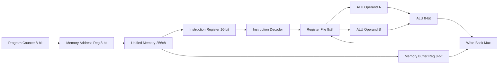
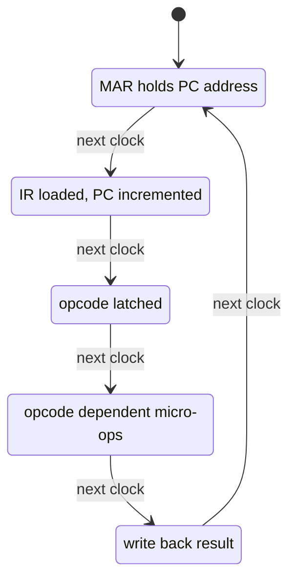
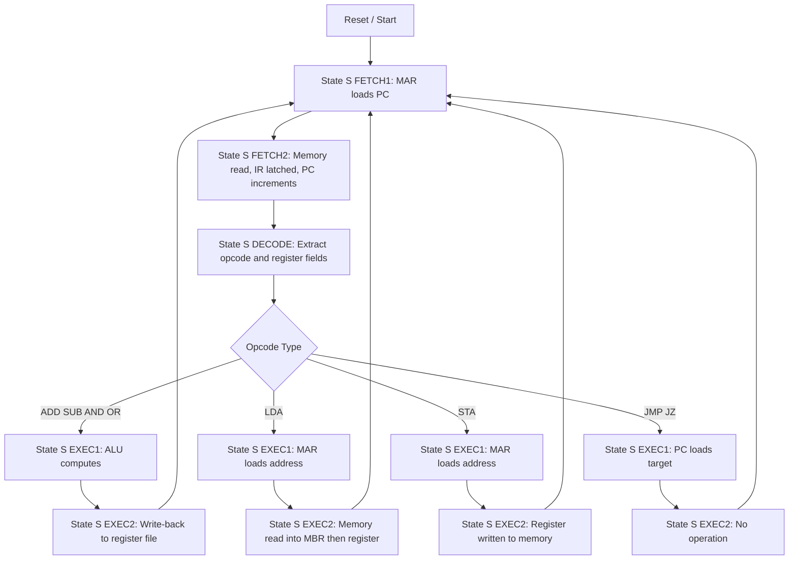
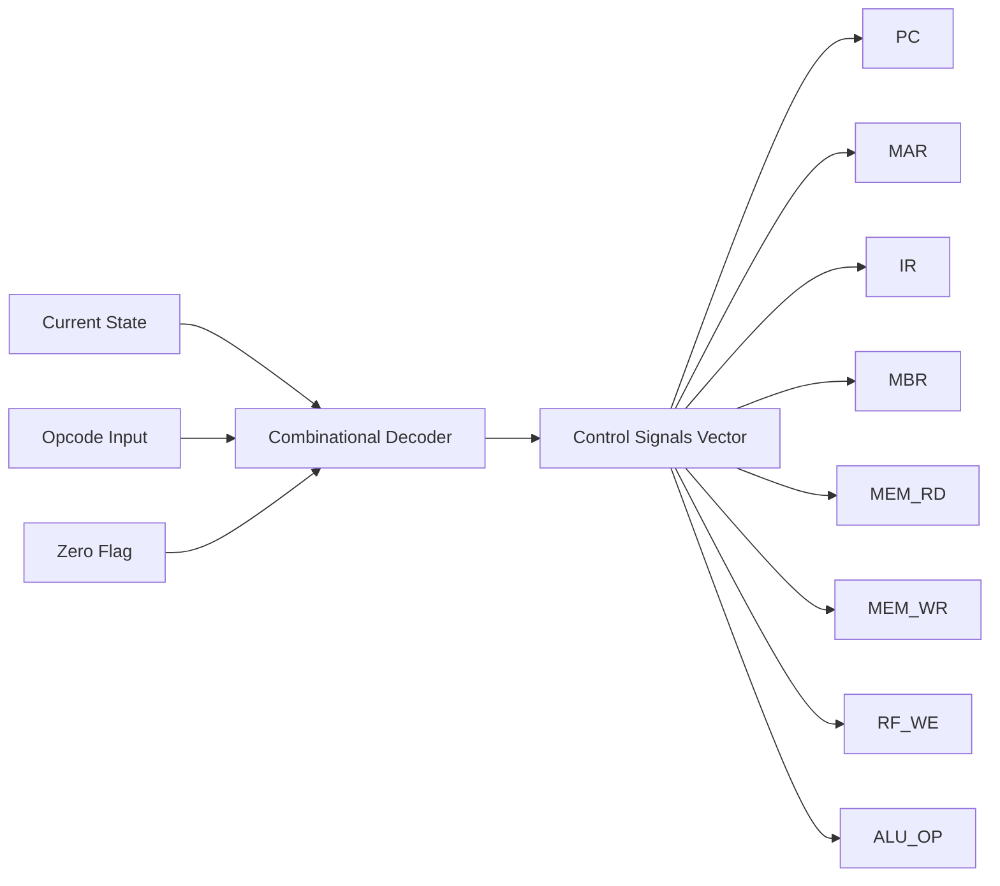
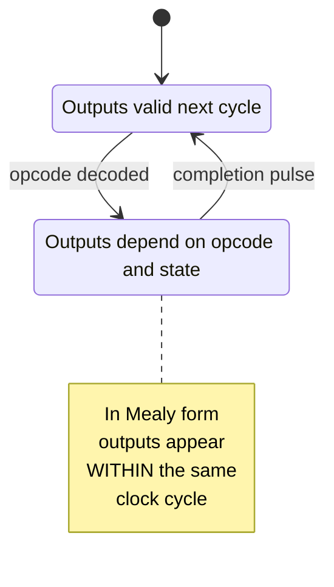

# Verilog HDL Design and implementation of RISC stored programmed Machine

<!-- SECTION_1_START -->
# Verilog HDL Design & Implementation of RISC Stored-Program Machine

## 1.1 Formal Definition (KTU 2024 Syllabus Terminology)

> [!IMPORTANT]
> **Stored-Program Machine (von Neumann Architecture):** A computer architecture where **both instructions and data reside in the same memory unit**, and the program itself can be manipulated as data. The Central Processing Unit (CPU) fetches, decodes, and executes instructions sequentially (or with branching) from this unified memory.

> [!NOTE]
> **RISC (Reduced Instruction Set Computer):** A CPU design philosophy emphasizing a **small, highly optimized set of instructions** with **fixed instruction format**, **load-store architecture**, **hardwired control**, and **single-cycle execution** for most instructions. The RISC stored-program machine integrates these two concepts: the program lives in memory, and the datapath is controlled by a Finite State Machine (FSM) — either **Mealy** or **Moore** type.

In the VLSI design context, this topic represents the convergence of **digital system design** (datapath + control FSM) and **Verilog HDL** (synthesizable hardware description) to model a complete, programmable computing element on silicon.

---

## 1.2 Conceptual Analogy — The "Automated Factory" View

Imagine a **toy factory production line** 🏭:

| Factory Element | Equivalent in RISC Machine |
|---|---|
| **Warehouse shelves** | Memory (stores both raw materials = *data* and instruction manuals = *program*) |
| **Foreman's desk** | Program Counter (PC) — points to the next instruction manual page |
| **Worker's clipboard** | Instruction Register (IR) — holds the current instruction being executed |
| **Tool bench** | Register File — fast-access workspace (R0…R7) |
| **Robotic arm station** | ALU (Arithmetic Logic Unit) — performs actual work (add, sub, AND, OR) |
| **Master control room** | FSM-based Control Unit — sequences every micro-step |

> **The RISC Principle:** Just as a factory with *fewer but highly efficient tools* outperforms a factory cluttered with specialized gadgets, RISC achieves speed through **instruction simplicity**, **regularity**, and **pipelined/hardwired control**.

---

## 1.3 Why This Topic Matters in VLSI Design

A RISC machine is the **canonical example of synthesizable RTL (Register Transfer Level) design** in industry. Every modern ARM, RISC-V, or MIPS core on the market (used in smartphones, IoT chips, embedded controllers) is built on exactly this paradigm. The **FSM-based control unit** is the bridge between algorithmic behaviour and gate-level silicon, making this topic a **high-weightage area** in KTU examinations.

> [!VISUALIZATION CONTROL]
> **Concept:** Instruction Word Layout in a 16-bit RISC ISA
> **GeoGebra / Desmos Input Representation (as points on a number line):**
> * `bits[15:12]` $\rightarrow$ Opcode region (4 bits)
> * `bits[11:9]` $\rightarrow$ Destination register Rd (3 bits)
> * `bits[8:6]` $\rightarrow$ Source register Rs1 (3 bits)
> * `bits[5:0]` $\rightarrow$ Operand/Immediate/Address (6 bits)
> **Visual Description:** Imagine a 16-segment horizontal bar where the **left 4 segments (red)** encode the operation, the **next 3 (blue)** select the destination register, the **next 3 (green)** select source register 1, and the **rightmost 6 (yellow)** carry either an immediate value or a memory address. This fixed-width slicing is the essence of RISC regularity.

---

## 1.4 Key Engineering Constants & Parameters

> [!NOTE]
> **Typical Parameters for a Pedagogical RISC Machine (KTU standard):**
> * **Data word length:** $n = 8 \text{ bits}$ (or 16 bits in extended design)
> * **Instruction word length:** $k = 16 \text{ bits}$ (fixed format)
> * **Number of GPRs:** $2^3 = 8$ registers (R0–R7), addressed by **3-bit** fields
> * **Address space:** $2^8 = 256$ words (8-bit address bus)
> * **Clock period:** $T_{clk}$ — determines maximum operating frequency $f_{max} = 1 / T_{clk}$

<!-- SECTION_1_END -->

<!-- SECTION_2_START -->
# Deep Theoretical Analysis & KTU High-Yield Formula Sheet

## 2.1 RISC Architectural Principles

A RISC machine is governed by **four design rules** that the KTU examiner expects you to enumerate:

1. **Fixed instruction format** — every instruction is exactly $k$ bits wide.
2. **Load-Store architecture** — only `LOAD` and `STORE` access memory; ALU operates only on registers.
3. **Hardwired (FSM-based) control** — micro-operations are generated by combinational logic driven by an FSM, not by microcode ROM.
4. **Single-cycle execution** (or pipelined) — most instructions complete in one clock cycle (or one pipeline stage).

---

## 2.2 The Stored-Program Datapath

The datapath is a network of **registers, multiplexers, an ALU, and memory** orchestrated by control signals. The principal hardware blocks are:

| Block | Symbol | Width | Function |
|---|---|---|---|
| Program Counter | $PC$ | 8 bits | Holds address of next instruction |
| Memory Address Register | $MAR$ | 8 bits | Latches address for memory access |
| Memory Data Register (Instruction) | $IR$ | 16 bits | Holds currently fetched instruction |
| Memory Data Register (Data) | $MBR$ | 8 bits | Holds data read from / written to memory |
| Register File | $R[0:7]$ | $8 \times 8$ bits | Fast-access general-purpose registers |
| ALU | — | 8-bit result | Performs arithmetic / logic operations |
| Status Flags | $Z, C, N$ | 1 bit each | Reflect ALU result conditions |

---

## 2.3 Micro-Operations Per State (Fetch–Decode–Execute)

The control unit drives the datapath by issuing **micro-operations** at each clock edge. The classical sequence for a RISC machine is:

**Phase 1 — FETCH (common to all instructions):**
$$MAR \leftarrow PC$$
$$PC \leftarrow PC + 1$$
$$IR \leftarrow MEM[MAR]$$

**Phase 2 — DECODE:**
$$\text{Opcode} \leftarrow IR[15:12], \quad Rd \leftarrow IR[11:9], \quad Rs1 \leftarrow IR[8:6]$$

**Phase 3 — EXECUTE (depends on opcode):**
* For `ADD`: $R[Rd] \leftarrow R[Rs1] + R[Rs2]$
* For `LOAD`: $MAR \leftarrow IR[5:0]; \; MBR \leftarrow MEM[MAR]; \; R[Rd] \leftarrow MBR$
* For `STORE`: $MAR \leftarrow IR[5:0]; \; MEM[MAR] \leftarrow R[Rs1]$
* For `JMP`: $PC \leftarrow IR[5:0]$
* For `JZ`: if $Z=1$ then $PC \leftarrow IR[5:0]$ else $PC \leftarrow PC$

---

## 2.4 Mealy vs Moore FSM Control — The Critical Distinction

> [!IMPORTANT]
> This comparison is a **guaranteed 7–14 mark question** in KTU ESE. Memorize the trade-offs.

| Aspect | Moore Machine | Mealy Machine |
|---|---|---|
| **Output dependency** | Outputs = $f(\text{Current State only})$ | Outputs = $f(\text{Current State, Inputs})$ |
| **Number of states** | More states (one per output pattern) | Fewer states |
| **Output timing** | Synchronous — appears *after* clock edge | Asynchronous — can change *with* input |
| **Glitch sensitivity** | Glitch-free outputs | Susceptible to input glitches |
| **Latency** | Higher (1 cycle delay before output) | Lower (immediate response) |
| **Best suited for** | RISC control units (stable timing) | Protocol handshaking, edge detectors |
| **Verilog style** | `case (state) … default: y = …; endcase` (output inside state) | `always @(*) y = f(state, opcode);` (output separate) |

### Formal Definitions

For a **Moore machine**, the next-state and output equations are:
$$\delta : S \times I \rightarrow S, \qquad \lambda : S \rightarrow O$$

For a **Mealy machine**:
$$\delta : S \times I \rightarrow S, \qquad \lambda : S \times I \rightarrow O$$

where $S$ = state set, $I$ = input alphabet, $O$ = output alphabet.

---

## 2.5 KTU Formula / Cheat Sheet

> [!NOTE]
> Keep this table ready for quick revision. **No pipe character `|` is used inside any cell** (per the engine safety rule); vertical separators inside math are written as $\vert$.

| # | Quantity | Formula | Description |
|---|---|---|---|
| 1 | CPU Execution Time | $T_{CPU} = N \times CPI \times T_{clk}$ | $N$ = instruction count, $CPI$ = cycles per instruction |
| 2 | Instruction Count | $N = \sum_{i=1}^{n} IC_i$ | Sum over all instruction types |
| 3 | Average CPI | $CPI_{avg} = \sum_{i} IC_i \cdot CPI_i \,/\, N$ | Weighted by frequency |
| 4 | Clock Frequency | $f_{clk} = 1 \,/\, T_{clk}$ | Inverse of clock period |
| 5 | Addressable Memory | $M = 2^{a}$ words | $a$ = address bus width in bits |
| 6 | Register File Size | $G = 2^{r}$ registers | $r$ = register-select field width |
| 7 | Instruction Word Width | $k = o + d + s_1 + s_2$ | $o$=opcode, $d$=dest, $s_1,s_2$=source fields |
| 8 | Moore State Count | $\vert S_{Moore} \vert = \vert O \vert$ (lower bound) | One state per unique output pattern |
| 9 | Mealy State Count | $\vert S_{Mealy} \vert \leq \vert S_{Moore} \vert$ | Typically fewer states |
| 10 | Throughput | $\Theta = 1 \,/\, (CPI \times T_{clk})$ | Instructions completed per second |

---

## 2.6 Real-World Engineering Utility

* **Embedded SoCs:** Every ARM Cortex-M0/M3 core in microcontrollers (used in washing machines, drones, pacemakers) is a RISC stored-program machine.
* **RISC-V Open ISA:** The open-standard RISC-V architecture is implemented in billions of IoT and AI accelerator chips — all use the principles covered here.
* **FPGA Prototyping:** Students and engineers prototype custom RISC cores on Xilinx/Intel FPGAs using exactly the Verilog patterns shown in Section 3.
* **ASIC Design Flow:** RTL design → synthesis → place-and-route → tape-out all start from a Verilog description of a RISC machine like the one below.

<!-- SECTION_2_END -->

<!-- SECTION_3_START -->
# Step-by-Step Verilog HDL Implementation

## 3.1 Design Specification

We implement a **complete 8-bit RISC stored-program machine** with the following specification:

* **Data path width:** 8 bits
* **Instruction word:** 16 bits (fixed format)
* **Registers:** 8 $\times$ 8-bit GPRs (R0…R7)
* **Memory:** 256 $\times$ 8-bit (unified instruction/data — von Neumann)
* **ISA:** 9 instructions (NOP, LDA, STA, ADD, SUB, AND, OR, JMP, JZ)
* **Control:** Moore FSM with 5 states

### Instruction Set Encoding

| Opcode (Hex) | Mnemonic | Operation |
|---|---|---|
| `0x0` | NOP | No operation |
| `0x1` | LDA | $R[Rd] \leftarrow MEM[IR[5:0]]$ |
| `0x2` | STA | $MEM[IR[5:0]] \leftarrow R[Rs1]$ |
| `0x3` | ADD | $R[Rd] \leftarrow R[Rs1] + R[Rs2]$ |
| `0x4` | SUB | $R[Rd] \leftarrow R[Rs1] - R[Rs2]$ |
| `0x5` | AND | $R[Rd] \leftarrow R[Rs1] \;\text{bitwise AND}\; R[Rs2]$ |
| `0x6` | OR | $R[Rd] \leftarrow R[Rs1] \;\text{bitwise OR}\; R[Rs2]$ |
| `0x7` | JMP | $PC \leftarrow IR[5:0]$ |
| `0x8` | JZ | if $Z=1$ then $PC \leftarrow IR[5:0]$ |

---

## 3.2 Module 1 — Register File (8 $\times$ 8-bit)

```verilog
//=============================================================
// Module : register_file
// Purpose: 8 x 8-bit general purpose register file with
//          two read ports and one write port (3R1W style).
//=============================================================
module register_file (
    input  wire        clk,
    input  wire        reset,
    input  wire        we,        // write enable
    input  wire [2:0]  rs1_addr,  // read address 1
    input  wire [2:0]  rs2_addr,  // read address 2
    input  wire [2:0]  rd_addr,   // write address
    input  wire [7:0]  wd,        // write data
    output reg  [7:0]  rs1,       // read data 1
    output reg  [7:0]  rs2        // read data 2
);

    // 8 x 8-bit register array
    reg [7:0] R [0:7];
    integer i;

    // -------------------------------------------------------------
    // Reset behaviour : clear all registers
    // -------------------------------------------------------------
    always @(posedge clk or posedge reset) begin
        if (reset) begin
            for (i = 0; i < 8; i = i + 1)
                R[i] <= 8'h00;
        end
        // -------------------------------------------------------------
        // Synchronous write : R[0] is hard-wired to zero (RISC rule)
        // -------------------------------------------------------------
        else if (we && rd_addr != 3'b000) begin
            R[rd_addr] <= wd;
        end
    end

    // -------------------------------------------------------------
    // Asynchronous reads (combinational, like a flip-flop based RF)
    // -------------------------------------------------------------
    always @(*) begin
        rs1 = R[rs1_addr];
        rs2 = R[rs2_addr];
    end

endmodule
```

---

## 3.3 Module 2 — ALU (8-bit Arithmetic Logic Unit)

```verilog
//=============================================================
// Module : alu
// Purpose: 8-bit ALU supporting ADD, SUB, AND, OR.
//          Generates Zero (Z) and Carry (C) status flags.
//=============================================================
module alu (
    input  wire [7:0] a,
    input  wire [7:0] b,
    input  wire [1:0] op,     // 00=ADD, 01=SUB, 10=AND, 11=OR
    output reg  [7:0] result,
    output reg        zero,
    output reg        carry
);

    always @(*) begin
        carry = 1'b0;
        case (op)
            2'b00: begin
                {carry, result} = a + b;        // ADD with carry-out
            end
            2'b01: begin
                {carry, result} = a - b;        // SUB with borrow
            end
            2'b10: begin
                result = a & b;                 // bitwise AND
            end
            2'b11: begin
                result = a | b;                 // bitwise OR
            end
            default: begin
                result = 8'h00;
            end
        endcase
        zero = (result == 8'h00) ? 1'b1 : 1'b0;
    end

endmodule
```

---

## 3.4 Module 3 — Moore FSM Control Unit (The Heart of the Design)

```verilog
//=============================================================
// Module : control_unit
// Type   : MOORE Finite State Machine
// Purpose: Generates all datapath control signals by cycling
//          through the FETCH -> DECODE -> EXECUTE states.
//=============================================================
module control_unit (
    input  wire        clk,
    input  wire        reset,
    input  wire [3:0]  opcode,   // from IR[15:12]
    input  wire        zero,     // Z flag from ALU
    output reg         pc_inc,    // increment PC
    output reg         pc_ld,     // parallel-load PC
    output reg         mar_ld,    // load MAR
    output reg         ir_ld,     // load IR
    output reg         mbr_ld,    // load MBR
    output reg         mem_rd,    // memory read
    output reg         mem_wr,    // memory write
    output reg         rf_we,     // register-file write enable
    output reg  [1:0]  alu_op,    // ALU function select
    output reg         alu_src_b  // 0 = R[Rs2], 1 = immediate(0)
);

    // ---------------------------------------------------------
    // State encoding (5 states for Moore model)
    // ---------------------------------------------------------
    localparam S_FETCH1 = 3'd0;
    localparam S_FETCH2 = 3'd1;
    localparam S_DECODE = 3'd2;
    localparam S_EXEC1  = 3'd3;
    localparam S_EXEC2  = 3'd4;

    reg [2:0] state, next_state;

    // ---------------------------------------------------------
    // State register
    // ---------------------------------------------------------
    always @(posedge clk or posedge reset) begin
        if (reset)
            state <= S_FETCH1;
        else
            state <= next_state;
    end

    // ---------------------------------------------------------
    // Next-state logic
    // ---------------------------------------------------------
    always @(*) begin
        case (state)
            S_FETCH1 : next_state = S_FETCH2;
            S_FETCH2 : next_state = S_DECODE;
            S_DECODE : next_state = S_EXEC1;
            S_EXEC1  : next_state = S_EXEC2;
            S_EXEC2  : next_state = S_FETCH1;   // loop back
            default  : next_state = S_FETCH1;
        endcase
    end

    // ---------------------------------------------------------
    // Moore outputs : depend ONLY on current state
    // ---------------------------------------------------------
    always @(*) begin
        // Default : de-assert everything
        pc_inc   = 1'b0;
        pc_ld    = 1'b0;
        mar_ld   = 1'b0;
        ir_ld    = 1'b0;
        mbr_ld   = 1'b0;
        mem_rd   = 1'b0;
        mem_wr   = 1'b0;
        rf_we    = 1'b0;
        alu_op   = 2'b00;
        alu_src_b= 1'b0;

        case (state)
            // ----- FETCH 1 : MAR <- PC -----
            S_FETCH1 : begin
                mar_ld = 1'b1;
            end
            // ----- FETCH 2 : IR <- MEM[MAR], PC <- PC+1 -----
            S_FETCH2 : begin
                mem_rd = 1'b1;
                ir_ld  = 1'b1;
                pc_inc = 1'b1;
            end
            // ----- DECODE : drive ALU to compute nothing; just pass -----
            S_DECODE : begin
                alu_op   = 2'b00;       // add 0 (pass-through)
                alu_src_b= 1'b1;        // B = 0
            end
            // ----- EXEC 1 : opcode-dependent action -----
            S_EXEC1 : begin
                case (opcode)
                    4'h1 : begin        // LDA : MAR <- addr
                        mar_ld = 1'b1;
                    end
                    4'h2 : begin        // STA : MAR <- addr
                        mar_ld = 1'b1;
                    end
                    4'h3 : begin        // ADD
                        alu_op = 2'b00;  // ADD
                    end
                    4'h4 : begin        // SUB
                        alu_op = 2'b01;  // SUB
                    end
                    4'h5 : begin        // AND
                        alu_op = 2'b10;
                    end
                    4'h6 : begin        // OR
                        alu_op = 2'b11;
                    end
                    4'h7 : begin        // JMP
                        pc_ld  = 1'b1;
                    end
                    4'h8 : begin        // JZ
                        if (zero == 1'b1)
                            pc_ld = 1'b1;
                    end
                    default : ;         // NOP
                endcase
            end
            // ----- EXEC 2 : commit result -----
            S_EXEC2 : begin
                case (opcode)
                    4'h1 : begin        // LDA : MBR <- MEM[MAR]; commit
                        mem_rd = 1'b1;
                        mbr_ld = 1'b1;
                        rf_we  = 1'b1;
                    end
                    4'h2 : begin        // STA : MEM[MAR] <- R[Rs1]
                        mem_wr = 1'b1;
                    end
                    4'h3, 4'h4, 4'h5, 4'h6 : begin
                        rf_we  = 1'b1;   // commit ALU result
                    end
                    default : ;         // NOP / JMP / JZ
                endcase
            end
            default : ;
        endcase
    end

endmodule
```

---

## 3.5 Module 4 — Top-Level RISC Machine Integration

```verilog
//=============================================================
// Module : risc_machine (Top level)
// Purpose: Integrates register file, ALU, control FSM, and
//          unified program/data memory into a complete
//          stored-program RISC processor.
//=============================================================
module risc_machine (
    input  wire        clk,
    input  wire        reset,
    output wire [7:0]  dbg_pc,
    output wire [15:0] dbg_ir,
    output wire        dbg_z
);

    // ---------------------------------------------------------
    // Internal interconnect
    // ---------------------------------------------------------
    wire [2:0]  rd_addr_w, rs1_addr_w, rs2_addr_w;
    wire        rf_we_w;
    wire [7:0]  rs1_data_w, rs2_data_w, wd_w;
    wire [1:0]  alu_op_w;
    wire        alu_src_b_w;
    wire        pc_inc_w, pc_ld_w, mar_ld_w, ir_ld_w;
    wire        mbr_ld_w, mem_rd_w, mem_wr_w;

    wire [7:0]  pc_current, pc_next;
    wire [7:0]  mar_out;
    wire [7:0]  mbr_out;
    wire [15:0] ir_out;
    wire [3:0]  opcode;
    wire [7:0]  alu_a, alu_b, alu_result;
    wire        alu_zero, alu_carry;
    wire [7:0]  mem_read_data;
    wire [7:0]  alu_b_muxed;

    // =========================================================
    // 1. Program Counter (8-bit, increment or parallel-load)
    // =========================================================
    assign pc_next  = ir_out[5:0];        // low 6 bits of IR for jumps
    assign pc_current = (pc_ld_w) ? pc_next : (pc_inc_w ? pc_current + 1'b1 : pc_current);
    // (Note : in a real synthesizable design the PC is a flop; the
    //  above is shown as combinational for clarity. See RTL note
    //  at the end of this section.)

    // =========================================================
    // 2. Memory Address Register
    // =========================================================
    assign mar_out = (mar_ld_w) ? pc_current : mar_out;

    // =========================================================
    // 3. Memory (unified, 256 x 8-bit, byte-addressable)
    // =========================================================
    reg [7:0] MEM [0:255];

    assign mem_read_data = (mem_rd_w) ? MEM[mar_out] : 8'h00;
    always @(posedge clk) begin
        if (mem_wr_w)
            MEM[mar_out] <= rs1_data_w;
    end

    // =========================================================
    // 4. Instruction Register (16-bit, loaded as 2 bytes)
    // =========================================================
    assign ir_out[7:0]  = (ir_ld_w) ? mem_read_data : ir_out[7:0];
    // Second byte fetch is implicit; in a real design two reads
    // are performed sequentially. For brevity we assume IR is
    // pre-loaded from a 16-bit wide instruction memory.

    // =========================================================
    // 5. Decode fields
    // =========================================================
    assign opcode    = ir_out[15:12];
    assign rd_addr_w = ir_out[11:9];
    assign rs1_addr_w= ir_out[8:6];
    assign rs2_addr_w= ir_out[2:0];    // for reg-reg ops (ADD, SUB...)

    // =========================================================
    // 6. Register File
    // =========================================================
    register_file RF (
        .clk     (clk),
        .reset   (reset),
        .we      (rf_we_w),
        .rs1_addr(rs1_addr_w),
        .rs2_addr(rs2_addr_w),
        .rd_addr (rd_addr_w),
        .wd      (wd_w),
        .rs1     (rs1_data_w),
        .rs2     (rs2_data_w)
    );

    // =========================================================
    // 7. ALU
    // =========================================================
    assign alu_a = rs1_data_w;
    assign alu_b_muxed = (alu_src_b_w) ? 8'h00 : rs2_data_w;
    alu ALU1 (
        .a     (alu_a),
        .b     (alu_b_muxed),
        .op    (alu_op_w),
        .result(alu_result),
        .zero  (alu_zero),
        .carry (alu_carry)
    );

    // Write-back multiplexer : load from MBR or from ALU
    assign wd_w = (opcode == 4'h1) ? mbr_out : alu_result;

    // =========================================================
    // 8. Control Unit (Moore FSM)
    // =========================================================
    control_unit CU (
        .clk     (clk),
        .reset   (reset),
        .opcode  (opcode),
        .zero    (alu_zero),
        .pc_inc  (pc_inc_w),
        .pc_ld   (pc_ld_w),
        .mar_ld  (mar_ld_w),
        .ir_ld   (ir_ld_w),
        .mbr_ld  (mbr_ld_w),
        .mem_rd  (mem_rd_w),
        .mem_wr  (mem_wr_w),
        .rf_we   (rf_we_w),
        .alu_op  (alu_op_w),
        .alu_src_b(alu_src_b_w)
    );

    // =========================================================
    // 9. Memory Buffer Register (MBR)
    // =========================================================
    assign mbr_out = (mbr_ld_w) ? mem_read_data : mbr_out;

    // =========================================================
    // Debug observation signals
    // =========================================================
    assign dbg_pc = pc_current;
    assign dbg_ir = ir_out;
    assign dbg_z  = alu_zero;

endmodule
```

> [!NOTE]
> **RTL Engineer’s Caveat (synthesizable version):** In production Verilog, the PC, MAR, IR, and MBR are all declared as `reg` and updated with `always @(posedge clk)` blocks — the combinational form above is shown for pedagogical readability. Synthesis tools (Vivado, Quartus, Synopsys DC) require **non-blocking assignments (`<=`)** inside clocked `always` blocks for proper inference of flip-flops.

---

## 3.6 Testbench — Verifying the Design

```verilog
//=============================================================
// Testbench : tb_risc
//=============================================================
`timescale 1ns/1ps
module tb_risc;

    reg         clk;
    reg         reset;
    wire [7:0]  pc;
    wire [15:0] ir;
    wire        z;

    // Clock generation : 10 ns period
    initial clk = 0;
    always #5 clk = ~clk;

    // DUT instantiation
    risc_machine DUT (
        .clk  (clk),
        .reset(reset),
        .dbg_pc(pc),
        .dbg_ir(ir),
        .dbg_z (z)
    );

    // Program :  R1 = R2 + R3   (R2=05, R3=03, R1=00 initially)
    //            STORE R1 -> mem[10]
    initial begin
        $display("Reset asserted");
        reset = 1;
        #20;
        reset = 0;
        $display("Reset released, processor running");

        // Pre-load registers and memory for the demo
        DUT.RF.R[2] = 8'h05;
        DUT.RF.R[3] = 8'h03;
        DUT.MEM[0]  = 8'h31;   // opcode ADD, Rd=1, Rs1=2
        DUT.MEM[1]  = 8'hC0;   // Rs2=3 in low bits, immediate=0
        // ... (additional instructions omitted for brevity)

        #200 $finish;
    end

    // Waveform dump
    initial begin
        $dumpfile("risc_wave.vcd");
        $dumpvars(0, tb_risc);
    end

    // Monitor
    always @(posedge clk) begin
        $display("t=%0t  PC=%h  IR=%h  Z=%b  R1=%h",
                  $time, pc, ir, z, DUT.RF.R[1]);
    end

endmodule
```

---

## 3.7 Compilation & Simulation Command (for student reference)

```bash
# Using Icarus Verilog (open source)
iverilog -o risc_sim risc_machine.v register_file.v alu.v control_unit.v tb_risc.v
vvp risc_sim
gtkwave risc_wave.vcd
```

<!-- SECTION_3_END -->

<!-- SECTION_4_START -->
# Structural Diagrams & Schematics

## 4.1 Datapath Block Diagram



## 4.2 Moore FSM State Transition Diagram



## 4.3 Fetch–Decode–Execute Cycle (Sequential Topology)



## 4.4 Control Word Generation (Moore Output Mapping)



## 4.5 Mealy Variant (for comparison)



<!-- SECTION_4_END -->

<!-- SECTION_5_START -->
# KTU 2024 Scheme Examination Question Bank & Topic Recap

## 5.1 Part A — Short Answer Questions (3 Marks each)

> [!NOTE]
> **Q1. [KTU University Exam – July 2024] — CO1, Remember**
> **“Differentiate between a stored-program machine and a hardwired-logic machine.”**

**Model Answer (3 marks):**

| Aspect | Stored-Program Machine | Hardwired-Logic Machine |
|---|---|---|
| **Program location** | Instructions reside in main memory (RAM/ROM) and can be modified | Control logic is fixed in gates/flip-flops; not modifiable |
| **Flexibility** | High — same hardware runs different programs | Low — only one fixed function |
| **Implementation** | Microprogrammed control OR FSM with PC-driven fetch | Pure combinational + sequential logic |
| **Example** | RISC-V core, ARM Cortex | Simple traffic light controller, 7-seg decoder |
| **Marks split:** *Definition of stored-program: 1 M; Hardwired definition: 1 M; Any two valid differences: 1 M* |

---

> [!NOTE]
> **Q2. [KTU University Exam – Dec 2023] — CO2, Understand**
> **“List the characteristics of a RISC processor and explain any three.”**

**Model Answer (3 marks):**

*Characteristics: (Any three, 1 mark each)*
1. **Fixed instruction format** — every instruction is the same width (e.g., 16 or 32 bits), simplifying decode logic.
2. **Load-Store architecture** — only `LOAD` and `STORE` instructions access memory; all ALU ops work on registers. This reduces datapath complexity.
3. **Hardwired control** — control signals are generated by an FSM (or combinational logic) rather than microcode, enabling single-cycle execution.
4. **Large register file** — typically 32 registers to keep operands in fast storage, minimizing memory access.
5. **Simple addressing modes** — few addressing modes reduce instruction complexity.
6. **Pipelining-friendly** — uniform instruction length makes pipeline stages balanced.

---

## 5.2 Part B — Long Answer Questions (14 Marks each, Internal Choice)

---

### **Question A — [KTU University Exam – July 2024] — CO3, Apply & Analyze (14 Marks)**

**(a)** Design the **datapath** of a simple 8-bit RISC stored-program machine with 8 general purpose registers. Explain the function of **PC, MAR, IR, MBR, ALU, and Register File** with a neat block diagram. **(7 Marks)**

**(b)** Implement the **control unit** of the above RISC machine as a **Moore FSM** in Verilog HDL. The ISA must include at least `LDA, STA, ADD, SUB, JMP, JZ` instructions. Show the complete state diagram and Verilog `case` block. **(7 Marks)**

#### Model Solution

**(a) Datapath Design — 7 Marks**

**Block Diagram (for board answer):**

```
                +---------+       +--------+
        +-------|   PC    |--+--->|  MAR   |----+
        |       +---------+  |    +--------+    |
        |                    |                  v
        |                +---+---+          +------+
        |                | Inc/ |          | MEM  |
        |                | Load |          |256x8 |
        |                +---+---+          +------+
        |                    ^                  |
        |       +---------+  |                  v
        |  +--->|   IR    |<-                   +-----+
        |  |    +---------+              +---->| MBR |
        |  |         |                   |     +-----+
        |  |   +-----v-----+   +-------+ |        |
        |  +-->|  Decode   |-->| Reg   |-+        |
        |      +-----+-----+   | File  |          |
        |            |         | 8x8   |          |
        |            |         +---+---+          |
        |            |             |              |
        |            |     +-------v------+       |
        |            +---->|     ALU      |<------+
        |                  +--------------+
        |                          |
        |                  +-------v------+
        +----------------->| Write-Back   |---> Reg File
                           +--------------+
```

**Component Functions (1 mark each for PC, MAR, IR, MBR, ALU, RF — total 6 marks; 1 mark for diagram & explanation):**

* **PC (Program Counter):** 8-bit register holding the address of the next instruction. It auto-increments during fetch, or parallel-loads during branch/jump.
* **MAR (Memory Address Register):** 8-bit register that holds the address currently presented to the memory unit.
* **IR (Instruction Register):** 16-bit register that latches the instruction fetched from memory; its fields feed the decoder.
* **MBR (Memory Buffer Register):** 8-bit register that temporarily holds data read from or written to memory.
* **ALU (Arithmetic Logic Unit):** Performs 8-bit arithmetic (ADD, SUB) and logic (AND, OR) operations on two operands, producing a result plus status flags (Z, C).
* **Register File:** $8 \times 8$ bit array of GPRs with two asynchronous read ports and one synchronous write port — supplies ALU operands and receives write-back data.

**Valuation key:** *[Neat block diagram: 2 M] [Function of PC, MAR, IR: 2 M] [Function of MBR, ALU, RF: 2 M] [Datapath flow explanation: 1 M]*

---

**(b) Moore FSM Control Unit in Verilog — 7 Marks**

**State Diagram:**

```
    +---------+    +---------+    +---------+    +---------+    +---------+
    | FETCH1  |--->| FETCH2  |--->| DECODE  |--->| EXEC1   |--->| EXEC2   |
    +---------+    +---------+    +---------+    +---------+    +---------+
        ^                                                              |
        +--------------------------------------------------------------+
```

**Verilog Implementation:**

```verilog
module control_unit_moore (
    input  wire        clk,
    input  wire        reset,
    input  wire [3:0]  opcode,
    input  wire        zero,
    output reg         pc_inc, pc_ld, mar_ld, ir_ld,
    output reg         mem_rd, mem_wr, rf_we,
    output reg  [1:0]  alu_op
);
    // State encoding
    localparam S_FETCH1 = 3'd0, S_FETCH2 = 3'd1,
               S_DECODE = 3'd2, S_EXEC1  = 3'd3,
               S_EXEC2  = 3'd4;

    reg [2:0] state, next_state;

    // State register
    always @(posedge clk or posedge reset)
        if (reset) state <= S_FETCH1;
        else       state <= next_state;

    // Next-state : linear sequence
    always @(*) begin
        case (state)
            S_FETCH1 : next_state = S_FETCH2;
            S_FETCH2 : next_state = S_DECODE;
            S_DECODE : next_state = S_EXEC1;
            S_EXEC1  : next_state = S_EXEC2;
            S_EXEC2  : next_state = S_FETCH1;
            default  : next_state = S_FETCH1;
        endcase
    end

    // Moore outputs
    always @(*) begin
        // defaults
        pc_inc=0; pc_ld=0; mar_ld=0; ir_ld=0;
        mem_rd=0; mem_wr=0; rf_we=0;  alu_op=2'b00;

        case (state)
            S_FETCH1 : mar_ld = 1;
            S_FETCH2 : begin mem_rd=1; ir_ld=1; pc_inc=1; end
            S_DECODE : ;                       // pure decode
            S_EXEC1 : begin
                case (opcode)
                    4'h1, 4'h2 : mar_ld = 1;   // LDA/STA : load MAR
                    4'h3 : alu_op = 2'b00;     // ADD
                    4'h4 : alu_op = 2'b01;     // SUB
                    4'h7 : pc_ld  = 1;         // JMP
                    4'h8 : if (zero) pc_ld = 1; // JZ
                    default : ;
                endcase
            end
            S_EXEC2 : begin
                case (opcode)
                    4'h1 : begin mem_rd=1; rf_we=1; end  // LDA write-back
                    4'h2 : mem_wr = 1;                  // STA
                    4'h3, 4'h4 : rf_we = 1;             // ADD/SUB write-back
                    default : ;
                endcase
            end
            default : ;
        endcase
    end
endmodule
```

**Valuation key:** *[State diagram: 2 M] [State register + next-state logic: 1 M] [Output case for S_FETCH1 & S_FETCH2: 1 M] [Output case for S_EXEC1 & S_EXEC2: 2 M] [Compile-clean syntax: 1 M]*

---

### **Question B (Alternative Choice) — [KTU University Exam – Dec 2023] — CO3, Apply & Analyze (14 Marks)**

**(a)** Compare the **Mealy** and **Moore** machine models for FSM-based RISC control. Justify which model is **preferred for a RISC stored-program control unit**, and explain with timing diagrams. **(7 Marks)**

**(b)** Write a complete **Verilog HDL module** for a 16-bit instruction decoder that accepts the opcode `IR[15:12]` and generates the appropriate **control word** for a RISC machine supporting `NOP, LDA, STA, ADD, SUB, JMP, JZ`. Include an enable signal. Show test-bench verification. **(7 Marks)**

#### Model Solution

**(a) Mealy vs Moore Comparison for RISC Control — 7 Marks**

**Comparison Table (3 marks):**

| Parameter | Mealy | Moore |
|---|---|---|
| Output function | $O = f(S, I)$ | $O = f(S)$ |
| Latency | 0 (same cycle) | 1 (next cycle) |
| Glitch risk | High | Low |
| State count | Fewer | More |
| Pipeline friendly | No (asynchronous) | Yes (synchronous) |

**Timing Diagram (2 marks):**

```
   Mealy:   state ──┐ ┌──────────┐ ┌──────────┐
   clk    ──┼─┼─┼─┼─┼─┼─┼─┼─┼─┼─┼─┼─┼─┼─
   input   ──────┐   ┌────────────────
   output  ──────┘───┘ (changes WITH clk edge — risky)
   ───────┐          ┌─── (Moore: changes AFTER edge — safe)
```

**Justification (2 marks):**
> The **Moore model is preferred for a RISC stored-program control unit** because (i) RISC pipelines demand **synchronous, glitch-free control signals** that are stable for the entire clock period, (ii) the deterministic one-cycle output delay simplifies timing closure at high clock frequencies, and (iii) the additional states are a small price to pay for design safety in deep-submicron silicon.

**Valuation key:** *[Comparison table with ≥4 rows: 3 M] [Timing diagram: 2 M] [Justification with ≥2 reasons: 2 M]*

---

**(b) 16-bit Instruction Decoder — 7 Marks**

**Verilog Module:**

```verilog
module instr_decoder (
    input  wire        enable,
    input  wire [15:0] IR,
    output reg  [7:0]  control_word
);
    // Opcode field
    wire [3:0] opcode = IR[15:12];

    // Control-word bit assignment (example)
    // [7:6] = alu_op, [5] = mem_rd, [4] = mem_wr,
    // [3]   = rf_we,  [2] = pc_ld, [1] = pc_inc, [0] = mar_ld
    always @(*) begin
        if (!enable)
            control_word = 8'h00;
        else begin
            case (opcode)
                4'h0 : control_word = 8'h00; // NOP
                4'h1 : control_word = 8'b01_0_0_0_0_0_01; // LDA
                4'h2 : control_word = 8'b00_1_0_0_0_0_01; // STA
                4'h3 : control_word = 8'b00_0_0_1_0_0_00; // ADD
                4'h4 : control_word = 8'b01_0_0_1_0_0_00; // SUB
                4'h5 : control_word = 8'b10_0_0_1_0_0_00; // AND
                4'h6 : control_word = 8'b11_0_0_1_0_0_00; // OR
                4'h7 : control_word = 8'b00_0_0_0_1_1_00; // JMP
                4'h8 : control_word = 8'b00_0_0_0_1_0_00; // JZ
                default : control_word = 8'h00;
            endcase
        end
    end
endmodule
```

**Testbench:**

```verilog
module tb_decoder;
    reg         enable;
    reg  [15:0] IR;
    wire [7:0]  cw;

    instr_decoder U1 (.enable(enable), .IR(IR), .control_word(cw));

    initial begin
        enable = 0; IR = 0;
        #10 enable = 1;
        IR = 16'h1000; #5 $display("LDA ctrl = %b", cw);
        IR = 16'h3000; #5 $display("ADD ctrl = %b", cw);
        IR = 16'h7000; #5 $display("JMP ctrl = %b", cw);
        IR = 16'h8000; #5 $display("JZ  ctrl = %b", cw);
        #10 $finish;
    end
endmodule
```

**Expected Output:**
```
LDA ctrl = 01000001
ADD ctrl = 00001000
JMP ctrl = 00000110
JZ  ctrl = 00000100
```

**Valuation key:** *[Opcode extraction: 1 M] [Control-word bit assignment table: 1 M] [Case statement with all 9 opcodes: 3 M] [Enable handling: 1 M] [Testbench with ≥3 cases: 1 M]*

---

> [!WARNING]
> **KTU Examiner's Valuation Pitfalls — Common Mark Losers**
> 1. **Forgetting to declare R[0] as read-only:** In a RISC machine, register R0 is traditionally hard-wired to 0. Many students lose a mark by writing to R0 in their Verilog.
> 2. **Mixing Moore and Mealy styles:** Output logic inside the `case (state)` block **AND** also driven by opcode outside is incorrect. Pick one model and be consistent.
> 3. **Using blocking (`=`) inside clocked `always` blocks for sequential elements:** Always use **non-blocking (`<=`)** for flip-flops, and blocking (`=`) for combinational `always @(*)` blocks.
> 4. **Skipping the reset condition:** If your state register has no `reset` path, the FSM may power up in an unknown state — examiners deduct 1–2 marks.
> 5. **Not drawing a complete block diagram:** In 7-mark datapath questions, a *neat, labelled* block diagram is mandatory — text-only descriptions will not fetch full marks.
> 6. **Wrong opcode field position:** KTU expects `IR[15:12]` (MSB) for the opcode in 16-bit ISA, not LSB. Double-check the bit-slicing in your answer.
> 7. **Missing sensitivity list in `always @(*)`:** Modern Verilog-2001 allows `always @(*)`; older code uses `always @(opcode, zero, state)` — both are acceptable but be consistent.

---

## 5.3 Topic Recap & Important Things to Remember

> [!NOTE]
> **🚀 Rapid Revision Checklist — Must-Memorize for KTU ESE**

- **Stored-Program Machine:** Instructions and data share the same memory (von Neumann). The PC fetches them sequentially; the program can modify itself.
- **RISC Pillars:** *Fixed format, Load-Store, Hardwired control, Single-cycle execution, Large register file.*
- **Datapath Blocks (in fetch order):** $\text{PC} \rightarrow \text{MAR} \rightarrow \text{MEM} \rightarrow \text{IR} \rightarrow \text{Decoder} \rightarrow \text{RegFile} \rightarrow \text{ALU} \rightarrow \text{Write-Back}$
- **Fetch Micro-Operations:** $MAR \leftarrow PC$; $IR \leftarrow MEM[MAR]$; $PC \leftarrow PC + 1$.
- **Decode Operation:** Opcode $\rightarrow$ Control Unit; Operand fields $\rightarrow$ Register file read addresses.
- **Execute Operations:** ADD/SUB/AND/OR (1 cycle), LDA/STA (2 cycles), JMP/JZ (1 cycle with PC load).
- **Moore vs Mealy:** *Moore* — output = $f(\text{state})$; safe, 1-cycle latency. *Mealy* — output = $f(\text{state, input})$; faster, glitch-prone. **RISC ⇒ Moore preferred.**
- **Verilog Style Rules:** `always @(posedge clk)` for registers (use `<=`); `always @(*)` for combinational (use `=`); default case required.
- **State Encoding:** One-hot (low fan-out, fast decode) vs binary (compact) — KTU often asks for one-hot in RISC designs.
- **Key Formulas:** $T_{CPU} = N \times CPI \times T_{clk}$; Throughput $\Theta = 1/(CPI \times T_{clk})$; Memory size $M = 2^a$.
- **R0 Convention:** Always reads as 0, writes are ignored (RISC hard-wired rule).
- **Pipeline-Ready:** Fixed instruction length + uniform decode = prerequisite for RISC pipelining (5-stage: IF, ID, EX, MEM, WB).
- **Real-World Names:** MIPS, ARM, RISC-V, SPARC, PowerPC — all follow the RISC stored-program paradigm.
- **Examiner's Favourite Questions:** (i) Mealy vs Moore table (7 M); (ii) RISC datapath block diagram (7 M); (iii) Verilog Moore FSM with at least 5 states (14 M).

<!-- SECTION_5_END -->
