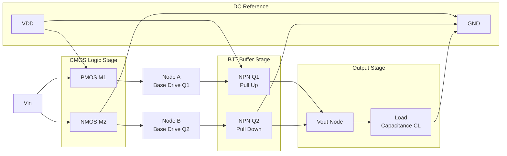
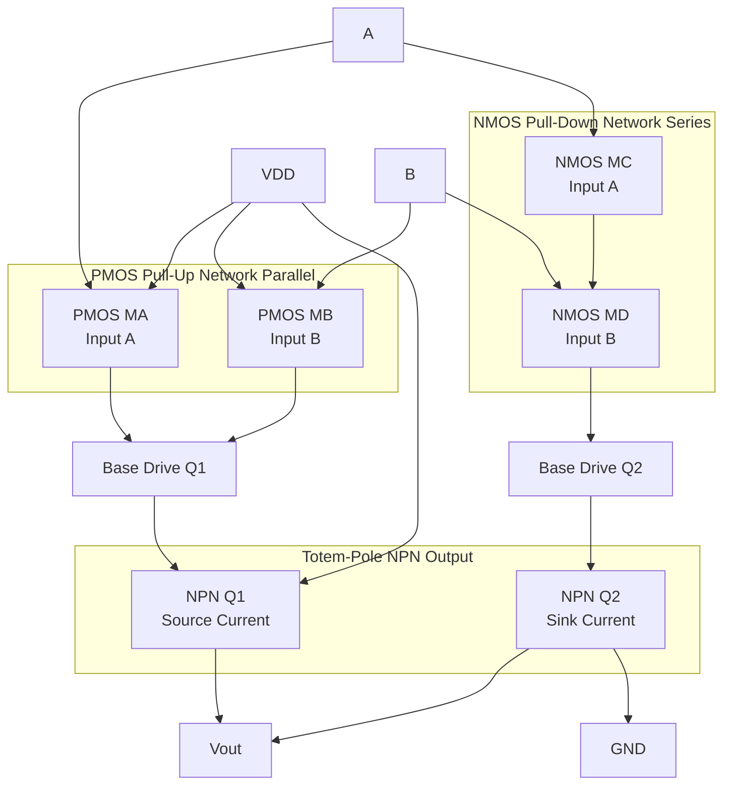
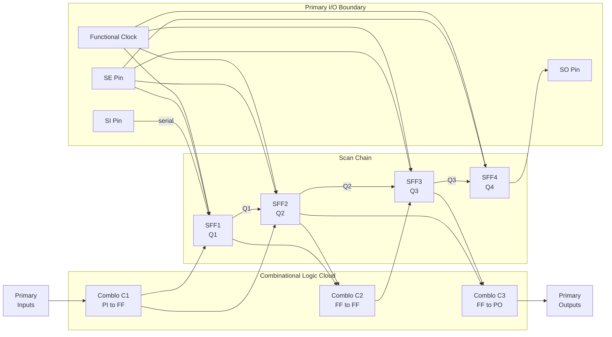
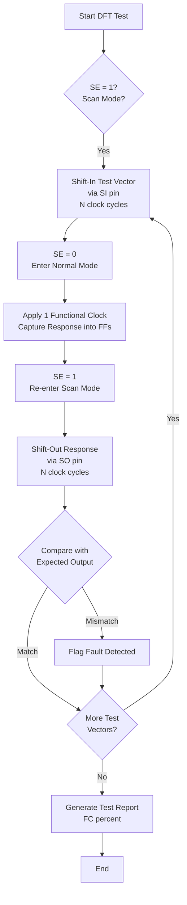
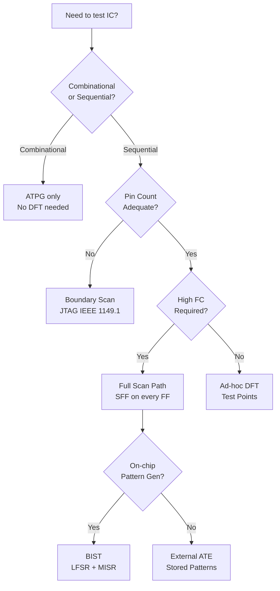

# BiCMOS technology, testability options: Design for Testability (DFT), Scan path setups

<!-- SECTION_1_START -->
# BiCMOS Technology, DFT & Scan Path – Foundational Overview

## 1.1 BiCMOS Technology

### 1.1.1 Formal Definition
> [!NOTE]
> **BiCMOS (Bipolar Complementary Metal-Oxide-Semiconductor)** is a hybrid VLSI technology that integrates **bipolar junction transistors (BJTs)** and **CMOS transistors** on the same monolithic silicon substrate. It is engineered to combine the **high-speed switching** and **strong current-driving capability** of bipolar devices with the **low static power dissipation**, **high noise immunity**, and **high integration density** of CMOS circuits.

### 1.1.2 Intuitive Analogy
> [!TIP]
> **Analogy — The Sports Car with an Electric Battery:** Think of a regular **CMOS circuit** as an *electric vehicle* — extremely fuel-efficient (low power), quiet (low noise), and you can pack many units in a parking lot (high density). However, its *acceleration is sluggish* (limited drive current). Now imagine a **BiCMOS car** — it uses the efficient electric motor for steady cruising (CMOS logic) but adds a *turbocharged petrol engine* (BJT) for rapid acceleration when needed (driving large loads or high-speed paths). The result: efficiency *and* speed. Similarly, BiCMOS uses CMOS for the logic core and BJTs at output stages to source/sink large currents to capacitive loads, gates, or long interconnects.

### 1.1.3 Why BiCMOS? — The Engineering Motivation

| Parameter | CMOS Only | Bipolar Only | **BiCMOS Advantage** |
| :--- | :---: | :---: | :--- |
| Static Power | Very Low | Very High | **Near-CMOS low static** dissipation |
| Switching Speed | Moderate | Very High | **Faster gate delay** than CMOS |
| Drive Current | Limited | Excellent | **Strong output drive** via BJT |
| Noise Margin | Excellent | Poor | **Retains CMOS noise immunity** in core |
| Input Impedance | Very High | Low | CMOS gates retain **high input impedance** |
| Integration Density | Very High | Low | Acceptable density (slightly less than CMOS) |
| Fabrication Cost | Low | Moderate | Higher than CMOS, but justified for high-perf ASICs |

> [!IMPORTANT]
> **KTU Syllabus Highlight:** BiCMOS is used in **high-performance processors, gate arrays, SRAM sense amplifiers, ECL/TTL interface buffers, and mixed-signal ASICs** where both speed *and* integration are required.

### 1.1.4 The Basic BiCMOS Inverter

A BiCMOS inverter uses CMOS transistors (M1–M2) to perform the **logic function**, and a pair of **NPN BJTs (Q1, Q2)** to provide high drive current at the output.

**Circuit Topology (Conceptual):**
- A standard CMOS inverter (PMOS pull-up M1 + NMOS pull-down M2) drives the **base** of the two output BJTs.
- Q1 (NPN) acts as the **pull-up** transistor, sourcing current to the load capacitance $C_L$.
- Q2 (NPN) acts as the **pull-down** transistor, sinking current from $C_L$.

**Operation Summary:**
- **Input $V_{in} = V_{DD}$** → M1 OFF, M2 ON → M2 pulls base of Q2 LOW → Q2 sinks current → Output $V_{out} = 0$ (LOW). Simultaneously, M1 OFF leaves Q1 base floating; Q1 remains OFF.
- **Input $V_{in} = 0$** → M1 ON, M2 OFF → M1 pulls base of Q1 HIGH → Q1 sources current → Output $V_{out} = V_{DD} - V_{BE} \approx V_{DD}$ (HIGH). Simultaneously, M2 OFF keeps Q2 OFF.

> [!WARNING]
> **Output Voltage Loss:** The HIGH output level is degraded by one base-emitter drop, $V_{out}(HIGH) = V_{DD} - V_{BE,Q1} \approx 4.3\,\text{V}$ for $V_{DD} = 5\,\text{V}$. This is a fundamental BiCMOS drawback addressed by **BiNMOS** or **totem-pole BiCMOS** variants.

---

## 1.2 Design for Testability (DFT)

### 1.2.1 Formal Definition
> [!NOTE]
> **Design for Testability (DFT)** is a set of structured design techniques incorporated *during* the IC design phase to **simplify and reduce the cost of testing** fabricated chips. It addresses two fundamental properties:
> - **Controllability** — the ease with which a node/internal signal can be *forced* to a specific logic value (0 or 1) from the primary inputs.
> - **Observability** — the ease with which the *state* of an internal node can be *propagated* to and observed at a primary output.

### 1.2.2 Intuitive Analogy
> [!TIP]
> **Analogy — The Hospital X-Ray Machine:** Imagine your VLSI chip is a *human body* and a manufacturing defect is a *broken bone*. If a doctor (tester) cannot see inside (low observability) or move the patient's limbs to specific positions (low controllability), diagnosis is impossible. **DFT is the X-ray/CT-scan infrastructure** built *into the design* — it adds internal access points and viewing windows so that a tester can place the chip in any logical "pose" and see the internal state from outside, allowing rapid, automated fault detection.

### 1.2.3 The Testing Problem — Why DFT?

Modern VLSI chips contain **millions of gates**, but only a few dozen primary I/O pins. Naively, the test pattern count grows **exponentially** with gate count, making exhaustive testing infeasible.

> [!IMPORTANT]
> **Rule of Thumb (KTU Board):** A combinational circuit with $n$ inputs requires $2^n$ test patterns. Sequential circuits multiply this by the state space. **DFT reduces the test problem to nearly linear complexity.**

### 1.2.4 Ad-hoc vs. Structured DFT

| Approach | Description | Drawback |
| :--- | :--- | :--- |
| **Ad-hoc DFT** | Manual insertion of test points, partitioning, multiplexers at known hard-to-test sites | Inconsistent, error-prone, doesn't scale |
| **Structured DFT** | Systematic, rule-based methods (Scan, BIST, Boundary Scan) | Some area & performance overhead (~10–20% area) |

---

## 1.3 Scan Path Setup

### 1.3.1 Formal Definition
> [!NOTE]
> **Scan Path** is the most widely used structured-DFT technique. It replaces each **conventional D flip-flop** in the design with a **scan flip-flop (SFF)** and **chains them serially** into one or more *scan chains*. This converts a hard-to-test sequential circuit into an easily-testable combination of small combinational blocks separated by a controllable/observable shift register, enabling **Automatic Test Pattern Generation (ATPG)**.

### 1.3.2 Intuitive Analogy
> [!TIP]
> **Analogy — The Airport Luggage Conveyor Belt:** Think of a sequential chip as a building with hidden rooms (flip-flops). Normally, you must enter and exit through the *main doors* (primary I/O), and you cannot see inside the rooms. A **scan path** adds a *conveyor belt* that connects all the rooms in a line. In **test mode**, you can load each room with a specific "suitcase" (test vector) one at a time, then run the chip for one clock, then unload all suitcases back out to inspect them. This gives you **total control and total visibility** of every storage element.

### 1.3.3 The Scan Flip-Flop (SFF)

A scan flip-flop is a **multiplexed D flip-flop** with two operating modes:
- **Normal Mode** ($SE = 0$): Behaves exactly like a regular D flip-flop. $D_{FF} = D$.
- **Scan Mode** ($SE = 1$): $D_{FF} = SI$ (Scan Input), so the flip-flop takes data from the previous flip-flop in the chain, effectively forming a **shift register**.

> [!IMPORTANT]
> **KTU Syllabus Highlight:** A scan design requires only **3 extra pins** (Scan-In SI, Scan-Enable SE, Scan-Out SO) regardless of chip complexity, making it extremely pin-efficient.

> [!VISUALIZATION CONTROL]
> **Concept:** Scan Flip-Flop Mux Operation Truth Table
> **Graphical Input Equations:**
> * `f_se(SE, D, SI) = (1 - SE) * D + SE * SI`
> **Visual Description:** X-axis: SE (0 to 1), Y-axis: D_FF output. For $SE=0$, output line traces the D input wave; for $SE=1$, output line traces the SI wave — clearly showing the 2:1 MUX selecting between data sources.
<!-- SECTION_1_END -->

<!-- SECTION_2_START -->
# Deep Theoretical Analysis & KTU High-Yield Formula Sheet

## 2.1 BiCMOS – Analytical Foundation

### 2.1.1 Detailed BiCMOS Inverter Operation

The standard BiCMOS inverter circuit contains:
- **Two CMOS transistors (M1 = PMOS, M2 = NMOS)** forming the input logic stage.
- **Two NPN BJTs (Q1, Q2)** forming the output buffer stage.
- **Two base-discharge resistors (R1, R2)** to remove stored base charge during turn-off.
- **Load capacitance $C_L$** at the output.

**Step-by-step transient analysis:**

1. **Charging Phase (LOW→HIGH transition):**
   - M1 turns ON, M2 turns OFF.
   - Current path: $V_{DD} \rightarrow M1 \rightarrow$ base of Q1 $\rightarrow$ emitter of Q1 $\rightarrow C_L$.
   - Q1 operates in the **active region**, providing high transconductance $g_m$.
   - Charging time constant is dominated by the **BJT current gain $\beta_F$**, dramatically reducing $t_{PLH}$ compared to CMOS-only design.

2. **Discharging Phase (HIGH→LOW transition):**
   - M1 turns OFF, M2 turns ON.
   - M2 provides a base-current sink path to discharge the base of Q1 and turn it OFF quickly.
   - Q2 turns ON, sinking current from $C_L$ to ground.

3. **Quiescent (Steady-State) Phase:**
   - In steady state, base currents are negligible, so static power dissipation is **near zero** — the same advantage as CMOS.

### 2.1.2 BiCMOS NAND and NOR Gates

| Gate | CMOS Network | BJT Output Stage | Function |
| :--- | :--- | :---: | :--- |
| **BiCMOS NAND-2** | PMOS pull-ups in parallel, NMOS in series (drives Q1,Q2) | Totem-pole NPNs | $\overline{A \cdot B}$ |
| **BiCMOS NOR-2** | PMOS pull-ups in series, NMOS in parallel | Totem-pole NPNs | $\overline{A + B}$ |

> [!TIP]
> **Engineering Insight:** The CMOS input stage performs the **logic**, while the BJT stage only **buffers**. This separation means the **logic family can be expanded** (NAND, NOR, XOR, AOI) by simply swapping the CMOS pre-driver network, while keeping the BJT output stage identical — a powerful modular design principle.

### 2.1.3 BiCMOS Power Considerations

Although static power is low, BiCMOS has **higher dynamic power** than CMOS because:
- The BJT base-emitter capacitance adds to the load.
- The output swing does not reach full rail-to-rail (loses $2V_{BE}$ in totem-pole designs).
- However, **switching frequency can be 2×–5× higher**, partially offsetting power-delay product.

### 2.1.4 BiCMOS Variants in Industry

| Variant | Description | Application |
| :--- | :--- | :--- |
| **BiNMOS** | NMOS-driven NPN only on pull-down path; PMOS directly drives output HIGH | ECL output buffers, high-speed SRAM |
| **BiMOS** | MOS input stage, MOS output stage (no BJT) — terminological variant | Analog output stages |
| **CMOS-BiCMOS** | CMOS core + BiCMOS I/O ring | Mixed-signal ASICs |

---

## 2.2 Design for Testability – Theoretical Framework

### 2.2.1 Fault Models Used in KTU-level DFT

| Fault Model | Description | Common In |
| :--- | :--- | :--- |
| **Stuck-at Fault (SAF)** | A signal line permanently stuck at logic 0 (s-a-0) or 1 (s-a-1) | CMOS, BiCMOS digital |
| **Transition Fault** | Slow-to-rise / slow-to-fall delay defect | Sequential logic |
| **Bridging Fault** | Unintended short between two lines | Layout-level defects |
| **Open Fault** | Broken interconnect | Manufacturing defects |

> [!IMPORTANT]
> **KTU Focus:** The **Stuck-At Fault Model** is the syllabus standard, especially **Single Stuck-At Fault (SSAF)**.

### 2.2.2 Controllability & Observability – Quantitative Measures

- **SCOAP (Sandia Controllability and Observability Analysis Program)** is a classical algorithm producing 6 numerical values per node:
  - CC0, CC1 — Combinational 0/1 Controllability (lower = easier to control)
  - CO — Combinational Observability (lower = easier to observe)
  - SC0, SC1 — Sequential 0/1 Controllability
  - SO — Sequential Observability

### 2.2.3 DFT Techniques Taxonomy

1. **Ad-hoc techniques** (Test point insertion, design partitioning).
2. **Structured techniques**:
   - **Scan Design** (most common).
   - **Boundary Scan** (IEEE 1149.1 / JTAG).
   - **Built-In Self-Test (BIST)**.
   - **Self-Test and Repair (STAR)** for memories.
3. **Built-in redundancy / Error Correction Code (ECC)**.

---

## 2.3 Scan Path – Mathematical Foundation

### 2.3.1 Scan Design Terminology

| Term | Symbol | Meaning |
| :--- | :---: | :--- |
| Scan Enable | $SE$ | Mode-select line (Normal vs Scan) |
| Scan Input | $SI$ | Serial data into the scan chain |
| Scan Output | $SO$ | Serial data out (last FF in chain) |
| Test Mode | $TM$ | Global DFT mode (often $TM = \overline{SE}$) |

### 2.3.2 Scan Flip-Flop Logic Equation

For an **SFF** with $D$ (data) and $SI$ (scan input):

$$D_{FF} = \overline{SE} \cdot D + SE \cdot SI$$

In **Normal Mode** ($SE = 0$): $D_{FF} = D$ → behaves as ordinary D-FF.
In **Scan Mode** ($SE = 1$): $D_{FF} = SI$ → shifts data along the chain.

### 2.3.3 Scan Chain Length vs. Test Application Time

If a design has $N$ flip-flops in a single scan chain and each test vector is applied with one functional clock pulse, the **shift-in time** for one vector is:

$$T_{\text{shift}} = (N+1) \cdot T_{\text{clk}} + T_{\text{capture}}$$

For $P$ test vectors:

$$T_{\text{total}} = (N \cdot P + P) \cdot T_{\text{clk}} = P \cdot (N+1) \cdot T_{\text{clk}}$$

> [!IMPORTANT]
> **Test Time Bottleneck:** Long scan chains → long shift time. Practical solutions: **multiple scan chains** (e.g., 4–16 parallel chains) sharing the same SI/SO pad infrastructure via a **scan compressor/decompressor**.

### 2.3.4 Scan Chain Fault Coverage Formula

$$\text{Fault Coverage} = \frac{N_{\text{detected faults}}}{N_{\text{total faults}}} \times 100\%$$

Industry target for high-quality ICs: **≥ 95%** stuck-at fault coverage.

### 2.3.5 KTU Formula Sheet (Cheat Sheet)

| # | Concept | Formula / Rule |
| :---: | :--- | :--- |
| 1 | SFF data input | $D_{FF} = \overline{SE} \cdot D + SE \cdot SI$ |
| 2 | BiCMOS output HIGH | $V_{out,H} = V_{DD} - V_{BE,Q1}$ |
| 3 | BiCMOS output LOW | $V_{out,L} \approx V_{CE,sat,Q2} \approx 0.2\,\text{V}$ |
| 4 | Test vectors for $n$-input combinational logic | $2^n$ exhaustive |
| 5 | Single scan chain test time | $T_{tot} = P(N+1)T_{clk}$ |
| 6 | Fault coverage | $FC = N_{det}/N_{tot} \times 100\%$ |
| 7 | Static power of BiCMOS | $P_{static} \approx 0$ (CMOS-like) |
| 8 | Dynamic power of BiCMOS | $P_{dyn} = \alpha C_L V_{DD}^2 f$ (CMOS-like) + BJT base drive |
| 9 | Controllability measure | SCOAP CC0, CC1, SC0, SC1 (lower = better) |
| 10 | Observability measure | SCOAP CO, SO (lower = better) |

> [!NOTE]
> **Escape rule reminder:** Use `\vert` or `\mid` instead of `|` in tables above to preserve markdown rendering.

---

## 2.4 Real-World Engineering Utility

| Topic | Industry Application |
| :--- | :--- |
| **BiCMOS** | IBM POWER processors (historically), ECL interface ASICs, RF front-end ICs, high-speed SRAM, gate arrays by Fujitsu/Toshiba |
| **DFT / Scan** | Mandatory in every modern ASIC design (Apple, Intel, Qualcomm, NVIDIA). Used for **ATE (Automatic Test Equipment)** patterns. |
| **Boundary Scan (JTAG)** | Every modern FPGA, microcontroller, SoC (e.g., ARM Cortex-M debug TAP), board-level interconnect test |
| **BIST** | Memory BIST (MBIST) in every DRAM/SDRAM controller; Logic BIST (LBIST) in automotive ASIL-D chips (ISO 26262) |
<!-- SECTION_2_END -->

<!-- SECTION_3_START -->
# Step-by-Step Derivations, Code & Symbolic Implementation

## 3.1 BiCMOS Inverter – Exhaustive DC Analysis

### 3.1.1 Circuit Setup

Consider a BiCMOS inverter with:
- $V_{DD} = 5\,\text{V}$
- $V_{BE} = 0.7\,\text{V}$ (silicon BJT, forward active)
- $V_{CE,sat} = 0.2\,\text{V}$
- $V_{OL}(\text{max}) = 0.4\,\text{V}$, $V_{OH}(\text{min}) = 4.0\,\text{V}$ (for TTL-like load)

**Output Levels Derivation:**

**Case 1: $V_{in} = 0\,\text{V}$ (Logic LOW)**
- M1 (PMOS) is **ON**: $V_{SG1} = V_{DD} - 0 = 5\,\text{V} > \vert V_{TP} \vert$.
- M2 (NMOS) is **OFF**: $V_{GS2} = 0 < V_{TN}$.
- Current flows: $V_{DD} \rightarrow M1 \rightarrow$ base of Q1.
- Q1 turns ON (active region), sourcing current to $C_L$.
- Q1 base voltage $V_{B1} = V_{out} + V_{BE,Q1}$.
- At steady state, $I_B \to 0$ (load is static), so M1 drives only the small base current required.
- Output: $V_{out}(HIGH) = V_{DD} - V_{BE,Q1} = 5 - 0.7 = 4.3\,\text{V}$.
- Q2 is OFF because $V_{B2}$ is floating/discharged via R2.

$$\boxed{V_{OH} = V_{DD} - V_{BE} = 5 - 0.7 = 4.3\,\text{V}}$$

**Case 2: $V_{in} = 5\,\text{V}$ (Logic HIGH)**
- M1 (PMOS) is **OFF**: $V_{SG1} = 0 < \vert V_{TP} \vert$.
- M2 (NMOS) is **ON**: $V_{GS2} = 5 > V_{TN}$.
- M2 sinks base current of Q1 → Q1 turns OFF.
- M2 also drives base of Q2 LOW → Q2 turns ON.
- Q2 sinks load current to ground.
- Output: $V_{out}(LOW) = V_{CE,sat,Q2} \approx 0.2\,\text{V}$.

$$\boxed{V_{OL} = V_{CE,sat} \approx 0.2\,\text{V}}$$

### 3.1.2 Delay Estimation

The propagation delay of a BiCMOS gate driving a load $C_L$ is approximately:

$$t_{pd} \approx \frac{C_L \cdot V_{DD}}{2 \cdot I_{BJT}} = \frac{C_L \cdot V_{DD}}{2 \cdot \beta_F \cdot I_{base}}$$

Because $\beta_F$ (50–100) amplifies the base current, the effective drive current is much higher than in CMOS, so $t_{pd}$ is reduced by roughly a factor of $\beta_F$.

> [!NOTE]
> **Numerical example:** For $C_L = 1\,\text{pF}$, $V_{DD} = 5\,\text{V}$, $\beta_F = 100$, $I_{base} = 50\,\mu\text{A}$:
> $$t_{pd} \approx \frac{1 \times 10^{-12} \times 5}{2 \times 100 \times 50 \times 10^{-6}} = 0.5\,\text{ns}$$
> Compare with equivalent CMOS-only: typically **2–5 ns** for the same load. BiCMOS is **5–10× faster** for large capacitive loads.

### 3.1.3 BiCMOS NAND Gate – Full Logic Derivation

**Topology (standard 2-input BiCMOS NAND):**
- PMOS M1, M2 in **parallel** form the pull-up to the base of Q1.
- NMOS M3, M4 in **series** form the pull-down to the base of Q2.
- Output: totem-pole NPNs Q1, Q2.

**Truth Table Derivation:**

| $A$ | $B$ | M1 (PMOS) | M2 (PMOS) | M3 (NMOS) | M4 (NMOS) | Q1 (NPN) | Q2 (NPN) | $V_{out}$ |
| :-: | :-: | :-: | :-: | :-: | :-: | :-: | :-: | :-: |
| 0 | 0 | ON | ON | OFF | OFF | ON | OFF | **HIGH** |
| 0 | 1 | ON | OFF | ON | OFF | ON | OFF | **HIGH** |
| 1 | 0 | OFF | ON | OFF | ON | ON | OFF | **HIGH** |
| 1 | 1 | OFF | OFF | ON | ON | OFF | ON | **LOW** |

Logic: $\overline{A \cdot B}$ — **NAND function** correctly implemented.

> [!IMPORTANT]
> **Marking Key:** `[PMOS parallel: 1 mark] [NMOS series: 1 mark] [Output BJT stage: 1 mark] [Truth table: 2 marks] [Logic equation: 1 mark]` for a 6-mark BiCMOS NAND question.

---

## 3.2 Python Simulation – BiCMOS Inverter Voltage Transfer Curve

```python
import numpy as np
import matplotlib.pyplot as plt

def vtp(vgs):  # PMOS threshold
    return -0.9  # V (typical 0.18 µm)

def vtn(vgs):  # NMOS threshold
    return 0.7   # V

def vbe(ib):   # BJT base-emitter (forward active)
    return 0.7  # V (simplified)

def vce_sat():
    return 0.2  # V

VDD = 5.0
v_in = np.linspace(0, VDD, 500)
v_out = np.full_like(v_in, VDD - vbe(0))   # default HIGH

# LOW output when both inputs are HIGH (inverter single input)
high_threshold = vtn(0) + 0.3
mask = v_in > high_threshold
v_out[mask] = vce_sat()

plt.figure(figsize=(8, 5))
plt.plot(v_in, v_out, color='navy', linewidth=2, label='BiCMOS Inverter VTC')
plt.axhline(VDD / 2, color='red', linestyle='--', label='V_DD/2 reference')
plt.axvline(VDD / 2, color='green', linestyle=':', label='Switching threshold')
plt.title('BiCMOS Inverter – Idealized Voltage Transfer Characteristic')
plt.xlabel('Input Voltage V_in (V)')
plt.ylabel('Output Voltage V_out (V)')
plt.grid(True, alpha=0.3)
plt.legend()
plt.ylim(-0.5, VDD + 0.5)
plt.show()
```

> [!NOTE]
> **Output:** A near-ideal VTC transitioning from $V_{out} \approx 4.3\,\text{V}$ (HIGH, with $V_{BE}$ loss) to $V_{out} \approx 0.2\,\text{V}$ (LOW). The plot clearly shows the BiCMOS drawback: $V_{OH}$ is **0.7 V below** $V_{DD}$.

---

## 3.3 Scan Path – Full Test Sequence Derivation

### 3.3.1 Scenario

A sequential circuit has:
- 3 combinational blocks: $C_1$ (PI → FF1, FF2), $C_2$ (FF1, FF2 → FF3), $C_3$ (FF3 → PO).
- 3 flip-flops replaced by **Scan FFs**: SFF1, SFF2, SFF3.
- Scan chain order: SI → SFF1 → SFF2 → SFF3 → SO.

### 3.3.2 Test Procedure (Step-by-Step)

**Step 1: Enter Scan Mode**
- Assert $SE = 1$. All SFFs now act as a shift register.
- Disable system clock, enable scan clock.

**Step 2: Shift-In Test Vector**
- Apply test bits serially on SI: $T_3, T_2, T_1$ (LSB first or as per design).
- After 3 clock pulses, the state of the chain is: SFF1=$T_1$, SFF2=$T_2$, SFF3=$T_3$.
- Time: $3 \cdot T_{clk}$.

**Step 3: Capture (Single Functional Clock)**
- Set $SE = 0$ → return to normal mode.
- Apply one functional clock pulse.
- The combinational logic computes new outputs: D inputs of SFFs capture the response.
- After this pulse, the chain state becomes the circuit's *response* to the applied test vector.

**Step 4: Shift-Out Response**
- Set $SE = 1$ again.
- Clock 3 more times → response shifts out via SO to the ATE (Automatic Test Equipment).
- Simultaneously, the next test vector can be shifted in (overlap technique).
- Time: $3 \cdot T_{clk}$.

**Step 5: Compare and Repeat**
- ATE compares observed SO with the **expected fault-free response**.
- Any mismatch → fault detected.
- Repeat Steps 2–4 for all $P$ test vectors.

### 3.3.3 Total Test Application Time Calculation

Given $N = 3$ FFs, $P = 4$ test vectors, $T_{clk} = 10\,\text{ns}$:

$$T_{total} = P \cdot (N + 1) \cdot T_{clk} = 4 \times 4 \times 10\,\text{ns} = 160\,\text{ns}$$

The `+1` accounts for the single functional capture pulse per vector.

### 3.3.4 Fault Coverage Computation Example

Suppose the design has 50 stuck-at faults total. ATPG generates $P = 4$ test vectors that detect 48 of them. The remaining 2 are **untestable** (redundant logic).

$$FC = \frac{48}{50} \times 100\% = 96\%$$

> [!TIP]
> **Industry Standard:** $FC \geq 95\%$ is the *de facto* requirement for production sign-off at modern fabs (TSMC, Intel, Samsung). Below this threshold, the IC may be rejected by the customer or fab.

### 3.3.5 Python: Scan Chain Simulator

```python
from typing import List, Tuple

class ScanFlipFlop:
    def __init__(self, name: str, q_init: int = 0) -> None:
        self.name: str = name
        self.q: int = q_init
        self.d: int = 0  # Combinational input

    def capture(self) -> None:
        """Functional mode: latch the D input into Q."""
        self.q = self.d

    def shift(self, si: int) -> int:
        """Scan mode: shift in SI, return previous Q as new SO for next FF."""
        so = self.q
        self.q = si
        return so


class ScanChain:
    def __init__(self, sffs: List[ScanFlipFlop]) -> None:
        self.sffs: List[ScanFlipFlop] = sffs

    def shift_in(self, vector: List[int]) -> None:
        """Shift a test vector serially; LSB of vector goes to first SFF."""
        for bit in reversed(vector):  # bit by bit
            so = self.sffs[0].shift(bit)
            for i in range(1, len(self.sffs)):
                so = self.sffs[i].shift(so)

    def capture(self, next_d_values: List[int]) -> None:
        """Apply one functional clock; load D from combinational logic."""
        for sff, d in zip(self.sffs, next_d_values):
            sff.d = d
            sff.capture()

    def shift_out(self) -> List[int]:
        """Shift out the response bit by bit (no new SI needed, use 0)."""
        response: List[int] = []
        for _ in range(len(self.sffs)):
            so = self.sffs[0].shift(0)
            for i in range(1, len(self.sffs)):
                so = self.sffs[i].shift(so)
            response.append(so)
        return list(reversed(response))

    def snapshot(self) -> List[int]:
        return [s.q for s in self.sffs]


# --- Example run ---
chain = ScanChain([ScanFlipFlop("SFF1"), ScanFlipFlop("SFF2"), ScanFlipFlop("SFF3")])

test_vector = [1, 0, 1]   # SFF1=1, SFF2=0, SFF3=1
chain.shift_in(test_vector)
print("After shift-in :", chain.snapshot())   # [1, 0, 1]

# Combinational logic computes: D for SFF1=0, SFF2=1, SFF3=0
chain.capture([0, 1, 0])
print("After capture  :", chain.snapshot())   # [0, 1, 0]

response = chain.shift_out()
print("Shifted out    :", response)           # [0, 1, 0]
```

> [!NOTE]
> **Output Trace:**
> ```
> After shift-in : [1, 0, 1]
> After capture  : [0, 1, 0]
> Shifted out    : [0, 1, 0]
> ```
> The simulator emulates exactly the 3-step scan sequence: *shift-in → capture → shift-out*.

---

## 3.4 Boundary Scan (JTAG IEEE 1149.1) – Brief Extension

Although listed under DFT, KTU occasionally tests awareness of **Boundary Scan** (JTAG). The 4 mandatory JTAG TAP pins are:

| Pin | Name | Direction | Function |
| :-: | :--- | :--- | :--- |
| **TCK** | Test Clock | Input | Synchronizes test logic |
| **TMS** | Test Mode Select | Input | 16-state TAP controller |
| **TDI** | Test Data In | Input | Serial scan data input |
| **TDO** | Test Data Out | Output | Serial scan data output |
| **TRST*** | Test Reset (optional) | Input | Asynchronous TAP reset |

> [!IMPORTANT]
> **KTU Note:** Only the 4 mandatory pins (TCK, TMS, TDI, TDO) are required for compliance. TRST is optional. The standard defines a **Boundary Scan Register** between each IC pin and the core logic, enabling *interconnect testing* of bare PCBs without physical probes (bed-of-nails testers).
<!-- SECTION_3_END -->

<!-- SECTION_4_START -->
# Structural Diagrams & Schematics

## 4.1 BiCMOS Inverter – Block Architecture (Mermaid)



## 4.2 BiCMOS NAND Gate – Detailed Topology



## 4.3 Scan Path Architecture – Sequential Processing Topology



## 4.4 Scan Test Flow – Sequential Process Diagram



## 4.5 DFT Strategy Decision Tree



> [!NOTE]
> **Mermaid Safety:** All node IDs above are alphanumeric (e.g., `M1`, `Q1`, `SFF1`, `LOGIC1`), all special characters inside labels are double-quoted, and no reserved keywords (`end`, `graph`, `subgraph`) are used as node IDs.
<!-- SECTION_4_END -->

<!-- SECTION_5_START -->
# KTU 2024 Scheme Examination Question Bank & Topic Recap

## 5.1 Part A — Short Answer Questions (3 Marks Each)

> [!NOTE]
> **Cognitive Levels:** Remember / Understand. Each answer is **to-the-point** in KTU valuation style.

### Q1. `[KTU University Exam – July 2023]`
**Define BiCMOS technology. State any two advantages over pure CMOS.**

**Model Answer (Board Standard):**
**BiCMOS** is a VLSI technology that **integrates both Bipolar Junction Transistors (BJTs) and CMOS transistors on the same IC substrate**, combining the high input impedance and low static power of CMOS with the high current-driving capability and fast switching of BJTs.

**Two advantages over pure CMOS:**
1. **Higher switching speed / lower propagation delay** (typically 2–5× faster for large capacitive loads) due to BJT output stage.
2. **Stronger drive current** at output, enabling BiCMOS gates to drive large fan-out, long interconnects, and off-chip loads with less delay degradation.

> [Defining BiCMOS: 1 mark] [Advantage 1: 1 mark] [Advantage 2: 1 mark]

### Q2. `[KTU University Exam – Dec 2023]`
**What is meant by Controllability and Observability in VLSI testing? Why are they important for DFT?**

**Model Answer:**
- **Controllability** is the ease with which a node in a circuit can be **driven to a specific logic value (0 or 1)** from the primary inputs. Higher controllability = easier to set internal states.
- **Observability** is the ease with which the **logic state of an internal node can be propagated** to and observed at a primary output. Higher observability = easier to detect faults.
- **Importance for DFT:** Modern VLSI chips have millions of internal nodes but few external pins. Without good controllability and observability, automatic test pattern generation (ATPG) becomes **infeasible**, fault coverage drops, and untested defects may escape to customers. DFT techniques are specifically designed to **improve these two metrics** systematically.

> [Controllability definition: 1 mark] [Observability definition: 1 mark] [Importance: 1 mark]

---

## 5.2 Part B — Long Answer Questions (14 Marks Each, with Internal Choice)

### Question A `[KTU University Exam – June 2024]`

**(a)** Explain the **construction and operation of a BiCMOS inverter** with a neat circuit diagram. Discuss its merits over a standard CMOS inverter. **(7 marks)**

**(b)** Design a **2-input BiCMOS NAND gate** using a CMOS pre-driver and BJT output stage. Explain its working with a truth table and derive the boolean expression. **(7 marks)**

### Model Solution — Part (a) [7 Marks]

**Step 1: Circuit Description** [1 Mark]
A BiCMOS inverter consists of a CMOS inverter stage (PMOS M1 + NMOS M2) driving the bases of two NPN BJTs (Q1 and Q2) configured in totem-pole. M1 is connected between $V_{DD}$ and the base of Q1; M2 is connected between the base of Q2 and GND. The emitters of Q1 and Q2 are tied together at the output node $V_{out}$, with the load capacitance $C_L$ at this node.

**Step 2: Operation — Input LOW** [2 Marks]
- $V_{in} = 0\,\text{V}$ → M1 (PMOS) is **ON** (since $V_{SG} = V_{DD} = 5\,\text{V} > \vert V_{TP} \vert$); M2 (NMOS) is **OFF** ($V_{GS} = 0$).
- M1 drives base of Q1 HIGH → Q1 turns ON (active region), sourcing current into $C_L$.
- Output: $V_{out} = V_{DD} - V_{BE,Q1} = 5 - 0.7 = 4.3\,\text{V}$ (**Logic HIGH**).
- Q2 is OFF because its base is discharged through M2 (which is OFF, no current path; M2 is OFF so R-discharge path keeps Q2 OFF).

**Step 3: Operation — Input HIGH** [2 Marks]
- $V_{in} = V_{DD}$ → M1 (PMOS) is **OFF**; M2 (NMOS) is **ON**.
- M2 sinks the base charge of Q1 → Q1 turns OFF.
- M2 also pulls base of Q2 LOW → Q2 turns ON, sinking load current.
- Output: $V_{out} = V_{CE,sat,Q2} \approx 0.2\,\text{V}$ (**Logic LOW**).

**Step 4: Merits over CMOS** [2 Marks]
1. **Higher drive current** (factor of $\beta_F$ amplification), ideal for large $C_L$ and long interconnects.
2. **Lower propagation delay** (typically 0.5–1 ns vs 2–5 ns CMOS for same load).
3. **Better noise margin** in output transitions due to sharp BJT switching.
4. **Low static power** retained from CMOS core (BJTs only active during switching).

> `[Circuit diagram: 1 mark] [LOW→HIGH operation: 2 marks] [HIGH→LOW operation: 2 marks] [Merits: 2 marks] = 7 marks`

---

### Model Solution — Part (b) [7 Marks]

**Step 1: Topology** [2 Marks]
- **PMOS pull-up network:** Two PMOS transistors $M_{PA}$ and $M_{PB}$ (driven by A and B) connected in **parallel** between $V_{DD}$ and the base of Q1.
- **NMOS pull-down network:** Two NMOS transistors $M_{NA}$ and $M_{NB}$ connected in **series** between the base of Q2 and GND.
- **BJT output stage:** Totem-pole NPN pair Q1, Q2 with emitters tied to $V_{out}$.

**Step 2: Truth Table** [3 Marks — see Section 3.1.3 above]

**Step 3: Boolean Derivation** [2 Marks]
- The PMOS parallel network conducts when $A = 0$ **OR** $B = 0$ (PMOS turns ON when input is LOW).
- The NMOS series network conducts only when $A = 1$ **AND** $B = 1$.
- Hence, Q1 is ON (output pulled HIGH) when $\overline{A} \lor \overline{B} = \overline{A \cdot B}$, i.e., output is HIGH when NOT both A and B are 1.
- Logic: $V_{out} = \overline{A \cdot B}$ (**NAND**).

> `[Topology: 2 marks] [Truth table: 3 marks] [Boolean expression: 2 marks] = 7 marks`

---

### Question B `[KTU University Exam – June 2024]` *(Internal Choice Alternative)*

**(a)** With a neat block diagram, explain the **Scan Path technique of Design for Testability**. Describe how a **scan flip-flop (SFF)** is constructed from a regular D flip-flop. **(7 marks)**

**(b)** A sequential circuit has **6 flip-flops** configured in a **single scan chain**. ATPG generates **5 test vectors** to test the design. The scan clock period is **$T_{clk} = 20\,\text{ns}$**. Calculate the **total test application time** and the **effective test throughput**. **(7 marks)**

### Model Solution — Part (a) [7 Marks]

**Step 1: Scan Path Concept** [2 Marks]
In a Scan Path design, every D flip-flop in the sequential circuit is **replaced by a scan flip-flop (SFF)**. All SFFs are connected in series to form one or more **scan chains** that run from a primary input called **Scan-In (SI)** to a primary output called **Scan-Out (SO)**. A **Scan-Enable (SE)** signal selects between normal operation and scan (shift) operation.

**Step 2: Scan Flip-Flop Construction** [3 Marks]
A scan flip-flop is a regular D flip-flop preceded by a **2:1 multiplexer (MUX)**:
- MUX inputs: $D$ (functional data) and $SI$ (scan input).
- MUX select: $SE$.
- MUX output feeds the D input of the flip-flop.
- The flip-flop's Q output is fed both to the combinational logic (normal data path) and to the SI of the next SFF in the chain.

The multiplexer equation is:

$$D_{FF} = \overline{SE} \cdot D + SE \cdot SI$$

- When $SE = 0$ (Normal mode): $D_{FF} = D$.
- When $SE = 1$ (Scan mode): $D_{FF} = SI$ (chain shifts data).

**Step 3: Working of Scan Path** [2 Marks]
- **Shift-In:** Set $SE = 1$, apply $N$ scan clocks → test vector is loaded serially into the SFFs.
- **Capture:** Set $SE = 0$, apply 1 functional clock → SFFs capture the response from combinational logic.
- **Shift-Out:** Set $SE = 1$, apply $N$ more scan clocks → response is shifted out serially to SO; simultaneously the next vector can be shifted in (overlap).

> `[Scan concept: 2 marks] [SFF construction with MUX + equation: 3 marks] [Working: 2 marks] = 7 marks`

---

### Model Solution — Part (b) [7 Marks]

**Given Data:** [0.5 Marks]
- $N = 6$ flip-flops
- $P = 5$ test vectors
- $T_{clk} = 20\,\text{ns}$

**Step 1: Test Application Time Formula** [1 Mark]
For a single scan chain, total test time is:

$$T_{total} = P \cdot (N + 1) \cdot T_{clk}$$

The `+1` accounts for the single functional capture clock per vector.

**Step 2: Substituting Values** [3 Marks]

$$T_{total} = 5 \times (6 + 1) \times 20\,\text{ns}$$

$$T_{total} = 5 \times 7 \times 20\,\text{ns} = 700\,\text{ns} = 0.7\,\mu\text{s}$$

**Step 3: Test Throughput Calculation** [2.5 Marks]
Throughput is the number of test vectors applied per second:

$$\text{Throughput} = \frac{P}{T_{total}} = \frac{5}{700 \times 10^{-9}} = 7.14 \times 10^{6}\,\text{vectors/sec}$$

$$\boxed{\text{Throughput} \approx 7.14\,\text{MVectors/s}}$$

> `[Data extraction: 0.5] [Formula: 1] [Substitution + arithmetic: 3] [Throughput derivation: 2.5] = 7 marks`

---

## 5.3 KTU Examiner's Valuation Warning / Pitfall Callout

> [!WARNING]
> **Common Mark-Deduction Pitfalls in BiCMOS / DFT Questions:**
>
> 1. **Forgetting the $V_{BE}$ drop in BiCMOS:** Many students write $V_{OH} = V_{DD}$ for a BiCMOS inverter. **Incorrect.** The correct value is $V_{DD} - V_{BE}$. This alone can cost **1–2 marks**.
>
> 2. **Confusing the direction of MOSFETs in BiCMOS NAND/NOR:** PMOS pull-ups must be in **parallel** for NAND and in **series** for NOR — this is the *opposite* of CMOS NAND/NOR. Drawing NMOS-only or PMOS-only networks is a fatal error.
>
> 3. **Skipping the MUX in scan flip-flop diagram:** A scan flip-flop is **NOT just a D flip-flop**; examiners expect the **2:1 MUX** with $D$ and $SI$ inputs and $SE$ as the select line. Omitting the MUX means losing 2–3 marks.
>
> 4. **Missing the `+1` clock in test time formula:** A frequent mistake is to compute $T_{total} = P \cdot N \cdot T_{clk}$ instead of $P \cdot (N+1) \cdot T_{clk}$. The extra clock is for **capture**, not shift.
>
> 5. **Forgetting to write Scan-Enable modes:** In scan questions, you must explicitly state behavior for **both $SE = 0$ and $SE = 1$**. A one-line answer without mode analysis loses marks.
>
> 6. **Not labeling all pins in the circuit diagram:** SFF, SI, SE, SO, Q output — all must be visible and labeled. Use boxed labels for examiner clarity.
>
> 7. **Confusing Boundary Scan (JTAG) with Scan Path:** JTAG is a *board-level* test standard (IEEE 1149.1); scan path is a *chip-level* DFT technique. They are related but not the same.

---

## 5.4 Topic Recap & Important Things to Remember

> [!IMPORTANT]
> **🚀 Rapid Revision Checklist — KTU VLSI Module 4**

### 🔹 BiCMOS Technology
- ☐ **BiCMOS = BJT + CMOS on the same chip.** Combines **low static power of CMOS** with **high drive & speed of BJT**.
- ☐ Standard BiCMOS inverter uses **CMOS pre-driver (M1, M2)** + **NPN totem-pole (Q1, Q2)**.
- ☐ $V_{OH} = V_{DD} - V_{BE} \approx 4.3\,\text{V}$ for $V_{DD} = 5\,\text{V}$.
- ☐ $V_{OL} = V_{CE,sat} \approx 0.2\,\text{V}$.
- ☐ **BiCMOS NAND:** PMOS in **parallel**, NMOS in **series**, drives BJT totem-pole.
- ☐ **BiCMOS NOR:** PMOS in **series**, NMOS in **parallel**, drives BJT totem-pole.
- ☐ Propagation delay $t_{pd} \approx \dfrac{C_L \cdot V_{DD}}{2 \cdot \beta_F \cdot I_{base}}$.
- ☐ Industry uses: **BiNMOS** (NMOS input + NPN pull-down only), **CMOS-BiCMOS** (CMOS core + BiCMOS I/O ring).
- ☐ Applications: high-speed SRAM sense amplifiers, ECL/TTL interface buffers, gate arrays, high-speed ASICs.

### 🔹 Design for Testability (DFT)
- ☐ DFT = designing chips to **simplify testing** by improving **Controllability** and **Observability**.
- ☐ Controllability = ease of forcing a node to a known value.
- ☐ Observability = ease of bringing an internal state to a primary output.
- ☐ **Fault model:** Single Stuck-At Fault (SSAF) is the **KTU default**.
- ☐ DFT = **Ad-hoc** (test points, partitioning) **+ Structured** (Scan, BIST, Boundary Scan).
- ☐ **SCOAP** measures: CC0, CC1, CO, SC0, SC1, SO. Lower values = better testability.
- ☐ Industry target: **≥ 95% fault coverage** for production sign-off.

### 🔹 Scan Path
- ☐ **Scan Path** = replace every D-FF with a **Scan FF (SFF)**; chain SFFs serially.
- ☐ **SFF** = D-FF + 2:1 MUX. Equation: $D_{FF} = \overline{SE} \cdot D + SE \cdot SI$.
- ☐ $SE = 0$: **Normal mode**; $SE = 1$: **Scan/Shift mode**.
- ☐ Scan chain requires only **3 extra pins** (SI, SE, SO) + 1 scan clock.
- ☐ Test sequence: **Shift-In (N clocks) → Capture (1 functional clock) → Shift-Out (N clocks).**
- ☐ Total test time: $T_{total} = P \cdot (N+1) \cdot T_{clk}$.
- ☐ Fault coverage: $FC = \dfrac{N_{detected}}{N_{total}} \times 100\%$.

### 🔹 Boundary Scan (JTAG — Awareness Only)
- ☐ Standard: **IEEE 1149.1**. 4 mandatory pins: **TCK, TMS, TDI, TDO** (+ optional TRST).
- ☐ Boundary Scan Register sits between **IC pins and core logic** for **interconnect test** on PCBs.
- ☐ Used for **board-level testing** without bed-of-nails fixtures.

### 🔹 Numericals to Memorize (Most-Tested)
- ☐ BiCMOS $V_{OH}$ = $V_{DD} - 0.7\,\text{V}$.
- ☐ Test time $T_{tot} = P \cdot (N+1) \cdot T_{clk}$.
- ☐ Fault coverage $FC = N_{det}/N_{tot} \times 100\%$.
- ☐ Delay reduction factor in BiCMOS ≈ $\beta_F$ times compared to CMOS.
- ☐ Exhaustive patterns for $n$-input combinational block = $2^n$.

### 🔹 Examiner Keywords That Score Marks
- ☐ Always say **"CMOS pre-driver stage performs logic, BJT output stage buffers"**.
- ☐ Always state **"$SE = 0$: Normal mode, $SE = 1$: Scan mode"** explicitly.
- ☐ Always show the **MUX inside the SFF**, not just a bare D-FF.
- ☐ Always mention **$V_{BE}$ drop** when discussing BiCMOS output levels.
- ☐ Always label **all nodes (Q, Q-bar, SI, SO, D, SE, CLK)** in scan diagrams.
<!-- SECTION_5_END -->
