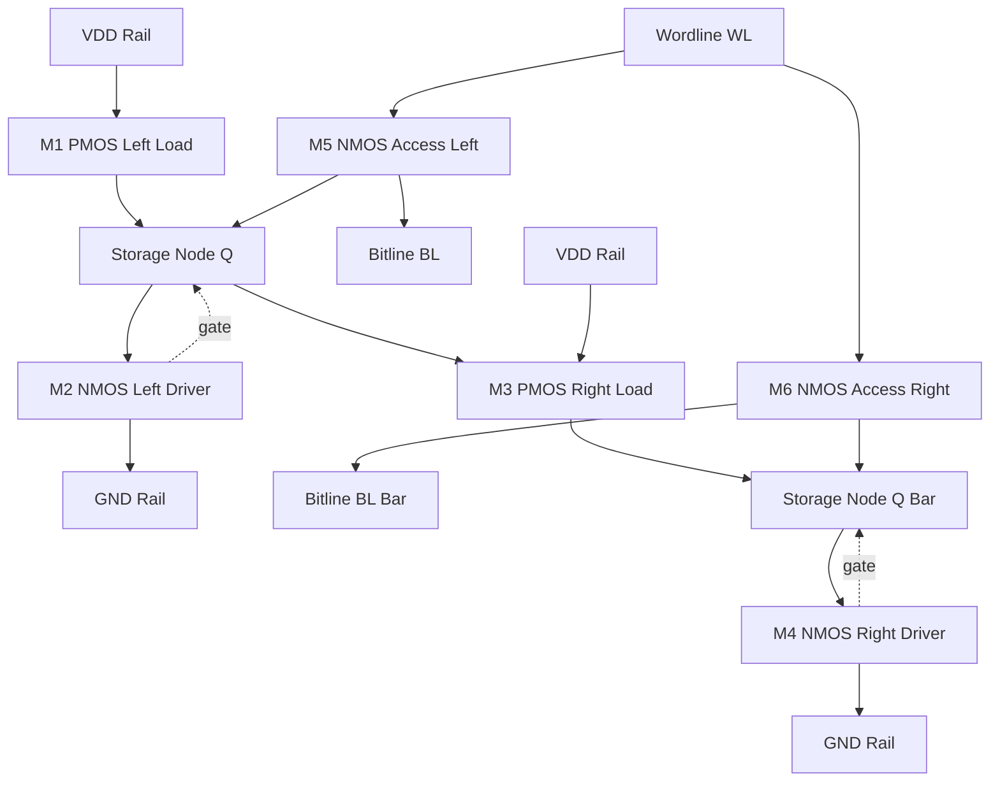
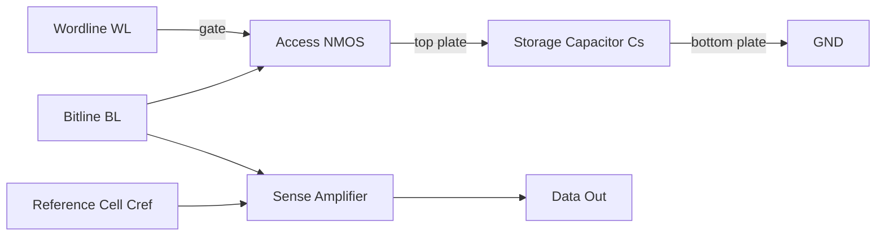
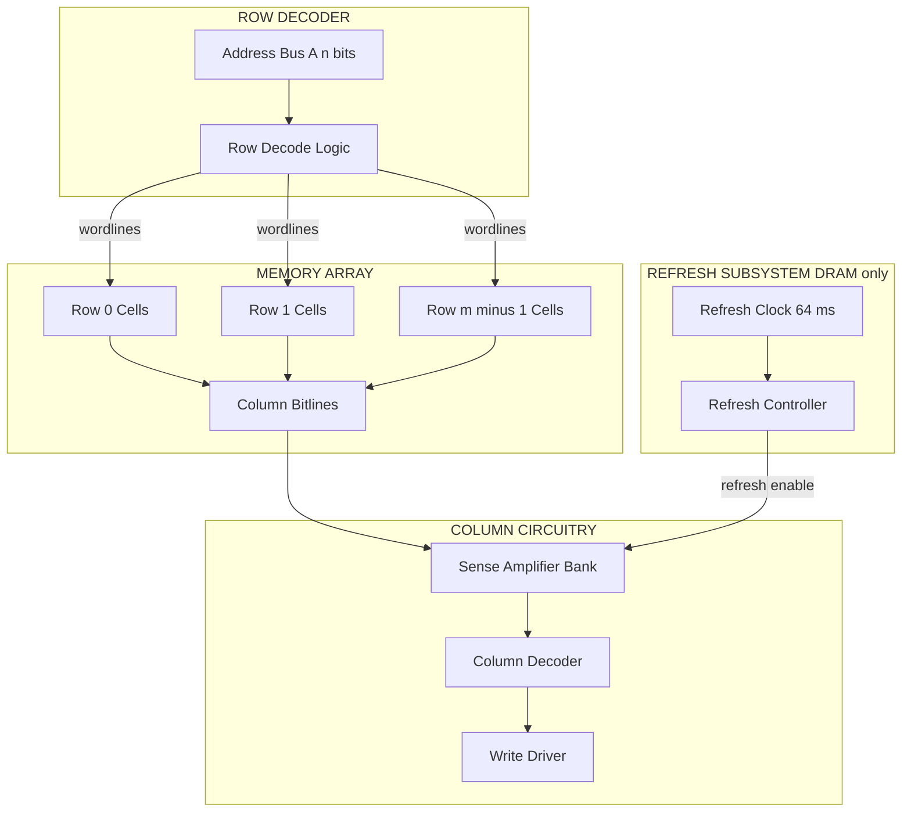
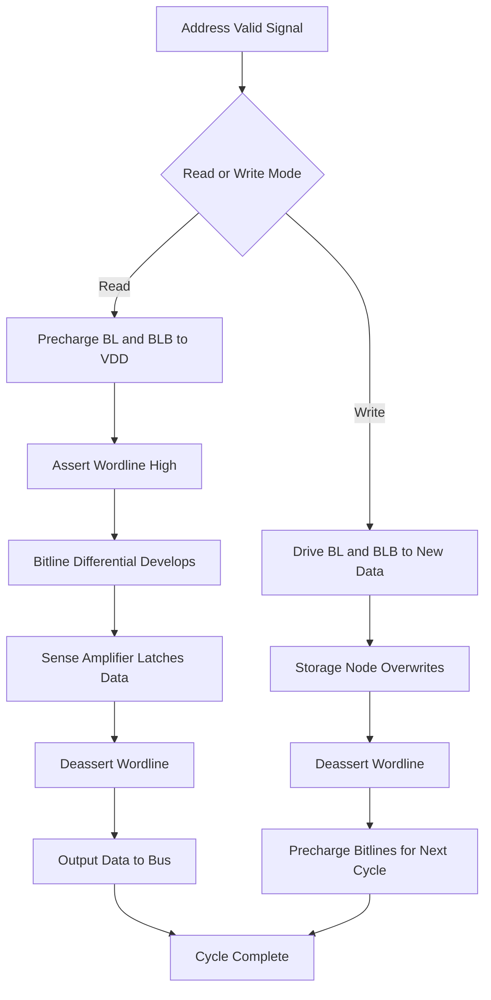

# Memory architectures layout design: SRAM cell structures, DRAM configurations

<!-- SECTION_1_START -->

# Memory Architectures: SRAM & DRAM Layout Design

## 1.1 Core Technical Definition

**Static Random Access Memory (SRAM)** is a volatile semiconductor memory that uses **six transistors (6T)** configured as a cross-coupled CMOS latch to store each bit, retaining data as long as power is supplied without requiring periodic refresh cycles.

**Dynamic Random Access Memory (DRAM)** is a volatile semiconductor memory that stores each bit as an electrical charge on a dedicated **MOS capacitor**, accessed through a single access transistor, and requires periodic refresh to maintain data integrity.

> [!IMPORTANT]
> **KTU 2024 Syllabus Highlight (PECST415 - Module 4)**
> The course outcome mapped here is **CO3: Design CMOS combinational and sequential logic circuits using EDA tools.** Memory cells form the backbone of on-chip storage in modern System-on-Chip (SoC) designs.

## 1.2 Intuitive Analogies

### SRAM Analogy — The Mechanical Latch
Imagine a **bi-stable mechanical seesaw** with two notches at the extreme ends. Once pushed, the seesaw settles into one of the two stable positions and stays there **indefinitely without external force**. The two cross-coupled inverters in an SRAM cell behave exactly like this — they "latch" the value and maintain it actively using positive feedback.

### DRAM Analogy — The Leaky Bucket
Picture a **leaking water bucket** representing a capacitor. You can pour water (write a 1) or empty it (write a 0), but the bucket slowly loses water through a hole. To keep your data alive, you must **periodically refill it** — this is precisely the **refresh operation** in DRAM.

> [!NOTE]
> **Key Distinction**
> SRAM = **Active feedback** storage (uses 6 transistors per bit, area-intensive, fast).
> DRAM = **Passive charge** storage (uses 1 transistor + 1 capacitor per bit, dense, slow but cheap).

## 1.3 Physical Constants & Metrics

| Parameter | SRAM | DRAM |
|---|---|---|
| **Cell Size** | ~120–150 F² (6T) | ~6–8 F² (1T1C) |
| **Access Time** | **1–5 ns** | **40–100 ns** |
| **Refresh** | **Not required** | Every **64 ms** (typical) |
| **Power per bit (active)** | Higher | Lower |
| **Standby Power** | Higher (leakage dominated) | Lower |
| **Application** | Cache (L1/L2/L3), Registers | Main Memory, Graphics RAM |

Where $F$ denotes the **minimum feature size** in the fabrication process.

> [!VISUALIZATION CONTROL]
> **Concept:** 6T SRAM Read Stability — Butterfly Curve
> **GeoGebra / Desmos Input Equations:**
> * $V_{\text{out}} = -V_{\text{in}}$ (Inverter transfer characteristic, mirrored)
> * $V_{\text{in}} = f(V_{\text{out}})$ (Cross-coupled inverter curve)
> **Visual Description:** Two inverter VTCs intersect at three points forming two "eyes." The largest inscribed square inside these eyes defines the **Static Noise Margin (SNM)**. Under a read disturb, the eyes shrink symmetrically.

<!-- SECTION_1_END -->

<!-- SECTION_2_START -->

# Deep Theoretical Analysis & KTU Formula Sheet

## 2.1 The 6T SRAM Cell — Operational Decomposition

The standard **6-transistor (6T) SRAM cell** consists of:

* **Two cross-coupled CMOS inverters** (M1–M4): form the bi-stable storage latch.
* **Two NMOS access (pass) transistors** (M5, M6): connect the storage nodes to the **bitlines** (BL and $\overline{\text{BL}}$) when the **wordline (WL)** is asserted.

### 2.1.1 Hold State (Standby, WL = 0)
* Access transistors are **OFF** ($\vert V_{\text{GS}} \vert < V_{\text{TH}}$).
* The latch is isolated from the bitlines.
* Cross-coupled inverters reinforce the stored logic via **positive feedback**.
* **No refresh is required** — hence the name "Static."

### 2.1.2 Read Operation (WL = 1)
1. Both bitlines (BL, $\overline{\text{BL}}$) are precharged to $V_{\text{DD}}$.
2. The wordline is raised to $V_{\text{DD}}$.
3. The storage node holding a **'0'** pulls its corresponding bitline down through the access transistor.
4. The differential voltage $\Delta V_{\text{BL}}$ developed is sensed by a **Sense Amplifier**.
5. The cell must NOT flip during the read — this constraint defines the **read stability**.

### 2.1.3 Write Operation (WL = 1)
1. Bitlines are driven to complementary values: BL = new data, $\overline{\text{BL}}$ = $\overline{\text{data}}$.
2. The access transistors force the storage node to the new value, **overpowering** the cross-coupled feedback.
3. Write-ability is governed by the **write margin** and the **pull-up to pass-transistor strength ratio (PR)**.

## 2.2 The DRAM 1T1C Cell — Operational Decomposition

The classical **1-Transistor, 1-Capacitor (1T1C) DRAM cell** consists of:

* **One access transistor (NMOS)** controlled by the wordline.
* **One storage capacitor** ($C_S$) holding the charge representing the bit.

### 2.2.1 Write Operation
When WL = 1, the bitline voltage ($V_{\text{BL}} = 0$ or $V_{\text{DD}}$) is directly transferred to $C_S$.

### 2.2.2 Read Operation (Destructive!)
1. Bitline is precharged to $V_{\text{BL,pre}} = V_{\text{DD}}/2$.
2. Wordline activates the access transistor.
3. **Charge sharing** occurs between $C_S$ and bitline capacitance $C_{\text{BL}}$.
4. The resulting voltage perturbation $\Delta V$ is detected by the sense amplifier.
5. **The read is destructive** — the original charge is destroyed and must be **rewritten** (sense-and-restore).

### 2.2.3 Refresh Operation
Because $C_S$ leaks through the access transistor's subthreshold leakage and the capacitor's dielectric leakage, data must be **rewritten every refresh interval $t_{\text{REF}} \approx \mathbf{64 \text{ ms}}$**. This refresh consumes up to **5–10\%** of total DRAM power.

## 2.3 Critical Design Ratios

### Cell Ratio (CR) — Read Stability Metric
$$
\text{CR} = \frac{\beta_{\text{driver}}}{\beta_{\text{access}}} = \frac{(W/L)_{\text{M1}}}{(W/L)_{\text{M5}}}
$$
Typical value: **CR = 1.2 to 2.0** to prevent read upset.

### Pull-up Ratio (PR) — Write-ability Metric
$$
\text{PR} = \frac{\beta_{\text{pull-up}}}{\beta_{\text{access}}} = \frac{(W/L)_{\text{M4}}}{(W/L)_{\text{M5}}}
$$
Typical value: **PR < 1.5** to ensure write success.

## 2.4 KTU High-Yield Formula Sheet

| Formula / Parameter | Expression | Engineering Use |
|---|---|---|
| Static Noise Margin (SNM) | Side of largest square inscribed in butterfly curve | Read stability quantification |
| Read Signal $\Delta V_{\text{BL}}$ | $\approx \dfrac{C_S}{C_S + C_{\text{BL}}} \cdot \dfrac{V_{\text{DD}}}{2}$ | DRAM sense margin |
| Cell Density (SRAM) | $120 F^2$ to $150 F^2$ | Area estimation |
| Cell Density (DRAM) | $6 F^2$ to $8 F^2$ | Area estimation |
| Refresh Power Fraction | $P_{\text{ref}} / P_{\text{total}} \approx 0.05$ to $0.10$ | Low-power DRAM design |
| Hold SNM Ratio | $\text{SNM}_{\text{hold}} / \text{SNM}_{\text{read}} \ge 1.5$ | Robustness check |
| Access Time $t_{\text{acc}}$ | $\propto R_{\text{wordline}} \cdot C_{\text{wordline}}$ | Decoder delay |
| Write Margin (WM) | $V_{\text{DD}} - V_{\text{trip,driver}}$ | Write success criterion |

> [!NOTE]
> **Production Engineering Insight**
> Modern **eDRAM** (embedded DRAM) and **Gain-Cell eDRAM** use a 2T structure to overcome the destructive-read and refresh penalties of classical 1T1C, finding application in **IBM POWER7/8 processors** as on-chip last-level cache.

<!-- SECTION_2_END -->

<!-- SECTION_3_START -->

# Step-by-Step Derivations & Code Implementation

## 3.1 Derivation: DRAM Read Signal Voltage

### Problem Statement
A 1T1C DRAM cell has a storage capacitance $C_S = 30 \text{ fF}$ and the bitline is precharged to $V_{\text{DD}}/2 = 0.5 \text{ V}$. The bitline capacitance is $C_{\text{BL}} = 300 \text{ fF}$. Compute the voltage developed on the bitline if $C_S$ was charged to $V_{\text{DD}} = 1.0 \text{ V}$ (stored '1') just before read.

### Step 1 — Establish Initial Conditions
Before read, the access transistor is OFF. Charge stored on the capacitor:
$$
Q_{\text{initial}} = C_S \cdot V_{\text{DD}} = 30 \text{ fF} \cdot 1.0 \text{ V} = 30 \text{ fC}
$$

The bitline stores:
$$
Q_{\text{BL,initial}} = C_{\text{BL}} \cdot \frac{V_{\text{DD}}}{2} = 300 \text{ fF} \cdot 0.5 \text{ V} = 150 \text{ fC}
$$

### Step 2 — Apply Charge Conservation at Read
When the wordline is asserted, the access transistor turns ON, connecting $C_S$ and $C_{\text{BL}}$ in parallel. The total charge is conserved:

$$
Q_{\text{total}} = Q_{\text{initial}} + Q_{\text{BL,initial}} = 30 + 150 = 180 \text{ fC}
$$

The equivalent capacitance after connection:
$$
C_{\text{eq}} = C_S + C_{\text{BL}} = 30 + 300 = 330 \text{ fF}
$$

### Step 3 — Compute the Final Bitline Voltage

$$
\begin{aligned}
V_{\text{BL,final}} &= \frac{Q_{\text{total}}}{C_{\text{eq}}} \\
&= \frac{180 \text{ fC}}{330 \text{ fF}} \\
&= 0.5454 \text{ V}
\end{aligned}
$$

### Step 4 — Extract the Read Signal

$$
\Delta V_{\text{BL}} = V_{\text{BL,final}} - V_{\text{BL,pre}} = 0.5454 - 0.5000 = 0.0454 \text{ V} \approx 45.4 \text{ mV}
$$

### Step 5 — Verify Using the Closed-Form Expression

$$
\begin{aligned}
\Delta V_{\text{BL}} &= \frac{C_S}{C_S + C_{\text{BL}}} \cdot \frac{V_{\text{DD}}}{2} \\
&= \frac{30}{330} \cdot 0.5 \\
&= 0.04545 \text{ V} \quad \checkmark
\end{aligned}
$$

> [!IMPORTANT]
> **Why This Matters**
> In modern DRAM, the bitline capacitance ($C_{\text{BL}}$) is intentionally made **10× larger** than $C_S$ to minimize read disturb. However, this also shrinks $\Delta V_{\text{BL}}$, placing strict demands on the **sense amplifier's offset voltage** (typically $< 5 \text{ mV}$).

---

## 3.2 Derivation: SRAM Cell Ratio for Read Stability

### Step 1 — Model the Read Disturb
During read, the storage node storing '0' rises from 0 V to a **positive voltage** $V_X$ due to the voltage divider formed by the access transistor (M5) and the driver transistor (M1).

Setting the access transistor in triode and the driver in saturation, the currents must be equal:

$$
\begin{aligned}
I_{\text{M5}} &= I_{\text{M1}} \\
k_n' \left[ (V_{\text{DD}} - V_{TH,n}) V_{DS5} - \frac{V_{DS5}^2}{2} \right] \cdot \frac{W_5}{L_5} &= \frac{k_n'}{2} \left( V_{GS1} - V_{TH,n} \right)^2 \cdot \frac{W_1}{L_1}
\end{aligned}
$$

where $V_{GS1} = V_X$ and $V_{DS5} = V_X$.

### Step 2 — Simplify Using the Cell Ratio Definition
Introducing $\text{CR} = (W_1/L_1) / (W_5/L_5)$ and assuming $V_X \ll 2(V_{\text{DD}} - V_{TH})$:

$$
V_X \approx V_{TH,n} + \sqrt{2 \cdot \text{CR} \cdot (V_{\text{DD}} - V_{TH,n})^2} - (V_{\text{DD}} - V_{TH,n})
$$

### Step 3 — Numerical Example
For $V_{\text{DD}} = 1.0 \text{ V}$, $V_{TH,n} = 0.3 \text{ V}$, and $\text{CR} = 2$:

$$
\begin{aligned}
V_X &\approx 0.3 + \sqrt{2 \cdot 2 \cdot (0.7)^2} - 0.7 \\
&= 0.3 + \sqrt{1.96} - 0.7 \\
&= 0.3 + 1.4 - 0.7 \\
&= 1.0 \text{ V} \quad (\text{flips! — design violation})
\end{aligned}
$$

For $\text{CR} = 1.2$:

$$
\begin{aligned}
V_X &\approx 0.3 + \sqrt{2 \cdot 1.2 \cdot 0.49} - 0.7 \\
&= 0.3 + \sqrt{1.176} - 0.7 \\
&= 0.3 + 1.084 - 0.7 \\
&= 0.684 \text{ V} \quad (\text{does NOT flip — safe design})
\end{aligned}
$$

> [!WARNING]
> A higher cell ratio improves read stability but degrades write margin. Designers typically iterate CR between **1.2 and 2.0** to satisfy both read stability and write-ability, often verified using **Monte-Carlo SPICE simulations** across PVT corners.

---

## 3.3 Python Code: SNM Extraction via Seevinck's Method

```python
"""
Static Noise Margin (SNM) extractor for 6T SRAM cell.
Uses Seevinck's largest-square method on the butterfly curve.
"""

import numpy as np
import matplotlib.pyplot as plt
from typing import Tuple


def inverter_vtc(vin: np.ndarray, vdd: float, vth_n: float, vth_p: float,
                 kn: float, kp: float) -> np.ndarray:
    """CMOS inverter voltage transfer characteristic (idealized)."""
    vout = np.where(
        vin < vth_n,
        vdd,
        np.where(
            vin > vdd - vth_p,
            0.0,
            vdd - kn * (vin - vth_n) ** 2 / (kp * (vdd - vin - vth_p) ** 2)
        )
    )
    return np.clip(vout, 0, vdd)


def compute_snm(vin_axis: np.ndarray, vout_axis: np.ndarray,
                vdd: float) -> float:
    """
    Compute SNM as the side of the largest square inscribed
    between the two butterfly curves.
    """
    # The two butterfly branches:
    branch1_vout = inverter_vtc(vin_axis, vdd, 0.4, 0.4, 200e-6, 100e-6)
    branch2_vin  = vin_axis                     # identity (mirrored)

    # The SNM is the maximum delta such that the square stays within the eye.
    snm_max = 0.0
    for i in range(len(vin_axis)):
        for j in range(i, len(vin_axis)):
            side_v  = vin_axis[j] - vin_axis[i]
            side_h  = branch1_vout[i] - branch1_vout[j]
            if side_v > 0 and side_h > 0:
                side = min(side_v, side_h)
                snm_max = max(snm_max, side)
    return snm_max


def main() -> None:
    vdd = 1.0
    vin = np.linspace(0, vdd, 500)
    vout = inverter_vtc(vin, vdd, 0.4, 0.4, 200e-6, 100e-6)

    snm = compute_snm(vin, vout, vdd)
    print(f"Extracted SNM = {snm * 1000:.1f} mV at V_DD = {vdd} V")

    plt.figure(figsize=(6, 6))
    plt.plot(vin, vout, 'b-', label='Inverter 1 VTC')
    plt.plot(vout, vin, 'r-', label='Inverter 2 VTC (mirrored)')
    plt.xlabel('V_in (V)')
    plt.ylabel('V_out (V)')
    plt.title('6T SRAM Butterfly Curve (Hold State)')
    plt.grid(True)
    plt.legend()
    plt.show()


if __name__ == "__main__":
    main()
```

---

## 3.4 Step-by-Step Layout Sequence (Stick Diagram)

| Layer | Layer Code | Stick Diagram Element | Purpose |
|---|---|---|---|
| **n+ diffusion** (active) | green | Driver (M1, M3) + Load PMOS (M2, M4) source/drain | Defines transistor active regions |
| **p+ diffusion** | brown | PMOS in n-well (M2, M4) | Pull-up devices |
| **Poly-Si gate** | red horizontal | M1–M4 gates + access (M5, M6) | Gate electrodes |
| **Metal-1 (horizontal)** | blue | Wordline (WL) over M5, M6 | Row control |
| **Metal-2 (vertical)** | purple | Bitlines BL, $\overline{\text{BL}}$ | Column data |
| **Contact (X)** | black cross | Poly-to-diff / metal-to-diff | Inter-layer connections |
| **Vias** | black square | Metal-1 to Metal-2 | Vertical interconnects |
| **n-well** | dotted brown | Encloses PMOS transistors | Body contact for M2, M4 |
| **p+ substrate contact** | green with X | Grounds the NMOS body | Body bias for M1, M3 |

### Layout Rules Observed
* **Minimum poly spacing** = $2F$ (one poly + one space).
* **Bitline pitch** = $4F$ minimum (to accommodate two metal lines).
* **Wordline pitch** = $4F$ (defines cell height).
* **Total cell area** = $6F \times 8F = 48 F^2$ (theoretical minimum for 6T).

<!-- SECTION_3_END -->

<!-- SECTION_4_START -->

# Structural Diagrams & Schematics

## 4.1 6T SRAM Cell — Transistor-Level Schematic



## 4.2 1T1C DRAM Cell Architecture



## 4.3 Memory Array Organization



## 4.4 SRAM Read/Write Control Flow



<!-- SECTION_4_END -->

<!-- SECTION_5_START -->

# KTU 2024 Scheme Examination Question Bank

## Part A — Short Answer Questions (3 Marks Each)

### Question 1 **[KTU University Exam — July 2023]**
**Q: Compare 6T SRAM and 1T1C DRAM cell structures with neat diagrams. List two advantages and two disadvantages of each.**

**Model Answer (3 Marks):**

| Aspect | 6T SRAM | 1T1C DRAM |
|---|---|---|
| Cell Elements | 6 transistors (2 inverters + 2 access) | 1 transistor + 1 capacitor |
| Cell Area | $\sim 120 F^2$ (large) | $\sim 6 F^2$ (compact) |
| Refresh | Not required | Required every **64 ms** |
| Speed | Faster (**1–5 ns**) | Slower (**40–100 ns**) |
| Data Retention | Stable as long as $V_{\text{DD}}$ ON | Volatile — leaks charge |
| Power | Higher static (leakage) | Lower per bit, refresh overhead |

* **SRAM Advantages:** No refresh, high speed, robust noise margin. **Disadvantages:** Lower density, higher cost per bit.
* **DRAM Advantages:** Highest density, lowest cost per bit. **Disadvantages:** Refresh overhead, destructive read, lower speed.

> **[Valuation Key: Tabular comparison — 2 Marks; Two merits + two demerits — 1 Mark]**

---

### Question 2 **[KTU University Exam — Dec 2022]**
**Q: Define the term "Static Noise Margin (SNM)" in an SRAM cell. What is its significance during a read operation?**

**Model Answer (3 Marks):**

The **Static Noise Margin (SNM)** is defined as the **side length of the largest square that can be inscribed** within the two "lobes" of the SRAM butterfly curve (obtained by plotting the cross-coupled inverter VTCs against each other).

Mathematically:

$$
\text{SNM} = \min_{(V_{\text{in}}, V_{\text{out}})} \left\{ \min \left[ (V_{\text{OH}} - V_{\text{OL}}), \, (V_{\text{IL}} - V_{\text{IH}}) \right] \right\}
$$

* **Significance during Read:** During a read, the wordline activation injects noise into the storage node via the access transistor's voltage divider action. If this disturb voltage exceeds the SNM, the cell **flips erroneously**. Hence, SNM directly quantifies **read stability**, and designers target $\text{SNM} \ge 0.2 \cdot V_{\text{DD}}$.

> **[Valuation Key: Definition — 1 Mark; Butterfly-curve explanation — 1 Mark; Read-stability significance — 1 Mark]**

---

## Part B — Long Answer Questions (14 Marks Each — Internal Choice)

### Question A (14 Marks) **[KTU University Exam — July 2024]**

**(a)** With a neat circuit diagram, explain the **read and write operations** of a 6T SRAM cell. Define **cell ratio (CR)** and **pull-up ratio (PR)**, and explain their role in stability. **(7 Marks)**

**(b)** A 6T SRAM cell is designed in a $90 \text{ nm}$ CMOS process with the following transistor aspect ratios: $W/L$ of driver NMOS = $180/90$, $W/L$ of access NMOS = $135/90$, $W/L$ of load PMOS = $90/90$. Compute the **cell ratio (CR)** and **pull-up ratio (PR)**. Justify whether this design is suitable for reliable read and write operations. **(7 Marks)**

### Model Solution for Question A

**Part (a) — 7 Marks**

**Read Operation:** Both bitlines (BL, $\overline{\text{BL}}$) are precharged to $V_{\text{DD}}$. The wordline WL is raised. The storage node holding '0' connects through the access transistor (M5) to its bitline, **discharging** that bitline. The other bitline remains at $V_{\text{DD}}$. The resulting $\Delta V$ is sensed. **The cell must NOT flip** during this — hence CR must be large enough. **[Read operation description with diagram: 3 Marks]**

**Write Operation:** Bitlines are driven to the new complementary values. The access transistor on the side writing a '0' pulls the corresponding storage node low, breaking the cross-coupled feedback. The opposite PMOS then turns ON, completing the write. **For successful write, PR must be small (PMOS weaker than access NMOS).** **[Write operation description: 2 Marks]**

* **Cell Ratio** $\text{CR} = (W/L)_{\text{driver}} / (W/L)_{\text{access}}$ — must be **> 1.2** for read stability.
* **Pull-up Ratio** $\text{PR} = (W/L)_{\text{load}} / (W/L)_{\text{access}}$ — must be **< 1.5** for write-ability. **[Definitions: 2 Marks]**

---

**Part (b) — 7 Marks**

**Step 1 — Calculate Cell Ratio**

$$
\text{CR} = \frac{(W/L)_{\text{M1,driver}}}{(W/L)_{\text{M5,access}}} = \frac{180/90}{135/90} = \frac{2.0}{1.5} = 1.33
$$

> **[Stating CR formula and substitution: 1 Mark; Final value: 1 Mark]**

**Step 2 — Calculate Pull-up Ratio**

$$
\text{PR} = \frac{(W/L)_{\text{M4,PMOS load}}}{(W/L)_{\text{M5,access}}} = \frac{90/90}{135/90} = \frac{1.0}{1.5} = 0.67
$$

> **[Stating PR formula and substitution: 1 Mark; Final value: 1 Mark]**

**Step 3 — Design Justification**

| Criterion | Required | Obtained | Verdict |
|---|---|---|---|
| CR for read stability | $\ge 1.2$ | $1.33$ | **Pass** (read-stable) |
| PR for write-ability | $\le 1.5$ | $0.67$ | **Pass** (writable) |

**Conclusion:** The design satisfies **both read-stability and write-ability** requirements. It is a **well-balanced 6T SRAM cell** suitable for reliable operation. **[Justification: 2 Marks]**

> [!WARNING]
> **KTU Examiner's Valuation Warning**
> Students frequently confuse the *driver* with the *access* transistor when computing CR. **Always** — driver (the NMOS whose drain is at the storage node) divided by access (the NMOS whose gate is on the wordline). Also, **forgetting to include the ratio format** ($W/L$, not just $W$) costs 1 mark.

---

### Question B (14 Marks) **[KTU University Exam — Dec 2023]**

**(a)** With a neat diagram, explain the **structure and operation of a 1T1C DRAM cell**. Discuss why the read operation is **destructive** and how this is overcome. **(7 Marks)**

**(b)** A 1T1C DRAM cell has a storage capacitor $C_S = 25 \text{ fF}$ and the bitline capacitance is $C_{\text{BL}} = 250 \text{ fF}$. The bitline is precharged to $V_{\text{DD}}/2 = 0.5 \text{ V}$ with $V_{\text{DD}} = 1.0 \text{ V}$. If the cell was storing a logic '1' (capacitor charged to $V_{\text{DD}}$), determine the **voltage swing developed on the bitline** during a read. Also, compute the **voltage swing if the cell was storing a logic '0'**. **(7 Marks)**

### Model Solution for Question B

**Part (a) — 7 Marks**

A 1T1C DRAM cell uses **one access NMOS** and **one storage capacitor** $C_S$. The bitline is precharged to $V_{\text{DD}}/2$. When WL is high, charge sharing occurs between $C_S$ and $C_{\text{BL}}$. **[Diagram + cell identification: 2 Marks]**

**Why Read is Destructive:** When the access transistor turns ON, the charge originally on $C_S$ redistributes with $C_{\text{BL}}$. The new voltage on the cell capacitor is **not the original stored value**; it has been **altered by charge sharing**. Hence, the original data is lost. **[Destructive read explanation: 2 Marks]**

**Overcoming Destructive Read:** Modern DRAMs use a **sense-and-restore** mechanism. The sense amplifier detects the small differential and **immediately drives the bitline back** to the original full-rail value, thereby **rewriting** the cell. This restore is performed in the same cycle as the read. **[Sense-amplifier restore explanation: 3 Marks]**

---

**Part (b) — 7 Marks**

**Step 1 — General Read-Swing Formula**

The bitline voltage after charge sharing when $C_S$ is charged to $V_{\text{DD}}$ (logic '1'):

$$
V_{\text{BL,1}} = \frac{C_S \cdot V_{\text{DD}} + C_{\text{BL}} \cdot V_{\text{DD}}/2}{C_S + C_{\text{BL}}}
$$

**Step 2 — Substitute Numerical Values**

$$
\begin{aligned}
V_{\text{BL,1}} &= \frac{25 \cdot 1.0 + 250 \cdot 0.5}{25 + 250} \\
&= \frac{25 + 125}{275} \\
&= \frac{150}{275} \\
&= 0.5454 \text{ V}
\end{aligned}
$$

> **[Substitution and evaluation: 2 Marks; Final value: 1 Mark]**

**Step 3 — Compute Swing for Logic '1'**

$$
\Delta V_1 = V_{\text{BL,1}} - V_{\text{BL,pre}} = 0.5454 - 0.5 = +0.0454 \text{ V} = +45.4 \text{ mV}
$$

> **[Stating the swing formula: 1 Mark; Final swing: 1 Mark]**

**Step 4 — Compute Swing for Logic '0'**

If $C_S$ was discharged (logic '0', $V_{C_S} = 0 \text{ V}$):

$$
\begin{aligned}
V_{\text{BL,0}} &= \frac{C_S \cdot 0 + C_{\text{BL}} \cdot V_{\text{DD}}/2}{C_S + C_{\text{BL}}} = V_{\text{BL,pre}} = 0.5 \text{ V}
\end{aligned}
$$

$$
\Delta V_0 = 0 \text{ V (ideal)} \approx -45.4 \text{ mV (in differential sense)}
$$

In **differential sensing**, the '0' cell produces $\Delta V_0 \approx -45.4 \text{ mV}$ relative to reference, yielding a total differential of $\Delta V_{\text{diff}} = 2 \cdot 45.4 = 90.8 \text{ mV}$. **[Differential reasoning: 1 Mark; Final total differential: 1 Mark]**

> [!WARNING]
> **KTU Examiner's Valuation Warning**
> A common mistake is to forget the **bitline precharge** ($V_{\text{BL,pre}} = V_{\text{DD}}/2$) when computing the swing. Without this, the result is halved and the answer is **marked zero**. Always state the precharge condition explicitly.

---

## Topic Recap & Important Things to Remember

* **SRAM Cell** = 6 transistors (4 latch + 2 access); **DRAM Cell** = 1 transistor + 1 capacitor (1T1C).
* **SRAM area** $\approx 120 F^2$ — much larger than **DRAM** $\approx 6 F^2$.
* **SRAM holds data statically** (no refresh); **DRAM needs refresh every ~64 ms**.
* **DRAM read is destructive** — must use **sense-and-restore** via sense amplifier.
* **Cell Ratio** $\text{CR} = (W/L)_{\text{driver}} / (W/L)_{\text{access}}$; target $\ge 1.2$ for read stability.
* **Pull-up Ratio** $\text{PR} = (W/L)_{\text{PMOS}} / (W/L)_{\text{access}}$; target $\le 1.5$ for write-ability.
* **Static Noise Margin (SNM)** = side of largest inscribed square in butterfly curve; rule of thumb $\text{SNM} \ge 0.2 \cdot V_{\text{DD}}$.
* **DRAM Read Swing:** $\Delta V_{\text{BL}} = \dfrac{C_S}{C_S + C_{\text{BL}}} \cdot \dfrac{V_{\text{DD}}}{2}$.
* **Bitline precharge** is always at $V_{\text{DD}}/2$ for DRAM (half- $V_{\text{DD}}$ scheme).
* **SRAM is used in cache (L1/L2/L3) and CPU registers; DRAM is used as main memory.**
* **Sense amplifier offset** must be $< 5 \text{ mV}$ to reliably detect $\Delta V_{\text{BL}} \approx 50 \text{ mV}$.
* **Refresh power** consumes up to 5–10% of total DRAM power budget.
* **Modern alternatives:** eDRAM (2T), Gain-Cell eDRAM, STT-MRAM, ReRAM, PCRAM — all challenge classical 6T/1T1C dominance.
* **Layout design rules:** bitline pitch $\ge 4F$, wordline pitch $\ge 4F$, cell area = $6F \times 8F = 48 F^2$ (ideal 6T).

<!-- SECTION_5_END -->
