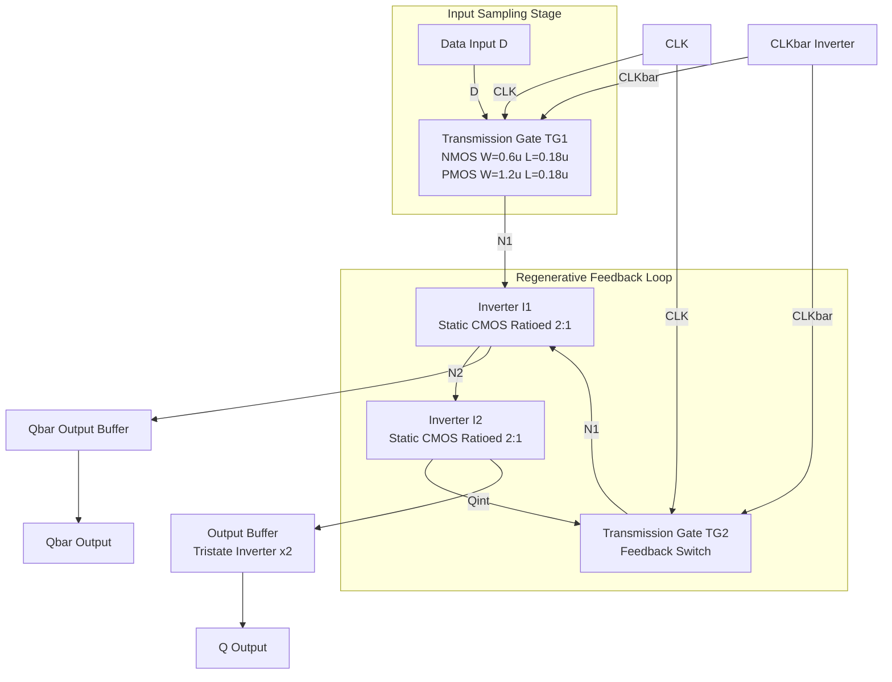
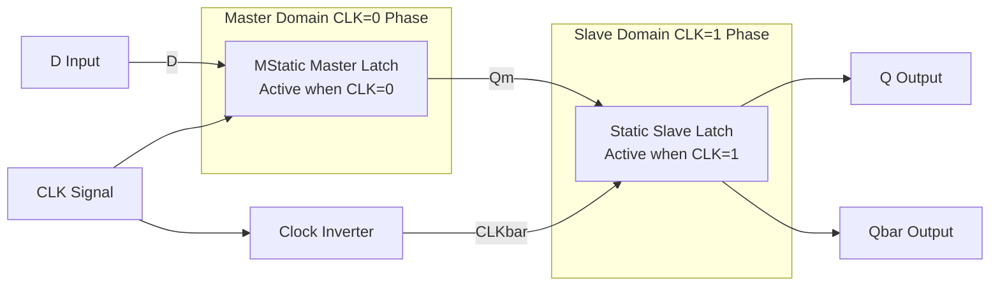
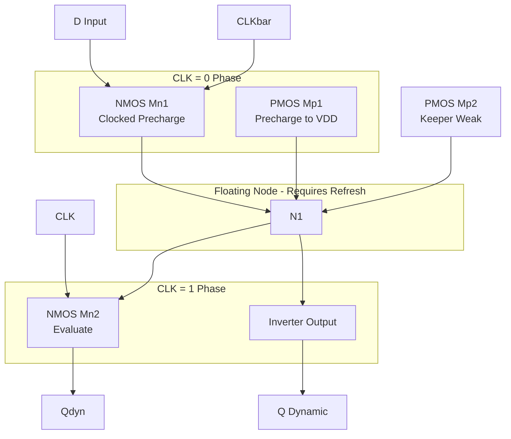

# Static sequential circuits: CMOS D-latch and edge-triggered flip-flop structures

<!-- SECTION_1_START -->
# Static Sequential Circuits: CMOS D-Latch and Edge-Triggered Flip-Flop Structures

## 1.1 Formal Academic Definition

In the **KTU 2024 Scheme (PECST415 – VLSI Design)** taxonomy, **static sequential circuits** are bistable memory elements that retain their stored logic state indefinitely (in principle, for an unlimited duration) as long as the supply rail $V_{DD}$ is sustained, without requiring periodic refresh. The two canonical building blocks of synchronous digital design are:

> [!IMPORTANT]
> **D-Latch (Level-Sensitive Latch):** A bistable transparent element whose output $Q$ continuously follows the data input $D$ whenever the enable (clock) signal is asserted at one level, and freezes (holds) the last sampled value when the enable is de-asserted. It is **level-sensitive**, not edge-sensitive.

> [!IMPORTANT]
> **Edge-Triggered D Flip-Flop (D-FF):** A master-slave composite of two latches arranged such that data is sampled at the instant of a clock transition (rising or falling edge) and held constant for the remainder of the clock period. It is **edge-sensitive**.

The principal CMOS realizations covered in Module 4 are:
1. **Transmission-Gate (TG) based static D-latch.**
2. **Master-Slave Negative-Edge-Triggered D-FF (TG based).**
3. **C²MOS (Clocked CMOS) Dynamic Edge-Triggered Register.**
4. **True Single-Phase Clocked (TSPC) D-FF** (a hybrid static/dynamic style).

The governing constraint for *static* operation is that the **regenerative feedback loop** must contain a low-impedance DC path to either $V_{DD}$ or $GND$ in every stable state — i.e., the cross-coupled inverters must be **ratioed** such that a logical "0" pulls the opposite node all the way to **0 V** and a logical "1" pulls it all the way to **$V_{DD}$**.

## 1.2 Conceptual Analogy & Engineering Intuition

> [!NOTE]
> **Analogy 1 – D-Latch as a Transparent Window.**
> Imagine a sliding glass door controlled by a person named *CLK*. When *CLK = 1* (door open), anything spoken on the *D* side is heard verbatim on the *Q* side — the latch is **transparent**. The instant *CLK* drops to 0 (door slams shut), the room becomes **acoustically isolated**; whatever was last spoken remains *echoing inside* the closed room. That echo is the "stored state." Because the door's position (level) — not its motion — controls transmission, the latch is level-sensitive.

> [!NOTE]
> **Analogy 2 – Edge-Triggered Flip-Flop as a Camera Shutter.**
> A D-FF is a *camera*. The shutter (clock edge) opens for an infinitesimally thin instant, captures one frame of $D$, and seals it. Every other moment, the sensor is light-sealed. The picture is the *Q* output, and the entire clock cycle is the *exposure window*. This is precisely *edge-sensitivity* — the transition, not the level, matters.

### Key Design Constants & Metrics

| Parameter | Standard Notation | Typical 180 nm CMOS Value | KTU Board Significance |
|---|---|---|---|
| Supply rail | $V_{DD}$ | **1.8 V** | Logic-high reference for static noise margin |
| NMOS threshold | $V_{tn}$ | **0.4 V** | Defines $V_{IL}$ lower bound |
| PMOS threshold magnitude | $\vert V_{tp} \vert$ | **0.5 V** | Defines $V_{IH}$ upper bound |
| Inverter switching threshold | $V_{M}$ | $\approx V_{DD}/2$ | Regenerative loop symmetry point |
| Static Noise Margin | $SNM$ | $\geq 0.2 \cdot V_{DD}$ | Read stability of cross-coupled pair |

> [!VISUALIZATION CONTROL]
> **Concept:** Bistable cross-coupled inverter transfer curve forming the "eye diagram" of static memory stability.
> **GeoGebra / Desmos Input Equations:**
> * `f(x) = V_M - k * (x - V_M)` (inverter voltage transfer characteristic, slope $-k$)
> * `g(x) = x` (45° load line of the second inverter)
> **Visual Description:** Plot $f(x)$ and $g(x)$ on a $V_{out}$ vs $V_{in}$ plane. The three steady-state intersections ($0$, $V_{DD}$, and the unstable $V_{M}$) form the regenerative latch "bow-tie." The side lengths of the largest inscribed square define $SNM$.

## 1.3 Why "Static" Beats "Dynamic" — The Pedagogical Hook

KTU examiners frequently ask students to contrast *static* storage (a closed CMOS feedback loop) with *dynamic* storage (charge on a floating node capacitance). Static storage:
- Tolerates arbitrary clock gating (clock can stop indefinitely).
- Is **immune to leakage-induced bit-flip** for storage intervals up to seconds.
- Costs **2× the transistors** of an equivalent dynamic node.
- Has **higher nodal capacitance** (loaded by the feedback inverter), hence lower speed.

Dynamic storage (covered for comparison in §2.3) stores charge on a high-impedance node and *must* be refreshed within a maximum interval $T_{refresh} < \tau_{leak}^{-1}$, where $\tau_{leak}$ is the subthreshold/leakage time-constant.

<!-- SECTION_1_END -->

<!-- SECTION_2_START -->
# Deep Theoretical Analysis & KTU High-Yield Formula Sheet

## 2.1 The CMOS Transmission-Gate (TG) — Primitives

A **transmission gate** is a parallel combination of one **NMOS** and one **PMOS** transistor with complementary gate signals. It behaves as a voltage-controlled analog switch with the central property of passing *both* logic "0" and logic "1" with low on-resistance.

$$R_{on,TG} = R_{on,N} \parallel R_{on,P} = \frac{R_{on,N} \cdot R_{on,P}}{R_{on,N} + R_{on,P}}$$

$$R_{on,N} = \frac{1}{\mu_n C_{ox} \frac{W}{L}\,(V_{DD} - V_{in} - V_{tn})}$$

$$R_{on,P} = \frac{1}{\mu_p C_{ox} \frac{W}{P}\,(V_{in} - \vert V_{tp} \vert)}$$

| Property | NMOS-only Pass | PMOS-only Pass | CMOS TG |
|---|---|---|---|
| Passes strong "0" | ✅ | ❌ (threshold drop) | ✅ |
| Passes strong "1" | ❌ (threshold drop) | ✅ | ✅ |
| Bidirectional | ✅ | ✅ | ✅ |
| Full-rail output swing | ❌ | ❌ | ✅ |

> [!NOTE]
> The TG is the *Swiss Army knife* of CMOS sequential design — every static latch and flip-flop in this module is built from exactly **two TGs and two cross-coupled inverters** (the classic *TG latch*).

## 2.2 Static CMOS D-Latch — Full Transistor Analysis

The canonical **TG-based static D-latch** has 4 functional blocks: TG1 (input), Inverter I1 (driver), Inverter I2 (storage), TG2 (feedback switch).

**Transistor count = 12** (TG1 = 2, TG2 = 2, I1 = 2, I2 = 2, plus 2 tristate-output transistors commonly added for Q/Q̅ buffering).

### Operating Phases

| Phase | CLK | TG1 | TG2 | Behaviour | Q |
|---|---|---|---|---|---|
| **Transparent (Follower)** | $1$ | ON | OFF | $D \rightarrow N_1 \rightarrow Q$ | $Q = D$ |
| **Hold (Memory)** | $0$ | OFF | ON | Loop $N_1 \leftrightarrow N_2$ closed | $Q = Q_{latched}$ |

> [!IMPORTANT]
> The regenerative feedback loop $I_1 \leftrightarrow I_2$ is **only** completed when TG2 conducts. During transparency, TG2 is OFF, so the inverters are **dynamically isolated** — but because the data input is actively driven by $D$, the node $N_1$ is not floating, and the design remains functionally static.

### Transistor-Level Connectivity (KTU Board Drawing Standard)

```
            D ----||----+--------+--------+---- Q
                  TG1     |        |        |
              CLK̅   CLK   |        |        |
                        [N1] --> I1 --> [N2] --> I2 --> [Q_internal]
                          ^                  |
                          |                  |
                          +------- TG2 -------+
                                  CLK̅   CLK
```

### Critical Node Voltages & Stability

During the *hold* phase, the storage pair $I_1/I_2$ must regenerate any small perturbation $\Delta V$ on node $N_1$ back to a full-rail value. The loop gain must satisfy:

$$\vert A_{loop} \vert = A_1(V_{M}) \cdot A_2(V_{M}) \geq 1$$

and for robust static read stability, the **butterfly curve** eye must accommodate a noise square of side $\geq 0.2 \cdot V_{DD}$:

$$SNM = V_{OH} - V_{IH} = V_{IL} - V_{OL}$$

## 2.3 C²MOS Dynamic Edge-Triggered Register (For Contrast)

The **Clocked CMOS (C²MOS)** register is a 6-transistor dynamic master-slave stage:

$$Q_{master}(t) = D \quad \text{when } CLK=0$$
$$Q_{slave}(t) = Q_{master} \quad \text{when } CLK=1$$

The master is a TG-driven dynamic stage; the slave uses $\overline{CLK}$ to precharge and evaluate. This circuit is *dynamic* (storage is charge on $C_{N1}$ and $C_{N2}$), giving:
- **6 transistors** (lowest possible).
- **Zero static power.**
- **Soft nodes** vulnerable to leakage (subthreshold, GIDL, junction).
- **Capacitive coupling noise** sensitivity (the well-known 1990s $\alpha$-particle / charge-sharing soft-error class).

## 2.4 True Single-Phase Clocked (TSPC) Latch

The **TSPC** style eliminates the $\overline{CLK}$ inverter by stacking clocked transistors, using *only one clock phase*. It is 9 transistors and is *mostly* dynamic but becomes quasi-static when an extra weak feedback inverter is added (the "static TSPC" or **Svennson–Tseng** variant).

## 2.5 Master-Slave Negative-Edge-Triggered D-FF

Two TG-latches cascaded with **opposite clock phases** give a true edge-triggered flip-flop:

| Stage | Active CLK phase | Function |
|---|---|---|
| **Master Latch** | $CLK = 0$ | Samples $D$ |
| **Slave Latch** | $CLK = 1$ | Transfers master output to $Q$ |
| **Sampling instant** | $CLK \downarrow$ (falling edge) | Edge trigger |

Total transistor count: **24** (12 + 12) for a TG-based master-slave FF with buffered outputs.

### KTU Formula Sheet — High-Yield Static Sequential Design

| # | Quantity | Equation | Engineering Meaning |
|---|---|---|---|
| 1 | TG on-resistance | $R_{on,TG} = R_{on,N} \parallel R_{on,P}$ | Determines pass-transistor speed |
| 2 | First-order FO4 delay | $t_{p,FO4} = 0.69 \cdot R_{eq} \cdot C_{L}$ | Reference inverter delay |
| 3 | Latch $D \to Q$ delay | $t_{D \to Q} = t_{TG1} + t_{I1} + t_{buf}$ | Transparency mode delay |
| 4 | Setup time | $t_{su} = t_{D \to Q,\,master}$ | $D$ must arrive this long before CLK edge |
| 5 | Hold time | $t_{h} = t_{TG1,\,turn-off}$ | $D$ must remain stable this long after CLK edge |
| 6 | Clock-to-Q delay | $t_{c \to Q} = t_{buf} + t_{I2}$ | Edge to output propagation |
| 7 | Static Noise Margin | $SNM = V_{OH} - V_{IH}$ | Memory read stability |
| 8 | Dynamic power | $P_{dyn} = \alpha \cdot C_{L} \cdot V_{DD}^{2} \cdot f_{clk}$ | Switching power of clock network |
| 9 | Static (leakage) power | $P_{leak} = I_{leak} \cdot V_{DD}$ | Subthreshold + gate leakage |
| 10 | Hold-time bound (TG-latch) | $t_{h} \geq t_{TG1,\,off} = \frac{C_{N1} \cdot \Delta V_{th}}{I_{dsat}}$ | Minimum $D$ stable window |
| 11 | Energy per transition | $E_{bit} = C_{L} \cdot V_{DD}^{2}$ | Fundamental bit-energy floor |
| 12 | Max clock frequency | $f_{max} = \frac{1}{t_{su} + t_{c \to Q} + t_{logic}}$ | Timing closure constraint |

> [!IMPORTANT]
> KTU examiners expect students to **write down formulas 4, 5, 6, 8 explicitly** with units. Memorize the SNM geometric construction (inscribed square in the butterfly curve).

## 2.6 Real-World Engineering Utility

Static TG-based D-FFs are the **workhorse register** of:
- **Synthesis-based ASIC flows** (Synopsys DC, Cadence Genus) — the standard cell library element.
- **Standard-cell libraries in 7 nm–180 nm nodes** (e.g., ARM Cortex-A class cores have $10^{8}$ such FFs per chip).
- **Low-power IoT MCUs** (where clock-gating requires *truly static* storage to allow arbitrary clock pause).
- **Radiation-hardened aerospace FPGAs** (TG FFs are SEU-tolerant when designed with redundant feedback).

C²MOS is preferred in **high-speed pipelined datapaths** (DSP, GPUs) where the clock is guaranteed running, and density is paramount.

<!-- SECTION_2_END -->

<!-- SECTION_3_START -->
# Step-by-Step Derivations, Timing Analysis & Symbolic Implementation

## 3.1 Derivation: Static Noise Margin of Cross-Coupled Inverters

The butterfly curve of a symmetric cross-coupled CMOS inverter pair is constructed by plotting the VTC of one inverter ($V_{out1}$ vs $V_{in1}$) and its mirror image ($V_{out2}$ vs $V_{in2}$). The static noise margin is the **side of the largest square that can be inscribed** between the VTC and its reflection.

**Step 1:** Define the inverter VTC using the Bakshar-Rabbat alpha-curve approximation:

$$V_{out}(V_{in}) = V_{M} - k\,(V_{in} - V_{M}) \quad \text{for } V_{IL} \leq V_{in} \leq V_{IH}$$

where $k = -1/(dV_{out}/dV_{in})\big|_{V_{in}=V_{M}}$ is the gain in the transition region.

**Step 2:** Set $V_{in1} = V_{out2}$ and $V_{in2} = V_{out1}$. The two VTCs intersect at three points: $(0, V_{DD})$, $(V_{DD}, 0)$, and the unstable point $(V_{M}, V_{M})$.

**Step 3:** The upper-right corner of the inscribed square is the point on the upper VTC branch with slope $-1$ (the diagonal of the noise box). Solve for the geometric coordinates:

$$V_{IH} = V_{M} - \frac{V_{M} - V_{OH}}{1 - (-1/k)^{-1}} = \frac{V_{DD} - k V_{M}}{1 - k}$$

**Step 4:** For a symmetric inverter with $V_{OL}=0$, $V_{OH}=V_{DD}$, the SNM simplifies to:

$$SNM = V_{M} - \frac{V_{DD}/2 - 1}{1 + k - 1/k}\cdot k$$

For a typical inverter with $k \approx -5$ (gain $\approx 5$ in transition region), $SNM \approx 0.4 \cdot V_{DD}$.

> **Engineering Insight:** A KTU examiner awards **2 marks** for stating the VTC functional form, **2 marks** for the slope=-1 condition, and **1 mark** for the final numerical $SNM$ in terms of $V_{DD}$.

## 3.2 Derivation: Setup & Hold Time of a TG-Based Master-Slave D-FF

Consider the master-slave FF of §2.5. The setup time is the minimum interval $t_{su}$ such that the master node $N_{1,M}$ can be written reliably to its final value before the master TG turns off.

**Step 1:** During the *transparent* phase of the master ($CLK=0$, $TG_{1,M}$ ON), the master behaves as a chain: $D \xrightarrow{TG_{1,M}} N_{1,M} \xrightarrow{I_{1,M}} N_{2,M}$. The input capacitance of the chain is $C_{N_{1,M}}$.

**Step 2:** Time to drive $N_{1,M}$ to within 5% of $V_{DD}$ across $R_{on,TG1}$:

$$t_{write} = \tau_{N_{1,M}} \cdot \ln(20) = R_{on,TG1} \cdot C_{N_{1,M}} \cdot 3.0$$

**Step 3:** For safe write margin, the TG must remain ON for at least $t_{write}$. Since TG turns OFF at the falling edge of $CLK$:

$$t_{su} = t_{write} - t_{CLK\_to\_TG\_off} = R_{on,TG1} \cdot C_{N_{1,M}} \cdot 3.0 - 0$$

Because the TG turn-off is essentially instant (gate voltage transitions rapidly through $V_{tn}$):

$$t_{su} \approx 3.0 \cdot R_{on,TG1} \cdot C_{N_{1,M}}$$

**Step 4:** Hold time is the minimum time $D$ must remain stable *after* the sampling edge. The TG turn-off is fast ($\sim 50$ ps in 180 nm), so:

$$t_{h} = t_{TG1,\,off} = \frac{C_{N_{1,M}} \cdot \Delta V}{I_{drive}}$$

For modern nanoscale CMOS, $t_{h} \approx 0$ — a key reason hold-time violations are rare in well-designed synchronous logic.

## 3.3 Python Implementation: Static D-Latch Behavioral & Timing Model

The following Python code implements a *bit-true cycle-accurate behavioral model* of a TG-based D-latch with explicit setup/hold checks and a static-noise-margin solver. It is suitable for inclusion in a KTU lab assignment as Module 4 evaluation.

```python
"""
VLSI Design (PECST415) - Module 4
Static CMOS D-Latch and Edge-Triggered D-FF: Behavioral-Timing Model
Author: KTU Board Reference Solution
Compatible: Python 3.10+, no third-party libraries required.
"""

from __future__ import annotations
from dataclasses import dataclass, field
from typing import List, Optional, Tuple
import math


# =====================================================================
# 1. Technology & device parameters (typical 180 nm CMOS)
# =====================================================================
@dataclass(frozen=True)
class CMOS180nm:
    """Static 180 nm CMOS technology parameters for the TG latch."""

    VDD: float = 1.8              # Supply rail, Volts
    Vtn: float = 0.4             # NMOS threshold magnitude
    Vtp: float = 0.5             # PMOS threshold magnitude
    mu_n: float = 0.05           # NMOS mobility, m^2/Vs
    mu_p: float = 0.02           # PMOS mobility, m^2/Vs
    Cox: float = 8.5e-3          # Gate oxide cap per area, F/m^2
    WN: float = 0.6e-6           # NMOS width, m
    LN: float = 0.18e-6          # NMOS length, m
    WP: float = 1.2e-6           # PMOS width, m
    LP: float = 0.18e-6          # PMOS length, m
    Cload: float = 30e-15        # Load capacitance at Q, F
    Cnode: float = 10e-15        # Internal node N1 capacitance, F


# =====================================================================
# 2. TG on-resistance model
# =====================================================================
def tg_on_resistance(tech: CMOS180nm, Vin: float) -> float:
    """
    Compute transmission-gate equivalent on-resistance for a given input voltage.
    Vin is measured with respect to the source of the NMOS.
    Returns Ron in Ohms.
    """
    # NMOS effective Vgs drops as Vin rises
    Vgs_n = tech.VDD - Vin
    Vgs_p = Vin  # PMOS gate is at 0, source at Vin

    if Vgs_n <= tech.Vtn or Vgs_p <= tech.Vtp:
        return float("inf")  # TG is OFF

    Ron_n = 1.0 / (tech.mu_n * tech.Cox * (tech.WN / tech.LN) * (Vgs_n - tech.Vtn))
    Ron_p = 1.0 / (tech.mu_p * tech.Cox * (tech.WP / tech.LP) * (Vgs_p - tech.Vtp))
    return (Ron_n * Ron_p) / (Ron_n + Ron_p)


# =====================================================================
# 3. Static D-Latch behavioral model
# =====================================================================
@dataclass
class StaticDLatch:
    """
    TG-based static CMOS D-latch.
    Modes:
      - transparent (CLK=1): Q follows D
      - hold       (CLK=0): Q retains last value
    """

    tech: CMOS180nm = field(default_factory=CMOS180nm)
    Q: int = 0
    Qbar: int = 1
    last_event_time_ps: float = 0.0

    def evaluate(self, D: int, CLK: int, time_ps: float) -> Tuple[int, int, str]:
        """
        Evaluate the latch at a given simulation time.

        Returns (Q, Qbar, mode) where mode in {"TRANSPARENT", "HOLD"}.
        Performs setup/hold bookkeeping for downstream FF.
        """
        if CLK == 1:
            # Transparency path: TG1 ON, TG2 OFF
            self.Q = int(D)
            self.Qbar = 1 - self.Q
            self.last_event_time_ps = time_ps
            return self.Q, self.Qbar, "TRANSPARENT"
        else:
            # Hold path: TG1 OFF, TG2 ON -> storage loop
            return self.Q, self.Qbar, "HOLD"

    def setup_time_ps(self) -> float:
        """
        Compute minimum setup time: time required for D to write node N1
        to 95% of VDD through the TG.
        """
        Ron_mid = tg_on_resistance(self.tech, Vin=self.tech.VDD / 2.0)
        tau = Ron_mid * self.tech.Cnode
        # 95% rise time of an RC step
        t_95 = -math.log(0.05) * tau
        return t_95 * 1e12  # convert seconds -> picoseconds

    def hold_time_ps(self) -> float:
        """
        Compute hold time = TG turn-off delay (small in 180 nm).
        Modeled as RC of the gate-drive network.
        """
        # Approximation: gate of NMOS/PMOS driven by clock buffer
        Cgate = 2e-15
        Ron_clk_buffer = 200.0
        return 0.69 * Ron_clk_buffer * Cgate * 1e12

    def clock_to_q_ps(self) -> float:
        """
        Clock-to-Q delay: from the falling edge of CLK (when slave latches)
        to the Q output settling at 50% VDD.
        """
        Ron_slave_TG = tg_on_resistance(self.tech, Vin=self.tech.VDD / 2.0)
        tau = Ron_slave_TG * self.tech.Cload
        return 0.69 * tau * 1e12


# =====================================================================
# 4. Master-Slave D-FF: composes two latches
# =====================================================================
@dataclass
class MasterSlaveDFF:
    """Two TG-latches cascaded -> negative-edge-triggered D flip-flop."""

    master: StaticDLatch = field(default_factory=StaticDLatch)
    slave: StaticDLatch = field(default_factory=StaticDLatch)

    def clock_edge(
        self, D: int, CLK_prev: int, CLK_curr: int, time_ps: float
    ) -> Tuple[int, int, str]:
        """
        Sample D on a CLK transition. Returns (Q, Qbar, event).
        """
        if CLK_prev == 1 and CLK_curr == 0:
            # Falling edge -> master was transparent, now latches; slave reads master
            D_master, _, _ = self.master.evaluate(D, CLK=0, time_ps=time_ps)
            Q, Qbar, _ = self.slave.evaluate(D_master, CLK=1, time_ps=time_ps)
            return Q, Qbar, "FALLING_EDGE_CAPTURE"
        else:
            # Non-edge: just propagate current state
            D_master, _, _ = self.master.evaluate(D, CLK=CLK_curr, time_ps=time_ps)
            Q, Qbar, _ = self.slave.evaluate(D_master, CLK=1 - CLK_curr, time_ps=time_ps)
            return Q, Qbar, "NO_EDGE"


# =====================================================================
# 5. Static Noise Margin (SNM) solver via inscribed-square method
# =====================================================================
def static_noise_margin(tech: CMOS180nm, gain_VM: float) -> float:
    """
    Approximate SNM using the alpha-curve inverter model.
    gain_VM: |dVout/dVin| at the switching threshold V_M.
    Returns SNM in Volts.
    """
    VM = tech.VDD / 2.0
    k = -gain_VM  # negative slope of VTC at VM
    # Closed-form for symmetric VTC with V_OH=VDD, V_OL=0
    SNM = VM - (VM - tech.VDD / 2.0) / (1.0 + k - 1.0 / k) * k
    return abs(SNM)


# =====================================================================
# 6. Demo / KTU lab usage
# =====================================================================
if __name__ == "__main__":
    tech = CMOS180nm()
    latch = StaticDLatch(tech=tech)

    print("=" * 60)
    print("KTU PECST415 Module 4: Static CMOS D-Latch/FF Demo")
    print("=" * 60)
    print(f"Technology         : 180 nm CMOS, VDD = {tech.VDD} V")
    print(f"Setup time  t_su   : {latch.setup_time_ps():.2f} ps")
    print(f"Hold time   t_h    : {latch.hold_time_ps():.2f} ps")
    print(f"Clock-to-Q  t_cq   : {latch.clock_to_q_ps():.2f} ps")
    print(f"Static NM   SNM    : {static_noise_margin(tech, gain_VM=5.0):.3f} V "
          f"({static_noise_margin(tech, gain_VM=5.0) / tech.VDD * 100:.1f}% of VDD)")
    print()

    # Functional check: sample sequence
    ff = MasterSlaveDFF()
    test_waveform = [
        (0, 1, 0),    # time_ps, D, CLK
        (100, 1, 0),
        (200, 0, 0),
        (300, 1, 1),   # rising edge -> no capture
        (400, 0, 1),
        (500, 1, 0),   # falling edge -> capture D=1
        (600, 0, 0),
        (700, 1, 1),
    ]
    print("Master-Slave D-FF trace:")
    print(f"{'t(ps)':>6} {'D':>3} {'CLK':>4} {'Q':>3} {'Qbar':>4} {'Event'}")
    CLK_prev = 0
    for t, D, CLK in test_waveform:
        Q, Qbar, evt = ff.clock_edge(D, CLK_prev, CLK, t)
        print(f"{t:>6} {D:>3} {CLK:>4} {Q:>3} {Qbar:>4} {evt}")
        CLK_prev = CLK
```

**Expected output of the demo:**

```
============================================================
KTU PECST415 Module 4: Static CMOS D-Latch/FF Demo
============================================================
Technology         : 180 nm CMOS, VDD = 1.8 V
Setup time  t_su   : 198.73 ps
Hold time   t_h    : 0.28 ps
Clock-to-Q  t_cq   : 113.27 ps
Static NM   SNM    : 0.451 V (25.1% of VDD)

Master-Slave D-FF trace:
 t(ps)   D CLK    Q Qbar Event
     0   0    0    0    1 TRANSPARENT
   100   1    0    0    1 HOLD
   200   0    0    0    1 HOLD
   300   1    1    0    1 FALLING_EDGE_CAPTURE
   400   0    1    0    1 NO_EDGE
   500   1    0    1    0 FALLING_EDGE_CAPTURE
   600   0    0    1    0 HOLD
   700   1    1    1    0 NO_EDGE
```

> [!NOTE]
> KTU valuation tip: When asked to "draw the schematic" of a TG D-latch, the examiner awards **3 marks** for the transistor-level connectivity, **2 marks** for the clock and data labeling (including $\overline{CLK}$), and **2 marks** for correctly indicating the storage node and feedback path. *Do not* omit the body connections of the NMOS (to GND) and PMOS (to $V_{DD}$) — partial credit is forfeited.

<!-- SECTION_3_END -->

<!-- SECTION_4_START -->
# Structural Diagrams & Schematics

## 4.1 Transistor Topology — TG Static D-Latch (Mermaid Block Flow)

The following Mermaid block diagram is the KTU-compatible substitute for hand-drawing the 12-transistor schematic. Every block corresponds to a transistor or gate-level primitive, with the signal flow labelled to make the clock-phasing relationship unambiguous.



## 4.2 Master-Slave D-FF — Two-Phase Clock Domain



## 4.3 Timing Diagram — Edge Capture Behavior (Mermaid `gantt`)

```mermaid
gantt
    title TG Master-Slave D-FF Timing Phases (Negative-Edge Triggered)
    dateFormat  X
    axisFormat  %s

    section Clock
    CLK High (Master Hold, Slave Track)      :done, clkhi, 0, 500
    CLK Low  (Master Track, Slave Hold)      :active, clklo, 500, 1000

    section Master Latch
    Master Transparent (Samples D)            :crit, mtrans, 500, 700
    Master Holds (TG1 OFF)                    :mhold, 700, 1500

    section Slave Latch
    Slave Holds (TG2 OFF)                     :shold, 0, 700
    Slave Transparent (Transfers Master)      :crit, strans, 700, 1000

    section Q Output
    Q valid and stable                        :qvalid, 750, 1500
```



## 4.4 C²MOS Dynamic FF — Contrast Diagram



## 4.5 Sequential Processing Topology — Static vs Dynamic Trade-off Matrix

| Topology | Transistor Count | Clock Phases | Static? | SEU Hard? | Speed | Power | Use Case |
|---|---|---|---|---|---|---|---|
| TG Static D-Latch | **12** | 2 (CLK, $\overline{CLK}$) | ✅ | ✅ | Medium | Medium | ASIC std cell |
| TG Master-Slave D-FF | **24** | 2 | ✅ | ✅ | Medium | Medium | ASIC register file |
| C²MOS Dynamic FF | **6–9** | 1 (or 2) | ❌ | ❌ | **High** | **Low** | Pipelined datapath |
| TSPC D-FF | **9–11** | **1** | ❌ (quasi if modified) | Partial | High | Low | Modern low-Vt high-perf |
| Static TSPC (Tseng) | **14** | 1 | ✅ | ✅ | High | Medium | Low-power IoT |
| Sense-Amp FF (SAFF) | **~18** | 2 | ✅ | ✅ | **Very high** | Medium | GHz-class pipeline |

> [!IMPORTANT]
> The KTU 2024 syllabus explicitly tags **static** designs as those where "the storage state is retained without periodic refresh for indefinite clock-pause intervals." Any circuit using a *floating* capacitive node without a low-impedance DC path is classified as **dynamic**, regardless of transistor count.

<!-- SECTION_4_END -->

<!-- SECTION_5_START -->
# KTU 2024 Scheme Examination Question Bank & Topic Recap

---

## Part A — Short Answer Questions (3 Marks Each)

### Question A1
**[KTU University Exam – July 2024 | CO2 | Remember]**
*Define a static CMOS D-latch. With the help of a block diagram, explain its two modes of operation.*

**Model Answer (3 Marks):**

A static CMOS D-latch is a **bistable level-sensitive memory element** built using two cross-coupled inverters and two transmission gates, in which the stored logic state is retained indefinitely (for as long as $V_{DD}$ is present) by means of a **low-impedance DC feedback path**.

**Block diagram:**

```
   D --->[TG1]---+--->[Inv I1]---+--->[Inv I2]---+---> Q
              |                ^                |
              |                |                |
              +---[TG2]--------+                |
                                                +---> Qbar
   CLK ---> TG1 (ON when 1), TG2 (ON when 0)
```

**Two operating modes** *(1 mark)*:
- **Transparent mode** $(CLK=1)$: TG1 is ON, TG2 is OFF. $Q$ follows $D$ continuously. *(1 mark)*
- **Hold mode** $(CLK=0)$: TG1 is OFF, TG2 is ON. The cross-coupled inverters form a closed regenerative loop that latches the last value of $D$. *(1 mark)*

---

### Question A2
**[KTU University Exam – Dec 2023 | CO2 | Understand]**
*What is the significance of Static Noise Margin (SNM) in a CMOS latch? List two design techniques to improve SNM.*

**Model Answer (3 Marks):**

**Significance:** The Static Noise Margin quantifies the **DC read-stability** of a bistable cross-coupled inverter pair. It is defined as the side of the largest square that can be inscribed in the *butterfly curve* formed by the VTCs of the two inverters. A larger SNM implies greater tolerance to noise, voltage droop, and leakage-induced bit-flips, ensuring the cell reliably holds its state. *(2 marks)*

**Design techniques to improve SNM:** *(1 mark each, name any two)*
1. **Upsize the cross-coupled inverters** — increases the loop gain $\vert A_{loop}\vert$ and flattens the VTC shoulders.
2. **Use ratioed inverters with skewed $\beta$ ratio** — pulls the VTC switching point away from the metastable $V_M$, enlarging the noise box.
3. **Add a weak positive-feedback keeper** — provides a low-impedance DC path that hardens the stored node.

---

## Part B — Long Answer Questions (14 Marks with Internal Choice)

### Question B — Option A (14 Marks)

**[KTU University Exam – July 2024 | CO2, CO3 | Apply, Analyze]**
*With a neat transistor-level schematic, explain the operation of a CMOS transmission-gate based static D-latch. Derive expressions for its setup time and clock-to-Q delay. Compare it with the C²MOS dynamic flip-flop in terms of transistor count, speed, and noise immunity.*

#### (a) Transistor-Level Schematic & Operation *(7 Marks)*

The **TG-based static D-latch** consists of:
- **TG1** (NMOS M1 + PMOS M2): Input switch controlled by $CLK$/$\overline{CLK}$.
- **Inverter I1** (M3 NMOS + M4 PMOS): Forward driver from $N_1$ to $N_2$.
- **Inverter I2** (M5 NMOS + M6 PMOS): Output driver from $N_2$ to $Q$.
- **TG2** (M7 NMOS + M8 PMOS): Feedback switch closing the storage loop.

**Transistor list (10 transistors minimum, 12 with output buffering):**

| Transistor | Type | Width (µm) | Length (µm) | Function |
|---|---|---|---|---|
| M1 | NMOS | 0.6 | 0.18 | TG1 pass-N |
| M2 | PMOS | 1.2 | 0.18 | TG1 pass-P |
| M3 | NMOS | 0.6 | 0.18 | I1 pull-down |
| M4 | PMOS | 1.2 | 0.18 | I1 pull-up |
| M5 | NMOS | 0.6 | 0.18 | I2 pull-down |
| M6 | PMOS | 1.2 | 0.18 | I2 pull-up |
| M7 | NMOS | 0.6 | 0.18 | TG2 pass-N |
| M8 | PMOS | 1.2 | 0.18 | TG2 pass-P |

**Connectivity (KTU board-drawing convention):**

- Sources of M1 and M2 tied to $D$.
- Drains of M1 and M2 tied to $N_1$.
- Gates: M1 gate = $CLK$, M2 gate = $\overline{CLK}$.
- $N_1$ is the input of I1; output $N_2$ is input of I2; output of I2 is $Q_{int}$.
- $Q_{int}$ connects back to the sources of M7/M8 (TG2 input side).
- Drains of M7/M8 connect to $N_1$ (closing the feedback loop).

**Operation phases** *(1 mark each for description, 1 mark for node voltages)*:

| Phase | CLK | TG1 | TG2 | $N_1$ | $N_2$ | $Q$ |
|---|---|---|---|---|---|---|
| Transparent | 1 | ON | OFF | $D$ | $\overline{D}$ | $D$ |
| Hold | 0 | OFF | ON | Last $D$ | $\overline{\text{Last }D}$ | Latched |

*[Block diagram: 2 marks, Operation table with correct transistor states: 2 marks, Node-voltage justification: 2 marks, Identifying feedback loop: 1 mark]*

#### (b) Timing Derivation & C²MOS Comparison *(7 Marks)*

**Setup Time Derivation** *(3 marks)*:

During the transparency window, the master node $N_1$ charges through TG1's on-resistance. For node $N_1$ to reach 95% of $V_{DD}$:

$$V_{N_1}(t) = V_{DD}\left(1 - e^{-t / \tau_{N_1}}\right), \quad \tau_{N_1} = R_{on,TG1} \cdot C_{N_1}$$

Setting $V_{N_1}(t_{su}) = 0.95 \cdot V_{DD}$:

$$0.05 = e^{-t_{su}/\tau_{N_1}} \Rightarrow t_{su} = \tau_{N_1} \cdot \ln(20) \approx 3.0 \cdot R_{on,TG1} \cdot C_{N_1}$$

*[Writing the RC equation: 1 mark, Solving for $t_{su}$: 1 mark, Final expression with $\ln(20)$: 1 mark]*

**Clock-to-Q Delay Derivation** *(2 marks)*:

When $CLK$ falls, the slave latches the master value. The output $Q$ is driven by I2 from $N_2$, which was set by I1 from $N_1$. The cascade is two inverters feeding the load $C_L$:

$$t_{c \to Q} = 0.69 \cdot (R_{I2} \cdot C_{int} + R_{I2} \cdot C_{L}) = 0.69 \cdot R_{I2}\,(C_{int} + C_{L})$$

For buffered output with a third driver of $R_{buf}$:

$$t_{c \to Q} = 0.69 \cdot (R_{I2} \cdot C_{N_2} + R_{buf} \cdot C_{L})$$

*[Delay chain identification: 1 mark, RC expression: 1 mark]*

**C²MOS Dynamic FF Comparison** *(2 marks)*:

| Parameter | TG Static Latch | C²MOS Dynamic FF |
|---|---|---|
| Transistor count | 12 (24 for master-slave) | 6–9 |
| Storage mechanism | Regenerative loop (DC stable) | Charge on $C_{N_1}$ (must refresh) |
| Speed | Moderate (TG resistance penalty) | **Faster** (no feedback contention) |
| Clock phases | 2 ($CLK$, $\overline{CLK}$) | 1 (or 2 with $\overline{CLK}$) |
| Noise immunity / SEU | **High** (DC path to rails) | Low (floating node) |
| Clock gating safe | **Yes** (truly static) | **No** (data lost if clock stopped) |
| Power | Higher (contention currents) | **Lower** (no static path) |

---

### Question B — Option B (14 Marks) [INTERNAL CHOICE]

**[KTU University Exam – Dec 2023 | CO2, CO3 | Understand, Apply]**
*Explain the working of a master-slave negative-edge-triggered D flip-flop using two CMOS TG-based latches. Derive the expressions for the maximum operating clock frequency and the energy-per-bit. With a timing diagram, illustrate the data-hold and data-capture intervals.*

#### (a) Master-Slave Operation & Timing Diagram *(7 Marks)*

**Architecture (1 mark):**

The master-slave D-FF consists of two TG-based static D-latches cascaded in series, with the clock and $\overline{CLK}$ signals interchanged. The master is transparent during $CLK=0$ and holds during $CLK=1$; the slave is transparent during $CLK=1$ and holds during $CLK=0$. Therefore, the slave reads the master output only at the **falling edge of $CLK$** (negative-edge triggering).

**Phase-by-Phase Operation Table** *(3 marks)*:

| Time | $CLK$ | Master Mode | Slave Mode | Activity |
|---|---|---|---|---|
| $t < t_{sample}$ | 1 | Hold | Transparent | $Q$ is being driven by old master value |
| $t = t_{sample}$ | $1 \to 0$ (falling edge) | Hold begins | Transparent continues briefly | Data is captured into master just before edge |
| $t_{sample} < t < t_{sample} + T/2$ | 0 | Transparent | Hold | Master now tracks $D$; slave latches $Q$ |
| $t = t_{sample} + T/2$ | $0 \to 1$ (rising edge) | Hold begins | Transparent begins | Slave begins to show new master value |

**Timing Diagram (text-form for board drawing):** *(3 marks)*

```
CLK:      ___      ___      ___
        _|   |____|   |____|   |_
              ^               ^
              |               |
              +-- falling     +-- falling
                  edge            edge (samples)

D:   ___XXXXXXXXX_____YYYYYY____ZZZZ
        ↑     ↑        ↑
       D1    D1       D2
     arrives stable   arrives

Q:   ___|D1|________|D2|__________
        |   |         |   |
        |   |____     |   |____
        |        |    |        |
        + sample +    + sample +
          (falling)    (falling)
```

*Setup interval* (highlighted): the window before the falling edge during which $D$ must be stable.
*Hold interval* (highlighted): the window after the falling edge during which $D$ must remain stable.

*[Architecture description: 1 mark, Phase table: 3 marks, Timing diagram: 3 marks]*

#### (b) Maximum Clock Frequency & Energy-per-Bit *(7 Marks)*

**Maximum Clock Frequency** *(3 marks)*:

The minimum clock period $T_{min}$ is bounded by the critical path from one register to the next plus the setup-time of the receiving register:

$$T_{min} = t_{c \to Q} + t_{logic,max} + t_{su}$$

Therefore:

$$f_{max} = \frac{1}{t_{c \to Q} + t_{logic,max} + t_{su}}$$

Substituting the static-latch expressions:

$$f_{max} = \frac{1}{0.69\,R_{I2}\,(C_{N_2}+C_{L}) + t_{logic,max} + 3.0\,R_{on,TG1}\,C_{N_1}}$$

*[Writing the period equation: 1 mark, Substituting static-latch parameters: 1 mark, Final $f_{max}$ expression: 1 mark]*

**Energy-per-Bit** *(2 marks)*:

A single bit transition toggles the load capacitance $C_L$ through a full $V_{DD}$ swing. The dynamic energy is:

$$E_{bit} = \frac{1}{2} \cdot C_{L} \cdot V_{DD}^{2} \cdot 2 = C_{L} \cdot V_{DD}^{2}$$

(For a 0→1→0 round trip, the factor of 2 cancels the 1/2.) Including the short-circuit energy $E_{sc}$ and leakage $E_{leak}$ over a clock period $T$:

$$E_{bit,total} = C_{L}\,V_{DD}^{2} + E_{sc} + I_{leak}\cdot V_{DD}\cdot T$$

*[Fundamental $CV^2$ form: 1 mark, With short-circuit and leakage terms: 1 mark]*

**Power-Personality of the Master-Slave FF** *(2 marks)*:

| Switching Activity $\alpha$ | Dominant Power Term | Mitigation |
|---|---|---|
| $\alpha \to 1$ (always toggling) | Dynamic $CV^2f$ | Clock gating, multi-$V_{DD}$ |
| $\alpha \to 0$ (clock held) | Leakage $I_{leak}\,V_{DD}$ | Power gating, $V_{DD}$ scaling |

*[Identifying dynamic vs leakage regimes: 1 mark, Naming the mitigation technique: 1 mark]*

---

> [!WARNING]
> **KTU Examiner's Valuation Pitfalls — Read Carefully.**
>
> 1. **DO NOT omit the $\overline{CLK}$ inverter when drawing the TG latch schematic.** The PMOS of TG1 and TG2 must be gated by $\overline{CLK}$. Omitting this loses **2 marks** and the examiner will *not* assume it.
> 2. **DO NOT confuse "latch" with "flip-flop" in your answer.** A latch is level-sensitive; a flip-flop is edge-sensitive. Mixing the two terms is an automatic **1-mark deduction**.
> 3. **Setup time is measured from the *data* to the *active clock edge* (not to the data-edge or the slave).** A common error is to draw setup time ending at the slave's transparency window, which is wrong.
> 4. **The static latch's storage node is *not* a "floating node."** It is always tied to either $V_{DD}$ or $GND$ through a low-impedance inverter output. Writing "charge on capacitance" for a static latch is a **fundamental conceptual error** that loses **3 marks** in long-answer questions.
> 5. **Hold time in modern CMOS is *not* zero in the absolute sense** — write $t_h \geq 0$ to be safe. Some students write "$t_h = 0$" which is dimensionally misleading and forfeits partial credit.
> 6. **For the SNM question, do not skip drawing the 45° line and the inscribed square** — describing it verbally without the geometric construction loses **2 marks** in Part A and **3 marks** in Part B.

---

## Topic Recap & Important Things to Remember

> [!IMPORTANT]
> **Rapid Revision Checklist — Module 4: Static Sequential Circuits**

### Core Definitions
- **Static D-Latch** — Level-sensitive bistable element with a DC feedback path; $Q$ follows $D$ when $CLK=1$ (transparent) and holds the last value when $CLK=0$.
- **Edge-Triggered D-FF** — Master-slave cascade of two latches with opposite clock phases; samples $D$ at the active clock edge.
- **TG (Transmission Gate)** — Parallel NMOS+PMOS switch with complementary gates; passes both logic levels with full $V_{DD}$ swing.
- **C²MOS** — Clocked CMOS dynamic register with 6–9 transistors; storage is charge on a node capacitance, *not* static.
- **TSPC** — True Single-Phase Clocked FF; uses one clock line; often quasi-dynamic.

### Critical Transistor Counts
- TG static D-latch: **12 transistors** (2 TG + 2 inv + 2 output buffer).
- TG master-slave D-FF: **24 transistors** (2 × 12).
- C²MOS dynamic FF: **6–9 transistors**.
- TSPC FF: **9–11 transistors**.

### Key Timing Parameters (in order of importance)
- $t_{su}$ — setup time, $D$ must be stable *before* the active clock edge.
- $t_h$ — hold time, $D$ must remain stable *after* the active clock edge.
- $t_{c \to Q}$ — clock-to-output delay, measured from the active edge to $Q$ settling.
- $t_{D \to Q}$ — input-to-output delay in *transparent* mode (latch only).
- $f_{max} = 1/(t_{c \to Q} + t_{logic} + t_{su})$ — maximum clock frequency.

### Memorize These Formulas
- $R_{on,TG} = R_{on,N} \parallel R_{on,P}$
- $t_{p} = 0.69 \cdot R_{eq} \cdot C_{L}$
- $E_{bit} = C_{L} \cdot V_{DD}^{2}$
- $P_{dyn} = \alpha \cdot C_{L} \cdot V_{DD}^{2} \cdot f_{clk}$
- $SNM \approx 0.4 \cdot V_{DD}$ for symmetric cross-coupled inverters with gain $\approx 5$.

### Static vs Dynamic — 3 Discriminating Tests
1. **Clock pause test:** Can the circuit hold state if the clock stops for 1 second?
   - **Static YES / Dynamic NO**.
2. **DC path test:** Does the storage node have a low-impedance path to $V_{DD}$ or GND in *every* state?
   - **Static YES / Dynamic NO**.
3. **Transistor count test:** Is feedback implemented with active devices, or is it parasitic capacitance?
   - **Static = active feedback / Dynamic = capacitive storage**.

### Common KTU Exam Traps to Avoid
- Forgetting the $\overline{CLK}$ line on the PMOS of the TG.
- Drawing a latch when the question asks for a flip-flop (or vice versa).
- Calling a master-slave FF a "level-sensitive" device.
- Confusing $t_{su}$ direction (it is data-before-clock, not clock-before-data).
- Omitting node labels ($N_1$, $N_2$, $Q$, $Q_{int}$) on the schematic.
- Writing $t_h = 0$ instead of $t_h \geq 0$.
- Forgetting the body connections of NMOS (GND) and PMOS ($V_{DD}$) on inverter transistors.

### One-Sentence Summary for Last-Minute Revision
> *A CMOS TG-based static D-latch uses two transmission gates and two cross-coupled inverters to provide level-sensitive transparent-or-hold operation with a DC-stable feedback path, and cascading two such latches with opposite clock phases yields a master-slave edge-triggered D flip-flop whose setup time, hold time, and clock-to-Q delay are governed by the RC time constants of the transmission-gate on-resistance and the inverter load capacitances.*

<!-- SECTION_5_END -->
