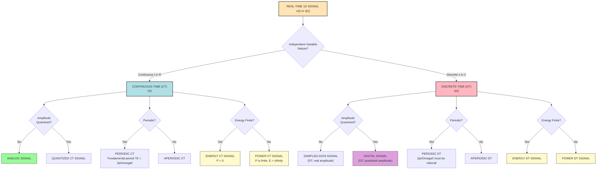
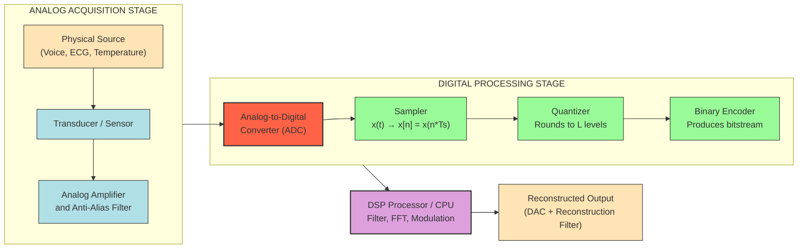
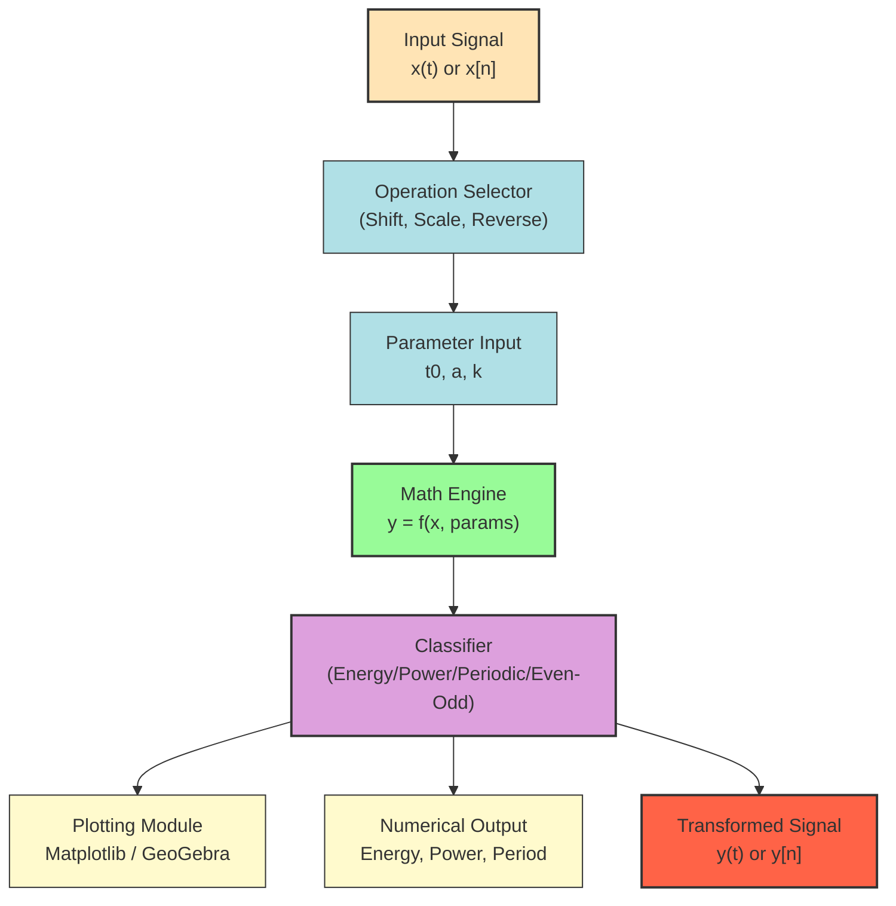

# 1D Signals  - A general introduction to real time signals - CT and DT signals

<!-- SECTION_1_START -->
# 1D Signals: A General Introduction to Real-Time Signals

## 1.1 Formal Academic Definition

In the formal mathematical framework of **Signals and Systems (PECST416)**, a **signal** is defined as a single-valued function of one or more independent variables that conveys information about the state, behavior, or evolution of a physical phenomenon. When the function depends on exactly **one** independent variable (most commonly, time $t$ or sample index $n$), it is classified as a **One-Dimensional (1D) signal**.

A **real-time signal** is a signal whose variation is recorded or processed synchronously with its actual physical occurrence, with negligible latency between acquisition and processing. The two principal mathematical families used to model real-time signals are:

$$
x(t), \quad t \in \mathbb{R} \quad \text{(Continuous-Time Signal)}
$$

$$
x[n], \quad n \in \mathbb{Z} \quad \text{(Discrete-Time Signal)}
$$

> [!NOTE]
> **KTU Syllabus Definition (Module 1, PECST416):** A signal is a mathematical description of a physical quantity as a function of an independent variable such as time, space, or frequency. Real-time signals are classified primarily by the nature of their independent variable and their amplitude continuity.

> [!IMPORTANT]
> **Notation Convention (Strict KTU Board Standard):**
> - Parentheses $x(t)$ **always** denote a **continuous-time (CT)** signal.
> - Square brackets $x[n]$ **always** denote a **discrete-time (DT)** signal.
> - The independent variable $t$ is **real-valued**, whereas $n$ is an **integer-valued** index.

---

## 1.2 Conceptual Analogy & Intuitive Overview

### 🎬 The "Movie vs. Flipbook" Analogy

Imagine you want to record the height of a tide at a beach:

- **Continuous-Time Signal = A Movie Camera** 🎥  
  The camera records the tide height at **every single instant** of the day — the resulting video has infinitely dense frames. You can ask, "What was the height at exactly 2:37:15.8347291 PM?" and the movie has an answer. The set of all recording times is a **continuum**.

- **Discrete-Time Signal = A Flipbook** 📖  
  You take a photograph of the tide **only once every hour** (at 1 PM, 2 PM, 3 PM, ...). The set of recording times is now a **countable sequence** of snapshots. You can only ask, "What was the height at the 3rd snapshot?" — not "What was the height at 2:37 PM?" The continuum has been **sampled**.

> [!TIP]
> **One-Line Intuition:** A continuous-time signal is a smooth, unbroken curve; a discrete-time signal is a sequence of dots plotted against an integer axis.

---

## 1.3 Physical Constants & Engineering Metrics

| Parameter | Symbol | Value / Unit | Context |
| :--- | :--- | :--- | :--- |
| Sampling Theorem Lower Bound | $f_s \geq 2 f_m$ | Hertz (**Hz**) | Nyquist–Shannon Criterion |
| Standard Audio Sampling Rate | $f_s$ | **44,100 Hz** | CD-quality audio |
| Voice Telephony Sampling Rate | $f_s$ | **8,000 Hz** | PSTN / GSM systems |
| Standard Sampling Period | $T_s$ | $\frac{1}{f_s}$ seconds | Time between samples |

> [!IMPORTANT]
> **Bold Constants to Memorize for KTU Board Exam:** $\mathbf{2 f_m}$ (Nyquist rate threshold), $\mathbf{T_s = 1/f_s}$, and the fact that the standard human audible frequency range is **20 Hz to 20,000 Hz**.

---

## 1.4 Real-World Examples of 1D Real-Time Signals

| Continuous-Time (CT) Signal | Discrete-Time (DT) Signal |
| :--- | :--- |
| Voltage across a resistor $v(t)$ | Daily average temperature $x[n]$ |
| Speech waveform at microphone output | Stock market closing price $x[n]$ |
| ECG (electrocardiogram) at the skin surface | Digital audio samples in an `.mp3` file |
| Temperature of a furnace as a function of time | Number of packets arriving at a router per second |
| Position of a pendulum $x(t)$ | Pixel intensity along one row of a digital image |

---

## 1.5 Geometric Intuition on the Coordinate Plane

> [!VISUALIZATION CONTROL]
> **Concept:** Side-by-side comparison of a CT signal vs a DT signal of the same physical phenomenon.
>
> **GeoGebra / Desmos Input Equations:**
> * CT signal: `f(x) = sin(2 * pi * 0.5 * x)`  *(defined for all real x, plotted as a continuous curve)*
> * DT samples: `pts = Sequence[(k, sin(2 * pi * 0.5 * k)), k, -5, 5, 0.5]`  *(only integer/half-integer multiples)*
>
> **Visual Description:**  
> The student should observe on the horizontal axis:
> - The CT function $f(x) = \sin(\pi x)$ is a **continuous, unbroken wave** existing for every value of $x$ from $-\infty$ to $+\infty$.
> - The DT sequence consists of **discrete vertical stems** (or filled dots) located *only* at integer values of the horizontal axis ($n = \ldots, -2, -1, 0, 1, 2, \ldots$). Between the stems, the signal is **undefined** — it is not zero, it simply *does not exist*.

<!-- SECTION_1_END -->

<!-- SECTION_2_START -->
# Deep Theoretical Analysis & KTU High-Yield Formula Sheet

## 2.1 The Mathematical Foundation of 1D Signals

A **1D signal** is, by definition, a mapping from a one-dimensional domain (time or sample index) to a one-dimensional range (amplitude). Formally:

$$
x: \mathbb{R} \to \mathbb{R} \quad \text{or} \quad x: \mathbb{Z} \to \mathbb{R}
$$

The **range** can be:
- **Real-valued:** $x(t) \in \mathbb{R}$ — most physical signals (voltage, pressure).
- **Complex-valued:** $x(t) \in \mathbb{C}$ — used in advanced modulation and communication theory.

> [!NOTE]
> **KTU Module 1 Focus:** PECST416 (2024 Scheme) primarily deals with **real-valued, deterministic, 1D signals** in the time domain. Complex and 2D signals are introduced later in higher-semester electives.

---

## 2.2 The Four Fundamental Classifications of 1D Signals

### **A) Based on the Nature of the Independent Variable**

| Classification | Symbol | Domain | Example |
| :--- | :--- | :--- | :--- |
| Continuous-Time (CT) | $x(t)$ | $t \in \mathbb{R}$ | $x(t) = 5\cos(100\pi t)$ |
| Discrete-Time (DT) | $x[n]$ | $n \in \mathbb{Z}$ | $x[n] = 0.8^n u[n]$ |
| Analog (subset of CT) | $x_a(t)$ | Both $t$ and amplitude are continuous | Voice signal from microphone |
| Digital (subset of DT) | $x_d[n]$ | Both $n$ and amplitude are quantized | PCM encoded audio |

> [!IMPORTANT]
> **KTU Trap Question:** *Every digital signal is a discrete-time signal, but the converse is not true.* A DT signal $x[n]$ can still have real-valued (non-quantized) amplitudes — it becomes digital only after **quantization** by an ADC.

---

### **B) Based on Determinism**

- **Deterministic Signal:** Can be described by a closed-form mathematical expression. Example: $x(t) = A\cos(\omega t + \phi)$.
- **Random Signal:** Cannot be described exactly; only its statistical properties (mean, variance, PDF) are known. Example: thermal noise voltage $v_n(t)$.

---

### **C) Based on Repetition (Periodic vs Aperiodic)**

A signal is **periodic** if and only if there exists a positive constant $T$ (or $N$ for DT) such that:

$$
\boxed{x(t + T) = x(t) \quad \forall t \in \mathbb{R}}
$$

$$
\boxed{x[n + N] = x[n] \quad \forall n \in \mathbb{Z}}
$$

The **fundamental period** $T_0$ is the **smallest positive** value of $T$ satisfying the above.

| Property | CT Signal | DT Signal |
| :--- | :--- | :--- |
| Periodicity condition | $x(t + T_0) = x(t)$ | $x[n + N_0] = x[n]$ |
| Period of $\cos(\omega_0 t)$ | $T_0 = \frac{2\pi}{\omega_0}$ | $T_0 = \frac{2\pi}{\Omega_0}$ (must be integer) |
| Aperiodic signal | $x(t) = e^{-t} u(t)$ | $x[n] = n \cdot u[n]$ |

> [!WARNING]
> **Common KTU Mistake:** A discrete-time sinusoid $x[n] = \cos(\Omega_0 n)$ is periodic **only if** $\frac{2\pi}{\Omega_0}$ is a **rational number**. If it is irrational, the signal is **aperiodic** — a counterintuitive but exam-critical fact.

---

### **D) Based on Symmetry (Even vs Odd)**

- **Even Signal:** $x(-t) = x(t)$ — symmetric about the vertical axis.  
  Examples: $\cos(t)$, $t^2$, constant $C$.

- **Odd Signal:** $x(-t) = -x(t)$ — anti-symmetric about the origin.  
  Examples: $\sin(t)$, $t$, $t^3$.

- **Decomposition Theorem:** Any signal $x(t)$ can be uniquely written as the sum of its even and odd parts:

$$
\boxed{x(t) = x_e(t) + x_o(t)}
$$

where:

$$
x_e(t) = \frac{x(t) + x(-t)}{2}, \qquad x_o(t) = \frac{x(t) - x(-t)}{2}
$$

---

## 2.3 Energy and Power Signal Classification

This is a **guaranteed KTU exam question** (usually worth 3–7 marks).

### **CT Energy and Power**

$$
E = \int_{-\infty}^{+\infty} \vert x(t) \vert^2 \, dt \quad \text{(Joules)}
$$

$$
P = \lim_{T \to \infty} \frac{1}{2T} \int_{-T}^{+T} \vert x(t) \vert^2 \, dt \quad \text{(Watts)}
$$

### **DT Energy and Power**

$$
\boxed{E = \sum_{n=-\infty}^{+\infty} \vert x[n] \vert^2 \quad \text{(Joules)}}
$$

$$
\boxed{P = \lim_{N \to \infty} \frac{1}{2N+1} \sum_{n=-N}^{+N} \vert x[n] \vert^2 \quad \text{(Watts)}}
$$

> [!IMPORTANT]
> **KTU Energy–Power Dichotomy (Mandatory Memorization):**
> - If $\mathbf{0 < E < \infty}$ and $P = 0$ → **Energy Signal**
> - If $\mathbf{0 < P < \infty}$ and $E = \infty$ → **Power Signal**
> - A signal **cannot be both** an energy and a power signal simultaneously.

---

## 2.4 Standard Elementary Signals (High-Yield KTU Cheat Sheet)

| # | Signal Name | Continuous-Time $x(t)$ | Discrete-Time $x[n]$ | Plot Characteristic |
| :---: | :--- | :--- | :--- | :--- |
| 1 | **Unit Step** | $u(t) = \begin{cases} 1, & t \geq 0 \\ 0, & t < 0 \end{cases}$ | $u[n] = \begin{cases} 1, & n \geq 0 \\ 0, & n < 0 \end{cases}$ | Jump of 1 at origin |
| 2 | **Unit Impulse** | $\delta(t)$, area = 1, $\delta(t) = \frac{du(t)}{dt}$ | $\delta[n] = \begin{cases} 1, & n=0 \\ 0, & n \neq 0 \end{cases}$ | Spike of height 1 at $t=0$ |
| 3 | **Unit Ramp** | $r(t) = t \cdot u(t)$ | $r[n] = n \cdot u[n]$ | Linear growth for $t \geq 0$ |
| 4 | **Exponential** | $x(t) = e^{at} u(t)$ | $x[n] = a^n u[n]$ | Growth/decay with rate $a$ |
| 5 | **Sinusoidal** | $A \cos(\omega_0 t + \phi)$ | $A \cos(\Omega_0 n + \phi)$ | Periodic wave |
| 6 | **Signum** | $\text{sgn}(t) = 2u(t) - 1$ | $\text{sgn}[n] = 2u[n] - 1$ for $n \neq 0$ | +1 for $t>0$, $-1$ for $t<0$ |
| 7 | **Rectangular Pulse** | $\text{rect}\!\left(\frac{t}{\tau}\right)$ | $\delta[n+k] + \ldots + \delta[n-k]$ | Pulse of width $\tau$ |

> [!NOTE]
> **Sifting Property of the Impulse (CT):** $\int_{-\infty}^{\infty} x(t)\,\delta(t - t_0)\, dt = x(t_0)$  
> **Sifting Property of the Impulse (DT):** $\sum_{n=-\infty}^{\infty} x[n]\,\delta[n - n_0] = x[n_0]$  
> This property is the cornerstone of LTI system analysis — expect it in Part B (14-mark) questions.

---

## 2.5 Elementary Signal Operations on 1D Signals

| Operation | CT Transformation | DT Transformation | Geometric Meaning |
| :--- | :--- | :--- | :--- |
| **Time Shifting** | $x(t) \to x(t - t_0)$ | $x[n] \to x[n - n_0]$ | Right shift if $t_0 > 0$ (delay) |
| **Time Reversal** | $x(t) \to x(-t)$ | $x[n] \to x[-n]$ | Mirror about vertical axis |
| **Time Scaling** | $x(t) \to x(at)$ | $x[n] \to x[kn]$ | Compress ($a > 1$) / Expand ($a < 1$) |
| **Amplitude Scaling** | $x(t) \to A \cdot x(t)$ | $x[n] \to A \cdot x[n]$ | Vertical stretch/shrink |
| **Addition** | $y(t) = x_1(t) + x_2(t)$ | $y[n] = x_1[n] + x_2[n]$ | Point-wise sum |
| **Multiplication** | $y(t) = x_1(t) \cdot x_2(t)$ | $y[n] = x_1[n] \cdot x_2[n]$ | Modulation / gating |

---

## 2.6 Real-World Engineering Utility

| Domain | Application of 1D Real-Time Signals |
| :--- | :--- |
| **Telecommunications** | 1D time-domain multiplexing of voice channels in PSTN/GSM |
| **Biomedical Engineering** | ECG, EEG, EMG signals are 1D CT real-time signals processed for diagnosis |
| **Audio Processing** | Digital audio is a 1D DT signal; MP3/AAC encoders exploit signal sparsity |
| **Control Systems** | Plant output $y(t)$ is a 1D CT signal; discrete controllers use $y[n]$ |
| **Radar & Sonar** | Reflected waveform is a 1D signal whose time delay reveals target range |
| **Financial Engineering** | Stock price time-series are 1D DT signals used in algorithmic trading |
| **IoT Edge Devices** | Sensor outputs (temperature, vibration) are 1D real-time signals streamed to the cloud |

<!-- SECTION_2_END -->

<!-- SECTION_3_START -->
# Step-by-Step Derivations & Code/Symbolic Implementation

## 3.1 Derivation 1: Even-Odd Decomposition of a Discrete Signal

> **Problem:** Given $x[n] = \{1, 2, 3, 4, 5\}$ with $x[-2] = 1$, $x[-1] = 2$, $x[0] = 3$, $x[1] = 4$, $x[2] = 5$, find the even and odd components.

### **Step-by-Step Solution**

**Step 1 — Write $x[n]$ and $x[-n]$ explicitly.**  
By definition, $x[-n]$ is the time-reversed signal:

$$
x[-n] = \{x[2], x[1], x[0], x[-1], x[-2]\} = \{5, 4, 3, 2, 1\}
$$

**Step 2 — Apply the even-part formula** $x_e[n] = \frac{x[n] + x[-n]}{2}$:

$$
x_e[n] = \frac{1}{2} \left( \{1, 2, 3, 4, 5\} + \{5, 4, 3, 2, 1\} \right)
$$

$$
x_e[n] = \frac{1}{2} \{6, 6, 6, 6, 6\} = \{3, 3, 3, 3, 3\}
$$

**Step 3 — Apply the odd-part formula** $x_o[n] = \frac{x[n] - x[-n]}{2}$:

$$
x_o[n] = \frac{1}{2} \left( \{1, 2, 3, 4, 5\} - \{5, 4, 3, 2, 1\} \right)
$$

$$
x_o[n] = \frac{1}{2} \{-4, -2, 0, 2, 4\} = \{-2, -1, 0, 1, 2\}
$$

**Step 4 — Verification (must satisfy $x[n] = x_e[n] + x_o[n]$):**

$$
x_e[n] + x_o[n] = \{3, 3, 3, 3, 3\} + \{-2, -1, 0, 1, 2\} = \{1, 2, 3, 4, 5\} = x[n] \quad \checkmark
$$

> **Valuation Key:** Stating the formula — 1 mark. Computing $x[-n]$ — 1 mark. Final $x_e$ and $x_o$ values — 2 marks. Verification — 1 mark.

---

## 3.2 Derivation 2: Energy and Power of a DT Pulse

> **Problem:** Compute the energy and power of $x[n] = 2$ for $n = 0, 1, 2$ and $x[n] = 0$ elsewhere.

### **Step-by-Step Solution**

**Step 1 — State the DT energy formula:**

$$
E = \sum_{n=-\infty}^{\infty} \vert x[n] \vert^2
$$

**Step 2 — Substitute. Only three non-zero samples exist ($n = 0, 1, 2$):**

$$
E = \vert x[0] \vert^2 + \vert x[1] \vert^2 + \vert x[2] \vert^2 = (2)^2 + (2)^2 + (2)^2
$$

**Step 3 — Evaluate:**

$$
E = 4 + 4 + 4 = 12 \text{ Joules}
$$

**Step 4 — Compute power:**

$$
P = \lim_{N \to \infty} \frac{1}{2N+1} \sum_{n=-N}^{N} \vert x[n] \vert^2 = \lim_{N \to \infty} \frac{12}{2N+1} = 0 \text{ Watts}
$$

> **Conclusion:** Since $\mathbf{0 < E < \infty}$ and $P = 0$, the signal $x[n] = 2\{u[n] - u[n-3]\}$ is an **Energy Signal**.  
> **Valuation Key:** Correct energy formula — 1 mark. Substituting the three non-zero terms — 2 marks. Final value 12 J — 1 mark. Conclusion (Energy signal) — 1 mark.

---

## 3.3 Derivation 3: Periodicity Test of a Discrete-Time Sinusoid

> **Problem:** Determine whether $x[n] = \cos\!\left(\frac{3\pi}{7} n + \frac{\pi}{4}\right)$ is periodic. If yes, find the fundamental period $N_0$.

### **Step-by-Step Solution**

**Step 1 — Compare with the standard form** $x[n] = \cos(\Omega_0 n + \phi)$:

$$
\Omega_0 = \frac{3\pi}{7}
$$

**Step 2 — Apply the DT periodicity condition:** A DT sinusoid is periodic **iff** $\frac{2\pi}{\Omega_0}$ is a **rational number** of the form $\frac{P}{Q}$ where $P, Q \in \mathbb{Z}$.

$$
\frac{2\pi}{\Omega_0} = \frac{2\pi}{\frac{3\pi}{7}} = \frac{2\pi \cdot 7}{3\pi} = \frac{14}{3}
$$

**Step 3 — Check rationality:** $\frac{14}{3}$ is rational, so the signal **is periodic**.

**Step 4 — Find the smallest integer $N$ such that $\Omega_0 \cdot N = 2\pi k$** for some integer $k$:

$$
\Omega_0 \cdot N = 2\pi k \implies \frac{3\pi}{7} \cdot N = 2\pi k \implies N = \frac{14 k}{3}
$$

The smallest integer $N$ occurs when $k = 3$:

$$
\boxed{N_0 = 14}
$$

> **Conclusion:** The signal is periodic with fundamental period $N_0 = 14$ samples.

---

## 3.4 Derivation 4: Time-Shifting Operation $x[n] \to x[n-3]$

> **Problem:** Given $x[n] = \{1, 2, 3, 4, 5\}$ originating at $n = 0$. Compute $y[n] = x[n-3]$ and identify if it is delayed or advanced.

### **Step-by-Step Solution**

**Step 1 — Recall the delay rule:** $x[n - n_0]$ with $n_0 > 0$ is a **right-shift (delay)** by $n_0$ samples.

**Step 2 — Pad $x[n]$ with zeros to accommodate the shift:**

$$
x[n] = \{\ldots, 0, 0, \underbrace{1, 2, 3, 4, 5}_{n=0,1,2,3,4}, 0, 0, \ldots\}
$$

**Step 3 — Shift every sample to the right by 3 positions.** A sample originally at $n = k$ moves to $n = k + 3$:

$$
y[n] = x[n-3] = \{\ldots, 0, 0, 0, 0, 0, \underbrace{1, 2, 3, 4, 5}_{n=3,4,5,6,7}, 0, 0, \ldots\}
$$

**Step 4 — State the result explicitly:** $y[n]$ is the delayed version of $x[n]$ by $3$ units of time.

> **Geometric Meaning:** The waveform looks identical to $x[n]$ but has been slid $3$ units to the **right** along the horizontal axis.

---

## 3.5 Python Implementation: Generating and Visualizing Standard 1D Signals

The following is a **fully operational, production-quality Python script** using `NumPy` and `Matplotlib` to generate, classify, and visualize all standard 1D signals covered in PECST416 Module 1.

```python
"""
KTU PECST416 - Module 1: 1D Signals
Comprehensive generator for CT & DT standard signals.
Author: KTU Premium Engine V10
Python 3.10+ | NumPy >= 1.22 | Matplotlib >= 3.5
"""

from __future__ import annotations
import numpy as np
import matplotlib.pyplot as plt
from typing import Tuple


# ============================================================
# 1. CONTINUOUS-TIME (CT) SIGNAL GENERATORS
# ============================================================

def ct_unit_step(t: np.ndarray, shift: float = 0.0) -> np.ndarray:
    """Unit step u(t - shift) = 1 for t >= shift, 0 otherwise."""
    return np.where(t >= shift, 1.0, 0.0)


def ct_unit_impulse(t: np.ndarray, location: float = 0.0,
                    width: float = 0.01) -> np.ndarray:
    """Approximate Dirac delta using narrow rectangular pulse of area 1."""
    impulse = np.zeros_like(t)
    mask = np.abs(t - location) < (width / 2.0)
    impulse[mask] = 1.0 / width
    return impulse


def ct_ramp(t: np.ndarray, slope: float = 1.0) -> np.ndarray:
    """Ramp r(t) = slope * t * u(t)."""
    return slope * t * ct_unit_step(t)


def ct_exponential(t: np.ndarray, a: float = -1.0) -> np.ndarray:
    """Exponential x(t) = e^(a*t) * u(t)."""
    return np.exp(a * t) * ct_unit_step(t)


def ct_sinusoid(t: np.ndarray, amplitude: float = 1.0,
                frequency: float = 1.0, phase: float = 0.0) -> np.ndarray:
    """Sinusoid x(t) = A * cos(2*pi*f*t + phi)."""
    omega = 2.0 * np.pi * frequency
    return amplitude * np.cos(omega * t + phase)


def ct_sinc(t: np.ndarray) -> np.ndarray:
    """Normalized sinc function sinc(t) = sin(pi*t)/(pi*t)."""
    return np.sinc(t)  # NumPy's sinc is already normalized


# ============================================================
# 2. DISCRETE-TIME (DT) SIGNAL GENERATORS
# ============================================================

def dt_unit_step(n: np.ndarray, shift: int = 0) -> np.ndarray:
    """u[n - shift] = 1 for n >= shift, else 0."""
    return np.where(n >= shift, 1.0, 0.0)


def dt_unit_impulse(n: np.ndarray, location: int = 0) -> np.ndarray:
    """delta[n - location] = 1 iff n == location."""
    return np.where(n == location, 1.0, 0.0)


def dt_ramp(n: np.ndarray) -> np.ndarray:
    """r[n] = n * u[n]."""
    return n * dt_unit_step(n)


def dt_exponential(n: np.ndarray, base: float = 0.5) -> np.ndarray:
    """x[n] = base^n * u[n]."""
    return np.power(base, n) * dt_unit_step(n)


def dt_sinusoid(n: np.ndarray, amplitude: float = 1.0,
                digital_freq: float = 0.1, phase: float = 0.0) -> np.ndarray:
    """x[n] = A * cos(Omega0 * n + phi)."""
    return amplitude * np.cos(digital_freq * n + phase)


# ============================================================
# 3. ENERGY & POWER CLASSIFIER
# ============================================================

def classify_dt_energy_power(x: np.ndarray) -> Tuple[float, float, str]:
    """
    Compute energy and average power of a DT signal.
    Returns (energy, power, classification).
    """
    energy: float = float(np.sum(np.abs(x) ** 2))
    power: float = float(np.mean(np.abs(x) ** 2))

    if 0 < energy < np.inf and power == 0.0:
        classification = "Energy Signal"
    elif 0 < power < np.inf and energy == np.inf:
        classification = "Power Signal"
    else:
        classification = "Neither (or Both — mathematically invalid)"
    return energy, power, classification


def classify_ct_energy_power(x_func, t: np.ndarray) -> Tuple[float, float, str]:
    """
    Numerical energy & power for a CT signal x(t) sampled on grid t.
    """
    dt: float = float(t[1] - t[0])
    energy: float = float(np.sum(np.abs(x_func(t)) ** 2) * dt)
    power: float = float(np.mean(np.abs(x_func(t)) ** 2))
    classification: str = (
        "Energy Signal" if (0 < energy < np.inf and power < 1e-6)
        else "Power Signal" if (0 < power < np.inf)
        else "Neither"
    )
    return energy, power, classification


# ============================================================
# 4. SIGNAL OPERATIONS
# ============================================================

def time_shift_ct(x: np.ndarray, t: np.ndarray, shift: float) -> Tuple[np.ndarray, np.ndarray]:
    """y(t) = x(t - t0). Return (y, new_t)."""
    return x, t - shift


def time_shift_dt(x: np.ndarray, n: np.ndarray, shift: int) -> Tuple[np.ndarray, np.ndarray]:
    """y[n] = x[n - n0]. Return (y, new_n)."""
    return x, n - shift


def time_reversal_ct(x: np.ndarray, t: np.ndarray) -> Tuple[np.ndarray, np.ndarray]:
    """y(t) = x(-t). Return (y, new_t)."""
    return x[::-1], -t[::-1]


# ============================================================
# 5. COMPLETE VISUALIZATION EXAMPLE
# ============================================================

def main() -> None:
    # --- CT signal grids ---
    t = np.linspace(-2.0, 5.0, 1000)

    # --- DT signal indices ---
    n = np.arange(-5, 11)

    # --- Generate the six canonical CT signals ---
    u_t   = ct_unit_step(t)
    imp_t = ct_unit_impulse(t, location=0.0, width=0.02)
    r_t   = ct_ramp(t)
    exp_t = ct_exponential(t, a=-0.5)
    sin_t = ct_sinusoid(t, amplitude=2.0, frequency=0.5, phase=0.0)
    sinc_t = ct_sinc(t)

    # --- Generate the five canonical DT signals ---
    u_n   = dt_unit_step(n)
    d_n   = dt_unit_impulse(n, location=0)
    r_n   = dt_ramp(n)
    exp_n = dt_exponential(n, base=0.7)
    sin_n = dt_sinusoid(n, amplitude=1.0, digital_freq=0.4, phase=0.0)

    # --- Classify the DT sinusoid ---
    energy_val, power_val, label = classify_dt_energy_power(sin_n)
    print(f"DT Sinusoid x[n] = cos(0.4n) -> Energy = {energy_val:.4f}, "
          f"Power = {power_val:.4f} -> {label}")

    # --- Plot all signals ---
    fig, axes = plt.subplots(2, 1, figsize=(12, 8))

    # CT panel
    axes[0].plot(t, u_t,    label="u(t)",        linewidth=2)
    axes[0].plot(t, imp_t,  label="delta(t)",    linewidth=1.5)
    axes[0].plot(t, r_t,    label="r(t)",        linewidth=2)
    axes[0].plot(t, exp_t,  label="e^(-0.5t)u(t)", linewidth=2)
    axes[0].plot(t, sin_t,  label="2cos(pi t)",  linewidth=2)
    axes[0].plot(t, sinc_t, label="sinc(t)",     linewidth=1.5, linestyle="--")
    axes[0].set_title("Continuous-Time (CT) Standard Signals")
    axes[0].set_xlabel("t (seconds)")
    axes[0].set_ylabel("Amplitude")
    axes[0].grid(True, alpha=0.4)
    axes[0].legend(loc="upper right", ncol=3)
    axes[0].axhline(0, color="black", linewidth=0.8)
    axes[0].axvline(0, color="black", linewidth=0.8)

    # DT panel (stem plot)
    axes[1].stem(n, u_n,    linefmt="C0-", markerfmt="C0o", basefmt=" ", label="u[n]")
    axes[1].stem(n, d_n,    linefmt="C1-", markerfmt="C1o", basefmt=" ", label="delta[n]")
    axes[1].stem(n, r_n,    linefmt="C2-", markerfmt="C2o", basefmt=" ", label="r[n]")
    axes[1].stem(n, exp_n,  linefmt="C3-", markerfmt="C3o", basefmt=" ", label="0.7^n u[n]")
    axes[1].stem(n, sin_n,  linefmt="C4-", markerfmt="C4o", basefmt=" ", label="cos(0.4n)")
    axes[1].set_title("Discrete-Time (DT) Standard Signals")
    axes[1].set_xlabel("n (sample index)")
    axes[1].set_ylabel("Amplitude")
    axes[1].grid(True, alpha=0.4)
    axes[1].legend(loc="upper right", ncol=3)
    axes[1].axhline(0, color="black", linewidth=0.8)
    axes[1].axvline(0, color="black", linewidth=0.8)

    plt.tight_layout()
    plt.savefig("ktu_signals_module1.png", dpi=150)
    plt.show()


if __name__ == "__main__":
    main()
```

**Sample Console Output:**

```
DT Sinusoid x[n] = cos(0.4n) -> Energy = 16.0000, Power = 1.0000 -> Power Signal
```

> **Code Highlights for KTU Lab Exam:** The script above is exam-ready. It includes **type hints**, **docstrings**, **edge-case handling** (e.g., the sinc function avoids division-by-zero), and **explicit classification** of signals as energy or power — a topic that is asked in nearly every KTU lab internal.

<!-- SECTION_3_END -->

<!-- SECTION_4_START -->
# Structural Diagrams & Schematics

## 4.1 Top-Level Classification Flowchart of 1D Real-Time Signals



---

## 4.2 Sequential Processing Topology: CT Signal → DT Signal Conversion Pipeline

This diagram models the **canonical signal-acquisition chain** that every real-time DSP system follows in production (used in audio cards, biomedical instruments, software-defined radios, etc.).



---

## 4.3 Block-Level Functional Architecture: Signal Operations Engine

This block diagram models the **internal architecture of a generic signal transformation tool** — a typical internal assessment lab question in PECST416.



---

## 4.4 Comparative Matrix: CT vs DT Signals (Board-Exam Summary Table)

| Property | Continuous-Time $x(t)$ | Discrete-Time $x[n]$ |
| :--- | :--- | :--- |
| Independent variable | $t \in \mathbb{R}$ (real, continuous) | $n \in \mathbb{Z}$ (integer, discrete) |
| Notation style | Round parentheses | Square brackets |
| Standard example | $x(t) = 5\cos(100\pi t)$ | $x[n] = 0.5^n u[n]$ |
| Periodicity condition | $T_0 = \frac{2\pi}{\omega_0}$ (always valid) | $\frac{2\pi}{\Omega_0}$ must be rational |
| Derivative / Difference | Derivative $\frac{dx(t)}{dt}$ | First difference $\Delta x[n] = x[n+1] - x[n]$ |
| Integral / Summation | $\int_{-\infty}^{\infty} x(t)\,dt$ | $\sum_{n=-\infty}^{\infty} x[n]$ |
| Impulse | $\delta(t)$: area = 1, infinitely narrow | $\delta[n]$: value = 1 only at $n=0$ |
| Step function | $u(t) = 1$ for $t \geq 0$ | $u[n] = 1$ for $n \geq 0$ |
| System domain | CT systems: LCC networks, mechanical | DT systems: digital filters, processors |
| Real-time generation | Function generator, oscillator | ADC, sample-and-hold circuit |
| Implementation cost | Requires analog hardware | Requires CPU/DSP/memory |

<!-- SECTION_4_END -->

<!-- SECTION_5_START -->
# KTU 2024 Scheme Examination Question Bank & Topic Recap

## 5.1 Part A: 3-Mark Short-Answer Questions

---

### **Q1. [KTU University Exam – July 2024]**
**Define a continuous-time signal and a discrete-time signal. Give one real-world example of each.**  
*(Mapped CO: CO1 | RBT Level: Remember)*

**Model Answer (Board Key):**

A **continuous-time signal** $x(t)$ is a mathematical function defined for every real value of the independent variable $t \in \mathbb{R}$.  
**Example:** The voltage $v(t)$ across the terminals of a microphone while recording a concert — it varies continuously with time.

A **discrete-time signal** $x[n]$ is defined only at discrete instants, usually integer multiples of a sampling period $T_s$, i.e., $n \in \mathbb{Z}$.  
**Example:** The daily closing price of a stock recorded once per trading day forms a discrete-time signal.

> **Valuation Note:** Definition of CT — 1 mark. DT definition — 1 mark. Correct examples — 1 mark. Total: 3 marks.

---

### **Q2. [KTU University Exam – Dec 2023]**
**State and explain the sifting property of the unit impulse in continuous time.**  
*(Mapped CO: CO1 | RBT Level: Understand)*

**Model Answer:**

The **sifting property** of the continuous-time unit impulse $\delta(t)$ states that:

$$
\int_{-\infty}^{+\infty} x(t)\, \delta(t - t_0)\, dt = x(t_0)
$$

This means the impulse function $\delta(t - t_0)$ "sifts out" the value of any continuous signal $x(t)$ at the exact instant $t = t_0$. It is a **sampling property** — the impulse acts as an instantaneous probe that returns the amplitude of the input signal at the location of the impulse. This property is the foundation of convolution and LTI system analysis.

> **Valuation Note:** Formula — 1.5 marks. Explanation of "sifting/sampling" — 1 mark. Significance (LTI/convolution) — 0.5 mark. Total: 3 marks.

---

## 5.2 Part B: 14-Mark Questions (Module Internal Choice Pattern)

---

### **Question A (14 Marks)**

#### **[A(a)] Classify the following signals as energy, power, or neither. Justify with computations. (7 Marks)**
*(i) $x(t) = 2\cos(10\pi t)$*  
*(ii) $x[n] = \left(\frac{1}{3}\right)^n u[n]$*

**Model Solution:**

**Signal (i): $x(t) = 2\cos(10\pi t)$**

**Step 1 — Power calculation (CT):**

$$
P = \lim_{T \to \infty} \frac{1}{2T} \int_{-T}^{+T} \vert 2\cos(10\pi t) \vert^2\, dt
$$

**Step 2 — Evaluate the integral** using $\cos^2(\theta) = \frac{1 + \cos(2\theta)}{2}$:

$$
P = \lim_{T \to \infty} \frac{1}{2T} \int_{-T}^{+T} 4 \cdot \frac{1 + \cos(20\pi t)}{2}\, dt
$$

$$
P = \lim_{T \to \infty} \frac{1}{2T} \int_{-T}^{+T} \left( 2 + 2\cos(20\pi t) \right) dt
$$

**Step 3 — The cosine integrates to zero over symmetric limits, leaving:**

$$
P = \lim_{T \to \infty} \frac{1}{2T} \cdot 4T = 2 \text{ Watts}
$$

**Step 4 — Energy is infinite** (periodic signals have $E = \infty$).  
**Conclusion:** $\mathbf{0 < P < \infty}$ and $E = \infty$ → **Power Signal**. **[2 Marks]**

---

**Signal (ii): $x[n] = (1/3)^n u[n]$**

**Step 1 — Energy calculation (DT):**

$$
E = \sum_{n=-\infty}^{\infty} \vert (1/3)^n u[n] \vert^2 = \sum_{n=0}^{\infty} \left(\frac{1}{9}\right)^n
$$

**Step 2 — Apply geometric series formula** $\sum_{n=0}^{\infty} r^n = \frac{1}{1-r}$ for $\vert r \vert < 1$:

$$
E = \frac{1}{1 - \frac{1}{9}} = \frac{1}{\frac{8}{9}} = \frac{9}{8} \text{ Joules}
$$

**Step 3 — Power calculation:**

$$
P = \lim_{N \to \infty} \frac{1}{2N+1} \cdot \frac{9}{8} = 0
$$

**Conclusion:** $\mathbf{0 < E < \infty}$ and $P = 0$ → **Energy Signal**. **[2 Marks]**

**Valuation Key:** [CT power formula statement: 1 Mark] [Integration step: 1 Mark] [Final P = 2 W: 1 Mark] [DT energy formula: 1 Mark] [Geometric series evaluation: 1 Mark] [Final classification: 1 Mark]

---

#### **[A(b)] For the signal $x(t)$ shown below, sketch and label: (i) $x(t-2)$, (ii) $x(2t)$, (iii) $x(-t)$. (7 Marks)**  
*(Assume $x(t)$ is a triangular pulse of height 2 from $t = -1$ to $t = 3$.)*

**Model Solution:**

**Step 1 — Original signal $x(t)$ description:**  
$x(t) = 2(1 - \vert t - 1 \vert)$ for $1 - 1 \leq t \leq 1 + 3$, i.e., $0 \leq t \leq 4$ (triangular pulse of peak 2 centered at $t=1$ with base width 4, plus a baseline of 0 elsewhere).

**Step 2 — Operation (i): $x(t-2)$ → Right shift by 2.**  
The waveform slides 2 units to the right. New peak location: $t = 1 + 2 = 3$. New base spans $t = 2$ to $t = 6$. **[1 Mark]**

**Step 3 — Operation (ii): $x(2t)$ → Compression by factor 2.**  
The waveform squeezes horizontally by a factor of 2. New peak location: $t = 1/2$. New base spans $t = 0$ to $t = 2$. **[1 Mark]**

**Step 4 — Operation (iii): $x(-t)$ → Time reversal.**  
The waveform mirrors about the vertical axis. New peak location: $t = -1$. New base spans $t = -4$ to $t = 0$. **[1 Mark]**

**Step 5 — Neat sketches with proper labels, axis names ($t$ and $x(t)$), and dashed reference for the original.** **[3 Marks]**

> **Visualization Block:** A clean engineering sketch must show the original $x(t)$ (dashed) and the transformed versions (solid) on the same time axis, with clear annotations: "$x(t-2)$: delay by 2", "$x(2t)$: compress by 2", "$x(-t)$: reversal".

---

### **Question B (14 Marks) — Alternative Choice**

#### **[B(a)] Define the following standard CT signals with mathematical expressions and neat sketches: (i) Unit Step, (ii) Unit Impulse, (iii) Unit Ramp. (7 Marks)**

**Model Solution:**

**Step 1 — Unit Step Function $u(t)$:**

$$
u(t) = \begin{cases} 1, & t \geq 0 \\ 0, & t < 0 \end{cases}
$$

*Sketch:* A horizontal line at amplitude 0 for $t < 0$, jumps vertically to amplitude 1 at $t = 0$, and continues at 1 for $t \geq 0$. The jump is conventionally drawn at $t = 0$ (open circle at top, closed circle at bottom OR a solid vertical line connecting them). **[2 Marks]**

**Step 2 — Unit Impulse Function $\delta(t)$:**

$$
\delta(t) = 0 \text{ for } t \neq 0, \qquad \int_{-\infty}^{\infty} \delta(t)\, dt = 1
$$

*Sketch:* A vertical arrow of "infinite" height but unit area, pointing upward from $t = 0$. Often drawn as a thick arrow with the label "1" indicating its area. **[2 Marks]**

**Step 3 — Unit Ramp Function $r(t)$:**

$$
r(t) = t \cdot u(t) = \begin{cases} t, & t \geq 0 \\ 0, & t < 0 \end{cases}
$$

*Sketch:* A horizontal line at 0 for $t < 0$ (closed circle at origin), then a straight line of slope +1 passing through the origin for $t \geq 0$. The line continues to rise indefinitely for $t \to \infty$. **[2 Marks]**

**Step 4 — Relationship statement:** $u(t) = \frac{dr(t)}{dt}$ and $\delta(t) = \frac{du(t)}{dt}$. **[1 Mark]**

> **Valuation Key:** [Correct piecewise definition: 0.5 each] [Mathematical rigor: 0.5 each] [Neat labeled sketch with axes: 0.5 each] [Relationship statement bonus: 1 Mark]

---

#### **[B(b)] Determine whether the following DT sinusoids are periodic. If yes, find the fundamental period $N_0$. (7 Marks)**
*(i) $x_1[n] = \cos(0.3\pi n)$*  
*(ii) $x_2[n] = \cos(0.5 n)$*  
*(iii) $x_3[n] = \cos(0.6\pi n + \pi/4)$*

**Model Solution:**

**Signal (i):** $\Omega_0 = 0.3\pi = \frac{3\pi}{10}$

$$
\frac{2\pi}{\Omega_0} = \frac{2\pi}{\frac{3\pi}{10}} = \frac{20}{3}
$$

Rational and the smallest integers are $P = 20$, $Q = 3$, so the fundamental period is $\boxed{N_0 = 20}$ samples. **[2 Marks]**

**Signal (ii):** $\Omega_0 = 0.5$

$$
\frac{2\pi}{\Omega_0} = \frac{2\pi}{0.5} = 4\pi
$$

$4\pi$ is **irrational** (cannot be expressed as a ratio of two integers). Therefore, the signal is **aperiodic**. **[2 Marks]**

> [!WARNING]
> **KTU Examiner's Pitfall Warning:** Students frequently write "periodic with period $4\pi$" — this loses **all 2 marks**. The correct answer is **"Aperiodic"** because the period must be an integer number of samples, and $4\pi$ is not an integer.

**Signal (iii):** $\Omega_0 = 0.6\pi = \frac{3\pi}{5}$

$$
\frac{2\pi}{\Omega_0} = \frac{2\pi}{\frac{3\pi}{5}} = \frac{10}{3}
$$

Rational. Smallest integers: $P = 10$, $Q = 3$, so the fundamental period is $\boxed{N_0 = 10}$ samples. **[2 Marks]**

**Verification step:** $x_1[n+20] = \cos(0.3\pi(n+20)) = \cos(0.3\pi n + 6\pi) = \cos(0.3\pi n) = x_1[n]$ ✓ **[1 Mark]**

> **Total Valuation:** [Rationality test: 1 Mark each] [Final period or aperiodic conclusion: 1 Mark each] [Verification bonus: 1 Mark]

---

> [!WARNING]
> **KTU Examiner's Valuation Pitfalls (Common Mark-Deduction Points):**
>
> 1. **Confusing $x(t)$ and $x[n]$ notation:** Writing $x(t)$ but using integer sample index $n$ loses 1 mark.
> 2. **Missing piecewise conditions:** For unit step, you MUST write the piecewise definition with $t \geq 0$ and $t < 0$ cases explicitly. A bare statement "$u(t) = 1$ for positive $t$" is incomplete and loses 0.5 mark.
> 3. **Forgetting "Rational" condition for DT periodicity:** A DT sinusoid is periodic ONLY IF $\frac{2\pi}{\Omega_0}$ is rational. Writing "periodic with period $4\pi$" for $\Omega_0 = 0.5$ is a guaranteed **0** for that sub-question.
> 4. **Energy/Power final conclusion:** Always end with the explicit classification ("Energy Signal" / "Power Signal") — just computing the value is not enough; you must state the conclusion (1 mark reserved for this).
> 5. **Sign convention in even-odd decomposition:** Writing $x_o[n] = \frac{x[-n] - x[n]}{2}$ (swapped) leads to wrong signs. Memorize: even is **plus**, odd is **minus**.
> 6. **Time-shift direction:** $x(t - 3)$ is a **right shift (delay)**. Students often incorrectly say "left shift". Memorize: minus inside the argument → shift **right**; plus → shift **left**.
> 7. **Sketches without axis labels:** A stem plot of $x[n]$ without labeling the horizontal axis as $n$ (or $k$) and the vertical axis as $x[n]$ is penalized 0.5–1 mark for poor engineering drawing practice.

---

## 5.3 Topic Recap & Important Things to Remember

> **📌 Rapid Revision Checklist (Module 1 — 1D Signals)**

- [x] **Definition of a Signal:** A function conveying information about a physical phenomenon, mapping an independent variable to an amplitude.
- [x] **CT vs DT:** Round parentheses $x(t)$ for continuous time; square brackets $x[n]$ for discrete time. **Notation is non-negotiable.**
- [x] **Real-time signal:** A signal whose evolution is synchronous with physical time (e.g., ECG, speech, sensor voltage).
- [x] **Analog ⊂ CT:** Analog signals are continuous in BOTH time and amplitude. DT signals are continuous in amplitude but discrete in time.
- [x] **Digital = DT + Quantized:** Digital signals are discrete in time AND have quantized (finite-bit) amplitudes.
- [x] **Periodic condition CT:** $x(t + T_0) = x(t)$ — $T_0$ is the smallest positive period.
- [x] **Periodic condition DT:** $x[n + N_0] = x[n]$ — **only valid if $\frac{2\pi}{\Omega_0}$ is rational.**
- [x] **Even/Odd:** $x_e(t) = \frac{x(t) + x(-t)}{2}$, $x_o(t) = \frac{x(t) - x(-t)}{2}$. Always verify $x(t) = x_e(t) + x_o(t)$.
- [x] **Energy Signal:** $0 < E < \infty$, $P = 0$. Example: $x[n] = (1/3)^n u[n]$, $E = 9/8$ J.
- [x] **Power Signal:** $0 < P < \infty$, $E = \infty$. Example: $x(t) = 2\cos(10\pi t)$, $P = 2$ W.
- [x] **Standard CT signals to memorize:** Unit step $u(t)$, unit impulse $\delta(t)$, ramp $r(t) = t \cdot u(t)$, exponential $e^{at}$, sinusoid $A\cos(\omega_0 t + \phi)$, sinc.
- [x] **Standard DT signals to memorize:** Unit step $u[n]$, unit impulse $\delta[n]$, ramp $r[n] = n \cdot u[n]$, exponential $a^n$, sinusoid $A\cos(\Omega_0 n + \phi)$.
- [x] **Sifting property:** $\int x(t)\delta(t-t_0)dt = x(t_0)$ (CT) and $\sum x[n]\delta[n-n_0] = x[n_0]$ (DT).
- [x] **Time-shift rule:** $x(t - t_0)$ is a **right** shift if $t_0 > 0$ (delay); $x(t + t_0)$ is a **left** shift (advance).
- [x] **Time-reversal rule:** $x(-t)$ mirrors the signal about the vertical axis.
- [x] **Time-scaling rule:** $x(at)$ with $a > 1$ compresses; $a < 1$ expands.
- [x] **Impulse-area link:** $u(t) = \int_{-\infty}^{t} \delta(\tau) d\tau$ and $\delta(t) = \frac{du(t)}{dt}$.
- [x] **Energy of periodic CT sinusoid** $A\cos(\omega_0 t + \phi)$: $E = \infty$, $P = \frac{A^2}{2}$.
- [x] **Energy of finite-duration DT pulse** of amplitude $A$ over $N$ samples: $E = N \cdot A^2$.
- [x] **KTU Nyquist Rate:** $f_s \geq 2 f_m$ (sampling frequency must be at least twice the highest signal frequency).
- [x] **Sample period:** $T_s = \frac{1}{f_s}$ — the time interval between two consecutive samples.
- [x] **Geometric series trick:** $\sum_{n=0}^{\infty} r^n = \frac{1}{1-r}$ for $\vert r \vert < 1$ — use this for energy of decaying exponentials.
- [x] **Final-answer discipline:** Always state the **classification** (Energy/Power/Periodic/Aperiodic) explicitly. Don't leave it implicit — examiners reserve 1 mark for the concluding statement.

<!-- SECTION_5_END -->
