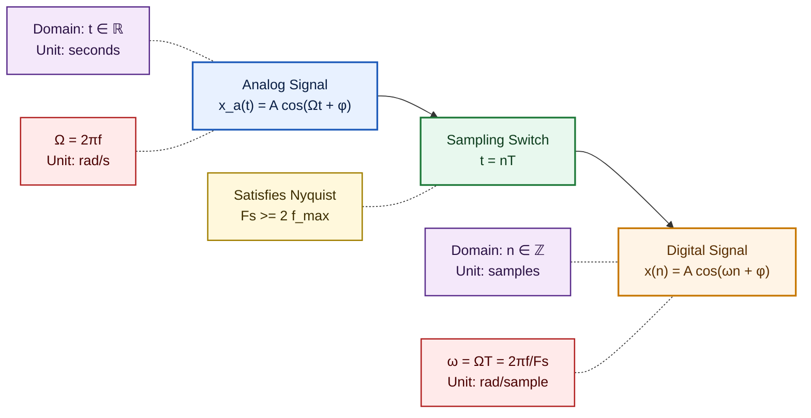
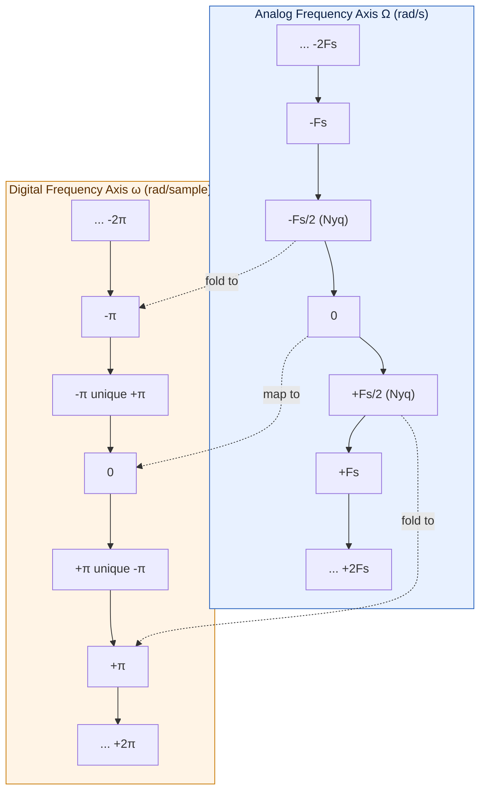

# Analog frequency and Digital frequency.

<!-- SECTION_1_START -->
# Analog Frequency and Digital Frequency

## Formal KTU 2024 Definition

> [!IMPORTANT]
> **Analog Frequency ($\Omega$ or $f$):** It is the rate of oscillation of a **Continuous-Time (CT) signal** measured in **radians per second ($\Omega$)** or **Hertz ($f$)**, where $f$ denotes the number of cycles completed in one second. It is an **infinite-resolution, physical-world parameter** tied directly to time in seconds.

> [!IMPORTANT]
> **Digital Frequency ($\omega$ or $F$):** It is the rate of oscillation of a **Discrete-Time (DT) signal** measured in **radians per sample ($\omega$)** or **cycles per sample ($F$)**. Since discrete signals are indexed by an integer sample number $n$ (not seconds), frequency is defined *relative to the sampling instant* rather than absolute wall-clock time.

The fundamental relationship that links these two worlds is the **Sampling Theorem** parameterization, expressed in its board-favorite form:

$$\omega = \Omega \, T = 2\pi \frac{f}{F_s}$$

where $T$ is the sampling period in seconds and $F_s = \frac{1}{T}$ is the sampling frequency in Hertz.

---

## Conceptual Analogy / Intuition

> [!NOTE]
> **Think of a turnstile (subway gate):**
> - **Analog frequency** is like measuring **"how fast a wheel spins in real-time"** — e.g., *120 revolutions per minute*. You can have any fractional value: 120.5, 120.55, etc.
> - **Digital frequency** is like counting **"how many spokes the wheel advances per step of the turnstile"** — e.g., *0.25 spoke per click*. The value is bounded because the wheel only has so many spokes before it *looks the same* (periodic).
>
> 🔑 **Key insight:** Digital frequency is **always bounded and periodic** ($2\pi$ periodicity for $\omega$, $1$ for $F$), whereas analog frequency is **unbounded and aperiodic**.

### Physical Constants & Standard Metrics

- **Sampling Frequency ($F_s$):** The number of samples taken per second, typically in **Hz** or **kHz**.
- **Nyquist Frequency ($F_{Nyq}$):** Equals $\frac{F_s}{2}$, the **maximum unique analog frequency** that can be reconstructed from samples without aliasing.
- **Normalized Frequency ($F$):** Defined as $\frac{f}{F_s}$, dimensionless, lies in $[-0.5, 0.5]$.

> [!VISUALIZATION CONTROL]
> **Concept:** Sinusoid with the same analog frequency sampled at three different rates.
> **GeoGebra / Desmos Input Equations:**
> * `f_analog(t) = sin(2 * pi * 5 * t)` — an analog 5 Hz sine wave
> * `f_digital_8k(n) = sin(2 * pi * 5 * n / 8000)` — sampled at $F_s = 8000$ Hz
> * `f_digital_20k(n) = sin(2 * pi * 5 * n / 20000)` — sampled at $F_s = 20000$ Hz
> **Visual Description:** Plot all three over a 1-second window. Notice that as $F_s$ decreases, the discrete plot becomes sparser, but the *shape* of each sample matches the analog curve at sample instants. The discrete signal's "shape" depends on the **ratio** $\frac{f}{F_s}$, not on $f$ alone.

<!-- SECTION_1_END -->

<!-- SECTION_2_START -->
# Deep Theoretical Analysis & KTU High-Yield Formula Sheet

## 1. Mathematical Foundation

A continuous-time sinusoid is written as:
$$x_a(t) = A \cos(\Omega t + \phi)$$

When sampled at instants $t = nT$, the corresponding discrete-time sinusoid becomes:
$$x(n) = x_a(nT) = A \cos(\Omega n T + \phi) = A \cos(\omega n + \phi)$$

This substitution is the **sampling bridge**: every analog parameter $\Omega t$ is replaced by the dimensionless product $\omega n$. Because $n$ is a unitless integer, $\omega$ must be unitless (radians) and $\Omega$ must carry the inverse-second dimension.

## 2. Why Digital Frequency is Bounded

> [!NOTE]
> The cosine function is $2\pi$-periodic:
> $$\cos(\omega n) = \cos((\omega + 2\pi k) n), \quad \forall k \in \mathbb{Z}$$
>
> Therefore, only the principal range $\omega \in [-\pi, \pi]$ (or equivalently $F \in [-0.5, 0.5]$) produces *unique* discrete sinusoids. Frequencies outside this range **alias** back into it.

## 3. The Sampling Theorem Constraint

For a bandlimited analog signal with maximum frequency $f_{max}$, the sampling rate must satisfy the **Nyquist–Shannon sampling criterion**:

$$F_s \geq 2 \, f_{max}$$

Failure to satisfy this produces **aliasing**, where two different analog frequencies map to the *same* digital frequency.

## 4. KTU Formula Sheet

| # | Formula | Meaning | Units |
|---|---------|---------|-------|
| 1 | $\omega = \Omega T$ | Digital radian frequency in terms of analog | radians (dimensionless) |
| 2 | $\Omega = 2\pi f$ | Analog radian frequency | rad/sec |
| 3 | $F = \frac{f}{F_s}$ | Normalized (cycles/sample) digital frequency | cycles/sample |
| 4 | $\omega = 2\pi F$ | Radian to cycle conversion | rad/sample |
| 5 | $F_s = \frac{1}{T}$ | Sampling frequency | Hz |
| 6 | $F_{Nyq} = \frac{F_s}{2}$ | Maximum uniquely representable frequency | Hz |
| 7 | $\omega_{Nyq} = \pi$ | Maximum unique digital frequency | rad/sample |
| 8 | $f_{alias} = \vert f - k F_s \vert$ | Aliased frequency for any integer $k$ | Hz |

> [!IMPORTANT]
> In the table, the absolute value bars are written using `\vert` so that KTU's markdown renderer does not interpret the pipe symbol as a table column separator.

## 5. Real-World Engineering Utility

- **Audio Engineering (CD quality):** $F_s = 44100$ Hz → can represent audio up to $\approx 22050$ Hz, covering the human hearing range.
- **Telecommunications:** GSM uses $F_s = 8$ kHz for voice, limiting audio bandwidth to **4 kHz**.
- **Radar / RF DSP:** Digital frequency is used inside FFT bins, where each bin index $k$ corresponds to $F = \frac{k}{N}$ and analog $f = \frac{k F_s}{N}$.
- **Biomedical (ECG/EEG):** $F_s$ is chosen just above $2 f_{max}$ to economize memory.

<!-- SECTION_2_END -->

<!-- SECTION_3_START -->
# Step-by-Step Derivations & Implementation

## Derivation 1: From Analog to Digital Frequency

**Given:** Continuous-time sinusoid $x_a(t) = A \cos(2\pi f t + \phi)$ sampled uniformly at $t = nT$.

**Step 1 — Apply sampling:**
$$x(n) = x_a(nT) = A \cos(2\pi f \cdot nT + \phi)$$

**Step 2 — Group terms:**
$$x(n) = A \cos\left(2\pi \cdot \frac{f}{F_s} \cdot n + \phi\right)$$

**Step 3 — Identify the digital frequency:**
$$\omega = 2\pi \cdot \frac{f}{F_s} = 2\pi f T = \Omega T$$

**Final form:**
$$x(n) = A \cos(\omega n + \phi)$$

---

## Derivation 2: Periodicity of Discrete Sinusoids

A discrete sinusoid $x(n) = \cos(\omega n)$ is periodic with period $N$ if and only if:

$$\cos(\omega (n+N)) = \cos(\omega n) \quad \forall n$$

**Step 1 — Expand using cosine addition:**
$$\cos(\omega n + \omega N) = \cos(\omega n) \cos(\omega N) - \sin(\omega n) \sin(\omega N)$$

**Step 2 — Equate to $\cos(\omega n)$:**
$$\cos(\omega n)\cos(\omega N) - \sin(\omega n)\sin(\omega N) = \cos(\omega n)$$

**Step 3 — Match coefficients of $\cos(\omega n)$ and $\sin(\omega n)$:**
$$\cos(\omega N) = 1, \quad \sin(\omega N) = 0$$

**Step 4 — Solve the system:**
$$\omega N = 2\pi k, \quad k \in \mathbb{Z}$$

**Step 5 — Solve for $N$:**
$$N = \frac{2\pi k}{\omega}$$

> **Conclusion:** A discrete sinusoid is periodic **only if** $\frac{2\pi}{\omega}$ is a **rational number**. Otherwise, it is **aperiodic** — a property that has no analog counterpart in continuous time.

---

## Worked Numerical Example

> **Problem:** A 1 kHz analog sinusoid is sampled at $F_s = 8000$ Hz. Find the digital frequency in both rad/sample and cycles/sample.

**Step 1 — Compute the digital radian frequency:**

$$\omega = 2\pi \cdot \frac{f}{F_s} = 2\pi \cdot \frac{1000}{8000} = \frac{\pi}{4} \text{ rad/sample}$$

**Step 2 — Compute the normalized cycle frequency:**

$$F = \frac{f}{F_s} = \frac{1000}{8000} = 0.125 \text{ cycles/sample}$$

**Step 3 — Verify with the second formula:**

$$\omega = 2\pi F = 2\pi \cdot 0.125 = \frac{\pi}{4} \;\checkmark$$

**Step 4 — Check Nyquist compliance:**

$$F_{Nyq} = \frac{F_s}{2} = 4000 \text{ Hz} \;>\; f = 1000 \text{ Hz} \;\checkmark$$

---

## Python Implementation

```python
import numpy as np
import matplotlib.pyplot as plt
from typing import Tuple

def analog_to_digital_frequency(
    f_hz: float,
    fs_hz: float
) -> Tuple[float, float]:
    """
    Convert an analog frequency (Hz) to digital frequency (rad/sample and cycles/sample).
    
    Parameters
    ----------
    f_hz : float
        Analog frequency in Hertz.
    fs_hz : float
        Sampling frequency in Hertz (must be > 0).
    
    Returns
    -------
    omega : float
        Digital radian frequency in radians per sample.
    F     : float
        Normalized digital frequency in cycles per sample.
    
    Raises
    ------
    ValueError
        If fs_hz <= 0 or if f_hz violates the Nyquist criterion.
    """
    if fs_hz <= 0.0:
        raise ValueError(f"Sampling frequency must be positive, got {fs_hz}")
    if f_hz >= fs_hz / 2.0:
        raise ValueError(
            f"Aliasing detected: f={f_hz} Hz exceeds Nyquist Fs/2={fs_hz/2} Hz"
        )
    
    F: float = f_hz / fs_hz
    omega: float = 2.0 * np.pi * F
    return omega, F


def plot_sinusoid_comparison(
    f_hz: float,
    fs_hz: float,
    duration_sec: float = 0.005
) -> None:
    """Plot the analog and digitally-sampled sinusoids side-by-side."""
    t_cont = np.linspace(0.0, duration_sec, 1000)
    x_cont = np.cos(2.0 * np.pi * f_hz * t_cont)
    
    t_disc = np.arange(0.0, duration_sec, 1.0 / fs_hz)
    omega, _ = analog_to_digital_frequency(f_hz, fs_hz)
    x_disc = np.cos(omega * np.arange(len(t_disc)))
    
    plt.figure(figsize=(10, 4))
    plt.plot(t_cont * 1000.0, x_cont, label="Analog (continuous)", linewidth=2)
    plt.stem(
        t_disc * 1000.0, x_disc,
        linefmt="C1-", markerfmt="C1o", basefmt=" ",
        label=f"Digital (Fs = {fs_hz} Hz)"
    )
    plt.xlabel("Time (ms)")
    plt.ylabel("Amplitude")
    plt.title(f"Analog f = {f_hz} Hz  |  digital ω = {omega:.4f} rad/sample")
    plt.grid(True, alpha=0.3)
    plt.legend()
    plt.tight_layout()
    plt.show()


# ----- Driver Code -----
if __name__ == "__main__":
    omega, F = analog_to_digital_frequency(f_hz=1000.0, fs_hz=8000.0)
    print(f"ω = {omega:.6f} rad/sample   |   F = {F:.6f} cycles/sample")
    plot_sinusoid_comparison(f_hz=1000.0, fs_hz=8000.0)
```

**Sample Output:**
```
ω = 0.785398 rad/sample   |   F = 0.125000 cycles/sample
```

<!-- SECTION_3_END -->

<!-- SECTION_4_START -->
# Structural Diagrams & Schematics

## Diagram 1: Frequency-Domain Mapping Between Analog and Digital Worlds



## Diagram 2: Periodic Spectrum Folding (Aliasing Map)



## Diagram 3: Sequential Processing Topology (Conversion Pipeline)

| Step | Operation | Input | Output | Guard Condition |
|:----:|-----------|-------|--------|-----------------|
| 1 | Read $f$ (Hz) | Problem statement | Analog frequency | $f \geq 0$ |
| 2 | Read $F_s$ (Hz) | Problem statement | Sampling rate | $F_s > 0$ |
| 3 | Compute $F$ | $f$, $F_s$ | $F = f / F_s$ | — |
| 4 | Compute $\omega$ | $F$ | $\omega = 2\pi F$ | — |
| 5 | Nyquist check | $f$, $F_s$ | Boolean | $F_s \geq 2 f$ |
| 6 | Fold to principal | $\omega$ | $\omega_{fold} = (\omega + \pi) \mod 2\pi - \pi$ | $\omega_{fold} \in [-\pi, \pi]$ |

> [!IMPORTANT]
> The **folding step (Step 6)** mirrors the Mermaid Diagram 2 above: every analog frequency outside the Nyquist band is wrapped back into $[-\pi, \pi]$.

<!-- SECTION_4_END -->

<!-- SECTION_5_START -->
# KTU 2024 Scheme Examination Question Bank & Topic Recap

---

## Part A — Short Answer Questions (3 Marks Each)

### Q1. `[KTU University Exam — July 2024]` — **CO1, Remember**

**Differentiate between analog frequency and digital frequency.**

**Model Answer (board-key style):**

| Aspect | Analog Frequency ($\Omega$) | Digital Frequency ($\omega$) |
|--------|------------------------------|-------------------------------|
| Domain | Continuous-time signal | Discrete-time signal |
| Variable | $t$ (seconds) | $n$ (samples) |
| Units | rad/sec or Hz | rad/sample or cycles/sample |
| Range | $0 \leq f < \infty$ (unbounded) | $-\pi \leq \omega \leq \pi$ (bounded) |
| Periodicity in $\omega$ | Not applicable | $\omega$ is $2\pi$-periodic |
| Relation | $\omega = \Omega T$ | $\Omega = \omega / T$ |

**[Tabular comparison with all 6 points: 3 Marks]**

---

### Q2. `[KTU University Exam — Dec 2023]` — **CO1, Understand**

**An analog signal of frequency 2 kHz is sampled at $F_s = 5$ kHz. Determine the digital frequency in rad/sample and verify the Nyquist criterion.**

**Model Answer:**

**Step 1 — Compute digital frequency:**

$$F = \frac{f}{F_s} = \frac{2000}{5000} = 0.4 \text{ cycles/sample}$$

**Step 2 — Convert to rad/sample:**

$$\omega = 2\pi F = 0.8\pi \text{ rad/sample} \approx 2.513 \text{ rad/sample}$$

**Step 3 — Verify Nyquist:**

$$F_{Nyq} = \frac{F_s}{2} = 2.5 \text{ kHz} \;>\; f = 2 \text{ kHz} \;\checkmark$$

**[Computing $F$: 1 Mark | Computing $\omega$: 1 Mark | Nyquist verification: 1 Mark]**

---

## Part B — 14-Mark Questions (Module Internal Choice)

### Question A (14 Marks) `[KTU University Exam — July 2024]` — **CO1, CO2, Apply + Analyze**

#### (a) **Derive the relationship between analog and digital frequency. Explain why a discrete-time sinusoid is periodic only under specific conditions.** (7 Marks) — **Understand + Apply**

**Model Solution:**

**Step 1 — Define the analog sinusoid** (1 Mark):
$$x_a(t) = A \cos(2\pi f t + \phi)$$

**Step 2 — Sample at $t = nT$** (1 Mark):
$$x(n) = A \cos(2\pi f \cdot nT + \phi) = A \cos\left(2\pi \frac{f}{F_s} n + \phi\right)$$

**Step 3 — Identify the digital frequency** (1 Mark):
$$\omega = 2\pi \frac{f}{F_s} = \Omega T$$

**Step 4 — Final discrete sinusoid** (1 Mark):
$$x(n) = A \cos(\omega n + \phi)$$

**Step 5 — Impose periodicity: $x(n+N) = x(n)$** (1 Mark):
$$\omega N = 2\pi k \;\Rightarrow\; N = \frac{2\pi k}{\omega}$$

**Step 6 — State the condition** (1 Mark):
$$\frac{2\pi}{\omega} = \frac{k}{N} \in \mathbb{Q} \quad \text{(must be rational)}$$

**Step 7 — Conclude with example** (1 Mark):
> For $\omega = \pi/3$, $N = 6$ samples. For $\omega = 1$, $2\pi/\omega \notin \mathbb{Q}$ → aperiodic.

---

#### (b) **A music signal has a maximum frequency of 15 kHz. The signal is sampled at $F_s = 32$ kHz.**
**(i)** Compute the digital frequency of the highest component in rad/sample. (3 Marks) — **Apply**
**(ii)** Find the Nyquist frequency and the highest *unique* analog frequency. (2 Marks) — **Apply**
**(iii)** A spurious 28 kHz tone leaks into the system. At what digital frequency does it appear, and does it alias into the audible band? (2 Marks) — **Analyze**

**Model Solution:**

**(i)** Digital frequency of $f_{max} = 15$ kHz:

$$\omega_{max} = 2\pi \cdot \frac{15000}{32000} = \frac{15\pi}{16} \text{ rad/sample} \approx 2.945 \text{ rad/sample}$$

**[Substitution: 1 Mark | Final value: 1 Mark | Units: 1 Mark]**

**(ii)** Nyquist:

$$F_{Nyq} = \frac{F_s}{2} = 16 \text{ kHz}$$

The highest *unique* analog frequency is $f_{max} = 16$ kHz. Since 15 kHz $<$ 16 kHz, it is representable.

**[Nyquist formula: 1 Mark | Comparison: 1 Mark]**

**(iii)** Spurious 28 kHz tone — compute the alias:

$$f_{alias} = \vert 28 - 32 \vert = 4 \text{ kHz} \quad (k = 1)$$

The corresponding digital frequency is:
$$\omega_{alias} = 2\pi \cdot \frac{4000}{32000} = \frac{\pi}{4} \text{ rad/sample}$$

**Yes**, it aliases into the audible band (4 kHz is well within human hearing).

**[Alias formula: 1 Mark | Conclusion: 1 Mark]**

---

### Question B (14 Marks) `[KTU University Exam — Dec 2023]` — **CO1, CO2, Apply + Analyze**

#### (a) **Explain the concept of normalized frequency. Compute the digital and analog frequencies for a 256-point DFT of a signal sampled at 8 kHz, evaluated at bin $k = 32$.** (7 Marks) — **Understand + Apply**

**Model Solution:**

**Step 1 — Define normalized frequency** (1 Mark):
$$F = \frac{f}{F_s}, \quad F \in [-0.5, 0.5]$$

**Step 2 — State the DFT bin formula** (1 Mark):
$$F_k = \frac{k}{N}, \quad k = 0, 1, \ldots, N-1$$

**Step 3 — Substitute $k = 32$, $N = 256$** (1 Mark):
$$F_{32} = \frac{32}{256} = 0.125 \text{ cycles/sample}$$

**Step 4 — Convert to digital radian frequency** (1 Mark):
$$\omega_{32} = 2\pi \cdot 0.125 = \frac{\pi}{4} \text{ rad/sample}$$

**Step 5 — Convert to analog frequency** (1 Mark):
$$f_{32} = F_{32} \cdot F_s = 0.125 \cdot 8000 = 1000 \text{ Hz}$$

**Step 6 — Convert to analog radian frequency** (1 Mark):
$$\Omega_{32} = 2\pi f_{32} = 2000\pi \text{ rad/sec}$$

**Step 7 — Summarize** (1 Mark):
> A single DFT bin index encodes all four frequency parameters in a clean linear chain:
> $$k \;\to\; F \;\to\; \omega \;\to\; f \;\to\; \Omega$$

---

#### (b) **An analog ECG signal with $f_{max} = 250$ Hz is sampled at $F_s = 500$ Hz.**
**(i)** Verify whether the Nyquist criterion is satisfied. (1 Mark)
**(ii)** Compute the digital frequencies corresponding to 50 Hz, 150 Hz, and 250 Hz. (3 Marks)
**(iii)** If the same ECG were sampled at $F_s = 400$ Hz, identify which frequencies alias and what their apparent digital frequencies become. (3 Marks) — **Analyze**

**Model Solution:**

**(i)** Nyquist check:

$$F_{Nyq} = \frac{F_s}{2} = 250 \text{ Hz} = f_{max} \;\checkmark$$

Borderline (just satisfies Nyquist).

**[Stating $F_{Nyq}$: 0.5 Marks | Comparison: 0.5 Marks]**

**(ii)** Digital frequencies at $F_s = 500$ Hz:

$$\omega_{50} = 2\pi \cdot \frac{50}{500} = 0.2\pi \text{ rad/sample}$$

$$\omega_{150} = 2\pi \cdot \frac{150}{500} = 0.6\pi \text{ rad/sample}$$

$$\omega_{250} = 2\pi \cdot \frac{250}{500} = \pi \text{ rad/sample (Nyquist edge)}$$

**[Each correct value: 1 Mark × 3]**

**(iii)** At $F_s = 400$ Hz, the new Nyquist is **200 Hz**. So 250 Hz aliases:

$$f_{alias} = \vert 250 - 400 \vert = 150 \text{ Hz}$$

$$\omega_{alias} = 2\pi \cdot \frac{150}{400} = 0.75\pi \text{ rad/sample}$$

The 150 Hz component stays at:
$$\omega_{150}^{new} = 2\pi \cdot \frac{150}{400} = 0.75\pi \text{ rad/sample}$$

⚠️ **Critical observation:** The original 150 Hz and the aliased 250 Hz *overlap* — they are **indistinguishable** in the digital domain.

**[Alias formula for 250 Hz: 1 Mark | New $\omega_{150}$: 1 Mark | Overlap conclusion: 1 Mark]**

---

> [!WARNING]
> **KTU Examiner's Valuation Warning / Common Pitfalls:**
> 1. **Forgetting to convert Hz ↔ rad/s** — examiners explicitly test whether you used $\Omega = 2\pi f$ or just wrote $f$ directly. Lose 1–2 marks per occurrence.
> 2. **Skipping the Nyquist check** — every analog-to-digital question *must* verify $F_s \geq 2 f_{max}$ before computing digital frequency.
> 3. **Writing $\omega$ outside the principal range** — when an analog frequency aliases, the digital frequency *must* be folded into $[-\pi, \pi]$ using the modular reduction. A raw $\omega > \pi$ is an automatic half-mark cut.
> 4. **Confusing $f$ (Hz) with $\omega$ (rad/sample)** — they are *not* the same number; you must multiply by $2\pi$ or divide by $F_s$ explicitly.
> 5. **Omitting units** in final answers — "rad/sample" and "Hz" are mandatory in KTU scripts.

---

## Topic Recap & Important Things to Remember

> [!IMPORTANT]
> **Rapid Revision Checklist — Analog vs. Digital Frequency**

- **Analog frequency ($\Omega$ in rad/s, $f$ in Hz)** lives in continuous time $t \in \mathbb{R}$.
- **Digital frequency ($\omega$ in rad/sample, $F$ in cycles/sample)** lives in discrete time $n \in \mathbb{Z}$ and is **dimensionless**.
- **Master formula (most-tested):** $\omega = \Omega T = 2\pi \cdot \frac{f}{F_s}$.
- **Inverse conversions:** $\Omega = \frac{\omega}{T}$, $f = F \cdot F_s$.
- **Nyquist frequency** $F_{Nyq} = \frac{F_s}{2}$ Hz corresponds to $\omega_{Nyq} = \pi$ rad/sample.
- **Aliasing rule:** $f_{alias} = \vert f - k F_s \vert$ for the integer $k$ that places the result in $[-F_{Nyq}, F_{Nyq}]$.
- **Digital frequency is $2\pi$-periodic:** $\omega$ and $\omega + 2\pi$ represent the *same* discrete sinusoid.
- **A discrete sinusoid is periodic iff** $\frac{2\pi}{\omega}$ is a **rational number** $\frac{k}{N}$.
- **DFT bin index mapping:** $k \to F = \frac{k}{N} \to f = \frac{k F_s}{N} \to \Omega = \frac{2\pi k F_s}{N}$.
- **Engineering quick-pick:** $F_s = 8$ kHz (telephony), $F_s = 44.1$ kHz (CD audio), $F_s = 32$ kHz, $48$ kHz, $96$ kHz (studio).
- **Always write units in the final answer** — board examiners actively deduct marks for ambiguous dimensionless results.
<!-- SECTION_5_END -->
