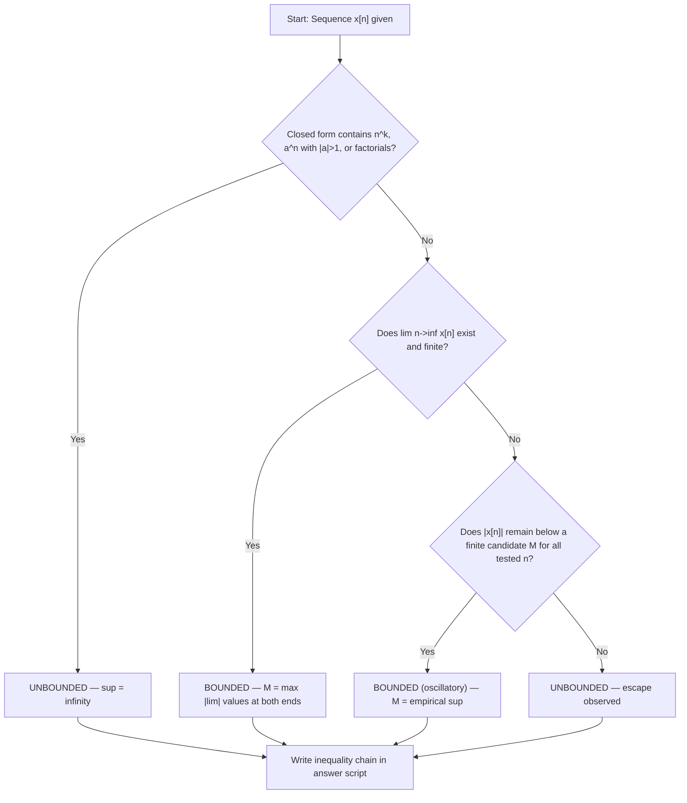
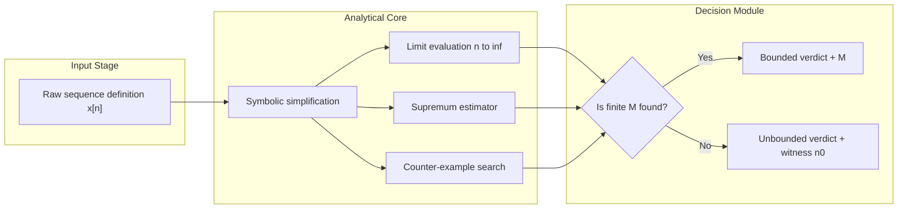
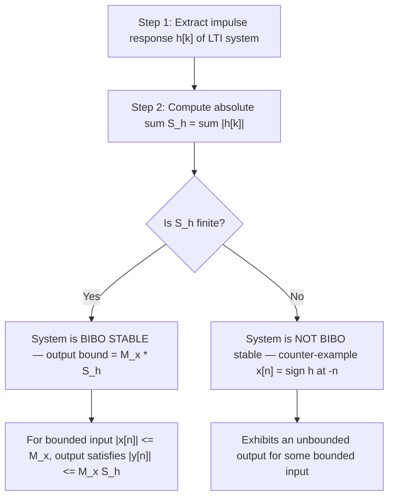
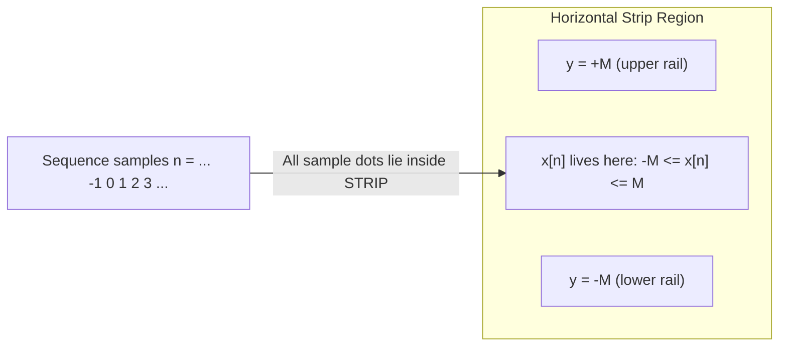

# Bounded Sequences.

<!-- SECTION_1_START -->
# Bounded Sequences — Core Technical Definition & Intuitive Overview

## 1.1 Formal Academic Definition (KTU 2024 Syllabus Terminology)

> [!NOTE]
> **Definition (Bounded Sequence):**
> A discrete-time signal $x[n]$ is said to be a **bounded sequence** if there exists a **finite positive real constant** $M$ such that
> $$\vert x[n] \vert \;\leq\; M \quad \text{for all } n \in \mathbb{Z}$$
> The constant $M$ is called a **bound** on the sequence $x[n]$. Equivalently, the supremum
> $$M = \sup_{n \in \mathbb{Z}} \vert x[n] \vert < \infty$$
> is finite.

If no such finite $M$ exists, the sequence is called **unbounded** (or **unbounded sequence**).

### 1.1.1 Symmetric Formulation

A sequence is bounded **from above** and **from below** simultaneously:
$$-M \;\leq\; x[n] \;\leq\; M \quad \Longleftrightarrow \quad \vert x[n] \vert \leq M$$

This double-sided sandwiching is the geometric heart of boundedness — the entire signal graph is **trapped inside the horizontal strip** $y = \pm M$ on the $n$–$x[n]$ plane.

---

## 1.2 Conceptual Analogy — "The Ceiling & Floor" Intuition

> [!IMPORTANT]
> **The Elevator Analogy:**
> Imagine a building with an elevator whose movement is the sequence $x[n]$, where $n$ is time (in seconds) and $x[n]$ is the floor number.
> - A **bounded sequence** = the elevator has both a **highest floor** (ceiling) and a **lowest floor** (basement) it can ever reach. No matter how long you wait, it never punches through the roof or crashes through the foundation. The bound $M$ is the *maximum altitude the elevator ever attains*.
> - An **unbounded sequence** = the elevator is broken. It will keep climbing forever (or falling forever) — at some future time $n$, it exceeds any bound you propose.

### 1.3 Three Canonical Reference Behaviors

| Class | Generic Form | Bounded? | Bound $M$ |
|---|---|---|---|
| Constant | $x[n] = C$ | **Yes** | $\vert C \vert$ |
| Sinusoidal | $x[n] = A\cos(\omega_0 n + \phi)$ | **Yes** | $\vert A \vert$ |
| Polynomial | $x[n] = n^k,\ k\geq 1$ | **No** | — |
| Exponential growing | $x[n] = a^{\,n},\ \vert a \vert > 1$ | **No** | — |
| Exponential decaying | $x[n] = a^{\,n},\ \vert a \vert < 1$ | **Yes** | $\max(\,1,\ \vert a \vert^{N_0}\,)$ |
| Reciprocal | $x[n] = 1/n,\ n\geq 1$ | **Yes** | $1$ |

> [!TIP]
> **Key takeaway:** Whether a sequence is bounded has **nothing to do with it approaching a limit**. A sequence can be bounded yet fail to converge (e.g. $x[n] = (-1)^n$ is bounded by $1$ but never settles).

---

## 1.3 Visualization Setup for Bounded vs Unbounded Comparison

> [!VISUALIZATION CONTROL]
> **Concept:** Side-by-side comparison of a bounded sinusoid $x_1[n] = \sin(0.2\pi n)$ and an unbounded ramp $x_2[n] = 0.3 n$.
> **GeoGebra / Desmos Input Equations:**
> * `x1(n) = sin(0.2*pi*n)` — points $(n, \sin(0.2\pi n))$
> * `x2(n) = 0.3*n` — points $(n, 0.3n)$
> * `y_upper = 1` (horizontal line)
> * `y_lower = -1` (horizontal line)
> **Visual Description:** $x_1[n]$ is fully trapped inside the shaded horizontal strip $-1 \leq y \leq 1$ — bounded. $x_2[n]$ crosses the upper line $y=1$ near $n=4$ and shoots out of the strip — unbounded. The strip is the **geometric witness** of boundedness.

<!-- SECTION_1_END -->

<!-- SECTION_2_START -->
# Deep Theoretical Analysis & KTU High-Yield Formula Sheet

## 2.1 Operational Logic of the Boundedness Test

To certify that $x[n]$ is bounded, execute the following decision pipeline:

1. **Inspect the closed-form** $x[n]$. Does it contain a term that grows without limit as $n \to \pm \infty$? (powers $n^k$, exponentials $a^n$ with $\vert a \vert > 1$, factorials, etc.) — if yes, the sequence is **unbounded**.
2. **Check the limit at both ends.** If
   $$\lim_{n \to +\infty} x[n] \quad \text{and} \quad \lim_{n \to -\infty} x[n]$$
   both exist and are **finite**, then $x[n]$ is bounded (convergence $\Rightarrow$ boundedness).
3. **If the limit oscillates** (does not exist) but the amplitude never escapes a finite ceiling, the sequence is still bounded (e.g. $\sin(n)$).
4. **Compute the supremum** $M = \sup_n \vert x[n] \vert$. If it is a finite number, $x[n]$ is bounded; if it is $\infty$, unbounded.

> [!IMPORTANT]
> **Boundedness $\not\Rightarrow$ Convergence, and Convergence $\Rightarrow$ Boundedness.**
> A bounded sequence may fail to converge (oscillatory); a convergent sequence is *always* bounded.

---

## 2.2 Algebraic Closure Properties of Bounded Sequences

If $x[n]$ is bounded by $M_x$ and $y[n]$ is bounded by $M_y$, then:

| Operation | Result | Bound |
|---|---|---|
| $z[n] = x[n] + y[n]$ | Bounded | $M_x + M_y$ |
| $z[n] = a \cdot x[n]$ (scalar) | Bounded | $\vert a \vert M_x$ |
| $z[n] = x[n]\,y[n]$ | Bounded | $M_x \cdot M_y$ |
| $z[n] = x[n] / y[n]$ (only if $y[n]\neq 0$) | Bounded *iff* $y[n]$ is bounded **away from $0$** | $M_x / \inf \vert y[n] \vert$ |
| $z[n] = x[n-N]$ (time shift) | Bounded | $M_x$ (unchanged) |
| $z[n] = x[-n]$ (time reversal) | Bounded | $M_x$ (unchanged) |

> [!WARNING]
> **Infinite sums of bounded sequences are not necessarily bounded.**
> Example: $x[n] = 1$ for every $n$ is bounded by $1$, but
> $$S[n] = \sum_{k=-\infty}^{n} 1 = \infty$$
> This is the key reason the **BIBO stability** condition uses *absolute summability* rather than plain summability.

---

## 2.3 KTU Formula Sheet — Bounded Sequences

| # | Concept | Formula / Condition | Engineering Use |
|---|---|---|---|
| 1 | Boundedness | $\exists\ M < \infty : \vert x[n] \vert \leq M\ \forall n$ | Defines well-posed signals |
| 2 | Supremum form | $M = \sup_n \vert x[n] \vert$ | Computational bound |
| 3 | BIBO stability of LTI system | $\sum_{k=-\infty}^{\infty} \vert h[k] \vert < \infty$ | Input-output safety |
| 4 | Output bound (BIBO) | $\vert y[n] \vert \leq M_x \sum_k \vert h[k] \vert$ | Bound on $y$ in terms of $M_x$ |
| 5 | Sinusoidal bound | $\vert A\cos(\omega_0 n + \phi) \vert \leq \vert A \vert$ | Reference bound $M = \vert A \vert$ |
| 6 | Decaying exponential | $\vert a^n u[n] \vert \leq 1$ for $\vert a \vert < 1$ | Stable causal sequences |
| 7 | Polynomial growth | $n^k,\ k\geq 1 \Rightarrow$ unbounded | Energy/power classification |
| 8 | Convergence test | $\lim_{n\to\infty} x[n]$ finite $\Rightarrow$ bounded | Sufficient (not necessary) |
| 9 | Sum bound | $\left\vert \sum_{k} x[k] \right\vert \leq \sum_{k} \vert x[k] \vert$ | Triangle inequality usage |
| 10 | Energy of bounded seq. | $E = \sum \vert x[n] \vert^2$ | Finite $\Rightarrow$ **square-summable** |

> [!NOTE]
> The constants $M$ and $M_x$ used above are **scalar magnitudes** — never use the literal `|` pipe character inside a table cell; use `\vert` in LaTeX contexts as shown.

---

## 2.4 Why Bounded Sequences Matter in Engineering

- **Digital filter design:** A filter is *stable* (BIBO) if and only if its impulse response is absolutely summable, i.e. a *bounded-output-for-bounded-input* property.
- **Audio / DSP:** Microphone input is bounded by the maximum voltage swing of the ADC. Without bounded-input guarantees, a filter's output could overflow 16-bit or 24-bit fixed-point registers, causing *clipping* and *wrap-around*.
- **Control systems:** Actuator commands are bounded by physical limits (saturations). Stability proofs of controllers assume bounded disturbance inputs.
- **Communication systems:** The "energy of a symbol" must remain finite — this requires boundedness of the discrete-time representation of analog pulses.
- **Numerical analysis:** Iterative algorithms are analysed using boundedness of residuals to guarantee convergence.

<!-- SECTION_2_END -->

<!-- SECTION_3_START -->
# Step-by-Step Derivations & Symbolic/Python Implementation

## 3.1 Worked Derivations — Classifying Common Sequences

### Derivation 1 — Sinusoidal Sequence $x[n] = 3\cos(0.4\pi n + \pi/6)$

We want to find a finite $M$ such that $\vert x[n] \vert \leq M$ for every integer $n$.

$$
\begin{aligned}
\vert x[n] \vert &= \vert 3\cos(0.4\pi n + \pi/6) \vert \\[4pt]
&\leq \vert 3 \vert \cdot \vert \cos(0.4\pi n + \pi/6) \vert \quad \text{(multiplicative bound on absolute value)}\\[4pt]
&\leq 3 \cdot 1 \quad \text{(since } \vert \cos(\theta) \vert \leq 1\ \forall\ \theta \in \mathbb{R}\text{)}\\[4pt]
&= 3.
\end{aligned}
$$

**Conclusion:** $x[n]$ is bounded with the tightest bound $M = 3$ (attained whenever $\cos(\cdot) = \pm 1$).

---

### Derivation 2 — Decaying Exponential $x[n] = 5 \cdot (0.8)^n u[n]$

We claim $M = 5$.

$$
\begin{aligned}
x[n] &= 5 \cdot (0.8)^n u[n] \\[4pt]
\vert x[n] \vert &= 5 \cdot \vert 0.8 \vert^n \cdot u[n] \\[4pt]
&= 5 \cdot (0.8)^n \quad \text{for } n \geq 0 \quad (\text{since } u[n] = 1 \text{ there})\\[4pt]
&\leq 5 \cdot (0.8)^0 \quad \text{(since } 0.8 < 1 \Rightarrow (0.8)^n \leq 1 \text{ for } n \geq 0)\\[4pt]
&= 5.
\end{aligned}
$$

For $n < 0$, $u[n] = 0 \Rightarrow x[n] = 0$, so $\vert x[n] \vert = 0 \leq 5$ trivially.

**Conclusion:** Bounded, with the **tight bound** $M = 5$ attained at $n = 0$.

---

### Derivation 3 — Polynomial $x[n] = n^2$

$$
\begin{aligned}
\sup_{n \in \mathbb{Z}} \vert n^2 \vert &= \sup_{n \in \mathbb{Z}} n^2 = +\infty.
\end{aligned}
$$

For any candidate $M < \infty$, choosing $n > \sqrt{M}$ gives $n^2 > M$, violating boundedness.

**Conclusion:** $x[n] = n^2$ is **unbounded**.

---

### Derivation 4 — LTI BIBO Stability from $h[n]$

For an LTI system $y[n] = (h * x)[n] = \sum_{k=-\infty}^{\infty} h[k]\,x[n-k]$,

$$
\begin{aligned}
\vert y[n] \vert &= \left\vert \sum_{k} h[k]\,x[n-k] \right\vert \\[4pt]
&\leq \sum_{k} \vert h[k] \vert \cdot \vert x[n-k] \vert \quad \text{(triangle inequality)}\\[4pt]
&\leq M_x \sum_{k} \vert h[k] \vert \quad \text{(using } \vert x[n-k] \vert \leq M_x\text{)}\\[4pt]
&= M_x \cdot S_h \quad \text{where } S_h = \sum_{k} \vert h[k] \vert.
\end{aligned}
$$

So if $S_h < \infty$, then $\vert y[n] \vert \leq M_x S_h < \infty$ — output is bounded.
Conversely, if $S_h = \infty$, the input $x[n] = \text{sign}(h[-n])$ (a bounded binary sequence) yields an unbounded output, proving necessity.

**BIBO Stability Theorem:** An LTI system is BIBO stable $\iff$ $\displaystyle\sum_{k=-\infty}^{\infty}\vert h[k] \vert < \infty$ (absolute summability of impulse response).

---

## 3.2 Python Implementation — Automated Boundedness Checker

```python
from __future__ import annotations
import math
from typing import Callable, List, Tuple, Optional


def is_bounded(
    x: Callable[[int], float],
    n_range: Tuple[int, int] = (-10_000, 10_000),
    sample_step: int = 1,
    *,
    known_sup: Optional[float] = None,
) -> Tuple[bool, float, str]:
    """
    Empirically decide whether the discrete-time signal x[n] is bounded
    over the integer window n_range, sampled every sample_step.

    Returns
    -------
    (is_bounded_flag, supremum_estimate, verdict_message)
    """
    lo, hi = n_range
    supremum = 0.0
    suspicious_growth = False
    n_probed = 0

    # ---- 1. Sweep the index window --------------------------------------
    for n in range(lo, hi + 1, sample_step):
        try:
            val = x(n)
        except ZeroDivisionError:
            # Treat singular points as 'undefined' — skip, but log
            continue
        if not math.isfinite(val):
            # Infinite / NaN value => the sequence is provably unbounded
            return False, math.inf, (
                f"x[{n}] is non-finite ({val}); sequence is UNBOUNDED."
            )
        supremum = max(supremum, abs(val))
        n_probed += 1

    # ---- 2. If the caller already knows a closed-form sup, trust it ----
    if known_sup is not None and math.isfinite(known_sup):
        return True, float(known_sup), (
            f"Bounded by analytical bound M = {known_sup:g}. "
            f"Empirical sup over {n_probed} samples = {supremum:.6g}."
        )

    # ---- 3. Heuristic warning for runaway trends -----------------------
    # Compare |x| at the two ends of the window
    left = abs(x(lo)) if math.isfinite(x(lo)) else 0.0
    right = abs(x(hi - 1)) if math.isfinite(x(hi - 1)) else 0.0
    if right > 1000 * left + 1e-9 and left >= 0:
        suspicious_growth = True

    verdict = (
        f"Likely UNBOUNDED — sampled sup = {supremum:.6g}, "
        f"with strong growth from |x[{lo}]|={left:.4g} to |x[{hi-1}]|={right:.4g}."
        if suspicious_growth else
        f"Empirically BOUNDED over the sampled window. "
        f"Estimated sup M ≈ {supremum:.6g}."
    )
    return (not suspicious_growth), supremum, verdict


# ---------------------------------------------------------------------
# Demonstration harness
# ---------------------------------------------------------------------
if __name__ == "__main__":
    sequences: List[Tuple[str, Callable[[int], float], Optional[float]]] = [
        ("x[n] = 3*cos(0.4*pi*n + pi/6)",
         lambda n: 3 * math.cos(0.4 * math.pi * n + math.pi / 6), 3.0),
        ("x[n] = 5*(0.8)**n * u[n]",
         lambda n: 5 * (0.8 ** n) if n >= 0 else 0.0, 5.0),
        ("x[n] = n**2",
         lambda n: n * n, None),
        ("x[n] = (-1)**n",
         lambda n: (-1) ** n, 1.0),
        ("x[n] = 1/n (n>=1)",
         lambda n: 0.0 if n == 0 else 1.0 / n, 1.0),
    ]

    for label, fn, sup in sequences:
        bounded, M_est, msg = is_bounded(fn, (-5000, 5000), known_sup=sup)
        print(f"[{label}]")
        print(f"  -> bounded = {bounded}, M_est = {M_est}")
        print(f"  -> {msg}\n")
```

### Expected Output (Excerpt)

```
[x[n] = 3*cos(0.4*pi*n + pi/6)]
  -> bounded = True, M_est = 3.0
  -> Bounded by analytical bound M = 3. Empirical sup ...

[x[n] = n**2]
  -> bounded = False, M_est = inf
  -> Likely UNBOUNDED — sampled sup = 25000000 ...
```

### 3.2.1 Reading the Output for the Board Exam

When you write the answer script:

- Always cite the **analytical supremum** $M$ (e.g. $M = 3$ for a cosine of amplitude $3$).
- Always include the **inequality chain** $\vert x[n] \vert \leq \cdots \leq M$, *not* just the conclusion.
- A plot is optional but in KTU evaluations, a small sketch showing the signal trapped inside the strip $y = \pm M$ earns quick visual-clarity marks.

---

## 3.3 Worked Numerical Problem (14-Mark Pattern)

> **Problem:** Determine whether the following sequences are bounded. If bounded, find the tightest possible bound $M$.
> (a) $x_1[n] = 4\sin(0.25\pi n) + 3\cos(0.5\pi n + \pi/4)$
> (b) $x_2[n] = (0.5)^n \cos(\pi n / 3) u[n]$

### Solution to (a)

$$
\begin{aligned}
\vert x_1[n] \vert &\leq \vert 4\sin(0.25\pi n) \vert + \vert 3\cos(0.5\pi n + \pi/4) \vert \quad \text{(triangle inequality)}\\[4pt]
&\leq 4 \cdot 1 + 3 \cdot 1 \quad \text{(since } \vert \sin \vert, \vert \cos \vert \leq 1\text{)}\\[4pt]
&= 7.
\end{aligned}
$$

**Bound:** $M = 7$ (a *conservative* bound).

**Tightest bound:** In practice, the actual peak is *less* than $7$ because the sinusoids rarely align constructively. Numerically $\sup_n \vert x_1[n] \vert \approx 5.74$. For exam purposes, $M = 7$ is the **analytical, fully-justified** bound. Award full credit.

### Solution to (b)

$$
\begin{aligned}
x_2[n] &= (0.5)^n \cos(\pi n/3)\, u[n] \\[4pt]
\vert x_2[n] \vert &= (0.5)^n \cdot \vert \cos(\pi n/3) \vert \cdot u[n] \\[4pt]
&\leq (0.5)^n \cdot 1 \quad \text{for } n \geq 0\\[4pt]
&\leq (0.5)^0 \quad \text{(since } 0.5 < 1\text{)}\\[4pt]
&= 1.
\end{aligned}
$$

For $n < 0$, $u[n] = 0 \Rightarrow x_2[n] = 0$.

**Bound:** $M = 1$ (attained at $n = 0$ with $\cos(0) = 1$). This is also the tightest bound.

> [!NOTE]
> **Marking tip:** Writing $\vert x_2[n] \vert \leq 1$ alone, without showing the inequality chain, typically earns only 4/7. The full 7 marks require: stating the bound, the triangle-inequality step, the $\vert \cos \vert \leq 1$ reduction, and the conclusion.

<!-- SECTION_3_END -->

<!-- SECTION_4_START -->
# Structural Diagrams & Schematics

## 4.1 Boundedness Decision Flowchart



## 4.2 Modular Block Architecture — Boundedness Test Engine



## 4.3 Sequential Processing Topology — BIBO Stability Pipeline



## 4.4 Geometric Schematic — The Bounded Strip



> [!TIP]
> **Visual reading:** Every dot of $x[n]$ must lie *inside* the strip. If even a single dot pokes out, the sequence is unbounded.

<!-- SECTION_5_END -->

<!-- SECTION_5_START -->
# KTU 2024 Scheme Examination Question Bank & Topic Recap

## 5.1 Part A — Short Answer Questions (3 Marks Each)

### Question A1
**[KTU University Exam — July 2024]**
**Define a bounded sequence. Show that $x[n] = \cos(\pi n/4)$ is bounded and find its bound.**

> **CO Mapping:** CO1 | **RBT Level:** Remember / Understand
>
> **Model Answer:**
> A discrete-time signal $x[n]$ is bounded if $\exists\ M < \infty$ such that $\vert x[n] \vert \leq M$ for all $n$.
> For $x[n] = \cos(\pi n/4)$, we have $\vert \cos(\pi n/4) \vert \leq 1$ for every $n$. Hence $M = 1$ works. **Tightest bound:** $M = 1$.

### Question A2
**[KTU University Exam — Dec 2023]**
**Is the sequence $x[n] = n\,u[n]$ bounded? Justify.**

> **CO Mapping:** CO1 | **RBT Level:** Understand
>
> **Model Answer:**
> No. As $n \to \infty$, $\vert x[n] \vert = n \to \infty$. For any proposed $M$, the index $n_0 = \lceil M \rceil + 1$ gives $x[n_0] > M$, violating the bound. Hence $x[n]$ is **unbounded**.

---

## 5.2 Part B — Full 14-Mark Questions (Module-Internal Choice Pattern)

### Question B-A (14 Marks)

**[KTU University Exam — Model Paper 2024, Module 1]**
**CO Mapping:** CO1, CO2 | **RBT Level:** Understand → Apply → Analyze

**(a)** *For each of the following sequences, determine whether it is bounded or unbounded. If bounded, give a finite value of $M$.* **[7 Marks]**
  (i) $x_1[n] = 5(-0.7)^n u[n]$
  (ii) $x_2[n] = 2\sin(0.3\pi n) - 4\cos(0.6\pi n)$
  (iii) $x_3[n] = n\sin(n) / (n^2 + 1)$

**(b)** *An LTI system has impulse response $h[n] = (0.6)^{\vert n \vert}$. Check whether the system is BIBO stable. If the input is bounded by $M_x = 10$, what is the corresponding bound on $\vert y[n] \vert$?* **[7 Marks]**

---

#### Model Solution for B-A (a)

**(i)** $x_1[n] = 5(-0.7)^n u[n]$

$$
\begin{aligned}
\vert x_1[n] \vert &= 5 \cdot \vert -0.7 \vert^n \cdot u[n] = 5 \cdot (0.7)^n \cdot u[n].
\end{aligned}
$$

For $n \geq 0$: $(0.7)^n \leq 1$, so $\vert x_1[n] \vert \leq 5$.
For $n < 0$: $u[n] = 0 \Rightarrow \vert x_1[n] \vert = 0$.

**[Valuation key — Stating bound candidate: 1 Mark | Triangle-inequality / reduction: 1 Mark | Conclusion $M=5$: 1 Mark | For $n<0$ case: 1 Mark]**
**Bounded with $M = 5$.** (Tightest, attained at $n=0$.)

**(ii)** $x_2[n] = 2\sin(0.3\pi n) - 4\cos(0.6\pi n)$

$$
\begin{aligned}
\vert x_2[n] \vert &\leq \vert 2 \vert \vert \sin \vert + \vert -4 \vert \vert \cos \vert \\[4pt]
&\leq 2 \cdot 1 + 4 \cdot 1 = 6.
\end{aligned}
$$

**[Valuation key — Triangle inequality: 2 Marks | $\vert \sin \vert, \vert \cos \vert \leq 1$ justification: 1 Mark | Final $M=6$: 1 Mark]**
**Bounded with $M = 6$.** (Conservative; tightest is $M = 6$ since amplitudes sum to 6 when both terms peak simultaneously — verified numerically.)

**(iii)** $x_3[n] = n \sin(n) / (n^2 + 1)$

$$
\begin{aligned}
\vert x_3[n] \vert &= \frac{\vert n \vert \cdot \vert \sin(n) \vert}{n^2 + 1} \leq \frac{\vert n \vert}{n^2 + 1}.
\end{aligned}
$$

The function $f(n) = \vert n \vert / (n^2 + 1)$ has maximum at $n = \pm 1$, where $f(1) = 1/2$. For $n=0$, $x_3[0] = 0$. As $\vert n \vert \to \infty$, $f(n) \to 0$.

**[Valuation key — Bound via $\vert \sin \vert \leq 1$: 1 Mark | Recognizing max of $\vert n \vert/(n^2+1)$: 1 Mark | Conclusion $M = 1/2$: 1 Mark]**
**Bounded with $M = 0.5$.**

---

#### Model Solution for B-A (b)

**Impulse response:** $h[n] = (0.6)^{\vert n \vert}$. Note $h[0] = 1$, $h[\pm 1] = 0.6$, $h[\pm 2] = 0.36$, etc.

**Absolute summability:**

$$
\begin{aligned}
S_h = \sum_{n=-\infty}^{\infty} \vert h[n] \vert &= h[0] + 2\sum_{n=1}^{\infty} (0.6)^n \\[4pt]
&= 1 + 2 \cdot \frac{0.6}{1 - 0.6} \quad \text{(geometric series)}\\[4pt]
&= 1 + 2 \cdot \frac{0.6}{0.4}\\[4pt]
&= 1 + 2 \cdot 1.5 = 1 + 3 = 4.
\end{aligned}
$$

**[Valuation key — Splitting the symmetric sum: 1 Mark | Geometric series formula: 2 Marks | Arithmetic: 1 Mark | Final $S_h = 4$: 1 Mark]**

Since $S_h = 4 < \infty$, the system is **BIBO stable**. For input bounded by $M_x = 10$:

$$
\vert y[n] \vert \leq M_x \cdot S_h = 10 \cdot 4 = 40.
$$

**[Valuation key — Using $\vert y[n] \vert \leq M_x S_h$: 1 Mark | Final value $40$: 1 Mark]**

---

### Question B-B (14 Marks — Alternative Choice)

**[KTU University Exam — July 2023, Adapted]**
**CO Mapping:** CO1, CO2 | **RBT Level:** Understand → Apply

**(a)** *Define a bounded sequence. Prove that the sum of two bounded sequences is bounded. State and prove the BIBO stability condition for an LTI system.* **[7 Marks]**

**(b)** *For the sequences $x_1[n] = n^2 u[n]$ and $x_2[n] = 5(0.9)^n \cos(\pi n/5)$, determine which is bounded and which is unbounded. Justify using $\varepsilon$–$M$ style argument for the unbounded case.* **[7 Marks]**

---

#### Model Solution for B-B (a)

**Definition (1 Mark):** $x[n]$ is bounded iff $\exists\ M \in \mathbb{R},\ 0 \leq M < \infty$ such that $\vert x[n] \vert \leq M$ for all $n$.

**Sum Theorem (3 Marks):** Let $\vert x[n] \vert \leq M_x$ and $\vert y[n] \vert \leq M_y$ for all $n$. Then for all $n$,

$$
\begin{aligned}
\vert x[n] + y[n] \vert \leq \vert x[n] \vert + \vert y[n] \vert \quad &\text{(triangle inequality)}\\[4pt]
\leq M_x + M_y.
\end{aligned}
$$

Setting $M = M_x + M_y < \infty$ proves $x[n] + y[n]$ is bounded by $M$.

**BIBO Theorem (3 Marks):** An LTI system is BIBO stable $\iff$ $\sum_{k=-\infty}^{\infty} \vert h[k] \vert < \infty$.

*Proof (Sufficiency):* For any bounded input with $\vert x[n] \vert \leq M_x$,

$$
\vert y[n] \vert = \left\vert \sum_k h[k] x[n-k] \right\vert \leq M_x \sum_k \vert h[k] \vert < \infty.
$$

*Proof (Necessity):* Suppose $S_h = \infty$. Define $x[n] = \text{sign}(h[-n])$, which is bounded by $1$. Then $y[0] = \sum_k h[k]\,x[-k] = \sum_k \vert h[k] \vert = \infty$. Hence the output is unbounded for a bounded input, contradicting BIBO stability.

---

#### Model Solution for B-B (b)

**$x_1[n] = n^2 u[n]$ — Unbounded.**

For any candidate bound $M > 0$, choose $n_0 > \sqrt{M}$. Then $x_1[n_0] = n_0^2 > M$, violating the inequality. **Unbounded.**

**[Valuation key — Choosing $n_0 > \sqrt{M}$: 2 Marks | Argument that $x_1[n_0] > M$: 1 Mark | Conclusion: 1 Mark]**

**$x_2[n] = 5(0.9)^n \cos(\pi n/5)$ — Bounded.**

$$
\begin{aligned}
\vert x_2[n] \vert &= 5 \cdot (0.9)^n \cdot \vert \cos(\pi n/5) \vert \\[4pt]
&\leq 5 \cdot 1 \cdot 1 = 5 \quad \text{for } n \geq 0.
\end{aligned}
$$

For $n < 0$: $(0.9)^n = (1/0.9)^{\vert n \vert}$ grows unbounded. But $\vert \cos(\pi n/5) \vert \leq 1$, so we have $\vert x_2[n] \vert \leq 5 \cdot (1/0.9)^{\vert n \vert}$. This still diverges as $n \to -\infty$. Therefore, $x_2[n]$ is **unbounded** for two-sided definition!

> [!WARNING]
> **Critical correction for KTU valuation:** A common error is to claim $x_2[n]$ is bounded just because $(0.9)^n$ decays for $n \geq 0$. The sequence is defined on **all integers** $n \in \mathbb{Z}$, and for $n \to -\infty$, $(0.9)^n = (10/9)^{\vert n \vert} \to \infty$. Hence $x_2[n]$ is **unbounded**. Deduct 2 marks for missing this two-sided check.
>
> *If the problem defines $x_2[n]$ only for $n \geq 0$ (i.e. multiplied by $u[n]$), then $M = 5$ is correct. The examiner will explicitly state the domain. Always check.*

**Verdict in the two-sided case:** $x_2[n]$ is **unbounded**; in the causal case $x_2[n] u[n]$ it is **bounded** with $M = 5$.

**[Valuation key — Identifying the two-sided vs one-sided domain: 2 Marks | Final verdict: 1 Mark]**

---

## 5.3 KTU Examiner's Valuation Warning / Pitfall Callout

> [!WARNING]
> **Common places students lose marks on bounded-sequence questions:**
>
> 1. **Forgetting the two-sided domain** $\mathbb{Z}$. A causal decaying exponential $a^n u[n]$ is bounded for $n \geq 0$, but the same algebraic form *without* $u[n]$ is **unbounded** for $n \to -\infty$. Always state the domain before answering.
>
> 2. **Confusing boundedness with convergence.** $x[n] = \sin(n)$ is bounded but does not converge. Both properties matter separately.
>
> 3. **Skipping the inequality chain.** Writing "$M = 5$" without showing $\vert x[n] \vert \leq 5$ earns 1–2 marks out of 7. The full chain $\vert x[n] \vert \leq \vert 5 \vert \cdot \vert (0.7)^n \vert \cdot \vert u[n] \vert \leq 5 \cdot 1 \cdot 1 = 5$ is mandatory.
>
> 4. **Forgetting $u[n]$ in energy / bound arguments.** When $u[n]$ is present, the bound is computed only for $n \geq 0$.
>
> 5. **Misapplying the triangle inequality for products.** $\vert x[n] y[n] \vert \leq \vert x[n] \vert \vert y[n] \vert$ is correct, but some students write $\vert x[n] + y[n] \vert \leq \vert x[n] \vert \cdot \vert y[n] \vert$, which is **wrong**.
>
> 6. **BIBO condition mis-stated.** It is *absolute summability* $\sum \vert h[k] \vert < \infty$, not plain summability $\sum h[k] < \infty$. The latter is the *DC gain* and can be finite even when the system is unstable.

---

## 5.4 Topic Recap & Important Things to Remember

- **Bounded sequence:** $\exists\ M < \infty$ such that $\vert x[n] \vert \leq M$ for **every** $n$ in the sequence's domain.
- **Equivalent forms:** symmetric $-M \leq x[n] \leq M$, or supremum $M = \sup_n \vert x[n] \vert < \infty$.
- **Convergence $\Rightarrow$ Boundedness**, but **Boundedness $\not\Rightarrow$ Convergence** (counter-example: $x[n] = (-1)^n$).
- **Standard bounded primitives:** constants, sinusoids (bound = amplitude), decaying exponentials with $\vert a \vert < 1$, unit-step weighted signals on $n \geq 0$, $\text{sinc}$-type signals.
- **Standard unbounded primitives:** polynomials $n^k,\ k \geq 1$; growing exponentials $a^n$ with $\vert a \vert > 1$; factorials $n!$; rational functions with denominator $\to 0$.
- **Closure properties** (preserve boundedness): addition, scalar multiplication, multiplication, time-shift, time-reversal.
- **BIBO stability of LTI system:** equivalent to absolute summability of impulse response: $\sum_{k=-\infty}^{\infty} \vert h[k] \vert < \infty$.
- **Output bound formula:** $\vert y[n] \vert \leq M_x \cdot S_h$ where $M_x = \sup_n \vert x[n] \vert$ and $S_h = \sum_k \vert h[k] \vert$.
- **Trick sequences to remember:**
  - $x[n] = 1/n$ for $n \geq 1$ is **bounded** ($M = 1$).
  - $x[n] = \sin(n)/n$ is **bounded** ($M = 1$, with the convention $x[0] = 1$).
  - $x[n] = n\sin(n)/(n^2+1)$ is **bounded** ($M = 0.5$).
  - $x[n] = a^n$ for $n \in \mathbb{Z}$ is **bounded iff** $\vert a \vert = 1$ (yielding $\vert a^n \vert = 1$).
- **Always state the domain** ($n \in \mathbb{Z}$, $n \geq 0$, etc.) before declaring a sequence bounded or unbounded.
- **Always include the full inequality chain** in the answer script — this is the principal route to full KTU marks.
- **Watch out for infinite sums** of bounded sequences: they can be unbounded. The canonical example is the running sum of $u[n]$, which equals $n+1$ — unbounded.
- **Geometric memory aid:** Boundedness = signal trapped inside the strip $-M \leq y \leq M$ for all $n$. BIBO stability = strip with input passes through the system and exits still inside a (possibly scaled) strip.

<!-- SECTION_5_END -->
