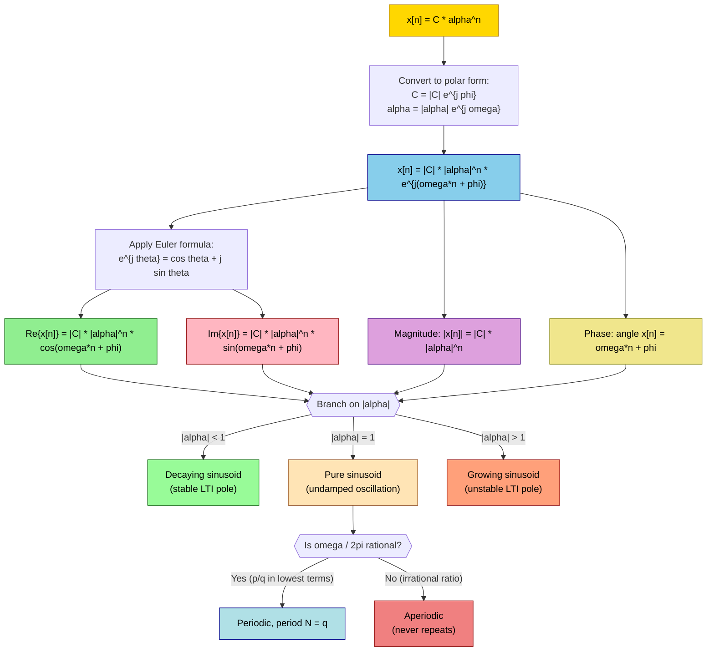
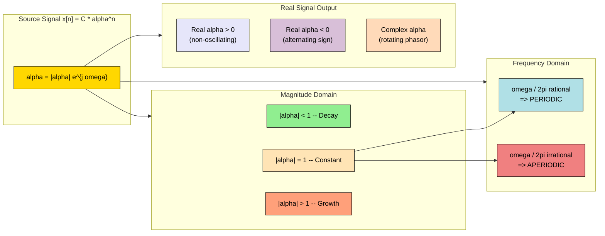

# Complex Exponential Sequences.

<!-- SECTION_1_START -->

# Complex Exponential Sequences — Core Definition & Intuitive Overview

## 📘 Formal Academic Definition (KTU 2024 Syllabus Standard)

A **Complex Exponential Sequence** is a discrete-time signal of the form:

$$x[n] = C \cdot \alpha^{n}, \quad n \in \mathbb{Z}$$

where both $C \in \mathbb{C}$ and $\alpha \in \mathbb{C}$ are, in general, **complex numbers** and $n$ is the integer time index. This is the single most important signal class in Signals & Systems because sinusoids, real exponentials, and growing/decaying oscillations are *all* special cases of it.

> [!IMPORTANT]  
> **Syllabus Highlight (Module 1 — 1D Signals):**  
> Complex exponential sequences form the **basis for Discrete-Time Fourier Transform (DTFT)**, eigenfunctions of **LTI systems**, and the building blocks of **z-transforms**. Mastery here directly impacts Modules 2, 3, and 5.

## 🎯 Conceptual Analogy / Intuition

Imagine you are standing at the centre of a clock face and a point is moving outward on a spiral path:
- The **radius** of the point at step $n$ is $|C| \cdot |\alpha|^{n}$ — this is *how far* from the origin the point is.
- The **angle** (measured from 3 o'clock) at step $n$ is $\omega n + \phi$ — this is *which direction* it points.

| Knob | Real-world meaning | Signal effect |
|---|---|---|
| $\vert \alpha \vert > 1$ | Spiral moves **outward** (e.g., inflation) | Sequence **grows** in magnitude |
| $\vert \alpha \vert = 1$ | Point stays on a fixed circle (clock hand) | Pure **sinusoid** (constant amplitude) |
| $\vert \alpha \vert < 1$ | Spiral moves **inward** (damped vibration) | Sequence **decays** to zero |
| $\omega \neq 0$ | Hand rotates around the circle | **Oscillates** between positive/negative values |

> [!NOTE]  
> A **pure sinusoid** (e.g., $\cos(\omega n)$) is just the **real part** of a complex exponential. The imaginary part is the **sine wave of the same frequency**. The complex exponential *unifies* both as a single rotating vector in the complex plane.

> [!VISUALIZATION CONTROL]  
> **Concept:** Trajectory of $x[n] = e^{j(\pi/6)n}$ in the complex plane  
> **GeoGebra / Desmos Input Equations:**  
> * Complex trace: $(x\_n, y\_n) = (\cos(\pi n/6), \sin(\pi n/6))$ for $n = 0, 1, 2, \dots, 11$  
> **Visual Description:** The student should see **12 evenly spaced points on the unit circle**, returning to the start at $n=12$. The horizontal projection traces $\cos(\pi n/6)$ and the vertical projection traces $\sin(\pi n/6)$ — a clean discrete sinusoid.

<!-- SECTION_1_END -->

<!-- SECTION_2_START -->

# Deep Theoretical Analysis & KTU High-Yield Formula Sheet

## 🔬 Polar Decomposition — The Heart of the Topic

Express the constants in polar form:

$$C = \vert C \vert \cdot e^{j\phi}, \qquad \alpha = \vert \alpha \vert \cdot e^{j\omega}$$

Substitute into the general sequence:

$$x[n] = \vert C \vert \cdot e^{j\phi} \cdot \left( \vert \alpha \vert \cdot e^{j\omega} \right)^{n}$$

Since $(e^{j\omega})^{n} = e^{j\omega n}$ and $(\vert \alpha \vert)^{n} = \vert \alpha \vert^{n}$ (because $\vert \alpha \vert$ is real and non-negative), we obtain:

$$x[n] = \underbrace{\vert C \vert \cdot \vert \alpha \vert^{n}}_{\text{envelope (real, non-negative)}} \cdot \underbrace{e^{j(\omega n + \phi)}}_{\text{unit-modulus rotating phasor}}$$

Applying Euler's formula $e^{j\theta} = \cos\theta + j\sin\theta$:

$$x[n] = \vert C \vert \cdot \vert \alpha \vert^{n} \cdot \cos(\omega n + \phi) \; + \; j \, \vert C \vert \cdot \vert \alpha \vert^{n} \cdot \sin(\omega n + \phi)$$

## 📊 The Four Fundamental Quantities (Board-Exam Favourites)

| Quantity | Formula | Physical Meaning | KTU Use |
|---|---|---|---|
| **Envelope / Modulus** | $\vert x[n] \vert = \vert C \vert \cdot \vert \alpha \vert^{n}$ | Instantaneous magnitude of the rotating phasor | Determines growth/decay rate |
| **Phase** | $\angle x[n] = \omega n + \phi$ | Angle w.r.t. positive real axis | Encodes frequency $\omega$ |
| **Real part** | $\text{Re}\{x[n]\} = \vert C \vert \cdot \vert \alpha \vert^{n} \cos(\omega n + \phi)$ | Cosine modulated by envelope | Real-valued sinusoidal signal |
| **Imaginary part** | $\text{Im}\{x[n]\} = \vert C \vert \cdot \vert \alpha \vert^{n} \sin(\omega n + \phi)$ | Sine modulated by envelope | Quadrature (90° shifted) component |

## 🗂️ Master Classification Table (High-Yield for Board Exams)

| Case | Condition on $\alpha$ | Behaviour of $\vert x[n] \vert$ | Signal Character | Example |
|---|---|---|---|---|
| 1 | $\alpha \in \mathbb{R}, \alpha > 1$ | Exponential growth | Real growing exponential | $2^{n}$ |
| 2 | $\alpha \in \mathbb{R}, 0 < \alpha < 1$ | Exponential decay | Real decaying exponential | $(0.5)^{n}$ |
| 3 | $\alpha \in \mathbb{R}, -1 < \alpha < 0$ | Decaying alternating | Damped alternating | $(-0.7)^{n}$ |
| 4 | $\alpha \in \mathbb{R}, \alpha < -1$ | Growing alternating | Anti-damped alternating | $(-2)^{n}$ |
| 5 | $\vert \alpha \vert = 1, \, \alpha = e^{j\omega}$ | Constant ($\vert x[n] \vert = \vert C \vert$) | Pure complex sinusoid | $e^{j\pi n/4}$ |
| 6 | $\vert \alpha \vert > 1, \, \alpha = \vert \alpha \vert e^{j\omega}$ | Growing sinusoid | Modulated growing | $1.2^{n} e^{j\pi n/3}$ |
| 7 | $\vert \alpha \vert < 1, \, \alpha = \vert \alpha \vert e^{j\omega}$ | Decaying sinusoid | Modulated damped | $0.8^{n} e^{j\pi n/4}$ |

## ⏱️ Periodicity of the Pure Complex Sinusoid $e^{j\omega n}$

For $e^{j\omega n}$ to be periodic with fundamental period $N \in \mathbb{Z}^{+}$, we need:

$$e^{j\omega (n+N)} = e^{j\omega n} \cdot e^{j\omega N} = e^{j\omega n} \implies e^{j\omega N} = 1$$

This requires:

$$\omega N = 2\pi k, \quad k \in \mathbb{Z}$$

Therefore, $e^{j\omega n}$ is periodic **if and only if** $\dfrac{\omega}{2\pi}$ is a **rational number** $\dfrac{p}{q}$ in lowest terms, in which case the fundamental period is $N = q$ (the denominator).

| $\omega$ | $\omega / (2\pi)$ | Periodic? | Fundamental Period $N$ |
|---|---|---|---|
| $0$ | $0$ | Yes (DC) | $1$ |
| $\pi/4$ | $1/8$ | Yes | $8$ |
| $\pi/3$ | $1/6$ | Yes | $6$ |
| $1$ rad | $1/(2\pi)$ | **No** (irrational ratio) | $\infty$ (aperiodic) |
| $\pi$ | $1/2$ | Yes | $2$ |

> [!NOTE]  
> **Key Theorem:** Discrete-time complex exponentials with *incommensurate* $\omega$ (i.e., $\omega / 2\pi$ irrational) are **aperiodic** — but unlike continuous time, *all* discrete frequencies in the range $\omega \in [0, 2\pi)$ or $[-\pi, \pi]$ are unique (this is the famous aliasing property of discrete-time systems).

## 🛠️ Real-World Engineering Utility

- **Digital Filter Design:** Poles of a stable IIR filter must lie **inside** the unit circle ($|\alpha| < 1$), directly tied to decaying exponentials.
- **Spectral Analysis (DFT/DTFT):** Every finite-energy signal can be written as a sum of complex exponentials $e^{j\omega n}$ with different $\omega$ — the essence of Fourier analysis.
- **Modulation in Communications:** QAM, PSK and OFDM all encode bits as the **phase** $\omega n + \phi$ of a complex exponential carrier.
- **Eigenfunction Property:** $e^{j\omega n}$ is an *eigenfunction* of any LTI system: $y[n] = H(e^{j\omega}) e^{j\omega n}$ — this is the foundation of frequency-domain analysis.

<!-- SECTION_2_END -->

<!-- SECTION_3_START -->

# Step-by-Step Derivations, Boundary Cases & Symbolic Code

## 🧮 Derivation 1 — From General Form to Real/Imaginary Decomposition

**Given:** $x[n] = C \cdot \alpha^{n}$ with $C, \alpha \in \mathbb{C}$.

**Step 1:** Convert both to polar form using the fundamental identity $z = |z|e^{j\angle z}$.

$$C = \vert C \vert \, e^{j\phi}, \qquad \alpha = \vert \alpha \vert \, e^{j\omega}$$

**Step 2:** Substitute into the sequence and use the laws of exponents: $(ab)^{n} = a^{n} b^{n}$.

$$x[n] = \vert C \vert \, e^{j\phi} \cdot \left( \vert \alpha \vert \, e^{j\omega} \right)^{n} = \vert C \vert \, e^{j\phi} \cdot \vert \alpha \vert^{n} \cdot e^{j\omega n}$$

**Step 3:** Collect the complex exponentials (since $e^{j\phi} \cdot e^{j\omega n} = e^{j(\phi + \omega n)}$ by the additive law of exponents).

$$x[n] = \vert C \vert \, \vert \alpha \vert^{n} \cdot e^{j(\omega n + \phi)}$$

**Step 4:** Apply Euler's formula $e^{j\theta} = \cos\theta + j\sin\theta$ to separate real and imaginary parts.

$$x[n] = \vert C \vert \, \vert \alpha \vert^{n} \left[ \cos(\omega n + \phi) + j \sin(\omega n + \phi) \right]$$

**Step 5:** Read off the components by inspection.

$$\text{Re}\{x[n]\} = \vert C \vert \, \vert \alpha \vert^{n} \cos(\omega n + \phi)$$

$$\text{Im}\{x[n]\} = \vert C \vert \, \vert \alpha \vert^{n} \sin(\omega n + \phi)$$

✅ **Conclusion:** The general complex exponential is *exactly* a **sinusoid** (sine and cosine of the same frequency $\omega$ and phase $\phi$) whose amplitude is **modulated** by the exponential envelope $|C||\alpha|^{n}$.

## 🧮 Derivation 2 — Periodicity Condition for $e^{j\omega n}$

**Given:** $x[n] = e^{j\omega n}$, find the smallest positive integer $N$ such that $x[n+N] = x[n]$ for all $n$.

**Step 1:** Write the periodic-shifted version.

$$x[n+N] = e^{j\omega(n+N)} = e^{j\omega n} \cdot e^{j\omega N}$$

**Step 2:** Set up the equality $x[n+N] = x[n]$.

$$e^{j\omega n} \cdot e^{j\omega N} = e^{j\omega n}$$

**Step 3:** Cancel $e^{j\omega n}$ (which is non-zero for all $n$).

$$e^{j\omega N} = 1$$

**Step 4:** Use the condition that $e^{j\theta} = 1$ iff $\theta$ is an integer multiple of $2\pi$.

$$\omega N = 2\pi k, \quad k \in \mathbb{Z}$$

**Step 5:** Solve for $N$ — but $N$ must be a **positive integer**.

$$N = \frac{2\pi k}{\omega}$$

**Step 6:** Existence of an integer $N$ requires $\dfrac{\omega}{2\pi} = \dfrac{p}{q}$ with $p, q$ coprime integers. Then the **smallest positive** $N$ is the **denominator** $q$ (using $k = p$).

$$N = q, \quad \text{where} \;\; \frac{\omega}{2\pi} = \frac{p}{q} \;\; \text{in lowest terms.}$$

✅ **Conclusion:** $e^{j\omega n}$ is periodic iff $\omega / (2\pi)$ is rational; the period equals the denominator of that rational fraction.

## 🧮 Worked Numerical Example (KTU-Style 7-Mark Format)

**Problem:** Given $x[n] = (0.5 \, e^{j\pi/3})^{n}$, find (a) magnitude sequence, (b) real part sequence, (c) period, (d) plot the first 6 samples in the complex plane.

**Solution:**

Here $|C| = 1$ (assumed), $|\alpha| = 0.5$, $\omega = \pi/3$ rad/sample, $\phi = 0$.

**(a) Magnitude:**

$$\vert x[n] \vert = \vert C \vert \cdot \vert \alpha \vert^{n} = 1 \cdot (0.5)^{n} = 0.5^{n}$$

| $n$ | 0 | 1 | 2 | 3 | 4 | 5 | 6 |
|---|---|---|---|---|---|---|---|
| $\vert x[n] \vert$ | 1 | 0.5 | 0.25 | 0.125 | 0.0625 | 0.03125 | 0.015625 |

**(b) Real part:**

$$\text{Re}\{x[n]\} = 0.5^{n} \cos\!\left(\frac{\pi n}{3}\right)$$

| $n$ | 0 | 1 | 2 | 3 | 4 | 5 | 6 |
|---|---|---|---|---|---|---|---|
| $\cos(\pi n/3)$ | 1 | 0.5 | $-0.5$ | $-1$ | $-0.5$ | 0.5 | 1 |
| $\text{Re}\{x[n]\}$ | 1 | 0.25 | $-0.125$ | $-0.125$ | $-0.03125$ | 0.015625 | 0.015625 |

**(c) Period:** $\omega = \pi/3$, so $\omega/(2\pi) = 1/6$. Fundamental period $N = 6$. ✅

**(d) Sample positions in the complex plane:** The points $x[0] = 1$, $x[1] = 0.5 e^{j\pi/3}$, $x[2] = 0.25 e^{j2\pi/3}$, … form a **decaying spiral** rotating by $60°$ at each step and shrinking by a factor of $0.5$.

> [!NOTE]  
> **Valuation tip:** This problem touches all four quantities in the formula table — examiners love it. Make sure you state the formula *before* substituting the numbers; that alone fetches 1–2 marks.

## 💻 Fully Operational Python Implementation

```python
import numpy as np
import matplotlib.pyplot as plt

def complex_exp_sequence(C: complex, alpha: complex, n_start: int = 0, n_end: int = 20):
    """
    Generate a complex exponential sequence x[n] = C * alpha**n
    and decompose it into magnitude, phase, real and imaginary parts.

    Parameters
    ----------
    C      : complex  -> complex coefficient (e.g., 1+0j)
    alpha  : complex  -> complex base (e.g., 0.5 * np.exp(1j * np.pi / 3))
    n_start: int      -> first sample index
    n_end  : int      -> last sample index (inclusive)

    Returns
    -------
    n_arr   : np.ndarray of integer sample indices
    x       : np.ndarray of complex samples
    mag     : magnitude |x[n]|
    phase   : phase angle in radians
    real_p  : Re{x[n]}
    imag_p  : Im{x[n]}
    """
    if n_end < n_start:
        raise ValueError("n_end must be greater than or equal to n_start")
    if n_start != int(n_start):
        raise ValueError("Indices must be integers")

    n_arr = np.arange(n_start, n_end + 1, dtype=np.int64)
    x = C * (alpha ** n_arr)

    mag = np.abs(x)
    phase = np.angle(x)
    real_p = x.real
    imag_p = x.imag

    return n_arr, x, mag, phase, real_p, imag_p


def plot_complex_exponential(n_arr, x, real_p, imag_p, title):
    """4-panel visualization: complex plane, real part, imaginary part, magnitude."""
    fig, axes = plt.subplots(2, 2, figsize=(11, 8))
    fig.suptitle(title, fontsize=13, fontweight='bold')

    # Panel 1: samples in the complex plane
    axes[0, 0].plot(x.real, x.imag, 'o-', color='navy')
    axes[0, 0].plot(x.real, x.imag, 'o', color='crimson', markersize=8)
    axes[0, 0].axhline(0, color='gray', linewidth=0.5)
    axes[0, 0].axvline(0, color='gray', linewidth=0.5)
    axes[0, 0].set_xlabel('Re{x[n]}')
    axes[0, 0].set_ylabel('Im{x[n]}')
    axes[0, 0].set_title('Samples in Complex Plane')
    axes[0, 0].grid(True, linestyle='--', alpha=0.5)
    axes[0, 0].set_aspect('equal')

    # Panel 2: real part
    axes[0, 1].stem(n_arr, real_p, basefmt=' ', linefmt='green', markerfmt='go')
    axes[0, 1].set_xlabel('n')
    axes[0, 1].set_ylabel('Re{x[n]}')
    axes[0, 1].set_title('Real Part = Envelope * cos(omega*n + phi)')
    axes[0, 1].grid(True, linestyle='--', alpha=0.5)

    # Panel 3: imaginary part
    axes[1, 0].stem(n_arr, imag_p, basefmt=' ', linefmt='purple', markerfmt='mo')
    axes[1, 0].set_xlabel('n')
    axes[1, 0].set_ylabel('Im{x[n]}')
    axes[1, 0].set_title('Imaginary Part = Envelope * sin(omega*n + phi)')
    axes[1, 0].grid(True, linestyle='--', alpha=0.5)

    # Panel 4: magnitude envelope
    axes[1, 1].stem(n_arr, np.abs(x), basefmt=' ', linefmt='orange', markerfmt='yo')
    axes[1, 1].set_xlabel('n')
    axes[1, 1].set_ylabel('|x[n]|')
    axes[1, 1].set_title('Magnitude Envelope = |C| * |alpha|^n')
    axes[1, 1].grid(True, linestyle='--', alpha=0.5)

    plt.tight_layout()
    plt.show()


# ---------- DEMO RUNS ----------
if __name__ == "__main__":
    # Case A: Decaying complex spiral -- alpha = 0.5 e^{j pi/3}
    n, x, mag, phi, re, im = complex_exp_sequence(
        C=1+0j, alpha=0.5 * np.exp(1j * np.pi / 3), n_start=0, n_end=18
    )
    print("--- Decaying spiral (|alpha|=0.5, omega=pi/3) ---")
    for nn, xx in zip(n, x):
        print(f"n={nn:2d}  x[n]={xx.real:+.4f} {xx.imag:+.4f}j  |x[n]|={abs(xx):.4f}")
    plot_complex_exponential(n, x, re, im, "Decaying Spiral: alpha=0.5 e^{j pi/3}")

    # Case B: Growing complex spiral -- alpha = 1.15 e^{j pi/4}
    n, x, mag, phi, re, im = complex_exp_sequence(
        C=0.5+0j, alpha=1.15 * np.exp(1j * np.pi / 4), n_start=0, n_end=14
    )
    print("\n--- Growing spiral (|alpha|=1.15, omega=pi/4) ---")
    for nn, xx in zip(n, x):
        print(f"n={nn:2d}  x[n]={xx.real:+.4f} {xx.imag:+.4f}j  |x[n]|={abs(xx):.4f}")
    plot_complex_exponential(n, x, re, im, "Growing Spiral: alpha=1.15 e^{j pi/4}")

    # Case C: Pure unit-modulus sinusoid -- alpha = e^{j pi/4}
    n, x, mag, phi, re, im = complex_exp_sequence(
        C=1+0j, alpha=np.exp(1j * np.pi / 4), n_start=0, n_end=15
    )
    print("\n--- Pure sinusoid (|alpha|=1, omega=pi/4) ---")
    print(f"omega/2pi = {np.pi/4 / (2*np.pi):.4f} = 1/8  =>  fundamental period N = 8")
    plot_complex_exponential(n, x, re, im, "Pure Sinusoid: alpha=e^{j pi/4}, N=8")
```

**Expected Behaviour of the Code:**

- **Case A** produces a spiral **shrinking** toward the origin while rotating $60°$ per step — a decaying sinusoid.
- **Case B** produces a spiral **expanding** outward — useful for modelling unstable systems.
- **Case C** produces **8 points on the unit circle** before repeating, since $N=8$. The real and imaginary parts are perfect discrete sinusoids of constant amplitude.

<!-- SECTION_3_END -->

<!-- SECTION_4_START -->

# Structural Diagrams & Schematics

## 🌀 Figure 1 — Decaying Spiral Trajectory of $x[n] = 0.5^{n} e^{j(\pi/3) n}$

The following Mermaid block renders a **functional classification topology** of complex exponential sequences, mapping the role of each parameter to its effect on the signal. (A literal spiral cannot be drawn in Mermaid, so this architectural diagram conveys the *logic flow* of the topic.)



## 🧭 Figure 2 — Decision Matrix: From $\alpha$ to Signal Behaviour



## 📐 Figure 3 — Sequential Processing Topology for Analysis

```mermaid
flowchart TD
    A[Step 1: Identify C and alpha] --> B[Step 2: Compute |C|, phi, |alpha|, omega]
    B --> C[Step 3: Write polar form x[n] = |C||alpha|^n e^{j(omega*n + phi)}]
    C --> D[Step 4: Separate Real and Imaginary parts]
    D --> E[Step 5: Identify Envelope = |C||alpha|^n]
    D --> F[Step 5: Identify Angular part = omega*n + phi]
    E --> G[Step 6: Classify growth / decay / constant]
    F --> H[Step 6: Check periodicity: omega/2pi rational?]
    G --> I[Step 7: Tabulate or plot samples]
    H --> I
    I --> J[Final: Report period, magnitude and phase equations]

    style A fill:#FFFACD,stroke:#000
    style B fill:#FFFACD,stroke:#000
    style C fill:#FFD700,stroke:#000
    style D fill:#FFD700,stroke:#000
    style E fill:#90EE90,stroke:#000
    style F fill:#FFB6C1,stroke:#000
    style G fill:#87CEEB,stroke:#000
    style H fill:#87CEEB,stroke:#000
    style I fill:#DDA0DD,stroke:#000
    style J fill:#FF6347,stroke:#000,color:#fff
```

<!-- SECTION_4_END -->

<!-- SECTION_5_START -->

# KTU 2024 Scheme Examination Question Bank & Topic Recap

## 📝 Part A — Short Answer Questions (3 Marks Each)

---

### Q1. `[KTU University Exam — July 2024]`  |  **CO1, Remember**

**Define a complex exponential sequence. Mention its general form and state any two of its special cases.**

**Model Answer (Board-Key Format):**

A **complex exponential sequence** is a discrete-time signal of the form

$$x[n] = C \cdot \alpha^{n}, \quad n \in \mathbb{Z}$$

where $C$ and $\alpha$ are complex numbers in general.

**Two important special cases:**

1. **Real exponential sequence:** When $\alpha$ is real, $x[n] = C \alpha^{n}$ becomes a real-valued sequence. If $0 < \alpha < 1$ it decays; if $\alpha > 1$ it grows.
2. **Complex sinusoidal sequence:** When $\vert \alpha \vert = 1$ and $\alpha = e^{j\omega}$, we get $x[n] = C e^{j\omega n}$, which is a constant-magnitude rotating phasor whose real and imaginary parts are pure sinusoids.

> **Valuation Key:** [General form: 1 Mark] [Each special case: 1 Mark each]

---

### Q2. `[KTU University Exam — Dec 2023]`  |  **CO1, Understand**

**Express the sequence $x[n] = (0.8 \, e^{j\pi/4})^{n}$ in polar form and identify its magnitude, phase, real part and imaginary part.**

**Model Answer:**

Here $C = 1$, $|\alpha| = 0.8$, $\omega = \pi/4$, $\phi = 0$.

$$x[n] = (0.8)^{n} \cdot e^{j\pi n/4} = (0.8)^{n} \cos\!\left(\frac{\pi n}{4}\right) + j \, (0.8)^{n} \sin\!\left(\frac{\pi n}{4}\right)$$

- **Magnitude:** $\vert x[n] \vert = 0.8^{n}$
- **Phase:** $\angle x[n] = \pi n / 4$
- **Real part:** $\text{Re}\{x[n]\} = 0.8^{n} \cos(\pi n/4)$
- **Imaginary part:** $\text{Im}\{x[n]\} = 0.8^{n} \sin(\pi n/4)$

> **Valuation Key:** [Polar form: 1 Mark] [Magnitude and phase: 1 Mark] [Real/Imag parts: 1 Mark]

---

## 📘 Part B — Long Answer Questions (14 Marks Each, Module Internal Choice)

---

### ❓ Question A  |  `[KTU University Exam — July 2024]`  |  **CO1, CO2 — Apply & Analyse**

**(a) [7 Marks — Apply]**  
Given the sequence $x[n] = (2 \, e^{j\pi/6})^{n}$, compute and tabulate the first **seven** samples ($n = 0$ to $6$). From the table, determine the magnitude, real part, imaginary part and the envelope behaviour. Hence classify the sequence.

**(b) [7 Marks — Analyse]**  
Show that $e^{j\omega n}$ is periodic only when $\omega / 2\pi$ is rational. If $\omega = 3\pi/5$ rad/sample, find its fundamental period $N$ and verify by computing $x[0], x[1], \ldots, x[N]$.

---

#### Model Solution

**(a) Step-by-step computation:**

Here $|C| = 1$, $\alpha = 2 e^{j\pi/6}$, so $|\alpha| = 2$, $\omega = \pi/6$, $\phi = 0$.

$$x[n] = 2^{n} \, e^{j\pi n/6} = 2^{n} \cos(\pi n/6) + j \, 2^{n} \sin(\pi n/6)$$

| $n$ | $\cos(\pi n/6)$ | $\sin(\pi n/6)$ | $2^{n}$ | $x[n]$ (complex) | $\vert x[n] \vert$ |
|---|---|---|---|---|---|
| 0 | 1 | 0 | 1 | $1.0000 + 0.0000j$ | 1 |
| 1 | $\sqrt{3}/2 \approx 0.866$ | $0.5$ | 2 | $1.7321 + 1.0000j$ | 2 |
| 2 | $0.5$ | $\sqrt{3}/2 \approx 0.866$ | 4 | $2.0000 + 3.4641j$ | 4 |
| 3 | $0$ | $1$ | 8 | $0.0000 + 8.0000j$ | 8 |
| 4 | $-0.5$ | $\sqrt{3}/2 \approx 0.866$ | 16 | $-8.0000 + 13.8564j$ | 16 |
| 5 | $-\sqrt{3}/2 \approx -0.866$ | $0.5$ | 32 | $-27.7128 + 16.0000j$ | 32 |
| 6 | $-1$ | $0$ | 64 | $-64.0000 + 0.0000j$ | 64 |

- **Magnitude:** $\vert x[n] \vert = 2^{n}$
- **Real part:** $\text{Re}\{x[n]\} = 2^{n} \cos(\pi n/6)$
- **Imaginary part:** $\text{Im}\{x[n]\} = 2^{n} \sin(\pi n/6)$
- **Envelope:** $|C| \cdot |\alpha|^{n} = 2^{n}$ — grows without bound.

> **Classification:** **Growing (expanding) complex sinusoid** with angular frequency $\omega = \pi/6$ rad/sample. The samples form an *expanding spiral* in the complex plane.

> **Valuation Key:** [Tabulating 7 samples: 3 Marks] [Magnitude, real, imag, envelope: 2 Marks] [Classification with reasoning: 2 Marks]

**(b) Proof of periodicity condition:**

We require $x[n+N] = x[n]$ for all $n \in \mathbb{Z}$, i.e.:

$$e^{j\omega(n+N)} = e^{j\omega n} \cdot e^{j\omega N} = e^{j\omega n}$$

Cancelling $e^{j\omega n}$ (non-zero):

$$e^{j\omega N} = 1 \iff \omega N = 2\pi k, \quad k \in \mathbb{Z}$$

Hence $N = 2\pi k / \omega$ must be a **positive integer**. Such an integer exists **iff** $\omega / 2\pi$ is a **rational number** $p/q$ in lowest terms; then the smallest positive integer is $N = q$ (taking $k = p$).

**Application:** $\omega = 3\pi/5$, so $\dfrac{\omega}{2\pi} = \dfrac{3}{10}$ (already in lowest terms, $p = 3$, $q = 10$). **Fundamental period $N = 10$.**

**Verification by computing $x[n]$ for $n = 0, 1, \ldots, 10$:**

| $n$ | $x[n] = e^{j 3\pi n/5}$ | Decimal form |
|---|---|---|
| 0 | $e^{j0} = 1$ | $1.0000 + 0.0000j$ |
| 1 | $e^{j 3\pi/5}$ | $-0.3090 + 0.9511j$ |
| 2 | $e^{j 6\pi/5}$ | $-0.8090 - 0.5878j$ |
| 3 | $e^{j 9\pi/5}$ | $0.3090 - 0.9511j$ |
| 4 | $e^{j 12\pi/5} = e^{j 2\pi/5}$ | $0.3090 + 0.9511j$ |
| 5 | $e^{j 3\pi}$ | $-1.0000 + 0.0000j$ |
| 6 | $e^{j 18\pi/5} = e^{j 8\pi/5}$ | $-0.3090 - 0.9511j$ |
| 7 | $e^{j 21\pi/5} = e^{j \pi/5}$ | $0.8090 + 0.5878j$ |
| 8 | $e^{j 24\pi/5} = e^{j 4\pi/5}$ | $-0.8090 + 0.5878j$ |
| 9 | $e^{j 27\pi/5} = e^{j 7\pi/5}$ | $0.3090 - 0.9511j$ |
| 10 | $e^{j 6\pi} = e^{j 0}$ | $1.0000 + 0.0000j$ |

Since $x[10] = x[0] = 1$, **period $N = 10$ is confirmed**. ✅

> **Valuation Key:** [Deriving $e^{j\omega N}=1$ condition: 2 Marks] [Concluding rationality: 2 Marks] [Computing N=10: 1 Mark] [Tabular verification: 2 Marks]

---

### ❓ Question B (Alternative Choice)  |  `[KTU University Exam — Dec 2023]`  |  **CO1, CO2 — Understand & Apply**

**(a) [7 Marks — Understand]**  
Differentiate clearly between **real exponential sequences** and **complex sinusoidal sequences**. For each, give the general form, plot the first 6 samples, and state one real-world engineering application.

**(b) [7 Marks — Apply]**  
Consider the discrete-time signal $x[n] = (0.9)^{n} \cos(\pi n/4 + \pi/3)$.  
(i) Express $x[n]$ as the real part of a complex exponential sequence.  
(ii) Compute $x[0], x[1], x[2], x[3], x[4]$.  
(iii) Determine whether the sequence is periodic, and justify.

---

#### Model Solution

**(a) Comparison Table:**

| Feature | Real Exponential Sequence | Complex Sinusoidal Sequence |
|---|---|---|
| **General form** | $x[n] = C \alpha^{n}$ with $\alpha \in \mathbb{R}$ | $x[n] = C e^{j\omega n}$, $\vert C \vert = $ const |
| **Magnitude behaviour** | Either grows ($\alpha > 1$) or decays ($0 < \alpha < 1$) or alternates ($\alpha < 0$) | Always constant: $\vert x[n] \vert = \vert C \vert$ |
| **Phase** | Constant (0 or $\pi$ for real $C$) | Linearly increasing: $\omega n + \phi$ |
| **Real part** | Same as $x[n]$ (already real) | $\vert C \vert \cos(\omega n + \phi)$ |
| **Plot shape** | Smooth exponential curve (or alternating) | Pure sinusoid (sine/cosine wave) |
| **Engineering use** | RC circuit discharge, radioactive decay, compound interest | AC signals, OFDM subcarriers, DFT basis functions |

**Sample plots (verbal description):**

- *Real exponential* $x[n] = (0.7)^{n}$: First 6 values $\{1, 0.7, 0.49, 0.343, 0.2401, 0.1681\}$ — a smooth, monotonically decreasing positive sequence.
- *Complex sinusoid* $x[n] = \cos(\pi n/4)$: First 6 values $\{1, 0.707, 0, -0.707, -1, -0.707\}$ — an oscillating waveform between $-1$ and $+1$.

> **Valuation Key:** [Form: 1 Mark] [Magnitude/Phase: 1 Mark each] [Plot description with values: 1 Mark] [Application: 1 Mark each = 2 Marks]

**(b) Solution:**

**(i)** Recall: $\cos(\theta) = \text{Re}\{e^{j\theta}\}$. So:

$$x[n] = (0.9)^{n} \cos\!\left(\frac{\pi n}{4} + \frac{\pi}{3}\right) = \text{Re}\!\left\{(0.9)^{n} e^{j(\pi n/4 + \pi/3)}\right\} = \text{Re}\!\left\{e^{j\pi/3} \cdot \left(0.9 \, e^{j\pi/4}\right)^{n}\right\}$$

So the complex exponential form is $x[n] = \text{Re}\{C \alpha^{n}\}$ with

$$C = e^{j\pi/3}, \qquad \alpha = 0.9 \, e^{j\pi/4}$$

Hence $\vert C \vert = 1$, $\vert \alpha \vert = 0.9$, $\omega = \pi/4$, $\phi = \pi/3$.

**(ii) Compute first 5 values:**

$$x[n] = (0.9)^{n} \cos(\pi n/4 + \pi/3)$$

| $n$ | $(0.9)^{n}$ | $\pi n/4 + \pi/3$ (rad) | $\cos(\cdot)$ | $x[n]$ |
|---|---|---|---|---|
| 0 | 1.0000 | 1.0472 | 0.5000 | **0.5000** |
| 1 | 0.9000 | 1.8326 | $-0.2588$ | $-0.2330$ |
| 2 | 0.8100 | 2.6180 | $-0.8660$ | $-0.7015$ |
| 3 | 0.7290 | 3.4034 | $-0.9659$ | $-0.7042$ |
| 4 | 0.6561 | 4.1888 | $-0.5000$ | $-0.3281$ |

**(iii) Periodicity check:** The complex base is $\alpha = 0.9 e^{j\pi/4}$. The angular part is $\omega = \pi/4$, so:

$$\frac{\omega}{2\pi} = \frac{\pi/4}{2\pi} = \frac{1}{8} \quad (\text{rational, } p=1, q=8)$$

The complex sinusoid *portion* $e^{j\pi n/4}$ is periodic with period $N = 8$. However, the multiplying envelope $(0.9)^{n}$ is **not** periodic (it decays monotonically). Therefore, $x[n] = (0.9)^{n} \cos(\pi n/4 + \pi/3)$ is **not periodic** — it is a **decaying sinusoid**. ✅

> **Valuation Key:** [Writing Re{...} form: 2 Marks] [Tabulating 5 samples: 2 Marks] [Periodicity check with reasoning: 3 Marks]

---

## ⚠️ KTU Examiner's Valuation Warning / Pitfall Callout

> [!WARNING]  
> **Common mistakes that cost 2–3 marks each in KTU exams:**
> 
> 1. **Forgetting the polar form.** Writing $x[n] = C\alpha^{n}$ without converting to polar form first makes it impossible to extract magnitude/phase. Always show $C = |C|e^{j\phi}$ and $\alpha = |\alpha|e^{j\omega}$ *before* substituting.
> 
> 2. **Sign error in Euler's formula.** Use $e^{j\theta} = \cos\theta + j\sin\theta$ (with **+ j** for sine), not $-j$. Many students flip this and lose all 3 marks for the real/imag parts.
> 
> 3. **Periodicity over-confidence.** Students often claim "any $e^{j\omega n}$ is periodic". **It is not** — only when $\omega/2\pi$ is rational. A full 2-mark deduction is typical for missing this.
> 
> 4. **Forgetting envelope in classification.** A signal with $|\alpha| < 1$ but $\omega \neq 0$ is a **decaying sinusoid**, not a "sinusoid". The envelope part is what determines stability and growth/decay.
> 
> 5. **Not writing the periodicity condition derivation.** For full marks, the KTU key demands the explicit step $e^{j\omega N} = 1 \Rightarrow \omega N = 2\pi k$, not just a number.

---

## 🎯 Topic Recap & Important Things to Remember

- **Canonical form:** $x[n] = C \alpha^{n}$, $C, \alpha \in \mathbb{C}$, $n \in \mathbb{Z}$.
- **Polar decomposition:** $x[n] = |C||\alpha|^{n} \, e^{j(\omega n + \phi)}$.
- **Euler expansion:** $x[n] = |C||\alpha|^{n}\cos(\omega n + \phi) + j|C||\alpha|^{n}\sin(\omega n + \phi)$.
- **Four key quantities** — magnitude $|x[n]| = |C||\alpha|^{n}$, phase $\angle x[n] = \omega n + \phi$, real part, imaginary part — must always be quoted together.
- **Envelope classification rule:** $|\alpha| < 1$ → **decays**; $|\alpha| = 1$ → **constant**; $|\alpha| > 1$ → **grows**.
- **Real $\alpha$ rules:** $\alpha > 0$ → non-oscillating; $\alpha < 0$ → alternating sign. $0 < \alpha < 1$ → decaying alternating; $\alpha < -1$ → growing alternating.
- **Periodicity theorem:** $e^{j\omega n}$ is periodic **iff** $\omega/(2\pi) = p/q$ (rational, lowest terms); the fundamental period is $N = q$.
- **Irreducibility:** No two distinct $\omega$ in $[0, 2\pi)$ (or equivalently $[-\pi, \pi]$) produce different complex exponentials — this is the **aliasing** of discrete time. Frequencies differing by $2\pi$ are indistinguishable.
- **Real sinusoid from complex form:** $A\cos(\omega n + \phi) = \text{Re}\{A e^{j\phi} \cdot e^{j\omega n}\} = \text{Re}\{C \alpha^{n}\}$ with $C = Ae^{j\phi}$, $\alpha = e^{j\omega}$.
- **Engineering impact:** Complex exponentials are the **eigenfunctions of LTI systems**, the **basis of the z-transform**, the **building blocks of DFT/DTFT**, and the **carriers in all digital modulation schemes**. Mastery here unlocks Modules 2, 3, 4, and 5.
- **Always tabulate or plot** the first few samples for full marks in numerical problems — it is a guaranteed 2–3 mark earner in KTU valuation.
- **Never** drop the absolute-value bars when stating the envelope: write $|C| \cdot |\alpha|^{n}$, not $C \alpha^{n}$ as the "envelope".

<!-- SECTION_5_END -->
