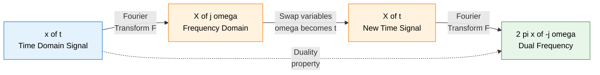
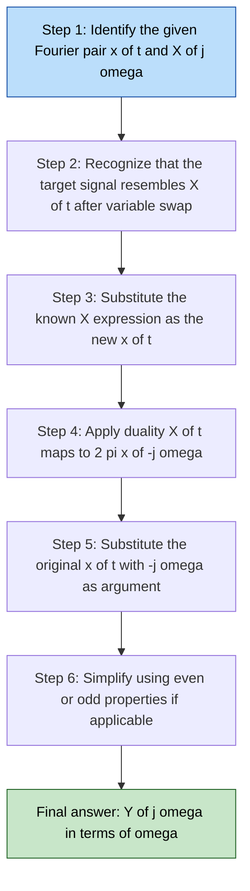
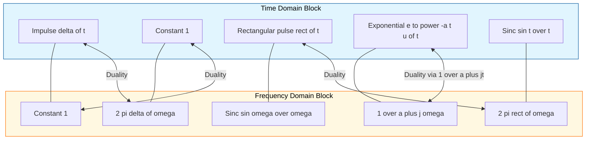

# Duality

<!-- SECTION_1_START -->
# Duality in Signals and Systems

## 1.1 Formal Academic Definition (KTU 2024 Syllabus Terminology)

> [!IMPORTANT]
> **Duality Property** is a fundamental symmetry property of the Fourier Transform that establishes a one-to-one correspondence between a signal in one domain (time) and its transform in the other domain (frequency), such that the roles of the two domains can be interchanged.

**Continuous-Time Fourier Transform (CTFT) Duality Theorem:**

If a time-domain signal $x(t)$ and its frequency-domain representation $X(j\omega)$ form a Fourier transform pair, denoted as:

$$x(t) \xleftrightarrow{\mathcal{F}} X(j\omega)$$

then the **Duality Property** states that:

$$X(t) \xleftrightarrow{\mathcal{F}} 2\pi \, x(-j\omega)$$

> [!NOTE]
> The notation $x(-j\omega)$ means we substitute $-j\omega$ for the variable $t$ in the original time-domain expression $x(t)$ and then scale by $2\pi$. This property holds because the forward and inverse Fourier transform equations are structurally symmetric, differing only by a constant factor ($1/2\pi$) and a sign change in the complex exponential.

**Discrete-Time Fourier Transform (DTFT) Duality Theorem:**

If $x[n] \xleftrightarrow{\text{DTFT}} X(e^{j\Omega})$, then:

$$X[n] \xleftrightarrow{\text{DTFT}} 2\pi \, x(e^{-j\Omega})$$

where the right-hand side is interpreted in the **periodic sense** with period $2\pi$.

## 1.2 Intuitive Real-World Analogy

> [!TIP]
> **Conceptual Analogy — The "Coin Flip" Metaphor:**
>
> Imagine a coin with two sides — **HEADS** labeled "Time Domain" and **TAILS** labeled "Frequency Domain." The Fourier Transform is the act of flipping the coin. The **Duality Property** is the remarkable observation that *the coin's two faces are interchangeable*. If you know what shape a "rectangle" looks like on the HEADS side (a sinc function appears on the TAILS side), then by duality, *a sinc on the HEADS side produces a rectangle on the TAILS side*. The relationship is fully symmetric, like a mirror placed between time and frequency.

**Geometric Intuition:**

* A **narrow pulse** in time is composed of many high-frequency components, producing a **wide spectrum** in frequency.
* A **wide pulse** in time changes slowly, producing a **narrow spectrum** in frequency.
* **Duality** captures this trade-off mathematically: if a signal $x(t)$ has a particular frequency content $X(\omega)$, then the "shape" $X(\omega)$ itself, when used as a time-domain signal, will produce a frequency content equal to the original shape reflected and scaled.

> [!VISUALIZATION CONTROL]
> **Concept:** Time-Frequency Domain Duality
> **GeoGebra / Desmos Input Equations:**
> * $x(t) = \text{rect}(t)$  (rectangular pulse: 1 for $\vert t \vert < 0.5$, 0 otherwise)
> * $X(\omega) = \frac{\sin(\omega/2)}{\omega/2}$  (sinc function)
> * $X(t) = \frac{\sin(t/2)}{t/2}$  (sinc as new time signal)
> * $Y(\omega) = 2\pi \,\text{rect}(\omega)$  (new frequency content)
> **Visual Description:** The student should observe that the rectangular shape in time (concentrated, finite duration) transforms into a smooth sinc curve in frequency (infinite extent, decaying lobes). By duality, when this sinc is treated as a time signal, its Fourier transform becomes a *rectangle* in frequency — the shapes have swapped!

## 1.3 Physical Constants and Standard Metrics

* The constant **$2\pi$** is the scaling factor that arises naturally from the angular frequency convention $\omega = 2\pi f$.
* When using the **Hertz** convention ($f$ in Hz), the duality property simplifies to the elegant form $X(t) \xleftrightarrow{\mathcal{F}} x(-f)$, with **no scaling constant** because the $2\pi$ is absorbed into the $df$ vs. $d\omega$ measure.

> [!IMPORTANT]
> **KTU 2024 Module Highlight:** In PECST416 Module 1, the duality property is introduced as a *structural symmetry* of the Fourier Transform operator, helping students recognize that the transform is essentially its own inverse (up to sign and scaling). This conceptual understanding is critical for Module 2 and Module 3 (Fourier Series, Fourier Transform, and Z-Transform).

<!-- SECTION_1_END -->

<!-- SECTION_2_START -->
# Deep Theoretical Analysis & KTU High-Yield Formula Sheet

## 2.1 Why Does Duality Exist? — The Symmetric Structure of the Fourier Transform

The **forward** CTFT equation is:

$$X(j\omega) = \int_{-\infty}^{\infty} x(t)\, e^{-j\omega t}\, dt$$

The **inverse** CTFT equation is:

$$x(t) = \frac{1}{2\pi} \int_{-\infty}^{\infty} X(j\omega)\, e^{+j\omega t}\, d\omega$$

Comparing the two equations:

* The forward transform **integrates** $x(t)$ weighted by $e^{-j\omega t}$.
* The inverse transform **integrates** $X(j\omega)$ weighted by $e^{+j\omega t}$, then divides by $2\pi$.
* The roles of $x$ and $X$ are *almost* symmetric — they are **dual** representations of the same underlying signal.

This structural similarity is the *root cause* of the duality property.

## 2.2 Formal Statement of Duality Theorems

### Theorem 1: CTFT Duality

If $x(t) \xleftrightarrow{\mathcal{F}} X(j\omega)$ (i.e., $X(j\omega)$ is the Fourier transform of $x(t)$), then:

$$\boxed{X(t) \xleftrightarrow{\mathcal{F}} 2\pi \, x(-j\omega)}$$

> [!NOTE]
> **Interpretation:** Take the *frequency-domain expression* $X(j\omega)$, relabel the variable $\omega$ as $t$ to form a new time-domain signal $X(t)$, then its Fourier transform is $2\pi$ times the *original* time signal $x(t)$ evaluated at $-j\omega$ (i.e., $t$ is replaced by $-j\omega$).

### Theorem 2: DTFT Duality

If $x[n] \xleftrightarrow{\text{DTFT}} X(e^{j\Omega})$, then:

$$\boxed{X[n] \xleftrightarrow{\text{DTFT}} 2\pi \, x(e^{-j\Omega})}$$

where the right-hand side is **$2\pi$-periodic** in $\Omega$.

### Theorem 3: Frequency-Domain Duality (using $f$ in Hz)

If $x(t) \xleftrightarrow{\mathcal{F}} X(f)$ where $X(f) = \mathcal{F}\{x(t)\} = \int x(t) e^{-j2\pi f t} dt$, then:

$$X(t) \xleftrightarrow{\mathcal{F}} x(-f)$$

> This is the cleanest form, free of the $2\pi$ scaling.

## 2.3 KTU Formula Sheet — Duality Cheat Sheet

| **Property** | **CTFT Form ($\omega$ in rad/s)** | **CTFT Form ($f$ in Hz)** | **DTFT Form** |
|:-------------|:----------------------------------|:--------------------------|:--------------|
| **Duality Statement** | $X(t) \xleftrightarrow{\mathcal{F}} 2\pi\, x(-j\omega)$ | $X(t) \xleftrightarrow{\mathcal{F}} x(-f)$ | $X[n] \xleftrightarrow{\text{DTFT}} 2\pi\, x(e^{-j\Omega})$ |
| **Scaling Constant** | $2\pi$ | None (absorbed in $df$) | $2\pi$ |
| **Periodic on RHS?** | No | No | Yes (period $2\pi$) |
| **Required Pre-condition** | Must know $x(t) \leftrightarrow X(j\omega)$ | Same as left | Must know $x[n] \leftrightarrow X(e^{j\Omega})$ |
| **Application** | Derive new pairs from known ones | Same | Same |
| **Step Count in Exam** | Show 3-4 steps: identify $x(t)$, find $X(j\omega)$, swap variables, scale by $2\pi$ | Similar but no $2\pi$ | Include periodicity in answer |

## 2.4 Engineering and Real-World Applications

> [!TIP]
> **Why does Duality matter in real engineering?**

1. **Filter Design (Signal Processing):** A low-pass filter's *impulse response* in time is a sinc function, while a *band-limited* signal in time is a sinc — the symmetry helps engineers quickly swap between filter specifications in time and frequency.
2. **Communications — OFDM:** Orthogonal Frequency Division Multiplexing uses the duality between time-multiplexed and frequency-multiplexed signals.
3. **Antenna Theory (Electromagnetics):** The duality between a thin wire antenna (long, narrow time-domain pulse equivalent) and a slot antenna (frequency-domain behavior) is a direct application of duality.
4. **Optics and Imaging:** The duality between the spatial domain (image coordinates) and spatial-frequency domain (Fourier optics) is governed by the same duality property.
5. **Spectroscopy:** A continuous spectrum (broadband) in frequency produces a short, impulsive signal in time (e.g., femtosecond laser pulses).

## 2.5 Logical Steps to Apply Duality

To derive a new Fourier transform pair using duality:

1. **Identify** the known transform pair: $x(t) \xleftrightarrow{\mathcal{F}} X(j\omega)$.
2. **Interchange variables:** Write $X(t)$ — that is, treat the *frequency expression* as a *time-domain signal*.
3. **Compute the transform:** The Fourier transform of this new time signal is $2\pi\, x(-j\omega)$.
4. **Simplify:** Use symmetry properties (e.g., $x(t)$ even implies $x(-j\omega) = x(j\omega)$) to clean up the result.

<!-- SECTION_2_END -->

<!-- SECTION_3_START -->
# Step-by-Step Derivations & Worked Examples

## 3.1 Complete Proof of CTFT Duality Theorem

**Statement:** If $x(t) \xleftrightarrow{\mathcal{F}} X(j\omega)$, then $X(t) \xleftrightarrow{\mathcal{F}} 2\pi\, x(-j\omega)$.

**Proof:**

We start with the **forward Fourier transform** of $X(t)$, treating it as a time-domain signal:

$$\mathcal{F}\{X(t)\} = \int_{-\infty}^{\infty} X(t)\, e^{-j\omega t}\, dt$$

> *Step 1: Substitute the integral form of $X(t)$.*

We know that $X(t) = \int_{-\infty}^{\infty} x(\tau)\, e^{-j\tau t}\, d\tau$ (using the variable $\tau$ instead of $t$ to avoid confusion). Substituting:

$$\mathcal{F}\{X(t)\} = \int_{-\infty}^{\infty} \left[\int_{-\infty}^{\infty} x(\tau)\, e^{-j\tau t}\, d\tau \right] e^{-j\omega t}\, dt$$

> *Step 2: Rearrange the order of integration (Fubini's theorem).*

$$\mathcal{F}\{X(t)\} = \int_{-\infty}^{\infty} x(\tau) \left[\int_{-\infty}^{\infty} e^{-j(\omega+\tau) t}\, dt \right] d\tau$$

> *Step 3: Recognize the inner integral as a Dirac delta.*

Using the fundamental identity:

$$\int_{-\infty}^{\infty} e^{-j(\omega+\tau) t}\, dt = 2\pi\, \delta(\omega + \tau)$$

Substituting:

$$\mathcal{F}\{X(t)\} = \int_{-\infty}^{\infty} x(\tau) \cdot 2\pi\, \delta(\omega + \tau)\, d\tau$$

> *Step 4: Apply the sifting property of the impulse function.*

Since $\delta(\omega + \tau)$ is non-zero only at $\tau = -\omega$:

$$\mathcal{F}\{X(t)\} = 2\pi\, x(-\omega)$$

> *Step 5: Match the result with the duality statement.*

In our notation, $x(-j\omega)$ represents the function $x$ evaluated at $-j\omega$, which for the frequency argument $\omega$ is the same as $x(-\omega)$. Therefore:

$$\boxed{\mathcal{F}\{X(t)\} = 2\pi\, x(-j\omega)}$$

This completes the proof. $\blacksquare$

---

## 3.2 Worked Example 1: Finding the FT of a Constant Signal

**Given:** $\delta(t) \xleftrightarrow{\mathcal{F}} 1$ (i.e., $x(t) = \delta(t)$ and $X(j\omega) = 1$).

**Find:** The Fourier transform of $x(t) = 1$ (a constant signal).

**Solution using Duality:**

> *Step 1: Identify the pair to apply duality.*

We are given: $x(t) = \delta(t)$ and $X(j\omega) = 1$.

> *Step 2: Apply the duality theorem.*

The duality theorem states that if $x(t) \xleftrightarrow{\mathcal{F}} X(j\omega)$, then $X(t) \xleftrightarrow{\mathcal{F}} 2\pi\, x(-j\omega)$.

Substituting $X(t) = 1$ (a constant signal) and $x(-j\omega) = \delta(-j\omega)$:

$$1 \xleftrightarrow{\mathcal{F}} 2\pi\, \delta(-j\omega)$$

> *Step 3: Simplify using the even property of the impulse.*

Since $\delta$ is an even function, $\delta(-j\omega) = \delta(j\omega)$. For real-valued frequency $\omega$, we can simply write $\delta(\omega)$:

$$1 \xleftrightarrow{\mathcal{F}} 2\pi\, \delta(\omega)$$

> **Final Answer:**
> $$\boxed{x(t) = 1 \xleftrightarrow{\mathcal{F}} X(j\omega) = 2\pi\, \delta(\omega)}$$

**Verification (Direct Computation):**

$$X(j\omega) = \int_{-\infty}^{\infty} 1 \cdot e^{-j\omega t}\, dt = 2\pi\, \delta(\omega) \quad \checkmark$$

---

## 3.3 Worked Example 2: FT of $\frac{1}{a + jt}$ via Duality

**Given:** The standard pair $e^{-at}\, u(t) \xleftrightarrow{\mathcal{F}} \dfrac{1}{a + j\omega}$ for $a > 0$.

**Find:** The Fourier transform of $g(t) = \dfrac{1}{a + jt}$.

**Solution using Duality:**

> *Step 1: Identify the given pair.*

$x(t) = e^{-at}\, u(t)$ and $X(j\omega) = \dfrac{1}{a + j\omega}$.

> *Step 2: Apply duality.*

By the duality theorem:

$$\frac{1}{a + jt} \xleftrightarrow{\mathcal{F}} 2\pi\, e^{-a(-j\omega)}\, u(-j\omega)$$

> *Step 3: Simplify the exponents and the unit step.*

* Exponent: $e^{-a(-j\omega)} = e^{a \cdot j\omega} = e^{j\omega a}$ (interpreting in the dual sense).
* Unit step: $u(-j\omega)$ for real $\omega$ is the step function evaluated at $-\omega$, so $u(-j\omega) = u(-\omega)$.

> *Step 4: Write the final answer.*

$$\boxed{\frac{1}{a + jt} \xleftrightarrow{\mathcal{F}} 2\pi\, e^{a\omega}\, u(-\omega)}$$

> [!NOTE]
> **Physical Interpretation:** The signal $\frac{1}{a+jt}$ is a *causal decaying oscillation* in the time domain. Its transform is a one-sided exponential in the *negative* frequency direction (since $u(-\omega) = 0$ for $\omega > 0$). This result has important applications in system theory and Hilbert transforms.

---

## 3.4 Worked Example 3: Rectangular Pulse ↔ Sinc Function (and Vice Versa)

**Given:** The rectangular pulse $x(t) = \text{rect}(t)$, where:

$$\text{rect}(t) = \begin{cases} 1, & \vert t \vert < \dfrac{1}{2} \\ 0, & \vert t \vert > \dfrac{1}{2} \end{cases}$$

has the known Fourier transform:

$$\text{rect}(t) \xleftrightarrow{\mathcal{F}} \text{sinc}\!\left(\frac{\omega}{2}\right) = \frac{\sin(\omega/2)}{\omega/2}$$

**Find:** The Fourier transform of $y(t) = \dfrac{\sin(t/2)}{t/2} = \text{sinc}(t/2)$.

**Solution using Duality:**

> *Step 1: Identify the known pair.*

$x(t) = \text{rect}(t)$ and $X(j\omega) = \dfrac{\sin(\omega/2)}{\omega/2}$.

> *Step 2: Apply duality.*

The duality theorem gives:

$$\frac{\sin(t/2)}{t/2} \xleftrightarrow{\mathcal{F}} 2\pi\, \text{rect}(-j\omega)$$

> *Step 3: Simplify using the even property of rect.*

Since $\text{rect}$ is an even function: $\text{rect}(-j\omega) = \text{rect}(j\omega) = \text{rect}(\omega)$.

> **Final Answer:**
> $$\boxed{\frac{\sin(t/2)}{t/2} \xleftrightarrow{\mathcal{F}} 2\pi\, \text{rect}(\omega)}$$

**Equivalent Forms (commonly used in KTU exams):**

| Form | Time Domain | Frequency Domain |
|:-----|:------------|:-----------------|
| Standard | $\dfrac{\sin(t/2)}{t/2}$ | $2\pi \cdot \text{rect}(\omega)$ |
| Generalized | $\dfrac{\sin(Wt)}{\pi t}$ | $\text{rect}\!\left(\dfrac{\omega}{2W}\right)$ |
| Alternative | $\dfrac{\sin(\pi t)}{\pi t} = \text{sinc}(t)$ | $\text{rect}(\omega/2)$ |

---

## 3.5 Worked Example 4: DTFT Duality Application

**Given:** $x[n] = \delta[n] \xleftrightarrow{\text{DTFT}} X(e^{j\Omega}) = 1$.

**Find:** The DTFT of $X[n] = 1$ (a discrete-time constant signal).

**Solution using DTFT Duality:**

> *Step 1: Apply the DTFT duality theorem.*

$$X[n] = 1 \xleftrightarrow{\text{DTFT}} 2\pi\, \delta(e^{-j\Omega})$$

> *Step 2: Express the periodic impulse train in frequency.*

For DTFT, the periodic impulse train in frequency domain is:

$$2\pi\, \sum_{k=-\infty}^{\infty} \delta(\Omega - 2\pi k)$$

> **Final Answer:**
> $$\boxed{1 \xleftrightarrow{\text{DTFT}} 2\pi \sum_{k=-\infty}^{\infty} \delta(\Omega - 2\pi k)}$$

> [!NOTE]
> **Important:** Unlike the CTFT, the DTFT of a constant is a *periodic impulse train* in frequency, with impulses at $\Omega = 2\pi k$ for all integer $k$. This periodicity reflects the discrete nature of the time-domain signal.

---

## 3.6 Numerical Example: Application of Duality in Computation

**Problem:** A signal $x(t) = e^{-2t} u(t)$ has Fourier transform $X(j\omega) = \dfrac{1}{2 + j\omega}$. Without computing any new integrals, find the Fourier transform of:

$$y(t) = \frac{1}{2 + jt}$$

**Solution:**

By the duality theorem with $a = 2$:

$$y(t) = \frac{1}{2 + jt} \xleftrightarrow{\mathcal{F}} Y(j\omega) = 2\pi\, e^{2\omega}\, u(-\omega)$$

> *Verification of dimensions and behavior:*
> * As $\omega \to -\infty$, $Y(j\omega) \to 0$ ✓ (causal-like behavior on the negative side).
> * As $\omega \to +\infty$, $Y(j\omega) \to 0$ ✓ (rapid decay).
> * $Y(j\omega)$ has a peak at $\omega = 0$ where $Y(0) = 2\pi$. ✓

<!-- SECTION_3_END -->

<!-- SECTION_4_START -->
# Structural Diagrams & Schematics

## 4.1 Conceptual Block Diagram: Time-Frequency Duality

**Description of the flow:** A signal in the time domain (left, blue) is mapped to its frequency-domain representation (orange). By treating the frequency-domain expression as a *new* time-domain signal and applying the Fourier transform, we obtain a *dual* frequency-domain expression (green) that is a scaled, reflected version of the original time signal. The dashed line shows that duality lets us skip the explicit computation.

## 4.2 Process Flow: Applying Duality in an Exam Problem

## 4.3 Functional Architecture: Duality as a Bridge Between Domains

**Description of the architecture:** The Time Domain Block (left, blue) and Frequency Domain Block (right, orange) are connected by solid lines representing the *direct* Fourier transform relationships. The *dashed* lines with double arrows (shown only on the first two for clarity) represent the *duality* relationship — proving that the Fourier transform of one block's element can be obtained from another element in the opposite block. This is the structural symmetry at the heart of the duality property.

## 4.4 Sequential Processing Topology: Duality Computation Pipeline

| **Stage** | **Input** | **Operation** | **Output** |
|:----------|:----------|:--------------|:-----------|
| **Stage 1** | Known pair: $x(t)$, $X(j\omega)$ | Identify | $x(t) = e^{-at}u(t)$, $X(j\omega) = \frac{1}{a+j\omega}$ |
| **Stage 2** | $X(j\omega)$ | Relabel $\omega \to t$ | $X(t) = \frac{1}{a+jt}$ |
| **Stage 3** | $X(t)$ | Apply FT | $\mathcal{F}\{X(t)\} = 2\pi\, x(-j\omega)$ |
| **Stage 4** | $x(t)$ | Substitute $t \to -j\omega$ | $2\pi\, e^{a\omega}\, u(-\omega)$ |
| **Stage 5** | Final | Verify and box | $\frac{1}{a+jt} \xleftrightarrow{\mathcal{F}} 2\pi\, e^{a\omega}\, u(-\omega)$ |

<!-- SECTION_4_END -->

<!-- SECTION_5_START -->
# KTU 2024 Scheme Examination Question Bank & Topic Recap

## 5.1 Part A — Short Answer Questions (3 Marks Each)

### Question A1: Conceptual Recall `[KTU University Exam - July 2024]`
**CO1 / L1 — Remember**

**Q:** State the Duality Property of the Continuous-Time Fourier Transform. If $x(t) \xleftrightarrow{\mathcal{F}} X(j\omega)$, write the dual pair and explain the role of the $2\pi$ factor.

**Model Answer (3 marks):**

> The Duality Property states that if $x(t) \xleftrightarrow{\mathcal{F}} X(j\omega)$, then
> $$X(t) \xleftrightarrow{\mathcal{F}} 2\pi\, x(-j\omega)$$
> **Role of $2\pi$:** It arises from the inverse Fourier transform formula, which contains the factor $\frac{1}{2\pi}$ to normalize the integral. When we swap the forward and inverse operations, the scaling constant $2\pi$ emerges to maintain the unit consistency between the time and frequency domain representations. **[3 marks: 1 mark statement + 1 mark dual pair + 1 mark explanation of $2\pi$]**

---

### Question A2: Application `[KTU University Exam - Dec 2023]`
**CO2 / L3 — Apply**

**Q:** Given that $\delta(t) \xleftrightarrow{\mathcal{F}} 1$, apply the Duality Property to find the Fourier transform of the constant signal $x(t) = 1$.

**Model Answer (3 marks):**

> **Step 1:** Given: $x(t) = \delta(t)$, $X(j\omega) = 1$. **[1 mark]**
>
> **Step 2:** Apply duality: $X(t) = 1 \xleftrightarrow{\mathcal{F}} 2\pi\, x(-j\omega) = 2\pi\, \delta(-j\omega)$. **[1 mark]**
>
> **Step 3:** Since $\delta$ is even, $\delta(-j\omega) = \delta(\omega)$, giving the final answer:
> $$1 \xleftrightarrow{\mathcal{F}} 2\pi\, \delta(\omega)$$ **[1 mark]**

---

## 5.2 Part B — Long Answer Questions (14 Marks Each, with Internal Choice)

### Question A: Full Duality Derivation and Application `[KTU University Exam - July 2024]`

#### Part (a): State and prove the Duality Property of the CTFT. **[7 Marks]** (CO1, L2 + L3)

**Model Solution:**

> **Statement (2 marks):**
> If $x(t) \xleftrightarrow{\mathcal{F}} X(j\omega)$, then $X(t) \xleftrightarrow{\mathcal{F}} 2\pi\, x(-j\omega)$.

> **Proof (5 marks):**
> We compute $\mathcal{F}\{X(t)\}$:
> $$\mathcal{F}\{X(t)\} = \int_{-\infty}^{\infty} X(t)\, e^{-j\omega t}\, dt$$
> Substituting $X(t) = \int_{-\infty}^{\infty} x(\tau) e^{-j\tau t} d\tau$ and swapping the order of integration:
> $$= \int_{-\infty}^{\infty} x(\tau) \left[\int_{-\infty}^{\infty} e^{-j(\omega+\tau) t}\, dt \right] d\tau$$
> Using the identity $\int_{-\infty}^{\infty} e^{-j(\omega+\tau) t}\, dt = 2\pi\, \delta(\omega+\tau)$:
> $$= \int_{-\infty}^{\infty} x(\tau) \cdot 2\pi\, \delta(\omega + \tau)\, d\tau = 2\pi\, x(-\omega) = 2\pi\, x(-j\omega)$$

**Valuation Key:** [Statement: 2 marks], [Setting up double integral: 1 mark], [Recognizing delta identity: 1 mark], [Sifting property: 1 mark], [Final result: 1 mark].

#### Part (b): Using the result of (a) and the fact that $\text{rect}(t) \xleftrightarrow{\mathcal{F}} \dfrac{\sin(\omega/2)}{\omega/2}$, find the Fourier transform of $\dfrac{\sin(t/2)}{t/2}$ without direct integration. **[7 Marks]** (CO2, L3)

**Model Solution:**

> **Step 1:** Identify the given pair: $x(t) = \text{rect}(t)$, $X(j\omega) = \dfrac{\sin(\omega/2)}{\omega/2}$. **[1 mark]**
>
> **Step 2:** By the duality theorem, the FT of $X(t) = \dfrac{\sin(t/2)}{t/2}$ is:
> $$\mathcal{F}\left\{\frac{\sin(t/2)}{t/2}\right\} = 2\pi\, \text{rect}(-j\omega)$$ **[3 marks]**
>
> **Step 3:** Since $\text{rect}$ is an even function, $\text{rect}(-j\omega) = \text{rect}(\omega)$. **[1 mark]**
>
> **Final Answer:**
> $$\frac{\sin(t/2)}{t/2} \xleftrightarrow{\mathcal{F}} 2\pi\, \text{rect}(\omega)$$ **[2 marks]**

**Valuation Key:** [Identifying pair: 1 mark], [Applying duality: 3 marks], [Even property: 1 mark], [Final boxed answer: 2 marks].

---

### Question B: Dual Approach — Derive and Then Apply `[KTU University Exam - Dec 2023]`

#### Part (a): Derive the Fourier transform of $x(t) = e^{-at} u(t)$ for $a > 0$ using direct integration. **[7 Marks]** (CO1, L3)

**Model Solution:**

> **Step 1:** Write the forward Fourier transform:
> $$X(j\omega) = \int_{-\infty}^{\infty} e^{-at} u(t)\, e^{-j\omega t}\, dt$$
> Since $u(t) = 0$ for $t < 0$ and $u(t) = 1$ for $t \geq 0$:
> $$X(j\omega) = \int_{0}^{\infty} e^{-at}\, e^{-j\omega t}\, dt = \int_{0}^{\infty} e^{-(a+j\omega) t}\, dt$$ **[2 marks]**
>
> **Step 2:** Evaluate the integral:
> $$X(j\omega) = \left[\frac{e^{-(a+j\omega)t}}{-(a+j\omega)}\right]_{0}^{\infty} = \frac{0 - 1}{-(a+j\omega)} = \frac{1}{a + j\omega}$$ **[3 marks]**
>
> **Step 3:** State convergence condition: $a > 0$ ensures the integral converges. **[1 mark]**
>
> **Final Answer:**
> $$e^{-at} u(t) \xleftrightarrow{\mathcal{F}} \frac{1}{a+j\omega}, \quad a > 0$$ **[1 mark]**

**Valuation Key:** [Setting up integral: 2 marks], [Evaluation: 3 marks], [Convergence: 1 mark], [Final answer: 1 mark].

#### Part (b): Using the result of (a) and the Duality Property, derive the Fourier transform of $y(t) = \dfrac{1}{a + jt}$ for $a > 0$. **[7 Marks]** (CO2, L4)

**Model Solution:**

> **Step 1:** Given pair: $x(t) = e^{-at} u(t)$, $X(j\omega) = \dfrac{1}{a + j\omega}$. **[1 mark]**
>
> **Step 2:** Identify the target: $y(t) = \dfrac{1}{a + jt}$ matches the form $X(t) = \dfrac{1}{a + jt}$. **[1 mark]**
>
> **Step 3:** Apply duality:
> $$\mathcal{F}\left\{\frac{1}{a+jt}\right\} = 2\pi\, x(-j\omega) = 2\pi\, e^{-a(-j\omega)} u(-j\omega)$$ **[3 marks]**
>
> **Step 4:** Simplify:
> $$= 2\pi\, e^{aj\omega} u(-j\omega) = 2\pi\, e^{a\omega} u(-\omega)$$ **[2 marks]**
>
> **Final Answer:**
> $$\frac{1}{a+jt} \xleftrightarrow{\mathcal{F}} 2\pi\, e^{a\omega} u(-\omega), \quad a > 0$$

**Valuation Key:** [Identifying pair: 1 mark], [Matching target: 1 mark], [Duality application: 3 marks], [Simplification: 2 marks].

---

## 5.3 KTU Examiner's Valuation Warning / Pitfall Callout

> [!WARNING]
> **Common Mistakes That Cost Marks:**
>
> 1. **Forgetting the $2\pi$ factor:** Many students correctly identify the dual pair but forget to scale by $2\pi$. Always include $2\pi$ for the $\omega$ convention; use the $f$ convention to avoid this.
>
> 2. **Missing the sign flip:** The dual pair is $X(t) \xleftrightarrow{\mathcal{F}} 2\pi\, x(-j\omega)$, not $2\pi\, x(j\omega)$. The argument is $-j\omega$, not $+j\omega$. This sign matters for odd functions.
>
> 3. **Ignoring even/odd properties:** When $\delta(-j\omega)$ or $\text{rect}(-j\omega)$ appears, students should recognize the function is even and simplify, rather than leaving the negative argument in the answer.
>
> 4. **Confusing time and frequency variable names:** A common error is to write $X(t) = \frac{1}{a + jt}$ and then mistakenly apply the original pair's transform formula. Always relabel variables carefully.
>
> 5. **Forgetting the unit step function's role in the dual pair:** In the example $e^{-at}u(t) \leftrightarrow \frac{1}{a+j\omega}$, the dual result $2\pi\, e^{a\omega} u(-\omega)$ MUST include $u(-\omega)$ to indicate the function is one-sided. Omitting this loses 1-2 marks.
>
> 6. **Not showing intermediate steps:** KTU examiners award step-wise marks. Even if you know the final answer, write the *intermediate* forms (variable swap, substitution, simplification).

---

## 5.4 Topic Recap & Important Things to Remember

> [!IMPORTANT]
> **Rapid Revision Checklist — Duality Property**

- [x] **Duality (CTFT):** $x(t) \xleftrightarrow{\mathcal{F}} X(j\omega)$ implies $X(t) \xleftrightarrow{\mathcal{F}} 2\pi\, x(-j\omega)$.
- [x] **Duality (DTFT):** $x[n] \xleftrightarrow{\text{DTFT}} X(e^{j\Omega})$ implies $X[n] \xleftrightarrow{\text{DTFT}} 2\pi\, x(e^{-j\Omega})$ (periodic).
- [x] **Duality (Hz form):** $X(t) \xleftrightarrow{\mathcal{F}} x(-f)$ — cleanest form, no scaling constant.
- [x] **Origin of Duality:** Structural symmetry of forward and inverse Fourier transform equations.
- [x] **Standard Pair 1:** $\delta(t) \leftrightarrow 1$ → By duality, $1 \leftrightarrow 2\pi\, \delta(\omega)$.
- [x] **Standard Pair 2:** $\text{rect}(t) \leftrightarrow \frac{\sin(\omega/2)}{\omega/2}$ → By duality, $\frac{\sin(t/2)}{t/2} \leftrightarrow 2\pi\, \text{rect}(\omega)$.
- [x] **Standard Pair 3:** $e^{-at}u(t) \leftrightarrow \frac{1}{a+j\omega}$ → By duality, $\frac{1}{a+jt} \leftrightarrow 2\pi\, e^{a\omega} u(-\omega)$.
- [x] **The $2\pi$ factor** arises from the angular frequency convention $\omega = 2\pi f$.
- [x] **The sign flip $-j\omega$** must be preserved; can be dropped only when the function is even.
- [x] **Impulse function is even:** $\delta(-x) = \delta(x)$ — always simplify when applicable.
- [x] **Even functions preserve their form under sign flip:** $f(-x) = f(x)$ for even $f$.
- [x] **DTFT duality** always produces a $2\pi$-periodic result (impulse train or periodic continuation).
- [x] **Practical use:** Duality is the fastest way to derive new Fourier transform pairs in exams — saves 3-4 lines of integration per problem.
- [x] **Exam Tip:** If a question asks for the Fourier transform of a "frequency-shaped" time signal (like $\text{sinc}(t/2)$ or $1/(a+jt)$), always try duality first.

<!-- SECTION_5_END -->
