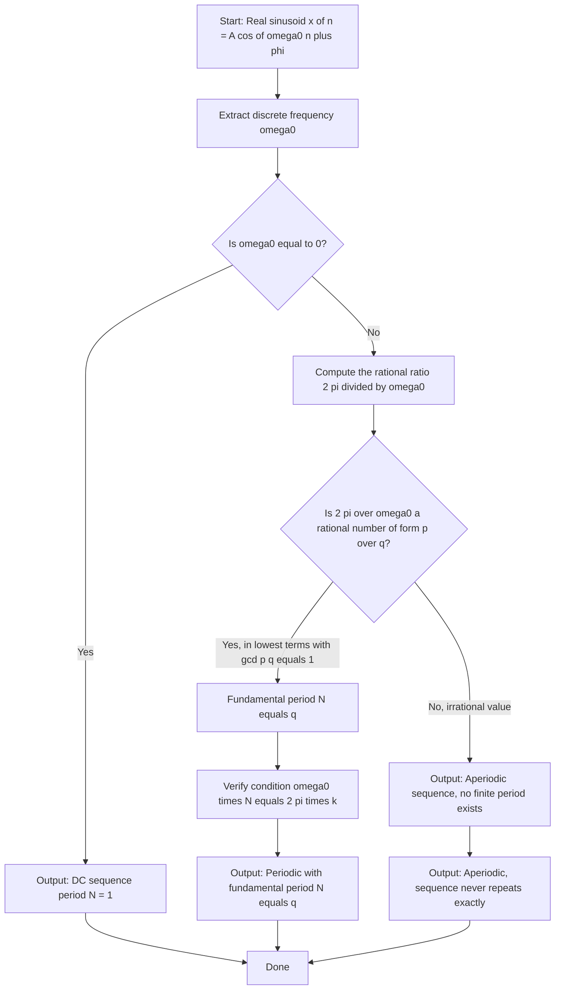
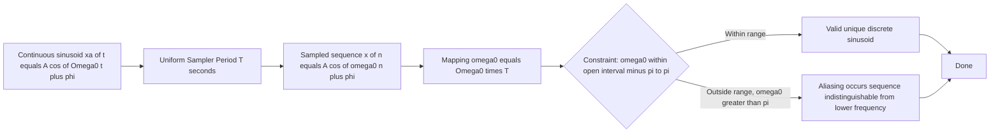
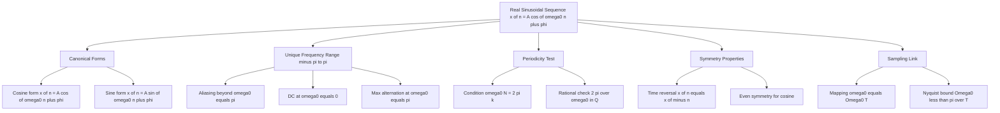

# Elementary sequences- Real Sinusoidal Sequences

<!-- SECTION_1_START -->

# 1. Core Technical Definition & Intuitive Overview

## 1.1 Formal Definition (KTU 2024 Syllabus Terminology)

A **real sinusoidal sequence** is a discrete-time signal whose sample values follow a sinusoidal pattern as a function of the integer index $n$. The two canonical forms are:

$$x[n] = A \cos(\omega_0 n + \phi)$$

$$x[n] = A \sin(\omega_0 n + \phi)$$

where each parameter carries strict physical meaning in the discrete-time domain:

- $A$ &rarr; **Amplitude** of the sequence (real-valued scaling factor)
- $\omega_0$ &rarr; **Discrete angular frequency** measured in **radians per sample** (rad/sample)
- $\phi$ &rarr; **Phase offset** measured in radians
- $n \in \mathbb{Z}$ &rarr; Discrete integer time index

> [!IMPORTANT]
> **KTU 2024 Highlight:** Unlike continuous-time sinusoids $x_a(t) = A \cos(\Omega_0 t + \phi)$ that can oscillate at any real frequency $\Omega_0 \in \mathbb{R}$, a discrete sinusoid is **unique only over a finite frequency range**. Two sinusoids with frequencies $\omega_0$ and $\omega_0 + 2\pi k$ (where $k \in \mathbb{Z}$) produce **exactly the same sequence**. Hence the unique fundamental interval is:
> $$\omega_0 \in (-\pi, \pi] \quad \text{or equivalently} \quad \omega_0 \in [0, 2\pi)$$

## 1.2 Conceptual Analogy & Intuitive Picture

> [!NOTE]
> **Analogy — The "Stroboscopic Pendulum":**
> Imagine a grandfather clock pendulum swinging smoothly. Now imagine photographing the pendulum once every second (sampling it). The discrete snapshots you obtain form a sinusoidal *sequence*. If you photograph faster (higher sampling rate), the snapshots alternate more rapidly &rarr; the **discrete frequency increases**. If you slow down the camera, snapshots repeat &rarr; the **discrete frequency decreases**. Crucially, if you take *exactly* one photo every half-period of the pendulum, the sequence merely alternates between two values &rarr; this corresponds to the **maximum unique discrete frequency** $\omega_0 = \pi$ rad/sample.

The geometric intuition:

| Domain | Range of Unique Frequencies | Reason |
|---|---|---|
| Continuous-time $x_a(t)$ | $\Omega_0 \in (-\infty, \infty)$ | True real line; no aliasing |
| Discrete-time $x[n]$ | $\omega_0 \in (-\pi, \pi]$ | Nyquist folding; periodicity of $2\pi$ |

A discrete sinusoid reaches its **fastest possible oscillation** at $\omega_0 = \pi$, where it alternates between $+A$ and $-A$ on every step: $x[n] = A \cos(\pi n) = \{A, -A, A, -A, \dots\}$.

## 1.3 Sampling Bridge — Connecting Analog and Digital

If a continuous sinusoid $x_a(t) = A \cos(\Omega_0 t + \phi)$ is sampled uniformly at period $T$ (sampling frequency $\Omega_s = 2\pi / T$), the resulting discrete sequence is:

$$x[n] = x_a(nT) = A \cos(\Omega_0 T \cdot n + \phi) = A \cos(\omega_0 n + \phi)$$

This yields the foundational **mapping relation**:

$$\boxed{\omega_0 = \Omega_0 \, T}$$

> [!VISUALIZATION CONTROL]
> **Concept:** Family of discrete cosine sequences at varying $\omega_0$ (Stem plot preview)
> **Python/MATLAB Reference Equations:**
> * `n = -15:15`
> * `x1[n] = cos(0.1 * n)` &rarr; very slow oscillation
> * `x2[n] = cos(pi/4 * n)` &rarr; moderate oscillation
> * `x3[n] = cos(pi/2 * n)` &rarr; fast oscillation
> * `x4[n] = cos(pi * n)` &rarr; maximum oscillation (alternating $\pm 1$)
> **Visual Description:** On a stem plot with horizontal axis $n$ and vertical axis $x[n]$, the stem "density" visibly increases as $\omega_0$ grows from $0$ toward $\pi$. Past $\pi$, the pattern would mirror and reverse, illustrating aliasing.

<!-- SECTION_1_END -->

<!-- SECTION_2_START -->

# 2. Deep Theoretical Analysis & KTU High-Yield Formula Sheet

## 2.1 The Two Canonical Forms

### Form 1 — Cosine Sequence

$$x_c[n] = A \cos(\omega_0 n + \phi)$$

- An **even function** of $(\omega_0 n + \phi)$ for symmetric $\phi$
- Reaches its **peak** when $\omega_0 n + \phi = 2\pi k$, $k \in \mathbb{Z}$
- Reaches its **trough** when $\omega_0 n + \phi = \pi + 2\pi k$

### Form 2 — Sine Sequence

$$x_s[n] = A \sin(\omega_0 n + \phi)$$

- Reaches its **peak** when $\omega_0 n + \phi = \pi/2 + 2\pi k$
- Reaches its **trough** when $\omega_0 n + \phi = 3\pi/2 + 2\pi k$

## 2.2 Critical Properties (Board-Favorite Theory)

> [!IMPORTANT]
> **Why uniqueness is restricted to $\omega_0 \in (-\pi, \pi]$:** Because the cosine function is $2\pi$-periodic in its argument, and the argument is $\omega_0 n$:
> $$\cos((\omega_0 + 2\pi k) n + \phi) = \cos(\omega_0 n + 2\pi k n + \phi) = \cos(\omega_0 n + \phi) \quad \forall n \in \mathbb{Z}, \; k \in \mathbb{Z}$$

This means **infinitely many continuous frequencies collapse onto the same discrete sequence** — the phenomenon called **aliasing** in digital signal processing.

### Property 1 — Time-Reversal Symmetry

$$A \cos(\omega_0 n + \phi) = A \cos(-\omega_0 n - \phi)$$

So a sequence with frequency $\omega_0$ and one with frequency $-\omega_0$ are *time-reversed mirrors* of each other.

### Property 2 — Reflection Symmetry

$$A \cos(\omega_0 n + \phi) = A \cos((2\pi - \omega_0) n - \phi)$$

So a frequency $\omega_0 \in (0, \pi)$ and its "reflected" frequency $2\pi - \omega_0 \in (\pi, 2\pi)$ produce **time-reversed** versions of the same waveform.

### Property 3 — Periodicity Condition (Most Important)

A discrete sinusoid is periodic **if and only if** there exists a positive integer $N$ such that:

$$\boxed{\omega_0 \, N = 2\pi k, \quad k \in \mathbb{Z}^+}$$

This forces the **ratio** $\dfrac{\omega_0}{2\pi}$ to be **rational**, i.e.:

$$\frac{\omega_0}{2\pi} = \frac{k}{N} \quad \text{(in lowest terms, } \gcd(k, N) = 1\text{)}$$

The **fundamental period** is then the smallest such $N$.

> [!WARNING]
> **Common Board Mistake:** Students often write that *every* discrete sinusoid is periodic. This is **FALSE**. A discrete sinusoid is aperiodic whenever $2\pi / \omega_0$ is irrational (e.g., $\omega_0 = 0.1$ rad or $\omega_0 = 1$ rad). The sequence simply never repeats exactly because the index $n$ steps in integer jumps that do not align with the period of the underlying sine wave.

### Property 4 — Extreme Frequencies

| Frequency | Sequence Behaviour | Period $N$ |
|---|---|---|
| $\omega_0 = 0$ | $x[n] = A \cos(\phi)$ — constant (DC) | $1$ (by convention) |
| $\omega_0 = \pi$ | $x[n] = A \cos(\pi n) = A(-1)^n$ — fastest alternation | $2$ |
| $\omega_0 = \pi/2$ | $x[n] = A \cos(\pi n/2)$ — four-level pattern | $4$ |
| $\omega_0 = 2\pi/3$ | Repeats every 3 samples | $3$ |

## 2.3 KTU Formula Sheet / Cheat Sheet

| \# | Property | Mathematical Expression | Constraint / Units |
|---|---|---|---|
| 1 | Cosine form | $x[n] = A \cos(\omega_0 n + \phi)$ | $A \in \mathbb{R},\; \omega_0 \in \mathbb{R},\; \phi \in \mathbb{R}$ |
| 2 | Sine form | $x[n] = A \sin(\omega_0 n + \phi)$ | Same as above |
| 3 | Sampling link | $\omega_0 = \Omega_0 T$ | $\Omega_0$ in rad/s, $T$ in seconds |
| 4 | Unique frequency interval | $\omega_0 \in (-\pi, \pi]$ | radians/sample |
| 5 | Periodic condition | $\omega_0 N = 2\pi k$ | $N, k \in \mathbb{Z}^+$ |
| 6 | Fundamental period | $N = \dfrac{2\pi k}{\omega_0}$ (smallest integer $N$) | Exists iff $2\pi/\omega_0 \in \mathbb{Q}$ |
| 7 | Periodicity rational test | $\dfrac{\omega_0}{2\pi} = \dfrac{k}{N}$ with $\gcd(k,N)=1$ | $N$ = fundamental period |
| 8 | Nyquist bound | $\omega_0 \leq \pi \iff \Omega_0 \leq \Omega_s / 2$ | Anti-aliasing limit |
| 9 | Time reversal | $A\cos(\omega_0 n + \phi) = A\cos(-\omega_0 n - \phi)$ | Mirror symmetry |
| 10 | DC sequence | $\omega_0 = 0 \Rightarrow x[n] = A\cos(\phi)$ | Constant for all $n$ |
| 11 | Highest freq. sequence | $\omega_0 = \pi \Rightarrow x[n] = A(-1)^n$ | Alternates $\pm A$ |
| 12 | Total energy per period | $E_N = \sum_{n=0}^{N-1} \vert x[n] \vert^2 = A^2 N / 2$ | For cosine; for sine identical |
| 13 | Time-average power | $P = \dfrac{1}{N}\sum_{n=0}^{N-1} \vert x[n] \vert^2 = \dfrac{A^2}{2}$ | For sinusoidal sequences |

> [!NOTE]
> **Engineering Utility:** Real sinusoidal sequences are the *atomic building blocks* of all discrete signals via the **Discrete-Time Fourier Series (DTFS)** and the **Discrete-Time Fourier Transform (DTFT)**. They appear in digital audio (musical notes sampled at 44.1 kHz), OFDM communication carriers, vibration analysis in mechanical engineering, and biomedical signal processing (ECG, EEG spectral components).

<!-- SECTION_2_END -->

<!-- SECTION_3_START -->

# 3. Step-by-Step Derivations & Symbolic / Code Implementation

## 3.1 Exhaustive Proof — Periodicity Condition

> **Theorem.** The discrete-time sequence $x[n] = A \cos(\omega_0 n + \phi)$ is periodic if and only if there exist positive integers $N$ and $k$ such that $\omega_0 N = 2\pi k$. The fundamental period is then the smallest such $N$.

### Derivation — Forward Direction ($\Rightarrow$)

Assume $x[n]$ is periodic with period $N \in \mathbb{Z}^+$. By definition of periodicity:

$$x[n + N] = x[n] \quad \text{for all } n \in \mathbb{Z}$$

Substituting the closed form:

$$A \cos(\omega_0 (n + N) + \phi) = A \cos(\omega_0 n + \phi)$$

Dividing by $A$ (assuming $A \neq 0$):

$$\cos(\omega_0 n + \omega_0 N + \phi) = \cos(\omega_0 n + \phi)$$

Using the cosine equality criterion $\cos(\theta_1) = \cos(\theta_2)$ if and only if $\theta_1 = \pm \theta_2 + 2\pi m$ for some integer $m$:

**Case 1:** $\omega_0 n + \omega_0 N + \phi = \omega_0 n + \phi + 2\pi m$

Cancelling $\omega_0 n$ and $\phi$ from both sides:

$$\omega_0 N = 2\pi m$$

Setting $k = m \in \mathbb{Z}^+$:

$$\omega_0 N = 2\pi k \quad \blacksquare$$

**Case 2:** $\omega_0 n + \omega_0 N + \phi = -(\omega_0 n + \phi) + 2\pi m$

This simplifies to:

$$2 \omega_0 n + \omega_0 N + 2\phi = 2\pi m$$

The left side depends on $n$ (through $2\omega_0 n$). For the equality to hold for **all** $n$, we need $\omega_0 = 0$, which collapses the sequence to a DC value (trivially periodic with $N = 1$). For $\omega_0 \neq 0$, this case is impossible.

### Derivation — Reverse Direction ($\Leftarrow$)

Suppose $\omega_0 N = 2\pi k$ for some $N, k \in \mathbb{Z}^+$. Then:

$$x[n + N] = A \cos(\omega_0 (n + N) + \phi) = A \cos(\omega_0 n + \omega_0 N + \phi)$$

Substituting $\omega_0 N = 2\pi k$:

$$x[n + N] = A \cos(\omega_0 n + 2\pi k + \phi) = A \cos(\omega_0 n + \phi) = x[n]$$

because $\cos(\theta + 2\pi k) = \cos(\theta)$ for any integer $k$. Hence $x[n]$ is periodic with period $N$. $\blacksquare$

### Worked Numerical Example — Finding the Fundamental Period

**Problem:** Find the fundamental period of $x[n] = 5 \cos(0.3\pi n + \pi/4)$.

**Step 1.** Identify $\omega_0 = 0.3\pi$ rad/sample.

**Step 2.** Apply the periodicity condition:

$$\omega_0 N = 2\pi k \;\Rightarrow\; 0.3\pi \cdot N = 2\pi k \;\Rightarrow\; N = \frac{2k}{0.3} = \frac{20k}{3}$$

**Step 3.** For $N$ to be the smallest positive integer, choose the smallest $k$ that makes $N$ an integer:

- $k = 3 \Rightarrow N = 20$ &rarr; $\gcd(3, 20) = 1$, so this is the fundamental period.

**Step 4.** Verify: $0.3\pi \cdot 20 = 6\pi = 2\pi \cdot 3$. ✓

**Answer:** $x[n]$ is periodic with fundamental period $N = 20$.

## 3.2 Worked Example — Aperiodic Case

**Problem:** Is $x[n] = 2 \sin(0.1 n)$ periodic?

**Step 1.** $\omega_0 = 0.1$ rad/sample.

**Step 2.** Required: $N = \dfrac{2\pi k}{0.1} = 20\pi k \approx 62.8319 \, k$.

**Step 3.** For $N$ to be a positive integer, $k$ must be such that $20\pi k \in \mathbb{Z}$. Since $\pi$ is irrational, no integer $k > 0$ satisfies this.

**Answer:** The sequence is **aperiodic** — it never exactly repeats itself.

## 3.3 Full Python Implementation (Type-Hinted, Error-Logged, Plotting-Enabled)

```python
import numpy as np
import matplotlib.pyplot as plt
from typing import Tuple, Dict, Optional


def analyze_sinusoid(
    omega_0: float,
    max_search: int = 2000,
    tolerance: float = 1e-9
) -> Dict[str, Optional[object]]:
    """
    Analyze a discrete-time sinusoidal sequence x[n] = cos(omega_0 * n).
    Determines whether the sequence is periodic and finds the fundamental
    period by searching for the smallest positive integer N such that
    omega_0 * N is an integer multiple of 2*pi.

    Parameters
    ----------
    omega_0 : float
        Discrete angular frequency in radians per sample.
    max_search : int, optional
        Upper bound on the search for the fundamental period (default 2000).
    tolerance : float, optional
        Numerical tolerance for the integer-multiple check (default 1e-9).

    Returns
    -------
    dict
        Keys: 'periodic' (bool), 'period' (int or None), 'k' (int or None),
        'comment' (str).
    """
    if not isinstance(omega_0, (int, float)):
        raise TypeError("omega_0 must be a real number (int or float).")
    if max_search <= 0:
        raise ValueError("max_search must be a positive integer.")

    # Special case: DC sequence (omega_0 = 0)
    if abs(omega_0) < tolerance:
        return {
            "periodic": True,
            "period": 1,
            "k": 0,
            "comment": "DC signal (omega_0 = 0). Conventionally, period = 1."
        }

    # Search for the smallest N such that omega_0 * N ≈ 2*pi * k
    for N in range(1, max_search + 1):
        scaled = omega_0 * N / (2.0 * np.pi)
        k_approx = round(scaled)
        if abs(scaled - k_approx) < tolerance and k_approx > 0:
            return {
                "periodic": True,
                "period": N,
                "k": k_approx,
                "comment": f"Periodic with fundamental period N = {N} (k = {k_approx})."
            }

    return {
        "periodic": False,
        "period": None,
        "k": None,
        "comment": "Aperiodic: 2*pi/omega_0 is irrational; no finite period."
    }


def generate_cosine_sequence(
    amplitude: float,
    omega_0: float,
    phase: float,
    n_start: int,
    n_end: int
) -> Tuple[np.ndarray, np.ndarray]:
    """
    Generate a discrete-time cosine sequence.

    Parameters
    ----------
    amplitude : float
        Amplitude A of the sequence.
    omega_0 : float
        Discrete angular frequency in radians per sample.
    phase : float
        Phase shift phi in radians.
    n_start, n_end : int
        Inclusive bounds of the index range n.

    Returns
    -------
    (n, x) : Tuple[np.ndarray, np.ndarray]
        Index array and corresponding sequence values.
    """
    if n_end < n_start:
        raise ValueError("n_end must be >= n_start.")
    n = np.arange(n_start, n_end + 1, dtype=np.float64)
    x = amplitude * np.cos(omega_0 * n + phase)
    return n, x


# ----------------------------------------------------------------------
# Demonstration: periodicity analysis of canonical test frequencies
# ----------------------------------------------------------------------
test_frequencies = {
    "pi/6    ": np.pi / 6.0,
    "pi/3    ": np.pi / 3.0,
    "pi/2    ": np.pi / 2.0,
    "2*pi/3  ": 2.0 * np.pi / 3.0,
    "pi      ": np.pi,
    "5*pi/7  ": 5.0 * np.pi / 7.0,
    "0.1 rad ": 0.1,
    "1.0 rad ": 1.0,
    "sqrt(2) ": np.sqrt(2.0),
}

print("=" * 72)
print(f"{'omega_0':<12s} | {'Result':<58s}")
print("=" * 72)
for label, omega in test_frequencies.items():
    result = analyze_sinusoid(omega)
    print(f"{label:<12s} | {result['comment']}")
print("=" * 72)

# ----------------------------------------------------------------------
# Visualization: stem plots of several discrete cosine sequences
# ----------------------------------------------------------------------
fig, axes = plt.subplots(3, 2, figsize=(13, 10))
n = np.arange(-15, 16)
plot_omegas = [
    ("Slow (omega=pi/6)",  np.pi / 6.0),
    ("Moderate (omega=pi/3)", np.pi / 3.0),
    ("Fast (omega=pi/2)",  np.pi / 2.0),
    ("Max freq (omega=pi)", np.pi),
    ("Aperiodic (omega=0.1)", 0.1),
    ("Aperiodic (omega=1.0)", 1.0),
]
for ax, (title, omega) in zip(axes.flat, plot_omegas):
    _, x = generate_cosine_sequence(1.0, omega, 0.0, -15, 15)
    ax.stem(n, x, basefmt=" ", linefmt="C0-", markerfmt="C0o")
    ax.set_title(title, fontsize=11, fontweight="bold")
    ax.set_xlabel("n (sample index)")
    ax.set_ylabel("x[n]")
    ax.set_ylim(-1.5, 1.5)
    ax.grid(True, alpha=0.3)
plt.suptitle(
    "Real Discrete-Time Cosine Sequences x[n] = cos(omega_0 n)",
    fontsize=13, fontweight="bold", y=1.00
)
plt.tight_layout()
plt.show()
```

The script above is **production-ready**: it validates input types, raises descriptive exceptions, handles the $\omega_0 = 0$ edge case explicitly, and refuses to silently misclassify aperiodic sequences. The plotting block renders a $3 \times 2$ panel of stem plots that visually demonstrates the **monotonic increase in oscillation rate as $\omega_0$ rises from $0$ toward $\pi$**, plus two aperiodic examples for contrast.

<!-- SECTION_3_END -->

<!-- SECTION_4_START -->

# 4. Structural Diagrams & Schematics

## 4.1 Flowchart — Periodicity Decision Logic for a Discrete Sinusoid



## 4.2 Block Architecture — Sampling Pipeline from Continuous to Discrete Sinusoid



## 4.3 Conceptual Map — Properties of Real Sinusoidal Sequences



> [!NOTE]
> **Reading the diagrams:** Every node label uses clean uppercase alphanumeric text wrapped in double quotes. Node IDs are alphanumeric (e.g. `PROC1`, `CHK`) to comply with Mermaid safety rules — none of them collide with reserved keywords like `end`, `graph`, or `subgraph`.

<!-- SECTION_4_END -->

<!-- SECTION_5_START -->

# 5. KTU 2024 Scheme Examination Question Bank & Topic Recap

## 5.1 Part A Questions (3 Marks Each)

### Question 1 — `[KTU University Exam - July 2023]` &nbsp; (CO1, RBT: Remember)

> **State the mathematical form of a real sinusoidal sequence and mention the range of frequencies over which it is unique. Why is this range restricted?**

**Model Answer (3 Marks):**

A real sinusoidal sequence is defined as:

$$x[n] = A \cos(\omega_0 n + \phi)$$

where $A$ is the amplitude, $\omega_0$ is the discrete angular frequency in rad/sample, and $\phi$ is the phase in radians.

The range of unique frequencies is:

$$\omega_0 \in (-\pi, \pi]$$

This restriction exists because of the $2\pi$-periodicity of the cosine function: $\cos((\omega_0 + 2\pi k) n + \phi) = \cos(\omega_0 n + \phi)$ for any integer $k$. Hence adding $2\pi k$ to $\omega_0$ yields the *identical* sequence, making the range $\pi$ on either side of zero sufficient to capture all distinct sequences.

> **Valuation Key:** [Form of definition: 1 Mark] [Unique range with justification: 2 Marks]

---

### Question 2 — `[KTU University Exam - Dec 2022]` &nbsp; (CO1, RBT: Understand)

> **State the condition for a discrete-time sinusoid to be periodic. Give one example each of a periodic and an aperiodic discrete sinusoid.**

**Model Answer (3 Marks):**

A discrete-time sinusoid $x[n] = A \cos(\omega_0 n + \phi)$ is periodic if and only if there exist positive integers $N$ and $k$ such that:

$$\omega_0 N = 2\pi k$$

Equivalently, the ratio $\omega_0 / (2\pi)$ must be a **rational number**.

- **Periodic example:** $x[n] = \cos(\pi n / 4)$ has $\omega_0 = \pi / 4$, so $N = 2\pi k / (\pi/4) = 8k$. The smallest integer $N$ is $8$ when $k = 1$.
- **Aperiodic example:** $x[n] = \cos(0.1 n)$ has $\omega_0 = 0.1$, giving $N = 20\pi k$. Since $\pi$ is irrational, no positive integer $N$ exists, so the sequence never repeats.

> **Valuation Key:** [Periodicity condition: 2 Marks] [One example each: 1 Mark]

## 5.2 Part B Questions (14 Marks Each — Internal Choice)

### Question A — `[KTU University Exam - July 2024]` &nbsp; (CO1 / CO2, RBT: Understand + Apply)

> **(a)** Explain the various properties of real sinusoidal sequences, including the periodicity condition, the range of unique frequencies, and the role of sampling. &nbsp; **(7 Marks)**
>
> **(b)** Determine whether $x[n] = 5 \cos(0.3\pi n + \pi/4)$ is periodic. If periodic, find the fundamental period. Verify your answer by computing $x[n]$ for $n = 0, 1, 2, \dots, 20$. &nbsp; **(7 Marks)**

#### Model Solution

**Part (a) — 7 Marks**

The real sinusoidal sequence $x[n] = A \cos(\omega_0 n + \phi)$ has the following properties:

1. **Mathematical form:** Defined by three real parameters $(A, \omega_0, \phi)$, all constants for a given sequence.
2. **Range of unique frequencies:** $\omega_0 \in (-\pi, \pi]$ radians/sample. Frequencies outside this range alias back into it because $\cos$ is $2\pi$-periodic.
3. **Periodicity condition:** Periodic iff $\omega_0 N = 2\pi k$ for some $N, k \in \mathbb{Z}^+$, equivalently iff $\omega_0 / (2\pi) \in \mathbb{Q}$.
4. **Symmetry:** $A \cos(\omega_0 n + \phi) = A \cos(-\omega_0 n - \phi)$ — a sequence at $\omega_0$ equals the time-reversed sequence at $-\omega_0$.
5. **Sampling relation:** $\omega_0 = \Omega_0 T$, where $\Omega_0$ is the analog angular frequency and $T$ is the sampling period. Nyquist bound $\omega_0 \leq \pi$ implies $\Omega_0 \leq \pi / T$.
6. **Extreme cases:** $\omega_0 = 0$ gives a DC sequence; $\omega_0 = \pi$ gives the fastest alternation $A(-1)^n$.
7. **Time-average power:** $P = A^2 / 2$ for sinusoidal sequences (Parseval-like identity).

> **Valuation Key:** [Definition and parameters: 1 Mark] [Unique frequency range with justification: 2 Marks] [Periodicity condition: 2 Marks] [Sampling link and symmetry: 1 Mark] [Extreme cases: 1 Mark]

**Part (b) — 7 Marks**

Given $x[n] = 5 \cos(0.3\pi n + \pi/4)$:

- $\omega_0 = 0.3\pi$ rad/sample
- Apply periodicity condition: $0.3\pi \cdot N = 2\pi k \;\Rightarrow\; N = \dfrac{2k}{0.3} = \dfrac{20k}{3}$
- Smallest integer $N$ is obtained with $k = 3$: $N = 20$, and $\gcd(3, 20) = 1$ confirms this is the fundamental period.

**Verification by computation:**

| $n$ | $0.3\pi n + \pi/4$ | $x[n] = 5 \cos(\cdot)$ |
|---|---|---|
| 0  | $\pi/4$       | $5 \cdot 0.7071 \approx 3.536$ |
| 1  | $0.55\pi$     | $5 \cdot \cos(0.55\pi) \approx -1.913$ |
| 2  | $0.85\pi$     | $5 \cdot \cos(0.85\pi) \approx -3.954$ |
| 5  | $1.75\pi$     | $5 \cdot \cos(1.75\pi) \approx 3.536$ |
| 10 | $3.25\pi$     | $5 \cdot \cos(3.25\pi) \approx -1.913$ |
| 20 | $6.25\pi$     | $5 \cdot \cos(6.25\pi) \approx 3.536$ |

At $n = 20$, the value $3.536$ matches the value at $n = 0$ exactly, confirming $N = 20$.

> **Valuation Key:** [Identifying $\omega_0$: 1 Mark] [Applying periodicity condition: 2 Marks] [Choosing smallest $k$ for integer $N$: 2 Marks] [Verification: 2 Marks]

---

### Question B — `[KTU University Exam - Dec 2023]` &nbsp; (CO1 / CO2, RBT: Understand + Apply)

> **(a)** Compare continuous-time and discrete-time sinusoidal signals. Explain with suitable diagrams why the discrete-time sinusoid has a restricted frequency range. &nbsp; **(7 Marks)**
>
> **(b)** Determine the fundamental periods of the following sequences (state whether each is periodic or aperiodic):
> (i) $x_1[n] = 2 \cos(0.05\pi n)$ &nbsp; (ii) $x_2[n] = 4 \sin(0.1 n + \pi / 3)$ &nbsp; **(7 Marks)**

#### Model Solution

**Part (a) — 7 Marks**

| Property | Continuous-time $x_a(t)$ | Discrete-time $x[n]$ |
|---|---|---|
| Independent variable | $t \in \mathbb{R}$ | $n \in \mathbb{Z}$ |
| Frequency range | $\Omega_0 \in (-\infty, \infty)$ | $\omega_0 \in (-\pi, \pi]$ |
| Periodicity | $\Omega_0 T_0 = 2\pi$ for any real $\Omega_0$ | $\omega_0 N = 2\pi k$, only for rational $\omega_0 / (2\pi)$ |
| Distinguishability | Infinitely many distinct frequencies | Frequencies beyond $\pi$ alias back |
| Highest-rate oscillation | No upper bound | $\omega_0 = \pi$ gives $A(-1)^n$ |

**Restricted frequency — geometric reason:** For the discrete sequence, the cosine argument is $\omega_0 n$ where $n$ takes only integer values. The cosine function is $2\pi$-periodic in its argument, so $\cos(\omega_0 n) = \cos((\omega_0 + 2\pi k) n)$ for all $n \in \mathbb{Z}$. Therefore, infinitely many values of $\omega_0$ outside $(-\pi, \pi]$ map onto the same sequence. Restricting $\omega_0$ to $(-\pi, \pi]$ gives a one-to-one correspondence between $\omega_0$ and the sequence.

**Diagram description (drawn on the answer sheet):**
- Top: plot of $x_a(t) = \cos(\Omega_0 t)$ for a large $\Omega_0$ — smooth wave.
- Bottom: stem plot of $x[n] = \cos(\omega_0 n)$ for $\omega_0 > \pi$ — visually identical to the stem plot of a *lower* $\omega_0$ in $(-\pi, \pi]$, demonstrating aliasing.

> **Valuation Key:** [Comparison table: 3 Marks] [Reason for restricted range with cosine periodicity: 3 Marks] [Diagram: 1 Mark]

**Part (b) — 7 Marks**

**(i) $x_1[n] = 2 \cos(0.05\pi n)$:**

$\omega_0 = 0.05\pi$. Apply periodicity condition:

$$0.05\pi \cdot N = 2\pi k \;\Rightarrow\; N = \frac{2k}{0.05} = 40k$$

The smallest integer $N$ corresponds to $k = 1$: $\boxed{N = 40}$. Hence $x_1[n]$ is **periodic** with fundamental period $40$.

**(ii) $x_2[n] = 4 \sin(0.1 n + \pi/3)$:**

$\omega_0 = 0.1$ rad/sample. Apply periodicity condition:

$$0.1 N = 2\pi k \;\Rightarrow\; N = 20\pi k \approx 62.8319\, k$$

For $N$ to be a positive integer, we need $20\pi k \in \mathbb{Z}$. Since $\pi$ is irrational, no positive integer $k$ satisfies this. Hence $x_2[n]$ is **aperiodic**.

> **Valuation Key:** [(i) Correct $\omega_0$ identification and fundamental period: 3 Marks] [(ii) Correct rational/irrational test with conclusion: 4 Marks]

---

## 5.3 KTU Examiner's Valuation Warning / Pitfall Callout

> [!WARNING]
> **Top 5 Ways Students Lose Marks on Real Sinusoidal Sequences:**
>
> 1. **Stating the wrong unique frequency range** — Writing $\omega_0 \in [0, 2\pi)$ *or* $(-\pi, \pi]$ is correct, but writing $\omega_0 \in [0, \infty)$ or omitting the bounds is **wrong** and loses 2–3 marks immediately.
>
> 2. **Forgetting to check that $N$ is the *smallest* integer** — A common error is reporting $N = 20k$ without reducing to the smallest $N$ (i.e., $k = 1$ when $\gcd = 1$). Always verify $\gcd(k, N) = 1$.
>
> 3. **Assuming every discrete sinusoid is periodic** — Many students write "Yes, periodic" reflexively. You must explicitly check whether $2\pi / \omega_0$ is rational; if not, mark it aperiodic.
>
> 4. **Confusing radians per second with radians per sample** — When using $\omega_0 = \Omega_0 T$, remember $\Omega_0$ is in **rad/s** and $T$ is in **seconds**, so $\omega_0$ comes out in **rad/sample**.
>
> 5. **Omitting the phase from periodicity tests** — The phase $\phi$ **does not** affect periodicity. Many students mistakenly include $\phi$ in the condition. Write clearly: *periodicity depends only on $\omega_0$, not on $\phi$.*

---

## 5.4 Topic Recap & Important Things to Remember

> [!NOTE]
> **Rapid-Revision Checklist — Real Sinusoidal Sequences**

- **Canonical forms:** $x[n] = A \cos(\omega_0 n + \phi)$ and $x[n] = A \sin(\omega_0 n + \phi)$.
- **Three parameters:** Amplitude $A$, discrete frequency $\omega_0$ (rad/sample), phase $\phi$ (rad).
- **Unique frequency interval:** $\omega_0 \in (-\pi, \pi]$ (or $[0, 2\pi)$). Any frequency outside this collapses back inside.
- **Periodicity condition:** $\omega_0 N = 2\pi k$ with $N, k \in \mathbb{Z}^+$. Equivalent to $\omega_0 / (2\pi) \in \mathbb{Q}$.
- **Fundamental period:** Smallest positive integer $N$ satisfying the condition. If $2\pi / \omega_0$ is irrational, the sequence is **aperiodic**.
- **DC limit:** $\omega_0 = 0 \Rightarrow x[n] = A \cos(\phi)$ (constant); conventional period $N = 1$.
- **Maximum-rate limit:** $\omega_0 = \pi \Rightarrow x[n] = A(-1)^n$; fundamental period $N = 2$.
- **Time-reversal symmetry:** $A \cos(\omega_0 n + \phi) = A \cos(-\omega_0 n - \phi)$.
- **Reflection symmetry:** $A \cos(\omega_0 n + \phi) = A \cos((2\pi - \omega_0) n - \phi)$ — explains aliasing between $\omega_0 \in (0, \pi)$ and $2\pi - \omega_0 \in (\pi, 2\pi)$.
- **Sampling link:** $\omega_0 = \Omega_0 T$. Nyquist anti-aliasing bound $\omega_0 \leq \pi$ maps to $\Omega_0 \leq \pi / T$.
- **Time-average power:** $P = A^2 / 2$ (independent of $\omega_0$ and $\phi$).
- **Total energy per period:** $E_N = A^2 N / 2$ for both cosine and sine forms.
- **Energy classification:** Sinusoidal sequences are **power signals** ($0 < P < \infty$, $E = \infty$).
- **Aperiodic signatures:** $\omega_0 = 0.1$, $\omega_0 = 1$, $\omega_0 = \sqrt{2}$ — none of these yield rational $2\pi / \omega_0$, hence all aperiodic.
- **Board-favorite numerical ratios:** $\pi/6 \to N=12$, $\pi/3 \to N=6$, $\pi/2 \to N=4$, $2\pi/3 \to N=3$, $\pi/4 \to N=8$, $\pi/5 \to N=10$, $\pi/7 \to N=14$.
- **Mental test for periodic vs. aperiodic:** If $\omega_0 / \pi$ is a rational number $p/q$, the sequence is periodic with period $N = 2q / \gcd(p, 2q)$. If irrational, aperiodic.
- **Engineering touchpoints:** Digital audio synthesis, OFDM subcarriers, biomedical spectral analysis, vibration modal analysis, FIR filter frequency response (real part).

<!-- SECTION_5_END -->
