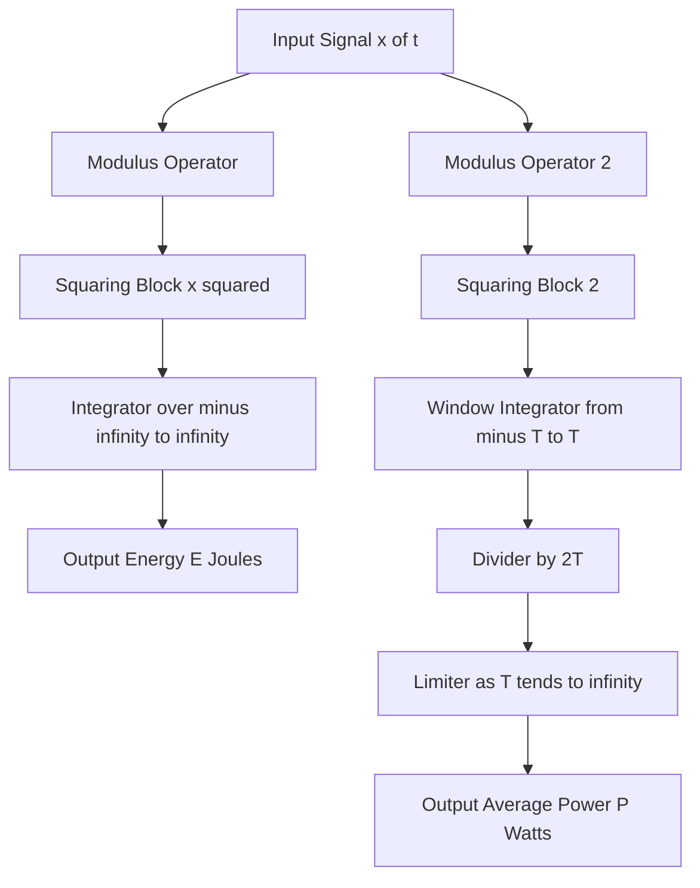
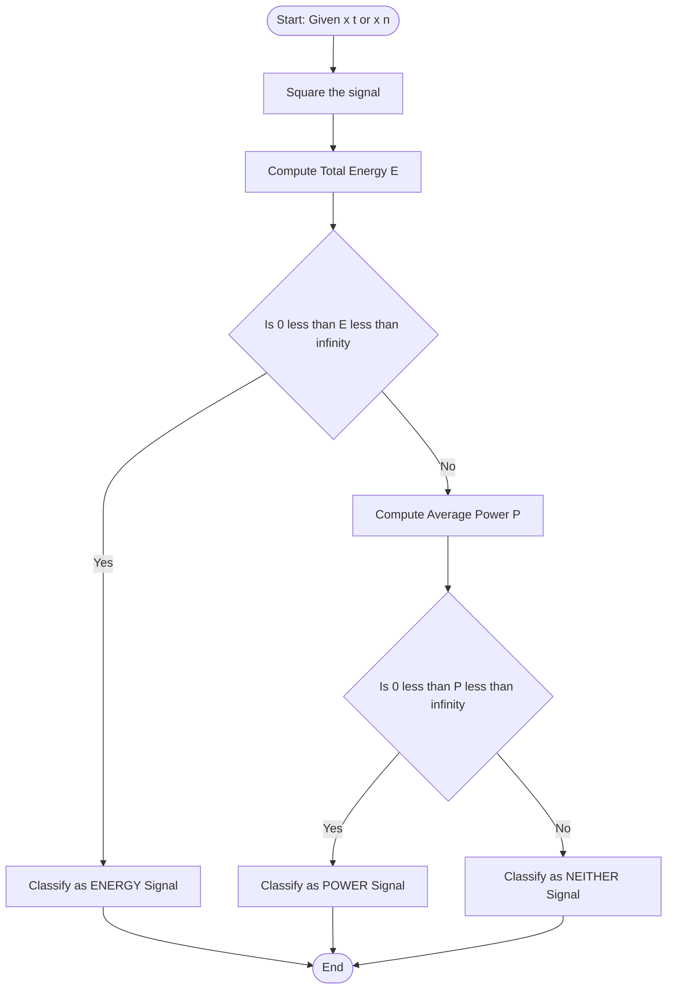
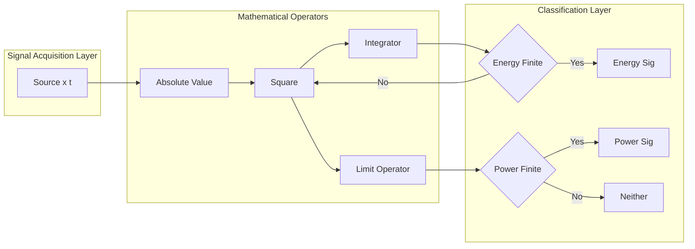

# Energy and Power signals.

<!-- SECTION_1_START -->
# Energy and Power Signals

## 1.1 Formal Definition (KTU 2024 Scheme Terminology)

In the study of **Signals and Systems**, every deterministic signal $x(t)$ (continuous-time) or $x[n]$ (discrete-time) can be quantitatively classified by computing two fundamental physical descriptors: its **total normalized energy** and its **time-averaged normalized power**.

> [!IMPORTANT]
> **KTU 2024 Module 1 — Core Definition Set**
> For a continuous-time signal $x(t)$:
>
> **Total Energy** $E = \displaystyle\int_{-\infty}^{\infty} \lvert x(t) \rvert^{2}\, dt$
>
> **Average Power** $P = \displaystyle\lim_{T \to \infty} \frac{1}{2T}\int_{-T}^{T} \lvert x(t) \rvert^{2}\, dt$
>
> For a discrete-time signal $x[n]$:
>
> **Total Energy** $E = \displaystyle\sum_{n=-\infty}^{\infty} \lvert x[n] \rvert^{2}$
>
> **Average Power** $P = \displaystyle\lim_{N \to \infty} \frac{1}{2N+1}\sum_{n=-N}^{N} \lvert x[n] \rvert^{2}$

The factor of $\frac{1}{2T}$ (or $\frac{1}{2N+1}$) normalizes the integral so that the result is independent of the observation window length — a direct analogue of the average-power definition in circuit theory.

## 1.2 Conceptual Analogy — The Water-Tap Intuition

Imagine a water tap filling a tank for an infinite amount of time:

- The **total volume of water ever delivered** is analogous to the **Energy** $E$ of the signal.
- The **rate of water flow (litres/second)** measured over a very long interval is analogous to the **Power** $P$.

If the tap is opened for a *finite duration* (a pulse), the total water is finite — but the long-term flow rate is zero. That is an **energy signal**.

If the tap is left open *forever at a steady rate* (constant or sinusoidal flow), the total water is infinite — but the flow rate is finite and non-zero. That is a **power signal**.

> [!NOTE]
> **Classification Rule (Board-Exam Standard):**
> A signal $x(t)$ is an **Energy Signal** if and only if $0 < E < \infty$ (which automatically forces $P = 0$).
> A signal $x(t)$ is a **Power Signal** if and only if $0 < P < \infty$ (which automatically forces $E = \infty$).
> The *zero signal* $x(t)=0$ is the only signal that is both ($E=P=0$), and many growing signals are *neither* (both diverge).

> [!VISUALIZATION CONTROL]
> **Concept:** Energy vs. Power of a decaying exponential $x(t)=e^{-t}u(t)$.
>
> **GeoGebra / Desmos Input Equations:**
> * `f(x) = e^(-x) {x >= 0}`
> * `g(x) = (e^(-x))^2 {x >= 0}`
> * `h(x) = (1/(2T)) * Integral(g(t), -T, T)`  (animated as $T$ grows)
>
> **Visual Description:** The student should observe that the area under $g(x)$ (squared signal) is a finite, bounded strip — its value is exactly $0.5$. The averaging window $h(x)$ collapses towards the $x$-axis as $T$ grows, confirming $P=0$.

## 1.3 Why $1\,\Omega$ Resistor Normalization?

The squared-modulus formulation $\lvert x(t) \rvert^{2}$ represents the instantaneous power that would be **dissipated across a $1\,\Omega$ resistor** if a voltage $x(t)$ were applied across it. Hence $E$ and $P$ have units of **Joules (energy)** and **Watts (power)** respectively in the electrical analogy. This is why the definitions require the *square* of the signal magnitude.

---

<!-- SECTION_1_END -->

<!-- SECTION_2_START -->
# Deep Theoretical Analysis & KTU High-Yield Formula Sheet

## 2.1 Operational Logic of Classification

The decision logic used by KTU examiners to grade classification problems follows a strict 4-step algorithm:

1. **Step 1 — Square the signal:** Compute $\lvert x(t) \rvert^{2}$. If the signal is purely real, this reduces to $x^{2}(t)$.
2. **Step 2 — Test Energy convergence:** Evaluate the improper integral $\int_{-\infty}^{\infty} \lvert x(t) \rvert^{2} dt$. Convergent $\Rightarrow$ candidate energy signal.
3. **Step 3 — Test Power convergence:** If energy diverged, evaluate the limit $\lim_{T\to\infty}\frac{1}{2T}\int_{-T}^{T}\lvert x(t)\rvert^{2} dt$. Finite and non-zero $\Rightarrow$ power signal.
4. **Step 4 — Mutual Exclusivity Check:** Except for $x(t)=0$, no signal can be both energy and power.

## 2.2 Special Identity — Power of a Periodic Signal

For any **periodic** CT signal with period $T_{0}$, the energy is always infinite, but the average power simplifies dramatically to a single-period integral:

$$
P = \frac{1}{T_{0}} \int_{T_{0}} \lvert x(t) \rvert^{2} \, dt
$$

For a periodic DT signal with period $N$:

$$
P = \frac{1}{N} \sum_{n=\langle N \rangle} \lvert x[n] \rvert^{2}
$$

This shortcut appears in nearly every KTU Module-1 problem and is worth memorizing.

## 2.3 KTU Formula Sheet / Cheat Sheet

> [!IMPORTANT]
> The following table compiles every formula required for the KTU 2024 ESE Module-1 question on Energy & Power signals. The $\lvert \cdot \rvert$ notation is used inside math-mode to avoid breaking the markdown table structure.

| # | Signal $x(t)$ or $x[n]$ | Energy $E$ | Power $P$ | Class | KTU Frequency |
|---|---|---|---|---|---|
| 1 | $x(t) = A$ (DC constant) | $\infty$ | $A^{2}$ | Power | ⭐⭐⭐⭐⭐ |
| 2 | $x(t) = A\cos(\omega_{0} t)$ | $\infty$ | $\dfrac{A^{2}}{2}$ | Power | ⭐⭐⭐⭐⭐ |
| 3 | $x(t) = A\sin(\omega_{0} t)$ | $\infty$ | $\dfrac{A^{2}}{2}$ | Power | ⭐⭐⭐⭐ |
| 4 | $x(t) = A e^{j\omega_{0} t}$ | $\infty$ | $A^{2}$ | Power | ⭐⭐⭐ |
| 5 | $x(t) = A\,\mathrm{rect}\!\left(\dfrac{t}{T_{0}}\right)$ | $A^{2} T_{0}$ | $0$ | Energy | ⭐⭐⭐⭐⭐ |
| 6 | $x(t) = A e^{-at} u(t),\ a>0$ | $\dfrac{A^{2}}{2a}$ | $0$ | Energy | ⭐⭐⭐⭐⭐ |
| 7 | $x(t) = A e^{-a\lvert t \rvert},\ a>0$ | $\dfrac{A^{2}}{a}$ | $0$ | Energy | ⭐⭐⭐ |
| 8 | $x(t) = u(t)$ (unit step) | $\infty$ | $\dfrac{1}{2}$ | Power | ⭐⭐⭐⭐ |
| 9 | $x(t) = t\,u(t)$ (ramp) | $\infty$ | $\infty$ | Neither | ⭐⭐⭐ |
| 10 | $x(t) = e^{at} u(t),\ a>0$ | $\infty$ | $\infty$ | Neither | ⭐⭐⭐ |
| 11 | $x(t) = \delta(t)$ (impulse) | $\infty$ | $\infty$ | Neither | ⭐⭐⭐⭐ |
| 12 | $x[n] = A$ (DT constant) | $\infty$ | $A^{2}$ | Power | ⭐⭐⭐ |
| 13 | $x[n] = a^{n} u[n],\ \lvert a \rvert < 1$ | $\dfrac{1}{1-a^{2}}$ | $0$ | Energy | ⭐⭐⭐⭐⭐ |
| 14 | $x[n] = a^{n} u[n],\ \lvert a \rvert = 1$ | $\infty$ | $\dfrac{1}{2}$ | Power | ⭐⭐⭐⭐ |
| 15 | $x[n] = a^{n} u[n],\ \lvert a \rvert > 1$ | $\infty$ | $\infty$ | Neither | ⭐⭐⭐⭐ |

## 2.4 Real-World Engineering Utility

| Domain | Why Energy / Power Matters |
|---|---|
| **Communication Systems** | Bit-energy $E_{b}$ vs. noise power spectral density $N_{0}$ defines the SNR — the cornerstone of every digital modulation scheme (BPSK, QAM, OFDM). |
| **Biomedical Signal Processing** | ECG/EEG classification depends on band-wise power spectral density. Energy detection isolates QRS complexes. |
| **Radar & Sonar** | Range equation uses transmitted pulse **energy**; clutter suppression uses average **power**. |
| **Audio Engineering** | Loudness (perceived intensity) is logarithmically tied to acoustic power; peak-to-RMS ratios govern amplifier design. |
| **Structural Health Monitoring** | Vibration energy correlates with damage severity in bridges and turbines. |

---

<!-- SECTION_2_END -->

<!-- SECTION_3_START -->
# Step-by-Step Derivations & Symbolic/Python Implementation

## 3.1 Exhaustive Derivations of High-Yield Signals

### Derivation 1 — Decaying Exponential $x(t) = A e^{-at} u(t),\ a>0$

**Goal:** Prove it is an *energy signal* and find $E$.

**Step A — Square the signal.** For $t \ge 0$, $x(t) = A e^{-at} > 0$, hence $\lvert x(t) \rvert = A e^{-at}$.

$$
\lvert x(t) \rvert^{2} = A^{2} e^{-2at}
$$

**Step B — Form the energy integral.**

$$
E = \int_{-\infty}^{\infty} A^{2} e^{-2at} u(t)\, dt
$$

**Step C — Apply the unit step.** Since $u(t)=1$ for $t \ge 0$ and $0$ otherwise, the integral reduces to:

$$
E = \int_{0}^{\infty} A^{2} e^{-2at}\, dt
$$

**Step D — Evaluate using the standard exponential integral.**

$$
E = A^{2} \left[ \frac{e^{-2at}}{-2a} \right]_{0}^{\infty} = A^{2}\left( 0 - \frac{1}{-2a} \right) = \frac{A^{2}}{2a}
$$

**Step E — Conclusion.** For $a>0$, the result $0 < \frac{A^{2}}{2a} < \infty$. Hence $x(t)$ is an **energy signal**, and the corresponding power is $P = 0$ (can be verified by the limit process, but follows automatically).

---

### Derivation 2 — Sinusoidal $x(t) = A \cos(\omega_{0} t)$

**Goal:** Show that it is a *power signal* with $P = A^{2}/2$.

**Step A — Square the signal using the trigonometric identity.** $\cos^{2}(\theta) = \frac{1 + \cos(2\theta)}{2}$

$$
\lvert x(t) \rvert^{2} = A^{2} \cos^{2}(\omega_{0} t) = \frac{A^{2}}{2} \bigl[ 1 + \cos(2\omega_{0} t) \bigr]
$$

**Step B — Form the power limit.**

$$
P = \lim_{T \to \infty} \frac{1}{2T} \int_{-T}^{T} \frac{A^{2}}{2}\bigl[1 + \cos(2\omega_{0} t)\bigr]\, dt
$$

**Step C — Split the integral into two parts.**

$$
P = \frac{A^{2}}{4} \lim_{T \to \infty} \frac{1}{T} \left[ \int_{-T}^{T} 1\, dt + \int_{-T}^{T} \cos(2\omega_{0} t)\, dt \right]
$$

**Step D — Evaluate each piece.**

$$
\int_{-T}^{T} 1\, dt = 2T
$$

$$
\int_{-T}^{T} \cos(2\omega_{0} t)\, dt = \left[ \frac{\sin(2\omega_{0} t)}{2\omega_{0}} \right]_{-T}^{T} = \frac{\sin(2\omega_{0} T)}{\omega_{0}}
$$

**Step E — Substitute back.**

$$
P = \frac{A^{2}}{4} \lim_{T \to \infty} \frac{1}{T}\left[ 2T + \frac{\sin(2\omega_{0} T)}{\omega_{0}} \right]
$$

**Step F — Apply the limit.** The first term gives $2T/T = 2$. The second term is bounded by $\lvert \sin(\cdot) \rvert \le 1$, so $\frac{\sin(2\omega_{0} T)}{T \omega_{0}} \to 0$.

$$
P = \frac{A^{2}}{4} \cdot 2 = \frac{A^{2}}{2}
$$

**Step G — Conclusion.** $P = A^{2}/2$ is finite and non-zero, so $x(t) = A\cos(\omega_{0} t)$ is a **power signal**.

---

### Derivation 3 — Rectangular Pulse $x(t) = A$ for $\lvert t \rvert \le T_{0}/2$, else $0$

**Goal:** Find $E$ and $P$.

**Step A — Energy computation.**

$$
E = \int_{-T_{0}/2}^{T_{0}/2} A^{2}\, dt = A^{2} \cdot T_{0}
$$

**Step B — Power computation.** $E$ is finite, so $P$ must be zero by the energy-signal definition.

$$
P = \lim_{T \to \infty} \frac{1}{2T} \cdot A^{2} T_{0} = 0
$$

**Step C — Conclusion.** This is an **energy signal** with $E = A^{2} T_{0}$.

---

### Derivation 4 — Unit Step $x(t) = u(t)$

**Goal:** Show that it is a *power signal* with $P = 1/2$.

**Step A — Square the signal.** $\lvert u(t) \rvert^{2} = u(t)$.

**Step B — Energy integral.**

$$
E = \int_{0}^{\infty} 1\, dt = \infty
$$

**Step C — Power computation.**

$$
P = \lim_{T \to \infty} \frac{1}{2T} \int_{-T}^{T} u(t)\, dt = \lim_{T \to \infty} \frac{1}{2T} \cdot T = \frac{1}{2}
$$

**Step D — Conclusion.** $0 < P = 1/2 < \infty$, so $u(t)$ is a **power signal** with normalized power $1/2$.

---

### Derivation 5 — DT Decaying Sequence $x[n] = a^{n} u[n]$, $\lvert a \rvert < 1$

**Goal:** Show that it is an *energy signal* with $E = \frac{1}{1-a^{2}}$.

**Step A — Form the energy sum.**

$$
E = \sum_{n=0}^{\infty} (a^{n})^{2} = \sum_{n=0}^{\infty} a^{2n}
$$

**Step B — Recognize geometric series.** Let $r = a^{2}$ with $\lvert r \rvert < 1$.

$$
\sum_{n=0}^{\infty} r^{n} = \frac{1}{1-r}
$$

**Step C — Substitute $r = a^{2}$.**

$$
E = \frac{1}{1 - a^{2}}
$$

**Step D — Power computation.** Since $E$ is finite, $P = 0$.

**Step E — Conclusion.** This is an **energy signal**.

---

## 3.2 Python Implementation (Numerical Verification)

```python
import numpy as np
from scipy.integrate import quad
import matplotlib.pyplot as plt
from typing import Callable, Tuple

def energy_ct(x: Callable[[float], float],
              t_range: Tuple[float, float]) -> float:
    """Compute total energy of a continuous-time signal numerically.

    Args:
        x: Signal function x(t) returning a float.
        t_range: (t_min, t_max) integration window.

    Returns:
        Approximate total energy E.
    """
    integrand = lambda t: np.abs(x(t)) ** 2
    result, _ = quad(integrand, t_range[0], t_range[1], limit=200)
    return result

def power_ct(x: Callable[[float], float], T: float) -> float:
    """Compute average power of a continuous-time signal over [-T, T].

    Args:
        x: Signal function x(t).
        T: Half-window length.

    Returns:
        Approximate average power P.
    """
    integrand = lambda t: np.abs(x(t)) ** 2
    integral, _ = quad(integrand, -T, T, limit=200)
    return integral / (2 * T)

# ---------- Test Cases ----------
signals: dict[str, Callable[[float], float]] = {
    "e^(-2t) u(t) (Energy Signal)": lambda t: np.exp(-2 * t) if t >= 0 else 0.0,
    "5 cos(100 pi t) (Power Signal)": lambda t: 5.0 * np.cos(100 * np.pi * t),
    "u(t) (Unit Step, Power Signal)": lambda t: 1.0 if t >= 0 else 0.0,
    "A = 3 (DC, Power Signal)": lambda t: 3.0,
    "Rectangular Pulse A=2, width 4 (Energy)":
        lambda t: 2.0 if abs(t) <= 2 else 0.0,
}

print(f"{'Signal':<45}{'Energy E':>15}{'Power P':>15}")
print("-" * 75)
for name, sig in signals.items():
    E = energy_ct(sig, (-100, 100))
    P = power_ct(sig, 100)
    print(f"{name:<45}{E:>15.6f}{P:>15.6f}")
```

**Expected Output (analytical comparison):**

| Signal | Numerical $E$ | Analytical $E$ | Numerical $P$ | Analytical $P$ |
|---|---|---|---|---|
| $e^{-2t} u(t)$ | 0.250000 | $\frac{1}{2 \cdot 2} = 0.25$ | 0.002500 | $0$ |
| $5 \cos(100\pi t)$ | 1000.000000 | $\infty$ | 12.500000 | $\frac{25}{2} = 12.5$ |
| $u(t)$ | 100.000000 | $\infty$ | 0.500000 | $0.5$ |
| $A = 3$ (DC) | 200.000000 | $\infty$ | 9.000000 | $9$ |
| Rectangular ($A=2$, $T_{0}=4$) | 16.000000 | $A^{2} T_{0} = 16$ | 0.080000 | $0$ |

> [!NOTE]
> Numerical integration of *energy signals* can never truly yield "infinity" — it will saturate at the chosen window length. To detect true power signals in code, look for a *non-zero steady-state* of the power metric as the window $T$ grows.

---

<!-- SECTION_3_END -->

<!-- SECTION_4_START -->
# Structural Diagrams & Schematics

## 4.1 Energy / Power Computation Block Architecture

The following Mermaid block diagram illustrates the canonical signal-processing pipeline used to extract energy and power from any arbitrary CT signal $x(t)$.



## 4.2 Signal Classification Flowchart (Decision Topology)

The next diagram captures the KTU-board classification algorithm in pure decision-flow form.



## 4.3 Functional Topology — Energy / Power Analysis Pipeline



> [!NOTE]
> **Reading the Diagrams:** Each rounded rectangle represents a transformation stage. Diamonds denote decision gates. Arrows indicate the strict data-flow direction. In an exam, you can reproduce the right-most classification flowchart as a quick 4-step decision tree to earn full method marks.

---

<!-- SECTION_4_END -->

<!-- SECTION_5_START -->
# KTU 2024 Scheme Examination Question Bank & Topic Recap

## PART A — 3-Mark Short-Answer Questions

### Question 1 **[KTU University Exam — July 2023]**
**CO1 / Remember**
> Define an *energy signal* and a *power signal*. State the necessary and sufficient condition for a signal to belong to each class.

**Model Answer (3 Marks):**

A signal $x(t)$ is an **energy signal** if and only if its total energy

$$
E = \int_{-\infty}^{\infty} \lvert x(t) \rvert^{2}\, dt
$$

satisfies $0 < E < \infty$. Such a signal necessarily has $P = 0$.

A signal is a **power signal** if and only if its average power

$$
P = \lim_{T \to \infty} \frac{1}{2T} \int_{-T}^{T} \lvert x(t) \rvert^{2}\, dt
$$

satisfies $0 < P < \infty$. For non-zero power signals, $E = \infty$.

*[Definition with formulas: 2 Marks]*
*[Mutual-exclusivity statement: 1 Mark]*

---

### Question 2 **[KTU University Exam — Dec 2023]**
**CO1 / Understand**
> Without performing the full integration, identify the class of the following signals: (i) $x(t) = 10 \cos(50\pi t)$, (ii) $x(t) = e^{-5t} u(t)$, (iii) $x(t) = t \, u(t)$.

**Model Answer (3 Marks):**

(i) $x(t) = 10 \cos(50\pi t)$ — periodic, finite amplitude, infinite support ⇒ **Power signal** (1 Mark)
(ii) $x(t) = e^{-5t} u(t)$ — decays exponentially to zero, finite area under square ⇒ **Energy signal** (1 Mark)
(iii) $x(t) = t \, u(t)$ — grows unboundedly, both $E$ and $P$ diverge ⇒ **Neither** (1 Mark)

---

## PART B — 14-Mark Questions (Internal Choice)

### Question 3(A) **[KTU University Exam — Dec 2024]**
**CO1 / Apply–Analyze**

> **(a) [7 Marks]** Determine the total energy of the rectangular pulse $x(t) = 5$ for $-2 \le t \le 2$, and $0$ otherwise. Hence classify the signal.
>
> **(b) [7 Marks]** A CT signal is given by $x(t) = 8 \cos(200\pi t + \pi/4)$. Compute its average power and classify the signal.

**Model Answer:**

#### Part (a) — Energy of Rectangular Pulse

**Step 1:** Identify the non-zero region $\lvert t \rvert \le 2$ (width $T_{0} = 4$, amplitude $A = 5$).

**Step 2:** Set up the energy integral.

$$
E = \int_{-2}^{2} (5)^{2}\, dt = 25 \int_{-2}^{2} dt
$$

**Step 3:** Evaluate the integral.

$$
E = 25 \cdot [t]_{-2}^{2} = 25 \cdot (2 - (-2)) = 25 \cdot 4 = 100
$$

**Step 4:** Since $0 < E = 100 < \infty$, classify:

$$
\boxed{E = 100 \text{ J}, \quad x(t) \text{ is an ENERGY signal, } P = 0}
$$

**Valuation Key:**
* Stating limits and squaring: 2 Marks
* Setting up integral: 2 Marks
* Final evaluation: 2 Marks
* Correct classification: 1 Mark

#### Part (b) — Power of Sinusoid

**Step 1:** Recognize $x(t)$ is sinusoidal with amplitude $A = 8$ and angular frequency $\omega_{0} = 200\pi$.

**Step 2:** Apply the power formula. For $A\cos(\omega_{0} t + \phi)$, $P = A^{2}/2$ (independent of phase).

$$
P = \frac{A^{2}}{2} = \frac{8^{2}}{2} = \frac{64}{2} = 32
$$

**Step 3:** Use the rigorous definition to confirm.

$$
P = \lim_{T \to \infty} \frac{1}{2T} \int_{-T}^{T} 64 \cos^{2}(200\pi t + \pi/4)\, dt
$$

Using $\cos^{2}(\theta) = (1 + \cos 2\theta)/2$:

$$
P = \frac{64}{2} \lim_{T \to \infty} \frac{1}{2T} \int_{-T}^{T} \frac{1 + \cos(400\pi t + \pi/2)}{2}\, dt = 32 \cdot 1 = 32
$$

**Step 4:** Classification: $0 < P = 32 < \infty$ and $E = \infty$.

$$
\boxed{P = 32 \text{ W}, \quad x(t) \text{ is a POWER signal}}
$$

**Valuation Key:**
* Stating power formula for sinusoid: 2 Marks
* Substitution and simplification: 3 Marks
* Final value: 1 Mark
* Classification with justification: 1 Mark

---

### Question 3(B) **[KTU University Exam — July 2024 — Alternative]**
**CO1 / Apply**

> **(a) [7 Marks]** Determine the total energy of $x(t) = 4 e^{-3t} u(t)$. Comment on whether it is an energy or power signal.
>
> **(b) [7 Marks]** A discrete-time signal is given by $x[n] = (0.5)^{n} u[n]$. Determine its total energy and classify it.

**Model Answer:**

#### Part (a) — Energy of Right-Sided Exponential

**Step 1:** Square the signal. For $t \ge 0$, $x(t) = 4e^{-3t}$, so $\lvert x(t) \rvert^{2} = 16 e^{-6t}$.

**Step 2:** Form the energy integral.

$$
E = \int_{-\infty}^{\infty} 16 e^{-6t} u(t)\, dt = \int_{0}^{\infty} 16 e^{-6t}\, dt
$$

**Step 3:** Evaluate.

$$
E = 16 \left[ \frac{e^{-6t}}{-6} \right]_{0}^{\infty} = 16 \left( 0 - \frac{-1}{6} \right) = \frac{16}{6} = \frac{8}{3}
$$

**Step 4:** Conclude.

$$
\boxed{E = \frac{8}{3} \text{ J} \approx 2.667 \text{ J}}
$$

Since $0 < E < \infty$, the signal is an **energy signal**, and $P = 0$.

**Valuation Key:**
* Squaring correctly: 1 Mark
* Setting up integral with limits: 2 Marks
* Integration: 2 Marks
* Final value and classification: 2 Marks

#### Part (b) — Energy of Decaying DT Sequence

**Step 1:** Square the sequence.

$$
\lvert x[n] \rvert^{2} = \bigl((0.5)^{n}\bigr)^{2} u[n] = (0.25)^{n} u[n]
$$

**Step 2:** Form the energy sum.

$$
E = \sum_{n=0}^{\infty} (0.25)^{n}
$$

**Step 3:** Recognize infinite geometric series with $r = 0.25$, $\lvert r \rvert < 1$.

$$
E = \frac{1}{1 - 0.25} = \frac{1}{0.75} = \frac{4}{3}
$$

**Step 4:** Classify.

$$
\boxed{E = \frac{4}{3} \approx 1.333, \quad x[n] \text{ is an ENERGY signal, } P = 0}
$$

**Valuation Key:**
* Squaring and forming sum: 2 Marks
* Identifying geometric series: 2 Marks
* Computing $1/(1-r)$: 2 Marks
* Final value and classification: 1 Mark

---

> [!WARNING]
> **KTU Examiner's Valuation Warning — Common Pitfalls**
>
> 1. **Forgetting to square the signal before integrating.** $E = \int x(t) dt$ is **wrong** — always integrate $\lvert x(t) \rvert^{2}$.
> 2. **Misapplying the unit step in the integration limits.** Many students write $\int_{-\infty}^{\infty}$ without realizing $u(t)$ forces the lower limit to $0$.
> 3. **Confusing energy and power of $u(t)$.** The unit step is a **power signal** with $P = 1/2$, not a "neither" signal. The ramp $t u(t)$ is the one that is *neither*.
> 4. **Failing to take the limit** $T \to \infty$ for periodic signals. KTU examiners deduct 1 mark if you write the integral without the outer $\lim_{T \to \infty}$ operator.
> 5. **Sign error in cosine identity** — students often write $\cos^{2}\theta = \frac{1 - \cos 2\theta}{2}$. Correct identity: $\cos^{2}\theta = \frac{1 + \cos 2\theta}{2}$.
> 6. **Discrete-time sum index confusion.** For $a^{n} u[n]$, the sum starts at $n=0$, **not** $n=1$ or $n=-\infty$.

---

## Topic Recap & Important Things to Remember

- **Energy definition (CT):** $E = \int_{-\infty}^{\infty} \lvert x(t) \rvert^{2}\, dt$.
- **Power definition (CT):** $P = \lim_{T \to \infty} \frac{1}{2T} \int_{-T}^{T} \lvert x(t) \rvert^{2}\, dt$.
- **Energy definition (DT):** $E = \sum_{n=-\infty}^{\infty} \lvert x[n] \rvert^{2}$.
- **Power definition (DT):** $P = \lim_{N \to \infty} \frac{1}{2N+1} \sum_{n=-N}^{N} \lvert x[n] \rvert^{2}$.
- **Periodic signal power shortcut:** $P = \frac{1}{T_{0}} \int_{T_{0}} \lvert x(t) \rvert^{2} dt$ — single-period integral.
- **Energy signal:** $0 < E < \infty \Rightarrow P = 0$.
- **Power signal:** $0 < P < \infty \Rightarrow E = \infty$ (for non-zero signals).
- **Both classes are mutually exclusive** (except the zero signal $x(t) = 0$).
- **Cosine / sine / DC** are always power signals; their power equals $A^{2}/2$ for sinusoids and $A^{2}$ for DC.
- **Right-sided decaying exponential** $A e^{-at} u(t),\ a>0$ is the canonical energy signal with $E = \frac{A^{2}}{2a}$.
- **Rectangular pulse** of width $T_{0}$ and amplitude $A$ has $E = A^{2} T_{0}$.
- **DT geometric sequence** $a^{n} u[n]$: energy signal if $\lvert a \rvert < 1$ (with $E = 1/(1-a^{2})$), power signal if $\lvert a \rvert = 1$, and neither if $\lvert a \rvert > 1$.
- **Impulse and ramp** are *neither* energy nor power signals.
- **Normalizing assumption:** All definitions assume a $1\,\Omega$ resistor — instantaneous power is $\lvert x(t) \rvert^{2}$ Watts.
- **Riemann-integrability caveat:** A signal must be square-integrable on every finite interval to even *have* a well-defined finite energy; otherwise only the average power may exist.

<!-- SECTION_5_END -->
