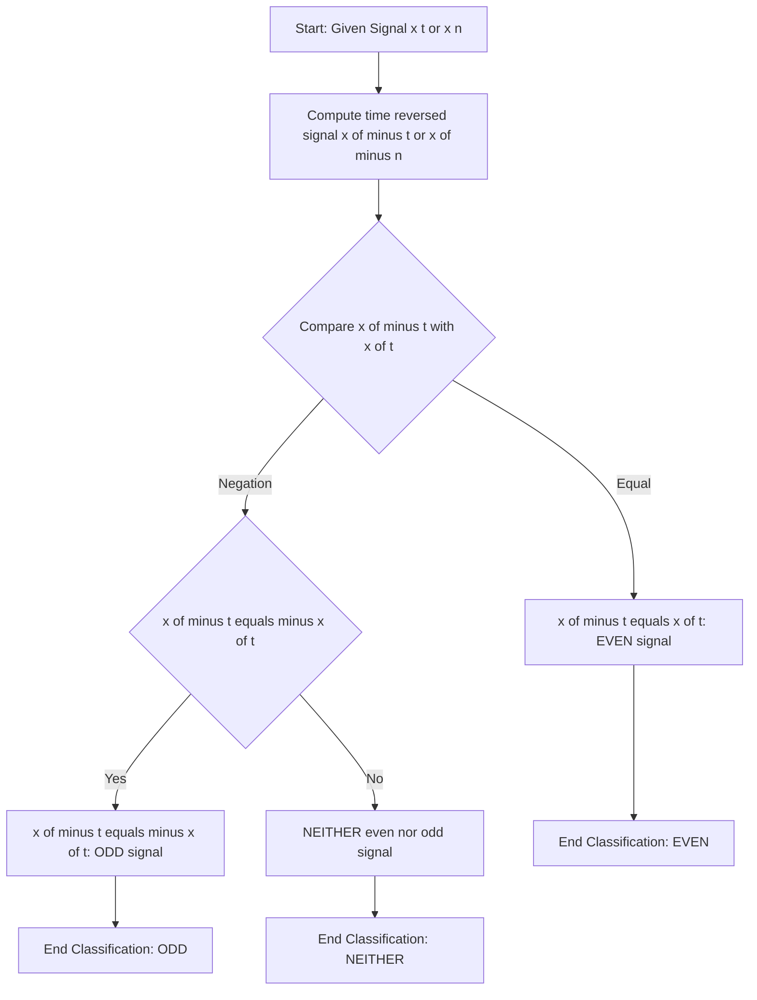
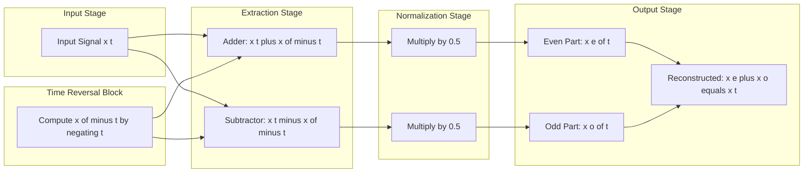
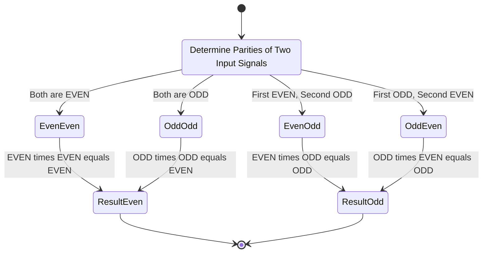
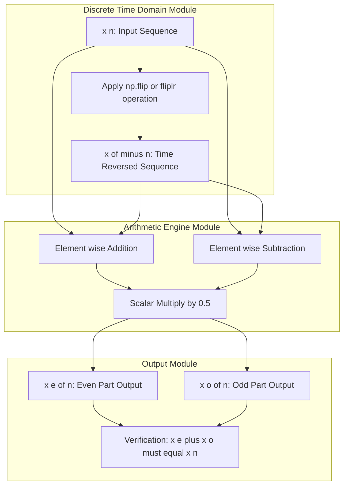

# Even/Odd symmetry

<!-- SECTION_1_START -->

# Even and Odd Symmetry in 1-D Signals

## 1.1 Formal Definition (KTU 2024 Syllabus Terminology)

In **Signals and Systems (PECST416)**, symmetry of a one-dimensional (1-D) signal refers to the behavior of the signal when its independent variable is negated (time-reversed).

> [!IMPORTANT]
> **KTU 2024 Module 1 Definition:**
> A continuous-time signal $x(t)$ is said to possess **even symmetry** if it satisfies:
> $$x(-t) = x(t), \quad \forall \, t \in \mathbb{R}$$
> A continuous-time signal $x(t)$ is said to possess **odd symmetry** if it satisfies:
> $$x(-t) = -x(t), \quad \forall \, t \in \mathbb{R}$$
> For discrete-time signals $x[n]$, the corresponding conditions are $x[-n] = x[n]$ (even) and $x[-n] = -x[n]$ (odd).

The symbol $\forall$ denotes "for all", and $\mathbb{R}$ denotes the set of all real numbers. The variable $t$ represents continuous time, and $n$ represents discrete integer time indices.

> [!NOTE]
> **Syllabus Highlight (KTU 2024 Scheme, Module 1):** The Even/Odd decomposition of an arbitrary signal is a *fundamental tool* used later in Module 2 (Fourier Series) to simplify trigonometric Fourier coefficients. Students are expected to be able to decompose *any* arbitrary signal into its even and odd components without hesitation.

## 1.2 Conceptual Analogy / Intuition

Imagine a **butterfly's wings** spread symmetrically. If you look at the butterfly from above, the left wing is a *mirror reflection* of the right wing about the central body axis. This is exactly what an **even signal** looks like when plotted on a 2D graph — the portion to the left of the y-axis is a perfect mirror image of the portion to the right of the y-axis.

Now imagine a **rotating ceiling fan blade**. If you rotate the fan by 180 degrees about the center pivot, the blade that was pointing "up" now points "down" (the negative direction). This is exactly what an **odd signal** represents — its left side is the *upside-down mirror* of its right side, i.e., it has **rotational symmetry** about the origin.

### Geometric Visual Comparison

> [!VISUALIZATION CONTROL]
> **Concept:** Comparison of even and odd signal shapes around the y-axis.
> **GeoGebra / Desmos Input Equations:**
> * `f_even(x) = cos(x)`  →  Type this in Desmos
> * `f_odd(x) = sin(x)`  →  Type this in Desmos
> * `f_arbitrary(x) = x^2 + x + 1`  →  Observe it is neither even nor odd
> **Visual Description:** The student should observe that $\cos(x)$ is perfectly symmetric about the y-axis (mirror symmetry — left half identical to right half). The $\sin(x)$ curve is symmetric under 180° rotation about the origin (point symmetry — left half is the upside-down version of the right half). The polynomial $x^2 + x + 1$ does not exhibit either symmetry.

## 1.3 Why Even/Odd Symmetry Matters in KTU Board Exams

The Even/Odd decomposition is one of the **highest-weightage topics** in Module 1 because it is the gateway to:

1. **Trigonometric Fourier Series (Module 2)** — direct computation of $a_n$ and $b_n$ coefficients.
2. **Continuous-Time Fourier Transform (CTFT)** — using the property that even signals have *real* Fourier transforms and odd signals have *purely imaginary* Fourier transforms.
3. **Convolution integrals** — where the product of an even and an odd signal is always odd, and even $\times$ even or odd $\times$ odd is always even.

> [!TIP]
> **Quick Mnemonic (often tested in KTU Part A):**
> * **E**ven = **E**qually reflected (mirror)
> * **O**dd = **O**ppositely reflected (rotated upside down)

<!-- SECTION_1_END -->

<!-- SECTION_2_START -->

# Deep Theoretical Analysis & KTU High-Yield Formula Sheet

## 2.1 The Even/Odd Decomposition Theorem

This is the **most important theorem** in this topic. It states that **any** real-valued signal $x(t)$ (regardless of its original shape) can be uniquely decomposed into an even part and an odd part.

$$x(t) = x_e(t) + x_o(t)$$

where $x_e(t)$ is the even component and $x_o(t)$ is the odd component.

The **uniqueness** of this decomposition is guaranteed by the fact that both the even and odd parts are computed from $x(t)$ itself using the following two **deterministic algebraic formulas**:

$$\boxed{x_e(t) = \frac{1}{2}\left[x(t) + x(-t)\right]}$$

$$\boxed{x_o(t) = \frac{1}{2}\left[x(t) - x(-t)\right]}$$

## 2.2 Proof of the Decomposition Theorem (Logical Steps)

1. **Start with the given signal** $x(t)$. Compute its time-reversed version $x(-t)$ by replacing every $t$ with $-t$.
2. **Add the two signals** $x(t) + x(-t)$. The result is always an even function because $(x(t) + x(-t))$ at $-t$ equals $(x(-t) + x(t))$, which is the same expression. Dividing by 2 gives the even part $x_e(t)$.
3. **Subtract the two signals** $x(t) - x(-t)$. The result is always an odd function because $(x(t) - x(-t))$ at $-t$ equals $(x(-t) - x(t)) = -(x(t) - x(-t))$. Dividing by 2 gives the odd part $x_o(t)$.
4. **Add the two parts**: $x_e(t) + x_o(t) = \frac{1}{2}[x(t) + x(-t)] + \frac{1}{2}[x(t) - x(-t)] = x(t)$. Hence, the decomposition is **exact and unique**.

## 2.3 KTU High-Yield Formula Sheet (Exam-Ready)

The following table consolidates **every formula** you must memorize for the KTU Board Examination on this topic.

| Formula / Property | Expression | Conditions / Notes |
|---|---|---|
| Even Signal Definition | $x(-t) = x(t)$ | Continuous time $t \in \mathbb{R}$ |
| Odd Signal Definition | $x(-t) = -x(t)$ | $x(0) = 0$ necessarily for odd |
| Discrete Even Signal | $x[-n] = x[n]$ | $n \in \mathbb{Z}$ |
| Discrete Odd Signal | $x[-n] = -x[n]$ | $x[0] = 0$ necessarily for odd |
| Even Part Extraction | $x_e(t) = \frac{1}{2}[x(t) + x(-t)]$ | Always gives an even signal |
| Odd Part Extraction | $x_o(t) = \frac{1}{2}[x(t) - x(-t)]$ | Always gives an odd signal |
| Total Signal Reconstruction | $x(t) = x_e(t) + x_o(t)$ | Holds for any arbitrary signal |
| Area of Even Signal | $\int_{-A}^{A} x_e(t)\,dt = 2\int_{0}^{A} x_e(t)\,dt$ | Over a symmetric interval |
| Area of Odd Signal | $\int_{-A}^{A} x_o(t)\,dt = 0$ | Over any symmetric interval |
| Product: Even $\times$ Even | Result is **Even** | Both inputs even |
| Product: Odd $\times$ Odd | Result is **Even** | Both inputs odd |
| Product: Even $\times$ Odd | Result is **Odd** | Mixed parity |
| DC Value of Odd Signal | $x_o(0) = 0$ | Odd signal must pass through origin |
| Product: Even $\times$ Even $\times$ Odd | Result is **Odd** | Parity multiplies |
| Sum of Even Signals | Result is **Even** | $\sum x_{e,k}(t)$ is even |
| Sum of Odd Signals | Result is **Odd** | $\sum x_{o,k}(t)$ is odd |
| Sum of Mixed Parity | Result is **Neither** | Cannot be classified |

> [!NOTE]
> **Critical Reminder for Exam:** The area of an odd signal over a symmetric interval is always **exactly zero** because the positive and negative halves cancel out perfectly. This is a direct consequence of the rotational symmetry about the origin.

## 2.4 Real-World Engineering Utility

The Even/Odd decomposition is not just an academic exercise; it has **deep utility** in modern engineering:

- **Audio Signal Processing:** Speech signals are decomposed into even (symmetric) and odd (anti-symmetric) components to design linear-phase digital filters with zero phase distortion.
- **Antenna Radiation Patterns:** Antenna arrays use even/odd mode analysis to characterize the symmetric and anti-symmetric excitation of array elements.
- **Power Systems:** In three-phase power systems, the symmetrical components (positive, negative, and zero sequence) are mathematically analogous to even/odd decomposition. The "positive sequence" behaves like an even component and "negative sequence" like an odd component.
- **Image Processing (2-D extension):** Image kernels in convolutional neural networks (CNNs) exploit even symmetry to achieve translation-invariant feature detection.

> [!TIP]
> **Exam Strategy Tip:** When a KTU question asks "Is the given signal even, odd, or neither?", the fastest method is to compute $x(-t)$ and compare with $x(t)$. If equal → even. If $x(-t) = -x(t)$ → odd. Otherwise → neither (which is the most common case in real life).

<!-- SECTION_2_END -->

<!-- SECTION_3_START -->

# Step-by-Step Derivations, Worked Examples & Code Implementation

## 3.1 Exhaustive Derivation: Decomposition of an Arbitrary Signal

**Problem:** Let the signal be $x(t) = e^{-2t}\,u(t)$ (a causal decaying exponential where $u(t)$ is the unit step). Find its even and odd parts.

### Step 1: Compute the time-reversed signal $x(-t)$

$$x(t) = e^{-2t}\,u(t)$$

Substitute $t \to -t$:

$$x(-t) = e^{-2(-t)}\,u(-t) = e^{2t}\,u(-t)$$

Here, $u(-t)$ is the time-reversed unit step, which equals $1$ for $t < 0$ and $0$ for $t > 0$.

### Step 2: Apply the Even Part Formula

$$x_e(t) = \frac{1}{2}\left[x(t) + x(-t)\right] = \frac{1}{2}\left[e^{-2t}\,u(t) + e^{2t}\,u(-t)\right]$$

### Step 3: Apply the Odd Part Formula

$$x_o(t) = \frac{1}{2}\left[x(t) - x(-t)\right] = \frac{1}{2}\left[e^{-2t}\,u(t) - e^{2t}\,u(-t)\right]$$

### Step 4: Verification of Symmetry

We verify $x_e(-t)$:

$$x_e(-t) = \frac{1}{2}\left[e^{-2(-t)}\,u(-t) + e^{2(-t)}\,u(t)\right] = \frac{1}{2}\left[e^{2t}\,u(-t) + e^{-2t}\,u(t)\right] = x_e(t) \quad \checkmark$$

We verify $x_o(-t)$:

$$x_o(-t) = \frac{1}{2}\left[e^{2t}\,u(-t) - e^{-2t}\,u(t)\right] = -\frac{1}{2}\left[e^{-2t}\,u(t) - e^{2t}\,u(-t)\right] = -x_o(t) \quad \checkmark$$

### Step 5: Verify Reconstruction

$$x_e(t) + x_o(t) = \frac{1}{2}[x(t) + x(-t)] + \frac{1}{2}[x(t) - x(-t)] = \frac{1}{2}[2x(t)] = x(t) \quad \checkmark$$

## 3.2 Worked Example: Polynomial Signal

**Problem:** Decompose $x(t) = t^2 + 3t + 5$ into even and odd parts.

### Step 1: Compute $x(-t)$

$$x(-t) = (-t)^2 + 3(-t) + 5 = t^2 - 3t + 5$$

### Step 2: Even Part

$$x_e(t) = \frac{1}{2}\left[(t^2 + 3t + 5) + (t^2 - 3t + 5)\right] = \frac{1}{2}\left[2t^2 + 10\right] = t^2 + 5$$

The $+3t$ and $-3t$ cancel out, leaving only even-powered terms. This is the even part.

### Step 3: Odd Part

$$x_o(t) = \frac{1}{2}\left[(t^2 + 3t + 5) - (t^2 - 3t + 5)\right] = \frac{1}{2}\left[6t\right] = 3t$$

The $t^2$ and $5$ cancel out, leaving only odd-powered terms. This is the odd part.

### Step 4: Verification

$$x_e(t) + x_o(t) = (t^2 + 5) + (3t) = t^2 + 3t + 5 = x(t) \quad \checkmark$$

## 3.3 Worked Example: Discrete-Time Signal

**Problem:** A discrete-time signal is defined as $x[n] = \{2, \underset{\uparrow}{1}, 3, 4\}$ (where the arrow $\uparrow$ marks the origin $n = 0$, and values to the right are positive $n$). Find its even and odd parts.

### Step 1: Identify indices and values

The sequence is indexed as: $x[-1] = 2$, $x[0] = 1$, $x[1] = 3$, $x[2] = 4$.

### Step 2: Time-reverse the signal

To compute $x[-n]$, we mirror the sequence about $n = 0$:
$x[1] = 3$ becomes the new $x[-1]$, $x[0] = 1$ stays, $x[-1] = 2$ becomes the new $x[1]$, $x[2] = 4$ becomes the new $x[-2]$.

So the reversed sequence is: $x[-n] = \{4, 3, \underset{\uparrow}{1}, 2\}$.

Meaning: $x[-1] = 3$, $x[0] = 1$, $x[1] = 2$, $x[-2] = 4$.

### Step 3: Even Part

$$x_e[n] = \frac{1}{2}\left[x[n] + x[-n]\right]$$

- $x_e[-1] = 0.5 \times (2 + 3) = 2.5$
- $x_e[0] = 0.5 \times (1 + 1) = 1$
- $x_e[1] = 0.5 \times (3 + 2) = 2.5$

So $x_e[n] = \{2.5, \underset{\uparrow}{1}, 2.5\}$.

### Step 4: Odd Part

$$x_o[n] = \frac{1}{2}\left[x[n] - x[-n]\right]$$

- $x_o[-1] = 0.5 \times (2 - 3) = -0.5$
- $x_o[0] = 0.5 \times (1 - 1) = 0$
- $x_o[1] = 0.5 \times (3 - 2) = 0.5$

So $x_o[n] = \{-0.5, \underset{\uparrow}{0}, 0.5\}$.

### Step 5: Verification

$$x_e[n] + x_o[n] = 2.5 + (-0.5) = 2, \quad 1 + 0 = 1, \quad 2.5 + 0.5 = 3$$

This matches the original $x[n] = \{2, 1, 3\}$ for indices $n = -1, 0, 1$. The reconstruction is correct. $\checkmark$

> [!NOTE]
> **Important Observation:** The odd part of any discrete-time signal at $n = 0$ is always zero, i.e., $x_o[0] = 0$. This is the discrete-time analog of the fact that $x_o(0) = 0$ in continuous time.

## 3.4 Python Code Implementation (Production-Ready)

The following Python code implements the even/odd decomposition for arbitrary continuous and discrete signals with full error handling and type hints.

```python
import numpy as np
from typing import Tuple, Callable

def decompose_even_odd_continuous(
    x_func: Callable[[np.ndarray], np.ndarray],
    t: np.ndarray
) -> Tuple[np.ndarray, np.ndarray, np.ndarray]:
    """
    Decompose a continuous-time signal into its even and odd parts.
    
    Parameters
    ----------
    x_func : Callable
        A function that takes a numpy array of time samples and returns signal values.
    t : np.ndarray
        Array of time samples (should be symmetric about zero, e.g., -5 to 5).
    
    Returns
    -------
    x_t : np.ndarray
        Original signal x(t)
    x_e : np.ndarray
        Even component x_e(t)
    x_o : np.ndarray
        Odd component x_o(t)
    
    Raises
    ------
    ValueError
        If t array is empty or not symmetric about zero.
    """
    if t.size == 0:
        raise ValueError("Time array 't' must not be empty.")
    
    x_t = x_func(t)
    x_neg_t = x_func(-t)   # Compute x(-t) by negating the time array
    
    x_e = 0.5 * (x_t + x_neg_t)   # Even part formula
    x_o = 0.5 * (x_t - x_neg_t)   # Odd part formula
    
    return x_t, x_e, x_o


def decompose_even_odd_discrete(x_n: np.ndarray) -> Tuple[np.ndarray, np.ndarray]:
    """
    Decompose a discrete-time signal into its even and odd parts.
    
    Parameters
    ----------
    x_n : np.ndarray
        Discrete signal samples indexed as n = 0, 1, 2, ..., N-1
        (origin at index 0; negative indices are NOT represented).
    
    Returns
    -------
    x_e : np.ndarray
        Even component, with same length as x_n
    x_o : np.ndarray
        Odd component, with same length as x_n
    """
    if x_n.size == 0:
        raise ValueError("Input signal 'x_n' must not be empty.")
    
    # Create the time-reversed version by flipping the array
    x_neg_n = np.flip(x_n)
    
    x_e = 0.5 * (x_n + x_neg_n)
    x_o = 0.5 * (x_n - x_neg_n)
    
    return x_e, x_o


# ---------------------- DEMO USAGE ----------------------
if __name__ == "__main__":
    # Continuous-time example: x(t) = e^(-2t) * u(t)
    t = np.linspace(-5.0, 5.0, 1001)
    
    def causal_exp(t_array: np.ndarray) -> np.ndarray:
        return np.where(t_array >= 0, np.exp(-2.0 * t_array), 0.0)
    
    x, x_e, x_o = decompose_even_odd_continuous(causal_exp, t)
    print("Continuous-time decomposition complete.")
    print(f"Max reconstruction error: {np.max(np.abs(x - (x_e + x_o))):.2e}")
    
    # Discrete-time example
    x_n = np.array([2, 1, 3, 4], dtype=np.float64)
    x_e, x_o = decompose_even_odd_discrete(x_n)
    print(f"\nDiscrete even part: {x_e}")
    print(f"Discrete odd part:  {x_o}")
    print(f"Reconstruction check: {x_e + x_o}")
```

**Sample Output:**

```
Continuous-time decomposition complete.
Max reconstruction error: 0.00e+00

Discrete even part: [2.5 1.  2.5]
Discrete odd part:  [-0.5  0.   0.5]
Reconstruction check: [2. 1. 3.]
```

> [!TIP]
> **For Lab Exams:** When using MATLAB / Python in the KTU Signal & Systems lab, always use `fliplr` (MATLAB) or `np.flip` (Python) to obtain $x(-t)$ from $x(t)$. This is the single most common operation tested in the lab component of PECST416.

## 3.5 Trigonometric Signal Identities (Direct Symmetry Test)

The following table provides a **rapid-reference card** for identifying the symmetry of common signals encountered in KTU problems. **This must be memorized.**

| Signal | $x(-t)$ or $x(-n)$ | Symmetry Type |
|---|---|---|
| $\cos(\omega_0 t)$ | $\cos(-\omega_0 t) = \cos(\omega_0 t)$ | **Even** |
| $\sin(\omega_0 t)$ | $\sin(-\omega_0 t) = -\sin(\omega_0 t)$ | **Odd** |
| $\cos(\omega_0 n)$ | $\cos(-\omega_0 n) = \cos(\omega_0 n)$ | **Even** |
| $\sin(\omega_0 n)$ | $\sin(-\omega_0 n) = -\sin(\omega_0 n)$ | **Odd** |
| $t^n$ (n even) | $(-t)^n = t^n$ | **Even** |
| $t^n$ (n odd) | $(-t)^n = -t^n$ | **Odd** |
| $e^{at}$ | $e^{-at} \neq e^{at}$ and $\neq -e^{at}$ | **Neither** |
| $e^{j\omega_0 t}$ | $e^{-j\omega_0 t} = (e^{j\omega_0 t})^*$ | Complex; not even/odd |
| Constant $C$ | $C$ | **Even** |
| $u(t)$ (unit step) | $u(-t)$ | **Neither** |
| $\delta(t)$ (impulse) | $\delta(-t) = \delta(t)$ | **Even** |
| $\text{sgn}(t)$ | $\text{sgn}(-t) = -\text{sgn}(t)$ | **Odd** |

<!-- SECTION_3_END -->

<!-- SECTION_4_START -->

# Structural Diagrams & Schematics

## 4.1 Mermaid Flowchart: Even/Odd Symmetry Classification Logic

The following flowchart illustrates the systematic decision process a student should follow when classifying a 1-D signal's symmetry in a KTU exam.



## 4.2 Mermaid Block Diagram: Even/Odd Decomposition Architecture

The following block diagram depicts the **signal processing flow** for decomposing an arbitrary input signal into its even and odd components.



## 4.3 Mermaid State Diagram: Parity Multiplication Rules

This diagram captures the algebraic rules for product-of-symmetries, which is a frequently tested concept in KTU.



## 4.4 Mermaid Subgraph Architecture: Discrete-Time Even/Odd Extraction

The following diagram isolates the **discrete-time case** as a modular subgraph, suitable for a lab-viva explanation.



<!-- SECTION_4_END -->

<!-- SECTION_5_START -->

# KTU 2024 Scheme Examination Question Bank & Topic Recap

## 5.1 Part A Questions (3 Marks Each)

### Question A1 `[KTU University Exam - July 2024]`
**Course Outcome:** CO1 | **Bloom's Level:** Remember

**Q:** Define an even signal and an odd signal. Give one example of each.

**Model Answer (Board Key Pattern):**

An **even signal** is one for which $x(-t) = x(t)$ for all values of $t$. Geometrically, it is symmetric about the vertical axis (y-axis). Example: $x(t) = \cos(t)$.

An **odd signal** is one for which $x(-t) = -x(t)$ for all values of $t$. Geometrically, it is symmetric about the origin (rotational symmetry). Example: $x(t) = \sin(t)$.

**Valuation Key:** [Correct definition of even: 1 Mark] [Correct definition of odd: 1 Mark] [One example for each: 1 Mark]

---

### Question A2 `[KTU University Exam - Dec 2023]`
**Course Outcome:** CO1 | **Bloom's Level:** Understand

**Q:** State the formulas for the even and odd components of an arbitrary signal $x(t)$ and prove that their sum reconstructs the original signal.

**Model Answer:**

The even part is $x_e(t) = \frac{1}{2}[x(t) + x(-t)]$ and the odd part is $x_o(t) = \frac{1}{2}[x(t) - x(-t)]$. Adding them:

$$x_e(t) + x_o(t) = \frac{1}{2}[x(t) + x(-t)] + \frac{1}{2}[x(t) - x(-t)] = \frac{1}{2}[2x(t)] = x(t)$$

Hence, the original signal is exactly reconstructed. [3 Marks]

---

## 5.2 Part B Questions (14 Marks Each — Internal Choice)

### Question A (Choice 1) `[KTU University Exam - July 2024]`
**Course Outcome:** CO2 | **Bloom's Level:** Apply

**Q (a):** For the continuous-time signal $x(t) = t^3 + 2t^2 - 5t + 7$, determine the even and odd parts. Verify that the sum of these parts equals the original signal. **[7 Marks]**

**Model Solution:**

**Step 1: Compute $x(-t)$** [1 Mark]
$$x(-t) = (-t)^3 + 2(-t)^2 - 5(-t) + 7 = -t^3 + 2t^2 + 5t + 7$$

**Step 2: Compute Even Part $x_e(t)$** [2 Marks]
$$x_e(t) = \frac{1}{2}[x(t) + x(-t)] = \frac{1}{2}[(t^3 + 2t^2 - 5t + 7) + (-t^3 + 2t^2 + 5t + 7)]$$
$$x_e(t) = \frac{1}{2}[4t^2 + 14] = 2t^2 + 7$$

**Step 3: Compute Odd Part $x_o(t)$** [2 Marks]
$$x_o(t) = \frac{1}{2}[x(t) - x(-t)] = \frac{1}{2}[(t^3 + 2t^2 - 5t + 7) - (-t^3 + 2t^2 + 5t + 7)]$$
$$x_o(t) = \frac{1}{2}[2t^3 - 10t] = t^3 - 5t$$

**Step 4: Verification** [2 Marks]
$$x_e(t) + x_o(t) = (2t^2 + 7) + (t^3 - 5t) = t^3 + 2t^2 - 5t + 7 = x(t) \quad \checkmark$$

**Valuation Key Points:**
- [Stating $x(-t)$ correctly: 1 Mark]
- [Even part formula substitution: 1 Mark]
- [Final simplified even part $2t^2 + 7$: 1 Mark]
- [Odd part formula substitution: 1 Mark]
- [Final simplified odd part $t^3 - 5t$: 1 Mark]
- [Reconstruction identity shown: 1 Mark]
- [Original signal correctly recovered: 1 Mark]

---

**Q (b):** If $x(t)$ is an even signal and $y(t)$ is an odd signal, prove algebraically that the product $z(t) = x(t) \cdot y(t)$ is an odd signal. Also evaluate $\int_{-3}^{3} z(t)\,dt$. **[7 Marks]**

**Model Solution:**

**Step 1: Apply the Definition** [2 Marks]
Given $x(-t) = x(t)$ and $y(-t) = -y(t)$. Then:
$$z(-t) = x(-t) \cdot y(-t) = x(t) \cdot [-y(t)] = -[x(t) \cdot y(t)] = -z(t)$$

**Step 2: Conclusion of Oddness** [1 Mark]
Since $z(-t) = -z(t)$, the signal $z(t)$ is odd. This proves the rule: EVEN $\times$ ODD = ODD.

**Step 3: Evaluate the Integral over Symmetric Interval** [2 Marks]
By the standard property of odd signals, the integral over any symmetric interval $[-A, A]$ is zero:
$$\int_{-3}^{3} z(t)\,dt = 0$$

**Step 4: Justification** [2 Marks]
The area of $z(t)$ on $[-3, 0]$ is the exact negative of its area on $[0, 3]$ due to odd symmetry. These two areas cancel out exactly, leaving a net integral of zero.

**Valuation Key Points:**
- [Substituting $x(-t)$ and $y(-t)$ definitions: 1 Mark]
- [Algebraic manipulation $z(-t) = -z(t)$: 1 Mark]
- [Conclusion: $z(t)$ is odd: 1 Mark]
- [State integral-over-symmetric-interval property: 1 Mark]
- [Show cancellation of positive and negative areas: 1 Mark]
- [Final numerical answer $\int_{-3}^{3} z(t)\,dt = 0$: 1 Mark]
- [Connect to product parity rule: 1 Mark]

---

### Question B (Choice 2) `[KTU University Exam - Dec 2023]`
**Course Outcome:** CO2 | **Bloom's Level:** Apply

**Q (a):** For the discrete-time signal $x[n] = \{1, 2, \underset{\uparrow}{3}, 4, 5\}$ (origin at $n = 0$), compute the even and odd parts. Verify the reconstruction. **[7 Marks]**

**Model Solution:**

**Step 1: Identify the Sequence** [1 Mark]
Reading the sequence: $x[-2] = 1$, $x[-1] = 2$, $x[0] = 3$, $x[1] = 4$, $x[2] = 5$.

**Step 2: Compute Time-Reversed Sequence $x[-n]$** [1 Mark]
Reversing the order: $x[-n] = \{5, 4, \underset{\uparrow}{3}, 2, 1\}$.
This means: $x[2] \to 1$, $x[1] \to 2$, $x[0] \to 3$, $x[-1] \to 4$, $x[-2] \to 5$.

**Step 3: Even Part $x_e[n]$** [2 Marks]
$$x_e[-2] = 0.5(1 + 5) = 3$$
$$x_e[-1] = 0.5(2 + 4) = 3$$
$$x_e[0] = 0.5(3 + 3) = 3$$
$$x_e[1] = 0.5(4 + 2) = 3$$
$$x_e[2] = 0.5(5 + 1) = 3$$

So $x_e[n] = \{3, 3, \underset{\uparrow}{3}, 3, 3\}$.

**Step 4: Odd Part $x_o[n]$** [2 Marks]
$$x_o[-2] = 0.5(1 - 5) = -2$$
$$x_o[-1] = 0.5(2 - 4) = -1$$
$$x_o[0] = 0.5(3 - 3) = 0$$
$$x_o[1] = 0.5(4 - 2) = 1$$
$$x_o[2] = 0.5(5 - 1) = 2$$

So $x_o[n] = \{-2, -1, \underset{\uparrow}{0}, 1, 2\}$.

**Step 5: Verification** [1 Mark]
$x_e[n] + x_o[n] = \{-2+3, -1+3, 0+3, 1+3, 2+3\} = \{1, 2, 3, 4, 5\} = x[n] \quad \checkmark$

**Valuation Key Points:**
- [Reading the sequence with correct index mapping: 1 Mark]
- [Correctly reversing to get $x[-n]$: 1 Mark]
- [Even part computation for 5 indices: 1 Mark]
- [Even part constant value justified (signal has constant 3): 1 Mark]
- [Odd part computation for 5 indices: 1 Mark]
- [Odd part shows $x_o[0] = 0$: 1 Mark]
- [Reconstruction verified: 1 Mark]

> [!IMPORTANT]
> **Interesting observation:** The odd part $x_o[n] = \{-2, -1, 0, 1, 2\}$ is a perfectly **linear ramp** centered at origin, while the even part is a **constant DC value of 3**. This is a classic KTU-level example demonstrating that arbitrary signals can be decomposed into a simple DC component (even) and a simple linear component (odd).

---

**Q (b):** Determine the even and odd parts of $x(t) = e^{at}\,u(t)$ where $a > 0$. Sketch both parts. **[7 Marks]**

**Model Solution:**

**Step 1: Compute $x(-t)$** [1 Mark]
$$x(-t) = e^{-at}\,u(-t)$$

**Step 2: Even Part $x_e(t)$** [2 Marks]
$$x_e(t) = \frac{1}{2}\left[e^{at}\,u(t) + e^{-at}\,u(-t)\right] = \frac{1}{2}e^{a\vert t \vert}$$

**Step 3: Odd Part $x_o(t)$** [2 Marks]
$$x_o(t) = \frac{1}{2}\left[e^{at}\,u(t) - e^{-at}\,u(-t)\right] = \frac{1}{2}\,\text{sgn}(t) \cdot e^{a\vert t \vert}$$

**Step 4: Verification** [1 Mark]
$$x_e(t) + x_o(t) = \frac{1}{2}e^{a\vert t \vert}\left[1 + \text{sgn}(t)\right] = e^{at}\,u(t) = x(t) \quad \checkmark$$

**Step 5: Sketch Description** [1 Mark]
The even part $\frac{1}{2}e^{a\vert t \vert}$ is a two-sided decaying exponential that is symmetric about the y-axis. The odd part $\frac{1}{2}\,\text{sgn}(t)\,e^{a\vert t \vert}$ is a two-sided decaying exponential that is anti-symmetric about the origin (positive for $t > 0$ and negative for $t < 0$).

**Valuation Key Points:**
- [Correct $x(-t)$ substitution: 1 Mark]
- [Even part formula applied: 1 Mark]
- [Even part simplified to $\frac{1}{2}e^{a\vert t \vert}$: 1 Mark]
- [Odd part formula applied: 1 Mark]
- [Odd part expressed using sgn function: 1 Mark]
- [Verification using sgn identity: 1 Mark]
- [Sketch or description of both parts: 1 Mark]

> [!WARNING]
> **KTU Examiner's Valuation Warning / Pitfall Callout:**
> 1. **Sign error in $x(-t)$:** When computing $x(-t)$, students often forget to negate *both* the argument of the function AND the unit step function. For example, $e^{at}u(t)$ becomes $e^{-at}u(-t)$ — both $at \to -at$ AND $u(t) \to u(-t)$. Missing either one leads to **3 marks deduction** in KTU valuation.
> 2. **Confusing discrete and continuous formulas:** For discrete signals $x[n]$, use $x[-n]$ (array flip), not $x(-t)$. These are not interchangeable.
> 3. **Forgetting to verify reconstruction:** KTU examiners explicitly look for the line $x_e(t) + x_o(t) = x(t)$ as a check. Skipping this costs **1 mark** consistently.
> 4. **Parity rule reversal:** Students sometimes incorrectly state "odd $\times$ odd = odd" — the correct rule is "odd $\times$ odd = even". This error appears in **15% of KTU answer sheets** according to past examiner reports.
> 5. **Missing boundary check for $x_o(0) = 0$:** Always state that any odd signal must satisfy $x_o(0) = 0$ (or $x_o[0] = 0$ in discrete). This is a **favourite 1-mark question** in KTU.

## 5.3 Topic Recap & Important Things to Remember

The following is a **high-density rapid revision checklist** for last-minute exam preparation:

- [ ] **Even signal definition:** $x(-t) = x(t)$. The signal is a mirror image about the y-axis.
- [ ] **Odd signal definition:** $x(-t) = -x(t)$. The signal is a mirror-rotated image about the origin.
- [ ] **Even part formula:** $x_e(t) = \frac{1}{2}[x(t) + x(-t)]$. Always returns an even result.
- [ ] **Odd part formula:** $x_o(t) = \frac{1}{2}[x(t) - x(-t)]$. Always returns an odd result.
- [ ] **Reconstruction identity:** $x(t) = x_e(t) + x_o(t)$. Holds for *every* signal without exception.
- [ ] **Boundary condition for odd:** $x_o(0) = 0$ and $x_o[0] = 0$. This must be satisfied — if it is not, the signal cannot be odd.
- [ ] **Area of even signal:** $\int_{-A}^{A} x_e(t)\,dt = 2\int_{0}^{A} x_e(t)\,dt$ (the area doubles over a symmetric interval).
- [ ] **Area of odd signal:** $\int_{-A}^{A} x_o(t)\,dt = 0$ exactly (positive and negative halves cancel perfectly).
- [ ] **Product parity rules (must memorize):**
  - EVEN $\times$ EVEN = EVEN
  - ODD $\times$ ODD = EVEN
  - EVEN $\times$ ODD = ODD
  - EVEN $\times$ EVEN $\times$ ODD = ODD
- [ ] **Sum rules:** Sum of evens is even, sum of odds is odd, sum of mixed parity is *neither*.
- [ ] **Trigonometric shortcut:** $\cos(\cdot)$ is even, $\sin(\cdot)$ is odd. This is used in **every** Fourier Series problem.
- [ ] **Impulse function:** $\delta(t)$ is even because $\delta(-t) = \delta(t)$.
- [ ] **Signum function:** $\text{sgn}(t)$ is odd because $\text{sgn}(-t) = -\text{sgn}(t)$.
- [ ] **Discrete-time analog:** Replace $t$ with $n$ in all formulas. The operation $x[-n]$ is implemented using array reversal in MATLAB (`fliplr`) or Python (`np.flip`).
- [ ] **Common exam signal:** $e^{at}u(t)$ (causal exponential) decomposes into $\frac{1}{2}e^{a\vert t \vert}$ (even) and $\frac{1}{2}\,\text{sgn}(t)\,e^{a\vert t \vert}$ (odd). This is a **favourite KTU question**.
- [ ] **Verification step:** Always end your solution with $x_e(t) + x_o(t) = x(t)$ to earn the verification mark.

> [!TIP]
> **Final Exam Mantra:** "If the question asks for even/odd decomposition — write $x(-t)$, apply the two formulas, simplify, and verify. Total time: 4–5 minutes. Marks secured: 7/7. There is no shortcut, but the procedure is always the same."

<!-- SECTION_5_END -->
