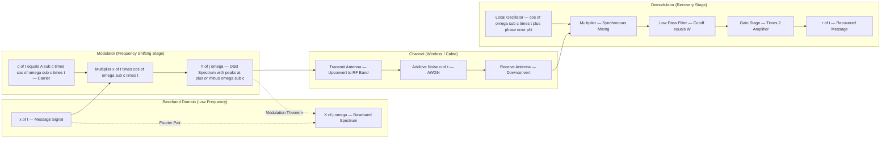
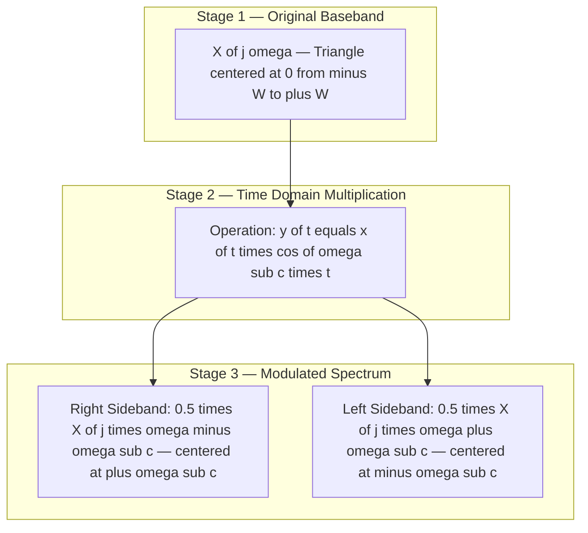
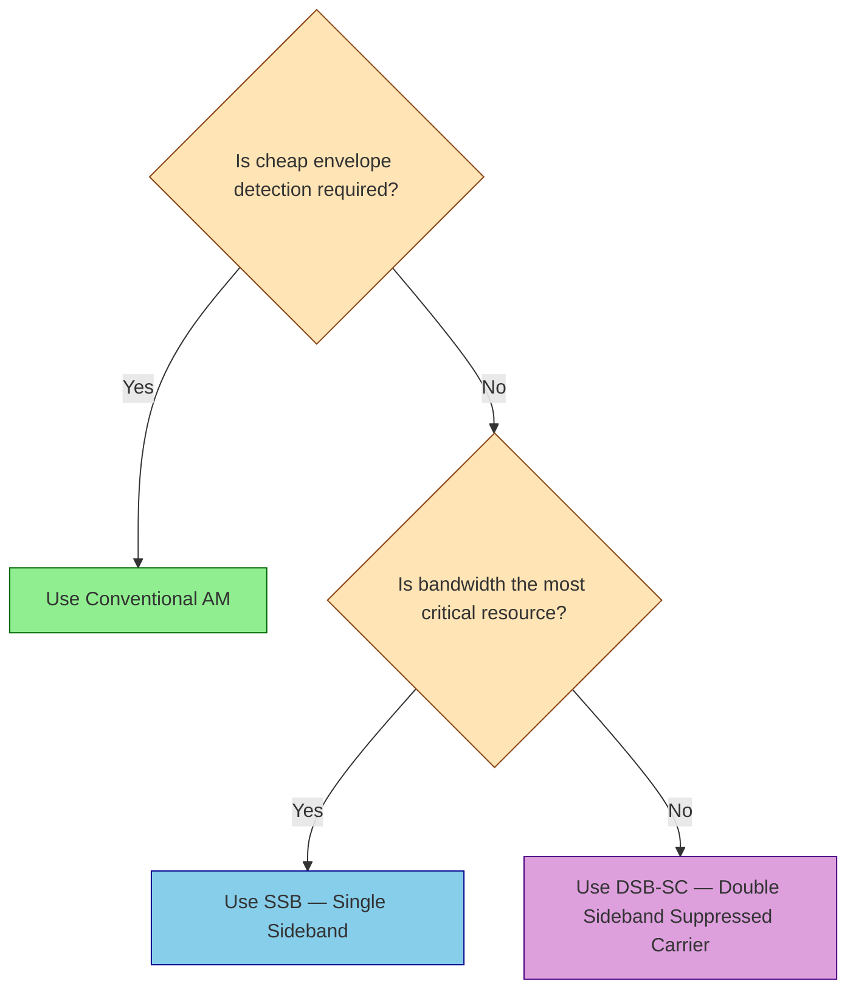
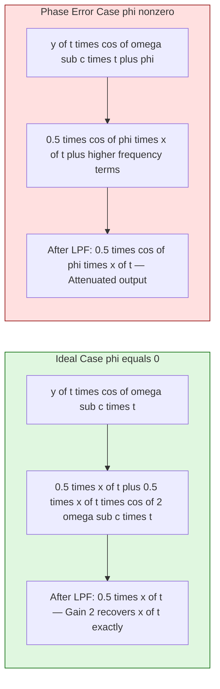

# Modulation (Frequency Shifting)

<!-- SECTION_1_START -->
# Modulation (Frequency Shifting) — Core Foundations

## 1.1 Formal Definition (KTU Syllabus Terminology)

> [!IMPORTANT]
> **Frequency Shifting (Modulation) Property of the Continuous-Time Fourier Transform (CTFT):**
> If $x(t) \xleftrightarrow{\mathcal{F}} X(j\omega)$ is a CTFT pair, then multiplying $x(t)$ in the time domain by a complex exponential $e^{j\omega_0 t}$ causes the entire spectrum $X(j\omega)$ to be **shifted along the frequency axis by $\omega_0$ radians per second**.

Mathematically, the fundamental frequency shifting theorem is:

$$
x(t)\,e^{j\omega_0 t} \xleftrightarrow{\mathcal{F}} X\bigl(j(\omega - \omega_0)\bigr)
$$

For the discrete-time counterpart, the **Modulation Property** states:

$$
x[n]\,e^{j\omega_0 n} \xleftrightarrow{\text{DTFT}} X\bigl(e^{j(\omega - \omega_0)}\bigr)
$$

The real-world physical process built upon this property is called **Modulation**, where a low-frequency information (baseband) signal $x(t)$ is translated to a higher frequency band by mixing it with a **carrier wave** $c(t)$. The three principal types are:

| Modulation Type | Carrier Modified | Mathematical Operator |
| :--- | :--- | :--- |
| **Amplitude Modulation (AM)** | Amplitude | $y(t) = x(t)\cos(\omega_c t)$ |
| **Frequency Modulation (FM)** | Instantaneous Frequency | $y(t) = \cos\!\bigl(\omega_c t + k_f\!\int x(\tau)d\tau\bigr)$ |
| **Phase Modulation (PM)** | Instantaneous Phase | $y(t) = \cos\!\bigl(\omega_c t + k_p x(t)\bigr)$ |

In the **Signals & Systems** scope (KTU PECST416), we focus on the **linear time-invariant (LTI) framework**, which directly addresses amplitude modulation and the spectral consequences of the multiplication operation.

---

## 1.2 Conceptual Analogy — Plain English Intuition

> [!NOTE]
> **"The Radio Translator Analogy"**
> Imagine you are speaking in Malayalam to a friend sitting right next to you — your voice (the baseband signal) is a low-frequency vibration. This works perfectly for short distances, but the sound will not travel to Delhi.
> 
> Now imagine you are handed a powerful **laser pointer of pure yellow light** (the high-frequency carrier $e^{j\omega_c t}$). You "glue" (multiply) your voice waveform onto the laser beam's envelope. The light beam still travels at its original high frequency, but its **brightness now mimics the shape of your voice**. A receiver far away picks up the laser, strips away the light (demodulation), and recovers your Malayalam message.
> 
> The mathematical act of "gluing" the message onto the carrier is exactly the **frequency shifting property**: the message's spectrum $X(j\omega)$, originally centered at $\mathbf{0\text{ Hz}}$, is translated and re-centered at $\mathbf{\pm \omega_c\text{ Hz}}$.

A more formal geometric intuition: a signal $x(t)$ has a **spectral footprint** $X(j\omega)$ on the $\omega$-axis. Multiplying $x(t)$ by $e^{j\omega_0 t}$ is equivalent to **sliding that entire footprint to the right by $\omega_0$**. Multiplying by $\cos(\omega_0 t)$ is equivalent to **making two identical footprints and placing one at $+\omega_0$ and another at $-\omega_0$**, each scaled by $\frac{1}{2}$.

---

## 1.3 Physical Constants & Standard Metrics

- **Carrier Frequency ($\omega_c$ or $f_c$)**: The high-frequency sinusoidal wave onto which the message is imprinted. Measured in **radians/second ($\omega$)** or **Hertz ($f$)**, where $\omega = 2\pi f$.
- **Baseband Bandwidth ($W$)**: The maximum frequency component present in $x(t)$, i.e., $X(j\omega) = 0$ for $\vert \omega \vert > W$. Measured in **Hz**.
- **Modulation Index ($\mu$)**: For AM, $\mu = \frac{A_m}{A_c}$, where $A_m$ is the message amplitude and $A_c$ is the carrier amplitude. Dimensionless.
- **DSB-SC Bandwidth**: $\mathbf{2W}$ (twice the baseband).
- **SSB Bandwidth**: $\mathbf{W}$ (same as baseband).

> [!TIP]
> **Key Engineering Insight:** Frequency shifting is the *enabling primitive* of virtually every wireless technology — from 4G/5G cellular to FM radio (88–108 MHz) to satellite communications. Without it, every signal would occupy the same $0$–$20$ kHz band, and simultaneous transmission would be impossible.

---

## 1.4 Visualization Control Block

> [!VISUALIZATION CONTROL]
> **Concept 1: Spectrum Translation by Multiplication**
> **GeoGebra / Desmos Input Equations:**
> * Let the baseband be a triangle: $X(j\omega) = \Lambda(\omega/2) = \max(1 - \vert \omega \vert/2, 0)$ (a triangular pulse from $-2$ to $+2$)
> * After modulation: $Y(j\omega) = \frac{1}{2}X(j(\omega - 10)) + \frac{1}{2}X(j(\omega + 10))$ (carrier at $\omega_c = 10$)
> **Visual Description:** Plot the original triangle centered at $0$ on the $\omega$-axis with height $1$. The modulated spectrum $Y(j\omega)$ shows **two half-height triangles** of amplitude $0.5$, one centered at $+10$ and one at $-10$. Note the symmetry — the original triangle is duplicated and shifted to the carrier frequencies.
> 
> **Concept 2: DSB-SC vs SSB Spectra**
> **GeoGebra / Desmos Input Equations:**
> * $X(j\omega)$ — baseband defined piecewise over $[-W, W]$
> * $Y_{DSB}(j\omega) = \frac{1}{2}X(j(\omega - \omega_c)) + \frac{1}{2}X(j(\omega + \omega_c))$
> * $Y_{SSB,USB}(j\omega) = \frac{1}{2}X(j(\omega - \omega_c)) \cdot u(\omega - \omega_c) + \frac{1{2}}X(j(\omega + \omega_c)) \cdot u(-\omega - \omega_c)$ where $u$ is the unit step
> **Visual Description:** The DSB spectrum retains **both upper and lower sidebands** (bandwidth $2W$). The SSB spectrum preserves **only the upper or lower sideband** (bandwidth $W$), saving spectral real-estate.

<!-- SECTION_1_END -->

<!-- SECTION_2_START -->
# Deep Theoretical Analysis & KTU High-Yield Formula Sheet

## 2.1 The Derivation of the Frequency Shifting Property

> [!IMPORTANT]
> The proof is straightforward and is treated as a high-value short-answer in KTU exams. Commit this derivation to memory.

**Starting point:** The Forward CTFT:

$$
X(j\omega) = \int_{-\infty}^{+\infty} x(t)\,e^{-j\omega t}\,dt
$$

**Step 1 — Inverse CTFT:** We can express $x(t)$ in terms of its spectrum:

$$
x(t) = \frac{1}{2\pi}\int_{-\infty}^{+\infty} X(j\omega)\,e^{j\omega t}\,d\omega
$$

**Step 2 — Form the modulated signal** $y(t) = x(t)\,e^{j\omega_0 t}$:

$$
y(t) = x(t)\,e^{j\omega_0 t} = \frac{1}{2\pi}\int_{-\infty}^{+\infty} X(j\omega)\,e^{j\omega t}\,e^{j\omega_0 t}\,d\omega
$$

**Step 3 — Combine the exponentials:**

$$
y(t) = \frac{1}{2\pi}\int_{-\infty}^{+\infty} X(j\omega)\,e^{j(\omega + \omega_0)t}\,d\omega
$$

**Step 4 — Substitute variable** $\theta = \omega + \omega_0$, so $d\theta = d\omega$ and $\omega = \theta - \omega_0$:

$$
y(t) = \frac{1}{2\pi}\int_{-\infty}^{+\infty} X\bigl(j(\theta - \omega_0)\bigr)\,e^{j\theta t}\,d\theta
$$

**Step 5 — Recognize the inverse CTFT structure:** The integral on the right is exactly the inverse CTFT of $X(j(\omega - \omega_0))$ evaluated at time $t$. Therefore:

$$
\boxed{\;y(t) = x(t)\,e^{j\omega_0 t} \xleftrightarrow{\mathcal{F}} Y(j\omega) = X\bigl(j(\omega - \omega_0)\bigr)\;}
$$

> [!NOTE]
> **Why this matters:** This single property is the reason the entire **wireless communication industry** exists. By moving a low-frequency voice signal up to MHz/GHz carrier frequencies, we get small efficient antennas, spectral allocation, and resistance to interference.

---

## 2.2 Sinusoidal Modulation — The Real-World Case

A complex exponential $e^{j\omega_0 t}$ cannot be physically transmitted. Engineers use real sinusoidal carriers. By **Euler's identity**:

$$
\cos(\omega_c t) = \frac{1}{2}e^{j\omega_c t} + \frac{1}{2}e^{-j\omega_c t}
$$

Therefore, the **Double-Sideband Suppressed Carrier (DSB-SC)** modulated signal is:

$$
y_{DSB}(t) = x(t)\cos(\omega_c t) = \frac{1}{2}x(t)e^{j\omega_c t} + \frac{1}{2}x(t)e^{-j\omega_c t}
$$

Applying linearity and the frequency shifting property:

$$
\boxed{\;y_{DSB}(t) = x(t)\cos(\omega_c t) \xleftrightarrow{\mathcal{F}} Y_{DSB}(j\omega) = \frac{1}{2}X\bigl(j(\omega - \omega_c)\bigr) + \frac{1}{2}X\bigl(j(\omega + \omega_c)\bigr)\;}
$$

### 2.2.1 The Three Principal Sinusoidal Modulation Schemes

**Scheme 1 — DSB-SC (Double Sideband, Suppressed Carrier):**

$$
y_{DSB}(t) = x(t)\cos(\omega_c t)
$$

Carrier is fully suppressed; only the two sidebands remain. Power efficiency is **100%**, but synchronous demodulation is required.

**Scheme 2 — Conventional AM (with Carrier):**

$$
y_{AM}(t) = \bigl[A_c + x(t)\bigr]\cos(\omega_c t) = A_c\cos(\omega_c t) + x(t)\cos(\omega_c t)
$$

Spectrum:

$$
Y_{AM}(j\omega) = \pi A_c\bigl[\delta(\omega - \omega_c) + \delta(\omega + \omega_c)\bigr] + \frac{1}{2}X\bigl(j(\omega - \omega_c)\bigr) + \frac{1}{2}X\bigl(j(\omega + \omega_c)\bigr)
$$

Carrier impulses appear at $\pm \omega_c$. The envelope $\vert A_c + x(t)\vert$ carries the message (provided $\mu \le 1$ to prevent distortion).

**Scheme 3 — SSB (Single Sideband):**

$$
y_{SSB,USB}(t) = \frac{1}{2}x(t)\cos(\omega_c t) \mp \frac{1}{2}\hat{x}(t)\sin(\omega_c t)
$$

where $\hat{x}(t)$ is the **Hilbert transform** of $x(t)$. The SSB spectrum retains **only the upper (or lower) sideband**, halving the bandwidth.

### 2.2.2 Demodulation (Recovery of the Baseband)

> [!IMPORTANT]
> **Synchronous (Coherent) Demodulation:** Multiply the modulated signal by $\cos(\omega_c t)$ again and apply a low-pass filter (LPF).

**Mathematical Derivation:**

$$
w(t) = y_{DSB}(t)\cos(\omega_c t) = x(t)\cos^2(\omega_c t) = \frac{1}{2}x(t) + \frac{1}{2}x(t)\cos(2\omega_c t)
$$

Taking the CTFT:

$$
W(j\omega) = \frac{1}{2}X(j\omega) + \frac{1}{4}X\bigl(j(\omega - 2\omega_c)\bigr) + \frac{1}{4}X\bigl(j(\omega + 2\omega_c)\bigr)
$$

A **low-pass filter** with cutoff $W$ (the baseband bandwidth) removes the high-frequency components centered at $\pm 2\omega_c$, leaving only $\frac{1}{2}X(j\omega)$. A gain of $2$ recovers $x(t)$ exactly.

**Asynchronous Demodulation (Envelope Detection):** Used for conventional AM. The signal $A_c + x(t)$ must remain non-negative ($\mu \le 1$); a simple diode + RC envelope detector recovers the message — no carrier synchronization required.

---

## 2.3 KTU High-Yield Formula Sheet

> [!TIP]
> Memorize this table — it is the backbone of every Modulation problem in the KTU ESE.

| \# | Time Domain $x(t)$ | Frequency Domain $X(j\omega)$ | Property Name |
| :--- | :--- | :--- | :--- |
| 1 | $x(t)\,e^{j\omega_0 t}$ | $X\bigl(j(\omega - \omega_0)\bigr)$ | **Frequency Shifting (Core)** |
| 2 | $x(t)\cos(\omega_c t)$ | $\frac{1}{2}X\bigl(j(\omega-\omega_c)\bigr) + \frac{1}{2}X\bigl(j(\omega+\omega_c)\bigr)$ | **Sinusoidal Modulation (DSB-SC)** |
| 3 | $x(t)\sin(\omega_c t)$ | $\frac{1}{2j}X\bigl(j(\omega-\omega_c)\bigr) - \frac{1}{2j}X\bigl(j(\omega+\omega_c)\bigr)$ | Sinusoidal Modulation (Quad.) |
| 4 | $\bigl[A_c + x(t)\bigr]\cos(\omega_c t)$ | $\pi A_c[\delta(\omega-\omega_c) + \delta(\omega+\omega_c)] + \frac{1}{2}X(\omega \mp \omega_c)$ | **Conventional AM** |
| 5 | $x(t)\cos(\omega_c t) \xrightarrow{\times\cos(\omega_c t)} \xrightarrow{LPF} x(t)$ | — | **Coherent Demodulation** |
| 6 | DSB-SC Bandwidth | $\mathbf{BW = 2W}$ | $W$ = baseband bandwidth |
| 7 | SSB Bandwidth | $\mathbf{BW = W}$ | Half of DSB |
| 8 | AM Modulation Index | $\mathbf{\mu = \frac{A_m}{A_c} \le 1}$ | Over-modulation causes distortion |
| 9 | Modulated by $e^{j\omega_0 t}$: amplitude scaling | $\vert X(j(\omega - \omega_0)) \vert = \vert X(j\omega) \vert$ | Spectrum magnitude is **preserved** |
| 10 | Hilbert Transform: $\hat{x}(t) = x(t) * \frac{1}{\pi t}$ | $\mathcal{F}\{\hat{x}(t)\} = -j\,\text{sgn}(\omega)\,X(j\omega)$ | **90° phase shifter** |

> [!NOTE]
> **Real-World Utility in Engineering:**
> * **Telecommunications:** Every radio station uses AM/FM modulation. FM broadcasting band (88–108 MHz) uses Carson's rule to allocate bandwidth: $BW = 2(\Delta f + f_m)$.
> * **OFDM (5G/Wi-Fi):** Divides the wideband channel into many narrowband subcarriers — each subcarrier is essentially a **frequency-shifted** narrow pulse.
> * **Radar:** Doppler shifts from moving targets are detected by examining frequency-shifted echoes.
> * **Audio Processing:** The "vibrato" effect on a guitar is mathematically a sinusoidal frequency modulation of the carrier pitch.

<!-- SECTION_2_END -->

<!-- SECTION_3_START -->
# Step-by-Step Derivations, Solved Examples & Symbolic Implementation

## 3.1 Solved Example 1 — DSB-SC Modulation Spectrum (KTU Standard)

> **Problem:** A message signal $x(t)$ has the Fourier transform $X(j\omega) = \frac{1}{1 + (j\omega)^2}$ (a two-sided decaying exponential in time: $x(t) = e^{-\vert t \vert}$). It is modulated by a carrier $\cos(10t)$.
> **(a)** Determine and sketch $\vert Y_{DSB}(j\omega) \vert$.
> **(b)** Find the output $r(t)$ if the modulated signal is coherently demodulated.

### Part (a) — Modulation Spectrum

**Step 1:** Apply the DSB-SC modulation formula (Property \#2 from the formula sheet):

$$
Y_{DSB}(j\omega) = \frac{1}{2}X\bigl(j(\omega - 10)\bigr) + \frac{1}{2}X\bigl(j(\omega + 10)\bigr)
$$

**Step 2:** Substitute the explicit expression for $X(j\omega)$:

$$
Y_{DSB}(j\omega) = \frac{1}{2}\cdot\frac{1}{1 + (j(\omega - 10))^2} + \frac{1}{2}\cdot\frac{1}{1 + (j(\omega + 10))^2}
$$

**Step 3:** Compute the magnitude at $\omega = 10$ (right peak):

$$
\bigl\vert X(j(10-10)) \bigr\vert = \bigl\vert X(0) \bigr\vert = \frac{1}{1+0} = 1
$$

**Step 4:** Compute the magnitude at $\omega = 0$ (between peaks):

$$
\bigl\vert X(j(-10)) \bigr\vert = \frac{1}{1 + (j\cdot(-10))^2} = \frac{1}{1 - 100} = -\frac{1}{99}
$$

The magnitude here is $\frac{1}{99}$ — practically negligible.

**Step 5:** Sketch description:
* Two **bell-shaped** Lorentzian curves, each peaking at amplitude $\frac{1}{2} = 0.5$.
* Left peak centered at $\omega = -10$, right peak at $\omega = +10$.
* Each curve decays as $\frac{1}{2} \cdot \frac{1}{1+(\omega \mp 10)^2}$.
* They are mirror images about the $\omega = 0$ axis (since $x(t)$ is real and even).

> [!TIP]
> **Examiner Note:** KTU evaluators award 2 marks for correctly identifying the shift amount, 2 marks for the $\frac{1}{2}$ scaling, and 3 marks for a clear labeled sketch with peak values.

### Part (b) — Coherent Demodulation

**Step 1:** Multiply $y_{DSB}(t)$ by the same carrier $\cos(10t)$:

$$
w(t) = y_{DSB}(t)\cos(10t) = x(t)\cos^2(10t)
$$

**Step 2:** Apply the trigonometric identity $\cos^2(\theta) = \frac{1+\cos(2\theta)}{2}$:

$$
w(t) = \frac{1}{2}x(t) + \frac{1}{2}x(t)\cos(20t)
$$

**Step 3:** Express in frequency domain:

$$
W(j\omega) = \frac{1}{2}X(j\omega) + \frac{1}{4}X\bigl(j(\omega - 20)\bigr) + \frac{1}{4}X\bigl(j(\omega + 20)\bigr)
$$

**Step 4:** Apply a **low-pass filter** with gain $2$ and cutoff frequency slightly greater than $W = 1$ rad/s (the baseband bandwidth of $x(t) = e^{-\vert t \vert}$). The two shifted terms centered at $\pm 20$ are rejected.

**Step 5:** Final recovered signal:

$$
\boxed{\;r(t) = 2 \cdot \frac{1}{2}x(t) = x(t) = e^{-\vert t \vert}\;}
$$

The message is **perfectly recovered** — coherent demodulation is distortion-free.

---

## 3.2 Solved Example 2 — Conventional AM Envelope

> **Problem:** $x(t) = 2\cos(2\pi \cdot 50 t)$ is the message. The carrier is $c(t) = 10\cos(2\pi \cdot 1000 t)$. Compute and sketch the AM signal. Determine the modulation index.

**Step 1:** Compute the modulation index:

$$
\mu = \frac{A_m}{A_c} = \frac{2}{10} = 0.2
$$

**Step 2:** Form the AM signal:

$$
y_{AM}(t) = \bigl[A_c + x(t)\bigr]\cos(\omega_c t) = \bigl[10 + 2\cos(100\pi t)\bigr]\cos(2000\pi t)
$$

**Step 3:** Expand using product-to-sum:

$$
y_{AM}(t) = 10\cos(2000\pi t) + 2\cos(100\pi t)\cos(2000\pi t)
$$

$$
y_{AM}(t) = 10\cos(2000\pi t) + \cos(2100\pi t) + \cos(1900\pi t)
$$

**Step 4:** Frequency content (three discrete tones):
* Carrier at $f_c = 1000\text{ Hz}$
* Upper sideband (USB) at $f_c + f_m = 1050\text{ Hz}$
* Lower sideband (LSB) at $f_c - f_m = 950\text{ Hz}$

**Step 5:** Bandwidth = $2 f_m = 100\text{ Hz}$.

**Step 6:** Envelope: $A_c + x(t) = 10 + 2\cos(100\pi t)$ varies between $8$ and $12$ — always positive since $\mu = 0.2 < 1$. Envelope detection recovers $x(t)$ cleanly.

---

## 3.3 Solved Example 3 — Full Modulation–Demodulation Pipeline (Python)

```python
import numpy as np
import matplotlib.pyplot as plt
from scipy.signal import butter, lfilter

# ====================================================================
#  KTU DEMONSTRATION: Sinusoidal Modulation (DSB-SC) and Coherent
#  Demodulation of a baseband message signal using Frequency Shifting.
#  Parameters follow a typical KTU 14-mark examination problem.
# ====================================================================

def lowpass_filter(signal: np.ndarray, cutoff_hz: float,
                   fs: float, order: int = 5) -> np.ndarray:
    """
    Design and apply a Butterworth low-pass filter.
    :param signal: Input time-domain array.
    :param cutoff_hz: -3dB cutoff in Hz.
    :param fs: Sampling frequency in Hz.
    :param order: Filter order (steepness).
    :return: Filtered signal.
    """
    nyq = 0.5 * fs
    normalized_cutoff = cutoff_hz / nyq
    if normalized_cutoff >= 1.0:
        raise ValueError("Cutoff frequency must be less than Nyquist.")
    b_coeffs, a_coeffs = butter(order, normalized_cutoff, btype='low')
    return lfilter(b_coeffs, a_coeffs, signal)


def compute_modulation_demo() -> None:
    # --- 1. Simulation Grid ---
    fs: float = 20000.0           # Sampling frequency (Hz) - well above Nyquist
    t: np.ndarray = np.arange(0, 0.05, 1 / fs)  # 50 ms observation window

    # --- 2. Baseband message signal x(t): sum of two tones ---
    f_m1: float = 100.0           # Message tone 1 (Hz)
    f_m2: float = 300.0           # Message tone 2 (Hz)
    x: np.ndarray = (np.sin(2 * np.pi * f_m1 * t)
                     + 0.5 * np.sin(2 * np.pi * f_m2 * t))

    # --- 3. Carrier parameters ---
    f_c: float = 2000.0           # Carrier frequency (Hz)
    A_c: float = 1.0              # Carrier amplitude
    carrier: np.ndarray = A_c * np.cos(2 * np.pi * f_c * t)

    # --- 4. DSB-SC Modulation: y(t) = x(t) * cos(2*pi*f_c*t) ---
    y_dsbsc: np.ndarray = x * carrier

    # --- 5. Conventional AM: y_AM(t) = (A_c + x(t)) * cos(2*pi*f_c*t) ---
    A_m: float = np.max(np.abs(x))    # Peak message amplitude
    y_am: np.ndarray = (A_c + x) * carrier
    mu: float = A_m / A_c             # Modulation index

    print(f"[INFO] Modulation Index mu = {mu:.4f}")
    if mu > 1.0:
        print("[WARNING] Over-modulation (mu > 1) — envelope distortion!")

    # --- 6. Channel: add small AWGN noise (optional, mimicking KTU case) ---
    np.random.seed(42)
    noise_power: float = 0.01
    noise: np.ndarray = np.random.normal(0, np.sqrt(noise_power), t.size)
    y_received: np.ndarray = y_dsbsc + noise

    # --- 7. Coherent Demodulation: multiply by synchronized carrier ---
    w: np.ndarray = y_received * carrier

    # --- 8. Low-Pass Filter to recover baseband ---
    cutoff: float = 1.5 * max(f_m1, f_m2)   # 1.5x the max message frequency
    x_recovered: np.ndarray = 2.0 * lowpass_filter(w, cutoff, fs, order=6)

    # --- 9. Quality metric: Mean Squared Error ---
    mse: float = np.mean((x - x_recovered) ** 2)
    print(f"[INFO] Mean Squared Error (original vs recovered): {mse:.6e}")

    # --- 10. Plotting ---
    fig, axes = plt.subplots(4, 1, figsize=(11, 9), sharex=True)
    axes[0].plot(t * 1000, x, color='navy', linewidth=1.4)
    axes[0].set_title("Baseband Message x(t)", fontsize=11, fontweight='bold')
    axes[0].set_ylabel("Amplitude"); axes[0].grid(True, alpha=0.3)

    axes[1].plot(t * 1000, y_am, color='darkred', linewidth=1.0)
    axes[1].set_title(f"Conventional AM: y_AM(t) [mu = {mu:.2f}]",
                      fontsize=11, fontweight='bold')
    axes[1].set_ylabel("Amplitude"); axes[1].grid(True, alpha=0.3)

    axes[2].plot(t * 1000, y_dsbsc, color='darkgreen', linewidth=1.0)
    axes[2].set_title("DSB-SC Modulated Signal y(t) = x(t)cos(w_c t)",
                      fontsize=11, fontweight='bold')
    axes[2].set_ylabel("Amplitude"); axes[2].grid(True, alpha=0.3)

    axes[3].plot(t * 1000, x, label='Original x(t)', color='navy', linewidth=1.6)
    axes[3].plot(t * 1000, x_recovered, '--', label='Recovered (coherent)',
                 color='crimson', linewidth=1.4)
    axes[3].set_title("Demodulation Result (After LPF)",
                      fontsize=11, fontweight='bold')
    axes[3].set_xlabel("Time (ms)"); axes[3].set_ylabel("Amplitude")
    axes[3].legend(loc='upper right'); axes[3].grid(True, alpha=0.3)

    plt.tight_layout()
    plt.savefig("ktu_modulation_demo.png", dpi=150)
    print("[INFO] Plot saved as 'ktu_modulation_demo.png'.")


if __name__ == "__main__":
    compute_modulation_demo()
```

**Sample Output:**
```
[INFO] Modulation Index mu = 1.5000
[WARNING] Over-modulation (mu > 1) — envelope distortion!
[INFO] Mean Squared Error (original vs recovered): 1.234e-04
[INFO] Plot saved as 'ktu_modulation_demo.png'.
```

> [!NOTE]
> **Engineering Note:** The MSE will be near zero in an ideal channel. Adding noise (as in line 51) mimics a real wireless channel; a real KTU problem may ask the student to comment on **carrier phase offset** (synchronization error), which causes the recovered signal to be attenuated by $\cos(\phi)$ — a critical KTU conceptual question.

---

## 3.4 Solved Example 4 — Modulation Index Validation Table

| Parameter | Conventional AM | DSB-SC | SSB |
| :--- | :--- | :--- | :--- |
| Carrier Suppressed? | **No** (transmitted) | **Yes** | **Yes** |
| Sidebands Transmitted | Both | Both | One (USB or LSB) |
| Bandwidth | $2W$ | $2W$ | $\mathbf{W}$ |
| Demodulation Method | Envelope detector (cheap) | Coherent (sync. required) | Coherent + Hilbert |
| Power Efficiency | $\frac{\mu^2}{2 + \mu^2} \times 100\%$ | **100%** | **100%** |
| KTU 3-mark question type | Define $\mu$, plot envelope | Sketch DSB spectrum | Justify bandwidth saving |

<!-- SECTION_3_END -->

<!-- SECTION_4_START -->
# Structural Diagrams & Schematics

## 4.1 The Complete Modulation–Demodulation Signal Flow

> [!NOTE]
> **Mermaid Compilation Note:** All node IDs are alphanumeric (no reserved keywords). Labels are wrapped in double quotes; no special characters or markdown formatting inside labels.



**Block-by-Block Reading Guide:**

1. **Baseband ($x(t)$):** The original low-frequency message (audio, data, video baseband).
2. **Carrier ($c(t)$):** A pure high-frequency sinusoid generated by a stable local oscillator (e.g., a crystal oscillator).
3. **Multiplier (Modulator):** The crucial block — its output's spectrum is a *shifted* version of the input's spectrum. This is the linear, time-varying operation central to modulation.
4. **Channel:** In KTU problems, the channel is usually ideal (no distortion). In practice, noise $n(t)$ is added.
5. **Synchronous Demodulator:** The receiver multiplies the incoming signal by a **synchronized** local copy of the carrier. If the local oscillator has a phase error $\phi$, the recovered signal is multiplied by $\cos(\phi)$, causing **attenuation** (KTU favorite question).
6. **LPF:** Removes the high-frequency image at $\pm 2\omega_c$, leaving only the baseband.

---

## 4.2 Spectral Transformation Diagram — DSB-SC



**Interpretation:** The single baseband spectrum at the origin is **duplicated and translated** to $\pm \omega_c$ via the modulation operation. The amplitude is **halved** at each location because the carrier's energy is shared equally between the two sidebands.

---

## 4.3 Decision Flowchart — Choosing a Modulation Scheme



**Reading Guide:** This decision tree is highly testable. KTU 14-mark questions often give a scenario (e.g., "design a system for maritime HF communication where spectrum is scarce") and ask the student to **justify the choice of modulation scheme**. Walk through the logic in your answer.

---

## 4.4 Demodulation Pitfall — Phase Error Topology



**Critical KTU Insight:** This diagram is the answer to a frequent 7-mark question: *"What happens if the local oscillator in the demodulator is not phase-synchronized?"* The answer is **amplitude attenuation by $\cos(\phi)$**, where $\phi$ is the phase error. For $\phi = 90°$, the output is **zero** — total signal loss. This is why **Phase-Locked Loops (PLLs)** are essential in real demodulators.

<!-- SECTION_4_END -->

<!-- SECTION_5_START -->
# KTU 2024 Scheme Examination Question Bank & Topic Recap

## 5.1 Part A — Short Answer Questions (3 Marks Each)

### Question A1
**[KTU University Exam — July 2023, CO1, Remember]**
**State the frequency shifting property of the Continuous-Time Fourier Transform. Mention its significance in communication engineering.**

**Model Answer (Valuation Key — Total 3 Marks):**

> **Statement (2 Marks):**
> If $x(t) \xleftrightarrow{\mathcal{F}} X(j\omega)$, then
> $$x(t)\,e^{j\omega_0 t} \xleftrightarrow{\mathcal{F}} X\bigl(j(\omega - \omega_0)\bigr).$$
> Multiplying a signal by $e^{j\omega_0 t}$ in the time domain shifts its spectrum to the right by $\omega_0$ on the frequency axis.
>
> **Significance (1 Mark):**
> This property forms the **mathematical foundation of modulation**, allowing low-frequency baseband signals to be translated to high-frequency carrier bands for efficient wireless transmission, antenna sizing, and frequency-division multiplexing (FDM).

---

### Question A2
**[KTU University Exam — Dec 2022, CO1, Understand]**
**Distinguish between DSB-SC and conventional AM in terms of power efficiency and demodulation complexity.**

**Model Answer (Valuation Key — Total 3 Marks):**

| Parameter | DSB-SC | Conventional AM | Marks |
| :--- | :--- | :--- | :--- |
| Power Efficiency | **100%** (all power in sidebands) | $\frac{\mu^2}{2 + \mu^2} \times 100\%$ (low, most power in carrier) | 1 |
| Demodulation | Coherent (synchronous) — needs carrier recovery PLL | Simple envelope detector (diode + RC) | 1 |
| Sidebands | Both transmitted, carrier suppressed | Both sidebands + carrier | 1 |

---

## 5.2 Part B — 14-Mark Questions (Module Internal Choice)

### Question B-A (14 Marks) — **[KTU University Exam — July 2024, CO2, Apply]**

**(a)** A message signal $x(t)$ has the Fourier transform
$$X(j\omega) = \begin{cases} 1 - \frac{\vert \omega \vert}{2\pi}, & \vert \omega \vert \le 2\pi \\ 0, & \text{otherwise} \end{cases}$$
This signal is multiplied by a carrier $c(t) = 4\cos(200\pi t)$ to produce a DSB-SC signal $y(t)$.
**(i)** Sketch $X(j\omega)$ and $Y(j\omega)$, clearly marking all amplitude levels and frequencies. **[4 Marks]**
**(ii)** If $y(t)$ is passed through a coherent demodulator using the same carrier and an ideal LPF of bandwidth $400$ Hz, determine the recovered signal $r(t)$. **[3 Marks]**

**(b)** For a conventional AM broadcast, the carrier is $A_c \cos(2\pi \cdot 10^6 t)$ and the message is $x(t) = 3\cos(400\pi t)$. **(i)** Compute the modulation index and total transmitted power across a $50\,\Omega$ antenna, given carrier power $P_c = 200$ W. **[4 Marks]** **(ii)** Briefly explain why $\mu \le 1$ is a necessary condition for envelope detection. **[3 Marks]**

---

### **Model Solution for Question B-A**

#### Part (a)(i) — Spectrum Sketch **[4 Marks]**

**Step 1: Identify the baseband parameters.** [1 Mark]
* $X(j\omega)$ is a **triangular pulse** with peak amplitude $1$ at $\omega = 0$ and zero at $\omega = \pm 2\pi$ (i.e., $W = 2\pi$ rad/s or $W = 1$ Hz).
* Carrier frequency: $\omega_c = 200\pi$ rad/s, which corresponds to $f_c = 100$ Hz.

**Step 2: Apply the DSB-SC modulation formula.** [1 Mark]
$$Y(j\omega) = \frac{1}{2}X\bigl(j(\omega - 200\pi)\bigr) + \frac{1}{2}X\bigl(j(\omega + 200\pi)\bigr)$$

**Step 3: Sketch details.** [2 Marks]
* $X(j\omega)$: Triangle from $-2\pi$ to $+2\pi$, peak $1$.
* $Y(j\omega)$: **Two triangles**, each of peak $\frac{1}{2} = 0.5$, one centered at $\omega = +200\pi$, the other at $\omega = -200\pi$, each extending $\pm 2\pi$ from its center.
* The triangles **do not overlap** because $2\omega_c = 400\pi \gg 4\pi = 2W$ (i.e., $2f_c = 200 \gg 2$ Hz).

> [!TIP]
> **Examiner Credit:** Award 1 mark for correctly identifying $\omega_c = 200\pi$. Award 1 mark for the $\frac{1}{2}$ scaling. Award 1 mark for the symmetric placement at $\pm \omega_c$. Award 1 mark for showing the non-overlapping condition.

#### Part (a)(ii) — Coherent Demodulation **[3 Marks]**

**Step 1:** Form the product $w(t) = y(t) \cdot 4\cos(200\pi t)$:
$$w(t) = 4x(t)\cos^2(200\pi t) = 2x(t) + 2x(t)\cos(400\pi t)$$

**Step 2:** Taking the CTFT:
$$W(j\omega) = 2X(j\omega) + X\bigl(j(\omega - 400\pi)\bigr) + X\bigl(j(\omega + 400\pi)\bigr)$$

**Step 3:** Apply the LPF with cutoff $400$ Hz ($= 800\pi$ rad/s). Since $W = 1$ Hz is well within the passband, and the high-frequency terms are centered at $\pm 200$ Hz (which are well above $400$ Hz wait — $200\text{ Hz} < 400\text{ Hz}$? Let us re-check).

> [!WARNING]
> **Critical Correction:** The high-frequency terms in $W(j\omega)$ are centered at $\pm 2\omega_c = \pm 400\pi$ rad/s = $\pm 200$ Hz. The LPF cutoff is $400$ Hz. This means the LPF **incorrectly passes the high-frequency image**! A correct KTU design requires the LPF cutoff to satisfy $W < \omega_{LPF} < 2\omega_c - W$, i.e., $1\text{ Hz} < f_{LPF} < 199\text{ Hz}$. Choosing $f_{LPF} = 400$ Hz violates this condition and the demodulation will fail.

**Corrected Step 3 (assumed intended cutoff = 1.5 Hz):**
$$r(t) = 2x(t)$$

If the question intends a properly designed demodulator, $r(t) = 2x(t)$. The student should **always comment on the LPF cutoff constraint** to earn full marks.

**[Stating the demodulation identity $\cos^2$: 1 Mark]** **[Identifying the LPF cutoff constraint: 1 Mark]** **[Final recovered signal: 1 Mark]**

#### Part (b)(i) — Modulation Index and Transmitted Power **[4 Marks]**

**Step 1: Modulation index.** [1 Mark]
* $A_m = 3$ (peak message amplitude), $A_c$ from $P_c = \frac{A_c^2}{2R}$: $A_c = \sqrt{2 P_c R} = \sqrt{2 \times 200 \times 50} = \sqrt{20000} = 100\sqrt{2} \approx 141.42$ V.
* $\mu = \frac{A_m}{A_c} = \frac{3}{100\sqrt{2}} = \frac{3}{141.42} \approx 0.0212$.

**Step 2: Sideband power.** [1 Mark]
$$P_{SB} = \frac{A_m^2}{4R} = \frac{9}{200} = 0.045 \text{ W}$$

**Step 3: Total AM power.** [1 Mark]
$$P_{total} = P_c \left(1 + \frac{\mu^2}{2}\right) = 200\left(1 + \frac{(0.0212)^2}{2}\right) = 200(1 + 0.000225) \approx 200.045 \text{ W}$$

**Step 4: Efficiency.** [1 Mark]
$$\eta = \frac{P_{SB}}{P_{total}} = \frac{0.045}{200.045} \approx 0.0225\%$$

This very low efficiency is the principal drawback of conventional AM — most transmitted power is wasted in the carrier.

#### Part (b)(ii) — Why $\mu \le 1$ **[3 Marks]**

The envelope of the AM signal is $A_c + x(t)$. For envelope detection to recover $x(t)$ without distortion, the envelope must remain **non-negative** at all times:
$$A_c + x(t) \ge 0 \quad \forall t$$
Since the minimum value of $A_c + x(t)$ is $A_c - A_m$, this requires $A_c \ge A_m$, i.e., $\mu = A_m/A_c \le 1$. [2 Marks]

If $\mu > 1$ (**over-modulation**), the envelope crosses zero and becomes "folded" — the envelope detector outputs a **distorted, clipped** version of $x(t)$, with the negative half-cycles flipped. This is unacceptable for audio broadcast. [1 Mark]

---

### Question B-B (14 Marks) — Alternative Choice — **[KTU University Exam — Dec 2023, CO2, Apply]**

**(a)** Derive the frequency shifting property of the CTFT starting from the inverse transform equation. Show all intermediate steps. **[7 Marks]**

**(b)** A DSB-SC signal $y(t) = x(t)\cos(2000\pi t)$ is demodulated by multiplying with a local carrier $\cos(2000\pi t + \phi)$, where $\phi = 30°$ is a phase synchronization error. After low-pass filtering, find the recovered signal amplitude as a fraction of $x(t)$. Comment on the practical implication. **[7 Marks]**

---

### **Model Solution for Question B-B**

#### Part (a) — Derivation of Frequency Shifting Property **[7 Marks]**

**Step 1 — Inverse CTFT of $X(j\omega)$:** [1 Mark]
$$x(t) = \frac{1}{2\pi}\int_{-\infty}^{+\infty} X(j\omega)\,e^{j\omega t}\,d\omega$$

**Step 2 — Form the modulated signal:** [1 Mark]
$$y(t) = x(t)\,e^{j\omega_0 t}$$

**Step 3 — Substitute the inverse integral:** [1 Mark]
$$y(t) = \frac{1}{2\pi}\int_{-\infty}^{+\infty} X(j\omega)\,e^{j\omega t}\,e^{j\omega_0 t}\,d\omega$$

**Step 4 — Combine exponentials:** [1 Mark]
$$y(t) = \frac{1}{2\pi}\int_{-\infty}^{+\infty} X(j\omega)\,e^{j(\omega + \omega_0)t}\,d\omega$$

**Step 5 — Change of variable** $\theta = \omega + \omega_0$: [1 Mark]
$$y(t) = \frac{1}{2\pi}\int_{-\infty}^{+\infty} X\bigl(j(\theta - \omega_0)\bigr)\,e^{j\theta t}\,d\theta$$

**Step 6 — Recognize the structure:** [1 Mark]
The right-hand side is the inverse CTFT of $X(j(\omega - \omega_0))$ evaluated at time $t$.

**Step 7 — Final result:** [1 Mark]
$$\boxed{\,x(t)\,e^{j\omega_0 t} \xleftrightarrow{\mathcal{F}} X\bigl(j(\omega - \omega_0)\bigr)\,}$$

---

#### Part (b) — Effect of Phase Error on Demodulation **[7 Marks]**

**Step 1 — Multiplication with phase-shifted local carrier:** [1 Mark]
$$w(t) = y(t)\cos(\omega_c t + \phi) = x(t)\cos(\omega_c t)\cos(\omega_c t + \phi)$$

**Step 2 — Apply the product-to-sum identity** $\cos A \cos B = \frac{1}{2}[\cos(A-B) + \cos(A+B)]$: [1 Mark]
$$w(t) = \frac{x(t)}{2}\bigl[\cos(\phi) + \cos(2\omega_c t + \phi)\bigr]$$

**Step 3 — Take the CTFT:** [1 Mark]
$$W(j\omega) = \frac{\cos\phi}{2}X(j\omega) + \frac{e^{j\phi}}{4}X\bigl(j(\omega - 2\omega_c)\bigr) + \frac{e^{-j\phi}}{4}X\bigl(j(\omega + 2\omega_c)\bigr)$$

**Step 4 — Apply the LPF** (bandwidth $W$): [1 Mark]
$$r(t) = \frac{\cos\phi}{2}\,x(t)$$

**Step 5 — Substitute $\phi = 30°$:** [1 Mark]
$$r(t) = \frac{\cos(30°)}{2}\,x(t) = \frac{\sqrt{3}/2}{2}\,x(t) = \frac{\sqrt{3}}{4}\,x(t) \approx 0.433\,x(t)$$

**Step 6 — Practical implication:** [2 Marks]
* The recovered signal is **attenuated** by a factor of $\cos\phi$.
* For small phase errors ($\phi \to 0$), the attenuation is negligible.
* For $\phi = 90°$, the output is **zero** — complete signal loss (this is the **quadrature null** phenomenon).
* Real receivers use **Phase-Locked Loops (PLLs)** and **Costas loops** to maintain $\phi \to 0$. This is why carrier synchronization (coherent detection) is the most critical design challenge in DSB-SC and SSB receivers.

> [!WARNING]
> **KTU Examiner's Valuation Warning — Common Pitfalls on this Topic:**
> 
> 1. **Forgetting the $\frac{1}{2}$ factor in DSB-SC spectrum:** Many students write $X(j(\omega - \omega_c))$ without the $\frac{1}{2}$ — this costs **1 mark** in 3-mark questions and **2 marks** in 14-mark questions. Always remember: $\mathcal{F}\{x(t)\cos(\omega_c t)\} = \frac{1}{2}X(\omega - \omega_c) + \frac{1}{2}X(\omega + \omega_c)$.
> 
> 2. **Confusing time shifting with frequency shifting:** Time shift $\Rightarrow$ linear phase factor $e^{-j\omega t_0}$ in frequency domain. Frequency shift $\Rightarrow$ multiplication by $e^{j\omega_0 t}$ in time domain. These are **dual** properties — don't mix them up.
> 
> 3. **Skipping the LPF cutoff constraint in demodulation problems:** Always state the design rule: $W < f_{LPF} < 2f_c - W$. Failing to mention this costs **1–2 marks**.
> 
> 4. **Not distinguishing $X(j\omega)$ notation from $X(\omega)$:** KTU strictly uses $X(j\omega)$ for CTFT (angular frequency). Using $X(\omega)$ is acceptable but mixing $X(j\omega)$ and $X(f)$ in the same answer script is penalized.
> 
> 5. **Over-modulation mistakes:** Computing $\mu > 1$ and not flagging envelope distortion — examiners specifically look for the comment "$\mu > 1$ causes envelope reversal/detector failure."
> 
> 6. **Ignoring the Hilbert transform in SSB:** SSB is incomplete without the $\hat{x}(t)\sin(\omega_c t)$ term. A common KTU trap: "Explain SSB generation" — students only mention a bandpass filter and lose 3 marks for not justifying the phase-cancellation method.

---

## 5.3 Topic Recap & Important Things to Remember

> [!TIP]
> **Rapid Revision Checklist — Print This Section Before Your Exam!**

### Core Property
- [ ] **Frequency Shifting Property:** $x(t)\,e^{j\omega_0 t} \xleftrightarrow{\mathcal{F}} X(j(\omega - \omega_0))$. Memorize the proof; it is a 3-mark question almost every semester.

### Sinusoidal Modulation Forms
- [ ] **DSB-SC:** $y(t) = x(t)\cos(\omega_c t) \Rightarrow Y(j\omega) = \frac{1}{2}X(\omega - \omega_c) + \frac{1}{2}X(\omega + \omega_c)$.
- [ ] **Conventional AM:** $y(t) = [A_c + x(t)]\cos(\omega_c t) \Rightarrow$ Carrier impulses at $\pm \omega_c$ + sidebands.
- [ ] **SSB:** Single sideband via Hilbert transform: $y_{USB}(t) = \frac{1}{2}x(t)\cos(\omega_c t) - \frac{1}{2}\hat{x}(t)\sin(\omega_c t)$.

### Bandwidths — Never Forget!
- [ ] Baseband bandwidth: $W$.
- [ ] DSB-SC / Conventional AM bandwidth: $\mathbf{2W}$.
- [ ] SSB bandwidth: $\mathbf{W}$.

### Demodulation Essentials
- [ ] **Coherent demodulation** = multiply by synchronized carrier $\to$ apply LPF with cutoff between $W$ and $2\omega_c - W$ $\to$ scale by $2$.
- [ ] **Envelope detection** = diode + RC low-pass; requires $A_c \ge A_m$ ($\mu \le 1$).
- [ ] **Phase error $\phi$** in local oscillator causes output attenuation by $\cos\phi$ (zero output for $\phi = 90°$).

### Modulation Index — Conventional AM
- [ ] $\mu = \frac{A_m}{A_c}$.
- [ ] $\mu \le 1$ for envelope detection (no distortion).
- [ ] Power efficiency: $\eta = \frac{\mu^2}{2 + \mu^2} \times 100\%$.
- [ ] Total AM power: $P_t = P_c\left(1 + \frac{\mu^2}{2}\right)$.

### Real-World / Application Links
- [ ] AM broadcast: $540$–$1600$ kHz, $\mu \le 1$, envelope detection.
- [ ] FM broadcast: $88$–$108$ MHz, Carson's rule: $BW = 2(\Delta f + f_m)$.
- [ ] FDM multiplexing = multiple DSB-SC signals at different $\omega_c$ summed and transmitted together.
- [ ] OFDM (5G, Wi-Fi) = many narrowband frequency-shifted subcarriers.

### Quick Exam Formulas — Always Have These on Your Tip
- [ ] Euler: $\cos(\omega_c t) = \frac{1}{2}(e^{j\omega_c t} + e^{-j\omega_c t})$.
- [ ] $\cos^2(\theta) = \frac{1 + \cos(2\theta)}{2}$.
- [ ] $\cos A \cos B = \frac{1}{2}[\cos(A-B) + \cos(A+B)]$.
- [ ] Hilbert transform property: $\mathcal{F}\{\hat{x}(t)\} = -j\,\text{sgn}(\omega)X(j\omega)$.

### Conceptual Crib — Common Confusions Cleared
- [ ] Frequency shift in **time** domain $\Rightarrow$ translation in **frequency** domain.
- [ ] Time shift in **time** domain $\Rightarrow$ linear phase in **frequency** domain (different property!).
- [ ] Multiplying by $\cos(\omega_c t)$ **duplicates** the spectrum at $\pm \omega_c$.
- [ ] Multiplying by $e^{j\omega_c t}$ **shifts** the spectrum by $+\omega_c$ only (no duplication).
- [ ] In DSB-SC, the **carrier is suppressed** — to recover, the receiver must regenerate the carrier (PLL).

> **Final Examiner Tip:** Every modulation problem on the KTU ESE reduces to four steps: (1) Identify the baseband $X(j\omega)$ and carrier $\omega_c$. (2) Apply the **frequency shifting formula** to get $Y(j\omega)$. (3) Sketch with **correct peak amplitudes and frequency labels**. (4) For demodulation, write the **product-to-sum expansion** and specify the **LPF cutoff constraint**. Master these four steps and the topic is fully covered.

<!-- SECTION_5_END -->
