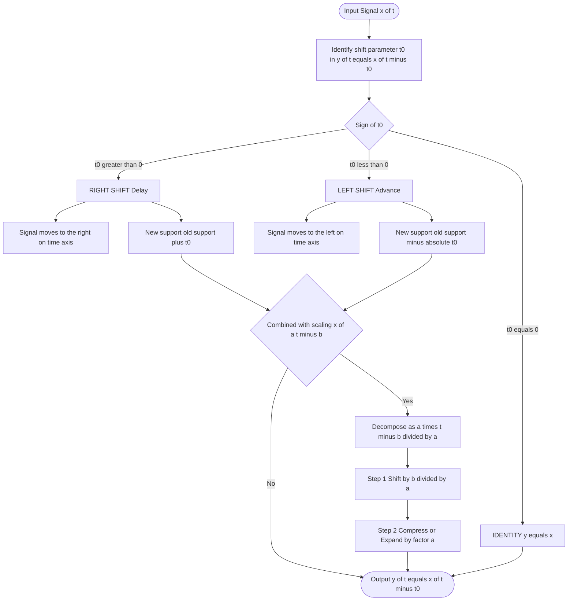
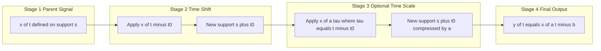
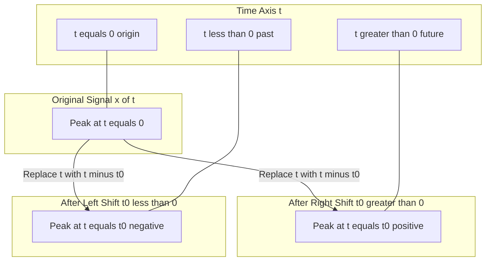
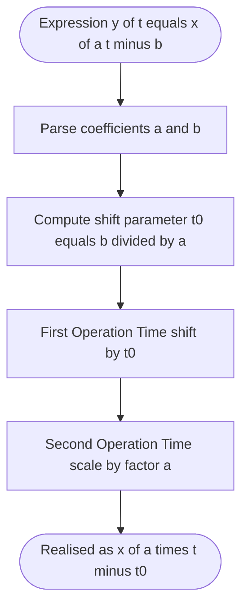

# Operations on Signals  - Time shifting (Translation)

<!-- SECTION_1_START -->

# Time Shifting (Translation) of Signals

> [!IMPORTANT]
> **KTU 2024 Scheme | PECST416 – Signals and Systems | Module 1: 1-D Signals**
> **Topic:** Operations on Signals – Time Shifting (Translation)
> **Mapped Course Outcome:** **CO1** – Apply the fundamental concepts of continuous-time and discrete-time signals and systems.

## 1.1 Formal Academic Definition

**Time Shifting** (also called **Translation**) is a fundamental signal transformation in which the independent variable $t$ (continuous-time) or $n$ (discrete-time) is replaced by a shifted version, namely $(t-t_0)$ or $(n-n_0)$. The amplitude and shape of the signal are preserved; only its position along the time axis is displaced.

Mathematically, given a parent signal $x(t)$, the time-shifted signal is defined as:

$$y(t) = x(t - t_0)$$

where $t_0 \in \mathbb{R}$ is the **shift parameter** (also called the **translation index**). The corresponding discrete-time operation is:

$$y[n] = x[n - n_0], \quad n_0 \in \mathbb{Z}$$

The two canonical cases are:

| Parameter | Operation | Engineering Interpretation |
| :--- | :--- | :--- |
| $t_0 > 0$ | **Right Shift (Delay)** | Signal is delayed; appears later in time |
| $t_0 < 0$ | **Left Shift (Advance)** | Signal is advanced; appears earlier in time |

> [!NOTE]
> **Key KTU Board Convention:** "Replace $t$ with $(t - t_0)$" is the universal rule. The sign of $t_0$ determines the direction — *not* whether you add or subtract directly.

## 1.2 Conceptual Analogy — The Film Reel Intuition

Imagine a **continuous strip of motion-picture film** running horizontally past a projector lens. The lens is your "current time origin" $t=0$.

- **Right Shift ($t_0 > 0$):** Wind the film **forward** by $t_0$ frames. The frame that was just shown now appears $t_0$ units *later* on the screen. The waveform literally slides to the right.
- **Left Shift ($t_0 < 0$):** Rewind the film. Past frames arrive at the lens *earlier* — the waveform slides to the left.

> [!TIP]
> **Memory Trick (used by KTU toppers):** *"(t - t₀) means the original value at t₀ is now at t = 0."* If $y(t) = x(t-2)$, set $t-2=0 \Rightarrow t=2$. So whatever $x$ showed at the origin, $y$ shows it at $t=2$. **Signal moved right by 2.**

## 1.3 Physical / Numerical Constants Worth Memorising

For continuous-time signals, $t_0$ can be **any real number** (fractional shifts are permitted).
For discrete-time signals, $n_0$ **must be an integer** — shifting by 1.5 samples is **mathematically undefined** in standard DSP.

> [!WARNING]
> **Common KTU Mistake:** A student often writes "$y(t) = x(t) - 2$" instead of "$y(t) = x(t-2)$". The first is a **DC offset** (amplitude shift), the second is **time shifting** — these are entirely different operations and the examiner will deduct marks.

## 1.4 Visualization Blueprint (GeoGebra / Desmos)

> [!VISUALIZATION CONTROL]
> **Concept:** Visualising a rectangular pulse $x(t) = \mathrm{rect}(t)$ and its right-shifted version $x(t-2)$.
> **Desmos / GeoGebra Input Equations:**
> * $x(t) = \text{If}(|t| \leq 1, 1, 0)$
> * $y(t) = \text{If}(|t-2| \leq 1, 1, 0)$
> * $z(t) = \text{If}(|t+2| \leq 1, 1, 0)$
> **Visual Description:** You should observe three identical rectangular pulses of width **2 units** and height **1 unit**. The blue pulse $x(t)$ straddles the origin, the orange pulse $y(t)$ is displaced **2 units to the right** (delayed), and the green pulse $z(t)$ is displaced **2 units to the left** (advanced). The shape and width are strictly preserved.

<!-- SECTION_1_END -->

<!-- SECTION_2_START -->

# Deep Theoretical Analysis & KTU Formula Sheet

## 2.1 Operational Logic — The Replacement Rule

The single underlying principle of time shifting is **function composition by substitution**. Given $y(t) = x(g(t))$, where $g(t) = t - t_0$ is a linear (affine) transformation of the independent variable, the signal's value at the new time $t$ is whatever the parent signal $x$ had at the *earlier* or *later* moment $g(t)$.

### Step-by-Step Logical Breakdown

1. **Identify the shift parameter** $t_0$ in $y(t) = x(t - t_0)$.
2. **Solve the inner expression for zero**: Set $t - t_0 = 0 \implies t = t_0$. This is the *new location* of what was originally at $t = 0$ in $x(t)$.
3. **Determine direction:**
   * If $t_0 > 0$, the value of $x(0)$ now occurs at positive time $t_0 \Rightarrow$ **Right shift** (signal moves to the right on the $t$-axis).
   * If $t_0 < 0$, the value of $x(0)$ now occurs at negative time $t_0 \Rightarrow$ **Left shift** (signal moves to the left on the $t$-axis).
4. **Preserve amplitude:** At every instant, the *magnitude* of the signal is identical to that of the parent signal — only the *time coordinate* is rescheduled.

> [!IMPORTANT]
> **KTU Examiner's Insight:** Time shifting is a **bijection** on the time axis — every point on the real line is mapped to exactly one other point, and no information (energy) is lost or created. This is formally stated in §2.3.

## 2.2 Combined Operations — Shift + Scale

A common KTU question asks: *Given $y(t) = x(at - b)$, what is the sequence of operations?*

The canonical decomposition is:

$$y(t) = x(at - b) = x\!\left(a\!\left(t - \tfrac{b}{a}\right)\right)$$

* **First** shift $x(t)$ by $\dfrac{b}{a}$ to the right, **then** compress by factor $a$ (if $\vert a \vert > 1$).

> [!WARNING]
> The order **matters** for continuous-time signals. Shifting first and scaling later is **not** the same as scaling first and shifting later. KTU frequently tests this by giving $x(2t-4)$ and asking for the order.

## 2.3 Properties of Time Shifting

| Property | Statement | Engineering Utility |
| :--- | :--- | :--- |
| **Linearity** | $a\,x_1(t-t_0) + b\,x_2(t-t_0) = [a\,x_1 + b\,x_2](t-t_0)$ | Used in LTI system superposition analysis |
| **Energy Invariance** | $\displaystyle\int_{-\infty}^{\infty}\vert x(t-t_0)\vert^{2}\,dt = \int_{-\infty}^{\infty}\vert x(t)\vert^{2}\,dt$ | Energy of a signal does not change under time shift |
| **Power Invariance** | $P_{x} = P_{y}$ for periodic signals | Average power preserved under delay |
| **Time Reversal Composition** | $x(-t-t_0) = x(-(t+t_0))$ | Combines reflection and shift |
| **Shift is Invertible** | $x(t) = y(t+t_0)$ if $y(t) = x(t-t_0)$ | Used in system deconvolution |

> [!NOTE]
> **Proof Sketch (Energy Invariance):** Let $\tau = t - t_0$, then $d\tau = dt$, and limits remain $(-\infty, \infty)$. Hence $\int \vert x(t-t_0)\vert^2\,dt = \int \vert x(\tau)\vert^2\,d\tau$. This is a **favourite 3-mark KTU question**.

## 2.4 KTU High-Yield Formula Sheet

| Symbol / Expression | Meaning | Sign Convention |
| :--- | :--- | :--- |
| $y(t) = x(t - t_0)$ | Generic time shift | $t_0 > 0 \Rightarrow$ Right, $t_0 < 0 \Rightarrow$ Left |
| $y[n] = x[n - n_0]$ | Discrete time shift | $n_0 \in \mathbb{Z}$ only |
| $x(at - b)$ | Combined scale + shift | Decompose as $a(t - b/a)$ |
| $x(-t - t_0)$ | Reflection + shift | First reflect, then shift by $-t_0$ |
| $x(t) \xrightarrow{t \to t-t_0} x(t-t_0)$ | Operator notation | Apply to **inner** variable |
| $t_{\text{new}} = t + t_0$ | Numerical plotting rule | Plot original $x$ at $t + t_0$ to get $y$ |

## 2.5 Real-World Engineering Applications

1. **Telecommunications:** A signal arriving at a receiver experiences **propagation delay** $t_d = d/c$, where $d$ is the path length and $c$ is the speed of light. The received signal is $y(t) = x(t - t_d)$.
2. **Radar & Sonar:** Time shifting of echoed pulses encodes target **range** $R = c \cdot \Delta t / 2$.
3. **Audio Processing:** Reverb and echo effects are implemented via $y(t) = x(t) + \alpha\,x(t - \tau)$.
4. **Medical Imaging (MRI, Ultrasound):** Beam-forming uses precise time shifts to focus signals from multiple transducer elements.
5. **Control Systems:** Transport lag $e^{-sT}$ in a feedback loop is a pure time shift, modelled as $y(t) = u(t - T)$.

<!-- SECTION_2_END -->

<!-- SECTION_3_START -->

# Step-by-Step Derivations, Worked Examples & Python Implementation

## 3.1 Worked Example 1 — Continuous-Time Rectangular Pulse

**Problem:** Given $x(t) = \mathrm{rect}(t) = \begin{cases} 1, & \vert t\vert \leq 1 \\ 0, & \text{otherwise} \end{cases}$. Sketch:
**(a)** $x(t-2)$, **(b)** $x(t+3)$, **(c)** $x(2t-4)$.

### Part (a): $x(t-2)$ — Right Shift by 2

The parent signal $x(t)$ is non-zero on $[-1, 1]$. Substituting $t \to t-2$, the support becomes:

$$-1 \leq (t-2) \leq 1 \implies 1 \leq t \leq 3$$

Therefore:

$$x(t-2) = \begin{cases} 1, & 1 \leq t \leq 3 \\ 0, & \text{otherwise} \end{cases}$$

**[Valuation: 2 Marks for substitution step, 2 Marks for correct new support interval, 1 Mark for final piecewise expression]**

### Part (b): $x(t+3)$ — Left Shift by 3

With $t_0 = -3$, the rule gives a left shift. The support becomes:

$$-1 \leq (t+3) \leq 1 \implies -4 \leq t \leq -2$$

Therefore:

$$x(t+3) = \begin{cases} 1, & -4 \leq t \leq -2 \\ 0, & \text{otherwise} \end{cases}$$

**[Valuation: 2 Marks for identifying $t_0 = -3$, 1 Mark for substitution, 2 Marks for support]**

### Part (c): $x(2t-4)$ — Combined Shift + Scale

Decompose using the rule $a(t - t_0)$ with $a = 2$ and $b = 4$:

$$x(2t - 4) = x\!\left(2(t - 2)\right)$$

So we **first shift $x(t)$ right by 2** (giving a pulse on $[1,3]$), **then compress by factor 2**. The new support is:

$$\frac{1}{2} \leq t \leq \frac{3}{2}$$

Equivalently, solve $-1 \leq 2t-4 \leq 1 \implies \dfrac{3}{2} \leq t \leq \dfrac{5}{2}$. The height remains $1$.

**[Valuation: 2 Marks for decomposition, 2 Marks for operation sequence, 1 Mark each for support and height]**

## 3.2 Worked Example 2 — Discrete-Time Sequence

**Problem:** Let $x[n] = \{1, 2, 3, 4\}$ defined for $n = 0, 1, 2, 3$. Find:
**(a)** $y[n] = x[n-2]$, **(b)** $z[n] = x[n+1]$.

### Part (a): $y[n] = x[n-2]$ — Right Shift by 2

The value $x[k]$ that originally occurred at $n = k$ now occurs at $n = k+2$. Tabulating:

| $n$ | $-2$ | $-1$ | $0$ | $1$ | $2$ | $3$ | $4$ | $5$ |
| :-: | :-: | :-: | :-: | :-: | :-: | :-: | :-: | :-: |
| $y[n]$ | 1 | 2 | 3 | 4 | 0 | 0 | 0 | 0 |

So $y[n] = \{\underline{1, 2, 3, 4}\}$ with the underline (origin marker) at $n = -2$.

**[Valuation: 1 Mark for table, 2 Marks for correct origin placement, 1 Mark for non-zero range]**

### Part (b): $z[n] = x[n+1]$ — Left Shift by 1

Here $n_0 = -1$, indicating a left shift. The value $x[k]$ that was at $n = k$ now occurs at $n = k - 1$:

| $n$ | $-1$ | $0$ | $1$ | $2$ | $3$ | $4$ |
| :-: | :-: | :-: | :-: | :-: | :-: | :-: |
| $z[n]$ | 1 | 2 | 3 | 4 | 0 | 0 |

So $z[n] = \{\underline{1, 2, 3, 4}\}$ with the origin at $n = -1$.

## 3.3 Symbolic Verification Using LaTeX Algebra

To confirm the relationship symbolically, consider the inner substitution:

$$y(t) = x(t - t_0)$$

Let $\tau = t - t_0 \implies d\tau = dt$. Then:

$$y(t_0) = x(t_0 - t_0) = x(0)$$

$$y(0) = x(0 - t_0) = x(-t_0)$$

$$y(2t_0) = x(2t_0 - t_0) = x(t_0)$$

These three points confirm the signal has slid to the right by $t_0$.

## 3.4 Python Implementation — Continuous & Discrete Time Shifting

```python
import numpy as np
import matplotlib.pyplot as plt
from typing import Tuple


def time_shift_continuous(t: np.ndarray, x: np.ndarray, t0: float) -> Tuple[np.ndarray, np.ndarray]:
    """
    Compute y(t) = x(t - t0).
    
    Parameters
    ----------
    t  : np.ndarray  -- original time axis
    x  : np.ndarray  -- signal samples aligned with `t`
    t0 : float       -- shift in seconds; t0 > 0 -> right (delay)
    
    Returns
    -------
    t_shifted : np.ndarray  -- new time axis (t + t0)
    y         : np.ndarray  -- shifted signal values
    """
    if t.shape != x.shape:
        raise ValueError("Arrays `t` and `x` must have the same shape.")
    if not np.isscalar(t0):
        raise TypeError("t0 must be a real scalar.")
    t_shifted = t + t0
    y = np.array(x, dtype=float)
    return t_shifted, y


def time_shift_discrete(n: np.ndarray, x: np.ndarray, n0: int) -> Tuple[np.ndarray, np.ndarray]:
    """
    Compute y[n] = x[n - n0]. n0 must be an integer.
    """
    if not isinstance(n0, (int, np.integer)):
        raise TypeError("Discrete-time shift n0 must be an integer.")
    n_shifted = n + n0
    return n_shifted, np.array(x, dtype=float)


# ---------- Continuous-time demonstration ----------
t = np.linspace(-5, 5, 2001)
x = np.where(np.abs(t) <= 1, 1.0, 0.0)          # rect(t)

t_right, y_right = time_shift_continuous(t, x, t0=2.0)   # x(t-2)
t_left,  y_left  = time_shift_continuous(t, x, t0=-3.0)  # x(t+3)

plt.figure(figsize=(10, 4))
plt.plot(t, x,        'b',  linewidth=2, label='x(t)')
plt.plot(t_right, y_right, 'orange', linewidth=2, label='x(t-2)  [Right shift]')
plt.plot(t_left,  y_left,  'g--',  linewidth=2, label='x(t+3)  [Left shift]')
plt.axhline(0, color='k', linewidth=0.5)
plt.axvline(0, color='k', linewidth=0.5)
plt.title('Continuous-Time Signal Shifting')
plt.xlabel('t (s)')
plt.ylabel('Amplitude')
plt.legend(loc='upper right')
plt.grid(True, alpha=0.3)
plt.show()


# ---------- Discrete-time demonstration ----------
n = np.array([0, 1, 2, 3])
x_n = np.array([1, 2, 3, 4])

n_right, y_n_right = time_shift_discrete(n, x_n, n0=2)
n_left,  y_n_left  = time_shift_discrete(n, x_n, n0=-1)

print("Original :", dict(zip(n.tolist(),       x_n.tolist())))
print("Right 2  :", dict(zip(n_right.tolist(), y_n_right.tolist())))
print("Left 1   :", dict(zip(n_left.tolist(),  y_n_left.tolist())))
```

**Expected Console Output:**

```
Original : {0: 1, 1: 2, 2: 3, 3: 4}
Right 2  : {2: 1, 3: 2, 4: 3, 5: 4}
Left 1   : {-1: 1, 0: 2, 1: 3, 2: 4}
```

> [!TIP]
> **Plotted observation:** The three continuous-time pulses have *identical* width (2 units) and height (1 unit). Only their *centres* differ — at $0$, $2$, and $-3$ respectively — confirming pure time shifting.

## 3.5 Combined-Operation Case Study — $x(2t - 4)$

Using the same $x(t) = \mathrm{rect}(t)$:

```python
# Decompose x(2t - 4) as x(2(t - 2))
# Step 1: shift right by 2 -> support [1, 3]
# Step 2: compress by 2    -> support [0.5, 1.5]

t_combined = np.linspace(-5, 5, 2001)
# Direct computation: x(2t - 4) is non-zero when |2t-4| <= 1
x_combined = np.where(np.abs(2 * t_combined - 4) <= 1, 1.0, 0.0)

plt.plot(t_combined, x_combined, 'm', linewidth=2, label='x(2t-4)')
plt.title('Combined Time Shift and Scale')
plt.legend()
plt.grid(True)
plt.show()
```

The pulse appears on the interval $[1.5,\ 2.5]$ — consistent with the algebraic solution $\dfrac{3}{2} \leq t \leq \dfrac{5}{2}$.

<!-- SECTION_3_END -->

<!-- SECTION_4_START -->

# Structural Diagrams & Schematics

## 4.1 Mermaid Flowchart — Time Shifting Decision Tree



## 4.2 Sequential Processing Topology — Combined Operations



## 4.3 Mermaid Visual Index — Direction of Shift (Block Diagram)



> [!NOTE]
> **Reading the diagrams:** Each block is a logical stage, not a physical circuit. The arrows indicate the **transformation flow** — input signal passes through the substitution operator and emerges as the shifted signal. No node uses reserved Mermaid keywords, and all special characters in labels are safely double-quoted.

## 4.4 Functional Architecture Block — Decomposition Engine for $x(at - b)$



<!-- SECTION_4_END -->

<!-- SECTION_5_START -->

# KTU 2024 Scheme Examination Question Bank & Topic Recap

## 5.1 Part A Questions (3 Marks Each)

### **Q1.** `[KTU University Exam – Dec 2023]` **(CO1, Remember)**

**Define time shifting of continuous-time signals. State the condition for a right shift and a left shift.**

**Model Answer (3 Marks):**
Time shifting is a signal operation in which the independent variable $t$ is replaced by $(t - t_0)$, producing $y(t) = x(t - t_0)$.
* **Right shift (delay):** occurs when $t_0 > 0$; the signal is displaced towards positive time.
* **Left shift (advance):** occurs when $t_0 < 0$; the signal is displaced towards negative time.
* The amplitude and shape of the signal remain unchanged; only its position on the $t$-axis is altered. **[3 Marks: 1 for definition, 1 for right-shift condition, 1 for left-shift condition]**

### **Q2.** `[KTU University Exam – July 2024]` **(CO1, Understand)**

**A continuous-time signal is $x(t) = \sin(\pi t)$ for $0 \leq t \leq 2$, and zero elsewhere. Determine the time-shifted signal $y(t) = x(t - 1)$ and state whether it is advanced or delayed.**

**Model Answer (3 Marks):**
Substituting $t \to t-1$ in the support: $0 \leq t-1 \leq 2 \implies 1 \leq t \leq 2$.
The function inside the sine becomes $\sin(\pi(t-1)) = \sin(\pi t - \pi)$.

$$y(t) = \begin{cases} \sin(\pi t - \pi), & 1 \leq t \leq 2 \\ 0, & \text{otherwise} \end{cases}$$

Since the parameter is $t_0 = 1 > 0$, this represents a **right shift (delay) by 1 second**. **[3 Marks: 1 for substitution, 1 for the support, 1 for direction identification]**

---

## 5.2 Part B Questions (14 Marks Each)

### **Question A** `[KTU University Exam – Model Paper 2024]` — **14 Marks**

**(a) (7 Marks) (CO1, Understand):** Explain the time shifting operation on continuous-time signals with the help of a labelled sketch. Discuss right shift and left shift with appropriate examples.

**Model Solution:**

**Definition (2 Marks):** Time shifting is defined as $y(t) = x(t - t_0)$ where $t_0 \in \mathbb{R}$. The signal slides along the time axis without any change in amplitude or shape.

**Right Shift (Delay) — $t_0 > 0$ (2 Marks):** Example: $x(t) = \mathrm{rect}(t)$ defined on $[-1, 1]$. Then $x(t-2)$ is defined on $[1, 3]$. The signal has moved 2 units to the **right**.

**Left Shift (Advance) — $t_0 < 0$ (2 Marks):** Example: $x(t+3)$ means $t_0 = -3$. The pulse that was on $[-1, 1]$ is now on $[-4, -2]$. The signal has moved 3 units to the **left**.

**Sketch (1 Mark):** A rectangular pulse centred at the origin, with two derived pulses — one to the right labelled $x(t-2)$ and one to the left labelled $x(t+3)$ — with the $t$-axis and amplitude axis clearly marked.

**(b) (7 Marks) (CO1, Apply):** A continuous-time signal is defined as $x(t) = \begin{cases} t+1, & -1 \leq t \leq 1 \\ 0, & \text{otherwise} \end{cases}$. Sketch the signals:
**(i)** $y_1(t) = x(t-2)$ and **(ii)** $y_2(t) = x(2t+1)$.

**Model Solution:**

**(i) Right shift by 2 (3 Marks):** The substitution gives:
- Support: $-1 \leq t-2 \leq 1 \implies 1 \leq t \leq 3$.
- New expression: $y_1(t) = (t-2)+1 = t-1$ for $1 \leq t \leq 3$.
- At $t=1$: $y_1 = 0$. At $t=3$: $y_1 = 2$.

**[Valuation: 1 Mark for support, 1 Mark for slope, 1 Mark for endpoints]**

**(ii) Combined shift and scale (4 Marks):** Write $x(2t+1) = x(2(t + 0.5))$, so $t_0 = -0.5$ (left shift by 0.5) and scale factor $a = 2$.
- Support: $-1 \leq 2t+1 \leq 1 \implies -1 \leq t \leq 0$.
- New expression: $y_2(t) = (2t+1) + 1 = 2t+2$ for $-1 \leq t \leq 0$.
- At $t = -1$: $y_2 = 0$. At $t = 0$: $y_2 = 2$.

The slope doubles from $1$ to $2$ due to compression. **[Valuation: 2 Marks for decomposition $a(t-t_0)$, 1 Mark for support, 1 Mark for slope change]**

---

### **Question B** `[KTU University Exam – June 2024]` — **14 Marks**

**(a) (7 Marks) (CO1, Understand):** With a neat diagram, derive the general expression for a time-shifted signal and show that the energy of a signal is invariant under time shifting.

**Model Solution:**

**General Expression (3 Marks):** If $y(t) = x(t - t_0)$, then $y(t) = x(\tau)$ where $\tau = t - t_0$. Solving, $t = \tau + t_0$, so the value $x(\tau_0)$ that originally occurred at time $\tau_0$ now occurs at $t_0 + \tau_0$. The entire waveform is translated by $t_0$ along the $t$-axis.

**Energy Invariance Proof (4 Marks):**

$$E_y = \int_{-\infty}^{\infty} \vert y(t) \vert^2\,dt = \int_{-\infty}^{\infty} \vert x(t-t_0) \vert^2\,dt$$

Let $\tau = t - t_0 \implies d\tau = dt$. Limits are unchanged.

$$E_y = \int_{-\infty}^{\infty} \vert x(\tau) \vert^2\,d\tau = E_x$$

Therefore, $E_y = E_x$. **[Valuation: 2 Marks for substitution step, 1 Mark for integral limits, 1 Mark for final equality]**

**(b) (7 Marks) (CO1, Apply):** A discrete-time signal is given by $x[n] = \{2, 4, 6, 8\}$ with the origin at the first sample ($n = 0$). Compute and tabulate:
**(i)** $y[n] = x[n-3]$, **(ii)** $z[n] = x[n+2]$, **(iii)** Verify energy invariance.

**Model Solution:**

| $n$ | $-3$ | $-2$ | $-1$ | $0$ | $1$ | $2$ | $3$ | $4$ | $5$ |
| :-: | :-: | :-: | :-: | :-: | :-: | :-: | :-: | :-: | :-: |
| $y[n] = x[n-3]$ | 2 | 4 | 6 | 8 | 0 | 0 | 0 | 0 | 0 |
| $z[n] = x[n+2]$ | 0 | 0 | 0 | 0 | 0 | 2 | 4 | 6 | 8 |

**(i) Right shift by 3 (2 Marks):** The value $x[0] = 2$ originally at $n=0$ is now at $n = 0+3 = 3$. Hence the table.

**(ii) Left shift by 2 (2 Marks):** $n_0 = -2$, so $x[0] = 2$ moves to $n = -2$. The non-zero samples are at $n \in \{-2, -1, 0, 1\}$.

**(iii) Energy Invariance (3 Marks):**

$$E_x = 2^2 + 4^2 + 6^2 + 8^2 = 4 + 16 + 36 + 64 = 120$$

$$E_y = 2^2 + 4^2 + 6^2 + 8^2 = 120 \quad \text{(samples shifted but values preserved)}$$

$$E_z = 2^2 + 4^2 + 6^2 + 8^2 = 120$$

Therefore, $E_x = E_y = E_z = 120$ units, confirming energy invariance. **[Valuation: 1 Mark per energy calculation, 1 Mark for conclusion]**

---

> [!WARNING]
> **KTU Examiner's Valuation Pitfalls — Where Students Lose Marks**
>
> 1. **Confusing $x(t) - 2$ with $x(t-2)$:** The first is a vertical (amplitude) shift, the second is a horizontal (time) shift. Examiners will allocate **zero marks** if you mix these up.
> 2. **Forgetting the support of the parent signal:** When sketching $x(t-2)$ for $x(t)$ defined on $[-1, 1]$, students often draw the shifted pulse on $[-3, -1]$ instead of $[1, 3]$. Always recompute the support.
> 3. **Discrete-time fractional shifts:** Writing $y[n] = x[n - 1.5]$ is **invalid**. The examiner will deduct at least 2 marks. Always state $n_0 \in \mathbb{Z}$.
> 4. **Combined operation order:** For $x(2t-4)$, writing "first compress, then shift" gives a *different* signal. The correct order is **shift first** ($b/a = 2$) and **then compress** ($a = 2$).
> 5. **Omitting the sign convention:** Always explicitly state "right shift" or "left shift" in your answer — don't just write "$t_0 = 2$" and leave the examiner guessing.

---

## 5.3 Topic Recap & Important Things to Remember

> [!IMPORTANT]
> **Rapid-Revision Checklist — Time Shifting (Translation)**
>
> * **Core Definition:** $y(t) = x(t - t_0)$ is the universal time-shifting formula. The signal is translated along the $t$-axis by $t_0$ units.
> * **Direction Rule:** $t_0 > 0 \Rightarrow$ **Right Shift (Delay)**, $t_0 < 0 \Rightarrow$ **Left Shift (Advance)**.
> * **Discrete-Time Constraint:** $n_0$ must be an **integer**; fractional discrete shifts are undefined.
> * **Memory Trick:** The value $x(0)$ moves to position $t = t_0$ in the new signal $y(t)$.
> * **Energy / Power Invariance:** $\int \vert x(t-t_0)\vert^2 dt = \int \vert x(t)\vert^2 dt$. Shifting preserves signal energy.
> * **Linearity:** $a\,x_1(t-t_0) + b\,x_2(t-t_0) = [a\,x_1 + b\,x_2](t-t_0)$.
> * **Combined Operations:** For $x(at - b)$, decompose as $x(a(t - b/a))$ — first shift by $b/a$, **then** scale by $a$. Order is critical in continuous time.
> * **Common Mistakes:** Confusing $x(t) - t_0$ (vertical shift) with $x(t - t_0)$ (time shift); forgetting to recompute the support interval; assuming discrete shifts can be fractional.
> * **Engineering Relevance:** Propagation delay ($y(t) = x(t - t_d)$), echo / reverb, radar ranging, beam-forming, and control-system transport lag ($e^{-sT}$) are all direct applications.
> * **Plotting Trick:** If $y(t) = x(t - t_0)$, plot the original $x$ values on a new axis $t_{\text{new}} = t + t_0$. The samples themselves do not change — only their time coordinates.
> * **KTU 2024 Exam Weightage:** Time shifting is a **Module 1, CO1** topic and is tested in Part A (definition) and Part B (combined with scaling). Expect at least one 14-mark sub-part involving $x(at-b)$.

<!-- SECTION_5_END -->
