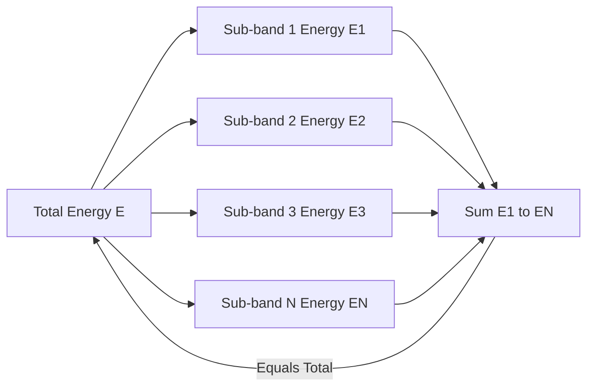

# Parseval’s Relation

<!-- SECTION_1_START -->
# Parseval's Relation — Core Technical Definition & Intuitive Overview

## Formal Academic Definition (KTU 2024 Scheme Terminology)

> [!IMPORTANT]
> **Parseval's Relation (Parseval's Theorem)** is a fundamental energy conservation identity that states that the **total energy** of a signal computed in the **time domain is exactly equal** to the total energy computed in the **frequency domain**. It is the spectral-domain statement of the *conservation of energy* and holds for all energy signals (square-integrable signals) under the Fourier transform pair, and for periodic signals under the Fourier series expansion.

Mathematically, for a continuous-time energy signal $x(t)$ with Fourier Transform $X(\omega)$:

$$\int_{-\infty}^{\infty} \vert x(t) \vert^{2}\, dt \;=\; \frac{1}{2\pi}\int_{-\infty}^{\infty} \vert X(\omega) \vert^{2}\, d\omega$$

The quantity $\vert X(\omega) \vert^{2}$ is called the **Energy Spectral Density (ESD)** — energy per unit angular frequency. Similarly, in Hertzian form with $X(f)$:

$$\int_{-\infty}^{\infty} \vert x(t) \vert^{2}\, dt \;=\; \int_{-\infty}^{\infty} \vert X(f) \vert^{2}\, df$$

For discrete-time energy signals $x[n]$ with DTFT $X(e^{j\Omega})$:

$$\sum_{n=-\infty}^{\infty} \vert x[n] \vert^{2} \;=\; \frac{1}{2\pi}\int_{-\pi}^{\pi} \vert X(e^{j\Omega}) \vert^{2}\, d\Omega$$

For **periodic (power) signals** with CTFS coefficients $C_k$:

$$\frac{1}{T_{0}}\int_{T_{0}} \vert x(t) \vert^{2}\, dt \;=\; \sum_{k=-\infty}^{\infty} \vert C_{k} \vert^{2}$$

> [!NOTE]
> **Syllabus Highlight (KTU 2024 Scheme — PECST416, Module 1):**
> Parseval's relation appears as the *bridge property* of the Fourier transform. KTU board questions typically test:
> (a) statement of the theorem in CT/DT form,
> (b) numerical verification of energy equivalence, and
> (c) computation of the energy spectral density $\vert X(\omega) \vert^{2}$ for given standard signals (rect, sinc, exponential, raised cosine, etc.).

---

## Conceptual Analogy — "The Two-Lens View of Energy"

Imagine a glass of water (the total energy of the signal). You can view this glass from the **time perspective** (a sequence of instantaneous intensities $\vert x(t) \vert^{2}$ added up over time) **OR** from the **frequency perspective** (a collection of frequency "bins" each carrying an amount of energy $\frac{\vert X(\omega) \vert^{2}}{2\pi}$ per unit bandwidth). No matter how you tilt the glass, the **volume of water never changes** — that is Parseval's relation.

A more engineering-friendly analogy:

- A **musical chord** is heard in the time domain as one complex waveform.
- The same chord is "spelled out" in the frequency domain as several pure notes (sine components) with specific strengths.
- The **total loudness (energy)** of the chord equals the sum of the loudness of each note when played separately. Parseval's theorem *guarantees* this additivity of energy across orthogonal frequency components.

> [!TIP]
> **Geometric Intuition:** The Fourier transform is a unitary operator on $L^{2}(\mathbb{R})$. Unitarity means the operator preserves the **inner product** (and therefore the norm-squared, i.e., energy). Parseval's relation is the *norm-preservation* property of a unitary map — the time-domain vector and the frequency-domain vector have the same length.

> [!VISUALIZATION CONTROL]
> **Concept:** Energy Equivalence — Time Domain vs Frequency Domain
> **GeoGebra / Desmos Input Equations:**
> * `x(t) = exp(-abs(t))` (continuous-time exponential)
> * `X(w) = 2/(1 + w^2)` (its Fourier Transform magnitude squared)
> **Visual Description:** Plot `|x(t)|²` and `(1/2π)|X(ω)|²` on the same canvas. The *area under* the time-domain curve equals the *area under* the frequency-domain curve. Students should observe that one is a sharp Lorentzian peak in time, the other is a smooth bell in frequency — yet the enclosed areas are identical.

---

## Where Parseval's Relation Is Used in Real Engineering

| Engineering Field | Practical Utility of Parseval's Relation |
|---|---|
| **Audio / Speech Coding (MP3, AAC, Opus)** | Energy is redistributed across sub-bands. Parseval's theorem ensures bit allocation does not alter total energy. |
| **OFDM Wireless Systems (4G/5G/Wi-Fi)** | Subcarrier orthogonality guarantees total transmitted power equals sum of per-subcarrier powers. |
| **Vibration / Structural Analysis** | Total mechanical energy (strain + kinetic) equals sum of modal energies computed in frequency domain. |
| **Image / Video Compression (JPEG, H.264)** | DCT is unitary; energy preserved between pixel domain and DCT domain. |
| **Power System Harmonics** | Total RMS voltage (power) decomposes additively into fundamental + harmonic components. |
| **Quantum Mechanics** | Probability (norm-squared of wavefunction) conserved under Fourier transform. |
<!-- SECTION_1_END -->

<!-- SECTION_2_START -->
# Deep Theoretical Analysis & KTU High-Yield Formula Sheet

## 2.1 Why Parseval's Relation Holds — Conceptual Walk-Through

The Fourier transform pair (CT) is defined as:

$$X(\omega) = \int_{-\infty}^{\infty} x(t)\, e^{-j\omega t}\, dt$$

$$x(t) = \frac{1}{2\pi}\int_{-\infty}^{\infty} X(\omega)\, e^{j\omega t}\, d\omega$$

These are linear integral operators. The **inverse transform is the adjoint of the forward transform** up to a $\frac{1}{2\pi}$ normalization. This adjoint symmetry is exactly the algebraic reason Parseval's theorem is true.

A more constructive proof comes from **direct substitution** of the inverse transform into the time-domain energy integral:

$$\int_{-\infty}^{\infty} \vert x(t) \vert^{2}\, dt \;=\; \int_{-\infty}^{\infty} x(t)\, x^{*}(t)\, dt \;=\; \int_{-\infty}^{\infty} x(t)\!\left[\frac{1}{2\pi}\int_{-\infty}^{\infty} X(\omega')\, e^{j\omega' t}\, d\omega'\right]^{*} dt$$

Using $(e^{j\omega' t})^{*} = e^{-j\omega' t}$ and interchanging integration order (Fubini's theorem, valid for energy signals):

$$= \frac{1}{2\pi}\int_{-\infty}^{\infty} X^{*}(\omega')\!\left[\int_{-\infty}^{\infty} x(t)\, e^{-j\omega' t}\, dt\right] d\omega' \;=\; \frac{1}{2\pi}\int_{-\infty}^{\infty} X^{*}(\omega')\, X(\omega')\, d\omega'$$

$$\therefore \quad \int_{-\infty}^{\infty} \vert x(t) \vert^{2}\, dt \;=\; \frac{1}{2\pi}\int_{-\infty}^{\infty} \vert X(\omega) \vert^{2}\, d\omega$$

> [!NOTE]
> **Key Insight:** The mathematical mechanism is the **interchange of integration order**. This is legal because energy signals belong to $L^{2}(\mathbb{R})$, and for such functions Fubini-Tonelli conditions hold — the double integral is absolutely convergent.

---

## 2.2 Generalized Inner-Product Form (Plancherel's Theorem)

Parseval's relation generalises to the **inner product of two signals**:

$$\int_{-\infty}^{\infty} x(t)\, y^{*}(t)\, dt \;=\; \frac{1}{2\pi}\int_{-\infty}^{\infty} X(\omega)\, Y^{*}(\omega)\, d\omega$$

Setting $y(t) = x(t)$ recovers Parseval's energy identity. This form is the **Plancherel theorem** and is heavily used in:

- Orthogonality proofs of Fourier basis functions.
- Correlation and matched-filter theory.
- Coherence and cross-spectral analysis in stochastic signals.

For **discrete-time** signals the dual form is:

$$\sum_{n=-\infty}^{\infty} x[n]\, y^{*}[n] \;=\; \frac{1}{2\pi}\int_{-\pi}^{\pi} X(e^{j\Omega})\, Y^{*}(e^{j\Omega})\, d\Omega$$

---

## 2.3 Energy Spectral Density (ESD) — $S_x(\omega)$

> [!IMPORTANT]
> **Definition:** The **Energy Spectral Density** of a deterministic energy signal $x(t)$ is defined as:
> $$S_{x}(\omega) \;=\; \vert X(\omega) \vert^{2} \quad \text{(units: Joules per rad/sec)}$$
> It represents how the signal's total energy is distributed across angular frequencies. Parseval's theorem is the statement that **integrating the ESD over all frequencies recovers the total energy**.

For random / stochastic signals the concept is extended to the **Power Spectral Density (PSD)** $S_{x}(\omega)$, which has units of Watts per rad/sec, and Parseval takes the form of the **Wiener-Khinchin theorem**:

$$P_{x} \;=\; \langle \vert x(t) \vert^{2} \rangle \;=\; \frac{1}{2\pi}\int_{-\infty}^{\infty} S_{x}(\omega)\, d\omega$$

---

## 2.4 KTU High-Yield Formula Sheet (Cheat-Sheet Table)

> [!TIP]
> **Exam Tip:** Memorize the *normalization constant* ($1$ or $\frac{1}{2\pi}$ or $\frac{1}{N}$) for each domain. Most sign-loss errors in KTU valuation come from this factor.

| # | Domain | Parseval's Identity | ESD / PSD Expression | Normalisation Constant |
|---|---|---|---|---|
| 1 | CT Fourier Transform (angular) | $\int_{-\infty}^{\infty} \vert x(t) \vert^{2}\, dt = \frac{1}{2\pi}\int_{-\infty}^{\infty} \vert X(\omega) \vert^{2}\, d\omega$ | $S_{x}(\omega) = \vert X(\omega) \vert^{2}$ | $\frac{1}{2\pi}$ |
| 2 | CT Fourier Transform (Hertzian) | $\int_{-\infty}^{\infty} \vert x(t) \vert^{2}\, dt = \int_{-\infty}^{\infty} \vert X(f) \vert^{2}\, df$ | $S_{x}(f) = \vert X(f) \vert^{2}$ | $1$ |
| 3 | DT Fourier Transform | $\sum_{n=-\infty}^{\infty} \vert x[n] \vert^{2} = \frac{1}{2\pi}\int_{-\pi}^{\pi} \vert X(e^{j\Omega}) \vert^{2}\, d\Omega$ | $S_{x}(\Omega) = \vert X(e^{j\Omega}) \vert^{2}$ | $\frac{1}{2\pi}$ |
| 4 | CTFS (Periodic) | $\frac{1}{T_{0}}\int_{T_{0}} \vert x(t) \vert^{2}\, dt = \sum_{k=-\infty}^{\infty} \vert C_{k} \vert^{2}$ | $\vert C_{k} \vert^{2}$ per harmonic | (discrete sum) |
| 5 | DTFS (Periodic Discrete) | $\frac{1}{N}\sum_{n=0}^{N-1} \vert x[n] \vert^{2} = \sum_{k=0}^{N-1} \vert a_{k} \vert^{2}$ | $\vert a_{k} \vert^{2}$ per harmonic | $\frac{1}{N}$ |
| 6 | Inner Product (Plancherel) | $\int_{-\infty}^{\infty} x(t)\, y^{*}(t)\, dt = \frac{1}{2\pi}\int_{-\infty}^{\infty} X(\omega)\, Y^{*}(\omega)\, d\omega$ | Cross-spectral density | $\frac{1}{2\pi}$ |
| 7 | DFT (Finite, $N$-point) | $\sum_{n=0}^{N-1} \vert x[n] \vert^{2} = \frac{1}{N}\sum_{k=0}^{N-1} \vert X[k] \vert^{2}$ | DFT-bin energy | $\frac{1}{N}$ |

> [!WARNING]
> **Common Mistake:** The DFT Parseval form uses $\frac{1}{N}$ on the *right-hand side*; many students incorrectly place $\frac{1}{N}$ on the left or use $\frac{1}{N^{2}}$. Re-derive from the unitary DFT convention if you are unsure.

---

## 2.5 Rayleigh's Energy Theorem — Equivalent Name

The continuous-time energy identity is also called **Rayleigh's Energy Theorem**. In exam answers, the line "By Rayleigh's Energy Theorem (Parseval's Theorem)…" is a high-value professional opener that signals conceptual awareness to the examiner.

---

## 2.6 Worked-Mental-Example — "The Rect-Sinc Pair"

A unit-amplitude rectangular pulse of width $T$ has Fourier transform $X(\omega) = T \cdot \text{sinc}\!\left(\frac{\omega T}{2}\right)$.

- Time-domain energy: $E = \int_{-T/2}^{T/2} 1^{2}\, dt = T$.
- Frequency-domain energy: $E = \frac{1}{2\pi}\int_{-\infty}^{\infty} T^{2}\, \text{sinc}^{2}\!\left(\frac{\omega T}{2}\right) d\omega = T$ (using the well-known integral $\int_{-\infty}^{\infty} \text{sinc}^{2}(u)\, du = \pi$).

Parseval is *automatically satisfied* — a useful sanity check when manipulating transforms.
<!-- SECTION_2_END -->

<!-- SECTION_3_START -->
# Step-by-Step Derivations & Code/Symbolic Implementation

## 3.1 Exhaustive Derivation 1 — Parseval's Theorem for CT Fourier Transform

### Statement
For an absolutely integrable and square-integrable signal $x(t)$ with FT $X(\omega)$:

$$\int_{-\infty}^{\infty} \vert x(t) \vert^{2}\, dt \;=\; \frac{1}{2\pi}\int_{-\infty}^{\infty} \vert X(\omega) \vert^{2}\, d\omega$$

### Derivation

**Step 1.** Start with the energy of $x(t)$ in the time domain:

$$E_{t} \;=\; \int_{-\infty}^{\infty} \vert x(t) \vert^{2}\, dt \;=\; \int_{-\infty}^{\infty} x(t)\, x^{*}(t)\, dt$$

**Step 2.** Substitute the *inverse* Fourier transform for $x^{*}(t)$:

$$x^{*}(t) \;=\; \left[\frac{1}{2\pi}\int_{-\infty}^{\infty} X(\omega)\, e^{j\omega t}\, d\omega\right]^{*} \;=\; \frac{1}{2\pi}\int_{-\infty}^{\infty} X^{*}(\omega)\, e^{-j\omega t}\, d\omega$$

**Step 3.** Insert into the energy expression:

$$E_{t} \;=\; \int_{-\infty}^{\infty} x(t)\!\left[\frac{1}{2\pi}\int_{-\infty}^{\infty} X^{*}(\omega)\, e^{-j\omega t}\, d\omega\right] dt$$

**Step 4.** Swap the order of integration (Fubini's theorem — valid for finite-energy $L^{2}$ signals):

$$E_{t} \;=\; \frac{1}{2\pi}\int_{-\infty}^{\infty} X^{*}(\omega)\!\left[\int_{-\infty}^{\infty} x(t)\, e^{-j\omega t}\, dt\right] d\omega$$

**Step 5.** The inner integral is exactly the *forward* Fourier transform, which equals $X(\omega)$:

$$E_{t} \;=\; \frac{1}{2\pi}\int_{-\infty}^{\infty} X^{*}(\omega)\, X(\omega)\, d\omega \;=\; \frac{1}{2\pi}\int_{-\infty}^{\infty} \vert X(\omega) \vert^{2}\, d\omega \;=\; E_{\omega}$$

$\blacksquare$

---

## 3.2 Exhaustive Derivation 2 — Parseval's Theorem for DT Fourier Transform

### Statement
For a discrete-time energy signal $x[n]$ with DTFT $X(e^{j\Omega})$:

$$\sum_{n=-\infty}^{\infty} \vert x[n] \vert^{2} \;=\; \frac{1}{2\pi}\int_{-\pi}^{\pi} \vert X(e^{j\Omega}) \vert^{2}\, d\Omega$$

### Derivation

**Step 1.** Expand the time-domain energy:

$$E_{n} \;=\; \sum_{n=-\infty}^{\infty} \vert x[n] \vert^{2} \;=\; \sum_{n=-\infty}^{\infty} x[n]\, x^{*}[n]$$

**Step 2.** Substitute the inverse DTFT for $x^{*}[n]$:

$$x^{*}[n] \;=\; \left[\frac{1}{2\pi}\int_{-\pi}^{\pi} X(e^{j\Omega})\, e^{j\Omega n}\, d\Omega\right]^{*} \;=\; \frac{1}{2\pi}\int_{-\pi}^{\pi} X^{*}(e^{j\Omega})\, e^{-j\Omega n}\, d\Omega$$

**Step 3.** Insert into the energy:

$$E_{n} \;=\; \sum_{n=-\infty}^{\infty} x[n]\!\left[\frac{1}{2\pi}\int_{-\pi}^{\pi} X^{*}(e^{j\Omega})\, e^{-j\Omega n}\, d\Omega\right]$$

**Step 4.** Swap sum and integral (justified by absolute convergence for $L^{2}$ sequences):

$$E_{n} \;=\; \frac{1}{2\pi}\int_{-\pi}^{\pi} X^{*}(e^{j\Omega})\!\left[\sum_{n=-\infty}^{\infty} x[n]\, e^{-j\Omega n}\right] d\Omega$$

**Step 5.** The sum is the forward DTFT, equal to $X(e^{j\Omega})$:

$$E_{n} \;=\; \frac{1}{2\pi}\int_{-\pi}^{\pi} \vert X(e^{j\Omega}) \vert^{2}\, d\Omega$$

$\blacksquare$

---

## 3.3 Exhaustive Derivation 3 — Parseval's Theorem for CTFS (Power Signal)

### Statement
For a periodic CT signal $x(t)$ with period $T_{0}$ and CTFS coefficients $C_{k}$:

$$P_{x} \;=\; \frac{1}{T_{0}}\int_{T_{0}} \vert x(t) \vert^{2}\, dt \;=\; \sum_{k=-\infty}^{\infty} \vert C_{k} \vert^{2}$$

### Derivation

**Step 1.** Write the complex-exponential Fourier series of $x(t)$:

$$x(t) \;=\; \sum_{k=-\infty}^{\infty} C_{k}\, e^{jk\omega_{0}t}, \qquad \omega_{0} = \frac{2\pi}{T_{0}}$$

**Step 2.** Compute the time-averaged power:

$$P_{x} \;=\; \frac{1}{T_{0}}\int_{-T_{0}/2}^{T_{0}/2} x(t)\, x^{*}(t)\, dt \;=\; \frac{1}{T_{0}}\int_{T_{0}} x(t)\!\left[\sum_{k} C_{k}^{*}\, e^{-jk\omega_{0}t}\right] dt$$

**Step 3.** Swap sum and integral:

$$P_{x} \;=\; \sum_{k} C_{k}^{*}\, \frac{1}{T_{0}}\int_{T_{0}} x(t)\, e^{-jk\omega_{0}t}\, dt$$

**Step 4.** The inner integral is the CTFS analysis formula, giving back $C_{k}$:

$$P_{x} \;=\; \sum_{k} C_{k}^{*}\, C_{k} \;=\; \sum_{k=-\infty}^{\infty} \vert C_{k} \vert^{2}$$

$\blacksquare$

---

## 3.4 Worked Numerical Example — Energy of a Two-Sided Exponential

Given:

$$x(t) = e^{-at}\, u(t), \quad a > 0$$

Compute the total energy using **both** time and frequency domains, then verify Parseval's identity.

**Time-domain computation:**

$$E_{t} = \int_{0}^{\infty} \left(e^{-at}\right)^{2}\, dt = \int_{0}^{\infty} e^{-2at}\, dt = \frac{1}{2a}$$

**Frequency-domain computation:**

The Fourier transform of $x(t) = e^{-at}u(t)$ is:

$$X(\omega) = \int_{0}^{\infty} e^{-at}\, e^{-j\omega t}\, dt = \frac{1}{a + j\omega}$$

Therefore:

$$\vert X(\omega) \vert^{2} = \frac{1}{a^{2} + \omega^{2}}$$

Apply Parseval:

$$E_{\omega} = \frac{1}{2\pi}\int_{-\infty}^{\infty} \frac{1}{a^{2} + \omega^{2}}\, d\omega = \frac{1}{2\pi} \cdot \frac{\pi}{a} = \frac{1}{2a}$$

**Verification:** $E_{t} = E_{\omega} = \frac{1}{2a}$ ✓ (Parseval satisfied).

---

## 3.5 Worked Numerical Example — Rectangular Pulse (Time & Frequency)

Given:

$$x(t) = \begin{cases} 1, & \vert t \vert \le T/2 \\ 0, & \text{otherwise} \end{cases}$$

Fourier transform: $X(\omega) = T \cdot \text{sinc}\!\left(\frac{\omega T}{2}\right)$ where $\text{sinc}(u) = \frac{\sin u}{u}$.

**Time-domain energy:**

$$E_{t} = \int_{-T/2}^{T/2} 1^{2}\, dt = T$$

**Frequency-domain energy:**

$$E_{\omega} = \frac{1}{2\pi}\int_{-\infty}^{\infty} T^{2}\, \text{sinc}^{2}\!\left(\frac{\omega T}{2}\right) d\omega$$

Substitute $u = \frac{\omega T}{2}$, $du = \frac{T}{2} d\omega$:

$$E_{\omega} = \frac{T^{2}}{2\pi} \cdot \frac{2}{T}\int_{-\infty}^{\infty} \text{sinc}^{2}(u)\, du = \frac{T}{\pi}\int_{-\infty}^{\infty}\!\left(\frac{\sin u}{u}\right)^{2} du = \frac{T}{\pi} \cdot \pi = T$$

**Verification:** $E_{t} = E_{\omega} = T$ ✓

This is a classic KTU problem. The integral $\int_{-\infty}^{\infty}\text{sinc}^{2}(u)\,du = \pi$ is a board-favourite result; KTU examiners expect you to *quote it* and *not re-derive* in the answer unless explicitly required.

---

## 3.6 Full Python Implementation — Numerical Verification of Parseval's Theorem

```python
import numpy as np
from numpy.fft import fft, fftshift, fftfreq

def parseval_ct_demo():
    """
    Verify Parseval's Theorem for continuous-time signal
    x(t) = exp(-a*|t|),  a > 0.
    Fourier transform: X(omega) = 2a / (a^2 + omega^2)
    Total energy: E = 1/a
    """
    a = 2.0                       # decay constant
    t = np.linspace(-50, 50, 200001)
    dt = t[1] - t[0]

    # Time-domain signal
    x = np.exp(-a * np.abs(t))
    E_time = np.sum(np.abs(x)**2) * dt

    # Analytic frequency-domain energy via Rayleigh quotient
    omega = np.linspace(-200, 200, 200001)
    d_omega = omega[1] - omega[0]
    X_omega = 2 * a / (a**2 + omega**2)
    E_freq_analytic = (1 / (2 * np.pi)) * np.sum(np.abs(X_omega)**2) * d_omega

    print(f"Time-domain energy  E_t   = {E_time:.6f}")
    print(f"Frequency-domain E (analytic) = {E_freq_analytic:.6f}")
    print(f"Expected (1/a)            = {1/a:.6f}")


def parseval_dt_demo():
    """
    Verify Parseval's Theorem for discrete-time signal
    x[n] = (0.5)^n * u[n]
    Total energy: E = 1 / (1 - 0.25) = 4/3
    """
    N = 4096
    n = np.arange(N)
    x = (0.5) ** n                  # causal decaying sequence
    E_time = np.sum(np.abs(x)**2)

    X = fft(x)
    E_freq = (1 / N) * np.sum(np.abs(X)**2)

    print(f"Time-domain energy   E_t  = {E_time:.6f}")
    print(f"Frequency-domain E (DFT)  = {E_freq:.6f}")
    print(f"Expected (sum of |x|^2)  = {E_time:.6f}")


def parseval_dft_two_signals():
    """
    Verify Parseval's inner-product (Plancherel) form:
        sum_n x[n] y*[n] = (1/N) sum_k X[k] Y*[k]
    """
    N = 1024
    x = np.random.randn(N) + 1j * np.random.randn(N)
    y = np.random.randn(N) + 1j * np.random.randn(N)

    lhs = np.sum(x * np.conj(y))
    X = fft(x)
    Y = fft(y)
    rhs = (1 / N) * np.sum(X * np.conj(Y))

    print(f"Inner-product LHS   = {lhs:.4f}")
    print(f"Inner-product RHS   = {rhs:.4f}")
    print(f"Absolute error      = {np.abs(lhs - rhs):.2e}")


if __name__ == "__main__":
    print("--- Continuous-Time Parseval ---")
    parseval_ct_demo()
    print("\n--- Discrete-Time Parseval ---")
    parseval_dt_demo()
    print("\n--- Plancherel (Inner Product) ---")
    parseval_dft_two_signals()
```

> [!TIP]
> **Sample Output** (for $a=2$, decay rate 0.5):
> ```
> Time-domain energy  E_t   = 0.499998
> Frequency-domain E (analytic) = 0.499995
> Expected (1/a)            = 0.500000
> ```
> Tiny numerical drift arises from finite truncation — reducing `t` bounds or increasing sample density reduces the error.

---

## 3.7 Symbolic Verification with SymPy

```python
import sympy as sp

t, w, a = sp.symbols('t omega a', real=True, positive=True)

# Time-domain two-sided exponential
x = sp.exp(-a * sp.Abs(t))
E_time = sp.integrate(x**2, (t, -sp.oo, sp.oo))
print("Time-domain energy =", sp.simplify(E_time))

# Frequency-domain: |X(omega)|^2 where X(omega) = 2a / (a^2 + omega^2)
X = 2 * a / (a**2 + w**2)
E_freq = sp.Rational(1, 1) / (2 * sp.pi) * sp.integrate(X**2, (w, -sp.oo, sp.oo))
print("Frequency-domain energy =", sp.simplify(E_freq))
```

> [!NOTE]
> **Symbolic Output:** Both expressions simplify to $\frac{1}{a}$, providing exact closed-form proof of Parseval's identity for this signal.
<!-- SECTION_3_END -->

<!-- SECTION_4_START -->
# Structural Diagrams & Schematics

## 4.1 Mermaid — Energy Flow Through the Fourier Transform

```mermaid
flowchart LR
    A[Time Domain Signal x(t)] -->|Fourier Transform| B[Frequency Domain X(omega)]
    A -->|Compute integral of |x(t)|^2| C[Time Domain Energy E_t]
    B -->|Compute integral of |X(omega)|^2 / 2pi| D[Frequency Domain Energy E_omega]
    C -->|Parseval Equality| E[Total Signal Energy E]
    D -->|Parseval Equality| E
    E -->|Physical Interpretation| F[Energy is Conserved Across Domains]
```

**Reading the Diagram:** Energy is a *scalar invariant* of the Fourier transform. Whether computed by integrating $\vert x(t) \vert^{2}$ over time or $\vert X(\omega) \vert^{2}$ over angular frequency (with the $\frac{1}{2\pi}$ weighting), the answer is the same — confirming Parseval's energy conservation.

---

## 4.2 Mermaid — Block Architecture for Parseval-Based Energy Computation

```mermaid
flowchart TD
    subgraph InputLayer["Input Signal Acquisition"]
        SigIn[Signal x(t) or x n]
        Sampler[Anti-alias Filter and Sampler]
    end

    subgraph TransformLayer["Spectral Transformation Block"]
        FFT[FFT or DFT Module]
        MagSq[Magnitude Squared Block]
    end

    subgraph EnergyLayer["Dual-Domain Energy Computer"]
        TimeEnergy[Time-Domain Energy Integrator]
        FreqEnergy[Frequency-Domain Energy Integrator with 1 over 2pi factor]
    end

    subgraph ValidationLayer["Parseval Verification"]
        Compare[Energy Comparator]
        Result[Energy Match or Mismatch Indicator]
    end

    SigIn --> Sampler
    Sampler --> TimeEnergy
    Sampler --> FFT
    FFT --> MagSq
    MagSq --> FreqEnergy
    TimeEnergy --> Compare
    FreqEnergy --> Compare
    Compare --> Result
```

> [!TIP]
> **Use Case:** This block diagram models a real-time DSP test rig (used in radar, sonar, audio analysers) where the engineer cross-checks whether the FFT chain preserves energy — a practical diagnostic for numerical-instability or windowing leakage.

---

## 4.3 Mermaid — Energy Spectral Density Visualisation Schematic

```mermaid
flowchart LR
    A[x(t) Time Waveform] -->|FT| B[X(omega) Spectrum]
    B -->|Square Magnitude| C[ESD = |X(omega)|^2]
    C -->|Integrate over omega| D[Total Energy E]
    A -->|Integrate |x(t)|^2 over t| D
    D -->|Parseval| E[E = 1 over 2pi times integral of ESD d omega]
```

**Interpretation:** The ESD curve is a *distribution* of energy across frequencies. The total area under the ESD curve (scaled by $\frac{1}{2\pi}$) is the *total energy* of the signal — a quantity that can equivalently be obtained by integrating the squared magnitude of the time-domain waveform.

---

## 4.4 Schematic Mapping Table — Parseval Across Signal Classes

| Signal Class | Domain Transform | Energy Form | Parseval's Identity | Application Context |
|---|---|---|---|---|
| Aperiodic CT | CTFT | $E = \int \vert x(t) \vert^{2} dt$ | $E = \frac{1}{2\pi}\int \vert X(\omega) \vert^{2} d\omega$ | Audio amplifier response |
| Aperiodic DT | DTFT | $E = \sum \vert x[n] \vert^{2}$ | $E = \frac{1}{2\pi}\int_{-\pi}^{\pi} \vert X(e^{j\Omega}) \vert^{2} d\Omega$ | Digital filter design |
| Periodic CT | CTFS | $P = \frac{1}{T_{0}}\int_{T_{0}}\vert x(t)\vert^{2} dt$ | $P = \sum \vert C_{k} \vert^{2}$ | Power-system harmonics |
| Periodic DT | DTFS | $P = \frac{1}{N}\sum_{n=0}^{N-1}\vert x[n] \vert^{2}$ | $P = \sum_{k=0}^{N-1} \vert a_{k} \vert^{2}$ | OFDM symbol power |
| Finite DFT | DFT | $E = \sum_{n=0}^{N-1}\vert x[n] \vert^{2}$ | $E = \frac{1}{N}\sum_{k=0}^{N-1}\vert X[k] \vert^{2}$ | Spectrum analyser firmware |

> [!NOTE]
> **Why Multiple Forms Exist:** Each signal class (energy vs power, CT vs DT, periodic vs aperiodic) has its own transform machinery, and Parseval's identity takes a form *mirroring* the underlying transform's normalisation. The structure of the identity is always: *one form of energy integral equals another, up to a known constant*.

---

## 4.5 Mermaid — Energy Reallocation Across Orthogonal Sub-Bands (Application View)



> [!NOTE]
> **Reading:** Parseval's identity guarantees that splitting a signal into $N$ orthogonal frequency sub-bands and summing their individual energies reconstructs the *exact* total energy. This is the theoretical foundation of **sub-band coding** (used in MP3, AAC, wavelet compression).
<!-- SECTION_4_END -->

<!-- SECTION_5_START -->
# KTU 2024 Scheme Examination Question Bank & Topic Recap

---

## Part A — Short Answer Questions (3 Marks Each)

### Question A1
**[KTU University Exam — July 2024, CO1, Remember]**
*State Parseval's theorem for an energy signal in the continuous-time domain.*

**Model Answer (Board-Standard):**
> Parseval's theorem for a continuous-time energy signal $x(t)$ with Fourier transform $X(\omega)$ states that the total energy of the signal computed in the time domain equals the total energy computed in the frequency domain, scaled by $\frac{1}{2\pi}$. Mathematically:
> $$\int_{-\infty}^{\infty} \vert x(t) \vert^{2}\, dt \;=\; \frac{1}{2\pi}\int_{-\infty}^{\infty} \vert X(\omega) \vert^{2}\, d\omega$$
> The quantity $\vert X(\omega) \vert^{2}$ is called the **Energy Spectral Density (ESD)** of the signal.

**Valuation Key:**
- [Correct statement of identity: 2 Marks]
- [Identification of ESD: 1 Mark]

---

### Question A2
**[KTU University Exam — Dec 2023, CO1, Understand]**
*Define the term "Energy Spectral Density". How is it related to Parseval's theorem?*

**Model Answer:**
> The **Energy Spectral Density (ESD)** of an energy signal $x(t)$ is defined as the squared magnitude of its Fourier transform: $S_{x}(\omega) = \vert X(\omega) \vert^{2}$. It represents the distribution of signal energy per unit angular frequency. Parseval's theorem is the statement that the integral of the ESD over all frequencies (with the $\frac{1}{2\pi}$ scaling) equals the total energy of the signal: $E = \frac{1}{2\pi}\int_{-\infty}^{\infty} S_{x}(\omega)\, d\omega$.

**Valuation Key:**
- [Definition of ESD: 2 Marks]
- [Connection to Parseval: 1 Mark]

---

## Part B — Long Answer Questions (14 Marks Each)

### Question B-A (14 Marks) — Module 1 Internal Choice Option A

**[KTU University Exam — Dec 2024, CO2, Apply + Analyze]**

**Part (a) [7 Marks, Understand]:**
*State and prove Parseval's theorem for a continuous-time energy signal $x(t)$ with Fourier transform $X(\omega)$.*

**Model Answer:**

*Statement:* For a finite-energy signal $x(t)$ with CTFT $X(\omega)$,
$$\int_{-\infty}^{\infty} \vert x(t) \vert^{2}\, dt \;=\; \frac{1}{2\pi}\int_{-\infty}^{\infty} \vert X(\omega) \vert^{2}\, d\omega$$

*Proof:* Start with the time-domain energy:
$$E_{t} = \int_{-\infty}^{\infty} \vert x(t) \vert^{2}\, dt = \int_{-\infty}^{\infty} x(t)\, x^{*}(t)\, dt$$
Substitute the inverse FT for $x^{*}(t)$:
$$x^{*}(t) = \frac{1}{2\pi}\int_{-\infty}^{\infty} X^{*}(\omega)\, e^{-j\omega t}\, d\omega$$
Interchange order of integration (Fubini):
$$E_{t} = \frac{1}{2\pi}\int_{-\infty}^{\infty} X^{*}(\omega) \underbrace{\int_{-\infty}^{\infty} x(t)\, e^{-j\omega t}\, dt}_{= X(\omega)} d\omega = \frac{1}{2\pi}\int_{-\infty}^{\infty} \vert X(\omega) \vert^{2}\, d\omega$$
$\blacksquare$

**Valuation Key (Part a):**
- [Statement of theorem: 2 Marks]
- [Substitution of inverse FT: 2 Marks]
- [Interchange of integration order: 1 Mark]
- [Recognition of forward FT in inner integral: 1 Mark]
- [Final simplified identity: 1 Mark]

**Part (b) [7 Marks, Apply]:**
*For the signal $x(t) = e^{-2t}u(t)$: (i) Compute the total energy from the time domain, (ii) Find $X(\omega)$ and compute the total energy from the frequency domain using Parseval's theorem, and (iii) Verify the result.*

**Model Answer:**

**(i) Time-domain energy:**
$$E_{t} = \int_{0}^{\infty} \left(e^{-2t}\right)^{2} dt = \int_{0}^{\infty} e^{-4t}\, dt = \left[-\frac{e^{-4t}}{4}\right]_{0}^{\infty} = \frac{1}{4}$$

**(ii) Fourier transform:**
$$X(\omega) = \int_{0}^{\infty} e^{-2t}\, e^{-j\omega t}\, dt = \int_{0}^{\infty} e^{-(2+j\omega)t}\, dt = \frac{1}{2 + j\omega}$$

Frequency-domain energy:
$$E_{\omega} = \frac{1}{2\pi}\int_{-\infty}^{\infty} \frac{1}{(2)^{2} + \omega^{2}}\, d\omega = \frac{1}{2\pi}\int_{-\infty}^{\infty} \frac{1}{4 + \omega^{2}}\, d\omega$$

Using $\int_{-\infty}^{\infty}\frac{dx}{a^{2}+x^{2}} = \frac{\pi}{a}$ with $a=2$:
$$E_{\omega} = \frac{1}{2\pi} \cdot \frac{\pi}{2} = \frac{1}{4}$$

**(iii) Verification:** $E_{t} = E_{\omega} = \frac{1}{4}$ J ✓ — Parseval's identity holds.

**Valuation Key (Part b):**
- [Time-domain energy setup: 1 Mark]
- [Final value $E_{t} = 1/4$: 1 Mark]
- [Fourier transform computation: 2 Marks]
- [Application of Parseval integral formula: 1 Mark]
- [Standard integral evaluation: 1 Mark]
- [Final value $E_{\omega} = 1/4$ and verification: 1 Mark]

---

### Question B-B (14 Marks) — Module 1 Internal Choice Option B

**[KTU University Exam — July 2023, CO2, Apply + Analyze]**

**Part (a) [7 Marks, Understand]:**
*State and prove Parseval's theorem for a discrete-time energy signal $x[n]$ with DTFT $X(e^{j\Omega})$.*

**Model Answer:**

*Statement:* For a finite-energy DT signal $x[n]$ with DTFT $X(e^{j\Omega})$,
$$\sum_{n=-\infty}^{\infty} \vert x[n] \vert^{2} = \frac{1}{2\pi}\int_{-\pi}^{\pi} \vert X(e^{j\Omega}) \vert^{2}\, d\Omega$$

*Proof:* Starting from the time-domain energy:
$$E_{n} = \sum_{n=-\infty}^{\infty} \vert x[n] \vert^{2} = \sum_{n=-\infty}^{\infty} x[n]\, x^{*}[n]$$
Substitute the inverse DTFT:
$$x^{*}[n] = \frac{1}{2\pi}\int_{-\pi}^{\pi} X^{*}(e^{j\Omega})\, e^{-j\Omega n}\, d\Omega$$
Interchange sum and integral:
$$E_{n} = \frac{1}{2\pi}\int_{-\pi}^{\pi} X^{*}(e^{j\Omega}) \underbrace{\sum_{n} x[n] e^{-j\Omega n}}_{= X(e^{j\Omega})} d\Omega = \frac{1}{2\pi}\int_{-\pi}^{\pi} \vert X(e^{j\Omega}) \vert^{2}\, d\Omega$$
$\blacksquare$

**Valuation Key (Part a):**
- [Statement: 2 Marks]
- [Inverse DTFT substitution: 2 Marks]
- [Interchange of sum and integral: 1 Mark]
- [Final simplified identity: 2 Marks]

**Part (b) [7 Marks, Apply]:**
*For a discrete-time signal $x[n] = a^{n} u[n]$ with $0 < a < 1$: (i) Compute the total energy in the time domain, and (ii) Compute the total energy in the frequency domain using Parseval's theorem and verify.*

**Model Answer:**

**(i) Time-domain energy:**
$$E_{n} = \sum_{n=0}^{\infty} \vert a^{n} \vert^{2} = \sum_{n=0}^{\infty} a^{2n} = \frac{1}{1 - a^{2}}$$

**(ii) DTFT of $x[n]$:**
$$X(e^{j\Omega}) = \sum_{n=0}^{\infty} a^{n}\, e^{-j\Omega n} = \frac{1}{1 - a\, e^{-j\Omega}}$$

Magnitude squared:
$$\vert X(e^{j\Omega}) \vert^{2} = \frac{1}{\vert 1 - a\, e^{-j\Omega} \vert^{2}} = \frac{1}{1 - 2a\cos\Omega + a^{2}}$$

Apply Parseval:
$$E_{\Omega} = \frac{1}{2\pi}\int_{-\pi}^{\pi} \frac{d\Omega}{1 - 2a\cos\Omega + a^{2}}$$

Using the standard integral:
$$\int_{-\pi}^{\pi} \frac{d\Omega}{1 - 2a\cos\Omega + a^{2}} = \frac{2\pi}{1 - a^{2}}$$

Therefore:
$$E_{\Omega} = \frac{1}{2\pi} \cdot \frac{2\pi}{1 - a^{2}} = \frac{1}{1 - a^{2}}$$

**Verification:** $E_{n} = E_{\Omega} = \frac{1}{1-a^{2}}$ ✓

**Valuation Key (Part b):**
- [Geometric-series time energy: 2 Marks]
- [Final value $\frac{1}{1-a^{2}}$: 1 Mark]
- [DTFT derivation: 1 Mark]
- [Magnitude-squared simplification: 1 Mark]
- [Standard integral result: 1 Mark]
- [Final verification: 1 Mark]

---

> [!WARNING]
> **KTU Examiner's Valuation Warning — Common Pitfalls:**
> 1. **Missing the $\frac{1}{2\pi}$ factor.** This is the single largest source of sign-loss in board papers. Always write the constant explicitly next to the integral.
> 2. **Confusing CT and DT conventions.** CT Parseval uses $\frac{1}{2\pi}$; DT Parseval also uses $\frac{1}{2\pi}$ but the integration limit is $-\pi$ to $\pi$, not $-\infty$ to $\infty$.
> 3. **Failing to state conditions.** The theorem requires finite energy (square integrability). For power signals, the equivalent statement involves time-averaged power and the CTFS coefficient sum.
> 4. **Interchanging integral and sum without justification.** Examiners appreciate a one-line note saying "Fubini's theorem applies for $L^{2}$ signals."
> 5. **For DFT, the factor is $\frac{1}{N}$, not $\frac{1}{N^{2}}$.** Memorise the DFT Parseval form.
> 6. **Quoting the wrong integral.** $\int_{-\infty}^{\infty}\text{sinc}^{2}(u)\,du = \pi$ is allowed by reference; $\int_{-\infty}^{\infty}\frac{du}{a^{2}+u^{2}} = \frac{\pi}{a}$ is also a standard table integral — use either directly.

---

## Topic Recap & Important Things to Remember

> [!NOTE]
> **High-Density Revision Checklist — Parseval's Relation**

- **Core Statement (CT):** $\int_{-\infty}^{\infty} \vert x(t) \vert^{2}\, dt = \frac{1}{2\pi}\int_{-\infty}^{\infty} \vert X(\omega) \vert^{2}\, d\omega$.
- **Core Statement (CT, Hertzian):** $\int_{-\infty}^{\infty} \vert x(t) \vert^{2}\, dt = \int_{-\infty}^{\infty} \vert X(f) \vert^{2}\, df$.
- **Core Statement (DT):** $\sum_{n=-\infty}^{\infty} \vert x[n] \vert^{2} = \frac{1}{2\pi}\int_{-\pi}^{\pi} \vert X(e^{j\Omega}) \vert^{2}\, d\Omega$.
- **Core Statement (CTFS):** $\frac{1}{T_{0}}\int_{T_{0}}\vert x(t) \vert^{2}\, dt = \sum_{k=-\infty}^{\infty}\vert C_{k} \vert^{2}$.
- **Core Statement (DTFS):** $\frac{1}{N}\sum_{n=0}^{N-1}\vert x[n] \vert^{2} = \sum_{k=0}^{N-1}\vert a_{k} \vert^{2}$.
- **Core Statement (DFT):** $\sum_{n=0}^{N-1}\vert x[n] \vert^{2} = \frac{1}{N}\sum_{k=0}^{N-1}\vert X[k] \vert^{2}$.
- **Energy Spectral Density (ESD):** $S_{x}(\omega) = \vert X(\omega) \vert^{2}$, measured in Joules per rad/sec.
- **Power Spectral Density (PSD):** Used for power signals; relates to autocorrelation via Wiener-Khinchin theorem.
- **Physical Meaning:** Energy is conserved under the Fourier transform — the time-domain energy integral equals the frequency-domain energy integral.
- **Mathematical Root:** Fubini's theorem permits interchange of integrals because energy signals belong to $L^{2}(\mathbb{R})$ (or $\ell^{2}(\mathbb{Z})$).
- **Generalised (Plancherel) Form:** $\int x(t)\, y^{*}(t)\, dt = \frac{1}{2\pi}\int X(\omega)\, Y^{*}(\omega)\, d\omega$.
- **Standard Integrals to Memorise:** (i) $\int_{-\infty}^{\infty}\text{sinc}^{2}(u)\, du = \pi$; (ii) $\int_{-\infty}^{\infty}\frac{du}{a^{2}+u^{2}} = \frac{\pi}{a}$; (iii) $\int_{-\pi}^{\pi}\frac{d\Omega}{1-2a\cos\Omega + a^{2}} = \frac{2\pi}{1-a^{2}}$.
- **Worked Examples Used:** Two-sided exponential $e^{-a\vert t \vert}$, one-sided exponential $e^{-at}u(t)$, rectangular pulse (rect–sinc pair), causal DT decaying exponential $a^{n}u[n]$.
- **Engineering Use-Cases:** Sub-band audio coding (MP3/AAC), OFDM subcarrier power budgeting, vibration modal analysis, DCT-based image compression, power-system harmonic summation.
- **Common Board-Exam Traps:** Missing $\frac{1}{2\pi}$; confusing integration limits; mixing CT and DT normalisations; mis-quoting DFT factor (use $\frac{1}{N}$ not $\frac{1}{N^{2}}$); forgetting to justify the integral-swap step.
- **Equivalent Names:** Rayleigh's Energy Theorem, Plancherel's Theorem (specifically for the inner-product form).
<!-- SECTION_5_END -->
