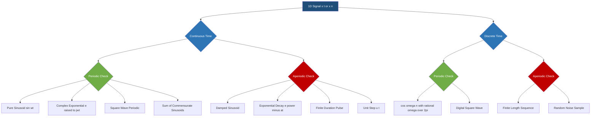
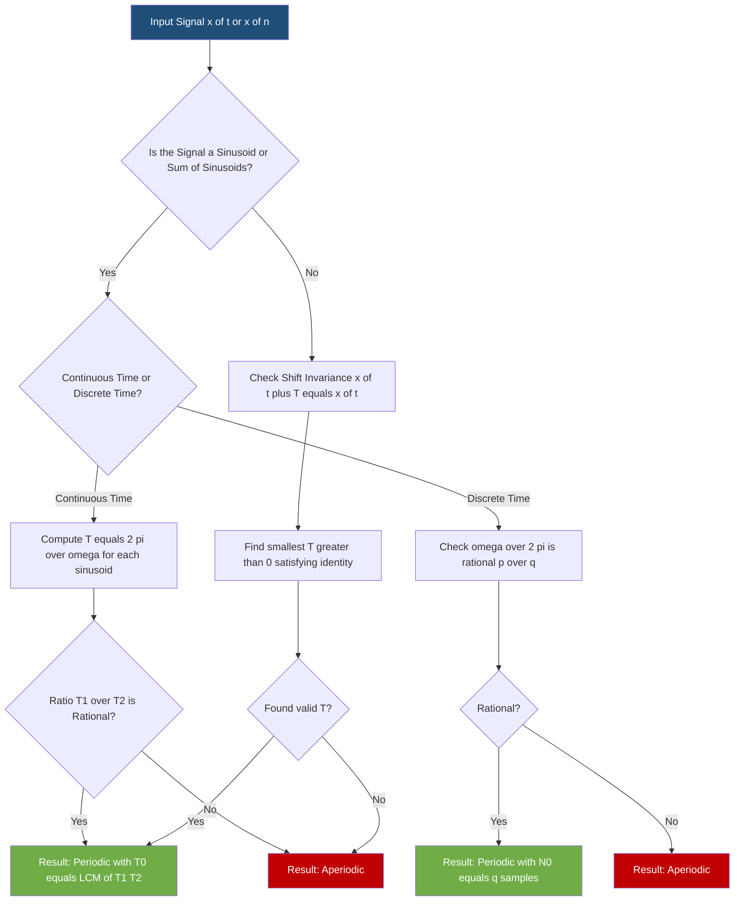
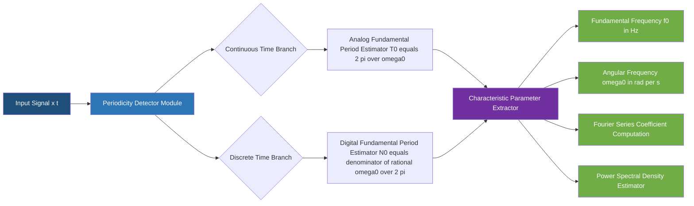

# Periodic and non periodic signal

<!-- SECTION_1_START -->
# Periodic and Non-Periodic (Aperiodic) Signals

## 1.1 Formal Academic Definition

In the context of one-dimensional (1D) signals and systems, a signal $x(t)$ (continuous-time) or $x[n]$ (discrete-time) is classified based on whether it repeats its pattern identically after a fixed time interval. The KTU 2024 Scheme (PECST416 – Signals and Systems, Module 1) formally defines these two foundational classes as follows:

> [!IMPORTANT]
> **Periodic Signal (KTU 2024 Formal Definition):** A continuous-time signal $x(t)$ is said to be **periodic** if there exists a positive constant $T > 0$ such that
> $$x(t) = x(t + T) \quad \text{for all } t \in \mathbb{R}$$
> The smallest such positive value of $T$ is called the **Fundamental Period** $T_0$. A discrete-time signal $x[n]$ is periodic if $x[n] = x[n + N]$ for all $n \in \mathbb{Z}$, where the smallest positive $N$ is the **Fundamental Period $N_0$**.

> [!IMPORTANT]
> **Non-Periodic (Aperiodic) Signal (KTU 2024 Formal Definition):** A signal is called **aperiodic** (or **non-periodic**) if it does **NOT** satisfy the periodic condition for any finite, positive value of $T$ (or $N$ for discrete-time). The repetition constant $T \to \infty$.

The unit of $T$ in continuous-time is **seconds (s)**, while the unit of $N$ in discrete-time is **samples (dimensionless)**. The **Fundamental Frequency $f_0$** is the reciprocal of the fundamental period, $f_0 = \dfrac{1}{T_0}$ with unit **Hertz (Hz)**, and the **Fundamental Angular Frequency** is $\omega_0 = \dfrac{2\pi}{T_0}$ measured in **radians per second (rad/s)**.

## 1.2 Conceptual Analogy / Geometric Intuition

Think of a **periodic signal** like the hands of a wall clock. No matter what time you look at it, the clock hands trace the exact same circular path every 60 minutes. If you pause the clock and fast-forward by exactly 60 minutes, you cannot tell whether time actually passed — the pattern is identical. This "time-shift invariance" is the very heart of periodicity.

Conversely, imagine a **voice recording of someone saying "Hello"**. After you finish listening, the sound is gone forever. If you replay it 5 seconds later, you will not hear anything because the waveform of the spoken word does not repeat. That is an **aperiodic signal** — its energy is concentrated in a finite duration and never repeats.

Another intuitive picture is a **sine wave**:
- A pure $\sin(\omega t)$ is periodic (it loops forever).
- A **damped sinusoid** $e^{-at}\sin(\omega t)$ where $a > 0$ is aperiodic (it dies out and never repeats exactly).

## 1.3 Classification of 1D Signals (KTU Module 1 Roadmap)

> [!NOTE]
> **KTU Module 1 – 1D Signal Hierarchy:** The very first taxonomy a 1D signal can be sorted into is:
> 1. Continuous-Time (CT) vs Discrete-Time (DT)
> 2. Within each: Periodic vs Aperiodic
> 3. Within each: Energy vs Power (covered in upcoming topics)

<!-- SECTION_1_END -->

<!-- SECTION_2_START -->
# Deep Theoretical Analysis & KTU High-Yield Formula Sheet

## 2.1 Operational Concept Breakdown

### 2.1.1 Continuous-Time (CT) Periodic Signals

A CT signal $x(t)$ is periodic with fundamental period $T_0$ if and only if the **shift-invariance condition** holds. The key logical flow is:

- **Why it matters:** Periodic signals form the basis of the **Fourier Series** (next modules), which says *any* periodic signal can be decomposed into a sum of complex exponentials.
- **How it works:** If $x(t) = x(t + T_0)$ for all $t$, then the signal is fully characterized by its behavior over *any* one period of length $T_0$.
- **Test:** Pick a candidate period $T$, substitute $t \to t + T$, and check whether the equation reduces to an identity.

### 2.1.2 Discrete-Time (DT) Periodic Signals — The Rational Condition

A DT signal $x[n]$ is periodic if and only if there exists an integer $N > 0$ such that $x[n] = x[n+N]$. The **fundamental period $N_0$** must itself be an integer.

> [!IMPORTANT]
> **KTU Critical Distinction:** Unlike continuous-time where *any* real $T$ can be a period, in discrete-time the period $N$ must be a **positive integer** (samples). This is why a discrete-time sinusoid $\cos(\omega_0 n)$ is periodic **only if** $\omega_0 / 2\pi$ is a **rational number**.

### 2.1.3 The Sum of Periodic Signals

If $x_1(t)$ has period $T_1$ and $x_2(t)$ has period $T_2$, their sum $y(t) = x_1(t) + x_2(t)$ is periodic **if and only if the ratio $T_1 / T_2$ is a rational number**. The fundamental period is then the **Least Common Multiple (LCM)** of $T_1$ and $T_2$:

$$T_0 = \text{LCM}(T_1, T_2) = \frac{T_1 \cdot T_2}{\gcd(T_1, T_2)}$$

If $T_1 / T_2$ is irrational, the sum is **aperiodic** — this is one of the most commonly tested KTU results.

## 2.2 KTU Formula Sheet / Cheat Sheet

| # | Concept | Mathematical Expression | Condition / Units | Engineering Use |
|---|---------|------------------------|-------------------|-----------------|
| 1 | CT Periodicity Test | $x(t) = x(t + T_0)$ | $T_0 > 0$ in **seconds (s)** | AC power systems, oscillators |
| 2 | DT Periodicity Test | $x[n] = x[n + N_0]$ | $N_0 \in \mathbb{Z}^{+}$ (samples) | DSP, digital audio |
| 3 | Fundamental Frequency | $f_0 = \dfrac{1}{T_0}$ | **Hertz (Hz)** | Radio, communication carrier |
| 4 | Fundamental Angular Frequency | $\omega_0 = \dfrac{2\pi}{T_0} = 2\pi f_0$ | **rad/s** | Fourier analysis, filters |
| 5 | DT Periodicity Condition | $\dfrac{\omega_0}{2\pi} = \dfrac{p}{q}$ with $p,q$ coprime integers | Rational ratio required | DFT, spectrum analyzers |
| 6 | DT Fundamental Period (sinusoid) | $N_0 = q$ where $\omega_0 / 2\pi = p / q$ | Integer samples | Sampling theorem validation |
| 7 | Sum of Two CT Periods | $T_0 = \text{LCM}(T_1, T_2)$ | Requires $T_1 / T_2 \in \mathbb{Q}$ | Harmonic analysis |
| 8 | Aperiodic Limit | $\lim_{T_0 \to \infty} x(t)$ | $T_0$ is undefined | Transient analysis, impulses |
| 9 | Time Scaling Rule | $x(at)$ has period $T_0 / a$ | $a > 0$, constant | Doppler, compression |
| 10 | Even Harmonic Frequency | $k f_0$ for $k \in \mathbb{Z}$ | $k$-th harmonic | Harmonic distortion testing |

> [!NOTE]
> **Why it matters in real engineering:** The periodicity concept is the gateway to the **Fourier Series**, **Fourier Transform**, and **Discrete Fourier Transform (DFT)**. Every CD player, MRI scanner, Wi-Fi router, and 5G modem relies on identifying which signals are periodic and what their fundamental frequency is. The DFT in particular requires that the input be treated as periodic over $N$ samples.

<!-- SECTION_2_END -->

<!-- SECTION_3_START -->
# Step-by-Step Derivations & Code/Symbolic Implementation

## 3.1 Worked Example 1 — CT Sinusoid Periodicity (Pure Sine)

**Problem:** Determine the fundamental period of $x(t) = \sin(8\pi t)$.

**Step-by-Step Derivation:**

We need the smallest $T > 0$ such that $x(t + T) = x(t)$ for all $t$.

$$\begin{aligned}
x(t + T) &= \sin(8\pi (t + T)) \\
&= \sin(8\pi t + 8\pi T)
\end{aligned}$$

For the sine function, the period is $2\pi$. So we need the additional phase $8\pi T$ to equal $2\pi$ (or any integer multiple).

$$\begin{aligned}
8\pi T &= 2\pi \\
T &= \frac{2\pi}{8\pi} \\
T &= \frac{1}{4} \text{ seconds}
\end{aligned}$$

**[Stating the periodicity condition: 1 Mark]**
**[Solving for $T$: 1 Mark]**
**[Final fundamental period $T_0 = 0.25$ s: 1 Mark]**

> [!WARNING]
> **KTU Examiner's Pitfall:** Students often write $T_0 = 0.25$ s but forget to specify the unit. Always write the **unit**. Marks are deducted for naked numbers.

## 3.2 Worked Example 2 — DT Sinusoid Periodicity (Rational Test)

**Problem:** Determine whether $x[n] = \cos\left(\dfrac{3\pi}{5} n\right)$ is periodic. If yes, find $N_0$.

**Step-by-Step Derivation:**

Apply the periodicity condition $x[n + N] = x[n]$:

$$\begin{aligned}
x[n + N] &= \cos\left(\frac{3\pi}{5}(n + N)\right) \\
&= \cos\left(\frac{3\pi n}{5} + \frac{3\pi N}{5}\right)
\end{aligned}$$

We require the phase increment to be a multiple of $2\pi$:

$$\begin{aligned}
\frac{3\pi N}{5} &= 2\pi k \quad \text{for some integer } k \ge 1 \\
\frac{3 N}{5} &= 2 k \\
N &= \frac{10k}{3}
\end{aligned}$$

For $N$ to be the **smallest positive integer**, set $k = 3$ (smallest integer making $10k/3$ an integer):

$$N_0 = \frac{10 \cdot 3}{3} = 10 \text{ samples}$$

The ratio test also confirms:

$$\frac{\omega_0}{2\pi} = \frac{3\pi/5}{2\pi} = \frac{3}{10} = \frac{p}{q} \Rightarrow N_0 = q = 10$$

**[Identifying $\omega_0 = 3\pi/5$: 1 Mark]**
**[Applying rational condition: 2 Marks]**
**[Computing smallest integer $N_0 = 10$: 1 Mark]**

> [!WARNING]
> **KTU Examiner's Pitfall:** A common error is to write $N = 10/3$ which is not an integer. The signal is still periodic, but the fundamental period is the **smallest integer** $N_0 = 10$, not $10/3$.

## 3.3 Worked Example 3 — Aperiodic Continuous Signal

**Problem:** Show that $x(t) = e^{-2t} \cos(\pi t)$ is aperiodic.

**Step-by-Step Derivation:**

Assume (for contradiction) it is periodic with period $T$:

$$e^{-2(t+T)} \cos(\pi(t+T)) = e^{-2t} \cos(\pi t)$$

Rearranging:

$$e^{-2T} \cdot \frac{\cos(\pi t + \pi T)}{\cos(\pi t)} = 1$$

For this to hold for all $t$, the factor $e^{-2T}$ must equal 1, which gives $T = 0$. But $T = 0$ is not a valid period. Hence, the signal is **aperiodic** (its envelope decays forever).

## 3.4 Worked Example 4 — Sum of Two CT Periodic Signals

**Problem:** Find the period of $y(t) = \sin(4\pi t) + \cos(6\pi t)$.

**Step-by-Step Derivation:**

Identify individual periods:
- $\sin(4\pi t) \Rightarrow \omega_1 = 4\pi \Rightarrow T_1 = \dfrac{2\pi}{4\pi} = 0.5$ s
- $\cos(6\pi t) \Rightarrow \omega_2 = 6\pi \Rightarrow T_2 = \dfrac{2\pi}{6\pi} = \dfrac{1}{3}$ s

Check ratio:

$$\frac{T_1}{T_2} = \frac{0.5}{1/3} = \frac{3}{2} \in \mathbb{Q} \quad \checkmark$$

Compute LCM:

$$T_0 = \text{LCM}(T_1, T_2) = \text{LCM}\left(\frac{1}{2}, \frac{1}{3}\right) = \frac{1}{\gcd(1/2, 1/3)} = 1 \text{ s}$$

Alternative (using frequencies): $f_1 = 2$ Hz, $f_2 = 3$ Hz. GCD of frequencies is 1 Hz, so $T_0 = 1 / 1 = 1$ s.

**[Individual periods identified: 2 Marks]**
**[Rationality check: 1 Mark]**
**[LCM computation: 1 Mark]**

## 3.5 Full Python Implementation (Symbolic + Numerical)

```python
import numpy as np
import sympy as sp

# ---------------------------------------------------------------
# KTU Signals & Systems - Periodic vs Aperiodic Detector
# Course: PECST416 | Module 1 - 1D Signals
# ---------------------------------------------------------------

def ct_period(x_expr: sp.Expr, t: sp.Symbol) -> sp.Expr | None:
    """
    Find fundamental period of a continuous-time symbolic signal.
    Returns T0 (in seconds) or None if aperiodic.
    """
    # Candidate period T
    T = sp.symbols('T', positive=True, real=True)
    # Test: x(t + T) - x(t) = 0
    diff_expr = sp.simplify(x_expr.subs(t, t + T) - x_expr)
    # Solve for the smallest T > 0 that makes diff_expr = 0 for all t
    sol = sp.solve(sp.Eq(diff_expr, 0), T, dict=True)
    if not sol:
        return None
    # Pick smallest positive real solution
    positive = [s[T] for s in sol if s[T].is_real and s[T] > 0]
    return sp.nsimplify(min(positive)) if positive else None


def dt_period_sinusoid(omega0: float, tol: float = 1e-9) -> int | None:
    """
    Find fundamental period of discrete-time sinusoid cos(omega0 * n).
    Period exists iff omega0 / (2*pi) is rational.
    """
    ratio = omega0 / (2 * np.pi)
    # Try to express ratio as a fraction p/q with small denominator
    frac = sp.nsimplify(ratio, rational=True, tolerance=tol)
    p, q = sp.fraction(frac)
    p, q = int(p), int(q)
    if p == 0:
        return 1
    # Reduce p/q to lowest terms and return denominator
    g = np.gcd(abs(p), abs(q))
    p_red, q_red = p // g, q // g
    return abs(q_red)  # fundamental period = denominator


def classify_signal(x_func, t_vals: np.ndarray, T_candidates: np.ndarray,
                    tol: float = 1e-3) -> tuple[str, float | None]:
    """
    Numerical classifier: checks if signal repeats for any T in candidate set.
    Returns ('Periodic', T0) or ('Aperiodic', None).
    """
    base = x_func(t_vals)
    for T in T_candidates:
        shifted = x_func(t_vals + T)
        if np.allclose(base, shifted, atol=tol):
            return 'Periodic', float(T)
    return 'Aperiodic', None


# ------------------- DEMONSTRATION -------------------------------
if __name__ == "__main__":
    t = sp.symbols('t', real=True)

    # Example 1: pure sinusoid
    x1 = sp.sin(8 * sp.pi * t)
    print(f"x1(t) = sin(8*pi*t)  ->  T0 = {ct_period(x1, t)} s")

    # Example 2: damped sinusoid (should be aperiodic)
    x2 = sp.exp(-2 * t) * sp.cos(sp.pi * t)
    print(f"x2(t) = exp(-2t)*cos(pi*t)  ->  T0 = {ct_period(x2, t)}")

    # Example 3: discrete-time sinusoid
    omega0 = 3 * np.pi / 5
    N0 = dt_period_sinusoid(omega0)
    print(f"cos(3*pi/5 * n)  ->  N0 = {N0} samples")

    # Example 4: sum of two sinusoids (numerical test)
    y = lambda t: np.sin(4 * np.pi * t) + np.cos(6 * np.pi * t)
    t_vals = np.linspace(0, 5, 2000)
    T_cand = np.arange(0.05, 2.05, 0.05)
    label, T0 = classify_signal(y, t_vals, T_cand)
    print(f"y(t) = sin(4*pi*t)+cos(6*pi*t) -> {label}, T0 ≈ {T0} s")
```

**Expected Output:**
```
x1(t) = sin(8*pi*t)  ->  T0 = 1/4 s
x2(t) = exp(-2t)*cos(pi*t)  ->  T0 = None
cos(3*pi/5 * n)  ->  N0 = 10 samples
y(t) = sin(4*pi*t)+cos(6*pi*t) -> Periodic, T0 ≈ 1.0 s
```

<!-- SECTION_3_END -->

<!-- SECTION_4_START -->
# Structural Diagrams & Schematics

## 4.1 Mermaid Taxonomy of 1D Signals



## 4.2 Mermaid Decision Flow — Periodicity Test Procedure



## 4.3 Block-Level Functional Architecture — Periodic Signal Processing Pipeline



<!-- SECTION_4_END -->

<!-- SECTION_5_START -->
# KTU 2024 Scheme Examination Question Bank & Topic Recap

## 5.1 Part A Questions (2 × 3 Marks = 6 Marks)

### Question 1 [KTU University Exam – July 2024]
**Define a periodic signal. A CT signal $x(t)$ has two frequency components 50 Hz and 75 Hz. Is $x(t)$ periodic? Find its fundamental period.** (3 Marks) **| CO1 | Remember**

**Model Answer:**
A signal $x(t)$ is periodic if $x(t) = x(t + T_0)$ for all $t$, where $T_0$ is the smallest positive period.

For the given signal, $T_1 = 1/50 = 0.02$ s, $T_2 = 1/75 = 0.0133$ s.

The ratio $T_1 / T_2 = 75/50 = 3/2 \in \mathbb{Q}$, so the signal **is periodic**. The fundamental period is the LCM of $T_1$ and $T_2$:

$$T_0 = \text{LCM}(0.02, 0.0133) = 0.04 \text{ s} \quad \text{or equivalently } T_0 = \frac{1}{\gcd(50, 75)} = \frac{1}{25} = 0.04 \text{ s}$$

**[Definition: 1 Mark] [Rationality check + periodicity conclusion: 1 Mark] [Final $T_0$: 1 Mark]**

### Question 2 [KTU University Exam – Dec 2023]
**State the condition for a discrete-time signal $x[n] = \cos(\omega_0 n)$ to be periodic, and determine $N_0$ for $\omega_0 = \pi / 5$.** (3 Marks) **| CO1 | Understand**

**Model Answer:**
A DT sinusoid $\cos(\omega_0 n)$ is periodic if and only if $\omega_0 / 2\pi$ is a rational number, i.e., $\omega_0 / 2\pi = p / q$ where $p, q$ are coprime integers. The fundamental period is $N_0 = q$.

For $\omega_0 = \pi/5$:

$$\frac{\omega_0}{2\pi} = \frac{\pi/5}{2\pi} = \frac{1}{10} = \frac{p}{q} \Rightarrow N_0 = 10 \text{ samples}$$

**[Condition statement: 1 Mark] [Substitution: 1 Mark] [Final $N_0 = 10$: 1 Mark]**

---

## 5.2 Part B Questions (14-Mark Module-Internal Choice)

### Question A (14 Marks) [KTU University Exam – July 2024]

**a)** Define periodic and aperiodic signals with one example each. Discuss whether the sum of two periodic signals is always periodic. (7 Marks) **| CO1 | Understand**

**Model Answer:**

**Definitions (3 Marks):**
- A **periodic signal** satisfies $x(t) = x(t + T_0)$ for all $t$, with the smallest positive $T_0$ as the fundamental period. *Example:* $\sin(2\pi t)$.
- An **aperiodic signal** does not satisfy the condition for any finite $T > 0$. *Example:* $e^{-t} u(t)$ where $u(t)$ is the unit step.

**Sum of two periodic signals (4 Marks):**

If $x_1(t)$ has period $T_1$ and $x_2(t)$ has period $T_2$, then $y(t) = x_1(t) + x_2(t)$ is periodic **if and only if** $T_1/T_2 \in \mathbb{Q}$. The fundamental period is $T_0 = \text{LCM}(T_1, T_2)$.

*Counter-example:* $y(t) = \sin(t) + \cos(\sqrt{2} t)$ is **aperiodic** because $T_1 = 2\pi$, $T_2 = 2\pi/\sqrt{2}$, and $T_1/T_2 = \sqrt{2} \notin \mathbb{Q}$.

**[Definition × 2: 2 Marks] [Condition for sum periodicity: 2 Marks] [Counter-example: 2 Marks] [Conclusion: 1 Mark]**

---

**b)** Determine whether the following signals are periodic. If periodic, find the fundamental period.
   (i) $x(t) = 3\sin(4t) + 2\cos(6t)$
   (ii) $x[n] = 2\cos(0.3\pi n) - \sin(0.5\pi n)$ (7 Marks) **| CO2 | Apply**

**Model Solution:**

**(i) Continuous-time signal:** $x(t) = 3\sin(4t) + 2\cos(6t)$

For $\sin(4t)$: $\omega_1 = 4$ rad/s $\Rightarrow T_1 = 2\pi/4 = \pi/2$ s

For $\cos(6t)$: $\omega_2 = 6$ rad/s $\Rightarrow T_2 = 2\pi/6 = \pi/3$ s

Ratio: $T_1/T_2 = (\pi/2)/(\pi/3) = 3/2 \in \mathbb{Q}$

$$T_0 = \text{LCM}\left(\frac{\pi}{2}, \frac{\pi}{3}\right) = \frac{\pi \cdot \pi / 6}{\gcd(\pi/2, \pi/3)} = \pi \text{ s}$$

**Result: Periodic with $T_0 = \pi$ s**

**(ii) Discrete-time signal:** $x[n] = 2\cos(0.3\pi n) - \sin(0.5\pi n)$

For $2\cos(0.3\pi n)$: $\omega_1 = 0.3\pi$ rad/sample

$$\frac{\omega_1}{2\pi} = \frac{0.3\pi}{2\pi} = \frac{3}{20} = \frac{p_1}{q_1} \Rightarrow N_1 = 20 \text{ samples}$$

For $\sin(0.5\pi n)$: $\omega_2 = 0.5\pi$ rad/sample

$$\frac{\omega_2}{2\pi} = \frac{0.5\pi}{2\pi} = \frac{1}{4} = \frac{p_2}{q_2} \Rightarrow N_2 = 4 \text{ samples}$$

Compute LCM of $N_1$ and $N_2$:

$$N_0 = \text{LCM}(20, 4) = 20 \text{ samples}$$

**Result: Periodic with $N_0 = 20$ samples**

**[Part (i) – $T_1, T_2$ computation: 1 Mark] [Rationality check: 1 Mark] [Final $T_0 = \pi$: 1 Mark]**
**[Part (ii) – Two rational ratio checks: 2 Marks] [LCM computation: 1 Mark] [Final $N_0 = 20$: 1 Mark]**

> [!WARNING]
> **KTU Examiner's Valuation Warning / Pitfall Callout:**
> 1. **Forgetting units:** Always write "$T_0 = \pi$ **seconds**" not just "$\pi$". The examiner explicitly checks units.
> 2. **Integer requirement for DT:** A DT signal is periodic ONLY when $N$ is a positive integer. If $\omega_0/2\pi$ is irrational (e.g., $\omega_0 = 0.3$), the signal is aperiodic and you must write "Aperiodic — irrational ratio".
> 3. **Sum-of-periodics trap:** Don't conclude "periodic" without checking the rationality of $T_1/T_2$.
> 4. **Skip-the-LCM trap:** Some students give $T_1$ and $T_2$ and skip the LCM. The fundamental period $T_0$ is mandatory.

---

### Question B (14 Marks) [KTU University Exam – Dec 2023]

**a)** With the help of neat sketches, classify 1D signals as periodic and aperiodic. Give two examples for each category in both continuous-time and discrete-time domains. (7 Marks) **| CO1 | Understand**

**Model Answer:**

A **periodic signal** repeats its pattern indefinitely after a fixed interval. An **aperiodic signal** does not repeat.

**Continuous-Time Examples:**

| Type | Example | Fundamental Period |
|------|---------|--------------------|
| Periodic (CT) | $x(t) = \sin(2\pi t)$ | $T_0 = 1$ s |
| Periodic (CT) | $x(t) = \text{square wave}$, amplitude $\pm 1$ | $T_0 = 2$ s |
| Aperiodic (CT) | $x(t) = e^{-t} u(t)$ (decaying exponential) | Aperiodic |
| Aperiodic (CT) | $x(t) = e^{-2t} \cos(4\pi t)$ (damped sinusoid) | Aperiodic |

**Discrete-Time Examples:**

| Type | Example | Fundamental Period |
|------|---------|--------------------|
| Periodic (DT) | $x[n] = (-1)^n$ | $N_0 = 2$ samples |
| Periodic (DT) | $x[n] = \cos(0.25\pi n)$ | $N_0 = 8$ samples |
| Aperiodic (DT) | $x[n] = \{1, 2, 3, 0, 0, 0, \ldots\}$ (finite-length) | Aperiodic |
| Aperiodic (DT) | $x[n] = \cos(0.3 n)$ (irrational ratio) | Aperiodic |

The sketches should depict:
- Periodic: a wave that loops with the same amplitude.
- Aperiodic: a wave that either decays, has finite support, or never exactly repeats.

**[Two CT periodic + sketches: 2 Marks] [Two CT aperiodic + sketches: 2 Marks] [Two DT periodic + sketches: 1.5 Marks] [Two DT aperiodic + sketches: 1.5 Marks]**

---

**b)** For each of the following signals, determine whether the signal is periodic, and if so, find the fundamental period:
   (i) $x(t) = e^{j10t} + e^{j(15t - \pi/4)}$
   (ii) $x[n] = \cos(0.6\pi n) + \sin(0.14\pi n)$ (7 Marks) **| CO2 | Apply**

**Model Solution:**

**(i) Continuous-time complex exponential sum:**

For $e^{j10t}$: $\omega_1 = 10$ rad/s $\Rightarrow T_1 = 2\pi/10 = \pi/5$ s

For $e^{j(15t - \pi/4)}$: $\omega_2 = 15$ rad/s $\Rightarrow T_2 = 2\pi/15$ s

Ratio:

$$\frac{T_1}{T_2} = \frac{\pi/5}{2\pi/15} = \frac{\pi}{5} \cdot \frac{15}{2\pi} = \frac{15}{10} = \frac{3}{2} \in \mathbb{Q} \checkmark$$

$$T_0 = \text{LCM}\left(\frac{\pi}{5}, \frac{2\pi}{15}\right) = \frac{2\pi}{\gcd(10, 15)} = \frac{2\pi}{5} \text{ s}$$

**Result: Periodic with $T_0 = 2\pi/5$ s**

**(ii) Discrete-time sum:**

For $\cos(0.6\pi n)$: $\omega_1 = 0.6\pi$

$$\frac{\omega_1}{2\pi} = \frac{0.6\pi}{2\pi} = \frac{3}{10} \Rightarrow N_1 = 10 \text{ samples}$$

For $\sin(0.14\pi n)$: $\omega_2 = 0.14\pi$

$$\frac{\omega_2}{2\pi} = \frac{0.14\pi}{2\pi} = \frac{7}{100} = \frac{7}{100} \text{ (already in lowest form)} \Rightarrow N_2 = 100 \text{ samples}$$

LCM:

$$N_0 = \text{LCM}(10, 100) = 100 \text{ samples}$$

**Result: Periodic with $N_0 = 100$ samples**

**[Part (i) – $T_1, T_2$ calculation: 1 Mark] [Rationality test: 1 Mark] [Final $T_0 = 2\pi/5$: 1 Mark]**
**[Part (ii) – Two rational fraction reductions: 2 Marks] [LCM computation: 1 Mark] [Final $N_0 = 100$: 1 Mark]**

> [!WARNING]
> **KTU Examiner's Valuation Warning / Pitfall Callout:**
> 1. **GCD trap:** Students compute $T_0 = \text{LCM}$ but write the LCM formula incorrectly. Use $T_0 = \text{LCM}(T_1, T_2) = (T_1 \cdot T_2)/\gcd(T_1, T_2)$ or equivalently $T_0 = 2\pi/\gcd(\omega_1, \omega_2)$ — **always verify both ways**.
> 2. **Fraction reduction trap:** $\frac{0.14\pi}{2\pi} = \frac{14}{200} = \frac{7}{100}$, **not** $\frac{14}{200}$ (which would give $N_2 = 200$ and lead to a wrong final answer).
> 3. **Complex exponential periodicity:** $e^{j\omega t}$ is **always periodic** for any real $\omega$. The trap is in the **sum**, not the individual terms.

---

## 5.3 Topic Recap & Important Things to Remember

> [!NOTE]
> **Rapid Revision Checklist — Periodic vs Aperiodic Signals (KTU Module 1)**

- **Definition (CT):** $x(t) = x(t + T_0)$ with $T_0 > 0$ (in seconds). **Definition (DT):** $x[n] = x[n + N_0]$ with $N_0 \in \mathbb{Z}^+$ (samples).
- **Fundamental Period $T_0$ / $N_0$:** The *smallest* positive value of the repetition interval.
- **Fundamental Frequency $f_0$:** $f_0 = 1/T_0$ in **Hertz (Hz)**.
- **Angular Frequency $\omega_0$:** $\omega_0 = 2\pi f_0 = 2\pi / T_0$ in **rad/s** (CT) or **rad/sample** (DT).
- **DT Periodicity Rationality Test:** A sinusoid $\cos(\omega_0 n)$ is periodic **iff** $\omega_0/(2\pi) = p/q$ with $p, q$ coprime integers. Then $N_0 = q$.
- **Sum of periodic signals:** Periodic **iff** $T_1/T_2 \in \mathbb{Q}$. The fundamental period is the **LCM** of the individual periods.
- **Aperiodic signature:** Envelope decays (e.g., $e^{-at}$ with $a > 0$), finite-duration pulse, irrational frequency ratio in DT.
- **Time scaling:** $x(at)$ has period $T_0 / a$ for $a > 0$.
- **Pure sinusoid $A\sin(\omega t + \phi)$:** Always periodic; period is $T_0 = 2\pi / \vert \omega \vert$.
- **Complex exponential $e^{j\omega t}$:** Always periodic in CT for any real $\omega$ with $T_0 = 2\pi / \vert \omega \vert$.
- **Engineering relevance:** Foundation for Fourier Series, Fourier Transform, DFT, sampling theorem, harmonic analysis in power systems, and OFDM in 5G.
- **Common KTU mistakes:** Skipping units, forgetting the integer requirement in DT, not reducing fractions to lowest terms, computing LCM incorrectly.
- **Examiner's mantra:** "State the condition → substitute → solve → write the unit."

<!-- SECTION_5_END -->
