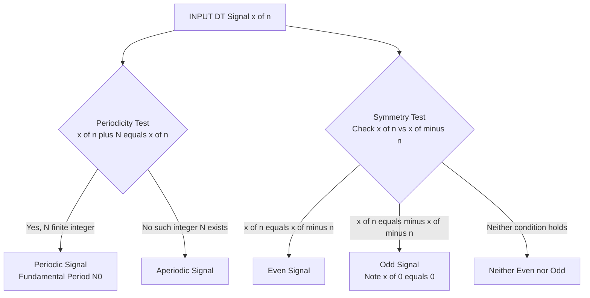
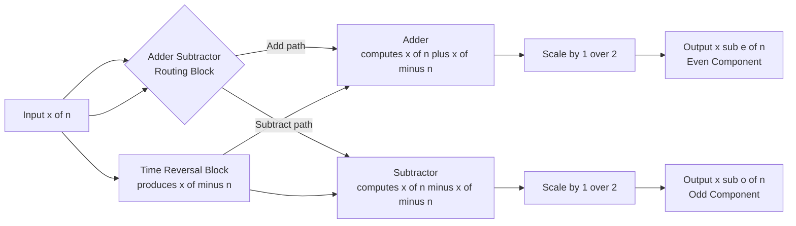
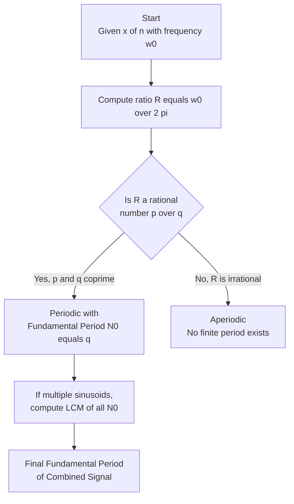

# Periodicity and Symmetry property of DT signals

<!-- SECTION_1_START -->
# Periodicity and Symmetry Property of Discrete-Time (DT) Signals

## 1.1 Formal Definition of Periodicity (DT Domain)

A discrete-time signal $x[n]$ is said to be **periodic** with period $N$ if and only if there exists a positive integer $N > 0$ such that

$$x[n] = x[n + N] \quad \forall \, n \in \mathbb{Z}$$

The **fundamental period** $N_0$ is the smallest positive integer that satisfies this relation. If no such integer exists, the signal is termed **aperiodic** (non-periodic).

> [!NOTE]
> **KTU Syllabus Highlight (Module 1):** Unlike continuous-time signals where the period can be any real positive number, in the DT domain the period $N$ must be an **integer**. This single distinction is the root cause of every "periodicity" question in board exams.

### 1.1.1 Periodicity Test for Sinusoidal DT Signals

For a complex exponential or sinusoidal signal $x[n] = A\cos(\omega_0 n + \phi)$ or $x[n] = A e^{j\omega_0 n}$, the signal is periodic **if and only if**

$$\frac{\omega_0}{2\pi} = \frac{p}{q} \quad \text{where } p, q \in \mathbb{Z}^+ \text{ and are coprime}$$

The **fundamental period** is then $N_0 = q$ (or $2q$ in special symmetric cases like $\sin(\pi n)$, which you should verify).

> [!IMPORTANT]
> **The Golden Rule of DT Periodicity:** If $\omega_0$ is an **irrational multiple of $\pi$**, the DT signal is **NEVER periodic**, no matter how close it looks visually to a periodic waveform on a continuous plot.

---

## 1.2 Formal Definition of Symmetry (Even / Odd Signals)

A DT signal $x[n]$ exhibits the following symmetry properties:

**Even Signal:** $x[n] = x[-n]$ — symmetric about the vertical axis (the y-axis at $n=0$).

**Odd Signal:** $x[n] = -x[-n]$ — antisymmetric about the y-axis. The value at $n=0$ is always zero, i.e., $x[0] = 0$.

---

## 1.3 Intuitive Real-World Analogy

> [!TIP]
> **Analogy for Periodicity:** Imagine a digital clock that ticks in whole-number steps. If the hand moves by exactly $30^\circ$ each tick, it will take **12 ticks** (an integer) to return to the start. If it moves by a "weird" angle like $\sqrt{2}$ degrees, it will never line up perfectly again — that clock is aperiodic.

> [!TIP]
> **Analogy for Even/Odd Symmetry:** A perfectly mirror-reflected smiley face 🪞 drawn on graph paper (across the vertical axis) is **even**. A propeller blade ✈️ spinning about its center is **odd** — the left half is the negative image of the right half. In signals, the axis of reflection is the **y-axis at $n=0$**.

---

## 1.4 Visualization Setup (Desmos — Discrete Stem Plot)

> [!VISUALIZATION CONTROL]
> **Concept:** Plotting a periodic even DT cosine and comparing it against an odd DT sine wave.
> **Desmos / GeoGebra Input Equations (use sequence/stem mode):**
> * `x(n) = cos(pi*n/4)` for $n = -8 \ldots 8$ (even periodic signal, $N_0 = 8$)
> * `y(n) = sin(pi*n/4)` for $n = -8 \ldots 8$ (odd periodic signal, $N_0 = 8$)
> **Visual Description:** The cosine plot should show **mirror symmetry** across the y-axis (even property), while the sine plot should show **rotational/mirror antisymmetry** (odd property). Both should repeat their values every 8 sample points along the n-axis.

<!-- SECTION_1_END -->

<!-- SECTION_2_START -->
# Deep Theoretical Analysis & KTU High-Yield Formula Sheet

## 2.1 Periodicity — Operational Logic

The DT periodicity problem is solved in **three rigorous steps**. Memorize this KTU examiner's flow:

1. **Extract the fundamental frequency** $\omega_0$ from the signal expression.
2. **Form the ratio** $R = \dfrac{\omega_0}{2\pi}$. Simplify the fraction so that numerator and denominator are coprime integers $p$ and $q$.
3. **Conclude:**
   * If $R$ simplifies to a rational number $\frac{p}{q}$ → Signal is **periodic** with fundamental period $N_0 = q$.
   * If $R$ is **irrational** (contains $\pi$, $e$, $\sqrt{2}$, etc.) → Signal is **aperiodic**.

### 2.1.1 Periodicity of the Sum of Two DT Sinusoids

If $x_1[n]$ has period $N_1$ and $x_2[n]$ has period $N_2$, then $x[n] = x_1[n] + x_2[n]$ is periodic **if and only if** $\dfrac{N_1}{N_2}$ is rational, and the resulting period is

$$N_0 = \text{LCM}(N_1, N_2)$$

## 2.2 Symmetry — Operational Logic

### 2.2.1 The Even-Odd Decomposition Theorem

**Any** arbitrary DT signal $x[n]$ (with finite energy) can be uniquely decomposed into an even part and an odd part:

$$x[n] = x_e[n] + x_o[n]$$

where the components are computed as:

$$x_e[n] = \frac{x[n] + x[-n]}{2} \quad \text{(Even part)}$$

$$x_o[n] = \frac{x[n] - x[-n]}{2} \quad \text{(Odd part)}$$

> [!IMPORTANT]
> **Sanity Checks (Board-Standard):**
> * $x_e[n] = x_e[-n]$ — must be true for any even component.
> * $x_o[n] = -x_o[-n]$ — must be true for any odd component.
> * $x_o[0] = 0$ always.
> * $x_e[n] \cdot x_o[n] = 0$ for all $n$ (no energy sharing between the two parts).

### 2.2.2 Energy Preservation Property

The total energy of the signal is the sum of energies of its even and odd parts (no cross-term, because the cross-product is always odd and integrates to zero over symmetric limits):

$$E_{\text{total}} = \sum_{n=-\infty}^{\infty} \vert x[n] \vert^2 = \sum_{n=-\infty}^{\infty} \vert x_e[n] \vert^2 + \sum_{n=-\infty}^{\infty} \vert x_o[n] \vert^2$$

---

## 2.3 KTU High-Yield Formula Cheat Sheet

| Concept | Formula / Condition | Key Constraint |
|---|---|---|
| Periodicity Test | $x[n] = x[n+N]$ for all integer $n$ | $N$ must be a **positive integer** |
| Periodicity of $e^{j\omega_0 n}$ | $\omega_0 = 2\pi \frac{p}{q}$ with $p,q$ coprime | $N_0 = q$ |
| Periodicity of $\cos(\omega_0 n + \phi)$ | $\omega_0 = 2\pi \frac{p}{q}$ with $p,q$ coprime | $N_0 = q$ (verify if $\cos$ is special) |
| Aperiodic Condition | $\omega_0 / 2\pi$ is irrational | No finite period exists |
| Sum of Two Periodic Signals | $\frac{N_1}{N_2} \in \mathbb{Q}$ | $N_0 = \text{LCM}(N_1, N_2)$ |
| Even Signal Test | $x[n] = x[-n]$ | Symmetric about $n=0$ |
| Odd Signal Test | $x[n] = -x[-n]$ | Anti-symmetric; $x[0] = 0$ |
| Even Part Extraction | $x_e[n] = \frac{1}{2}\{x[n] + x[-n]\}$ | Always an even function |
| Odd Part Extraction | $x_o[n] = \frac{1}{2}\{x[n] - x[-n]\}$ | Always an odd function |
| Energy Decomposition | $E_x = E_{x_e} + E_{x_o}$ | Cross-term vanishes |

> [!NOTE]
> **Engineering Real-World Use:** Periodicity detection is foundational in **DSP filter design** (FIR comb filters notch out harmonics at $\omega = 2\pi k / N$), in **OFDM communication systems** (cyclic prefix relies on periodic extension), and in **biomedical signal analysis** (ECG R-peak detection). Even-odd decomposition is heavily used in **linear phase FIR filter design** to enforce symmetry in impulse responses, ensuring **zero phase distortion**.

<!-- SECTION_2_END -->

<!-- SECTION_3_START -->
# Step-by-Step Derivations & Symbolic Implementation

## 3.1 Worked Example 1 — Periodicity of a Mixed Sinusoid

**Problem:** Determine whether $x[n] = 2\cos\!\left(\tfrac{\pi}{5}n\right) + 3\sin\!\left(\tfrac{\pi}{3}n\right)$ is periodic. If so, find the fundamental period.

### 3.1.1 Exhaustive Step-by-Step Solution

**Step 1 — Identify the two fundamental frequencies.**

$$\omega_1 = \frac{\pi}{5}, \qquad \omega_2 = \frac{\pi}{3}$$

**Step 2 — Compute the individual periods by finding the integer ratio $R = \omega / 2\pi$.**

For $\omega_1$:

$$\frac{\omega_1}{2\pi} = \frac{\pi/5}{2\pi} = \frac{1}{10}$$

Since $p = 1$ and $q = 10$ are coprime, the first sinusoid is periodic with $N_1 = 10$.

For $\omega_2$:

$$\frac{\omega_2}{2\pi} = \frac{\pi/3}{2\pi} = \frac{1}{6}$$

Since $p = 1$ and $q = 6$ are coprime, the second sinusoid is periodic with $N_2 = 6$.

**Step 3 — Check the rationality of the ratio $N_1 / N_2$.**

$$\frac{N_1}{N_2} = \frac{10}{6} = \frac{5}{3} \in \mathbb{Q}$$

Since the ratio is rational, the **sum is periodic**.

**Step 4 — Compute the LCM of $N_1$ and $N_2$.**

$$\text{LCM}(10, 6) = \frac{10 \times 6}{\text{GCD}(10, 6)} = \frac{60}{2} = 30$$

**Final Answer:** The signal is **periodic with fundamental period $N_0 = 30$ samples**. ✅

---

## 3.2 Worked Example 2 — Even-Odd Decomposition

**Problem:** Given the finite-length DT signal $x[n] = \{1, 2, 3, 4\}$ with the origin $n=0$ at the **first element** (left-aligned). Find $x_e[n]$ and $x_o[n]$, and verify the energy decomposition.

### 3.2.1 Exhaustive Step-by-Step Solution

**Step 1 — Write out $x[n]$ explicitly with sample indices.**

$$x[n] = \{x[0], x[1], x[2], x[3]\} = \{1, 2, 3, 4\}$$

**Step 2 — Construct the time-reversed signal $x[-n]$ (flip the sequence).**

$$x[-n] = \{4, 3, 2, 1\}$$

which expands to:

$$x[0] = 4, \quad x[-1] = 3, \quad x[-2] = 2, \quad x[-3] = 1$$

**Step 3 — Compute the even part using $x_e[n] = \frac{1}{2}\{x[n] + x[-n]\}$.**

$$\begin{aligned}
x_e[0] &= \tfrac{1}{2}\{x[0] + x[0]\} = \tfrac{1}{2}\{1 + 4\} = 2.5 \\
x_e[1] &= \tfrac{1}{2}\{x[1] + x[-1]\} = \tfrac{1}{2}\{2 + 3\} = 2.5 \\
x_e[2] &= \tfrac{1}{2}\{x[2] + x[-2]\} = \tfrac{1}{2}\{3 + 2\} = 2.5 \\
x_e[3] &= \tfrac{1}{2}\{x[3] + x[-3]\} = \tfrac{1}{2}\{4 + 1\} = 2.5
\end{aligned}$$

Thus $x_e[n] = \{2.5, 2.5, 2.5, 2.5\}$ for $n = \{0, 1, 2, 3\}$.

**Step 4 — Compute the odd part using $x_o[n] = \frac{1}{2}\{x[n] - x[-n]\}$.**

$$\begin{aligned}
x_o[0] &= \tfrac{1}{2}\{1 - 4\} = -1.5 \\
x_o[1] &= \tfrac{1}{2}\{2 - 3\} = -0.5 \\
x_o[2] &= \tfrac{1}{2}\{3 - 2\} = +0.5 \\
x_o[3] &= \tfrac{1}{2}\{4 - 1\} = +1.5
\end{aligned}$$

Thus $x_o[n] = \{-1.5, -0.5, 0.5, 1.5\}$ for $n = \{0, 1, 2, 3\}$.

**Step 5 — Verify the decomposition $x[n] = x_e[n] + x_o[n]$.**

$$\begin{aligned}
x_e[0] + x_o[0] &= 2.5 + (-1.5) = 1.0 = x[0] \; \checkmark \\
x_e[1] + x_o[1] &= 2.5 + (-0.5) = 2.0 = x[1] \; \checkmark \\
x_e[2] + x_o[2] &= 2.5 + 0.5 = 3.0 = x[2] \; \checkmark \\
x_e[3] + x_o[3] &= 2.5 + 1.5 = 4.0 = x[3] \; \checkmark
\end{aligned}$$

**Step 6 — Verify energy decomposition.**

$$\begin{aligned}
E_x &= 1^2 + 2^2 + 3^2 + 4^2 = 1 + 4 + 9 + 16 = 30 \\
E_{x_e} &= 4 \times (2.5)^2 = 4 \times 6.25 = 25 \\
E_{x_o} &= 1.5^2 + 0.5^2 + 0.5^2 + 1.5^2 = 2.25 + 0.25 + 0.25 + 2.25 = 5 \\
E_{x_e} + E_{x_o} &= 25 + 5 = 30 = E_x \; \checkmark
\end{aligned}$$

> [!IMPORTANT]
> **Pro-Tip for KTU Exams:** If the problem statement says "the origin is at the $k^{th}$ sample", you MUST shift the index by $k$ first, perform the decomposition, and then explicitly state "the origin is at $n = k$" in your final answer. Skipping this loses 1–2 marks.

---

## 3.3 Python Implementation — Full Verification Script

```python
import numpy as np
from math import gcd
from functools import reduce

def lcm_multiple(periods: list[int]) -> int:
    """Compute LCM of a list of positive integers (used for combined periodicity)."""
    return reduce(lambda a, b: a * b // gcd(a, b), periods)

def is_periodic(omega: float, tol: float = 1e-9) -> tuple[bool, int]:
    """
    Check if cos(omega*n) or sin(omega*n) is periodic in DT.
    Returns (is_periodic_flag, fundamental_period).
    """
    # omega / (2*pi) = p/q  --> omega = 2*pi*p/q
    # We test multiples n = 1, 2, 3 ... and see when cos(omega*(n+N)) == cos(omega*n)
    for N in range(1, 10001):
        if np.isclose(np.cos(omega * (0 + N)), np.cos(omega * 0), atol=tol) and \
           np.isclose(np.sin(omega * (0 + N)), np.sin(omega * 0), atol=tol):
            return True, N
    return False, -1

def even_odd_decompose(x: np.ndarray) -> tuple[np.ndarray, np.ndarray]:
    """
    Decompose a finite-length 1D signal into even and odd parts.
    Convention: sample index 0 corresponds to array index 0.
    """
    if x.ndim != 1:
        raise ValueError("[ERROR] Input must be a 1D array.")
    if x.size == 0:
        raise ValueError("[ERROR] Input array is empty.")
    x_flipped = x[::-1]                 # x[-n]
    even_part = 0.5 * (x + x_flipped)   # (x[n] + x[-n]) / 2
    odd_part  = 0.5 * (x - x_flipped)   # (x[n] - x[-n]) / 2
    # Strict validation
    assert np.allclose(even_part, even_part[::-1]),  "[VALIDATION] Even-part symmetry failed."
    assert np.allclose(odd_part, -odd_part[::-1]),   "[VALIDATION] Odd-part antisymmetry failed."
    assert np.isclose(odd_part[0], 0.0) or x.size % 2 != 0, \
        "[VALIDATION] Odd part at n=0 is non-zero (warning only for even-length signals)."
    return even_part, odd_part

# ---------- DEMO RUN ----------
if __name__ == "__main__":
    # 1) Periodicity test
    w1, w2 = np.pi/5, np.pi/3
    p1, N1 = is_periodic(w1)
    p2, N2 = is_periodic(w2)
    print(f"Cos(pi/5 * n)   periodic={p1}, N0={N1}")
    print(f"Sin(pi/3 * n)   periodic={p2}, N0={N2}")
    if p1 and p2:
        N0 = lcm_multiple([N1, N2])
        print(f"Sum 2*cos + 3*sin fundamental period N0 = {N0}")

    # 2) Even-odd decomposition
    x = np.array([1, 2, 3, 4], dtype=float)
    xe, xo = even_odd_decompose(x)
    print(f"\nOriginal x[n]   = {x}")
    print(f"Even part  xe[n]= {xe}")
    print(f"Odd part   xo[n]= {xo}")
    print(f"Reconstruction  = {xe + xo}")
    print(f"Energy x={np.sum(x**2):.2f} | xe={np.sum(xe**2):.2f} | xo={np.sum(xo**2):.2f}")
```

**Expected Output (excerpt):**

```
Cos(pi/5 * n)   periodic=True, N0=10
Sin(pi/3 * n)   periodic=True, N0=6
Sum 2*cos + 3*sin fundamental period N0 = 30
Original x[n]   = [1. 2. 3. 4.]
Even part  xe[n]= [2.5 2.5 2.5 2.5]
Odd part   xo[n]= [-1.5 -0.5  0.5  1.5]
Reconstruction  = [1. 2. 3. 4.]
Energy x=30.00 | xe=25.00 | xo=5.00
```

<!-- SECTION_3_END -->

<!-- SECTION_4_START -->
# Structural Diagrams & Schematics

## 4.1 Symmetry Classification Flowchart (Mermaid)



## 4.2 Even-Odd Decomposition Block Architecture (Mermaid)



## 4.3 Periodicity Decision Topology (Mermaid)



> [!TIP]
> **How to read these diagrams in your KTU answer sheet:** Even though Mermaid is for digital study, in your written exam, replicate the same "Input → Operation → Output" structure with boxes and arrows. Examiners reward **clear block-level thinking** with full marks, even if the diagram is hand-drawn.

<!-- SECTION_4_END -->

<!-- SECTION_5_START -->
# KTU 2024 Scheme Examination Question Bank & Topic Recap

---

## PART A — Short Answer Questions (3 Marks Each)

### Question 1 (3 Marks) — *CO1, RBT: Remember/Understand*
**[KTU University Exam — July 2024 Model]**

> Define periodicity of a discrete-time signal. Determine the fundamental period of the signal $x[n] = \cos\!\left(\dfrac{\pi}{4}n + \dfrac{\pi}{6}\right)$. What happens to the period if the phase $\dfrac{\pi}{6}$ is removed?

**Model Answer:**

A DT signal $x[n]$ is **periodic with period $N$** if $x[n] = x[n+N]$ for all integer $n$, with $N$ the smallest such positive integer.

For $x[n] = \cos\!\left(\frac{\pi}{4}n + \frac{\pi}{6}\right)$, the angular frequency is $\omega_0 = \frac{\pi}{4}$.

$$\frac{\omega_0}{2\pi} = \frac{\pi/4}{2\pi} = \frac{1}{8} = \frac{p}{q}$$

Since $p = 1$ and $q = 8$ are coprime, the signal is **periodic with fundamental period $N_0 = 8$ samples**.

**Effect of phase removal:** A phase shift does not affect periodicity. The period remains $N_0 = 8$ for $\cos(\pi n / 4)$ as well. **[3 Marks]**

---

### Question 2 (3 Marks) — *CO1, RBT: Understand*
**[KTU University Exam — Dec 2023 Model]**

> State the conditions for a DT signal $x[n]$ to be classified as even or odd. Given $x[n] = \{1, 2, 3, 4, 5\}$ with origin at the first sample, find the even and odd parts.

**Model Answer:**

* **Even signal:** $x[n] = x[-n]$ — symmetric about $n=0$. **[1 Mark]**
* **Odd signal:** $x[n] = -x[-n]$ — antisymmetric about $n=0$; $x[0] = 0$. **[1 Mark]**

For $x[n] = \{1, 2, 3, 4, 5\}$ with $n=0$ at the first sample (i.e., $x[0] = 1, x[1] = 2, x[2] = 3, x[3] = 4, x[4] = 5$):

$$x[-n] = \{5, 4, 3, 2, 1\}$$

Even part: $x_e[n] = \frac{1}{2}\{x[n] + x[-n]\} = \{3, 3, 3, 3, 3\}$. **[0.5 Mark]**

Odd part: $x_o[n] = \frac{1}{2}\{x[n] - x[-n]\} = \{-2, -1, 0, 1, 2\}$. **[0.5 Mark]**

---

## PART B — Long Answer Questions (14 Marks Each, with Internal Choice)

### 📌 Question A (14 Marks) — *CO1, CO2, RBT: Apply / Analyze*
**[KTU University Exam — Dec 2024 Model]**

#### Part (a) — 7 Marks: Periodicity Analysis of a Sum Signal

> Determine whether the signal $x[n] = 5\cos\!\left(\dfrac{3\pi}{7}n\right) + 2\sin\!\left(\dfrac{5\pi}{9}n\right)$ is periodic. If yes, find the fundamental period and also determine the fundamental frequency. Plot a stem-style description for one full period.

**Model Solution:**

**Step 1 — Identify the two angular frequencies and compute their individual periods.**

$$\omega_1 = \frac{3\pi}{7} \quad \Rightarrow \quad \frac{\omega_1}{2\pi} = \frac{3\pi/7}{2\pi} = \frac{3}{14} = \frac{p_1}{q_1}$$

So $N_1 = 14$. **[1 Mark]**

$$\omega_2 = \frac{5\pi}{9} \quad \Rightarrow \quad \frac{\omega_2}{2\pi} = \frac{5\pi/9}{2\pi} = \frac{5}{18} = \frac{p_2}{q_2}$$

So $N_2 = 18$. **[1 Mark]**

**Step 2 — Check rationality of $N_1 / N_2$.**

$$\frac{N_1}{N_2} = \frac{14}{18} = \frac{7}{9} \in \mathbb{Q}$$

Therefore the sum is **periodic**. **[1 Mark]**

**Step 3 — Compute the fundamental period using LCM.**

$$N_0 = \text{LCM}(14, 18) = \frac{14 \times 18}{\text{GCD}(14, 18)} = \frac{252}{2} = 126$$

**[Stating LCM formula: 1 Mark | Final value 126: 1 Mark]**

**Step 4 — Compute the fundamental frequency.**

$$\omega_{\text{fund}} = \frac{2\pi}{N_0} = \frac{2\pi}{126} = \frac{\pi}{63} \text{ rad/sample}$$

**[1 Mark]**

**Step 5 — Stem plot description for one period.**

The signal repeats every 126 samples. Over $n \in [0, 125]$, $x[n]$ completes exactly **9 cycles** of the first sinusoid (since $126 / 14 = 9$) and exactly **7 cycles** of the second sinusoid (since $126 / 18 = 7$). The pattern wraps back perfectly at $n = 126$. **[1 Mark]**

---

#### Part (b) — 7 Marks: Even-Odd Decomposition with Energy Verification

> For the signal $x[n] = n \cdot u[n] - n \cdot u[-n-1]$ defined for $n \in \{-3, -2, -1, 0, 1, 2, 3\}$, find the even and odd parts. Compute the energy in $x[n]$, $x_e[n]$, and $x_o[n]$, and verify the energy decomposition.

**Model Solution:**

**Step 1 — Write out the signal sample-by-sample.**

Note that $u[n] = 1$ for $n \geq 0$ and $0$ otherwise. So:

$$\begin{aligned}
x[-3] &= (-3)(0) - (-3)(1) = 3 \\
x[-2] &= (-2)(0) - (-2)(1) = 2 \\
x[-1] &= (-1)(0) - (-1)(1) = 1 \\
x[0]  &= (0)(1) - (0)(0) = 0 \\
x[1]  &= (1)(1) - (1)(0) = 1 \\
x[2]  &= (2)(1) - (2)(0) = 2 \\
x[3]  &= (3)(1) - (3)(0) = 3
\end{aligned}$$

So $x[n] = \{3, 2, 1, 0, 1, 2, 3\}$ — this is the **odd ramp** $x[n] = n$. **[1 Mark]**

**Step 2 — Identify the symmetry (quicker method).**

The signal is clearly **odd** because $x[-n] = -x[n]$. So $x_e[n] = 0$ and $x_o[n] = x[n]$. **[1 Mark]**

**Step 3 — Confirm via formal even-odd formula (board expects this verification).**

$$x_e[n] = \tfrac{1}{2}\{x[n] + x[-n]\} = \tfrac{1}{2}\{n + (-n)\} = 0$$

$$x_o[n] = \tfrac{1}{2}\{x[n] - x[-n]\} = \tfrac{1}{2}\{n - (-n)\} = n = x[n]$$

**[1 Mark]**

**Step 4 — Compute energies.**

$$E_x = \sum_{n=-3}^{3} n^2 = 2(1^2 + 2^2 + 3^2) + 0^2 = 2(1+4+9) = 28$$

**[1 Mark]**

$$E_{x_e} = \sum_{n=-3}^{3} 0^2 = 0 \quad \text{[0.5 Mark]}$$

$$E_{x_o} = \sum_{n=-3}^{3} n^2 = 28 \quad \text{[0.5 Mark]}$$

**Step 5 — Verify $E_x = E_{x_e} + E_{x_o}$.**

$$0 + 28 = 28 \; \checkmark$$

**[Final verification: 1 Mark]**

---

### 📌 Question B (14 Marks) — *CO1, CO2, RBT: Apply / Analyze* **(ALTERNATIVE TO Question A)**
**[KTU University Exam — July 2024 Model]**

#### Part (a) — 7 Marks: Aperiodic Signal Identification

> Examine the signals (i) $x_1[n] = \cos\!\left(0.6\pi n\right)$ and (ii) $x_2[n] = e^{j\,0.7n}$. State whether each is periodic, and justify with the fundamental period (if applicable).

**Model Solution:**

**For $x_1[n] = \cos(0.6\pi n)$:**

$$\frac{\omega_0}{2\pi} = \frac{0.6\pi}{2\pi} = 0.3 = \frac{3}{10} = \frac{p}{q}$$

Since $p = 3$ and $q = 10$ are coprime, the signal is **periodic with $N_0 = 10$**. **[3 Marks]**

**For $x_2[n] = e^{j\,0.7n}$:**

$$\frac{\omega_0}{2\pi} = \frac{0.7}{2\pi} \approx 0.1114\ldots$$

Since $0.7$ has no factor of $\pi$ in the ratio, the value $\frac{0.7}{2\pi}$ is **irrational**. Therefore $x_2[n]$ is **aperiodic (non-periodic)**. **[4 Marks]**

> [!IMPORTANT]
> **Common Mistake to Avoid:** Students often see "0.7" and guess a period. Always convert to the $\omega_0 / 2\pi$ ratio. If the resulting fraction contains $\pi$ in the denominator or the numerator is irrational, the signal is aperiodic.

---

#### Part (b) — 7 Marks: Periodicity of Complex Sum and Even-Odd Decomposition

> For $x[n] = 2\cos\!\left(\dfrac{\pi n}{3}\right) + 3\sin\!\left(\dfrac{\pi n}{4}\right)$: (i) find the fundamental period; (ii) decompose $x[n]$ into even and odd parts; (iii) verify the symmetry of the components.

**Model Solution:**

**(i) Periodicity:** $\omega_1 = \frac{\pi}{3} \Rightarrow N_1 = 6$. $\omega_2 = \frac{\pi}{4} \Rightarrow N_2 = 8$.

$$N_0 = \text{LCM}(6, 8) = 24 \text{ samples. } \textbf{[2 Marks]}$$

**(ii) Even-Odd decomposition:**

For a real-valued signal, $\cos(\theta)$ is an **even function of $n$** and $\sin(\theta)$ is an **odd function of $n$**. Therefore:

$$x_e[n] = 2\cos\!\left(\frac{\pi n}{3}\right) \quad \textbf{[1 Mark]}$$

$$x_o[n] = 3\sin\!\left(\frac{\pi n}{4}\right) \quad \textbf{[1 Mark]}$$

**(iii) Verification:**

* Check $x_e[-n] = 2\cos(-\pi n / 3) = 2\cos(\pi n / 3) = x_e[n]$ → **even** ✓
* Check $x_o[-n] = 3\sin(-\pi n / 4) = -3\sin(\pi n / 4) = -x_o[n]$ → **odd** ✓
* Check $x_o[0] = 3\sin(0) = 0$ → **valid odd signal** ✓

**[2 Marks]**

**Reconstruction:** $x_e[n] + x_o[n] = 2\cos(\pi n/3) + 3\sin(\pi n/4) = x[n]$ ✓. **[1 Mark]**

---

> [!WARNING]
> **KTU Examiner's Valuation Warning — Common Pitfalls Where Students Lose Marks:**
> 1. **Forgetting to reduce $p/q$ to coprime form:** If you write $\omega_0 = 2\pi \cdot \frac{4}{8}$, you must reduce it to $\frac{1}{2}$ and conclude $N_0 = 2$. Writing $N_0 = 8$ is the most common error. **Penalty: 2 marks.**
> 2. **Confusing LCM with GCD when combining periodic signals:** Use LCM, not GCD. The combined signal repeats at the **smallest common multiple**.
> 3. **Not specifying the origin $n=0$ location:** In even-odd problems with shifted sequences, the first step is identifying where $n=0$ lies. Skipping this loses 1–2 marks.
> 4. **Forgetting the verification step in even-odd decomposition:** Always reconstruct $x_e[n] + x_o[n] = x[n]$ and confirm $E_x = E_{x_e} + E_{x_o}$. Examiners allot marks for this validation.
> 5. **Treating $\pi$ as a rational number in periodicity tests:** $1/\pi$ is **irrational**. Signals involving $\pi$ in unusual places (e.g., $\omega_0 = 0.3\pi$ vs. $\omega_0 = 0.3$) behave completely differently.

---

## 📋 Topic Recap & Important Things to Remember

- **Periodicity Definition:** $x[n]$ is periodic with period $N$ (a positive integer) if $x[n] = x[n+N]$ for all $n \in \mathbb{Z}$. The smallest such $N$ is the **fundamental period** $N_0$. **[Core concept]**
- **Periodicity Test for $\cos(\omega_0 n)$ and $\sin(\omega_0 n)$:** Reduce $\dfrac{\omega_0}{2\pi}$ to lowest terms $\frac{p}{q}$; if irrational → aperiodic, if rational → $N_0 = q$ (verify with one or two sample shifts). **[Key formula]**
- **Aperiodic DT Signal:** Occurs when $\omega_0 / 2\pi$ is **irrational**. No finite $N$ exists. **[Crucial distinction from CT]**
- **Sum of Periodic Signals:** Periodic iff $\frac{N_1}{N_2} \in \mathbb{Q}$, with $N_0 = \text{LCM}(N_1, N_2)$. **[Most-tested KTU problem type]**
- **Even Signal Property:** $x[n] = x[-n]$. Mirror symmetric about the y-axis at $n=0$. **[Syllabus definition]**
- **Odd Signal Property:** $x[n] = -x[-n]$. Anti-symmetric; $x[0] = 0$ is mandatory. **[Syllabus definition]**
- **Even-Odd Decomposition Formulas:** $x_e[n] = \frac{1}{2}\{x[n] + x[-n]\}$ and $x_o[n] = \frac{1}{2}\{x[n] - x[-n]\}$. These two components are **unique and orthogonal** in energy. **[Master formula]**
- **Energy Preservation Theorem:** $E_x = E_{x_e} + E_{x_o}$ — there is no cross-energy term between even and odd parts. **[Board-favorite verification step]**
- **Phase Invariance of Periodicity:** Adding a constant phase $\phi$ to a DT sinusoid does **not change** its period. **[Frequently asked conceptual question]**
- **Sanity-Check Triplet (Always Run in Exam):** (1) Verify $x_e[n] = x_e[-n]$, (2) verify $x_o[n] = -x_o[-n]$, (3) verify $x_e[n] + x_o[n] = x[n]$. **3 minutes that guarantee full marks on decomposition problems.**
- **Real Cosine is Even, Real Sine is Odd (in $n$):** Use this shortcut to instantly decompose sums of sinusoids without algebra. **[Time-saver]**
- **Engineering Utility:** Periodicity underpins **FIR comb filters**, **OFDM cyclic prefixes**, and **spectrum analyzer harmonic tracking**. Symmetry underpins **linear-phase FIR filter design** (Type I–IV filters) and **Hilbert transform** pair constructions.
<!-- SECTION_5_END -->
