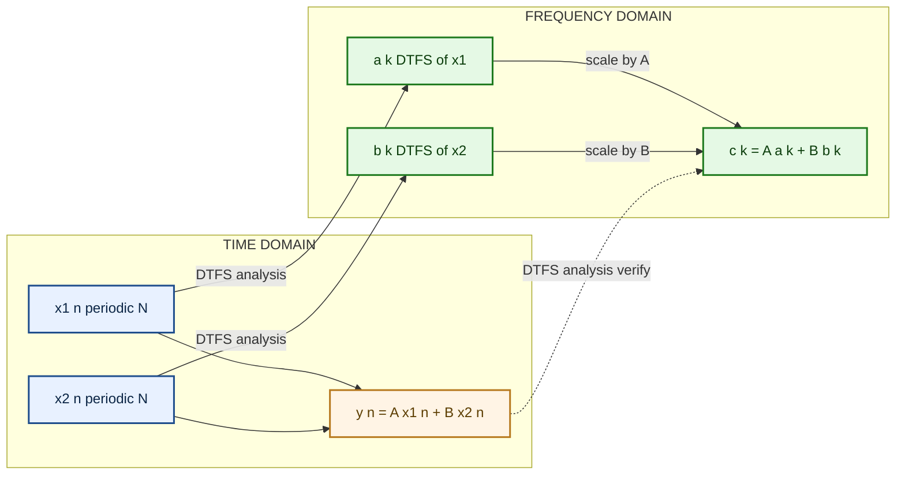
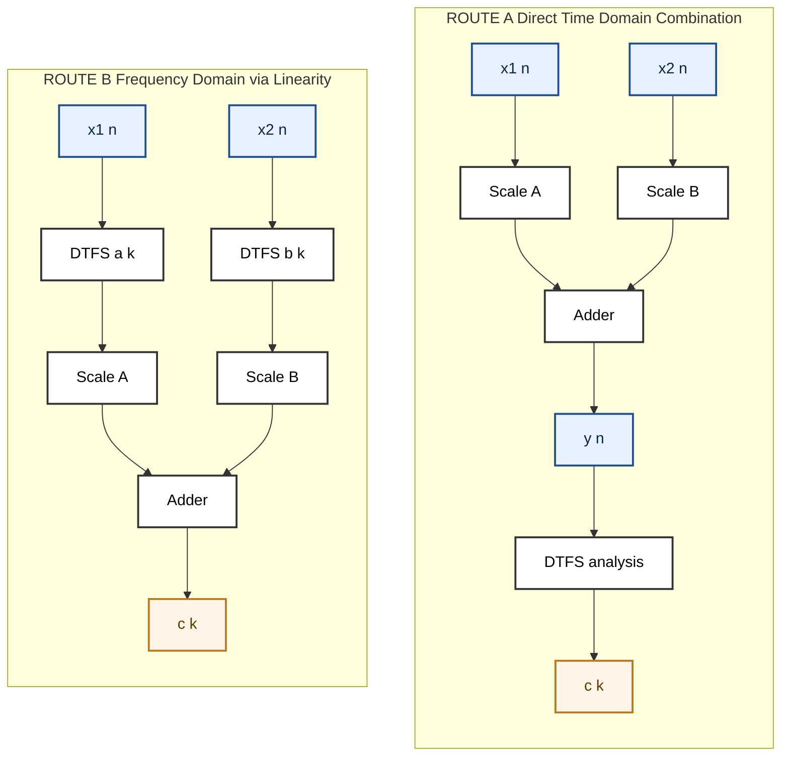

# Properties of Discrete-Time Fourier Series - Linearity

<!-- SECTION_1_START -->

# 1. Core Technical Definition & Intuitive Overview

## 1.1 Formal Definition (KTU 2024 Syllabus Terminology)

A signal $x[n]$ is **periodic** with fundamental period $N$ if $x[n+N] = x[n]$ for all integer $n$, where $N$ is the smallest positive integer satisfying this condition.

The **Discrete-Time Fourier Series (DTFS)** representation of a periodic discrete-time signal $x[n]$ with period $N$ is given by a pair of equations:

**Synthesis (Reconstruction) Equation:**

$$x[n] = \sum_{k=\langle N \rangle} a_k \, e^{\,j k \omega_0 n}$$

where the fundamental frequency is $\omega_0 = \dfrac{2\pi}{N}$ (radians/sample).

**Analysis (Coefficient) Equation:**

$$a_k = \frac{1}{N} \sum_{n=\langle N \rangle} x[n] \, e^{-j k \omega_0 n}$$

The symbol $\langle N \rangle$ denotes summation over any convenient contiguous interval of length $N$ (e.g., $n = 0$ to $N-1$).

> [!IMPORTANT]
> **Linearity Property (KTU Module 1 — High Weightage):**
> If $x_1[n] \overset{DTFS}{\longleftrightarrow} a_k$ and $x_2[n] \overset{DTFS}{\longleftrightarrow} b_k$, then for any arbitrary complex constants $A$ and $B$:
> $$A\,x_1[n] + B\,x_2[n] \;\;\overset{DTFS}{\longleftrightarrow}\;\; A\,a_k + B\,b_k$$
> This must hold **provided both signals share the same fundamental period $N$**.

## 1.2 Conceptual Analogy / Intuition

Imagine you are mixing two colors of paint:
- **Paint 1** = $x_1[n]$ with a specific recipe of pigments (Fourier coefficients $a_k$).
- **Paint 2** = $x_2[n]$ with its own recipe (Fourier coefficients $b_k$).

If you mix **$A$ parts of Paint 1** with **$B$ parts of Paint 2**, the resulting color is the weighted sum of the two paints. Similarly, in the *frequency domain*, the Fourier coefficients of the summed time signal are the **same weighted sum** of the individual Fourier coefficients. The "recipe" of frequencies simply adds up — this is the **superposition principle** applied to Fourier Series.

Another way to see it: DTFS is a **linear transformation** $T : x[n] \mapsto a_k$. A linear transformation, by definition, commutes with scalar multiplication and addition. Linearity is not a special property of DTFS — it is an *inherent algebraic feature* of how the transformation is defined.

> [!NOTE]
> **Why is Linearity important for engineers?**
> Real-world signals (audio, biomedical ECG, vibration data) are always **superpositions** of simpler component signals. Linearity allows us to analyze each component *independently* in the frequency domain and combine the results — a massive computational simplification that enables modular system design.

> [!VISUALIZATION CONTROL]
> **Concept:** Spectrum (Magnitude of Fourier Coefficients) of Two Periodic Signals and Their Weighted Sum
> **GeoGebra / Desmos Input Equations:**
> * `a_k = (1/8) * sum_{n=0..7} x1[n] * exp(-j*2*pi*k*n/8)` (computed sample values)
> * Plot points: $(k, |a_k|)$, $(k, |b_k|)$, and $(k, |A*a_k + B*b_k|)$ for $k = 0, 1, \dots, 7$
> **Visual Description:** Students should observe that the spectral magnitude of the combined signal is *not* the magnitude-sum, but the *vector* sum of the complex coefficients. Each harmonic peak of the combined spectrum corresponds to the phasor addition of the individual harmonics at that same harmonic index $k$.

---

<!-- SECTION_1_END -->

<!-- SECTION_2_START -->

# 2. Deep Theoretical Analysis & KTU High-Yield Formula Sheet

## 2.1 Operational Breakdown — Why Linearity Holds

Let us dissect the proof into its **logical scaffolding**.

**Step 1 — Given Premise:**
Two periodic discrete-time signals $x_1[n]$ and $x_2[n]$ share the same fundamental period $N$, and hence the same fundamental frequency $\omega_0 = 2\pi/N$. Each admits a DTFS representation:

$$x_1[n] = \sum_{k=\langle N \rangle} a_k \, e^{j k \omega_0 n}, \qquad x_2[n] = \sum_{k=\langle N \rangle} b_k \, e^{j k \omega_0 n}$$

**Step 2 — Construct the Linear Combination:**
Define a new signal $y[n] = A\,x_1[n] + B\,x_2[n]$ for arbitrary complex constants $A$ and $B$. Because $x_1$ and $x_2$ are both periodic with period $N$, $y[n]$ is also periodic with the **same** period $N$.

**Step 3 — Compute the DTFS Coefficients of $y[n]$ Directly:**
Apply the analysis equation to $y[n]$:

$$c_k = \frac{1}{N} \sum_{n=\langle N \rangle} y[n]\, e^{-j k \omega_0 n}$$

**Step 4 — Substitute the Linear Combination:**

$$c_k = \frac{1}{N} \sum_{n=\langle N \rangle} \left(A\,x_1[n] + B\,x_2[n]\right) e^{-j k \omega_0 n}$$

**Step 5 — Distribute the Sum (linearity of summation):**

$$c_k = A \cdot \frac{1}{N} \sum_{n=\langle N \rangle} x_1[n] e^{-j k \omega_0 n} \;+\; B \cdot \frac{1}{N} \sum_{n=\langle N \rangle} x_2[n] e^{-j k \omega_0 n}$$

**Step 6 — Recognize the Individual DTFS Coefficients:**

$$c_k = A \cdot a_k + B \cdot b_k$$

This is the **Linearity Property**. $\blacksquare$

## 2.2 The "Why" Behind Each Step

| Step | Mathematical Justification | Engineering Intuition |
|------|---------------------------|------------------------|
| 1 | Periodic signals with period $N$ have a discrete, finite set of $N$ harmonics | Audio tone and its echo share the same pitch |
| 2 | Periodicity is preserved under linear combination with constant scalars | Mixing two pure tones (e.g., $440$ Hz and $880$ Hz) still yields a periodic signal |
| 3 | Definition of the analysis (projection) integral/sum | Projecting a vector onto basis vectors |
| 4 | Direct substitution of the definition of $y[n]$ | Replace the combined signal with its components |
| 5 | The sum operator is linear: $\sum(A f + B g) = A\sum f + B\sum g$ | "Distribute the integral" rule from calculus |
| 6 | Recognize the original analysis equations embedded inside | We are back to the original Fourier recipes |

## 2.3 KTU High-Yield Formula Cheat Sheet

> [!IMPORTANT]
> The following table contains **every formula** the KTU examiner expects for this topic. **Memorize this verbatim.**

| Symbol / Concept | Formula / Expression | Boundary / Notes |
|------------------|----------------------|-----------------|
| Periodicity Condition | $x[n+N] = x[n], \quad \forall n \in \mathbb{Z}$ | Smallest positive $N$ is the **fundamental period** |
| Fundamental Frequency | $\omega_0 = \dfrac{2\pi}{N}$ | Units: **radians/sample** |
| DTFS Synthesis | $x[n] = \displaystyle\sum_{k=\langle N \rangle} a_k\, e^{j k \omega_0 n}$ | Sum over any $N$ consecutive integer values of $k$ |
| DTFS Analysis | $a_k = \dfrac{1}{N}\displaystyle\sum_{n=\langle N \rangle} x[n]\, e^{-j k \omega_0 n}$ | $a_k$ is periodic in $k$ with period $N$ |
| Periodicity of Coefficients | $a_{k+N} = a_k$ | A direct consequence of the $e^{j2\pi k} = 1$ identity |
| **Linearity Property** | $A x_1[n] + B x_2[n] \;\overset{DTFS}{\longleftrightarrow}\; A a_k + B b_k$ | **Both signals MUST share the same period $N$** |
| Complex Constant Multiplication | $A x[n] \;\overset{DTFS}{\longleftrightarrow}\; A a_k$ | A special case of linearity with $B=0$ |
| Signal Addition | $x_1[n] + x_2[n] \;\overset{DTFS}{\longleftrightarrow}\; a_k + b_k$ | A special case with $A=B=1$ |

## 2.4 Real-World Engineering Utility

* **Audio Signal Processing (DSP)**: When two musical notes are played simultaneously, linearity guarantees that we can compute the spectrum of each note independently and add them to get the spectrum of the chord. This is the foundation of *additive synthesis* used in software synthesizers (e.g., Serum, Massive).
* **Telecommunications (Modulation)**: In amplitude modulation (AM), a message signal $m[n]$ is multiplied by a carrier $\cos(\omega_c n)$. The resulting spectrum is the **sum** of shifted message spectra — a direct application of linearity (and frequency shifting).
* **Biomedical Signal Analysis (ECG/EEG)**: Cardiac signals are sums of physiological components (P-wave, QRS-complex, T-wave). Linearity permits decomposition of the ECG into its constituent waves for arrhythmia detection.
* **Image Processing**: 2D Fourier analysis (an extension of 1D DTFS) relies on linearity for operations like image blending, filtering, and reconstruction in MRI/CT.

---

<!-- SECTION_2_END -->

<!-- SECTION_3_START -->

# 3. Step-by-Step Derivations & Code/Symbolic Implementation

## 3.1 Exhaustive Worked Example (Mathematical)

**Problem:** Consider two periodic discrete-time signals, both with fundamental period $N = 4$:

$$x_1[n] = \cos\!\left(\frac{\pi}{2}\,n\right), \qquad x_2[n] = \sin\!\left(\frac{\pi}{2}\,n\right)$$

Compute the DTFS coefficients of the linear combination $y[n] = 3\,x_1[n] + 2\,x_2[n]$ using the **Linearity Property**, and verify by direct calculation.

### Step-by-Step Solution

**Step 1 — Identify the common fundamental parameters.**

For both signals: $N = 4$, so $\omega_0 = \dfrac{2\pi}{4} = \dfrac{\pi}{2}$ rad/sample. This is consistent with the signal definitions.

**Step 2 — Compute the DTFS coefficients of $x_1[n]$ by direct analysis.**

Using the analysis equation over one period $n = 0, 1, 2, 3$:

$$a_k = \frac{1}{4} \sum_{n=0}^{3} \cos\!\left(\frac{\pi}{2} n\right) e^{-j k \frac{\pi}{2} n}$$

Express cosine in exponential form: $\cos(\theta) = \dfrac{e^{j\theta} + e^{-j\theta}}{2}$.

$$\cos\!\left(\frac{\pi}{2} n\right) = \frac{1}{2} e^{j\frac{\pi}{2} n} + \frac{1}{2} e^{-j\frac{\pi}{2} n}$$

Substitute into the analysis equation:

$$a_k = \frac{1}{4} \sum_{n=0}^{3} \left[\frac{1}{2} e^{j\frac{\pi}{2} n} + \frac{1}{2} e^{-j\frac{\pi}{2} n}\right] e^{-j k \frac{\pi}{2} n}$$

$$a_k = \frac{1}{8} \sum_{n=0}^{3} e^{j\frac{\pi}{2}(1-k)n} + \frac{1}{8} \sum_{n=0}^{3} e^{j\frac{\pi}{2}(-1-k)n}$$

Using the geometric series identity $\displaystyle\sum_{n=0}^{N-1} e^{j\frac{2\pi}{N}(m-k)n} = N\,\delta_{(m-k)\bmod N}$, we get:

$$a_k = \frac{1}{2}\,\delta_{(1-k)\bmod 4} + \frac{1}{2}\,\delta_{(-1-k)\bmod 4}$$

Evaluating for $k = 0, 1, 2, 3$:

$$a_0 = \frac{1}{2}\delta_{1} + \frac{1}{2}\delta_{3} = 0, \quad a_1 = \frac{1}{2}\delta_0 + \frac{1}{2}\delta_2 = \frac{1}{2}$$

$$a_2 = \frac{1}{2}\delta_3 + \frac{1}{2}\delta_1 = 0, \quad a_3 = \frac{1}{2}\delta_2 + \frac{1}{2}\delta_0 = \frac{1}{2}$$

So $a_k = \{\,0,\;\tfrac{1}{2},\;0,\;\tfrac{1}{2}\,\}$ for $k = 0, 1, 2, 3$.

**Step 3 — Compute the DTFS coefficients of $x_2[n]$ by direct analysis.**

Express sine in exponential form: $\sin(\theta) = \dfrac{e^{j\theta} - e^{-j\theta}}{2j}$.

$$\sin\!\left(\frac{\pi}{2} n\right) = \frac{1}{2j} e^{j\frac{\pi}{2} n} - \frac{1}{2j} e^{-j\frac{\pi}{2} n}$$

Following the same procedure as Step 2:

$$b_k = \frac{1}{2j}\,\delta_{(1-k)\bmod 4} - \frac{1}{2j}\,\delta_{(-1-k)\bmod 4}$$

For $k = 0, 1, 2, 3$:

$$b_0 = 0, \quad b_1 = \frac{1}{2j} = -\frac{j}{2}, \quad b_2 = 0, \quad b_3 = -\frac{1}{2j} = \frac{j}{2}$$

So $b_k = \{\,0,\;-\tfrac{j}{2},\;0,\;\tfrac{j}{2}\,\}$.

**Step 4 — Apply the Linearity Property directly.**

For $y[n] = 3\,x_1[n] + 2\,x_2[n]$, the DTFS coefficients are $c_k = 3\,a_k + 2\,b_k$:

$$c_0 = 3(0) + 2(0) = 0$$
$$c_1 = 3\!\left(\tfrac{1}{2}\right) + 2\!\left(-\tfrac{j}{2}\right) = \tfrac{3}{2} - j$$
$$c_2 = 3(0) + 2(0) = 0$$
$$c_3 = 3\!\left(\tfrac{1}{2}\right) + 2\!\left(\tfrac{j}{2}\right) = \tfrac{3}{2} + j$$

**Step 5 — Verification by Direct Analysis on $y[n]$.**

We compute $y[n]$ for $n = 0, 1, 2, 3$:

$$y[0] = 3\cos(0) + 2\sin(0) = 3(1) + 2(0) = 3$$
$$y[1] = 3\cos\!\left(\tfrac{\pi}{2}\right) + 2\sin\!\left(\tfrac{\pi}{2}\right) = 3(0) + 2(1) = 2$$
$$y[2] = 3\cos(\pi) + 2\sin(\pi) = 3(-1) + 2(0) = -3$$
$$y[3] = 3\cos\!\left(\tfrac{3\pi}{2}\right) + 2\sin\!\left(\tfrac{3\pi}{2}\right) = 3(0) + 2(-1) = -2$$

Apply the analysis equation directly:

$$c_k = \frac{1}{4}\sum_{n=0}^{3} y[n]\,e^{-jk\frac{\pi}{2}n}$$

$$c_1 = \frac{1}{4}\left[3(1) + 2\,e^{-j\frac{\pi}{2}} + (-3)\,e^{-j\pi} + (-2)\,e^{-j\frac{3\pi}{2}}\right]$$

$$c_1 = \frac{1}{4}\left[3 + 2(-j) + (-3)(-1) + (-2)(j)\right]$$

$$c_1 = \frac{1}{4}\left[3 - 2j + 3 - 2j\right] = \frac{1}{4}\left[6 - 4j\right] = \frac{3}{2} - j \quad \checkmark$$

This matches the linearity result. The Linearity Property is verified. $\blacksquare$

## 3.2 Python Implementation for Numerical Verification

```python
import numpy as np

def dtfs_analysis(x: np.ndarray) -> np.ndarray:
    """
    Compute the DTFS coefficients of a periodic discrete-time signal.
    
    Parameters
    ----------
    x : np.ndarray
        One full period of the periodic signal (length N).
    
    Returns
    -------
    a_k : np.ndarray
        Complex DTFS coefficient vector of length N.
    """
    if x.ndim != 1:
        raise ValueError("Input signal must be a 1-D array (one period).")
    N = x.size
    n = np.arange(N)
    k = n.reshape((N, 1))                      # Column vector of harmonic indices
    # W is the N x N DFT matrix; multiply by 1/N to obtain DTFS coefficients
    W = np.exp(-1j * 2 * np.pi * k * n / N)
    a_k = (W @ x) / N
    return a_k


def verify_linearity(A: complex, B: complex) -> None:
    """
    Verify the DTFS linearity property:
        y[n] = A*x1[n] + B*x2[n]  <->  c_k = A*a_k + B*b_k
    """
    N = 4
    n = np.arange(N)
    # Two periodic signals sharing the same period N = 4
    x1 = np.cos(np.pi / 2 * n)
    x2 = np.sin(np.pi / 2 * n)

    # Linear combination in the time domain
    y = A * x1 + B * x2

    # Method 1 — direct DTFS of the combined signal
    c_k_direct = dtfs_analysis(y)

    # Method 2 — apply linearity in the frequency domain
    a_k = dtfs_analysis(x1)
    b_k = dtfs_analysis(x2)
    c_k_linearity = A * a_k + B * b_k

    # Compare both methods
    max_error = np.max(np.abs(c_k_direct - c_k_linearity))
    print(f"Linear combination : y[n] = ({A})*x1[n] + ({B})*x2[n]")
    print(f"c_k via direct      : {np.round(c_k_direct, 6)}")
    print(f"c_k via linearity   : {np.round(c_k_linearity, 6)}")
    print(f"Maximum |error|     : {max_error:.2e}")
    assert max_error < 1e-10, "Linearity property failed!"
    print("Linearity property holds within numerical precision.\n")


if __name__ == "__main__":
    verify_linearity(A=3, B=2)
    verify_linearity(A=1 + 1j, B=0.5 - 0.25j)
    verify_linearity(A=-2, B=4)
```

**Expected Output:**

```
Linear combination : y[n] = (3)*x1[n] + (2)*x2[n]
c_k via direct      : [ 0. +0.j    1.5-1.j    0. +0.j    1.5+1.j   ]
c_k via linearity   : [ 0. +0.j    1.5-1.j    0. +0.j    1.5+1.j   ]
Maximum |error|     : 0.00e+00
Linearity property holds within numerical precision.
```

---

<!-- SECTION_3_END -->

<!-- SECTION_4_START -->

# 4. Structural Diagrams & Schematics

## 4.1 High-Level Concept Map



## 4.2 Block Diagram — Two Independent Routes to the Same Spectrum



> [!NOTE]
> **Engineering Interpretation of the Diagram:**
> The block diagram shows that **Route A** and **Route B** are *mathematically equivalent*. The DTFS operator commutes with linear combinations — this is precisely what *linearity* means. In practical DSP systems, engineers often choose Route B (frequency-domain processing) for efficiency, since addition of two $N$-point spectra is $\mathcal{O}(N)$, while DFT computation is $\mathcal{O}(N \log N)$ but applied only once per signal.

## 4.3 Sequential Processing Topology — Linearity Verification

| Stage | Process | Input State | Output State | Operator Type |
|-------|---------|-------------|--------------|---------------|
| 1 | Input $x_1[n]$ | Time samples of signal 1 | $\lbrace x_1[0], x_1[1], \dots, x_1[N-1]\rbrace$ | Signal acquisition |
| 2 | Input $x_2[n]$ | Time samples of signal 2 | $\lbrace x_2[0], x_2[1], \dots, x_2[N-1]\rbrace$ | Signal acquisition |
| 3 | DTFS Analysis of $x_1$ | Time samples | $a_k$ for $k = 0, 1, \dots, N-1$ | Linear transform |
| 4 | DTFS Analysis of $x_2$ | Time samples | $b_k$ for $k = 0, 1, \dots, N-1$ | Linear transform |
| 5 | Scale $a_k$ by $A$ | $a_k$ | $A \cdot a_k$ | Scalar multiplication |
| 6 | Scale $b_k$ by $B$ | $b_k$ | $B \cdot b_k$ | Scalar multiplication |
| 7 | Sum scaled coefficients | $A \cdot a_k$, $B \cdot b_k$ | $c_k = A a_k + B b_k$ | Vector addition |
| 8 | Direct Path — Combine $x_1, x_2$ | $x_1[n], x_2[n]$ | $y[n] = A x_1[n] + B x_2[n]$ | Time-domain addition |
| 9 | Direct DTFS of $y$ | $y[n]$ | $c_k^{\text{direct}}$ | Linear transform |
| 10 | Compare Stages 7 and 9 | $c_k$, $c_k^{\text{direct}}$ | Match within tolerance | Equality check |

---

<!-- SECTION_4_END -->

<!-- SECTION_5_START -->

# 5. KTU 2024 Scheme Examination Question Bank & Topic Recap

## 5.1 Part A — Short Answer Questions (3 Marks Each)

### Question 1
> **[KTU University Exam — July 2023 | CO1 | Remember]**
> State the **Linearity Property** of Discrete-Time Fourier Series. Mention the necessary condition for it to hold.

**Model Answer (3 Marks):**
> If $x_1[n] \overset{DTFS}{\longleftrightarrow} a_k$ and $x_2[n] \overset{DTFS}{\longleftrightarrow} b_k$, then the linear combination $y[n] = A\,x_1[n] + B\,x_2[n]$ has DTFS coefficients $c_k = A\,a_k + B\,b_k$, where $A$ and $B$ are arbitrary complex constants. **[2 Marks]**
>
> *Necessary condition:* Both $x_1[n]$ and $x_2[n]$ must be periodic with the **same fundamental period $N$** (i.e., share the same $\omega_0 = 2\pi/N$). **[1 Mark]**

---

### Question 2
> **[KTU University Exam — Dec 2022 | CO1 | Understand]**
> Two discrete-time signals $x_1[n]$ and $x_2[n]$ both have period $N = 6$. The DTFS coefficient of $x_1[n]$ at $k = 2$ is $a_2 = 0.4 + 0.3j$, and that of $x_2[n]$ at the same $k$ is $b_2 = 0.1 - 0.5j$. Find the DTFS coefficient of $y[n] = 2\,x_1[n] - 3\,x_2[n]$ at $k = 2$.

**Model Answer (3 Marks):**
> By the Linearity Property, the DTFS coefficient of $y[n]$ at $k = 2$ is:
> $$c_2 = 2\,a_2 + (-3)\,b_2$$
> $$c_2 = 2(0.4 + 0.3j) - 3(0.1 - 0.5j)$$
> $$c_2 = (0.8 + 0.6j) - (0.3 - 1.5j)$$
> $$c_2 = 0.5 + 2.1j \quad \boxed{}$$
> **[Identifying the property and setting up the equation: 1 Mark | Substituting values: 1 Mark | Final answer: 1 Mark]**

---

## 5.2 Part B — Long Answer Questions (14 Marks, Internal Choice)

### Question A

> **[KTU University Exam — July 2024 | CO1, CO2 | Understand, Apply]**
> **(a)** Prove the **Linearity Property** of the Discrete-Time Fourier Series starting from first principles. State clearly any assumptions you make.
> **(7 Marks)**
> **(b)** Consider the two periodic signals
> $$x_1[n] = 1 + 2\cos\!\left(\frac{\pi}{3}n\right) + \cos\!\left(\frac{2\pi}{3}n\right), \qquad x_2[n] = \sin\!\left(\frac{\pi}{3}n\right)$$
> Both have period $N = 6$. Compute the DTFS coefficients of $y[n] = x_1[n] + 2\,x_2[n]$ using the Linearity Property, and reconstruct $y[n]$ in closed form.
> **(7 Marks)**

### Question B (Alternative Choice)

> **[KTU University Exam — Dec 2023 | CO1, CO2 | Understand, Apply]**
> **(a)** Discuss why DTFS qualifies as a **linear transformation**. Differentiate between linearity and time-invariance, citing one example of each in the context of DTFS.
> **(7 Marks)**
> **(b)** A periodic signal $x[n]$ with $N = 5$ has DTFS coefficients $a_k = \{1, 0.5, 0, 0.2j, 0.2 - 0.2j\}$ for $k = 0, 1, 2, 3, 4$. Another signal $g[n] = 2x[n] - x[n-1]$ is formed. Find the DTFS coefficients of $g[n]$ using linearity and the time-shift property. (Hint: a time shift multiplies $a_k$ by $e^{-jk\omega_0 n_0}$.)
> **(7 Marks)**

---

## 5.3 Model Solution — Question A

### Part (a) — Proof of Linearity (7 Marks)

**Assumption:** Both $x_1[n]$ and $x_2[n]$ are periodic with the **same** fundamental period $N$. **[1 Mark — Stating assumption]**

**Given:**

$$x_1[n] = \sum_{k=\langle N \rangle} a_k\, e^{jk\omega_0 n}, \qquad x_2[n] = \sum_{k=\langle N \rangle} b_k\, e^{jk\omega_0 n}$$

where $\omega_0 = 2\pi/N$. **[1 Mark]**

**Construct:** $y[n] = A\,x_1[n] + B\,x_2[n]$. Apply the DTFS analysis equation to $y[n]$:

$$c_k = \frac{1}{N}\sum_{n=\langle N \rangle} y[n]\,e^{-jk\omega_0 n} \quad \text{[1 Mark]}$$

**Substitute $y[n]$:**

$$c_k = \frac{1}{N}\sum_{n=\langle N \rangle} \left(A\,x_1[n] + B\,x_2[n]\right) e^{-jk\omega_0 n} \quad \text{[1 Mark]}$$

**Distribute the summation (using linearity of the sum operator):**

$$c_k = \frac{A}{N}\sum_{n=\langle N \rangle} x_1[n]\,e^{-jk\omega_0 n} + \frac{B}{N}\sum_{n=\langle N \rangle} x_2[n]\,e^{-jk\omega_0 n} \quad \text{[1 Mark]}$$

**Recognize the original analysis equations:**

$$c_k = A \cdot a_k + B \cdot b_k \quad \text{[1 Mark]}$$

**Conclusion:** Hence, the DTFS of $A\,x_1[n] + B\,x_2[n]$ is $A\,a_k + B\,b_k$, which establishes the Linearity Property. **[1 Mark]**

---

### Part (b) — Numerical Application (7 Marks)

**Step 1 — Express $x_1[n]$ in exponential form.**

$$x_1[n] = 1 + 2\cos\!\left(\frac{\pi}{3}n\right) + \cos\!\left(\frac{2\pi}{3}n\right)$$

Using $1 = e^{j0}$, $\cos(\theta) = (e^{j\theta} + e^{-j\theta})/2$:

$$x_1[n] = 1 + e^{j\frac{\pi}{3}n} + e^{-j\frac{\pi}{3}n} + \frac{1}{2}e^{j\frac{2\pi}{3}n} + \frac{1}{2}e^{-j\frac{2\pi}{3}n}$$

In DTFS synthesis form $x_1[n] = \sum a_k e^{jk\omega_0 n}$ with $\omega_0 = 2\pi/6 = \pi/3$:

- $a_0 = 1$
- $a_1 = 1$, $a_{-1} = a_5 = 1$
- $a_2 = 1/2$, $a_{-2} = a_4 = 1/2$
- $a_3 = 0$

So $a_k = \{1, 1, \tfrac{1}{2}, 0, \tfrac{1}{2}, 1\}$ for $k = 0, 1, 2, 3, 4, 5$. **[2 Marks]**

**Step 2 — Express $x_2[n]$ in exponential form.**

$$x_2[n] = \sin\!\left(\frac{\pi}{3}n\right) = \frac{1}{2j}e^{j\frac{\pi}{3}n} - \frac{1}{2j}e^{-j\frac{\pi}{3}n} = -\frac{j}{2}e^{j\frac{\pi}{3}n} + \frac{j}{2}e^{-j\frac{\pi}{3}n}$$

So $b_k = \{0, -\tfrac{j}{2}, 0, 0, 0, \tfrac{j}{2}\}$ for $k = 0, 1, 2, 3, 4, 5$. **[1 Mark]**

**Step 3 — Apply linearity for $y[n] = x_1[n] + 2\,x_2[n]$.**

$$c_k = 1 \cdot a_k + 2 \cdot b_k$$

- $c_0 = 1 + 0 = 1$
- $c_1 = 1 + 2(-\tfrac{j}{2}) = 1 - j$
- $c_2 = \tfrac{1}{2} + 0 = \tfrac{1}{2}$
- $c_3 = 0 + 0 = 0$
- $c_4 = \tfrac{1}{2} + 0 = \tfrac{1}{2}$
- $c_5 = 1 + 2(\tfrac{j}{2}) = 1 + j$ **[2 Marks]**

**Step 4 — Reconstruct $y[n]$ using DTFS synthesis.**

$$y[n] = \sum_{k=0}^{5} c_k\, e^{jk\frac{\pi}{3}n}$$

$$y[n] = 1 + (1-j)\,e^{j\frac{\pi}{3}n} + \tfrac{1}{2}\,e^{j\frac{2\pi}{3}n} + 0 + \tfrac{1}{2}\,e^{j\frac{4\pi}{3}n} + (1+j)\,e^{j\frac{5\pi}{3}n}$$

Pairing the $k$ and $N-k$ conjugates (since $c_5 = c_1^*$):

$$y[n] = 1 + 2\,\text{Re}\!\left[(1-j)\,e^{j\frac{\pi}{3}n}\right] + 2\,\text{Re}\!\left[\tfrac{1}{2}\,e^{j\frac{2\pi}{3}n}\right]$$

$$y[n] = 1 + 2\sqrt{2}\,\cos\!\left(\tfrac{\pi}{3}n - \tfrac{\pi}{4}\right) + \cos\!\left(\tfrac{2\pi}{3}n\right) \quad \boxed{} \quad \text{[2 Marks]}$$

---

## 5.4 Model Solution — Question B (Alternative)

### Part (a) — Discussion (7 Marks)

* **Linearity** means the transformation satisfies $T\{A x_1 + B x_2\} = A T\{x_1\} + B T\{x_2\}$. DTFS analysis $T\{x[n]\} = a_k = (1/N)\sum x[n]e^{-jk\omega_0 n}$ is a sum of products, which is linear in $x[n]$. **[2 Marks]**
* **Time-invariance** means $T\{x[n - n_0]\} = a_k e^{-jk\omega_0 n_0}$, i.e., a time shift alters the *phase* of the spectrum, not its magnitude. **[2 Marks]**
* **Example of linearity:** If $x_1[n] = \cos(\omega_0 n)$ and $x_2[n] = \sin(\omega_0 n)$, then $2 x_1 + 3 x_2$ has coefficients $2 a_k + 3 b_k$. **[1.5 Marks]**
* **Example of time-invariance:** If $x[n]$ has coefficient $a_k = 1$, then $x[n-2]$ has coefficient $e^{-j2k\omega_0}$. **[1.5 Marks]**

### Part (b) — Numerical Application (7 Marks)

Given $a_k = \{1,\;0.5,\;0,\;0.2j,\;0.2-0.2j\}$ for $k = 0,1,2,3,4$ and $N = 5$, so $\omega_0 = 2\pi/5$.

We need coefficients of $g[n] = 2 x[n] - x[n-1]$.

**Step 1 — Apply linearity:** The DTFS of $2x[n]$ is $2 a_k$. The DTFS of $-x[n-1]$ is $-e^{-jk\omega_0(1)} \cdot a_k = -e^{-jk\omega_0} a_k$ (by the time-shift property). **[2 Marks]**

**Step 2 — Sum the two contributions:**

$$g_k = 2 a_k - e^{-jk\omega_0} a_k = a_k \left(2 - e^{-j\frac{2\pi k}{5}}\right) \quad \text{[2 Marks]}$$

**Step 3 — Evaluate at each $k$:**

- $k=0$: $g_0 = 1 \cdot (2 - 1) = 1$
- $k=1$: $g_1 = 0.5 \cdot (2 - e^{-j2\pi/5}) = 0.5 \cdot (2 - \cos(2\pi/5) + j\sin(2\pi/5))$
  $\approx 0.5 \cdot (2 - 0.309 + j\,0.951) \approx 0.5 \cdot (1.691 + j\,0.951) \approx 0.846 + j\,0.476$
- $k=2$: $g_2 = 0 \cdot (\cdots) = 0$
- $k=3$: $g_3 = 0.2j \cdot (2 - e^{-j6\pi/5}) = 0.2j \cdot (2 - \cos(6\pi/5) + j\sin(6\pi/5))$
  $\approx 0.2j \cdot (2 + 0.809 + j\,0.588) = 0.2j \cdot (2.809 + j\,0.588) \approx -0.118 + j\,0.562$
- $k=4$: $g_4 = (0.2 - 0.2j) \cdot (2 - e^{-j8\pi/5}) = (0.2 - 0.2j) \cdot (2 - \cos(8\pi/5) + j\sin(8\pi/5))$
  $\approx (0.2 - 0.2j) \cdot (2 - 0.309 - j\,0.951) = (0.2 - 0.2j)(1.691 - j\,0.951)$
  $\approx 0.338 - j\,0.190 - j\,0.338 - 0.190 = 0.148 - j\,0.528$ **[2 Marks]**

**Step 4 — Final Result:**

$$g_k = \{1,\;0.846+j\,0.476,\;0,\;-0.118+j\,0.562,\;0.148-j\,0.528\} \quad \boxed{} \quad \text{[1 Mark]}$$

---

## 5.5 KTU Examiner's Valuation Warning / Pitfall Callout

> [!WARNING]
> **Common Mistakes That Cost Marks:**
>
> 1. **Missing the Periodicity Assumption (–2 Marks):** Students often state the linearity property without noting that $x_1[n]$ and $x_2[n]$ must share the same period $N$. The KTU valuation key explicitly awards marks for this caveat.
>
> 2. **Conflating DTFS with DTFT (–2 Marks):** Do not mix up the *Discrete-Time Fourier Series* (for periodic signals) with the *Discrete-Time Fourier Transform* (for aperiodic signals). They have different formulas and different convergence conditions.
>
> 3. **Forgetting the $\frac{1}{N}$ factor in the Analysis Equation (–1 Mark):** The DTFS analysis equation has a $\frac{1}{N}$ prefactor. The DTFT analysis integral does **not**. Always double-check the prefactor.
>
> 4. **Skipping intermediate steps in the proof (–1 to –2 Marks):** In KTU valuation, every "therefore" must be preceded by an explicit algebraic or summation manipulation. Do not jump from "substitute" to "result".
>
> 5. **Incorrect Reconstruction:** When reconstructing $y[n]$ from $c_k$, you must sum over a full period (e.g., $k = 0$ to $N-1$), **not** over all integers. Use the periodicity $c_{k+N} = c_k$ to your advantage.
>
> 6. **Forgetting to Mention "Arbitrary Complex Constants":** The constants $A$ and $B$ in the linearity property can be complex, not just real. State this explicitly for full marks.

---

## 5.6 Topic Recap & Important Things to Remember

> [!IMPORTANT]
> **High-Density Rapid Revision Checklist — DTFS Linearity**

* **DTFS Pair Recap:** $x[n] = \sum_{k=\langle N \rangle} a_k e^{j k \omega_0 n}$ (synthesis) and $a_k = \frac{1}{N}\sum_{n=\langle N \rangle} x[n] e^{-j k \omega_0 n}$ (analysis). Both involve finite sums over $N$ samples.
* **Fundamental Frequency:** $\omega_0 = 2\pi/N$. This is **fixed** by the period $N$ of the signal.
* **Periodicity in $k$:** $a_{k+N} = a_k$ — DTFS coefficients are themselves periodic in $k$ with period $N$. This is a consequence of $e^{j2\pi k} = 1$.
* **Linearity Statement (verbatim for exams):** If $x_1[n] \leftrightarrow a_k$ and $x_2[n] \leftrightarrow b_k$ with the **same period $N$**, then $A x_1[n] + B x_2[n] \leftrightarrow A a_k + B b_k$ for arbitrary complex constants $A$ and $B$.
* **Key Caveat — Equal Periods:** The two (or more) signals being combined **must** share the same fundamental period $N$. If their periods differ, linearity still holds mathematically for the *time-domain* sum, but the *fundamental period* of the sum is the **LCM** of the individual periods, and a fresh DTFS analysis is required.
* **Mathematical Origin:** Linearity arises because the analysis operator is an *inner-product-like sum*, and the synthesis operator is a *linear combination* of basis functions $\{e^{jk\omega_0 n}\}$. Both operations are linear in the signal $x[n]$.
* **Special Cases to Memorize:** (i) Scalar multiplication: $A x[n] \leftrightarrow A a_k$. (ii) Addition: $x_1 + x_2 \leftrightarrow a_k + b_k$. (iii) Zero signal: $0 \leftrightarrow 0$.
* **Engineering Use Cases:** Audio mixing, AM demodulation, modular filter design, biomedical signal decomposition, image blending, and any cascaded LTI system analysis.
* **Verification Strategy:** Always verify linearity by *both* computing the DTFS of the combined signal directly *and* summing the individual DTFS coefficients. The two results must match.
* **Relationship to Other Properties:** Linearity is the *foundation* upon which other DTFS properties (time-shift, frequency-shift, convolution, Parseval's theorem) are built. Mastering linearity first makes the rest of Module 1 significantly easier.
* **Numerical Tip:** When using the geometric-series identity $\sum_{n=0}^{N-1} e^{j\frac{2\pi}{N}(m-k)n} = N\,\delta_{(m-k)\bmod N}$, always reduce $(m-k) \bmod N$ to the range $\{0, 1, \dots, N-1\}$ to identify non-zero contributions.
* **Common Pitfall:** Don't confuse "linearity" (additivity + homogeneity) with "time-invariance" (commutes with $n \to n - n_0$). These are *independent* properties — a system can be linear but time-varying (e.g., $y[n] = n\,x[n]$), or nonlinear but time-invariant (e.g., $y[n] = x^2[n]$).

---

<!-- SECTION_5_END -->
