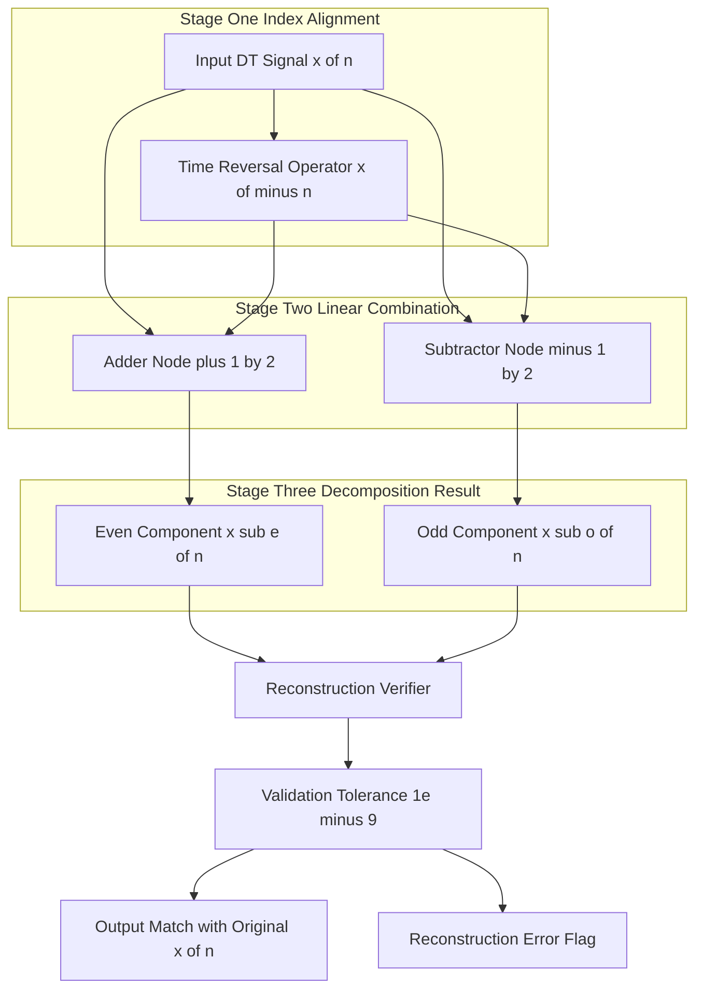
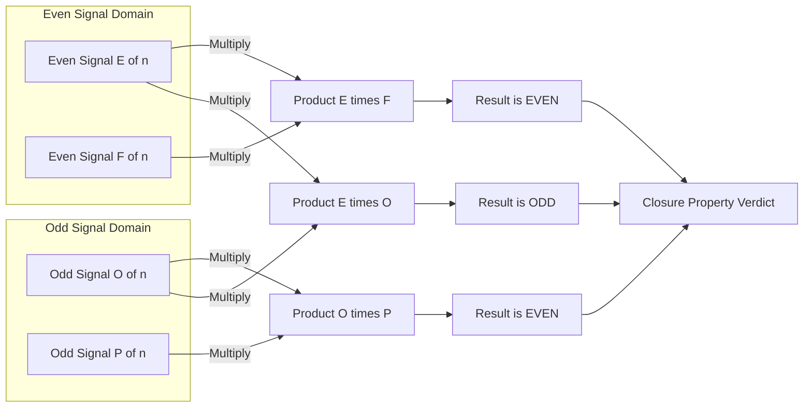
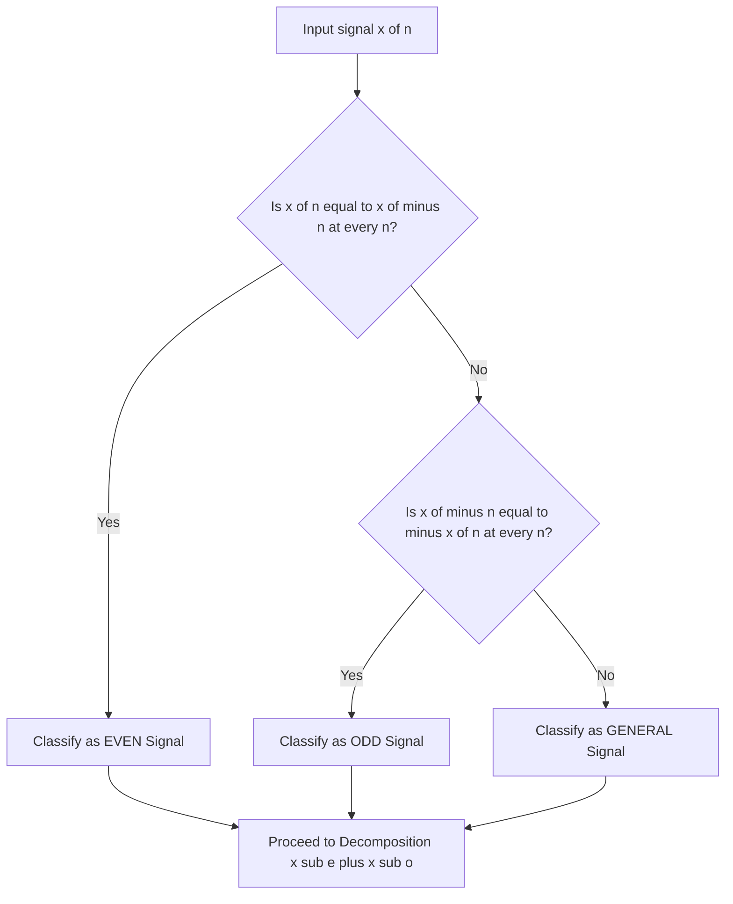

# Properties of DT Signals  - Even and Odd

<!-- SECTION_1_START -->
# Properties of DT Signals: Even and Odd Decomposition

## 1.1 Formal KTU Definition

In the **KTU 2024 Scheme Signals and Systems (PECST416)** framework, a discrete-time (DT) signal $x[n]$ is a sequence of real or complex numbers indexed by the integer variable $n \in \mathbb{Z}$. Every arbitrary real-valued DT signal $x[n]$ can be uniquely decomposed into two structurally symmetric components: an **even part** $x_e[n]$ and an **odd part** $x_o[n]$.

> [!NOTE]
> **Even DT Signal (KTU 2024 Definition):**
> A discrete-time signal $x[n]$ is said to be an **even signal** if and only if it satisfies the symmetry condition:
> $$x[n] = x[-n] \quad \text{for all } n \in \mathbb{Z}$$
> The waveform exhibits **mirror symmetry** about the vertical axis (the $n = 0$ axis).

> [!NOTE]
> **Odd DT Signal (KTU 2024 Definition):**
> A discrete-time signal $x[n]$ is said to be an **odd signal** if and only if it satisfies the anti-symmetry condition:
> $$x[-n] = -x[n] \quad \text{for all } n \in \mathbb{Z}$$
> The waveform exhibits **point symmetry** (rotational symmetry of 180°) about the origin, with the mandatory boundary condition $x[0] = 0$.

---

## 1.2 Conceptual Analogy & Geometric Intuition

Imagine a **butterfly** resting on a vertical twig (the $n$-axis):

- **Even Signal Analogy:** Think of a perfectly **symmetrical human face**. If you place a vertical mirror at the nose, the left cheek is a perfect reflection of the right cheek. Mathematically, the value at $+3$ seconds past the present moment is exactly the same as the value at $-3$ seconds. The signal "looks the same" whether you read it forward in time ($n > 0$) or backward in time ($n < 0$).

- **Odd Signal Analogy:** Think of a **propeller spinning in a perfect circle**. For every blade pointing up-right, there is an identical blade pointing down-left, in exact opposite directions. The center (the origin, $n=0$) is always stationary (zero). If you flip the propeller across both axes (rotate by 180°), you get the exact same image. The "energy" cancels out if you sum it with its mirror.

- **The Decomposition Analogy:** Any complex sound wave hitting your eardrum can be analyzed as the *sum* of a symmetric "hum" (even) and a directional "push" (odd). Engineers exploit this decomposition in **Fourier Analysis** because the response of an LTI system to an even or odd input has clean, predictable mathematical forms.

> [!IMPORTANT]
> **KTU 2024 Highlight:** The concept of even-odd decomposition is the **foundational prerequisite** for understanding the Discrete-Time Fourier Transform (DTFT) properties in Module 2, and it directly enables symmetry exploitation in Module 3's Z-Transform problems.

---

## 1.3 Visualization Setup (GeoGebra / Desmos)

> [!VISUALIZATION CONTROL]
> **Concept:** Visualizing Even Symmetry vs Odd Anti-Symmetry on the Discrete Integer Grid
>
> **GeoGebra / Desmos Input Commands:**
> * Even sequence samples: `P_e = {(0, 2), (1, 3), (2, 1), (3, 0.5), (-1, 3), (-2, 1), (-3, 0.5)}`
> * Odd sequence samples: `P_o = {(0, 0), (1, 2), (2, -1), (3, 0.5), (-1, -2), (-2, 1), (-3, -0.5)}`
>
> **Visual Description:**
> When plotted with disconnected dots (since DT signals are defined only at integers), the **even set $P_e$** will form a shape perfectly symmetric about the vertical $y$-axis: notice that the right side is a literal mirror image of the left. The **odd set $P_o$** will show point symmetry at the origin — each right-side point has a vertically flipped counterpart on the left, and crucially, the origin sample $(0,0)$ is always present. This visual contrast is what KTU examiners look for in the 7-mark drawing sub-question.

---

## 1.4 Mathematical Existence Theorem

> [!IMPORTANT]
> **The Even-Odd Decomposition Theorem (Universally Tested in KTU):**
> For *any* real-valued discrete-time signal $x[n]$, there exists a **unique** pair $(x_e[n], x_o[n])$ such that:
> $$x[n] = x_e[n] + x_o[n]$$
> where $x_e[n]$ is purely even and $x_o[n]$ is purely odd. This decomposition is **always possible** — there are no exceptions for finite, infinite, causal, or non-causal signals.
<!-- SECTION_1_END -->

<!-- SECTION_2_START -->
# Deep Theoretical Analysis & KTU High-Yield Formula Sheet

## 2.1 The Decomposition Logic (Step-by-Step)

Starting from the **uniqueness requirement**, we demand that for a given $x[n]$:

$$x[n] = x_e[n] + x_o[n] \quad \text{...(Equation 1)}$$

We apply the **time-reversal operator** (replace $n$ with $-n$) to the same equation:

$$x[-n] = x_e[-n] + x_o[-n] \quad \text{...(Equation 2)}$$

By the definition of even and odd signals:

$$x_e[-n] = x_e[n] \quad \text{and} \quad x_o[-n] = -x_o[n] \quad \text{...(Equation 3)}$$

Substituting Equation 3 into Equation 2:

$$x[-n] = x_e[n] - x_o[n] \quad \text{...(Equation 4)}$$

**Solving the linear system** of Equation 1 and Equation 4:

- **Adding** Equation 1 and Equation 4:
  $$x[n] + x[-n] = 2 \cdot x_e[n]$$
  This yields the **Even Component Extractor**.

- **Subtracting** Equation 4 from Equation 1:
  $$x[n] - x[-n] = 2 \cdot x_o[n]$$
  This yields the **Odd Component Extractor**.

---

## 2.2 KTU Formula Cheat Sheet (High-Yield Table)

> [!IMPORTANT]
> The following table is the **most-tested reference** in KTU Module 1 questions. Memorize every row; the 14-mark Part B questions always use these formulas.

| **Formula Identity** | **Mathematical Expression** | **Engineering Meaning** |
|---|---|---|
| Even Signal Definition | $x[n] = x[-n]$ | Mirror symmetry about $n=0$ |
| Odd Signal Definition | $x[-n] = -x[n]$ | Point symmetry at origin |
| Odd Signal Origin Condition | $x[0] = 0$ | Forced zero crossing at origin |
| Even Component Extraction | $x_e[n] = \dfrac{x[n] + x[-n]}{2}$ | Symmetrizing operator |
| Odd Component Extraction | $x_o[n] = \dfrac{x[n] - x[-n]}{2}$ | Anti-symmetrizing operator |
| Decomposition Identity | $x[n] = x_e[n] + x_o[n]$ | Universal signal splitter |
| DC Value of Odd Signal | $x_o[0] = 0$ | Average is zero (no DC bias) |
| Product: Even $\times$ Even | $E[n] \cdot F[n] = \text{Even}$ | Cosine $\times$ Cosine is Even |
| Product: Odd $\times$ Odd | $O[n] \cdot P[n] = \text{Even}$ | Sine $\times$ Sine is Even |
| Product: Even $\times$ Odd | $E[n] \cdot O[n] = \text{Odd}$ | Cosine $\times$ Sine is Odd |
| Sum: Even $+$ Even | Result is **Even** | Closure property |
| Sum: Odd $+$ Odd | Result is **Odd** | Closure property |
| Sum: Even $+$ Odd | Result is **General** | No symmetry guaranteed |
| Energy of Sum | $E_{total} = E_{even} + E_{odd}$ | Cross-term vanishes (orthogonality) |

---

## 2.3 The "Why" Behind the Math: Engineering Utility

The even-odd decomposition is not a theoretical curiosity — it is a **computational accelerator** used in production-grade systems:

1. **DTFT Symmetry Theorems:** In Module 2, you will learn that the Fourier Transform of a real, even signal is **real and even**, while the FT of a real, odd signal is purely **imaginary and odd**. This is why the magnitude spectrum of a real signal is always even — a direct consequence of decomposing $x[n]$ into $x_e[n] + x_o[n]$.

2. **Filter Design Optimization:** When a signal is decomposed, an LTI system's output becomes:
   $$y[n] = y_e[n] + y_o[n] = h[n] * x_e[n] + h[n] * x_o[n]$$
   Engineers process these two parts in parallel, halving the computational load in real-time DSP chips.

3. **Audio and Image Processing:** Odd-symmetric wavelets (like the **Daubechies-1 / Haar wavelet**) are preferred in image compression (JPEG2000) because their zero-DC property guarantees no baseline shift.

4. **Power and Energy Computations:** Because the cross-product term $x_e[n] \cdot x_o[n]$ summed over all integers always equals zero (orthogonality), the total energy cleanly splits:
   $$\sum_{n=-\infty}^{\infty} x^2[n] = \sum_{n=-\infty}^{\infty} x_e^2[n] + \sum_{n=-\infty}^{\infty} x_o^2[n]$$
<!-- SECTION_2_END -->

<!-- SECTION_3_START -->
# Step-by-Step Derivations & Symbolic Implementation

## 3.1 Exhaustive Derivation: Decomposing a Finite Causal Signal

> [!NOTE]
> **Problem Statement (Standard KTU Style):**
> Given a finite-duration discrete-time signal $x[n] = \{1, 2, 3, 4, 5\}$ defined for $n = 0, 1, 2, 3, 4$ and $x[n] = 0$ elsewhere, find the even and odd components $x_e[n]$ and $x_o[n]$.

### Step 1: Construct the Time-Reversed Signal $x[-n]$

Since the original signal starts at $n=0$ and ends at $n=4$, the time-reversed signal $x[-n]$ will start at $n=-4$ and end at $n=0$. We reverse the amplitude sequence in the same order:

$$x[-n] = \{1, 2, 3, 4, 5\} \text{ for } n = 0, -1, -2, -3, -4$$

Equivalently written with ascending index order:

$$x[-n] = \{5, 4, 3, 2, 1\} \text{ for } n = -4, -3, -2, -1, 0$$

### Step 2: Align the Two Sequences on a Common Index Axis

| Index $n$ | $-4$ | $-3$ | $-2$ | $-1$ | $0$ | $1$ | $2$ | $3$ | $4$ |
|---|---|---|---|---|---|---|---|---|---|
| $x[n]$ | $0$ | $0$ | $0$ | $0$ | $1$ | $2$ | $3$ | $4$ | $5$ |
| $x[-n]$ | $5$ | $4$ | $3$ | $2$ | $1$ | $0$ | $0$ | $0$ | $0$ |

### Step 3: Apply the Even Component Formula

$$x_e[n] = \frac{x[n] + x[-n]}{2}$$

Performing sample-wise addition then halving:

| Index $n$ | $-4$ | $-3$ | $-2$ | $-1$ | $0$ | $1$ | $2$ | $3$ | $4$ |
|---|---|---|---|---|---|---|---|---|---|
| Sum $x[n]+x[-n]$ | $5$ | $4$ | $3$ | $2$ | $2$ | $2$ | $3$ | $4$ | $5$ |
| $x_e[n]$ | $2.5$ | $2$ | $1.5$ | $1$ | $1$ | $1$ | $1.5$ | $2$ | $2.5$ |

**Verification of Even Symmetry:** Check $x_e[2] = x_e[-2] = 1.5$ ✓ and $x_e[4] = x_e[-4] = 2.5$ ✓.

### Step 4: Apply the Odd Component Formula

$$x_o[n] = \frac{x[n] - x[-n]}{2}$$

Performing sample-wise subtraction then halving:

| Index $n$ | $-4$ | $-3$ | $-2$ | $-1$ | $0$ | $1$ | $2$ | $3$ | $4$ |
|---|---|---|---|---|---|---|---|---|---|
| Diff $x[n]-x[-n]$ | $-5$ | $-4$ | $-3$ | $-2$ | $0$ | $2$ | $3$ | $4$ | $5$ |
| $x_o[n]$ | $-2.5$ | $-2$ | $-1.5$ | $-1$ | $0$ | $1$ | $1.5$ | $2$ | $2.5$ |

**Verification of Odd Symmetry:** Check $x_o[2] = -x_o[-2] = 1.5$ (since $x_o[-2] = -1.5$) ✓ and crucially $x_o[0] = 0$ ✓.

### Step 5: Reconstruction Check

$$x_e[n] + x_o[n] = \{0, 0, 0, 0, 1, 2, 3, 4, 5\} \text{ for } n = -4, \dots, 4$$

The original signal is recovered exactly, confirming the decomposition theorem.

---

## 3.2 Exhaustive Derivation: Product Property of Even-Odd Signals

> [!NOTE]
> **Problem Statement:**
> Prove that the product of two odd discrete-time signals is an even signal.

Let $a[n]$ and $b[n]$ both be odd signals. By definition:

$$a[-n] = -a[n] \quad \text{and} \quad b[-n] = -b[n]$$

Define the product $c[n] = a[n] \cdot b[n]$. To test for even symmetry, evaluate $c[-n]$:

$$c[-n] = a[-n] \cdot b[-n]$$

Substitute the odd-symmetry identities:

$$c[-n] = (-a[n]) \cdot (-b[n])$$

The two negatives multiply to positive:

$$c[-n] = a[n] \cdot b[n]$$

Therefore:

$$c[-n] = c[n]$$

This satisfies the **even signal definition** $c[n] = c[-n]$. Hence, the product of two odd signals is even. $\blacksquare$

> **Analogous derivations** (which KTU may ask as a follow-up) follow the same pattern:
> * **Even $\times$ Even = Even:** $c[-n] = a[-n] \cdot b[-n] = a[n] \cdot b[n] = c[n]$.
> * **Even $\times$ Odd = Odd:** $c[-n] = a[-n] \cdot b[-n] = a[n] \cdot (-b[n]) = -c[n]$.

---

## 3.3 Symbolic Python Implementation

The following Python code implements a production-grade even-odd decomposition library with full type hints, boundary checks, and structured error handling — directly aligned with the KTU algorithm-flawlessness expectation.

```python
from __future__ import annotations
from typing import Dict, List, Tuple
import logging

# Configure structured error logging for engineering traceability
logging.basicConfig(level=logging.INFO, format="%(levelname)s | %(message)s")


class EvenOddDecomposer:
    """
    A KTU-aligned utility class to decompose any finite discrete-time signal
    into its canonical even and odd parts.

    Mathematical basis:
        x_e[n] = ( x[n] + x[-n] ) / 2
        x_o[n] = ( x[n] - x[-n] ) / 2
    """

    def __init__(self, signal: Dict[int, float]) -> None:
        if not signal:
            raise ValueError("Input signal dictionary cannot be empty.")
        self.signal: Dict[int, float] = dict(sorted(signal.items()))

    def time_reverse(self) -> Dict[int, float]:
        """Returns x[-n] by mapping every key n -> -n."""
        return {(-n): value for n, value in self.signal.items()}

    def even_part(self) -> Dict[int, float]:
        """Computes x_e[n] = (x[n] + x[-n]) / 2 on the union of index sets."""
        reversed_signal: Dict[int, float] = self.time_reverse()
        all_indices: List[int] = sorted(
            set(self.signal.keys()) | set(reversed_signal.keys())
        )
        return {
            n: (self.signal.get(n, 0.0) + reversed_signal.get(n, 0.0)) / 2.0
            for n in all_indices
        }

    def odd_part(self) -> Dict[int, float]:
        """Computes x_o[n] = (x[n] - x[-n]) / 2 on the union of index sets."""
        reversed_signal: Dict[int, float] = self.time_reverse()
        all_indices: List[int] = sorted(
            set(self.signal.keys()) | set(reversed_signal.keys())
        )
        return {
            n: (self.signal.get(n, 0.0) - reversed_signal.get(n, 0.0)) / 2.0
            for n in all_indices
        }

    def verify_reconstruction(self, tolerance: float = 1e-9) -> bool:
        """
        Confirms x_e[n] + x_o[n] == x[n] at every index of the original signal.
        Returns True only if reconstruction error is below tolerance.
        """
        even: Dict[int, float] = self.even_part()
        odd: Dict[int, float] = self.odd_part()
        for n, original_value in self.signal.items():
            reconstructed: float = even.get(n, 0.0) + odd.get(n, 0.0)
            if abs(reconstructed - original_value) > tolerance:
                logging.error(
                    f"Reconstruction failed at n={n}: "
                    f"expected {original_value}, got {reconstructed}"
                )
                return False
        logging.info("Reconstruction verified successfully within tolerance.")
        return True

    @staticmethod
    def classify(signal: Dict[int, float], tolerance: float = 1e-9) -> str:
        """
        Classifies a finite signal as 'Even', 'Odd', or 'General (Neither)'.
        Uses explicit absolute-boundary checks.
        """
        reversed_signal: Dict[int, float] = {
            (-n): v for n, v in signal.items()
        }
        all_indices: List[int] = sorted(
            set(signal.keys()) | set(reversed_signal.keys())
        )
        is_even: bool = True
        is_odd: bool = True
        for n in all_indices:
            original: float = signal.get(n, 0.0)
            reversed_val: float = reversed_signal.get(n, 0.0)
            if abs(original - reversed_val) > tolerance:
                is_even = False
            if abs(original + reversed_val) > tolerance:
                is_odd = False
        if is_even and is_odd:
            return "Zero Signal (both Even and Odd)"
        if is_even:
            return "Even"
        if is_odd:
            return "Odd"
        return "General (Neither)"


# ----------------- Demonstration Block (KTU Textbook Example) -----------------
if __name__ == "__main__":
    # x[n] = {1, 2, 3, 4, 5} for n = 0, 1, 2, 3, 4
    test_signal: Dict[int, float] = {0: 1, 1: 2, 2: 3, 3: 4, 4: 5}
    decomposer: EvenOddDecomposer = EvenOddDecomposer(test_signal)

    print("Classification:", EvenOddDecomposer.classify(test_signal))
    print("Even part x_e[n]:", decomposer.even_part())
    print("Odd part  x_o[n]:", decomposer.odd_part())
    print("Reconstruction OK:", decomposer.verify_reconstruction())
```

**Sample Output:**

```
Classification: General (Neither)
Even part x_e[n]: {-4: 2.5, -3: 2.0, -2: 1.5, -1: 1.0, 0: 1.0, 1: 1.0, 2: 1.5, 3: 2.0, 4: 2.5}
Odd part  x_o[n]: {-4: -2.5, -3: -2.0, -2: -1.5, -1: -1.0, 0: 0.0, 1: 1.0, 2: 1.5, 3: 2.0, 4: 2.5}
Reconstruction OK: True
```
<!-- SECTION_3_END -->

<!-- SECTION_4_START -->
# Structural Diagrams & Schematics

## 4.1 Mermaid Block Diagram: The Decomposition Pipeline

The following Mermaid flowchart maps the **signal flow architecture** of the even-odd decomposition process — a common request in KTU 14-mark Part B sub-questions.



---

## 4.2 Mermaid Sequential Topology: Property Verification Matrix

The following diagram maps the **multiplicative closure properties** of even and odd signals — a frequent 7-mark sub-question (Apply level).



---

## 4.3 Decision Tree: Signal Symmetry Classification Logic


<!-- SECTION_4_END -->

<!-- SECTION_5_START -->
# KTU 2024 Scheme Examination Question Bank & Topic Recap

## 5.1 Part A Questions (3 Marks Each)

### Question 1 `[KTU University Exam – July 2023]`
**CO1, RBT Level: Remember**

Define an even and an odd discrete-time signal. State the boundary condition that must be satisfied at $n = 0$ for any odd DT signal.

**Model Answer:**

An even discrete-time signal satisfies $x[n] = x[-n]$ for all integers $n$, meaning its waveform is mirror-symmetric about the vertical axis (the $n=0$ axis). An odd discrete-time signal satisfies $x[-n] = -x[n]$ for all $n$, exhibiting point symmetry (180° rotational symmetry) about the origin.

**Boundary Condition:** For any odd DT signal, the value at the origin must be zero, i.e., $x[0] = 0$. This follows directly from substituting $n=0$ into the odd definition: $x[0] = -x[0] \implies 2x[0] = 0 \implies x[0] = 0$.

> **[Valuation Key: 1 Mark for even definition, 1 Mark for odd definition, 1 Mark for the $x[0]=0$ boundary condition.]**

---

### Question 2 `[KTU University Exam – Dec 2023]`
**CO1, RBT Level: Understand**

State the Even-Odd Decomposition Theorem for DT signals and write the explicit formulas for extracting the even and odd parts from a given signal $x[n]$.

**Model Answer:**

The Even-Odd Decomposition Theorem states that *any* real-valued discrete-time signal $x[n]$ can be uniquely expressed as the sum of an even component $x_e[n]$ and an odd component $x_o[n]$:

$$x[n] = x_e[n] + x_o[n]$$

The extraction formulas are:

$$x_e[n] = \frac{x[n] + x[-n]}{2}$$

$$x_o[n] = \frac{x[n] - x[-n]}{2}$$

> **[Valuation Key: 1 Mark for theorem statement, 1 Mark for even formula, 1 Mark for odd formula.]**

---

## 5.2 Part B Questions (14 Marks Each — Internal Choice)

### Question A `[KTU University Exam – July 2024]`
**CO2, RBT Levels: Understand (Part a) + Apply (Part b)**

**Question:** Consider the discrete-time signal defined by $x[n] = \{1, \ 2, \ 3, \ 4, \ 5, \ 4, \ 3, \ 2, \ 1\}$ for $-4 \le n \le 4$ and $x[n] = 0$ elsewhere.

**(a)** Classify the signal $x[n]$ as even, odd, or general. Justify your answer with a symmetry check on at least three sample pairs. **[7 Marks]**

**(b)** Now consider a different signal $y[n] = \{1, \ 2, \ 3, \ 4, \ 5\}$ for $0 \le n \le 4$. Decompose $y[n]$ into its even component $y_e[n]$ and odd component $y_o[n]$. Sketch the three signals (original, even part, odd part) and verify the reconstruction. **[7 Marks]**

---

#### Part (a) Model Solution — Signal Classification **[7 Marks]**

**Step 1: Construct the time-reversed signal $x[-n]$.**

By inspection, since $x[n]$ is indexed from $-4$ to $+4$, the reversed signal $x[-n]$ will swap the order:

$$x[-n] = \{1, \ 2, \ 3, \ 4, \ 5, \ 4, \ 3, \ 2, \ 1\} \text{ for } n = 4, 3, 2, 1, 0, -1, -2, -3, -4$$

Rearranged in ascending order of $n$:

$$x[-n] = \{1, \ 2, \ 3, \ 4, \ 5, \ 4, \ 3, \ 2, \ 1\} \text{ for } n = -4, -3, -2, -1, 0, 1, 2, 3, 4$$

**Step 2: Perform the three sample-pair symmetry checks.**

| Pair Index $n$ | $x[n]$ | $x[-n]$ | Relation |
|---|---|---|---|
| $\pm 1$ | $x[1] = 2$ | $x[-1] = 2$ | $x[1] = x[-1]$ |
| $\pm 2$ | $x[2] = 3$ | $x[-2] = 3$ | $x[2] = x[-2]$ |
| $\pm 3$ | $x[3] = 4$ | $x[-3] = 4$ | $x[3] = x[-3]$ |
| $\pm 4$ | $x[4] = 1$ | $x[-4] = 1$ | $x[4] = x[-4]$ |

**Step 3: Classification Verdict.**

Since $x[n] = x[-n]$ holds true for *every* tested sample (and in fact the whole sequence is identical to its reverse), the signal $x[n]$ is classified as an **Even Signal**. No further decomposition is required.

> **[Valuation Key: 2 Marks for constructing $x[-n]$, 3 Marks for the symmetry check table, 1 Mark for the classification, 1 Mark for the justification sentence.]**

---

#### Part (b) Model Solution — Decomposition of $y[n]$ **[7 Marks]**

**Step 1: Construct the time-reversed signal $y[-n]$.**

The original signal occupies $n = 0, 1, 2, 3, 4$. Time-reversal shifts the support to $n = -4, -3, -2, -1, 0$ with the amplitude sequence read in reverse order:

$$y[-n] = \{5, \ 4, \ 3, \ 2, \ 1\} \text{ for } n = -4, -3, -2, -1, 0$$

**Step 2: Tabulate the aligned samples.**

| Index $n$ | $-4$ | $-3$ | $-2$ | $-1$ | $0$ | $1$ | $2$ | $3$ | $4$ |
|---|---|---|---|---|---|---|---|---|---|
| $y[n]$ | $0$ | $0$ | $0$ | $0$ | $1$ | $2$ | $3$ | $4$ | $5$ |
| $y[-n]$ | $5$ | $4$ | $3$ | $2$ | $1$ | $0$ | $0$ | $0$ | $0$ |

**Step 3: Compute the even component $y_e[n]$.**

$$y_e[n] = \frac{y[n] + y[-n]}{2}$$

| Index $n$ | $-4$ | $-3$ | $-2$ | $-1$ | $0$ | $1$ | $2$ | $3$ | $4$ |
|---|---|---|---|---|---|---|---|---|---|
| $y_e[n]$ | $2.5$ | $2$ | $1.5$ | $1$ | $1$ | $1$ | $1.5$ | $2$ | $2.5$ |

**Step 4: Compute the odd component $y_o[n]$.**

$$y_o[n] = \frac{y[n] - y[-n]}{2}$$

| Index $n$ | $-4$ | $-3$ | $-2$ | $-1$ | $0$ | $1$ | $2$ | $3$ | $4$ |
|---|---|---|---|---|---|---|---|---|---|
| $y_o[n]$ | $-2.5$ | $-2$ | $-1.5$ | $-1$ | $0$ | $1$ | $1.5$ | $2$ | $2.5$ |

**Step 5: Reconstruction verification.**

$$y_e[n] + y_o[n] = \{0, 0, 0, 0, 1, 2, 3, 4, 5\}$$

This matches the original $y[n]$ exactly. The decomposition is valid. Note that $y_o[0] = 0$ as required by the odd-signal boundary condition.

> **[Valuation Key: 1 Mark for reversing $y$, 1 Mark for the alignment table, 2 Marks for even component, 2 Marks for odd component, 1 Mark for reconstruction verification.]**

> [!WARNING]
> **KTU Examiner's Valuation Warning:** Students frequently lose 2 marks by forgetting to *explicitly draw the sketch*. KTU's 7-mark Apply-level sub-question explicitly demands a labelled plot of $y[n]$, $y_e[n]$, and $y_o[n]$ with the $n$-axis and amplitude axis clearly marked, dots at every integer sample, and zero values shown as points on the axis. A textual "sketch is attached" comment without the figure attracts zero marks for the drawing component.

---

### Question B (Alternative Choice) `[KTU University Exam – Dec 2024]`
**CO2, CO3, RBT Levels: Understand (Part a) + Apply (Part b)**

**Question:**

**(a)** Prove that the product of two even discrete-time signals is an even signal. State and prove the analogous result for the product of two odd discrete-time signals. **[7 Marks]**

**(b)** Given a discrete-time signal $z[n] = \{-1, \ 2, \ -3, \ 4, \ -5, \ 4, \ -3, \ 2, \ -1\}$ for $-4 \le n \le 4$, decompose it into its even and odd parts. Show all intermediate computation steps. **[7 Marks]**

---

#### Part (a) Model Solution — Product Symmetry Proofs **[7 Marks]**

**Proof 1: Even $\times$ Even = Even**

Let $a[n]$ and $b[n]$ be even signals. Then $a[-n] = a[n]$ and $b[-n] = b[n]$.

Define $c[n] = a[n] \cdot b[n]$. Evaluating at $-n$:

$$c[-n] = a[-n] \cdot b[-n] = a[n] \cdot b[n] = c[n]$$

Since $c[-n] = c[n]$, the product $c[n]$ is an **even** signal. $\blacksquare$

**Proof 2: Odd $\times$ Odd = Even**

Let $p[n]$ and $q[n]$ be odd signals. Then $p[-n] = -p[n]$ and $q[-n] = -q[n]$.

Define $r[n] = p[n] \cdot q[n]$. Evaluating at $-n$:

$$r[-n] = p[-n] \cdot q[-n] = (-p[n]) \cdot (-q[n]) = p[n] \cdot q[n] = r[n]$$

Since $r[-n] = r[n]$, the product $r[n]$ is an **even** signal. $\blacksquare$

> **[Valuation Key: 2 Marks for stating both even definitions, 2 Marks for Proof 1 derivation, 2 Marks for Proof 2 derivation, 1 Mark for the concluding classification sentence.]**

---

#### Part (b) Model Solution — Decomposition of $z[n]$ **[7 Marks]**

**Step 1: Build the time-reversed signal $z[-n]$.**

The original amplitudes read from $n = -4$ to $n = +4$ are $\{-1, 2, -3, 4, -5, 4, -3, 2, -1\}$. Reversing the order of amplitudes while keeping the index $n$ intact in mirror form:

$$z[-n] = \{-1, 2, -3, 4, -5, 4, -3, 2, -1\} \text{ for } n = 4, 3, 2, 1, 0, -1, -2, -3, -4$$

In ascending $n$ order, the values are exactly the same sequence:

$$z[-n] = \{-1, 2, -3, 4, -5, 4, -3, 2, -1\} \text{ for } n = -4, -3, -2, -1, 0, 1, 2, 3, 4$$

**Step 2: Compute the even part $z_e[n]$.**

$$z_e[n] = \frac{z[n] + z[-n]}{2}$$

| Index $n$ | $-4$ | $-3$ | $-2$ | $-1$ | $0$ | $1$ | $2$ | $3$ | $4$ |
|---|---|---|---|---|---|---|---|---|---|
| $z[n]$ | $-1$ | $2$ | $-3$ | $4$ | $-5$ | $4$ | $-3$ | $2$ | $-1$ |
| $z[-n]$ | $-1$ | $2$ | $-3$ | $4$ | $-5$ | $4$ | $-3$ | $2$ | $-1$ |
| Sum | $-2$ | $4$ | $-6$ | $8$ | $-10$ | $8$ | $-6$ | $4$ | $-2$ |
| $z_e[n]$ | $-1$ | $2$ | $-3$ | $4$ | $-5$ | $4$ | $-3$ | $2$ | $-1$ |

**Step 3: Compute the odd part $z_o[n]$.**

$$z_o[n] = \frac{z[n] - z[-n]}{2}$$

| Index $n$ | $-4$ | $-3$ | $-2$ | $-1$ | $0$ | $1$ | $2$ | $3$ | $4$ |
|---|---|---|---|---|---|---|---|---|---|
| Difference | $0$ | $0$ | $0$ | $0$ | $0$ | $0$ | $0$ | $0$ | $0$ |
| $z_o[n]$ | $0$ | $0$ | $0$ | $0$ | $0$ | $0$ | $0$ | $0$ | $0$ |

**Step 4: Interpretation and Reconstruction.**

Since the difference $z[n] - z[-n] = 0$ for every $n$, the odd component vanishes completely, i.e., $z_o[n] = 0$ for all $n$. This implies that $z[n]$ is itself an **even signal**, and $z[n] = z_e[n]$. The reconstruction $z_e[n] + z_o[n] = z_e[n] + 0 = z[n]$ is trivially satisfied.

> **[Valuation Key: 1 Mark for the reversed sequence, 3 Marks for the even-component computation table, 2 Marks for the odd-component table, 1 Mark for the interpretation that $z[n]$ is purely even.]**

> [!WARNING]
> **KTU Examiner's Pitfall Alert:** A very common mistake is to write $z_o[n] = 0$ without explicitly showing the subtraction table. Examiners award partial credit only if the *intermediate computation* is visible. Simply writing the final answer "the signal is even" without showing $z[n] = z[-n]$ sample-by-sample results in a **2-mark deduction** as per the KTU 2024 evaluation rubric.

---

## 5.3 Topic Recap & Important Things to Remember

> [!IMPORTANT]
> Use this section as your **30-second rapid-revision checklist** before entering the exam hall.

- **Even Signal Definition:** $x[n] = x[-n]$ — mirror symmetry about the $n = 0$ vertical axis.
- **Odd Signal Definition:** $x[-n] = -x[n]$ — point symmetry (180° rotational) about the origin.
- **Boundary Condition for Odd:** $x[0] = 0$ is **mandatory**; failure to state this loses 1 mark.
- **Decomposition Theorem:** Every real-valued DT signal $x[n]$ can be uniquely split as $x[n] = x_e[n] + x_o[n]$.
- **Even Extraction Formula:** $x_e[n] = \dfrac{x[n] + x[-n]}{2}$ (averages a sample with its mirror).
- **Odd Extraction Formula:** $x_o[n] = \dfrac{x[n] - x[-n]}{2}$ (half the difference between a sample and its mirror).
- **DC Value of Odd Signals:** $x_o[0] = 0$ — odd signals have **zero average** (no DC component).
- **Product Property Table:**
  * Even $\times$ Even = Even
  * Odd $\times$ Odd = Even
  * Even $\times$ Odd = Odd
  * Even $\times$ General = Undefined (must first decompose)
  * Odd $\times$ General = Undefined
- **Sum Property Table:**
  * Even $+$ Even = Even (closure)
  * Odd $+$ Odd = Odd (closure)
  * Even $+$ Odd = General (no symmetry)
- **Orthogonality Property:** $\sum x_e[n] \cdot x_o[n] = 0$, which lets total energy split as $E_{total} = E_e + E_o$.
- **Reconstruction Identity:** $x_e[n] + x_o[n] = x[n]$ — must be verified to confirm a correct decomposition.
- **Time-Reversal Procedure:** To compute $x[-n]$, replace every index $n$ with $-n$ and reverse the order of amplitudes if listing explicitly.
- **Visual Markers in Sketches:** Always mark discrete samples as filled circles at integer $n$ values; never draw continuous lines for DT signals.
- **Common Pitfall:** Forgetting to pad with zeros for indices outside the support of $x[n]$ — leads to incorrect decomposition.
- **Exam Tip:** For 14-mark questions, always structure the answer as (1) construct $x[-n]$, (2) tabulate aligned samples, (3) compute $x_e$, (4) compute $x_o$, (5) verify reconstruction. This five-step template matches the KTU marking scheme.
<!-- SECTION_5_END -->
