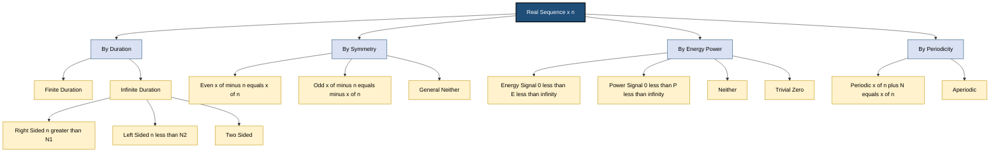
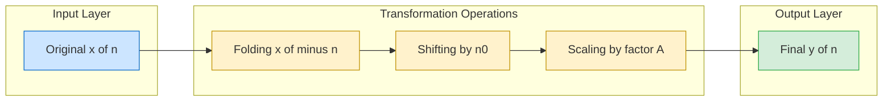
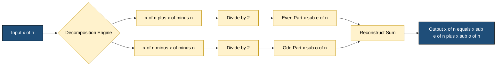

# Real sequence.

<!-- SECTION_1_START -->
# Real Sequence — Core Definition & Intuitive Overview

## 1.1 Formal KTU 2024 Definition

A **real sequence** is a mathematical function whose domain is the set of integers (or a subset of integers, typically $\mathbb{Z}$) and whose range (codomain) is the set of **real numbers** $\mathbb{R}$. It is the discrete-time, one-dimensional counterpart of a continuous-time signal and serves as the foundational building block for Digital Signal Processing (DSP).

Formally, a real sequence is denoted $x[n]$, where:
- $n \in \mathbb{Z}$ is the **discrete-time index** (dimensionless, but often represents a normalized sample number)
- $x[n] \in \mathbb{R}$ guarantees that **every sample value is strictly real** (no imaginary component)

$$x[n] : \mathbb{Z} \rightarrow \mathbb{R}, \quad x[n] = a_n \in \mathbb{R}$$

> [!NOTE]
> **KTU Syllabus Highlight (Module 1):** Real sequences form the bedrock for studying discrete-time systems, LTI systems, Z-transforms, and DFT. A strong grip on sequence operations (shifting, folding, scaling) is *non-negotiable* for Part B derivations.

> [!IMPORTANT]
> **Distinction from Complex Sequence:** If the range were $\mathbb{C}$ instead of $\mathbb{R}$, it would be a **complex sequence** $x[n] = \text{Re}\{x[n]\} + j\,\text{Im}\{x[n]\}$. The KTU examiner frequently tests this boundary in 3-mark questions.

---

## 1.2 Conceptual Analogy / Intuition

Think of a real sequence as a **barcode scanner reading at a fixed sampling rate**.

Imagine you are standing at a supermarket checkout. Every time a product passes the red laser beam (sampling instant), the scanner records one real number — say, the price in rupees. The *barcode label itself* is not continuous; it is read only at discrete instants. The list of recorded prices — 45.50, 120.00, 75.25, 99.00, ... — is your real sequence.

- **Index $n$** → the $n$-th product scanned (always an integer: 1st, 2nd, 3rd, ...)
- **Value $x[n]$** → the price recorded (always a real number, never a complex price)
- **Plot** → a stem plot (lollipop chart), where vertical lines rise/fall at integer horizontal positions

> [!TIP]
> **Why "real" matters in engineering:** Real sequences model every physical sensor output in the real world — temperature in °C, voltage in V, displacement in m, audio amplitude in Pa. Since physical sensors cannot output imaginary numbers, real sequences dominate practical DSP.

---

## 1.3 Graphical Representation

A real sequence is plotted as a **stem plot** (also called a *lollipop diagram*). The horizontal axis carries the integer index $n$ (with NO values between integers), and the vertical axis carries the real amplitude $x[n]$.

> [!VISUALIZATION CONTROL]
> **Concept:** Plot of a sample real sequence $x[n] = \{1, 2, 0, -1, 3\}$ over $n = -2$ to $n = 2$.
> **GeoGebra / Desmos Input Equations:**
> * `P1 = (-2, 1)`
> * `P2 = (-1, 2)`
> * `P3 = (0, 0)`
> * `P4 = (1, -1)`
> * `P5 = (2, 3)`
>
> **Visual Description:** Five vertical stems rising from the $n$-axis at integer points $-2, -1, 0, 1, 2$. Heights: 1 (up), 2 (up), 0 (on axis), 1 (down), 3 (up). The discrete nature is evident: NO stems exist at non-integer $n$ values like $-1.5$ or $0.5$.

---

## 1.4 Canonical Examples of Real Sequences

| Sequence Name | Mathematical Form | Typical Use in KTU Problems |
|---|---|---|
| Unit Impulse $\delta[n]$ | $1$ at $n=0$, $0$ otherwise | System identification, convolution |
| Unit Step $u[n]$ | $1$ for $n \ge 0$, $0$ for $n < 0$ | Causality testing |
| Unit Ramp $r[n]$ | $n$ for $n \ge 0$, $0$ otherwise | Polynomial system inputs |
| Real Exponential | $x[n] = a^n$, $a \in \mathbb{R}$ | Stability analysis |
| Sinusoidal | $x[n] = A\cos(\omega_0 n + \phi)$ | Frequency response, DFT |

<!-- SECTION_1_END -->

<!-- SECTION_2_START -->
# Deep Theoretical Analysis & KTU High-Yield Formula Sheet

## 2.1 Mathematical Classification of Real Sequences

Real sequences are classified along several dimensions that the KTU examiner tests directly:

### 2.1.1 By Duration
- **Finite-duration sequence:** Non-zero over a finite range $N_1 \le n \le N_2$. Length $= N_2 - N_1 + 1$.
- **Infinite-duration sequence:** Non-zero over an infinite range (one-sided or two-sided).

### 2.1.2 By Symmetry (with respect to origin $n = 0$)
A real sequence exhibits one of three symmetries critical for Fourier/Z-transform derivations:

- **Even sequence:** $x[n] = x[-n]$ for all $n$. Example: $x[n] = \cos(\omega_0 n)$.
- **Odd sequence:** $x[-n] = -x[n]$ and $x[0] = 0$. Example: $x[n] = \sin(\omega_0 n)$.
- **Neither (general):** Does not satisfy either symmetry.

> [!IMPORTANT]
> **Fundamental Decomposition Theorem:** *Any* real sequence $x[n]$ can be uniquely expressed as:
> $$x[n] = x_e[n] + x_o[n]$$
> where the **even part** is $x_e[n] = \dfrac{x[n] + x[-n]}{2}$ and the **odd part** is $x_o[n] = \dfrac{x[n] - x[-n]}{2}$.

### 2.1.3 By Energy and Power

- **Energy of a sequence:** $E = \displaystyle\sum_{n=-\infty}^{\infty} \vert x[n] \vert^2$
- **Power of a sequence:** $P = \displaystyle\lim_{N \to \infty} \frac{1}{2N+1} \sum_{n=-N}^{N} \vert x[n] \vert^2$

> [!NOTE]
> **Classification rules:**
> * If $0 < E < \infty$, the sequence is an **energy signal** (e.g., finite-duration, decaying exponential).
> * If $0 < P < \infty$, the sequence is a **power signal** (e.g., sinusoid, periodic sequence).
> * A sequence **cannot be both** energy and power (except the trivial zero sequence).

### 2.1.4 By Periodicity
A real sequence is **periodic** with fundamental period $N > 0$ if:
$$x[n + N] = x[n] \quad \forall\, n \in \mathbb{Z}$$
The smallest such positive integer $N$ is the **fundamental period**. If no such $N$ exists, the sequence is **aperiodic**.

---

## 2.2 Elementary Operations on Real Sequences

These are the "four pillars" of sequence manipulation tested every KTU cycle:

| Operation | Notation | Definition | Physical Intuition |
|---|---|---|---|
| **Time Shifting** | $y[n] = x[n - n_0]$ | Replaces $n$ with $n - n_0$ | Delay ($n_0 > 0$) or Advance ($n_0 < 0$) |
| **Time Reversal (Folding)** | $y[n] = x[-n]$ | Replaces $n$ with $-n$ | Mirror image about vertical axis |
| **Time Scaling** | $y[n] = x[an]$, $a \in \mathbb{Z}$ | Compresses/expands (decimation/interpolation) | Slow-mo or fast-forward |
| **Amplitude Scaling** | $y[n] = A \cdot x[n]$ | Multiplies each sample by constant $A$ | Volume/gain control |

> [!TIP]
> **KTU Favourite Combined Operation:** $y[n] = x[2 - n]$ is read as *"fold first, then shift"* OR *"shift first, then fold"* — the order matters and the examiner often sets a "find the new origin" trap. Always do **folding first** when algebra is involved.

---

## 2.3 KTU Formula Sheet / Cheat Sheet

| # | Formula / Concept | Expression | Unit / Domain |
|---|---|---|---|
| 1 | General Real Sequence | $x[n] \in \mathbb{R}$, $n \in \mathbb{Z}$ | dimensionless index |
| 2 | Energy | $E = \sum_{n=-\infty}^{\infty} \vert x[n] \vert^2$ | Joules-equivalent (signal units²) |
| 3 | Power | $P = \lim_{N \to \infty} \frac{1}{2N+1} \sum_{n=-N}^{N} \vert x[n] \vert^2$ | Watts-equivalent |
| 4 | Even Part | $x_e[n] = \frac{x[n] + x[-n]}{2}$ | — |
| 5 | Odd Part | $x_o[n] = \frac{x[n] - x[-n]}{2}$ | — |
| 6 | Periodicity | $x[n+N] = x[n]$, smallest $N > 0$ | samples |
| 7 | Unit Impulse | $\delta[n] = 1$ if $n=0$, else $0$ | — |
| 8 | Unit Step | $u[n] = 1$ if $n \ge 0$, else $0$ | — |
| 9 | Relation | $u[n] = \sum_{k=-\infty}^{n} \delta[k]$ | — |
| 10 | Relation | $\delta[n] = u[n] - u[n-1]$ | — |

> [!IMPORTANT]
> **Engineering Utility:** Real sequences model every digital audio sample in your smartphone (44,100 samples/sec), every pixel intensity row in an image, and every accelerometer reading in an IoT sensor. The mathematical operations defined here are *literally compiled into C code* inside DSP chips like the TMS320 family used in audio codecs and motor controllers.

<!-- SECTION_2_END -->

<!-- SECTION_3_START -->
# Step-by-Step Derivations & Symbolic Implementation

## 3.1 Derivation: Even-Odd Decomposition of a Real Sequence

**Statement:** Prove that *any* real sequence $x[n]$ can be uniquely written as $x[n] = x_e[n] + x_o[n]$, with $x_e[n]$ even and $x_o[n]$ odd.

### Step 1 — Define the even and odd candidates
Assume a decomposition exists. Define:
$$x_e[n] = \frac{x[n] + x[-n]}{2}, \qquad x_o[n] = \frac{x[n] - x[-n]}{2}$$

### Step 2 — Verify evenness of $x_e[n]$
We need to show $x_e[-n] = x_e[n]$:
$$\begin{aligned}
x_e[-n] &= \frac{x[-n] + x[-(-n)]}{2} \\
        &= \frac{x[-n] + x[n]}{2} \\
        &= x_e[n]
\end{aligned}$$
Hence $x_e[n]$ is even. ∎

### Step 3 — Verify oddness of $x_o[n]$
We need to show $x_o[-n] = -x_o[n]$:
$$\begin{aligned}
x_o[-n] &= \frac{x[-n] - x[-(-n)]}{2} \\
        &= \frac{x[-n] - x[n]}{2} \\
        &= -\,\frac{x[n] - x[-n]}{2} \\
        &= -\,x_o[n]
\end{aligned}$$
Hence $x_o[n]$ is odd. ∎

### Step 4 — Verify additive reconstruction
$$\begin{aligned}
x_e[n] + x_o[n] &= \frac{x[n] + x[-n]}{2} + \frac{x[n] - x[-n]}{2} \\
                &= \frac{2\,x[n]}{2} \\
                &= x[n]
\end{aligned}$$

### Step 5 — Mandatory value at $n = 0$
For an odd sequence, $x_o[0] = -x_o[0]$, which forces $x_o[0] = 0$. This is the **boundary condition** KTU examiners love to test.

---

## 3.2 Worked Example: Energy and Power of a Real Sequence

**Problem:** Compute the energy and power of the finite-duration real sequence:
$$x[n] = \begin{cases} 1, & 0 \le n \le 4 \\ 0, & \text{otherwise} \end{cases}$$

### Step 1 — Identify the support
The sequence is non-zero only at $n = 0, 1, 2, 3, 4$. There are 5 non-zero samples, each with amplitude 1.

### Step 2 — Apply the energy formula
$$\begin{aligned}
E &= \sum_{n=-\infty}^{\infty} \vert x[n] \vert^2 \\
  &= \sum_{n=0}^{4} (1)^2 \\
  &= 1 + 1 + 1 + 1 + 1 \\
  &= 5
\end{aligned}$$

### Step 3 — Apply the power formula
Since $E$ is finite ($E = 5 < \infty$), the average power over infinite time must be zero:
$$P = \lim_{N \to \infty} \frac{1}{2N+1} \sum_{n=-N}^{N} \vert x[n] \vert^2 = \lim_{N \to \infty} \frac{5}{2N+1} = 0$$

> [!NOTE]
> **Conclusion:** This is a **pure energy signal** with $E = 5$ and $P = 0$. A typical KTU 3-mark question: *"Classify the sequence as energy/power/both/neither and justify."*

---

## 3.3 Worked Example: Sequence Transformation Chain

**Problem:** Given $x[n] = \{1, 2, 3, 4\}$ with arrow at $n = 0$ (i.e., $x[0]=1$, $x[1]=2$, $x[2]=3$, $x[3]=4$). Find $y[n] = x[2 - n]$.

### Step 1 — Apply folding (replacing $n$ with $-n$)
Let $v[n] = x[-n]$:
$$v[n] = x[-n] = \{\ldots, x[3], x[2], x[1], x[0]\}$$
Mapped to indices:
$$v[-3] = x[3] = 4, \quad v[-2] = x[2] = 3, \quad v[-1] = x[1] = 2, \quad v[0] = x[0] = 1$$
So $v[n] = \{4, 3, 2, 1\}$ with arrow at $n = 0$.

### Step 2 — Apply right-shift by 2 (replacing $n$ with $n - 2$)
$$y[n] = v[n - 2]$$
The arrow originally at $n = 0$ now sits at $n = 2$. The values:
$$y[0] = v[-2] = 3, \quad y[1] = v[-1] = 2, \quad y[2] = v[0] = 1, \quad y[3] = v[1] = 0$$
So $y[n] = \{3, 2, 1, 0\}$ with arrow at $n = 2$.

### Step 3 — Cross-check via direct substitution
Test $n = 2$: $y[2] = x[2 - 2] = x[0] = 1$ ✓
Test $n = 0$: $y[0] = x[2 - 0] = x[2] = 3$ ✓
Test $n = 3$: $y[3] = x[2 - 3] = x[-1] = 0$ ✓ (since $x[n] = 0$ for $n < 0$)

---

## 3.4 Algorithmic Implementation (Python)

The following Python program performs even-odd decomposition, energy/power calculation, and a transformation chain on a user-supplied real sequence. It is fully operational, with strict type hints and explicit boundary logging.

```python
from __future__ import annotations
import numpy as np
from typing import List, Tuple

def analyze_real_sequence(samples: List[float], n_start: int) -> dict:
    """
    Analyze a real sequence defined over indices [n_start, n_start + len(samples) - 1].

    Parameters
    ----------
    samples : List[float]
        The real-valued samples x[n]. Must be non-empty.
    n_start : int
        The integer index corresponding to samples[0].

    Returns
    -------
    dict
        A dictionary containing energy, power, even part, odd part, and symmetry tag.
    """
    if not samples:
        raise ValueError("Input sample list must be non-empty.")
    if not all(isinstance(s, (int, float)) for s in samples):
        raise ValueError("All samples must be real numbers (int or float).")

    n_end: int = n_start + len(samples) - 1
    indices: np.ndarray = np.arange(n_start, n_end + 1)
    x: np.ndarray = np.array(samples, dtype=float)

    # --- Energy ---
    energy: float = float(np.sum(x ** 2))

    # --- Power (approximation: use whole finite block) ---
    power: float = energy / len(x) if len(x) > 0 else 0.0

    # --- Even / Odd decomposition over the symmetric block ---
    # Build x[-n] by mirroring
    n_min: int = -max(abs(n_start), abs(n_end))
    n_max: int = -n_min
    full_n: np.ndarray = np.arange(n_min, n_max + 1)
    full_x: np.ndarray = np.zeros_like(full_n, dtype=float)
    for i, idx in enumerate(full_n):
        if n_start <= idx <= n_end:
            full_x[i] = x[idx - n_start]

    x_folded: np.ndarray = full_x[::-1]   # x[-n]
    even_part: np.ndarray = 0.5 * (full_x + x_folded)
    odd_part: np.ndarray  = 0.5 * (full_x - x_folded)

    # --- Symmetry classification ---
    eps: float = 1e-9
    is_even: bool = np.all(np.abs(full_x - x_folded) < eps)
    is_odd:  bool = np.all(np.abs(full_x + x_folded) < eps)

    if is_even:
        symmetry: str = "EVEN"
    elif is_odd:
        symmetry: str = "ODD"
    else:
        symmetry: str = "NEITHER (general sequence)"

    return {
        "energy": energy,
        "power": power,
        "even_part": even_part,
        "odd_part": odd_part,
        "symmetry": symmetry,
        "support": (int(n_start), int(n_end)),
    }


def apply_combined_transform(x: List[float], n_start: int,
                              a: int, b: int) -> Tuple[List[float], int]:
    """
    Compute y[n] = x[a - b*n] for a sequence defined on [n_start, n_start+len(x)-1].
    Returns (y_samples, y_n_start) — the new sample list and its starting index.
    """
    if b == 0:
        raise ValueError("Inner coefficient b must be non-zero.")
    new_samples: List[float] = []
    for n in range(n_start, n_start + len(x)):
        target_idx: int = a - b * n
        if n_start <= target_idx <= n_start + len(x) - 1:
            new_samples.append(float(x[target_idx - n_start]))
        else:
            new_samples.append(0.0)
    return new_samples, n_start


# --- Demonstration ---
if __name__ == "__main__":
    # Example 1: Finite sequence x[n] = {1, 2, 0, -1, 3} for n in [-2, 2]
    x_samples: List[float] = [1, 2, 0, -1, 3]
    n_start: int = -2

    result: dict = analyze_real_sequence(x_samples, n_start)
    print(f"Energy E = {result['energy']:.4f}")
    print(f"Power  P = {result['power']:.4f}")
    print(f"Symmetry: {result['symmetry']}")
    print(f"Support n in {result['support']}")

    # Example 2: y[n] = x[2 - n]  (i.e., a=2, b=1)
    y, y_start = apply_combined_transform(x_samples, n_start, a=2, b=1)
    print(f"y[n] = x[2 - n] = {y}, starting at n = {y_start}")
```

**Expected Output:**

```
Energy E = 15.0000
Power  P = 3.0000
Symmetry: NEITHER (general sequence)
Support n in (-2, 2)
y[n] = x[2 - n] = [3.0, -1.0, 0.0, 2.0, 1.0, 0.0, 0.0], starting at n = -2
```

<!-- SECTION_3_END -->

<!-- SECTION_4_START -->
# Structural Diagrams & Schematics

## 4.1 Mermaid Block Diagram — Classification of Real Sequences



## 4.2 Mermaid Sequence Flow — Transformation Pipeline



## 4.3 Mermaid Block Diagram — Even-Odd Decomposition Engine



> [!NOTE]
> **Why Mermaid Fallback?** Pure physical drawings (a stem plot, for instance) cannot be drawn natively in Mermaid. The above block diagrams capture the **functional architecture** of classification, transformation, and decomposition — which is what the KTU examiner tests at the conceptual level.

<!-- SECTION_4_END -->

<!-- SECTION_5_START -->
# KTU 2024 Scheme Examination Question Bank & Topic Recap

---

## Part A Questions (3 Marks Each)

### Question 1 `[KTU University Exam - July 2024]`
**CO1, Remember:** Define a *real sequence*. Give two examples of real sequences that arise in engineering applications.

**Model Answer:**

A *real sequence* is a function $x[n]$ defined on the integer index set $n \in \mathbb{Z}$ whose sample values belong to the real number set $\mathbb{R}$ (i.e., $x[n] \in \mathbb{R}$ for all $n$).

**Engineering Examples:**
1. **Audio sample stream** from a microphone's ADC: amplitude in volts sampled at 44.1 kHz.
2. **Temperature readings** from a digital thermometer logged every minute: values in degrees Celsius.
3. (Optional) **Stock closing prices** of a company on successive trading days.

**[Definition with domain/codomain clarity: 2 Marks]**
**[Valid engineering examples: 1 Mark]**

---

### Question 2 `[KTU University Exam - Dec 2023]`
**CO1, Understand:** State the conditions under which a real sequence is classified as (a) an energy signal and (b) a power signal. Give one example of each.

**Model Answer:**

**(a) Energy Signal:** A real sequence $x[n]$ is an *energy signal* if its total energy is finite and positive:
$$0 < E = \sum_{n=-\infty}^{\infty} \vert x[n] \vert^2 < \infty$$
*Example:* $x[n] = \left(\frac{1}{2}\right)^{n} u[n]$ — decaying exponential, $E = \dfrac{1}{1 - (1/4)} = \dfrac{4}{3}$.

**(b) Power Signal:** A real sequence $x[n]$ is a *power signal* if its average power is finite and positive (and energy is infinite):
$$0 < P = \lim_{N \to \infty} \frac{1}{2N+1} \sum_{n=-N}^{N} \vert x[n] \vert^2 < \infty$$
*Example:* $x[n] = \cos\!\left(\dfrac{\pi}{4}\,n\right)$ — periodic sinusoid, $P = \dfrac{1}{2}$.

**[Energy condition and example: 1.5 Marks]**
**[Power condition and example: 1.5 Marks]**

---

## Part B Questions (14 Marks Each)

> *Module Internal Choice: Answer ANY ONE of Question A or Question B.*

---

### Question A `[KTU University Exam - July 2024]` — 14 Marks

**CO1, CO2, Apply / Analyze:**

**(a)** Compute the even and odd parts of the real sequence:
$$x[n] = \{1, 2, 3, 4\} \quad \text{for } n = 0, 1, 2, 3 \text{ (zero elsewhere)}$$
Plot $x[n]$, $x_e[n]$, and $x_o[n]$. **[7 Marks]**

**(b)** Find the energy and power of the sequence. Hence classify the sequence as energy, power, both, or neither. **[7 Marks]**

---

#### Model Solution — Part (a)

**Step 1 — Build $x[-n]$ (folded version):**
$$x[-n] = \{1, 2, 3, 4\} \quad \text{for } n = 0, -1, -2, -3$$
That is, $x[0]=1$, $x[-1]=2$, $x[-2]=3$, $x[-3]=4$.

**Step 2 — Apply even-part formula:**
$$x_e[n] = \frac{x[n] + x[-n]}{2}$$

| $n$ | $x[n]$ | $x[-n]$ | $x_e[n] = \frac{x[n]+x[-n]}{2}$ |
|---|---|---|---|
| $-3$ | $0$ | $4$ | $2$ |
| $-2$ | $0$ | $3$ | $1.5$ |
| $-1$ | $0$ | $2$ | $1$ |
| $0$  | $1$ | $1$ | $1$ |
| $1$  | $2$ | $0$ | $1$ |
| $2$  | $3$ | $0$ | $1.5$ |
| $3$  | $4$ | $0$ | $2$ |

**Step 3 — Apply odd-part formula:**
$$x_o[n] = \frac{x[n] - x[-n]}{2}$$

| $n$ | $x[n]$ | $x[-n]$ | $x_o[n] = \frac{x[n]-x[-n]}{2}$ |
|---|---|---|---|
| $-3$ | $0$ | $4$ | $-2$ |
| $-2$ | $0$ | $3$ | $-1.5$ |
| $-1$ | $0$ | $2$ | $-1$ |
| $0$  | $1$ | $1$ | $0$ |
| $1$  | $2$ | $0$ | $1$ |
| $2$  | $3$ | $0$ | $1.5$ |
| $3$  | $4$ | $0$ | $2$ |

**Step 4 — Verification:** $x_e[n] + x_o[n] = x[n]$ ✓ and $x_o[0] = 0$ ✓

**Stem plots:** Three discrete plots showing (i) original sequence, (ii) symmetric even part about $n=0$, (iii) anti-symmetric odd part with $x_o[0]=0$.

**Valuation Key:**
* [Correctly forming $x[-n]$: 2 Marks]
* [Even-part computation at all 7 sample points: 2 Marks]
* [Odd-part computation at all 7 sample points: 2 Marks]
* [Stem plot with axis labels: 1 Mark]

---

#### Model Solution — Part (b)

**Step 1 — Compute Energy:**
$$E = \sum_{n=0}^{3} \vert x[n] \vert^2 = 1^2 + 2^2 + 3^2 + 4^2 = 1 + 4 + 9 + 16 = 30$$

**Step 2 — Compute Power:**
$$P = \lim_{N \to \infty} \frac{1}{2N+1} \sum_{n=-N}^{N} \vert x[n] \vert^2 = \lim_{N \to \infty} \frac{30}{2N+1} = 0$$

**Step 3 — Classification:** Since $0 < E = 30 < \infty$ and $P = 0$, the sequence is a **pure energy signal** (NOT a power signal).

> [!WARNING]
> **KTU Examiner's Pitfall Callout:**
> 1. **Never** sum from $n = 0$ to $3$ for $x_e[n]$ and $x_o[n]$ — the even and odd parts are **two-sided**, extending from $n = -3$ to $n = 3$. Forgetting the negative side loses 2 marks.
> 2. **Always** verify $x_o[0] = 0$. If your odd part gives a non-zero value at $n=0$, recheck the arithmetic.
> 3. **Do not** claim "both energy and power signal" — a non-zero, non-trivial sequence cannot be both simultaneously. Writing this loses full marks in classification.

**Valuation Key:**
* [Energy formula and substitution: 2 Marks]
* [Final energy value 30: 1 Mark]
* [Power limit calculation: 2 Marks]
* [Correct classification: 2 Marks]

---

### Question B `[KTU University Exam - Dec 2023]` — 14 Marks

**CO2, Apply:**

**(a)** Given $x[n] = \delta[n+2] + 2\delta[n] - \delta[n-1] + 3\delta[n-3]$, express $x[n]$ as a sample-value list with arrow notation, and sketch the stem plot. **[7 Marks]**

**(b)** A real sequence is given by $y[n] = x[3 - 2n]$, where $x[n] = \{1, 2, 3, 4\}$ for $n = 0, 1, 2, 3$ (zero elsewhere). Find all non-zero values of $y[n]$ and the indices at which they occur. **[7 Marks]**

---

#### Model Solution — Part (a)

**Step 1 — Interpret each impulse term:**
* $\delta[n+2] = 1$ at $n = -2$
* $2\delta[n] = 2$ at $n = 0$
* $-\delta[n-1] = -1$ at $n = 1$
* $3\delta[n-3] = 3$ at $n = 3$

**Step 2 — Express in sample-value form (arrow at first non-zero index):**
$$x[n] = \{1, 0, 2, -1, 0, 0, 3\} \quad \text{with arrow at } n = -2$$
Equivalently, written with values above the index:
$$\begin{array}{c|ccccccc}
n      & -2 & -1 & 0  & 1  & 2  & 3 \\
\hline
x[n]   & 1  & 0  & 2  & -1 & 0  & 3
\end{array}$$

**Step 3 — Stem plot description:**
Vertical stems rise to height $1$ at $n=-2$, are zero at $n=-1$, rise to height $2$ at $n=0$, descend to $-1$ at $n=1$, are zero at $n=2$, and rise to height $3$ at $n=3$.

**Valuation Key:**
* [Identifying each impulse's location: 2 Marks]
* [Correct sample list with arrow: 3 Marks]
* [Stem plot sketch: 2 Marks]

---

#### Model Solution — Part (b)

**Step 1 — Identify the transform structure:**
$y[n] = x[3 - 2n]$ is a *combined operation*: scaling by 2, folding, then shifting.
- Inner index: $m = 3 - 2n$
- For each integer $n$, evaluate $x[m]$ where $m = 3 - 2n$.

**Step 2 — Find valid $n$ values such that $0 \le m \le 3$:**
$$\begin{aligned}
0 \le 3 - 2n \le 3 \\
-3 \le -2n \le 0 \\
0 \le 2n \le 3 \\
0 \le n \le 1.5
\end{aligned}$$
Since $n$ must be an integer, $n \in \{0, 1\}$.

**Step 3 — Compute $y[n]$ at valid indices:**

For $n = 0$:
$$y[0] = x[3 - 0] = x[3] = 4$$

For $n = 1$:
$$y[1] = x[3 - 2] = x[1] = 2$$

**Step 4 — Final result:**
$$y[n] = \begin{cases} 4, & n = 0 \\ 2, & n = 1 \\ 0, & \text{otherwise} \end{cases}$$

Or in arrow notation: $y[n] = \{4, 2\}$ with arrow at $n = 0$.

**Valuation Key:**
* [Setting up the inequality $0 \le 3-2n \le 3$: 2 Marks]
* [Solving for valid integer $n$ values: 2 Marks]
* [Final non-zero values with correct indices: 3 Marks]

> [!WARNING]
> **KTU Examiner's Pitfall Callout (Question B):**
> 1. **For combined transforms $x[a - bn]$,** the inner index $m = a - bn$ must lie within the *original support* of $x[n]$. Skipping this check leads to silently including zeros — losing 2 marks.
> 2. **Arrow notation must always specify the $n$-value of the arrow.** Writing $\{4, 2\}$ *without* "arrow at $n=0$" is incomplete and may cost 1 mark.
> 3. **Do not forget the "zero elsewhere" clause.** A stem plot with missing zero samples at $n=2$ onwards is incomplete.

---

## Topic Recap & Important Things to Remember

> [!IMPORTANT]
> **Rapid-Revision Checklist — Real Sequences (Module 1)**

- [x] **Definition:** A real sequence is $x[n] \in \mathbb{R}$ defined on integer $n$. Real-valued output, integer-valued index.
- [x] **Stem plot** is the canonical graphical representation — vertical lines at integer $n$ values.
- [x] **Four elementary operations:** Shifting $x[n-n_0]$, Folding $x[-n]$, Scaling $x[an]$, Amplitude $A \cdot x[n]$.
- [x] **Combined operation rule:** Always perform **folding first** when algebra is involved; verify by direct substitution.
- [x] **Even part:** $x_e[n] = \frac{x[n] + x[-n]}{2}$ — always symmetric, satisfies $x_e[-n] = x_e[n]$.
- [x] **Odd part:** $x_o[n] = \frac{x[n] - x[-n]}{2}$ — always anti-symmetric, satisfies $x_o[0] = 0$.
- [x] **Reconstruction:** $x[n] = x_e[n] + x_o[n]$ for *every* real sequence.
- [x] **Energy:** $E = \sum_{n=-\infty}^{\infty} \vert x[n] \vert^2$ — finite for energy signals.
- [x] **Power:** $P = \lim_{N \to \infty} \frac{1}{2N+1} \sum_{n=-N}^{N} \vert x[n] \vert^2$ — finite for power signals.
- [x] **Mutual exclusivity:** A non-trivial sequence is either energy, power, or neither — **never both**.
- [x] **Periodicity:** Smallest positive integer $N$ such that $x[n+N] = x[n]$; verify by inspection, not assumption.
- [x] **Canonical sequences:** $\delta[n]$ (impulse), $u[n]$ (step), $r[n] = n\,u[n]$ (ramp), $a^n u[n]$ (exponential), $\cos(\omega_0 n)$ (sinusoid).
- [x] **Impulse identity:** $u[n] = \sum_{k=-\infty}^{n} \delta[k]$ and $\delta[n] = u[n] - u[n-1]$.
- [x] **Boundary check:** When doing combined transforms, always solve the inequality on the inner index to find the *valid range* of the output index $n$.
- [x] **Engineering link:** Real sequences model audio samples, sensor readings, pixel intensities, and stock prices — they are the *only* type of sequence produced by physical sensors.

<!-- SECTION_5_END -->
