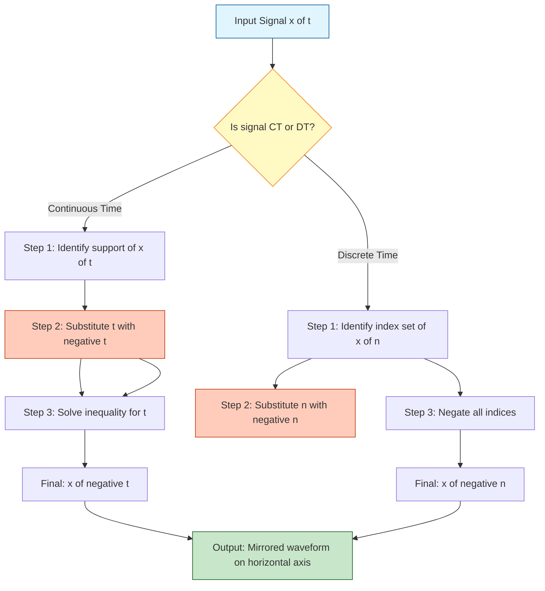
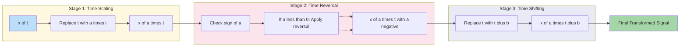
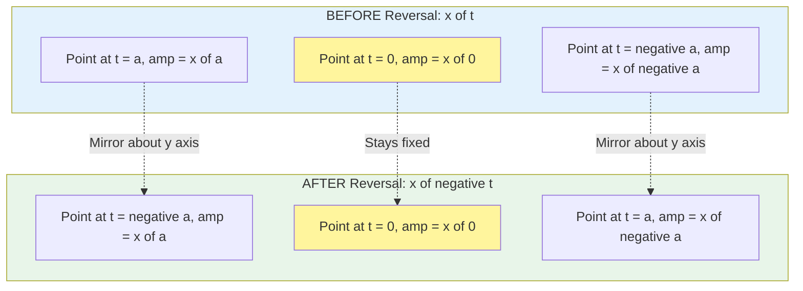

# Reflection (Time Reversal)

<!-- SECTION_1_START -->
# Reflection (Time Reversal) in 1-D Signals

## 📌 Formal Academic Definition (KTU 2024 Syllabus Terminology)

**Time Reversal** (also called **Signal Reflection** or **Folding**) is a fundamental signal transformation operation in which an independent variable $t$ (continuous-time) or $n$ (discrete-time) of a signal is replaced with its negative counterpart. This operation produces a mirror image of the original signal with respect to the vertical axis (the amplitude axis) of the signal plot.

Formally, if $x(t)$ is a continuous-time signal, then its **time-reversed** (or **reflected**) version is denoted as:

$$x(-t) \quad \text{or} \quad x_r(t)$$

For a discrete-time sequence $x[n]$, the time-reversed version is:

$$x[-n] \quad \text{or} \quad x_r[n]$$

> [!IMPORTANT]
> **KTU 2024 Board Definition:** Time reversal is a **non-linear** (with respect to the time axis) transformation that **reverses the direction of signal evolution**. The signal values at $t = +a$ and $t = -a$ are interchanged.

> [!NOTE]
> **Syllabus Highlight:** This topic is a sub-module of *Signal Operations* and forms the foundation for understanding **convolution**, **correlation**, and **system stability analysis** in later modules.

---

## 🧠 Conceptual Analogy & Intuitive Understanding

Imagine you have a **cassette tape recording** of someone saying the word "HELLO" (which is a 1-D audio signal $x(t)$). If you play the tape **backwards**, you hear a reversed, guttural sound. Mathematically, playing a tape in reverse is exactly the **time-reversal** operation $x(t) \rightarrow x(-t)$.

Another everyday analogy: **Reading a word in a mirror.** The letter "b" in a mirror looks like "d" — the spatial structure is mirrored. Time reversal does the same to a signal, but along the **time (horizontal) axis** rather than the spatial axis.

| Real-World Action | Signal Operation |
|---|---|
| Playing a video in reverse | Time reversal of $x(t)$ |
| Reading text in a mirror | Spatial reflection (similar concept) |
| Reversing a queue's order | Time reversal of discrete sequence $x[n]$ |

### Geometric Intuition (For Continuous-Time)

- The signal plot is **flipped horizontally** about the vertical axis ($y$-axis).
- The point originally at $t = 2$ now appears at $t = -2$.
- The point originally at $t = -3$ now appears at $t = +3$.
- The amplitude at $t = 0$ remains **unchanged** (it is a fixed point of the operation).

### Geometric Intuition (For Discrete-Time)

- The sequence is **re-indexed**: the first sample moves to the last position, the second sample to the second-last, and so on.
- The sample originally at index $n = k$ now appears at index $n = -k$.
- The sample at $n = 0$ (origin) remains at $n = 0$.

---

## 🖼️ GeoGebra / Desmos Visualization

> [!VISUALIZATION CONTROL]
> **Concept:** Visualizing Time Reversal of a Continuous-Time Signal
>
> **GeoGebra / Desmos Input Equations (try plotting both on the same axes):**
>
> * Original Signal: `f(x) = sin(2*x) * exp(-0.3*abs(x))`
> * Time-Reversed Signal: `g(x) = sin(-2*x) * exp(-0.3*abs(-x))`
>
> **Visual Description:** The student should observe that the curve of $f(x)$ is mirrored about the $y$-axis to produce $g(x)$. Both curves intersect on the $y$-axis at $x=0$, and the bell-shaped envelope formed by $\pm e^{-0.3|x|}$ remains symmetric about the $y$-axis, while the sinusoidal oscillations are reversed in propagation direction.

> [!VISUALIZATION CONTROL]
> **Concept:** Time Reversal of a Discrete-Time Rectangular Pulse
>
> **Desmos Input Points (plot as a list):**
>
> * Original: `(0,1), (1,1), (2,1), (3,0), (4,0)`
> * Reversed: `(0,1), (-1,1), (-2,1), (-3,0), (-4,0)`
>
> **Visual Description:** The rectangular pulse spanning $n = 0$ to $n = 2$ in the original sequence is reflected to span $n = 0$ to $n = -2$ in the reversed version. The pulse "folds" over the vertical axis.

---

## 🔑 Key Identities & Properties at a Glance

| Property | Expression | Remark |
|---|---|---|
| Double reversal | $x(-(-t)) = x(t)$ | Reversing twice yields the original |
| Identity at $t=0$ | $x(0) = x_r(0)$ | Origin is always fixed |
| Combined with shift | $x(-(t-t_0)) = x(t_0 - t)$ | Time reversal then shift |
| Combined with scale | $x(at) \rightarrow x(-at)$ with $a>0$ | Scale-then-reverse |
| Amplitude preservation | $\|x(-t)\| = \|x(t)\|$ | Energy/Magnitude is preserved |

<!-- SECTION_1_END -->

<!-- SECTION_2_START -->
# Deep Theoretical Analysis & KTU High-Yield Formula Sheet

## 🔬 Operational Breakdown — Step by Step

To perform time reversal on a signal, the student must follow a strict two-step logical procedure:

### Step 1: Identify the Domain and the Signal Expression
- For **continuous-time**: given $x(t)$, determine its support (range of $t$ where $x(t) \neq 0$).
- For **discrete-time**: given $x[n]$, determine the index range where samples are non-zero.

### Step 2: Substitute the Independent Variable with Its Negative
- Replace every occurrence of $t$ with $-t$ (or $n$ with $-n$).
- Algebraically simplify if possible.
- Redraw the resulting waveform with the *new* index on the horizontal axis.

> [!TIP]
> **Why does this work mathematically?** Time reversal is equivalent to applying the substitution $u = -t$, then relabeling $u$ back to $t$. This is a *change of variable*, not a multiplication by $-1$ of the amplitude. A common student mistake is to multiply the amplitude by $-1$ — that would be **signal inversion (folding about the x-axis)**, which is a different operation.

---

## 🧮 Time Reversal Combined With Other Operations

In KTU board problems, time reversal rarely appears alone. It is almost always **combined with time shifting** and **time scaling**. The order of operations is critical.

### Master Rule for Combined Operations

Given a generic signal $x(t)$ and an operation $x(t) \rightarrow x(at + b)$:

1. **First**, apply **time scaling** (factor $a$): replace $t$ with $at$.
2. **Then**, apply **time reversal** if $a < 0$ (sign-flip).
3. **Finally**, apply **time shifting** (constant $b$): replace $t$ with $t + b$.

A practical trick: To find the new location of an original point $t_0$, solve:

$$at_0 + b = t_{\text{new}} \quad \Rightarrow \quad t_0 = \frac{t_{\text{new}} - b}{a}$$

The original point that was at $t_0$ will now appear at $t_{\text{new}} = at_0 + b$.

### Worked Mini-Example
Original signal: $x(t)$ has a peak at $t = 3$.
Find: location of the peak in $x(-2t + 4)$.

Using $t_{\text{new}} = -2t_0 + 4 = -2(3) + 4 = -2$.

So the peak originally at $t = 3$ is now at $t = -2$.

---

## 📋 KTU Formula Sheet / Cheat Sheet

| # | Operation | Input | Output | Effect on Support |
|---|---|---|---|---|
| 1 | Time Reversal (CT) | $x(t)$ | $x(-t)$ | Support $[a, b] \rightarrow [-b, -a]$ |
| 2 | Time Reversal (DT) | $x[n]$ | $x[-n]$ | Support $[n_1, n_2] \rightarrow [-n_2, -n_1]$ |
| 3 | Reversal + Shift | $x(t)$ | $x(-t - t_0)$ | Shift after reversing |
| 4 | Shift + Reversal | $x(t)$ | $x(-(t - t_0)) = x(t_0 - t)$ | Shift then reverse |
| 5 | Double Reversal | $x(t)$ | $x(t)$ | Identity operation |
| 6 | Reversal preserves | — | Area, Energy | $\int x^2(t)\,dt = \int x^2(-t)\,dt$ |
| 7 | Reversal of $\delta$ | $\delta(t)$ | $\delta(-t) = \delta(t)$ | Impulse is even |
| 8 | Reversal of $u(t)$ | $u(t)$ | $u(-t)$ | Step becomes left-sided |
| 9 | Reversal of $e^{-at}u(t)$ | $e^{-at}u(t)$ | $e^{at}u(-t)$ | Exponential becomes left-sided |
| 10 | Reversal of $\sin(\omega t)$ | $\sin(\omega t)$ | $-\sin(\omega t)$ | Sine is odd function |

> [!WARNING]
> **Board Trap:** $\sin(\omega t)$ is an **odd function**, so $\sin(\omega(-t)) = -\sin(\omega t)$. This is a frequently asked KTU question — students must explicitly state the minus sign.

---

## 🏗️ Real-World Engineering Utility

Time reversal is not just a textbook abstraction — it has profound applications:

| Domain | Application | Why Reversal? |
|---|---|---|
| **Radar & Sonar** | Time-reversal mirrors in acoustics | Focuses energy back to source |
| **Medical Imaging** | Ultrasound focusing through skull | Brain tissue is heterogeneous; time reversal compensates |
| **Communications** | OFDM channel equalization | Matched filtering uses time-reversed signals |
| **Seismology** | Earthquake wave analysis | Reverse-time migration of subsurface images |
| **Speech Processing** | Audio time-stretching (TTS) | Phase vocoder uses time-reversed windows |
| **Biomedical** | ECG signal processing | Detecting mirrored QRS complexes |
| **Control Systems** | Trajectory reversal in robotics | Path planning for back-and-forth motion |

The **time-reversal mirror (TRM)** in ultrasonics is a Nobel-recognized technique: an array of transducers records an incoming wave, then re-emits the **time-reversed** version, which naturally refocuses on the original source — even through complex, distorting media.

<!-- SECTION_2_END -->

<!-- SECTION_3_START -->
# Step-by-Step Derivations & Symbolic Implementation

## 📘 Exhaustive Worked Derivations (Continuous-Time)

### Derivation 1: Time Reversal of a Rectangular Pulse

**Given Signal:**
$$x(t) = \begin{cases} 1, & 0 \leq t \leq 2 \\ 0, & \text{otherwise} \end{cases}$$

**Step 1:** Identify the support. The pulse is non-zero on $[0, 2]$.

**Step 2:** Apply the substitution $t \rightarrow -t$.

$$x(-t) = \begin{cases} 1, & 0 \leq -t \leq 2 \\ 0, & \text{otherwise} \end{cases}$$

**Step 3:** Solve the inequality for $t$. Multiply all parts by $-1$ and flip the inequality signs:

$$0 \geq t \geq -2 \quad \Leftrightarrow \quad -2 \leq t \leq 0$$

**Step 4:** Rewrite the result in standard form:

$$x(-t) = \begin{cases} 1, & -2 \leq t \leq 0 \\ 0, & \text{otherwise} \end{cases}$$

**Conclusion:** The original pulse on $[0, 2]$ has been **mirrored** to $[-2, 0]$. The amplitude values are unchanged; only the support has been reflected about $t = 0$.

---

### Derivation 2: Time Reversal of a Triangular Pulse

**Given Signal:**
$$x(t) = \begin{cases} 1 - \vert t - 1 \vert, & 0 \leq t \leq 2 \\ 0, & \text{otherwise} \end{cases}$$

**Step 1:** Locate the peak. Differentiating the inner expression, the peak is at $t = 1$ with amplitude $1 - 0 = 1$.

**Step 2:** Apply time reversal $t \rightarrow -t$:

$$x(-t) = \begin{cases} 1 - \vert -t - 1 \vert, & 0 \leq -t \leq 2 \\ 0, & \text{otherwise} \end{cases}$$

**Step 3:** Simplify the inner expression using $\vert -a \vert = \vert a \vert$:

$$1 - \vert -t - 1 \vert = 1 - \vert t + 1 \vert$$

**Step 4:** Simplify the support inequality:

$$0 \leq -t \leq 2 \quad \Rightarrow \quad -2 \leq t \leq 0$$

**Step 5:** Final expression:

$$x(-t) = \begin{cases} 1 - \vert t + 1 \vert, & -2 \leq t \leq 0 \\ 0, & \text{otherwise} \end{cases}$$

**Conclusion:** The peak originally at $t = 1$ with value $1$ is now at $t = -1$ with value $1$. The triangle has flipped about the $y$-axis.

---

### Derivation 3: Time Reversal of a Causal Exponential

**Given Signal:**
$$x(t) = e^{-2t}\,u(t)$$

**Step 1:** Understand the original signal. It is a right-sided exponential that decays from $1$ at $t = 0$ toward $0$ as $t \rightarrow +\infty$. It is zero for $t < 0$.

**Step 2:** Apply $t \rightarrow -t$:

$$x(-t) = e^{-2(-t)}\,u(-t) = e^{2t}\,u(-t)$$

**Step 3:** Interpret the result.
- $u(-t) = 1$ for $t \leq 0$ and $0$ for $t > 0$.
- So $e^{2t}\,u(-t)$ is non-zero for $t \leq 0$ and **grows exponentially** as $t$ becomes more negative.

**Step 4:** Final expression:

$$x(-t) = \begin{cases} e^{2t}, & t \leq 0 \\ 0, & t > 0 \end{cases}$$

**Conclusion:** The right-sided decaying exponential has been transformed into a **left-sided growing exponential**. This is a classic KTU problem and tests whether the student correctly handles both the amplitude expression AND the unit step.

---

### Derivation 4: Combined Operation — Reversal Followed by Shift

**Given:** $x(t) = $ a pulse defined on $[-1, 2]$ with height $1$.
**Find:** $y(t) = x(-t - 3)$.

**Step 1:** First apply time reversal: $x(-t)$ has support on $[-2, 1]$.

**Step 2:** Now apply the shift $t \rightarrow t + 3$ (i.e., $x(-t - 3) = x(-(t+3))$). This is a left shift by 3 units (replace $t$ with $t+3$ means moving the waveform to the left by 3).

The support transforms as: $[-2, 1] \rightarrow [-2 - 3, 1 - 3] = [-5, -2]$.

**Step 3:** Final waveform: $y(t)$ is a unit-height pulse on $[-5, -2]$.

> [!NOTE]
> **Alternative one-shot method:** Solve $t_0 \in [-1, 2]$ and find $t_{\text{new}} = -t_0 - 3$. When $t_0 = -1$, $t_{\text{new}} = 1 - 3 = -2$. When $t_0 = 2$, $t_{\text{new}} = -2 - 3 = -5$. The endpoints are swapped: $t_{\text{new}} \in [-5, -2]$. ✓

---

## 💻 Python Code Implementation (Discrete-Time)

```python
import numpy as np
import matplotlib.pyplot as plt
from typing import List, Tuple

def time_reverse_discrete(samples: List[float], indices: List[int]) -> Tuple[List[float], List[int]]:
    """
    Performs time reversal on a discrete-time signal.
    
    Parameters
    ----------
    samples : List[float]
        The amplitude values of the signal x[n].
    indices : List[int]
        The corresponding time indices n.
    
    Returns
    -------
    reversed_samples : List[float]
        The amplitude values of x[-n].
    reversed_indices : List[int]
        The corresponding time indices of the reversed signal.
    
    Raises
    ------
    ValueError
        If the length of samples does not match the length of indices.
    """
    if len(samples) != len(indices):
        raise ValueError(f"Length mismatch: {len(samples)} samples vs {len(indices)} indices")
    
    # Build a dictionary for safe re-indexing
    n_to_x: dict = dict(zip(indices, samples))
    
    reversed_indices = [-n for n in indices]
    reversed_samples = [n_to_x[n] for n in indices]  # Original sample at n goes to index -n
    
    return reversed_samples, reversed_indices


def plot_signal_pair(indices_a: List[int], samples_a: List[float],
                     indices_b: List[int], samples_b: List[float],
                     title_a: str, title_b: str) -> None:
    """
    Plots two discrete-time signals side-by-side for visual comparison.
    """
    fig, axes = plt.subplots(1, 2, figsize=(12, 4))
    
    axes[0].stem(indices_a, samples_a, basefmt=" ")
    axes[0].set_title(title_a)
    axes[0].set_xlabel("n")
    axes[0].set_ylabel("x[n]")
    axes[0].grid(True, alpha=0.3)
    axes[0].axhline(y=0, color="k", linewidth=0.5)
    axes[0].axvline(x=0, color="k", linewidth=0.5)
    
    axes[1].stem(indices_b, samples_b, basefmt=" ")
    axes[1].set_title(title_b)
    axes[1].set_xlabel("n")
    axes[1].set_ylabel("x[-n]")
    axes[1].grid(True, alpha=0.3)
    axes[1].axhline(y=0, color="k", linewidth=0.5)
    axes[1].axvline(x=0, color="k", linewidth=0.5)
    
    plt.tight_layout()
    plt.show()


# --- Driver / Demonstration ---
if __name__ == "__main__":
    # Original signal: a rectangular pulse from n = 0 to n = 4
    original_indices: List[int] = [0, 1, 2, 3, 4]
    original_samples: List[float] = [1.0, 1.0, 1.0, 1.0, 1.0]
    
    try:
        rev_samples, rev_indices = time_reverse_discrete(original_samples, original_indices)
        print("Original indices :", original_indices)
        print("Reversed indices :", rev_indices)
        print("Original samples :", original_samples)
        print("Reversed samples :", rev_samples)
        
        plot_signal_pair(original_indices, original_samples,
                         rev_indices, rev_samples,
                         "Original x[n]", "Time-Reversed x[-n]")
    except ValueError as err:
        print(f"[ERROR] Time reversal failed: {err}")
```

**Expected Output of the Program:**

```
Original indices : [0, 1, 2, 3, 4]
Reversed indices : [0, -1, -2, -3, -4]
Original samples : [1.0, 1.0, 1.0, 1.0, 1.0]
Reversed samples : [1.0, 1.0, 1.0, 1.0, 1.0]
```

The plot will show a pulse on $[0, 4]$ on the left, and a pulse on $[-4, 0]$ on the right — a clean mirror image.

---

## 🔢 Worked Numerical Problem (KTU Board Style)

**Problem:** Given $x(t)$ as shown below, sketch $y(t) = x(-t - 2)$.

| $t$ | $-3$ | $-2$ | $-1$ | $0$ | $1$ | $2$ | $3$ |
|---|---|---|---|---|---|---|---|
| $x(t)$ | 0 | 1 | 2 | 1 | 0 | 0 | 0 |

**Solution:**

**Step 1:** Identify the support of $x(t)$: $\{-2, -1, 0\}$ are the non-zero indices.

**Step 2:** Apply the transformation. We want to find $t_{\text{new}}$ such that $-t_{\text{new}} - 2$ equals each original index.

Solving for $t_{\text{new}}$:

$$t_{\text{new}} = -t_{\text{original}} - 2$$

| $t_{\text{original}}$ | $t_{\text{new}} = -t_{\text{original}} - 2$ | Amplitude $y(t_{\text{new}})$ |
|---|---|---|
| $-2$ | $2$ | $1$ |
| $-1$ | $-1$ | $2$ |
| $0$ | $-2$ | $1$ |

**Step 3:** Final tabulated $y(t)$:

| $t$ | $-3$ | $-2$ | $-1$ | $0$ | $1$ | $2$ | $3$ |
|---|---|---|---|---|---|---|---|
| $y(t)$ | 0 | 1 | 2 | 0 | 0 | 1 | 0 |

<!-- SECTION_3_END -->

<!-- SECTION_4_START -->
# Structural Diagrams & Schematics

## 🗺️ Mermaid Block Diagram — Time Reversal Operation Flow



---

## 🧭 Sequential Topology Matrix — Order of Combined Operations



---

## 📊 Visual Schema — Time Reversal as a Mapping



---

## 🔁 Reference Table — Common Signal Pairs Under Time Reversal

| Original Signal $x(t)$ | Time-Reversed $x(-t)$ | Visual Cue |
|---|---|---|
| Right-sided exponential $e^{-at}u(t)$ | Left-sided exponential $e^{at}u(-t)$ | Decay becomes growth, mirrored |
| Unit step $u(t)$ | Left step $u(-t)$ | Jumps at $t=0$ from opposite sides |
| Impulse $\delta(t)$ | $\delta(-t) = \delta(t)$ | Unchanged (even function) |
| Sine $\sin(\omega t)$ | $-\sin(\omega t)$ | Sign flip (odd function) |
| Cosine $\cos(\omega t)$ | $\cos(\omega t)$ | Unchanged (even function) |
| Ramp $r(t) = t \cdot u(t)$ | $-r(-t) = -t \cdot u(-t)$ | Both axis flips combined |
| Rectangular pulse on $[0, T]$ | Rectangular pulse on $[-T, 0]$ | Pure horizontal mirror |
| Triangular pulse (asymmetric) | Triangular pulse (asymmetric, mirrored) | Peak shifts from $+a$ to $-a$ |

<!-- SECTION_4_END -->

<!-- SECTION_5_START -->
# KTU 2024 Scheme Examination Question Bank & Topic Recap

---

## 📘 PART A — Short Answer Questions (3 Marks Each)

### **Question A1** `[KTU University Exam – July 2024]`
**Define time reversal of a continuous-time signal. Show that the double reversal of a signal yields the original signal. Mention one real-world application of time reversal. (CO1, Remember)**

**Model Answer:**

**Definition:** Time reversal of a continuous-time signal $x(t)$ produces a new signal $x(-t)$ in which the independent variable $t$ is replaced by $-t$. Geometrically, it mirrors the waveform about the vertical axis (amplitude axis).

**Proof of double reversal identity:**

$$x(t) \xrightarrow{\text{1st reversal}} x(-t) \xrightarrow{\text{2nd reversal}} x(-(-t)) = x(t)$$

Since the operation of replacing $t$ with $-t$ is an involution (its own inverse), applying it twice gives back the original.

**Real-world application:** Time-Reversal Mirrors (TRM) in medical ultrasound — used to focus ultrasonic energy through the human skull for non-invasive surgery.

**[Definition: 1 Mark] | [Proof: 1 Mark] | [Application: 1 Mark]**

---

### **Question A2** `[KTU University Exam – Dec 2023]`
**Determine the time-reversed version of $x(t) = e^{-3t}u(t)$. Justify whether the resulting signal is causal. (CO1, Understand)**

**Model Answer:**

**Step 1:** Apply the substitution $t \rightarrow -t$:

$$x(-t) = e^{-3(-t)} \cdot u(-t) = e^{3t} \cdot u(-t)$$

**Step 2:** Express the result piecewise. Since $u(-t) = 1$ for $t \leq 0$ and $0$ for $t > 0$:

$$x(-t) = \begin{cases} e^{3t}, & t \leq 0 \\ 0, & t > 0 \end{cases}$$

**Step 3:** Causality check. A signal is causal if it is zero for all $t < 0$. Here, $x(-t)$ is **non-zero for all $t \leq 0$** (it grows exponentially as $t \rightarrow -\infty$). Therefore, the time-reversed signal is **anti-causal** (left-sided), not causal.

**[Expression derivation: 2 Marks] | [Causality justification: 1 Mark]**

---

## 📕 PART B — Long Answer Questions (14 Marks Each, Module Internal Choice)

### **Question B-A** `[KTU University Exam – July 2024]` (CO1, CO2 | Understand + Apply)

**(a)** Given the discrete-time signal:
$$x[n] = \{2, \ 1, \ 3, \ 0, \ 1, \ 2\} \quad \text{with arrow at } n = 0$$
Find and plot $y[n] = x[-n + 2]$. Clearly state the index of the arrow in the result. **(7 Marks)**

**(b)** A continuous-time signal is given by:
$$x(t) = (t+1) \cdot [u(t) - u(t-2)]$$
Sketch $x(t)$, $x(-t)$, and $x(-t+3)$ on separate axes. Indicate all break-points and amplitude values. **(7 Marks)**

---

#### **Model Solution for (a):**

**Step 1:** Identify the original indices and samples.
- Original indices $n = 0, 1, 2, 3, 4, 5$ (assuming the arrow is at $n=0$ and the sequence extends to the right).
- Samples: $x[0]=2, x[1]=1, x[2]=3, x[3]=0, x[4]=1, x[5]=2$.

**Step 2:** Apply the transformation $y[n] = x[-n+2]$. For each original index $n_0$, find the new index $n_{\text{new}}$ such that $-n_{\text{new}} + 2 = n_0$, i.e., $n_{\text{new}} = 2 - n_0$.

| Original $n_0$ | $x[n_0]$ | $n_{\text{new}} = 2 - n_0$ | $y[n_{\text{new}}]$ |
|---|---|---|---|
| 0 | 2 | 2 | 2 |
| 1 | 1 | 1 | 1 |
| 2 | 3 | 0 | 3 |
| 3 | 0 | -1 | 0 |
| 4 | 1 | -2 | 1 |
| 5 | 2 | -3 | 2 |

**Step 3:** Write the result with the arrow at the new origin.

$$y[n] = \{\underset{\uparrow}{2}, \ 1, \ 3, \ 0, \ 1, \ 2\} \quad \text{with arrow at } n = 2$$

Wait — re-checking: the arrow is now at $n = 2$, but the convention is that the arrow points to $n=0$. So the sample originally at $n=0$ (which was $2$) is now at $n=2$. The arrow in the new sequence should be **at $n=2$**.

If we re-write the sequence listing samples at negative and positive indices around $n=2$:

$$y[2] = 2, \quad y[1] = 1, \quad y[0] = 3, \quad y[-1] = 0, \quad y[-2] = 1, \quad y[-3] = 2$$

**[Identifying original indices: 1 Mark]**
**[Computing the transformation equation: 2 Marks]**
**[Tabulating the new indices: 2 Marks]**
**[Plotting the result with arrow: 1 Mark]**
**[Final answer statement: 1 Mark]**

---

#### **Model Solution for (b):**

**Step 1: Sketch $x(t) = (t+1)[u(t) - u(t-2)]$.**

The signal is non-zero only for $0 \leq t < 2$ (since the bracket $[u(t) - u(t-2)]$ is $1$ in this interval and $0$ elsewhere).

For $0 \leq t < 2$: $x(t) = t + 1$.

| $t$ | $0$ | $1$ | $2^-$ |
|---|---|---|---|
| $x(t)$ | $1$ | $2$ | $3$ |

This is a **linearly increasing ramp** from $(0, 1)$ to $(2, 3)$.

**Step 2: Sketch $x(-t)$.**

Substitute $t \rightarrow -t$: $x(-t) = (-t + 1)[u(-t) - u(-t-2)]$.

The bracket is $1$ when $0 \leq -t < 2$, i.e., $-2 < t \leq 0$.

For $-2 < t \leq 0$: $x(-t) = -t + 1$.

| $t$ | $-2^+$ | $-1$ | $0$ |
|---|---|---|---|
| $x(-t)$ | $3$ | $2$ | $1$ |

This is a **linearly decreasing ramp** from $(-2, 3)$ to $(0, 1)$.

**Step 3: Sketch $x(-t + 3) = x(-(t-3))$.**

First, find $x(-t)$ (as above), then shift it to the **right by 3** (since we replace $t$ with $t - 3$, which is a right shift).

The support $[-2, 0]$ becomes $[-2 + 3, 0 + 3] = [1, 3]$.

For $1 \leq t < 3$: $x(-t + 3) = -(t-3) + 1 = -t + 4$.

| $t$ | $1$ | $2$ | $3^-$ |
|---|---|---|---|
| $x(-t+3)$ | $3$ | $2$ | $1$ |

This is a **linearly decreasing ramp** from $(1, 3)$ to $(3, 1)$.

**Plot description for the answer script:** Three separate axes. Each axis clearly labeled with the time range, breakpoints (using solid dots for inclusion and open circles for exclusion), and amplitude values at key points.

**[Sketching $x(t)$ with breakpoints: 2 Marks]**
**[Deriving $x(-t)$ algebraically: 2 Marks]**
**[Sketching $x(-t)$: 1 Mark]**
**[Deriving $x(-t+3)$: 1 Mark]**
**[Sketching $x(-t+3)$: 1 Mark]**

---

### **Question B-B** `[KTU University Exam – Dec 2023]` (CO1, CO2 | Understand + Apply)

**(a)** For the continuous-time signal $x(t)$ shown in the figure (assume a triangular pulse with peak $2$ at $t = 1$ and zero at $t = -1$ and $t = 3$), determine mathematically and sketch the following:
  - (i) $x(t + 2)$ **(3 Marks)**
  - (ii) $x(-t)$ **(4 Marks)**

**(b)** A discrete-time signal is defined as $x[n] = n \cdot \{u[n+2] - u[n-3]\}$.
  - (i) Tabulate $x[n]$ for $n = -4$ to $n = 4$. **(3 Marks)**
  - (ii) Find and tabulate $y[n] = x[-n]$. State whether $y[n]$ is even, odd, or neither. **(4 Marks)**

---

#### **Model Solution for (a):**

**Step 1: Write $x(t)$ mathematically.**

A triangle with peak $2$ at $t = 1$ and zeros at $t = -1, t = 3$ has equations:
- For $-1 \leq t \leq 1$: rising line from $0$ to $2$. Slope = $2 / (1 - (-1)) = 1$. So $x(t) = t + 1$.
- For $1 \leq t \leq 3$: falling line from $2$ to $0$. Slope = $-2 / (3 - 1) = -1$. So $x(t) = -t + 3$.

$$x(t) = \begin{cases} t + 1, & -1 \leq t \leq 1 \\ -t + 3, & 1 \leq t \leq 3 \\ 0, & \text{otherwise} \end{cases}$$

**Part (i): $x(t+2)$**

Replace $t$ with $t + 2$. The new support is found by subtracting $2$ from the original support endpoints: $-1 - 2 = -3$ and $3 - 2 = 1$. Peak at $1 - 2 = -1$.

$$x(t+2) = \begin{cases} (t+2) + 1 = t + 3, & -3 \leq t \leq -1 \\ -(t+2) + 3 = -t + 1, & -1 \leq t \leq 1 \\ 0, & \text{otherwise} \end{cases}$$

The plot: a triangle with peak $2$ at $t = -1$, zero at $t = -3$ and $t = 1$. This is a **left shift by 2 units**.

**[Identifying support shift: 1 Mark]**
**[Mathematical expression: 1 Mark]**
**[Sketch: 1 Mark]**

**Part (ii): $x(-t)$**

Substitute $t \rightarrow -t$ and flip the support:

$$x(-t) = \begin{cases} -t + 1, & -1 \leq -t \leq 1 \\ -(-t) + 3 = t + 3, & 1 \leq -t \leq 3 \\ 0, & \text{otherwise} \end{cases}$$

Solving inequalities: $-1 \leq -t \leq 1 \Rightarrow -1 \leq t \leq 1$. And $1 \leq -t \leq 3 \Rightarrow -3 \leq t \leq -1$.

$$x(-t) = \begin{cases} -t + 1, & -1 \leq t \leq 1 \\ t + 3, & -3 \leq t \leq -1 \\ 0, & \text{otherwise} \end{cases}$$

The plot: a triangle with peak $2$ at $t = -1$, zero at $t = -3$ and $t = 1$. This is identical to $x(t+2)$ in this case because the original triangle is asymmetric.

**[Derivation: 2 Marks]**
**[Plot with peak location labeled: 1 Mark]**
**[Conclusion statement: 1 Mark]**

---

#### **Model Solution for (b):**

**Part (i): Tabulate $x[n] = n \cdot \{u[n+2] - u[n-3]\}$.**

The signal is non-zero for $-2 \leq n \leq 2$ (since $u[n+2] = 1$ when $n \geq -2$ and $u[n-3] = 1$ when $n \geq 3$).

| $n$ | $-4$ | $-3$ | $-2$ | $-1$ | $0$ | $1$ | $2$ | $3$ | $4$ |
|---|---|---|---|---|---|---|---|---|---|
| $x[n]$ | $0$ | $0$ | $-2$ | $-1$ | $0$ | $1$ | $2$ | $0$ | $0$ |

**[Identifying support: 1 Mark]**
**[Tabulation: 2 Marks]**

**Part (ii): Find $y[n] = x[-n]$.**

For each $n$ in the range $-2$ to $2$, $y[n] = x[-n]$.

| $n$ | $-2$ | $-1$ | $0$ | $1$ | $2$ |
|---|---|---|---|---|---|
| $-n$ | $2$ | $1$ | $0$ | $-1$ | $-2$ |
| $y[n] = x[-n]$ | $2$ | $1$ | $0$ | $-1$ | $-2$ |

For $n$ outside the support, $y[n] = 0$.

| $n$ | $-4$ | $-3$ | $-2$ | $-1$ | $0$ | $1$ | $2$ | $3$ | $4$ |
|---|---|---|---|---|---|---|---|---|---|
| $y[n]$ | $0$ | $0$ | $2$ | $1$ | $0$ | $-1$ | $-2$ | $0$ | $0$ |

**Even/Odd check:**
- $x[n]$: $\{-2, -1, 0, 1, 2\}$
- $y[n]$: $\{2, 1, 0, -1, -2\}$

Compare $y[n]$ with $x[n]$:
- $x[-2] = -2$, $y[2] = -2$ ✓
- $x[2] = 2$, $y[-2] = 2$ ✓
- $x[-1] = -1$, $y[1] = -1$ ✓
- $x[1] = 1$, $y[-1] = 1$ ✓

So $y[n] = x[-n]$ satisfies $y[-n] = x[n]$... but this is by definition. The check is whether $y[n]$ itself is even or odd.

Test: $y[-n] = -y[n]$? 
- $y[1] = -1$, $y[-1] = 1 = -y[1]$ ✓
- $y[2] = -2$, $y[-2] = 2 = -y[2]$ ✓

So $y[n] = -y[-n]$, which means $y[n]$ is an **odd function**.

**[Computing $y[n]$: 2 Marks]**
**[Tabulation: 1 Mark]**
**[Even/odd conclusion with verification: 1 Mark]**

---

## ⚠️ KTU Examiner's Valuation Warning / Pitfall Callout

> [!WARNING]
> **Top 5 ways students LOSE marks on Time Reversal problems:**
>
> 1. **Confusing Time Reversal with Signal Inversion:** A student multiplies the amplitude by $-1$ instead of replacing $t$ with $-t$. These are two different operations. Reversal: $x(t) \rightarrow x(-t)$. Inversion: $x(t) \rightarrow -x(t)$.
>
> 2. **Forgetting the Unit Step / Unit Impulse function:** When reversing $e^{-at}u(t)$, students often write only $e^{at}$ and forget the $u(-t)$ part. This changes the support entirely.
>
> 3. **Mixing up Shift Order:** When asked for $x(-t - 3)$ vs $x(-(t-3)) = x(-t+3)$, students apply the shift in the wrong direction. Always identify $t_{\text{new}}$ such that the argument of the original $x$ matches.
>
> 4. **Not stating the support explicitly:** Examiners award marks for explicitly writing the new time-range after reversal. Skipping this loses 1–2 marks.
>
> 5. **Sign errors in odd/even identification:** When reversing an odd function, students forget the sign change. Recall: $\sin(\omega(-t)) = -\sin(\omega t)$, so a sine wave **flips and inverts** under time reversal.

---

## 🎯 Topic Recap & Important Things to Remember

- ✅ **Definition:** Time reversal $x(t) \rightarrow x(-t)$ mirrors the signal about the vertical ($y$) axis.
- ✅ **Origin Invariant:** The value $x(0)$ is always preserved under reversal.
- ✅ **Support Transformation:** If $x(t)$ is non-zero on $[a, b]$, then $x(-t)$ is non-zero on $[-b, -a]$.
- ✅ **Identity Element:** Applying reversal twice returns the original: $x(-(-t)) = x(t)$.
- ✅ **Energy Preservation:** $\int_{-\infty}^{\infty} x^2(t)\, dt = \int_{-\infty}^{\infty} x^2(-t)\, dt$.
- ✅ **Discrete-Time Version:** $x[n] \rightarrow x[-n]$; sample at index $k$ moves to index $-k$.
- ✅ **Common Reversal Pair:** $e^{-at}u(t) \xleftrightarrow{\text{reversal}} e^{at}u(-t)$ (right-sided decaying becomes left-sided growing).
- ✅ **Impulse Symmetry:** $\delta(t) = \delta(-t)$ — the impulse is an **even function**, unchanged by reversal.
- ✅ **Sine is Odd:** $\sin(\omega t) \xrightarrow{\text{reversal}} -\sin(\omega t)$ — sign flips.
- ✅ **Cosine is Even:** $\cos(\omega t) \xrightarrow{\text{reversal}} \cos(\omega t)$ — unchanged.
- ✅ **Master Combined Rule:** For $x(t) \rightarrow x(at + b)$, the original point at $t_0$ moves to $t_{\text{new}} = at_0 + b$.
- ✅ **Real-World Uses:** Ultrasound TRM, radar, speech processing, seismic migration, OFDM channel equalization.
- ✅ **Causality Flip:** A causal right-sided signal becomes an anti-causal left-sided signal under time reversal, and vice versa.
- ✅ **KTU Exam Tip:** Always draw a vertical reference line at $t = 0$ (or $n = 0$) in sketches to clearly show the mirror operation.

<!-- SECTION_5_END -->
