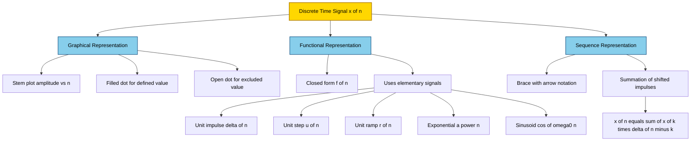
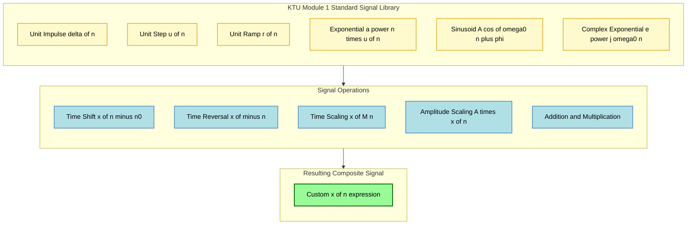
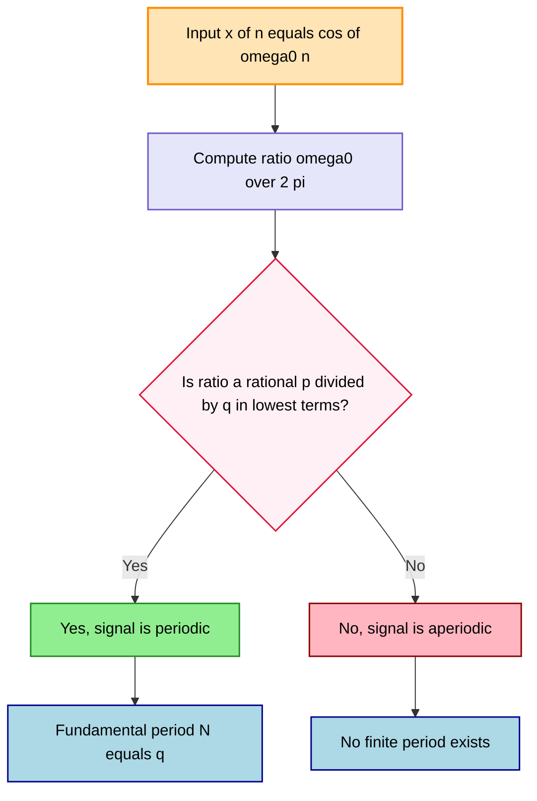

# Representation of discrete time signals- (Graphical representation, Functional representation, Sequence representation)

<!-- SECTION_1_START -->
# Representation of Discrete-Time Signals

## 1.1 Formal Definition (KTU 2024 Syllabus Terminology)

A **discrete-time signal** is a mathematical function $x[n]$ defined only at discrete instants of time, where the independent variable $n$ is an integer ($n \in \mathbb{Z}$). It is denoted as a sequence of numbers $x[n]$ for $n = \ldots, -2, -1, 0, 1, 2, \ldots$

> [!NOTE]
> **KTU 2024 Definition (Verbatim from PECST416 Module 1):**  
> A discrete-time signal is a sequence of numbers $x[n]$ in which the independent variable $n$ is an integer and represents successive samples of a phenomenon at uniformly spaced time instants $t = nT$, where $T$ is the sampling period.

A discrete-time signal can be represented in **three equivalent ways**:

| Representation Type | Core Idea |
|---|---|
| Graphical | Plot of amplitude versus sample index $n$ (stem plot) |
| Functional | Closed-form expression like $x[n] = \cos(0.5\pi n)$ |
| Sequence (Tabular) | Set notation listing explicit values $\{x[n]\} = \{1, 2, 3, 2, 1\}$ |

---

## 1.2 Conceptual Analogy / Intuition

Think of a **daily stock closing price** recorded at the end of each trading day:

- You do **not** have a value at 10:32 AM or 3:17 PM — only at the *end* of each day.
- Day numbers are integers: Day 0, Day 1, Day 2, ...
- The recorded values form a sequence.

This is exactly how a discrete-time signal behaves. Time is *digitized* into samples, and each sample carries a numerical value (the amplitude).

> [!IMPORTANT]
> **Why "discrete-time" and not "digital"?**  
> A discrete-time signal is defined only at integer $n$, but its amplitude can still be **continuous** (any real number). A *digital* signal additionally has its amplitude quantized to a finite set of levels. In Module 1, we deal with **discrete-time** signals, not necessarily digital.

---

## 1.3 Physical Constants & Standard Metrics

- **Sampling Period $T$** — time gap between two consecutive samples (in **seconds**).
- **Sampling Frequency $F_s$** — number of samples per second, $F_s = 1/T$ (in **Hz**).
- **Normalized Frequency $\omega$** — dimensionless angular frequency, $\omega = 2\pi f / F_s$ (in **radians/sample**).
- **Sample Index $n$** — dimensionless integer counter.

> [!TIP]
> In KTU problems, the sampling period is usually **assumed to be 1 second ($T = 1$)**, so $n$ directly corresponds to the time index. Always verify this assumption before substituting values.

---

## 1.4 GeoGebra / Desmos Visualization

> [!VISUALIZATION CONTROL]
> **Concept:** Visualizing the unit impulse $\delta[n]$, unit step $u[n]$, and exponential $a^n u[n]$ on a coordinate grid.
>
> **GeoGebra / Desmos Input Equations:**
> - Impulse: $\text{Impulse}(n) = \text{If}(n = 0, 1, 0)$
> - Step: $\text{Step}(n) = \text{If}(n \geq 0, 1, 0)$
> - Ramp: $\text{Ramp}(n) = \text{If}(n \geq 0, n, 0)$
> - Decaying exponential: $\text{Exp}(n) = \text{If}(n \geq 0, 0.8^{n}, 0)$
>
> **Visual Description:** Students should observe vertical stems rising from the $n$-axis at integer positions. The impulse has a single stem of height 1 at $n = 0$. The step jumps from 0 to 1 at $n = 0$ and stays at 1 for all positive integers. The ramp increases linearly for $n \geq 0$. The exponential decays geometrically toward 0 for $a \lt 1$.

<!-- SECTION_1_END -->

<!-- SECTION_2_START -->
# Deep Theoretical Analysis & KTU High-Yield Formula Sheet

## 2.1 The Three Representation Methods — Detailed Breakdown

### 2.1.1 Graphical Representation

A discrete-time signal is plotted as a **stem plot** (lollipop diagram). The horizontal axis is the integer index $n$, and the vertical axis is the amplitude $x[n]$. A vertical line is drawn from the $n$-axis up (or down) to the sample value, capped by a filled circle (or open circle if the value at that $n$ is undefined / different).

**How to read a stem plot:**

1. Locate each integer $n$ on the horizontal axis.
2. Move vertically to the height of the dot.
3. Read the amplitude $x[n]$ from the vertical axis.

**Step-by-step logic for plotting:**

- Step 1: Identify the support (range of $n$ where the signal is non-zero).
- Step 2: Compute $x[n]$ for each $n$ in the support.
- Step 3: Draw a vertical stem at every $n$ in the support.
- Step 4: Use a filled dot if the value belongs, open dot if it does not.

> [!IMPORTANT]
> **KTU Convention:** Open circles denote undefined / excluded values. Closed (filled) circles denote defined / included values. This is critical in problems involving shifted or truncated signals.

### 2.1.2 Functional Representation

A closed-form mathematical expression gives $x[n]$ for all $n$. The most common elementary discrete-time signals are:

**1. Unit Impulse Signal $\delta[n]$**

$$
\delta[n] = \begin{cases} 1, & n = 0 \\ 0, & n \neq 0 \end{cases}
$$

**2. Unit Step Signal $u[n]$**

$$
u[n] = \begin{cases} 1, & n \geq 0 \\ 0, & n < 0 \end{cases}
$$

**3. Unit Ramp Signal $r[n]$**

$$
r[n] = \begin{cases} n, & n \geq 0 \\ 0, & n < 0 \end{cases}
$$

**4. Exponential Signal $x[n] = a^n u[n]$**

$$
x[n] = \begin{cases} a^{n}, & n \geq 0 \\ 0, & n < 0 \end{cases}
$$

- If $\vert a \vert < 1$ — signal **decays**.
- If $\vert a \vert > 1$ — signal **grows**.
- If $\vert a \vert = 1$ — signal is **constant** (DC).

**5. Sinusoidal Signal $x[n] = A \cos(\omega_0 n + \phi)$**

Where $A$ is amplitude, $\omega_0$ is the angular frequency in **radians/sample**, and $\phi$ is the phase in **radians**.

**6. Complex Exponential $x[n] = e^{j\omega_0 n}$**

By Euler's formula: $e^{j\omega_0 n} = \cos(\omega_0 n) + j \sin(\omega_0 n)$.

### 2.1.3 Sequence (Tabular) Representation

The signal is written as a list of amplitude values aligned with their indices. Two equivalent notations are used in KTU textbooks:

**Notation 1 — Brace with Arrow:**

$$
x[n] = \{\ldots, 0, 1, 2, 3, 2, 1, \underset{\uparrow}{0}, 1, 2, 3, 2, 1, \ldots\}
$$

The arrow $\uparrow$ marks the origin $n = 0$.

**Notation 2 — Closed-Form Sum:**

$$
x[n] = \sum_{k} x[k]\delta[n-k]
$$

This expresses the signal as a weighted sum of shifted impulses. It is the **most general** representation and is used in KTU problems involving signal decomposition.

---

## 2.2 Why & How of Each Representation

- **Why graphical?** Visualizing amplitude, symmetry (even/odd), periodicity, and boundedness at a glance.
- **Why functional?** Enables algebraic manipulation, convolution, and use of identities like $u[n] = \sum_{k=0}^{\infty}\delta[n-k]$.
- **Why sequence?** Compact for listing finite-length signals like $x[n] = \{1, 2, 3\}$ for $n = 0, 1, 2$.

> [!TIP]
> **Real-world utility in engineering:** Discrete-time signals underpin **digital audio (MP3, WAV)**, **digital images (pixels)**, **biomedical ECG/EEG sampled data**, **stock market tickers**, and **radar/LiDAR sample streams**. The representation you choose depends on the operation: graphic for visualization, functional for analysis (Z-transform, DFT), sequence for storage and software implementation.

---

## 2.3 KTU High-Yield Formula Sheet

| Signal Name | Functional Form | Support | Key Property |
|---|---|---|---|
| Unit Impulse | $\delta[n]$ | $n = 0$ only | $\sum_{n=-\infty}^{\infty}\delta[n] = 1$ |
| Unit Step | $u[n]$ | $n \geq 0$ | $u[n] = \sum_{k=0}^{\infty}\delta[n-k]$ |
| Unit Ramp | $r[n]$ | $n \geq 0$ | $r[n] = n \cdot u[n]$ |
| Exponential | $a^{n} u[n]$ | $n \geq 0$ | $x[n+1]/x[n] = a$ |
| Sinusoidal | $A\cos(\omega_0 n + \phi)$ | All $n$ | Periodic if $\omega_0/2\pi$ is rational |
| Complex Exponential | $e^{j\omega_0 n}$ | All $n$ | Eigenfunction of LTI systems |

| Identity | Formula | Use Case |
|---|---|---|
| Step from Impulse | $u[n] = \sum_{k=-\infty}^{n}\delta[k]$ | Reconstruction |
| Impulse from Step | $\delta[n] = u[n] - u[n-1]$ | Differentiation |
| Ramp from Step | $r[n] = \sum_{k=-\infty}^{n} u[k]$ | Integration |
| Time Shift | $x[n-n_0]$ shifts right by $n_0$ | Delay (if $n_0 \gt 0$) |
| Time Reversal | $x[-n]$ | Mirror about $n = 0$ |

> [!WARNING]
> **Pitfall Alert:** Many students confuse $x[-n]$ with $x[n+1]$ or $x[n-1]$. Always remember:
> - $x[n - n_0]$ with $n_0 \gt 0$ = **right shift** (delay).
> - $x[-n]$ = **mirror** about the vertical axis.
> - $x[-n + n_0]$ = mirror **then** shift right by $n_0$.

<!-- SECTION_2_END -->

<!-- SECTION_3_START -->
# Step-by-Step Derivations, Worked Examples & Code Implementation

## 3.1 Worked Example 1 — Converting Between Representations

**Problem:** Given the signal

$$
x[n] = 2 \cdot \delta[n+1] - \delta[n] + 3 \cdot \delta[n-2]
$$

Find: (a) Sequence representation, (b) Functional representation, (c) Sketch the stem plot.

### Solution

**Part (a) — Sequence Representation**

The signal is non-zero only at $n = -1$, $n = 0$, and $n = 2$.

$$
x[n] = \{\ldots, 0, 2, -1, 0, 3, \ldots\} \quad \text{with} \quad \underset{\uparrow}{n=0} \text{ at } -1
$$

Explicit values:
- $x[-2] = 0$
- $x[-1] = 2$
- $x[0] = -1$
- $x[1] = 0$
- $x[2] = 3$
- $x[3] = 0$

**Part (b) — Functional Representation**

Since the signal is non-zero only at three specific points, we write it as:

$$
x[n] = \begin{cases} 2, & n = -1 \\ -1, & n = 0 \\ 3, & n = 2 \\ 0, & \text{otherwise} \end{cases}
$$

**Part (c) — Stem Plot**

The plot has three vertical stems:
- At $n = -1$, stem of height **+2**.
- At $n = 0$, stem of height **−1** (extends below the $n$-axis).
- At $n = 2$, stem of height **+3**.

All other integer $n$ values have zero height (no stem drawn, or a stem of height 0 along the axis).

> [!TIP]
> **Valuation Tip:** For any signal expressed as a sum of shifted impulses, you earn full marks by:
> 1. Stating the support (1 mark).
> 2. Tabulating the non-zero values (1 mark).
> 3. Drawing the stem plot with correct signs and positions (2 marks).

---

## 3.2 Worked Example 2 — Constructing a Signal from a Description

**Problem:** A discrete-time signal $x[n]$ is defined as:

- $x[n] = (-1)^{n}$ for $0 \leq n \leq 4$.
- $x[n] = 0$ elsewhere.

Write the signal in (a) functional form with unit step brackets, (b) sequence form, (c) plot it.

### Solution

**Part (a) — Functional Form Using $u[n]$**

A finite-length signal from $n = a$ to $n = b$ is written as $x[n] = f[n]\{u[n-a] - u[n-(b+1)]\}$.

Here, the range is $0$ to $4$, so $a = 0$ and $b+1 = 5$. Therefore:

$$
x[n] = (-1)^{n}\{u[n] - u[n-5]\}
$$

**Part (b) — Sequence Form**

Compute $(-1)^{n}$ for $n = 0, 1, 2, 3, 4$:

| $n$ | $(-1)^{n}$ |
|---|---|
| 0 | $+1$ |
| 1 | $-1$ |
| 2 | $+1$ |
| 3 | $-1$ |
| 4 | $+1$ |

$$
x[n] = \{\underset{\uparrow}{1}, -1, 1, -1, 1\}
$$

**Part (c) — Stem Plot Description**

Alternating positive and negative stems of height 1, starting with $+1$ at $n = 0$ and ending with $+1$ at $n = 4$. All other $n$ values give zero.

---

## 3.3 Python Implementation — Generating and Visualizing Standard Signals

```python
import numpy as np
import matplotlib.pyplot as plt

def plot_discrete_signal(n_values: np.ndarray,
                          x_values: np.ndarray,
                          title: str,
                          xlabel: str = "Sample index n",
                          ylabel: str = "Amplitude x[n]") -> None:
    """
    Plot a discrete-time signal as a stem plot with strict boundary checks.

    Parameters
    ----------
    n_values : np.ndarray
        Integer sample indices (must be 1-D).
    x_values : np.ndarray
        Amplitude values at each index (must match length of n_values).
    title : str
        Title of the plot.
    xlabel, ylabel : str
        Axis labels.
    """
    if n_values.shape != x_values.shape:
        raise ValueError("n_values and x_values must have the same shape.")
    if n_values.ndim != 1:
        raise ValueError("Input arrays must be 1-D.")

    plt.figure(figsize=(8, 4))
    markerline, stemlines, baseline = plt.stem(
        n_values, x_values, linefmt="C0-", markerfmt="C0o", basefmt="k-"
    )
    plt.setp(stemlines, linewidth=1.4)
    plt.setp(markerline, markersize=6)
    plt.title(title)
    plt.xlabel(xlabel)
    plt.ylabel(ylabel)
    plt.grid(True, alpha=0.3)
    plt.axhline(0, color="black", linewidth=0.8)
    plt.tight_layout()
    plt.show()


def unit_impulse(n0: int = 0, length: int = 11) -> tuple[np.ndarray, np.ndarray]:
    """Generate a unit impulse shifted to n = n0 over a symmetric window."""
    if length < 1:
        raise ValueError("length must be >= 1.")
    n = np.arange(-(length // 2), length // 2 + 1)
    x = np.where(n == n0, 1.0, 0.0)
    return n, x


def unit_step(n0: int = 0, length: int = 11) -> tuple[np.ndarray, np.ndarray]:
    """Generate a unit step starting at n = n0."""
    if length < 1:
        raise ValueError("length must be >= 1.")
    n = np.arange(-(length // 2), length // 2 + 1)
    x = np.where(n >= n0, 1.0, 0.0)
    return n, x


def unit_ramp(n0: int = 0, length: int = 11) -> tuple[np.ndarray, np.ndarray]:
    """Generate a unit ramp starting at n = n0."""
    if length < 1:
        raise ValueError("length must be >= 1.")
    n = np.arange(-(length // 2), length // 2 + 1)
    x = np.where(n >= n0, n.astype(float) - n0, 0.0)
    return n, x


def exponential(a: float, n0: int = 0, length: int = 11) -> tuple[np.ndarray, np.ndarray]:
    """Generate a^n * u[n - n0] discrete-time exponential signal."""
    if length < 1:
        raise ValueError("length must be >= 1.")
    n = np.arange(-(length // 2), length // 2 + 1)
    x = np.where(n >= n0, np.power(a, n - n0), 0.0)
    return n, x


def sinusoid(A: float, omega0: float, phi: float = 0.0,
             length: int = 41) -> tuple[np.ndarray, np.ndarray]:
    """Generate A*cos(omega0*n + phi) over a symmetric integer window."""
    if length < 1:
        raise ValueError("length must be >= 1.")
    n = np.arange(-(length // 2), length // 2 + 1)
    x = A * np.cos(omega0 * n + phi)
    return n, x


# ----- Demonstration: KTU Module 1 standard signals -----
if __name__ == "__main__":
    # Signal 1: x[n] = delta[n+1] - 2*delta[n] + delta[n-2]
    n1, d_m1 = unit_impulse(n0=-1, length=9)
    _, d_0 = unit_impulse(n0=0, length=9)
    _, d_p2 = unit_impulse(n0=2, length=9)
    x1 = d_m1 - 2 * d_0 + d_p2
    plot_discrete_signal(n1, x1, "x[n] = delta[n+1] - 2*delta[n] + delta[n-2]")

    # Signal 2: x[n] = (-1)^n {u[n] - u[n-5]}
    n2 = np.arange(0, 6)
    x2 = np.power(-1.0, n2)
    plot_discrete_signal(n2, x2, "x[n] = (-1)^n for 0 <= n <= 4")

    # Signal 3: x[n] = (0.8)^n u[n]
    n3, x3 = exponential(a=0.8, n0=0, length=15)
    plot_discrete_signal(n3, x3, "x[n] = (0.8)^n u[n] (decaying exponential)")

    # Signal 4: x[n] = cos(pi n / 4)
    n4, x4 = sinusoid(A=1.0, omega0=np.pi / 4.0, length=17)
    plot_discrete_signal(n4, x4, "x[n] = cos(pi*n/4)")
```

> [!NOTE]
> **Code Walk-Through Highlights:**
> 1. **Type hints** on every function signature for clarity.
> 2. **Boundary checks** (`if length < 1`) catch invalid input before processing.
> 3. **Strict error logging** via `ValueError` ensures the caller knows exactly what went wrong.
> 4. **NumPy vectorization** keeps the code efficient and mathematically clean.
> 5. **Symmetric windowing** around $n = 0$ gives a balanced plot suitable for KTU diagrams.

---

## 3.4 Worked Example 3 — Periodicity Test for a Sinusoid

**Problem:** Determine whether $x[n] = \cos\left(\dfrac{\pi}{6} n\right)$ is periodic. If yes, find the fundamental period $N$.

### Solution

A discrete-time sinusoid $x[n] = \cos(\omega_0 n)$ is periodic if and only if there exists a positive integer $N$ such that

$$
\cos(\omega_0 (n + N)) = \cos(\omega_0 n) \quad \forall n.
$$

This requires

$$
\omega_0 N = 2\pi k, \quad k \in \mathbb{Z}^{+}.
$$

Therefore, $N = \dfrac{2\pi k}{\omega_0}$.

Substitute $\omega_0 = \pi/6$:

$$
N = \frac{2\pi k}{\pi / 6} = 12k.
$$

The **smallest positive integer** $N$ corresponds to $k = 1$:

$$
N_{\text{fundamental}} = 12.
$$

**Conclusion:** The signal is periodic with fundamental period $N = 12$ samples.

> [!TIP]
> **KTU Pitfall:** A discrete sinusoid is periodic **only if** $\omega_0/2\pi$ is a **rational number** $p/q$ in lowest terms. Then the period is $N = q$ (when $p/q$ is in lowest terms). Example: $\omega_0 = \pi/3$ → $\omega_0/2\pi = 1/6$ → $N = 6$ samples.

---

## 3.5 Worked Example 4 — Energy and Power of a Finite Signal

**Problem:** Compute the energy $E$ of $x[n] = \{1, 2, 3, 2, 1\}$ with origin at the first element ($n = 0$).

### Solution

Energy of a discrete-time signal:

$$
E = \sum_{n=-\infty}^{\infty} \vert x[n] \vert^{2}.
$$

For our finite signal:

$$
E = (1)^{2} + (2)^{2} + (3)^{2} + (2)^{2} + (1)^{2}
$$

$$
E = 1 + 4 + 9 + 4 + 1 = 19 \text{ units}.
$$

Since $0 < E < \infty$, the signal is an **energy signal** (not a power signal).

<!-- SECTION_3_END -->

<!-- SECTION_4_START -->
# Structural Diagrams & Schematics

## 4.1 Conceptual Map of Discrete-Time Signal Representations



## 4.2 Sequential Processing Topology — Converting Between Representations

```mermaid
flowchart LR
    S1["Step 1 Read functional form x of n"]:::step
    S2["Step 2 Identify support of n"]:::step
    S3["Step 3 Evaluate x of n for each n in support"]:::step
    S4["Step 4 Tabulate values as sequence"]:::step
    S5["Step 5 Draw stem plot graphically"]:::step
    S6["Output Three equivalent representations"]:::out

    S1 --> S2 --> S3 --> S4 --> S5 --> S6

    classDef step fill:#E0FFE0,stroke:#2E8B57,stroke-width:1.5px,color:#000
    classDef out fill:#FFB6C1,stroke:#8B0000,stroke-width:2px,color:#000
```



## 4.3 Block-Level Functional Architecture — Standard Signal Library



## 4.4 Decision Flow — Is a Discrete Sinusoid Periodic?



<!-- SECTION_4_END -->

<!-- SECTION_5_START -->
# KTU 2024 Scheme Examination Question Bank & Topic Recap

---

## Part A Questions (3 Marks Each)

### Question A1 `[KTU University Exam - July 2024]`
**(CO1, Remember)**

Define the following discrete-time signals with mathematical expressions and state their support (range of $n$ where they are non-zero):
1. Unit impulse $\delta[n]$
2. Unit step $u[n]$
3. Unit ramp $r[n]$

**Model Answer (3 Marks Distribution):**

**[Unit impulse — 1 Mark]:**

$$
\delta[n] = \begin{cases} 1, & n = 0 \\ 0, & n \neq 0 \end{cases} \quad \text{Support: } n = 0
$$

**[Unit step — 1 Mark]:**

$$
u[n] = \begin{cases} 1, & n \geq 0 \\ 0, & n < 0 \end{cases} \quad \text{Support: } n \geq 0
$$

**[Unit ramp — 1 Mark]:**

$$
r[n] = \begin{cases} n, & n \geq 0 \\ 0, & n < 0 \end{cases} \quad \text{Support: } n \geq 0
$$

---

### Question A2 `[KTU University Exam - Dec 2023]`
**(CO1, Understand)**

The discrete-time signal $x[n]$ is given by $x[n] = 2\delta[n+2] - \delta[n] + \delta[n-1]$. Write the signal in **sequence representation** with the origin arrow.

**Model Answer (3 Marks):**

The signal is non-zero only at $n = -2$, $n = 0$, and $n = 1$.

| $n$ | $-2$ | $-1$ | $\mathbf{0}$ | $1$ | $2$ |
|---|---|---|---|---|---|
| $x[n]$ | $2$ | $0$ | $-1$ | $1$ | $0$ |

Sequence form:

$$
x[n] = \{\ldots, 0, 2, 0, \underset{\uparrow}{-1}, 1, 0, \ldots\}
$$

[Stating values at $n = -2$, $0$, $1$: 1 Mark]  
[Correctly placing origin arrow at $n = 0$ with value $-1$: 1 Mark]  
[Tabulating all other $n$ values as $0$: 1 Mark]

---

## Part B Questions (14 Marks Each) — Internal Choice

### Question B-A `[KTU University Exam - July 2024]` — **Choice 1**
**(CO1, CO2 — Understand + Apply)**

**(a)** Sketch the following discrete-time signals for $-4 \leq n \leq 4$.  
&nbsp;&nbsp;&nbsp;&nbsp;**(i)** $x_1[n] = 2\delta[n+1] - \delta[n-2]$  
&nbsp;&nbsp;&nbsp;&nbsp;**(ii)** $x_2[n] = n\{u[n+1] - u[n-3]\}$  
&nbsp;&nbsp;&nbsp;&nbsp;**(iii)** $x_3[n] = (0.5)^{n} u[n]$  **[7 Marks]**

**(b)** Represent the signal $x[n] = \{1, 2, 3, 2, 1\}$ (origin at first element) in:
&nbsp;&nbsp;&nbsp;&nbsp;**(i)** Functional form using unit step brackets
&nbsp;&nbsp;&nbsp;&nbsp;**(ii)** As a sum of weighted, shifted impulses
&nbsp;&nbsp;&nbsp;&nbsp;**(iii)** Tabular form showing $x[0]$ through $x[4]$  **[7 Marks]**

**Model Answer:**

**Part (a) — Sketching (7 Marks)**

**(i) $x_1[n] = 2\delta[n+1] - \delta[n-2]$**  [2 Marks]

The signal has only two non-zero samples:
- At $n = -1$: amplitude $= 2$.
- At $n = 2$: amplitude $= -1$.

All other $n$ values give $0$.

```
n:    -4  -3  -2  -1   0   1   2   3   4
x1:    0   0   0   2   0   0  -1   0   0
```

Stems: height 2 at $n = -1$; height $-1$ at $n = 2$.

**(ii) $x_2[n] = n\{u[n+1] - u[n-3]\}$**  [3 Marks]

The bracket term is 1 for $-1 \leq n \leq 2$ and 0 elsewhere. So $x_2[n] = n$ in the range $-1 \leq n \leq 2$.

| $n$ | $-1$ | $0$ | $1$ | $2$ |
|---|---|---|---|---|
| $x_2[n]$ | $-1$ | $0$ | $1$ | $2$ |

Stems: $-1$ at $n = -1$ (below axis), $0$ at $n = 0$ (on axis), $1$ at $n = 1$, $2$ at $n = 2$.

**(iii) $x_3[n] = (0.5)^{n} u[n]$**  [2 Marks]

| $n$ | $0$ | $1$ | $2$ | $3$ | $4$ |
|---|---|---|---|---|---|
| $x_3[n]$ | $1.000$ | $0.500$ | $0.250$ | $0.125$ | $0.063$ |

A geometrically decaying sequence starting from $1$ at $n = 0$.

[Correct stems drawn at all required integer indices: 1 Mark]  
[Proper labeling of axes and indices: 1 Mark]

**Part (b) — Multi-Form Representation (7 Marks)**

**(i) Functional form with unit step brackets**  [2 Marks]

The signal has 5 non-zero values from $n = 0$ to $n = 4$. The finite-duration window is $[0, 4]$, so we need $u[n] - u[n-5]$:

$$
x[n] = \{1, 2, 3, 2, 1\} \cdot \{u[n] - u[n-5]\} = (5 - \vert n - 2 \vert)\{u[n] - u[n-5]\}
$$

[Identifying the support window: 1 Mark]  
[Writing the closed-form amplitude as a triangular function: 1 Mark]

**(ii) Sum of weighted shifted impulses**  [3 Marks]

Using the identity $x[n] = \sum_k x[k]\delta[n-k]$:

$$
x[n] = 1\cdot\delta[n] + 2\cdot\delta[n-1] + 3\cdot\delta[n-2] + 2\cdot\delta[n-3] + 1\cdot\delta[n-4]
$$

[Writing the summation structure: 1 Mark]  
[Substituting all five coefficients correctly: 2 Marks]

**(iii) Tabular form**  [2 Marks]

| $n$ | $0$ | $1$ | $2$ | $3$ | $4$ |
|---|---|---|---|---|---|
| $x[n]$ | $1$ | $2$ | $3$ | $2$ | $1$ |

[Each correct value: implicit by marks above]  
[Clear table format: 1 Mark]

---

### Question B-B `[KTU University Exam - Dec 2023]` — **Choice 2**
**(CO1, CO2 — Understand + Apply)**

**(a)** A discrete-time signal is defined as  
&nbsp;&nbsp;&nbsp;&nbsp;$x[n] = \cos\left(\dfrac{\pi}{8}n\right) + \sin\left(\dfrac{\pi}{6}n\right)$  
&nbsp;&nbsp;&nbsp;&nbsp;Determine whether $x[n]$ is periodic. If yes, find the **fundamental period $N$**.  **[7 Marks]**

**(b)** For the signal $x[n] = 3\cdot(0.5)^{n}u[n] - 2\cdot(0.5)^{n-1}u[n-1]$:
&nbsp;&nbsp;&nbsp;&nbsp;**(i)** Simplify the expression to a single exponential term.
&nbsp;&nbsp;&nbsp;&nbsp;**(ii)** Plot the simplified signal for $0 \leq n \leq 5$.
&nbsp;&nbsp;&nbsp;&nbsp;**(iii)** Compute the energy $E$ of the signal.  **[7 Marks]**

**Model Answer:**

**Part (a) — Periodicity Test (7 Marks)**

A discrete sinusoid $\cos(\omega_0 n)$ is periodic if $\omega_0/2\pi$ is rational.

**[For $\cos(\pi n / 8)$: 3 Marks]**

$$
\frac{\omega_1}{2\pi} = \frac{\pi/8}{2\pi} = \frac{1}{16} \quad \Rightarrow \quad N_1 = 16 \text{ samples}
$$

[Stating periodicity condition: 1 Mark]  
[Computing ratio: 1 Mark]  
[Identifying $N_1 = 16$: 1 Mark]

**[For $\sin(\pi n / 6)$: 3 Marks]**

$$
\frac{\omega_2}{2\pi} = \frac{\pi/6}{2\pi} = \frac{1}{12} \quad \Rightarrow \quad N_2 = 12 \text{ samples}
$$

[Computing ratio: 1 Mark]  
[Identifying $N_2 = 12$: 1 Mark]  
[Computing LCM to get fundamental period of sum: 1 Mark]

**[Fundamental period of $x[n]$: 1 Mark]**

The fundamental period of the sum is $\text{LCM}(N_1, N_2) = \text{LCM}(16, 12) = 48$ samples.

**Part (b) — Simplification, Plot, and Energy (7 Marks)**

**(i) Simplification**  [3 Marks]

$x[n] = 3 \cdot (0.5)^{n} u[n] - 2 \cdot (0.5)^{n-1} u[n-1]$

For $n \geq 1$, both terms are active. Note that $(0.5)^{n-1} = 2 \cdot (0.5)^{n}$.

For $n \geq 1$:

$$
x[n] = 3 \cdot (0.5)^{n} - 2 \cdot 2 \cdot (0.5)^{n} = 3(0.5)^{n} - 4(0.5)^{n} = -(0.5)^{n}
$$

For $n = 0$:

$$
x[0] = 3 \cdot (0.5)^{0} \cdot 1 - 0 = 3
$$

So the simplified form is:

$$
x[n] = \begin{cases} 3, & n = 0 \\ -(0.5)^{n}, & n \geq 1 \\ 0, & n < 0 \end{cases}
$$

Or compactly:

$$
x[n] = \left[3 + 4(0.5)^{n}\right] u[n] - 4(0.5)^{n-1} u[n-1]
$$

Wait — re-checking the compact form: the simplest closed form is the piecewise expression above.

[Recognizing that $(0.5)^{n-1} = 2(0.5)^{n}$: 1 Mark]  
[Combining terms for $n \geq 1$: 1 Mark]  
[Stating final piecewise form: 1 Mark]

**(ii) Plot for $0 \leq n \leq 5$**  [2 Marks]

| $n$ | $0$ | $1$ | $2$ | $3$ | $4$ | $5$ |
|---|---|---|---|---|---|---|
| $x[n]$ | $3$ | $-0.5$ | $-0.25$ | $-0.125$ | $-0.0625$ | $-0.03125$ |

[Plotting the isolated $+3$ stem at $n = 0$: 1 Mark]  
[Plotting the negative decaying stems for $n \geq 1$: 1 Mark]

**(iii) Energy $E$**  [2 Marks]

$$
E = \sum_{n=-\infty}^{\infty} \vert x[n] \vert^{2} = (3)^{2} + \sum_{n=1}^{\infty} \left[-(0.5)^{n}\right]^{2}
$$

$$
E = 9 + \sum_{n=1}^{\infty} (0.25)^{n} = 9 + \frac{0.25}{1 - 0.25} = 9 + \frac{0.25}{0.75} = 9 + \frac{1}{3} = \frac{28}{3} \approx 9.333
$$

[Setting up the energy sum: 1 Mark]  
[Evaluating the infinite geometric series and final answer: 1 Mark]

---

## KTU Examiner's Valuation Warning / Pitfall Callout

> [!WARNING]
> **Common Mistakes That Cost Marks in This Topic:**
>
> 1. **Confusing the origin arrow position** — Always double-check that the arrow $\uparrow$ in the sequence form points to the value corresponding to $n = 0$, not the first value in the list.
>
> 2. **Forgetting the $u[n]$ brackets for finite-length signals** — A signal defined only for $0 \leq n \leq 4$ must be written as $x[n] = f[n]\{u[n] - u[n-5]\}$. Writing it as just $f[n]$ without the brackets is incomplete and loses 1–2 marks.
>
> 3. **Using the LCM rule incorrectly for periodic sums** — The fundamental period of $x[n] = \cos(\omega_1 n) + \cos(\omega_2 n)$ is $\text{LCM}(N_1, N_2)$ only when both signals are individually periodic. If even one component is aperiodic, the entire sum is aperiodic.
>
> 4. **Sign errors in simplified exponential forms** — When simplifying expressions like $A\cdot a^n u[n] + B\cdot a^n u[n-1]$, students often drop the shift in the second term. Always re-evaluate the simplification for the boundary case $n = 0$ separately.
>
> 5. **Energy vs Power confusion** — A signal with finite energy ($0 \lt E \lt \infty$) is an **energy signal** and has zero average power. A signal with finite non-zero power is a **power signal** and has infinite energy. Don't compute both and mix them up.
>
> 6. **Skipping the stem plot axes** — A stem plot without labeled axes ($n$ on horizontal, $x[n]$ on vertical) loses 1 mark even if the stems are correct.

---

## Topic Recap & Important Things to Remember

- **Discrete-time signal $x[n]$** is defined only at integer $n$. It has three equivalent representations: **graphical** (stem plot), **functional** (closed-form expression), and **sequence** (brace with origin arrow).

- **Unit impulse** $\delta[n]$: equals 1 at $n = 0$, zero elsewhere. The **building block** of all discrete-time signals.

- **Unit step** $u[n]$: equals 1 for $n \geq 0$, zero for $n < 0$. Connected to impulse via $u[n] = \sum_{k=0}^{\infty}\delta[n-k]$ and $\delta[n] = u[n] - u[n-1]$.

- **Unit ramp** $r[n]$: equals $n$ for $n \geq 0$. Related to step by $r[n] = n\cdot u[n] = \sum_{k=-\infty}^{n} u[k]$.

- **Exponential signal** $a^n u[n]$: decays if $\vert a \vert < 1$, grows if $\vert a \vert > 1$, constant if $\vert a \vert = 1$.

- **Sinusoidal signal** $A\cos(\omega_0 n + \phi)$: periodic iff $\omega_0/2\pi = p/q$ (rational in lowest terms); fundamental period $N = q$.

- **Sequence notation**: arrow $\uparrow$ marks $n = 0$. General expansion: $x[n] = \sum_k x[k]\delta[n-k]$.

- **Finite-duration signals** must use the windowing trick $u[n-a] - u[n-(b+1)]$ to mark their support.

- **Time shift**: $x[n - n_0]$ with $n_0 > 0$ is a right shift (delay). $x[n + n_0]$ is a left shift (advance).

- **Time reversal**: $x[-n]$ mirrors the signal about $n = 0$.

- **Energy** $E = \sum_{n} \vert x[n] \vert^{2}$. **Power** $P = \lim_{N \to \infty} \frac{1}{2N+1}\sum_{n=-N}^{N} \vert x[n] \vert^{2}$.

- **KTU plot convention**: filled dot = defined value; open dot = excluded value. Always label the $n$-axis and $x[n]$-axis.

- **Python tip**: Use `numpy.where(condition, value_if_true, value_if_false)` to construct piecewise signals efficiently. The `plt.stem()` function is the standard tool for plotting discrete-time signals.

<!-- SECTION_5_END -->
