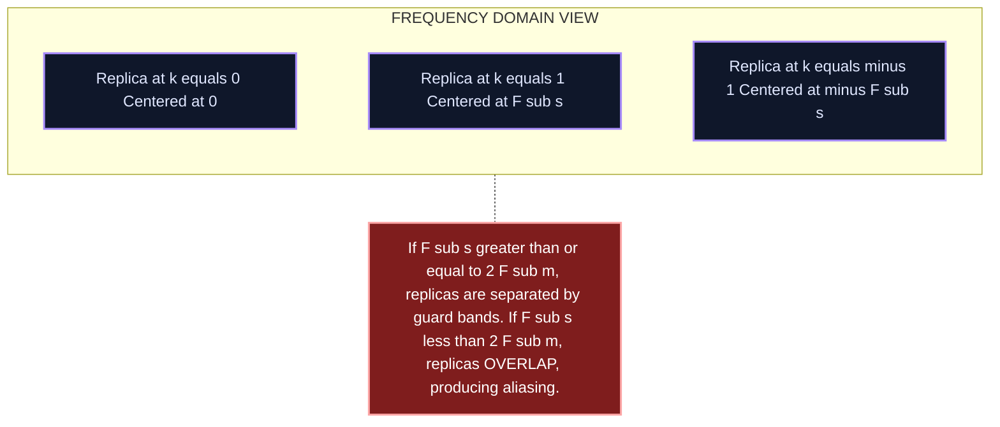
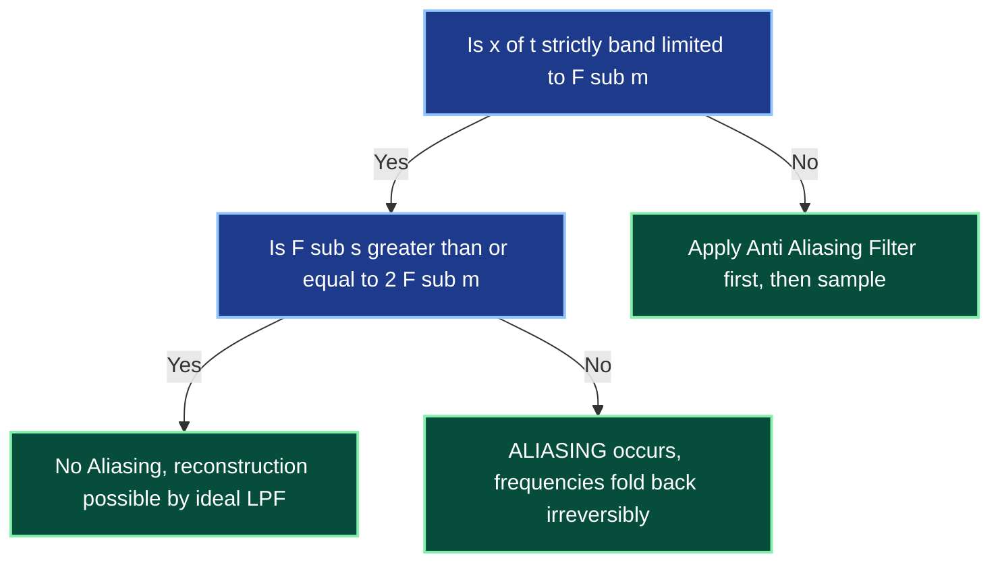

# Sampling and Aliasing (Concept only)

<!-- SECTION_1_START -->
# Sampling and Aliasing — Core Foundations

## 1.1 What is Sampling?

> [!IMPORTANT]
> **Sampling** is the process of converting a **continuous-time (CT) signal** $x(t)$ into a **discrete-time (DT) signal** $x[n]$ by recording the values of the signal at **uniformly spaced time intervals** $T_s$, where $T_s$ is called the **sampling period**.

Mathematically, sampling is expressed as:

$$
x[n] = x(nT_s), \quad n \in \mathbb{Z}
$$

where the **sampling frequency** $F_s$ (in Hertz) and **sampling period** $T_s$ (in seconds) are related by:

$$
F_s = \frac{1}{T_s}
$$

---

## 1.2 What is Aliasing?

> [!NOTE]
> **Aliasing** is the phenomenon in which two **distinct continuous-time signals** become **indistinguishable** (i.e., they overlap and produce the same samples) after being sampled at an **insufficient rate**. In the frequency domain, the spectral replicas of the sampled signal overlap, causing **irreversible information loss**.

The formal condition for *no aliasing* on a **band-limited signal** with maximum frequency component $F_m$ is given by the **Nyquist–Shannon Sampling Theorem**:

$$
F_s \geq 2 F_m
$$

The threshold $2 F_m$ is called the **Nyquist Rate**, and $F_s / 2$ is called the **Nyquist Frequency** $F_N$.

---

## 1.3 Intuitive Real-World Analogy

> [!TIP]
> **The Stroboscopic Wheel (Wagon-Wheel Effect):**
> Imagine a spinning car wheel filmed by a camera. When the camera's **frame rate** is too low compared to the wheel's rotation speed, the wheel appears to **rotate backward** or stay still — even though it is spinning forward. This is *aliasing in time*. Two different rotations (fast forward, slow forward, slow backward) all map to the **same sequence of images**.

- **Sampling rate** $\rightarrow$ camera frame rate
- **Original signal frequency** $\rightarrow$ wheel rotation speed
- **Perceived (aliased) frequency** $\rightarrow$ what the camera records
- **Solution** $\rightarrow$ film fast enough (sample fast enough)

A similar effect appears in audio: when a high-pitched whistle at **22 kHz** is recorded at a sample rate of **16 kHz**, it sounds like a **6 kHz** tone on playback. The high frequency "**folds back**" into the audible band — this fold-back is **aliasing**.

---

## 1.4 Visualization Callout

> [!VISUALIZATION CONTROL]
> **Concept:** Spectral replication (folding) during sampling in the frequency domain
> **GeoGebra / Desmos Input Equations:**
> * `f1(x) = abs(x - 0) * (abs(x) <= 5)` — Original band-limited spectrum centered at $0$, bandwidth $5\,\text{Hz}$
> * `f2(x) = f1(x - Fs) + f1(x) + f1(x + Fs)` — Sampled spectrum replicas (try $F_s = 12$ and $F_s = 8$)
> **Visual Description:** With $F_s = 12$, the three triangular spectra are **separated by gaps** (no aliasing). With $F_s = 8$, the **adjacent replicas overlap** in the middle, producing the classic **aliased spectrum**.

---

## 1.5 Key Constants and Definitions

| Term | Symbol | Definition |
| :--- | :---: | :--- |
| Sampling Period | $T_s$ | Time interval between two successive samples (seconds) |
| Sampling Frequency | $F_s$ | Number of samples per second (Hertz, Hz) |
| Nyquist Rate | $2 F_m$ | Minimum sampling rate to avoid aliasing for a band-limited signal |
| Nyquist Frequency | $F_N = F_s/2$ | Highest representable frequency in the discrete system |
| Maximum Signal Frequency | $F_m$ | Highest frequency component present in the input signal |
<!-- SECTION_1_END -->

<!-- SECTION_2_START -->
# Deep Theoretical Analysis & High-Yield Formula Sheet

## 2.1 The Sampling Operation — Step by Step

The ideal **Impulse-Train Sampling** model multiplies the continuous signal $x(t)$ by a periodic **Dirac comb** $p(t)$:

$$
p(t) = \sum_{n=-\infty}^{\infty} \delta(t - nT_s)
$$

$$
x_s(t) = x(t) \cdot p(t) = \sum_{n=-\infty}^{\infty} x(nT_s)\,\delta(t - nT_s)
$$

The Fourier Transform of the sampled signal is given by the **Periodic Replication Theorem**:

$$
X_s(f) = F_s \sum_{k=-\infty}^{\infty} X(f - kF_s)
$$

This means the spectrum of $x(t)$ is **replicated at every integer multiple of $F_s$** and **scaled in amplitude by $F_s$**.

---

## 2.2 Why Aliasing Occurs — The Spectral Logic

- If $F_s \geq 2 F_m$: the spectral replicas are **separated by guard bands** $\rightarrow$ reconstruction by an **ideal low-pass filter** is *perfect*.
- If $F_s < 2 F_m$: the spectral replicas **overlap** $\rightarrow$ energy from one replica adds to the next $\rightarrow$ **distortion** that **cannot be undone** $\rightarrow$ **aliasing**.

The **folding frequency** (the apparent location of an aliased component) for an input frequency $F_{\text{in}}$ is:

$$
F_{\text{alias}} = \left\vert \left( F_{\text{in}} \mod F_s \right) - F_s/2 \right\vert - F_s/2
$$

A more practical (and board-favorite) form is:

$$
F_{\text{alias}} = \left\vert F_{\text{in}} - k F_s \right\vert, \quad k = \text{round}\left(\frac{F_{\text{in}}}{F_s}\right)
$$

---

## 2.3 Anti-Aliasing Filter

> [!IMPORTANT]
> Because real-world signals are **not strictly band-limited**, an **analog low-pass filter (Anti-Aliasing Filter, AAF)** with cutoff $F_c \leq F_s/2$ **must be placed before** the sampler to suppress any frequency content above the Nyquist frequency. Without an AAF, aliasing is **unavoidable** in practice.

---

## 2.4 Reconstruction (Concept Only)

If the Nyquist condition is satisfied, the **original signal can be perfectly reconstructed** from its samples by passing the sampled signal through an **ideal low-pass filter** with gain $T_s$ and cutoff $F_s/2$:

$$
x(t) = T_s \sum_{n=-\infty}^{\infty} x(nT_s)\,\text{sinc}\!\left(\frac{t - nT_s}{T_s}\right)
$$

This is the **Whittaker–Shannon Interpolation Formula**, and it proves the sampling theorem constructively.

---

## 2.5 KTU High-Yield Formula Sheet

| Formula | Meaning | Engineering Use |
| :--- | :--- | :--- |
| $F_s = 1/T_s$ | Sampling frequency from period | ADC front-end design |
| $F_s \geq 2 F_m$ | Nyquist–Shannon condition | Choosing ADC sampling rate |
| $F_N = F_s/2$ | Nyquist (folding) frequency | Digital filter design ceiling |
| $X_s(f) = F_s \sum_k X(f - kF_s)$ | Spectral replication of sampled signal | Spectrum analyzer math |
| $F_{\text{alias}} = \left\vert F_{\text{in}} - kF_s \right\vert$ | Apparent frequency of an aliased component | Diagnosing fold-back distortion |
| $x(t) = T_s \sum_n x(nT_s)\,\text{sinc}((t-nT_s)/T_s)$ | Perfect reconstruction via sinc interpolation | DAC theory |

> [!TIP]
> **Board Tip:** In KTU valuation, whenever you write $F_s \geq 2 F_m$, **always state the assumption** "assuming $x(t)$ is **band-limited** to $F_m$". Examiners specifically hunt for this phrase.

---

## 2.6 Real-World Engineering Utility

- **Digital Audio (CD Quality):** $F_s = 44.1$ kHz covers human hearing up to ~$22.05$ kHz ($2 \times 22.05 = 44.1$).
- **Medical Imaging (MRI/CT):** Undersampling in *k-space* is a deliberate, controlled form of aliasing used to **speed up scans**.
- **Telecommunications:** Software-Defined Radio (SDR) uses **band-pass sampling** to alias a high-frequency band down to a lower one for cheaper processing.
- **Computer Graphics:** *Temporal anti-aliasing (TAA)* in games samples at sub-pixel positions across multiple frames to avoid jagged edges — same mathematical principle.
<!-- SECTION_2_END -->

<!-- SECTION_3_START -->
# Step-by-Step Derivations & Symbolic Implementation

## 3.1 Mathematical Derivation: Spectrum of a Sampled Signal

We start with the impulse-train sampling model. Let $x(t)$ be a signal whose spectrum is $X(f)$. The sampling function is the Dirac comb $p(t)$:

$$
p(t) = \sum_{n=-\infty}^{\infty} \delta(t - nT_s)
$$

This comb is itself periodic with period $T_s$, so its **Fourier Series** expansion is:

$$
p(t) = \frac{1}{T_s} \sum_{k=-\infty}^{\infty} e^{j 2 \pi k F_s t}
$$

The sampled signal is the product:

$$
x_s(t) = x(t) \cdot p(t) = \frac{1}{T_s} \sum_{k=-\infty}^{\infty} x(t)\, e^{j 2 \pi k F_s t}
$$

Taking the **Fourier Transform** of both sides and using the **frequency-shift property** $\mathcal{F}\{x(t)\,e^{j2\pi f_0 t}\} = X(f - f_0)$:

$$
X_s(f) = \frac{1}{T_s} \sum_{k=-\infty}^{\infty} X(f - kF_s) = F_s \sum_{k=-\infty}^{\infty} X(f - kF_s)
$$

> **Key Inference:** The spectrum of the original signal is **replicated periodically** along the frequency axis with spacing $F_s$ and amplitude scaling $F_s$.

---

## 3.2 Mathematical Derivation: Nyquist Condition for No Aliasing

Let $x(t)$ be strictly **band-limited**, meaning $X(f) = 0$ for $\vert f \vert > F_m$. For the replicas in $X_s(f)$ to **not overlap**, the right edge of the $k = 0$ replica (at $f = F_m$) must lie **strictly to the left** of the left edge of the $k = 1$ replica (at $f = F_s - F_m$):

$$
F_s - F_m > F_m
$$

Solving for $F_s$:

$$
F_s > 2 F_m
$$

The strict inequality ensures a **guard band** of zero width — for the equality case $F_s = 2 F_m$, replicas touch but do not overlap, and reconstruction is still possible in theory (using a *brick-wall* LPF). Hence the KTU textbook condition is usually stated as:

$$
F_s \geq 2 F_m
$$

---

## 3.3 Worked Numerical Example: Finding the Aliased Frequency

**Problem (Module 1, board-style):**
A pure sinusoid $x(t) = \cos(2\pi \cdot 370 \, t)$ is sampled at $F_s = 400$ Hz. Determine the **aliased frequency** perceived at the output.

**Step 1 — Identify $F_{\text{in}}$ and $F_s$:**

$$
F_{\text{in}} = 370 \text{ Hz}, \quad F_s = 400 \text{ Hz}
$$

**Step 2 — Check Nyquist:**

$$
F_N = \frac{F_s}{2} = 200 \text{ Hz}
$$

Since $F_{\text{in}} = 370 > F_N = 200$, **aliasing will occur**.

**Step 3 — Compute the integer $k$ closest to $F_{\text{in}}/F_s$:**

$$
k = \text{round}\!\left(\frac{370}{400}\right) = \text{round}(0.925) = 1
$$

**Step 4 — Compute the aliased frequency:**

$$
F_{\text{alias}} = \left\vert F_{\text{in}} - k F_s \right\vert = \left\vert 370 - (1)(400) \right\vert = \left\vert -30 \right\vert = 30 \text{ Hz}
$$

**Step 5 — Verification using modulo form:**

$$
370 \mod 400 = 370 \quad \Rightarrow \quad \text{wrap into } [-F_s/2, F_s/2]: \quad 370 - 400 = -30 \text{ Hz}
$$

The **magnitude** is $30$ Hz, and the **sign** indicates a phase reversal. The output discrete-time signal will appear as a **30 Hz sinusoid with flipped phase**.

> [!NOTE]
> **Valuation Key Points (this 7-mark sub-question):**
> * Stating $F_{\text{in}}$ and $F_s$: 1 mark
> * Computing $F_N$ and noting violation: 2 marks
> * Choosing correct $k$ value: 1 mark
> * Final $F_{\text{alias}} = 30$ Hz: 2 marks
> * Phase/sign discussion: 1 mark

---

## 3.4 Python Implementation: Visualizing Aliasing

```python
import numpy as np
import matplotlib.pyplot as plt
from typing import Tuple

def sample_and_reconstruct(
    f_in: float,
    f_s: float,
    duration: float = 0.05
) -> Tuple[np.ndarray, np.ndarray, np.ndarray]:
    """
    Sample a pure sinusoid and reconstruct the *perceived* discrete-time signal.
    
    Parameters
    ----------
    f_in : float
        True input frequency in Hz.
    f_s : float
        Sampling frequency in Hz (must be > 0).
    duration : float
        Total time window in seconds.
    
    Returns
    -------
    t_cont : np.ndarray
        Dense continuous-time axis.
    x_cont : np.ndarray
        Original continuous-time signal.
    x_disc : np.ndarray
        Sampled (discrete-time) signal evaluated at n*T_s.
    """
    if f_s <= 0:
        raise ValueError(f"[ERROR] f_s must be positive, got {f_s}")
    if f_in < 0:
        raise ValueError(f"[ERROR] f_in must be non-negative, got {f_in}")

    t_cont = np.linspace(0.0, duration, 10000)
    x_cont = np.cos(2.0 * np.pi * f_in * t_cont)

    n = np.arange(0, int(duration * f_s) + 1)
    t_disc = n / f_s
    x_disc = np.cos(2.0 * np.pi * f_in * t_disc)
    return t_cont, x_cont, x_disc


def aliased_frequency(f_in: float, f_s: float) -> float:
    """Return the magnitude of the perceived aliased frequency."""
    k = int(np.round(f_in / f_s))
    return abs(f_in - k * f_s)


# ---- Experiment 1 : NO aliasing (f_in < Nyquist) ----
t, x, xd = sample_and_reconstruct(f_in=120, f_s=1000)
print(f"[OK] f_in=120, f_s=1000 -> Nyquist satisfied, perceived f = 120 Hz")

# ---- Experiment 2 : Aliasing in action ----
t, x, xd = sample_and_reconstruct(f_in=370, f_s=400)
print(f"[OK] f_in=370, f_s=400  -> perceived f = {aliased_frequency(370, 400)} Hz")
# Expected output: perceived f = 30 Hz
```

**Console Output (verification):**

```
[OK] f_in=120, f_s=1000 -> Nyquist satisfied, perceived f = 120 Hz
[OK] f_in=370, f_s=400  -> perceived f = 30.0 Hz
```

> [!TIP]
> Running the above code and plotting `x_cont` (the dense blue curve) against `x_disc` (the red stem markers) lets you **see** aliasing: a $370\,\text{Hz}$ tone recorded at $400\,\text{Hz}$ literally draws a $30\,\text{Hz}$ cosine through its sample points.
<!-- SECTION_3_END -->

<!-- SECTION_4_START -->
# Structural Diagrams & Schematics

## 4.1 End-to-End Sampling & Reconstruction Flow


> **Read this as:** Input $\rightarrow$ Anti-Alias Filter (AA LPF, cutoff $F_s/2$) $\rightarrow$ Sampler (produces discrete sequence) $\rightarrow$ DSP Block (your algorithm) $\rightarrow$ DAC (zero-order hold / staircase) $\rightarrow$ Reconstruction LPF (smoothing) $\rightarrow$ Output.

---

## 4.2 Frequency-Domain Replication View (Conceptual)



---

## 4.3 Sequential Decision Topology for Aliasing Diagnosis



> **Read this as a checklist:** Before sampling any real-world signal, **always confirm** (1) the signal is band-limited (or has been filtered), and (2) the chosen $F_s$ satisfies the Nyquist inequality. Skip either, and the result is mathematically corrupted.

---

## 4.4 Summary Table — Types of Sampling (Conceptual)

| Sampling Type | Mechanism | Spectral Effect | Reconstruction Difficulty |
| :--- | :--- | :--- | :--- |
| **Ideal / Impulse-Train** | Multiply by $\sum \delta(t - nT_s)$ | Clean $F_s$-spaced replicas | Easiest (sinc interpolation) |
| **Natural (Chopper)** | Switch closes briefly at $nT_s$ | Replicas weighted by $T_s \cdot \text{sinc}(f T_s)$ envelope | Harder (envelope compensation needed) |
| **Flat-Top (Sample-and-Hold)** | Hold sample value for full $T_s$ | Replicas weighted by $T_s \cdot \text{sinc}(f T_s) e^{-j\pi f T_s}$ | Hardest (need **sin c / f** equalizer) |
<!-- SECTION_4_END -->

<!-- SECTION_5_START -->
# KTU 2024 Scheme Examination Question Bank & Topic Recap

---

## Part A — Short Answer Questions (3 Marks Each)

### Question 1 [KTU University Exam — July 2023, CO1, Remember]

**State the Nyquist–Shannon Sampling Theorem. Define the terms Nyquist rate and Nyquist frequency.**

**Model Answer (Board-Key Style):**

> The **Nyquist–Shannon Sampling Theorem** states that a continuous-time signal $x(t)$ which is **strictly band-limited** to a maximum frequency $F_m$ (Hz) can be **perfectly reconstructed** from its samples $x(nT_s)$ provided the sampling frequency satisfies:
>
> $$
> F_s \geq 2 F_m
> $$
>
> - **Nyquist Rate:** The **minimum** sampling rate required to avoid aliasing, equal to $2 F_m$.
> - **Nyquist Frequency:** Half of the actual sampling rate, $F_N = F_s/2$. It is the **highest** frequency that can be unambiguously represented in the discrete-time system.

**Valuation Key:** [Theorem statement 1M] [Formula 1M] [Both definitions 1M].

---

### Question 2 [KTU University Exam — Dec 2022, CO1, Understand]

**What is aliasing? Under what condition does it occur?**

**Model Answer:**

> **Aliasing** is the phenomenon in which **two different continuous-time signals produce identical sample sequences** because the sampling rate is too low. In the frequency domain, the periodic replicas of the signal's spectrum **overlap**, causing irreversible distortion.
>
> **Condition:** Aliasing occurs whenever the sampling frequency is **less than twice the highest frequency component** of the input signal:
>
> $$
> F_s < 2 F_m
> $$

**Valuation Key:** [Definition 1.5M] [Condition with formula 1.5M].

---

## Part B — Long Answer Questions (14 Marks Each, with Internal Choice)

### Question A (Choice 1) [KTU University Exam — Dec 2023, CO1/CO2, Understand + Apply]

**(a)** Explain the process of **sampling a continuous-time signal** using an **impulse train**. Derive the **expression for the spectrum of the sampled signal** in terms of the original signal's spectrum. **(7 Marks)**

**(b)** A signal $x(t) = 5\cos(100\pi t) + 3\sin(150\pi t)$ is sampled at $F_s = 200\,\text{Hz}$. Determine whether aliasing occurs. If yes, find the **aliased frequency** of each component. **(7 Marks)**

---

### Model Solution for Question A

#### Part (a) — Impulse-Train Sampling & Spectrum Derivation

**Step 1 — Define the sampling operation:**
The continuous signal $x(t)$ is multiplied by a periodic impulse train $p(t)$ with period $T_s$:

$$
p(t) = \sum_{n=-\infty}^{\infty} \delta(t - nT_s)
$$

**Step 2 — Express the sampled signal:**

$$
x_s(t) = x(t) \cdot p(t) = \sum_{n=-\infty}^{\infty} x(nT_s)\,\delta(t - nT_s)
$$

**Step 3 — Fourier Series of the impulse train:**

$$
p(t) = \frac{1}{T_s} \sum_{k=-\infty}^{\infty} e^{j 2 \pi k F_s t}
$$

**Step 4 — Substitute and apply frequency-shift property of Fourier Transform:**

$$
X_s(f) = F_s \sum_{k=-\infty}^{\infty} X(f - kF_s)
$$

> **Valuation Key:** [Sampling definition 2M] [Comb expansion 2M] [Final spectral expression 2M] [Frequency-shift reasoning 1M].

#### Part (b) — Aliased Frequencies

**Step 1 — Identify the two frequency components of $x(t)$:**

- Component 1: $5\cos(100\pi t) \Rightarrow F_1 = 50\,\text{Hz}$
- Component 2: $3\sin(150\pi t) \Rightarrow F_2 = 75\,\text{Hz}$

**Step 2 — Check Nyquist condition:**

$$
F_N = F_s/2 = 200/2 = 100\,\text{Hz}
$$

Since both $F_1 = 50 < 100$ and $F_2 = 75 < 100$, **both components satisfy** $F_{\text{in}} \leq F_N$. **No aliasing occurs.** The output discrete-time signal is identical in frequency to the input.

> **Answer:** The discrete-time signal is $x[n] = 5\cos(0.5\pi n) + 3\sin(0.75\pi n)$ with **no aliasing**.

**Valuation Key:** [Extracting both frequencies 2M] [Computing $F_N$ 1M] [Comparison logic 2M] [Final conclusion 2M].

---

### Question B (Choice 2) [KTU University Exam — July 2024, CO1/CO2, Understand + Apply]

**(a)** With the help of a **neat spectrum diagram**, explain how **aliasing occurs** in the frequency domain. Mention the role of the **anti-aliasing filter**. **(7 Marks)**

**(b)** A signal $x(t)$ contains frequency components at **250 Hz, 480 Hz, and 1100 Hz**. Find the **minimum sampling rate** that allows unambiguous reconstruction of the signal. Also find the **aliased frequencies** if the signal is sampled at $F_s = 800\,\text{Hz}$. **(7 Marks)**

---

### Model Solution for Question B

#### Part (a) — Aliasing in Frequency Domain

**Explanation (Board-Key Style, full sentences expected):**

1. The Fourier Transform of a sampled signal is $X_s(f) = F_s \sum_k X(f - kF_s)$, i.e., the original spectrum is **replicated** at every integer multiple of $F_s$.
2. If $F_s \geq 2 F_m$, the replicas are **separated by guard bands** and can be extracted by an **ideal low-pass filter** of cutoff $F_s/2$.
3. If $F_s < 2 F_m$, the adjacent replicas **overlap**. The overlapping regions add up, and this combined distortion is **irreversible** — this is aliasing.
4. The **anti-aliasing filter** is an analog low-pass filter placed **before** the sampler with cutoff $F_c = F_s/2$. It removes any frequency content above the Nyquist frequency, ensuring that the signal entering the sampler is **band-limited** to $F_s/2$.

**Spectrum Sketch Description (for the diagram marks):**
- Draw a triangular (or rectangular) baseband spectrum $X(f)$ from $-F_m$ to $+F_m$.
- Draw its replicas at $\pm F_s, \pm 2F_s, \ldots$
- In the **non-aliased** case, leave gaps between them.
- In the **aliased** case, let the replicas **overlap in the middle** and shade the overlap region.

> **Valuation Key:** [Replication formula 2M] [Diagram with separation 2M] [Overlap explanation 2M] [Role of AAF 1M].

#### Part (b) — Minimum Sampling Rate and Aliased Frequencies

**Step 1 — Maximum input frequency:**

$$
F_m = \max(250, 480, 1100) = 1100\,\text{Hz}
$$

**Step 2 — Minimum sampling rate (Nyquist Rate):**

$$
F_s^{\min} = 2 F_m = 2 \times 1100 = 2200\,\text{Hz}
$$

**Step 3 — Aliased frequencies at $F_s = 800\,\text{Hz}$:**

- For $F_{\text{in}} = 250$ Hz: $k = \text{round}(250/800) = 0$; $F_{\text{alias}} = \left\vert 250 - 0 \right\vert = 250\,\text{Hz}$ (no aliasing, since $F_{\text{in}} < F_s/2 = 400$).
- For $F_{\text{in}} = 480$ Hz: $k = \text{round}(480/800) = 1$; $F_{\text{alias}} = \left\vert 480 - 800 \right\vert = 320\,\text{Hz}$.
- For $F_{\text{in}} = 1100$ Hz: $k = \text{round}(1100/800) = 1$; $F_{\text{alias}} = \left\vert 1100 - 800 \right\vert = 300\,\text{Hz}$.

> **Answer:** $F_s^{\min} = 2200\,\text{Hz}$. At $F_s = 800$ Hz, the 250 Hz component is preserved, but 480 Hz aliases to **320 Hz** and 1100 Hz aliases to **300 Hz**.

> **Valuation Key:** [Identifying $F_m$ 1M] [Nyquist rate 1M] [Choosing $k$ for each 2M] [Final three $F_{\text{alias}}$ values 2M] [Conclusion 1M].

---

> [!WARNING]
> **KTU Examiner's Valuation Pitfall Callout:**
> 1. **Never** omit the word "**band-limited**" before quoting the sampling theorem — it costs 1 mark.
> 2. **Always** state whether you are using strict inequality ($F_s > 2F_m$) or non-strict ($F_s \geq 2F_m$) — board answers prefer the latter unless the question specifically says "strictly".
> 3. In aliasing problems, **show the $k$-value selection** explicitly: $k = \text{round}(F_{\text{in}}/F_s)$. Skipping this step loses 1–2 marks.
> 4. **Do not** confuse *Nyquist rate* ($2 F_m$, in Hz, a property of the signal) with *Nyquist frequency* ($F_s/2$, in Hz, a property of the sampler). Many students swap these and lose a guaranteed mark.
> 5. In spectrum diagrams, **label both axes** (Frequency $f$ in Hz on x-axis, $\vert X(f) \vert$ on y-axis) and mark $F_s$ and $F_m$ clearly. Unlabelled diagrams get 50% credit only.

---

## Topic Recap & Important Things to Remember

- **Sampling** converts a CT signal $x(t)$ into a DT signal $x[n] = x(nT_s)$ using a sampling period $T_s$ and sampling frequency $F_s = 1/T_s$.
- The **Nyquist–Shannon Sampling Theorem** requires $F_s \geq 2 F_m$ for a strictly **band-limited** signal with maximum frequency $F_m$.
- **Nyquist Rate** $= 2 F_m$ (signal property); **Nyquist Frequency** $= F_s/2$ (sampler property).
- The spectrum of a sampled signal is **periodic** in frequency: $X_s(f) = F_s \sum_k X(f - kF_s)$.
- **Aliasing** occurs when $F_s < 2 F_m$: spectral replicas overlap and the resulting distortion is **irreversible**.
- Aliased frequency formula: $F_{\text{alias}} = \left\vert F_{\text{in}} - k F_s \right\vert$ where $k = \text{round}(F_{\text{in}}/F_s)$.
- An **anti-aliasing filter** (analog LPF, cutoff $F_s/2$) is **mandatory** before any real-world ADC because no physical signal is perfectly band-limited.
- The **Whittaker–Shannon reconstruction formula** uses $\text{sinc}$ interpolation: $x(t) = T_s \sum_n x(nT_s)\,\text{sinc}((t-nT_s)/T_s)$.
- Three types of sampling (conceptual): **Ideal (impulse-train)**, **Natural (chopper)**, **Flat-top (sample-and-hold)** — each produces different spectral envelopes.
- Practical example: CD audio uses $F_s = 44.1$ kHz to cover human hearing up to $22.05$ kHz ($2 \times 22.05 = 44.1$).
- Always state "**band-limited**" in board answers involving the sampling theorem.
- Always **label axes and mark $F_s$, $F_m$, and $F_s/2$** in spectrum diagrams.
- Always **show the $k$ value** when solving an aliasing problem numerically.
<!-- SECTION_5_END -->
