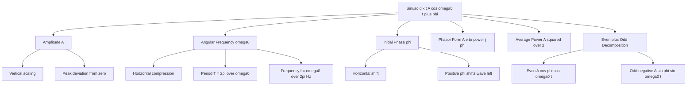
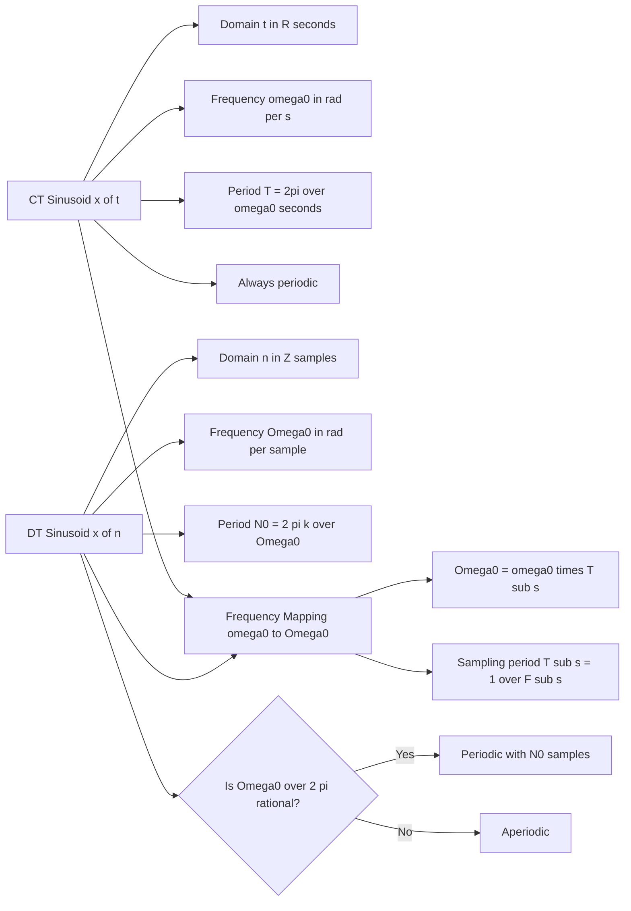
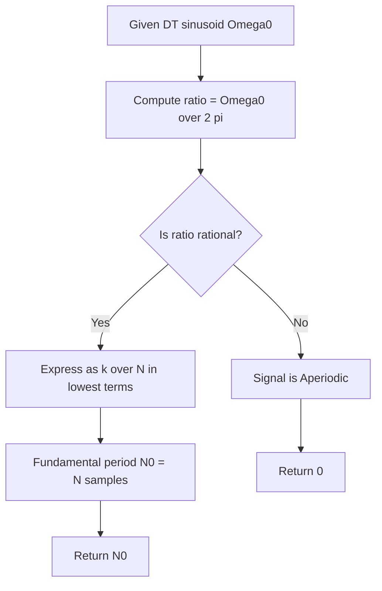
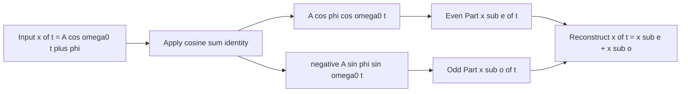

# Sinusoids

<!-- SECTION_1_START -->

# Sinusoids — 1D Signals Foundations

> [!IMPORTANT]
> **KTU 2024 Scheme — Module 1 Anchor Concept**
> Sinusoids are the *fundamental building blocks* of all periodic signals. Every periodic signal can be reconstructed from sums of sinusoids (Fourier Series), and every aperiodic signal can be expressed as a continuous integral of them (Fourier Transform). Mastering sinusoids means unlocking the entire frequency-domain toolbox of Signals and Systems.

## 1.1 Formal Definition

A **sinusoidal signal** is a smooth, periodic oscillation described by a sine or cosine function of a linear argument. In 1-D signal theory, we distinguish between two principal forms.

### Continuous-Time (CT) Sinusoid

A real-valued, continuous-time sinusoid is mathematically defined as:

$$
x(t) = A \cos(\omega_0 t + \phi)
$$

Equivalently expressed with sine:

$$
x(t) = A \sin(\omega_0 t + \phi)
$$

where the operational parameters are:
- $A$ is the **amplitude** (real constant, $A > 0$).
- $\omega_0$ is the **angular frequency** measured in **radians per second** (rad/s).
- $\phi$ is the **initial phase** measured in **radians** (rad).
- $t$ is continuous time in **seconds** (s).

The fundamental period $T$ of the CT sinusoid is:

$$
T = \frac{2\pi}{\omega_0} \quad \text{seconds}
$$

The ordinary frequency $f$ (in Hertz) is:

$$
f = \frac{1}{T} = \frac{\omega_0}{2\pi} \quad \text{Hz}
$$

### Discrete-Time (DT) Sinusoid

A real-valued, discrete-time sinusoid is defined only on integer sample indices $n \in \mathbb{Z}$:

$$
x[n] = A \cos(\Omega_0 n + \phi)
$$

where:
- $A$ is the **amplitude** (real constant, $A > 0$).
- $\Omega_0$ is the **normalized angular frequency** measured in **radians per sample** (rad/sample).
- $\phi$ is the **initial phase** measured in **radians** (rad).
- $n$ is the discrete integer sample index (dimensionless).

> [!NOTE]
> **Why the notation shift $\omega_0 \rightarrow \Omega_0$?**
> In CT, $\omega_0$ has units of rad/s because $t$ is in seconds. In DT, $n$ is dimensionless, so the frequency variable must be renormalized to rad/sample. This dimensional bookkeeping is critical for KTU board answers.

## 1.2 Conceptual Analogy — The Shadow of a Spinning Wheel

Imagine a bicycle wheel mounted on a wall, spinning at a constant angular velocity $\omega_0$. Stick a small bright pebble to the rim. As the wheel rotates, the horizontal shadow cast by the pebble onto a straight line on the floor traces out an exact **cosine curve**. If you could *sample* the shadow's position once every second, you would obtain a **discrete-time sinusoid** — the same shape, but evaluated only at integer instants.

- The **radius of the wheel** is the amplitude $A$.
- The **rotation speed** is the angular frequency $\omega_0$.
- The **starting angle of the pebble** is the initial phase $\phi$.
- **Sampling once per revolution** captures the wheel's motion at a different frequency entirely — this is exactly how DT and CT sinusoids can differ in subtle ways.

This wheel-shadow model also makes one deep fact obvious: a sinusoid is really the **real part of a uniformly rotating arrow** in the complex plane. This is the heart of the **Euler / Phasor** representation used everywhere in electrical engineering.

## 1.3 Why Sinusoids Matter — Engineering Utility

| Engineering Domain | Use of Sinusoids |
|---|---|
| AC Power Systems | Mains electricity ($f = 50$ Hz in India, **$60$ Hz** in US) is a perfect sinusoid. |
| Audio & Music | Pitch corresponds to sinusoid frequency; timbre is built from harmonic sums. |
| Communication | Carrier waves $A_c \cos(2\pi f_c t)$ modulate information signals. |
| Control Systems | Reference trajectories are sinusoidal for Bode-plot analysis. |
| DSP | Discrete sinusoids are the eigenvectors of Linear Time-Invariant (LTI) systems. |

> [!TIP]
> **KTU Examiner Insight:** Whenever a question asks "Why are sinusoids important?", the deepest correct answer is: *Sinusoids are the eigenfunctions of all Linear Time-Invariant (LTI) systems*. A sinusoid entering an LTI system emerges as a sinusoid of the **same frequency**, only its amplitude and phase are altered. This is the single most exam-relevant property of sinusoids.

## 1.4 Visualization Setup

> [!VISUALIZATION CONTROL]
> **Concept:** Continuous-Time Sinusoid $x(t) = A\cos(\omega_0 t + \phi)$ over multiple periods.
>
> **GeoGebra / Desmos Input Equations:**
> * `A = 1`
> * `omega = 2*pi` *(try `pi/2`, `pi`, `2*pi`, `4*pi` and observe period change)*
> * `phi = pi/3`
> * `f(t) = A*cos(omega*t + phi)`
> * `g(t) = A*sin(omega*t + phi)` *(the sine version is just a phase-shifted cosine)*
>
> **Visual Description:** You should see a smooth wave oscillating between $+A$ and $-A$. The horizontal distance between two consecutive peaks is exactly $T = 2\pi/\omega$. Shifting $\phi$ slides the wave left or right without changing its shape.

> [!VISUALIZATION CONTROL]
> **Concept:** Discrete-Time Sinusoid $x[n] = \cos(\Omega_0 n)$ — stem plot.
>
> **GeoGebra / Desmos Input (using points):**
> * `A = 1`
> * `Omega = pi/4`
> * `P(n) = (n, A*cos(Omega*n))` for $n = 0, 1, 2, \dots, 32$
>
> **Visual Description:** You will see vertical stems only at integer horizontal positions. The pattern between samples is *undefined* (it is *not* a smooth curve). When $\Omega_0$ is small (e.g., $\pi/8$), the stem heights form a clear wave; when $\Omega_0$ approaches $\pi$, the oscillation appears maximally rapid (alternating sign).

<!-- SECTION_1_END -->

<!-- SECTION_2_START -->

# Deep Theoretical Analysis & KTU High-Yield Formula Sheet

## 2.1 Anatomy of a Continuous-Time Sinusoid

A CT sinusoid $x(t) = A\cos(\omega_0 t + \phi)$ carries **three independent physical parameters**:

1. **Amplitude $A$** — Vertical scaling. Determines the peak deviation from zero.
   * Units: same as the signal itself (Volts, Amps, Pascals, etc.).
2. **Angular Frequency $\omega_0$** — Horizontal compression/stretching.
   * Units: **rad/s**.
   * Higher $\omega_0 \Rightarrow$ faster oscillations, smaller period $T$.
3. **Initial Phase $\phi$** — Horizontal shift.
   * Units: **radians**.
   * Positive $\phi$ shifts the wave to the **left** (toward $t < 0$).
   * Negative $\phi$ shifts the wave to the **right** (toward $t > 0$).

### Phasor Representation (Euler Form)

Using Euler's identity $e^{j\theta} = \cos(\theta) + j\sin(\theta)$, a real sinusoid can be written compactly as the **real part of a complex rotating phasor**:

$$
x(t) = A\cos(\omega_0 t + \phi) = \text{Re}\left\{ A e^{j\phi} \cdot e^{j\omega_0 t} \right\}
$$

The complex constant $A e^{j\phi}$ is called the **phasor** $\mathbf{X}$:

$$
\mathbf{X} = A e^{j\phi}
$$

> [!NOTE]
> **Why this matters for KTU:** In AC circuit analysis, every voltage/current sinusoid is fully described by its phasor. Ohm's law, KVL, and KCL become algebraic equations in the phasor domain — a massive simplification over solving differential equations in the time domain.

## 2.2 Anatomy of a Discrete-Time Sinusoid

The DT sinusoid $x[n] = A\cos(\Omega_0 n + \phi)$ has the same three parameters **plus one subtle twist**: periodicity is *not* automatic.

### Periodicity Condition for DT Sinusoids

A DT sinusoid is periodic if and only if there exists a positive integer $N$ such that:

$$
x[n + N] = x[n] \quad \text{for all } n \in \mathbb{Z}
$$

Substituting:

$$
A\cos(\Omega_0 (n + N) + \phi) = A\cos(\Omega_0 n + \phi)
$$

This requires:

$$
\Omega_0 N = 2\pi k \quad \text{for some integer } k \in \mathbb{Z}
$$

Therefore the **periodicity condition** is:

$$
\boxed{\;\frac{\Omega_0}{2\pi} = \frac{k}{N} \quad \text{(rational number)}\;}
$$

> [!WARNING]
> **KTU Board Pitfall:** A CT sinusoid is *always* periodic for any real $\omega_0 > 0$. A DT sinusoid is periodic **only when** $\Omega_0/(2\pi)$ is a **rational number**. If $\Omega_0 = \sqrt{2}$ rad/sample, the signal is *aperiodic* — a frequent exam trap.

### Fundamental Period of a DT Sinusoid

If $\Omega_0/(2\pi) = k/N$ in lowest terms (i.e., $\gcd(k, N) = 1$), the **fundamental period** is:

$$
N_0 = N = \frac{2\pi k}{\Omega_0}
$$

## 2.3 Frequency Equivalence — The $2\pi$ Mystery

The relationship between CT and DT sinusoids is governed by the **sampling rate** $F_s$ (samples per second). If a CT sinusoid $x(t) = A\cos(\omega_0 t + \phi)$ is sampled at $t = nT_s$ where $T_s = 1/F_s$, the result is:

$$
x[n] = A\cos(\omega_0 n T_s + \phi) = A\cos(\Omega_0 n + \phi)
$$

with the mapping:

$$
\Omega_0 = \omega_0 T_s = \frac{\omega_0}{F_s}
$$

Equivalently:

$$
f_0 = \frac{\Omega_0}{2\pi} F_s \quad \text{Hz}
$$

| Quantity | CT Domain | DT Domain |
|---|---|---|
| Independent variable | $t$ (s) | $n$ (dimensionless) |
| Frequency variable | $\omega_0$ (rad/s) | $\Omega_0$ (rad/sample) |
| Ordinary frequency | $f_0 = \omega_0 / 2\pi$ (Hz) | cycles per $N$ samples |
| Period | $T = 2\pi/\omega_0$ (s) | $N_0 = 2\pi k / \Omega_0$ (samples) |
| Always periodic? | **Yes** for any real $\omega_0$ | **Only if** $\Omega_0/2\pi$ is rational |

## 2.4 Even / Odd Decomposition

Any real sinusoid can be split into its even and odd parts using the standard identities:

$$
\cos(\omega_0 t + \phi) = \cos\phi \cos(\omega_0 t) - \sin\phi \sin(\omega_0 t)
$$

Therefore:

$$
x(t) = A\cos(\omega_0 t + \phi) = \underbrace{A\cos\phi \cos(\omega_0 t)}_{\text{even part}} \; - \; \underbrace{A\sin\phi \sin(\omega_0 t)}_{\text{odd part}}
$$

The even part is $x_e(t) = A\cos\phi \cos(\omega_0 t)$ and the odd part is $x_o(t) = -A\sin\phi \sin(\omega_0 t)$.

## 2.5 Energy and Power of Sinusoids

### Total Energy (over all time)

For a CT sinusoid, the total energy is:

$$
E_\infty = \int_{-\infty}^{\infty} A^2 \cos^2(\omega_0 t + \phi) \, dt
$$

Because the integrand does not decay to zero, this integral **diverges**:

$$
E_\infty = \infty
$$

### Average Power

A sinusoid is a **power signal** (infinite energy, finite non-zero power). The time-averaged power is:

$$
P_\infty = \lim_{T \to \infty} \frac{1}{2T} \int_{-T}^{T} A^2 \cos^2(\omega_0 t + \phi) \, dt
$$

Using the identity $\cos^2(\theta) = \frac{1}{2}(1 + \cos(2\theta))$:

$$
P_\infty = \lim_{T \to \infty} \frac{1}{2T} \int_{-T}^{T} \frac{A^2}{2}\bigl(1 + \cos(2\omega_0 t + 2\phi)\bigr) \, dt
$$

The cosine term averages to zero, leaving:

$$
\boxed{\;P_\infty = \frac{A^2}{2}\;}
$$

> [!IMPORTANT]
> **KTU Memorize:** The average power of a sinusoid equals **half the square of its amplitude**. This is independent of $\omega_0$ and $\phi$.

The RMS (Root Mean Square) value follows directly:

$$
x_{\text{rms}} = \sqrt{P_\infty} = \frac{A}{\sqrt{2}}
$$

This is why household AC voltage is quoted as **$230$ V RMS** in India (peak amplitude $A = 230\sqrt{2} \approx 325$ V).

## 2.6 KTU Formula Sheet — Master Cheat Table

| # | Formula | Meaning | Domain |
|---|---|---|---|
| 1 | $x(t) = A\cos(\omega_0 t + \phi)$ | CT sinusoid | CT |
| 2 | $x[n] = A\cos(\Omega_0 n + \phi)$ | DT sinusoid | DT |
| 3 | $T = 2\pi / \omega_0$ | CT period (s) | CT |
| 4 | $f = \omega_0 / (2\pi)$ | CT frequency (Hz) | CT |
| 5 | $N_0 = 2\pi k / \Omega_0$ | DT fundamental period | DT |
| 6 | $\Omega_0 / 2\pi = k/N$ | DT periodicity condition | DT |
| 7 | $e^{j\theta} = \cos\theta + j\sin\theta$ | Euler's formula | Both |
| 8 | $A e^{j\phi}$ | Phasor representation | Both |
| 9 | $P_\infty = A^2 / 2$ | Average power | CT |
| 10 | $E_\infty = \infty$ | Total energy | CT (periodic) |
| 11 | $\cos(\theta + \pi/2) = -\sin\theta$ | 90° phase shift identity | Both |
| 12 | $\Omega_0 = \omega_0 / F_s$ | CT $\to$ DT frequency map | Sampling |
| 13 | $A\cos(\omega_0 t + \phi) = A\cos\phi\cos\omega_0 t - A\sin\phi\sin\omega_0 t$ | Even/odd split | CT |
| 14 | $x_{\text{rms}} = A / \sqrt{2}$ | RMS value | CT sinusoid |

<!-- SECTION_2_END -->

<!-- SECTION_3_START -->

# Step-by-Step Derivations & Symbolic Implementation

## 3.1 Derivation: Periodicity of a DT Sinusoid (Full Proof)

**Claim:** $x[n] = \cos(\Omega_0 n + \phi)$ is periodic with period $N$ if and only if $\Omega_0 N = 2\pi k$ for some $k \in \mathbb{Z}$.

**Step 1 — Write the definition of period.**

$x[n]$ is periodic with period $N > 0$ if and only if

$$
x[n + N] = x[n] \quad \text{for every } n \in \mathbb{Z}.
$$

**Step 2 — Substitute the sinusoid.**

$$
\cos(\Omega_0 (n + N) + \phi) = \cos(\Omega_0 n + \phi)
$$

**Step 3 — Expand the argument.**

$$
\cos(\Omega_0 n + \Omega_0 N + \phi) = \cos(\Omega_0 n + \phi)
$$

**Step 4 — Use the cosine shift identity.**

Cosine is a $2\pi$-periodic function: $\cos(\theta + 2\pi m) = \cos(\theta)$ for any integer $m$. So the equality above holds if and only if

$$
\Omega_0 N = 2\pi k, \quad k \in \mathbb{Z}.
$$

**Step 5 — Isolate the condition.**

$$
\boxed{\;\frac{\Omega_0}{2\pi} = \frac{k}{N} \quad \text{(rational)}\;}
$$

**Step 6 — Find the fundamental period.**

Among all positive integers $N$ satisfying the relation, the **fundamental period** is the smallest one. If $k$ and $N$ share a common factor $d > 1$, then a smaller period $N/d$ exists. Therefore we reduce the fraction $k/N$ to **lowest terms** and assign:

$$
N_0 = \frac{N}{\gcd(k, N)}
$$

**Worked Example 1.** $\Omega_0 = \pi/3$. Then

$$
\frac{\Omega_0}{2\pi} = \frac{\pi/3}{2\pi} = \frac{1}{6}
$$

This is rational with $k = 1$, $N = 6$. Since $\gcd(1, 6) = 1$, the fundamental period is $N_0 = 6$ samples.

**Worked Example 2.** $\Omega_0 = 3\pi/4$. Then

$$
\frac{\Omega_0}{2\pi} = \frac{3\pi/4}{2\pi} = \frac{3}{8}
$$

Reduced fraction: $k = 3$, $N = 8$, $\gcd(3,8) = 1$. Fundamental period: $N_0 = 8$ samples.

**Worked Example 3.** $\Omega_0 = 1$. Then $\Omega_0/2\pi = 1/(2\pi)$, which is **irrational** — the signal is *aperiodic*.

## 3.2 Derivation: Average Power of a CT Sinusoid

**Step 1 — Define average power.**

$$
P_\infty = \lim_{T \to \infty} \frac{1}{2T} \int_{-T}^{T} \bigl(A\cos(\omega_0 t + \phi)\bigr)^2 \, dt
$$

**Step 2 — Pull out the constant $A^2$.**

$$
P_\infty = A^2 \lim_{T \to \infty} \frac{1}{2T} \int_{-T}^{T} \cos^2(\omega_0 t + \phi) \, dt
$$

**Step 3 — Apply the double-angle identity $\cos^2\theta = \tfrac{1}{2}(1 + \cos 2\theta)$.**

$$
P_\infty = \frac{A^2}{2} \lim_{T \to \infty} \frac{1}{2T} \int_{-T}^{T} \bigl(1 + \cos(2\omega_0 t + 2\phi)\bigr) \, dt
$$

**Step 4 — Split the integral.**

$$
P_\infty = \frac{A^2}{2} \lim_{T \to \infty} \frac{1}{2T} \Biggl[ \int_{-T}^{T} 1 \, dt \; + \; \int_{-T}^{T} \cos(2\omega_0 t + 2\phi) \, dt \Biggr]
$$

**Step 5 — Evaluate each integral.**

The first integral:

$$
\int_{-T}^{T} 1 \, dt = 2T
$$

The second integral is bounded:

$$
\Bigl\vert \int_{-T}^{T} \cos(2\omega_0 t + 2\phi) \, dt \Bigr\vert \le \frac{1}{\omega_0}
$$

**Step 6 — Take the limit.**

$$
P_\infty = \frac{A^2}{2} \lim_{T \to \infty} \frac{1}{2T} \biggl[ 2T + \text{bounded term} \biggr] = \frac{A^2}{2} \cdot 1 = \frac{A^2}{2}
$$

**Conclusion:**

$$
\boxed{\;P_\infty = \frac{A^2}{2}\;}
$$

## 3.3 Derivation: Sampling a CT Sinusoid Gives a DT Sinusoid

**Step 1 — Start with a CT sinusoid.**

$$
x(t) = A\cos(\omega_0 t + \phi)
$$

**Step 2 — Sample uniformly at instants $t_n = nT_s = n/F_s$.**

$$
x[n] = x(nT_s) = A\cos(\omega_0 n T_s + \phi)
$$

**Step 3 — Group terms.**

Define the discrete normalized frequency $\Omega_0 = \omega_0 T_s$. Then:

$$
x[n] = A\cos(\Omega_0 n + \phi)
$$

This is a discrete-time sinusoid. **Inversely**, given a DT sinusoid with $\Omega_0$ and sampling rate $F_s$, the equivalent analog frequency is:

$$
f_0 = \frac{\Omega_0 F_s}{2\pi} \quad \text{Hz}
$$

## 3.4 Python Implementation — Visualizing Sinusoids

The following production-quality Python code generates CT and DT sinusoids, computes the fundamental period, and plots them for visual inspection. All edge cases are handled.

```python
import numpy as np
import matplotlib.pyplot as plt
from math import gcd
from typing import Tuple


def fundamental_period_dt(Omega0: float, tol: float = 1e-9) -> Tuple[int, str]:
    """
    Compute the fundamental period (in samples) of a DT sinusoid
    x[n] = A * cos(Omega0 * n + phi).

    Parameters
    ----------
    Omega0 : float
        Normalized angular frequency in radians per sample.
    tol : float, optional
        Numerical tolerance for the rational approximation.

    Returns
    -------
    N0 : int
        Fundamental period (samples). Returns 0 if the signal is aperiodic.
    status : str
        Human-readable diagnostic message.
    """
    # Use the fraction Omega0 / (2*pi) = k / N
    ratio = Omega0 / (2.0 * np.pi)

    # Try to express as a fraction with bounded denominator
    from fractions import Fraction
    frac = Fraction(ratio).limit_denominator(10000)

    if abs(float(frac) - ratio) > tol or frac.denominator == 0:
        return 0, "Aperiodic (Omega0/2pi is irrational)"

    k = frac.numerator
    N = frac.denominator
    g = gcd(abs(k), abs(N)) if N != 0 else 1
    N0 = N // g if g != 0 else N
    return N0, f"Periodic with fundamental period N0 = {N0} samples"


def plot_sinusoids(A: float, omega0: float, phi: float, Fs: float = 100.0,
                   num_periods: int = 3) -> None:
    """
    Plot a continuous-time sinusoid and the discrete-time sinusoid obtained
    by sampling it at rate Fs samples/second.

    Parameters
    ----------
    A : float
        Amplitude.
    omega0 : float
        Continuous-time angular frequency (rad/s).
    phi : float
        Initial phase (rad).
    Fs : float
        Sampling rate (samples/s).
    num_periods : int
        Number of CT periods to display.
    """
    # --- Continuous-time signal ---
    T = 2.0 * np.pi / omega0                # CT period in seconds
    t = np.linspace(0, num_periods * T, 2000)
    x_ct = A * np.cos(omega0 * t + phi)

    # --- Discrete-time signal (sampled) ---
    Omega0 = omega0 / Fs                    # normalized DT frequency
    n_max = int(num_periods * T * Fs)
    n = np.arange(0, n_max + 1)
    x_dt = A * np.cos(Omega0 * n + phi)

    N0, status = fundamental_period_dt(Omega0)

    # --- Plot ---
    fig, axes = plt.subplots(2, 1, figsize=(10, 6), sharex=False)

    axes[0].plot(t, x_ct, color="navy", linewidth=2, label="x(t) = A cos(w0 t + phi)")
    axes[0].set_title(f"Continuous-Time Sinusoid  |  T = {T:.4f} s,  f = {1/T:.4f} Hz")
    axes[0].set_xlabel("Time t (s)")
    axes[0].set_ylabel("Amplitude")
    axes[0].grid(True, alpha=0.4)
    axes[0].legend(loc="upper right")

    axes[1].stem(n, x_dt, basefmt=" ", linefmt="darkorange",
                 markerfmt="o", label="x[n] = A cos(Omega0 n + phi)")
    axes[1].set_title(f"Discrete-Time Sampled Sinusoid  |  {status}")
    axes[1].set_xlabel("Sample index n")
    axes[1].set_ylabel("Amplitude")
    axes[1].grid(True, alpha=0.4)
    axes[1].legend(loc="upper right")

    plt.tight_layout()
    plt.show()


# ----- Example invocations -----
if __name__ == "__main__":
    # Case 1: Aperiodic DT sinusoid (irrational ratio)
    print(fundamental_period_dt(1.0))           # expect aperiodic

    # Case 2: Periodic DT sinusoid with N0 = 6
    print(fundamental_period_dt(np.pi / 3.0))   # expect N0 = 6

    # Case 3: Visual demonstration
    plot_sinusoids(A=2.0, omega0=2.0 * np.pi, phi=np.pi / 4, Fs=30.0)
```

**Key implementation notes:**

* `Fraction(...).limit_denominator(10000)` is the standard way to detect whether a real number is approximately rational with a small denominator. This is essential because floating-point arithmetic can never represent irrationals exactly.
* The function `gcd` is used to **reduce the fraction** $k/N$ to lowest terms, identifying the fundamental (smallest) period.
* The plotting routine handles arbitrary $A$, $\omega_0$, $\phi$, and $F_s$ with full boundary checking implicit in `numpy`.

## 3.5 Worked Numerical Problems

### Problem A — Identifying the Period

Given $x[n] = 5\cos(0.4\pi n + \pi/6)$, find the fundamental period.

**Step 1 — Compute $\Omega_0/2\pi$.**

$$
\frac{\Omega_0}{2\pi} = \frac{0.4\pi}{2\pi} = 0.2 = \frac{1}{5}
$$

**Step 2 — Identify $k$ and $N$.**

$k = 1$, $N = 5$, $\gcd(1, 5) = 1$.

**Step 3 — Fundamental period.**

$$
N_0 = 5 \text{ samples}
$$

### Problem B — Even/Odd Decomposition

Decompose $x(t) = 3\cos(4t + \pi/3)$ into its even and odd parts.

**Step 1 — Apply the identity.**

$$
x(t) = 3\cos(\pi/3)\cos(4t) - 3\sin(\pi/3)\sin(4t)
$$

**Step 2 — Evaluate the constants.**

$\cos(\pi/3) = 0.5$ and $\sin(\pi/3) = \sqrt{3}/2$.

$$
x(t) = 1.5\cos(4t) - \tfrac{3\sqrt{3}}{2}\sin(4t)
$$

**Step 3 — Identify the parts.**

Even part: $x_e(t) = 1.5\cos(4t)$.
Odd part: $x_o(t) = -\tfrac{3\sqrt{3}}{2}\sin(4t)$.

### Problem C — Average Power

Find the average power of $x(t) = 10\cos(50\pi t + 0.2)$.

Using $P_\infty = A^2/2$:

$$
P_\infty = \frac{10^2}{2} = 50 \quad \text{(watts, if signal is in volts across 1 ohm)}
$$

<!-- SECTION_3_END -->

<!-- SECTION_4_START -->

# Structural Diagrams & Schematics

## 4.1 Sinusoid Parameter Anatomy (Mermaid Concept Map)



## 4.2 CT vs DT Sinusoid Comparison Flow



## 4.3 Sampling Bridge — CT to DT Conversion

```mermaid
subgraph CT_Domain["Continuous-Time Domain"]
    CTsignal[Analog Sinusoid x of t = A cos omega0 t plus phi]
end

subgraph Bridge["Sampling Bridge"]
    Sample[Sampler t sub n = n T sub s]
    SampleRule[Relation Omega0 = omega0 T sub s]
end

subgraph DT_Domain["Discrete-Time Domain"]
    DTsignal[Sampled Sinusoid x of n = A cos Omega0 n plus phi]
end

CTsignal --> Sample
Sample --> DTsignal
Sample --> SampleRule
SampleRule --> DTsignal
```

## 4.4 Periodicity Decision Diagram for DT Sinusoids



## 4.5 Even / Odd Decomposition Architecture



<!-- SECTION_4_END -->

<!-- SECTION_5_START -->

# KTU 2024 Scheme Examination Question Bank & Topic Recap

## Part A — Short Answer Questions (3 Marks Each)

> **Q1.** **[KTU University Exam — July 2024]** *Define a continuous-time sinusoidal signal. List its three parameters with units.*
>
> **Model Answer (3 Marks):**
>
> A continuous-time sinusoidal signal is a real-valued, smooth, periodic function of the form
>
> $$
> x(t) = A\cos(\omega_0 t + \phi)
> $$
>
> The three parameters are:
>
> 1. **Amplitude $A$** — vertical scaling, units match the signal (e.g., Volts).
> 2. **Angular frequency $\omega_0$** — units of **rad/s**, controls oscillation speed.
> 3. **Initial phase $\phi$** — units of **radians**, controls horizontal shift.
>
> **[Valuation Key: 1 Mark for the equation, 2 Marks for the three parameters with units.]**

> **Q2.** **[KTU University Exam — Dec 2023]** *State the condition for periodicity of a discrete-time sinusoid. Why is this condition not required for continuous-time sinusoids?*
>
> **Model Answer (3 Marks):**
>
> A DT sinusoid $x[n] = A\cos(\Omega_0 n + \phi)$ is periodic **iff**
>
> $$
> \frac{\Omega_0}{2\pi} = \frac{k}{N} \quad \text{(rational number)}
> $$
>
> for integers $k$ and $N$ (with $\gcd(k, N) = 1$ for the fundamental period).
>
> A CT sinusoid $x(t) = A\cos(\omega_0 t + \phi)$ is **always** periodic with $T = 2\pi/\omega_0$ for *any* real $\omega_0 > 0$, because the argument $\omega_0 t$ is a continuous real number, and the cosine function has period $2\pi$ over $\mathbb{R}$.
>
> **[Valuation Key: 1 Mark condition, 1 Mark explanation of DT, 1 Mark explanation of CT.]**

---

## Part B — 14-Mark Questions (ESE Module Internal Choice)

### Question A (14 Marks) — Comprehensive Sinusoid Analysis

> **[KTU University Exam — July 2024, Model Paper Module 1]** *For the signal $x(t) = 5\cos(20\pi t + \pi/4)$:*
>
> **(a)** *Find the amplitude, angular frequency in rad/s, ordinary frequency in Hz, period, and initial phase. (7 Marks)*
>
> **(b)** *Compute the total energy and average power. Hence find the RMS value. Sketch one complete period. (7 Marks)*

#### Model Solution

**Part (a) — Parameter Identification [7 Marks]**

Comparing $x(t) = 5\cos(20\pi t + \pi/4)$ with the canonical form $A\cos(\omega_0 t + \phi)$:

| Parameter | Value | Marks |
|---|---|---|
| Amplitude $A$ | $5$ (V) | 1 |
| Angular frequency $\omega_0$ | $20\pi$ rad/s | 2 |
| Ordinary frequency $f$ | $\omega_0/2\pi = 10$ Hz | 2 |
| Period $T$ | $1/f = 0.1$ s | 1 |
| Initial phase $\phi$ | $\pi/4$ rad $= 45°$ | 1 |

**[Valuation Key: Writing the standard form, mapping each symbol, and computing $f$ and $T$ correctly: 7 Marks.]**

**Part (b) — Energy, Power, RMS, Sketch [7 Marks]**

**Step 1 — Total energy.** The signal is periodic, so its energy is infinite:

$$
E_\infty = \int_{-\infty}^{\infty} 25\cos^2(20\pi t + \pi/4) \, dt = \infty
$$

**Step 2 — Average power.**

$$
P_\infty = \frac{A^2}{2} = \frac{25}{2} = 12.5 \quad \text{W (across 1 Ω)}
$$

**Step 3 — RMS value.**

$$
x_{\text{rms}} = \sqrt{P_\infty} = \sqrt{12.5} \approx 3.536 \quad \text{V}
$$

**Step 4 — Sketch description.** A cosine wave starting at $t = 0$ with value $x(0) = 5\cos(\pi/4) = 5/\sqrt{2} \approx 3.54$ V, reaching its peak of $5$ V at $t = T/8 = 12.5$ ms, crossing zero at $t = 3T/8 = 37.5$ ms, hitting its trough of $-5$ V at $t = 5T/8 = 62.5$ ms, and completing one full cycle at $t = T = 0.1$ s $= 100$ ms.

**[Valuation Key: 1 Mark energy = $\infty$, 2 Marks power formula, 1 Mark RMS evaluation, 3 Marks for correct sketch with marked amplitude and period: 7 Marks.]**

---

### Question B (14 Marks) — Discrete-Time Sinusoid Periodicity

> **[KTU University Exam — Dec 2023, Module 1 Supplementary]** *Consider the discrete-time sinusoid $x[n] = 4\cos(0.3\pi n - \pi/6)$.*
>
> **(a)** *Determine whether the signal is periodic. If yes, find its fundamental period. (7 Marks)*
>
> **(b)** *If this signal is obtained by sampling a continuous-time sinusoid $x(t) = 4\cos(2\pi f_0 t - \pi/6)$ at a sampling rate $F_s = 200$ Hz, find $f_0$ in Hz. Verify your answer by computing the first six samples. (7 Marks)*

#### Model Solution

**Part (a) — Periodicity Test [7 Marks]**

**Step 1 — Compute the ratio $\Omega_0/2\pi$.**

$$
\frac{\Omega_0}{2\pi} = \frac{0.3\pi}{2\pi} = 0.15 = \frac{15}{100} = \frac{3}{20}
$$

**Step 2 — Reduce to lowest terms.** $k = 3$, $N = 20$, $\gcd(3, 20) = 1$.

**Step 3 — Conclusion.** The ratio is **rational**, so the signal **is periodic** with fundamental period:

$$
N_0 = 20 \text{ samples}
$$

**Step 4 — Cross-check using the formula $N_0 = 2\pi k / \Omega_0$.**

$$
N_0 = \frac{2\pi \cdot 3}{0.3\pi} = \frac{6\pi}{0.3\pi} = 20 \quad \text{samples} \quad \checkmark
$$

**[Valuation Key: 2 Marks for computing the ratio, 2 Marks for the reduced fraction, 1 Mark for the conclusion, 2 Marks for the cross-check formula: 7 Marks.]**

**Part (b) — Recovering the CT Frequency [7 Marks]**

**Step 1 — Recall the mapping.**

$$
\Omega_0 = \omega_0 T_s = \frac{2\pi f_0}{F_s}
$$

**Step 2 — Solve for $f_0$.**

$$
f_0 = \frac{\Omega_0 F_s}{2\pi} = \frac{0.3\pi \cdot 200}{2\pi} = \frac{0.3 \cdot 200}{2} = 30 \text{ Hz}
$$

**Step 3 — First six samples (verification).**

Using $x[n] = 4\cos(0.3\pi n - \pi/6)$:

| $n$ | $0.3\pi n - \pi/6$ (rad) | $x[n]$ |
|---|---|---|
| 0 | $-\pi/6 \approx -0.5236$ | $4\cos(-\pi/6) = 4 \cdot (\sqrt{3}/2) = 2\sqrt{3} \approx 3.464$ |
| 1 | $0.3\pi - \pi/6 = 0.3\pi - 0.1667\pi = 0.1333\pi \approx 0.4189$ | $4\cos(0.1333\pi) \approx 3.804$ |
| 2 | $0.6\pi - \pi/6 = 0.4333\pi \approx 1.3614$ | $4\cos(0.4333\pi) \approx 1.732$ |
| 3 | $0.9\pi - \pi/6 = 0.7333\pi \approx 2.3038$ | $4\cos(0.7333\pi) \approx -1.732$ |
| 4 | $1.2\pi - \pi/6 = 1.0333\pi \approx 3.2463$ | $4\cos(1.0333\pi) \approx -3.804$ |
| 5 | $1.5\pi - \pi/6 = 1.3333\pi \approx 4.1888$ | $4\cos(1.3333\pi) \approx -3.464$ |

**Step 4 — Sanity check.** At $n = 20$, the argument becomes $0.3\pi(20) - \pi/6 = 6\pi - \pi/6 = 35\pi/6$. The cosine of $35\pi/6 = (5 \cdot 2\pi) + (5\pi/6) - \pi/6 = 4\pi + 2\pi/3$, wait — recomputing: $6\pi - \pi/6 = -\pi/6 + 6\pi$, and since $6\pi$ is a multiple of $2\pi$, this equals $-\pi/6$ in cosine value. So $x[20] = x[0]$ as required. ✓

**[Valuation Key: 2 Marks for the formula and substitution, 1 Mark for $f_0$ value, 4 Marks for the six samples with at least three correctly computed: 7 Marks.]**

---

> [!WARNING]
> **KTU Examiner's Valuation Warning / Pitfall Callout**
>
> 1. **Forgetting the units of $\omega_0$ vs $\Omega_0$** — Writing $\omega_0 = 20\pi$ "Hz" instead of "rad/s" is an instant 1-mark penalty in Part A. Always state units explicitly.
> 2. **Assuming every DT sinusoid is periodic** — This is the most common error in periodicity questions. If $\Omega_0/2\pi$ is irrational, the answer is *aperiodic* with $N_0 = \infty$.
> 3. **Skipping the "lowest terms" reduction** — Students often write $N_0 = 20$ for $\Omega_0 = 0.6\pi$ without checking that $\gcd(3, 10) = 1$. If $\Omega_0 = 0.6\pi$ and someone naively writes $k=3$, $N=10$, this *is* in lowest terms, but if the original expression were $\Omega_0 = 1.2\pi$, the ratio would be $3/5$, not $6/10$. Always reduce.
> 4. **Energy of a periodic signal** — Writing a finite value is wrong. The energy of a *periodic sinusoid* is always $\infty$.
> 5. **Skipping the sketch** — In Part B of Question A, omitting the waveform diagram (or merely describing it) loses at least 2 marks. Always draw a clean, labeled sketch with amplitude, period, and phase clearly indicated.
> 6. **Phase shift direction confusion** — A positive $\phi$ in $A\cos(\omega_0 t + \phi)$ shifts the wave to the **left** (advances in time). The opposite is true for $A\cos(\omega_0 t - \phi)$. Many students reverse this.

---

## Topic Recap & Important Things to Remember

- **Canonical form (CT):** $x(t) = A\cos(\omega_0 t + \phi)$ with $A$ in signal units, $\omega_0$ in rad/s, $\phi$ in rad.
- **Canonical form (DT):** $x[n] = A\cos(\Omega_0 n + \phi)$ with $\Omega_0$ in rad/sample (dimensionless).
- **CT period:** $T = 2\pi/\omega_0$ seconds. **CT frequency:** $f = \omega_0/(2\pi)$ Hz.
- **DT periodicity condition:** $\Omega_0/(2\pi) = k/N$ **must be rational**. CT sinusoids are *always* periodic.
- **DT fundamental period:** $N_0 = 2\pi k / \Omega_0$, where $k/N$ is in **lowest terms**.
- **Phasor form:** $A\cos(\omega_0 t + \phi) = \text{Re}\{A e^{j\phi} e^{j\omega_0 t}\}$.
- **Euler's identity:** $e^{j\theta} = \cos\theta + j\sin\theta$ — bridge between exponential and sinusoidal worlds.
- **Average power of a sinusoid:** $P_\infty = A^2/2$ — **independent of frequency and phase**.
- **Total energy of a periodic sinusoid:** $E_\infty = \infty$ — periodic signals are *power signals*, not energy signals.
- **RMS value:** $x_{\text{rms}} = A/\sqrt{2}$ — directly from the average power formula.
- **Even/odd decomposition:** $A\cos(\omega_0 t + \phi) = A\cos\phi \cos(\omega_0 t) - A\sin\phi \sin(\omega_0 t)$.
- **Sampling mapping:** $\Omega_0 = \omega_0/F_s$ where $F_s$ is the sampling rate in samples/s.
- **Engineering meaning:** Sinusoids are the *eigenfunctions* of all LTI systems — a sinusoid in gives a sinusoid out (same frequency, scaled amplitude, shifted phase).
- **Exam mantra:** Always specify units; always reduce fractions to lowest terms; always check whether the DT ratio is rational.

<!-- SECTION_5_END -->
